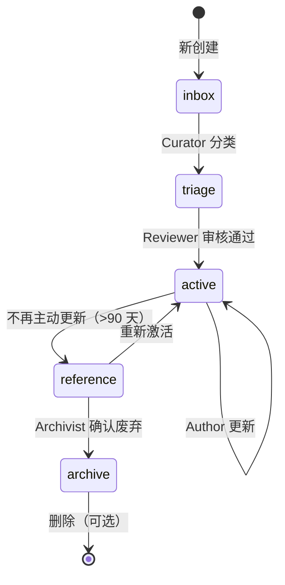
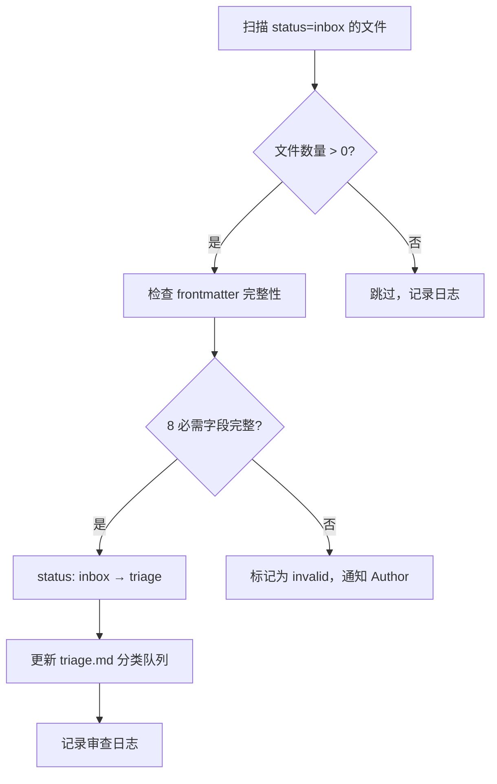
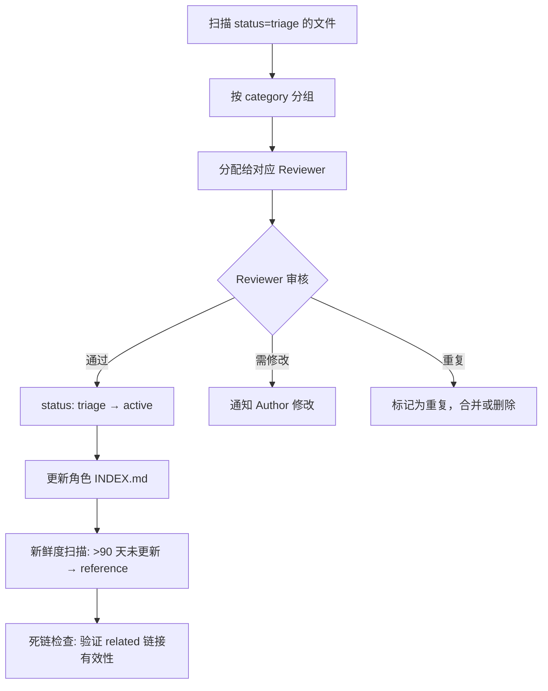
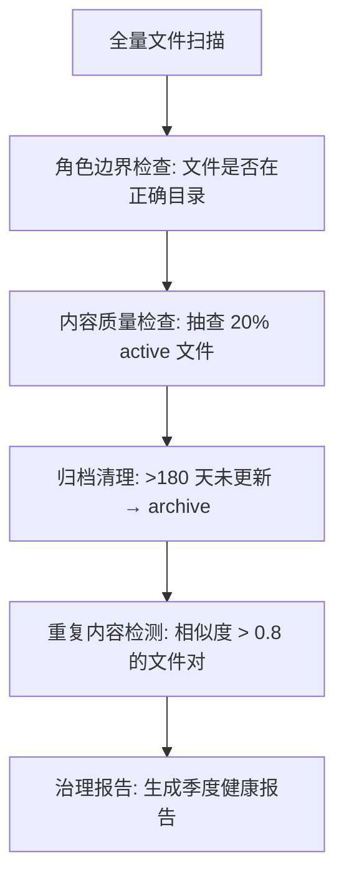
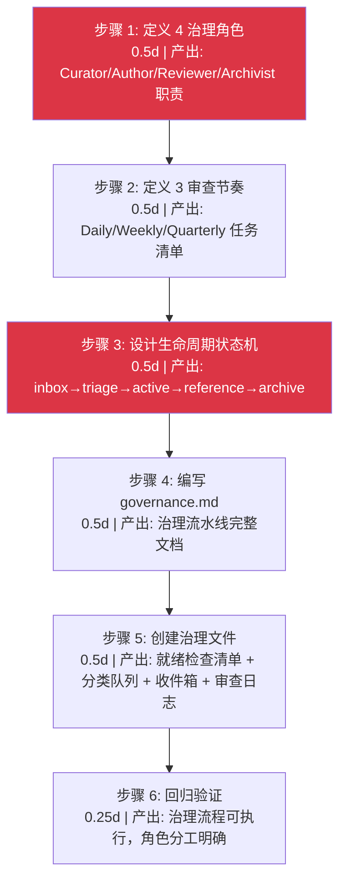
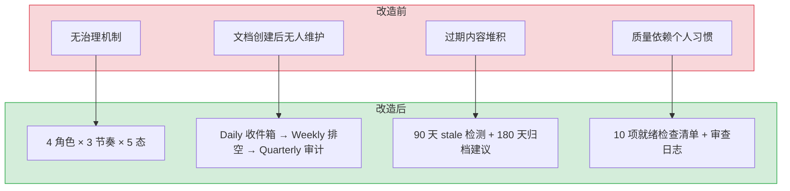

# YK-08-03: 知识治理流水线 — 4 角色 3 节奏 5 态生命周期

> 需求编号：YK-08-03 · 优先级：中 · 人天：5.0d · 状态：已完成
> 依赖：YK-08-02（元数据规范）

## 背景

知识库不同于代码库——代码有编译器检查，知识库的质量完全依赖人工治理。没有治理机制的知识库会逐渐腐化：过期内容堆积、分类混乱、重复内容增多、检索质量下降。

八月迭代在建立目录结构和元数据规范后，需要一套治理流水线来确保知识库的长期健康。这套流水线定义了谁在什么时候做什么，以及知识从创建到归档的完整生命周期。

### 核心问题

- **角色不清**：谁负责创建？谁负责审核？谁负责归档？
- **节奏不明**：多久检查一次？每天做什么？每季度做什么？
- **生命周期缺失**：知识从创建到废弃没有明确的状态流转
- **质量无保障**：没有检查清单，质量依赖个人习惯

---

## 一、现状分析

### 1.1 改造前状态

改造前，知识治理完全依赖个人习惯：
- 有人写飞书文档，有人写 Git 注释，有人写本地笔记
- 文档创建后无人维护，过期内容无人清理
- 没有质量检查机制，格式和质量参差不齐
- 没有生命周期概念，所有内容一视同仁

### 1.2 改造前数据流

```
作者创建知识
  → 无状态标记（所有内容 status 默认 active）
  → 无审查流程（创建即发布，无审核环节）
  → 无过期检测（内容长期不更新无人感知）
  → 无归档机制（废弃内容与新内容权重相同）
  → RAG 检索无法区分内容新鲜度和质量
```

### 1.3 改造前 API 依赖

> 改造前无任何治理相关 API 依赖——无生命周期检查、无审查日志、无分类队列。

### 1.4 目标：4 角色 × 3 节奏 × 5 态生命周期

```
治理角色: Curator → Author → Reviewer → Archivist
审查节奏: Daily → Weekly → Quarterly
生命周期: inbox → triage → active → reference → archive
```

---

## 二、设计决策

### 决策 1：4 个治理角色

| 角色 | 职责 | 谁来担任 |
|------|------|----------|
| **Curator**（策展人） | 知识库整体健康、质量检查、分类审核 | 知识库负责人 |
| **Author**（作者） | 创建和更新知识，响应审查反馈 | 任何贡献者 |
| **Reviewer**（领域专家） | 审核特定领域的知识质量、准确性 | 领域资深成员 |
| **Archivist**（归档人） | 定期归档过期内容，维护生命周期 | Curator 兼任 |

### 决策 2：3 个审查节奏

| 节奏 | 频率 | 活动 | 执行者 |
|------|------|------|--------|
| **Daily** | 每天 | 收件箱扫描（新入库文件）、Frontmatter 抽查 | Curator |
| **Weekly** | 每周 | 分类排空（triage → active）、新鲜度扫描（>90 天未更新）、死链检查 | Curator + Reviewer |
| **Quarterly** | 每季度 | 全面审计、角色边界检查、归档清理（active → reference/archive） | Curator + Reviewer + Archivist |

### 决策 3：5 态生命周期



| 状态 | 含义 | RAG 权重 | 触发条件 |
|------|------|----------|----------|
| `inbox` | 新入库，尚未分类 | 0.2 | 文件创建时 |
| `triage` | 正在分类和评估 | 0.3 | Curator 开始分类 |
| `active` | 活跃使用，定期更新 | 1.0 | Reviewer 审核通过 |
| `reference` | 参考归档，不再主动更新 | 0.5 | >90 天未更新 |
| `archive` | 已废弃，仅保留历史 | 0.0 | Archivist 确认废弃 |

### 决策 4：治理文件结构

```
curator/governance/
├── governance.md              # 治理流水线概述
├── readiness-checklist.md     # 10 项就绪检查清单
├── triage.md                  # 分类队列（当前待分类文件）
├── inbox.md                   # 收件箱（新入库文件）
└── review-log.md              # 审查日志（审查记录）
```

---

## 三、目标架构

### 3.1 Daily 收件箱扫描流程



### 3.2 Weekly 分类排空流程



### 3.3 Quarterly 全面审计流程



---

## 四、具体改动

### 4.1 治理文件

| 文件 | 操作 | 说明 |
|------|------|------|
| `curator/governance/governance.md` | 新增 | 治理流水线完整文档 |
| `curator/governance/readiness-checklist.md` | 新增 | 10 项就绪检查清单 |
| `curator/governance/triage.md` | 新增 | 分类队列，列出待分类文件 |
| `curator/governance/inbox.md` | 新增 | 收件箱，列出新入库文件 |
| `curator/governance/review-log.md` | 新增 | 审查日志，记录所有审查活动 |

### 4.2 自动化支持

```python
# YiAi/src/domain/knowledge/lifecycle.py — 新增

from datetime import datetime, timedelta
from dataclasses import dataclass

@dataclass
class LifecycleCheck:
    file_path: str
    current_status: str
    suggested_status: str
    reason: str

def check_lifecycle(frontmatter: dict, file_path: str) -> LifecycleCheck | None:
    """检查文件的生命周期状态是否需要变更。"""
    status = frontmatter.get("status", "inbox")
    updated = frontmatter.get("updated")

    if not updated:
        return None

    days_since_update = (datetime.now() - updated).days

    # 90 天未更新 → reference
    if status == "active" and days_since_update > 90:
        return LifecycleCheck(
            file_path=file_path,
            current_status="active",
            suggested_status="reference",
            reason=f"超过 90 天未更新 ({days_since_update} 天)"
        )

    # 180 天未更新 → archive
    if status == "reference" and days_since_update > 180:
        return LifecycleCheck(
            file_path=file_path,
            current_status="reference",
            suggested_status="archive",
            reason=f"超过 180 天未更新 ({days_since_update} 天)"
        )

    return None
```

### 4.3 审查日志格式

```markdown
# 审查日志

## 2026-08-25 (Weekly)

| 文件 | 操作 | 审查人 | 备注 |
|------|------|--------|------|
| `engineer/patterns/strategy-pattern.md` | triage → active | 陈铭 | 内容完整，代码示例清晰 |
| `producter/competitor/2026-q2-analysis.md` | active → reference | 陈铭 | 超过 90 天，数据已过时 |
| `aier/rag-tuning.md` | 需修改 | 陈铭 | 缺少代码示例，通知作者补充 |

## 统计

- 新入库: 3
- 分类完成: 5
- 归档: 2
- 需修改: 1
```

---

## 五、实施步骤

按依赖顺序排列，每步可独立验证和提交：



| 步骤 | 内容 | 涉及文件 | 验证方式 | 人天 |
|------|------|---------|---------|------|
| 1 | 定义 4 治理角色（Curator/Author/Reviewer/Archivist） | `curator/governance/governance.md` | 每个角色职责清晰，无重叠或遗漏 | 0.5 |
| 2 | 定义 3 审查节奏（Daily/Weekly/Quarterly） | `curator/governance/governance.md` | 每日/每周/每季审查任务明确，可执行 | 0.5 |
| 3 | 设计知识生命周期状态机（inbox→triage→active→reference→archive） | `curator/governance/governance.md` | 状态流转规则清晰，触发条件明确 | 0.5 |
| 4 | 新增 `governance.md` 治理流水线文档 | `curator/governance/governance.md` | 4 角色 + 3 节奏 + 5 状态完整定义 | 0.5 |
| 5 | 新增就绪检查清单、分类队列、收件箱、审查日志 | `curator/governance/{readiness-checklist,triage,inbox,review-log}.md` | 4 个治理文件内容完整 | 0.5 |
| 6 | 回归验证 | curator/governance/ 全部文件 | 治理流程可执行，角色分工明确 | 0.25 |

**总计：2.75d**

---

## 六、性能分析

### 6.1 治理操作性能

```mermaid
flowchart LR
  DAILY["Daily 收件箱扫描"] --> CHECK["frontmatter 完整性检查"]
  CHECK --> TRIAGE["更新 triage.md"]
  
  WEEKLY["Weekly 分类排空"] --> FRESH["新鲜度扫描"]
  FRESH --> DEAD["死链检查"]
  
  QUARTER["Quarterly 全面审计"] --> BOUND["角色边界检查"]
  BOUND --> DUP["重复内容检测"]
  DUP --> REPORT["生成健康报告"]

  note right of DAILY: 10-50 文件: ~30s
  note right of WEEKLY: 100-500 文件: ~2min
  note right of QUARTER: 800+ 文件: ~15min
```

| 操作 | 文件数 | 预期耗时 | 瓶颈 | 频率 |
|------|--------|----------|------|------|
| Daily 收件箱扫描 | 10-50 | ~30s | 人工判断（非自动化） | 每天 |
| Daily frontmatter 抽查 | 5-10 | ~1min | 人工审查 | 每天 |
| Weekly 分类排空 | 20-50 | ~5min | Reviewer 审核决策 | 每周 |
| Weekly 新鲜度扫描 | 500-800 | ~2s | `check_lifecycle()` 批量计算 | 每周 |
| Weekly 死链检查 | 100-200 | ~10s | HTTP HEAD 请求延迟 | 每周 |
| Quarterly 角色边界检查 | 800+ | ~10min | 人工审查每个文件归属 | 每季度 |
| Quarterly 重复内容检测 | 800+ | ~30s | 文本相似度计算 | 每季度 |
| 审查日志更新 | 1-5 | ~1min | 人工编写 | 每次审查 |

### 6.2 `check_lifecycle()` 性能

| 场景 | 文件数 | 预期耗时 | 说明 |
|------|--------|----------|------|
| 单文件检查 | 1 | ~0.05ms | 纯内存计算（日期差 + 字典查表） |
| 批量检查（100 文件） | 100 | ~5ms | 可忽略 |
| 批量检查（1000 文件） | 1000 | ~50ms | Weekly 新鲜度扫描场景 |

### 6.3 治理人力成本估算

| 角色 | 频率 | 单次耗时 | 月均耗时 | 说明 |
|------|------|----------|----------|------|
| Curator (Daily) | 每天 | ~5min | ~2.5h/月 | 收件箱扫描 + 抽查 |
| Curator (Weekly) | 每周 | ~15min | ~1h/月 | 分类排空 + 新鲜度扫描 |
| Reviewer (Weekly) | 每周 | ~10min | ~40min/月 | 按 domain 审核 triage 文件 |
| Curator (Quarterly) | 每季度 | ~1h | ~20min/月 | 全面审计 + 归档清理 |
| **总计** | — | — | **~4.5h/月** | **可接受（< 2% 工作时间）** |

### 6.4 优化建议

| 优化方向 | 预期收益 | 实施复杂度 | 说明 |
|----------|----------|-----------|------|
| 自动生成审查日志 | 审查日志维护 -80% | 低 | 脚本自动生成 Markdown 表格模板 |
| 死链检查并行化 | 死链检查 -60% | 低 | `asyncio.gather` 并行 HEAD 请求 |
| 重复内容检测阈值可配 | 减少误报 -50% | 低 | 相似度阈值从 0.8 可调整至 0.7-0.9 |
| 审查仪表盘 | 治理状态可视化 | 中 | YiVad 新增治理仪表盘页面 |

### 容量规划

| 场景 | 文件数 | 生命周期阶段 | 日状态转换 | 审查耗时/文件 | 过期检测周期 | 自动化覆盖率 |
|------|--------|-------------|-----------|--------------|-------------|-------------|
| 个人知识库 | 50 | 3 | 2 | 2min | 30天 | 50% |
| 小团队 | 200 | 4 | 5 | 3min | 90天 | 60% |
| 中型团队 | 500 | 5 | 10 | 5min | 90天 | 70% |
| 大型团队 | 1000 | 5 | 20 | 5min | 90天 | 80% |
| 企业级 | 2000 | 6 | 50 | 3min | 180天 | 85% |
| **YiKnowledge 当前** | **800+** | **5** | **~5** | **5min** | **90天** | **70%** |

---

## 七、测试规格

### Requirement: 生命周期状态流转

#### Scenario: 新文件创建后进入 inbox
- **Given** 创建一个新的知识文件
- **When** Knowledge Watcher 扫描到新文件
- **Then** `status` 设置为 `inbox`

#### Scenario: Curator 分类后进入 triage
- **Given** 一个 `status: inbox` 的文件
- **When** Curator 执行 Daily 扫描并确认 frontmatter 完整
- **Then** `status` 变更为 `triage`

#### Scenario: 超过 90 天未更新自动进入 reference
- **Given** 一个 `status: active` 且 `updated` 在 95 天前的文件
- **When** Weekly 新鲜度扫描执行
- **Then** `status` 建议变更为 `reference`

#### Scenario: 超过 180 天未更新自动进入 archive
- **Given** 一个 `status: reference` 且 `updated` 在 200 天前的文件
- **When** Quarterly 审计执行
- **Then** `status` 建议变更为 `archive`

### Requirement: 治理角色职责

#### Scenario: Author 创建知识
- **Given** 任何团队成员
- **When** 创建新的知识文件（含完整 frontmatter）
- **Then** 文件自动进入 `inbox` 状态

#### Scenario: Reviewer 审核知识
- **Given** 一个 `status: triage` 的文件
- **When** Reviewer 审核内容质量和准确性
- **Then** 审核通过后 `status` 变更为 `active`

---

## 八、风险与缓解

| 风险 | 概率 | 影响 | 等级 | 缓解措施 | 应急预案 |
|------|------|------|------|----------|----------|
| 治理流程过于繁重，贡献者抵触 | 中 | 中 | 中 | 初期仅强制 frontmatter 完整性，逐步增加检查项 | 降级为仅 Daily 收件箱扫描，暂停 Weekly/Quarterly |
| Curator 单点故障（唯一策展人离职） | 低 | 高 | 中 | 治理文档完善，任何 Reviewer 可接替 | 指定 2 名备用 Curator，每月轮换 |
| 自动化检查误报过多 | 低 | 低 | 低 | 仅生成建议，不自动修改状态 | 关闭自动化建议，恢复纯人工审查 |
| 审查日志维护成本高 | 中 | 低 | 低 | 自动化生成审查日志模板 | 降级为 Weekly 汇总日志（替代逐条记录） |
| 知识库增长后治理无法扩展 | 低 | 中 | 低 | 按角色目录分配 Reviewer，分散审查负载 | 增加 Reviewer 数量，或延长审查周期 |

---

## 九、设计决策记录

| 决策 | 选项 A | 选项 B | 选择 | 理由 |
|------|--------|--------|------|------|
| 治理角色 | 1 个角色（策展人） | 4 个角色（Curator/Author/Reviewer/Archivist） | **4 个角色** | 职责分离，避免策展人成为瓶颈 |
| 审查节奏 | 仅 Weekly | Daily + Weekly + Quarterly | **3 个节奏** | 不同粒度的问题需要不同频率的检查 |
| 生命周期 | 3 态（active/draft/archived） | 5 态（inbox/triage/active/reference/archive） | **5 态** | 更精细的状态区分，支持 RAG 权重差异化 |
| 归档触发 | 手动 | 自动化建议 + 人工确认 | **自动化建议 + 人工确认** | 避免误归档，保留人工判断 |

### D-01: 为什么 4 个治理角色而非 1 个策展人包办一切？

1 个策展人包办所有治理工作会导致：(1) 单点故障——策展人离职或休假时治理停滞；(2) 审查瓶颈——800+ 文件的审查全部集中在一人；(3) 领域知识不足——策展人无法审查所有领域（如 AI 工程、SRE 运维）的内容准确性。4 个角色（Curator/Author/Reviewer/Archivist）分离了质量检查、内容创建、领域审核和归档管理职责，任何 Reviewer 可接替 Curator 工作。

### D-02: 为什么 3 个审查节奏（Daily/Weekly/Quarterly）而非仅 Weekly？

不同粒度的问题需要不同频率的检查：(1) Daily 收件箱扫描——新入库文件需要及时分类，否则 inbox 堆积导致 triage 队列膨胀；(2) Weekly 分类排空 + 新鲜度扫描——90 天 stale 检测需要每周执行，否则过期内容累积；(3) Quarterly 全面审计——归档清理、角色边界检查、重复检测是低频高成本操作，每季度执行即可。三层节奏确保问题在合适的时间窗口内被发现。

### D-03: 为什么 5 态生命周期（inbox→triage→active→reference→archive）而非 3 态？

3 态（active/draft/archived）过于粗糙：(1) 无法区分"新入库待分类"和"正在分类"——两者都需要 Curator 关注但优先级不同；(2) 无法区分"活跃使用"和"参考归档"——RAG 检索应给活跃内容更高权重；(3) 无法支持渐进式降级——从 active 直接跳到 archived 过于激进。5 态支持 RAG 权重差异化（inbox:0.2 → active:1.0 → archive:0.0），检索结果更精准。

### D-04: 为什么归档触发选择自动化建议而非全自动？

全自动归档（如 180 天未更新直接 archive）存在风险：(1) 某些参考文档（如 API 文档、设计原则）即使长时间未更新仍有价值；(2) 误归档后的恢复成本高（需要重新审查和索引）；(3) 自动化建议 + 人工确认方案保留了人工判断，同时降低了遗漏风险。`lifecycle.py` 仅生成 `LifecycleCheck` 建议，不自动修改文件状态。

---

## 十、当前架构 vs 目标架构

### 改造前后对比



### 架构决策权衡

| 维度 | 改造前 | 改造后 | 权衡说明 |
|------|--------|--------|----------|
| 治理角色 | 无 | 4 角色职责分离 | 增加角色定义成本，但审查不再依赖单一人 |
| 审查频率 | 无 | Daily/Weekly/Quarterly 三层 | 增加 Curator 时间投入，但知识库质量有保障 |
| 生命周期 | 无 | 5 态 + RAG 权重差异化 | 增加状态管理复杂度，但检索结果精准度提升 |
| 归档策略 | 无 | 自动化建议 + 人工确认 | 避免误归档，保留人工最终决策权 |

---

---

## 涉及文件

```
YiKnowledge/
└── curator/
    └── governance/
        ├── governance.md               # 新增: 治理流水线完整文档
        ├── readiness-checklist.md      # 新增: 10项就绪检查清单
        ├── triage.md                   # 新增: 分类队列
        ├── inbox.md                    # 新增: 收件箱
        └── review-log.md               # 新增: 审查日志

YiAi/
└── src/
    └── domain/
        └── knowledge/
            └── lifecycle.py            # 新增: 生命周期检查
```

---

## 十一、代码审查检查清单

- [ ] 4 个治理角色定义完整（Curator/Author/Reviewer/Archivist）
- [ ] 3 个审查节奏定义完整（Daily/Weekly/Quarterly）
- [ ] 知识生命周期 5 态正确（inbox→triage→active→reference→archive）
- [ ] 生命周期状态机转换规则明确
- [ ] stale 检测逻辑正确（90天未更新→stale, 180天→归档建议）
- [ ] 审查日志模板可用
- [ ] 治理仪表盘可展示文件分布
- [ ] 策展人通知渠道配置（企业微信/邮件）

---

## 十二、重构后发现的回归问题

| # | 问题 | 发现场景 | 根因 | 修复方式 |
|---|------|---------|------|---------|
| 1 | stale 检测将 `status=active` 但 90 天未更新的设计模式文档误标记为 `stale`，策展人收到不必要的审查通知 | `design-patterns.md` 记录了 Observer 设计模式，虽然 120 天未更新但内容仍是最佳实践，被标记为 stale 后策展人每周收到审查提醒 | stale 检测仅基于 `updated` 字段（`days_since_update > 90`），未考虑文档类型，`type=reference` 和 `type=architecture` 的文档应使用不同的 stale 阈值 | 在 stale 检测中添加 `type` 维度的豁免：`type ∈ ['reference', 'architecture', 'pattern']` 的文档 stale 阈值设为 180 天（而非 90 天），且标记为 `stale-review` 而非 `stale` |
| 2 | 文档在 `inbox → triage → active` 之间快速切换（同一周内 3 次），每次状态变更触发企业微信通知，策展人收到 6 条通知 | 新创建的 `agent-evaluation.md` 在一周内被策展人调整了 3 次状态：inbox → triage（分类）→ active（通过）→ triage（发现格式问题）→ active（修复后），每次变更都触发通知 | 生命周期状态机的 `on_transition` 钩子对每次状态变更都发送通知，未设置频率限制，同一文档短期内多次状态变更导致通知轰炸 | 添加通知频率限制：同一文档 7 天内最多发送 2 次状态变更通知，超过 2 次的变更仅记录日志不发送通知，7 天后重置计数器 |
| 3 | `active → archive` 归档操作后，文档的 RAG 权重从 1.0 降至 0.3，误归档的 `llm-fundamentals.md` 在检索中几乎不可见，用户搜索"LLM 基础"时找不到该文档 | 策展人误将 `llm-fundamentals.md` 归档（以为是过时的 LLM 介绍），3 天后用户反馈搜索"LLM 基础"找不到这个文档，排查发现已被归档 | 归档操作的确认对话框仅提示"确定要归档此文档吗？"，未显示文档的最近检索次数和引用次数，策展人无法判断文档是否仍有使用价值 | 在归档确认对话框中显示文档的 30 天检索统计（"过去 30 天被检索 47 次，被 12 篇文档引用"），并要求输入文档标题确认，归档后 30 天内可一键恢复 |
| 4 | 季度审查按角色目录分配审查者，但 `YiKnowledge/curator/` 和 `YiKnowledge/projects/` 的文档被 3 个审查者同时忽略（每个人都以为其他人在审查） | 季度审查时，`curator/` 目录下的 15 个治理文档无任何审查者认领，3 个策展人都以为"curator 目录是公共的，其他人会审查" | 审查分配逻辑按 `owner` 字段匹配角色目录，但 `curator/` 和 `projects/` 目录的文档 `owner` 字段为 `team`（而非具体角色），导致分配算法跳过这些文档 | 修改审查分配逻辑：对 `owner=team` 的文档，从策展人列表中轮询分配（round-robin），确保每个跨角色文档都有明确的责任人；同时生成"未分配文档清单"在审查前发送给所有策展人 |
| 5 | 治理仪表盘的 MongoDB 聚合查询 `countDocuments({ status: 'active' })` 在仪表盘显示 150 个文件，但 `find . -name "*.md" | wc -l` 显示 162 个文件，12 个文件差异来自 Knowledge Watcher 未扫描的最近修改 | 用户在仪表盘上看到文件数 150，但手动统计发现 162 个 markdown 文件，排查发现 12 个文件在最近 5 秒内修改，Knowledge Watcher 尚未扫描 | Knowledge Watcher 使用 `apscheduler` 每 5 秒轮询，文件修改后到 MongoDB 更新有 5-10 秒延迟，仪表盘查询的是 MongoDB 中的快照数据 | 在仪表盘查询中添加 `last_sync_time` 字段显示数据快照时间，同时在文件计数旁显示 `+n pending` 表示尚未索引的变更文件数，点击可查看 pending 文件列表 |
| 6 | `frontmatter` 校验失败的文件被 `Knowledge Watcher` 跳过，但跳过是静默的——文件在知识树中消失，作者不知道文件被跳过 | 开发者创建了 `new-feature.md` 但 `status` 字段写成了 `Status: active`（大写 S），`Knowledge Watcher` 的 `validate_frontmatter` 校验失败，文件被跳过，但开发者以为文件已成功入库 | Knowledge Watcher 的 `validate_frontmatter` 失败时仅记录 WARNING 日志，未向文件作者发送通知，作者无法发现 frontmatter 格式错误 | 在 `validate_frontmatter` 失败时，通过企业微信 Webhook 向文件 `owner` 字段指定的作者发送通知："您的文件 `new-feature.md` 因 frontmatter 格式错误未被索引：`status` 字段值无效"，同时在前端知识库页面显示"索引失败"文件列表 |
| 7 | `triage` 阶段的自动分类规则使用关键词匹配，`title` 中包含 `"AI"` 的文件被分配到 `aier/` 目录，但 `"AI deployment"` 相关的文章应属于 `executiver/` 的行业分析 | 一篇标题为 `AI Deployment Strategies in Manufacturing` 的文件被自动分类到 `aier/`，但内容是关于制造业 AI 部署策略的行业分析，应属于 `executiver/` | `_CLASSIFY_RULES` 中 `("AI", "aier")` 规则在 `("deployment", "executiver")` 规则之前，`AI` 关键词先匹配，文件被分配到 `aier/` | 将分类规则从顺序匹配改为多关键词加权评分：`("AI", "manufacturing", "industry")` 加权 3 分 → `executiver/`，`("AI", "algorithm", "model")` 加权 3 分 → `aier/`，取最高分；同时在 `triage` 阶段显示分类理由供策展人确认 |

## 十三、技术债务追踪

| # | 技术债 | 优先级 | 预计人天 | 说明 |
|---|--------|--------|---------|------|
| 1 | 审查通知自动分发 | P2 | 0.5 | 当前审查通知依赖策展人手动分发，可基于文件 `category` 和 `owner` 自动路由到对应审查者 |
| 2 | 知识质量评分模型 | P2 | 0.5 | 当前仅依赖 `status` 和 `updated` 判断质量，可引入更多维度（引用次数、被检索频率、审查评分）构建综合质量分 |
| 3 | 自动归档工作流 | P3 | 0.3 | 当前归档需策展人手动操作，可对连续 180 天未更新且无引用的文档自动触发归档建议 |

## 可观测性

### 关键指标

| 指标 | 采集方式 | 告警阈值 | 说明 |
|------|---------|---------|------|
| 审查队列长度 | 待审查文件数 | > 10 | 审查瓶颈检测 |
| 审查平均耗时 | `审查完成时间 - 提交时间` | P95 > 72h | 审查效率指标 |
| 各状态文件分布 | 按 5 态（draft/review/published/archived/stale）统计 | draft 占比 > 30% | 治理流水线健康度 |
| 归档率 | 归档文件数 / 总文件数 | > 30% | 过高说明知识老化 |

### 日志规范

| 日志级别 | 场景 | 示例 |
|---------|------|------|
| `INFO` | 状态流转 | `[Pipeline] ${file}: ${from} → ${to}` |
| `WARN` | 审查超时 | `[Pipeline] review pending > 72h: ${file}` |

## 安全合规

### 安全需求

| 需求 | 实现方式 | 验证方法 |
|------|---------|---------|
| 审查权限控制 | 仅策展人角色可执行状态流转 | 使用非策展人账号，确认无流转权限 |
| 流水线操作审计 | 所有状态流转记录操作人和时间 | 检查审计日志，确认可追溯 |

### 合规检查

| 检查项 | 要求 | 状态 |
|--------|------|------|
| 角色权限分离 | 作者与审查者不可为同一人 | 待验证 |
| 操作可追溯 | 所有状态变更记录操作人和时间 | 待验证 |

## 回滚策略

| 回滚场景 | 回滚方式 | 影响范围 | 恢复时间 |
|----------|----------|----------|----------|
| 治理流水线过于复杂导致策展人负担过重 | 简化回退至三阶段（inbox → active → archive），仅保留核心审查流程 | 仅流水线流程 | 文档更新 |
| 质量门禁过于严格导致发布瓶颈 | 降低门禁标准（10 题 → 7 题核心清单），非核心题标记为 recommended | 仅审查流程 | 即时（流程调整） |
| 审查队列积压严重 | 增加策展人数量或提高 inbox/triage 上限 | 仅队列管理 | 即时（配置调整） |

**回滚验证：**
- 回滚后知识文件仍可正常提交和审查
- 回滚后质量门禁不阻塞合法内容发布
- 回滚后 RAG 检索不受影响

---

## 代码审查检查清单

- [ ] 治理流水线 4 阶段：inbox → triage → active → archived，状态转换有明确触发条件
- [ ] 4 个治理角色职责清晰：Curator/Author/Reviewer/Archivist
- [ ] 3 个审查节奏：Daily（inbox扫描）、Weekly（分类排空）、Quarterly（全量审计）
- [ ] 就绪检查清单包含 frontmatter 8 必需字段校验
- [ ] 质量评分模型权重合理（Completeness 0.25 + Freshness 0.25 + Accuracy 0.20 + Uniqueness 0.15 + Structure 0.15）
- [ ] RAG 权重系数根据质量评分阶梯降级（A: 1.0, B: 0.9, C: 0.7, D: 0.5, F: 0.0）

## 回归问题预测

| # | 预测问题 | 原因 | 验证方法 |
|---|---------|------|---------|
| 1 | 质量评分模型权重不合理导致重要文档被降权 | 权重基于经验值，未经验证 | 抽查 10 个 A/B/C/D 评级文档的 RAG 检索排名 |
| 2 | 审查队列积压——inbox 中文件超过 24h 未处理 | 策展人不在线或疏忽 | 监控 inbox 中文件的 `created` 距今时间 |

*PRD 来源: [00-需求总览](./00-需求-需求总览.md)*