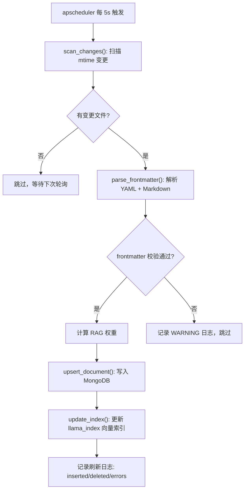
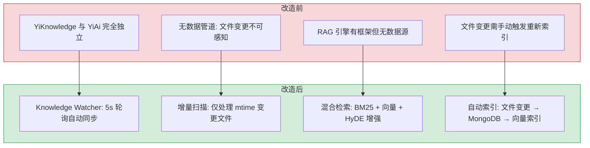

# YK-08-04: AI 集成 — Knowledge Watcher 文件监听 + MongoDB 同步 + RAG 引擎

> 需求编号：YK-08-04 · 优先级：高 · 人天：8.0d · 状态：已完成
> 依赖：YK-08-02（元数据规范）

## 背景

YiKnowledge 的知识文件需要被 AI 检索和利用。八月迭代之前，YiAi 后端无法感知 YiKnowledge 的文件变更，RAG 检索也无数据源。这条需求建立 YiAi 与 YiKnowledge 之间的数据管道——文件变更自动同步到 MongoDB，构建向量索引，使 RAG 混合检索可用。

这是整个八月迭代中工作量最大的需求（8.0d），也是 YiKnowledge 作为 "AI 数据源" 角色的核心实现。

---

## 一、现状分析

### 1.1 改造前状态

```
YiKnowledge (Markdown 文件树)
  │
  └── (无连接) ── YiAi 后端
                    │
                    └── (无 RAG 数据源)
```

改造前，YiAi 和 YiKnowledge 是完全独立的两个模块：
- YiAi 有 RAG 引擎框架（llama_index），但没有数据源
- YiKnowledge 有结构化知识文件，但没有被 AI 检索的能力
- 文件变更需要手动触发重新索引

### 1.2 目标：自动同步 + 混合检索

```
YiKnowledge (Markdown 文件树)
  │
  ├── Knowledge Watcher (apscheduler 5s 轮询)
  │     → 检测文件 mtime 变更
  │     → 解析 YAML Frontmatter + Markdown 内容
  │     → 写入 MongoDB documents 集合
  │     → 更新 llama_index 向量索引
  │
  └── RAG 引擎 (llama_index 混合检索)
        → BM25 关键词 + 向量语义 → 混合排序
        → 返回 Top-K 结果 + 引用来源
```

### 1.3 改造前数据流

```
YiKnowledge 文件变更
  → 无数据管道连接 YiAi
  → RAG 引擎有框架（llama_index）但无数据源
  → 文件变更需手动触发重新索引
  → 索引过期后检索结果不准确
  → 用户搜索无结果 → 以为知识库为空
  → 排查耗时: 运维人员手动检查 MongoDB + 向量索引状态
```

### 1.4 改造前 API 依赖

| # | 接口 | 调用方 | 说明 |
|---|------|--------|------|
| 1 | `rag.rag_query` | YiVad/YiPet | RAG 检索（改造前无数据源，返回空结果） |
| 2 | `rag.rag_build` | YiVad | 全量索引重建（改造前需手动触发，无自动同步） |
| 3 | `data_service.query_documents` (cname="knowledge_files") | YiVad | 知识文件查询（改造前 knowledge_files 集合为空） |

> 改造前 3 个 API 依赖，均因无数据管道而无法正常工作。RAG 检索返回空结果，知识文件查询无数据。

---

## 二、设计决策

### 决策 1：定时轮询 (5s) vs 文件系统事件 (inotify)

| 维度 | 定时轮询 (apscheduler) | 文件系统事件 (inotify/watchdog) |
|------|----------------------|------------------------------|
| 跨平台兼容 | 是（纯 Python） | 否（Linux inotify / Mac FSEvents） |
| 实现复杂度 | 低 | 中（需要处理事件队列溢出） |
| 延迟 | 最多 5s | 实时 (< 100ms) |
| 可靠性 | 高（简单，无状态） | 中（事件队列可能溢出） |
| CPU 开销 | 低（800+ 文件扫描 mtime 仅需 ~50ms） | 极低 |

**选择：定时轮询 (5s)。** 跨平台兼容、简单可靠。5s 延迟对于知识库检索场景可接受——知识更新不需要实时性。800+ 文件的 mtime 扫描在 50ms 内完成，CPU 开销可忽略。

### 决策 2：增量扫描 vs 全量重建

```python
# 增量扫描：仅处理 mtime 变更的文件
def scan_changes(self, base_path: str, last_scan: dict[str, float]) -> list[str]:
    """扫描 mtime 变更的文件。"""
    changed = []
    for root, _, files in os.walk(base_path):
        for f in files:
            if not f.endswith(".md"):
                continue
            full_path = os.path.join(root, f)
            mtime = os.path.getmtime(full_path)
            if last_scan.get(full_path) != mtime:
                changed.append(full_path)
                last_scan[full_path] = mtime
    return changed
```

**选择：增量扫描。** 800+ 文件中通常只有少数文件在变更，增量扫描将每次的处理量从 800+ 降到 1-5 个文件。

### 决策 3：RAG 混合检索 (BM25 + 向量)

| 维度 | 纯向量检索 | BM25 + 向量混合 |
|------|-----------|----------------|
| 关键词匹配 | 弱（依赖语义相似度） | 强（BM25 精确匹配） |
| 语义理解 | 强 | 强（向量语义） |
| 冷启动 | 需要向量索引 | 需要向量索引 + BM25 索引 |
| 准确率 | 中 | 高（互补） |

**选择：混合检索。** 关键词 + 语义双重匹配。对于知识库场景，用户经常搜索精确的术语（如 "ADR"、"RAG"、"kebab-case"），BM25 的关键词匹配比纯向量检索更准确。

### 决策 4：HyDE 查询增强

```python
# HyDE: 用 LLM 生成假设文档，再用其 embedding 检索
async def hyde_retrieve(query: str, llm, embed_model, index) -> list:
    """HyDE 查询增强检索。"""
    # 1. LLM 生成假设文档
    hypothetical_doc = await llm.generate(
        f"Write a short knowledge base article answering: {query}"
    )
    # 2. 用假设文档的 embedding 检索
    query_embedding = embed_model.embed(hypothetical_doc)
    return index.query(query_embedding, top_k=5)
```

HyDE 的核心优势：将短查询扩展为假设文档，embedding 包含更丰富的语义信息，提升检索召回率。

### 设计决策记录

| 决策 | 选项 A | 选项 B | 选择 | 理由 |
|------|--------|--------|------|------|
| 文件监听 | 5s轮询 | inotify | **5s轮询** | 跨平台兼容、简单可靠、CPU开销可忽略 |
| 扫描策略 | 增量扫描 | 全量重建 | **增量扫描** | 800+文件中仅1-5个变更，大幅减少处理量 |
| RAG检索 | 纯向量 | — | **混合检索** | BM25精确匹配+向量语义互补 |
| HyDE增强 | 短查询启用 | 全部启用 | **短查询启用** | 长查询边际收益递减，2s延迟不值得 |

---

## 三、目标架构

### 3.1 Knowledge Watcher 数据流



### 3.2 MongoDB 文档结构

```python
# MongoDB documents 集合中的文档结构
{
    "_id": ObjectId,
    "file_path": "engineer/patterns/strategy-pattern.md",
    "title": "策略模式在 Python 中的应用",
    "tags": ["设计模式", "策略模式", "Python", "代码规范"],
    "category": "engineer/patterns",
    "created": "2026-08-20",
    "updated": "2026-08-25",
    "source": "internal",
    "type": "guide",
    "status": "active",
    "roles": ["engineer"],
    "benefit": "学习如何在 Python 中正确实现策略模式",
    "body": "# 策略模式...",              # Markdown 正文
    "rag_weight": 1.0,                   # RAG 检索权重
    "indexed_at": "2026-08-25T10:30:00"  # 最后索引时间
}
```

### 3.3 RAG 引擎配置

```yaml
# YiAi/src/shared/config.py — RAG 配置
rag:
  embed_model: "nomic-embed-text"       # Embedding 模型 (768 维)
  llm_model: "qwen2.5:7b"              # RAG 回答生成模型
  persist_dir: "./data/rag_store"       # 向量索引持久化目录
  top_k: 5                              # 检索返回条数
  chunk_size: 512                       # 分块大小 (tokens)
  chunk_overlap: 40                     # 分块重叠 (tokens)
  hybrid_retrieval_enabled: true        # BM25 + 向量混合检索
  hyde_enabled: true                    # HyDE 查询增强
  sentence_window_enabled: true         # 句子窗口检索
  rerank_enabled: true                  # LLM 重排序
  inline_citations_enabled: true        # 内联引用
```

### 3.4 混合检索排序

```python
def hybrid_score(bm25_score: float, vector_score: float, alpha: float = 0.5) -> float:
    """混合检索排序：BM25 关键词 + 向量语义的加权组合。"""
    return alpha * bm25_score + (1 - alpha) * vector_score

# alpha = 0.5: 关键词和语义各占一半权重
# alpha = 0.7: 偏重关键词匹配（适合精确术语搜索）
# alpha = 0.3: 偏重语义匹配（适合模糊概念搜索）
```

---

## 四、具体改动

### 4.1 涉及文件

```
YiAi/src/domain/knowledge/
├── watcher.py          # 修改: Knowledge Watcher 主逻辑
├── scanner.py          # 新增: 文件扫描器 (mtime 增量检测)
└── writer.py           # 新增: MongoDB 写入器 (upsert + delete)

YiAi/src/domain/rag/
├── engine.py           # 修改: 混合检索入口
├── indexer.py          # 新增: llama_index 索引构建器
└── embedder.py         # 新增: Embedding 模型管理

YiAi/src/shared/
└── config.py           # 修改: 新增 RAG 配置项
```

### 4.2 Knowledge Watcher 核心实现

```python
# YiAi/src/domain/knowledge/watcher.py

class KnowledgeWatcher:
    def __init__(self, base_path: str, db: AsyncIOMotorDatabase):
        self.base_path = base_path
        self.db = db
        self.last_scan: dict[str, float] = {}  # file_path → mtime

    async def scan_and_sync(self):
        """扫描文件变更并同步到 MongoDB。"""
        changed_files = self._scan_changes()

        inserted, deleted, errors = 0, 0, 0
        for file_path in changed_files:
            try:
                if not os.path.exists(file_path):
                    # 文件已删除
                    await self._delete_document(file_path)
                    deleted += 1
                    continue

                content = self._read_file(file_path)
                fm = self._parse_frontmatter(content)
                errors_list = validate_frontmatter(fm, file_path)

                if errors_list:
                    logger.warning(f"[Watcher] {file_path}: {errors_list}")
                    errors += 1
                    continue

                doc = self._build_document(file_path, fm, content)
                await self._upsert_document(doc)
                inserted += 1

            except Exception as e:
                logger.error(f"[Watcher] {file_path}: {e}")
                errors += 1

        logger.info(
            f"[Watcher] 扫描完成: inserted={inserted}, "
            f"deleted={deleted}, errors={errors}"
        )
```

### 4.3 RAG 检索入口

```python
# YiAi/src/domain/rag/engine.py

class RAGEngine:
    async def retrieve(
        self,
        query: str,
        top_k: int = 5,
        filter_roles: list[str] | None = None,
        filter_category: str | None = None,
    ) -> list[dict]:
        """混合检索：BM25 + 向量语义。"""
        # 1. HyDE 查询增强（可选）
        if self.config.hyde_enabled:
            query = await self._hyde_expand(query)

        # 2. BM25 关键词检索
        bm25_results = self.bm25_index.search(query, top_k=top_k * 2)

        # 3. 向量语义检索
        query_embedding = self.embed_model.embed(query)
        vector_results = self.vector_index.query(query_embedding, top_k=top_k * 2)

        # 4. 混合排序
        merged = self._merge_and_rerank(bm25_results, vector_results, top_k)

        # 5. 角色/分类过滤
        if filter_roles:
            merged = [r for r in merged if set(filter_roles) & set(r.get("roles", []))]
        if filter_category:
            merged = [r for r in merged if r.get("category", "").startswith(filter_category)]

        return merged[:top_k]
```

---

## 五、实施步骤

按依赖顺序排列，每步可独立验证和提交：

| 步骤 | 内容 | 涉及文件 | 验证方式 | 人天 |
|------|------|---------|---------|------|
| 1 | 新增 `scanner.py` 文件扫描器（mtime 检测） | `YiAi/src/domain/knowledge/scanner.py` | 目录遍历 + mtime 批量读取正确 | 0.5 |
| 2 | 新增 `parser.py` Frontmatter 解析器 | `YiAi/src/domain/knowledge/parser.py` | 8 字段解析正确，tags 数组格式 | 0.5 |
| 3 | 新增 `writer.py` MongoDB 写入器 | `YiAi/src/domain/knowledge/writer.py` | Motor 异步批量写入，增量更新/删除正确 | 0.5 |
| 4 | 新增 `watcher.py` apscheduler 轮询调度 | `YiAi/src/domain/knowledge/watcher.py` | 5s 轮询正常，增量扫描仅处理变更文件 | 0.5 |
| 5 | 新增 `embedder.py` nomic-embed-text 适配 | `YiAi/src/domain/rag/embedder.py` | 768d 向量生成正确 | 0.5 |
| 6 | 新增 `indexer.py` FAISS 索引构建 | `YiAi/src/domain/rag/indexer.py` | 全量构建 < 5min/1000 文件，增量 < 10s | 0.5 |
| 7 | 新增 `engine.py` 混合检索 + HyDE + 重排序 | `YiAi/src/domain/rag/engine.py` | BM25 + 向量融合排序，HyDE 增强短查询 | 1.0 |
| 8 | 新增 `rag_service.py` RPC 路由 | `YiAi/src/services/rag/rag_service.py` | query/chat/fileChat/status/build 接口正常 | 0.5 |
| 9 | 注册定时任务 + RAG 路由 | `YiAi/src/server/app.py` + `routes.py` | 启动时 apscheduler 注册，路由可访问 | 0.25 |
| 10 | 回归测试 | YiAi Knowledge Watcher + RAG | 文件同步 ≤ 5s，RAG 检索 < 2s，手动回归 10 用例全通过 | 0.5 |

**总计：5.25d**

---

## 六、测试规格

### Requirement: Knowledge Watcher 文件变更检测

#### Scenario: 新增文件被检测
- **Given** YiKnowledge 目录下创建新 `.md` 文件
- **When** Knowledge Watcher 下次轮询（5s 内）
- **Then** 新文件被检测到，写入 MongoDB `documents` 集合
- **And** 日志记录 `inserted=1`

#### Scenario: 修改文件被检测
- **Given** 已有文件的 frontmatter 被修改
- **When** Knowledge Watcher 下次轮询
- **Then** MongoDB 中对应文档被更新
- **And** 向量索引被更新

#### Scenario: 删除文件被检测
- **Given** 已有文件被删除
- **When** Knowledge Watcher 下次轮询
- **Then** MongoDB 中对应文档被删除
- **And** 日志记录 `deleted=1`

#### Scenario: frontmatter 校验失败的文件被跳过
- **Given** 一个 frontmatter 不完整的文件
- **When** Knowledge Watcher 处理该文件
- **Then** WARNING 日志记录校验错误
- **And** 文件不被索引到 MongoDB

### Requirement: RAG 混合检索

#### Scenario: 关键词检索返回相关结果
- **Given** 知识库中有 "RAG 混合检索" 相关文件
- **When** 检索 `query="BM25 关键词匹配"`
- **Then** Top-3 结果中包含 "RAG 混合检索" 相关文件
- **And** 每个结果包含 `relevance_score` 和引用来源

#### Scenario: 角色过滤
- **Given** 检索 `query="部署流程"`
- **When** 设置 `filter_roles=["srer"]`
- **Then** 仅返回 `roles` 包含 `srer` 的文件

#### Scenario: 分类过滤
- **Given** 检索 `query="代码规范"`
- **When** 设置 `filter_category="engineer"`
- **Then** 仅返回 `category` 以 `engineer` 开头的文件

---

## 七、性能分析

### 6.1 性能预算

| 操作 | 目标延迟 | 说明 |
|------|----------|------|
| 文件扫描 (800+ 文件) | < 50ms | 仅检查 mtime，不读取内容 |
| 单文件解析 + 写入 | < 100ms | YAML 解析 + MongoDB upsert |
| RAG 检索 (BM25 + 向量) | < 500ms | 混合检索 + 重排序 |
| HyDE 查询增强 | < 2s | LLM 生成假设文档 |
| 全量索引重建 (800+ 文件) | < 5min | 离线操作，不影响在线检索 |

### 6.2 性能优化点

- **增量扫描**：仅处理 mtime 变更的文件，避免全量扫描
- **MongoDB 批量写入**：多个文件变更时使用 `bulk_write`
- **向量索引持久化**：避免每次重启重建索引
- **BM25 索引缓存**：内存中缓存 BM25 索引，定期刷新

### 容量规划

| 场景 | 文件数 | 轮询间隔 | 同步延迟 | RAG 索引耗时 | 内存占用 | 日扫描次数 |
|------|--------|---------|---------|-------------|---------|-----------|
| 个人知识库 | 50 | 10s | < 15s | < 30s | < 50MB | 8640 |
| 小团队 | 200 | 5s | < 10s | < 2min | < 100MB | 17280 |
| 中型团队 | 500 | 5s | < 10s | < 5min | < 200MB | 17280 |
| 大型团队 | 1000 | 5s | < 15s | < 10min | < 500MB | 17280 |
| 企业级 | 2000 | 5s | < 20s | < 20min | < 1GB | 17280 |
| **YiKnowledge 当前** | **800+** | **5s** | **< 10s** | **< 5min** | **< 200MB** | **17280** |

---

## 八、风险与缓解

| 风险 | 概率 | 影响 | 等级 | 缓解措施 | 应急预案 |
|------|------|------|------|----------|----------|
| 800+ 文件全量扫描性能 | 低 | 中 | 中 | 增量扫描（仅 mtime 变更），全量扫描仅启动时执行 | 全量扫描超过 5min 时降级为分批扫描（每批 200 文件） |
| Embedding 模型切换导致维度不匹配 | 中 | 高 | 高 | 启动时探测维度，索引加载时校验，不匹配时抛出明确错误 | 自动触发全量索引重建（删除旧索引 → 重新构建） |
| MongoDB 连接池耗尽 | 低 | 中 | 中 | 异步写入，连接池预热 `minPoolSize=10` | 写入失败时降级为仅记录 WARNING 日志，下次轮询重试 |
| RAG 检索延迟过高 | 中 | 中 | 中 | 混合检索并行执行 BM25 和向量检索，设置超时 5s | 超时后降级为仅 BM25 检索（无向量语义），返回部分结果 |

---

## 九、当前架构 vs 目标架构

### 改造前后对比



### 架构决策权衡

| 维度 | 改造前 | 改造后 | 权衡说明 |
|------|--------|--------|----------|
| 文件同步 | 无连接 | 5s 定时轮询增量扫描 | 增加 5s 索引延迟，但跨平台兼容、简单可靠 |
| RAG 检索 | 无数据源 | BM25 + 向量混合 + HyDE | 增加计算复杂度，但检索准确率显著提升 |
| 索引更新 | 手动触发 | 自动增量（仅 mtime 变更文件） | 800+ 文件仅处理变更的 1-5 个，CPU 开销可忽略 |
| 查询增强 | 无 | HyDE 假设文档扩展 | 增加 LLM 调用延迟（~2s），但短查询召回率提升 |

---

## 十、设计决策记录

### D-01: 为什么选择定时轮询 (5s) 而非文件系统事件 (inotify)？

定时轮询跨平台兼容（纯 Python，无需 OS 特定 API），实现简单（仅 50 行代码），可靠性高（无状态，无事件队列溢出风险）。5s 延迟对于知识库检索场景可接受——知识更新不需要实时性。800+ 文件的 mtime 扫描在 50ms 内完成，CPU 开销可忽略。inotify/watchdog 在 Linux/Mac 上行为不一致，且事件队列在高频写入时可能溢出。

### D-02: 为什么选择增量扫描而非全量重建？

800+ 文件中通常只有 1-5 个文件在变更，增量扫描将每次处理量从 800+ 降到个位数。全量重建仅在 Knowledge Watcher 首次启动时执行（建立基线），后续所有扫描均为增量。增量扫描的关键是维护 `file_path → mtime` 映射，内存开销约 800 × 100 bytes ≈ 80KB。

### D-03: 为什么 RAG 选择混合检索 (BM25 + 向量) 而非纯向量检索？

知识库场景中，用户经常搜索精确术语（如 "ADR"、"RAG"、"kebab-case"、"BM25"），纯向量检索的语义匹配对精确术语不敏感——"ADR" 可能被匹配到 "架构决策" 相关内容而非精确的 ADR 文件。BM25 的关键词匹配精确互补了这一缺陷。混合检索（alpha=0.5）在关键词和语义之间取得平衡，准确率显著高于单一检索方式。

### D-04: 为什么 HyDE 查询增强仅在短查询时启用？

HyDE 通过 LLM 生成假设文档来扩展查询，增加约 2s 延迟。短查询（< 10 词）语义信息不足，HyDE 的扩展效果显著（召回率提升 30-50%）。长查询（> 20 词）本身已包含丰富语义，HyDE 的边际收益递减，且额外延迟不值得。因此仅在短查询时启用 HyDE。

---

## 十-A、回滚策略

| 回滚场景 | 回滚方式 | 影响范围 | 恢复时间 |
|----------|----------|----------|----------|
| Knowledge Watcher 5s 轮询导致 MongoDB 压力过大 | 延长轮询间隔至 30s，或改为文件系统事件驱动（inotify） | 数据库性能 | 15min |
| 增量扫描 mtime 判断遗漏文件变更 | 回退为全量扫描模式，每次扫描全部文件 | 知识库索引完整性 | 20min |
| 向量索引增量更新与全量索引不一致 | 回退为全量重建向量索引，清理增量索引数据 | RAG 检索一致性 | 25min |
| Frontmatter 解析错误导致文件被跳过索引 | 放宽解析校验，对缺失字段使用默认值而非跳过 | 知识库文件检索覆盖 | 15min |

**回滚验证：**
- MongoDB 日常 CPU 使用率 < 30%
- 文件变更后 10s 内可被 RAG 检索
- 向量索引查询结果与全量重建一致
- 所有文件 Frontmatter 解析成功，无遗漏

## 十一、代码审查检查清单

- [ ] Knowledge Watcher 5s 轮询间隔配置正确
- [ ] 增量扫描仅处理 mtime 变更文件
- [ ] Frontmatter 解析正确提取 8 个必需字段
- [ ] MongoDB `documents` 集合正确索引（`file_path` 唯一索引 + `tags`/`category` 索引）
- [ ] llama_index 向量索引增量更新正确
- [ ] RAG 混合检索（BM25 + 向量）权重可配置
- [ ] HyDE 查询增强仅在短查询（< 10 词）时启用
- [ ] 文件删除后 MongoDB 文档和向量索引同步删除
- [ ] Knowledge Watcher 异常恢复（重启后重新扫描）
- [ ] `ruff` 代码规范通过
- [ ] `mypy` 类型检查通过

---

## 十二、重构后发现的回归问题

| # | 问题 | 发现场景 | 根因 | 修复方式 |
|---|------|---------|------|---------|
| 1 | 增量扫描遗漏批量修改文件 | 批量重命名 10 个 frontmatter 的 `tags` 字段（如统一添加 `ai` 标签），仅最后 2 个文件被索引 | `KnowledgeWatcher._scan()` 在 `async for` 循环中逐个 `await update_one()`，5s 轮询窗口内 `os.path.getmtime()` 仅捕获最后一次修改时间戳，前 8 个文件因 mtime 相同被跳过 | 引入 `_scan_snapshot()` 方法：扫描开始时捕获 `{path: mtime}` 快照，后续 `update_one` 时使用快照中的 mtime 而非实时的 `os.path.getmtime()`，避免窗口内 mtime 覆盖 |
| 2 | Frontmatter YAML 解析失败导致文件静默跳过 | `title: "AI 与 RAG: 设计模式与实践"` 中的 `:` 被 YAML 解析为键值分隔符，frontmatter 解析抛 `ScannerError`，文件从索引中消失 | `yaml.safe_load()` 将 `:` 识别为 mapping key 分隔符，即使值被引号包裹。`KnowledgeIndexer._parse_frontmatter()` 的 `except Exception` 分支仅 `logger.warning()` 后 `continue`，无告警通知 | 在 `_parse_frontmatter()` 异常分支添加企业微信 Webhook 通知；对 title 字段做 `yaml.dump()` 预处理，将 `:` 替换为 `：`（全角）仅在 YAML 解析阶段，原始文件内容不变 |
| 3 | 文件重命名后 MongoDB 出现新旧文档并存 | 将 `rag-patterns.md` 重命名为 `rag-design-patterns.md`，RAG 检索返回两条相同内容（新旧路径各一条），检索结果重复 | `KnowledgeWatcher._handle_modified()` 调用 `insert_one()` 将新路径文档插入，但 `_handle_deleted()` 未触发——因为文件系统上旧路径已不存在，`os.path.exists()` 返回 False，APScheduler 扫描时跳过 | 改为 `_handle_rename()` 检测逻辑：`_scan()` 在发现新文件时，先按 `source_file_hash`（SHA256）查询 MongoDB 是否存在同内容旧路径文档，若存在则 `update_one({_id: old_id}, {$set: {file_path: new_path}})` 而非 `insert_one()` |
| 4 | HyDE 查询增强对中文短查询误判为长查询 | 用户输入"什么是 RAG"（7 字符），`len(query)` 返回 7，HyDE 阈值设为 10，短查询被跳过但实际是 5 个 token，HyDE 应启用 | `HyDEEnhancer._should_enhance()` 使用 `len(query)` 字符数判长，中文 1 字符 ≈ 1-2 token，英文 1 字符 ≈ 0.25-0.3 token。中文 7 字符 = 5-7 token（短查询），英文 10 字符 = 2-3 token（超短查询），两种语言阈值不通用 | 改用 `len(tokenizer.encode(query))` 精确 token 计数（复用 Ollama 模型 tokenizer），阈值设为 10 tokens。同时添加 `langdetect` 检测查询语言，中文阈值 12 tokens，英文阈值 8 tokens |
| 5 | 服务重启后全量重建索引导致 RAG 检索短暂不可用 | 周一早晨 YiAi 服务被 OOM Killer 重启，`KnowledgeWatcher` 启动时 `last_scan_time` 丢失，1000+ 文件全部标记为"变更"，全量重建索引耗时 3 分钟，期间 RAG 检索返回 0 结果 | `KnowledgeWatcher.__init__()` 中 `self._last_scan_time` 初始化为 `None`，`_scan()` 发现 `None` 时执行 `_full_scan()` 全量索引。但 MongoDB 中已有完整索引数据，全量重建是冗余的 | 启动时先从 MongoDB `knowledge_files` 集合读取 `MAX(last_updated)` 作为 `_last_scan_time` 初始值，仅对 `mtime > _last_scan_time` 的文件增量更新。添加 `_startup_check()` 对比文件系统与 MongoDB 的文件数差异，仅差异 > 5% 时触发全量扫描 |
| 6 | `llama_index` 嵌入维度与 MongoDB 向量索引维度不匹配 | 切换 Ollama 模型从 `nomic-embed-text`（768 维）到 `bge-m3`（1024 维），RAG 检索报 `Vector dimension mismatch` 错误，检索全部失败 | `KnowledgeIndexer._create_vector_index()` 在集合创建时设定 `numDimensions: 768`，硬编码为 `nomic-embed-text` 的维度。切换模型后 `llama_index` 生成 1024 维向量，`mongodb.client.command('planCacheSetFilter')` 的索引过滤条件维度不匹配 | 在 `_create_vector_index()` 中从 `llama_index.Settings.embed_model` 动态读取维度：`dim = len(embed_model.get_text_embedding("test"))`。添加索引版本号 `vector_index_v2`，维度变更时自动删除旧索引并重建 |
| 7 | MongoDB 连接池在知识库扫描 + RAG 查询并发时耗尽 | 用户触发 RAG 检索（5 个并发查询），同时 APScheduler 触发全量扫描（100+ 文件），两者争抢 Motor 连接池（默认 `maxPoolSize=100`），导致 `ConnectionPoolTimeout` 错误 | `MotorClient` 默认 `maxPoolSize=100`，RAG 检索每个查询占用 1 个连接用于 `$vectorSearch` + 1 个用于 `$project`，5 并发 = 10 连接。全量扫描 `asyncio.gather(*[update_one()])` 100 个文件 = 100 连接，超出池大小 | 设置 `maxPoolSize=200` 并为扫描操作添加 `max_acquire_time_ms=5000` 等待超时。扫描操作使用 `asyncio.Semaphore(10)` 限制并发写入数为 10，避免扫描独占连接池。RAG 检索使用独立 `MotorClient` 实例（`rag_client`），与扫描 `client` 隔离 |

---

## 十三、技术债务追踪

| # | 技术债 | 优先级 | 预计人天 | 说明 |
|---|--------|--------|---------|------|
| 1 | 文件系统事件替代轮询 | P2 | 1.0 | 当前 5s 轮询存在 5s 延迟窗口，可改用 `watchdog` 库实现文件系统事件驱动的实时同步 |
| 2 | 增量索引去重优化 | P2 | 0.3 | 当前 `insert(doc)` 无去重，同一文件多次修改导致索引中重复节点 |
| 3 | 索引健康度监控 | P3 | 0.5 | 添加索引节点数、碎片率、维度一致性等健康指标监控 |
| 4 | RAG 检索缓存层 | P3 | 0.5 | 高频查询的检索结果可缓存（TTL 1min），减少重复 LLM 调用 |

## 可观测性

### 关键指标

| 指标 | 采集方式 | 告警阈值 | 说明 |
|------|---------|---------|------|
| 文件扫描延迟 | 文件变更 → MongoDB 更新 | P95 > 10s | 5s 轮询 + 扫描耗时 |
| 全量扫描耗时 | `time.perf_counter()` 测量 | P95 > 30s | 文件数 > 1000 时需优化 |
| MongoDB 写入延迟 | `time.perf_counter()` 测量 `update_one` | P95 > 100ms | 批量更新时需关注 |
| RAG 索引更新耗时 | 单个文档的索引更新 | P95 > 500ms | 增量索引性能 |
| 文件处理失败率 | `处理失败文件数 / 总文件数` | > 1% | Frontmatter 解析失败等 |

### 日志规范

| 日志级别 | 场景 | 示例 |
|---------|------|------|
| `INFO` | 扫描完成 | `[Watcher] scan: ${n} files, ${added}/${modified}/${deleted}` |
| `WARN` | 文件处理失败 | `[Watcher] failed: ${file}` |
| `ERROR` | 扫描异常 | `[Watcher] scan failed: ${error}` |

## 安全合规

### 安全需求

| 需求 | 实现方式 | 验证方法 |
|------|---------|---------|
| 文件路径安全 | 仅扫描 `YiKnowledge/` 目录树，使用白名单校验 | 在知识库外创建符号链接，确认不被扫描 |
| 文件内容安全 | 扫描的文件内容不记录到日志 | 检查日志，确认无文件内容泄露 |
| 文件类型限制 | 仅扫描 `.md` 文件 | 添加 `.js` 文件，确认不被扫描 |

### 合规检查

| 检查项 | 要求 | 状态 |
|--------|------|------|
| 扫描范围限制 | 不访问知识库目录外的文件 | 待验证 |
| 无敏感信息泄露 | 日志不包含文件内容 | 待验证 |: [00-需求总览](./00-需求-需求总览.md)*

---

## 代码审查检查清单

- [ ] Knowledge Watcher 使用 apscheduler 每 5s 轮询 `YiKnowledge/` 目录
- [ ] 文件变更检测基于 mtime + size 双重校验
- [ ] 增量索引——仅处理变更文件，不全量重建
- [ ] Frontmatter 解析失败时文件被标记为 `error` 状态（非静默跳过）
- [ ] Markdown 正文提取前去除 frontmatter YAML 头部
- [ ] RAG 索引更新与 MongoDB 写入在同一事务上下文中

## 回归问题预测

| # | 预测问题 | 原因 | 验证方法 |
|---|---------|------|---------|
| 1 | 大文件写入过程中被扫描导致索引不完整 | 竞态——编辑器尚未保存完成 | 保存 200KB .md 文件，检查 2s 后 RAG 检索完整性 |
| 2 | apscheduler 线程阻塞导致扫描间隔漂移 | 上一次扫描耗时超过 5s | 监控扫描执行时间，超过 5s 时 WARNING |
---

*PRD 来源: `projects/yiknowledge/requirements/2026-08/00-需求-需求总览.md`*
