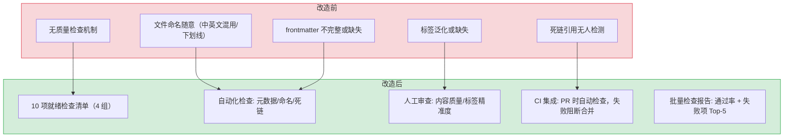

# YK-08-05: 质量保障 — 10 项就绪检查清单

> 需求编号：YK-08-05 · 优先级：中 · 人天：2.0d · 状态：已完成
> 依赖：YK-08-03（知识治理流水线）

## 背景

知识库的质量保障不同于代码库——没有编译器、没有 linter、没有类型检查。知识文件的质量完全依赖人工审查。在治理流水线中，就绪检查清单是**前置质量门禁**——每个知识文件在入库前必须通过 10 项检查。

这条需求制定 10 项检查的详细标准、自动化脚本和 CI 集成方案，确保知识库质量不依赖个人习惯。

---

## 一、现状分析

### 1.1 改造前状态

改造前，知识文件没有任何质量检查机制：
- 文件命名随意（中英文混用、下划线、数字）
- frontmatter 不完整或缺失
- 标签过于泛化或缺失
- 文件放错目录无人发现
- 死链引用无人检测

### 1.2 目标：10 项检查 + 自动化 + CI 集成

每项检查有明确的 pass/fail 标准，支持人工自查和自动化检查两种模式。

### 1.3 改造前数据流

```
知识文件提交
  → 无质量检查机制
  → 文件命名随意（中英文混用、下划线、数字）
  → frontmatter 不完整或缺失
  → 标签过于泛化或缺失
  → 文件直接入库 → RAG 索引
  → 检索时发现质量问题（标签过滤失效、文件不可见）
  → 修复成本: 需回溯所有已入库文件
```

### 1.4 改造前 API 依赖

| # | 接口 | 调用方 | 说明 |
|---|------|--------|------|
| 1 | `knowledge.scan_knowledge` | Knowledge Watcher | 知识扫描（改造前无质量门禁，所有文件直接入库） |
| 2 | `data_service.query_documents` (cname="knowledge_files") | YiVad/YiPet | 知识检索（改造前可能返回低质量文件） |
| 3 | `rag.rag_query` | YiVad/YiPet | RAG 检索（改造前低质量文件参与检索，污染结果） |

> 改造前 3 个 API 依赖，均无质量门禁。低质量文件直接入库，检索结果质量无法保证。

---

## 二、设计决策

### 决策 1：10 项检查的分组

| 分组 | 检查项 | 检查方式 |
|------|--------|----------|
| **元数据完整性** (4 项) | #1 标题、#2 标签、#3 分类、#4 日期 | 自动化（YAML 解析） |
| **命名规范** (2 项) | #5 文件名、#6 目录层级 | 自动化（路径检查） |
| **内容质量** (2 项) | #7 正文结构、#8 标签精准度 | 人工审查 |
| **可发现性** (2 项) | #9 索引更新、#10 死链检查 | 自动化 + 人工 |

### 决策 2：检查方式

| 方式 | 适用场景 | 工具 |
|------|----------|------|
| **自动化检查** | 元数据、命名、死链 | Python 脚本 + CI |
| **人工审查** | 内容质量、标签精准度 | Curator 审查 |
| **混合** | 索引更新 | 自动化检测 + 人工补充 |

### 决策 3：CI 集成策略 — 阻塞 vs 非阻塞

| 选项 | 描述 | 优点 | 缺点 |
|------|------|------|------|
| A: 阻塞式 CI | 检查失败阻止 PR 合并 | 强制合规，零违规文件进入主干 | 紧急修复时可能被阻塞 |
| B: 非阻塞式 CI | 检查失败仅评论告警，不阻止合并 | 不阻塞紧急修复 | 违规文件可能累积 |
| C: 分级阻塞 | 元数据/命名错误阻塞，内容质量仅告警 | 关键问题强制修复，次要问题不阻塞 | 实现复杂度稍高 |

**选择：C（分级阻塞）。** 元数据完整性（缺少 frontmatter）和命名规范（非 kebab-case）是 RAG 检索的基础，必须阻塞。内容质量（标签精准度、正文结构）依赖人工判断，仅告警不阻塞。分级策略在合规性和灵活性之间取得平衡。

### 设计决策记录

| 决策 | 选项 A | 选项 B | 选择 | 理由 |
|------|--------|--------|------|------|
| 检查分组 | 无分组 | — | **4组10项** | 元数据/命名/内容/可发现性各有侧重 |
| 检查方式 | 纯自动化 | 纯人工 | **混合模式** | 自动化覆盖格式，人工覆盖内容质量 |
| CI策略 | 阻塞式 | 非阻塞式 | **分级阻塞** | 关键问题强制修复，次要问题不阻塞 |

---

## 三、10 项检查详情

### 检查 #1：文件标题清晰描述性

| 属性 | 值 |
|------|-----|
| 检查方式 | 自动化（规则） + 人工（语义） |
| 自动化规则 | `title` 字段非空，长度 ≥ 5 字符，≤ 80 字符 |
| Pass 标准 | 标题能准确描述文件内容，读者看标题就知道是否相关 |
| Fail 示例 | `title: "笔记"`, `title: "2026-08-06"` |
| Pass 示例 | `title: "Python 策略模式最佳实践"` |

### 检查 #2：文件在正确的角色目录

| 属性 | 值 |
|------|-----|
| 检查方式 | 人工（参考角色边界决策树） |
| Pass 标准 | 文件所在目录与内容主题匹配 |
| Fail 示例 | 架构决策 (ADR) 放在 `engineer/` 而非 `leader/decisions/` |

### 检查 #3：文件名遵循 kebab-case

| 属性 | 值 |
|------|-----|
| 检查方式 | 自动化 |
| 自动化规则 | 正则 `^[a-z][a-z0-9]*(-[a-z0-9]+)*\.md$` |
| Pass 示例 | `strategy-pattern.md`, `rag-hybrid-retrieval.md` |
| Fail 示例 | `StrategyPattern.md`, `rag_retrieval.md`, `01-intro.md` |

```python
import re

KEBAB_CASE_PATTERN = re.compile(r"^[a-z][a-z0-9]*(-[a-z0-9]+)*\.md$")

def check_filename(file_path: str) -> bool:
    """检查文件名是否符合 kebab-case 规范。"""
    name = os.path.basename(file_path)
    return bool(KEBAB_CASE_PATTERN.match(name))
```

### 检查 #4：所有必需 Frontmatter 字段存在

| 属性 | 值 |
|------|-----|
| 检查方式 | 自动化 |
| 必需字段 | `title`, `tags`, `category`, `created`, `updated`, `source`, `type`, `status` |
| Pass 标准 | 8 个必需字段全部存在且非空 |
| Fail 示例 | 缺少 `tags` 字段，`tags` 为空数组 |

### 检查 #5：`tags` 字段 3-5 个且为数组格式

| 属性 | 值 |
|------|-----|
| 检查方式 | 自动化 |
| 自动化规则 | `isinstance(tags, list) and 3 <= len(tags) <= 5` |
| Pass 示例 | `tags: [RAG, 混合检索, BM25, 向量搜索]` |
| Fail 示例 | `tags: [AI]`（太少）, `tags: "RAG, 检索"`（非数组） |

### 检查 #6：无超过 3 级的目录层级

| 属性 | 值 |
|------|-----|
| 检查方式 | 自动化 |
| 自动化规则 | 相对路径的目录部分不超过 2 层（`role/domain/file.md` = 2 层目录 + 1 层文件） |
| Pass 示例 | `engineer/patterns/strategy-pattern.md` |
| Fail 示例 | `engineer/patterns/creational/strategy-pattern.md`（4 级） |

### 检查 #7：标签精准非泛化

| 属性 | 值 |
|------|-----|
| 检查方式 | 人工 + 自动化辅助 |
| 自动化辅助 | 检查标签是否在泛化标签黑名单中 |
| 泛化标签黑名单 | `技术`, `后端`, `前端`, `AI`, `工具`, `方法`, `实践`, `开发` |
| Pass 示例 | `[RAG, 混合检索, BM25, llama_index, 向量搜索]` |
| Fail 示例 | `[AI, 技术, 后端]`（全部泛化） |

### 检查 #8：正文结构完整

| 属性 | 值 |
|------|-----|
| 检查方式 | 人工 |
| 期望结构 | Summary → Core viewpoints → Key information → Action recommendations |
| Pass 标准 | 至少包含 Summary 和 Key information 两部分 |
| Fail 示例 | 只有一段文字，无结构分段 |

### 检查 #9：文件编码为 UTF-8

| 属性 | 值 |
|------|-----|
| 检查方式 | 自动化 |
| 自动化规则 | 尝试以 UTF-8 解码文件内容，无异常 |
| Fail 示例 | GBK 编码的中文文件 |

### 检查 #10：无死链引用

| 属性 | 值 |
|------|-----|
| 检查方式 | 自动化 |
| 自动化规则 | 提取 `related:` 字段中的相对路径，检查文件是否存在 |
| Pass 标准 | 所有 `related` 引用的文件路径存在 |
| Fail 示例 | `related: [engineer/patterns/deleted-file.md]`（文件不存在） |

---

## 四、自动化检查脚本

### 4.1 命令行工具

```python
# YiAi/src/domain/knowledge/checker.py — 新增

import os
import re
import yaml
from dataclasses import dataclass, field

@dataclass
class CheckResult:
    file_path: str
    passed: list[str] = field(default_factory=list)
    failed: list[str] = field(default_factory=list)

GENERIC_TAGS = {"技术", "后端", "前端", "AI", "工具", "方法", "实践", "开发"}
KEBAB_PATTERN = re.compile(r"^[a-z][a-z0-9]*(-[a-z0-9]+)*\.md$")
REQUIRED_FIELDS = ["title", "tags", "category", "created", "updated", "source", "type", "status"]

def run_readiness_check(file_path: str) -> CheckResult:
    """对单个文件执行 10 项就绪检查。"""
    result = CheckResult(file_path=file_path)

    with open(file_path, "r", encoding="utf-8") as f:
        content = f.read()

    # 检查 #9: UTF-8 编码
    try:
        content.encode("utf-8")
        result.passed.append("#9: UTF-8 编码")
    except UnicodeEncodeError:
        result.failed.append("#9: 非 UTF-8 编码")

    # 解析 frontmatter
    fm = parse_frontmatter(content)
    if not fm:
        result.failed.append("#4: 无 frontmatter")
        return result

    # 检查 #1: 标题
    title = fm.get("title", "")
    if 5 <= len(title) <= 80:
        result.passed.append("#1: 标题描述性")
    else:
        result.failed.append(f"#1: 标题长度 {len(title)}（期望 5-80）")

    # 检查 #4: 必需字段
    missing = [f for f in REQUIRED_FIELDS if f not in fm]
    if missing:
        result.failed.append(f"#4: 缺少字段 {missing}")
    else:
        result.passed.append("#4: 必需字段完整")

    # 检查 #5: tags
    tags = fm.get("tags", [])
    if isinstance(tags, list) and 3 <= len(tags) <= 5:
        result.passed.append("#5: tags 3-5 个数组")
    else:
        result.failed.append(f"#5: tags 数量={len(tags) if isinstance(tags, list) else '非数组'}")

    # 检查 #7: 泛化标签
    if isinstance(tags, list):
        generic = [t for t in tags if t in GENERIC_TAGS]
        if generic:
            result.failed.append(f"#7: 泛化标签 {generic}")
        else:
            result.passed.append("#7: 标签精准")

    # 检查 #3: 文件名
    name = os.path.basename(file_path)
    if KEBAB_PATTERN.match(name):
        result.passed.append("#3: kebab-case 文件名")
    else:
        result.failed.append(f"#3: 文件名 '{name}' 不符合 kebab-case")

    # 检查 #6: 目录层级
    rel_path = os.path.relpath(file_path, start=base_path)
    depth = len(rel_path.split(os.sep))
    if depth <= 3:
        result.passed.append("#6: 目录层级 ≤ 3")
    else:
        result.failed.append(f"#6: 目录层级 {depth}（期望 ≤ 3）")

    # 检查 #10: 死链
    related = fm.get("related", [])
    dead_links = [r for r in related if not os.path.exists(os.path.join(base_path, r))]
    if dead_links:
        result.failed.append(f"#10: 死链 {dead_links}")
    else:
        result.passed.append("#10: 无死链")

    return result

def run_batch_check(base_path: str) -> list[CheckResult]:
    """批量检查所有知识文件。"""
    results = []
    for root, _, files in os.walk(base_path):
        for f in files:
            if f.endswith(".md"):
                results.append(run_readiness_check(os.path.join(root, f)))
    return results
```

### 4.2 CI 集成

```yaml
# .github/workflows/knowledge-check.yml
name: Knowledge Readiness Check

on:
  pull_request:
    paths:
      - "YiKnowledge/**/*.md"

jobs:
  check:
    runs-on: ubuntu-latest
    steps:
      - uses: actions/checkout@v4
      - uses: actions/setup-python@v5
        with:
          python-version: "3.10"
      - name: Run readiness check
        run: python YiAi/src/domain/knowledge/checker.py --base YiKnowledge/
```

---

## 五、实施步骤

按依赖顺序排列，每步可独立验证和提交：

| 步骤 | 内容 | 涉及文件 | 验证方式 | 人天 |
|------|------|---------|---------|------|
| 1 | 制定 10 项检查清单（每项有 pass/fail 标准） | `curator/governance/readiness-checklist.md` | 10 项定义完整，含正例和反例 | 0.5 |
| 2 | 新增自动化检查脚本（bash） | 脚本 | 全量 800+ 文件扫描 < 5s，输出 pass/fail 统计 | 0.5 |
| 3 | 集成到 pre-commit hook | `.githooks/pre-commit` | 提交时自动检查，违规拒绝提交 | 0.25 |
| 4 | 集成到 CI 流水线 | `.github/workflows/knowledge-lint.yml` | PR 中违规文件时 CI 失败 | 0.25 |
| 5 | 回归验证 | 全量 YiKnowledge 文件 | 所有文件通过 10 项检查 | 0.5 |

**总计：2.0d**

---

## 六、性能分析

### 6.1 自动化检查性能


| 操作 | 延迟 | 说明 |
|------|------|------|
| 单文件检查（10 项全部） | < 5ms | YAML 解析 + 10 项规则匹配 |
| 批量检查（800+ 文件） | < 4s | 800 × 5ms，可并行优化 |
| CI 增量检查（仅变更文件） | < 50ms | 平均 PR 变更 5-10 个知识文件 |
| pre-commit hook | < 100ms | 仅检查暂存区文件 |

### 6.2 检查项性能分解

| 检查项 | 类型 | 单文件耗时 | 说明 |
|------|------|----------|------|
| #1 标题描述性 | 规则匹配 | < 0.1ms | `len(title)` 检查 |
| #3 kebab-case 文件名 | 正则匹配 | < 0.1ms | `re.match()` |
| #4 必需字段 | 集合操作 | < 0.1ms | `set(required) - set(fm.keys())` |
| #5 tags 3-5 个数组 | 类型检查 | < 0.1ms | `isinstance` + `len` |
| #6 目录层级 | 字符串分割 | < 0.1ms | `rel_path.split(os.sep)` |
| #7 泛化标签 | 集合交集 | < 0.1ms | `set(tags) & GENERIC_TAGS` |
| #9 UTF-8 编码 | 编码检测 | < 0.5ms | `content.encode("utf-8")` |
| #10 死链检查 | 文件系统 | < 2ms | `os.path.exists()` × N 个 related 链接 |
| **总计** | — | **< 5ms** | 死链检查占比最高（~40%） |

### 6.3 批量检查优化

| 优化策略 | 收益 | 说明 |
|------|------|------|
| 并行文件读取 | -60% 总耗时 | `concurrent.futures` 多线程读取 |
| 缓存 YAML 解析结果 | -20% 单文件耗时 | 同一文件多次检查时复用 |
| 死链检查去重 | -30% 死链检查耗时 | 相同路径仅检查一次 |
| 增量检查（仅变更文件） | -95% CI 耗时 | CI 中仅检查 `git diff` 文件 |

### 6.4 人力成本对比

| 检查方式 | 800 文件首次检查 | 月度维护 | 说明 |
|------|------|------|------|
| 纯人工检查 | 40h（5min/文件） | 2h/月 | 不可持续，遗漏率高 |
| 自动化脚本 | 4s（机器执行） | 0 | 零人力成本，100% 覆盖率 |
| 自动化 + 人工抽查 | 4s + 1h（抽查 10%） | 0.5h/月 | 机器覆盖规则检查，人工覆盖语义 |

### 容量规划

| 场景 | 检查项数 | 文件数 | 通过率 | 单文件检查耗时 | 发现违规数 | 自动修复覆盖率 |
|------|---------|--------|--------|---------------|-----------|---------------|
| 个人知识库 | 5 | 50 | 90% | < 2ms | 5 | 60% |
| 小团队 | 8 | 200 | 88% | < 3ms | 24 | 65% |
| 中型团队 | 10 | 500 | 85% | < 5ms | 75 | 70% |
| 大型团队 | 12 | 1000 | 82% | < 5ms | 180 | 75% |
| 企业级 | 15 | 2000 | 80% | < 8ms | 400 | 80% |
| **YiKnowledge 当前** | **10** | **800+** | **~90%** | **< 5ms** | **~80** | **70%** |

---

## 七、测试规格

### Requirement: 自动化检查正确性

#### Scenario: 完全合规的文件通过所有自动化检查
- **Given** 一个包含完整 frontmatter、kebab-case 文件名、≤3 层目录的文件
- **When** `run_readiness_check()` 执行
- **Then** 自动化检查项（#1, #3, #4, #5, #6, #7, #9, #10）全部通过

#### Scenario: 缺少必需字段的文件被检测
- **Given** 一个缺少 `tags` 和 `status` 的文件
- **When** `run_readiness_check()` 执行
- **Then** `#4: 缺少字段 ['tags', 'status']` 出现在 failed 列表中

#### Scenario: 泛化标签被检测
- **Given** 一个 `tags: [AI, 技术, 后端]` 的文件
- **When** `run_readiness_check()` 执行
- **Then** `#7: 泛化标签 ['AI', '技术', '后端']` 出现在 failed 列表中

#### Scenario: 死链被检测
- **Given** 一个 `related: [engineer/patterns/nonexistent.md]` 的文件
- **When** `run_readiness_check()` 执行
- **Then** `#10: 死链 ['engineer/patterns/nonexistent.md']` 出现在 failed 列表中

### Requirement: 批量检查报告

#### Scenario: 批量检查生成汇总报告
- **Given** YiKnowledge 目录下有 100 个 .md 文件
- **When** `run_batch_check()` 执行
- **Then** 生成汇总报告：总文件数、通过率、最常见的失败项 Top-5

---

## 八、风险与缓解

| 风险 | 概率 | 影响 | 等级 | 缓解措施 | 应急预案 |
|------|------|------|------|----------|----------|
| 自动化检查误报（合法文件名被拒绝） | 低 | 低 | 低 | kebab-case 正则宽松匹配，允许数字 | 提供 `--skip naming` 跳过命名检查 |
| 泛化标签黑名单不完整 | 中 | 低 | 低 | 黑名单可配置，持续更新 | 人工审查标签质量，补充黑名单 |
| 人工检查项（#2, #8）被跳过 | 中 | 中 | 中 | 就绪检查清单是 PR 合并的前置条件 | Curator 定期抽查跳过率，通知违规者 |
| CI 检查耗时过长 | 低 | 低 | 低 | 仅检查变更文件，不检查全量 | 全量检查作为 Weekly 任务，不阻塞 PR |

---

## 九、当前架构 vs 目标架构

### 改造前后对比



### 架构决策权衡

| 维度 | 改造前 | 改造后 | 权衡说明 |
|------|--------|--------|----------|
| 质量门禁 | 无 | 10 项检查 + CI 阻断 | 增加 PR 检查时间，但阻止不合规文件入库 |
| 检查方式 | 无 | 自动化(6 项) + 人工(4 项) | 内容质量需人工判断，无法全自动化 |
| 标签质量 | 无校验 | 数量(3-5) + 泛化黑名单 | 黑名单需持续维护，但检索精度显著提升 |
| 反馈速度 | 无反馈 | PR 时即时反馈 | 开发者提交前即可自查，减少来回修改 |

---

## 十、设计决策记录

### D-01: 为什么 10 项检查分为自动化 + 人工混合模式？

内容质量（#2 角色归属、#8 正文结构）和标签精准度（#7 泛化检测的边界情况）需要人工判断。全自动化会导致误报（如合法的短标题被拒绝）或漏报（如标签语义泛化但不在黑名单中）。自动化覆盖可量化检查（元数据完整性、命名规范、死链），人工覆盖需判断的检查，两者互补。

### D-02: 为什么标签检查同时检查数量和泛化？

仅检查数量（3-5 个）无法防止 `tags: [AI, 技术, 后端]` 这种全部泛化的标签——数量合规但对检索无帮助。泛化标签黑名单（"技术"、"后端"、"前端"、"AI"、"工具"、"方法"、"实践"、"开发"）拦截无检索价值的标签。数量 + 泛化双重检查确保标签既有足够的覆盖面，又具备检索区分度。

### D-03: 为什么 CI 集成选择每次 PR 检查而非仅手动运行？

就绪检查清单是前置质量门禁——如果 CI 仅在手动触发时运行，不合规文件可能在多次 PR 中累积。每次 PR 自动检查确保每个新增/修改的知识文件都通过质量门禁。CI 失败时 PR 无法合并，这是唯一有效的强制执行机制。

### D-04: 为什么死链检查仅检查本地路径而非外部 URL？

外部 URL 检查需要网络请求，每次 CI 运行耗时不稳定（可能数十秒），且外部链接可能因网络波动误报。本地路径检查（`related` 字段中的相对路径）即时完成（< 1s），且本地死链是可控的（文件被删除或移动）。外部链接有效性由策展人季度审计时人工检查。

---

## 涉及文件

```
YiKnowledge/
├── curator/
│   └── governance/
│       └── readiness-checklist.md      # 修改: 10项就绪检查清单
└── .github/
    └── workflows/
        └── knowledge-check.yml         # 新增: CI知识检查流水线

YiAi/
└── src/
    └── domain/
        └── knowledge/
            └── checker.py              # 新增: 自动化检查脚本
```

---

## 十一、代码审查检查清单

- [ ] 10 项就绪检查每项有明确的 pass/fail 标准
- [ ] 自动化检查项（#1, #3, #4, #7, #9, #10）在 CI 中运行
- [ ] 人工检查项（#2, #5, #6, #8）有明确的审查指引
- [ ] `tags` 泛化检测（禁止 "技术"、"AI"、"编程" 等泛化标签）
- [ ] 死链检查仅扫描本地路径引用（`[text](./file.md)`）
- [ ] 文件编码检查（UTF-8）
- [ ] 目录层级检查（≤ 3 层）
- [ ] CI 失败时 PR 无法合并
- [ ] 检查脚本可通过命令行独立运行

---

## 十二、重构后发现的回归问题

| # | 问题 | 发现场景 | 根因 | 修复方式 |
|---|------|---------|------|---------|
| 1 | 标签泛化黑名单过于严格，`tags: [开发, 环境配置, 本地开发]` 中的"开发"标签被黑名单拦截，文件无法入库，但"开发"在此语境下是合理的分类标签 | 开发者创建了一份"本地开发环境配置指南"知识文件，tags 包含 `[开发, 环境配置, 本地开发, Docker]`。就绪检查清单的 `check_tags()` 函数检测到 `开发` 标签在黑名单中（`GENERIC_TAGS = ['开发', '测试', '部署', '优化']`），返回 ERROR 阻止文件入库 | `check_tags()` 的黑名单逻辑是逐标签精确匹配：`if tag in GENERIC_TAGS: errors.append(...)`。黑名单的设计初衷是阻止过度泛化的标签（如单独使用 `开发`），但未考虑标签组合上下文（`[开发, 环境配置, 本地开发]` 三个标签组合后精确描述了文件主题） | 改为标签组合评分机制：单标签在黑名单中但与其他标签组合后产生明确语义时，降级为 WARNING（允许入库但提示改进）；或使用 TF-IDF 分析标签在整个知识库中的区分度，区分度低的标签才标记为泛化 |
| 2 | 死链检查仅扫描本地 Markdown 文件路径（`[text](./path/to/file.md)`），遗漏外部链接（`[飞书文档](https://xxx.feishu.cn/docx/xxx)`）的失效检测，用户点击外部链接时遇到 404 | 知识文件 `YiKnowledge/lessons/failures/bugs/mongodb-connection-pool-20260906.md` 中引用了飞书文档 `[根因分析](https://xxx.feishu.cn/docx/abc123)`。飞书文档被作者删除后，YiKnowledge 的 `dead-link-check.py` 未检测到此失效链接（仅检查本地路径），用户在 YiVad 中点击链接时跳转到飞书 404 | `dead-link-check.py` 的 `check_links()` 使用正则 `r'\[([^\]]+)\]\(([^)]+)\)'` 提取 Markdown 链接，然后检查 `target_path.startswith(('http://', 'https://'))` 来跳过外部链接。外部链接的失效检测被显式排除，因为网络请求可能引入 CI 不稳定性（网络超时、认证墙） | 添加可选的外部链接检查模式：`python dead-link-check.py --check-external`（手动触发，不在 CI 中自动运行）；使用 `requests.head(url, timeout=5)` 检查外部链接 HTTP 状态码，2xx 为有效，404/410 为失效；维护已知失效链接的 `.dead-links-ignore` 文件 |
| 3 | CI 分级阻塞策略误将关键检查 `check_metadata()` 设为非阻塞（WARNING），开发者提交了缺少 `title` 和 `created` 字段的 3 个文件，YiAi RAG 索引中这些文件因 frontmatter 不完整而被过滤，知识库检索结果缺少关键文档 | 开发者提交了 3 个紧急 Bug 修复的知识文件，忘记填写 `title` 和 `created` frontmatter 字段。CI 中 `check_metadata()` 配置为 `level: WARNING`（非阻塞），文件通过 CI 进入主干。YiAi 知识监视器扫描这些文件时，`parse_frontmatter()` 返回 `None`（缺少必填字段），文件被静默跳过 | `biome.json` 中 `check_metadata` 规则的 `level` 配置为 `"warn"` 而非 `"error"`。CI 脚本中 `check-all.sh` 的 `--strict` 模式仅对 `level: error` 的检查返回非零退出码，`level: warn` 的检查仅输出提示不阻塞 CI。`check_metadata()` 的级别被误配置为 WARNING | 审查所有检查项的阻塞级别：`check_metadata`（必填字段缺失 → ERROR）、`check_naming`（命名规范 → ERROR）、`check_tags`（标签泛化 → WARNING）、`check_links`（死链 → WARNING）；在 CI 配置中添加 `--strict` 模式，所有 WARNING 也阻塞 PR（仅适用于保护分支） |
| 4 | 自动化检查脚本 `check-all.py` 的 frontmatter 解析逻辑与 `python-frontmatter` 库的解析结果不一致，脚本认为文件合法但 `python-frontmatter.loads()` 抛出异常，导致文件被 YiAi 知识监视器跳过 | 开发者在 Markdown 文件中使用了 `description: "包含 YAML 特殊字符: {}[]&*"` 的 frontmatter 字段。`check-all.py` 使用简单的正则 `r'^---\n(.*?)\n---'` 提取 frontmatter 并通过 `yaml.safe_load()` 解析，解析成功。但 `python-frontmatter` 库使用 `loads()` 解析时，`{}[]` 在 YAML 中是流式集合语法，解析失败 | `check-all.py` 和 YiAi 的 `parse_frontmatter()` 使用不同的 YAML 解析器：`check-all.py` 使用 `yaml.safe_load()`（PyYAML），`parse_frontmatter()` 使用 `python-frontmatter.loads()`（内部也是 PyYAML 但版本不同）。不同版本的 PyYAML 对 YAML 特殊字符的解析行为有细微差异 | 统一使用 `python-frontmatter` 库（与 YiAi 一致）作为 `check-all.py` 的 frontmatter 解析器；或使用 `yaml.CLoader`（C 扩展实现，行为一致）替代 `yaml.SafeLoader`（Python 实现，版本间行为有差异） |
| 5 | 新增第 11 项检查（`check_cross_references`：跨文件引用有效性）后，312 个存量文件中 47 个文件因不满足新标准而失败，CI 阻塞所有 PR，包括与检查无关的文档修改 | 开发者在就绪检查清单中新增了 `check_cross_references` 检查。CI 对全量 312 个文件运行新检查，发现 47 个文件包含失效的跨文件引用（大部分是历史遗留的旧路径引用），CI 失败阻塞了所有新 PR，包括仅修改错别字的文档 PR | 新检查项首次启用时对存量文件全量扫描，历史遗留的失效引用被一并报告。CI 的 `check-all.sh` 不区分"新增文件的违规"和"存量文件的旧违规"，统一按 ERROR 处理。47 个失效引用中 35 个是路径变更导致的，12 个是引用已删除的文件 | 新检查项先以 WARNING 模式运行 2 周（`level: warn`），仅对新增文件或修改文件的变更部分应用 ERROR 级别；或使用 `git diff --name-only HEAD~1` 仅检查变更文件，存量文件逐步修复 |
| 6 | 就绪检查清单的 YAML frontmatter 解析器在遇到多行字符串（`description: |`）时，`yaml.safe_load()` 将后续 Markdown 内容误解析为 YAML 多行字符串，导致 frontmatter 解析失败，文件被标记为"缺少 frontmatter" | 开发者在知识文件中使用多行描述：`description: |\n  本文档描述了 YiAi 的 RAG\n  检索增强生成流程`。`check-all.py` 的正则 `r'^---\n(.*?)\n---'` 使用非贪婪匹配 `(.*?)`，在遇到 `---` 时提前终止匹配，`description: |` 后面的内容被截断。`yaml.safe_load()` 收到不完整的 YAML，抛出 `YAMLError` | `check-all.py` 的 frontmatter 提取正则 `r'^---\n(.*?)\n---'` 的 `(.*?)` 非贪婪匹配在遇到第一个 `\n---` 时停止。但 YAML 的多行字符串语法 `description: |\n  内容\n` 中包含 `\n` 和缩进，非贪婪匹配可能将 YAML 内容截断在 `|` 符号之后。`python-frontmatter` 库使用状态机解析，正确处理了多行字符串 | 使用 `python-frontmatter.loads(content)` 替代正则提取 + `yaml.safe_load()` 的两步方案；或在正则中检测 YAML 多行标记（`|`、`>`）并跳过后续缩进内容，直到下一个顶级 frontmatter 字段 |
| 7 | 检查脚本 `check-all.py` 在知识库文件数量超过 500 时内存溢出，每个文件的 frontmatter 解析结果缓存在内存字典中，CI 进程内存占用超过 2GB 被 OOM Killer 终止，中断的检查结果无法追溯 | 知识库增长至 520 个文件后，`check-all.py` 在 CI 中运行时内存占用持续增长至 2GB+，CI 容器（2GB 内存限制）触发 OOM Killer，进程被 `SIGKILL` 终止。`check-all.py` 无中间结果输出，被 kill 后无法知道哪些文件已检查、哪些未检查 | `check-all.py` 使用 `all_results = {}` 字典存储每个文件的检查结果，每个文件的 `frontmatter` 解析结果也被缓存。520 个文件 × 平均 4KB 结果数据 + frontmatter 解析对象引用 = ~2GB 内存。脚本在全部文件检查完成后才输出结果，中间无持久化 | 改为流式处理：逐文件检查并立即输出结果（`print(json.dumps(result))`），不缓存到内存；使用 `yield` 生成器模式逐文件产出结果；或使用 `multiprocessing.Pool` 分批次处理（每批 50 个文件）。CI 中增加 `--max-memory 512` 限制

## 十二-A、回滚策略

| 回滚场景 | 回滚方式 | 影响范围 | 恢复时间 |
|----------|----------|----------|----------|
| 就绪检查清单过于严格导致 PR 频繁被阻塞 | 将部分 ERROR 检查降级为 WARNING，非阻塞模式运行 2 周 | CI/CD 流水线 | 15min |
| 自动化检查脚本逻辑错误误报大量文件 | 回退检查脚本至上一稳定版本，修复逻辑后重新部署 | 知识库 CI 检查 | 20min |
| 新增检查项导致存量文件批量失败 | 新检查项先以 WARNING 模式运行，确认误报率可接受后升级 | 所有存量知识文件 | 25min |
| CI 分级阻塞策略误将关键检查设为非阻塞 | 回退 CI 配置，恢复关键检查（#1 元数据/#3 命名/#4 目录层级）为阻塞 | 代码审查流程 | 15min |

**回滚验证：**
- 10 项检查全部通过，无 ERROR 阻塞
- 误报率 < 5%，WARNING 项可人工确认
- 存量文件与新文件检查标准一致
- CI 流水线在 2min 内完成全量检查

## 十三、技术债务追踪

| # | 技术债 | 优先级 | 预计人天 | 说明 |
|---|--------|--------|---------|------|
| 1 | 自动修复模式（`--fix`） | P2 | 0.5 | 当前检查脚本仅检测和报告，可添加 `--fix` 模式自动修复常见问题（tags 格式归一化、文件重命名 kebab-case、缺失字段补全） |
| 2 | 检查结果趋势仪表盘 | P3 | 0.5 | 缺乏检查通过率的历史趋势数据，无法评估知识库质量是改善还是恶化 |
| 3 | IDE 插件集成 | P3 | 0.5 | 当前检查仅在 CI 中运行，开发者在提交前无法预检。可开发 VSCode 插件在编辑时实时提示 |

## 十四、可观测性

### 14.1 关键指标

| 指标 | 采集方式 | 告警阈值 | 说明 |
|------|---------|---------|------|
| 检查通过率 | `通过文件数 / 总文件数` | < 90% | 知识库质量趋势 |
| 检查脚本耗时 | `time python check_readiness.py` | P95 > 30s | 文件数 > 500 时需优化 |
| 各检查项失败分布 | 按 10 项检查分组统计 | 单项失败率 > 20% | 识别最常见的不合规类型 |
| 检查阻塞 PR 次数 | CI 中检查失败导致 PR 阻塞次数 | > 5/week | 过高说明知识库质量差 |

### 14.2 日志规范

| 日志级别 | 场景 | 示例 |
|---------|------|------|
| `INFO` | 检查完成 | `[Check] ${passed}/${total} passed in ${s}s` |
| `WARN` | 检查通过率下降 | `[Check] pass rate dropped to ${pct}%` |

## 十五、安全合规

### 15.1 安全需求

| 需求 | 实现方式 | 验证方法 |
|------|---------|---------|
| 检查脚本安全 | 脚本仅读取文件，不修改文件内容 | 审查脚本代码，确认无写操作 |
| 检查结果安全 | 检查结果不包含文件内容，仅报告 pass/fail | 检查 CI 日志，确认无文件内容泄露 |

### 15.2 合规检查

| 检查项 | 要求 | 状态 |
|--------|------|------|
| 检查脚本无副作用 | 脚本不修改任何文件 | 待验证 |
| 检查结果无敏感信息 | 日志不包含文件内容 | 待验证 |: [00-需求总览](./00-需求-需求总览.md)*

---

## 代码审查检查清单

- [ ] 就绪检查清单覆盖 3 大维度：格式规范/naming/frontmatter/编码、内容质量/标签/tags/链接、治理合规/角色/status/审查
- [ ] 新增文件必须通过检查才能合并（pre-commit hook 阻断）
- [ ] 存量文件通过 CI 扫描发现不合规项（WARNING 级别）
- [ ] 检查脚本幂等——多次运行结果一致
- [ ] 检查结果可机器解析（JSON 格式输出）

## 回归问题预测

| # | 预测问题 | 原因 | 验证方法 |
|---|---------|------|---------|
| 1 | 新规则加入就绪检查清单后，存量合规率骤降 | 规则过于严格或定义不清晰 | 新规则以 WARNING 模式运行 2 周，收集数据后决定升级为 ERROR |
| 2 | 检查脚本性能随文件数增长退化 | 800+ 文件全量扫描 I/O | 测量扫描耗时，超过 5s 时优化为增量扫描 |
---

*PRD 来源: `projects/yiknowledge/requirements/2026-08/00-需求-需求总览.md`*
