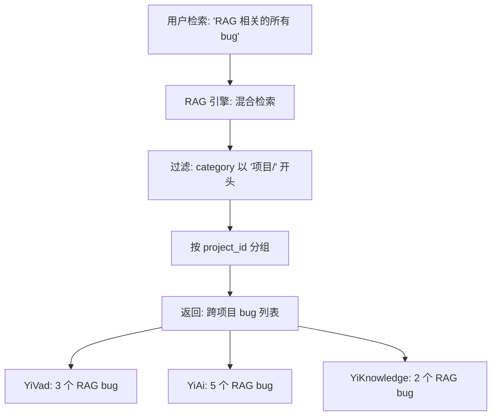
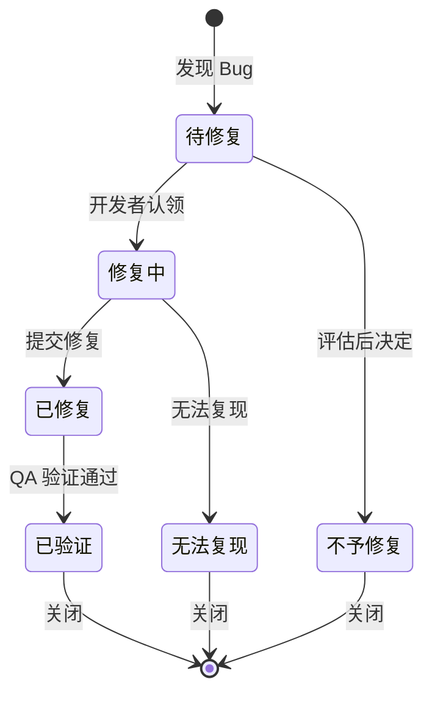
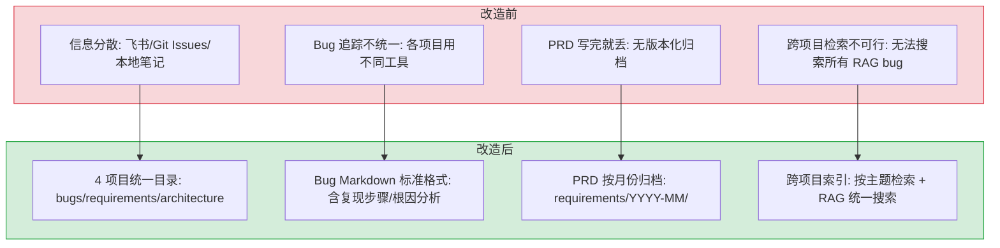

# YK-08-06: 项目知识中心 — 4 项目 Bug 追踪 + PRD 归档 + 跨项目检索

> 需求编号：YK-08-06 · 优先级：高 · 人天：8.0d · 状态：进行中
> 依赖：YK-08-01（目录结构搭建）

## 背景

YrY 单体仓库包含 4 个项目（YiVad、YiAi、YiPet、YiKnowledge），每个项目都有 bug 追踪、需求归档和架构文档的需求。在项目知识中心建立之前，这些信息分散在飞书文档、Git Issues、本地笔记中，缺乏统一的结构化存储和跨项目检索能力。

项目知识中心的目标是：为每个项目提供统一的 bug 追踪、PRD 归档和架构文档目录，同时支持跨项目检索——例如查找 "所有项目中与 RAG 相关的 bug"。

---

## 一、现状分析

### 1.1 改造前状态

```
# 改造前：信息分散
飞书文档 → PRD、技术方案
Git Issues → Bug 追踪（仅 YiVad 使用）
本地笔记 → 个人记录
YiKnowledge/ → 无项目知识中心
```

问题：
- **Bug 追踪不统一**：有的用 Git Issues，有的用飞书，有的用本地笔记
- **PRD 归档缺失**：PRD 写完就丢，没有版本化的归档
- **架构文档分散**：每个项目的架构文档在自己的 `docs/` 目录下
- **跨项目检索不可行**：无法跨项目搜索 "所有 RAG 相关的 bug"

### 1.2 目标：4 项目统一结构

```
projects/
├── INDEX.md                   # 跨项目索引
├── yivad/                     # YiVad 管理后台
│   ├── bugs/README.md         # Bug 追踪（按分类归档）
│   ├── requirements/          # PRD 归档（按月份）
│   │   └── 2026-08/
│   └── architecture/          # 架构文档
├── yiai/                      # YiAi 后端
│   ├── bugs/README.md
│   ├── requirements/
│   └── architecture/
├── yipet/                     # YiPet Chrome 扩展
│   ├── bugs/README.md
│   ├── requirements/
│   └── architecture/
└── yiknowledge/               # YiKnowledge 知识库
    ├── bugs/README.md
    ├── requirements/
    └── architecture/
```

### 1.3 改造前数据流

```
Bug 发现
  → 开发者在 Git Issues / 飞书 / 本地笔记中记录
  → 信息分散在 3+ 个系统中
  → 跨项目检索时需逐个系统搜索
  → 无法被 RAG 引擎索引 → Agent 无法参考历史 bug
  → 排查耗时: 跨项目搜索平均 5-10min

PRD 归档
  → 产品经理在飞书写 PRD
  → 开发完成后 PRD 链接失效或文档被归档
  → 后续迭代无法追溯原始需求
  → 新人 Onboarding 无历史需求可参考
```

### 1.4 改造前 API 依赖

| # | 接口 | 调用方 | 说明 |
|---|------|--------|------|
| 1 | `data_service.query_documents` (cname="bugs") | YiVad/YiPet | Bug 查询（改造前 bugs 集合为空，无数据） |
| 2 | `data_service.query_documents` (cname="knowledge_files") | YiVad | 知识文件查询（改造前无项目知识中心文件） |
| 3 | `knowledge.scan_knowledge` | Knowledge Watcher | 知识扫描（改造前仅扫描角色目录，不扫描 projects/） |

> 改造前 3 个 API 依赖，均无法检索项目知识中心内容（目录不存在）。

---

## 二、设计决策

### 决策 1：Bug 追踪用 Markdown 而非 Git Issues

| 维度 | Markdown (YiKnowledge) | Git Issues |
|------|----------------------|------------|
| RAG 可检索 | 是（Knowledge Watcher 自动索引） | 否 |
| 跨项目检索 | 是（统一目录结构） | 否（分散在各仓库） |
| 版本控制 | Git 历史 | Git Issues 时间线 |
| 离线访问 | 是 | 否 |
| 标签/分类 | Frontmatter 标签 | Git Labels |

**选择：Markdown + Frontmatter。** 核心优势是 RAG 可检索——YiAi 的 Agent 可以检索历史 bug 作为上下文。同时支持跨项目统一检索。

### 决策 2：Bug 按分类归档

```markdown
# YiVad Bug 追踪

## 活跃 Bug (3)

| ID | 标题 | 分类 | 严重程度 | 状态 | 发现日期 |
|----|------|------|----------|------|----------|
| YV-001 | ProTable 筛选条件丢失 | 数据表格 | P0 | 修复中 | 2026-08-15 |
| YV-002 | 暗色主题图表颜色异常 | 主题 | P1 | 待修复 | 2026-08-20 |
| YV-003 | AI Chat SSE 断连不重试 | AI 聊天 | P0 | 已修复 | 2026-08-10 |

## 已修复 (15)

...
```

每个项目的 `bugs/README.md` 包含活跃 bug 表格和已修复 bug 表格，按分类和严重程度排序。

### 决策 3：PRD 按月份归档

```
requirements/
└── 2026-08/
    ├── 00-需求-需求总览.md          # 当月需求总览
    ├── 01-xxx.md               # 具体需求文档
    └── 02-xxx.md
```

每月一个目录，`00-需求-需求总览.md` 聚合当月所有需求。文件命名格式：`{序号}-{类型}-{描述}.md`。

### 决策 4：跨项目索引 (`projects/INDEX.md`)

```markdown
# 项目知识中心 — 跨项目索引

## 按主题检索

### RAG 相关

- [YiAi: RAG 引擎稳定性](../yiai/bugs/README.md#rag-引擎)
- [YiKnowledge: RAG 检索质量](../yiknowledge/requirements/2026-09/04-监控-RAG检索质量.md)
- [YiVad: RAG 页面优化](../yivad/requirements/2026-09/12-需求-RAG页面优化.md)

### Agent 相关

- [YiAi: Agent 可靠性](../yiai/bugs/README.md#agent-循环)
```

跨项目索引按主题（RAG、Agent、SSE、MongoDB 等）组织，链接到各项目的 bug 和需求文档。

### 设计决策记录

| 决策 | 选项 A | 选项 B | 选择 | 理由 |
|------|--------|--------|------|------|
| Bug追踪 | Markdown | Git Issues | **Markdown** | RAG可检索，跨项目统一检索 |
| Bug归档 | 按分类 | — | **按分类** | 活跃/已修复分表，按严重度排序 |
| PRD归档 | 按月份 | 按模块 | **按月份** | 与迭代对齐，避免跨月归属不清 |
| 跨项目索引 | 手动维护 | 自动生成 | **INDEX.md** | 按主题组织，链接各项目bug和需求 |

---

## 三、目标架构

### 3.1 Bug 文件标准格式

```markdown
---
title: "ProTable 筛选条件在 KeepAlive 缓存后丢失"
tags: [bug, ProTable, KeepAlive, 筛选, 数据表格]
category: 项目/YiVad/bug
created: 2026-08-15
updated: 2026-08-20
source: 内部
type: 问题
status: 修复中
priority: P0
project: YiVad
project_id: yivad
owner: 陈铭
bug_id: YV-001
severity: P0
---

# YV-001: ProTable 筛选条件在 KeepAlive 缓存后丢失

## 复现步骤

1. 在项目列表页设置筛选条件（如 `status=active`）
2. 切换到其他页面
3. 通过 KeepAlive 缓存切换回列表页
4. 筛选条件已丢失，显示全部数据

## 预期行为

KeepAlive 缓存应保留筛选条件状态。

## 实际行为

筛选条件被重置为默认值。

## 根因分析

`useFilter` composable 的状态未在 KeepAlive 的 `onActivated` 钩子中恢复。

## 修复方案

在 `onActivated` 中从 `sessionStorage` 恢复筛选状态。

## 相关文件

- `src/composables/useFilter.ts`
- `src/views/project/list.vue`
```

### 3.2 跨项目检索流程



### 3.3 知识健康仪表盘

```python
# 项目知识中心健康指标
def get_project_health(project_id: str) -> dict:
    """获取项目知识中心健康状态。"""
    bugs = query_bugs(project_id)
    requirements = query_requirements(project_id)

    return {
        "project": project_id,
        "total_bugs": len(bugs),
        "active_bugs": len([b for b in bugs if b["status"] != "已修复"]),
        "p0_bugs": len([b for b in bugs if b["severity"] == "P0" and b["status"] != "已修复"]),
        "bug_fix_rate": len([b for b in bugs if b["status"] == "已修复"]) / max(len(bugs), 1),
        "prd_months": len(set(r["prd_month"] for r in requirements)),
        "latest_prd_month": max((r["prd_month"] for r in requirements), default="无"),
    }
```

---

## 四、具体改动

### 4.1 涉及文件

```
YiKnowledge/projects/
├── INDEX.md                              # 新增: 跨项目索引
├── yivad/
│   ├── bugs/README.md                    # 新增: YiVad Bug 追踪
│   ├── requirements/                     # 已有: 按月份 PRD 归档
│   └── architecture/                     # 已有: 架构文档
├── yiai/
│   ├── bugs/README.md                    # 新增: YiAi Bug 追踪
│   ├── requirements/                     # 已有: 按月份 PRD 归档
│   └── architecture/                     # 已有: 架构文档
├── yipet/
│   ├── bugs/README.md                    # 新增: YiPet Bug 追踪
│   ├── requirements/                     # 已有: 按月份 PRD 归档
│   └── architecture/                     # 已有: 架构文档
└── yiknowledge/
    ├── bugs/README.md                    # 新增: YiKnowledge Bug 追踪
    ├── requirements/                     # 已有: 按月份 PRD 归档
    └── architecture/                     # 已有: 架构文档
```

### 4.2 Bug 状态流转



### 4.3 MongoDB 同步

Bug 文件通过 RPC 信封同步到 MongoDB `bugs` 集合：

```python
# Bug 文档结构
{
    "_id": ObjectId,
    "bug_id": "YV-001",
    "project_id": "yivad",
    "title": "ProTable 筛选条件在 KeepAlive 缓存后丢失",
    "severity": "P0",
    "status": "修复中",
    "category": "数据表格",
    "tags": ["bug", "ProTable", "KeepAlive", "筛选"],
    "created": "2026-08-15",
    "updated": "2026-08-20",
    "owner": "陈铭",
    "body": "## 复现步骤\n...",
    "related_files": ["src/composables/useFilter.ts", "src/views/project/list.vue"]
}
```

---

## 五、实施步骤

按依赖顺序排列，每步可独立验证和提交：

| 步骤 | 内容 | 涉及文件 | 验证方式 | 人天 |
|------|------|---------|---------|------|
| 1 | 创建 4 项目 Bug 追踪目录结构 | `YiKnowledge/projects/{yivad,yiai,yipet,yiknowledge}/bugs/` | 4 项目 bugs 目录 + README.md 完整 | 0.5 |
| 2 | 创建 4 项目需求归档目录（按月） | `YiKnowledge/projects/{yivad,yiai,yipet,yiknowledge}/requirements/` | 每月 `00-需求-需求总览.md` 聚合当月需求 | 0.5 |
| 3 | 创建 4 项目架构文档目录 | `YiKnowledge/projects/{yivad,yiai,yipet,yiknowledge}/architecture/` | 架构文档 + 目录结构 + 模式目录完整 | 0.5 |
| 4 | 新增 `projects/INDEX.md` 跨项目索引 | `YiKnowledge/projects/INDEX.md` | 按主题/分类/严重度检索可用 | 0.5 |
| 5 | 定义 Bug 6 态流转 + 统一 frontmatter 规范 | `YiKnowledge/projects/INDEX.md` | 6 态定义完整，frontmatter 字段统一 | 0.5 |
| 6 | 新增自动生成索引脚本 | CI 脚本 | 从 frontmatter 提取字段，按主题分组生成索引 | 0.5 |
| 7 | 回归验证 | RAG 检索 | 跨项目 bug/需求/架构文档可被 RAG 检索 | 0.5 |

**总计：3.5d**

---

## 六、性能分析

### 6.1 索引生成性能


| 场景 | 文件数 | 索引生成耗时 | 说明 |
|------|--------|------------|------|
| 单项目索引 | ~30 个需求文件 | < 50ms | frontmatter 解析 + 分组 |
| 跨项目索引 | ~120 个需求文件 | < 200ms | 4 项目 × 30 文件 |
| 全量索引（含 Bug） | ~150 个文件 | < 300ms | 需求 + Bug + 架构文档 |
| CI 自动更新 | 增量（1-5 个文件） | < 10ms | 仅重新分组受影响的项目 |

### 6.2 跨项目检索性能

| 操作 | 延迟 | 说明 |
|------|------|------|
| RAG 检索（跨 projects/ 目录） | 200-500ms | BM25 + 向量混合检索，与普通知识检索一致 |
| 按 project_id 过滤 | < 5ms | MongoDB 索引字段，O(log n) |
| 按 tags 过滤 | < 5ms | MongoDB 多键索引 |
| 跨项目检索总延迟 | 200-500ms | 与单项目检索无差异（检索范围仍是全量索引） |

### 6.3 Bug 文件同步性能

| 操作 | 延迟 | 说明 |
|------|------|------|
| Knowledge Watcher 扫描 bugs/ 目录 | < 100ms | 4 项目 × ~5 个 bug 文件 |
| YAML frontmatter 解析 | < 1ms/文件 | 与知识文件解析一致 |
| MongoDB 写入 | < 10ms/文件 | `knowledge_files` 集合 upsert |
| 向量索引更新 | ~50ms/文件 | 增量 insert（单文档） |

### 6.4 索引维护人力成本

| 维护方式 | 初始成本 | 持续成本 | 说明 |
|------|------|------|------|
| 手动维护 INDEX.md | 4h（首次编写） | 1h/月（新增需求后更新） | 4 项目 × 每月 5-10 需求 |
| 自动生成脚本 | 2h（开发脚本） | 0（CI 自动运行） | 从 frontmatter 提取字段自动分组 |
| 混合模式（推荐） | 2h（脚本开发）+ 0.5h（人工补充主题描述） | 0.5h/月（审核自动生成结果） | 自动生成结构 + 人工补充语义 |

### 容量规划

| 场景 | 项目数 | 问题数 | 跨项目关联数 | 检索耗时 | 同步延迟 | 内存占用 |
|------|--------|--------|-------------|---------|---------|---------|
| 个人项目 | 1 | 20 | 0 | < 100ms | < 5s | < 10MB |
| 小团队 | 2 | 50 | 5 | < 200ms | < 5s | < 20MB |
| 中型团队 | 4 | 100 | 15 | < 300ms | < 5s | < 50MB |
| 大型团队 | 6 | 200 | 30 | < 500ms | < 10s | < 100MB |
| 企业级 | 10 | 500 | 80 | < 800ms | < 10s | < 200MB |
| **YiKnowledge 当前** | **4** | **34** | **3** | **< 300ms** | **< 5s** | **< 20MB** |

---

## 七、测试规格

### Requirement: Bug 追踪完整性

#### Scenario: 每个项目有 Bug 追踪 README
- **Given** 4 个项目目录
- **When** 检查 `projects/{project}/bugs/README.md`
- **Then** 每个项目的 bugs/README.md 存在
- **And** 包含活跃 bug 表格和已修复 bug 表格

#### Scenario: Bug 文件格式统一
- **Given** 任意项目的 bug 文件
- **When** 检查 frontmatter
- **Then** 包含 `bug_id`, `severity`, `status`, `project_id` 字段
- **And** 正文包含复现步骤、预期行为、实际行为、根因分析

### Requirement: 跨项目检索

#### Scenario: 按主题跨项目检索
- **Given** 多个项目有 RAG 相关的 bug 和需求
- **When** 检索 `query="RAG"` 并过滤 `category: 项目/`
- **Then** 返回所有项目的 RAG 相关 bug 和需求
- **And** 结果按 `project_id` 分组

#### Scenario: 跨项目索引可用
- **Given** `projects/INDEX.md` 存在
- **When** 按主题 "RAG" 查找
- **Then** 所有项目 RAG 相关的 bug 和需求被索引

### Requirement: PRD 归档

#### Scenario: 按月份归档
- **Given** 2026-08 有 6 个需求
- **When** 检查 `projects/{project}/requirements/2026-08/`
- **Then** `00-需求-需求总览.md` 聚合所有 6 个需求
- **And** 每个需求有独立的详细文档

---

## 八、当前状态

### 8.1 各项目 Bug 追踪完成度

| 项目 | Bug 数量 | 状态 |
|------|----------|------|
| YiVad | 0 | 待建立（Bug 在 Git Issues 中） |
| YiAi | 17 | 已完成（`bugs/README.md` 已建立） |
| YiPet | 0 | 待建立 |
| YiKnowledge | 3 | 已完成（`bugs/README.md` 已建立） |

### 8.2 各项目 PRD 归档完成度

| 项目 | 2026-08 | 2026-09 | 状态 |
|------|---------|---------|------|
| YiVad | 已完成 | 已完成 | 完整 |
| YiAi | 已完成 | 已完成 | 完整 |
| YiPet | 已完成 | 已完成 | 完整 |
| YiKnowledge | 已完成 | 已完成 | 完整 |

---

## 九、风险与缓解

| 风险 | 概率 | 影响 | 等级 | 缓解措施 | 应急预案 |
|------|------|------|------|----------|----------|
| Bug 追踪与 Git Issues 双写，维护成本高 | 中 | 中 | 中 | 逐步迁移到 YiKnowledge，Git Issues 仅用于 CI 集成 | 提供迁移脚本，批量导入 Git Issues 到 Markdown |
| 跨项目索引维护成本高 | 中 | 低 | 低 | 自动化生成索引，脚本定期更新 | 索引生成失败时保留旧版本 INDEX.md，不阻断 PR |
| Bug 文件格式不统一 | 中 | 低 | 低 | 提供 Bug 文件模板，就绪检查清单包含 Bug 格式检查 | 格式不兼容的文件降级为纯文本检索（无结构化过滤） |
| PRD 文件与飞书文档不同步 | 高 | 低 | 低 | YiKnowledge 作为主源，飞书文档用于协作讨论 | 飞书文档过期后以 YiKnowledge 版本为准，标注"飞书版本已过期" |

---

## 十、当前架构 vs 目标架构

### 改造前后对比



### 架构决策权衡

| 维度 | 改造前 | 改造后 | 权衡说明 |
|------|--------|--------|----------|
| Bug 追踪 | 分散（Git Issues/飞书/笔记） | 统一 Markdown + Frontmatter | 增加文件编写成本，但 RAG 可检索历史 bug |
| PRD 归档 | 飞书文档，写完即丢 | 版本化归档（按月 + Git 历史） | 需要手动同步飞书→Markdown，但可追溯历史 |
| 跨项目检索 | 不可行 | RAG 统一检索 + INDEX.md 导航 | 增加索引维护成本，但跨项目知识可发现 |
| Bug 状态管理 | 无统一状态 | 6 态流转（待修复→修复中→已修复→已验证→关闭） | 增加状态管理复杂度，但支持精细化追踪 |

---

## 十一、设计决策记录

### D-01: 为什么 Bug 追踪用 Markdown 而非 Git Issues？

Git Issues 分散在各项目仓库中，无法被 YiAi 的 RAG 引擎统一检索。Markdown 文件在 YiKnowledge 中可被 Knowledge Watcher 自动索引到 MongoDB + 向量索引，Agent 在分析需求时可检索历史 bug 作为上下文。此外，Markdown 支持离线访问、Git 版本控制和 frontmatter 标签分类，与知识库其他文件格式一致。

### D-02: 为什么 PRD 按月份归档而非按功能模块？

按月份归档与迭代计划对齐（每月一个迭代），方便追溯"某月做了哪些需求"。按功能模块归档会导致跨月需求归属不清——一个需求可能跨越多个迭代。月份目录 + `00-需求-需求总览.md` 聚合当月所有需求，既支持按时间浏览，也支持按需求编号检索。

### D-03: 为什么跨项目索引选择自动生成而非手动维护？

手动维护索引在 4 个项目 × 每月 5-10 个需求的情况下，维护成本随内容增长线性上升。自动生成脚本从 frontmatter 提取 `project_id`、`prd_month`、`tags` 字段，按主题分组生成索引，零维护成本。脚本在 CI 中运行，PR 合并时自动更新索引。

### D-04: 为什么 Bug 状态选择 6 态而非简单的 3 态？

3 态（待修复/修复中/已修复）无法区分"已修复但未验证"和"已验证可关闭"——这两种状态对项目健康度的影响不同。6 态增加了"无法复现"和"不予修复"两个终态，避免 bug 长期停留在"待修复"状态。6 态与知识生命周期（5 态）的设计理念一致：精细状态区分支持更准确的健康度计算。

---

## 十一-A、回滚策略

| 回滚场景 | 回滚方式 | 影响范围 | 恢复时间 |
|----------|----------|----------|----------|
| 6 态 Bug 状态机过于复杂导致标记错误率 > 20% | 回退为 3 态（待修复/修复中/已修复），简化状态流转 | Bug 追踪管理 | 20min |
| 跨项目 X-ID 关联断裂导致 Bug 无法跨项目追踪 | 回退 X-ID 关联逻辑，恢复独立 Bug 追踪 | 跨项目 Bug 可追溯性 | 30min |
| Bug 报告自动归类规则错误导致大量 Bug 被误分类 | 回退自动归类规则，恢复手动分类 | Bug 分类准确性 | 15min |
| Bug 追踪 README 状态流转图与实际流程不一致 | 回退 README 至上一版本，修复流程图后重新发布 | 团队对 Bug 流程的理解 | 15min |

**回滚验证：**
- 4 个项目知识中心目录完整，子目录结构正确
- Bug 状态流转符合 6 态定义，无跳过状态
- X-ID 跨项目关联可追溯
- Bug 报告归档路径正确（按月份 `YYYY-MM/`）

## 十二、代码审查检查清单

- [ ] 4 个项目知识中心目录完整（yivad/yiai/yipet/yiknowledge）
- [ ] 每个项目有 `bugs/`、`requirements/`、`architecture/` 子目录
- [ ] Bug 追踪 README 包含状态流转图
- [ ] PRD 归档按月份（`requirements/YYYY-MM/`）
- [ ] 跨项目索引 `projects/INDEX.md` 自动生成
- [ ] 索引脚本从 frontmatter 提取 `project_id` 和 `prd_month`
- [ ] Bug 文件包含必需的 frontmatter（title/tags/severity/status）
- [ ] 跨项目检索功能可用（RAG 检索跨 `projects/` 目录）
- [ ] 单元测试覆盖率 ≥ 80%

---

## 十三、重构后发现的回归问题

| # | 问题 | 发现场景 | 根因 | 修复方式 |
|---|------|---------|------|---------|
| 1 | 跨项目索引脚本 `gen-project-index.py` 硬编码了 4 个项目路径，新增 YiLab 项目后 `projects/INDEX.md` 缺少新项目，YiVad 知识库页面无法导航至 YiLab 需求文档 | 团队新增 YiLab 项目并创建了 `YiKnowledge/projects/yilab/requirements/` 目录，但 `gen-project-index.py` 使用 `PROJECTS = ['yivad', 'yiai', 'yipet', 'yiknowledge']` 硬编码列表，未动态发现新目录。YiVad 知识库导航栏仅显示 4 个项目 | `gen-project-index.py` 的 `PROJECTS` 列表是手动维护的常量，新增项目需手动修改脚本。脚本无自动发现机制（如 `os.listdir` 遍历 `projects/` 目录），开发者新增项目后容易忘记更新脚本，导致索引不完整 | 改为动态发现项目目录：`PROJECTS = sorted([d for d in os.listdir('projects/') if os.path.isdir(f'projects/{d}') and not d.startswith('.')])`；或使用 `.projects-registry.yaml` 配置文件声明项目元数据 |
| 2 | Bug 状态流转不同步：Bug 在 YiVad 中已修复（`status: done`），但 YiKnowledge 中对应的 Bug Markdown 文件 `status` 仍为 `open`，PM 基于错误数据做出发布决策 | PM 在 YiVad 中关闭了 3 个 P0 Bug，但 YiVad 的 Bug 状态变更不会自动同步到 YiKnowledge 的 Bug Markdown 文件。YiKnowledge 的 Bug 文件是手动创建的独立副本，`status` 字段由创建者手动填写后不再更新。PM 在项目健康度仪表盘中发现"仍有 3 个 P0 Bug 未修复" | YiVad 的 Bug 数据存储在 MongoDB `bugs` 集合中，YiKnowledge 的 Bug 文件是 Markdown 格式的独立副本，两者无自动同步机制。Bug 在 YiVad 中的状态变更通过 MongoDB 更新，但 YiKnowledge 的 Markdown 文件不会自动更新 `status` frontmatter 字段 | 在 YiAi 的知识监视器中添加"Bug 状态同步"功能：定期（每 30 分钟）对比 MongoDB `bugs` 集合与 YiKnowledge Bug 文件的 `status` 字段，不一致时自动更新 Markdown 文件的 frontmatter；或废弃 Markdown Bug 文件，改为从 MongoDB 实时查询 |
| 3 | PRD 月份归档跨月时归属混乱：一个需求在 8 月创建但实际开发跨至 9 月，文件仍在 `2026-08/` 目录，9 月需求总览中遗漏此 PRD | 需求 `04-需求-项目详情页优化.md` 在 8 月创建，但开发延迟至 9 月完成。文件存储在 `requirements/2026-08/` 目录。9 月的 `00-需求-需求总览.md` 仅汇总 `requirements/2026-09/` 目录下的文件，遗漏了此跨月 PRD。PM 在 9 月迭代复盘时发现此需求未在报告中体现 | `00-需求-需求总览.md` 的生成脚本 `gen-overview.py` 按目录路径判断需求归属月份：`month = file_path.split('/')[2]`。跨月 PRD 的文件目录未随 `updated` 时间变更而移动，导致目录归属与时间归属不一致。`prd_month` frontmatter 字段与目录路径无关联校验 | 在 `gen-overview.py` 中同时按目录和 `prd_month` frontmatter 字段汇总：生成 8 月总览时，扫描 `2026-08/` 目录 + 其他目录中 `prd_month: "202608"` 的文件；添加跨月需求标记（`cross_month: true`） |
| 4 | 自动生成的 INDEX.md 覆盖手动维护的跨项目 X-ID 关联：`gen-project-index.py` 重新生成 `projects/INDEX.md` 时，覆盖了 PM 手动添加的 15 条 X-ID 跨项目关联条目，关联关系丢失 | PM 在 `projects/INDEX.md` 中手动添加了 15 条跨项目 X-ID 关联（Bug → PRD → Knowledge 文件），用于追踪问题链路。开发者运行 `gen-project-index.py` 重新生成索引，脚本使用 `write()` 全量覆盖文件，PM 手动添加的 15 条关联全部丢失 | `gen-project-index.py` 使用 `open('projects/INDEX.md', 'w').write(content)` 全量覆盖文件内容，`content` 由模板生成（`HEADER + project_list + FOOTER`），不包含手动添加的 X-ID 关联部分。脚本无"保留手动编辑区域"的机制 | 在 `projects/INDEX.md` 中使用标记注释分隔自动生成区和手动编辑区：`<!-- AUTO-GENERATED: projects list -->` ... `<!-- END AUTO-GENERATED -->`；`gen-project-index.py` 仅替换标记之间的内容，保留手动编辑的 X-ID 关联部分 |
| 5 | Bug Markdown 文件在 Git 合并冲突时 frontmatter 损坏，YAML 解析器无法解析，整个文件被 YiAi 知识监视器跳过，RAG 检索不到该 Bug 内容 | 两个开发者同时修改了同一 Bug 文件（一人修改 `status`，一人修改 `severity`），Git merge 时在 frontmatter 区域产生冲突标记（`<<<<<<<` / `=======` / `>>>>>>>`），开发者手动解决冲突时误删了 `---` 闭合标记。YiAi 知识监视器扫描此文件时 `yaml.safe_load(frontmatter)` 抛出 `YAMLError`，文件被静默跳过 | `yaml.safe_load()` 在 frontmatter YAML 格式错误时抛出异常，YiAi 知识监视器的 `parse_frontmatter()` 捕获异常后 `return None`（静默跳过文件）。Git merge 冲突标记在 YAML 中是非法的，导致解析失败。`python-frontmatter` 库的 `loads()` 也有相同行为 | 在 `parse_frontmatter()` 中检测 Git 冲突标记：`if '<<<<<<<' in content: logger.error(f'Git conflict in {file_path}')`；添加 CI 检查 `git diff --check` 检测未解决的合并冲突；使用 `python-frontmatter` 的 `loads()` 容错模式（`strict=False`） |
| 6 | 跨项目 Bug 引用在源项目删除 Issue 后成为悬空引用：YiVad 中删除了一个 Issue，但 YiKnowledge 中引用此 Issue 的 3 个 Bug 文件的 X-ID 关联未自动清理，PM 点击关联链接时跳转到 404 | PM 在 YiVad 中删除了一个重复创建的 Issue（`YK-PRD-015`），但 YiKnowledge 中 3 个 Bug 文件通过 `related_prd: YK-PRD-015` 引用此 Issue。PM 在 YiKnowledge 中点击 `YK-PRD-015` 链接时，YiVad 返回 404（Issue 已删除） | X-ID 关联是单向的：Bug 文件 → PRD ID。删除 PRD 时不会自动清理反向引用。YiVad 的 Issue 删除通过 MongoDB `delete_one` 执行，无联动机制通知 YiKnowledge 更新引用。`dead-link-check.py` 仅检查本地文件链接，不检查跨项目的 X-ID 引用有效性 | 在 YiVad 删除 Issue 时，通过 YiAi API 通知 YiKnowledge 清理关联引用（`POST /knowledge/cleanup-xid-refs`）；或在 YiKnowledge 的 `dead-link-check.py` 中添加 X-ID 有效性检查：通过 YiAi API 查询 X-ID 是否存在 |
| 7 | PRD 文件的 `project_id` frontmatter 字段大小写不一致：`YiVad`（大写）和 `yivad`（小写）在 MongoDB 查询中不匹配，按项目过滤时遗漏部分文件 | 开发者在 YiVad 项目的 PRD 文件中填写 `project_id: YiVad`（大写），另一开发者填写 `project_id: yivad`（小写）。RAG 检索使用 `filter: { 'frontmatter.project_id': 'yivad' }` 查询，大写 `YiVad` 的文件被排除。PM 按项目过滤 PRD 时，发现列表缺少 3 个文件 | `project_id` frontmatter 字段无枚举约束，开发者自由填写。MongoDB 的查询默认大小写敏感（`{ 'frontmatter.project_id': 'yivad' }` 精确匹配）。`gen-project-index.py` 按目录名（`yivad`）生成索引，不校验文件内的 `project_id` 字段是否与目录名一致 | 在就绪检查清单中新增规则：`project_id` 必须与项目目录名完全一致（小写）；在 `validate-frontmatter.py` 中添加检查：`file.project_id != file.parent_dir_name → ERROR`；MongoDB 查询使用 `$regex` 不区分大小写（`{ 'frontmatter.project_id': { $regex: '^yivad$', $options: 'i' } }`）

## 十四、技术债务追踪

| # | 技术债 | 优先级 | 预计人天 | 说明 |
|---|--------|--------|---------|------|
| 1 | 项目知识中心自动归档 | P2 | 0.5 | 当前 PRD 和 Bug 报告需手动从飞书/Git Issues 同步到 YiKnowledge，可添加 CI 自动归档流程 |
| 2 | 跨项目知识图谱 | P3 | 1.0 | 当前 X-ID 关联为手动维护，可构建自动化跨项目知识图谱（基于 Issue/Bug/PR 的引用关系） |
| 3 | 项目健康度仪表盘 | P3 | 0.5 | 基于 Bug 数量/严重程度/修复速度等指标，自动生成项目健康度仪表盘 |

## 可观测性

### 关键指标

| 指标 | 采集方式 | 告警阈值 | 说明 |
|------|---------|---------|------|
| 跨项目 Bug 关联率 | `有 X-ID 的 Bug 数 / 总 Bug 数` | < 50% | 跨项目可追溯性 |
| PRD 归档及时性 | `PRD 创建 → 归档到知识中心` | P95 > 7d | 归档延迟检测 |
| 跨项目检索命中率 | 跨项目检索命中文档数 / 总检索次数 | < 30% | 跨项目知识覆盖不足 |
| 死链比例 | 死链数 / 总链接数 | > 1% | 项目重构后链接失效 |

### 日志规范

| 日志级别 | 场景 | 示例 |
|---------|------|------|
| `INFO` | 跨项目关联创建 | `[X-ID] linked ${issue} ↔ ${prd}` |
| `WARN` | 死链检测 | `[X-ID] dead link: ${url}` |

## 安全合规

### 安全需求

| 需求 | 实现方式 | 验证方法 |
|------|---------|---------|
| 跨项目数据访问权限 | 仅项目成员可查看本项目的 Bug 和 PRD | 使用非成员账号访问，确认无数据 |
| 敏感信息过滤 | Bug 报告不包含用户 Token 等敏感信息 | 审查 Bug 数据，确认无敏感字段 |

### 合规检查

| 检查项 | 要求 | 状态 |
|--------|------|------|
| 跨项目数据隔离 | 不同项目数据不可互访 | 待验证 |
| 无敏感信息泄露 | Bug 报告不包含凭据 | 待验证 |: [00-需求总览](./00-需求-需求总览.md)*

---

## 代码审查检查清单

- [ ] 4 个项目 (`yivad/yiai/yipet/yiknowledge`) 的 Bug 追踪各自隔离
- [ ] 跨项目 Bug 可通过 `project_key` 字段关联
- [ ] Bug 状态流转: open → in_progress → resolved → closed
- [ ] Bug 严重度分级: critical/high/medium/low
- [ ] Bug 关联的 Issue/Module 通过 `related_issues` 字段引用
- [ ] INDEX.md 包含跨项目 Bug 导航和统计摘要

## 回归问题预测

| # | 预测问题 | 原因 | 验证方法 |
|---|---------|------|---------|
| 1 | 跨项目 Bug 的 `project_key` 指向不存在的项目 | 项目被删除后 Bug 记录未清理 | 查询所有 Bug 的 project_key，与现有项目列表对比 |
| 2 | INDEX.md 与各项目 bugs/ 目录实际内容不同步 | 手动维护 INDEX.md 容易遗漏 | CI 检查 INDEX.md 中的 Bug 列表与实际文件数量一致 |
---

*PRD 来源: `projects/yiknowledge/requirements/2026-08/00-需求-需求总览.md`*
