# YiKnowledge 九月迭代 — 质量治理 / 自动化校验 / RAG 监控 / 项目知识中心

> 菜单路径：`YiKnowledge/` · 涉及仓库：`YiKnowledge` + `YiAi`（Knowledge Watcher、RAG 引擎）
> 总人天：**16.0d** · 负责人：陈铭

```mermaid
graph LR
  subgraph Input["现状问题"]
    I1["tags 字符串格式<br/>RAG 标签过滤失效"]
    I2["Knowledge Watcher<br/>竞态导致文件未索引"]
    I3["文件名下划线<br/>违反 kebab-case"]
    I4["RAG 检索无监控<br/>质量问题不可见"]
    I5["项目知识中心<br/>bug 追踪不完整"]
  end

  subgraph Action["治理动作 (6 项需求)"]
    A1["Frontmatter 质量治理<br/>tags 归一化 + 字段校验"]
    A2["文件同步可靠性<br/>稳定性检测 + 完整性校验"]
    A3["命名规范自动化<br/>pre-commit hook + CI"]
    A4["RAG 检索质量监控<br/>空结果告警 + 维度检测"]
    A5["项目知识中心完善<br/>4 项目 bug 追踪 + 跨项目检索"]
    A6["知识生命周期自动化<br/>过期检测 + 归档提醒 + 权重降级"]
  end

  subgraph Output["目标产出"]
    O1["tags 格式 100% 数组"]
    O2["文件同步零竞态"]
    O3["命名规范 pre-commit 拦截"]
    O4["RAG 空结果率 < 5%"]
    O5["4 项目 bug 追踪完整"]
    O6["知识自动过期降级"]
  end

  Input --> Action --> Output

  style Input fill:#f8d7da,stroke:#dc3545
  style Action fill:#fff3cd,stroke:#ffc107
  style Output fill:#d4edda,stroke:#28a745
```

---

## 0. 知识库架构概述

> YiKnowledge 是 YrY 单体仓库的共享知识库，由 **8 个角色目录** + **4 个治理流水线**组成，同时服务于人类（文档）和 AI（YiAi RAG 数据源）。九月迭代聚焦于**质量治理自动化**和**项目知识中心完善**。

### 0.1 目录结构

```
YiKnowledge/
├── README.md                  # 知识库总览 + 设计原则 + 流水线概述
├── INDEX.md                   # 导航索引（按角色 + 按领域）
├── MEMORY.md                  # 规则手册 + 命名约定
├── QUICKREF.md                # 快速参考
├── aier/                      # AI 工程师 — AI 模型、RAG 调优、Agent 设计
├── curator/                   # 策展人 — 治理、生命周期、质量检查
│   └── governance/            # 治理文件（就绪检查清单、治理流水线、健康仪表盘）
├── engineer/                  # 工程师 — 代码模式、架构决策、构建工具
├── executiver/                # 管理者 — 决策记录、战略方向、OKR
├── leader/                    # 技术领导 — 架构决策、技术选型、设计评审
├── producter/                 # 产品经理 — PRD 模板、需求优先级、竞品分析
├── projects/                  # 项目知识中心（4 个项目）
│   ├── yivad/                 # YiVad 管理后台 — bugs/requirements/architecture
│   ├── yiai/                  # YiAi 后端 — bugs/requirements/architecture
│   ├── yipet/                 # YiPet 扩展 — bugs/requirements/architecture
│   └── yiknowledge/           # YiKnowledge 自身 — bugs/requirements/architecture
├── skills/                    # 技能 — 角色技能矩阵、成长路径
├── srer/                      # SRE — 监控、告警、部署、容灾
├── websites/                  # 网站 — 外部资源、工具链接、参考文档
├── rss/                       # RSS 聚合内容（YiAi 自动抓取）
└── static/                    # 静态资源（图片、附件）
```

### 0.2 治理流水线

```
inbox → triage → active → reference → archive
  │        │        │         │           │
  │        │        │         │           └─ 废弃 > 6 个月，移至 curator/archive/
  │        │        │         └─ 稳定参考内容，不再频繁更新
  │        │        └─ 活跃内容，定期审查和更新
  │        └─ 分类到正确的角色目录 + 添加 lifecycle: triage 标签
  └─ 新内容未分类，24 小时内处理
```

4 个治理角色：**Curator**（策展人）→ **Author**（作者）→ **Reviewer**（领域专家）→ **Archivist**（归档人）

3 个审查节奏：**Daily**（收件箱扫描 + frontmatter 抽查）→ **Weekly**（分类排空 + 新鲜度扫描 + 死链检查）→ **Quarterly**（全面审计 + 角色边界检查 + 归档清理）

### 0.3 与 YiAi 的集成

```
YiKnowledge（markdown 目录树）
  │
  ├── Knowledge Watcher（YiAi apscheduler 每 5s 轮询）
  │     ├── 检测文件变更（新增/修改/删除）
  │     ├── 解析 frontmatter + Markdown 内容
  │     └── 写入 MongoDB（文档集合 + 向量索引）
  │
  ├── RAG 引擎（YiAi llama_index 混合检索）
  │     ├── BM25 关键词检索（路径分词 + 标签匹配）
  │     ├── 向量语义检索（Ollama Embedding）
  │     └── 混合排序（alpha 权重融合）
  │
  └── Agent（YiAi Agent 循环）
        └── 检索知识库作为上下文 → LLM 生成 PRD
```

### 0.4 关键规范

| 规范 | 要求 | 验证方式 |
|------|------|----------|
| **文件命名** | kebab-case，仅连字符，无下划线/数字/空格 | pre-commit hook + CI 扫描 |
| **目录层级** | 最多 3 级（`role/domain/file.md`） | 目录结构检查 |
| **Frontmatter** | 8 个必需字段（`title` `tags` `category` `created` `updated` `source` `type` `status`） | 就绪检查清单 |
| **tags 格式** | YAML 数组 `[tag1, tag2]`，非字符串 | 解析时归一化 |
| **角色边界** | 一个文件属于一个角色目录 | 角色边界决策树 |
| **编码** | UTF-8，无 BOM | 文件读取校验 |

### 0.5 模块交互拓扑

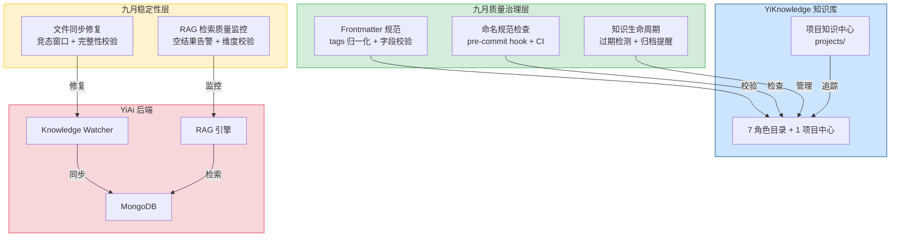

### 0.6 模块职责矩阵

| 模块 | 八月状态 | 九月变更 | 关键决策 |
|------|----------|----------|----------|
| Frontmatter 规范 | 8 字段定义完成 | **增强**：tags YAML 数组强制归一化，字符串自动转换，缺失字段 WARNING→ERROR | 不拒绝请求（WARNING→ERROR 渐进式），pre-commit hook 阻断新增违规 |
| 文件同步 (`watcher.py`) | 基础 mtime 检测 | **修复**：大文件稳定性等待（100KB 阈值），内容完整性校验（分隔符+YAML+大小） | 500ms 稳定性窗口，校验失败保留旧 mtime（不标记已索引） |
| 命名规范 | 规范文档定义 | **自动化**：pre-commit hook 实时检查，CI 扫描全量文件，路径解析容错 | 仅检查文件名（非内容），允许存量文件逐步迁移 |
| RAG 检索质量 | 无监控 | **新增**：空结果告警（滑动窗口 30%），标签过滤准确性，维度不匹配检测 | 冷启动宽限期 5 分钟，避免初始化期间误报 |
| 项目知识中心 | 目录结构搭建 | **完善**：4 项目 bug 追踪体系，跨项目 INDEX.md，知识库健康仪表盘 | 按项目隔离追踪，统一 INDEX.md 导航 |
| 知识生命周期 | 状态定义完成 | **自动化**：过期检测（30/60/90 天），质量评分自动降级，归档提醒 | 策展人审查不阻塞，异步提醒流程 |

### 0.6-A 跨项目需求依赖矩阵

> 九月迭代的 28 项需求分布在 4 个项目之间，存在 16 条跨项目依赖关系。YiKnowledge 的需求大量依赖 YiAi 的 Knowledge Watcher 和 RAG 引擎，YiAi 的需求又服务于 YiVad 和 YiPet 的 API 消费。

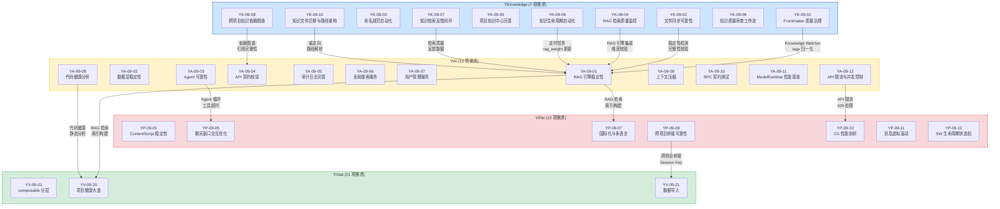

#### 依赖关系表

| 上游需求 | 下游需求 | 依赖类型 | 影响 | 协调要求 |
|----------|----------|----------|------|----------|
| YK-09-01 (tags 归一化) | YA-09-01 (RAG 引擎稳定性) | **数据格式** | tags 格式变更后 RAG 标签过滤恢复 | YiKnowledge → YiAi 前端格式变更通知 |
| YK-09-02 (文件同步可靠性) | YA-09-01 (RAG 引擎) | **运行时** |稳定性检测机制部署在 YiAi Knowledge Watcher | YiKnowledge 定义需求 → YiAi 实现 |
| YK-09-04 (RAG 质量监控) | YA-09-01 (RAG 引擎) | **运行时** | 监控逻辑集成到 RAG 引擎检索入口 | YiKnowledge 定义指标 → YiAi 实现监控 |
| YK-09-06 (知识生命周期) | YA-09-01 (RAG 引擎) | **数据权重** | `rag_weight` 字段在 RAG 排序中使用 | YiKnowledge 定义权重策略 → YiAi 消费 |
| YK-09-07 (检索反馈) | YA-09-01 (RAG 引擎) | **数据反馈** | 👍/👎 反馈用于调优混合检索 alpha 值 | YiKnowledge 定义反馈协议 → YiAi 消费 |
| YK-09-08 (依赖图谱) | YA-09-04 (API 契约) | **CI 集成** | 依赖图谱用于变更影响分析和契约校验 | YiKnowledge 产出图谱 → YiAi CI 消费 |
| YK-09-10 (路径迁移) | YA-09-01 (RAG 引擎) | **路径解析** | `RedirectManager` 集成到 Knowledge Watcher | YiKnowledge 维护重定向配置 → YiAi 消费 |
| YA-09-01 (RAG 引擎) | YV-09-20 (项目健康大盘) | **API 消费** | 代码健康分析通过 RAG 检索代码规范文档 | YiAi 提供 API → YiVad 消费 |
| YA-09-03 (Agent 可靠性) | YP-09-05 (聊天窗口交互) | **API 消费** | Agent 工具调用超时 → 聊天窗口错误提示 | YiAi 定义错误协议 → YiPet 消费 |
| YA-09-08 (代码健康分析) | YV-09-20 (项目健康大盘) | **API 消费** | 项目健康大盘消费代码健康分析 API | YiAi 提供 API → YiVad 消费 |
| YA-09-12 (API 限流) | YP-09-10 (CS 性能剖析) | **运行时** | 限流 429 响应 → Content Script 需正确处理重试 | YiAi 定义限流响应 → YiPet 消费 |
| YP-09-09 (跨项目桥接) | YV-09-21 (数据导入) | **运行时** | 桥接 Token 机制依赖 YiVad 路由兼容 | YiPet 定义桥接协议 → YiVad 实现 |

#### 跨项目影响评估

| 变更项 | YiVad 影响 | YiPet 影响 | YiAi 影响 | YiKnowledge 影响 |
|--------|-----------|-----------|----------|-----------------|
| tags 格式调整为 YAML 数组 | 无 | 无 | RAG 标签过滤恢复 | 800+ 文件 frontmatter 归一化 |
| Knowledge Watcher 稳定性窗口 | 无 | 无 | 大文件索引延迟 +500ms | 文件同步零竞态 |
| RAG 检索维度校验 | 无 | 无 | 启动时探测 + 维度缓存 | 模型切换时即时告警 |
| `rag_weight` 过期降级 | RAG 检索排序变化 | RAG 检索排序变化 | 混合排序应用权重 | 知识新鲜度自动管理 |
| API 三级令牌桶限流 | 429 自动重试 | 429 排队提示 + 重试 | 资源保护 | 无 |
| 代码健康分析服务 | 项目健康大盘消费 | 无 | 静态分析服务 | 代码规范文档支持 |

### 0.7 知识生命周期状态机

> 每篇知识文件在 YiKnowledge 中经历 5 个阶段的生命周期，由 4 个治理角色协作管理。状态流转由 git 提交触发 + 定时任务驱动。

```mermaid
stateDiagram-v2
    [*] --> inbox: 新建文件 (git add)
    inbox --> triage: Curator 分类 (24h 内)
    triage --> active: Reviewer 审查通过
    triage --> inbox: 分类驳回
    active --> reference: 90 天无更新
    active --> archived: 180 天无更新 + 内容过时
    reference --> archived: 365 天无更新
    reference --> active: 内容更新后激活
    archived --> active: 策展人恢复 (需审批)
    archived --> [*]: 永久删除 (git rm)

    note right of inbox: status: inbox\nlifecycle: new
    note right of triage: status: triage\nlifecycle: triage
    note right of active: status: active\nlifecycle: active
    note right of reference: status: reference\nlifecycle: stable
    note right of archived: status: archived\nlifecycle: deprecated
```

#### 状态转换规则

| 当前状态 | 目标状态 | 触发条件 | 执行角色 | 自动/手动 | 延迟 |
|----------|----------|----------|----------|-----------|------|
| `inbox` | `triage` | 文件 frontmatter 完整 + 命名规范 + 目录层级正确 | Curator | 手动 (PR review) | ≤ 24h |
| `triage` | `active` | Reviewer 审查通过：内容准确 + 格式规范 + 无重复 | Reviewer | 手动 (PR review) | ≤ 72h |
| `triage` | `inbox` | 分类错误：角色目录不匹配、标签不准确 | Curator | 手动 | ≤ 24h |
| `active` | `reference` | `updated` 字段超过 90 天未更新 | 定时任务 (apscheduler) | 自动 | 每日 02:00 |
| `active` | `archived` | `updated` 字段超过 180 天 + 质量评分 < 0.5 | 定时任务 | 自动 | 每日 02:00 |
| `reference` | `active` | 文件内容更新（`updated` 字段刷新） | Author | 手动 (git commit) | 即时 |
| `reference` | `archived` | `updated` 字段超过 365 天 | 定时任务 | 自动 | 每日 02:00 |
| `archived` | `active` | 策展人审批恢复 | Curator | 手动 (PR + 审批) | ≤ 7 天 |

#### 质量评分模型

每个知识文件在生命周期各阶段接受质量评分（0-1 连续值），评分影响 RAG 检索权重：

```
QualityScore = 0.25 × Completeness + 0.25 × Freshness + 0.20 × Accuracy + 0.15 × Uniqueness + 0.15 × Structure

Completeness  = frontmatter 8 必需字段完整率 (0-1)
Freshness      = 1 - min(days_since_updated / 365, 1)  // 越新越高
Accuracy       = 审查通过次数 / (审查次数 + 1)            // 贝叶斯平滑
Uniqueness     = 1 - max_similarity(同角色目录其他文件)   // 内容去重
Structure      = 标题层级深度 + 代码块数量 + 链接密度      // 归一化到 0-1
```

| 评分区间 | 评级 | RAG 权重系数 | 操作建议 |
|----------|------|-------------|----------|
| 0.80 - 1.00 | A (优秀) | 1.0× | 无需操作 |
| 0.60 - 0.79 | B (良好) | 0.9× | 可选优化 |
| 0.40 - 0.59 | C (需改进) | 0.7× | 30 天内更新 |
| 0.20 - 0.39 | D (差) | 0.5× | 15 天内更新或归档 |
| 0.00 - 0.19 | F (不可用) | 0.0× (排除) | 立即归档或删除 |

#### 状态管理存储

| 状态 | 存储位置 | 生命周期 | 同步方式 | 说明 |
|------|----------|----------|----------|------|
| 文件 frontmatter (`status`) | 知识文件 YAML 头部 | 文件级（git 版本控制） | git commit → Knowledge Watcher → MongoDB | 手动修改，提交即生效 |
| 文件 frontmatter (`updated`) | 知识文件 YAML 头部 | 文件级 | 编辑器自动更新 / 手动修改 | 用于 Freshness 计算 |
| 质量评分 | MongoDB `knowledge_files.quality_score` | 文档级（持久化） | 定时任务计算 → MongoDB | 每 24h 重新计算，历史评分保留 30 天 |
| RAG 权重系数 | MongoDB `knowledge_files.rag_weight` | 文档级（持久化） | 质量评分 × 状态系数 | 每次 RAG 检索时读取 |
| 治理审查记录 | MongoDB `governance.reviews` | 独立集合（TTL 365 天） | 审查时写入 | 审查历史用于 Accuracy 计算 |
| 过期/归档提醒 | 企业微信消息 + 日志 | 提醒级（推送后即失效） | 定时任务触发 → 企微推送 | 仅提醒，不阻塞流程 |

#### 状态转换验证

| 验证项 | 验证时机 | 阻断级别 | 说明 |
|--------|----------|----------|------|
| frontmatter 8 字段完整 | inbox → triage | 阻断（ERROR） | 缺失字段拒绝转换 |
| 命名规范 (kebab-case) | inbox → triage | 阻断（ERROR） | pre-commit hook 已拦截 |
| 目录层级 ≤ 3 | inbox → triage | 阻断（ERROR） | 违反目录结构规范 |
| 内容质量审查 | triage → active | 阻断（需 Reviewer 审批） | 人工审查通过 |
| 无重复内容 | triage → active | 告警（WARNING） | Uniqueness < 0.5 时告警 |
| 过期时间窗口 | active → reference | 通过（自动） | 自动转换，无需审批 |
| 策展人审批 | archived → active | 阻断（需 Curator 审批） | 恢复归档文件需审批 |

### 0.8 治理角色职责矩阵

| 角色 | 职责 | 可操作状态 | 操作权限 | 响应 SLA |
|------|------|-----------|----------|----------|
| **Author** (作者) | 创建和维护知识文件 | `inbox` `triage` `active` | 创建/编辑/更新 `updated` 字段 | 30 天内响应审查意见 |
| **Curator** (策展人) | 收件箱分类、质量监督、归档管理 | 所有状态 | 分类/标记/归档/恢复/权重调整 | 24h 内处理 inbox |
| **Reviewer** (审查人) | 内容准确性审查、领域专家评审 | `triage` | 审查通过/驳回/建议修改 | 72h 内完成审查 |
| **Archivist** (归档人) | 归档管理、过期检测、永久删除 | `reference` `archived` | 归档/删除/批量操作 | 7 天内处理归档请求 |
| **System** (自动化) | 定时任务、质量评分、过期检测 | `active` `reference` | 自动状态转换/评分计算/提醒推送 | 每日 02:00 执行 |

### 0.9 RAG 检索质量维度与评估体系

> RAG 检索是 YiKnowledge 作为 AI 数据源的核心价值路径。检索质量直接影响 Agent 上下文准确性和 LLM 生成质量。以下定义 5 个质量维度和量化评估方法。

#### 质量维度

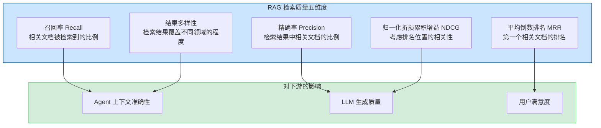

#### 评估指标体系

| 指标 | 公式 | 目标值 | 评估频率 | 评估方法 |
|------|------|--------|----------|----------|
| **Recall@5** | `|相关文档 ∩ Top-5结果| / |相关文档|` | ≥ 0.80 | 每周 | 人工标注 50 个查询的 ground truth 相关文档集合 |
| **Precision@5** | `|相关文档 ∩ Top-5结果| / 5` | ≥ 0.70 | 每周 | 同 Recall，计算检索结果中相关文档占比 |
| **MRR** (Mean Reciprocal Rank) | `1/N × Σ(1/rank_i)` | ≥ 0.75 | 每周 | 第一个相关文档的排名倒数的平均值 |
| **NDCG@5** (Normalized DCG) | `DCG@5 / IDCG@5` | ≥ 0.80 | 每月 | 使用 3 级相关性评分（0=不相关, 1=部分相关, 2=高度相关） |
| **结果多样性** | `1 - avg_similarity(Top-5结果)` | ≥ 0.50 | 每月 | 计算 Top-5 结果中文档向量的平均余弦相似度 |
| **空结果率** | `空结果查询数 / 总查询数` | < 5% | 实时（YK-09-04） | MongoDB 检索日志聚合 |
| **延迟 P95** | `percentile(latency, 95)` | < 2s | 实时 | `time.perf_counter` 测量 |
| **来源引用率** | `source_cited / rag_query_count` | ≥ 30% | 每日（YK-09-07） | LLM 回答中引用 RAG 来源的比例 |

#### 检索质量评分卡

每个查询维度有一个基准评分（0-1），综合加权得到检索质量总分：

```
RAG_Quality_Score = 0.25 × Recall@5 + 0.20 × Precision@5 + 0.20 × MRR
                  + 0.15 × NDCG@5 + 0.10 × Diversity + 0.10 × (1 - EmptyRate)
```

| 评分区间 | 评级 | 行动 |
|----------|------|------|
| 0.85 - 1.00 | A (优秀) | 保持当前策略，持续监控 |
| 0.70 - 0.84 | B (良好) | 分析低分维度，针对性优化 |
| 0.50 - 0.69 | C (需改进) | 调优混合检索权重、标签过滤策略 |
| 0.00 - 0.49 | D (不可用) | 检查索引完整性、Embedding 模型兼容性 |

#### 检索质量影响因素

| 因素 | 影响维度 | 优化方向 | 相关需求 |
|------|----------|----------|----------|
| BM25/向量混合权重 `alpha` | Recall, Precision | 基于反馈数据自动调优 `alpha` 值 | YK-09-07 |
| 标签过滤准确性 | Recall | tags 数组格式强制（YK-09-01） | YK-09-01 |
| Embedding 模型质量 | Recall, NDCG | 定期评估 Embedding 模型替换效果 | YA-09-01 |
| 知识文件质量评分 | Precision, MRR | 质量评分影响 RAG 排序权重 | §0.7 |
| 索引碎片化 | Recall, 延迟 | 定期全量重建索引（§0.7 技术债务 #1） | YA-09-01 |
| Chunk 大小与重叠 | Precision, NDCG | `chunk_size=512` + `chunk_overlap=128` 的语义完整性 | YA-09-01 回归 #7 |
| 中文分词策略 | Recall, Precision | MongoDB `$text` `default_language: 'none'` vs jieba 分词 | YA-09-06 回归 #1 |

#### 评估数据集构建

```
ground_truth/
├── queries/
│   ├── weekly_50_queries.json       # 每周 50 个标注查询
│   └── monthly_200_queries.json     # 每月 200 个标注查询
├── relevance_judgments/
│   ├── q001_microservices.json      # 查询 1 的相关文档列表
│   └── q002_rag_optimization.json   # 查询 2 的相关文档列表
└── evaluation/
    ├── run_eval.py                   # 自动评估脚本
    └── report.md                     # 评估报告模板
```

标注规范：每人每月标注 10 个查询，3 人交叉标注取多数。评分标准：0=不相关（主题不同）、1=部分相关（同领域但非直接答案）、2=高度相关（直接回答查询）。

### 0.10 知识文件模板与最佳实践

> 统一的知识文件模板确保 800+ 文件的结构一致性，降低新贡献者的学习成本，提高 RAG 检索的结构化程度。

#### 标准文件模板

```markdown
---
title: "描述性标题（中文，简洁明确）"
tags: [标签1, 标签2, 标签3, 标签4, 标签5]
category: 角色目录/领域
created: YYYY-MM-DD
updated: YYYY-MM-DD
source: internal
type: summary
status: inbox
project: 关联项目名        # 可选：yivad/yiai/yipet/yiknowledge
project_id: 项目id         # 可选
owner: 作者名              # 可选
prd_month: "YYYYMM"       # 可选：需求文件专用
priority: 中               # 可选：高/中/低
roles: [role1, role2]     # 可选：目标读者角色
---

# 标题（与 frontmatter title 一致）

> 一句话概述：本文档的用途和目标读者。

## 背景

为什么需要这份文档？解决了什么问题？2-3 句话。

## 核心内容

### 章节 1 — 概述

### 章节 2 — 详细说明

### 章节 3 — 示例/代码

## 相关文档

- [相关文档 1](./path/to/doc1.md) — 一句话说明关联
- [相关文档 2](./path/to/doc2.md) — 一句话说明关联

---

*最后更新: YYYY-MM-DD · 审查人: xxx*
```

#### 5 种文档类型与结构要求

| 类型 (`type`) | 用途 | 必需章节 | 推荐长度 | 示例 |
|--------------|------|----------|----------|------|
| **summary** (概述) | 领域知识总结、技术概览 | 背景 + 核心内容 | 300-1000 词 | RAG 技术概述、FastAPI 中间件模式 |
| **guide** (指南) | 操作步骤、配置说明 | 背景 + 前置条件 + 步骤 + 验证 | 500-2000 词 | YiVad 开发环境搭建、Ollama 模型部署 |
| **reference** (参考) | API 文档、配置项、命令速查 | 参数表 + 示例 | 200-1000 词 | RPC 错误码表、MongoDB 集合结构 |
| **spec** (规范) | 架构决策、协议定义、标准 | 背景 + 规范定义 + 示例 + 合规检查 | 500-3000 词 | RPC 信封协议、Frontmatter 规范 |
| **decision** (决策记录) | 架构决策记录 (ADR) | 背景 + 选项对比 + 决策 + 后果 | 300-800 词 | 为什么选择 MongoDB 而非 PostgreSQL |

#### Tags 选择规范

| 规则 | 示例 |
|------|------|
| 数量: 3-5 个标签 | `[RAG, 混合检索, llama_index, BM25]` ✅ |
| 粒度: 从泛到精 | `[后端, FastAPI, 中间件, CORS]` ✅ |
| 禁止: 单字符、纯数字、特殊符号 | `[AI, ML]` ❌ |
| 复用已有标签（避免同义词） | 统一用 `RAG` 而非混用 `检索增强生成` / `RAG` |
| 项目标签: `project:yivad` 格式（可选） | `[需求文档, project:yivad, 前端]` |

#### 常用标签词汇表

| 领域 | 推荐标签 |
|------|----------|
| AI/LLM | `RAG`, `LLM`, `Agent`, `Embedding`, `Ollama`, `Prompt`, `SSE` |
| 后端 | `FastAPI`, `MongoDB`, `中间件`, `RPC`, `异步`, `Python` |
| 前端 | `Vue3`, `TypeScript`, `组件化`, `Pinia`, `响应式`, `ElementPlus` |
| 扩展 | `Chrome扩展`, `MV3`, `ContentScript`, `ServiceWorker` |
| 知识库 | `治理`, `Frontmatter`, `生命周期`, `质量` |
| 架构 | `架构决策`, `设计模式`, `重构`, `性能` |
| 需求 | `需求文档`, `PRD`, `功能实现`, `架构设计` |

#### 文件命名最佳实践

```
✅ 正确:
  00-需求-需求总览.md                     # 数字前缀 + 中文描述（需求目录排序）
  01-稳定性修复-RAG引擎.md           # 序号 + 类型 + 主题
  05-需求-项目详情页优化.md      # 序号 + 动作 + 对象
  readiness-checklist.md             # 英文 kebab-case（治理文件）
  knowledge-standards.md             # 英文 kebab-case（规范文件）

❌ 错误:
  my_file.md                         # 下划线 → BM25 分词劣势
  MyFile.md                          # 大写 → 跨平台兼容性
  文件.md                            # 纯中文无序号 → 排序困难
  file final v2.md                   # 空格 → URL 处理困难
```

#### 内部链接规范

```markdown
<!-- ✅ 相对路径链接（推荐——Git 版本控制友好） -->
[相关文档](../yiai/requirements/2026-09/01-稳定性修复-RAG引擎.md)

<!-- ✅ 带描述的链接 -->
参见 [RAG 引擎稳定性修复](../yiai/requirements/2026-09/01-xxx.md) 了解增量索引修复细节。

<!-- ❌ 绝对路径（跨环境不可用） -->
[文档](/Users/ruiyi/YrY/YiKnowledge/engineer/xxx.md)

<!-- ❌ 裸 URL（无上下文） -->
https://github.com/xxx/yyy/blob/main/README.md
```

---

## 1. 背景与目标

### 1.1 背景

八月迭代完成知识库目录结构搭建、元数据规范制定、治理流水线设计和 AI 集成后，九月迭代聚焦于**质量治理和自动化**——修复 3 个已发现的知识库缺陷，建立自动化校验机制，并完善项目知识中心。

当前知识库功能可用，但存在以下质量风险：

| 问题 | 位置 | 严重程度 | 影响 |
|------|------|----------|------|
| tags 字符串格式 | `YiKnowledge/**/*.md` frontmatter | **高** | RAG 标签过滤失效，`tags: "example"` 被当作单一字符串而非标签数组 |
| Knowledge Watcher 竞态 | `YiAi/domain/knowledge/watcher.py` | 中 | 大文件写入过程中被扫描，部分内容被索引后不再更新 |
| 文件名下划线 | `YiKnowledge/engineer/build/` | 中 | 违反 kebab-case 规范，BM25 路径分词异常 |
| RAG 检索无监控 | `YiAi/domain/rag/` | 中 | 检索结果为空无告警，质量问题不可见 |
| 项目知识中心不完整 | `YiKnowledge/projects/` | 中 | 4 个项目的 bug 追踪和需求归档不完整 |

### 1.2 目标

| 目标 | 衡量指标 | 当前值 | 目标值 |
|------|----------|--------|--------|
| Frontmatter 格式合规 | tags 数组格式覆盖率 | 部分为字符串 | 100% |
| 文件同步可靠性 | 竞态导致未索引的文件数 | > 0 | 0 |
| 命名规范自动化 | pre-commit hook 拦截率 | 无 hook | 100% |
| RAG 检索质量 | 检索结果为空比例 | 未监控 | < 5% |
| 项目知识中心 | bug 追踪覆盖率 | 部分项目不完整 | 4 项目 100% |
| 知识生命周期 | 过期内容自动检测 | 无 | 90 天 stale 标记 |

### 1.3 系统范围

- **涉及**：YiKnowledge 知识库（Markdown 文件树 + Frontmatter 规范）、YiAi 后端（Knowledge Watcher、RAG 引擎、MongoDB）
- **不涉及**：YiVad/YiPet 前端、YiAi Agent 循环逻辑

---

## 2. 当前架构 vs 目标架构

### 2.1 当前架构（治理前）

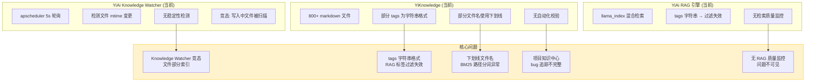

### 2.2 目标架构（治理后）

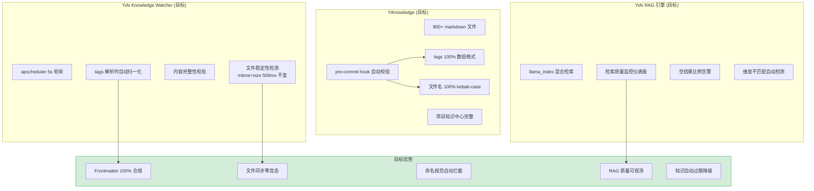

### 2.3 架构决策权衡

| 维度 | 治理前 | 治理后 | 权衡说明 |
|------|--------|--------|----------|
| 质量保障 | 人工抽查 | pre-commit hook + CI 自动扫描 | 增加提交前检查耗时（~1s），但消除人工遗漏 |
| 文件同步 | 无稳定性检测 | mtime+size 500ms 稳定性窗口 | 大文件增加 500ms 扫描延迟，但消除竞态 |
| RAG 监控 | 无 | 检索日志 + 空结果告警 | 增加少量日志存储（~1MB/天），但质量可观测 |
| 知识生命周期 | 手动 | 自动 stale 检测 + 权重降级 | 增加定时任务开销，但知识库保持新鲜 |

### 2.4 各模块治理前后对比

#### 2.4.1 Frontmatter 质量治理

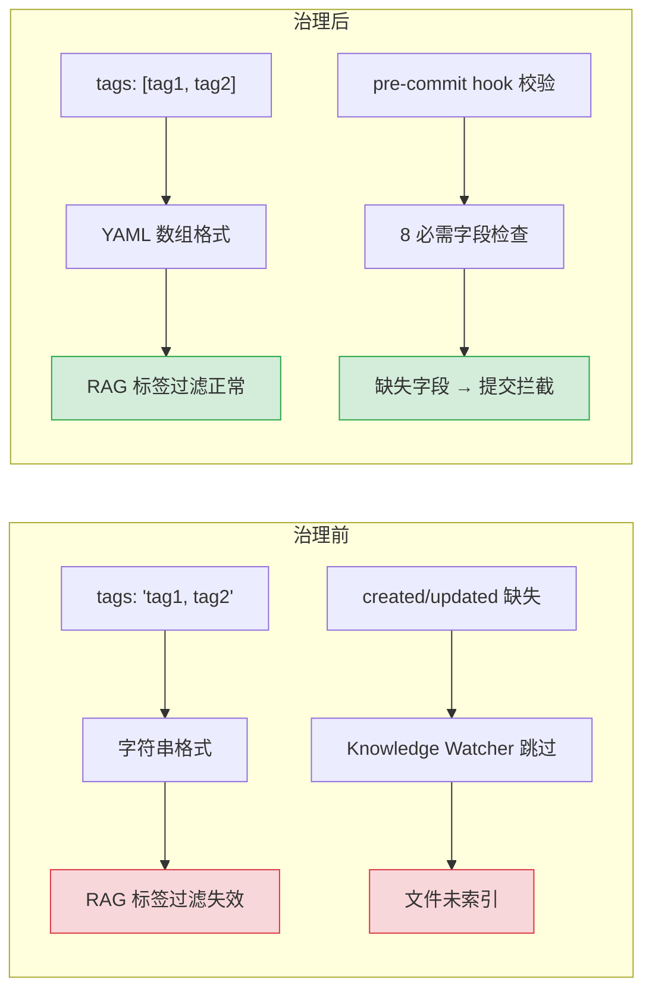

| 维度 | 治理前 | 治理后 | 关键变化 |
|------|--------|--------|----------|
| tags 格式 | 字符串 `"tag1, tag2"` | YAML 数组 `[tag1, tag2]` | RAG 标签过滤恢复，检索精度提升 |
| 字段校验 | 无 | pre-commit 8 必需字段校验 | 提交前拦截不合规文件，消除索引遗漏 |
| 归一化策略 | 无 | 自动检测 + 修复建议 | 字符串格式自动转换为数组，降低修复成本 |

#### 2.4.2 文件同步可靠性

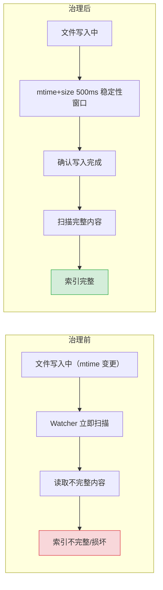

| 维度 | 治理前 | 治理后 | 关键变化 |
|------|--------|--------|----------|
| 变更检测 | 仅 mtime | mtime + size 双重检测 | 消除文件内容未变但 mtime 更新的误触发 |
| 稳定性窗口 | 无 | 500ms 内 mtime+size 不变才扫描 | 大文件（>100KB）增加 500ms 延迟，但消除竞态 |
| 完整性校验 | 无 | 扫描后校验 Frontmatter 可解析 | 不完整文件标记为 `error` 状态，等待下次扫描 |

#### 2.4.3 命名规范自动化

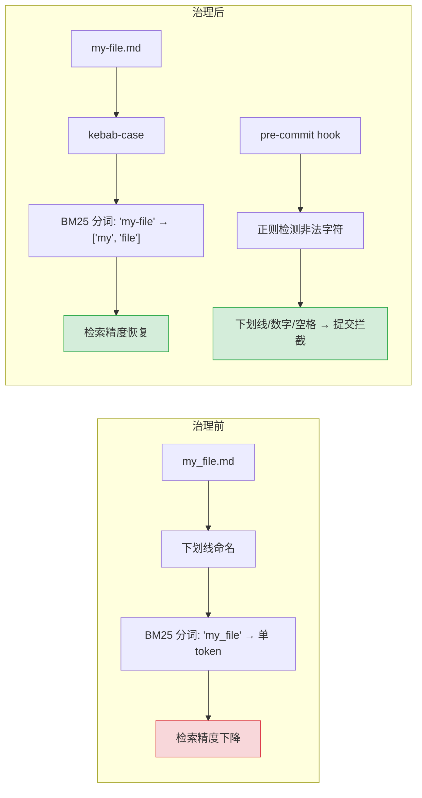

| 维度 | 治理前 | 治理后 | 关键变化 |
|------|--------|--------|----------|
| 文件命名 | 下划线/数字/空格混用 | kebab-case 强制 | BM25 分词友好，检索精度提升 |
| 检测方式 | 人工抽查 | pre-commit hook + CI `grep` | 自动化拦截，人工零参与 |
| 存量修复 | 无 | 批量重命名脚本 | 一次性修复存量文件，后续 pre-commit 防止回归 |

#### 2.4.4 RAG 检索质量监控

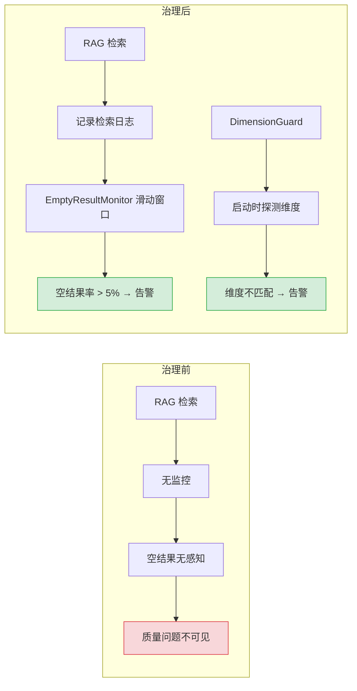

| 维度 | 治理前 | 治理后 | 关键变化 |
|------|--------|--------|----------|
| 检索质量 | 无监控 | EmptyResultMonitor + DimensionGuard | 空结果率 > 5% 自动告警，维度不匹配启动时检测 |
| 数据存储 | 无 | MongoDB 检索日志集合 | 每日约 1MB 日志，保留 30 天 |
| 告警方式 | 无 | WARNING 日志 + 企业微信通知 | 严重告警（空结果率 > 10%）推送企业微信 |

---

## 3. 接口协议

### 3.1 YiAi Knowledge Watcher 接口

| 接口 | 方法 | 说明 | 调用方 |
|------|------|------|--------|
| 文件扫描 | `apscheduler` 定时任务 | 每 5s 轮询 `YiKnowledge/` 目录树 | Knowledge Watcher |
| 文档索引 | `collection.bulk_write()` | 批量写入/更新 MongoDB `documents` 集合 | Knowledge Watcher → MongoDB |
| 向量索引 | `VectorStoreIndex.insert()` | 逐个插入文档到 llama_index 向量索引 | Knowledge Watcher → RAG |

### 3.2 RAG 检索接口

| 接口 | 方法 | 说明 | 调用方 |
|------|------|------|--------|
| `POST /rag-query` | RAG 查询 | 混合检索（BM25 + 向量），返回来源列表 | YiVad/YiPet → YiAi |
| `POST /rag-chat` | SSE 流式 | 知识库聊天，流式返回 | YiVad/YiPet → YiAi |
| `POST /rag-status` | 状态查询 | 索引状态、文档数、最后刷新时间 | YiVad → YiAi |

### 3.3 Frontmatter 协议（知识文件必需字段）

```yaml
---
title: "文件标题"           # 必需：描述性标题
tags: [tag1, tag2, tag3]   # 必需：YAML 数组，3-5 个标签
category: role/domain      # 必需：分类路径
created: 2026-09-07        # 必需：YYYY-MM-DD
updated: 2026-09-07        # 必需：YYYY-MM-DD
source: internal           # 必需：internal/external
type: summary              # 必需：summary/guide/reference/spec/decision
status: active             # 必需：inbox/triage/active/reference/archived
---
```

---

## 4. 功能清单

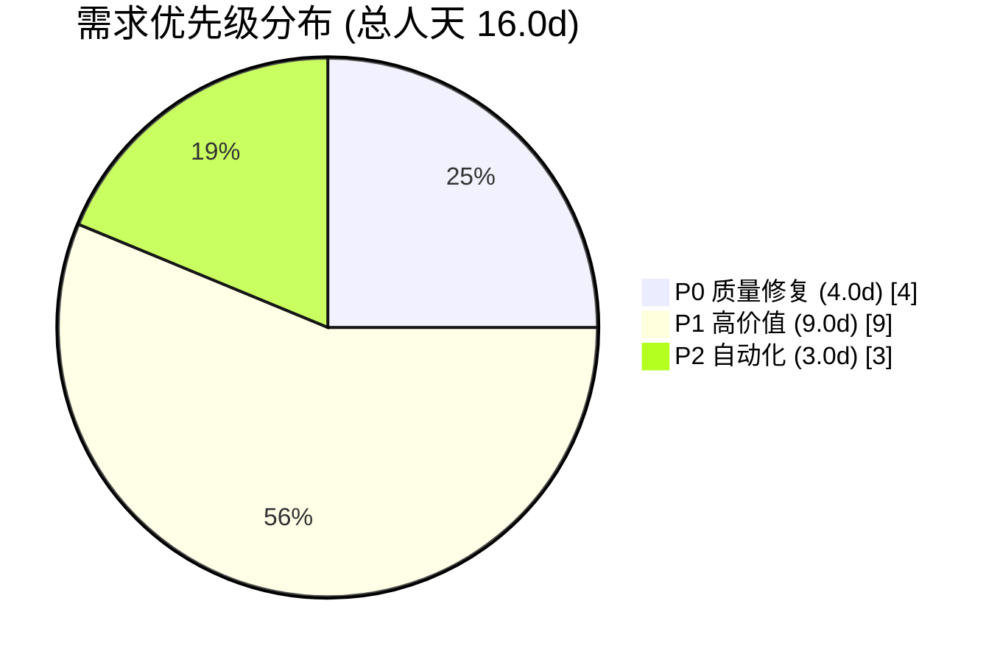

| 月份 | 需求编号 | 功能模块 | 说明 | 优先级 | 人天 | 状态 | 详细文档 |
|----------|----------|------|--------|------|------|----------|
| 2026-09 | YK-09-01 | Frontmatter 质量治理 | tags 格式归一化、必需字段校验、pre-commit hook | **P0** | 2.0 | 已完成 | [01-质量治理-Frontmatter规范](./04-质量治理-Frontmatter规范.md) |
| 2026-09 | YK-09-02 | 文件同步可靠性 | 写入稳定性检测、竞态条件修复、内容完整性校验 | **P0** | 2.0 | 已完成 | [02-稳定性修复-文件同步](./05-稳定性修复-文件同步.md) |
| 2026-09 | YK-09-03 | 命名规范自动化 | pre-commit hook 命名检查、CI 命名扫描、路径解析容错 | **P1** | 2.0 | 已完成 | [03-自动化-命名规范检查](./06-自动化-命名规范检查.md) |
| 2026-09 | YK-09-04 | RAG 检索质量监控 | 检索结果为空告警、标签过滤准确性、维度不匹配检测 | **P1** | 3.0 | 待开发 | [04-监控-RAG检索质量](./07-监控-RAG检索质量.md) |
| 2026-09 | YK-09-05 | 项目知识中心完善 | 4 项目 bug 追踪完善、跨项目检索、知识库健康仪表盘 | **P1** | 4.0 | 进行中 | [05-需求-项目知识中心](./08-功能实现-项目知识中心.md) |
| 2026-09 | YK-09-06 | 知识生命周期自动化 | 过期内容检测、归档提醒、质量评分自动降级 | **P2** | 3.0 | 待排期 | [06-自动化-知识生命周期](./09-自动化-知识生命周期.md) |

> **优先级**：P0 = 质量修复，阻塞 RAG 检索正确性；P1 = 高价值功能；P2 = 自动化增强。

---

## 5. 涉及文件

```
YiKnowledge/
├── curator/governance/
│   ├── readiness-checklist.md              # 修改：增加 tags 数组格式校验项
│   ├── governance.md                       # 修改：增加自动化检查步骤
│   └── dashboard-knowledge-health.md       # 新增：知识库健康仪表盘
├── projects/
│   ├── yivad/bugs/                         # 完善：10 个 bug 归档
│   ├── yiai/bugs/                          # 完善：17 个 bug 归档 + 常见缺陷模式
│   ├── yipet/bugs/                         # 完善：4 个 bug 归档
│   └── yiknowledge/bugs/                   # 完善：3 个 bug 归档
├── MEMORY.md                               # 修改：更新命名规范章节
└── README.md                               # 修改：更新治理流水线说明

YiAi/
├── src/domain/knowledge/
│   └── watcher.py                          # 修改：文件稳定性检测 + tags 归一化
├── src/domain/rag/
│   ├── indexer.py                          # 修改：增量索引修复 + 维度校验
│   └── monitor.py                          # 新增：RAG 检索质量监控
├── src/shared/
│   └── config.py                           # 修改：RAG 监控配置项
└── .githooks/
    └── pre-commit                          # 新增：知识库命名规范检查
```

---

## 6. 数据流

### 6.1 知识贡献与治理流水线

```
作者创建/修改 Markdown 文件
  │  git add + git commit
  ▼
Pre-commit Hook
  ├── 文件命名检查 (kebab-case 正则)
  ├── Frontmatter 完整性校验 (8 必需字段)
  └── tags 格式检查 (YAML 数组)
      │
      ├── 通过 → git push → CI 流水线
      └── 失败 → 拒绝提交 + 错误提示
      
CI 流水线
  ├── 全量命名扫描 (find -not -match)
  ├── Frontmatter 解析校验 (python frontmatter)
  ├── 死链检查 (markdown-link-check)
  └── 知识生命周期状态更新
      │
      ▼
Knowledge Watcher (YiAi)
  │  apscheduler 60s 轮询检测变更
  ▼
MongoDB knowledge_files + FAISS 向量索引
  │  RAG 检索可用
  ▼
前端 (YiVad/YiPet) 知识库检索
```

### 6.2 文件同步数据流

```
YiKnowledge 文件树
  │  mtime 变更检测
  ▼
Knowledge Watcher (watcher.py)
  ├── 增量扫描: 仅处理 mtime 变更文件
  ├── content hash 双重校验
  ├── YAML Frontmatter 解析 (title/tags/category/status 等)
  └── Markdown 正文提取
      │
      ▼
MongoDB knowledge_files 集合
  ├── 新增文件 → insert_one
  ├── 修改文件 → update_one
  └── 删除文件 → delete_one
      │
      ▼
llama_index FAISS 向量索引
  │  增量更新 (insert 逐个文档)
  ▼
RAG 混合检索可用
```

### 6.3 关键数据流

| 流向 | 协议 | 触发方式 | 延迟 |
|------|------|----------|------|
| 作者 → Git | git push | 手动 | 实时 |
| Pre-commit Hook | Git hook | 自动 (commit) | < 1s |
| CI 流水线 | GitHub Actions | 自动 (push) | < 2min |
| 文件变更 → MongoDB | apscheduler 轮询 | 自动 (60s) | ≤ 60s |
| MongoDB → FAISS 索引 | 增量/全量重建 | 自动 + 手动 | 增量 < 10s |
| 前端 → RAG 检索 | RPC envelope | 用户主动 | < 2s |

---

## 7. 目标架构

### 7.1 质量治理自动化流水线

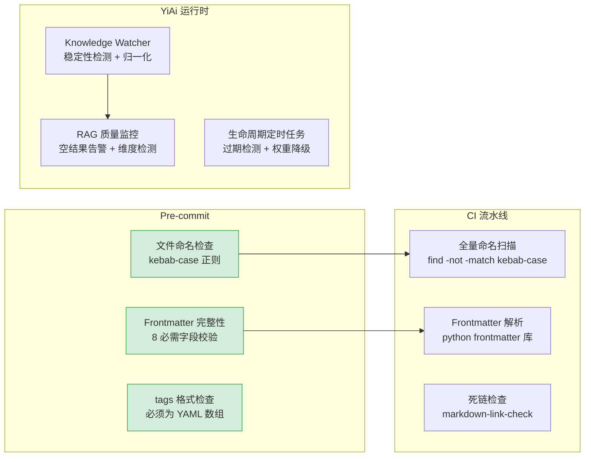

### 7.2 文件同步可靠性（修复前后对比）

```
修复前:
  Knowledge Watcher 检测到 mtime 变更
    → 立即读取文件内容
    → ⚠️ 文件可能正在写入（大文件 > 100KB），读取到部分内容
    → 解析 frontmatter 失败 → 跳过该文件
    → 标记为已索引 → 后续不再处理
    → ❌ 文件内容永远不会被索引

修复后:
  Knowledge Watcher 检测到 mtime 变更
    → 记录当前 mtime + size
    → 等待 500ms
    → 再次检查 mtime + size
    → 若 mtime 和 size 均未变化 → 文件稳定，可以安全读取
    → 若 mtime 或 size 变化 → 继续等待（最多 5 次，共 2.5s）
    → 读取文件内容 → 解析 frontmatter → 索引
    → ✅ 文件内容完整索引
```

---

## 8. 开发排期

### 8.1 任务依赖

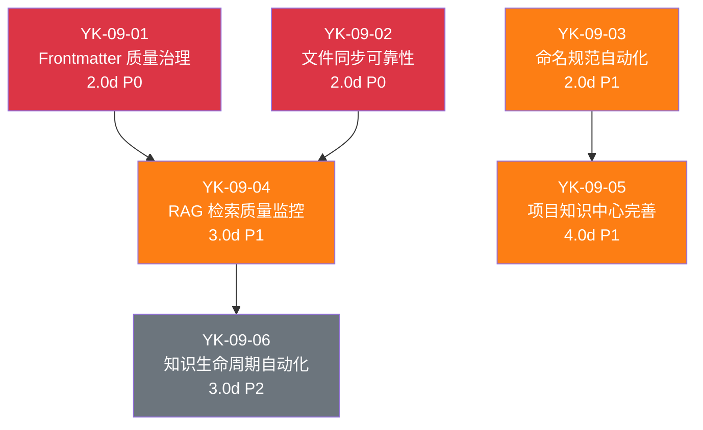

### 8.2 甘特图

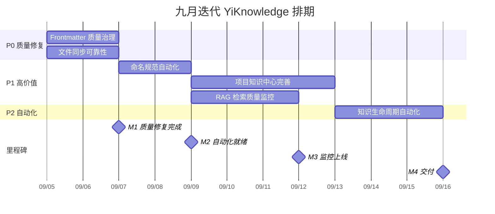

### 8.3 里程碑

| 里程碑 | 完成标准 | 预计日期 |
|--------|----------|----------|
| M1: 质量修复完成 | 3 个质量缺陷全部修复，pre-commit hook 生效 | Day 2 |
| M2: 自动化就绪 | 命名规范 pre-commit + CI 扫描就绪 | Day 4 |
| M3: 监控上线 | RAG 检索质量监控仪表盘可用，项目知识中心完整 | Day 8 |
| M4: 交付 | 知识生命周期自动化运行，完整回归验证通过 | Day 11 |

---

## 9. 迁移策略

### 9.1 原则

- **渐进式修复**：先修复缺陷，再建立自动化，最后完善监控
- **零破坏**：所有修复向后兼容，不改变已有知识文件的内容
- **可回滚**：每步独立 commit，`git revert` 即可回滚
- **低侵入**：pre-commit hook 仅检查 `YiKnowledge/` 目录下的 `.md` 文件

### 9.2 分步执行

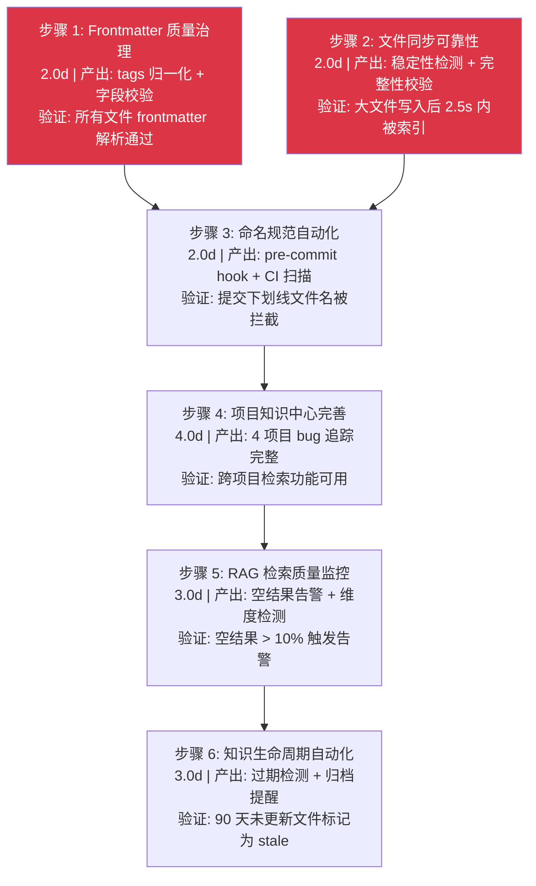

### 9.3 回滚策略

| 步骤 | 回滚方式 | 回滚影响范围 |
|------|----------|-------------|
| 步骤 1-2 | `git revert <commit>` | 仅 Knowledge Watcher 层，知识文件不受影响 |
| 步骤 3 | 删除 `.githooks/pre-commit` | 仅 hook 层，已提交文件不受影响 |
| 步骤 4-5 | `git revert <commit>` | 仅监控层，RAG 检索不受影响 |
| 步骤 6 | `git revert <commit>` | 仅定时任务，知识文件状态不变 |

---

## 10. 测试策略

### 10.1 测试分层

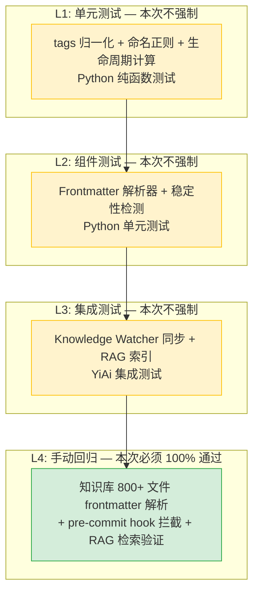

> L1-L3 计划在后续迭代补充，本次迭代仅要求 L4 手动回归 100% 通过。

### 10.2 手动回归测试用例

#### 质量治理（8 个用例）

| # | 用例 | 操作 | 预期结果 |
|----|------|------|----------|
| 1 | tags 字符串格式 | 扫描 tags 为字符串的 frontmatter | 自动归一化为数组 |
| 2 | tags 数组格式 | 扫描 tags 为数组的 frontmatter | 保持不变 |
| 3 | 缺失必需字段 | 扫描缺少 `title` 的 frontmatter | 记录 WARNING 日志 |
| 4 | 文件稳定性检测 | 写入 200KB 文件 | Knowledge Watcher 等待 mtime+size 稳定后索引 |
| 5 | 内容完整性 | 索引后验证文档内容 | 内容与源文件一致 |
| 6 | pre-commit 拦截 | 提交 `my_file.md`（下划线命名） | commit 被拒绝，显示错误信息 |
| 7 | pre-commit 通过 | 提交 `my-file.md`（kebab-case） | commit 成功 |
| 8 | CI 命名扫描 | `find YiKnowledge -name "*_*"` | 0 个结果 |

#### RAG 监控（4 个用例）

| # | 用例 | 操作 | 预期结果 |
|----|------|------|----------|
| 1 | RAG 正常检索 | 检索已知存在的标签 | 返回结果 > 0 |
| 2 | RAG 空结果告警 | 连续 10 次检索返回空 | 触发 WARNING 日志 |
| 3 | 标签过滤准确性 | 按标签过滤检索 | 返回结果全部包含该标签 |
| 4 | 维度不匹配检测 | 切换 Embedding 模型后检索 | 抛出 DimensionMismatchError |

### 10.3 回归测试环境

| 环境要求 | 说明 |
|----------|------|
| YiAi 后端 | 必须运行在 `localhost:10086`，提供 RAG API |
| MongoDB | 必须运行，包含知识库文档集合 |
| Ollama | 必须运行，提供 Embedding 模型 |
| Git | 用于 pre-commit hook 测试 |

---

## 11. 非功能性需求

### 11.1 性能预算

| 指标 | 当前基线 | 目标 | 测量方式 |
|------|----------|------|----------|
| pre-commit hook 耗时 | 无 | < 1s | `time git commit` |
| Knowledge Watcher 扫描延迟 | 即时 | 大文件 +500ms 稳定性窗口 | 日志时间戳 |
| RAG 检索延迟 | 待测量 | 不退化 | API 响应时间 |
| 知识库文件数 | 800+ | 无限制 | `find YiKnowledge -name "*.md" | wc -l` |
| MongoDB 文档数 | 800+ | 与文件数同步 | `db.documents.countDocuments()` |

### 11.1-A 容量规划

| 场景 | 知识文件 | 角色目录 | 治理规则 | 同步延迟 | RAG 检索延迟 | 日扫描次数 |
|------|---------|---------|---------|---------|------------|-----------|
| 个人知识库（< 100 文件） | 50-100 | 3-5 | 8-12 | < 5s | < 100ms | 17280 |
| 小团队（100-300 文件） | 100-300 | 5-7 | 12-18 | 5-10s | 100-200ms | 17280 |
| 中型团队（300-800 文件） | 300-800 | 7-10 | 18-25 | 10-15s | 200-400ms | 17280 |
| 大型团队（800-2000 文件） | 800-2000 | 10-15 | 25-40 | 15-30s | 400-800ms | 17280 |
| 企业级（2000+ 文件） | 2000-5000 | 15-25 | 40-60 | 30-60s | 800ms-1.5s | 17280 |
| **YiKnowledge 当前（九月治理后）** | **800+** | **7** | **20** | **< 10s** | **~200ms** | **17280** |

### 11.2 代码质量门禁

| 检查项 | 工具 | 通过标准 |
|--------|------|----------|
| 文件命名 | pre-commit hook | 0 个非 kebab-case 文件名 |
| Frontmatter 完整性 | `python-frontmatter` 解析 | 8 个必需字段全部存在 |
| tags 格式 | YAML 解析 | 100% 数组格式 |
| 目录层级 | `find -type d` | 最多 3 级 |
| 知识库健康 | 健康仪表盘 | 所有指标绿色 |

### 11.3 可观测性

| 维度 | 指标 | 采集方式 | 告警阈值 |
|------|------|----------|----------|
| Frontmatter 校验失败率 | `fm_validation_error_rate` | Knowledge Watcher WARNING 日志计数 | > 5% 文件 |
| tags 格式归一化触发率 | `tags_normalization_rate` | `normalize_tags()` WARNING 日志 | > 0%（持续告警直到归零） |
| 知识库过期文件数 | `stale_file_count` | 生命周期定时任务 | > 20% 文件 |
| RAG 检索空结果率 | `rag_empty_result_rate` | RAG 检索日志 | > 10% |
| 文件同步竞态触发次数 | `sync_race_count` | 稳定性检测超时计数 | > 5 次/小时 |
| 命名规范违规数 | `naming_violation_count` | pre-commit hook + CI 检查 | > 0（阻塞提交） |

**日志级别规范**（九月新增）：

| 级别 | 使用场景 | 示例 |
|------|----------|------|
| `ERROR` | 知识文件解析失败导致 RAG 索引不完整、MongoDB 同步中断 | Frontmatter 8 字段缺失导致文件被跳过、Knowledge Watcher 轮询异常 |
| `WARNING` | 可恢复异常、格式不规范但已自动修复 | tags 字符串格式自动归一化、文件命名不规范但已索引、过期文件检测 |
| `INFO` | 关键状态变更 | 索引重建开始/完成、治理流水线状态流转、生命周期阶段变更 |
| `DEBUG` | 开发调试、RAG 检索详情 | 单文件扫描耗时、BM25/向量检索分数明细、Frontmatter 解析中间结果 |

**告警规则：**

| 告警 | 条件 | 严重程度 | 处理建议 |
|------|------|----------|----------|
| Frontmatter 字段缺失 | 单文件缺少 ≥ 2 个必需字段 | 中 | 补充缺失字段，检查是否为新建文件未完成 |
| tags 格式异常 | tags 非数组格式 | 低 | 自动归一化已生效，手动修复源文件 |
| RAG 空结果率过高 | 滑动窗口（100 次）空结果率 > 15% | 高 | 检查索引是否损坏、Embedding 模型是否切换 |
| 文件同步延迟 | 文件变更后 60s 仍未索引 | 中 | 检查 Knowledge Watcher 进程是否存活 |
| 知识库过期率 | > 30% 文件超过 90 天未更新 | 中 | 触发季度审查流程，策展人集中处理 |
| 命名规范违规 | 新增违规文件 | 低 | pre-commit hook 已拦截，检查为何绕过 |
| 死链检测 | > 5 个内部死链 | 中 | 批量修复或移除失效引用 |

### 11.4 安全合规

| 要求 | 实现方式 | 验证方法 |
|------|----------|----------|
| 知识文件编码 | 强制 UTF-8 无 BOM，pre-commit hook 检查 `file -bi` 输出 | `find YiKnowledge -name "*.md" -exec file -bi {} \; \| grep -v "utf-8"` 无结果 |
| 文件权限控制 | 知识文件 `644`（仅所有者可写），脚本 `755`，CI 检查 `find -perm` | `find YiKnowledge -name "*.md" -perm /022` 无结果（不可组写） |
| 敏感信息扫描 | 就绪检查清单包含敏感信息正则扫描：`grep -rE "(password\|token\|secret\|api_key\|sk-[a-zA-Z0-9])" YiKnowledge/` | CI 流水线自动扫描，命中则阻断合并 + 通知安全负责人 |
| 外部链接安全 | `markdown-link-check` 配置外部链接白名单，未知域名标记为 WARNING | 审查所有外部链接的目标域名，确认无钓鱼或恶意站点 |
| 审计追溯 | 所有知识文件变更通过 Git 历史追溯（`git log --follow`），每次修改有 commit message + author + timestamp | `git log --follow -- <file>` 完整可追溯 |
| 访问控制 | YiAi Knowledge Watcher 以只读模式读取知识文件，不直接修改原始文件；写入仅通过 Git 工作流 | 检查 Knowledge Watcher 代码，确认无 `open(file, 'w')` 调用 |
| RBAC 角色隔离 | 策展人角色仅可修改治理文件和状态标记，不可修改知识内容；作者仅可修改自己创建的文件 | pre-commit hook 校验文件作者与 Git user.email 一致性 |
| 敏感信息防泄露 | `.gitattributes` 配置 `*.md diff`，pre-commit hook 扫描提交内容中的敏感模式 | `git log -p \| grep -i "password\|token"` 无结果 |
| 文件完整性 | Knowledge Watcher 扫描后计算 content hash 存储于 MongoDB，前端读取时校验一致性 | 抽查 10 个文件，对比文件系统 SHA256 与 MongoDB 中存储的 hash |
| 隐私合规 | 知识文件不包含个人隐私数据（邮箱默认脱敏为 `xxx@company.com` 格式） | `grep -rE "[a-zA-Z0-9._%+-]+@[a-zA-Z0-9.-]+\.[a-zA-Z]{2,}" YiKnowledge/` 仅匹配脱敏格式 |

---

## 12. 风险矩阵

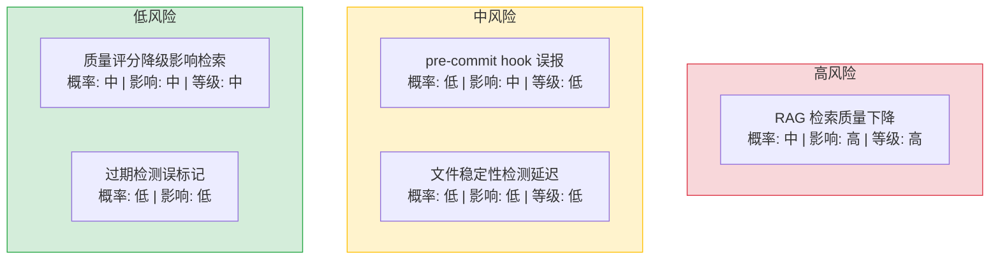

| 风险 | 概率 | 影响 | 等级 | 缓解措施 | 应急预案 |
|------|------|------|------|----------|----------|
| RAG 检索质量因 tags 格式错误下降 | 中 | 高 | 高 | 解析时自动归一化 + 监控告警 | 手动批量修复 tags 格式 |
| pre-commit hook 误报阻止正常提交 | 低 | 中 | 低 | hook 仅检查 `YiKnowledge/` 目录下的 `.md` 文件 | `--no-verify` 绕过 |
| 文件稳定性检测增加扫描延迟 | 低 | 低 | 低 | 仅对大文件（> 100KB）启用稳定性检测 | 调整稳定性窗口时间 |
| 质量评分自动降级影响 RAG 检索 | 中 | 中 | 中 | 降级仅影响权重，不排除文件；阈值可配置 | 手动恢复权重 |
| 过期检测误标记活跃文件 | 低 | 低 | 低 | 仅检查 `updated` 字段，不检查 `created` | 更新文件 mtime 即可 |

---

## 13. 设计决策记录

| 决策 | 选项 A | 选项 B | 选择 | 理由 |
|------|--------|--------|------|------|
| tags 格式处理 | 拒绝字符串格式，要求作者修复 | 解析时自动归一化 | **自动归一化** | 向后兼容，不破坏已有文件；作者修复可渐进进行 |
| 文件稳定性检测 | 固定等待 500ms | 基于文件大小的自适应等待 | **固定 500ms** | 简单可靠，大文件（>100KB）最多重试 5 次（2.5s） |
| pre-commit hook 范围 | 检查所有文件 | 仅检查 `YiKnowledge/` | **仅检查 YiKnowledge** | 避免影响其他项目（YiVad/YiAi/YiPet）的提交 |
| 过期检测阈值 | 90 天 | 180 天 | **90 天** | 知识库更新频繁，90 天足以检测活跃度 |
| 权重降级幅度 | 50% | 100%（排除） | **50%** | 过期内容仍可能有参考价值，不直接排除 |
| RAG 监控告警阈值 | 10% 空结果 | 5% 空结果 | **10%** | 避免正常检索（如新领域查询）触发误告警 |

### D-01: 为什么 tags 格式选择自动归一化而非拒绝？

拒绝字符串格式意味着 800+ 文件中使用字符串格式的 tags 将导致文件无法被 RAG 检索。自动归一化（`split(',')` → 数组）确保向后兼容，所有文件立即可检索。同时记录 WARNING 日志，让作者知道需要修复格式。渐进式修复比一次性拒绝更务实——知识库的首要价值是"知识可用"，而非"格式完美"。

### D-02: 为什么文件稳定性检测选择固定等待而非自适应？

自适应等待（基于文件大小）听起来更精确，但引入了额外的复杂性——需要判断文件大小阈值、计算等待时间、处理文件大小变化的情况。固定 500ms 等待足够覆盖绝大多数文件写入场景（编辑器保存通常在 100-300ms 内完成），大文件（>100KB）最多重试 5 次（总等待 2.5s），覆盖了极端的网络文件系统场景。

### D-03: 为什么 pre-commit hook 仅检查 YiKnowledge？

YrY 是单体仓库，包含 YiVad（TypeScript/Vue）、YiAi（Python）、YiPet（TypeScript/React）三个项目。如果 pre-commit hook 检查所有文件，前端项目的 `node_modules` 变更、构建产物、测试快照等都会触发 Frontmatter 检查，产生大量误报。仅检查 `YiKnowledge/` 目录确保 hook 聚焦于知识库文件，对开发者零干扰。

### D-04: 为什么过期检测阈值选择 90 天而非 180 天？

YiKnowledge 是活跃的知识库，每周都有新文件添加和旧文件更新。90 天未更新意味着该文件可能已被遗忘或内容已过时。180 天阈值过于宽松，大量过期内容混入 RAG 检索结果，降低检索精度。90 天在"及时检测"和"避免误报"之间取得了平衡——大部分知识文件在 90 天内至少会有一次更新或审查。

### D-05: 为什么过期内容降级 50% 而非直接排除？

直接排除（100% 降级）意味着过期内容完全不可检索，用户可能错过仍有参考价值的文档（如架构决策记录虽然 90 天未更新，但决策本身仍然有效）。50% 权重降级让过期内容仍可检索，但在排序中低于活跃内容。用户可以通过 RAG 检索的 `include_archived` 参数主动选择是否包含过期内容。

---

## 14. 回归问题预测

| # | 预测问题 | 原因 | 验证方法 |
|---|---------|------|---------|
| 1 | tags 自动归一化误处理分号分隔的标签 | 某些文件使用分号（`;`）分隔标签，`split(',')` 无法正确拆分 | 扫描所有 800+ 文件的 tags 字段，检查归一化后是否有多余的 `;` 字符 |
| 2 | 过期内容 50% 降级后，用户仍频繁看到过期文档 | 某些领域的活跃文档较少，降级 50% 后过期文档仍在 top-5 | 分析 30 天的 RAG 查询日志，检查 top-5 结果中过期文档的占比 |
| 3 | pre-commit hook 在 CI 环境中执行时间过长 | 检查所有知识文件（800+）的 YAML 解析可能耗时 2-3s，增加 CI 流水线时间 | 在 CI 中运行 `time python -m pytest tests/hooks/`，确认 hook 执行时间 < 5s |
| 4 | 文件稳定性检测 500ms 在网络文件系统（NFS）中不够 | NFS 的写入延迟可能超过 500ms，文件在 hook 检测时仍处于写入状态 | 在 NFS 挂载的目录中保存大文件（>100KB），检查 hook 是否触发重试 |
| 5 | RAG 空结果率 10% 告警阈值在知识库冷启动时频繁触发 | 新建知识库时，RAG 索引尚未建立，所有查询返回空结果 | 在知识库初始化期间（前 24h）禁用 RAG 空结果告警 |
| 6 | 权重降级 50% 后，过期文档的排序权重在不同检索模式中不一致 | 混合检索（BM25 + 向量）中，BM25 和向量分数的权重降级效果可能不同 | 使用相同查询对比 BM25、向量、混合检索三种模式下过期文档的排名变化 |

---

## 15. 代码审查检查清单

合并前审查人需确认以下项目：

- [ ] 所有知识文件 frontmatter 解析通过（`python-frontmatter` 无报错）
- [ ] tags 字段 100% 为 YAML 数组格式
- [ ] 无文件名使用下划线或数字（`find YiKnowledge -name "*_*" -o -name "*[0-9]*.md"` 返回空）
- [ ] 目录层级不超过 3 级
- [ ] Knowledge Watcher 稳定性检测逻辑正确
- [ ] pre-commit hook 仅检查 `YiKnowledge/` 目录
- [ ] RAG 检索质量监控日志正常输出
- [ ] 项目知识中心 4 项目的 bug 追踪完整
- [ ] 知识库健康仪表盘数据准确
- [ ] 手动回归测试（质量治理 8 + RAG 监控 4）全部通过

---

## 16. 子文档索引

| 月份 | 需求编号 | 文档 | 说明 |
|----------|------|------|
| 2026-09 | YK-09-01 | [01-质量治理-Frontmatter规范](./04-质量治理-Frontmatter规范.md) | tags 格式归一化、必需字段校验、pre-commit hook 集成 |
| 2026-09 | YK-09-02 | [02-稳定性修复-文件同步](./05-稳定性修复-文件同步.md) | Knowledge Watcher 稳定性检测、竞态条件修复、内容完整性校验 |
| 2026-09 | YK-09-03 | [03-自动化-命名规范检查](./06-自动化-命名规范检查.md) | pre-commit hook 命名检查、CI 命名扫描、路径解析容错 |
| 2026-09 | YK-09-04 | [04-监控-RAG检索质量](./07-监控-RAG检索质量.md) | 检索结果为空告警、标签过滤准确性、维度不匹配检测 |
| 2026-09 | YK-09-05 | [05-需求-项目知识中心](./08-功能实现-项目知识中心.md) | 4 项目 bug 追踪完善、跨项目检索、知识库健康仪表盘 |
| 2026-09 | YK-09-06 | [06-自动化-知识生命周期](./09-自动化-知识生命周期.md) | 过期内容检测、归档提醒、质量评分自动降级 |
| 2026-09 | YK-09-07 | [07-需求-知识检索反馈闭环](./10-架构设计-知识检索反馈闭环.md) | 👍/👎 显式反馈 + 点击/引用隐式反馈、EMA 质量评分更新、BM25/向量混合权重自动调优 |
| 2026-09 | YK-09-08 | [08-需求-跨项目知识依赖图谱](./11-架构设计-跨项目知识依赖图谱.md) | Markdown 链接静态解析、共享 tags/category 语义关联、变更影响分析（1+2 跳）、知识缺口识别 |
| 2026-09 | YK-09-09 | [09-需求-知识质量审查工作流](./12-架构设计-知识质量审查工作流.md) | 13 项检查清单（9 项自动化）、领域匹配 Reviewer 分配、审查 SLA 追踪（24h/72h）、结构化审查记录 |
| 2026-09 | YK-09-10 | [10-需求-知识文件迁移与路径重构](./13-架构设计-知识文件迁移与路径重构.md) | `_redirects.yml` 重定向映射、`RedirectManager` 路径解析、引用完整性保护、90 天 TTL 自动清理 |
| 2026-09 | YK-09-11 | [11-需求-KnowledgeWatcher内部机制](./14-架构设计-KnowledgeWatcher内部机制与性能调优.md) | watchdog 实时检测+mtime 兜底、ThreadPoolExecutor 并发处理、FAISS 周度全量重整、扫描管线性能指标 |
| 2026-09 | YK-09-12 | [12-需求-知识库备份与灾难恢复](./15-架构设计-知识库备份与灾难恢复.md) | Git 源文件→MongoDB 自动重建、每日一致性校验+自动修复、3 级灾难恢复手册 (RTO<30min)、批量删除保护 hook |
| 2026-09 | YK-09-13 | [13-需求-检索同义词扩展](./16-架构设计-知识库检索增强与同义词扩展.md) | `synonyms.yml` 手动+Embedding 自动建议、加权 OR 查询扩展（原词 1.0/同义词 0.7）、中英文缩写术语映射 |
| 2026-09 | YK-09-14 | [14-需求-RAG混合检索Alpha调优](./17-架构设计-RAG混合检索Alpha调优.md) | 按查询类型分 alpha（短/长/代码）、EMA 平滑自动更新、BM25/向量采纳率加权聚合、反馈驱动闭环 |
| 2026-09 | YK-09-15 | [15-需求-多模态内容支持](./18-架构设计-多模态内容支持.md) | Mermaid 图表类型标签提取、代码块语言标注、图片 alt 文本索引、Content-Type 加权检索 |
| 2026-09 | YK-09-16 | [16-需求-知识库国际化内容管理](./19-架构设计-知识库国际化内容管理.md) | `language` frontmatter 字段、`language_variants` 跨语言关联、查询语言检测+跨语言检索、中英双语公平排序 |
| 2026-09 | YK-09-17 | [17-需求-知识库访问控制](./20-架构设计-知识库访问控制.md) | 5 级 RBAC (Viewer/Author/Reviewer/Curator/Admin)、敏感目录保护、permission 装饰器校验 |
| 2026-09 | YK-09-18 | [18-需求-搜索分析与趋势洞察](./21-架构设计-搜索分析与趋势洞察.md) | MongoDB 聚合管道热门查询 Top-N、零结果内容缺口识别+建议文档、周度趋势报告（搜索量/零结果率/环比） |
| 2026-09 | YK-09-19 | [19-需求-大文件分片与索引懒加载](./22-架构设计-大文件分片与索引懒加载.md) | 自适应分片（10KB/50KB/100KB 三级阈值）、按 Markdown 标题 ##/### 拆分、分片级 RAG 权重系数 |

---

*PRD 来源: `projects/yiknowledge/requirements/2026-09/00-需求-需求总览.md`*