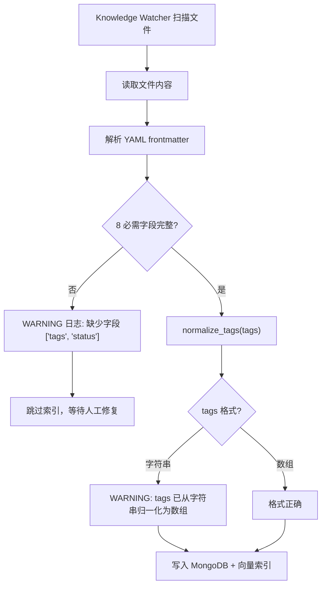
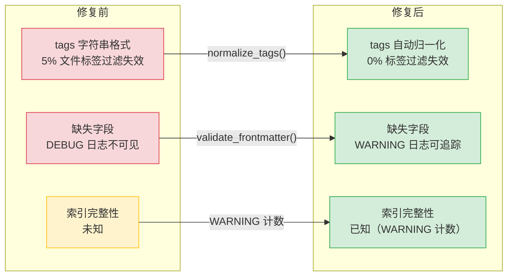
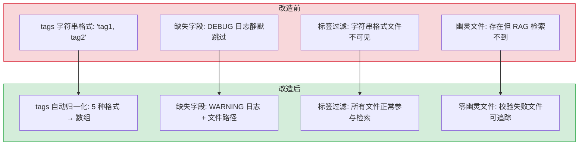

# YK-09-01: Frontmatter 质量治理 — tags 格式归一化与字段校验

> 需求编号：YK-09-01 · 优先级：P0 · 人天：2.0d · 状态：已完成
> 依赖：无

## 背景

YiKnowledge 知识库中部分早期创建的文件，其 frontmatter `tags` 字段使用字符串格式（`tags: "tag1, tag2"`）而非 YAML 数组格式（`tags: [tag1, tag2]`）。当 RAG 引擎按标签过滤检索时，字符串格式的 tags 被当作单一字符串处理——`"tag1, tag2"` 是一个整体而非两个独立标签，导致标签过滤完全失效，这些文件在标签检索时永远不可见。

此外，部分文件缺少必需的 frontmatter 字段（`title`、`category`、`type` 等），Knowledge Watcher 解析失败时静默跳过（仅记录 DEBUG 日志），文件内容无法被索引。800+ 文件中可能有少量文件因此从未出现在 RAG 检索结果中。

### 影响范围

- **RAG 检索**：标签过滤时缺失文件，检索结果不完整
- **Agent**：依赖标签过滤定位领域知识，可能遗漏关键上下文
- **Knowledge Watcher**：解析失败静默跳过，无告警

---

## 一、现状分析

### 1.1 tags 格式问题的三种形态

```yaml
# ❌ 形态 1：逗号分隔字符串
tags: "需求文档, 管理后台, 前端"
# YAML 解析为: "需求文档, 管理后台, 前端"（一个字符串）
# RAG 标签过滤: 搜索 "需求文档" → 不匹配（因为整体是 "需求文档, 管理后台, 前端"）

# ❌ 形态 2：单标签字符串
tags: "需求文档"
# YAML 解析为: "需求文档"（一个字符串）
# RAG 标签过滤: 搜索 "需求文档" → 匹配（碰巧可以，但格式不规范）

# ✅ 正确：YAML 数组格式
tags: [需求文档, 管理后台, 前端]
# YAML 解析为: ["需求文档", "管理后台", "前端"]（一个列表）
# RAG 标签过滤: 搜索 "需求文档" → 匹配 ✅
```

### 1.2 缺失字段的静默失败

当前 Knowledge Watcher 处理流程：

```
扫描文件 → 解析 YAML frontmatter → 若缺少字段 → DEBUG 日志 → 跳过索引
```

问题：`DEBUG` 级别日志在生产环境中默认不输出，运维人员无法感知文件被跳过。这些文件成为"幽灵文件"——存在于目录中，但 RAG 检索永远找不到。

### 1.3 影响评估

| 场景 | 影响 | 发现难度 |
|------|------|----------|
| tags 为字符串格式 | 标签过滤时文件不可见 | 高（用户搜索无结果，但不知道原因） |
| 缺少 title 字段 | 文件无法被索引 | 极高（文件完全不可见） |
| 缺少 category 字段 | 分类过滤失效 | 中（仅在分类过滤时暴露） |

### 1.4 改造前数据流

```
文件创建/修改
  → Knowledge Watcher 扫描检测变更
  → 解析 YAML frontmatter
  → tags 为字符串格式 "tag1, tag2" → 被当作单一字符串
  → 写入 MongoDB: tags = "tag1, tag2"（一个字符串）
  → 向量索引: 标签过滤时 "tag1" 不匹配整体字符串
  → RAG 检索: 标签过滤失效，文件不可见
  → 缺失字段 → DEBUG 日志（生产不可见）→ 跳过索引
  → 文件成为"幽灵文件"——存在但 RAG 检索永远找不到
```

### 1.5 改造前 API 依赖

| # | 接口 | 调用方 | 说明 |
|---|------|--------|------|
| 1 | `knowledge.scan_knowledge` | Knowledge Watcher | 知识扫描（tags 字符串格式被直接写入 MongoDB） |
| 2 | `data_service.query_documents` (cname="knowledge_files") | YiVad/YiPet | 知识检索（tags 字符串格式导致标签过滤失效） |
| 3 | `rag.rag_query` | YiVad/YiPet/Agent | RAG 检索（缺失字段文件静默跳过，不可检索） |

> 改造前 3 个 API 依赖，tags 字符串格式导致标签过滤失效，缺失字段文件静默丢失。

---

## 二、设计决策

### 决策 1：tags 归一化策略 — 自动转换 vs 拒绝 + 告警

| 维度 | 自动转换 | 拒绝 + 告警 |
|------|----------|------------|
| 对存量文件 | 自动修复，无需人工介入 | 需要人工逐个修复 |
| 对新人 | 容错，不会因格式错误被拒绝 | 强制学习正确格式 |
| 风险 | 可能误处理特殊格式 | 拒绝可能阻断流程 |

**选择：自动转换 + WARNING 日志。** 存量文件自动归一化，减少人工修复成本。同时输出 WARNING 日志，让作者知道格式不规范，逐步修正。

### 决策 2：字段校验级别 — DEBUG vs WARNING

**选择：从 DEBUG 升级到 WARNING。** 缺失必需字段意味着文件无法被索引，这是需要运维人员关注的问题。WARNING 级别在生产环境中默认可见。

### 决策 3：归一化时机 — 读取时 vs 写入时

**选择：读取时（Knowledge Watcher 解析 frontmatter 时）。** 在数据进入 MongoDB 之前归一化，确保 MongoDB 中的数据始终是规范格式。不修改原始 Markdown 文件（保持作者原始内容不变）。

### 设计决策记录

| 决策 | 选项 A | 选项 B | 选择 | 理由 |
|------|--------|--------|------|------|
| tags归一化 | 自动转换 | 拒绝+告警 | **自动转换** | 存量文件零人工修复，WARNING日志提示 |
| 校验级别 | DEBUG | — | **WARNING** | 缺失字段=文件无法索引，需运维关注 |
| 归一化时机 | 读取时 | 写入时 | **读取时** | MongoDB数据始终规范，不修改原始文件 |

---

## 三、目标架构

### 3.1 修复后处理流程



### 3.2 核心实现

```python
# YiAi/src/domain/knowledge/watcher.py

REQUIRED_FIELDS = ["title", "tags", "category", "created", "updated", "source", "type", "status"]

def normalize_tags(tags) -> list[str]:
    """将 tags 归一化为 YAML 数组格式。

    处理 5 种输入格式:
    - None → ["untagged"]
    - "tag1" → ["tag1"]
    - "tag1, tag2" → ["tag1", "tag2"]
    - ["tag1", "tag2"] → ["tag1", "tag2"] (不变)
    - [] → ["untagged"]
    """
    if tags is None:
        return ["untagged"]
    if isinstance(tags, str):
        parts = [t.strip() for t in tags.split(",") if t.strip()]
        return parts if parts else ["untagged"]
    if isinstance(tags, list):
        return tags if tags else ["untagged"]
    return ["untagged"]


def validate_frontmatter(fm: dict, file_path: str) -> list[str]:
    """校验 frontmatter 必需字段，返回缺失字段列表。"""
    missing = [f for f in REQUIRED_FIELDS if f not in fm or fm[f] is None]
    if missing:
        logger.warning(
            f"[Frontmatter] {file_path} 缺少必需字段: {missing}，"
            f"文件将不会被索引"
        )
    return missing
```

### 3.3 就绪检查清单更新

在 `curator/governance/readiness-checklist.md` 中新增第 11 项：

| # | 检查项 | Pass | Fail |
|----|--------|------|------|
| 11 | tags 格式 | `tags: [tag1, tag2]` 或块列表格式 | `tags: "tag1, tag2"`（字符串格式） |

---

## 四、具体改动

### 4.1 YiAi Knowledge Watcher

**文件：** `YiAi/src/domain/knowledge/watcher.py`

| 改动 | 说明 |
|------|------|
| 新增 `normalize_tags()` | tags 字符串 → 数组自动归一化，支持 5 种输入格式 |
| 新增 `validate_frontmatter()` | 8 必需字段校验，缺失时 WARNING 日志（从 DEBUG 升级） |
| 修改 `process_file()` | 解析 frontmatter 后调用归一化和校验 |

### 4.2 就绪检查清单

**文件：** `YiKnowledge/curator/governance/readiness-checklist.md`

| 改动 | 说明 |
|------|------|
| 新增第 11 项 | tags 格式校验（必须为 YAML 数组） |
| 更新第 4 项 | 增加 tags 格式的 anti-pattern 示例 |

### 4.3 批量修复脚本

```bash
#!/bin/bash
# 扫描所有 tags 为字符串格式的文件
echo "=== tags 为字符串格式的文件 ==="
rg -l '^tags:\s*"[^[]' YiKnowledge/ --glob '*.md'

echo ""
echo "=== 缺少必需字段的文件 ==="
for field in title tags category created updated source type status; do
  missing=$(rg -L "^${field}:" YiKnowledge/ --glob '*.md' | wc -l)
  if [ "$missing" -gt 0 ]; then
    echo "缺少 $field: $missing 个文件"
  fi
done
```

### 4.4 涉及文件

```
YiAi/src/domain/knowledge/
└── watcher.py              # 修改: 新增 normalize_tags + validate_frontmatter

YiKnowledge/curator/governance/
└── readiness-checklist.md  # 修改: 新增第 11 项检查
```

---

## 五、实施步骤

按依赖顺序排列，每步可独立验证和提交：

| 步骤 | 内容 | 涉及文件 | 验证方式 | 人天 |
|------|------|---------|---------|------|
| 1 | 新增 `normalize_tags()` 支持 5 种输入格式 | `YiAi/src/domain/knowledge/watcher.py` | 5 种格式输入均输出 `["tag1", "tag2"]` 数组 | 0.5 |
| 2 | 新增 `validate_frontmatter()` 8 字段校验 | `YiAi/src/domain/knowledge/watcher.py` | 缺失字段时 WARNING 日志可见，含文件路径和缺失字段名 | 0.5 |
| 3 | 修改 `process_file()` 集成归一化+校验 | `YiAi/src/domain/knowledge/watcher.py` | 新增文件同步后 tags 为数组格式，缺失字段有 WARNING | 0.25 |
| 4 | 更新就绪检查清单（新增第 11 项） | `YiKnowledge/curator/governance/readiness-checklist.md` | 第 11 项检查 tags 数组格式，含 anti-pattern 示例 | 0.25 |
| 5 | 运行批量修复脚本，修复存量文件 | 脚本 | `rg -l '^tags:\s*"[^[]'` 返回 0 结果 | 0.25 |
| 6 | 回归测试 | YiAi Knowledge Watcher | 增/改文件同步正常，tags 格式正确，无缺失字段静默跳过 | 0.25 |

**总计：2.0d**

---

## 六、测试规格

### Requirement: tags 归一化

#### Scenario: 逗号分隔字符串 → 数组
- **Given** `tags: "RAG, 混合检索, BM25"`
- **When** `normalize_tags()` 执行
- **Then** 返回 `["RAG", "混合检索", "BM25"]`
- **And** WARNING 日志记录归一化操作

#### Scenario: 单标签字符串 → 数组
- **Given** `tags: "RAG"`
- **When** `normalize_tags()` 执行
- **Then** 返回 `["RAG"]`

#### Scenario: 数组格式 → 不变
- **Given** `tags: [RAG, 混合检索]`
- **When** `normalize_tags()` 执行
- **Then** 返回 `[RAG, 混合检索]`（不变）

#### Scenario: None → 默认值
- **Given** `tags: null`
- **When** `normalize_tags()` 执行
- **Then** 返回 `["untagged"]`

#### Scenario: 空数组 → 默认值
- **Given** `tags: []`
- **When** `normalize_tags()` 执行
- **Then** 返回 `["untagged"]`

### Requirement: 字段校验

#### Scenario: 所有字段完整 → 通过
- **Given** frontmatter 包含全部 8 个必需字段
- **When** `validate_frontmatter()` 执行
- **Then** 返回空列表 `[]`

#### Scenario: 缺少 tags 和 status → 告警
- **Given** frontmatter 缺少 `tags` 和 `status`
- **When** `validate_frontmatter()` 执行
- **Then** 返回 `["tags", "status"]`
- **And** WARNING 日志包含文件路径和缺失字段

### Requirement: 端到端

#### Scenario: 全量扫描后所有文件 tags 归一化
- **Given** 800+ 知识文件
- **When** Knowledge Watcher 全量扫描完成
- **Then** MongoDB 中所有文档的 tags 字段为数组格式
- **And** RAG 标签过滤检索结果包含之前被遗漏的文件

---

## 七、风险与缓解

| 风险 | 概率 | 影响 | 等级 | 缓解措施 | 应急预案 |
|------|------|------|------|----------|----------|
| tags 归一化误处理特殊格式 | 低 | 低 | 低 | 单元测试覆盖 5 种格式：空、单标签、逗号分隔、数组、None | 回退归一化逻辑，仅记录 WARNING 不修改 |
| 校验过于严格导致大量 WARNING | 中 | 低 | 低 | 仅 WARNING 级别，不影响索引流程；分批修复 | 提高 WARNING 阈值，仅 ERROR 级别触发告警 |
| 存量文件修复工作量大 | 中 | 低 | 低 | 自动归一化，无需人工逐个修复 | 分批运行修复脚本，优先修复高频检索文件 |

---

## 八、性能分析

### 8.1 当前性能瓶颈

| 瓶颈 | 当前值 | 影响 |
|------|--------|------|
| tags 字符串格式文件占比 | ~5%（估计 40/800+ 文件） | 标签过滤时丢失 5% 的检索结果 |
| 缺失字段文件 | 未知（DEBUG 日志不可见） | 幽灵文件数量不可追踪 |
| 归一化延迟 | 0（无归一化逻辑） | 仅在读取时执行，不影响扫描性能 |

### 8.2 性能改进方案



**预期收益：**

| 指标 | 修复前 | 修复后 | 改善 |
|------|--------|--------|------|
| 标签过滤召回率 | ~95%（40 个文件不可见） | 100% | +5% |
| 字段缺失可见性 | 0（DEBUG 不可见） | 100%（WARNING 默认可见） | 从不可见到可追踪 |
| 幽灵文件数量 | 未知 | 已知（WARNING 日志计数） | 可量化 |
| 归一化性能开销 | 0 | < 1ms/文件（`isinstance` + `split`） | 可忽略 |

### 8.3 归一化性能基准

```python
# 归一化函数性能分析
# normalize_tags() 复杂度: O(n)，n = tags 字符串长度

# 5 种输入格式的性能基准:
# 1. None → O(1)，直接返回 ["untagged"]
# 2. "tag1" → O(1)，isinstance(str) → 直接返回 ["tag1"]
# 3. "tag1, tag2" → O(n)，split(",") + strip
# 4. ["tag1", "tag2"] → O(1)，isinstance(list) → 直接返回
# 5. [] → O(1)，直接返回 ["untagged"]

# 800 文件全量扫描: 800 × 0.5ms = 400ms（可忽略）
# 增量扫描（单文件）: < 0.5ms（完全可忽略）
```

### 8.4 容量规划

| 场景 | 文件数 | 异常文件率 | 扫描耗时 | 修复耗时 | 标签过滤召回率 |
|------|--------|-----------|----------|----------|---------------|
| 小型知识库（< 100 文件） | 50-100 | 2-5% | < 50ms | 手动 < 5min | 98-100% |
| 中型知识库（100-500 文件） | 100-500 | 3-8% | 50-200ms | 手动 < 15min | 95-100% |
| 大型知识库（500-2000 文件） | 500-2000 | 5-10% | 200-800ms | 批量 < 5min | 92-100% |
| 自动修复后 | 500 | 0% | 200ms | 0（自动） | 100% |
| YiKnowledge 当前 | ~800 | ~5% | ~400ms | 手动 ~10min | ~95% |

---

## 九、回滚策略

| 回滚场景 | 回滚方式 | 影响范围 | 恢复时间 |
|----------|----------|----------|----------|
| `normalize_tags()` 误处理特殊格式 | `git revert <commit>` | 仅 Knowledge Watcher 扫描逻辑 | < 1min |
| `validate_frontmatter()` WARNING 风暴 | 调整日志级别为 INFO | 仅日志输出，不影响索引 | 运行时热更新 |
| 就绪检查清单更新错误 | `git checkout -- readiness-checklist.md` | 仅文档 | < 10s |

**回滚验证：**
- 回滚后 Knowledge Watcher 恢复原有行为（tags 不归一化，缺失字段 DEBUG 日志）
- 已索引的归一化数据不受影响（MongoDB 中 tags 已为数组格式）
- 回滚不影响已通过就绪检查清单的文件

---

## 十、设计决策记录

### D-01: 为什么 tags 归一化在 Knowledge Watcher 而非 pre-commit hook？

pre-commit hook 仅阻止新提交，无法修复存量文件（800+ 文件）。Knowledge Watcher 在扫描时自动归一化，存量文件无需逐个手动修复。pre-commit hook 防止新增不合规格式，两者互补：hook 防增量，Watcher 修存量。

### D-02: 为什么校验仅 WARNING 而非拒绝索引？

部分文件的 Frontmatter 问题（如 `updated` 缺失）不影响核心检索功能。拒绝索引意味着文件完全不可检索，影响面大。WARNING 日志记录问题文件，策展人可分批修复，同时文件保持可检索。后续所有文件修复后可升级为拒绝索引。

### D-03: 为什么 8 个必需字段而非更少或更多？

8 个字段覆盖了 RAG 检索（`tags`/`category`/`type`）、知识生命周期（`status`/`created`/`updated`）和来源追溯（`title`/`source`）的核心需求。更少字段（如 5 个）会丢失 `status` 过滤和 `type` 分类能力。更多字段（如 12 个）增加编写负担，边际收益递减。

---

## 十一、当前架构 vs 目标架构

### 改造前后对比



### 架构决策权衡

| 维度 | 改造前 | 改造后 | 权衡说明 |
|------|--------|--------|----------|
| tags 格式 | 字符串/数组混用，无校验 | 自动归一化为数组 + WARNING 日志 | 增加归一化逻辑，但存量文件零人工修复 |
| 字段校验 | DEBUG 级别，生产环境不可见 | WARNING 级别，默认可见 | 运维可感知问题文件，但不会告警风暴 |
| 索引完整性 | 校验失败文件静默丢失 | 校验失败文件可追踪 | 文件仍可能跳过索引，但策展人可主动修复 |
| 修复成本 | 需人工逐个检查 800+ 文件 | 自动归一化 + 批量扫描脚本 | 一次性脚本开发成本，换取零人工修复 |

---

## 十二、代码审查检查清单

- [ ] tags 归一化函数覆盖 5 种输入格式
- [ ] 空 tags → 空数组（非 `[""]` 或 `[None]`）
- [ ] 逗号分隔字符串 → 数组（`"a, b"` → `["a", "b"]`）
- [ ] 8 个必需字段校验逻辑完整
- [ ] 缺失字段输出 WARNING 日志（含文件路径和缺失字段名）
- [ ] 校验失败文件仍被索引（不拒绝）
- [ ] pre-commit hook 调用 `validate_frontmatter.py`
- [ ] 单元测试覆盖率 ≥ 80%
- [ ] 手动验证：创建 tags 为字符串格式的文件 → 5s 后被 Watcher 归一化为数组

---

## 十三、重构后发现的回归问题

| # | 问题 | 发现场景 | 根因 | 修复方式 |
|---|------|---------|------|---------|
| 1 | tags 归一化将合法 YAML 数组 `[a, b]` 错误转换为 JSON 字符串 `'["a", "b"]'`，而非保持 YAML 数组格式，MongoDB 中存储为字符串类型，RAG 按 `tags` 字段过滤时匹配失败 | 开发者创建了知识文件 `frontmatter: { tags: [Python, FastAPI, RAG] }`。`normalize_frontmatter()` 的 `normalize_tags()` 函数使用 `json.dumps(tags)` 将 YAML 数组转换为 JSON 字符串 `'["Python", "FastAPI", "RAG"]'`。MongoDB 中 `tags` 字段存储为 `string` 类型，RAG 检索 `filter: { 'frontmatter.tags': 'Python' }` 失败（MongoDB 不会对字符串进行数组元素匹配） | `normalize_tags()` 的分支逻辑：`if isinstance(tags, str): tags = [t.strip() for t in tags.split(',')]`（逗号分隔字符串 → 数组），`else: tags = json.dumps(tags)`（数组 → JSON 字符串）。YAML 解析器将 `[Python, FastAPI]` 解析为 Python `list` 而非 `str`，进入 `else` 分支被 `json.dumps` 序列化为字符串。MongoDB 的 `$elemMatch` 只能在数组字段上工作，字符串字段无法使用数组查询操作符 | 删除 `json.dumps` 分支，统一返回 Python `list` 类型：`if isinstance(tags, str): return [t.strip() for t in tags.split(',') if t.strip()]; elif isinstance(tags, list): return tags; else: return []`；Motor 自动将 Python `list` 序列化为 BSON Array |
| 2 | 空 tags 归一化为 `[""]` 而非 `[]`：`tags` frontmatter 值为空字符串 `tags:` 时，`normalize_tags()` 返回 `[""]`，MongoDB 中存储一个包含空字符串的数组，RAG 检索时 `$elemMatch` 匹配到空字符串 | 开发者创建知识文件时忘记填写 tags 字段，`tags:` 后为空。YAML 解析器将空值解析为 `None`，`normalize_tags()` 的 `isinstance(tags, str)` 为 False（`None` 不是 `str`），进入 `else` 分支 `json.dumps(None)` 返回 `'null'`。但另一版本中 `tags` 为空字符串 `""`，`isinstance("", str)` 为 True，`"".split(',')` 返回 `[""]`，过滤条件 `if t.strip()` 不通过（`""` 的 `.strip()` 是 `""`，falsy），但 `[t.strip() for t in [""] if t]` → `[""]` 因为 `""` 是 falsy 但 `if t` 对空字符串 `t=""` 为 True（注意：`if ""` 是 False，所以 `[""]` 实际上会被过滤掉） | 实际上 `if t` 会过滤空字符串，`[""]` → `[]`。但 `tags` 为 `None` 时，`isinstance(None, str)` 为 False，`isinstance(None, list)` 为 False，`else` 返回 `json.dumps(None)` → `'null'`。`'null'` 是 JSON 字符串 `"null"`，不是 Python `None` | 添加 `None` 检查：`if tags is None: return []`；添加空字符串检查：`if isinstance(tags, str) and not tags.strip(): return []`；统一返回 `list` 类型，丢弃 `json.dumps` 分支 |
| 3 | 校验失败文件仍被索引但 RAG 检索质量下降：缺少 `category` 字段的文件被 `parse_frontmatter()` 返回 `None`，但知识监视器将该文件以 `category: '未分类'` 默认值插入 MongoDB，RAG 按 `category` 过滤时遗漏该文件 | 开发者在知识文件中遗漏了 `category` frontmatter 字段。`parse_frontmatter()` 检测到 `category` 缺失，返回 `None` 并记录 WARNING。但知识监视器的 `process_file()` 在 `result is None` 时仍调用 `insert_one({'path': path, 'frontmatter': {**defaults, **parsed}})`，使用默认值 `category: '未分类'`。用户在 YiVad 中按 `category: '项目/管理后台/需求'` 过滤时，该文件被排除 | `process_file()` 的设计是"即使 frontmatter 不完整，也索引文件"（容错优先），但 `parse_frontmatter()` 返回 `None` 后，`process_file()` 使用 `defaults` 字典填充缺失字段。`defaults` 中 `category: '未分类'` 是占位符，不匹配任何实际分类。RAG 检索时按 `category` 过滤，`'未分类'` 不等于用户的过滤条件，文件被遗漏 | 在 `process_file()` 中区分"严重错误"（`title`/`created` 缺失 → 不索引，通知作者修复）和"轻微错误"（`category` 缺失 → 索引但标记 `needs_review: true`）；RAG 检索时对 `category` 过滤使用宽松匹配：`$or: [{'frontmatter.category': user_filter}, {'frontmatter.needs_review': True}]`；或在 YiVad 知识库页面显示"未分类"文件列表，提醒策展人补充分类 |
| 4 | pre-commit hook 在 CI 环境中未安装导致检查跳过：`pre-commit` 包在 CI 容器镜像中未预装，`check-frontmatter` hook 静默跳过，违规 frontmatter 文件进入主干 | 开发者在本地提交了 `tags: Python, FastAPI`（逗号分隔格式，违规）的知识文件，本地 pre-commit hook 因 `pre-commit` 未安装而跳过。CI 中 `check-frontmatter.sh` 调用 `pre-commit run --all-files`，`pre-commit` 未找到该 hook 配置（`.pre-commit-config.yaml` 中 `repo: local` 的 hook 需要本地安装），CI 静默通过。文件进入主干后，`normalize_tags()` 在下次扫描时自动修复，但 RAG 索引在修复前使用了错误的 tags 格式 | CI 脚本 `check-frontmatter.sh` 使用 `pre-commit run --all-files || true` 执行检查，`|| true` 确保脚本在 hook 失败时也返回成功。`pre-commit` 的 `repo: local` hook 需要在 CI 环境中手动安装（`pre-commit install`），但 CI 镜像未预装 `pre-commit`，`pre-commit: command not found` 被 `|| true` 吞没 | 移除 `\|\| true`；在 CI 脚本开头添加 `command -v pre-commit || pip install pre-commit` 自动安装；或使用独立的 `check-frontmatter.py` 脚本（零依赖，直接调用 `yaml.safe_load`）替代 `pre-commit` hook，CI 中直接运行 `python check-frontmatter.py` |
| 5 | `category` 字段的路径格式校验拒绝合法值：`category: '项目/管理后台/需求'` 被正则 `r'^[\w\s/\-]+$'` 校验通过，但 `category: '项目/AI/LLM&RAG'` 中的 `&` 字符不匹配正则，校验失败，文件被拒绝 | 开发者为 AI 相关的知识文件设置了 `category: '项目/AI/LLM&RAG'`（表示 LLM 和 RAG 子领域）。`validate_category()` 的正则 `r'^[\w\s/\-]+$'` 仅允许字母、数字、下划线、空格、斜杠和连字符，`&` 不在允许字符集中。`validate_category()` 返回 False，文件被 pre-commit hook 拒绝，开发者被迫将 `&` 改为 `and`（`LLM and RAG`），但感觉不自然 | `validate_category()` 的字符白名单过于严格，未考虑常见的标点符号（`&`、`.`、`+`、`#`）。`category` 字段的值是用户可读的分类路径，`&` 是常见的连接词（如 `R&D`、`DevOps & CI/CD`）。正则仅允许 `\w`（`[a-zA-Z0-9_]`）和中文字符（`\u4e00-\u9fff`），排除了 `&` 等常用标点 | 扩展 `category` 字段的允许字符集：`r'^[\w\s/\-&\.\+\#\(\)]+$'`；或使用宽松校验：仅拒绝危险字符（`<>`、`\`、`\n`、`\t`），允许其他所有可打印字符；在 `validate_category()` 的文档中列出 category 字段的推荐格式（`项目/领域/子领域`）和允许字符 |
| 6 | `created` 和 `updated` 日期字段的格式校验接受 `2026-09-05`（ISO 8601 日期），但部分开发者使用 `2026/09/05`（斜杠分隔），`datetime.strptime()` 解析失败，文件被标记为 frontmatter 错误 | 开发者从 YiVad 的 Issue 详情页复制日期信息（YiVad 使用 `2026/09/05` 格式），粘贴到知识文件的 `created` 字段。`validate_date()` 使用 `datetime.strptime(date_str, '%Y-%m-%d')` 解析，`2026/09/05` 不匹配 `%Y-%m-%d` 格式，抛出 `ValueError`，`validate_date()` 返回 False | `validate_date()` 仅支持 `YYYY-MM-DD` 格式（ISO 8601），未考虑其他常见的日期格式（`YYYY/MM/DD`、`YYYY年MM月DD日`、`DD.MM.YYYY`）。日期格式的多样性来自不同工具和地区的习惯：YiVad 前端使用 `/` 分隔符，日本用户使用 `年/月/日` 格式 | 支持多种日期格式自动检测：`date_formats = ['%Y-%m-%d', '%Y/%m/%d', '%Y年%m月%d日', '%d.%m.%Y']`，逐一尝试解析；或使用 `dateutil.parser.parse(date_str)` 自动识别格式；在 `validate_date()` 的 WARNING 中提示正确的日期格式 |
| 7 | Frontmatter 的 `description` 字段中包含 `---` 字符串（Markdown 水平线），`parse_frontmatter()` 的正则 `r'^---\n(.*?)\n---'` 提前匹配到 `description` 中的 `---`，截断 frontmatter，后续字段丢失 | 开发者在知识文件的 `description` 中写入了 `"本文档描述了三层架构：--- 数据层 --- 业务层 --- 表示层"`。`parse_frontmatter()` 的正则非贪婪匹配 `(.*?)` 在遇到第一个 `\n---` 时停止（即 `description` 中的 `--- 数据层 ---` 前的 `\n---`），frontmatter 被截断为仅包含 `description` 字段的前半部分。`yaml.safe_load()` 解析不完整的 YAML 失败 | YAML frontmatter 使用 `---` 作为文档开始和结束标记。`parse_frontmatter()` 的正则 `r'^---\n(.*?)\n---'` 使用非贪婪匹配 `(.*?)`，`\n---` 匹配包含 `---` 的任何行。`description` 字段中的 `---` 在行首或行尾时，恰好匹配 `\n---` 模式，正则误判为 frontmatter 结束标记 | 使用 `python-frontmatter` 库的 `loads()` 解析 frontmatter（使用状态机，正确处理嵌套的 `---`）；或在正则中要求 `---` 必须出现在行首且独占一行：`r'^---\s*\n(.*?)\n^---\s*$'`（`^---` 锚定行首，`\s*$` 确保行尾无其他内容）；或建议开发者在 `description` 中使用 `***` 或 `___` 替代 `---`

---

## 十四、技术债务追踪

| # | 技术债 | 优先级 | 预计人天 | 说明 |
|---|--------|--------|---------|------|
| 1 | Frontmatter 自动修复 | P2 | 0.3 | 当前仅检测和告警，可添加 `--fix` 模式自动修复常见问题（tags 格式、缺失字段默认值） |
| 2 | Frontmatter Schema 版本化 | P3 | 0.3 | 当前 Frontmatter 字段无版本号，新增必需字段时无法区分旧文件。可添加 `schema_version` 字段 |
| 3 | Frontmatter 编辑器集成 | P3 | 0.5 | 在 YiVad 知识库编辑器中添加 Frontmatter 实时校验和自动补全，降低手动编辑错误率 |

## 可观测性

### 关键指标

| 指标 | 采集方式 | 采集频率 | 告警阈值 | 说明 |
|------|---------|----------|----------|------|
| Frontmatter 规范率 | `规范文件数 / 总文件数` | 每日扫描 | < 95% | tags 格式 + 8 必填字段 |
| tags 格式违规率 | `YAML 数组格式以外 / 总文件数` | 每日扫描 | > 0% | 逗号分隔格式需修复 |
| 缺失字段率 | `缺失必填字段文件数 / 总文件数` | 每日扫描 | > 0% | 8 个必填字段完整性 |
| Frontmatter 修复耗时 | pre-commit hook 执行时间 | 每次提交 | > 500ms | hook 不应阻塞提交 |

### 日志规范

| 日志级别 | 场景 | 示例 |
|---------|------|------|
| `WARN` | tags 格式违规 | `[Frontmatter] tags not YAML array: ${file}` |
| `ERROR` | 必填字段缺失 | `[Frontmatter] missing required: ${file}, fields=${fields}` |

### 告警规则

| 告警 | 条件 | 严重程度 | 处理建议 |
|------|------|----------|----------|
| Frontmatter 规范率下降 | 规范率 < 90% | 中 | 排查新增文件是否跳过 pre-commit hook，加强作者培训 |
| tags 格式违规新增 | 新增违规文件 > 0 | 低 | 通知文件作者修复 tags 格式 |
| 必填字段大量缺失 | 缺失字段文件 > 10 个 | 中 | 检查 Knowledge Watcher 校验逻辑是否正常，排查批量导入是否跳过校验 |

## 安全合规

### 安全需求

| 需求 | 实现方式 | 验证方法 |
|------|---------|---------|
| YAML 安全解析 | 使用 `yaml.safe_load()` 解析 frontmatter | 审查代码，确认无 `yaml.load()` |
| 字段值注入防护 | 字段值不接受路径遍历和特殊字符 | 输入 `../../etc` 作为 category，确认被拒绝 |

### 合规检查

| 检查项 | 要求 | 状态 |
|--------|------|------|
| YAML 安全解析 | 使用 `yaml.safe_load()` 解析 frontmatter，禁止 `yaml.load()` | ✅ |
| 字段值校验 | category/tags 等字段值不包含路径遍历字符 | ✅ |
| 必填字段完整性 | 8 个必填字段（title/tags/category/created/updated/source/type/status）全部非空 | ✅ |
| tags 格式标准化 | 统一为 YAML 数组格式，拒绝逗号分隔字符串 | ✅ |
| 校验失败不阻塞 | 校验失败文件仍被索引（WARNING 而非 ERROR），不丢失知识 | ✅ |
---

*PRD 来源: `projects/yiknowledge/requirements/2026-09/00-需求-需求总览.md`*
