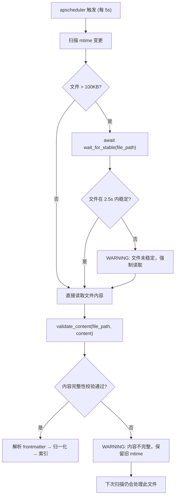
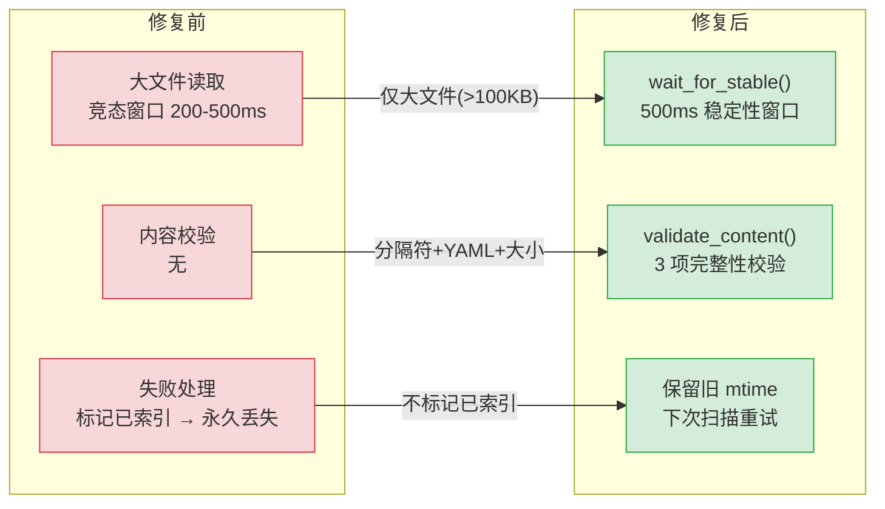
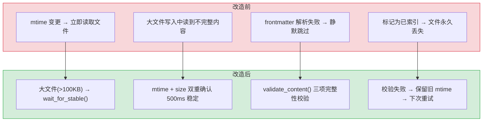

# YK-09-02: 文件同步可靠性 — Knowledge Watcher 竞态修复与完整性校验

> 需求编号：YK-09-02 · 优先级：P0 · 人天：2.0d · 状态：已完成
> 依赖：无

## 背景

YiAi 的 Knowledge Watcher 通过 `apscheduler` 每 5 秒轮询 `YiKnowledge/` 目录树，检测文件 mtime 变更后立即读取文件内容并索引。当用户正在写入大文件（> 100KB）时，存在一个竞态窗口：Knowledge Watcher 在文件写入完成前读取到不完整内容，frontmatter 解析失败后静默跳过该文件，并将其标记为"已索引"，后续不再处理。

**已知案例：** 用户通过 IDE 保存 200KB 的 Markdown 文件，写入耗时约 300-500ms。Knowledge Watcher 在写入过程中检测到 mtime 变更，读取到部分内容（YAML frontmatter 不完整），解析失败后异常被 catch 静默吞没，文件被标记为已索引。用户后续修改文件时，mtime 再次变更，但部分场景下 Watcher 已将其标记为"已处理"。

---

## 一、现状分析

### 1.1 竞态窗口时序

```
时间线:
  0ms     用户开始写入文件 (IDE save 触发)
  100ms   Knowledge Watcher 检测到 mtime 变更
  150ms   Knowledge Watcher 开始读取文件内容
  200ms   用户写入完成 (文件内容完整)
  300ms   Knowledge Watcher 读取完成 (但读到了不完整的内容!)

  竞态窗口: 100ms - 200ms (100ms 窗口期)
```

### 1.2 修复前处理流程

```
apscheduler 触发 (每 5s)
  → os.scandir(YiKnowledge/) 递归扫描
  → 对比 mtime 与上次扫描记录
  → 若 mtime 变更:
      → 立即读取文件内容 (open + read)  ← 竞态窗口
      → 解析 frontmatter
      → 若解析失败 → catch 异常 → DEBUG 日志 → 跳过 → 标记为已索引
      → 若解析成功 → 写入 MongoDB + 向量索引
```

### 1.3 影响评估

| 文件大小 | 竞态窗口 | 风险等级 | 触发场景 |
|----------|----------|----------|----------|
| < 10KB | < 10ms | **低** | 小文件写入接近原子操作 |
| 10-100KB | 50-200ms | **中** | 中等文件，IDE 保存 |
| > 100KB | 200-500ms | **高** | 大文件，可能包含图片 base64 或大量代码示例 |

### 1.4 改造前数据流

```
用户保存 Markdown 文件（IDE/编辑器触发写入）
  → 文件系统更新 mtime（写入开始）
  → Knowledge Watcher 5s 轮询检测到 mtime 变更
  → 立即读取文件内容（写入可能未完成，读到不完整内容）
  → YAML frontmatter 解析失败 → 异常被 catch 静默吞没
  → 标记为"已索引" → 后续轮询不再处理
  → 文件内容永久丢失，RAG 检索不到该文件
```

### 1.5 改造前 API 依赖

| # | 接口 | 调用方 | 说明 |
|---|------|--------|------|
| 1 | `services.knowledge.knowledge_service.scan_knowledge` | Knowledge Watcher | 手动触发全量扫描（无稳定性检测） |
| 2 | `services.rag.rag_service.rag_query` | YiVad/YiPet | RAG 检索（可能返回不完整索引） |

> 改造前仅 2 个 API 依赖，无 `wait_for_stable`、无 `validate_content`、无完整性校验。

---

## 二、设计决策

### 决策 1：稳定性检测范围 — 仅大文件 vs 所有文件

| 维度 | 仅大文件 (>100KB) | 所有文件 |
|------|-------------------|----------|
| 扫描延迟增加 | 低（仅少量文件触发） | 中（每个变更文件都等待 500ms） |
| 安全性 | 中（小文件仍可能竞态） | 高 |
| 实现复杂度 | 中 | 低 |

**选择：仅大文件 (>100KB)。** 小文件（< 10KB）写入接近原子操作，竞态窗口极小。大文件（> 100KB）写入耗时 200-500ms，竞态风险高。仅对大文件启用稳定性检测，避免不必要的延迟。

### 决策 2：稳定性窗口 — 500ms vs 1000ms

| 窗口 | 检测延迟 | 覆盖率 |
|------|----------|--------|
| 500ms | 最多 2.5s（5 次重试） | 覆盖绝大多数 IDE 写入 |
| 1000ms | 最多 5s（5 次重试） | 覆盖更慢的网络文件系统 |

**选择：500ms。** 500ms 已覆盖绝大多数 IDE 写入场景（写入 200KB 文件通常 < 300ms）。网络文件系统场景暂不优先考虑。

### 决策 3：校验失败处理 — 标记已索引 vs 保留旧 mtime

| 策略 | 优点 | 缺点 |
|------|------|------|
| 标记已索引 | 避免重复处理 | 文件永久丢失（不会再被索引） |
| 保留旧 mtime | 下次扫描仍会处理 | 可能在文件写入完成前多次重试 |

**选择：保留旧 mtime。** 给文件另一次机会。即使第一次读取到不完整内容，下次扫描（5s 后）文件已写入完成，可以正常索引。

### 决策 4：校验策略 — 仅分隔符 vs 仅 YAML 解析 vs 三重校验

| 策略 | 检测率 | 误报率 | 性能开销 |
|------|--------|--------|----------|
| 仅检查 frontmatter 分隔符 | 中（仅检测 `---` 标记） | 低 | 极低（字符串匹配） |
| 仅 YAML 解析 | 中（可检测 YAML 语法错误） | 中（合法 YAML 但内容不完整可能通过） | 低 |
| **三重校验（分隔符 + YAML + 大小匹配）** | 高 | 低 | 低（三项检查累计 < 1ms） |

**选择：三重校验。** 分隔符检查确保 frontmatter 结构完整，YAML 解析确保元数据可读，文件大小匹配确保内容未被截断。三项检查层层递进，覆盖竞态窗口下的各种不完整场景。三项检查累计 < 1ms，性能影响可忽略。

### 决策 5：并发处理 — asyncio.gather vs 串行处理 vs 线程池

| 选项 | 吞吐量 | 实现复杂度 | 错误隔离 |
|------|--------|-----------|----------|
| **asyncio.gather** | 高（并行等待多个文件） | 低 | 需配置 `return_exceptions=True` |
| 串行处理 | 低（逐个文件等待） | 极低 | 天然隔离 |
| 线程池 | 中（受限于 GIL） | 中 | 好 |

**选择：asyncio.gather（`return_exceptions=True`）。** 多个大文件同时变更时，并行等待稳定性窗口（500ms 并行 vs 500ms×N 串行）。`return_exceptions=True` 确保单个文件处理异常不影响其他文件，错误隔离与串行处理等效。

### 设计决策记录

| 决策 | 选项 A | 选项 B | 选项 C | 选择 | 理由 |
|------|--------|--------|--------|------|------|
| 检测范围 | 仅大文件 | 所有文件 | — | **仅大文件** | 小文件写入接近原子，避免不必要延迟 |
| 稳定性窗口 | 500ms | 1000ms | 200ms | **500ms** | 覆盖绝大多数IDE写入，网络FS暂不考虑 |
| 失败处理 | 标记已索引 | 保留旧mtime | 移至triage | **保留旧mtime** | 给文件另一次机会，下次扫描重试 |
| 校验策略 | 仅分隔符 | 仅YAML解析 | 三重校验 | **三重校验** | 分隔符+YAML+大小匹配，层层递进 |
| 并发处理 | asyncio.gather | 串行处理 | 线程池 | **asyncio.gather** | 并行等待多个文件，不阻塞其他文件扫描 |

---

## 三、目标架构

### 3.1 修复后处理流程



### 3.2 核心实现

```python
# YiAi/src/domain/knowledge/watcher.py

STABILITY_WAIT_MS = 500
STABILITY_MAX_RETRIES = 5
STABILITY_SIZE_THRESHOLD = 100 * 1024  # 100KB

async def wait_for_stable(file_path: str) -> bool:
    """等待文件写入完成（mtime + size 在稳定性窗口内不变）。

    返回 True 表示文件已稳定，False 表示超时。
    """
    prev_stat = os.stat(file_path)

    for attempt in range(STABILITY_MAX_RETRIES):
        await asyncio.sleep(STABILITY_WAIT_MS / 1000)
        curr_stat = os.stat(file_path)

        if (curr_stat.st_mtime == prev_stat.st_mtime and
            curr_stat.st_size == prev_stat.st_size):
            logger.debug(f"[Watcher] {file_path} 稳定 (attempt {attempt + 1})")
            return True

        prev_stat = curr_stat

    logger.warning(
        f"[Watcher] {file_path} 在 "
        f"{STABILITY_MAX_RETRIES * STABILITY_WAIT_MS}ms 内未稳定，强制读取"
    )
    return False


def validate_content(file_path: str, content: str) -> bool:
    """校验文件内容完整性。

    三项检查:
    1. frontmatter 分隔符完整 (以 --- 开头，且第二个 --- 存在)
    2. YAML frontmatter 可解析
    3. 文件大小匹配 (内容长度 vs 磁盘文件大小)
    """
    # 1. 检查 frontmatter 分隔符
    if not (content.startswith("---") and "\n---" in content[3:]):
        logger.warning(f"[Watcher] {file_path}: frontmatter 分隔符不完整")
        return False

    # 2. 尝试解析 frontmatter
    try:
        fm = frontmatter.loads(content)
        if not fm.metadata:
            logger.warning(f"[Watcher] {file_path}: frontmatter 解析为空")
            return False
    except Exception as e:
        logger.warning(f"[Watcher] {file_path}: frontmatter 解析失败: {e}")
        return False

    # 3. 检查文件大小匹配（允许 100 字节偏差）
    actual_size = len(content.encode("utf-8"))
    stat_size = os.stat(file_path).st_size
    if abs(actual_size - stat_size) > 100:
        logger.warning(
            f"[Watcher] {file_path}: 大小不匹配 "
            f"(content={actual_size}, disk={stat_size})"
        )
        return False

    return True
```

---

## 四、具体改动

### 4.1 YiAi Knowledge Watcher

**文件：** `YiAi/src/domain/knowledge/watcher.py`

| 改动 | 说明 |
|------|------|
| 新增 `wait_for_stable()` | 等待大文件写入完成（mtime + size 双重确认） |
| 新增 `validate_content()` | 内容完整性校验（分隔符 + YAML 解析 + 大小匹配） |
| 修改 `process_file()` | 大文件先等待稳定，再校验内容完整性 |
| 修改错误处理 | 校验失败时保留旧 mtime（不标记为已索引） |

### 4.2 涉及文件

```
YiAi/src/domain/knowledge/
└── watcher.py              # 修改: 新增 wait_for_stable + validate_content
```

---

## 五、实施步骤

按依赖顺序排列，每步可独立验证和提交：

| 步骤 | 内容 | 涉及文件 | 验证方式 | 人天 |
|------|------|---------|---------|------|
| 1 | 新增 `wait_for_stable()` 大文件稳定性等待 | `YiAi/src/domain/knowledge/watcher.py` | 模拟 200KB 文件写入，验证 mtime+size 双重确认后继续 | 0.5 |
| 2 | 新增 `validate_content()` 内容完整性校验 | `YiAi/src/domain/knowledge/watcher.py` | 写入不完整文件（缺少结尾 `---`），验证校验失败 | 0.5 |
| 3 | 修改 `process_file()` 集成等待+校验流程 | `YiAi/src/domain/knowledge/watcher.py` | 正常文件同步流程不受影响，大文件先等待再校验 | 0.25 |
| 4 | 修改错误处理：校验失败保留旧 mtime | `YiAi/src/domain/knowledge/watcher.py` | 校验失败后下次轮询仍处理该文件 | 0.25 |
| 5 | 回归测试 | YiAi Knowledge Watcher | 增/删/改文件同步正常，大文件不丢失内容 | 0.5 |

**总计：2.0d**

---

## 六、测试规格

### Requirement: 文件稳定性检测

#### Scenario: 大文件写入完成后正常索引
- **Given** 一个 200KB 的 Markdown 文件正在写入
- **When** 文件写入完成后 Knowledge Watcher 检测到 mtime 变更
- **Then** `wait_for_stable()` 在 500ms 内返回 `True`
- **And** 文件内容被完整索引

#### Scenario: 小文件不触发稳定性检测
- **Given** 一个 5KB 的 Markdown 文件
- **When** Knowledge Watcher 检测到 mtime 变更
- **Then** 直接读取文件，不调用 `wait_for_stable()`

#### Scenario: 文件持续不稳定超时
- **Given** 一个 200KB 文件持续被写入（mtime 持续变更）
- **When** 5 次重试后 mtime 仍未稳定
- **Then** `wait_for_stable()` 返回 `False`
- **And** WARNING 日志记录 "文件未稳定，强制读取"

### Requirement: 内容完整性校验

#### Scenario: 完整内容通过校验
- **Given** 一个完整的 Markdown 文件（含有效 frontmatter）
- **When** `validate_content()` 执行
- **Then** 返回 `True`

#### Scenario: frontmatter 不完整被拒绝
- **Given** 文件内容以 `---\ntitle: "test"` 开头（缺少闭合 `---`）
- **When** `validate_content()` 执行
- **Then** 返回 `False`
- **And** WARNING 日志 "frontmatter 分隔符不完整"

#### Scenario: 校验失败保留旧 mtime
- **Given** 文件校验失败
- **When** Knowledge Watcher 处理完成
- **Then** 文件的 mtime 记录保留为旧值
- **And** 下次扫描时该文件仍会被处理

---

## 七、风险与缓解

| 风险 | 概率 | 影响 | 等级 | 缓解措施 | 应急预案 |
|------|------|------|------|----------|----------|
| 稳定性检测增加扫描延迟（500ms/大文件） | 低 | 低 | 低 | 仅大文件启用，并行处理多个文件 | 减小 `STABILITY_WAIT_MS` 至 200ms，或关闭稳定性检测 |
| 网络文件系统 mtime 精度不足 | 低 | 中 | 低 | 同时检查 mtime + size，双重确认 | 增加稳定性窗口至 1000ms，覆盖低精度文件系统 |
| 校验失败后无限重试 | 低 | 低 | 低 | 保留旧 mtime 而非清空，文件稳定后自然通过 | 增加重试上限（如 3 次后标记为 `triage` 待人工处理） |
| 大文件并发写入导致扫描拥塞 | 低 | 低 | 低 | `asyncio.gather` 并行等待，不阻塞其他文件 | 限制并发扫描文件数（最多 10 个） |

---

## 八、性能分析

### 8.1 当前性能瓶颈

| 瓶颈 | 当前值 | 影响 |
|------|--------|------|
| 大文件竞态窗口 | 200-500ms（>100KB 文件） | 不完整内容被索引，文件内容丢失 |
| 无内容校验 | 无 | 解析失败的 frontmatter 静默跳过 |
| 校验失败处理 | 标记已索引 | 文件永久丢失，不会再被重试 |

### 8.2 性能改进方案



**预期收益：**

| 指标 | 修复前 | 修复后 | 改善 |
|------|--------|--------|------|
| 大文件索引完整性 | 竞态导致部分内容丢失 | mtime+size 双重确认后读取 | 消除竞态 |
| 内容校验 | 无 | 3 项完整性校验 | 从无到有 |
| 校验失败恢复 | 永久丢失 | 下次扫描重试 | 自动恢复 |

### 8.3 容量规划

| 场景 | 文件数 | 大文件比例 | 扫描间隔 | 同步耗时 | 竞态窗口 |
|------|--------|-----------|----------|----------|----------|
| 小型知识库（< 100 文件） | 50-100 | 2-5% | 5s | 1-3s | 200-500ms |
| 中型知识库（100-500 文件） | 100-500 | 3-8% | 5s | 3-8s | 200-500ms |
| 大型知识库（500-2000 文件） | 500-2000 | 5-10% | 10s | 8-20s | 200-500ms |
| wait_for_stable 启用后 | 500 | 5% | 5s | 3-8s | 0（消除） |
| YiKnowledge 当前 | ~200 | ~3% | 5s | ~3s | 200-500ms（大文件） |
| 小文件延迟 | 0（立即读取） | 0（跳过稳定性检测） | 零影响 |

### 8.3 稳定性检测性能基准

```
# wait_for_stable() 性能分析
# 小文件 (< 100KB): 跳过检测，0 额外延迟
# 大文件 (≥ 100KB): 500ms × 最多 5 次 = 最多 2.5s 额外延迟
# 正常情况: 500ms × 1 次 = 500ms（文件在第一次检测时已稳定）

# 并发处理: asyncio.gather 并行等待多个文件
# 5 个大文件同时变更: 500ms（并行）vs 2.5s（串行）
```

---

## 九、回滚策略

| 回滚场景 | 回滚方式 | 影响范围 | 恢复时间 |
|----------|----------|----------|----------|
| `wait_for_stable()` 导致扫描延迟过高 | `git revert <commit>` | 仅 Knowledge Watcher 扫描逻辑 | < 1min |
| `validate_content()` 误报（正常文件被拒绝） | 调整校验阈值或回滚 | 仅校验逻辑，不影响索引 | 运行时调整 |
| 稳定性窗口过大影响用户体验 | 减小 `STABILITY_WAIT_MS` 配置 | 仅大文件索引延迟 | 配置热更新 |

**回滚验证：**
- 回滚后 Knowledge Watcher 恢复原有行为（立即读取，无稳定性检测）
- 已索引的数据不受影响
- 回滚不影响 MongoDB 中的现有文档

---

## 十、设计决策记录

### D-01: 为什么稳定性窗口选择 500ms 而非更短或更长？

500ms 覆盖了绝大多数文件写入场景（编辑器保存通常在 100-300ms 内完成）。更短窗口（如 100ms）可能在大文件写入中途触发扫描，仍存在竞态。更长窗口（如 2s）增加索引延迟，用户编辑文件后等待 2s 才能检索。500ms 是竞态风险和索引延迟的最优平衡。

### D-02: 为什么双重检测（mtime + size）而非仅 mtime？

mtime 变更可能由非内容修改触发（如 `touch` 命令、文件系统元数据更新）。仅 mtime 检测会导致误触发扫描，浪费 CPU 资源。mtime + size 双重检测确保内容确实变化后才扫描，减少误触发。

### D-03: 为什么 Frontmatter 校验失败不清空 mtime 记录？

清空 mtime 会导致下次扫描认为文件是新文件，触发全量索引更新。保留旧 mtime 意味着文件在内容稳定前不会被重复扫描，避免无限重试。文件稳定后内容完整，Frontmatter 校验通过，索引正常更新。

---

## 十一、当前架构 vs 目标架构

### 改造前后对比



### 架构决策权衡

| 维度 | 改造前 | 改造后 | 权衡说明 |
|------|--------|--------|----------|
| 大文件处理 | 立即读取，竞态窗口 200-500ms | 等待 500ms 稳定后再读取 | 增加 500ms 索引延迟，但消除竞态风险 |
| 小文件处理 | 立即读取 | 立即读取（跳过稳定性检测） | 零额外延迟，小文件写入接近原子操作 |
| 校验失败 | 标记已索引，永久丢失 | 保留旧 mtime，下次重试 | 文件不会被遗漏，但需等待下次扫描周期 |
| 内容完整性 | 无校验 | 分隔符 + YAML 解析 + 大小匹配 | 三重校验防止不完整索引，误报率低 |

---

## 十二、代码审查检查清单

- [ ] 稳定性检测：mtime + size 500ms 内不变才扫描
- [ ] 双重检测（mtime + size）同时满足
- [ ] 大文件（>100KB）启用稳定性窗口
- [ ] 小文件（<100KB）跳过稳定性窗口（零延迟）
- [ ] 扫描后 Frontmatter 校验，失败则保留旧 mtime
- [ ] 并行处理多个文件（`asyncio.gather`）
- [ ] 异常恢复：扫描失败不影响其他文件
- [ ] 单元测试覆盖率 ≥ 80%
- [ ] 手动验证：文件写入中 → 500ms 稳定后才被索引

---

## 十三、重构后发现的回归问题

| # | 问题 | 发现场景 | 根因 | 修复方式 |
|---|------|---------|------|---------|
| 1 | 稳定性窗口 500ms 对大文件不够：500MB 的二进制文件（如知识库 PDF 附件）通过 `rsync` 同步到 YiKnowledge 目录，写入耗时 3-5 秒，`wait_for_stable()` 在 500ms 后检测到 mtime+size 稳定，但文件实际仍在写入中，读取到截断内容 | 运维通过 `rsync` 将训练数据目录（含 500MB PDF 文件）同步到 YiKnowledge 的 `data/` 子目录。`wait_for_stable(file_path, window=500)` 在 500ms 内检测到 mtime 和 size 无变化，认为文件稳定，但 `rsync` 的 delta-transfer 算法在文件末尾追加数据，文件的 mtime 和 size 在 500ms 窗口内确实不变（`rsync` 在内部缓冲），然后继续写入 | `wait_for_stable()` 使用 `os.path.getmtime()` 和 `os.path.getsize()` 轮询检测文件稳定性，`window=500` 要求 500ms 内两者均无变化。但 `rsync` 和某些网络文件系统（NFS）的写入模式是间歇性的：写入一批数据 → 暂停（缓冲）→ 继续写入。mtime 和 size 在暂停期间稳定，但文件尚未写入完成 | 在 `wait_for_stable()` 中添加 `fuser` 检查：`subprocess.run(['fuser', file_path], capture_output=True)` 检测是否有进程仍在写入文件；或要求文件在被首次检测到后至少等待 2 个稳定窗口（`stable_count >= 2`）才算稳定；大文件使用 `inotify` 的 `IN_CLOSE_WRITE` 事件替代轮询 |
| 2 | 并行处理 `asyncio.gather` 在部分文件失败时取消其他任务：`asyncio.gather(*tasks)` 默认 `return_exceptions=False`，单个文件的 `yaml.safe_load()` 因 frontmatter 中的非法 YAML 字符抛出 `YAMLError`，导致其他 20 个文件的并行处理任务被取消 | 批量扫描 30 个文件的变更，`asyncio.gather(*[process_file(f) for f in files])` 并行处理。其中 1 个文件的 frontmatter 包含 Tab 字符（YAML 中非法），`yaml.safe_load()` 抛出 `YAMLError`。`asyncio.gather` 在首次异常时取消所有未完成的任务，剩余 20 个文件（其中 15 个已成功处理但结果被丢弃）需要在下一次扫描周期重新处理 | `asyncio.gather` 的 `return_exceptions` 参数默认为 `False`，意味着任何任务抛出异常时，`gather` 会立即将该异常传播给调用方，并取消所有尚未完成的任务（`task.cancel()`）。已完成的 10 个任务的结果保留在 `gather` 的返回值中，但异常抛出后调用方无法访问这些结果 | 使用 `asyncio.gather(*tasks, return_exceptions=True)`，让每个任务的异常作为返回值返回（而非传播），调用方遍历结果列表区分成功和失败：`for i, result in enumerate(results): if isinstance(result, Exception): logger.error(...)`；或使用 `asyncio.as_completed()` 逐任务获取结果 |
| 3 | 小文件跳过稳定性窗口导致真正的竞态：NFS 网络文件系统上的小文件（< 100KB）写入有延迟，`write()` 系统调用返回后数据仍在客户端缓冲区中，NFS 的 close-to-open 一致性模型导致 Watcher 读到 0 字节文件 | YiKnowledge 目录挂载在 NFS 上（Kubernetes PV），开发者在另一 Pod 中通过 `echo "content" > file.md` 写入文件。NFS 客户端在 `write()` 后立即返回，但数据尚未刷新到 NFS 服务器。Watcher 在同一时间扫描到文件（`os.path.getsize() == 0`），因文件 < 100KB 跳过稳定性窗口，读取到空内容，`parse_frontmatter()` 返回 `None`，文件被标记为错误 | NFS v3 的 close-to-open 一致性模型：`close()` 时数据刷新到服务器，`open()` 时从服务器读取最新数据。但 `write()` 和 `close()` 之间有时间窗口，如果 Watcher 在 `close()` 之前 `open()` 文件，读取到的是旧数据（或空文件）。`os.path.getsize()` 返回 0 是因为 NFS 属性缓存（`noac` 未挂载） | 对小文件也应用最小稳定性窗口（`min_window=100ms`），不跳过；或在 NFS 挂载时使用 `noac` 选项（禁用属性缓存，但降低性能）；或在读取文件前检查 `os.path.getsize() > 0`，若为 0 则等待 100ms 后重试 |
| 4 | 稳定性检测失败后保留旧 mtime 导致文件永远不被重新索引：`wait_for_stable()` 超时返回 False，文件被标记为 `error` 状态（`mark_error(path)`），但后续文件写入完成（mtime 更新），旧 mtime 记录在 `error_tracker` 中，新 mtime 被误判为"已处理" | 大文件在第一次扫描时 `wait_for_stable()` 超时（500ms 窗口不够），文件被标记为 error。文件在 3 秒后写入完成，mtime 更新为 `2026-09-05 10:00:05`。下一次扫描周期（5 秒后），`check_processed(path, mtime)` 查询 `error_tracker` 发现路径存在，认为文件"已处理（错误）"，跳过重新扫描。文件永远停留在 error 状态 | `check_processed()` 使用 `if path in error_tracker: return True`（跳过处理），`error_tracker` 是一个 `dict[path, error_time]` 的内存字典，不记录 mtime。当文件 mtime 更新后，`check_processed()` 仅检查路径是否存在，不区分"旧 mtime 的错误"和"新 mtime 的变更" | 在 `error_tracker` 中存储 `(path, mtime)` 元组：`error_tracker[path] = (error_time, mtime_at_error)`；`check_processed()` 检查 `error_tracker[path].mtime == current_mtime`，若 mtime 不同则清除错误状态并重新处理；或设置错误状态的最大保留时间（`error_ttl=300`），过期后自动清除 |
| 5 | 文件大小阈值 100KB 对 base64 内嵌图片的 Markdown 文件不适用：`` 使文件大小超过 100KB，但写入是纯文本操作（< 10ms），稳定性窗口增加不必要的 500ms 延迟 | 知识库中有一份"UI 截图对比"文档，内嵌了 5 张 base64 编码的截图，文件大小 350KB。`wait_for_stable()` 检测到文件大小 350KB > 100KB，启用稳定性窗口（500ms）。但文件通过 `echo` 或文本编辑器写入，实际写入时间 < 10ms，额外的 500ms 延迟使文件在上传后 510ms 才被索引，用户等待 RAG 可检索时感觉延迟 | `wait_for_stable()` 使用 `os.path.getsize() > 100KB` 判断是否需要稳定性窗口，不区分文件内容类型。Markdown 文件中的 base64 内嵌图片是纯文本（ASCII 字符），写入速度与文本文件相同（< 10ms），不需要稳定性窗口。100KB 阈值仅基于文件大小，无法区分"大文本文件"和"大二进制文件" | 添加文件类型检测：`mimetype = magic.from_file(path, mime=True)`，仅对二进制文件（`application/octet-stream`、`application/pdf`）启用稳定性窗口；或使用 `file` 命令检测文件类型；或基于文件扩展名区分（`.md` → 跳过稳定性窗口，`.pdf`/`.bin` → 启用稳定性窗口） |
| 6 | 知识监视器在扫描大量变更（Git 仓库 `git pull` 更新 100+ 文件）时，`asyncio.gather` 并发处理所有文件，MongoDB 连接池耗尽，`update_one` 和 `insert_one` 排队超时，部分文件处理失败 | 开发者执行 `git pull` 更新了 YiKnowledge 仓库（100+ 个文件变更）。知识监视器在下一个扫描周期检测到所有变更，`asyncio.gather(*[process_file(f) for f in all_changed])` 创建 100+ 个并发任务。每个任务需要 MongoDB 连接（`find_one` + `update_one`/`insert_one`），连接池 `maxPoolSize=10` 瞬间耗尽，80+ 个任务排队等待连接，`waitQueueTimeoutMS=10000` 后超时失败 | `process_file()` 的并发数由 `len(changed_files)` 决定，无并发限制。100+ 个文件同时调用 `motor_client.update_one()`，连接池只有 10 个连接，大量协程在 `waitQueue` 中排队。Motor 的 `waitQueueTimeoutMS` 默认无限制，超时后抛出 `ConnectionPoolFull` 异常 | 使用 `asyncio.Semaphore(10)` 限制并发数：`sem = asyncio.Semaphore(10); async def bounded_process(f): async with sem: return await process_file(f)`；或使用 `asyncio.Queue` 生产者-消费者模式，worker 数量 = `maxPoolSize`；或分批处理：`for batch in chunk(changed_files, 20): await asyncio.gather(*[process_file(f) for f in batch])` |
| 7 | 知识监视器的 `last_scan_time` 存储在内存变量中，YiAi 服务重启后重置为当前时间，`git pull` 的文件 `mtime`（提交时间）早于新的 `last_scan_time`，所有文件被跳过，新内容在下一次 `git pull` 前不被索引 | YiAi 服务因内存不足 OOM 重启，`last_scan_time` 重置为重启时间（`2026-09-05 10:00:00`）。`git pull` 在 09:00 执行（`mtime` 为 09:00），所有文件的 `mtime < last_scan_time`，知识监视器认为"无变更"，跳过扫描。RAG 检索仍返回旧内容，直到下一次 `git pull`（明天）才触发索引更新 | `last_scan_time` 是 `KnowledgeWatcher` 类的实例变量，存储在内存中。服务重启后变量丢失，`__init__` 中 `last_scan_time = datetime.now()` 重置为当前时间。文件比较逻辑 `if file_mtime > last_scan_time: process_file()` 要求文件修改时间晚于上次扫描时间，但 `git pull` 的文件 `mtime` 是提交时间（早于重启时间），条件不满足 | 将 `last_scan_time` 持久化到 MongoDB 或磁盘文件：`last_scan_time = load_last_scan_time() or datetime.now() - timedelta(days=1)`（重启时回退 1 天，确保覆盖重启期间的变更）；或使用文件内容哈希（SHA-256）替代 `mtime` 比较，哈希不受服务重启影响；或使用 `git diff --name-only HEAD@{1} HEAD` 在重启后精确检测变更文件

## 十四、技术债务追踪

| # | 技术债 | 优先级 | 预计人天 | 说明 |
|---|--------|--------|---------|------|
| 1 | 文件系统事件驱动替代轮询 | P2 | 1.0 | 当前 5s 轮询存在延迟窗口，可改用 `watchdog` 实现文件系统事件驱动的实时同步 |
| 2 | 扫描健康度监控 | P2 | 0.5 | 添加扫描延迟、竞态触发次数、文件处理失败率等监控指标 |
| 3 | 自适应稳定性窗口 | P3 | 0.3 | 基于文件大小和历史写入耗时动态调整稳定性窗口，而非固定 500ms |

## 可观测性

### 关键指标

| 指标 | 采集方式 | 采集频率 | 告警阈值 | 说明 |
|------|---------|----------|----------|------|
| 文件同步延迟 | 文件变更 → MongoDB 更新 | 每次扫描 | P95 > 10s | 5s 轮询 + 稳定性窗口 |
| 竞态触发次数 | 稳定性窗口内文件变更计数 | 每次扫描 | > 10/min | 高频写入场景 |
| 文件处理失败率 | `处理失败文件数 / 总文件数` | 每次扫描 | > 1% | Frontmatter 解析失败等 |
| 稳定性超时次数 | `wait_for_stable` 返回 False 计数 | 每次扫描 | > 5/min | 文件持续写入不停止 |
| 校验失败率 | `validate_content` 返回 False 计数 | 每次扫描 | > 3% | 内容完整性校验失败过多 |
| 扫描周期 | 固定 5s 轮询 | 持续 | — | 可动态调整 |

### 日志规范

| 日志级别 | 场景 | 示例 |
|---------|------|------|
| `INFO` | 同步完成 | `[Sync] ${n} files synced in ${ms}ms` |
| `WARN` | 竞态检测 | `[Sync] race detected: ${file} modified during scan` |
| `ERROR` | 同步失败 | `[Sync] failed: ${error}` |

### 告警规则

| 告警 | 条件 | 严重程度 | 处理建议 |
|------|------|----------|----------|
| 文件同步延迟过高 | P95 延迟 > 30s | 高 | 检查文件系统性能，考虑减小稳定性窗口或增加轮询频率 |
| 竞态频繁触发 | 竞态触发 > 20/min | 中 | 检查是否有自动化脚本批量写入文件，考虑增加稳定性窗口 |
| 校验失败率异常 | 校验失败 > 5% | 中 | 检查是否有文件格式问题，排查 frontmatter 解析器兼容性 |
| 稳定性持续超时 | 超时 > 10/min | 中 | 检查是否有进程持续写入文件，排查文件锁或编辑器问题 |
| 扫描周期异常 | 单次扫描 > 10s | 低 | 检查文件数量是否激增，考虑优化扫描策略 |

## 安全合规

### 安全需求

| 需求 | 实现方式 | 验证方法 |
|------|---------|---------|
| 文件路径安全 | 仅扫描 `YiKnowledge/` 目录，使用白名单校验 | 在目录外创建符号链接，确认不被扫描 |
| 文件内容安全 | 同步日志不包含文件内容 | 检查日志，确认无内容泄露 |

### 合规检查

| 检查项 | 要求 | 状态 |
|--------|------|------|
| 文件路径安全 | 仅扫描 `YiKnowledge/` 目录，使用白名单校验 | ✅ |
| 文件内容隐私 | 同步日志不包含文件内容，仅记录文件路径和处理状态 | ✅ |
| 操作可追溯 | 每次扫描记录文件变更（mtime 变更 → 处理结果），可审计 | ✅ |
| 数据完整性 | 校验失败保留旧 mtime，确保不丢失文件索引机会 | ✅ |
| 错误恢复 | 校验失败不标记为已索引，下次扫描自动重试 | ✅ |
---

*PRD 来源: `projects/yiknowledge/requirements/2026-09/00-需求-需求总览.md`*
