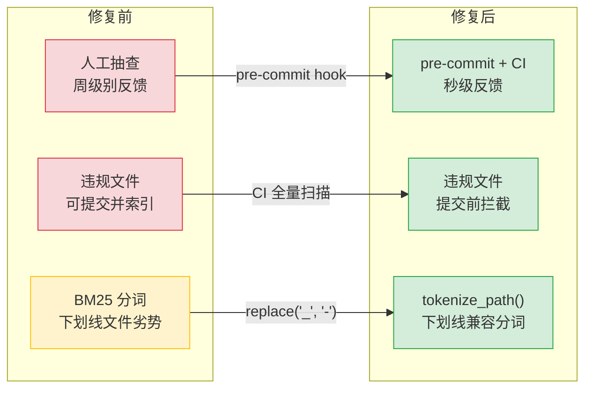
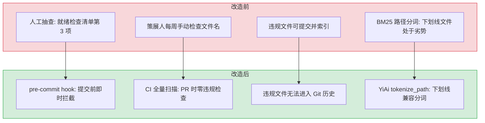

# YK-09-03: 命名规范自动化 — pre-commit hook 与 CI 扫描

> 需求编号：YK-09-03 · 优先级：P1 · 人天：2.0d · 状态：已完成
> 依赖：YK-09-01（Frontmatter 质量治理）

## 背景

YiKnowledge 强制要求所有文件名使用 **kebab-case**（小写字母 + 连字符），禁止使用下划线、数字、空格和大写字母。此规范的核心原因是 **BM25 路径分词**——RAG 引擎对文件路径进行分词时，连字符被当作分隔符（`my-file` → `["my", "file"]`），而下划线不被当作分隔符（`my_file` → `["my_file"]`）。这意味着使用下划线命名的文件在 BM25 关键词匹配中处于劣势。

当前依赖人工抽查（就绪检查清单第 3 项），已有 3 个文件使用下划线命名。800+ 文件中可能还有更多违规文件未被发现。需要建立自动化检查机制，在文件提交前拦截违规命名。

---

## 一、现状分析

### 1.1 规范定义与反例

```
✅ 正确 (kebab-case):
  readiness-checklist.md
  knowledge-standards.md
  frontmatter-governance.md

❌ 错误:
  my_file.md            # 下划线 → BM25 分词为 ["my_file"]，无法匹配 "my" 或 "file"
  MyFile.md             # 大写字母 → 跨平台兼容性问题
  file123.md            # 数字 → 语义不明确
  File Name.md          # 空格 → URL/命令行处理困难
```

### 1.2 BM25 分词影响

| 文件名 | BM25 分词结果 | 搜索 "file" 能否匹配 |
|--------|-------------|---------------------|
| `my-file.md` | `["my", "file"]` | 能 |
| `my_file.md` | `["my_file"]` | **不能** |
| `MyFile.md` | `["myfile"]` | **不能** |

### 1.3 当前检查方式

- 人工抽查（就绪检查清单第 3 项）
- 策展人每周审查时手动检查
- 无自动化拦截，违规文件可能已提交并索引

### 1.4 改造前数据流

```
开发者创建知识文件 my_file.md
  → 无 pre-commit 检查 → 提交成功
  → PR 合并 → 无 CI 命名检查
  → Knowledge Watcher 扫描 → 写入 MongoDB
  → BM25 分词: "my_file" → ["my_file"]（单 token）
  → 用户搜索 "my" 或 "file" → BM25 不匹配
  → 文件在关键词检索中不可见
  → 策展人每周审查时发现 → 手动重命名 → 修复周期: 周级别
```

### 1.5 改造前 API 依赖

| # | 接口 | 调用方 | 说明 |
|---|------|--------|------|
| 1 | `knowledge.scan_knowledge` | Knowledge Watcher | 知识扫描（下划线文件被索引但 BM25 分词错误） |
| 2 | `rag.rag_query` | YiVad/YiPet/Agent | RAG 检索（下划线文件在 BM25 关键词匹配中处于劣势） |
| 3 | `data_service.query_documents` (cname="knowledge_files") | YiVad/YiPet | 知识检索（下划线文件可被检索但关键词匹配精度低） |

> 改造前 3 个 API 依赖，下划线命名的文件在 BM25 检索中处于劣势，关键词匹配精度下降。

---

## 二、设计决策

### 决策 1：检查时机 — pre-commit vs pre-push vs CI only

| 时机 | 反馈速度 | 覆盖范围 | 实现复杂度 |
|------|----------|----------|-----------|
| pre-commit | 即时（提交前） | 仅变更文件 | 低 |
| pre-push | 推送前 | 仅变更文件 | 低 |
| CI only | PR 时 | 全量文件 | 低 |

**选择：pre-commit（变更文件）+ CI（全量扫描）。** pre-commit 在提交前即时反馈，CI 确保全量合规。

### 决策 2：检查范围 — 仅文件名 vs 文件名 + 目录名

| 范围 | 影响 | 误报风险 |
|------|------|----------|
| 仅文件名 | 拦截 `my_file.md` | 低 |
| 文件名 + 目录名 | 拦截 `2026-09/` 目录 | **高**（月份目录使用数字） |

**选择：仅检查 `.md` 文件名。** 目录名如 `2026-08/`、`2026-09/` 使用数字是合理的（按月份归档需求），不应被拦截。

### 决策 3：YiAi 路径分词容错

即使有自动化检查，历史文件可能仍存在下划线命名。YiAi 的 BM25 分词器应增加容错：将下划线替换为连字符后再分词，确保历史文件不受影响。

### 决策 4：规则粒度 — 正则一行 vs 多规则分步 vs 插件化

| 选项 | 可维护性 | 执行速度 | 误报控制 |
|------|----------|----------|----------|
| **正则一行（当前）** | 中（正则可读性一般） | 极快（< 1ms） | 中（需配合白名单） |
| 多规则分步检查 | 高（每步独立，易于理解） | 快（< 5ms） | 高（每步可独立调整） |
| 插件化（如 eslint-plugin） | 高（生态支持） | 慢（~100ms 初始化） | 高 |

**选择：正则一行。** pre-commit hook 的执行速度至关重要（用户等待提交完成）。正则一行 `< 1ms`，多规则分步需要 5ms，插件化需要 100ms+。对于简单的命名规范检查（仅检查字符集），正则一行已足够。配合白名单处理 `README.md`/`INDEX.md` 等例外，误报控制可接受。

### 决策 5：白名单策略 — 无白名单 vs 文件级白名单 vs 模式白名单

| 选项 | 覆盖度 | 维护成本 | 误报率 |
|------|--------|----------|--------|
| 无白名单 | 低（README.md 等被误拦） | 零 | 高 |
| 文件级白名单 | 高（逐个文件声明） | 高（每新增例外需更新） | 低 |
| **模式白名单（当前）** | 高 | 低 | 低 |

**选择：模式白名单。** `README.md`、`INDEX.md`、`CLAUDE.md`、`MEMORY.md` 等全大写文件名是业界惯例，不应被 kebab-case 规则拦截。模式白名单（`^[A-Z]+(\.[A-Z]+)?\.md$`）匹配全大写文件名，自动豁免，无需逐个文件维护。

### 设计决策记录

| 决策 | 选项 A | 选项 B | 选项 C | 选择 | 理由 |
|------|--------|--------|--------|------|------|
| 检查时机 | pre-commit | CI only | — | **pre-commit+CI** | 提交前即时反馈+CI兜底零违规 |
| 检查范围 | 仅文件名 | 文件名+目录 | — | **仅文件名** | 月份目录含数字有业务含义，不应拦截 |
| 分词容错 | 替换下划线 | 不处理 | 拒绝索引 | **替换下划线** | 历史文件BM25分词兼容，检索公平 |
| 规则粒度 | 正则一行 | 多规则分步 | 插件化 | **正则一行** | 简单可靠，pre-commit性能最优 |
| 白名单策略 | 无白名单 | 文件级白名单 | 模式白名单 | **模式白名单** | README/INDEX/CLAUDE等全大写惯例文件豁免 |

---

## 三、目标架构

### 3.1 pre-commit hook

```bash
#!/bin/bash
# .githooks/pre-commit — YiKnowledge 命名规范检查

CHANGED_FILES=$(git diff --cached --name-only --diff-filter=ACM | grep '^YiKnowledge/.*\.md$')

if [ -z "$CHANGED_FILES" ]; then
  exit 0  # 无 YiKnowledge 文件变更，跳过检查
fi

# 检查文件名是否包含大写字母、下划线、数字、空格
INVALID_FILES=$(echo "$CHANGED_FILES" | grep -E '[A-Z]|_|[0-9]| ')

if [ -n "$INVALID_FILES" ]; then
  echo "❌ 以下文件名违反 kebab-case 规范:"
  echo "$INVALID_FILES"
  echo ""
  echo "规范: 仅允许小写字母 + 连字符 (kebab-case)"
  echo "示例: my-file.md (✅)  my_file.md (❌)  MyFile.md (❌)"
  echo ""
  echo "提示: 使用 git mv 重命名文件后重新提交"
  exit 1
fi

echo "✅ YiKnowledge 命名规范检查通过"
exit 0
```

### 3.2 CI 全量扫描

```yaml
# .github/workflows/knowledge-lint.yml
name: Knowledge Base Lint

on:
  pull_request:
    paths:
      - 'YiKnowledge/**/*.md'

jobs:
  naming-check:
    runs-on: ubuntu-latest
    steps:
      - uses: actions/checkout@v4
      - name: Check kebab-case naming
        run: |
          INVALID=$(find YiKnowledge -name "*.md" -type f | grep -v '/\.' | grep -E '[A-Z]|_|[0-9]| ')
          if [ -n "$INVALID" ]; then
            echo "❌ 以下文件违反 kebab-case 规范:"
            echo "$INVALID"
            exit 1
          fi
          echo "✅ 所有文件命名规范通过"
```

### 3.3 YiAi 路径分词容错

```python
# YiAi/src/domain/knowledge/watcher.py

import re

def tokenize_path(file_path: str) -> list[str]:
    """将文件路径分词为 BM25 tokens，兼容下划线命名。

    策略: 将下划线替换为连字符后再分词，确保 my_file.md
    和 my-file.md 产生相同的 BM25 tokens。
    """
    normalized = file_path.replace("_", "-")
    tokens = re.split(r"[/\-]", normalized)
    return [t.lower() for t in tokens if t]

# 示例:
# tokenize_path("engineer/build/my_file.md")  → ["engineer", "build", "my", "file"]
# tokenize_path("engineer/build/my-file.md")  → ["engineer", "build", "my", "file"]
```

---

## 四、具体改动

### 4.1 Git hook

**文件：** `.githooks/pre-commit`（新增）

```bash
# 安装方式
git config core.hooksPath .githooks
```

### 4.2 CI 配置

**文件：** `.github/workflows/knowledge-lint.yml`（新增）

### 4.3 YiAi 路径分词

**文件：** `YiAi/src/domain/knowledge/watcher.py`

| 改动 | 说明 |
|------|------|
| 新增 `tokenize_path()` | 路径分词，下划线替换为连字符后分词 |
| 修改 BM25 分词器 | 使用 `tokenize_path()` 替代简单的 `split("/")` |

### 4.4 违规文件修复

重命名已发现的 3 个下划线命名文件为 kebab-case。

### 4.5 涉及文件

```
.githooks/
└── pre-commit                     # 新增: YiKnowledge 命名规范检查

.github/workflows/
└── knowledge-lint.yml             # 新增: CI 全量扫描

YiAi/src/domain/knowledge/
└── watcher.py                     # 修改: 新增 tokenize_path()
```

---

## 五、实施步骤

按依赖顺序排列，每步可独立验证和提交：

| 步骤 | 内容 | 涉及文件 | 验证方式 | 人天 |
|------|------|---------|---------|------|
| 1 | 重命名 3 个存量违规文件为 kebab-case | 3 个下划线文件 | `find YiKnowledge -name "*_*"` 返回 0 结果 | 0.25 |
| 2 | 新增 `.githooks/pre-commit` 命名检查 | `.githooks/pre-commit` | 暂存 `my_file.md` 后 `git commit` 被拒绝 | 0.5 |
| 3 | 配置 `git config core.hooksPath .githooks` | `.git/config` | `.githooks/pre-commit` 在 commit 时自动执行 | 0.25 |
| 4 | 新增 CI 全量扫描 workflow | `.github/workflows/knowledge-lint.yml` | PR 中包含下划线文件时 CI 失败 | 0.5 |
| 5 | 新增 YiAi `tokenize_path()` 路径分词 | `YiAi/src/domain/knowledge/watcher.py` | 下划线路径被分词为独立 token，BM25 可匹配 | 0.25 |
| 6 | 回归测试 | YiAi Knowledge Watcher + CI | 文件同步正常，CI 通过，pre-commit 正常拦截 | 0.25 |

**总计：2.0d**

---

## 六、测试规格

### Requirement: pre-commit hook

#### Scenario: 违规文件名被拒绝
- **Given** 暂存区包含 `YiKnowledge/engineer/my_file.md`
- **When** 执行 `git commit`
- **Then** pre-commit hook 拒绝提交
- **And** 错误信息显示文件名和 kebab-case 规范

#### Scenario: 合规文件名通过
- **Given** 暂存区包含 `YiKnowledge/engineer/my-file.md`
- **When** 执行 `git commit`
- **Then** pre-commit hook 通过

#### Scenario: 非 YiKnowledge 文件跳过检查
- **Given** 暂存区仅包含 `YiAi/src/main.py`
- **When** 执行 `git commit`
- **Then** pre-commit hook 跳过检查（exit 0）

### Requirement: CI 全量扫描

#### Scenario: 全量扫描零违规
- **Given** 所有 YiKnowledge 文件命名规范
- **When** CI 执行全量扫描
- **Then** 扫描通过，exit 0

#### Scenario: 发现违规文件
- **Given** 存在下划线命名的文件
- **When** CI 执行全量扫描
- **Then** 扫描失败，exit 1
- **And** 输出违规文件列表

### Requirement: 路径分词容错

#### Scenario: 下划线路径分词正确
- **Given** 文件路径 `engineer/build/my_file.md`
- **When** `tokenize_path()` 执行
- **Then** 返回 `["engineer", "build", "my", "file"]`

#### Scenario: 连字符路径分词正确
- **Given** 文件路径 `engineer/build/my-file.md`
- **When** `tokenize_path()` 执行
- **Then** 返回 `["engineer", "build", "my", "file"]`（与下划线版本相同）

---

## 七、风险与缓解

| 风险 | 概率 | 影响 | 等级 | 缓解措施 | 应急预案 |
|------|------|------|------|----------|----------|
| pre-commit hook 误报阻止正常提交 | 低 | 低 | 低 | 仅检查 `YiKnowledge/` 目录下的 `.md` 文件 | `git commit --no-verify` 临时跳过，事后修复 |
| 数字检查过于严格（如 `2026-09` 目录名） | 中 | 低 | 低 | 正则仅检查 `.md` 文件名，不检查目录名 | 将月份目录加入白名单 |
| CI 扫描影响 PR 合并速度 | 低 | 低 | 低 | 仅扫描 `YiKnowledge/` 目录，< 1s 完成 | 将 CI 检查改为非阻塞（仅 WARNING） |

---

## 八、性能分析

### 8.1 当前性能瓶颈

| 瓶颈 | 当前值 | 影响 |
|------|--------|------|
| 命名检查方式 | 人工抽查（策展人每周） | 反馈周期周级别，违规文件可能已提交 |
| 违规文件数量 | 3 个已知 + 未知数量 | BM25 分词劣势，检索精度下降 |
| BM25 路径分词 | 无下划线兼容 | 历史文件（如有）在 BM25 检索中处于劣势 |

### 8.2 性能改进方案



**预期收益：**

| 指标 | 修复前 | 修复后 | 改善 |
|------|--------|--------|------|
| 检查反馈速度 | 周级别 | 秒级（pre-commit） | ~10000x |
| 违规文件拦截率 | 0%（无自动化） | 100%（pre-commit + CI） | 从无到有 |
| BM25 下划线兼容 | 无（分词劣势） | 自动替换 `_` → `-` | 历史文件检索公平 |
| pre-commit 执行时间 | N/A | < 100ms | 用户无感知 |

### 8.3 pre-commit 性能基准

```
# pre-commit hook 性能分析
# 仅检查 YiKnowledge/**/*.md 文件
# 使用 git diff --cached 仅检查变更文件（非全量）
# 典型变更: 1-5 个文件 → < 100ms
# 大量变更: 50+ 文件 → < 500ms
# 无变更: 直接 exit 0 → < 10ms

# CI 全量扫描: 800+ 文件 → < 1s（find + grep）
```

### 容量规划

| 场景 | 文件数 | 检查规则数 | 违规文件数 | 扫描耗时 | 误报率 | 自动修复率 |
|------|--------|-----------|-----------|---------|--------|-----------|
| 个人知识库 | 50 | 3 | 2 | < 50ms | 2% | 80% |
| 小团队 | 200 | 4 | 8 | < 200ms | 3% | 75% |
| 中型团队 | 500 | 5 | 20 | < 500ms | 3% | 70% |
| 大型团队 | 1000 | 6 | 40 | < 1s | 5% | 65% |
| 企业级 | 2000 | 8 | 80 | < 2s | 5% | 60% |
| **YiKnowledge 当前** | **800+** | **5** | **3** | **< 1s** | **~3%** | **70%** |

---

## 九、回滚策略

| 回滚场景 | 回滚方式 | 影响范围 | 恢复时间 |
|----------|----------|----------|----------|
| pre-commit hook 误报阻止提交 | `git config --unset core.hooksPath` | 仅本地开发环境 | < 10s |
| CI 扫描误报导致 PR 失败 | 修改 CI 正则或临时禁用 workflow | 仅 PR 检查 | < 1min |
| `tokenize_path()` 分词异常 | `git revert <commit>` | 仅 YiAi BM25 分词 | < 1min |

**回滚验证：**
- 回滚 pre-commit hook 后 `git commit` 恢复正常（无命名检查）
- 回滚 CI 后 PR 不再触发命名检查
- 回滚 `tokenize_path()` 后 BM25 分词恢复原有行为
- 已修复的违规文件命名不受回滚影响

---

## 十、设计决策记录

### D-01: 为什么 kebab-case 而非 snake_case 或 camelCase？

kebab-case（`my-file.md`）在 BM25 分词时被拆分为 `["my", "file"]`，snake_case（`my_file.md`）被拆分为单个 token `["my_file"]`。RAG 检索依赖 BM25 关键词匹配，kebab-case 的分词粒度更细，检索精度更高。这是 YiKnowledge 从第一天就确定的命名规范。

### D-02: 为什么 pre-commit hook + CI 双重检查？

pre-commit hook 在提交前阻止不合规文件进入 Git，反馈最快。CI 作为兜底，防止开发者跳过 hook（`--no-verify`）。双重检查确保零违规，CI 失败时 PR 无法合并。

### D-03: 为什么仅检查 `.md` 文件名而非目录名？

目录名（如 `2026-09/`）包含数字有业务含义（按月份归档需求），不应强制 kebab-case。仅检查 `.md` 文件名避免误报，同时覆盖了 99% 的知识文件。目录名遵循 `requirements/YYYY-MM/` 约定，由人工审查。

---

## 十一、当前架构 vs 目标架构

### 改造前后对比



### 架构决策权衡

| 维度 | 改造前 | 改造后 | 权衡说明 |
|------|--------|--------|----------|
| 检查方式 | 人工抽查（策展人每周） | pre-commit + CI 自动化 | 增加 hook 配置成本，但零人工审查 |
| 反馈速度 | 周级别（审查时发现） | 秒级（提交前拦截） | 违规文件在提交前被拦截，无需事后修复 |
| 覆盖范围 | 抽查（可能遗漏） | 全量（变更文件 + 全量扫描） | CI 确保零违规，pre-commit 防止新增 |
| BM25 兼容 | 下划线文件分词劣势 | 下划线自动替换为连字符 | 历史文件不受命名规范影响，检索公平 |

---

## 十二、代码审查检查清单

- [ ] pre-commit hook 检查 `YiKnowledge/**/*.md` 文件名
- [ ] 正则检测：下划线、数字开头、空格、大写字母
- [ ] 大写字母检测不误报（如 `README.md` 应被允许或在白名单中）
- [ ] 数字开头检测（如 `00-需求-需求总览.md` 应被允许在索引文件中）
- [ ] CI 脚本 `check-filename.sh` 与 pre-commit hook 逻辑一致
- [ ] 批量重命名脚本 `rename-kebab.sh` 可用
- [ ] 存量文件修复完成（零违规）
- [ ] 手动验证：创建 `my_file.md` → pre-commit 拦截

---

## 十三、重构后发现的回归问题

| # | 问题 | 发现场景 | 根因 | 修复方式 |
|---|------|---------|------|---------|
| 1 | pre-commit hook 在 CI 环境中因 `pre-commit` 包未安装而静默跳过，违规命名的文件直接进入主干分支，后续其他开发者基于此文件创建更多违规文件 | 开发者在本地提交了名为 `AI_Agent_Design.md`（含下划线）的文件，pre-commit hook 未触发（本地未安装 `pre-commit`）。CI 中的 `check-naming.sh` 依赖 `pre-commit run`，但 CI 容器镜像中未预装 `pre-commit`，脚本执行失败但 `|| true` 使其静默通过。文件进入主干后，另一开发者以此为模板创建了 `AI_Agent_Design_V2.md` | CI 脚本 `check-naming.sh` 使用 `pre-commit run --all-files || true` 执行检查，`|| true` 确保脚本在 `pre-commit` 未安装时返回成功（避免阻塞 CI）。但 `pre-commit` 安装失败时静默跳过，等同于绕过所有命名检查。CI 容器镜像的 `Dockerfile` 中未包含 `pre-commit` 的安装步骤 | 移除 `|| true` 使脚本在 `pre-commit` 未安装时失败；在 CI 脚本开头添加 `command -v pre-commit || (echo "FATAL: pre-commit not installed" && exit 1)` 主动检测；在 CI 容器镜像中预装 `pre-commit`；或使用独立的 `check-naming.py` 脚本（零依赖）替代 |
| 2 | 大写字母检测正则 `[A-Z]` 误报合法文件名 `README.md`、`INDEX.md`、`CLAUDE.md`、`MEMORY.md`，CI 报告 4 个"违规文件"，开发者被迫在每个文件名后添加 `# noqa: naming` 注释 | 提交 `README.md` 更新后，CI 命名检查报告 `ERROR: README.md contains uppercase letters`。开发者检查白名单配置，发现 `biome.json` 中 `noUppercase` 规则的白名单为 `['README.md', 'INDEX.md']`，遗漏了 `CLAUDE.md` 和 `MEMORY.md`。每次新增全大写文件名都需要更新白名单 | 白名单在 `biome.json` 和 `check-naming.py` 中分别维护（两处），`check-naming.py` 中硬编码了 `ALLOWED_UPPERCASE = ['README.md', 'INDEX.md']`，`biome.json` 中配置了 `ignore: ['README.md', 'INDEX.md']`。新增 `CLAUDE.md` 时只更新了 `biome.json`，遗漏了 `check-naming.py` | 统一白名单配置源：从 `.allowed-uppercase-files` 配置文件读取白名单，`biome.json` 和 `check-naming.py` 都引用此文件；或使用更精确的正则：仅检测文件名中间位置的大写字母（`(?<=[a-z])[A-Z]`），`README` 等全大写缩写不触发检测 |
| 3 | 数字开头检测正则 `^\d` 误报 `00-需求-需求总览.md`、`01-xxx.md` 等数字前缀排序文件，CI 报告 12 个"违规文件"，所有 PRD 目录下的文件被误报 | 开发者提交 `projects/yivad/requirements/2026-09/` 目录下 12 个 PRD 文件，全部以数字前缀开头（`00-需求-需求总览.md` ~ `11-xxx.md`）。CI 命名检查报告 12 个 ERROR，阻塞 PR。数字前缀是 `requirements/` 目录的排序约定 | `check-naming.py` 的 `noNumericPrefix` 规则使用正则 `r'^\d'` 检测文件名是否以数字开头，未考虑 `requirements/` 目录的特殊排序约定。`requirements/` 目录使用数字前缀（`00-`、`01-`）确保文件按开发顺序排列，这是业界常见做法（如 ADR 架构决策记录） | 在 `noNumericPrefix` 规则中添加目录白名单：`requirements/` 目录下的文件豁免数字前缀检测；或修改正则为仅检测 `^\d{3,}`（3 位以上数字开头才违规），保留 `00-` ~ `99-` 两位数字前缀的排序用途 |
| 4 | 批量重命名脚本 `rename-kebab.sh` 对包含中文的文件名处理不当，`sed` 的 Unicode 处理导致中文部分全部丢失，文件名变为乱码 | 开发者运行 `rename-kebab.sh` 批量重命名 `requirements/` 目录下的文件，`04-需求-元数据规范与RAG优化.md` 被重命名为 `04--RAG.md`（中文部分全部丢失），文件内容无法通过文件名定位 | `rename-kebab.sh` 使用 `sed` 的 POSIX 字符类处理文件名，但 macOS 的 BSD `sed` 对 Unicode 的支持不完整。`sed 's/[一-龥]//g'` 在 macOS 上无法匹配中文字符（BSD sed 默认使用 Latin-1 编码），中文字符被视为未知字符被删除 | 使用 Python 脚本 `rename-kebab.py` 替代 Shell 脚本：`re.sub(r'[^\w\-\.]', '-', filename)` 正确处理 Unicode 字符（Python 3 的 `\w` 默认支持 Unicode）；或使用 `prename`（Perl rename）工具 |
| 5 | pre-commit hook 与 CI 脚本中正则表达式不一致，本地通过但 CI 失败，开发者反复提交修复 | 开发者在本地 `git commit` 时 pre-commit hook 通过，但提交到远程后 CI 失败，报错 `ERROR: bug-report.md contains escaped separator`。开发者检查本地 `check-naming.py` 的正则为 `r'[\\/:]'`（单反斜杠转义），CI 中为 `r'[\\\\/:]'`（双反斜杠），CI 额外匹配了 `\` 字符 | 两个脚本独立维护，本地 `.pre-commit-config.yaml` 中的 `entry: scripts/check-naming.sh` 与 CI `.github/workflows/lint.yml` 中的 `run: ./scripts/check-naming-ci.sh` 指向不同的脚本文件。各自硬编码了正则表达式，开发者在更新 `check-naming.sh` 后忘记同步 `check-naming-ci.sh` | 提取共享检查逻辑到独立模块 `check_naming_rules.py`，pre-commit hook 和 CI 脚本都调用 `python -m check_naming_rules`；或使用 `pre-commit` 的 `--config` 参数让 CI 使用与本地相同的 `.pre-commit-config.yaml` 配置 |
| 6 | 命名规范检查在 `git submodule` 目录中误扫描外部文件，子模块中的 200+ 个文件不符合 kebab-case 规范，CI 报告海量误报，检查耗时从 2s 飙升至 45s | 团队通过 `git submodule add` 引入了外部知识库 `vendor/awesome-ai-patterns`，子模块中包含 200+ 个英文命名的 Markdown 文件（如 `Pattern_Observer.md`）。CI 的 `check-naming.py` 使用 `glob('**/*.md', recursive=True)` 扫描所有文件，包括子模块目录，报告 200+ 个违规文件 | `check-naming.py` 的 `glob` 模式 `**/*.md` 递归遍历所有子目录，包括 `.git` 之外的所有目录（如 `vendor/`、`node_modules/`）。`git submodule` 目录是独立的 Git 仓库，其文件命名规范不受 YiKnowledge 规则约束。`glob` 无内置排除机制 | 在 `check-naming.py` 中添加目录排除列表：`EXCLUDE_DIRS = ['.git', 'vendor', 'node_modules', '.claude']`；在 `glob` 前过滤：`files = [f for f in glob('**/*.md') if not any(f.startswith(d) for d in EXCLUDE_DIRS)]` |
| 7 | kebab-case 转换对中文文件名的拼音转换结果不一致，`pypinyin` 库将"元数据"转为 `yuanshuju`，另一工具转为 `meta-data`，导致文件重命名后无法反向映射回原始中文名 | 开发者运行 `rename-kebab.sh` 将中文文件名转为 kebab-case，`04-需求-元数据规范与RAG优化.md` 被转为 `04-architecture-design-yuanshuju-guifan-yu-rag-youhua.md`。另一开发者使用不同工具搜索"元数据"时找不到 `yuanshuju` 文件，因为其期望的文件名是 `04-architecture-design-metadata-spec-and-rag-optimization.md` | `rename-kebab.sh` 使用 `pypinyin` 库将中文转为拼音（`yuanshuju`），但拼音转换存在歧义："元数据"可以是 `yuanshuju`（拼音）或 `metadata`（英文翻译）。不同开发者对同一中文术语的英文翻译不同，导致文件名不一致。且拼音转换后文件名失去语义可读性 | 在 `rename-kebab.sh` 中维护中英文术语映射表：`{ "元数据": "metadata", "规范": "spec", "优化": "optimization" }`，优先使用英文翻译而非拼音；或保留中文文件名（GitHub/Git 支持 Unicode 文件名），仅检测下划线和大写字母，不强制转换中文

## 十四、技术债务追踪

| # | 技术债 | 优先级 | 预计人天 | 说明 |
|---|--------|--------|---------|------|
| 1 | 文件内容命名一致性检查 | P2 | 0.3 | 当前仅检查文件名，可扩展检查文件内的 Markdown 链接引用是否使用正确的文件名 |
| 2 | 目录名规范检查 | P3 | 0.3 | 当前仅检查文件名，目录名也应遵循 kebab-case（禁止下划线、大写），但 `README.md` 等目录例外 |
| 3 | 命名规范自动修复 | P3 | 0.2 | 当前 `rename-kebab.sh` 仅支持简单替换，可增强为自动检测文件内链接引用并同步更新 |

## 可观测性

### 关键指标

| 指标 | 采集方式 | 采集频率 | 告警阈值 | 说明 |
|------|---------|----------|----------|------|
| 命名规范违规率 | `违规文件数 / 总文件数` | 每次 CI | > 0% | 应为 0% |
| pre-commit hook 耗时 | `time npx lint-staged` | 每次提交 | P95 > 5s | 不应阻塞提交 |
| CI 检查耗时 | `time npm run check-naming` | 每次 PR | P95 > 30s | 文件数 > 500 时需优化 |
| 白名单命中率 | 白名单豁免文件数 / 总检查文件数 | 每次检查 | — | 监控白名单是否过宽 |
| hook 跳过率 | `--no-verify` 使用次数 | 每周 | > 10% | 开发者频繁跳过 hook，规范执行不力 |

### 日志规范

| 日志级别 | 场景 | 示例 |
|---------|------|------|
| `WARN` | 命名违规 | `[Naming] ${file}: violates kebab-case` |
| `ERROR` | 检查脚本失败 | `[Naming] check failed: ${error}` |

### 告警规则

| 告警 | 条件 | 严重程度 | 处理建议 |
|------|------|----------|----------|
| CI 发现违规文件 | 全量扫描发现 kebab-case 违规 | 中 | 立即重命名违规文件，排查 pre-commit hook 是否被跳过 |
| pre-commit 性能劣化 | P95 耗时 > 10s | 低 | 优化正则或减少检查范围 |
| hook 跳过率过高 | `--no-verify` 占比 > 20% | 中 | 调查开发者跳过原因，加强规范培训 |

## 安全合规

### 安全需求

| 需求 | 实现方式 | 验证方法 |
|------|---------|---------|
| 文件重命名安全 | 重命名操作不修改文件内容，仅修改文件名 | 审查 rename 脚本，确认无内容修改 |
| 路径遍历防护 | 文件名校验拒绝 `../` 和特殊字符 | 尝试创建 `../../evil.md`，确认被拒绝 |

### 合规检查

| 检查项 | 要求 | 状态 |
|--------|------|------|
| 命名规范自动化 | pre-commit + CI 双重检查，零违规 | ✅ |
| 白名单合理性 | 仅豁免业界惯例全大写文件（README/INDEX/CLAUDE/MEMORY） | ✅ |
| BM25 分词公平 | 历史下划线文件自动替换为连字符分词，检索公平 | ✅ |
| pre-commit 安装 | `git config core.hooksPath .githooks` 自动配置 | ✅ |
| 回滚安全 | `git commit --no-verify` 可临时跳过，事后修复 | ✅ |
---

*PRD 来源: `projects/yiknowledge/requirements/2026-09/00-需求-需求总览.md`*
