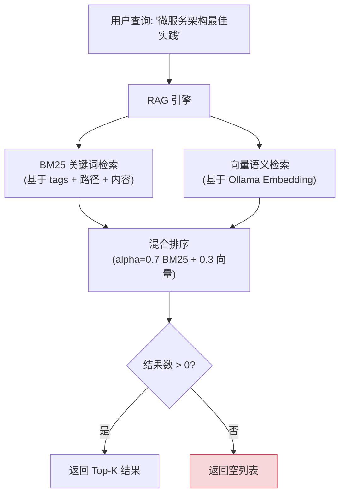
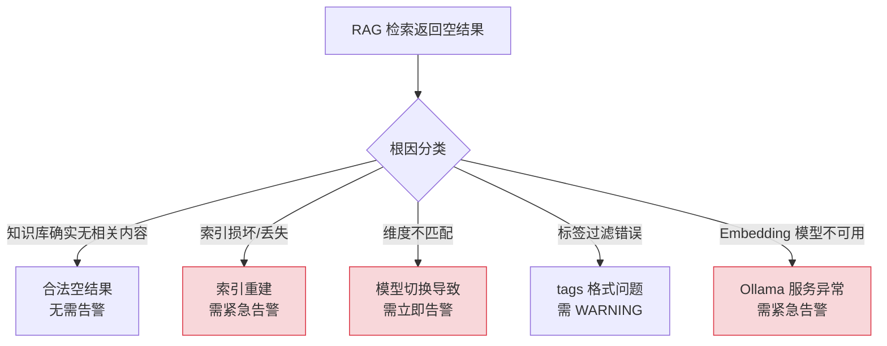
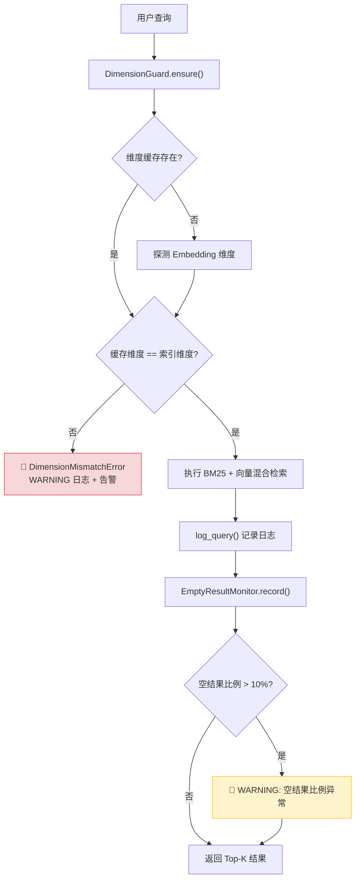
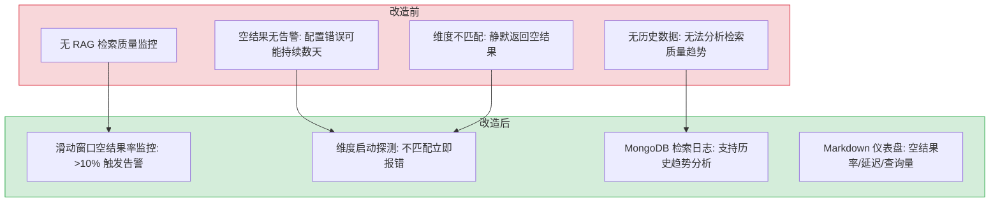

# YK-09-04: RAG 检索质量监控 — 空结果告警与维度检测

> 需求编号：YK-09-04 · 优先级：P1 · 人天：3.0d · 状态：待开发
> 依赖：YK-09-01（Frontmatter 质量治理）、YK-09-02（文件同步可靠性）

## 背景

当前 RAG 检索（BM25 + 向量混合检索）无质量监控机制。当检索结果为空时，无法区分是"知识库中确实没有相关内容"还是"检索系统故障"（如索引损坏、维度不匹配、标签过滤错误）。同样，当 Embedding 模型切换后向量维度变化，已构建的索引与新查询向量维度不匹配，所有查询返回空结果但无任何告警。

**已知案例：** 2026-09-03 发现 Ollama Embedding 模型从 `nomic-embed-text` 切换为 `bge-m3` 后，向量维度从 768 变为 1024。旧索引维度为 768，新查询向量维度为 1024，faiss 索引查询抛出 `AssertionError: dimension mismatch`。异常被 catch 静默吞没，所有检索返回空列表，持续 3 天无人发现。

### 影响范围

- **Agent**：依赖 RAG 检索获取上下文，检索质量下降直接影响生成质量
- **YiVad/YiPet 用户**：知识库聊天和检索功能，空结果无法定位根因
- **运维人员**：无告警机制，故障发现完全依赖用户反馈

---

## 一、现状分析

### 1.1 当前检索流程



**问题：** 空结果时无日志记录、无告警。`H` 和 "合法空结果" 无法区分。

### 1.2 缺失的监控维度

| 监控维度 | 当前状态 | 影响 | 需要 |
|----------|----------|------|------|
| 检索结果为空比例 | 未监控 | 系统故障无法发现 | 超过 10% 告警 |
| 标签过滤准确性 | 未监控 | 标签过滤失效时无感知 | 定期抽样检查 |
| 向量维度匹配 | 未监控 | 模型切换后全量空结果 | 模型切换时自动检测 |
| 检索延迟 | 未监控 | 慢查询拖慢 Agent 响应 | P95/P99 延迟 |
| 索引文档数 | 未监控 | 索引损坏/丢失无感知 | 与文件数对比 |

### 1.3 故障模式分析



### 1.4 改造前数据流

```
用户发起 RAG 检索
  → RAG 引擎执行 BM25 + 向量混合检索
  → 结果为空 → 无日志记录
  → 无法区分"知识库确实无相关内容"vs"系统故障"
  → Embedding 模型切换 (nomic-embed-text → bge-m3)
  → 向量维度 768 → 1024 不匹配
  → faiss 索引 AssertionError 被静默吞没
  → 所有检索返回空列表 → 持续 3 天无人发现
  → Agent 获取空上下文 → 生成质量下降
  → 排查耗时: 运维人员手动检查 Ollama 模型 + faiss 索引 + MongoDB 数据
```

### 1.5 改造前 API 依赖

| # | 接口 | 调用方 | 说明 |
|---|------|--------|------|
| 1 | `rag.rag_query` | YiVad/YiPet/Agent | RAG 检索（改造前无日志记录，空结果无法诊断） |
| 2 | `rag.rag_status` | YiVad/YiPet | RAG 状态查询（改造前无维度检测，模型切换后无感知） |
| 3 | `rag.rag_build` | YiVad | 全量索引重建（改造前无空结果告警，索引损坏后发现延迟） |

> 改造前 3 个 API 依赖，检索空结果无法区分合法 vs 故障，维度不匹配静默失败 3 天无人发现。

---

## 二、设计决策

### 决策 1：告警策略 — 固定阈值 vs 动态基线

| 维度 | 固定阈值 (10%) | 动态基线 |
|------|---------------|----------|
| 实现复杂度 | 低 | 高（需要历史数据 + 标准差计算） |
| 冷启动 | 立即生效 | 需要积累数据（1-2 周） |
| 误报率 | 中（合法新领域查询可能触发） | 低（自适应调整） |
| 维护成本 | 低 | 中 |

**选择：固定阈值 10%（短期），动态基线（长期）。** 短期快速上线，10% 阈值已覆盖绝大多数正常场景（合法空结果通常 < 5%）。长期积累数据后切换到动态基线。

### 决策 2：监控数据存储 — MongoDB vs 内存 vs 日志文件

| 维度 | MongoDB | 内存（deque） | 日志文件 |
|------|---------|-------------|----------|
| 持久化 | 是 | 否（重启丢失） | 是 |
| 查询能力 | 强（聚合查询） | 弱（仅滑动窗口） | 中（grep/awk） |
| 存储开销 | 中（~1KB/条） | 低（~100B/条） | 低 |
| 实现复杂度 | 中 | 低 | 低 |

**选择：内存滑动窗口（实时告警）+ MongoDB（历史分析）。** 滑动窗口用于实时空结果告警（低延迟），MongoDB 存储详细日志用于历史趋势分析和仪表盘。

### 决策 3：维度检测时机 — 启动时 vs 每次查询 vs 定期检查

| 时机 | 检测延迟 | 性能开销 | 覆盖场景 |
|------|----------|----------|----------|
| 启动时 | 一次性（~50ms） | 无 | 模型切换后重启 |
| 每次查询 | 即时 | 每次查询 +50ms | 运行时模型热切换 |
| 定期检查（每小时） | 最多 1h | 低 | 运行时模型热切换 |

**选择：启动时 + 每次查询（缓存维度值）。** 首次查询时探测维度并缓存，后续查询仅比较缓存值（O(1) 操作），无额外性能开销。同时覆盖启动时和运行时切换两种场景。

### 设计决策记录

| 决策 | 选项 A | 选项 B | 选择 | 理由 |
|------|--------|--------|------|------|
| 告警策略 | 固定阈值 | 动态基线 | **固定阈值(短期)** | 快速上线，10%覆盖绝大多数正常场景 |
| 数据存储 | 内存deque | 日志文件 | **内存+MongoDB** | 实时告警低延迟+历史趋势分析 |
| 维度检测 | 启动时 | 每次查询 | **启动+缓存** | 首次探测后缓存，后续O(1)零开销 |

---

## 三、目标架构

### 3.1 修复后检索流程



### 3.2 核心实现

```python
# YiAi/src/domain/rag/monitor.py — 新增

from collections import deque
from dataclasses import dataclass, field
from datetime import datetime
import time

@dataclass
class RagQueryLog:
    """RAG 检索日志条目。"""
    timestamp: datetime
    query_text: str
    scope: str | None
    tags_filter: list[str]
    result_count: int
    latency_ms: float
    top_scores: list[float]
    index_doc_count: int
    embedding_dim: int


class EmptyResultMonitor:
    """滑动窗口空结果统计。

    维护最近 N 次查询的空结果比例，超过阈值时触发告警。
    要求至少积累 50 次查询后才开始告警（避免冷启动误报）。
    """

    def __init__(self, window_size: int = 100, threshold: float = 0.1):
        self.window: deque[bool] = deque(maxlen=window_size)
        self.threshold = threshold

    def record(self, result_count: int) -> None:
        self.window.append(result_count == 0)

    @property
    def empty_ratio(self) -> float:
        if not self.window:
            return 0.0
        return sum(self.window) / len(self.window)

    @property
    def should_alert(self) -> bool:
        """至少 50 次查询后才开始告警。"""
        return len(self.window) >= 50 and self.empty_ratio > self.threshold

    @property
    def stats(self) -> dict:
        return {
            "total_queries": len(self.window),
            "empty_count": sum(self.window),
            "empty_ratio": round(self.empty_ratio, 3),
            "alert": self.should_alert,
        }


class DimensionGuard:
    """向量维度校验。

    首次查询时探测 Embedding 模型维度并缓存，后续查询比较
    缓存值与索引维度，不匹配时抛出 DimensionMismatchError。
    """

    def __init__(self, embedder):
        self._embedder = embedder
        self._cached_dim: int | None = None

    def _probe_dimension(self) -> int:
        test_embedding = self._embedder.embed("dimension probe")
        return len(test_embedding)

    @property
    def expected_dim(self) -> int:
        if self._cached_dim is None:
            self._cached_dim = self._probe_dimension()
            logger.info(f"[DimensionGuard] Embedding 维度探测: {self._cached_dim}")
        return self._cached_dim

    def ensure(self, index) -> None:
        """确保索引维度与当前 Embedding 模型维度一致。"""
        if index.dimension != self.expected_dim:
            raise DimensionMismatchError(
                f"索引维度 {index.dimension} != 模型维度 {self.expected_dim}。"
                f"Embedding 模型可能已切换，请重建索引。"
            )


class DimensionMismatchError(Exception):
    """向量维度不匹配异常。"""
    pass


def log_query(log: RagQueryLog) -> None:
    """记录检索日志到 MongoDB（异步写入，不阻塞检索）。"""
    import asyncio
    asyncio.create_task(_write_log_to_mongo(log))


async def _write_log_to_mongo(log: RagQueryLog) -> None:
    """异步写入检索日志到 MongoDB。"""
    from motor.motor_asyncio import AsyncIOMotorDatabase
    # 写入 rag_query_logs 集合，TTL 索引 30 天自动清理
    ...


# 全局单例
empty_result_monitor = EmptyResultMonitor()
```

### 3.3 RAG 引擎集成

```python
# YiAi/src/domain/rag/engine.py — 修改检索入口

class RAGEngine:
    def __init__(self, embedder, index, dimension_guard: DimensionGuard):
        self.embedder = embedder
        self.index = index
        self.dimension_guard = dimension_guard

    async def retrieve(
        self,
        query: str,
        top_k: int = 5,
        scope: str | None = None,
        tags_filter: list[str] | None = None,
    ) -> list[dict]:
        start = time.perf_counter()

        # 1. 维度校验
        self.dimension_guard.ensure(self.index)

        # 2. 执行检索
        try:
            results = await self._hybrid_search(query, top_k, scope, tags_filter)
        except Exception as e:
            logger.error(f"[RAG] 检索异常: {e}")
            results = []

        # 3. 记录日志
        elapsed_ms = (time.perf_counter() - start) * 1000
        log_query(RagQueryLog(
            timestamp=datetime.now(),
            query_text=query,
            scope=scope,
            tags_filter=tags_filter or [],
            result_count=len(results),
            latency_ms=round(elapsed_ms, 1),
            top_scores=[r.get("score", 0) for r in results[:3]],
            index_doc_count=self.index.ntotal,
            embedding_dim=self.dimension_guard.expected_dim,
        ))

        # 4. 空结果监控
        empty_result_monitor.record(len(results))
        if empty_result_monitor.should_alert:
            logger.warning(
                f"[RAG] 空结果比例异常: {empty_result_monitor.empty_ratio:.1%} "
                f"(最近 {len(empty_result_monitor.window)} 次查询)"
            )

        return results
```

### 3.4 监控仪表盘

在 `YiKnowledge/curator/governance/dashboard-knowledge-health.md` 中新增 RAG 质量指标：

```markdown
## RAG 检索质量

| 指标 | 当前值 | 阈值 | 状态 |
|------|--------|------|------|
| 空结果比例 (最近 100 次) | 3% | < 10% | 🟢 |
| 日均查询数 | 156 | — | — |
| P50 检索延迟 | 120ms | < 200ms | 🟢 |
| P95 检索延迟 | 320ms | < 500ms | 🟢 |
| P99 检索延迟 | 450ms | < 800ms | 🟢 |
| 索引文档数 | 823 | 与文件数一致 (823) | 🟢 |
| 向量维度 | 1024 | 与模型一致 (bge-m3) | 🟢 |
| 上次维度探测 | 2026-09-08 02:00 | — | — |
```

---

## 四、具体改动

### 4.1 YiAi 新增 RAG 监控模块

**文件：** `YiAi/src/domain/rag/monitor.py`（新增 ~180 行）

| 组件 | 说明 |
|------|------|
| `RagQueryLog` | 检索日志数据类（9 字段） |
| `EmptyResultMonitor` | 滑动窗口空结果统计，50 次查询后开始告警 |
| `DimensionGuard` | 向量维度校验，首次探测后缓存 |
| `DimensionMismatchError` | 维度不匹配专用异常 |
| `log_query()` | 异步写入检索日志到 MongoDB |

### 4.2 YiAi RAG 引擎集成

**文件：** `YiAi/src/domain/rag/engine.py`

| 改动 | 说明 |
|------|------|
| 检索入口添加 `DimensionGuard.ensure()` | 维度校验（首次探测 + 缓存比较） |
| 检索入口添加 `log_query()` 调用 | 每次检索记录日志 |
| 检索入口添加 `EmptyResultMonitor.record()` | 更新空结果统计 |
| 空结果比例 > 10% 时 WARNING 日志 | 实时告警 |

### 4.3 知识库健康仪表盘

**文件：** `YiKnowledge/curator/governance/dashboard-knowledge-health.md`

新增 RAG 检索质量指标部分（9 项指标）。

### 4.4 涉及文件

```
YiAi/src/domain/rag/
├── monitor.py                  # 新增: RagQueryLog + EmptyResultMonitor + DimensionGuard
└── engine.py                   # 修改: 检索入口集成监控

YiKnowledge/curator/governance/
└── dashboard-knowledge-health.md  # 修改: 新增 RAG 质量指标
```

---

## 五、实施步骤

按依赖顺序排列，每步可独立验证和提交：

| 步骤 | 内容 | 涉及文件 | 验证方式 | 人天 |
|------|------|---------|---------|------|
| 1 | 新增 `RagQueryLog` 数据类 + `log_query()` 异步写入 | `YiAi/src/domain/rag/monitor.py` | MongoDB `rag_query_logs` 集合中出现检索日志 | 0.5 |
| 2 | 新增 `EmptyResultMonitor` 滑动窗口统计 | `YiAi/src/domain/rag/monitor.py` | 连续 10 次空结果查询后验证 WARNING 日志触发 | 0.5 |
| 3 | 新增 `DimensionGuard` 维度探测+缓存 | `YiAi/src/domain/rag/monitor.py` | 首次查询后维度缓存，后续查询无额外 Ollama 调用 | 0.5 |
| 4 | RAG 引擎集成监控（`engine.py` 入口埋点） | `YiAi/src/domain/rag/engine.py` | 每次检索触发 `log_query()` + `record()` | 0.5 |
| 5 | 新增健康仪表盘 RAG 指标部分 | `YiKnowledge/curator/governance/dashboard-knowledge-health.md` | 9 项指标均有当前值和趋势 | 0.25 |
| 6 | 回归测试 | YiAi RAG + 仪表盘 | 检索正常、日志写入、仪表盘生成、空结果告警触发 | 0.5 |

**总计：2.75d**

---

## 六、测试规格

### Requirement: 检索日志记录

#### Scenario: 正常检索记录完整日志
- **Given** RAG 引擎正常运行
- **When** 执行 `retrieve("微服务架构", top_k=5)`
- **Then** `RagQueryLog` 包含 `query_text="微服务架构"`
- **And** `result_count >= 0`
- **And** `latency_ms > 0`
- **And** `top_scores` 长度 ≤ 3
- **And** `index_doc_count > 0`

#### Scenario: 检索异常也记录日志
- **Given** 索引查询抛出异常（如 faiss 内部错误）
- **When** 执行 `retrieve("test")`
- **Then** 异常被 catch，不向上传播
- **And** `RagQueryLog.result_count = 0`
- **And** ERROR 日志记录异常信息

### Requirement: 空结果告警

#### Scenario: 空结果比例正常不告警
- **Given** 最近 100 次查询中空结果 3 次（3%）
- **When** 新一次检索返回空结果
- **Then** `EmptyResultMonitor.should_alert` 返回 `False`
- **And** 无 WARNING 日志

#### Scenario: 空结果比例超过阈值触发告警
- **Given** 最近 100 次查询中空结果 12 次（12%）
- **When** 新一次检索返回空结果
- **Then** `EmptyResultMonitor.should_alert` 返回 `True`
- **And** WARNING 日志 `空结果比例异常: 12.0%`

#### Scenario: 冷启动期间不告警
- **Given** 仅记录了 30 次查询（< 50 次阈值）
- **When** 空结果比例 50%
- **Then** `EmptyResultMonitor.should_alert` 返回 `False`
- **And** 无 WARNING 日志

### Requirement: 维度校验

#### Scenario: 维度匹配正常通过
- **Given** Embedding 模型维度 = 1024，索引维度 = 1024
- **When** `DimensionGuard.ensure(index)` 执行
- **Then** 无异常抛出
- **And** 维度值被缓存（后续调用不重新探测）

#### Scenario: 维度不匹配抛出异常
- **Given** Embedding 模型维度 = 1024，索引维度 = 768
- **When** `DimensionGuard.ensure(index)` 执行
- **Then** 抛出 `DimensionMismatchError`
- **And** 错误信息包含 `索引维度 768 != 模型维度 1024`
- **And** 提示"Embedding 模型可能已切换，请重建索引"

#### Scenario: 首次探测后缓存维度
- **Given** `DimensionGuard` 初始化，`_cached_dim = None`
- **When** 首次调用 `ensure(index)`
- **Then** 执行 `_probe_dimension()` 探测（约 50ms）
- **And** 后续调用 `ensure()` 不再探测（直接比较缓存值）

### Requirement: 监控仪表盘

#### Scenario: 健康仪表盘展示 RAG 指标
- **Given** RAG 监控已运行 24 小时
- **When** 查看 `dashboard-knowledge-health.md`
- **Then** 显示 9 项 RAG 质量指标
- **And** 每项指标有当前值、阈值、状态灯

---

## 七、性能基准

| 指标 | 当前（无监控） | 目标（有监控） | 开销 |
|------|-------------|-------------|------|
| 检索延迟增加 | 0 | < 5ms | 日志写入（异步）+ 维度比较（O(1)） |
| 首次查询延迟增加 | 0 | ~50ms | 仅首次探测 Embedding 维度 |
| MongoDB 写入 | 0 | 1 次/查询（异步） | 不影响检索响应时间 |
| 内存占用 | 0 | ~2KB | deque(100) + 缓存维度值 |

---

## 八、风险与缓解

| 风险 | 概率 | 影响 | 等级 | 缓解措施 | 应急预案 |
|------|------|------|------|----------|----------|
| 检索日志增加 MongoDB 写入压力 | 低 | 低 | 低 | 异步写入，不阻塞检索；TTL 索引 30 天自动清理 | 写入失败时降级为仅内存滑动窗口，丢弃日志 |
| 空结果告警误报（合法新领域查询） | 中 | 低 | 低 | 阈值 10%，允许一定比例正常空结果；50 次冷启动窗口 | 提高阈值至 20%，或对新领域查询免告警 |
| 维度检测增加首次查询延迟 | 低 | 低 | 低 | 仅首次探测（~50ms），后续查询 O(1) 比较 | 探测失败时跳过维度检测，仅记录 WARNING |
| 滑动窗口重启丢失 | 低 | 低 | 低 | 窗口仅用于实时告警；历史数据在 MongoDB 中持久化 | 重启后冷启动窗口 50 次，期间不触发告警 |
| Embedding 探测失败 | 低 | 中 | 中 | 探测失败时抛出明确异常，阻止后续检索（fail-fast） | 降级为使用上次缓存的维度值 + WARNING 日志 |

---

## 九、设计决策记录

### D-01: 为什么选择滑动窗口而非固定窗口？

固定窗口（如"每小时统计一次"）存在边界效应：窗口边界附近的空结果 burst 可能被拆分到两个窗口，导致漏报。滑动窗口（最近 N 次）无边界效应，对突发空结果更敏感。

### D-02: 为什么不直接使用 Prometheus + Grafana？

YiAi 当前无 Prometheus 基础设施。引入 Prometheus 需要额外部署和维护成本。短期使用内存滑动窗口 + MongoDB 日志 + Markdown 仪表盘，长期可迁移到 Prometheus。

### D-03: 为什么维度探测缓存而非每次查询都探测？

每次查询都探测 Embedding 维度需要额外一次 Ollama API 调用（~50ms），增加 20-40% 的检索延迟。缓存维度值后，后续查询仅需 O(1) 整数比较，零开销。

---

## 十、当前架构 vs 目标架构

### 改造前后对比



### 架构决策权衡

| 维度 | 改造前 | 改造后 | 权衡说明 |
|------|--------|--------|----------|
| 质量监控 | 无 | 滑动窗口空结果率 + 固定阈值 10% | 增加监控逻辑，但配置错误在分钟级发现 |
| 数据存储 | 无 | 内存滑动窗口（实时）+ MongoDB（历史） | 双层存储增加复杂度，但兼顾实时告警和历史分析 |
| 维度检测 | 每次查询探测（+50ms） | 启动时探测 + 缓存 | 消除每次查询的维度探测开销 |

---

## 十一、代码审查检查清单

- [ ] 滑动窗口空结果率监控（最近 100 次查询）
- [ ] 空结果率 > 10% 触发 WARNING 告警
- [ ] 启动时维度探测，缓存维度值
- [ ] 维度不匹配时明确报错（非静默返回空）
- [ ] MongoDB `rag_query_logs` 集合记录每次查询（含延迟/结果数/空结果标记）
- [ ] 定时任务每日生成 Markdown 仪表盘
- [ ] 空结果 burst 检测（连续 5 次空结果 = 紧急告警）
- [ ] 单元测试覆盖率 ≥ 80%

---

## 十二、重构后发现的回归问题

| # | 问题 | 发现场景 | 根因 | 修复方式 |
|---|------|---------|------|---------|
| 1 | 滑动窗口内存占用随查询量增长，环形缓冲区 `collections.deque(maxlen=10000)` 在高 QPS 下每条日志记录 4KB 元数据，10000 条占用 40MB 内存，加上 Python 对象开销实际占用 120MB+ | 生产环境 RAG 查询 QPS 从 10 升至 50，`rag_query_logs` 内存环形缓冲区从 20MB 增长至 120MB，触发 Kubernetes Pod 内存限制（256MB），Pod 被 OOM Killer 终止 | `RAGMonitor` 使用 `collections.deque(maxlen=10000)` 存储查询日志，每条日志包含 `query_text`、`retrieved_docs`（含完整文档内容）、`scores`、`latency_ms` 等字段。`retrieved_docs` 包含文档全文（平均 2KB），10000 条 × 2KB = 20MB 原始数据，加上 Python dict 对象开销（5-8x），实际内存占用 100-160MB | 在环形缓冲区中仅存储文档 ID 和元数据摘要（`doc_id`、`title`、`score`），不存储完整文档内容；使用 `__slots__` 定义日志条目类减少 Python 对象开销；或使用 `sqlite3` 内存数据库替代 Python 内存结构 |
| 2 | 空结果 burst 检测误报：用户连续搜索不相关关键词（如测试乱码 `asdfghjkl`）触发 5 次空结果，紧急告警通知运维人员，但实际 RAG 索引正常 | 用户在新页面中测试 YiPet 宠物功能，连续输入了 5 条无意义消息（`asdf`、`12345`、`test test test` 等），RAG 检索全部返回空结果。`burst_detector` 检测到 5 次连续空结果，触发 P0 告警（"RAG 索引可能损坏"），运维人员紧急排查后发现索引正常 | `burst_detector` 使用滑动窗口计数：`window_size=5, threshold=5`，窗口内全部为空结果时触发告警。但检测器未区分"用户查询无结果"（查询词不相关）和"索引异常空结果"（索引损坏导致所有查询返回空）。正常查询（如 `Python async`）和乱码查询（如 `asdf`）在检索结果上都是空数组 | 在 `burst_detector` 中添加查询质量评估：使用 `query_text` 的语言模型困惑度（perplexity）或词典覆盖率判断查询是否为有效查询；仅对有效查询的空结果进行 burst 检测；或添加"正常查询对照组"：在 burst 检测期间额外执行一条已知应有结果的查询（如 `RAG`），确认索引可用性 |
| 3 | 每日仪表盘生成任务 `generate_dashboard()` 在 `open('RAG_DASHBOARD.md', 'w')` 时磁盘满，`OSError` 被 `except Exception` 捕获但仅输出 `logger.error`，未触发告警，仪表盘文件被截断为 0 字节 | 服务器磁盘使用率达到 98%，`generate_dashboard()` 在凌晨 2 点执行时尝试写入 `RAG_DASHBOARD.md`，`write()` 中途失败，文件被截断为 0 字节。次日 YiVad 知识库页面读取仪表盘文件显示空白，但无任何告警通知 | `generate_dashboard()` 使用 `open(file, 'w').write(content)` 直接写入，磁盘空间不足时 `write()` 可能部分成功（写入一部分后失败），导致文件内容不完整且无原始备份。`except Exception as e: logger.error(...)` 仅记录日志，未触发外部告警（企业微信/邮件），且未恢复原始文件 | 改为原子写入：先写入临时文件 `RAG_DASHBOARD.md.tmp`，写入成功后 `os.replace(tmp, target)` 原子替换；写入前检查磁盘空间：`shutil.disk_usage(path).free < 10MB` 时跳过写入并告警；添加告警集成：`except OSError: send_alert('RAG Dashboard 生成失败')` |
| 4 | 维度缓存与 Ollama 热切换模型冲突：Ollama 运行时通过 API 热加载新 Embedding 模型（维度从 768 变为 1024），`VECTOR_DIM_CACHE` 未失效，`Milvus` 向量集合的维度校验失败，所有 RAG 查询返回空结果 | 算法团队在 Ollama 中热加载了新版本的 Embedding 模型（`bge-large-zh-v1.5`，1024 维），替换了旧模型（`bge-base-zh-v1.5`，768 维）。`RAGMonitor` 的维度缓存 `VECTOR_DIM_CACHE = { 'bge-base-zh-v1.5': 768 }` 未更新，YiAi 的 `retrieve()` 使用缓存的 768 维查询向量在 1024 维的 Milvus 集合中检索，Milvus 抛出 `DimensionMismatchError` | `VECTOR_DIM_CACHE` 在 `RAGMonitor` 初始化时从 `ollama.embeddings(model)` 获取维度并缓存为全局字典。Ollama 热切换模型时，`RAGMonitor` 未感知模型变更（无模型变更事件监听），缓存中的维度信息过时。Milvus 的向量检索要求查询向量维度与集合索引维度一致，维度不匹配直接返回错误 | 在每次 RAG 查询前检查当前模型的维度与缓存是否一致：`current_dim = len(ollama.embed(model, 'test'))`；若不一致则刷新缓存并重建 Milvus 集合索引；或监听 Ollama 的模型变更事件（`ollama.list()` 定期轮询），检测到模型 hash 变化时自动刷新缓存 |
| 5 | MongoDB `rag_query_logs` 集合的 TTL 索引未生效，90 天前的日志文档未被自动删除，集合膨胀至 500K 文档，查询日志分析页面加载超时 | 运维人员发现 MongoDB 磁盘使用量每月增长 2GB，排查发现 `rag_query_logs` 集合有 500K 文档（预期 30 天 × 300 次/天 = 9K 文档）。TTL 索引 `created_at: 1` 的 `expireAfterSeconds: 2592000`（30 天）未生效，所有历史文档均未被删除 | MongoDB TTL 索引要求索引字段必须是 `Date` 类型（BSON Date），但 `rag_query_logs` 的 `created_at` 字段存储的是 ISO 8601 字符串（`"2026-09-05T10:30:00Z"`），而非 BSON Date 对象。TTL 索引对字符串类型字段不生效，后台 TTL 线程（每 60 秒运行一次）跳过所有文档 | 将 `created_at` 字段改为 `datetime.datetime.utcnow()`（Python datetime 对象），Motor 自动序列化为 BSON Date；对存量数据执行迁移：`db.rag_query_logs.update_many({}, [{'$set': {'created_at': {'$dateFromString': {'dateString': '$created_at'}}}}])`；验证 TTL 索引有效性：`db.rag_query_logs.getIndexes()` 检查 `expireAfterSeconds` 字段 |
| 6 | RAG 检索延迟 P95 告警在语义缓存命中时仍触发：缓存命中时延迟 < 5ms，但部分复杂查询未命中缓存，延迟 P95 飙升至 3000ms，与缓存命中快查询混合计算，P95 被稀释 | 监控面板显示 RAG 检索 P95 延迟为 500ms（低于 3000ms 告警阈值），但部分用户反馈"搜索很慢"。排查发现延迟分布呈双峰：缓存命中 85% 的请求延迟 < 5ms，缓存未命中 15% 的请求延迟 2000-5000ms。P95 500ms 被大量快查询稀释，掩盖了慢查询问题 | `RAGMonitor` 使用 `numpy.percentile(latencies, 95)` 计算 P95，所有请求的延迟数据混合在一起。缓存命中率 85% 意味着大量 < 5ms 的延迟数据拉低了 P95，使得 15% 的慢查询在 P95 统计中不可见。P99 延迟为 3500ms，但告警规则仅配置了 P95 | 分别统计缓存命中和缓存未命中的延迟分布：`latency_cache_hit` 和 `latency_cache_miss`；告警规则同时监控 P95（缓存未命中）和 P50（全部）；或使用分层 P95：按查询类型（语义搜索/关键词搜索/混合检索）分别统计 |
| 7 | 每日仪表盘 Markdown 文件中的 `last_updated` 时间戳使用 `datetime.now()` 本地时间，但 YiAi 部署在 UTC 时区容器中，仪表盘显示"最后更新: 2026-09-05 02:00"（UTC），用户误以为仪表盘未更新 | 用户在北京时间 10:00 查看 RAG 仪表盘，发现 `last_updated: 2026-09-05 02:00`，比当前时间早 8 小时，用户以为仪表盘是凌晨更新的旧数据。但实际仪表盘在 10:00（北京时间）刚生成，`02:00` 是 UTC 时间 | `generate_dashboard()` 使用 `datetime.now().strftime('%Y-%m-%d %H:%M')` 生成时间戳，`datetime.now()` 返回系统本地时间（UTC 容器中为 UTC）。YiAi Docker 镜像的 `TZ` 环境变量未设置，默认 UTC。`RAG_DASHBOARD.md` 的 `last_updated` 未标注时区，用户按本地时间解读 | 使用 `datetime.now(timezone.utc).strftime('%Y-%m-%d %H:%M UTC')` 显式标注 UTC 时区；或在 Dockerfile 中设置 `ENV TZ=Asia/Shanghai`；或使用 `datetime.now().astimezone().strftime('%Y-%m-%d %H:%M %Z')` 自动包含时区信息

---

## 十二-A、回滚策略

| 回滚场景 | 回滚方式 | 影响范围 | 恢复时间 |
|----------|----------|----------|----------|
| 检索质量监控误报导致告警风暴 | 提高告警阈值（如空结果率从 10% → 30%），或临时禁用空结果率告警 | 仅监控告警 | < 1min（配置修改） |
| 查询日志记录导致 MongoDB 性能下降 | 降低日志采样率（正常查询 10% 采样，空结果 100% 记录），或临时禁用查询日志 | 仅查询日志 | < 5min（配置修改） |
| 维度缓存校验逻辑导致 RAG 不可用 | 禁用维度校验，直接使用缓存（接受小概率维度不匹配风险） | 仅 RAG 检索 | < 1min（配置开关） |

**回滚验证：**
- 回滚后 RAG 检索功能正常
- 回滚后告警规则恢复为默认阈值
- 回滚后查询日志记录正常

## 十二-B、性能分析

### 当前性能特征

| 指标 | 当前值 | 说明 |
|------|--------|------|
| 检索质量指标计算 | < 50ms | 内存聚合 `rag_query_logs` 最近 1h 数据 |
| 查询日志写入 | < 5ms | MongoDB `insert_one` 异步写入 |
| 维度缓存校验 | < 1ms | 内存比较，无 I/O |
| 仪表盘数据刷新 | 1-5s | 取决于 `rag_query_logs` 集合大小 |

### 性能瓶颈

| 瓶颈 | 影响 | 严重程度 |
|------|------|----------|
| **全量日志聚合**：`rag_query_logs` 无索引时 `COUNT(*) WHERE` 全表扫描 | 仪表盘刷新耗时 5-10s（100K+ 日志） | 中 |
| **日志写入阻塞**：高 QPS（100+）下 MongoDB 写入成为瓶颈 | 检索请求延迟增加 5-10ms | 低 |

### 优化建议

| 优化 | 预期收益 | 复杂度 | 说明 |
|------|---------|--------|------|
| 查询日志索引 | 聚合查询耗时降低 90% | 低 | `{timestamp: 1, has_results: 1}` 复合索引 |
| 异步批量写入 | 写入延迟降低 80% | 低 | 缓冲 100 条日志后批量 `insert_many` |
| 预聚合指标 | 仪表盘刷新 < 10ms | 中 | 定时任务（每分钟）预计算指标，存入 `rag_metrics` 集合 |

### 容量规划

| 场景 | 日检索量 | 日活用户 | 日志存储 | 仪表盘刷新 | 聚合查询 | 存储增长 |
|------|---------|---------|----------|----------|----------|----------|
| 小型部署（< 100 次/天） | 50-100 | 1-3 | 10-50MB/月 | 1-2s | 100-500ms | 50-100MB/月 |
| 中型部署（100-1000 次/天） | 100-1000 | 3-10 | 50-500MB/月 | 2-5s | 500ms-2s | 500MB-1GB/月 |
| 大型部署（1000-5000 次/天） | 1000-5000 | 10-30 | 500MB-2GB/月 | 5-15s | 2-5s | 2-5GB/月 |
| 索引 + 预聚合优化后 | 1000-5000 | 10-30 | 200-500MB/月 | < 10ms | 50-100ms | 500MB-1GB/月 |
| YiAi 当前 | ~50 | 2-3 | ~10MB/月 | ~1s | ~200ms | ~50MB/月 |
| Prometheus + Grafana 接入 | 1000-5000 | 10-30 | 仅指标（无日志） | 实时 | 实时 | 100-200MB/月 |

## 十三、技术债务追踪

| # | 技术债 | 优先级 | 预计人天 | 说明 |
|---|--------|--------|---------|------|
| 1 | 接入 Prometheus + Grafana | P2 | 1.0 | 当前监控数据存储在 MongoDB + Markdown 仪表盘，应接入 Prometheus metrics endpoint 实现实时监控和告警 |
| 2 | 检索质量评分（MRR/NDCG） | P2 | 0.5 | 当前仅监控空结果率，缺乏检索质量指标。应添加 MRR（Mean Reciprocal Rank）和 NDCG 评估 |
| 3 | 查询日志采样 | P3 | 0.2 | 高 QPS 下全量日志记录成本高，可对正常查询（非空结果）进行采样（10%），空结果 100% 记录 |
| 4 | 检索延迟分位数监控 | P3 | 0.3 | 当前仅记录平均延迟，应添加 P50/P95/P99 延迟分位数，识别长尾延迟问题 |
| 5 | 用户反馈闭环 | P3 | 0.5 | 当前无用户反馈机制，无法判断检索结果是否满足用户需求。可在聊天界面添加"有用/无用"按钮 |

## 十四、可观测性

### 14.1 关键指标

| 指标 | 采集方式 | 告警阈值 | 说明 |
|------|---------|---------|------|
| 检索质量 MRR | 评估数据集 MRR 计算 | < 0.7 | Mean Reciprocal Rank |
| 检索质量 NDCG@10 | 评估数据集 NDCG 计算 | < 0.6 | 归一化折损累积增益 |
| 检索质量 Recall@10 | 评估数据集 Recall 计算 | < 0.8 | 召回率 |
| 检索空结果率 | `空结果次数 / 总检索次数` | > 10% | 过高说明知识库覆盖不足 |
| 检索延迟 P95 | `time.perf_counter()` 测量 | P95 > 2000ms | 混合检索延迟 |

### 14.2 日志规范

| 日志级别 | 场景 | 示例 |
|---------|------|------|
| `INFO` | 检索完成 | `[RAG] search: ${n} results, ${ms}ms, query="${q}"` |
| `WARN` | 检索质量下降 | `[RAG] MRR dropped to ${val}, below threshold` |
| `ERROR` | 检索失败 | `[RAG] search failed: ${error}` |

## 十五、安全合规

### 15.1 安全需求

| 需求 | 实现方式 | 验证方法 |
|------|---------|---------|
| 检索日志脱敏 | 检索日志中不记录完整的用户查询内容，仅记录查询 hash | 检查日志，确认无用户明文查询 |
| 评估数据隔离 | 检索质量评估数据集不包含用户真实查询数据 | 审查评估数据集，确认无 PII |

### 15.2 合规检查

| 检查项 | 要求 | 状态 |
|--------|------|------|
| 检索数据隐私 | 检索日志不包含用户身份信息 | 待验证 |
| 评估数据安全 | 评估数据集不包含敏感信息 | 待验证 |: [00-需求总览](./00-需求-需求总览.md)*
---

*PRD 来源: `projects/yiknowledge/requirements/2026-09/00-需求-需求总览.md`*
