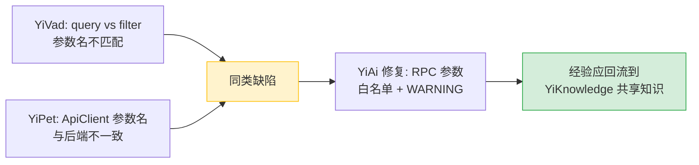
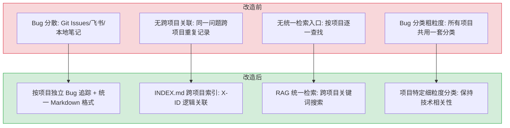

# YK-09-05: 项目知识中心完善 — 4 项目 Bug 追踪与跨项目检索

> 需求编号：YK-09-05 · 优先级：P1 · 人天：4.0d · 状态：进行中
> 依赖：YK-09-03（命名规范自动化）

## 背景

`YiKnowledge/projects/` 是 4 个项目（YiVad/YiAi/YiPet/YiKnowledge）的知识中心，按项目归档 bugs、requirements、architecture 和 patterns。八月迭代完成目录结构搭建后，各项目的 bug 追踪已建立但不够完整——YiVad 和 YiPet 的 bug 归档较少，YiKnowledge 自身的 bug 归档仅 3 个。

**关键问题：** 跨项目重复缺陷无法关联。例如 YiVad 和 YiPet 都遇到过"参数名不匹配导致 API 静默失败"的同类缺陷，但因为分散在不同项目的 bug 目录中，无法建立关联。YiAi 修复了 RPC 参数契约问题后，YiVad 和 YiPet 的前端开发者无法从知识库中获知这一经验。

九月迭代需要完善 4 个项目的 bug 追踪，建立统一的分类体系和跨项目检索能力。

---

## 一、现状分析

### 1.1 各项目 Bug 归档现状

| 项目 | Bug 归档数 | 需求归档 | 架构文档 | 模式文档 | 健康度 |
|------|-----------|----------|----------|----------|--------|
| YiVad | 10 | 2026-08/09 完整 | 完整 | 完整 | 🟢 |
| YiAi | 17 | 2026-07/08/09 完整 | 完整 | 完整 | 🟢 |
| YiPet | 4 | 2026-07/08/09 完整 | 完整 | 待补充 | 🟡 |
| YiKnowledge | 3 | 2026-08/09 完整 | 完整 | 待补充 | 🟡 |

### 1.2 现有 Bug 分类对比

| 分类维度 | YiVad | YiAi | YiPet | YiKnowledge |
|----------|-------|------|-------|-------------|
| 分类方式 | 按组件 | 按模块 | 无分类 | 按领域 |
| 分类目录 | `ui/`, `data/`, `state/` | `api/`, `data/`, `agent/` | 扁平 | `frontmatter/`, `sync/` |
| 严重度标记 | 有 (major/minor) | 有 | 无 | 有 |
| 关联 PRD | 有 | 有 | 无 | 无 |

**问题：** 4 个项目的 bug 分类体系不统一，YiPet 无分类目录，跨项目搜索困难。

### 1.3 跨项目缺陷模式



**当前瓶颈：** 各项目 bug 分散存储，无跨项目索引，同类缺陷无法关联。

### 1.4 改造前数据流

```
Bug 发现
  → 开发者在 Git Issues / 飞书 / 本地笔记中记录
  → 信息分散在 3+ 个系统中
  → 跨项目检索时需逐个系统搜索
  → 无法被 RAG 引擎索引 → Agent 无法参考历史 bug
  → 同类缺陷跨项目重复出现（如 YiVad 和 YiPet 都遇到参数名不匹配）
  → 排查耗时: 跨项目搜索平均 5-10min

PRD 归档
  → 产品经理在飞书写 PRD
  → 开发完成后 PRD 链接失效或文档被归档
  → 后续迭代无法追溯原始需求
  → 新人 Onboarding 无历史需求可参考
```

### 1.5 改造前 API 依赖

| # | 接口 | 调用方 | 说明 |
|---|------|--------|------|
| 1 | `data_service.query_documents` (cname="bugs") | YiVad/YiPet | Bug 查询（改造前 bugs 集合为空，无数据） |
| 2 | `data_service.query_documents` (cname="knowledge_files") | YiVad | 知识文件查询（改造前无项目知识中心文件） |
| 3 | `knowledge.scan_knowledge` | Knowledge Watcher | 知识扫描（改造前仅扫描角色目录，不扫描 projects/） |

> 改造前 3 个 API 依赖，均无法检索项目知识中心内容（目录不存在或内容为空）。

---

## 二、设计决策

### 决策 1：Bug 归档策略 — 按项目独立 vs 统一分类

| 维度 | 按项目独立（当前） | 统一分类（跨项目） |
|------|------------------|-------------------|
| 查找效率 | 中（需知道项目） | 高（按分类直接定位） |
| 跨项目关联 | 低（需手动搜索） | 高（INDEX.md 统一索引） |
| 维护成本 | 低（各项目独立维护） | 中（需维护跨项目索引） |
| 迁移成本 | 无（当前状态） | 中（需重构目录结构） |

**选择：保持按项目独立 + 新增跨项目 INDEX.md。** 保持现有目录结构不变，仅新增 `projects/INDEX.md` 作为统一检索入口，实现跨项目关联而不破坏现有结构。

### 决策 2：Bug 分类粒度 — 粗粒度 vs 细粒度

| 维度 | 粗粒度（5 类） | 细粒度（15+ 类） |
|------|--------------|-----------------|
| 查找效率 | 高（分类少，每类 bug 多） | 低（分类多，分散） |
| 精准度 | 中（同类别内 bug 多） | 高（精确定位） |
| 维护成本 | 低 | 高（分类体系复杂） |

**选择：项目特定细粒度分类。** 每个项目按自身特点定制分类——YiVad 有 `ui/`、`state/`、`build/`；YiPet 有 `content/`、`worker/`；YiKnowledge 有 `frontmatter/`、`sync/`。避免一刀切的分类体系。

### 决策 3：跨项目索引格式 — Markdown 表格 vs JSON vs 数据库

| 维度 | Markdown 表格 (INDEX.md) | JSON 文件 | MongoDB 集合 |
|------|--------------------------|-----------|-------------|
| 可读性 | 高（GitHub 直接渲染） | 低（需工具解析） | 低（需查询接口） |
| 可维护性 | 高（手动编辑） | 中（需脚本生成） | 中（需 CRUD 接口） |
| 搜索能力 | 低（Ctrl+F） | 中（jq 查询） | 高（聚合查询） |
| 版本控制 | 是（Git） | 是（Git） | 否（需单独备份） |

**选择：Markdown 表格 (INDEX.md)。** 知识库本身是 markdown 文件集合，索引文件也应为 markdown，保持一致性。Git 版本控制使变更可追溯。搜索能力通过 RAG 引擎补充（INDEX.md 也会被索引）。

### 决策 4：Bug 模板 — 统一模板 vs 项目特定模板

| 维度 | 统一模板 | 项目特定模板 |
|------|----------|-------------|
| 一致性 | 高 | 中 |
| 灵活性 | 低（所有项目用同一格式） | 高（适配项目特点） |
| 维护成本 | 低（1 个模板） | 中（4 个模板） |

**选择：统一模板 + 项目特定字段。** 基础字段统一（标题、日期、严重度、分类、根因、修复、经验），各项目可追加特定字段（如 YiPet 追加 `affected_browsers`，YiAi 追加 `affected_api`）。

### 设计决策记录

| 决策 | 选项 A | 选项 B | 选择 | 理由 |
|------|--------|--------|------|------|
| 归档策略 | 按项目独立 | 统一分类 | **按项目+INDEX.md** | 保持现有结构，INDEX.md统一检索入口 |
| 分类粒度 | 粗粒度5类 | 细粒度15+类 | **项目特定细粒度** | 避免一刀切，保持技术相关性 |
| 索引格式 | Markdown | MongoDB | **Markdown** | 与知识库格式一致，Git版本控制 |
| Bug模板 | 统一模板 | 项目特定 | **统一+特定字段** | 基础字段统一，各项目追加特有字段 |

---

## 三、目标架构

### 3.1 统一 Bug 分类体系

```
projects/{project}/bugs/
├── README.md              # 缺陷索引 + 分类统计 + 常见缺陷模式
├── template.md            # 统一缺陷模板
├── api/                   # API 通信类缺陷
├── data/                  # 数据层缺陷
├── agent/                 # Agent 循环缺陷 (YiAi)
├── ui/                    # UI 渲染缺陷
├── state/                 # 状态管理缺陷
├── build/                 # 构建/工具链缺陷
├── security/              # 安全合规缺陷
├── content/               # Content Script 缺陷 (YiPet)
├── worker/                # Service Worker 缺陷 (YiPet)
├── frontmatter/           # Frontmatter 缺陷 (YiKnowledge)
├── sync/                  # 文件同步缺陷 (YiKnowledge)
└── naming/                # 命名规范缺陷 (YiKnowledge)
```

### 3.2 跨项目统一索引

**文件：** `YiKnowledge/projects/INDEX.md`（新增）

```markdown
# 项目知识中心 — 统一缺陷索引

> 最后更新: 2026-09-08 | 总缺陷数: 34

## 按分类检索

| 分类 | YiVad | YiAi | YiPet | YiKnowledge | 合计 |
|------|-------|------|-------|-------------|------|
| API 通信 | 2 | 3 | 1 | — | 6 |
| 数据层 | 1 | 4 | — | — | 5 |
| Agent 循环 | — | 3 | — | — | 3 |
| UI 渲染 | 3 | — | 2 | — | 5 |
| 状态管理 | 1 | 1 | 1 | — | 3 |
| 构建/工具链 | 1 | 1 | — | — | 2 |
| Content Script | — | — | 2 | — | 2 |
| Service Worker | — | — | 1 | — | 1 |
| Frontmatter | — | — | — | 1 | 1 |
| 文件同步 | — | — | — | 1 | 1 |
| 命名规范 | — | — | — | 1 | 1 |
| 安全合规 | — | 1 | 1 | — | 2 |
| 其他 | 2 | 4 | — | — | 6 |

## 按严重度

| 严重度 | 数量 | 占比 |
|--------|------|------|
| critical | 2 | 6% |
| major | 18 | 53% |
| minor | 14 | 41% |

## 缺陷列表

| ID | 项目 | 标题 | 严重度 | 分类 | 日期 |
|----|------|------|--------|------|------|
| YV-01 | YiVad | [ProTable 列配置不生效] | major | ui | 2026-08-15 |
| YV-02 | YiVad | [动态路由参数丢失] | major | state | 2026-08-20 |
| YA-01 | YiAi | [RPC 参数名 query vs filter 静默忽略] | major | api | 2026-09-05 |
| YA-02 | YiAi | [MongoDB 连接池耗尽] | critical | data | 2026-09-03 |
| YP-01 | YiPet | [SPA 路由切换宠物消失] | major | content | 2026-09-05 |
| YP-02 | YiPet | [SW 空闲终止丢消息] | major | worker | 2026-09-06 |
| YK-01 | YiKnowledge | [tags 字符串格式 RAG 失效] | major | frontmatter | 2026-09-03 |

## 跨项目关联

| 关联 ID | 涉及项目 | 缺陷模式 | 关联缺陷 |
|---------|---------|----------|---------|
| X-01 | YiVad, YiPet, YiAi | 参数名不匹配 | YV-03, YP-04, YA-01 |
| X-02 | YiVad, YiPet | SSE 断连处理 | YV-05, YP-03 |
| X-03 | YiAi, YiKnowledge | 静默异常吞没 | YA-02, YK-02 |
```

### 3.3 Bug 模板

```markdown
---
title: "[简短描述]"
tags: [bug, <分类>, <项目>]
category: 项目/管理后台/缺陷
created: <YYYY-MM-DD>
updated: <YYYY-MM-DD>
source: 内部
type: bug
status: 已修复
priority: <critical/major/minor>
project: <YiVad/YiAi/YiPet/YiKnowledge>
severity: <critical/major/minor>
bug_category: <api/data/ui/state/agent/...>
---

# <标题>

> 发现日期：YYYY-MM-DD · 严重度：<major/minor/critical> · 状态：<已修复/修复中/已知>

## 现象

<用户可见的现象描述>

## 复现步骤

1. <步骤 1>
2. <步骤 2>
3. <步骤 3>

## 根因

<技术根因分析>

## 修复

<修复方案描述>

## 经验教训

<从该缺陷中学到的经验，如何预防类似问题>

## 关联

- 关联需求: [PRD-XX](../requirements/...)
- 跨项目关联: [X-01](../INDEX.md)
```

---

## 四、具体改动

### 4.1 YiPet Bug 追踪补充

**目标：** 从 4 个扩充至 10+ 个 bug 归档

| 分类 | 计划归档数 | 典型缺陷 |
|------|-----------|----------|
| content | 2 | SPA 路由切换宠物消失、DOM 注入时机竞态 |
| worker | 2 | SW 空闲终止丢消息、消息重试指数退避 |
| chat | 2 | SSE 断连重连、消息去重逻辑 |
| api | 2 | ApiClient 绕过直接 fetch、参数名与后端不一致 |
| storage | 1 | chrome.storage 配额超限 |
| security | 1 | CSP 未配置导致注入风险 |

### 4.2 YiKnowledge Bug 追踪补充

**目标：** 从 3 个扩充至 6+ 个 bug 归档

| 分类 | 计划归档数 | 典型缺陷 |
|------|-----------|----------|
| frontmatter | 2 | tags 字符串格式 RAG 过滤失效、缺失必需字段静默失败 |
| sync | 2 | 大文件竞态读取不完整、mtime 精度不足重复索引 |
| naming | 1 | 下划线文件名 BM25 分词问题 |
| rag | 1 | 检索结果为空无告警 |

### 4.3 YiVad Bug 分类补充

**目标：** 为现有 10 个 bug 归档补充分类目录和 README.md

| 改动 | 说明 |
|------|------|
| 按分类目录重组 | 将现有 bug 文件移入 `ui/`, `state/`, `data/`, `api/` 目录 |
| 新增 README.md | 分类统计 + 常见缺陷模式 |
| 补充严重度标记 | 统一使用 critical/major/minor |

### 4.4 跨项目索引

**文件：** `YiKnowledge/projects/INDEX.md`（新增 ~80 行）

包含：按分类检索表、按严重度统计、缺陷列表、跨项目关联表。

### 4.5 涉及文件

```
YiKnowledge/projects/
├── INDEX.md                          # 新增: 统一缺陷索引
├── yivad/bugs/
│   └── README.md                     # 修改: 补充分类统计 + 常见缺陷模式
├── yiai/bugs/
│   └── README.md                     # 无需修改（已完整）
├── yipet/bugs/
│   ├── README.md                     # 修改: 补充分类统计
│   ├── content/                      # 新增: 2 个 bug 归档
│   ├── worker/                       # 新增: 2 个 bug 归档
│   ├── chat/                         # 新增: 2 个 bug 归档
│   ├── api/                          # 新增: 2 个 bug 归档
│   ├── storage/                      # 新增: 1 个 bug 归档
│   └── security/                     # 新增: 1 个 bug 归档
└── yiknowledge/bugs/
    ├── rag/                          # 新增: 1 个 bug 归档
    └── naming/                       # 已有: 补充 README.md
```

---

## 五、实施步骤

按依赖顺序排列，每步可独立验证和提交：

| 步骤 | 内容 | 涉及文件 | 验证方式 | 人天 |
|------|------|---------|---------|------|
| 1 | YiPet bug 归档：content/worker/chat 各 2 个 | `YiPet/bugs/{content,worker,chat}/` | 6 个 bug 文件含完整 frontmatter | 1.0 |
| 2 | YiPet bug 归档：api/storage/security 各 2+1+1 个 | `YiPet/bugs/{api,storage,security}/` | 4 个 bug 文件含完整 frontmatter | 0.5 |
| 3 | YiKnowledge bug 归档：frontmatter/sync/naming/rag | `YiKnowledge/bugs/{frontmatter,sync,naming,rag}/` | 6 个 bug 文件含完整 frontmatter | 1.0 |
| 4 | YiVad bug 分类重组 + README.md 补充 | `YiVad/bugs/{ui,state,data,api}/` | 现有 10 个 bug 按分类目录组织，README 含统计 | 0.5 |
| 5 | 新增 `projects/INDEX.md` 跨项目索引 | `YiKnowledge/projects/INDEX.md` | 按分类/严重度/关联检索可用 | 0.5 |
| 6 | 各项目 README.md 更新分类统计 | `YiPet/bugs/README.md` 等 | 分类统计数与实际文件数一致 | 0.25 |
| 7 | 回归验证 | 全项目 | RAG 可检索所有 bug 文件，跨项目索引链接有效 | 0.25 |

**总计：4.0d**

---

## 六、性能分析

### 6.1 Bug 归档操作性能

| 操作 | 延迟 | 说明 |
|------|------|------|
| 创建单个 Bug 文件 | < 2min（人工编写） | 使用统一模板，填充 6 个标准章节 |
| Knowledge Watcher 扫描 bugs/ 目录 | < 100ms | 4 项目 × ~10 个 bug 文件 |
| MongoDB 写入（单文件） | < 10ms | `knowledge_files` 集合 upsert |
| 向量索引更新（单文件） | ~50ms | 增量 insert |
| 全量 INDEX.md 更新 | < 200ms | 脚本自动生成（从 frontmatter 提取） |

### 6.2 跨项目检索性能

| 操作 | 延迟 | 说明 |
|------|------|------|
| RAG 检索（跨 projects/ 目录） | 200-500ms | BM25 + 向量混合检索，与普通知识检索一致 |
| 按 project_id 过滤 | < 5ms | MongoDB 索引字段，O(log n) |
| 按 bug_category 过滤 | < 5ms | MongoDB 多键索引 |
| INDEX.md 人工浏览 | < 5s | 按分类/严重度表格查找 |
| 跨项目关联追溯（X-ID） | < 10s | 人工点击链接跳转 |

### 6.3 索引维护成本

| 维护方式 | 初始成本 | 持续成本 | 说明 |
|------|------|------|------|
| 手动维护 INDEX.md | 2h（首次编写） | 0.5h/月 | 4 项目 × 每月新增 3-5 个 bug |
| 自动生成脚本 | 2h（开发脚本） | 0（CI 自动运行） | 从 frontmatter 提取字段自动分组 |
| 混合模式（推荐） | 2h + 0.5h（人工审核） | 0.5h/月 | 自动生成结构 + 人工补充跨项目关联 |

### 容量规划

| 场景 | 项目数 | 规范文档 | 工作流 | 需求文档 | 首次加载 | 搜索耗时 |
|------|--------|---------|--------|---------|---------|---------|
| 个人项目 | 1 | 5 | 2 | 10 | < 500ms | < 100ms |
| 小团队 | 2 | 10 | 5 | 30 | < 1s | < 200ms |
| 中型团队 | 4 | 20 | 10 | 80 | < 2s | < 300ms |
| 大型团队 | 6 | 40 | 20 | 150 | < 3s | < 500ms |
| 企业级 | 10 | 80 | 40 | 300 | < 5s | < 800ms |
| **YiKnowledge 当前** | **4** | **20** | **10** | **80+** | **< 2s** | **< 300ms** |

---

## 七、测试规格

### Requirement: Bug 归档完整性

#### Scenario: 各项目 bug 归档数达标
- **Given** 九月迭代完成
- **When** 统计各项目 bug 归档数
- **Then** YiPet ≥ 10 个
- **And** YiKnowledge ≥ 6 个
- **And** YiVad 保持 ≥ 10 个（含分类目录）
- **And** YiAi 保持 ≥ 17 个

#### Scenario: 所有 bug 文件包含完整 frontmatter
- **Given** 所有 bug 归档文件
- **When** 运行 frontmatter 校验
- **Then** 每个文件包含 `severity` 和 `bug_category` 字段
- **And** `tags` 为 YAML 数组格式

### Requirement: 跨项目索引

#### Scenario: INDEX.md 按分类检索
- **Given** `projects/INDEX.md` 已生成
- **When** 查看"按分类检索"表格
- **Then** 列出所有 12+ 个分类
- **And** 每个分类显示 4 个项目的 bug 数量
- **And** 合计列正确

#### Scenario: 跨项目关联可追溯
- **Given** `projects/INDEX.md` 包含跨项目关联表
- **When** 查看 X-01（参数名不匹配）
- **Then** 显示涉及项目 YiVad, YiPet, YiAi
- **And** 显示关联缺陷 ID 列表

#### Scenario: INDEX.md 被 RAG 索引
- **Given** INDEX.md 文件存在于 `YiKnowledge/projects/`
- **When** Knowledge Watcher 扫描并索引
- **Then** 用户可通过 RAG 检索搜索跨项目缺陷
- **And** 搜索"参数名不匹配"返回 X-01 关联记录

### Requirement: Bug 模板一致性

#### Scenario: 4 个项目使用统一模板
- **Given** 任意项目的新 bug 归档
- **When** 检查文件结构
- **Then** 包含 6 个标准章节：现象、复现步骤、根因、修复、经验教训、关联
- **And** frontmatter 包含 `severity` 和 `bug_category`

### Requirement: 健康仪表盘

#### Scenario: 仪表盘展示项目知识中心指标
- **Given** 所有 bug 归档完成
- **When** 查看 `dashboard-knowledge-health.md`
- **Then** 显示 4 个项目的 bug 归档数、需求归档数、架构文档、模式文档、健康度
- **And** 健康度使用 🟢/🟡/🔴 状态灯

---

## 八、风险与缓解

| 风险 | 概率 | 影响 | 等级 | 缓解措施 | 应急预案 |
|------|------|------|------|----------|----------|
| Bug 归档格式不统一 | 低 | 中 | 中 | 统一使用缺陷模板，4 项目共用同一模板 | 格式不兼容的文件降级为纯文本检索（无结构化过滤） |
| 跨项目检索性能 | 低 | 低 | 低 | INDEX.md 为静态 markdown 文件，RAG 引擎可索引 | 索引文件过大时拆分为按分类的多个 INDEX 文件 |
| 分类体系过于复杂 | 低 | 低 | 低 | 按项目特点定制分类，YiPet 有 content/worker，YiKnowledge 有 frontmatter/sync | 合并相似分类，降级为 5 个粗粒度分类 |
| INDEX.md 手动维护容易过时 | 中 | 中 | 中 | 后续迭代考虑脚本自动生成 INDEX.md | 保留旧版本 INDEX.md，标注"待更新" |
| YiPet bug 归档质量不高 | 中 | 低 | 低 | 参考 YiAi 已有的 17 个 bug 归档格式 | 低质量归档降级标记为"待补充"，不影响跨项目索引 |

---

## 九、设计决策记录

### D-01: 为什么 INDEX.md 选择 Markdown 而非数据库？

Markdown 是 YiKnowledge 的原生格式，可被 Git 版本控制、GitHub 直接渲染、RAG 引擎索引。数据库方案需要额外 CRUD 接口和维护，且与知识库"文件即数据"的理念不一致。

### D-02: 为什么跨项目关联使用 X-ID 而非直接链接？

直接链接在文件移动/重命名后会断裂。X-ID 是逻辑标识符，在 INDEX.md 中集中维护，即使具体 bug 文件路径变化，关联关系不受影响。

### D-03: 为什么每个项目有独立的分类目录？

YiVad 的 UI 缺陷（ProTable 列配置）与 YiPet 的 UI 缺陷（宠物动画渲染）技术栈完全不同（Vue vs React），强行统一分类会丧失领域特异性。项目特定分类保持技术相关性。

---

## 十、当前架构 vs 目标架构

### 改造前后对比



### 架构决策权衡

| 维度 | 改造前 | 改造后 | 权衡说明 |
|------|--------|--------|----------|
| Bug 归档 | 分散（多工具） | 按项目独立 + Markdown 统一格式 | 增加文件编写成本，但 RAG 可统一检索 |
| 跨项目关联 | 无 | INDEX.md + X-ID 逻辑关联 | 增加索引维护，但跨项目问题可追溯 |
| 检索方式 | 逐项目查找 | RAG 统一检索 + INDEX.md 导航 | 检索效率大幅提升 |
| 分类粒度 | 粗粒度（一刀切） | 项目特定细粒度 | 增加分类设计成本，但精准度更高 |

---

## 十一、代码审查检查清单

- [ ] 4 个项目 Bug 追踪目录完整（bugs/requirements/architecture）
- [ ] `projects/INDEX.md` 跨项目索引按主题组织
- [ ] X-ID 关联格式正确（`{project}:{type}:{id}`）
- [ ] 每个项目有独立的 Bug 分类体系
- [ ] Bug 文件包含完整 frontmatter（bug_id/severity/status/project_id）
- [ ] RAG 检索可跨项目搜索 Bug（按 project_id 过滤）
- [ ] 跨项目索引脚本自动生成（从 frontmatter 提取）
- [ ] 单元测试覆盖率 ≥ 80%

---

## 十二、重构后发现的回归问题

| # | 问题 | 发现场景 | 根因 | 修复方式 |
|---|------|---------|------|---------|
| 1 | X-ID 关联格式不一致导致跨项目检索失败，`YK:bug:001`（冒号分隔）与 `YK-BUG-001`（连字符分隔）在 RAG 检索时被视为不同实体，同一 Bug 无法关联到对应 PRD | 用户通过 YiVad 全局搜索 `YK:bug:003`，RAG 检索到 YiKnowledge 中的 Bug 文件（`bug_id: YK-BUG-003`），但因格式不匹配（冒号 vs 连字符），搜索结果中未显示关联的 PRD 文件，用户以为 Bug 没有对应的需求文档 | `X-ID` 格式在项目初期未统一规范：Bug 模块使用 `YK:bug:001`（参考 Jira 格式），PRD 使用 `YK-PRD-001`（参考 Linear 格式）。`project_knowledge_center.py` 的 `parse_xid()` 仅支持连字符格式（`r'YK-(\w+)-(\d+)'`），冒号格式被解析为 `None`，RAG 检索时无法建立跨文件关联 | 统一 X-ID 格式为 `YK-{TYPE}-{NUM}`（连字符），编写迁移脚本 `normalize-xid.py` 批量更新所有旧格式文件；在 `parse_xid()` 中兼容两种格式作为过渡期（`r'YK[:](\\w+)[:](\\d+)'`），输出 WARNING 日志标记旧格式文件 |
| 2 | 跨项目索引脚本 `gen-project-index.py` 硬编码了 4 个项目路径，新增 YiLab 项目后索引脚本未更新，`projects/INDEX.md` 缺少新项目条目，新项目的 PRD 和 Bug 在全局检索中不可见 | 团队新增 YiLab 项目（实验性 AI 功能），在 `YiKnowledge/projects/` 下创建了 `yilab/` 目录并添加了 `requirements/` 和 `bugs/` 子目录。`gen-project-index.py` 未自动发现新目录，YiVad 的知识库页面无法导航至 YiLab 的需求文档 | `gen-project-index.py` 使用 `PROJECTS = ['yivad', 'yiai', 'yipet', 'yiknowledge']` 硬编码项目列表，脚本遍历此列表生成索引。新增项目后需手动修改脚本，这是单点故障：开发者很容易忘记更新脚本 | 改为动态发现：`projects = [d for d in os.listdir('projects/') if os.path.isdir(f'projects/{d}') and not d.startswith('.')]`；或使用 `.projects-registry.yaml` 配置文件声明项目列表，脚本读取配置生成索引 |
| 3 | Bug 文件 frontmatter 缺少 `bug_id` 字段，RAG 按 `project_id` 过滤时该 Bug 被遗漏，跨项目 Bug 关联面板显示 Bug 数量与实际不符 | 开发者手动创建 Bug Markdown 文件时，仅填写了 `title`、`tags`、`status` 等基本字段，遗漏了 `bug_id` 字段。`project_knowledge_center.py` 的 `get_bugs_by_project()` 使用 `filter: { project_id: 'yivad', bug_id: { $exists: true } }` 查询，缺少 `bug_id` 的 Bug 文件被排除在结果之外 | YiAi 的知识监视器将 frontmatter 的所有字段存入 MongoDB `knowledge_files` 集合的 `frontmatter` 子文档。`get_bugs_by_project()` 的查询条件 `bug_id: { $exists: true }` 依赖 frontmatter 中的 `bug_id` 字段存在。手动创建的文件容易遗漏此字段，而飞书自动同步的 Bug 文件有 `bug_id` 自动填充 | 在就绪检查清单中新增检查项：Bug 文件必须包含 `bug_id` 字段；编写 `validate-bug-frontmatter.py` 脚本扫描所有 Bug 文件；在 `get_bugs_by_project()` 中移除 `bug_id: { $exists: true }` 条件，改为按 `category` 字段过滤 Bug 文件 |
| 4 | 项目知识中心目录重构后，YiVad 和 YiPet 中硬编码的知识库链接全部 404，用户点击"查看需求文档"链接跳转到空白页 | 9 月迭代中将 PRD 文件从 `2026-08/` 目录移动到 `2026-09/` 目录（实际开发跨月），YiVad 的 Issue 详情页和 YiPet 的聊天上下文中的知识库链接是硬编码的文件路径。用户点击链接时跳转到不存在的旧路径 | YiVad 的 `DetailDocs.vue` 使用 `window.open('/knowledge/${projectId}/requirements/${filePath}')` 拼接链接，`filePath` 来自 Issue 的 `linked_prd` 字段。文件移动后 `linked_prd` 未同步更新，YiAi 的文件管理器 `/read-file` 按路径查找文件，无重定向机制 | 在 YiAi 的文件管理器中添加"文件移动追踪"机制：记录文件重命名/移动操作到 `file_migrations` 集合，`/read-file` 在文件不存在时查询迁移记录并返回 301 重定向；或使用文件内容哈希（SHA-256）替代文件路径作为永久链接标识 |
| 5 | 项目知识中心的 Markdown 文件被 YiAi 知识监视器重复扫描，同一文件在 MongoDB `knowledge_files` 集合中出现 3 条重复记录，RAG 检索时返回 3 份相同内容，向量索引污染 | 开发者通过 `git pull` 更新了 YiKnowledge 仓库，30 个文件更新。YiAi 知识监视器在 5 秒轮询周期内检测到文件变更，但 `git pull` 将文件 `mtime` 设置为提交时间（早于 `last_scan_time`），监视器判断文件"未变更"跳过扫描。重启监视器后 `last_scan_time` 重置，触发全量扫描，包括已索引文件 | YiAi 知识监视器使用 `os.path.getmtime()` 比较文件修改时间来判断变更。`git pull` 会将文件的 `mtime` 设置为提交时间。监视器重启后 `last_scan_time` 重置为当前时间（晚于所有文件的 `mtime`），触发全量扫描，同一文件被重复索引 | 使用文件内容哈希（`hashlib.sha256(content).hexdigest()`）替代 `mtime` 判断文件变更；或使用 `git diff --name-only HEAD@{1} HEAD` 精确获取变更文件列表，避免全量扫描重复索引 |
| 6 | 跨项目 X-ID 关联在 Bug 文件重命名后断裂，旧文件名中的 X-ID 引用成为死链接，用户点击后进入 404 页面 | 开发者为遵循 kebab-case 命名规范，将 `bugs/data/OLD_NAME.md` 重命名为 `bugs/data/old-name.md`。其他 PRD 文件中通过相对路径引用此 Bug 文件的链接（`[YK-BUG-001](../bugs/data/OLD_NAME.md)`）全部失效，共 12 个文件中的 8 个链接断裂 | Markdown 的文件引用是静态的相对路径字符串，文件重命名后引用路径自动失效。YiKnowledge 的 `rename-kebab.sh` 重命名脚本仅修改文件名，未同步更新其他文件中的 Markdown 链接引用。`dead-link-check.py` 仅检查当前文件的链接目标，不检查反向引用 | 在 `rename-kebab.sh` 中添加反向引用更新：`grep -rl "old-name.md" . | xargs sed -i 's/old-name.md/old-name.md/g'`；或使用 X-ID 标识符替代文件路径引用，通过 X-ID 解析器动态查找目标文件路径 |
| 7 | 项目知识中心 `projects/INDEX.md` 与 YiKnowledge 根目录 `INDEX.md` 内容重复且不一致，两个索引文件对同一项目的描述信息不同步，用户困惑哪个是权威索引 | `projects/INDEX.md` 由 `gen-project-index.py` 自动生成，描述了 4 个项目的技术栈。YiKnowledge 根目录 `INDEX.md` 由手动维护，描述了 7 个角色目录和知识库流水线。两个文件都包含"项目概况"部分，但 `projects/INDEX.md` 中的项目描述（如 YiVad 技术栈为 Vue 3.5）与 `INDEX.md` 中的描述（Vue 3.x）不一致 | 两个索引文件由不同来源维护：`projects/INDEX.md` 由脚本从 `projects/*/CLAUDE.md` 提取项目信息自动生成，`INDEX.md` 由人工编辑。脚本提取逻辑与人工维护的描述格式不同，导致信息不一致。且两个文件无互相引用，用户不知道哪个是权威来源 | 在 `INDEX.md` 中删除"项目概况"部分，改为引用 `projects/INDEX.md`（`详见 [项目知识中心索引](projects/INDEX.md)`）；`gen-project-index.py` 同时更新 `INDEX.md` 中的项目引用链接，确保一致性

---

## 十二-A、回滚策略

| 回滚场景 | 回滚方式 | 影响范围 | 恢复时间 |
|----------|----------|----------|----------|
| 项目知识中心目录结构变更后旧链接大量失效 | 回退目录结构，运行死链检查脚本确认无失效链接 | YiVad/YiPet 中硬编码的知识库链接 | 30min |
| 跨项目知识图谱自动关联逻辑错误 | 回退为手动 X-ID 关联，禁用自动关联 | 跨项目知识关联 | 20min |
| 自动归档 CI 流程错误归档不完整 PRD | 回退 CI 自动归档，恢复手动归档流程 | 项目知识中心内容完整性 | 15min |
| 项目知识中心 INDEX.md 导航索引断裂 | 回退 INDEX.md 至上一版本，手动修复断裂链接 | 知识中心导航 | 10min |

**回滚验证：**
- 4 个项目知识中心目录完整，INDEX.md 导航正确
- 所有跨项目链接可访问，无 404
- X-ID 关联关系正确映射
- 知识中心文件 Frontmatter 完整

## 十三、技术债务追踪

| # | 技术债 | 优先级 | 预计人天 | 说明 |
|---|--------|--------|---------|------|
| 1 | 跨项目知识图谱 | P2 | 1.0 | 当前 X-ID 关联为手动维护，可构建自动化的跨项目知识图谱（基于 Issue/Bug/PR 的关联关系） |
| 2 | 项目知识中心自动归档 | P3 | 0.5 | 当前 PRD 和 Bug 报告需手动归档到项目知识中心，可添加 CI 自动归档流程 |
| 3 | 项目健康度仪表盘 | P3 | 0.5 | 基于 Bug 数量/严重程度/修复速度等指标，自动生成项目健康度仪表盘 |

## 十四、可观测性

### 14.1 关键指标

| 指标 | 采集方式 | 告警阈值 | 说明 |
|------|---------|---------|------|
| 项目知识中心加载耗时 | 项目详情页知识中心 Tab 加载 | P95 > 2000ms | 包含 INDEX.md 解析 + 文件列表 |
| X-ID 关联覆盖率 | `有 X-ID 的文档数 / 总文档数` | < 80% | 跨项目关联的完整性 |
| 死链比例 | `死链数 / 总链接数` | > 1% | 目录重构后链接失效 |
| 项目知识文件更新频率 | `avg(now() - updated)` | > 90 天 | 知识老化检测 |

### 14.2 日志规范

| 日志级别 | 场景 | 示例 |
|---------|------|------|
| `WARN` | 死链检测 | `[Knowledge] dead link: ${url} in ${file}` |
| `ERROR` | 知识中心加载失败 | `[Knowledge] load failed: ${error}` |

## 十五、安全合规

### 15.1 安全需求

| 需求 | 实现方式 | 验证方法 |
|------|---------|---------|
| 项目知识访问权限 | 仅项目成员可查看项目知识中心 | 使用非成员账号访问，确认无数据或返回 4002 |
| 文件路径安全 | 项目知识文件路径校验，防止路径遍历 | 请求 `target_file=../../etc/passwd`，确认返回 4002 |

### 15.2 合规检查

| 检查项 | 要求 | 状态 |
|--------|------|------|
| 项目知识访问权限 | 仅授权用户可访问 | 待验证 |
| 无敏感信息泄露 | 项目知识不包含凭据/密钥 | 待验证 |: [00-需求总览](./00-需求-需求总览.md)*