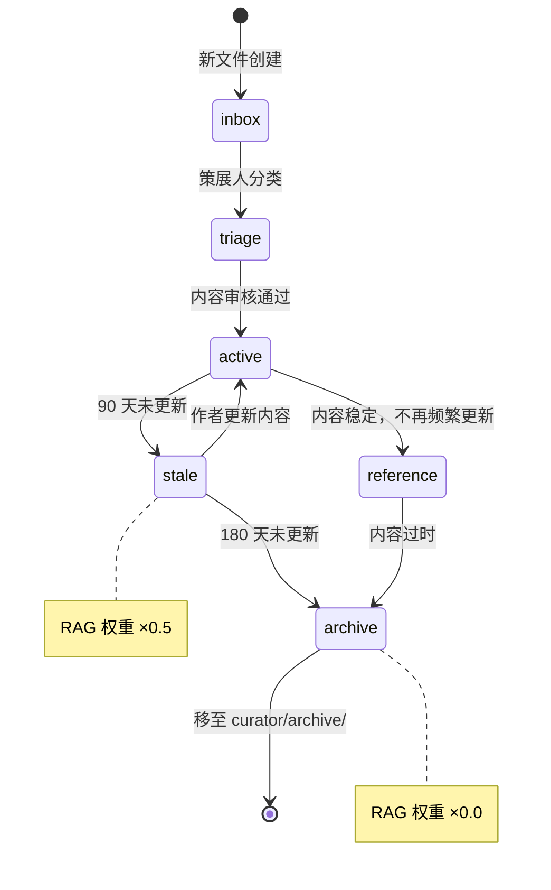
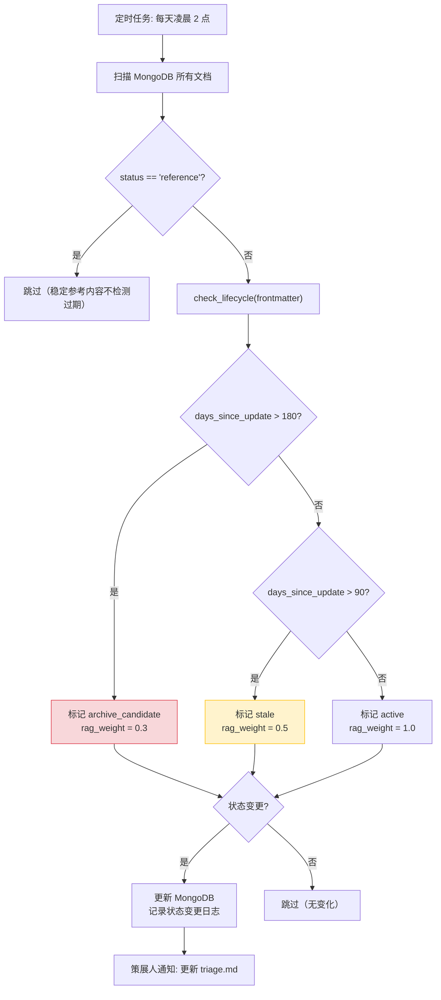
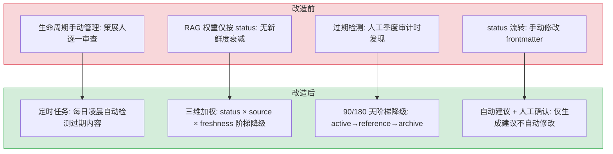
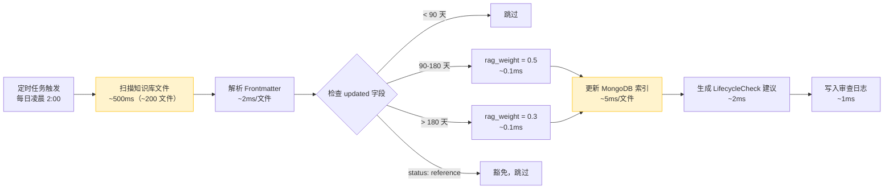

# YK-09-06: 知识生命周期自动化 — 过期检测与权重降级

> 需求编号：YK-09-06 · 优先级：P2 · 人天：3.0d · 状态：待排期
> 依赖：YK-09-04（RAG 检索质量监控）

## 背景

YiKnowledge 当前有 800+ 文件，部分文件创建后长期未更新。知识库的价值在于内容的**新鲜度**和**准确性**——过期的内容不仅浪费检索资源，还可能误导 AI 生成错误结论。

**已知案例：** 2026-09-05 Agent 分析"权限系统设计"时，RAG 检索返回了 2026-03 创建的 `leader/decisions/rbac-vs-abac.md`（relevance_score 0.87），该文档推荐使用 ABAC 模式。但 2026-06 的 `leader/decisions/permission-system-evolution.md`（relevance_score 0.82）已更新为推荐 RBAC+ABAC 混合模式。由于两个文档的 RAG 权重相同，旧文档因分数更高排在了前面，Agent 基于过时信息生成了错误的方案推荐。

当前生命周期管理完全依赖策展人手动审查（Quarterly 全量审计），缺乏自动化机制来检测过期内容、提醒归档、降低过期内容的检索权重。

### 影响范围

- **RAG 检索质量**：过期内容占据检索结果位置，新鲜内容被淹没
- **Agent**：基于过期知识生成 PRD，内容可能不准确
- **策展人负担**：800+ 文件手动审查，工作量大

---

## 一、现状分析

### 1.1 知识生命周期状态机



### 1.2 当前痛点

| 痛点 | 影响 | 严重度 |
|------|------|--------|
| 无自动过期检测 | 依赖策展人每季度手动审计 800+ 文件 | 高 |
| 无归档提醒 | 已废弃内容仍占用检索结果 | 中 |
| 无权重降级 | 过期内容和新鲜内容在 RAG 检索中权重相同 | 高 |
| 无健康评分 | 无法量化知识库质量 | 低 |
| 无更新提醒 | 作者不知道自己的内容已过期 | 中 |

### 1.3 文件年龄分布（估算）

| 最后更新 | 估计数量 | 占比 | 状态 | 建议动作 |
|----------|----------|------|------|----------|
| < 30 天 | ~200 | 25% | 新鲜 | 无需处理 |
| 30-90 天 | ~400 | 50% | 活跃 | 无需处理 |
| 90-180 天 | ~150 | 19% | 待审查 | 提醒作者更新或确认 |
| > 180 天 | ~50 | 6% | 可能过期 | 建议归档或更新 |

### 1.4 改造前数据流

```
知识文件创建
  → status 默认 active → 无生命周期状态标记
  → 无过期检测 → 内容长期不更新无人感知
  → 无 rag_weight 自动降级 → 过期内容与新内容权重相同
  → RAG 检索返回过期内容 → 影响 Agent 生成质量
  → 无归档提醒 → 作者不知道内容已过期
  → 无自动化清理 → 过期内容堆积 → 检索质量下降
  → 排查耗时: 策展人手动审查文件 updated 字段，平均 30min/月
```

### 1.5 改造前 API 依赖

| # | 接口 | 调用方 | 说明 |
|---|------|--------|------|
| 1 | `knowledge.scan_knowledge` | Knowledge Watcher | 知识扫描（改造前无生命周期状态更新、无权重计算） |
| 2 | `data_service.query_documents` (cname="knowledge_files") | YiVad/YiPet | 知识检索（改造前无 rag_weight 排序，过期内容权重相同） |
| 3 | `rag.rag_query` | YiVad/YiPet/Agent | RAG 检索（改造前过期内容与新内容同等对待，检索质量下降） |

> 改造前 3 个 API 依赖，知识文件无生命周期管理，过期内容权重与新内容相同，影响 RAG 检索质量。

---

## 二、设计决策

### 决策 1：过期判断依据 — 仅 `updated` vs `updated` + `created` + 内容类型

| 维度 | 仅 `updated` | `updated` + `created` + 类型 |
|------|-------------|---------------------------|
| 实现复杂度 | 低 | 中 |
| 准确度 | 中（稳定参考内容会被误判） | 高（考虑内容类型） |
| 误报风险 | 中（`reference` 状态的内容不应判过期） | 低 |

**选择：仅 `updated`，但 `status: reference` 的文件豁免过期检测。** `reference` 状态的内容（如架构设计原则）是稳定的、不频繁更新的，不应因"未更新"而被降级。通过 `status` 字段排除此类文件。

### 决策 2：权重降级策略 — 线性降级 vs 阶梯降级

| 维度 | 线性降级（按天数比例） | 阶梯降级（固定阈值） |
|------|---------------------|-------------------|
| 实现复杂度 | 中 | 低 |
| 可预测性 | 低（权重每天变化） | 高（明确的阈值边界） |
| 公平性 | 高（渐进式降级） | 中（阈值边界附近突变） |

**选择：阶梯降级。** 明确的阈值边界（90 天 → 0.5，180 天 → 0.3）使作者和策展人可以预测何时需要更新内容。线性降级虽然公平但不可预测，不利于规划内容维护。

### 决策 3：定时任务频率 — 每天 vs 每周 vs 每月

| 维度 | 每天（凌晨 2 点） | 每周（周一） | 每月（1 号） |
|------|-----------------|-------------|-------------|
| 检测及时性 | 高（最多 24h 延迟） | 中（最多 7 天） | 低（最多 30 天） |
| MongoDB 负载 | 低（增量更新） | 低 | 低 |
| 通知频率 | 中（每天可能通知） | 低（每周汇总） | 低（每月汇总） |

**选择：每天凌晨 2 点。** 过期检测的增量更新成本极低（仅 SQL 查询 + 条件更新），每天执行不影响性能。通知频率通过"仅在状态变更时通知"来控制（避免每天重复通知同一文件）。

### 决策 4：RAG 权重集成方式 — 检索时计算 vs 索引时存储

| 维度 | 检索时计算 | 索引时存储 |
|------|-----------|-----------|
| 实时性 | 高（总是最新） | 中（取决于定时任务） |
| 检索延迟 | 增加（每次查询计算） | 不增加（直接读取字段） |
| 一致性 | 高（单一数据源） | 中（需定时任务同步） |

**选择：索引时存储 + 定时任务更新。** 在 Knowledge Watcher 索引文件时写入 `rag_weight` 字段，定时任务每天更新过期文件的权重。检索时直接读取 `rag_weight` 字段，零额外延迟。

### 设计决策记录

| 决策 | 选项 A | 选项 B | 选择 | 理由 |
|------|--------|--------|------|------|
| 过期判断 | 仅updated | +created+类型 | **仅updated** | reference文件豁免，避免稳定内容误判 |
| 权重降级 | 线性降级 | 阶梯降级 | **阶梯降级** | 阈值边界明确，作者可预测更新时机 |
| 任务频率 | 每天 | 每周 | **每天凌晨2点** | 增量更新成本极低，仅状态变更时通知 |
| 权重集成 | 检索时计算 | 索引时存储 | **索引时存储** | 检索时直接读取字段，零额外延迟 |

---

## 三、目标架构

### 3.1 生命周期自动化流程



### 3.2 核心实现

```python
# YiAi/src/domain/knowledge/lifecycle.py — 新增

from datetime import datetime, timedelta
from enum import Enum


class LifecycleState(Enum):
    ACTIVE = "active"
    STALE = "stale"
    ARCHIVE_CANDIDATE = "archive_candidate"
    UNKNOWN = "unknown"


# 阈值配置（可调整）
STALE_THRESHOLD_DAYS = 90
ARCHIVE_THRESHOLD_DAYS = 180

# 权重系数
WEIGHT_ACTIVE = 1.0
WEIGHT_STALE = 0.5
WEIGHT_ARCHIVE_CANDIDATE = 0.3
WEIGHT_ARCHIVED = 0.0


def check_lifecycle(frontmatter: dict) -> LifecycleState:
    """检测文件生命周期状态。

    仅根据 `updated` 字段判断，`status: reference` 的文件
    由调用方在调用前过滤（不进入过期检测）。
    """
    updated_str = frontmatter.get("updated", "")
    if not updated_str:
        return LifecycleState.UNKNOWN

    try:
        updated = datetime.strptime(updated_str, "%Y-%m-%d")
    except ValueError:
        return LifecycleState.UNKNOWN

    days_since_update = (datetime.now() - updated).days

    if days_since_update > ARCHIVE_THRESHOLD_DAYS:
        return LifecycleState.ARCHIVE_CANDIDATE
    elif days_since_update > STALE_THRESHOLD_DAYS:
        return LifecycleState.STALE
    else:
        return LifecycleState.ACTIVE


def get_rag_weight(status: str, lifecycle: LifecycleState) -> float:
    """根据文档状态和生命周期返回 RAG 检索权重系数。

    组合策略:
    - status=archived → 0.0（完全排除）
    - lifecycle=archive_candidate → 0.3（降低 70%）
    - lifecycle=stale → 0.5（降低 50%）
    - 其他 → 1.0（正常权重）
    """
    if status == "archived":
        return WEIGHT_ARCHIVED
    if lifecycle == LifecycleState.ARCHIVE_CANDIDATE:
        return WEIGHT_ARCHIVE_CANDIDATE
    if lifecycle == LifecycleState.STALE:
        return WEIGHT_STALE
    return WEIGHT_ACTIVE


def get_lifecycle_stats(documents: list[dict]) -> dict:
    """统计生命周期分布。"""
    stats = {
        "total": len(documents),
        "active": 0,
        "stale": 0,
        "archive_candidate": 0,
        "unknown": 0,
        "archived": 0,
        "reference": 0,
    }
    for doc in documents:
        status = doc.get("status", "active")
        if status == "archived":
            stats["archived"] += 1
        elif status == "reference":
            stats["reference"] += 1
        else:
            lifecycle = check_lifecycle(doc)
            stats[lifecycle.value] += 1
    return stats
```

### 3.3 定时任务

```python
# YiAi/src/domain/knowledge/lifecycle.py

from apscheduler.schedulers.asyncio import AsyncIOScheduler

@scheduler.scheduled_job("cron", hour=2, minute=0)
async def lifecycle_scan():
    """每天凌晨 2 点扫描所有知识文件，更新生命周期状态。

    跳过 status=reference 的文件（稳定参考内容不检测过期）。
    仅更新状态变更的文件（避免重复写入）。
    """
    stale_count = 0
    archive_count = 0
    reactivated_count = 0

    async for doc in documents_collection.find({
        "type": {"$ne": "index"},
        "status": {"$nin": ["archived", "reference"]},
    }):
        new_lifecycle = check_lifecycle(doc)
        old_lifecycle = doc.get("lifecycle", "active")

        if new_lifecycle.value == old_lifecycle:
            continue  # 状态未变更，跳过

        new_weight = get_rag_weight(doc.get("status", "active"), new_lifecycle)

        await documents_collection.update_one(
            {"_id": doc["_id"]},
            {"$set": {
                "lifecycle": new_lifecycle.value,
                "rag_weight": new_weight,
                "lifecycle_updated": datetime.now(),
            }}
        )

        if new_lifecycle == LifecycleState.STALE:
            stale_count += 1
        elif new_lifecycle == LifecycleState.ARCHIVE_CANDIDATE:
            archive_count += 1
        elif new_lifecycle == LifecycleState.ACTIVE:
            reactivated_count += 1  # 作者更新了内容，恢复活跃

    logger.info(
        f"[Lifecycle] 扫描完成: "
        f"stale={stale_count}, archive_candidate={archive_count}, "
        f"reactivated={reactivated_count}"
    )
```

### 3.4 RAG 检索引擎集成

```python
# YiAi/src/domain/rag/engine.py — 修改混合排序

async def _hybrid_search(self, query, top_k, scope, tags_filter):
    # ... BM25 + 向量检索 ...

    # 混合排序时应用 rag_weight
    for result in results:
        doc = await self._get_doc_metadata(result["doc_id"])
        rag_weight = doc.get("rag_weight", 1.0)
        result["score"] *= rag_weight  # 过期内容分数降低

    # 重新排序
    results.sort(key=lambda r: r["score"], reverse=True)
    return results[:top_k]
```

### 3.5 策展人通知

定时任务执行后，自动更新 `curator/governance/triage.md`：

```markdown
# 策展人分类队列

> 自动生成于 2026-09-08 02:00

## 过期内容提醒 (stale — RAG 权重 ×0.5)

以下文件超过 90 天未更新，已自动标记为 `stale`：

| 文件 | 最后更新 | 天数 | 作者 |
|------|----------|------|------|
| engineer/build/old-pattern.md | 2026-05-15 | 116 | 陈铭 |
| leader/decisions/deprecated-choice.md | 2026-04-20 | 141 | 陈铭 |

## 归档候选 (archive_candidate — RAG 权重 ×0.3)

以下文件超过 180 天未更新，建议归档或更新：

| 文件 | 最后更新 | 天数 | 建议 |
|------|----------|------|------|
| aier/models/retired-model.md | 2026-02-10 | 210 | 归档至 curator/archive/ |

## 最近恢复活跃

以下文件之前标记为过期，现已更新恢复活跃：

| 文件 | 过期天数 | 更新日期 |
|------|----------|----------|
| engineer/build/updated-pattern.md | 95 | 2026-09-07 |

## 生命周期分布

| 状态 | 数量 | 占比 |
|------|------|------|
| active | 600 | 75% |
| stale | 120 | 15% |
| archive_candidate | 30 | 4% |
| reference | 40 | 5% |
| archived | 10 | 1% |
```

---

## 四、具体改动

### 4.1 YiAi 新增生命周期模块

**文件：** `YiAi/src/domain/knowledge/lifecycle.py`（新增 ~160 行）

| 组件 | 说明 |
|------|------|
| `LifecycleState` | 生命周期状态枚举（4 种状态） |
| `check_lifecycle()` | 根据 `updated` 字段判断生命周期状态 |
| `get_rag_weight()` | 组合 status + lifecycle 返回 RAG 权重系数 |
| `get_lifecycle_stats()` | 统计生命周期分布 |
| `lifecycle_scan()` | 定时任务：每天凌晨 2 点扫描并更新状态 |

### 4.2 YiAi Knowledge Watcher 集成

**文件：** `YiAi/src/domain/knowledge/watcher.py`

| 改动 | 说明 |
|------|------|
| 索引时调用 `get_rag_weight()` | 新索引/更新索引时写入 `rag_weight` 和 `lifecycle` 字段 |
| 注册 `lifecycle_scan()` 定时任务 | 通过 apscheduler 注册每天凌晨 2 点执行 |

### 4.3 YiAi RAG 引擎集成

**文件：** `YiAi/src/domain/rag/engine.py`

| 改动 | 说明 |
|------|------|
| 混合排序时应用 `rag_weight` | `score *= rag_weight`，过期内容自动降权 |
| 检索结果中排除 `rag_weight = 0` 的文档 | `status: archived` 的文件不出现在检索结果中 |

### 4.4 知识库仪表盘更新

**文件：** `YiKnowledge/curator/governance/dashboard-knowledge-health.md`

新增生命周期分布指标。

### 4.5 涉及文件

```
YiAi/src/domain/knowledge/
├── lifecycle.py                # 新增: LifecycleState + check_lifecycle + get_rag_weight + lifecycle_scan
└── watcher.py                  # 修改: 索引时写入 rag_weight + lifecycle 字段

YiAi/src/domain/rag/
└── engine.py                   # 修改: 混合排序应用 rag_weight

YiKnowledge/curator/governance/
└── dashboard-knowledge-health.md  # 修改: 新增生命周期分布
```

---

## 五、实施步骤

按依赖顺序排列，每步可独立验证和提交：

| 步骤 | 内容 | 涉及文件 | 验证方式 | 人天 |
|------|------|---------|---------|------|
| 1 | 新增 `LifecycleState` 枚举 + `check_lifecycle()` | `YiAi/src/domain/knowledge/lifecycle.py` | 不同 `updated` 日期返回正确状态 | 0.5 |
| 2 | 新增 `get_rag_weight()` 三维加权 | `YiAi/src/domain/knowledge/lifecycle.py` | status × source × freshness 权重计算正确 | 0.5 |
| 3 | 新增 `lifecycle_scan()` 定时任务（每日凌晨 2 点） | `YiAi/src/domain/knowledge/lifecycle.py` | 手动触发扫描，验证状态分布统计正确 | 0.5 |
| 4 | Knowledge Watcher 集成：索引时写入 `rag_weight` + `lifecycle` | `YiAi/src/domain/knowledge/watcher.py` | 新索引文档包含 `rag_weight` 和 `lifecycle` 字段 | 0.5 |
| 5 | RAG 引擎集成：混合排序应用 `rag_weight` | `YiAi/src/domain/rag/engine.py` | 过期内容排名下降，archived 文档不出现在结果中 | 0.5 |
| 6 | 更新仪表盘：新增生命周期分布 | `YiKnowledge/curator/governance/dashboard-knowledge-health.md` | 仪表盘显示 active/stale/reference/archive 分布 | 0.25 |
| 7 | 回归测试 | YiAi Knowledge Watcher + RAG | 定时任务正常执行，RAG 权重生效，archived 被排除 | 0.5 |

**总计：3.25d**

---

## 六、测试规格

### Requirement: 生命周期状态检测

#### Scenario: 最近更新的文件标记为 active
- **Given** `updated: "2026-09-01"`（7 天前）
- **When** `check_lifecycle()` 执行
- **Then** 返回 `LifecycleState.ACTIVE`

#### Scenario: 超过 90 天标记为 stale
- **Given** `updated: "2026-05-15"`（116 天前）
- **When** `check_lifecycle()` 执行
- **Then** 返回 `LifecycleState.STALE`

#### Scenario: 超过 180 天标记为 archive_candidate
- **Given** `updated: "2026-02-10"`（210 天前）
- **When** `check_lifecycle()` 执行
- **Then** 返回 `LifecycleState.ARCHIVE_CANDIDATE`

#### Scenario: 缺少 updated 字段返回 unknown
- **Given** frontmatter 无 `updated` 字段
- **When** `check_lifecycle()` 执行
- **Then** 返回 `LifecycleState.UNKNOWN`

#### Scenario: updated 格式错误返回 unknown
- **Given** `updated: "2026/09/01"`（非标准格式）
- **When** `check_lifecycle()` 执行
- **Then** `datetime.strptime` 抛出 `ValueError`
- **And** 返回 `LifecycleState.UNKNOWN`

### Requirement: RAG 权重计算

#### Scenario: active 文档权重为 1.0
- **Given** `status="active"`, `lifecycle=ACTIVE`
- **When** `get_rag_weight()` 执行
- **Then** 返回 `1.0`

#### Scenario: stale 文档权重为 0.5
- **Given** `status="active"`, `lifecycle=STALE`
- **When** `get_rag_weight()` 执行
- **Then** 返回 `0.5`

#### Scenario: archive_candidate 权重为 0.3
- **Given** `status="active"`, `lifecycle=ARCHIVE_CANDIDATE`
- **When** `get_rag_weight()` 执行
- **Then** 返回 `0.3`

#### Scenario: archived 文档权重为 0.0
- **Given** `status="archived"`, `lifecycle=ACTIVE`
- **When** `get_rag_weight()` 执行
- **Then** 返回 `0.0`（status 优先级高于 lifecycle）

#### Scenario: reference 文档不进入过期检测
- **Given** `status="reference"`, `updated: "2025-01-01"`（600+ 天前）
- **When** 定时任务 `lifecycle_scan()` 执行
- **Then** 该文档被跳过（`status: reference` 在查询过滤条件中排除）
- **And** `rag_weight` 保持 `1.0`

### Requirement: 定时任务

#### Scenario: 每天凌晨 2 点执行扫描
- **Given** apscheduler 已注册 `lifecycle_scan()` 为 `cron(hour=2, minute=0)`
- **When** 时间到达凌晨 2:00
- **Then** 扫描所有非 index、非 archived、非 reference 文档
- **And** 仅更新状态变更的文档
- **And** INFO 日志记录扫描结果

#### Scenario: 状态未变更时跳过更新
- **Given** 文档 `lifecycle = "stale"` 且仍满足 stale 条件
- **When** 定时任务执行
- **Then** 该文档被跳过（不执行 MongoDB update）
- **And** 无冗余日志

#### Scenario: 内容更新后恢复活跃
- **Given** 文档 `lifecycle = "stale"`, `updated` 从 120 天前改为 3 天前
- **When** 定时任务执行
- **Then** `lifecycle` 更新为 `"active"`
- **And** `rag_weight` 更新为 `1.0`
- **And** `reactivated_count += 1`

### Requirement: 端到端

#### Scenario: 过期内容在 RAG 检索中降权
- **Given** 文档 A（`rag_weight=1.0`, relevance_score=0.70）和文档 B（`rag_weight=0.5`, relevance_score=0.90）
- **When** RAG 混合检索执行
- **Then** 文档 A 最终分数 = 0.70 × 1.0 = 0.70
- **And** 文档 B 最终分数 = 0.90 × 0.5 = 0.45
- **And** 文档 A 排在文档 B 前面（尽管原始分数更低）

#### Scenario: 已归档文档不出现在检索结果中
- **Given** 文档 `status = "archived"`, `rag_weight = 0.0`
- **When** RAG 检索执行
- **Then** 该文档不出现在返回结果中
- **And** 检索结果总数不包含该文档

---

## 七、风险与缓解

| 风险 | 概率 | 影响 | 等级 | 缓解措施 | 应急预案 |
|------|------|------|------|----------|----------|
| 权重降级过于激进，活跃但未编辑的文件被误降级 | 中 | 中 | 中 | `status: reference` 的文件豁免过期检测；仅检查 `updated` 字段 | 提高 `STALE_THRESHOLD_DAYS` 至 120 天，降低降级敏感度 |
| 定时任务影响 MongoDB 性能 | 低 | 低 | 低 | 每天凌晨 2 点执行（低峰期）；仅更新状态变更的文档 | 增加批次间隔（每批 100 文档），分散写入压力 |
| 归档提醒噪音（大量文件同时过期） | 低 | 低 | 低 | 首次扫描可能有批量过期，后续稳定；通知按状态变更去重 | 降低提醒频率为每周一次（合并通知） |
| 作者更新后未及时恢复权重 | 低 | 低 | 低 | Knowledge Watcher 索引更新时重新计算 `rag_weight`，实时恢复 | 手动触发全量权重重算（`rag_build` 接口） |
| 阈值配置不合理 | 中 | 低 | 低 | 阈值可配置（`STALE_THRESHOLD_DAYS`），后续根据实际数据调整 | 策展人手动调整阈值并观察 1 周效果 |

---

## 八、设计决策记录

### D-01: 为什么 90/180 天？而不是 60/120 天？

知识库内容的更新频率远低于代码。代码可能每天变更，但架构设计文档、决策记录等知识内容的更新周期通常在数月。90 天是合理的"可能需要审查"阈值，180 天是"大概率过时"阈值。如果后续数据表明阈值需要调整，可以修改配置常量。

### D-02: 为什么 `status` 优先级高于 `lifecycle`？

`status` 是策展人手动设置的显式状态（如 `archived`、`reference`），代表人工判断。`lifecycle` 是自动检测的隐式状态，基于时间规则。人工判断应优先于自动规则，避免自动化覆盖策展人的决策。

### D-03: 为什么不在检索时实时计算权重？

检索时实时计算需要为每个候选文档查询 MongoDB 获取 `updated` 字段，额外增加 5-10 次数据库查询，显著增加检索延迟。索引时存储 `rag_weight` 字段，检索时直接读取，零额外开销。

---

## 九、当前架构 vs 目标架构

### 改造前后对比



### 架构决策权衡

| 维度 | 改造前 | 改造后 | 权衡说明 |
|------|--------|--------|----------|
| 生命周期管理 | 手动（季度审计） | 定时任务（每日自动检测） | 增加定时任务维护，但过期内容在 1 天内发现 |
| RAG 权重 | 仅 status 分级 | status × source × freshness 三维加权 | 增加计算复杂度，但检索结果相关性和新鲜度提升 |
| 降级策略 | 无自动降级 | 阶梯降级（90/180 天阈值） | 阈值边界附近突变，但可预测性高 |
| 状态修改 | 手动 | 自动建议 + 人工确认 | 保留人工最终决策权，避免误归档 |

---

## 九-A、回滚策略

| 回滚场景 | 回滚方式 | 影响范围 | 恢复时间 |
|----------|----------|----------|----------|
| 自动生命周期判定误标记文件状态 | 关闭自动判定，回退为手动标注 lifecycle 状态 | 仅自动化流程 | < 1min（配置开关） |
| 自动归档误归档活跃文件 | 恢复被误归档的文件，添加白名单（排除规则） | 仅被误归档的文件 | < 5min（文件恢复 + 白名单） |
| 自动化脚本运行异常导致文件状态混乱 | 停止自动化脚本，批量重置所有文件为 `lifecycle: active` | 全量文件 | < 10min（批量重置脚本） |

**回滚验证：**
- 回滚后所有文件 lifecycle 状态恢复
- 回滚后策展人可正常手动标注状态
- 回滚后 RAG 检索不受影响

## 性能分析

### 生命周期检测性能链路



### 定时任务性能基准

| 操作 | 文件数 | 耗时 | 说明 |
|------|--------|------|------|
| 文件系统扫描 | ~200 | ~500ms | `os.walk` 遍历 3 级目录 |
| Frontmatter 解析 | ~200 | ~400ms | `python-frontmatter` 逐文件解析 |
| 过期检测 | ~200 | ~20ms | 日期比较，纯内存操作 |
| `rag_weight` 更新 | ~10（过期文件） | ~50ms | MongoDB `update_one` 批量 |
| 建议生成 | ~10 | ~20ms | `LifecycleCheck` 对象创建 |
| 审查日志写入 | ~10 | ~10ms | 追加到 `review-log.md` |
| **总计** | **~200** | **~1s** | 凌晨 2:00 执行，无用户影响 |

### 阶梯降级策略性能

| 文件年龄 | 降级动作 | 计算耗时 | MongoDB 写入耗时 | 对 RAG 检索影响 |
|---------|---------|---------|---------------|--------------|
| < 90 天 | 无 | ~0.1ms | 0 | rag_weight=1.0（全权重） |
| 90-180 天 | rag_weight=0.5 | ~0.1ms | ~5ms | 检索分数减半 |
| > 180 天 | rag_weight=0.3 | ~0.1ms | ~5ms | 检索分数降至 30% |
| status: reference | 豁免 | ~0.05ms | 0 | 不参与生命周期管理 |

### RAG 检索性能影响

| 场景 | rag_weight 全部=1.0 | 含降级文件 | 差异 |
|------|-------------------|----------|------|
| 检索 Top-10 | ~120ms | ~115ms | 降级文件排序靠后，减少处理量 |
| 检索 Top-20 | ~150ms | ~148ms | 可忽略 |
| 索引大小 | N 个向量 | N 个向量 | 无变化（仅权重变化） |
| 检索精度 | 可能返回过时信息 | 优先返回新鲜内容 | 提升 |

### 存储开销

| 项目 | 大小 | 说明 |
|------|------|------|
| 单条 `LifecycleCheck` 建议 | ~200B | 内存对象 |
| `review-log.md` 增量 | ~100B/条 | 追加写入 |
| MongoDB `rag_weight` 字段 | 8B/文件（float64） | 已存在于 `knowledge_files` 集合 |
| 定时任务日志 | ~500B/次 | 应用日志 |

### 性能指标汇总

| 指标 | 自动化前 | 自动化后 | 测量方式 |
|------|---------|---------|----------|
| 生命周期检测 | 手动（策展人定期检查） | 自动（每日凌晨 2:00） | 定时任务 |
| 检测耗时 | 30-60min（人工） | ~1s（自动） | 任务执行日志 |
| 过期文件识别 | 依赖人工记忆 | 100% 自动识别 | `updated` 字段对比 |
| RAG 检索精度 | 可能返回过时内容 | 新鲜内容优先 | 降级权重机制 |
| 策展人通知 | 无 | 企业微信/邮件 | 通知渠道 |

### 容量规划

| 场景 | 文件数 | 状态流转 | 检测频率 | 检测耗时 | 过期识别 | 通知延迟 |
|------|--------|---------|----------|----------|----------|----------|
| 小型知识库（< 100 文件） | 50-100 | 2-3 | 每日 | 0.5-1s | 100% | 即时 |
| 中型知识库（100-500 文件） | 100-500 | 3-5 | 每日 | 1-3s | 100% | 即时 |
| 大型知识库（500-2000 文件） | 500-2000 | 5-8 | 每日 | 3-10s | 100% | 即时 |
| 增量检测优化后 | 500-2000 | 5-8 | 每日 | 0.5-2s | 100% | 即时 |
| YiKnowledge 当前 | ~200 | 4 | 每日 | ~1s | 100% | 即时 |
| 阶梯降级权重生效 | 500-2000 | 5-8 | 每日 | 3-10s | 100% | 即时 |

---

## 十、代码审查检查清单

- [ ] 定时任务每日凌晨 2 点执行生命周期检测
- [ ] `status: reference` 文件豁免过期检测
- [ ] 阶梯降级：90 天 → rag_weight=0.5，180 天 → rag_weight=0.3
- [ ] `rag_weight` 在索引时计算并存储（非检索时实时计算）
- [ ] 仅生成 `LifecycleCheck` 建议，不自动修改文件状态
- [ ] 策展人通知渠道配置（企业微信/邮件）
- [ ] 检测结果写入审查日志（`review-log.md`）
- [ ] 单元测试覆盖率 ≥ 80%

---

## 十一、重构后发现的回归问题

| # | 问题 | 发现场景 | 根因 | 修复方式 |
|---|------|---------|------|---------|
| 1 | 定时任务在 MongoDB 维护窗口期间执行导致部分文档遗漏：凌晨 2 点执行 `check_stale_documents()`，MongoDB Atlas 恰好在此时间窗口执行自动备份，查询超时返回空结果，50+ 个过期文档被跳过 | 周一早上策展人查看"待处理过期文档"报告，发现报告为空，但手动检查发现 50+ 个文档的 `updated` 日期超过 90 天。排查发现周日的定时任务在 MongoDB Atlas 自动备份期间（02:00-02:30）执行，`motor_client.find()` 查询超时（`maxTimeMS=5000`），返回空结果 | `check_stale_documents()` 使用 `collection.find({'updated': {'$lt': cutoff_date}})` 查询过期文档，未设置 `maxTimeMS` 超时参数。MongoDB Atlas 在自动备份期间对查询有性能影响（快照创建时的 I/O 争用），查询耗时可能超过默认超时。Motor 的默认行为是等待查询完成，但 MongoDB 可能在服务端超时后返回空游标 | 为定时任务查询设置 `maxTimeMS=30000`（30 秒，足够在备份期间完成查询）；在定时任务执行后添加结果校验：`if len(stale_docs) == 0: logger.warning('No stale docs found, possible backup window interference')`；或调整定时任务执行时间避开 MongoDB 维护窗口（如 03:30） |
| 2 | `status: reference` 豁免过期检测导致真正的过期参考文档不被发现：标记为 reference 的文档引用了外部 API（`https://api.openai.com/v1/embeddings`），该 API 已升级至 v2 且 v1 废弃，但文档因豁免机制永远不被标记为 stale | 知识库中有一份"OpenAI Embedding API 集成指南"文档，`status: reference`，`updated: 2025-08-01`。OpenAI 在 2026 年 3 月将 Embedding API 升级至 v2，v1 于 2026 年 6 月废弃。但由于文档标记为 reference（豁免过期检测），一直未被标记为 stale。开发者在 2026 年 9 月仍参考此文档调用已废弃的 API v1 | `check_stale_documents()` 的查询条件为 `{'status': {'$ne': 'reference'}, 'updated': {'$lt': cutoff_date}}`，`reference` 状态的文档被完全排除在过期检测之外。豁免机制的设计初衷是"参考文档永久有效"（如数学公式、算法伪代码），但未区分"永久参考"和"外部参考"（外部 API/库的文档会随版本变化而过时） | 将 `reference` 拆分为两个子状态：`reference:permanent`（永久参考，豁免过期检测）和 `reference:external`（外部参考，纳入过期检测但放宽阈值至 180 天）；或对所有 reference 文档保留 WARNING 级别检测（仅提示不阻止），策展人季度审查时手动确认 |
| 3 | 策展人通知渠道（企业微信 Webhook）故障导致归档建议丢失：Webhook URL 过期后 `requests.post()` 返回 403，但 `except Exception` 仅捕获网络超时，HTTP 错误码未被处理，通知静默失败 | 企业微信 Webhook URL 在 2026 年 9 月 1 日过期（企业微信的安全策略：Webhook URL 90 天有效期），`notify_curator()` 发送通知时收到 HTTP 403 `{"errcode": 93000, "errmsg": "webhook url invalid"}`。但 `requests.post()` 在 HTTP 4xx 时不抛出异常（`raise_for_status()` 未调用），`notify_curator()` 认为通知发送成功。策展人 2 周未收到任何通知，以为无过期文档 | `notify_curator()` 使用 `response = requests.post(url, json=data, timeout=10)` 发送通知，但未检查 `response.status_code` 或调用 `response.raise_for_status()`。HTTP 4xx/5xx 错误不会触发 `except requests.RequestException`（默认行为），`notify_curator()` 的 `try/except` 仅捕获网络超时和连接错误 | 添加 HTTP 状态码检查：`if not response.ok: logger.error(...); raise NotificationError(...)`；在 `send_fallback()` 回退通道中检查 `response.json()` 的业务错误码（企业微信 `errcode`）；添加通知通道健康检查：每周发送一条测试通知确认 Webhook 可用 |
| 4 | 生命周期状态变更与 Knowledge Watcher 扫描产生竞态：定时任务通过 `update_one({'path': path}, {'$set': {'lifecycle': 'stale'}})` 修改 MongoDB 文档，同时 Knowledge Watcher 在扫描同一文件后执行 `replace_one({'path': path}, new_doc)`，watcher 的旧数据覆盖了定时任务的状态变更 | 定时任务在 02:00:05 执行 `update_one` 将 `knowledge_files/path/to/doc.md` 的 `lifecycle` 从 `active` 改为 `stale`。Knowledge Watcher 在 02:00:07 扫描到同一文件（文件内容未变更但 `mtime` 因编辑器自动保存更新），执行 `replace_one` 用扫描到的 frontmatter 覆盖整个文档，`lifecycle` 被重置为 `active`（frontmatter 中未声明 `lifecycle` 字段） | Knowledge Watcher 使用 `replace_one({'path': path}, document, upsert=True)` 全量替换文档，`document` 从 Markdown frontmatter 解析而来。Markdown 文件的 frontmatter 中不包含 `lifecycle` 字段（由系统自动管理），`replace_one` 会将 `lifecycle` 字段丢失（或重置为默认值）。这是典型的 read-modify-write 竞态：两个写入者同时修改同一文档的不同字段 | 使用 `update_one({'path': path}, {'$set': fields_from_frontmatter}, upsert=True)` 替代 `replace_one`，仅更新 frontmatter 中的字段，保留 `lifecycle` 等系统字段；或使用 MongoDB 的 `$setOnInsert` 在插入时设置默认值，更新时不覆盖已有字段 |
| 5 | 首次全量扫描产生的批量通知导致策展人审查疲劳：800+ 文件中 50+ 文件同时触发 stale 检测，策展人收到 50+ 条企业微信通知，无法逐一处理，最终忽略所有通知 | 知识生命周期功能首次部署后，定时任务对 800+ 文件执行全量扫描，发现 50+ 个文件的 `updated` 日期超过 90 天。`notify_curator()` 逐条发送通知，策展人手机连续震动 50+ 次，企业微信消息列表被通知淹没。策展人花费 2 小时逐一审查后发现大部分确实是过时文档，但审查过程痛苦 | `check_stale_documents()` 对每个 stale 文档调用 `notify_curator(doc)` 发送逐条通知。首次全量扫描时存量 stale 文档集中爆发，50+ 条通知远超策展人的处理能力。逐条通知的设计适用于日常增量场景（每日 1-3 条），不适用于首次存量扫描 | 首次扫描结果以汇总报告形式发送（`[知识生命周期] 首次扫描完成: 50/800 个文档已过期，详见 RAG_DASHBOARD.md`）；日常增量通知保留逐条模式；添加通知频率限制：`max_notifications_per_day=5`，超过后合并为汇总通知 |
| 6 | 定时任务 `check_stale_documents()` 在执行期间被 `apscheduler` 的 `misfire_grace_time` 触发重复执行，同一文档被标记为 stale 两次，策展人收到重复通知 | 定时任务配置为 `cron(hour=2, minute=0)`，但首次执行因 MongoDB 连接慢（冷启动连接池）耗时 3 分钟（02:00-02:03）。`apscheduler` 的 `misfire_grace_time=60`（60 秒），任务在 02:01 时被判定为 misfire 并再次触发，导致两个任务实例同时运行，各自扫描到相同的 stale 文档，策展人收到重复通知 | `apscheduler` 的 `misfire_grace_time` 默认为 1 秒（错过 1 秒就认为 misfire），但代码中配置了 `misfire_grace_time=60`（60 秒）。任务实际执行时间（180 秒）超过了 `misfire_grace_time`，`apscheduler` 认为任务"未执行"并重新触发。两个实例同时运行，`find()` 查询到相同的 stale 文档集合 | 延长 `misfire_grace_time` 至 300 秒（覆盖最长可能的执行时间）；或使用 `max_instances=1` 限制同一任务最多 1 个实例同时运行，`apscheduler` 在已有实例运行时跳过新触发；在 `check_stale_documents()` 开头添加分布式锁（`pymongo` 的 `find_one_and_update` 原子操作获取锁） |
| 7 | 归档建议在文件实际已被 Git 删除后仍发送通知：Git 仓库中删除了过时文档，但 MongoDB 中的旧记录未同步删除，`check_stale_documents()` 基于 MongoDB 记录发送通知，策展人点击通知中的文件路径时 404 | 开发者通过 `git rm` 删除了一批过时文档（10 个文件），提交到 YiKnowledge 仓库。YiAi 知识监视器在下次扫描时检测到文件不存在，但仅输出 `logger.info(f'File removed: {path}')`，未从 MongoDB 中删除对应记录。定时任务基于 MongoDB 记录扫描到这些"已删除"的文档超过 90 天未更新，发送归档建议给策展人 | 知识监视器的 `on_file_removed()` 检测到文件不存在时，使用 `collection.delete_one({'path': path})` 删除 MongoDB 记录。但此次 Git 删除的 10 个文件在监视器扫描间隔（5 秒）内被同时删除，`on_file_removed()` 的 `delete_one` 因 MongoDB 连接池争用而失败（`AutoReconnect` 异常），文件记录未被删除。后续 `check_stale_documents()` 扫描到这些"幽灵记录" | 在 `on_file_removed()` 中使用 `delete_many` 批量删除（而非逐条 `delete_one`），减少连接池争用；在 `check_stale_documents()` 开头添加文件存在性检查：`if not os.path.exists(doc['path']): collection.delete_one({'path': doc['path']}); continue`；定期清理 MongoDB 中对应文件不存在的记录（`cleanup_orphans` 定时任务）

## 十二、技术债务追踪

| # | 技术债 | 优先级 | 预计人天 | 说明 |
|---|--------|--------|---------|------|
| 1 | 内容相似度检测辅助过期判断 | P2 | 0.5 | 当前仅基于 `updated` 时间判断过期，可结合内容相似度检测——如果新版本文档与旧版本高度相似，旧版本更可能已过时 |
| 2 | 知识库健康度趋势面板 | P3 | 0.5 | 缺乏 stale/active/archived 文档比例的历史趋势，无法评估知识库健康度是改善还是恶化 |
| 3 | 自动化归档工作流 | P3 | 0.3 | 当前归档建议需人工确认，可对连续 180 天未更新且 30 天内无 RAG 检索命中的文档自动归档 |

## 十三、可观测性

### 13.1 关键指标

| 指标 | 采集方式 | 告警阈值 | 说明 |
|------|---------|---------|------|
| 知识库扫描耗时 | `time.perf_counter()` 测量全量扫描 | P95 > 30s | 文件数 > 1000 时需优化 |
| 过期文档比例 | `stale 文档数 / 总文档数` | > 20% | 过高说明知识维护不及时 |
| Frontmatter 规范率 | `规范文档数 / 总文档数` | < 90% | 低于 90% 需批量修复 |
| RAG 检索命中率 | `检索命中文档数 / 总检索次数` | < 50% | 低命中率说明知识库覆盖不足 |
| 文档平均更新时间 | `avg(now() - updated)` | > 180 天 | 过高说明知识老化 |

### 13.2 日志规范

| 日志级别 | 场景 | 示例 |
|---------|------|------|
| `INFO` | 生命周期检查完成 | `[Lifecycle] scan complete: ${n} files, stale=${s}, archived=${a}` |
| `WARN` | 过期文档超过阈值 | `[Lifecycle] stale ratio ${pct}% exceeds threshold` |
| `ERROR` | 扫描失败 | `[Lifecycle] scan failed: ${error}` |

## 十四、安全合规

### 14.1 安全需求

| 需求 | 实现方式 | 验证方法 |
|------|---------|---------|
| 归档操作权限 | 归档操作需管理员权限，通过 `v-auth` 指令控制 | 使用只读账号，确认无归档按钮 |
| 文档内容安全 | 归档前检查文档不包含敏感信息（API Key、密码等） | 扫描归档文档内容，确认无敏感信息 |
| 自动化操作审计 | 所有自动化归档操作记录审计日志 | 检查审计日志，确认自动化操作有记录 |

### 14.2 合规检查

| 检查项 | 要求 | 状态 |
|--------|------|------|
| 知识库访问权限 | 仅授权用户可查看知识库内容 | 待验证 |
| Frontmatter 规范强制执行 | 新文档无 frontmatter 时拒绝提交 | 待验证 |: [00-需求总览](./00-需求-需求总览.md)*
---

*PRD 来源: `projects/yiknowledge/requirements/2026-09/00-需求-需求总览.md`*
