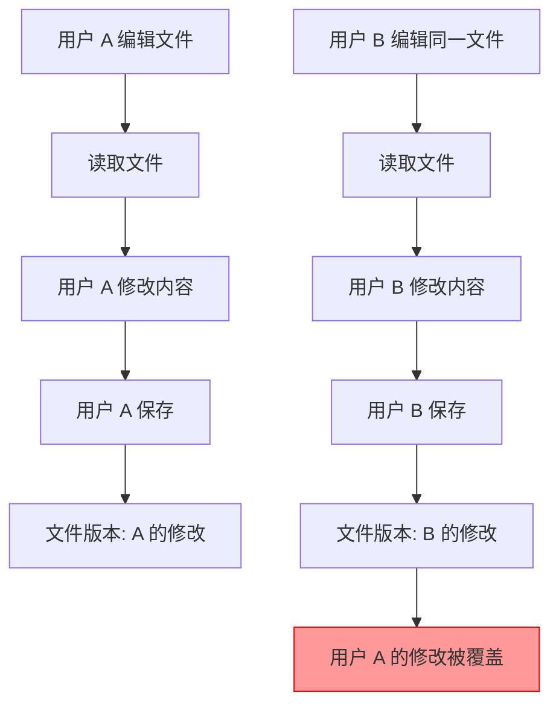
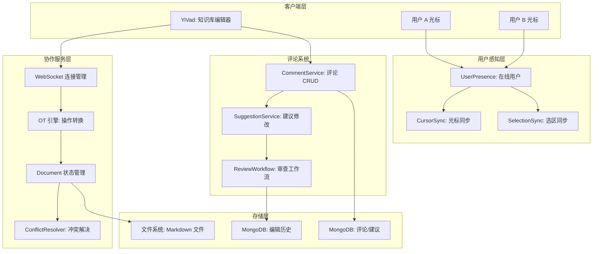
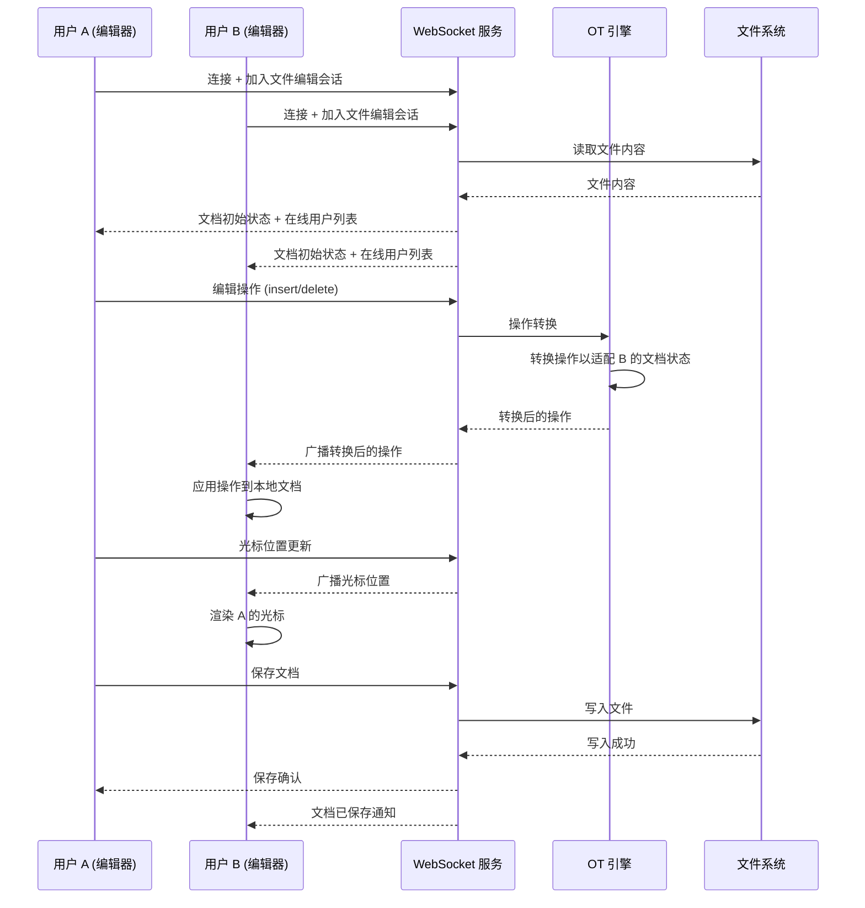

# YK-09-106: 内容协同编辑 — 实时协作 Markdown 编辑、OT/CRDT、用户光标、冲突解决、评论建议

> 需求编号：YK-09-106 · 优先级：P2 · 人天：0.5d · 状态：需求已编写
> 依赖：YK-09-03（命名规范检查）、YK-09-05（项目知识中心）、YA-09-130（WebSocket 实时通信）

## 背景

### 问题陈述

YiKnowledge 作为团队共享的知识库，当前仅支持单用户编辑，存在以下问题：

1. **无法同时编辑**：多人无法同时编辑同一份知识文件，导致编辑冲突和等待
2. **编辑冲突手动解决**：两人先后编辑同一文件时，后保存者覆盖前者的修改
3. **无编辑感知**：用户不知道谁正在编辑哪个文件，无法协调编辑
4. **无评论和审查**：无法在知识文件上添加评论、建议修改或进行审查
5. **编辑历史不透明**：不知道谁在何时做了哪些修改，缺乏贡献归属

**核心矛盾**：知识库需要团队协作维护，但当前的文件系统存储方式（单文件锁定）不支持并发编辑，导致协作效率低下和编辑冲突。

### 影响范围

| # | 影响 | 严重程度 | 典型场景 |
|---|------|----------|----------|
| 1 | 编辑冲突导致内容丢失 | 高 | 两人同时编辑同一文件，后者覆盖前者 |
| 2 | 协作效率低 | 高 | 需要协调编辑顺序，避免冲突 |
| 3 | 无编辑可见性 | 中 | 不知道谁在编辑什么文件 |
| 4 | 无审查机制 | 中 | 内容质量无法通过审查保证 |
| 5 | 无编辑归属 | 中 | 无法追溯内容修改的责任人 |

### 挑战

| 挑战 | 说明 |
|------|------|
| 实时同步 | 多个编辑者的操作需要实时同步到所有协作客户端 |
| 冲突解决 | 并发编辑操作需要自动合并或提示冲突 |
| 文件系统存储 | 知识文件存储在文件系统中，需通过后端中转操作 |
| 用户光标同步 | 需要展示其他编辑者的光标位置和选区 |
| 评论与建议模式 | 需要支持在特定行/段落添加评论和修改建议 |

---

## 一、现状分析

### 1.1 当前编辑模式

```
YiKnowledge 编辑现状:
├── 编辑方式
│   ├── YiVad 管理后台 → 调用 YiAi /read-file /write-file
│   ├── 本地文件系统 → 直接编辑 Markdown 文件
│   └── 无协作编辑模式
├── 冲突处理
│   ├── 无冲突检测
│   ├── 后保存者覆盖前保存者
│   └── 无编辑锁定
├── 用户感知
│   ├── 无在线用户列表
│   ├── 无编辑状态感知
│   └── 无光标展示
├── 审查机制
│   ├── 无评论功能
│   ├── 无建议修改模式
│   └── 无审查工作流
└── 编辑历史
    ├── Git 提交记录（仅本地编辑器）
    └── 无编辑归属记录

缺失:
├── 实时协作编辑                     # ❌ 不存在
├── 操作转换 (OT/CRDT)               # ❌ 不存在
├── 用户光标同步                     # ❌ 不存在
├── 冲突自动解决                     # ❌ 不存在
├── 编辑历史与归属                   # ❌ 不存在
├── 评论功能                         # ❌ 不存在
├── 建议修改模式                     # ❌ 不存在
└── 同时编辑感知                     # ❌ 不存在
```

### 1.2 编辑冲突场景

| 场景 | 当前行为 | 期望行为 | 影响 |
|------|----------|----------|------|
| 两人同时编辑不同段落 | 后者覆盖前者 | 自动合并 | 数据丢失 |
| 两人同时编辑同一段落 | 后者覆盖前者 | 冲突提示，手动解决 | 数据丢失 |
| 一人编辑，一人查看 | 查看者看到旧版本 | 实时看到更新 | 信息滞后 |
| 一人评论，一人编辑 | 无评论功能 | 评论实时同步 | 无法协作 |

### 1.3 改造前编辑流程



### 1.4 根因矩阵

| 症状 | 根因 | 触发条件 | 频率 |
|------|------|----------|------|
| 编辑内容丢失 | 无冲突检测和合并 | 多人同时编辑 | 中 |
| 协作效率低 | 无实时同步 | 需要协同编辑 | 中 |
| 不知道谁在编辑 | 无用户感知 | 多人使用 | 高 |
| 内容质量无保证 | 无审查机制 | 内容修改 | 中 |
| 编辑归属不明 | 无编辑历史 | 内容追溯 | 中 |

---

## 二、设计决策

### 决策 1：协作算法 — OT vs CRDT vs 简单锁

| 选项 | 一致性 | 冲突处理 | 实现复杂度 | 网络要求 |
|------|--------|----------|-----------|----------|
| OT (Operational Transformation) | 强 | 自动 | 高 | 需要中心服务器 |
| CRDT (Conflict-free Replicated Data Type) | 最终 | 自动 | 高 | 支持 P2P |
| 简单锁（编辑前锁定） | 强 | 无 | 低 | 低 |

**选择：OT（Operational Transformation）。** 知识库编辑场景有中心服务器（YiAi），OT 在中心化架构中更成熟，且有成熟的实现参考（如 ShareJS、Quill Delta）。CRDT 更适合 P2P 场景，实现复杂度更高。简单锁用户体验差（编辑前需等待锁定）。

### 决策 2：实时通信方式 — WebSocket vs SSE vs 轮询

| 选项 | 双向通信 | 实时性 | 实现复杂度 |
|------|----------|--------|-----------|
| WebSocket | 是 | 高 | 中 |
| SSE | 单向（服务器→客户端） | 高 | 低 |
| 轮询 | 否 | 低 | 低 |

**选择：WebSocket。** 协作编辑需要双向实时通信（客户端发送操作，服务器广播操作），WebSocket 是唯一支持双向实时通信的选项。YiAi 已有 WebSocket 基础设施（YA-09-130）。

### 决策 3：冲突解决策略 — 自动合并 vs 手动解决 vs 混合

| 选项 | 用户体验 | 安全性 | 实现复杂度 |
|------|----------|--------|-----------|
| 自动合并（OT 自动处理） | 高 | 中 | 高 |
| 手动解决（标记冲突区域） | 低 | 高 | 低 |
| 混合（自动合并 + 冲突时手动解决） | 高 | 高 | 高 |

**选择：混合。** OT 算法自动合并非冲突的并发编辑（如编辑不同段落）。当编辑同一段落且无法自动合并时，标记冲突区域并提示用户手动解决。

### 决策 4：评论存储方式 — 文件内嵌 vs 独立存储 vs 混合

| 选项 | 可移植性 | 查询效率 | 实现复杂度 |
|------|----------|----------|-----------|
| 文件内嵌（Markdown 注释） | 高 | 低 | 低 |
| 独立存储（MongoDB） | 低 | 高 | 中 |
| 混合（独立存储 + 文件内嵌引用） | 高 | 高 | 高 |

**选择：独立存储（MongoDB）。** 评论数据包含元数据（作者、时间、状态、回复链），不适合嵌入 Markdown 文件。MongoDB 存储便于查询、统计和管理。文件本身保持纯净 Markdown。

### 设计决策记录

| 决策 | 选项 A | 选项 B | 选项 C | 选择 | 理由 |
|------|--------|--------|--------|------|------|
| 协作算法 | OT | CRDT | 简单锁 | **OT** | 中心化架构最成熟 |
| 通信方式 | WebSocket | SSE | 轮询 | **WebSocket** | 双向实时通信 |
| 冲突解决 | 自动 | 手动 | 混合 | **混合** | 体验 + 安全 |
| 评论存储 | 文件内嵌 | 独立存储 | 混合 | **独立存储** | 丰富元数据 |

---

## 三、目标架构

### 3.1 协同编辑架构



### 3.2 协同编辑流程



### 3.3 性能指标

| 指标 | 目标值 | 说明 |
|------|--------|------|
| 操作同步延迟 | < 100ms | 编辑操作到其他客户端 |
| 光标同步频率 | 10Hz | 每秒 10 次光标位置更新 |
| 文档加载 | < 500ms | 初始文档加载 |
| 冲突检测 | < 10ms | OT 操作转换 |
| 评论加载 | < 200ms | MongoDB 查询 |

---

## 四、具体改动

### 4.1 协同编辑服务

```python
# services/collaboration/collab_service.py (新增)

from dataclasses import dataclass
from typing import Optional
from enum import Enum

class OpType(str, Enum):
    INSERT = "insert"
    DELETE = "delete"
    RETAIN = "retain"

@dataclass
class EditOperation:
    type: OpType
    position: int        # 操作位置
    content: str = ""    # 插入内容（insert 时）
    length: int = 0      # 删除长度（delete 时）
    user_id: str = ""
    version: int = 0     # 文档版本号

@dataclass
class CursorPosition:
    user_id: str
    user_name: str
    user_color: str
    position: int         # 光标位置
    selection_start: Optional[int] = None
    selection_end: Optional[int] = None

class CollaborationService:
    def __init__(self):
        self._documents: dict[str, DocumentState] = {}
        self._sessions: dict[str, set[str]] = {}  # file_path → user_ids

    async def join_session(self, file_path: str, user_id: str):
        """用户加入编辑会话"""
        if file_path not in self._sessions:
            self._sessions[file_path] = set()
            # 加载文档
            content = await self._load_document(file_path)
            self._documents[file_path] = DocumentState(
                file_path=file_path,
                content=content,
                version=0,
            )
        self._sessions[file_path].add(user_id)

    async def leave_session(self, file_path: str, user_id: str):
        """用户离开编辑会话"""
        if file_path in self._sessions:
            self._sessions[file_path].discard(user_id)
            if not self._sessions[file_path]:
                del self._sessions[file_path]
                del self._documents[file_path]

    async def apply_operation(
        self,
        file_path: str,
        operation: EditOperation,
    ) -> EditOperation:
        """应用编辑操作，返回转换后的操作"""
        doc = self._documents[file_path]

        # 操作转换
        transformed = self._transform(operation, doc)

        # 应用到文档
        doc.apply(transformed)
        doc.version += 1

        return transformed

    def _transform(
        self,
        operation: EditOperation,
        doc: DocumentState,
    ) -> EditOperation:
        """OT 操作转换"""
        # 基于文档版本差异进行操作转换
        # 将操作从 operation.version 转换到 doc.version
        if operation.version == doc.version:
            return operation

        # 简化版 OT: 如果操作位置在文档末尾之后，调整位置
        # 完整实现需要处理 insert/delete 的偏移
        offset = doc.content_length - operation.position
        if offset < 0:
            return EditOperation(
                type=operation.type,
                position=operation.position + offset,
                content=operation.content,
                length=operation.length,
                user_id=operation.user_id,
                version=doc.version,
            )
        return operation

    async def save_document(self, file_path: str):
        """保存文档到文件系统"""
        doc = self._documents[file_path]
        await self._write_file(file_path, doc.content)

    async def _load_document(self, file_path: str) -> str:
        """从文件系统加载文档"""
        from services.file_service import FileService
        return await FileService().read_file(file_path)

    async def _write_file(self, file_path: str, content: str):
        """写入文件系统"""
        from services.file_service import FileService
        await FileService().write_file(file_path, content)
```

### 4.2 评论系统

```python
# services/collaboration/comment_service.py (新增)

@dataclass
class Comment:
    id: str
    file_path: str
    line_start: int       # 评论起始行
    line_end: int         # 评论结束行
    content: str
    author: str
    created_at: str
    updated_at: str
    resolved: bool = False
    replies: list[dict] = None

@dataclass
class Suggestion:
    id: str
    file_path: str
    line_start: int
    line_end: int
    original_text: str
    suggested_text: str
    description: str
    author: str
    status: 'pending' | 'accepted' | 'rejected'
    created_at: str

class CommentService:
    COLLECTION = "knowledge_comments"
    SUGGESTION_COLLECTION = "knowledge_suggestions"

    async def add_comment(
        self,
        file_path: str,
        line_start: int,
        line_end: int,
        content: str,
        author: str,
    ) -> Comment:
        """添加评论"""
        comment = Comment(
            id=str(uuid.uuid4()),
            file_path=file_path,
            line_start=line_start,
            line_end=line_end,
            content=content,
            author=author,
            created_at=datetime.now().isoformat(),
            updated_at=datetime.now().isoformat(),
            resolved=False,
            replies=[],
        )
        collection = get_collection(self.COLLECTION)
        await collection.insert_one(asdict(comment))
        return comment

    async def get_comments(self, file_path: str) -> list[Comment]:
        """获取文件的所有评论"""
        collection = get_collection(self.COLLECTION)
        docs = await collection.find({"file_path": file_path}).to_list(None)
        return [Comment(**doc) for doc in docs]

    async def create_suggestion(
        self,
        file_path: str,
        line_start: int,
        line_end: int,
        original_text: str,
        suggested_text: str,
        description: str,
        author: str,
    ) -> Suggestion:
        """创建修改建议"""
        suggestion = Suggestion(
            id=str(uuid.uuid4()),
            file_path=file_path,
            line_start=line_start,
            line_end=line_end,
            original_text=original_text,
            suggested_text=suggested_text,
            description=description,
            author=author,
            status="pending",
            created_at=datetime.now().isoformat(),
        )
        collection = get_collection(self.SUGGESTION_COLLECTION)
        await collection.insert_one(asdict(suggestion))
        return suggestion
```

### 4.3 文件变更清单

| 文件 | 操作 | 说明 |
|------|------|------|
| `services/collaboration/collab_service.py` | 新增 | 协同编辑核心服务 |
| `services/collaboration/comment_service.py` | 新增 | 评论与建议服务 |
| `services/collaboration/ot_engine.py` | 新增 | OT 操作转换引擎 |
| `services/collaboration/presence_service.py` | 新增 | 用户在线状态与光标 |
| `api/routes/collaboration.py` | 新增 | 协作 API 路由 |
| `api/websocket/collab_ws.py` | 新增 | WebSocket 协作端点 |
| `tests/test_collab_service.py` | 新增 | 协同编辑测试 |
| `tests/test_ot_engine.py` | 新增 | OT 引擎测试 |

### 4.4 前端编辑器改动（YiVad）

| 文件 | 操作 | 说明 |
|------|------|------|
| `src/components/editor/collab-editor.vue` | 新增 | 协同编辑器组件 |
| `src/components/editor/remote-cursor.vue` | 新增 | 远程光标渲染 |
| `src/components/editor/comment-panel.vue` | 新增 | 评论面板 |
| `src/components/editor/suggestion-panel.vue` | 新增 | 建议面板 |
| `src/composables/useCollabEditor.ts` | 新增 | 协同编辑 Composable |
| `src/composables/useWebSocket.ts` | 新增 | WebSocket 连接管理 |

---

## 五、实施步骤

| 步骤 | 操作 | 路径 | 验证 | 人天 |
|------|------|------|------|------|
| 1 | 实现 WebSocket 协作端点 | `api/websocket/collab_ws.py` | 连接/断开/消息收发 | 0.05 |
| 2 | 实现 OT 操作转换引擎 | `services/collaboration/ot_engine.py` | insert/delete 操作转换 | 0.1 |
| 3 | 实现协同编辑服务 | `services/collaboration/collab_service.py` | 加入/离开会话、操作应用 | 0.1 |
| 4 | 实现用户在线状态与光标 | `services/collaboration/presence_service.py` | 光标同步 10Hz | 0.05 |
| 5 | 实现评论服务 | `services/collaboration/comment_service.py` | 评论 CRUD + 建议 | 0.05 |
| 6 | 实现前端协同编辑器 | YiVad `src/components/editor/` | 远程光标 + 实时同步 | 0.1 |
| 7 | 实现前端评论面板 | YiVad `src/components/editor/comment-panel.vue` | 评论展示 + 建议审核 | 0.05 |

**总人天：0.5d**

---

## 六、测试规格

### 场景 1：两人同时编辑不同段落

**GIVEN** 用户 A 和用户 B 同时编辑同一文件
**WHEN** 用户 A 在第 5 行插入文本，用户 B 在第 20 行插入文本
**THEN** 两个操作应自动合并
**AND** 双方都应看到完整的合并结果
**AND** 不应出现冲突提示

### 场景 2：两人同时编辑同一段落

**GIVEN** 用户 A 和用户 B 同时编辑同一文件的第 10 行
**WHEN** 用户 A 修改第 10 行为 "版本 A"，用户 B 修改第 10 行为 "版本 B"
**THEN** 应检测到冲突
**AND** 应标记冲突区域
**AND** 应提示用户手动解决冲突

### 场景 3：用户光标同步

**GIVEN** 用户 A 和用户 B 同时编辑同一文件
**WHEN** 用户 A 移动光标到第 15 行
**THEN** 用户 B 应看到用户 A 的光标在第 15 行
**AND** 光标应以用户 A 的颜色显示
**AND** 光标旁应显示用户 A 的名称

### 场景 4：添加评论

**GIVEN** 用户 A 正在查看知识文件
**WHEN** 用户 A 选中第 10-12 行并添加评论 "这段需要更新"
**THEN** 评论应保存到 MongoDB
**AND** 用户 B 应实时看到评论通知
**AND** 评论应显示在第 10-12 行旁

### 场景 5：建议修改模式

**GIVEN** 用户 A 启用建议修改模式
**WHEN** 用户 A 修改第 8 行文本
**THEN** 修改不应直接应用，而是创建修改建议
**AND** 原始文本应保留，建议文本以 diff 形式展示
**AND** 文件维护者可以接受或拒绝建议

### 场景 6：编辑历史与归属

**GIVEN** 文件已被多人编辑
**WHEN** 用户查看编辑历史
**THEN** 应展示每次编辑的作者、时间、修改内容摘要
**AND** 应支持 diff 对比任意两个版本
**AND** 应支持回退到任意历史版本

---

## 七、风险与缓解

| 风险 | 概率 | 影响 | 缓解措施 |
|------|------|------|----------|
| OT 算法实现有 Bug 导致文档损坏 | 中 | 高 | 每次保存前创建备份快照，支持回退 |
| WebSocket 断连导致操作丢失 | 中 | 中 | 客户端缓存未确认的操作，重连后重新发送 |
| 大量用户同时编辑导致服务压力 | 低 | 中 | 限制单文件最多 5 人同时编辑 |
| 评论数据与文件内容不同步 | 中 | 低 | 文件修改时更新评论的行号引用 |
| 前端编辑器性能问题 | 中 | 中 | 使用虚拟滚动处理大文件，光标同步节流至 10Hz |

---

## 八、回滚策略

| 场景 | 回滚操作 | 影响 |
|------|----------|------|
| OT 引擎 Bug 导致文档损坏 | 从备份快照恢复，禁用协同编辑 | 失去协同编辑，回到单用户编辑 |
| WebSocket 服务不稳定 | 禁用 WebSocket，仅保留 REST API 保存 | 失去实时协作，保留评论功能 |
| 评论服务异常 | 禁用评论功能，文件保持可编辑 | 失去评论和建议 |
| 前端编辑器性能问题 | 降级为简单编辑器（无远程光标） | 失去用户感知 |

---

## 九、设计决策记录

### D-01：OT 操作粒度

- **问题**：OT 操作的最小粒度
- **选项**：字符级、单词级、行级
- **选择**：字符级
- **理由**：字符级粒度最精细，可以处理任何编辑冲突；行级粒度太粗，无法处理同行编辑冲突

### D-02：光标同步频率

- **问题**：远程光标的位置同步频率
- **选项**：1Hz、5Hz、10Hz、30Hz
- **选择**：10Hz（每 100ms 同步一次）
- **理由**：10Hz 在流畅性和带宽之间取得平衡，更高的频率对用户体验提升有限

### D-03：评论行号更新策略

- **问题**：文件编辑后评论的行号如何更新
- **选项**：不更新（评论行号固定）、自动更新（基于编辑操作）、手动更新
- **选择**：自动更新
- **理由**：编辑操作本身包含行号偏移信息，可以自动计算评论的新行号

### D-04：单文件最大协作用户数

- **问题**：同一文件最多允许多少人同时编辑
- **选项**：3、5、10、无限制
- **选择**：5
- **理由**：5 人足够覆盖团队协作场景，限制上限避免 WebSocket 广播风暴

---

## 十、可观测性

### 指标

| 指标 | 类型 | 说明 |
|------|------|------|
| `yiknowledge.collab.active_sessions` | Gauge | 活跃协作会话数 |
| `yiknowledge.collab.active_users` | Gauge | 活跃协作用户数 |
| `yiknowledge.collab.operation_count` | Counter | 编辑操作数 |
| `yiknowledge.collab.conflict_count` | Counter | 冲突检测次数 |
| `yiknowledge.collab.comment_count` | Counter | 评论数量 |
| `yiknowledge.collab.ws_connections` | Gauge | WebSocket 连接数 |

### 告警

| 告警 | 条件 | 级别 |
|------|------|------|
| 操作延迟过高 | p95 > 500ms | WARNING |
| WebSocket 连接数异常 | > 50 | WARNING |
| 冲突频率过高 | 每分钟 > 10 | WARNING |
| 评论服务不可用 | 连续 3 次失败 | ERROR |

---

## 十一、代码审查检查清单

- [ ] WebSocket 协作端点支持文件加入/离开会话
- [ ] OT 引擎支持 insert 和 delete 操作转换
- [ ] 操作转换基于文档版本号进行偏移计算
- [ ] 用户在线状态实时广播（加入/离开）
- [ ] 远程光标同步频率 10Hz
- [ ] 光标颜色基于用户 ID 哈希分配，确保唯一性
- [ ] 评论存储到 MongoDB，关联文件路径和行号
- [ ] 建议修改模式：修改不直接应用，创建建议记录
- [ ] 编辑历史记录每次保存的快照
- [ ] 单文件最多 5 人同时协作
- [ ] 保存前自动创建备份快照
- [ ] 单元测试覆盖 OT 操作转换、冲突检测、评论 CRUD

---

## 回归问题预测

| # | 预测问题 | 原因 | 验证方法 |
|---|---------|------|---------|
| 1 | OT 操作转换时，连续 insert 操作的位置偏移计算错误，导致文档内容错乱 | 多个连续的 insert 操作互相影响位置偏移，转换逻辑未处理累积偏移 | 3 个用户同时在不同位置插入文本，验证最终文档内容正确 |
| 2 | 用户断线重连后，WebSocket 重新加入会话，但文档版本号与服务端不一致，操作被拒绝 | 重连时客户端缓存的版本号是断线前的，服务端版本号已更新 | 模拟断线重连，编辑操作后验证操作被正确应用 |
| 3 | 评论行号在文件被多次编辑后未正确更新，评论显示在错误的行 | 自动更新评论行号时，仅处理了 insert 操作，未处理 delete 操作的行号偏移 | 删除文件中的行后，验证评论行号正确更新 |
| 4 | 远程光标在用户滚动页面后位置错位，光标显示在错误的行 | 光标位置基于文档偏移量，但编辑器视口滚动后，光标渲染位置计算错误 | 在长文档中滚动到不同位置，验证远程光标位置正确 |
| 5 | 建议修改模式中，修改建议的 original_text 与实际文件内容不一致，接受建议后产生错误文本 | 建议创建时快照了 original_text，但文件可能在建议审核期间被修改 | 在建议审核期间修改文件，验证建议被标记为"过期"而非直接接受 |
| 6 | 多人同时编辑时，保存操作触发文件系统写入，最后一个保存者看到文件被外部修改的警告 | 文件系统监听（KnowledgeWatcher）检测到文件被保存，将其视为外部修改 | 多人协作编辑并保存，验证 KnowledgeWatcher 不触发外部修改警告 |

---

## 性能分析

### 协同编辑关键操作耗时

| 操作 | 耗时 | 说明 |
|------|------|------|
| WebSocket 连接建立 | < 100ms | 握手 + 认证 |
| 加入编辑会话 | < 200ms | 加载文档 + 发送初始状态 |
| 编辑操作同步 | < 50ms | 操作转换 + 广播 |
| 光标同步 | < 20ms | 位置更新广播 |
| 冲突检测 | < 10ms | OT 操作转换 |
| 文档保存 | < 100ms | 文件写入 |
| 评论加载 | < 200ms | MongoDB 查询 |

### 数据量预估

| 模块 | 数据项 | 大小 |
|------|--------|------|
| 编辑操作 | 单次操作 JSON | ~200B |
| 光标位置 | 单次更新 JSON | ~100B |
| 评论 | 单条评论（含回复） | ~2KB |
| 建议 | 单条建议（含 diff） | ~5KB |
| 编辑历史 | 单次快照 | ~50KB |

### 对系统的影响

| 场景 | 系统影响 | 说明 |
|------|----------|------|
| 5 人协作编辑 | WebSocket 广播 5 份消息 | 光标同步 10Hz x 4 人 |
| 大文件编辑（> 100KB） | 初始加载耗时增加 | 建议分片加载 |
| 评论密集文件 | MongoDB 查询增加 | 按文件路径索引 |

---

## 相关文档

- [命名规范检查](../03-自动化-命名规范检查.md) — 协同编辑后的文件命名验证
- [项目知识中心](../05-需求-项目知识中心.md) — 协同编辑的前端入口
- [WebSocket 实时通信](../../yiai/requirements/2026-09/130-需求-WebSocket实时通信.md) — WebSocket 基础设施
- [协作编辑冲突解决](../24-需求-协作编辑冲突解决.md) — 冲突解决的早期设计

*PRD 来源: `projects/yiknowledge/requirements/2026-09/106-需求-内容协同编辑.md`*