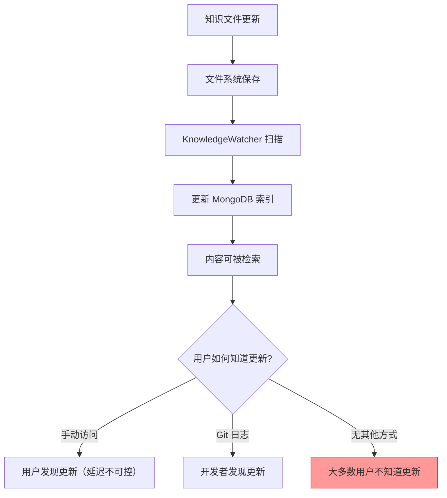
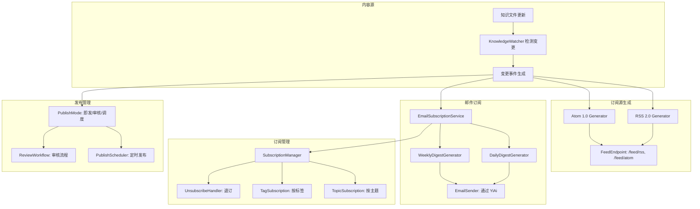
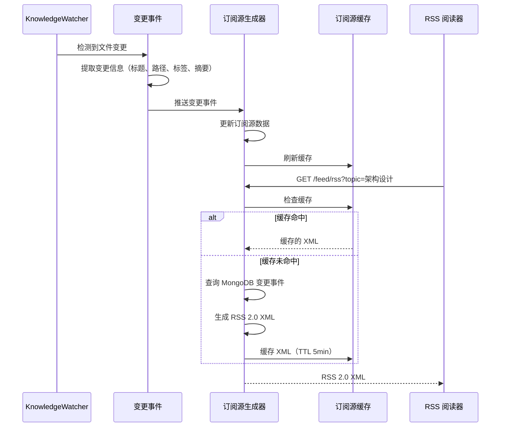

# YK-09-107: 内容发布与订阅 — RSS/Atom 订阅源生成、邮件摘要、主题订阅、通知推送、退订管理

> 需求编号：YK-09-107 · 优先级：P2 · 人天：0.3d · 状态：需求已编写
> 依赖：YK-09-05（项目知识中心）、YK-09-29（变更日志自动生成）、YA-09-140（邮件通知服务）

## 背景

### 问题陈述

YiKnowledge 作为团队共享的知识库，内容持续增长和更新，但用户缺乏主动获取内容更新的机制：

1. **无内容订阅**：用户无法订阅感兴趣的主题或标签，需要手动访问知识库查看更新
2. **无 RSS/Atom 订阅源**：无法通过 RSS 阅读器订阅知识库更新，不符合知识管理最佳实践
3. **无邮件摘要**：用户无法通过邮件接收知识库更新摘要
4. **无更新通知**：知识文件更新后，关注的用户无法收到通知
5. **无发布管理**：知识文件的发布、更新、下架缺乏统一管理

**核心矛盾**：知识库是"被动"的——用户需要主动访问才能获取更新，但大多数用户无法持续关注知识库变化，导致重要更新被遗漏。

### 影响范围

| # | 影响 | 严重程度 | 典型场景 |
|---|------|----------|----------|
| 1 | 用户遗漏重要更新 | 高 | 架构规范更新后团队成员不知道 |
| 2 | 无法通过 RSS 阅读器订阅 | 中 | 用户习惯用 RSS 阅读器追踪信息源 |
| 3 | 无邮件摘要 | 中 | 用户希望每周收到知识库更新摘要 |
| 4 | 无主题订阅 | 中 | 用户只想关注特定领域的更新 |
| 5 | 无发布管理 | 中 | 内容发布缺乏审核和调度 |

### 挑战

| 挑战 | 说明 |
|------|------|
| 订阅源格式 | 需要支持 RSS 2.0 和 Atom 1.0 两种主流格式 |
| 邮件投递 | 邮件的可靠投递、退订管理、频率控制 |
| 订阅粒度 | 支持全站订阅、按主题订阅、按标签订阅 |
| 发布调度 | 内容的定时发布、审核发布、紧急发布 |
| 订阅者管理 | 退订链接、订阅确认、订阅统计 |

---

## 一、现状分析

### 1.1 当前内容分发方式

```
YiKnowledge 内容分发现状:
├── 被动访问
│   ├── 用户手动浏览 YiVad 知识库页面
│   ├── 用户手动浏览 YiKnowledge 目录
│   └── 无主动推送
├── 变更感知
│   ├── Git 提交记录（仅开发者）
│   ├── 无变更通知
│   └── 无更新摘要
├── 订阅机制
│   ├── 无 RSS/Atom 订阅源
│   ├── 无邮件订阅
│   └── 无主题订阅
└── 发布管理
    ├── 无发布流程
    ├── 无审核机制
    └── 无发布调度

缺失:
├── RSS 2.0 / Atom 1.0 订阅源生成    # ❌ 不存在
├── 邮件摘要（每日/每周）             # ❌ 不存在
├── 主题/标签订阅                     # ❌ 不存在
├── 更新通知                          # ❌ 不存在
├── 退订管理                          # ❌ 不存在
├── 发布调度                          # ❌ 不存在
└── 订阅者统计                        # ❌ 不存在
```

### 1.2 内容更新场景

| 场景 | 当前感知方式 | 延迟 | 覆盖率 |
|------|-------------|------|--------|
| 新需求文档发布 | 手动查看 | 不可控 | 低 |
| 架构规范更新 | Git 提交记录 | 实时 | 仅开发者 |
| 知识库补充 | 手动查看 | 不可控 | 极低 |
| 缺陷记录更新 | 手动查看 | 不可控 | 低 |
| 项目状态变更 | 无感知 | N/A | 无 |

### 1.3 改造前内容分发流程



### 1.4 根因矩阵

| 症状 | 根因 | 触发条件 | 频率 |
|------|------|----------|------|
| 用户遗漏更新 | 无主动推送 | 知识库更新 | 每次更新 |
| 无法 RSS 订阅 | 无订阅源生成 | 用户想订阅 | 持续 |
| 无法邮件订阅 | 无邮件投递 | 用户想订阅 | 持续 |
| 无主题订阅 | 无订阅粒度 | 用户只想关注特定内容 | 持续 |
| 无发布管理 | 无发布流程 | 内容发布 | 每次发布 |

---

## 二、设计决策

### 决策 1：订阅源格式 — RSS 2.0 vs Atom 1.0 vs 两者

| 选项 | 兼容性 | 功能丰富度 | 实现复杂度 |
|------|--------|-----------|-----------|
| 仅 RSS 2.0 | 高 | 中 | 低 |
| 仅 Atom 1.0 | 中 | 高 | 低 |
| 两者 | 最高 | 最高 | 中 |

**选择：两者。** RSS 2.0 和 Atom 1.0 都是主流订阅源格式，同时支持可覆盖所有 RSS 阅读器。生成逻辑可共用数据源，仅模板不同，实现成本不高。

### 决策 2：邮件摘要频率 — 实时 vs 每日 vs 每周 vs 可选

| 选项 | 及时性 | 邮件量 | 用户体验 |
|------|--------|--------|----------|
| 实时（每次更新发送） | 最高 | 高 | 可能骚扰 |
| 每日摘要 | 高 | 中 | 好 |
| 每周摘要 | 中 | 低 | 好 |
| 可选（用户选择频率） | 高 | 可控 | 最好 |

**选择：可选（用户选择频率）。** 提供实时、每日、每周三种频率选项，用户根据偏好选择。默认每日摘要，平衡及时性和邮件量。

### 决策 3：订阅粒度 — 全站 vs 按主题 vs 按标签 vs 多级

| 选项 | 灵活性 | 实现复杂度 | 用户价值 |
|------|--------|-----------|----------|
| 全站订阅 | 低 | 低 | 中 |
| 按主题订阅 | 中 | 中 | 高 |
| 按标签订阅 | 高 | 中 | 高 |
| 多级（全站 + 主题 + 标签） | 最高 | 中 | 最高 |

**选择：多级。** 用户可订阅全站（所有更新）、按主题（如"架构设计"）、按标签（如"RAG"、"性能"）。订阅时选择粒度，更细粒度的订阅优先。

### 决策 4：发布管理方式 — 即发即布 vs 审核发布 vs 调度发布

| 选项 | 发布速度 | 内容质量 | 实现复杂度 |
|------|----------|----------|-----------|
| 即发即布（保存即发布） | 最快 | 低 | 低 |
| 审核发布（需审核人批准） | 慢 | 高 | 中 |
| 调度发布（定时发布） | 可控 | 中 | 中 |
| 混合（即发/审核/调度可选） | 可控 | 可控 | 高 |

**选择：混合。** 提供三种发布模式：即发即布（默认，适合小修改）、审核发布（适合重要文档）、调度发布（适合定时发布）。发布模式在文件 frontmatter 中配置。

### 设计决策记录

| 决策 | 选项 A | 选项 B | 选项 C | 选择 | 理由 |
|------|--------|--------|--------|------|------|
| 订阅源格式 | RSS | Atom | 两者 | **两者** | 全覆盖 |
| 邮件频率 | 实时 | 每日 | 可选 | **可选** | 灵活 |
| 订阅粒度 | 全站 | 主题 | 多级 | **多级** | 精准 |
| 发布管理 | 即发 | 审核 | 混合 | **混合** | 灵活 |

---

## 三、目标架构

### 3.1 内容发布与订阅架构



### 3.2 订阅源生成流程



### 3.3 性能指标

| 指标 | 目标值 | 说明 |
|------|--------|------|
| 订阅源生成 | < 100ms | XML 生成 + 缓存 |
| 邮件摘要生成 | < 30s | 数据收集 + 模板渲染 |
| 订阅源更新延迟 | < 5s | KnowledgeWatcher 扫描周期 |
| 退订处理 | < 100ms | 数据库更新 |
| 订阅者查询 | < 50ms | MongoDB 查询 |

---

## 四、具体改动

### 4.1 订阅源生成服务

```python
# services/subscription/feed_generator.py (新增)

from dataclasses import dataclass
from datetime import datetime
from typing import Optional
from xml.etree.ElementTree import Element, SubElement, tostring

@dataclass
class FeedEntry:
    title: str
    link: str
    description: str
    author: str
    published: datetime
    updated: datetime
    tags: list[str]
    category: str

class FeedGenerator:
    def __init__(self):
        self._cache: dict[str, tuple[str, float]] = {}  # key → (xml, timestamp)

    async def generate_rss(
        self,
        topic: Optional[str] = None,
        tag: Optional[str] = None,
        limit: int = 50,
    ) -> str:
        """生成 RSS 2.0 订阅源"""
        cache_key = f"rss:{topic}:{tag}:{limit}"
        cached = self._get_cache(cache_key)
        if cached:
            return cached

        entries = await self._get_entries(topic, tag, limit)
        xml = self._build_rss_xml(entries)
        self._set_cache(cache_key, xml)
        return xml

    async def generate_atom(
        self,
        topic: Optional[str] = None,
        tag: Optional[str] = None,
        limit: int = 50,
    ) -> str:
        """生成 Atom 1.0 订阅源"""
        cache_key = f"atom:{topic}:{tag}:{limit}"
        cached = self._get_cache(cache_key)
        if cached:
            return cached

        entries = await self._get_entries(topic, tag, limit)
        xml = self._build_atom_xml(entries)
        self._set_cache(cache_key, xml)
        return xml

    def _build_rss_xml(self, entries: list[FeedEntry]) -> str:
        """构建 RSS 2.0 XML"""
        rss = Element("rss", version="2.0")
        channel = SubElement(rss, "channel")
        SubElement(channel, "title").text = "YiKnowledge 知识库"
        SubElement(channel, "link").text = "https://yry.example.com/knowledge"
        SubElement(channel, "description").text = "YiKnowledge 知识库更新订阅"
        SubElement(channel, "lastBuildDate").text = datetime.now().strftime(
            "%a, %d %b %Y %H:%M:%S +0000"
        )

        for entry in entries:
            item = SubElement(channel, "item")
            SubElement(item, "title").text = entry.title
            SubElement(item, "link").text = entry.link
            SubElement(item, "description").text = entry.description
            SubElement(item, "author").text = entry.author
            SubElement(item, "pubDate").text = entry.published.strftime(
                "%a, %d %b %Y %H:%M:%S +0000"
            )
            for tag in entry.tags:
                SubElement(item, "category").text = tag

        return '<?xml version="1.0" encoding="UTF-8"?>\n' + tostring(
            rss, encoding="unicode"
        )

    def _build_atom_xml(self, entries: list[FeedEntry]) -> str:
        """构建 Atom 1.0 XML"""
        feed = Element("feed", xmlns="http://www.w3.org/2005/Atom")
        SubElement(feed, "title").text = "YiKnowledge 知识库"
        SubElement(feed, "link", href="https://yry.example.com/knowledge")
        SubElement(feed, "updated").text = datetime.now().isoformat()
        SubElement(feed, "id").text = "urn:yiknowledge:feed"

        for entry in entries:
            entry_elem = SubElement(feed, "entry")
            SubElement(entry_elem, "title").text = entry.title
            SubElement(entry_elem, "link", href=entry.link)
            SubElement(entry_elem, "id").text = f"urn:yiknowledge:entry:{entry.link}"
            SubElement(entry_elem, "updated").text = entry.updated.isoformat()
            SubElement(entry_elem, "published").text = entry.published.isoformat()
            SubElement(entry_elem, "summary").text = entry.description
            author = SubElement(entry_elem, "author")
            SubElement(author, "name").text = entry.author
            for tag in entry.tags:
                SubElement(entry_elem, "category", term=tag)

        return '<?xml version="1.0" encoding="UTF-8"?>\n' + tostring(
            feed, encoding="unicode"
        )

    async def _get_entries(
        self,
        topic: Optional[str],
        tag: Optional[str],
        limit: int,
    ) -> list[FeedEntry]:
        """从变更事件中获取订阅源条目"""
        from data.repository import get_collection
        collection = get_collection("knowledge_feed_entries")

        filter_dict = {}
        if topic:
            filter_dict["category"] = topic
        if tag:
            filter_dict["tags"] = tag

        docs = await collection.find(filter_dict) \
            .sort("published", -1) \
            .limit(limit) \
            .to_list(None)

        return [FeedEntry(**doc) for doc in docs]
```

### 4.2 邮件订阅服务

```python
# services/subscription/email_subscription.py (新增)

class EmailSubscriptionService:
    COLLECTION = "knowledge_subscriptions"

    async def subscribe(
        self,
        email: str,
        frequency: str = "daily",  # "realtime" | "daily" | "weekly"
        topic: Optional[str] = None,
        tags: Optional[list[str]] = None,
    ) -> Subscription:
        """订阅知识库更新"""
        # 生成确认 Token
        token = secrets.token_urlsafe(32)

        subscription = Subscription(
            id=str(uuid.uuid4()),
            email=email,
            frequency=frequency,
            topic=topic,
            tags=tags or [],
            confirmed=False,
            confirm_token=token,
            created_at=datetime.now().isoformat(),
        )

        collection = get_collection(self.COLLECTION)
        await collection.insert_one(asdict(subscription))

        # 发送确认邮件
        await self._send_confirmation_email(email, token)

        return subscription

    async def confirm_subscription(self, token: str) -> bool:
        """确认订阅"""
        collection = get_collection(self.COLLECTION)
        result = await collection.update_one(
            {"confirm_token": token, "confirmed": False},
            {"$set": {"confirmed": True, "confirmed_at": datetime.now().isoformat()}},
        )
        return result.modified_count > 0

    async def unsubscribe(self, email: str, token: str) -> bool:
        """退订"""
        collection = get_collection(self.COLLECTION)
        result = await collection.delete_one({
            "email": email,
            "unsubscribe_token": token,
        })
        return result.deleted_count > 0

    async def send_daily_digest(self):
        """发送每日摘要"""
        subscribers = await self._get_subscribers(frequency="daily")
        yesterday = (datetime.now() - timedelta(days=1)).strftime("%Y-%m-%d")

        for sub in subscribers:
            entries = await self._get_entries_since(
                sub.topic, sub.tags, yesterday
            )
            if entries:
                await self._send_digest_email(sub.email, entries, "daily")

    async def send_weekly_digest(self):
        """发送每周摘要"""
        subscribers = await self._get_subscribers(frequency="weekly")
        last_week = (datetime.now() - timedelta(days=7)).strftime("%Y-%m-%d")

        for sub in subscribers:
            entries = await self._get_entries_since(
                sub.topic, sub.tags, last_week
            )
            if entries:
                await self._send_digest_email(sub.email, entries, "weekly")

    async def _send_digest_email(
        self,
        email: str,
        entries: list[FeedEntry],
        digest_type: str,
    ):
        """发送摘要邮件"""
        subject = f"YiKnowledge {digest_type} Digest - {datetime.now().strftime('%Y-%m-%d')}"
        html = self._render_digest_html(entries, digest_type)

        await self._send_email(email, subject, html)

    def _render_digest_html(
        self,
        entries: list[FeedEntry],
        digest_type: str,
    ) -> str:
        """渲染摘要 HTML"""
        items_html = ""
        for entry in entries:
            items_html += f"""
            <div style="margin-bottom: 20px; padding: 10px; border-left: 3px solid #4a90d9;">
                <h3 style="margin: 0 0 5px 0;">
                    <a href="{entry.link}" style="color: #333;">{entry.title}</a>
                </h3>
                <p style="margin: 0 0 5px 0; color: #666;">{entry.description}</p>
                <small style="color: #999;">
                    {entry.author} · {entry.published.strftime('%Y-%m-%d %H:%M')}
                    · {' '.join(f'#{tag}' for tag in entry.tags)}
                </small>
            </div>
            """

        unsubscribe_token = "..."  # 从订阅记录获取
        unsubscribe_url = f"https://yry.example.com/knowledge/unsubscribe?token={unsubscribe_token}"

        return f"""
        <html>
        <body style="font-family: Arial, sans-serif; max-width: 600px; margin: 0 auto;">
            <h1>YiKnowledge {digest_type.title()} Digest</h1>
            <p>以下是知识库的最新更新:</p>
            {items_html}
            <hr>
            <footer style="color: #999; font-size: 12px;">
                <p>此邮件由 YiKnowledge 自动发送。如需退订，请
                <a href="{unsubscribe_url}">点击这里</a>。</p>
            </footer>
        </body>
        </html>
        """
```

### 4.3 文件变更清单

| 文件 | 操作 | 说明 |
|------|------|------|
| `services/subscription/feed_generator.py` | 新增 | RSS/Atom 订阅源生成 |
| `services/subscription/email_subscription.py` | 新增 | 邮件订阅服务 |
| `services/subscription/subscription_manager.py` | 新增 | 订阅管理服务 |
| `services/subscription/publish_manager.py` | 新增 | 发布管理服务 |
| `api/routes/feed.py` | 新增 | 订阅源 API 路由 |
| `api/routes/subscription.py` | 新增 | 订阅管理 API 路由 |
| `tasks/scheduled_digest.py` | 新增 | 定时摘要任务 |
| `tests/test_feed_generator.py` | 新增 | 订阅源生成测试 |
| `tests/test_email_subscription.py` | 新增 | 邮件订阅测试 |

---

## 五、实施步骤

| 步骤 | 操作 | 路径 | 验证 | 人天 |
|------|------|------|------|------|
| 1 | 实现变更事件收集 | `services/subscription/` | KnowledgeWatcher 推送变更事件 | 0.05 |
| 2 | 实现 RSS 2.0 + Atom 1.0 生成器 | `services/subscription/feed_generator.py` | 订阅源 XML 输出 | 0.05 |
| 3 | 实现订阅管理服务 | `services/subscription/subscription_manager.py` | 订阅/退订/确认 | 0.05 |
| 4 | 实现邮件摘要服务 | `services/subscription/email_subscription.py` | 每日/每周摘要邮件 | 0.05 |
| 5 | 实现发布管理服务 | `services/subscription/publish_manager.py` | 即发/审核/调度 | 0.05 |
| 6 | 实现 API 路由 | `api/routes/feed.py` + `api/routes/subscription.py` | 订阅源/订阅管理 API | 0.03 |
| 7 | 实现定时摘要任务 | `tasks/scheduled_digest.py` | 每日/每周定时发送 | 0.02 |

**总人天：0.3d**

---

## 六、测试规格

### 场景 1：RSS 订阅源生成

**GIVEN** 知识库中有 20 条最近更新的文件
**WHEN** 用户访问 `/feed/rss`
**THEN** 应返回 RSS 2.0 格式的 XML
**AND** 应包含最近 50 条更新条目
**AND** 每个条目应包含标题、链接、描述、作者、发布日期、标签

### 场景 2：按主题过滤订阅源

**GIVEN** 知识库中有架构设计和功能实现两类更新
**WHEN** 用户访问 `/feed/rss?topic=架构设计`
**THEN** 应仅返回 architecture-design 分类的更新
**AND** 不应包含功能实现类的更新

### 场景 3：邮件订阅

**GIVEN** 用户输入邮箱地址并选择每日摘要
**WHEN** 用户提交订阅表单
**THEN** 应发送确认邮件到用户邮箱
**AND** 用户点击确认链接后订阅生效
**AND** 用户应在每日摘要中收到知识库更新

### 场景 4：退订管理

**GIVEN** 用户已订阅每日摘要
**WHEN** 用户点击邮件底部的退订链接
**THEN** 应立即退订
**AND** 不应再收到摘要邮件
**AND** 应展示退订成功页面

### 场景 5：发布调度

**GIVEN** 知识文件设置了 `publish_mode: scheduled` 和 `publish_at: 2026-09-15`
**WHEN** 文件保存到知识库
**THEN** 文件不应立即出现在订阅源中
**AND** 在 2026-09-15 时，文件应自动发布到订阅源

### 场景 6：Atom 订阅源生成

**GIVEN** 知识库中有更新
**WHEN** 用户访问 `/feed/atom`
**THEN** 应返回 Atom 1.0 格式的 XML
**AND** 应包含 feed 级别的 id、title、updated
**AND** 每个 entry 应包含 id、title、link、updated、summary、author、category

---

## 七、风险与缓解

| 风险 | 概率 | 影响 | 缓解措施 |
|------|------|------|----------|
| 邮件被标记为垃圾邮件 | 中 | 高 | 使用 SPF/DKIM 验证，邮件内容规范化，提供明确退订链接 |
| 订阅源缓存过期不及时 | 低 | 低 | KnowledgeWatcher 更新时主动清除缓存 |
| 退订链接被滥用 | 低 | 中 | 退订 Token 使用 SHA256 哈希，不可猜测 |
| 大量订阅者导致邮件发送超时 | 低 | 中 | 分批发送，每批 50 人，间隔 5s |
| 发布调度时间不准确 | 低 | 低 | 使用 APScheduler 定时任务，每分钟检查一次 |

---

## 八、回滚策略

| 场景 | 回滚操作 | 影响 |
|------|----------|------|
| 订阅源生成异常 | 禁用 /feed/ 端点，返回 503 | 失去 RSS 订阅 |
| 邮件发送失败率高 | 禁用邮件摘要，仅保留 RSS 订阅 | 失去邮件订阅 |
| 退订功能异常 | 提供手动退订（联系管理员） | 用户可能投诉 |
| 发布调度异常 | 降级为即发即布模式 | 失去定时发布 |

---

## 九、设计决策记录

### D-01：订阅源条目数量上限

- **问题**：RSS/Atom 订阅源最多返回多少条目
- **选项**：20、50、100、无限制
- **选择**：50
- **理由**：50 条覆盖了大部分场景，RSS 阅读器通常不会一次拉取超过 50 条

### D-02：邮件摘要发送时间

- **问题**：每日摘要的发送时间
- **选项**：08:00、12:00、18:00、用户可选
- **选择**：08:00（默认）+ 用户可选
- **理由**：08:00 是工作日开始前，用户可以在开始工作时看到昨日更新摘要

### D-03：订阅确认机制

- **问题**：是否需要邮件确认（double opt-in）
- **选项**：不需要、需要、可选
- **选择**：需要（double opt-in）
- **理由**：GDPR 和邮件最佳实践要求 double opt-in，避免恶意订阅和垃圾邮件投诉

### D-04：发布审核权限

- **问题**：审核发布模式中谁可以审核
- **选项**：管理员、curator 角色、指定审核人
- **选择**：curator 角色 + 指定审核人
- **理由**：curator 是知识库的管理角色，同时支持在 frontmatter 中指定特定审核人

---

## 十、可观测性

### 指标

| 指标 | 类型 | 说明 |
|------|------|------|
| `yiknowledge.feed.rss_requests` | Counter | RSS 订阅源请求数 |
| `yiknowledge.feed.atom_requests` | Counter | Atom 订阅源请求数 |
| `yiknowledge.subscription.total` | Gauge | 总订阅者数 |
| `yiknowledge.subscription.new` | Counter | 新订阅数 |
| `yiknowledge.subscription.unsubscribe` | Counter | 退订数 |
| `yiknowledge.digest.sent` | Counter | 摘要发送数 |
| `yiknowledge.digest.failed` | Counter | 摘要发送失败数 |

### 告警

| 告警 | 条件 | 级别 |
|------|------|------|
| 邮件发送失败率过高 | > 10% | ERROR |
| 退订率异常增长 | 1 天内 > 20% | WARNING |
| 订阅源生成失败 | 连续 3 次 | ERROR |
| 定时摘要任务未执行 | 超时 1h 未执行 | WARNING |

---

## 十一、代码审查检查清单

- [ ] RSS 2.0 和 Atom 1.0 两种订阅源格式均支持
- [ ] 订阅源支持按主题和标签过滤
- [ ] 订阅源 XML 缓存 TTL 5 分钟
- [ ] 邮件订阅支持实时/每日/每周三种频率
- [ ] 邮件订阅使用 double opt-in 确认机制
- [ ] 退订链接使用不可猜测的 Token
- [ ] 每日摘要邮件包含标题、摘要、链接、作者、标签
- [ ] 邮件底部署名包含退订链接
- [ ] 发布管理支持即发/审核/调度三种模式
- [ ] 发布模式在文件 frontmatter 中配置
- [ ] 定时摘要任务使用 APScheduler
- [ ] 单元测试覆盖 RSS/Atom 生成、订阅/退订、邮件渲染

---

## 回归问题预测

| # | 预测问题 | 原因 | 验证方法 |
|---|---------|------|---------|
| 1 | RSS 订阅源中的中文标题在部分 RSS 阅读器中显示为乱码 | XML 声明未指定 encoding="UTF-8"，或 Content-Type 响应头未设置 charset | 在 Feedly 和 Inoreader 中订阅 RSS 源，验证中文标题正常显示 |
| 2 | 邮件摘要中的退订链接 Token 在邮件客户端中被截断或不可点击 | 退订 Token 过长（64 字符），部分邮件客户端可能截断链接或纯文本模式不渲染 | 在 Gmail、Outlook 中查看摘要邮件，验证退订链接完整且可点击 |
| 3 | 每日摘要定时任务在 APScheduler 中因时区问题在错误的时间发送 | APScheduler 默认使用 UTC 时区，但用户在 CST 时区，08:00 CST = 00:00 UTC | 设置定时任务为 08:00 CST，验证实际发送时间在 08:00 CST |
| 4 | 订阅源按标签过滤时，使用了中文标签但 URL 编码后在某些 RSS 阅读器中不被识别 | URL 参数 `?tag=架构设计` 中的中文在 URL 编码后可能被 RSS 阅读器错误解析 | 使用中文标签过滤订阅源，验证 RSS 阅读器正常获取内容 |
| 5 | 邮件订阅者在 double opt-in 确认前，知识库有更新，确认后收到的摘要缺少确认前的更新 | 摘要生成查询的是确认后的更新时间，确认前的更新被遗漏 | 创建订阅 → 添加知识文件 → 确认订阅，验证摘要包含确认前的更新 |
| 6 | 发布调度中的文件在发布时间到达时，KnowledgeWatcher 未检测到其状态变更，订阅源未更新 | 发布调度变更的是 frontmatter 中的 `publish_status` 字段，但 KnowledgeWatcher 可能未检测到 | 设置定时发布文件，等待发布后验证 RSS 订阅源包含该文件 |

---

## 性能分析

### 内容发布与订阅关键操作耗时

| 操作 | 耗时 | 说明 |
|------|------|------|
| RSS 订阅源生成（缓存命中） | < 5ms | 返回缓存 XML |
| RSS 订阅源生成（缓存未命中） | < 100ms | MongoDB 查询 + XML 构建 |
| Atom 订阅源生成 | < 100ms | 同 RSS |
| 邮件摘要生成（渲染） | < 50ms | HTML 模板渲染 |
| 邮件发送（单封） | < 500ms | SMTP 发送 |
| 邮件批量发送（100 封） | < 30s | 分批发送 |
| 订阅/退订 | < 50ms | MongoDB 写入 |
| 发布调度检查 | < 10ms | 定时任务查询 |

### 数据量预估

| 模块 | 数据项 | 大小 |
|------|--------|------|
| 订阅源条目 | 50 条 FeedEntry | ~50KB |
| RSS XML | 50 条条目的 RSS 2.0 | ~100KB |
| Atom XML | 50 条条目的 Atom 1.0 | ~120KB |
| 订阅记录 | 每条订阅 | ~500B |
| 邮件摘要 HTML | 单封摘要邮件 | ~20KB |

### 对系统的影响

| 场景 | 系统影响 | 说明 |
|------|----------|------|
| 订阅源请求 | 轻微 CPU 负载 | XML 生成 + 缓存 |
| 邮件摘要发送 | 网络 I/O | SMTP 发送 |
| 定时摘要任务 | 后台任务 | 不阻塞主服务 |

---

## 相关文档

- [项目知识中心](../05-需求-项目知识中心.md) — 订阅功能的用户入口
- [变更日志自动生成](../29-需求-变更日志自动生成.md) — 订阅源的数据来源
- [邮件通知服务](../../yiai/requirements/2026-09/140-需求-邮件通知服务.md) — 邮件发送基础设施
- [知识生命周期管理](../87-需求-知识生命周期管理.md) — 发布管理的内容生命周期

*PRD 来源: `projects/yiknowledge/requirements/2026-09/107-需求-内容发布与订阅.md`*