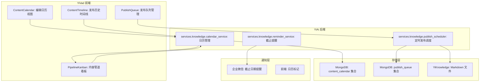
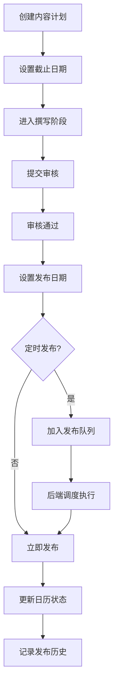

# YK-09-108: 内容日历与发布计划 — 知识内容编辑日历、定时发布、内容管道可视化与发布队列管理

> 需求编号：YK-09-108 · 优先级：P2 · 人天：0.3d · 状态：需求已编写
> 依赖：YK-09-87（知识生命周期管理）、YK-09-06（知识生命周期）

## 背景

### 问题陈述

YiKnowledge 知识库当前的内容创建和发布缺乏系统化的计划管理。内容创建者没有统一的编辑日历来规划内容生产，管理者无法可视化内容管道状态。当前存在以下问题：

1. **无内容日历**：内容创建者无法规划何时撰写、何时发布知识内容
2. **无定时发布**：内容完成后无法设置定时发布，需要手动操作
3. **内容管道不透明**：管理者不知道有多少内容在撰写、审核、等待发布
4. **截止日期无追踪**：知识内容的责任人不知道截止日期，容易延误
5. **发布队列无管理**：无法按优先级和类别管理待发布内容
6. **发布历史无记录**：无法回顾历史发布记录和发布节奏

**核心矛盾**：知识内容的生产需要计划和节奏，但当前缺乏工具支持内容日历和发布管理。

### 影响范围

| # | 影响 | 严重程度 | 典型场景 |
|---|------|----------|----------|
| 1 | 内容生产无计划 | 中 | 创建者不知道下一篇文章写什么 |
| 2 | 发布时机不佳 | 中 | 重要内容在非工作日发布，阅读量低 |
| 3 | 内容管道管理混乱 | 中 | 同时有 10 篇在写，但没一篇完成 |
| 4 | 截止日期延误 | 中 | 责任人忘记截稿日期 |
| 5 | 发布节奏不稳定 | 低 | 有时一天 3 篇，有时一周无更新 |

### 挑战

| 挑战 | 说明 |
|------|------|
| 日历 UI | 需要在 YiVad 中渲染日历视图 |
| 管道可视化 | 需要看板式的内容管道视图 |
| 定时发布 | 需要后端调度系统支持定时操作 |
| 截止日期提醒 | 需要通知系统（如企业微信）发送提醒 |
| 与生命周期集成 | 需要与 YK-09-87 知识生命周期流程衔接 |

---

## 一、现状分析

### 1.1 当前内容管理现状

```
现有功能:
├── YK-09-87 知识生命周期管理
│   ├── 内容状态流转（草稿→审核→已发布）
│   └── 无时间计划
├── YK-09-06 知识生命周期
│   ├── 基础生命周期
│   └── 无日历视图
├── YiKnowledge 文件系统
│   ├── Markdown 文件
│   └── 无发布计划

缺失:
├── 内容编辑日历            # ❌ 不存在
├── 定时发布功能            # ❌ 不存在
├── 内容管道看板            # ❌ 不存在
├── 截止日期追踪            # ❌ 不存在
├── 发布队列管理            # ❌ 不存在
├── 发布历史记录            # ❌ 不存在
└── 内容日历分类视图        # ❌ 不存在
```

### 1.2 内容管道阶段

| 阶段 | 状态 | 说明 | 典型停留时间 |
|------|------|------|-------------|
| 计划 | `planned` | 已列入计划，有标题和概要 | 1-3 天 |
| 撰写 | `drafting` | 正在撰写中 | 1-5 天 |
| 审核 | `review` | 等待审核 | 1-2 天 |
| 修订 | `revision` | 根据反馈修改 | 1-2 天 |
| 就绪 | `ready` | 已审核通过，等待发布 | 0-1 天 |
| 已发布 | `published` | 已发布 | - |

### 1.3 根因矩阵

| 症状 | 根因 | 触发条件 | 频率 |
|------|------|----------|------|
| 无内容计划 | 无编辑日历 | 内容规划 | 高 |
| 发布时机不佳 | 无定时发布 | 内容完成 | 中 |
| 管道不透明 | 无管道看板 | 管理决策 | 中 |
| 截止日期延误 | 无截止日期追踪 | 内容生产 | 中 |
| 发布节奏不稳 | 无发布队列管理 | 内容发布 | 低 |

---

## 二、设计决策

### 决策 1：日历视图实现 — 前端 FullCalendar vs 自定义日历组件 vs el-calendar

| 选项 | 功能完整度 | 体积 | 定制性 |
|------|-----------|------|--------|
| FullCalendar | 高 | 大（~200KB） | 高 |
| 自定义日历组件 | 低 | 小 | 最高 |
| el-calendar（Element Plus） | 中 | 小（已有依赖） | 中 |

**选择：el-calendar（Element Plus 内置）为主 + 自定义管道看板。** Element Plus 已内置于 YiVad，使用其 el-calendar 组件零额外依赖。管道看板使用自定义卡片布局（类似 Kanban），更直观展示内容流转。

### 决策 2：定时发布实现 — 前端定时器 vs 后端调度 vs 两者

| 选项 | 可靠性 | 实现复杂度 | 扩展性 |
|------|--------|-----------|--------|
| 前端定时器 | 低 | 低 | 低 |
| 后端调度（apscheduler） | 高 | 中 | 高 |
| 两者（后端调度 + 前端展示） | 最高 | 中 | 最高 |

**选择：后端调度 + 前端展示。** 后端使用 apscheduler 管理定时发布任务，前端展示发布队列和修改计划。后端调度可靠性高，不受前端浏览器关闭影响。

### 决策 3：内容管道可视化 — 列表视图 vs Kanban 看板 vs 两者

| 选项 | 直观性 | 信息密度 | 实现复杂度 |
|------|--------|----------|-----------|
| 列表视图 | 低 | 高 | 低 |
| Kanban 看板 | 高 | 中 | 中 |
| 两者（日历 + 看板 + 列表） | 最高 | 最高 | 中 |

**选择：日历 + Kanban 看板 + 列表。** 日历视图按时间展示发布计划。看板视图按阶段展示内容流转。列表视图按优先级展示任务清单。三种视图互补覆盖不同使用场景。

### 决策 4：截止日期提醒 — 前端通知 vs 企业微信 vs 邮件

| 选项 | 触达率 | 实现复杂度 | 实时性 |
|------|--------|-----------|--------|
| 前端通知（浏览器） | 低 | 低 | 中 |
| 企业微信通知 | 高 | 中 | 高 |
| 邮件通知 | 中 | 中 | 低 |

**选择：企业微信通知（YiAi 已有企微集成）。** 复用 YiAi 的企业微信消息服务（已有 `services/wechat_work/` 模块），在截止日期前 1 天和当天发送提醒。

### 设计决策记录

| 决策 | 选项 A | 选项 B | 选项 C | 选择 | 理由 |
|------|--------|--------|--------|------|------|
| 日历 UI | FullCalendar | 自定义组件 | el-calendar | **el-calendar** | 零额外依赖 |
| 定时发布 | 前端定时器 | 后端调度 | 两者 | **后端调度** | 可靠性高 |
| 管道可视化 | 列表视图 | Kanban 看板 | 两者 + 日历 | **三视图** | 覆盖全场景 |
| 截止提醒 | 前端通知 | 企业微信 | 邮件 | **企业微信** | 已有集成 |

---

## 三、目标架构

### 3.1 内容日历系统架构



### 3.2 内容生命周期与日历集成



### 3.3 性能指标

| 指标 | 改造前 | 改造后 |
|------|--------|--------|
| 内容日历加载 | N/A | < 200ms |
| 管道看板加载 | N/A | < 100ms |
| 定时发布执行 | N/A | 准时执行 |
| 截止提醒发送 | 无 | 提前 1 天 + 当天 |

---

## 四、具体改动

### 4.1 内容日历数据模型

```python
# services/knowledge/calendar_service.py (YiAi 新增)

from typing import Optional, List
from datetime import datetime, date
from pydantic import BaseModel, Field
from enum import Enum

class ContentStatus(str, Enum):
    PLANNED = "planned"
    DRAFTING = "drafting"
    REVIEW = "review"
    REVISION = "revision"
    READY = "ready"
    PUBLISHED = "published"
    CANCELLED = "cancelled"

class ContentPriority(str, Enum):
    HIGH = "high"
    MEDIUM = "medium"
    LOW = "low"

class ContentCalendarEntry(BaseModel):
    """内容日历条目"""
    id: Optional[str] = None
    title: str
    description: Optional[str] = None
    category: str                        # 内容分类
    tags: List[str] = []
    status: ContentStatus = ContentStatus.PLANNED
    priority: ContentPriority = ContentPriority.MEDIUM
    author: str                          # 作者
    reviewer: Optional[str] = None       # 审核人
    target_file: Optional[str] = None    # 目标文件路径
    planned_start_date: Optional[date] = None  # 计划开始日期
    deadline: Optional[date] = None      # 截止日期
    publish_date: Optional[date] = None  # 发布日期
    published_at: Optional[datetime] = None   # 实际发布时间
    created_at: datetime = Field(default_factory=datetime.utcnow)
    updated_at: datetime = Field(default_factory=datetime.utcnow)

class ContentCalendarService:
    """内容日历管理服务"""

    def __init__(self, db):
        self.db = db
        self.collection = db["content_calendar"]

    async def create_entry(self, entry: ContentCalendarEntry) -> str:
        """创建日历条目"""
        doc = entry.dict(exclude={"id"})
        result = await self.collection.insert_one(doc)
        return str(result.inserted_id)

    async def get_calendar_entries(
        self,
        start_date: Optional[date] = None,
        end_date: Optional[date] = None,
        status: Optional[ContentStatus] = None,
        author: Optional[str] = None,
    ) -> List[dict]:
        """查询日历条目"""
        filter_query = {}

        if start_date or end_date:
            filter_query["$or"] = []
            date_conditions = []
            if start_date and end_date:
                date_conditions.append({"publish_date": {"$gte": start_date.isoformat(), "$lte": end_date.isoformat()}})
                date_conditions.append({"deadline": {"$gte": start_date.isoformat(), "$lte": end_date.isoformat()}})
            filter_query["$or"] = date_conditions

        if status:
            filter_query["status"] = status
        if author:
            filter_query["author"] = author

        cursor = self.collection.find(filter_query).sort("publish_date", 1)
        entries = await cursor.to_list(length=100)
        return entries

    async def get_pipeline_summary(self) -> dict:
        """获取内容管道概览（各阶段内容数量）"""
        pipeline = [
            {"$group": {"_id": "$status", "count": {"$sum": 1}}},
        ]
        results = await self.collection.aggregate(pipeline).to_list(length=10)

        summary = {
            "total": 0,
            "stages": {},
        }
        for r in results:
            summary["stages"][r["_id"]] = r["count"]
            summary["total"] += r["count"]

        return summary

    async def get_publish_queue(
        self, from_date: Optional[date] = None, limit: int = 20
    ) -> List[dict]:
        """获取发布队列（按发布日期排序的待发布内容）"""
        filter_query = {
            "status": {"$in": ["ready", "planned"]},
            "publish_date": {"$ne": None},
        }
        if from_date:
            filter_query["publish_date"]["$gte"] = from_date.isoformat()

        cursor = self.collection.find(filter_query).sort("publish_date", 1).limit(limit)
        return await cursor.to_list(length=limit)

    async def update_status(self, entry_id: str, status: ContentStatus) -> bool:
        """更新内容状态"""
        from bson import ObjectId

        updates = {"status": status, "updated_at": datetime.utcnow()}
        if status == ContentStatus.PUBLISHED:
            updates["published_at"] = datetime.utcnow()

        result = await self.collection.update_one(
            {"_id": ObjectId(entry_id)},
            {"$set": updates},
        )
        return result.modified_count > 0

    async def get_overdue_entries(self) -> List[dict]:
        """获取逾期未完成的内容"""
        today = date.today().isoformat()
        cursor = self.collection.find({
            "deadline": {"$lt": today},
            "status": {"$nin": ["published", "cancelled"]},
        }).sort("deadline", 1)
        return await cursor.to_list(length=50)

    async def get_publish_history(self, limit: int = 50) -> List[dict]:
        """获取发布历史"""
        cursor = self.collection.find({
            "status": "published",
            "published_at": {"$ne": None},
        }).sort("published_at", -1).limit(limit)
        return await cursor.to_list(length=limit)
```

### 4.2 定时发布调度器

```python
# services/knowledge/publish_scheduler.py (YiAi 新增)

import asyncio
from datetime import date, datetime
from typing import List, Dict, Any

class PublishScheduler:
    """定时发布调度器"""

    def __init__(self, db, calendar_service, wechat_service):
        self.db = db
        self.calendar = calendar_service
        self.wechat = wechat_service

    async def process_publish_queue(self) -> Dict[str, Any]:
        """处理发布队列（每天执行一次）"""
        today = date.today()
        queue = await self.calendar.get_publish_queue(from_date=today)

        published = []
        failed = []

        for entry in queue:
            publish_date = entry.get("publish_date")
            if publish_date and publish_date <= today.isoformat():
                try:
                    # 执行发布：更新 Markdown frontmatter status
                    if entry.get("target_file"):
                        await self._update_file_frontmatter(
                            entry["target_file"],
                            {"status": "已发布", "published_at": datetime.utcnow().isoformat()}
                        )

                    # 更新日历条目状态
                    await self.calendar.update_status(entry["_id"], "published")
                    published.append(entry["title"])
                except Exception as e:
                    failed.append({"title": entry["title"], "error": str(e)})

        return {
            "processed": len(queue),
            "published": len(published),
            "failed": len(failed),
            "published_titles": published,
            "failed_items": failed,
        }

    async def _update_file_frontmatter(self, file_path: str, updates: dict):
        """更新 Markdown 文件的 frontmatter"""
        # 读取文件，修改 frontmatter，写回
        import yaml

        full_path = f"/Users/ruiyi/YrY/YiKnowledge/{file_path}"
        with open(full_path, "r") as f:
            content = f.read()

        # 解析 frontmatter
        if content.startswith("---"):
            parts = content.split("---", 2)
            if len(parts) >= 3:
                fm = yaml.safe_load(parts[1])
                fm.update(updates)
                new_fm = yaml.dump(fm, allow_unicode=True, default_flow_style=False)
                new_content = f"---\n{new_fm}---\n{parts[2]}"

                with open(full_path, "w") as f:
                    f.write(new_content)


class ReminderService:
    """截止日期提醒服务"""

    def __init__(self, calendar_service, wechat_service):
        self.calendar = calendar_service
        self.wechat = wechat_service

    async def send_deadline_reminders(self) -> Dict[str, Any]:
        """发送截止日期提醒"""
        tomorrow = date.today().isoformat()
        today_entries = await self.calendar.get_overdue_entries()

        # 获取截止日期为明天的内容
        upcoming = await self.calendar.collection.find({
            "deadline": tomorrow,
            "status": {"$nin": ["published", "cancelled"]},
        }).to_list(length=50)

        sent = 0
        errors = []

        # 发送逾期提醒
        for entry in today_entries:
            try:
                await self.wechat.send_message(
                    user=entry["author"],
                    content=(
                        f"[内容日历] 截止日期提醒\n"
                        f"内容「{entry['title']}」已于 {entry['deadline']} 过期\n"
                        f"当前状态：{entry['status']}\n"
                        f"请尽快更新进度"
                    ),
                )
                sent += 1
            except Exception as e:
                errors.append({"title": entry["title"], "error": str(e)})

        # 发送即将到期提醒
        for entry in upcoming:
            try:
                await self.wechat.send_message(
                    user=entry["author"],
                    content=(
                        f"[内容日历] 明日截止提醒\n"
                        f"内容「{entry['title']}」将于明天（{entry['deadline']}）到期\n"
                        f"当前状态：{entry['status']}"
                    ),
                )
                sent += 1
            except Exception as e:
                errors.append({"title": entry["title"], "error": str(e)})

        return {"sent": sent, "errors": len(errors), "error_details": errors}
```

### 4.3 内容日历前端组件（YiVad）

```vue
<!-- src/views/knowledge/ContentCalendar.vue (YiVad 新增) -->

<script setup lang="ts">
import { ref, onMounted } from 'vue';
import { request } from '@/utils/request';

interface CalendarEntry {
  id: string;
  title: string;
  status: string;
  priority: string;
  author: string;
  deadline: string;
  publish_date: string;
  category: string;
}

const viewMode = ref<'calendar' | 'kanban' | 'list'>('calendar');
const calendarDate = ref(new Date());
const entries = ref<CalendarEntry[]>([]);
const pipelineSummary = ref<any>({});

const statusLabels: Record<string, string> = {
  planned: '计划', drafting: '撰写中', review: '审核中',
  revision: '修订中', ready: '就绪', published: '已发布', cancelled: '已取消',
};

const statusColors: Record<string, string> = {
  planned: '#909399', drafting: '#409EFF', review: '#E6A23C',
  revision: '#F56C6C', ready: '#67C23A', published: '#909399', cancelled: '#C0C4CC',
};

async function loadEntries() {
  const res = await request({
    module_name: 'services.knowledge.calendar_service',
    method_name: 'get_calendar_entries',
    parameters: {
      start_date: new Date(calendarDate.value.getFullYear(), calendarDate.value.getMonth(), 1).toISOString().slice(0, 10),
      end_date: new Date(calendarDate.value.getFullYear(), calendarDate.value.getMonth() + 1, 0).toISOString().slice(0, 10),
    },
  });
  entries.value = res.data || [];
}

async function loadPipelineSummary() {
  const res = await request({
    module_name: 'services.knowledge.calendar_service',
    method_name: 'get_pipeline_summary',
    parameters: {},
  });
  pipelineSummary.value = res.data;
}

function getEntriesForDate(dateStr: string): CalendarEntry[] {
  return entries.value.filter(e => e.publish_date === dateStr || e.deadline === dateStr);
}

onMounted(() => {
  loadEntries();
  loadPipelineSummary();
});
</script>

<template>
  <div class="content-calendar">
    <div class="calendar-header">
      <h2>内容日历</h2>
      <div class="view-toggles">
        <el-button-group>
          <el-button :type="viewMode === 'calendar' ? 'primary' : ''" @click="viewMode = 'calendar'">
            日历视图
          </el-button>
          <el-button :type="viewMode === 'kanban' ? 'primary' : ''" @click="viewMode = 'kanban'">
            管道看板
          </el-button>
          <el-button :type="viewMode === 'list' ? 'primary' : ''" @click="viewMode = 'list'">
            列表视图
          </el-button>
        </el-button-group>
      </div>
    </div>

    <!-- 日历视图 -->
    <div v-if="viewMode === 'calendar'" class="calendar-view">
      <el-calendar v-model="calendarDate">
        <template #date-cell="{ data }">
          <div class="calendar-day">
            <span>{{ data.day.split('-').pop() }}</span>
            <div v-for="entry in getEntriesForDate(data.day)" :key="entry.id"
              class="calendar-entry" :style="{ background: statusColors[entry.status] }">
              {{ entry.title }}
            </div>
          </div>
        </template>
      </el-calendar>
    </div>

    <!-- 管道看板 -->
    <div v-if="viewMode === 'kanban'" class="kanban-view">
      <div class="kanban-columns">
        <div v-for="(label, status) in statusLabels" :key="status" class="kanban-column"
          v-show="status !== 'published' && status !== 'cancelled'">
          <div class="kanban-column-header" :style="{ borderTopColor: statusColors[status] }">
            {{ label }} ({{ pipelineSummary.stages?.[status] || 0 }})
          </div>
          <div class="kanban-cards">
            <div v-for="entry in entries.filter(e => e.status === status)" :key="entry.id"
              class="kanban-card">
              <div class="card-title">{{ entry.title }}</div>
              <div class="card-meta">
                <span>{{ entry.author }}</span>
                <span v-if="entry.deadline">截止: {{ entry.deadline }}</span>
              </div>
            </div>
          </div>
        </div>
      </div>
    </div>

    <!-- 列表视图 -->
    <div v-if="viewMode === 'list'" class="list-view">
      <el-table :data="entries.filter(e => e.status !== 'published')" size="small">
        <el-table-column prop="title" label="标题" min-width="200" />
        <el-table-column prop="status" label="状态" width="100">
          <template #default="{ row }">
            <el-tag :color="statusColors[row.status]" effect="dark">
              {{ statusLabels[row.status] }}
            </el-tag>
          </template>
        </el-table-column>
        <el-table-column prop="priority" label="优先级" width="80" />
        <el-table-column prop="author" label="作者" width="80" />
        <el-table-column prop="deadline" label="截止日期" width="110" />
        <el-table-column prop="publish_date" label="发布日期" width="110" />
      </el-table>
    </div>
  </div>
</template>
```

### 4.4 文件变更清单

| 文件 | 项目 | 操作 | 说明 |
|------|------|------|------|
| `services/knowledge/calendar_service.py` | YiAi | 新增 | 内容日历管理服务 |
| `services/knowledge/publish_scheduler.py` | YiAi | 新增 | 定时发布调度器 |
| `services/knowledge/calendar_rpc_handler.py` | YiAi | 新增 | RPC 路由处理器 |
| `src/views/knowledge/ContentCalendar.vue` | YiVad | 新增 | 内容日历前端页面 |
| `src/router/routes.ts` | YiVad | 修改 | 添加日历路由 |
| `main.py` | YiAi | 修改 | 注册日历模块和调度任务 |

---

## 五、实施步骤

| 步骤 | 操作 | 路径 | 验证 | 人天 |
|------|------|------|------|------|
| 1 | 实现内容日历数据模型和服务 | `calendar_service.py` | CRUD 操作正确 | 0.04 |
| 2 | 实现管道概览查询 | `calendar_service.py` | 各阶段内容数正确 | 0.02 |
| 3 | 实现发布队列管理 | `calendar_service.py` | 按日期排序的待发布列表 | 0.02 |
| 4 | 实现定时发布调度器 | `publish_scheduler.py` | apscheduler 定时任务执行 | 0.04 |
| 5 | 实现截止日期提醒 | `publish_scheduler.py` | 企业微信通知发送 | 0.03 |
| 6 | 实现日历视图前端 | `ContentCalendar.vue` | 日历/看板/列表三视图 | 0.06 |
| 7 | 实现管道看板组件 | `ContentCalendar.vue` | Kanban 列和卡片渲染 | 0.04 |
| 8 | 实现 RPC 路由处理器 | `calendar_rpc_handler.py` | RPC 信封正确路由 | 0.03 |
| 9 | 配置定时任务和路由 | `main.py`, `routes.ts` | 定时任务注册 + 前端路由 | 0.02 |

**总人天：0.3d**

---

## 六、测试规格

### 场景 1：创建日历条目

**GIVEN** 用户计划撰写一篇知识文章
**WHEN** 用户创建日历条目：标题"RAG 优化实践"，状态 planned，截止日期 10 天后
**THEN** 条目应写入 content_calendar 集合
**AND** 日历视图中应显示该条目
**AND** 管道看板的"计划"列应 +1

### 场景 2：管道看板流转

**GIVEN** 一个条目当前状态为 drafting
**WHEN** 作者提交审核，更新状态为 review
**THEN** 条目应从"撰写中"列移动到"审核中"列
**AND** 管道看板各列的数量应相应更新

### 场景 3：定时发布

**GIVEN** 一个条目状态为 ready，发布日期为今天
**WHEN** 定时发布调度器执行
**THEN** 条目状态应更新为 published
**AND** 对应的 Markdown 文件 frontmatter 应更新 status 为"已发布"
**AND** 发布历史中应新增记录

### 场景 4：截止日期提醒

**GIVEN** 一个条目的截止日期为今天，状态仍为 drafting
**WHEN** 提醒服务执行
**THEN** 应通过企业微信向作者发送逾期提醒
**AND** 提醒内容应包含条目标题和当前状态

### 场景 5：发布队列查询

**GIVEN** 队列中有 3 个 ready 状态的条目，发布日期分别为今天、明天、后天
**WHEN** 查询从今天开始的发布队列
**THEN** 应返回 3 个条目，按发布日期升序排列
**AND** 第一个条目应标注为"今天发布"

### 场景 6：逾期条目标记

**GIVEN** 一个条目的截止日期为昨天，状态为 drafting
**WHEN** 查询逾期条目
**THEN** 该条目应出现在逾期列表中
**AND** 日历视图中该条目应以红色标记

---

## 七、风险与缓解

| 风险 | 概率 | 影响 | 缓解措施 |
|------|------|------|----------|
| 定时发布执行失败 | 中 | 中 | 失败后记录错误日志，管理员手动重试 |
| 企业微信通知发送失败 | 中 | 低 | 降级为前端标记（日历红色高亮） |
| 日历视图数据量大 | 低 | 低 | 按月加载，分页处理 |
| Markdown 文件写入冲突 | 低 | 中 | 写入前检查文件锁，冲突时重试 |

---

## 八、回滚策略

| 场景 | 回滚操作 | 影响 |
|------|----------|------|
| 日历功能异常 | 隐藏日历入口，使用传统文件管理 | 失去日历功能 |
| 定时发布错误 | 禁用定时发布，改为手动发布 | 失去自动化 |
| 企业微信通知故障 | 降级为仅在日历中红色标记 | 失去主动提醒 |

---

## 九、设计决策记录

### D-01：日历 UI 选择

- **问题**：使用什么前端组件渲染日历
- **选项**：FullCalendar、自定义组件、el-calendar
- **选择**：el-calendar（Element Plus 内置）
- **理由**：零额外依赖，与 YiVad 技术栈一致

### D-02：定时发布实现

- **问题**：定时发布在前端还是后端实现
- **选项**：前端定时器、后端调度、两者
- **选择**：后端调度（apscheduler）
- **理由**：可靠性高，不受前端关闭影响

### D-03：管道可视化方式

- **问题**：内容管道如何可视化
- **选项**：列表视图、Kanban 看板、两者 + 日历
- **选择**：日历 + Kanban + 列表三视图
- **理由**：覆盖不同使用场景（时间规划、进度管理、任务清单）

### D-04：截止日期提醒渠道

- **问题**：使用什么渠道发送提醒
- **选项**：前端通知、企业微信、邮件
- **选择**：企业微信
- **理由**：已有企微集成，触达率高

---

## 十、可观测性

### 指标

| 指标 | 类型 | 说明 |
|------|------|------|
| `yiknowledge.calendar.entry_count` | Gauge | 日历条目总数 |
| `yiknowledge.pipeline.planned` | Gauge | 计划阶段条目数 |
| `yiknowledge.pipeline.drafting` | Gauge | 撰写阶段条目数 |
| `yiknowledge.pipeline.review` | Gauge | 审核阶段条目数 |
| `yiknowledge.publish.scheduled` | Counter | 定时发布成功次数 |
| `yiknowledge.publish.failed` | Counter | 定时发布失败次数 |
| `yiknowledge.reminder.sent` | Counter | 提醒发送次数 |

### 告警

| 告警 | 条件 | 级别 |
|------|------|------|
| 定时发布失败 | 连续 3 次发布失败 | ERROR |
| 逾期条目过多 | 逾期条目 > 10 | WARNING |
| 审核队列积压 | review 状态条目 > 20 | WARNING |

---

## 十一、代码审查检查清单

- [ ] 内容日历 CRUD 操作完整，字段验证正确
- [ ] 管道概览聚合查询正确，各阶段计数准确
- [ ] 定时发布调度器正确处理日期比较
- [ ] Markdown frontmatter 更新正确保留其他字段
- [ ] 截止日期提醒正确区分逾期和即将到期
- [ ] 日历视图 el-calendar 集成正确，日期单元格内容渲染
- [ ] Kanban 看板列和卡片正确渲染，状态流转动画流畅
- [ ] 列表视图支持按状态、优先级、作者筛选
- [ ] apscheduler 定时任务配置正确，每日执行
- [ ] 企业微信通知调用有异常处理和重试
- [ ] RPC 路由处理器参数验证完整

---

## 回归问题预测

| # | 预测问题 | 原因 | 验证方法 |
|---|---------|------|---------|
| 1 | 定时发布调度器在执行时，Markdown 文件正在被 YiAi 的 KnowledgeWatcher 扫描和索引，文件写入冲突导致 frontmatter 更新失败 | KnowledgeWatcher 每 5 秒轮询扫描文件系统，定时发布写文件时可能与扫描操作并发 | 在文件写入时使用文件锁或临时文件 + 原子替换（写临时文件然后 os.rename），避免并发写入冲突 |
| 2 | 截止日期提醒在企业微信中发送，但用户在企业微信中的 user_id 与 YiKnowledge 中的 author 名称不一致，消息发送到错误的人 | author 字段使用的是用户名（如"陈铭"），但企业微信 API 需要 user_id（如"chenming"） | 在用户配置中添加企业微信 user_id 映射，提醒发送时查找映射表获取正确的 user_id |
| 3 | el-calendar 中每个日期单元格渲染多个条目时，DOM 节点过多（>50 个），日历视图滚动卡顿 | el-calendar 未虚拟化日期单元格内容，每个条目渲染为一个 div，月视图最多 31*N 个 DOM 节点 | 每个日期单元格最多显示 2 个条目 + "更多 N 个"的折叠提示，点击展开显示完整列表 |
| 4 | 管道看板的 Kanban 列使用 v-show 控制显示，但隐藏的列（如 cancelled）仍占用 DOM 节点 | v-show 仅控制 display 属性，DOM 节点仍存在，隐藏列中的卡片数据仍被渲染 | 对于 published 和 cancelled 列使用 v-if 而非 v-show，仅在需要时渲染 |
| 5 | 发布队列中 ready 状态的条目，如果 publish_date 为空，定时调度器无法确定发布日期，条目永久停留在队列中 | 创建条目时未设置发布日期，但状态已推进到 ready，调度器按 publish_date 筛选，空日期条目被跳过 | 在状态更新为 ready 时强制要求填写 publish_date；定期扫描 ready 状态但无 publish_date 的条目，通知作者补充 |
| 6 | Markdown frontmatter 更新使用 PyYAML，但某些 frontmatter 字段包含中文特殊字符，yaml.dump 改变格式导致文件 diff 巨大 | PyYAML 的默认 `allow_unicode=True` 可能改变字符串的引号、多行字符串的格式 | 在更新 frontmatter 前保存原始 YAML 格式，使用 ruamel.yaml 替代 PyYAML 以保留格式和注释 |

---

## 性能分析

### 各操作耗时

| 阶段 | 预估耗时 | 说明 |
|------|----------|------|
| 日历条目查询（按月） | < 100ms | MongoDB 查询 |
| 管道概览聚合 | < 50ms | 聚合管道 |
| 定时发布调度 | < 1s | 取决于待发布条目数 |
| 截止提醒发送 | < 5s | 取决于企微 API 响应 |
| Markdown frontmatter 更新 | < 100ms | 文件 I/O |

### 组件体积

| 组件 | 体积 | 说明 |
|------|------|------|
| ContentCalendar.vue | ~8KB | 三视图 + 日历集成 |
| calendar_service.py | ~5KB | 后端服务 |
| publish_scheduler.py | ~4KB | 调度器 |

### 对系统的影响

| 因素 | 影响 | 说明 |
|------|------|------|
| 定时发布 | 每日执行 1 次 | apscheduler 定时任务 |
| 截止提醒 | 每日执行 1 次 | apscheduler 定时任务 |
| 前端日历 | 仅打开时加载 | 路由懒加载 |