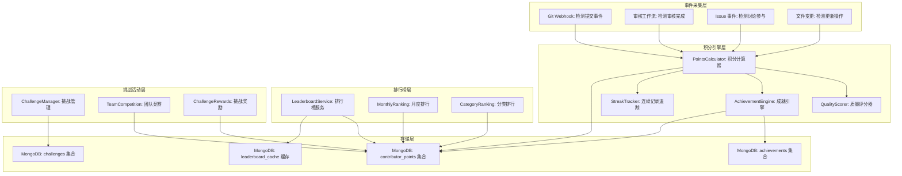
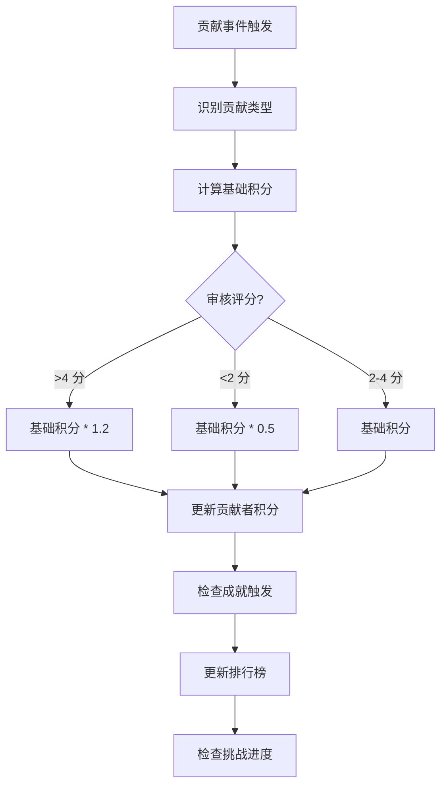

# YK-09-109: 知识竞赛与激励机制 — 贡献者积分、排行榜、成就徽章、月度挑战与团队竞赛

> 需求编号：YK-09-109 · 优先级：P2 · 人天：0.3d · 状态：需求已编写
> 依赖：YK-09-20（贡献者激励机制）

## 背景

### 问题陈述

YiKnowledge 知识库的内容生产依赖贡献者的主动参与。当前缺乏有效的激励机制，贡献者动力不足，内容产出不稳定。当前存在以下问题：

1. **无贡献积分**：贡献者的努力无法被量化，缺乏可见的回报
2. **无排行榜**：无法在贡献者之间形成良性竞争
3. **无成就系统**：贡献者的里程碑和成就无法被认可
4. **无挑战活动**：缺乏定期活动激励持续贡献
5. **无团队竞赛**：缺乏团队级别的竞争和协作激励
6. **贡献不可见**：贡献者的个人贡献在系统中不可见

**核心矛盾**：开源/内部知识库的成功依赖持续的内容贡献，但缺乏游戏化机制来维持贡献者的参与热情。

### 影响范围

| # | 影响 | 严重程度 | 典型场景 |
|---|------|----------|----------|
| 1 | 贡献动力不足 | 高 | 贡献者初期热情高，后期减少 |
| 2 | 贡献不被认可 | 中 | 写了 50 篇文章但无人知晓 |
| 3 | 缺乏竞争激励 | 中 | 贡献者之间无互动和比较 |
| 4 | 内容产出不稳定 | 中 | 月产出波动大 |
| 5 | 团队协作缺失 | 低 | 团队间无协作激励 |

### 挑战

| 挑战 | 说明 |
|------|------|
| 积分规则公平性 | 不同贡献类型（撰写/审核/翻译）需要不同的积分权重 |
| 防作弊 | 需要防止刷分行为（如频繁微小修改获取积分） |
| 排行榜实时性 | 排行榜数据需要准实时更新 |
| 成就徽章设计 | 需要设计有意义、有吸引力的成就系统 |
| 月度挑战管理 | 挑战规则需要可配置，管理员可创建新挑战 |

---

## 一、现状分析

### 1.1 当前激励现状

```
现有功能:
├── YK-09-20 贡献者激励机制（基础）
│   ├── 基础贡献记录
│   └── 无积分/排行榜/成就
├── Git 提交历史
│   ├── 贡献者的提交记录
│   └── 非结构化，无法量化

缺失:
├── 贡献积分系统            # ❌ 不存在
├── 贡献者排行榜            # ❌ 不存在
├── 成就徽章系统            # ❌ 不存在
├── 月度挑战活动            # ❌ 不存在
├── 团队竞赛                # ❌ 不存在
├── 贡献连续记录            # ❌ 不存在
└── 奖励认可                # ❌ 不存在
```

### 1.2 贡献类型与积分

| 贡献类型 | 积分 | 触发条件 | 频率上限 |
|----------|------|----------|----------|
| 撰写新文章 | 50 分 | 原创文章通过审核 | 无上限 |
| 审核文章 | 20 分 | 完成一次审核 | 无上限 |
| 更新现有文章 | 15 分 | 实质性更新（>200 字符修改） | 每日 5 次 |
| 翻译文章 | 40 分 | 翻译完成并通过审核 | 无上限 |
| 修复错误 | 10 分 | 修正事实性错误 | 每日 10 次 |
| 参与讨论 | 5 分 | 在 Issue 中提供有价值的反馈 | 每日 10 次 |

### 1.3 根因矩阵

| 症状 | 根因 | 触发条件 | 频率 |
|------|------|----------|------|
| 贡献动力不足 | 无积分量化 | 长期贡献 | 高 |
| 贡献不被认可 | 无排行榜/成就 | 贡献后无反馈 | 高 |
| 缺乏竞争 | 无对比机制 | 团队内部 | 中 |
| 产出不稳定 | 无定期活动 | 按月统计 | 中 |
| 团队协作差 | 无团队激励 | 跨团队项目 | 低 |

---

## 二、设计决策

### 决策 1：积分计算方式 — 固定积分 vs 质量加权 vs 动态评分

| 选项 | 公平性 | 防作弊 | 实现复杂度 |
|------|--------|--------|-----------|
| 固定积分（按类型） | 中 | 中 | 低 |
| 质量加权（审核评分影响积分） | 高 | 高 | 中 |
| 动态评分（AI 评估质量） | 最高 | 最高 | 高 |

**选择：固定积分基础 + 质量加权奖励。** 基础积分按贡献类型固定（50/20/15/40/10/5），审核评分 > 4 分（满分 5）额外奖励 20%。审核评分 < 2 分减半积分。平衡公平性和防作弊。

### 决策 2：排行榜设计 — 全时总榜 vs 月度榜 vs 两者 + 分类榜

| 选项 | 激励效果 | 公平性 | 维护成本 |
|------|----------|--------|----------|
| 全时总榜 | 长期激励 | 后进者劣势 | 低 |
| 月度榜 | 短期激励 | 新老公平 | 低 |
| 两者 + 分类榜 | 全方位激励 | 最公平 | 中 |

**选择：总榜 + 月度榜 + 分类榜。** 总榜展示顶级贡献者，月度榜给新贡献者追赶机会，分类榜（写作/审核/翻译）展示各领域专长。

### 决策 3：成就徽章 — 自动触发 vs 手动授予 vs 两者

| 选项 | 即时反馈 | 含金量 | 实现复杂度 |
|------|----------|--------|-----------|
| 自动触发（达到条件自动徽章） | 高 | 中 | 低 |
| 手动授予（管理员授予） | 低 | 高 | 低 |
| 两者结合 | 最高 | 最高 | 中 |

**选择：自动触发 + 手动授予。** 基础徽章自动触发（首次贡献、连续贡献 7 天、100 积分里程碑等）。特殊徽章由管理员手动授予（杰出贡献、创新内容等）。

### 决策 4：月度挑战管理 — 固定挑战 vs 可配置挑战 vs 社区投票挑战

| 选项 | 参与度 | 管理成本 | 灵活性 |
|------|--------|----------|--------|
| 固定挑战（每月重复） | 低 | 低 | 低 |
| 可配置挑战（管理员创建） | 中 | 中 | 高 |
| 社区投票挑战 | 最高 | 高 | 最高 |

**选择：可配置挑战（管理员创建）。** 管理员每月创建 1-3 个挑战（如"本月撰写 5 篇 AI 相关文章"、"审核最多者获胜"）。可配置挑战目标、积分奖励、参与条件。平衡灵活性和管理成本。

### 设计决策记录

| 决策 | 选项 A | 选项 B | 选项 C | 选择 | 理由 |
|------|--------|--------|--------|------|------|
| 积分计算 | 固定积分 | 质量加权 | 动态评分 | **固定 + 质量加权** | 公平 + 防作弊 |
| 排行榜 | 总榜 | 月度榜 | 两者 + 分类 | **三者** | 全方位激励 |
| 成就徽章 | 自动触发 | 手动授予 | 两者 | **两者** | 即时 + 含金量 |
| 月度挑战 | 固定挑战 | 可配置挑战 | 社区投票 | **可配置** | 灵活 + 可控 |

---

## 三、目标架构

### 3.1 激励系统架构



### 3.2 积分计算流程



### 3.3 性能指标

| 指标 | 改造前 | 改造后 |
|------|--------|--------|
| 积分计算 | N/A | < 100ms |
| 排行榜查询 | N/A | < 50ms（缓存） |
| 成就检测 | N/A | < 50ms |
| 月度榜重置 | N/A | 每月 1 日自动执行 |

---

## 四、具体改动

### 4.1 积分引擎（YiAi）

```python
# services/knowledge/points_engine.py (新增)

from typing import Dict, List, Optional, Any
from datetime import datetime, date, timedelta
from motor.motor_asyncio import AsyncIOMotorDatabase
from enum import Enum

class ContributionType(str, Enum):
    WRITE_ARTICLE = "write_article"       # 撰写新文章: 50 分
    REVIEW_ARTICLE = "review_article"     # 审核文章: 20 分
    UPDATE_ARTICLE = "update_article"     # 更新文章: 15 分
    TRANSLATE_ARTICLE = "translate_article"  # 翻译文章: 40 分
    FIX_ERROR = "fix_error"              # 修复错误: 10 分
    PARTICIPATE_DISCUSSION = "discuss"    # 参与讨论: 5 分

POINTS_RULES: Dict[ContributionType, Dict] = {
    ContributionType.WRITE_ARTICLE: {"base": 50, "daily_limit": None, "description": "撰写新文章"},
    ContributionType.REVIEW_ARTICLE: {"base": 20, "daily_limit": None, "description": "审核文章"},
    ContributionType.UPDATE_ARTICLE: {"base": 15, "daily_limit": 5, "description": "更新现有文章"},
    ContributionType.TRANSLATE_ARTICLE: {"base": 40, "daily_limit": None, "description": "翻译文章"},
    ContributionType.FIX_ERROR: {"base": 10, "daily_limit": 10, "description": "修复错误"},
    ContributionType.PARTICIPATE_DISCUSSION: {"base": 5, "daily_limit": 10, "description": "参与讨论"},
}

class PointsCalculator:
    """积分计算器"""

    def __init__(self, db: AsyncIOMotorDatabase):
        self.db = db
        self.points = db["contributor_points"]
        self.achievements = db["achievements"]

    async def award_points(
        self,
        contributor: str,
        contribution_type: ContributionType,
        details: Dict[str, Any],
        quality_score: Optional[float] = None,
    ) -> Dict[str, Any]:
        """授予积分"""
        rule = POINTS_RULES[contribution_type]
        base_points = rule["base"]

        # 检查每日限制
        daily_limit = rule.get("daily_limit")
        if daily_limit:
            today_count = await self._count_today_contributions(contributor, contribution_type)
            if today_count >= daily_limit:
                return {
                    "points_awarded": 0,
                    "reason": f"已达每日上限 ({daily_limit} 次)",
                    "base_points": base_points,
                }

        # 质量加权
        multiplier = 1.0
        if quality_score is not None:
            if quality_score > 4:
                multiplier = 1.2
            elif quality_score < 2:
                multiplier = 0.5

        final_points = int(base_points * multiplier)

        # 记录积分
        record = {
            "contributor": contributor,
            "contribution_type": contribution_type,
            "base_points": base_points,
            "multiplier": multiplier,
            "final_points": final_points,
            "quality_score": quality_score,
            "details": details,
            "date": date.today().isoformat(),
            "timestamp": datetime.utcnow(),
        }
        await self.points.insert_one(record)

        return {
            "points_awarded": final_points,
            "base_points": base_points,
            "multiplier": multiplier,
            "contribution_type": contribution_type,
        }

    async def _count_today_contributions(self, contributor: str, ctype: ContributionType) -> int:
        """统计今日同类贡献次数"""
        today = date.today().isoformat()
        return await self.points.count_documents({
            "contributor": contributor,
            "contribution_type": ctype,
            "date": today,
        })

    async def get_contributor_points(
        self, contributor: str, period: str = "all"
    ) -> Dict[str, Any]:
        """获取贡献者积分"""
        match = {"contributor": contributor}

        if period == "month":
            match["date"] = {"$gte": date.today().replace(day=1).isoformat()}
        elif period == "week":
            week_start = (date.today() - timedelta(days=date.today().weekday())).isoformat()
            match["date"] = {"$gte": week_start}

        pipeline = [
            {"$match": match},
            {"$group": {
                "_id": "$contributor",
                "total_points": {"$sum": "$final_points"},
                "contribution_count": {"$sum": 1},
                "by_type": {"$push": {"type": "$contribution_type", "points": "$final_points"}},
            }},
        ]

        results = await self.points.aggregate(pipeline).to_list(length=1)
        if results:
            r = results[0]
            # 按类型分组统计
            type_stats = {}
            for item in r["by_type"]:
                t = item["type"]
                if t not in type_stats:
                    type_stats[t] = {"count": 0, "points": 0}
                type_stats[t]["count"] += 1
                type_stats[t]["points"] += item["points"]

            return {
                "contributor": contributor,
                "total_points": r["total_points"],
                "contribution_count": r["contribution_count"],
                "by_type": type_stats,
                "period": period,
            }
        return {"contributor": contributor, "total_points": 0, "contribution_count": 0, "by_type": {}}

    async def get_leaderboard(
        self, period: str = "all", limit: int = 20
    ) -> List[Dict[str, Any]]:
        """获取排行榜"""
        match = {}
        if period == "month":
            match["date"] = {"$gte": date.today().replace(day=1).isoformat()}

        pipeline = [
            {"$match": match},
            {"$group": {
                "_id": "$contributor",
                "total_points": {"$sum": "$final_points"},
                "contribution_count": {"$sum": 1},
            }},
            {"$sort": {"total_points": -1}},
            {"$limit": limit},
        ]

        results = await self.points.aggregate(pipeline).to_list(length=limit)

        leaderboard = []
        for rank, r in enumerate(results, 1):
            leaderboard.append({
                "rank": rank,
                "contributor": r["_id"],
                "total_points": r["total_points"],
                "contribution_count": r["contribution_count"],
            })

        return leaderboard


class AchievementEngine:
    """成就引擎"""

    ACHIEVEMENTS = [
        {"id": "first_contribution", "name": "初出茅庐", "description": "完成首次贡献", "icon": "🌱", "condition": {"contribution_count": 1}},
        {"id": "ten_articles", "name": "笔耕不辍", "description": "撰写 10 篇文章", "icon": "✍️", "condition": {"write_article_count": 10}},
        {"id": "fifty_articles", "name": "著作等身", "description": "撰写 50 篇文章", "icon": "📚", "condition": {"write_article_count": 50}},
        {"id": "hundred_points", "name": "积分达人", "description": "累计获得 100 积分", "icon": "⭐", "condition": {"total_points": 100}},
        {"id": "thousand_points", "name": "积分王者", "description": "累计获得 1000 积分", "icon": "👑", "condition": {"total_points": 1000}},
        {"id": "streak_7_days", "name": "周不懈", "description": "连续贡献 7 天", "icon": "🔥", "condition": {"streak_days": 7}},
        {"id": "streak_30_days", "name": "月度之星", "description": "连续贡献 30 天", "icon": "🌟", "condition": {"streak_days": 30}},
        {"id": "reviewer_20", "name": "火眼金睛", "description": "完成 20 次审核", "icon": "🔍", "condition": {"review_article_count": 20}},
        {"id": "translator_10", "name": "翻译官", "description": "翻译 10 篇文章", "icon": "🌐", "condition": {"translate_article_count": 10}},
    ]

    def __init__(self, db: AsyncIOMotorDatabase):
        self.db = db
        self.achievements_col = db["achievements"]

    async def check_achievements(self, contributor: str) -> List[Dict]:
        """检查并授予新成就"""
        stats = await self._get_contributor_stats(contributor)
        already_earned = await self._get_earned_achievements(contributor)

        new_achievements = []
        for ach in self.ACHIEVEMENTS:
            if ach["id"] in already_earned:
                continue
            if self._check_condition(stats, ach["condition"]):
                await self._award_achievement(contributor, ach)
                new_achievements.append(ach)

        return new_achievements

    async def _get_contributor_stats(self, contributor: str) -> Dict:
        """获取贡献者统计数据"""
        pipeline = [
            {"$match": {"contributor": contributor}},
            {"$group": {
                "_id": None,
                "total_points": {"$sum": "$final_points"},
                "contribution_count": {"$sum": 1},
                "by_type": {"$push": "$contribution_type"},
            }},
        ]
        results = await self.db["contributor_points"].aggregate(pipeline).to_list(length=1)
        if not results:
            return {"total_points": 0, "contribution_count": 0}

        r = results[0]
        type_counts = {}
        for t in r["by_type"]:
            type_counts[t] = type_counts.get(t, 0) + 1

        return {
            "total_points": r["total_points"],
            "contribution_count": r["contribution_count"],
            "write_article_count": type_counts.get("write_article", 0),
            "review_article_count": type_counts.get("review_article", 0),
            "translate_article_count": type_counts.get("translate_article", 0),
            "streak_days": await self._calculate_streak(contributor),
        }

    async def _calculate_streak(self, contributor: str) -> int:
        """计算连续贡献天数"""
        pipeline = [
            {"$match": {"contributor": contributor}},
            {"$group": {"_id": "$date"}},
            {"$sort": {"_id": -1}},
        ]
        dates = await self.db["contributor_points"].aggregate(pipeline).to_list(length=365)
        if not dates:
            return 0

        streak = 1
        current = date.fromisoformat(dates[0]["_id"])
        for d in dates[1:]:
            expected = current - timedelta(days=1)
            actual = date.fromisoformat(d["_id"])
            if actual == expected:
                streak += 1
                current = actual
            else:
                break

        return streak

    def _check_condition(self, stats: Dict, condition: Dict) -> bool:
        """检查是否满足成就条件"""
        for key, threshold in condition.items():
            if stats.get(key, 0) < threshold:
                return False
        return True

    async def _get_earned_achievements(self, contributor: str) -> set:
        """获取已获得的成就"""
        cursor = self.achievements_col.find({"contributor": contributor})
        earned = await cursor.to_list(length=100)
        return {a["achievement_id"] for a in earned}

    async def _award_achievement(self, contributor: str, achievement: Dict):
        """授予成就"""
        await self.achievements_col.insert_one({
            "contributor": contributor,
            "achievement_id": achievement["id"],
            "name": achievement["name"],
            "description": achievement["description"],
            "icon": achievement["icon"],
            "awarded_at": datetime.utcnow(),
        })

    async def get_contributor_achievements(self, contributor: str) -> List[Dict]:
        """获取贡献者所有成就"""
        cursor = self.achievements_col.find({"contributor": contributor}).sort("awarded_at", -1)
        return await cursor.to_list(length=100)
```

### 4.2 排行榜与挑战管理

```python
# services/knowledge/challenge_service.py (新增)

from typing import Dict, List, Any, Optional
from datetime import datetime, date
from motor.motor_asyncio import AsyncIOMotorDatabase

class ChallengeManager:
    """月度挑战管理器"""

    def __init__(self, db: AsyncIOMotorDatabase):
        self.db = db
        self.challenges = db["challenges"]

    async def create_challenge(self, challenge: Dict) -> str:
        """创建挑战"""
        challenge["created_at"] = datetime.utcnow()
        challenge["status"] = "active"
        result = await self.challenges.insert_one(challenge)
        return str(result.inserted_id)

    async def get_active_challenges(self, month: Optional[str] = None) -> List[Dict]:
        """获取活跃挑战"""
        if not month:
            month = date.today().strftime("%Y-%m")
        cursor = self.challenges.find({
            "month": month,
            "status": "active",
        }).sort("created_at", -1)
        return await cursor.to_list(length=10)

    async def check_challenge_progress(self, contributor: str) -> List[Dict]:
        """检查贡献者在活跃挑战中的进度"""
        current_month = date.today().strftime("%Y-%m")
        active = await self.get_active_challenges(current_month)

        progress = []
        for challenge in active:
            stats = await self._get_challenge_stats(contributor, challenge)
            target = challenge.get("target", 1)
            pct = min(100, int(stats.get("progress", 0) / target * 100))
            progress.append({
                "challenge_id": challenge["_id"],
                "challenge_name": challenge["name"],
                "target": target,
                "current": stats.get("progress", 0),
                "percentage": pct,
                "reward": challenge.get("reward_points", 0),
            })

        return progress

    async def _get_challenge_stats(self, contributor: str, challenge: Dict) -> Dict:
        """获取挑战相关统计"""
        ctype = challenge.get("contribution_type")
        month = challenge.get("month")

        if ctype:
            count = await self.db["contributor_points"].count_documents({
                "contributor": contributor,
                "contribution_type": ctype,
                "date": {"$regex": f"^{month}"},
            })
            return {"progress": count}
        else:
            pipeline = [
                {"$match": {"contributor": contributor, "date": {"$regex": f"^{month}"}}},
                {"$group": {"_id": None, "total": {"$sum": "$final_points"}}},
            ]
            results = await self.db["contributor_points"].aggregate(pipeline).to_list(length=1)
            return {"progress": results[0]["total"] if results else 0}

    async def create_default_monthly_challenges(self) -> List[str]:
        """创建默认月度挑战"""
        month = date.today().strftime("%Y-%m")
        defaults = [
            {
                "name": f"{month} 写作达人",
                "description": f"本月撰写 5 篇以上新文章",
                "month": month,
                "contribution_type": "write_article",
                "target": 5,
                "reward_points": 200,
                "status": "active",
                "created_at": datetime.utcnow(),
            },
            {
                "name": f"{month} 审核之星",
                "description": f"本月完成 10 次以上审核",
                "month": month,
                "contribution_type": "review_article",
                "target": 10,
                "reward_points": 150,
                "status": "active",
                "created_at": datetime.utcnow(),
            },
            {
                "name": f"{month} 全能贡献者",
                "description": f"本月至少参与 3 种不同类型的贡献",
                "month": month,
                "contribution_type": None,
                "target": 3,
                "reward_points": 300,
                "status": "active",
                "created_at": datetime.utcnow(),
            },
        ]

        ids = []
        for challenge in defaults:
            rid = await self.create_challenge(challenge)
            ids.append(rid)

        return ids
```

### 4.3 文件变更清单

| 文件 | 项目 | 操作 | 说明 |
|------|------|------|------|
| `services/knowledge/points_engine.py` | YiAi | 新增 | 积分计算器和成就引擎 |
| `services/knowledge/challenge_service.py` | YiAi | 新增 | 月度挑战管理 |
| `services/knowledge/leaderboard_rpc_handler.py` | YiAi | 新增 | RPC 路由处理器 |
| `src/views/knowledge/Leaderboard.vue` | YiVad | 新增 | 排行榜前端页面 |
| `src/views/knowledge/Achievements.vue` | YiVad | 新增 | 成就徽章展示页面 |
| `src/views/knowledge/Challenges.vue` | YiVad | 新增 | 月度挑战页面 |
| `src/router/routes.ts` | YiVad | 修改 | 添加激励相关路由 |
| `main.py` | YiAi | 修改 | 注册激励模块 + 月度挑战定时创建 |

---

## 五、实施步骤

| 步骤 | 操作 | 路径 | 验证 | 人天 |
|------|------|------|------|------|
| 1 | 定义积分规则和贡献类型 | `points_engine.py` | 6 种贡献类型的积分规则完整 | 0.02 |
| 2 | 实现积分计算器 | `points_engine.py` | 积分授予/质量加权/每日限制 | 0.04 |
| 3 | 实现贡献者统计查询 | `points_engine.py` | 个人总积分/分类统计正确 | 0.02 |
| 4 | 实现排行榜服务 | `points_engine.py` | 总榜/月榜/分类榜排序正确 | 0.03 |
| 5 | 实现成就引擎 | `points_engine.py` | 9 种成就条件检测和授予 | 0.05 |
| 6 | 实现连续贡献追踪 | `points_engine.py` | 连续天数计算正确 | 0.02 |
| 7 | 实现月度挑战管理 | `challenge_service.py` | 挑战创建/进度查询/默认挑战 | 0.04 |
| 8 | 实现排行榜前端页面 | `Leaderboard.vue` | 三个榜单标签页 | 0.03 |
| 9 | 实现成就徽章前端 | `Achievements.vue` | 徽章网格展示 | 0.02 |
| 10 | 实现月度挑战前端 | `Challenges.vue` | 挑战进度条 | 0.03 |

**总人天：0.3d**

---

## 六、测试规格

### 场景 1：积分授予

**GIVEN** 贡献者"陈铭"撰写了一篇新文章，审核评分 4.5
**WHEN** `award_points("陈铭", WRITE_ARTICLE, {...}, quality_score=4.5)`
**THEN** 基础积分 50 * 1.2 = 60 分
**AND** 积分记录应写入 contributor_points 集合
**AND** 记录应包含 contributor、contribution_type、final_points、date

### 场景 2：每日限制

**GIVEN** 贡献者"陈铭"今日已修复 10 个错误（达上限）
**WHEN** 再次 `award_points("陈铭", FIX_ERROR, {...})`
**THEN** 积分授予应为 0，理由为"已达每日上限"
**AND** 不应写入新记录

### 场景 3：排行榜查询

**GIVEN** 本月有 5 位贡献者的积分分别为 300/200/150/100/50
**WHEN** `get_leaderboard(period="month", limit=3)`
**THEN** 返回前 3 名，rank 分别为 1/2/3
**AND** 第 1 名 total_points = 300，第 3 名 total_points = 150

### 场景 4：成就触发

**GIVEN** 贡献者"陈铭"完成了第 10 篇文章
**WHEN** `check_achievements("陈铭")`
**THEN** 应获得"笔耕不辍"成就（10 篇文章）
**AND** 成就记录应写入 achievements 集合
**AND** 返回的新成就列表应包含该成就

### 场景 5：连续贡献追踪

**GIVEN** 贡献者"陈铭"连续 5 天有贡献，但昨天没有
**WHEN** `_calculate_streak("陈铭")`
**THEN** 连续天数应为今天 + 之前连续的 4 天（如果今天有贡献）或 0（如果今天没有）

### 场景 6：月度挑战进度

**GIVEN** 月度挑战"写作达人": 本月撰写 5 篇文章，当前已撰写 3 篇
**WHEN** `check_challenge_progress("陈铭")`
**THEN** 进度应为 3/5 = 60%
**AND** 奖励积分 200 分在完成时授予

---

## 七、风险与缓解

| 风险 | 概率 | 影响 | 缓解措施 |
|------|------|------|----------|
| 刷分行为 | 中 | 中 | 每日限制 + 质量评分 + 最小修改检测 |
| 排行榜数据不一致 | 低 | 中 | 使用 MongoDB 原子操作 `$inc`，定期校验 |
| 成就冷启动 | 中 | 低 | 内置 9 个基础成就覆盖所有贡献类型 |
| 月度挑战无人参与 | 中 | 低 | 挑战目标设置为可达（如 5 篇/月），降低门槛 |

---

## 八、回滚策略

| 场景 | 回滚操作 | 影响 |
|------|----------|------|
| 积分系统异常 | 暂停积分授予，修复后从 Git 历史重算 | 期间积分不增长 |
| 排行榜缓存不一致 | 清除缓存，从 contributor_points 重算 | 排行榜暂不可用 |
| 成就授予错误 | 撤销错误成就，修复条件后重新检查 | 部分成就需重新触发 |

---

## 九、设计决策记录

### D-01：积分计算方式

- **问题**：积分如何计算
- **选项**：固定积分、质量加权、动态评分
- **选择**：固定积分基础 + 质量加权
- **理由**：基础积分清晰透明，质量加权激励高质量贡献

### D-02：排行榜设计

- **问题**：排行榜涵盖哪些维度
- **选项**：总榜、月度榜、两者 + 分类榜
- **选择**：总榜 + 月度榜 + 分类榜
- **理由**：覆盖长期激励、短期追赶、领域专长

### D-03：成就徽章授予

- **问题**：成就如何授予
- **选项**：自动触发、手动授予、两者
- **选择**：两者
- **理由**：自动徽章即时反馈，手动徽章有含金量

### D-04：月度挑战管理

- **问题**：月度挑战如何创建和管理
- **选项**：固定挑战、可配置挑战、社区投票
- **选择**：可配置挑战 + 默认自动创建
- **理由**：灵活可控，管理员可定制，默认降低门槛

---

## 十、可观测性

### 指标

| 指标 | 类型 | 说明 |
|------|------|------|
| `yiknowledge.points.awarded_total` | Counter | 总积分授予量 |
| `yiknowledge.points.by_type` | Counter | 各类型积分授予量 |
| `yiknowledge.achievements.awarded` | Counter | 成就授予次数 |
| `yiknowledge.leaderboard.active_contributors` | Gauge | 活跃贡献者数 |
| `yiknowledge.challenges.participation` | Gauge | 挑战参与人数 |
| `yiknowledge.challenges.completion_rate` | Gauge | 挑战完成率 |

### 告警

| 告警 | 条件 | 级别 |
|------|------|------|
| 无活跃贡献者 | 连续 3 天无任何积分授予 | WARNING |
| 积分授予异常 | 单日积分授予 > 正常值 3 倍 | WARNING |
| 排行榜缓存过期 | 缓存未更新 > 1 小时 | WARNING |

---

## 十一、代码审查检查清单

- [ ] 6 种贡献类型的积分规则定义完整，权重合理
- [ ] 每日限制检查正确，防止刷分
- [ ] 质量加权逻辑正确，4 分以上奖励 20%，2 分以下减半
- [ ] 排行榜聚合管道使用正确的 `$group` 和 `$sort`
- [ ] 成就条件检查使用贡献者全局统计，而非单次操作
- [ ] 连续贡献天数计算正确处理日期不连续的情况
- [ ] 月度挑战使用日期前缀匹配（`$regex: ^{month}`）
- [ ] 默认月度挑战在每月 1 日自动创建
- [ ] 积分记录包含完整的时间戳和贡献类型
- [ ] 排行榜缓存有 TTL，定期刷新
- [ ] 前端排行榜/成就/挑战页面三标签页切换流畅

---

## 回归问题预测

| # | 预测问题 | 原因 | 验证方法 |
|---|---------|------|---------|
| 1 | 积分计算中的质量评分来自审核工作流，但审核人可能给所有文章打 5 分，质量加权失去意义 | 审核评分无校准，审核人倾向于给高分，质量加权形同虚设 | 引入审核评分分布统计，如果某审核人的评分标准差 < 0.5，降低其评分的质量加权系数 |
| 2 | 连续贡献天数的计算依赖于 contributor_points 集合的 `date` 字段，但如果贡献者跨时区，同一次操作可能被记录为不同日期 | `date` 使用服务器 UTC 时间，贡献者在 UTC+8 时区，深夜操作可能跨天 | 统一使用 UTC 日期，在计算 streak 时使用 UTC 日期比较，避免时区混淆 |
| 3 | 月度排行榜在月初 1 日重置时，`date >= 本月1日` 的查询结果为空，排行榜显示空白或所有人为 0 分 | 月初第一天还没有任何贡献记录，排行榜为空 | 排行榜在无数据时显示"本月暂无贡献，成为第一个贡献者吧"的鼓励文案；显示上月排行榜作为参考 |
| 4 | 成就"连续贡献 7 天"在用户连续贡献第 7 天时触发，但如果用户在第 7 天有 2 次贡献操作（如写文章 + 审核），成就被重复检查，可能重复授予 | `award_points` 每次积分授予后都调用 `check_achievements`，同一成就的检查是幂等的但多次授予通知 | 在 `_award_achievement` 中先检查 `already_earned`，已获得的成就静默跳过；通知仅在成就首次获得时发送 |
| 5 | 月度挑战的进度查询使用 `$regex: ^{month}` 匹配日期字段，但如果日期格式为 `YYYY-MM-DD`，`$regex` 匹配全表扫描效率低 | 正则匹配无法使用索引，contributor_points 集合数据量大时查询变慢 | 将 `date` 字段拆分为 `year_month` 字段并建立索引，挑战进度查询使用精确匹配替代正则 |
| 6 | 默认月度挑战在每月 1 日通过 apscheduler 自动创建，但如果系统在 1 日凌晨重启或定时任务执行失败，挑战未创建 | 定时任务依赖 apscheduler 正常运行，系统重启或任务异常时挑战缺失 | 在挑战查询时检查当月是否有挑战，没有则自动创建；定时任务仅作为兜底，实际的"懒创建"逻辑在查询时触发 |

---

## 性能分析

### 各操作耗时

| 阶段 | 预估耗时 | 说明 |
|------|----------|------|
| 积分授予 | < 50ms | 单条 insert + 每日计数查询 |
| 排行榜查询 | < 100ms | 聚合管道 |
| 成就检查 | < 100ms | 统计查询 + 成就遍历 |
| 连续天数计算 | < 100ms | 聚合查询最近 365 天 |
| 挑战进度查询 | < 50ms | 简单计数查询 |

### 数据库影响

| 集合 | 预估增长 | 说明 |
|------|----------|------|
| contributor_points | ~500 条/月 | 按 10 位活跃贡献者估算 |
| achievements | ~50 条/月 | 成就授予频率低 |
| challenges | ~3 条/月 | 每月 3 个挑战 |

### 对系统的影响

| 因素 | 影响 | 说明 |
|------|------|------|
| 积分计算 | 每次贡献操作 | 异步/同步均可，轻量 |
| 排行榜 | 查询时计算 | 可缓存 1 小时 |
| 月度挑战创建 | 每月 1 次 | 自动化 |