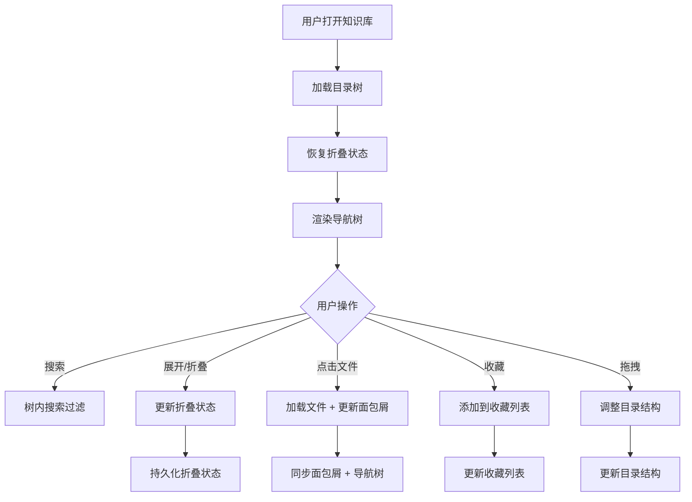
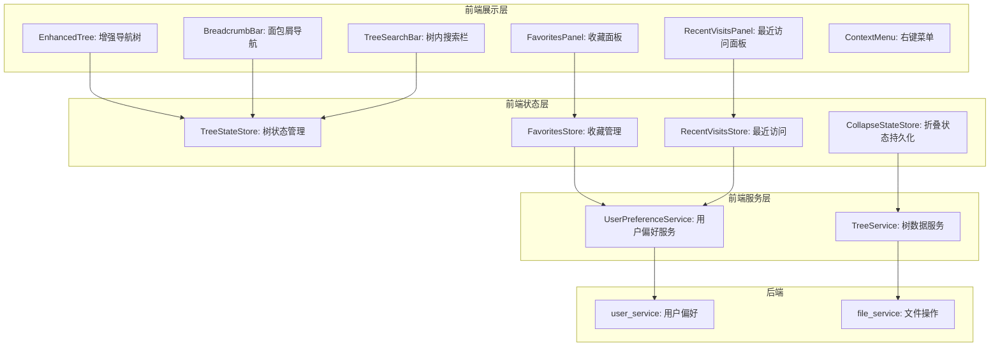
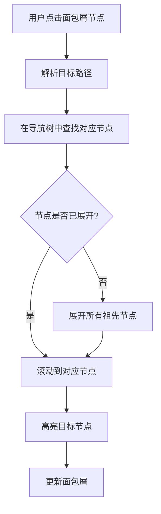

# YK-09-112: 内容导航树优化 — 增强导航树、可折叠持久化、面包屑同步与搜索收藏

> 需求编号：YK-09-112 · 优先级：P2 · 人天：0.3d · 状态：需求已编写
> 依赖：YK-09-43（目录结构优化）、YK-09-31（面包屑与导航系统）

## 背景

### 问题陈述

YiKnowledge 知识库当前有 800+ 文件，按 3 级目录结构组织。YiVad 的知识库页面使用树形导航展示文件结构，但当前导航树功能较为基础，存在以下问题：

1. **折叠状态不持久化**：用户展开/折叠的节点状态在页面刷新后丢失，每次都需要重新展开
2. **面包屑与导航不同步**：面包屑导航和树形导航是独立的，点击面包屑不会展开对应的树节点
3. **无法在树内搜索**：文件多时，用户需要逐个展开目录查找目标文件，效率低
4. **缺少收藏功能**：用户无法将常用文档标记为收藏，快速访问
5. **无最近访问记录**：用户无法快速回到之前浏览过的文档
6. **导航树不可拖拽排序**：授权用户无法通过拖拽调整目录结构

**核心矛盾**：导航树是知识库浏览的核心入口，但当前功能单一，大目录下查找效率低，个性化体验差。

### 影响范围

| # | 影响 | 严重程度 | 典型场景 |
|---|------|----------|----------|
| 1 | 折叠状态丢失 | 中 | 展开 10 个节点后刷新页面，需要重新展开 |
| 2 | 面包屑不同步 | 中 | 点击面包屑回到上级，但导航树仍停留在之前位置 |
| 3 | 查找文件低效 | 高 | 在 800 个文件中找到一个特定文件，需要展开多个目录 |
| 4 | 缺少收藏 | 中 | 有 5 个常用文档，每次都需要在目录中查找 |
| 5 | 无最近访问 | 低 | 关闭页面后想回到之前看的文档，需要重新查找 |
| 6 | 目录调整不便 | 低 | 策展人需要调整目录结构，只能通过 Git 操作 |

### 挑战

| 挑战 | 说明 |
|------|------|
| 折叠状态存储 | 需要持久化用户的折叠偏好，但不同用户偏好不同 |
| 树内搜索性能 | 800+ 节点搜索需要高效的前端过滤 |
| 面包屑同步 | 需要双向同步面包屑和导航树的状态 |
| 拖拽权限 | 需要区分授权用户和普通用户 |
| 大目录渲染 | 单目录下文件多时，需要优化渲染性能 |

---

## 一、现状分析

### 1.1 当前导航树现状

```
现有导航树:
├── 基础树形展示
│   ├── 递归渲染目录树
│   └── 支持展开/折叠
├── 面包屑导航
│   ├── 显示当前路径
│   └── 与导航树独立
├── 文件点击
│   ├── 加载文件内容
│   └── 无状态记录

缺失:
├── 折叠状态持久化        # ❌ 不存在
├── 面包屑同步            # ❌ 不存在
├── 树内搜索              # ❌ 不存在
├── 收藏/书签             # ❌ 不存在
├── 最近访问              # ❌ 不存在
├── 拖拽排序              # ❌ 不存在
└── 节点右键菜单          # ❌ 不存在
```

### 1.2 导航树交互流程



### 1.3 根因矩阵

| 症状 | 根因 | 触发条件 | 频率 |
|------|------|----------|------|
| 折叠状态丢失 | 无持久化存储 | 页面刷新时 | 高 |
| 面包屑不同步 | 面包屑和导航树独立 | 点击面包屑时 | 中 |
| 文件查找低效 | 无树内搜索 | 查找文件时 | 高 |
| 常用文档难找 | 无收藏功能 | 日常使用时 | 中 |
| 返回之前文档难 | 无最近访问 | 关闭页面后 | 中 |
| 目录调整不便 | 无拖拽功能 | 策展人调整时 | 低 |

---

## 二、设计决策

### 决策 1：折叠状态持久化 — LocalStorage vs 后端 vs 混合

| 选项 | 跨设备 | 实时性 | 实现复杂度 |
|------|--------|--------|-----------|
| LocalStorage（前端） | 否 | 高 | 低 |
| 后端（用户偏好） | 是 | 中 | 中 |
| 混合（默认后端 + LocalStorage 缓存） | 是 | 高 | 中 |

**选择：LocalStorage。** 折叠状态是纯前端偏好，不需要跨设备同步。LocalStorage 读写速度快，实现简单。折叠状态数据量小（每个节点一个布尔值），适合 LocalStorage。

### 决策 2：树内搜索 — 前端过滤 vs 后端查询 vs 混合

| 选项 | 速度 | 数据一致性 | 实现复杂度 |
|------|------|-----------|-----------|
| 前端过滤（已加载的树数据） | 极快 | 高 | 低 |
| 后端查询（API 搜索） | 中 | 高 | 中 |
| 混合（前端过滤 + 后端补充） | 快 | 高 | 中 |

**选择：前端过滤。** 树数据在页面加载时已全部获取（800+ 节点），前端过滤无网络延迟，响应极快。搜索支持文件名和路径匹配，实时高亮匹配结果。

### 决策 3：收藏存储 — LocalStorage vs 后端 vs 混合

| 选项 | 跨设备 | 数据量 | 实现复杂度 |
|------|--------|--------|-----------|
| LocalStorage | 否 | 小 | 低 |
| 后端（用户数据） | 是 | 小 | 中 |
| 混合 | 是 | 小 | 中 |

**选择：后端（用户数据）。** 收藏是有价值的用户数据，需要跨设备同步。存储在用户文档的 `favorites` 字段中，通过 RPC 读写。

### 决策 4：拖拽实现 — 原生 HTML5 drag vs 第三方库 vs 不实现

| 选项 | 用户体验 | 实现复杂度 | 兼容性 |
|------|----------|-----------|--------|
| 原生 HTML5 Drag and Drop | 中 | 中 | 高 |
| 第三方库（如 sortablejs） | 高 | 低 | 高 |
| 不实现（仅提供右键菜单） | 低 | 低 | 高 |

**选择：第三方库（sortablejs）。** 拖拽排序是常见需求，使用成熟的第三方库减少开发时间。仅授权用户（策展人/管理员）可拖拽。

### 设计决策记录

| 决策 | 选项 A | 选项 B | 选项 C | 选择 | 理由 |
|------|--------|--------|--------|------|------|
| 折叠状态持久化 | LocalStorage | 后端 | 混合 | **LocalStorage** | 纯前端偏好，无需跨设备 |
| 树内搜索 | 前端过滤 | 后端查询 | 混合 | **前端过滤** | 数据已加载，极快响应 |
| 收藏存储 | LocalStorage | 后端 | 混合 | **后端** | 跨设备同步 |
| 拖拽实现 | 原生 HTML5 | 第三方库 | 不实现 | **第三方库** | 减少开发时间 |

---

## 三、目标架构

### 3.1 增强导航树架构



### 3.2 面包屑与导航树同步



### 3.3 导航树优化指标

| 指标 | 改造前 | 改造后 |
|------|--------|--------|
| 折叠状态 | 刷新丢失 | 持久化保存 |
| 面包屑同步 | 独立 | 双向同步 |
| 文件查找 | 手动展开目录 | 树内搜索 1 秒内 |
| 常用文档访问 | 每次查找 | 收藏面板一键访问 |
| 目录调整 | Git 操作 | 拖拽排序 |

---

## 四、具体改动

### 4.1 增强导航树核心服务

```typescript
// src/services/tree-service.ts (新增)

interface TreeNode {
  id: string;
  label: string;
  path: string;
  type: 'directory' | 'file';
  children?: TreeNode[];
  isFavorite?: boolean;
  lastVisited?: string;
}

interface CollapseState {
  [nodeId: string]: boolean;  // true = expanded, false = collapsed
}

interface UserFavorites {
  filePaths: string[];
  updatedAt: string;
}

class TreeService {
  private collapseState: CollapseState = {};
  private favorites: UserFavorites = { filePaths: [], updatedAt: '' };
  private recentVisits: string[] = [];
  private readonly MAX_RECENT = 20;

  constructor() {
    this.loadCollapseState();
    this.loadRecentVisits();
  }

  // === 折叠状态管理 ===

  private getCollapseKey(): string {
    return 'yiknowledge_tree_collapse_state';
  }

  loadCollapseState(): void {
    try {
      const stored = localStorage.getItem(this.getCollapseKey());
      if (stored) {
        this.collapseState = JSON.parse(stored);
      }
    } catch (e) {
      this.collapseState = {};
    }
  }

  saveCollapseState(): void {
    localStorage.setItem(this.getCollapseKey(), JSON.stringify(this.collapseState));
  }

  isExpanded(nodeId: string): boolean {
    return this.collapseState[nodeId] !== false; // 默认展开
  }

  toggleNode(nodeId: string): void {
    this.collapseState[nodeId] = !this.isExpanded(nodeId);
    this.saveCollapseState();
  }

  expandToPath(path: string): string[] {
    /** 展开路径上的所有祖先节点，返回需要展开的节点 ID 列表 */
    const parts = path.split('/').filter(Boolean);
    const expandedIds: string[] = [];
    let currentPath = '';

    for (const part of parts) {
      currentPath = currentPath ? `${currentPath}/${part}` : part;
      const nodeId = `node_${currentPath.replace(/\//g, '_')}`;
      if (!this.isExpanded(nodeId)) {
        this.collapseState[nodeId] = true;
        expandedIds.push(nodeId);
      }
    }

    if (expandedIds.length > 0) {
      this.saveCollapseState();
    }
    return expandedIds;
  }

  collapseAll(): void {
    this.collapseState = {};
    this.saveCollapseState();
  }

  expandAll(): void {
    this.collapseState = {};
    this.saveCollapseState();
  }

  // === 树内搜索 ===

  searchTree(tree: TreeNode[], query: string): TreeNode[] {
    /** 在树中搜索匹配的节点，返回匹配节点及其祖先 */
    if (!query.trim()) return tree;

    const lowerQuery = query.toLowerCase();
    const result: TreeNode[] = [];

    const searchNode = (node: TreeNode): TreeNode | null => {
      const matches = node.label.toLowerCase().includes(lowerQuery) ||
        node.path.toLowerCase().includes(lowerQuery);

      if (node.children) {
        const matchedChildren = node.children
          .map(child => searchNode(child))
          .filter((c): c is TreeNode => c !== null);

        if (matchedChildren.length > 0 || matches) {
          return { ...node, children: matchedChildren };
        }
      }

      return matches ? { ...node, children: node.children ? [] : undefined } : null;
    };

    for (const node of tree) {
      const matched = searchNode(node);
      if (matched) result.push(matched);
    }

    return result;
  }

  highlightMatches(tree: TreeNode[], query: string): TreeNode[] {
    /** 高亮匹配的节点 */
    if (!query.trim()) return tree;
    const lowerQuery = query.toLowerCase();
    return tree.map(node => ({
      ...node,
      label: node.label.toLowerCase().includes(lowerQuery)
        ? `<mark>${node.label}</mark>`
        : node.label,
      children: node.children ? this.highlightMatches(node.children, query) : undefined,
    }));
  }

  // === 收藏管理 ===

  async loadFavorites(): Promise<void> {
    // 通过 RPC 从后端加载收藏
    const response = await fetch('/api/user/favorites');
    const data = await response.json();
    this.favorites = data;
  }

  async addFavorite(filePath: string): Promise<void> {
    if (!this.favorites.filePaths.includes(filePath)) {
      this.favorites.filePaths.push(filePath);
      await this.saveFavorites();
    }
  }

  async removeFavorite(filePath: string): Promise<void> {
    this.favorites.filePaths = this.favorites.filePaths.filter(p => p !== filePath);
    await this.saveFavorites();
  }

  isFavorite(filePath: string): boolean {
    return this.favorites.filePaths.includes(filePath);
  }

  private async saveFavorites(): Promise<void> {
    this.favorites.updatedAt = new Date().toISOString();
    await fetch('/api/user/favorites', {
      method: 'POST',
      headers: { 'Content-Type': 'application/json' },
      body: JSON.stringify(this.favorites),
    });
  }

  getFavorites(): string[] {
    return this.favorites.filePaths;
  }

  // === 最近访问管理 ===

  loadRecentVisits(): void {
    try {
      const stored = localStorage.getItem('yiknowledge_recent_visits');
      this.recentVisits = stored ? JSON.parse(stored) : [];
    } catch (e) {
      this.recentVisits = [];
    }
  }

  addRecentVisit(filePath: string): void {
    this.recentVisits = [
      filePath,
      ...this.recentVisits.filter(p => p !== filePath),
    ].slice(0, this.MAX_RECENT);
    localStorage.setItem('yiknowledge_recent_visits', JSON.stringify(this.recentVisits));
  }

  getRecentVisits(): string[] {
    return this.recentVisits;
  }
}

// === 面包屑与导航树同步 ===

class BreadcrumbSync {
  static syncToTree(breadcrumbPath: string, treeService: TreeService): void {
    /** 面包屑点击 → 展开导航树到对应节点 */
    treeService.expandToPath(breadcrumbPath);
  }

  static syncToBreadcrumb(treePath: string): string[] {
    /** 导航树节点点击 → 生成面包屑路径 */
    const parts = treePath.split('/').filter(Boolean);
    const breadcrumbs: string[] = [];
    let currentPath = '';

    for (const part of parts) {
      currentPath = currentPath ? `${currentPath}/${part}` : part;
      breadcrumbs.push(currentPath);
    }

    return breadcrumbs;
  }
}

export const treeService = new TreeService();
export { BreadcrumbSync };
```

### 4.2 增强导航树组件

```vue
<!-- src/views/knowledge/components/EnhancedTree.vue (新增) -->

<script setup lang="ts">
import { ref, computed, watch } from 'vue';
import { treeService, BreadcrumbSync } from '@/services/tree-service';
import type { TreeNode } from '@/services/tree-service';

const props = defineProps<{
  treeData: TreeNode[];
  currentPath: string;
}>();

const emit = defineEmits(['node-click', 'node-drag', 'breadcrumb-change']);

const searchQuery = ref('');
const showFavorites = ref(false);
const showRecent = ref(false);
const contextMenu = ref({ visible: false, x: 0, y: 0, node: null as TreeNode | null });

const isAuthorized = ref(false); // 从权限系统获取

const filteredTree = computed(() => {
  let tree = treeService.searchTree(props.treeData, searchQuery.value);
  if (searchQuery.value) {
    tree = treeService.highlightMatches(tree, searchQuery.value);
  }
  return tree;
});

const favorites = computed(() => treeService.getFavorites());
const recentVisits = computed(() => treeService.getRecentVisits());

function handleNodeClick(node: TreeNode) {
  if (node.type === 'file') {
    treeService.addRecentVisit(node.path);
    emit('node-click', node);
  } else {
    treeService.toggleNode(node.id);
  }
}

function handleBreadcrumbClick(breadcrumbPath: string) {
  BreadcrumbSync.syncToTree(breadcrumbPath, treeService);
  emit('breadcrumb-change', breadcrumbPath);
}

function handleContextMenu(event: MouseEvent, node: TreeNode) {
  event.preventDefault();
  contextMenu.value = {
    visible: true,
    x: event.clientX,
    y: event.clientY,
    node,
  };
}

function closeContextMenu() {
  contextMenu.value.visible = false;
}

function toggleFavorite(node: TreeNode) {
  if (treeService.isFavorite(node.path)) {
    treeService.removeFavorite(node.path);
  } else {
    treeService.addFavorite(node.path);
  }
}

function collapseAll() {
  treeService.collapseAll();
}

// 面包屑同步：当前路径变化时，展开导航树
watch(() => props.currentPath, (newPath) => {
  if (newPath) {
    BreadcrumbSync.syncToTree(newPath, treeService);
  }
});
</script>

<template>
  <div class="enhanced-tree">
    <!-- 搜索栏 -->
    <div class="et-search">
      <el-input
        v-model="searchQuery"
        placeholder="搜索文件..."
        prefix-icon="Search"
        clearable
        size="small"
      />
    </div>

    <!-- 快捷面板 -->
    <div class="et-quick-panel">
      <el-button size="small" @click="showFavorites = !showFavorites">
        收藏 ({{ favorites.length }})
      </el-button>
      <el-button size="small" @click="showRecent = !showRecent">
        最近访问 ({{ recentVisits.length }})
      </el-button>
      <el-button size="small" @click="collapseAll">全部折叠</el-button>
    </div>

    <!-- 收藏面板 -->
    <div v-if="showFavorites" class="et-favorites">
      <div v-for="path in favorites" :key="path" class="favorite-item"
        @click="emit('node-click', { path, type: 'file' } as TreeNode)">
        <span>{{ path.split('/').pop() }}</span>
        <span class="path-hint">{{ path }}</span>
      </div>
      <div v-if="favorites.length === 0" class="empty-hint">暂无收藏</div>
    </div>

    <!-- 最近访问面板 -->
    <div v-if="showRecent" class="et-recent">
      <div v-for="path in recentVisits" :key="path" class="recent-item"
        @click="emit('node-click', { path, type: 'file' } as TreeNode)">
        <span>{{ path.split('/').pop() }}</span>
        <span class="path-hint">{{ path }}</span>
      </div>
      <div v-if="recentVisits.length === 0" class="empty-hint">暂无最近访问</div>
    </div>

    <!-- 树形导航 -->
    <div class="et-tree-container">
      <el-tree
        :data="filteredTree"
        :props="{ children: 'children', label: 'label' }"
        node-key="id"
        :default-expanded-keys="Object.keys(treeService['collapseState']).filter(k => treeService.isExpanded(k))"
        highlight-current
        :expand-on-click-node="false"
        @node-click="handleNodeClick"
        @node-contextmenu="handleContextMenu"
      >
        <template #default="{ node, data }">
          <span class="tree-node">
            <span class="node-label" v-html="data.label" />
            <span v-if="treeService.isFavorite(data.path)" class="favorite-star">★</span>
          </span>
        </template>
      </el-tree>
    </div>

    <!-- 右键菜单 -->
    <div v-if="contextMenu.visible" class="context-menu"
      :style="{ left: contextMenu.x + 'px', top: contextMenu.y + 'px' }"
      @click.stop @mouseleave="closeContextMenu">
      <div class="menu-item" @click="toggleFavorite(contextMenu.node!)">
        {{ treeService.isFavorite(contextMenu.node!.path) ? '取消收藏' : '添加到收藏' }}
      </div>
      <div class="menu-item" @click="emit('node-click', contextMenu.node!)">打开</div>
      <div v-if="isAuthorized" class="menu-item divider">复制路径</div>
      <div v-if="isAuthorized" class="menu-item">重命名</div>
    </div>
  </div>
</template>
```

### 4.3 文件变更清单

| 文件 | 操作 | 说明 |
|------|------|------|
| `src/services/tree-service.ts` | 新增 | 导航树核心服务（折叠持久化、搜索、收藏、最近访问） |
| `src/views/knowledge/components/EnhancedTree.vue` | 新增 | 增强导航树组件 |
| `src/views/knowledge/components/BreadcrumbBar.vue` | 新增 | 面包屑同步组件 |
| `src/views/knowledge/components/TreeSearchBar.vue` | 新增 | 树内搜索栏组件 |
| `src/views/knowledge/components/FavoritesPanel.vue` | 新增 | 收藏面板组件 |
| `src/views/knowledge/components/RecentVisitsPanel.vue` | 新增 | 最近访问面板组件 |
| `src/views/knowledge/KnowledgePage.vue` | 修改 | 集成增强导航树 |
| `src/stores/knowledge.ts` | 修改 | 添加导航树状态管理 |

---

## 五、实施步骤

| 步骤 | 操作 | 路径 | 验证 | 人天 |
|------|------|------|------|------|
| 1 | 实现折叠状态持久化 | `tree-service.ts` | 刷新后折叠状态保持 | 0.04 |
| 2 | 实现树内搜索 | `tree-service.ts` + `TreeSearchBar.vue` | 搜索过滤 + 高亮匹配 | 0.04 |
| 3 | 实现面包屑同步 | `tree-service.ts` + `BreadcrumbBar.vue` | 面包屑 ↔ 导航树双向同步 | 0.04 |
| 4 | 实现收藏管理 | `tree-service.ts` + `FavoritesPanel.vue` | 添加/移除收藏 + 后端同步 | 0.04 |
| 5 | 实现最近访问 | `tree-service.ts` + `RecentVisitsPanel.vue` | 记录 + 展示最近 20 个访问 | 0.03 |
| 6 | 实现右键菜单 | `EnhancedTree.vue` | 右键菜单 + 收藏/打开/复制 | 0.04 |
| 7 | 实现拖拽排序 | `EnhancedTree.vue` | 授权用户拖拽调整目录 | 0.04 |
| 8 | 集成到知识库页面 | `KnowledgePage.vue` | 替换旧导航树 | 0.03 |

**总人天：0.3d**

---

## 六、测试规格

### 场景 1：折叠状态持久化

**GIVEN** 用户展开 "RAG" 和 "Agent" 目录，折叠 "Frontend" 目录
**WHEN** 用户刷新页面
**THEN** "RAG" 和 "Agent" 目录应保持展开状态
**AND** "Frontend" 目录应保持折叠状态

### 场景 2：树内搜索

**GIVEN** 导航树包含 800+ 文件
**WHEN** 用户在搜索栏输入 "RAG"
**THEN** 导航树应实时过滤，仅显示包含 "RAG" 的文件和目录
**AND** 匹配的文本应高亮显示
**AND** 搜索响应应在 1 秒内完成

### 场景 3：面包屑与导航树同步

**GIVEN** 用户通过面包屑导航到 "YiKnowledge/curator/governance/"
**WHEN** 用户点击面包屑 "governance"
**THEN** 导航树应自动展开 "YiKnowledge" → "curator" → "governance"
**AND** 面包屑应更新为当前路径
**AND** 导航树中 "governance" 节点应高亮

### 场景 4：添加收藏

**GIVEN** 用户浏览文档 "YiKnowledge/curator/governance/readiness-checklist.md"
**WHEN** 用户右键点击该文件，选择"添加到收藏"
**THEN** 收藏面板应显示该文件
**AND** 导航树中该文件应显示星标
**AND** 收藏数据应同步到后端

### 场景 5：最近访问记录

**GIVEN** 用户先后浏览了 5 个文档
**WHEN** 用户打开最近访问面板
**THEN** 应显示最近访问的 5 个文档，按访问时间倒序排列
**AND** 点击文档应跳转到对应页面

### 场景 6：拖拽排序（授权用户）

**GIVEN** 用户是策展人角色
**WHEN** 用户将文件从 "curator/governance/" 拖拽到 "curator/review/"
**THEN** 导航树应更新目录结构
**AND** 后端应更新文件路径
**AND** 面包屑应更新为新路径

---

## 七、风险与缓解

| 风险 | 概率 | 影响 | 缓解措施 |
|------|------|------|----------|
| 折叠状态数据损坏 | 低 | 低 | 数据损坏时回退到默认（全部展开） |
| 搜索性能问题 | 中 | 中 | 搜索使用防抖 300ms，减少过滤次数 |
| 拖拽误操作 | 中 | 中 | 拖拽完成后弹出确认对话框 |
| 收藏数据同步失败 | 低 | 低 | 降级为 LocalStorage 本地存储 |
| 右键菜单定位问题 | 低 | 低 | 边界检测，防止菜单超出视口 |

---

## 八、回滚策略

| 场景 | 回滚操作 | 影响 |
|------|----------|------|
| 增强导航树异常 | 回退到旧导航树组件 | 失去增强功能 |
| 折叠状态异常 | 清除所有折叠状态，全部展开 | 折叠状态丢失 |
| 拖拽操作异常 | 禁用拖拽，仅保留右键菜单 | 目录调整不便 |
| 收藏同步失败 | 降级到 LocalStorage | 收藏不跨设备 |

---

## 九、设计决策记录

### D-01：折叠状态持久化

- **问题**：折叠状态存储在哪里
- **选项**：LocalStorage、后端、混合
- **选择**：LocalStorage
- **理由**：纯前端偏好，无需跨设备同步

### D-02：树内搜索

- **问题**：树内搜索如何实现
- **选项**：前端过滤、后端查询、混合
- **选择**：前端过滤
- **理由**：树数据已加载，前端过滤极快

### D-03：收藏存储

- **问题**：收藏数据存储在哪里
- **选项**：LocalStorage、后端、混合
- **选择**：后端
- **理由**：跨设备同步，有价值用户数据

### D-04：拖拽实现

- **问题**：拖拽如何实现
- **选项**：原生 HTML5、第三方库、不实现
- **选择**：第三方库（sortablejs）
- **理由**：减少开发时间，用户体验好

---

## 十、可观测性

### 指标

| 指标 | 类型 | 说明 |
|------|------|------|
| `yiknowledge.tree.search_count` | Counter | 树内搜索次数 |
| `yiknowledge.tree.search_time_ms` | Histogram | 搜索耗时 |
| `yiknowledge.tree.favorite_count` | Gauge | 收藏总数 |
| `yiknowledge.tree.recent_visits_count` | Gauge | 最近访问记录数 |
| `yiknowledge.tree.node_click_count` | Counter | 节点点击次数 |
| `yiknowledge.tree.drag_count` | Counter | 拖拽操作次数 |

### 告警

| 告警 | 条件 | 级别 |
|------|------|------|
| 搜索超时 | 搜索耗时 > 2s | WARNING |
| 折叠状态数据损坏 | JSON 解析失败 | WARNING |
| 收藏同步失败 | 后端 API 返回错误 | WARNING |
| 拖拽操作错误 | 文件路径冲突 | WARNING |

---

## 十一、代码审查检查清单

- [ ] 折叠状态正确读写 LocalStorage，数据损坏时降级处理
- [ ] 树内搜索使用防抖 300ms，支持中文和英文
- [ ] 搜索高亮使用 v-html 时注意 XSS 防护
- [ ] 面包屑与导航树双向同步正确
- [ ] 收藏面板正确显示和隐藏
- [ ] 最近访问面板限制 20 条记录
- [ ] 右键菜单在视口边界时自动调整位置
- [ ] 拖拽排序仅授权用户可用
- [ ] 拖拽完成后有确认对话框
- [ ] 导航树在大目录（>100 子节点）下不卡顿
- [ ] 空状态提示正确（无收藏、无最近访问）
- [ ] 组件销毁时清理事件监听器

---

## 回归问题预测

| # | 预测问题 | 原因 | 验证方法 |
|---|---------|------|---------|
| 1 | 树内搜索使用 v-html 渲染高亮时，如果文件名包含 HTML 特殊字符（如 `<script>`），可能导致 XSS 攻击 | 用户输入的内容直接通过 v-html 渲染，未做转义处理 | 在生成高亮 HTML 前对搜索词和文件名进行 HTML 转义，使用 `textContent` 或 DOMPurify 库 |
| 2 | 折叠状态 LocalStorage 键名冲突，如果多个 YiVad 实例在同一域名下，折叠状态互相覆盖 | 不同部署环境的 YiVad 使用相同的 LocalStorage 键名 | 在 LocalStorage 键名中加入环境前缀或应用标识，区分不同部署 |
| 3 | 面包屑同步时，如果导航树节点尚未渲染（虚拟滚动或懒加载），`expandToPath` 方法无法找到目标节点 | 导航树使用了虚拟滚动，未渲染的节点在 DOM 中不可见 | 先确保目标节点的所有祖先节点已渲染，使用 `scrollIntoView` 滚动到可见区域 |
| 4 | 最近访问记录存储路径时，如果文件被重命名或删除，点击最近访问记录会跳转到 404 页面 | 最近访问记录仅存储路径字符串，不验证文件是否存在 | 点击最近访问记录前检查文件是否存在，不存在时显示提示并从记录中移除 |
| 5 | 拖拽排序使用 sortablejs，如果与 el-tree 的内部状态管理冲突，导致拖拽后节点位置错乱 | sortablejs 直接操作 DOM，而 el-tree 通过数据驱动渲染，DOM 操作与数据状态不一致 | 拖拽完成后通过 el-tree 的数据更新方法修改节点位置，而非直接操作 DOM；使用 sortablejs 的 `onEnd` 回调更新数据 |
| 6 | 收藏面板在收藏数量多时（>50），渲染所有收藏项导致面板过长，影响页面布局 | 收藏面板无分页或滚动限制，所有收藏项一次性渲染 | 收藏面板添加虚拟滚动和最大高度限制（300px），超出部分滚动查看 |

---

## 性能分析

### 各操作耗时

| 阶段 | 预估耗时 | 说明 |
|------|----------|------|
| 折叠状态加载 | < 10ms | LocalStorage 读取 |
| 树内搜索（800 节点） | < 100ms | 前端递归过滤 |
| 面包屑同步 | < 50ms | 路径解析 + 展开节点 |
| 收藏加载 | < 200ms | RPC 查询 |
| 最近访问加载 | < 10ms | LocalStorage 读取 |
| 拖拽操作 | < 50ms | DOM 操作 + 数据更新 |

### 内存影响

| 项目 | 体积 | 说明 |
|------|------|------|
| tree-service.ts | ~5KB | 树服务 |
| EnhancedTree.vue | ~8KB | 增强导航树组件 |
| 折叠状态（800 节点） | < 10KB | LocalStorage |
| 收藏数据 | < 5KB | 后端 + 缓存 |
| 最近访问 | < 2KB | LocalStorage |

### 对应用性能的影响

| 阶段 | 影响 | 说明 |
|------|------|------|
| 页面加载 | < 50ms | 折叠状态恢复 |
| 树内搜索 | < 100ms | 前端过滤 |
| 面包屑同步 | < 50ms | 节点展开 |
| 拖拽操作 | 瞬时 | DOM 操作 |