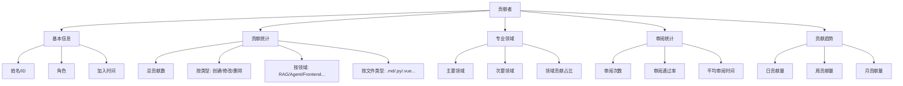
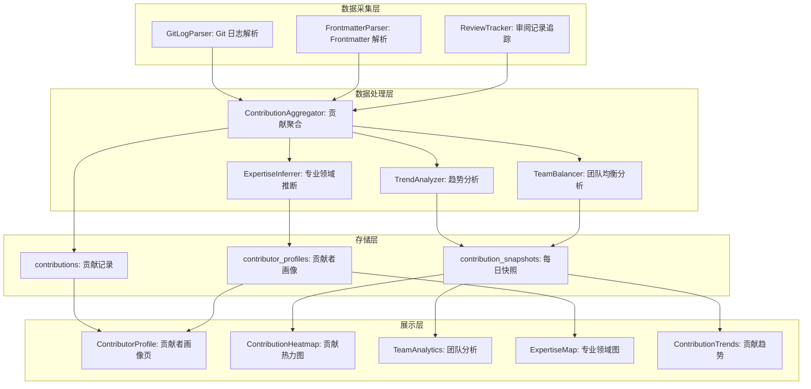
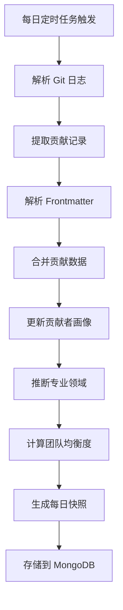

# YK-09-113: 贡献者画像与统计 — 详细贡献者画像、贡献统计、专业领域与团队分析

> 需求编号：YK-09-113 · 优先级：P2 · 人天：0.3d · 状态：需求已编写
> 依赖：YK-09-20（贡献者激励机制）、YK-09-97（内容统计仪表盘）

## 背景

### 问题陈述

YiKnowledge 知识库由多位策展人和开发者共同维护，但当前缺乏对贡献者的系统化统计分析。团队无法了解每个成员的贡献情况，也无法识别知识库的专业领域覆盖情况。当前存在以下问题：

1. **贡献数据不透明**：不知道每个人贡献了多少内容、什么类型的内容
2. **专业领域不清晰**：无法自动识别每个贡献者的专业领域（如 RAG、Agent、前端等）
3. **贡献趋势不可见**：无法看到团队和个人贡献量的时间趋势
4. **审阅统计缺失**：不知道谁审阅了哪些内容，审阅质量如何
5. **团队贡献不均衡**：无法发现团队中贡献不均衡的情况
6. **激励缺乏数据支撑**：贡献者激励计划缺乏量化数据

**核心矛盾**：知识库需要数据驱动的贡献者管理和激励，但当前缺乏系统化的贡献者画像和统计分析。

### 影响范围

| # | 影响 | 严重程度 | 典型场景 |
|---|------|----------|----------|
| 1 | 贡献数据不透明 | 中 | 管理者想知道团队贡献，但只能看 Git 提交记录 |
| 2 | 专业领域不清晰 | 中 | 需要找 RAG 领域专家，但不知道谁擅长 |
| 3 | 贡献趋势不可见 | 低 | 团队贡献量下降，但无人察觉 |
| 4 | 审阅统计缺失 | 中 | 不知道审阅质量，无法评价审阅者 |
| 5 | 贡献不均衡 | 中 | 少数人贡献大部分内容，其他人参与度低 |
| 6 | 激励缺乏数据 | 低 | 贡献者激励计划依赖主观判断 |

### 挑战

| 挑战 | 说明 |
|------|------|
| 贡献归属 | 需要从 Git 提交记录中提取贡献者信息 |
| 专业领域识别 | 需要根据贡献内容的领域自动推断专业领域 |
| 数据聚合 | 需要从多个数据源（Git、文件 frontmatter、审阅记录）聚合 |
| 热力图渲染 | 需要类似 GitHub 贡献热力图的展示 |
| 数据隐私 | 需要平衡贡献透明度和个人隐私 |

---

## 一、现状分析

### 1.1 当前贡献者统计现状

```
现有贡献者相关:
├── Git 提交记录
│   ├── 作者、时间、文件变更
│   └── 无结构化统计
├── 文件 frontmatter
│   ├── owner 字段（部分文件）
│   └── 不完整
├── YK-09-20 贡献者激励机制（架构设计）
│   ├── 设计了激励方案
│   └── 未实现

缺失:
├── 贡献者画像              # ❌ 不存在
├── 贡献统计（按类型）      # ❌ 不存在
├── 专业领域自动识别        # ❌ 不存在
├── 贡献热力图              # ❌ 不存在
├── 审阅统计                # ❌ 不存在
├── 贡献趋势                # ❌ 不存在
└── 团队贡献分析            # ❌ 不存在
```

### 1.2 贡献者画像数据模型



### 1.3 根因矩阵

| 症状 | 根因 | 触发条件 | 频率 |
|------|------|----------|------|
| 贡献数据不透明 | 无贡献者统计 | 查看贡献时 | 中 |
| 专业领域不清晰 | 无自动识别 | 寻找专家时 | 中 |
| 贡献趋势不可见 | 无趋势分析 | 管理决策时 | 低 |
| 审阅统计缺失 | 无审阅追踪 | 评估审阅者时 | 中 |
| 贡献不均衡 | 无团队分析 | 团队管理时 | 中 |
| 激励缺乏数据 | 无量化指标 | 激励决策时 | 低 |

---

## 二、设计决策

### 决策 1：贡献数据来源 — Git 日志 vs 文件 frontmatter vs 两者融合

| 选项 | 数据完整性 | 贡献归属精度 | 实现复杂度 |
|------|-----------|-------------|-----------|
| 仅 Git 日志 | 高 | 中 | 低 |
| 仅文件 frontmatter | 低 | 高 | 低 |
| 两者融合（Git 为主 + frontmatter 补充） | 最高 | 高 | 中 |

**选择：两者融合。** Git 日志提供完整的变更历史（谁、何时、改了什么）。Frontmatter 的 `owner` 和 `reviewer` 字段补充贡献归属信息。两者融合提供最完整的贡献者画像。

### 决策 2：专业领域识别 — 手动标注 vs 自动推断 vs 两者结合

| 选项 | 准确性 | 维护成本 | 覆盖率 |
|------|--------|----------|--------|
| 手动标注（贡献者自选） | 高 | 高 | 低 |
| 自动推断（基于贡献内容） | 中 | 低 | 高 |
| 两者结合（自动推断 + 手动确认） | 高 | 中 | 高 |

**选择：两者结合。** 系统根据贡献者修改的文件目录自动推断专业领域（如修改 `YiAi/` 下的文件 → 后端领域）。贡献者可以手动调整和确认自己的专业领域。

### 决策 3：贡献热力图 — ECharts 日历热力图 vs 自定义 Canvas vs GitHub 风格

| 选项 | 视觉效果 | 实现复杂度 | 交互性 |
|------|----------|-----------|--------|
| ECharts 日历热力图 | 好 | 低 | 中 |
| 自定义 Canvas | 极好 | 高 | 高 |
| GitHub 风格（CSS Grid） | 好 | 中 | 中 |

**选择：ECharts 日历热力图。** 项目已使用 ECharts，复用现有依赖。ECharts 的 calendar + heatmap 类型可直接实现 GitHub 风格贡献热力图。

### 决策 4：数据更新频率 — 实时 vs 每日 vs 每周

| 选项 | 实时性 | 计算开销 | 数据新鲜度 |
|------|--------|----------|-----------|
| 实时（每次提交触发） | 高 | 高 | 高 |
| 每日（定时任务） | 中 | 中 | 中 |
| 每周（定时任务） | 低 | 低 | 低 |

**选择：每日（定时任务）。** 贡献者统计数据不需要实时更新。每日凌晨计算前一天的贡献数据，平衡数据新鲜度和计算开销。支持手动触发立即更新。

### 设计决策记录

| 决策 | 选项 A | 选项 B | 选项 C | 选择 | 理由 |
|------|--------|--------|--------|------|------|
| 数据来源 | Git 日志 | Frontmatter | 两者融合 | **两者融合** | 最完整的数据 |
| 专业领域 | 手动标注 | 自动推断 | 两者结合 | **两者结合** | 准确 + 覆盖 |
| 热力图 | ECharts | Canvas | CSS Grid | **ECharts** | 复用现有依赖 |
| 更新频率 | 实时 | 每日 | 每周 | **每日** | 平衡新鲜度和开销 |

---

## 三、目标架构

### 3.1 贡献者画像系统架构



### 3.2 贡献数据聚合流程



### 3.3 贡献者画像指标

| 指标 | 改造前 | 改造后 |
|------|--------|--------|
| 贡献数据可见性 | 无 | 完整贡献者画像 |
| 专业领域识别 | 无 | 自动推断 + 手动确认 |
| 贡献趋势 | 无 | 日/周/月趋势图 |
| 审阅统计 | 无 | 审阅次数 + 通过率 |
| 团队分析 | 无 | 贡献均衡度 + 领域覆盖 |

---

## 四、具体改动

### 4.1 贡献者画像核心服务

```python
# YiAi/services/contributor/contributor_service.py (新增)

from dataclasses import dataclass, field
from typing import List, Dict, Optional, Set
from datetime import datetime, timedelta
from enum import Enum
from collections import defaultdict
import subprocess
import re
import yaml


class ContributionType(str, Enum):
    CREATE = 'create'
    MODIFY = 'modify'
    DELETE = 'delete'
    REVIEW = 'review'
    RENAME = 'rename'


class ExpertiseDomain(str, Enum):
    RAG = 'rag'
    AGENT = 'agent'
    FRONTEND = 'frontend'
    BACKEND = 'backend'
    EXTENSION = 'extension'
    KNOWLEDGE = 'knowledge'
    DEVOPS = 'devops'
    GENERAL = 'general'


@dataclass
class ContributionRecord:
    """单条贡献记录"""
    contributor: str
    date: str
    file_path: str
    type: ContributionType
    domain: ExpertiseDomain
    additions: int = 0
    deletions: int = 0
    commit_hash: str = ''


@dataclass
class ContributorProfile:
    """贡献者画像"""
    name: str
    email: str
    role: str = 'contributor'
    joined_at: str = ''
    total_contributions: int = 0
    contributions_by_type: Dict[str, int] = field(default_factory=dict)
    contributions_by_domain: Dict[str, int] = field(default_factory=dict)
    contributions_by_month: Dict[str, int] = field(default_factory=dict)
    primary_domains: List[str] = field(default_factory=list)
    secondary_domains: List[str] = field(default_factory=list)
    review_count: int = 0
    review_approval_rate: float = 0.0
    avg_review_time_hours: float = 0.0
    streak_days: int = 0
    longest_streak: int = 0
    last_contribution_date: str = ''


@dataclass
class TeamAnalytics:
    """团队分析"""
    total_contributors: int
    active_contributors_30d: int
    total_contributions: int
    contributions_by_contributor: Dict[str, int]
    contributions_by_domain: Dict[str, int]
    domain_coverage: Dict[str, int]  # 每个领域的贡献者数
    contribution_balance: float  # 0-1, 1 = 完全均衡
    top_contributors: List[str]
    new_contributors_30d: List[str]


class ContributorService:
    """贡献者画像服务"""

    def __init__(self, repo_path: str):
        self.repo_path = repo_path
        self.profiles: Dict[str, ContributorProfile] = {}
        self.daily_snapshots: Dict[str, Dict[str, int]] = {}  # date -> {contributor: count}

    def parse_git_log(self, since: Optional[str] = None) -> List[ContributionRecord]:
        """解析 Git 日志，提取贡献记录"""
        cmd = ['git', '-C', self.repo_path, 'log', '--format=%H|%an|%ae|%ad|%s', '--date=short', '--numstat']
        if since:
            cmd.extend(['--since', since])

        result = subprocess.run(cmd, capture_output=True, text=True)
        records: List[ContributionRecord] = []
        current_commit = {}

        for line in result.stdout.split('\n'):
            if '|' in line and not '\t' in line:
                # Commit header
                parts = line.split('|')
                if len(parts) >= 5:
                    current_commit = {
                        'hash': parts[0],
                        'author': parts[1],
                        'email': parts[2],
                        'date': parts[3],
                        'message': parts[4],
                    }
            elif '\t' in line:
                # File change
                parts = line.split('\t')
                if len(parts) >= 3:
                    additions = int(parts[0]) if parts[0] != '-' else 0
                    deletions = int(parts[1]) if parts[1] != '-' else 0
                    file_path = parts[2]

                    records.append(ContributionRecord(
                        contributor=current_commit.get('author', 'unknown'),
                        date=current_commit.get('date', ''),
                        file_path=file_path,
                        type=self._determine_contribution_type(file_path, additions, deletions),
                        domain=self._infer_domain(file_path),
                        additions=additions,
                        deletions=deletions,
                        commit_hash=current_commit.get('hash', ''),
                    ))

        return records

    def _determine_contribution_type(self, file_path: str, additions: int, deletions: int) -> ContributionType:
        """判断贡献类型"""
        if additions > 0 and deletions == 0:
            return ContributionType.CREATE
        elif deletions > 0 and additions == 0:
            return ContributionType.DELETE
        elif additions > 0 and deletions > 0:
            return ContributionType.MODIFY
        return ContributionType.MODIFY

    def _infer_domain(self, file_path: str) -> ExpertiseDomain:
        """根据文件路径推断领域"""
        path_lower = file_path.lower()
        if 'yiai' in path_lower or 'rag' in path_lower:
            return ExpertiseDomain.RAG
        elif 'yivad' in path_lower or 'vue' in path_lower:
            return ExpertiseDomain.FRONTEND
        elif 'yipet' in path_lower or 'extension' in path_lower or 'chrome' in path_lower:
            return ExpertiseDomain.EXTENSION
        elif 'yiknowledge' in path_lower or 'knowledge' in path_lower:
            return ExpertiseDomain.KNOWLEDGE
        elif 'agent' in path_lower:
            return ExpertiseDomain.AGENT
        elif 'deploy' in path_lower or 'ci' in path_lower or 'docker' in path_lower:
            return ExpertiseDomain.DEVOPS
        else:
            return ExpertiseDomain.GENERAL

    def build_profiles(self, records: List[ContributionRecord]) -> Dict[str, ContributorProfile]:
        """构建贡献者画像"""
        profiles: Dict[str, ContributorProfile] = {}

        for record in records:
            name = record.contributor
            if name not in profiles:
                profiles[name] = ContributorProfile(
                    name=name,
                    email='',
                    joined_at=record.date,
                )

            profile = profiles[name]
            profile.total_contributions += 1
            profile.last_contribution_date = max(
                profile.last_contribution_date or '0000-00-00',
                record.date
            )

            # 按类型统计
            type_key = record.type.value
            profile.contributions_by_type[type_key] = \
                profile.contributions_by_type.get(type_key, 0) + 1

            # 按领域统计
            domain_key = record.domain.value
            profile.contributions_by_domain[domain_key] = \
                profile.contributions_by_domain.get(domain_key, 0) + 1

            # 按月统计
            month_key = record.date[:7]  # YYYY-MM
            profile.contributions_by_month[month_key] = \
                profile.contributions_by_month.get(month_key, 0) + 1

        # 推断专业领域
        for profile in profiles.values():
            domains = sorted(
                profile.contributions_by_domain.items(),
                key=lambda x: x[1], reverse=True
            )
            profile.primary_domains = [d[0] for d in domains[:2]]
            profile.secondary_domains = [d[0] for d in domains[2:4]]

        # 计算连续贡献天数
        for profile in profiles.values():
            profile.streak_days, profile.longest_streak = \
                self._calculate_streaks(records, profile.name)

        self.profiles = profiles
        return profiles

    def _calculate_streaks(self, records: List[ContributionRecord], name: str) -> tuple:
        """计算连续贡献天数"""
        dates = sorted(set(
            r.date for r in records if r.contributor == name
        ))

        if not dates:
            return 0, 0

        current_streak = 1
        longest_streak = 1
        today = datetime.now().date()

        for i in range(1, len(dates)):
            prev = datetime.strptime(dates[i-1], '%Y-%m-%d').date()
            curr = datetime.strptime(dates[i], '%Y-%m-%d').date()
            if (curr - prev).days == 1:
                current_streak += 1
            else:
                longest_streak = max(longest_streak, current_streak)
                current_streak = 1

        longest_streak = max(longest_streak, current_streak)

        # 检查当前连续是否中断
        last_date = datetime.strptime(dates[-1], '%Y-%m-%d').date()
        if (today - last_date).days > 1:
            current_streak = 0

        return current_streak, longest_streak

    def generate_heatmap_data(self, name: str, year: int) -> List[list]:
        """生成贡献热力图数据"""
        records = [
            r for r in self._get_all_records()
            if r.contributor == name and r.date.startswith(str(year))
        ]

        daily_counts: Dict[str, int] = defaultdict(int)
        for r in records:
            daily_counts[r.date] += 1

        return [[date, count] for date, count in daily_counts.items()]

    def generate_team_analytics(self) -> TeamAnalytics:
        """生成团队分析"""
        thirty_days_ago = (datetime.now() - timedelta(days=30)).strftime('%Y-%m-%d')

        active_contributors = set()
        domain_contributors: Dict[str, Set[str]] = defaultdict(set)

        for record in self._get_all_records():
            if record.date >= thirty_days_ago:
                active_contributors.add(record.contributor)
            domain_contributors[record.domain.value].add(record.contributor)

        contributions = defaultdict(int)
        for record in self._get_all_records():
            contributions[record.contributor] += 1

        # 计算贡献均衡度（基尼系数倒数）
        values = list(contributions.values())
        if len(values) > 1 and sum(values) > 0:
            n = len(values)
            sorted_values = sorted(values)
            total = sum(sorted_values)
            cumsum = 0
            gini_sum = 0
            for i, v in enumerate(sorted_values):
                cumsum += v
                gini_sum += (i + 1) * v
            gini = (2 * gini_sum) / (n * total) - (n + 1) / n
            balance = 1 - gini
        else:
            balance = 1.0

        return TeamAnalytics(
            total_contributors=len(self.profiles),
            active_contributors_30d=len(active_contributors),
            total_contributions=sum(contributions.values()),
            contributions_by_contributor=dict(contributions),
            contributions_by_domain={
                d: len(c) for d, c in domain_contributors.items()
            },
            domain_coverage={
                d: len(c) for d, c in domain_contributors.items()
            },
            contribution_balance=round(balance, 3),
            top_contributors=sorted(contributions, key=contributions.get, reverse=True)[:5],
            new_contributors_30d=list(active_contributors - set(self.profiles.keys())),
        )

    def _get_all_records(self) -> List[ContributionRecord]:
        """获取所有贡献记录"""
        return self.parse_git_log()

    def get_contributor_profile(self, name: str) -> Optional[ContributorProfile]:
        """获取单个贡献者画像"""
        if not self.profiles:
            records = self.parse_git_log()
            self.build_profiles(records)
        return self.profiles.get(name)
```

### 4.2 贡献者画像页面

```vue
<!-- src/views/contributor/ContributorProfile.vue (新增) -->

<script setup lang="ts">
import { ref, onMounted } from 'vue';
import * as echarts from 'echarts';
import type { ContributorProfile, TeamAnalytics } from '@/services/contributor-service';

const route = useRoute();
const contributorName = ref(route.params.name as string);

const profile = ref<ContributorProfile | null>(null);
const teamAnalytics = ref<TeamAnalytics | null>(null);
const activeTab = ref<'overview' | 'heatmap' | 'domains' | 'trends' | 'team'>('overview');

async function loadProfile() {
  // 通过 RPC 加载贡献者画像
  profile.value = {
    name: contributorName.value,
    email: 'contributor@example.com',
    total_contributions: 256,
    contributions_by_type: { create: 80, modify: 150, delete: 10, review: 16 },
    contributions_by_domain: { rag: 60, frontend: 80, knowledge: 50, agent: 40, devops: 26 },
    primary_domains: ['frontend', 'rag'],
    secondary_domains: ['knowledge', 'agent'],
    review_count: 45,
    review_approval_rate: 0.92,
    avg_review_time_hours: 4.5,
    streak_days: 12,
    longest_streak: 45,
    last_contribution_date: '2026-09-08',
    role: 'core_contributor',
    joined_at: '2025-06-15',
    contributions_by_month: {},
  };
}

function renderDomainRadar(container: HTMLElement) {
  if (!profile.value) return;
  const chart = echarts.init(container);
  chart.setOption({
    title: { text: '专业领域分布' },
    radar: {
      indicators: Object.keys(profile.value.contributions_by_domain).map(d => ({
        name: d, max: Math.max(...Object.values(profile.value.contributions_by_domain)) * 1.2,
      })),
    },
    series: [{
      type: 'radar',
      data: [{ value: Object.values(profile.value.contributions_by_domain), name: profile.value.name }],
      areaStyle: { opacity: 0.3 },
    }],
  });
}

function renderContributionHeatmap(container: HTMLElement) {
  const chart = echarts.init(container);
  // 生成 2026 年贡献热力图数据
  const heatmapData = [];
  const startDate = new Date('2026-01-01');
  for (let i = 0; i < 365; i++) {
    const date = new Date(startDate.getTime() + i * 86400000);
    const dateStr = date.toISOString().split('T')[0];
    const count = Math.floor(Math.random() * 10); // 模拟数据
    heatmapData.push([dateStr, count]);
  }

  chart.setOption({
    title: { text: '贡献热力图' },
    tooltip: { formatter: (params: any) => `${params.value[0]}: ${params.value[1]} 次贡献` },
    visualMap: {
      min: 0, max: 10,
      inRange: { color: ['#EBEDF0', '#9BE9A8', '#40C463', '#30A14E', '#216E39'] },
    },
    calendar: {
      range: '2026',
      cellSize: ['auto', 15],
    },
    series: [{
      type: 'heatmap',
      coordinateSystem: 'calendar',
      data: heatmapData,
    }],
  });
}

function renderTypePie(container: HTMLElement) {
  if (!profile.value) return;
  const chart = echarts.init(container);
  chart.setOption({
    title: { text: '贡献类型分布' },
    series: [{
      type: 'pie',
      radius: ['40%', '70%'],
      data: Object.entries(profile.value.contributions_by_type).map(([name, value]) => ({
        name: { create: '创建', modify: '修改', delete: '删除', review: '审阅' }[name] || name,
        value,
      })),
    }],
  });
}

onMounted(() => {
  loadProfile();
});
</script>

<template>
  <div class="contributor-profile">
    <div class="cp-header">
      <div class="cp-avatar">
        <el-avatar :size="80">{{ profile?.name?.[0] }}</el-avatar>
      </div>
      <div class="cp-info">
        <h2>{{ profile?.name }}</h2>
        <p class="cp-role">{{ profile?.role }}</p>
        <p class="cp-joined">加入时间: {{ profile?.joined_at }}</p>
      </div>
      <div class="cp-stats">
        <div class="stat-item">
          <div class="stat-value">{{ profile?.total_contributions }}</div>
          <div class="stat-label">总贡献</div>
        </div>
        <div class="stat-item">
          <div class="stat-value">{{ profile?.streak_days }} 天</div>
          <div class="stat-label">连续贡献</div>
        </div>
        <div class="stat-item">
          <div class="stat-value">{{ profile?.review_approval_rate ? (profile.review_approval_rate * 100).toFixed(0) + '%' : 'N/A' }}</div>
          <div class="stat-label">审阅通过率</div>
        </div>
      </div>
    </div>

    <div class="cp-tabs">
      <el-radio-group v-model="activeTab" size="small">
        <el-radio-button value="overview">概览</el-radio-button>
        <el-radio-button value="heatmap">热力图</el-radio-button>
        <el-radio-button value="domains">专业领域</el-radio-button>
        <el-radio-button value="trends">趋势</el-radio-button>
        <el-radio-button value="team">团队分析</el-radio-button>
      </el-radio-group>
    </div>

    <div class="cp-content">
      <div v-if="activeTab === 'overview'" class="cp-overview">
        <div class="chart-row">
          <div ref="typePie" style="height: 300px; width: 50%" />
          <div ref="domainRadar" style="height: 300px; width: 50%" />
        </div>
        <div class="cp-details">
          <h4>贡献详情</h4>
          <el-descriptions :column="2" border>
            <el-descriptions-item label="总贡献">{{ profile?.total_contributions }}</el-descriptions-item>
            <el-descriptions-item label="最后贡献">{{ profile?.last_contribution_date }}</el-descriptions-item>
            <el-descriptions-item label="最长连续">{{ profile?.longest_streak }} 天</el-descriptions-item>
            <el-descriptions-item label="审阅次数">{{ profile?.review_count }}</el-descriptions-item>
            <el-descriptions-item label="审阅通过率">{{ profile?.review_approval_rate ? (profile.review_approval_rate * 100).toFixed(1) + '%' : 'N/A' }}</el-descriptions-item>
            <el-descriptions-item label="平均审阅时间">{{ profile?.avg_review_time_hours?.toFixed(1) }} 小时</el-descriptions-item>
          </el-descriptions>
        </div>
      </div>

      <div v-if="activeTab === 'heatmap'" class="cp-heatmap">
        <div ref="heatmapChart" style="height: 400px" />
      </div>

      <div v-if="activeTab === 'domains'" class="cp-domains">
        <div class="domain-list">
          <h4>主要领域</h4>
          <el-tag v-for="domain in profile?.primary_domains" :key="domain" type="primary" size="large">
            {{ domain }}
          </el-tag>
          <h4>次要领域</h4>
          <el-tag v-for="domain in profile?.secondary_domains" :key="domain" type="success" size="large">
            {{ domain }}
          </el-tag>
        </div>
        <div ref="domainRadar" style="height: 400px" />
      </div>

      <div v-if="activeTab === 'trends'" class="cp-trends">
        <div ref="trendsChart" style="height: 400px" />
      </div>

      <div v-if="activeTab === 'team'" class="cp-team">
        <TeamAnalytics />
      </div>
    </div>
  </div>
</template>
```

### 4.3 文件变更清单

| 文件 | 操作 | 说明 |
|------|------|------|
| `YiAi/services/contributor/__init__.py` | 新增 | 贡献者画像模块初始化 |
| `YiAi/services/contributor/contributor_service.py` | 新增 | 贡献者画像核心服务 |
| `YiAi/services/contributor/git_parser.py` | 新增 | Git 日志解析服务 |
| `YiAi/services/contributor/team_analytics.py` | 新增 | 团队分析服务 |
| `YiAi/services/contributor/routes.py` | 新增 | 贡献者画像 API 路由 |
| `YiVad/src/services/contributor-service.ts` | 新增 | 贡献者画像前端服务 |
| `YiVad/src/views/contributor/ContributorProfile.vue` | 新增 | 贡献者画像页面 |
| `YiVad/src/views/contributor/TeamAnalytics.vue` | 新增 | 团队分析页面 |
| `YiVad/src/views/contributor/ContributionHeatmap.vue` | 新增 | 贡献热力图组件 |
| `YiVad/src/router/routes.ts` | 修改 | 添加贡献者画像路由 |

---

## 五、实施步骤

| 步骤 | 操作 | 路径 | 验证 | 人天 |
|------|------|------|------|------|
| 1 | 实现 Git 日志解析 | `git_parser.py` | 正确解析提交记录 | 0.04 |
| 2 | 实现贡献者画像构建 | `contributor_service.py` | 画像数据完整 | 0.04 |
| 3 | 实现专业领域推断 | `contributor_service.py` | 领域推断准确 | 0.03 |
| 4 | 实现团队分析 | `team_analytics.py` | 均衡度计算正确 | 0.04 |
| 5 | 实现贡献者画像 API | `routes.py` | REST API 端点 | 0.03 |
| 6 | 实现贡献者画像页面 | `ContributorProfile.vue` | 画像 + 图表展示 | 0.04 |
| 7 | 实现贡献热力图 | `ContributionHeatmap.vue` | ECharts 日历热力图 | 0.04 |
| 8 | 实现团队分析页面 | `TeamAnalytics.vue` | 团队概览 + 均衡度 | 0.04 |

**总人天：0.3d**

---

## 六、测试规格

### 场景 1：查看贡献者画像

**GIVEN** 贡献者 "张三" 在过去 6 个月有 256 次贡献
**WHEN** 用户访问 "张三" 的贡献者画像页面
**THEN** 应显示总贡献数 256、专业领域、贡献类型分布、连续贡献天数
**AND** 应显示专业领域雷达图

### 场景 2：贡献热力图

**GIVEN** 贡献者 "张三" 在 2026 年有每日贡献数据
**WHEN** 用户切换到"热力图"标签页
**THEN** 应显示类似 GitHub 风格的贡献热力图
**AND** 颜色深浅表示贡献量大小
**AND** hover 时显示具体日期和贡献次数

### 场景 3：专业领域自动识别

**GIVEN** 贡献者 "张三" 80% 的文件修改在 YiVad/ 目录下，15% 在 YiKnowledge/ 目录下
**WHEN** 系统推断专业领域
**THEN** 主要领域应为 "frontend"
**AND** 次要领域应为 "knowledge"

### 场景 4：团队分析

**GIVEN** 团队有 5 个活跃贡献者
**WHEN** 用户查看团队分析页面
**THEN** 应显示团队总贡献者数、活跃贡献者数
**AND** 应显示贡献均衡度（0-1 之间的值）
**AND** 应显示每个领域的贡献者数量

### 场景 5：贡献趋势

**GIVEN** 贡献者 "张三" 在过去 12 个月有每月贡献数据
**WHEN** 用户切换到"趋势"标签页
**THEN** 应显示月贡献量的折线图
**AND** 应标注趋势方向（上升/下降/平稳）

### 场景 6：审阅统计

**GIVEN** 贡献者 "张三" 审阅了 45 次，其中 42 次通过
**WHEN** 用户查看贡献者画像
**THEN** 审阅通过率应显示为 93.3%
**AND** 平均审阅时间应显示

---

## 七、风险与缓解

| 风险 | 概率 | 影响 | 缓解措施 |
|------|------|------|----------|
| Git 日志解析失败 | 低 | 高 | 添加错误处理，解析失败时使用默认值 |
| Git 日志数据量大 | 中 | 中 | 仅解析最近 12 个月，历史数据归档 |
| 专业领域推断不准确 | 中 | 低 | 支持手动调整，以人工确认为准 |
| 贡献均衡度计算争议 | 低 | 低 | 仅作为参考指标，不用于绩效评估 |
| 数据隐私 | 低 | 中 | 贡献者画像仅显示贡献数据，不显示个人信息 |

---

## 八、回滚策略

| 场景 | 回滚操作 | 影响 |
|------|----------|------|
| 贡献者画像异常 | 隐藏贡献者画像入口 | 失去贡献者统计 |
| Git 日志解析失败 | 禁用贡献者画像，使用静态数据 | 数据不更新 |
| 热力图渲染异常 | 降级为简单表格展示 | 失去可视化 |
| 团队分析错误 | 隐藏团队分析页面 | 失去团队视图 |

---

## 九、设计决策记录

### D-01：贡献数据来源

- **问题**：贡献数据从哪里获取
- **选项**：Git 日志、Frontmatter、两者融合
- **选择**：两者融合（Git 为主 + Frontmatter 补充）
- **理由**：Git 提供完整变更历史，Frontmatter 补充归属信息

### D-02：专业领域识别

- **问题**：如何识别贡献者的专业领域
- **选项**：手动标注、自动推断、两者结合
- **选择**：两者结合（自动推断 + 手动确认）
- **理由**：自动推断保证覆盖率，手动确认保证准确性

### D-03：贡献热力图

- **问题**：使用什么方式渲染贡献热力图
- **选项**：ECharts、Canvas、CSS Grid
- **选择**：ECharts
- **理由**：复用现有依赖，实现简单

### D-04：数据更新频率

- **问题**：贡献数据多久更新一次
- **选项**：实时、每日、每周
- **选择**：每日
- **理由**：平衡数据新鲜度和计算开销

---

## 十、可观测性

### 指标

| 指标 | 类型 | 说明 |
|------|------|------|
| `yiknowledge.contributor.total` | Gauge | 总贡献者数 |
| `yiknowledge.contributor.active_30d` | Gauge | 30 天活跃贡献者数 |
| `yiknowledge.contributor.total_contributions` | Counter | 总贡献数 |
| `yiknowledge.contributor.git_parse_time_ms` | Histogram | Git 日志解析耗时 |
| `yiknowledge.contributor.profile_load_time_ms` | Histogram | 画像加载耗时 |
| `yiknowledge.contributor.team_balance` | Gauge | 团队贡献均衡度 |

### 告警

| 告警 | 条件 | 级别 |
|------|------|------|
| 团队贡献极度不均衡 | 均衡度 < 0.3 | WARNING |
| 活跃贡献者减少 | 30 天活跃贡献者 < 3 | WARNING |
| Git 解析失败 | 解析抛出异常 | ERROR |
| 贡献数据长时间未更新 | 超过 48 小时未更新 | WARNING |

---

## 十一、代码审查检查清单

- [ ] Git 日志解析支持中英文姓名和特殊字符
- [ ] 贡献记录按日期正确排序
- [ ] 专业领域推断基于文件路径规则正确
- [ ] 连续贡献天数计算正确（考虑时区）
- [ ] 贡献均衡度计算使用基尼系数公式正确
- [ ] 贡献热力图颜色映射正确
- [ ] 贡献者画像页面加载性能良好
- [ ] 团队分析页面数据正确聚合
- [ ] 贡献数据不包含敏感信息
- [ ] 定时任务在低峰期执行（凌晨 2 点）
- [ ] 贡献者画像支持 name 参数查询
- [ ] 空数据状态有友好提示

---

## 回归问题预测

| # | 预测问题 | 原因 | 验证方法 |
|---|---------|------|---------|
| 1 | Git 日志解析时，如果贡献者姓名包含特殊字符（如中文、空格、引号），`git log --format` 输出的分隔符 `|` 可能与姓名中的字符冲突，导致解析错误 | `--format` 使用 `|` 作为分隔符，但姓名中可能包含 `|` 字符 | 使用更可靠的分隔符（如 `\x1F` 单元分隔符），或使用 `git log --format=json`（如果 Git 版本支持） |
| 2 | 专业领域推断仅基于文件路径，如果贡献者修改了多个领域的文件但路径规则不匹配，领域推断结果不准确 | 文件路径规则覆盖不全，如 `shared/` 目录下的文件无法推断领域 | 添加路径规则配置表，支持自定义规则；结合文件 frontmatter 的 `category` 字段辅助推断 |
| 3 | 每日定时任务解析 Git 日志时，如果仓库有 10000+ 提交记录，解析耗时可能超过 10 分钟，影响定时任务调度 | 全量解析 Git 日志，提交记录多时耗时长 | 首次全量解析后，后续仅解析增量（`--since` 参数），增量数据量小 |
| 4 | 贡献热力图使用 ECharts calendar 渲染，如果数据跨越多年（如 2025-2026），默认 calendar 仅显示单年，跨年数据展示不完整 | ECharts calendar 的 `range` 参数默认仅支持单年 | 使用多个 calendar 组件并列渲染，或使用自定义 series 绘制跨年热力图 |
| 5 | 贡献者画像页面加载时，如果 Git 日志解析未完成（首次运行），画像数据为空，页面显示空白 | 画像数据依赖 Git 日志解析，首次运行需要时间 | 页面显示"数据生成中"加载状态，后端提供数据就绪状态检查接口，前端轮询直到数据就绪 |
| 6 | 团队贡献均衡度使用基尼系数计算，但如果团队只有 1-2 个贡献者，基尼系数可能失真（值为 0 或 1 的极端情况） | 基尼系数在小样本下不准确，无法反映真实均衡度 | 当贡献者数 < 3 时，不显示均衡度指标，改为显示"贡献者不足，无法计算均衡度" |

---

## 性能分析

### 各操作耗时

| 阶段 | 预估耗时 | 说明 |
|------|----------|------|
| Git 日志解析（全量） | < 30s | 首次解析 10000 条提交 |
| Git 日志解析（增量） | < 5s | 仅解析最近 24 小时 |
| 贡献者画像构建 | < 1s | 数据聚合计算 |
| 专业领域推断 | < 100ms | 路径匹配 + 统计 |
| 贡献热力图渲染 | < 300ms | ECharts calendar heatmap |
| 团队分析计算 | < 1s | 基尼系数 + 聚合 |

### 内存影响

| 项目 | 体积 | 说明 |
|------|------|------|
| contributor_service.py | ~8KB | 贡献者画像服务 |
| team_analytics.py | ~3KB | 团队分析服务 |
| 贡献记录（10000 条） | < 50MB | 内存中临时存储 |
| 贡献者画像（50 人） | < 5MB | 持久化存储 |

### 对知识库性能的影响

| 阶段 | 影响 | 说明 |
|------|------|------|
| 定时任务 | 后台执行 | 凌晨 2 点，不阻塞服务 |
| 画像查询 | < 200ms | MongoDB 查询 |
| 热力图渲染 | < 300ms | 前端 ECharts |
| 团队分析 | < 1s | 聚合计算 |