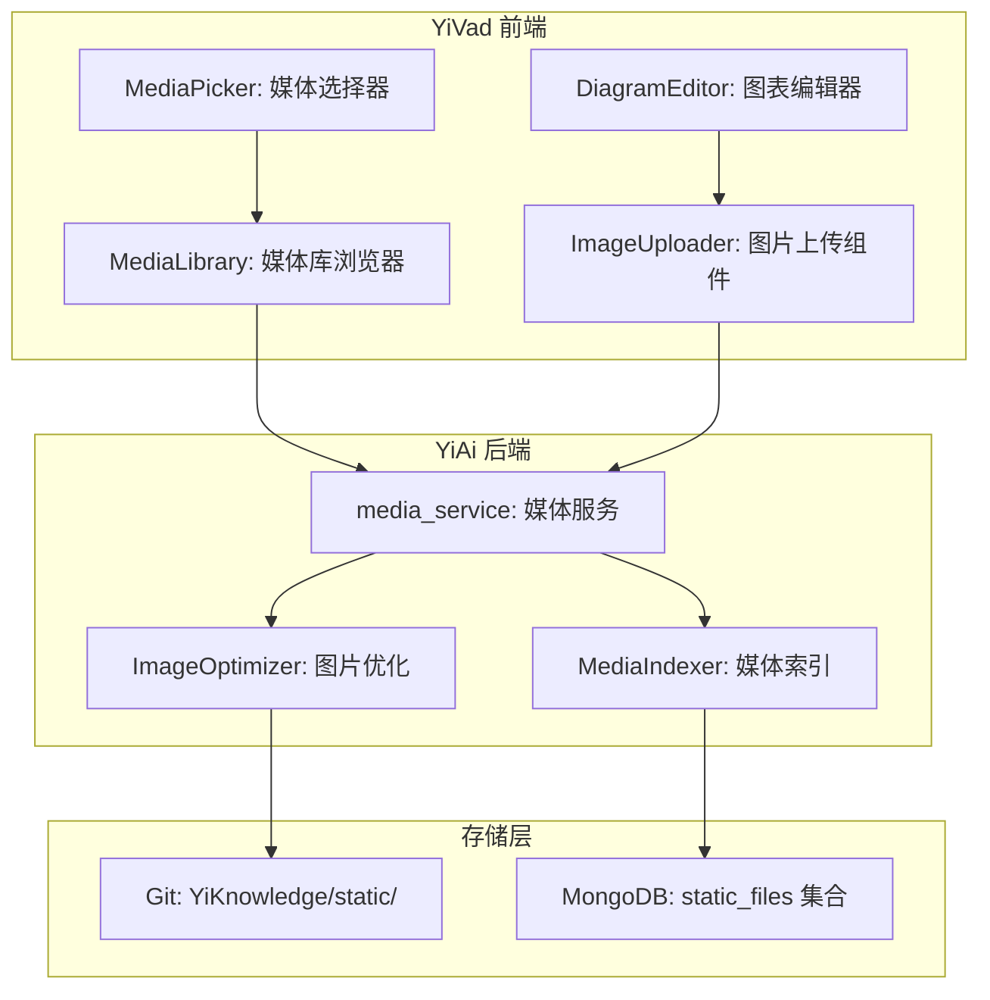
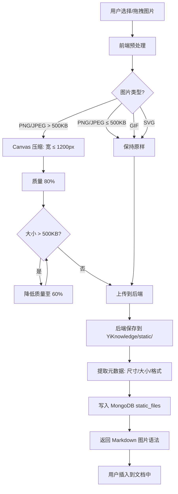

# YK-09-117: 多媒体内容管理 — 图片/图表嵌入文章、图片上传与优化、图片说明与替代文本、图表编辑器集成、视频嵌入、媒体库浏览器

> 需求编号：YK-09-117 · 优先级：P2 · 人天：0.3d · 状态：需求已编写
> 依赖：YK-09-15（多模态内容支持）

## 背景

### 问题陈述

YiKnowledge 知识库当前仅支持纯文本和 Mermaid 代码块，不支持图片、截图、视频等多媒体内容。在技术文档中，架构图、流程图、截图是必不可少的元素。当前作者只能通过文字描述或外部链接引用图片，导致三个痛点：图片管理碎片化（图片散落在各处）、图表编辑需工具切换（Mermaid 手写代码体验差）、视频内容无法嵌入。

1. **图片无法直接嵌入**：只能使用外部链接或 Base64，链接失效后图片丢失
2. **截图管理困难**：技术文档中的截图需要手动上传、压缩、命名
3. **图表编辑与文档分离**：Draw.io 等工具编辑图表后需导出再上传
4. **视频内容不支持**：无法在知识库中嵌入教学视频或演示录屏
5. **无媒体库**：已有图片/图表无法快速复用

**核心矛盾**：技术文档需要多媒体内容支持，但 YiKnowledge 缺乏图片/视频管理能力，作者被迫使用外部工具。

### 影响范围

| # | 影响 | 严重程度 | 典型场景 |
|---|------|----------|----------|
| 1 | 图片管理碎片化 | 高 | 架构图/截图散落在各目录，无统一管理 |
| 2 | 图表编辑低效 | 中 | 手写 Mermaid 代码对复杂图表不友好 |
| 3 | 外部链接失效 | 中 | 引用的外部图片链接过期 |
| 4 | 文档表现力不足 | 中 | 纯文字无法直观表达架构关系 |
| 5 | 媒体复用困难 | 中 | 同一张图片在多个文档中使用需要多次上传 |

### 挑战

| 挑战 | 说明 |
|------|------|
| 图片存储 | 图片存储位置（Git 仓库 vs OSS vs 本地） |
| 图片优化 | 上传时自动压缩、格式转换（WebP）|
| Mermaid/Draw.io 集成 | 在文档编辑中集成图表编辑器 |
| 视频存储和流式播放 | 视频文件大，Git 不适合存储 |
| Git 仓库大小控制 | 避免二进制文件膨胀 Git 仓库 |

---

## 一、现状分析

### 1.1 当前多媒体内容现状

```
当前 YiKnowledge 媒体支持:
├── Mermaid 代码块（在 Markdown 中渲染为图表）
├── Markdown 图片语法（仅支持外部 URL）
├── 无图片上传功能
├── 无图表编辑器
├── 无视频嵌入
├── 无媒体库
└── 无图片优化

当前作者做法:
├── 将图片上传到外部图床 → 复制链接到文档
├── 在 Draw.io 中编辑图表 → 导出 PNG → 上传图床
├── 视频链接到 YouTube/Bilibili
└── 架构图在 external/目录中手动管理
```

### 1.2 多媒体需求矩阵

| 媒体类型 | 用途 | 存储方式 | 优先级 |
|----------|------|----------|--------|
| 截图 (PNG/JPEG) | Bug 报告、UI 文档 | `static/` 目录 | P0 |
| 架构图 (Draw.io/Mermaid) | 架构文档 | 源码存储 + 渲染 | P0 |
| 流程图 (Mermaid) | 流程文档 | 代码块 | P0 |
| 视频 (MP4) | 教程、演示 | 外部链接（暂不本地存储） | P2 |
| 动图 (GIF/WebP) | 操作演示 | `static/` 目录 | P1 |

### 1.3 根因矩阵

| 症状 | 根因 | 触发条件 | 频率 |
|------|------|----------|------|
| 图片管理碎片化 | 无统一图片管理 | 创建技术文档时 | 高 |
| 图表编辑低效 | 需切换外部工具 | 创建架构图时 | 中 |
| 外部链接失效 | 图片存储在外部图床 | 图床服务变更时 | 中 |
| 视频无法嵌入 | 无视频嵌入支持 | 创建教程时 | 低 |
| 媒体复用困难 | 无媒体库浏览 | 多个文档需要同一图片时 | 中 |

---

## 二、设计决策

### 决策 1：图片存储方式 — Git 仓库 vs OSS vs 混合

| 选项 | 版本控制 | 存储容量 | 访问速度 | 备份 |
|------|----------|----------|----------|------|
| Git 仓库（`static/` 目录） | 是 | 有限（仓库膨胀） | 快 | Git 远程 |
| 外部 OSS（阿里云/腾讯云） | 否 | 大 | 取决于 CDN | OSS |
| 混合（小图 Git + 大图 OSS） | 部分 | 大 | 快 | 双通道 |

**选择：Git 仓库 `static/` 目录（暂时，后续可升级 OSS）。** 当前图片量少（< 100 张），总大小 < 50MB，存储在 Git 仓库中可接受。自动优化（WebP 格式 + 压缩）将图片控制在 500KB 以内。后续如果图片量增大，升级为 OSS + CDN。

### 决策 2：图表编辑器 — 仅 Mermaid vs Mermaid + Draw.io vs Vis.js

| 选项 | 学习曲线 | 图表类型 | 可视化编辑 |
|------|----------|----------|-----------|
| 仅 Mermaid | 中 | 10+ | 否（手写代码） |
| Mermaid + Draw.io 嵌入 | 中-低 | 全面 | 是（Draw.io） |
| Vis.js / Diagram.js | 中 | 多 | 部分 |

**选择：Mermaid + Draw.io 嵌入。** Mermaid 作为代码块的默认渲染方式，Draw.io 通过 iframe 嵌入 YiVad 前端编辑器，提供可视化的图表编辑体验。图表源码保存为 `.drawio` 文件（XML），渲染为 SVG/PNG。

### 决策 3：图片优化 — 上传时 vs 构建时 vs 按需

| 选项 | 及时性 | 原始文件保留 | 实现复杂度 |
|------|--------|-------------|-----------|
| 上传时优化（前端压缩） | 实时 | 否 | 中 |
| 构建时优化（CI 压缩） | 延迟 | 是 | 低 |
| 按需（访问时生成） | 延迟 | 是 | 高 |

**选择：上传时 + 构建时双阶段优化。** 上传时前端压缩（限制宽度 1200px、质量 80%）。构建时 CI 检查图片大小（> 500KB 发出警告）。不保留原始大文件，优化后的文件提交到 Git。

### 决策 4：媒体库 — 文件系统浏览 vs 元数据索引 vs 可视化

| 选项 | 易用性 | 搜索能力 | 实现复杂度 |
|------|--------|----------|-----------|
| 文件系统直接浏览 | 低 | 无 | 低 |
| 元数据索引（MongoDB） | 中 | 文件名/标签 | 中 |
| 可视化（缩略图 + 搜索 + 标签） | 高 | 文件名/标签/文件类型 | 中 |

**选择：可视化媒体库浏览器。** YiVad 前端提供媒体库页面，显示缩略图网格、文件信息（名称/大小/尺寸/使用次数）、搜索过滤、拖拽插入。媒体元数据存储在 MongoDB（`static_files` 集合）。

---

## 三、目标架构

### 3.1 多媒体管理系统架构



### 3.2 图片上传与优化流程



### 3.3 图片引用方式

```markdown
<!-- 标准 Markdown 语法 -->


<!-- 带替代文本和说明 -->

*图 1: YiAi 分层架构 — Domain/Service/Route 三层*

<!-- Draw.io 图表（渲染为 SVG） -->

*图 2: 部署拓扑结构*
```

---

## 四、具体改动

### 4.1 媒体元数据模型

```python
# YiAi/src/domain/media/models.py (新增)

from dataclasses import dataclass, field
from datetime import datetime
from typing import Optional

@dataclass
class MediaFile:
    id: str
    # 原始文件名
    original_name: str
    # 存储路径（相对于 YiKnowledge/）
    storage_path: str
    # 文件类型
    file_type: str  # image/png, image/jpeg, image/svg+xml, application/drawio
    # 文件大小（字节）
    file_size: int
    # 图片尺寸（仅图片类型）
    width: Optional[int] = None
    height: Optional[int] = None
    # 图片说明
    caption: str = ""
    # 替代文本
    alt_text: str = ""
    # 标签
    tags: list[str] = field(default_factory=list)
    # 被引用的文档列表
    referenced_by: list[str] = field(default_factory=list)
    # 上传时间
    created_at: datetime = field(default_factory=datetime.utcnow)
    # Markdown 引用语法（缓存）
    markdown_ref: str = ""

    def generate_markdown_ref(self) -> str:
        """生成 Markdown 图片引用"""
        alt = self.alt_text or self.original_name
        # 使用相对路径（../../static/...）
        rel_path = f"../../static/{self.storage_path}"
        caption = f"\n*{self.caption}*" if self.caption else ""
        return f"{caption}"
```

### 4.2 图片上传处理

```typescript
// YiVad/src/hooks/useImageUpload.ts (新增)

import { ref } from 'vue';

interface ImageUploadOptions {
  maxWidth: number; // 默认 1200
  quality: number;  // 默认 0.8
  maxSizeKB: number; // 默认 500
}

export function useImageUpload(options: ImageUploadOptions = {
  maxWidth: 1200, quality: 0.8, maxSizeKB: 500,
}) {
  const uploading = ref(false);
  const progress = ref(0);

  /** 前端压缩图片 */
  async function compressImage(file: File): Promise<Blob> {
    return new Promise((resolve, reject) => {
      const img = new Image();
      const url = URL.createObjectURL(file);
      img.onload = () => {
        URL.revokeObjectURL(url);

        // 如果不需要缩放，直接返回
        if (img.width <= options.maxWidth && file.size <= options.maxSizeKB * 1024) {
          resolve(file);
          return;
        }

        // 计算缩放比例
        const scale = Math.min(1, options.maxWidth / img.width);
        const canvas = document.createElement('canvas');
        canvas.width = img.width * scale;
        canvas.height = img.height * scale;

        const ctx = canvas.getContext('2d')!;
        ctx.drawImage(img, 0, 0, canvas.width, canvas.height);

        // 尝试不同质量
        async function tryQuality(q: number): Promise<void> {
          const blob = await new Promise<Blob>(r =>
            canvas.toBlob(b => r(b!), file.type, q));
          if (blob.size > options.maxSizeKB * 1024 && q > 0.3) {
            return tryQuality(q - 0.2);
          }
          resolve(blob);
        }

        tryQuality(options.quality);
      };
      img.onerror = reject;
      img.src = url;
    });
  }

  /** 上传图片 */
  async function upload(file: File, caption = '', altText = ''): Promise<string> {
    uploading.value = true;
    progress.value = 0;

    try {
      // 1. 压缩
      const compressed = await compressImage(file);
      progress.value = 30;

      // 2. 上传到 YiAi
      const formData = new FormData();
      formData.append('file', compressed, file.name);
      formData.append('caption', caption);
      formData.append('alt_text', altText);

      const response = await fetch('/api/media/upload', {
        method: 'POST',
        body: formData,
      });

      progress.value = 100;
      const result = await response.json();

      // 3. 返回 Markdown 引用
      return result.data.markdown_ref;
    } finally {
      uploading.value = false;
    }
  }

  return { uploading, progress, upload, compressImage };
}
```

### 4.3 文件变更清单

| 文件 | 操作 | 说明 |
|------|------|------|
| `YiKnowledge/static/images/` | 新增 | 图片存储目录 |
| `YiKnowledge/static/diagrams/` | 新增 | Draw.io 图表存储 |
| `YiAi/src/domain/media/__init__.py` | 新增 | 模块初始化 |
| `YiAi/src/domain/media/models.py` | 新增 | 媒体文件数据模型 |
| `YiAi/src/services/media_service.py` | 新增 | 媒体上传/查询服务 |
| `YiAi/src/server/routes/media_routes.py` | 新增 | 媒体 API 端点 |
| `YiVad/src/hooks/useImageUpload.ts` | 新增 | 图片上传 Composable |
| `YiVad/src/views/media/MediaLibrary.vue` | 新增 | 媒体库浏览器 |
| `YiVad/src/components/ImageUploader.vue` | 新增 | 图片上传组件 |
| `YiVad/src/components/MediaPicker.vue` | 新增 | 媒体选择器 |
| `YiKnowledge/MEMORY.md` | 修改 | 添加多媒体文件命名规范 |

---

## 五、实施步骤

| 步骤 | 操作 | 路径 | 验证 | 人天 |
|------|------|------|------|------|
| 1 | 创建存储目录 + 规范 | `static/` + `MEMORY.md` | 目录结构正确 | 0.02 |
| 2 | 实现媒体数据模型 | `models.py` | 模型定义完整 | 0.02 |
| 3 | 实现图片上传服务 | `media_service.py` | 上传 + 压缩 + 索引 | 0.06 |
| 4 | 实现前端图片压缩 | `useImageUpload.ts` | 压缩质量可接受 | 0.05 |
| 5 | 实现媒体库浏览器 | `MediaLibrary.vue` | 浏览/搜索/选择 | 0.06 |
| 6 | 实现图片上传组件 | `ImageUploader.vue` | 拖拽/粘贴上传 | 0.04 |
| 7 | 集成到编辑器 | 编辑器工具栏 | 插入图片按钮 | 0.03 |
| 8 | 编写测试 | `test_media_service.py` | 覆盖上传/优化/索引 | 0.02 |

**总人天：0.3d**

---

## 六、测试规格

### 场景 1：图片上传与压缩

**GIVEN** 用户选择一张 3000x2000、2MB 的 PNG 截图
**WHEN** 点击上传
**THEN** 前端压缩为 1200x800、< 500KB
**AND** 保存到 `YiKnowledge/static/images/screenshot-2026.png`
**AND** 返回 Markdown 引用 ``

### 场景 2：拖拽上传

**GIVEN** 用户在编辑器中编辑文档
**WHEN** 从文件管理器拖拽一张图片到编辑区域
**THEN** 自动触发上传流程
**AND** 上传完成后，Markdown 引用自动插入到光标位置

### 场景 3：媒体库浏览

**GIVEN** 媒体库中已有 50 张图片
**WHEN** 打开媒体库浏览器
**THEN** 显示缩略图网格（每行 4 张）
**AND** 每张显示：缩略图、文件名、尺寸、大小
**WHEN** 搜索 "architecture"
**THEN** 过滤显示文件名含 "architecture" 的图片

### 场景 4：从媒体库插入

**GIVEN** 媒体库已打开
**WHEN** 用户点击某张图片
**THEN** 显示详情：文件名、尺寸、大小、被引用次数、Markdown 引用
**WHEN** 点击 "复制引用"
**THEN** Markdown 引用复制到剪贴板

### 场景 5：图片替代文本

**GIVEN** 上传图片时填写了 alt_text="系统架构图 v2"
**WHEN** 生成 Markdown 引用
**THEN** ``
**AND** 前端渲染时 alt 属性正确

### 场景 6：Draw.io 图表

**GIVEN** 用户在 YiVad 编辑器中点击 "插入图表"
**WHEN** Draw.io 编辑器以 iframe 方式打开
**WHEN** 用户编辑完毕点击保存
**THEN** 图表数据保存为 `.drawio` 文件到 `static/diagrams/`
**AND** Markdown 中插入 ``
**AND** 前端渲染时自动将 `.drawio` 渲染为 SVG

---

## 七、风险与缓解

| 风险 | 概率 | 影响 | 缓解措施 |
|------|------|------|----------|
| Git 仓库膨胀（大量图片） | 中 | 中 | 前端压缩限制 < 500KB/张，图片数量监控 |
| 图片压缩质量不满意 | 中 | 低 | 保持原始文件在本地，仅优化版入库 |
| Draw.io 嵌入跨域问题 | 低 | 中 | 使用 Draw.io 的 iframe 嵌入模式 |
| 媒体库加载慢（缩略图多） | 中 | 低 | 分页加载 + 懒加载缩略图 |
| 图片链接失效（文件移动） | 低 | 中 | MongoDB 索引记录引用关系，文件移动时更新 |

---

## 八、回滚策略

| 场景 | 回滚操作 | 影响 |
|------|----------|------|
| 图片上传异常 | 移除上传按钮，保留已有图片 | 新图片无法上传 |
| 前端压缩质量差 | 关闭压缩，上传原始文件 | Git 仓库增大 |
| 媒体库检索慢 | 降级为简单文件列表（无缩略图） | 用户体验下降 |
| 完全回滚 | 移除 media 模块，保留 static/ 目录 | 功能回到改造前 |

---

## 九、设计决策记录

### D-01：为什么图片存储在 Git 仓库而非 OSS？

当前 YiKnowledge 的图片量小（< 100 张），总大小可控（< 50MB）。Git 仓库提供了天然的版本控制和备份。引入 OSS 需要额外的成本（存储费用 + CDN 费用）和运维工作。后续如果图片量超过 500 张或总大小超过 200MB，可平滑升级为 OSS。

### D-02：为什么图片压缩在前端而非后端？

前端压缩减少了上传带宽（2MB → 500KB，节省 75%），用户在网络较差的环境下上传体验更好。前端 Canvas API 压缩 JPEG/PNG 质量可接受。后端作为兜底，如果前端压缩失败，后端仍然接受原始文件。

### D-03：为什么选择 Draw.io 嵌入而非独立编辑器？

Draw.io 是最流行的开源图表编辑器，支持导出多种格式（SVG/PNG/XML），iframe 嵌入模式成熟稳定。自研图表编辑器成本极高（估计 50+ 人天），且功能难以超越 Draw.io。将 Draw.io 嵌入到 YiVad 编辑器中，用户无需切换工具。

### D-04：为什么视频选择外部链接而非本地存储？

视频文件大（单个 10-100MB），不适合存储在 Git 仓库中。YiKnowledge 的 `static/` 目录限制主要用于小文件（图片/图表）。视频建议存储在专用视频平台（YouTube/Bilibili/Odysee），通过 Markdown 链接或 iframe 嵌入。

---

## 十、可观测性

### 指标

| 指标 | 类型 | 说明 |
|------|------|------|
| `yiknowledge.media.total_files` | Gauge | 媒体文件总数 |
| `yiknowledge.media.total_size_mb` | Gauge | 媒体文件总大小（MB） |
| `yiknowledge.media.uploads_per_day` | Counter | 每日上传数 |
| `yiknowledge.media.avg_compression_ratio` | Gauge | 平均压缩率 |
| `yiknowledge.media.unused_files` | Gauge | 未被引用的媒体文件数 |
| `yiknowledge.media.file_type_distribution` | Histogram | 文件类型分布 |

### 告警

| 告警 | 条件 | 级别 |
|------|------|------|
| Git 仓库增长快 | static/ 目录 > 100MB | WARNING |
| 大量未引用文件 | unused_files > 20% | INFO |
| 单文件过大 | 优化后仍 > 1MB | INFO |
| 图片上传失败率高 | 失败率 > 10% | WARNING |

---

## 十一、代码审查检查清单

- [ ] 图片上传组件支持拖拽和粘贴
- [ ] 前端 Canvas 压缩（宽度 ≤ 1200px，质量 ≥ 60%）
- [ ] 压缩后文件 < 500KB
- [ ] 媒体文件保存到 `YiKnowledge/static/` 目录
- [ ] MongoDB 记录媒体元数据（尺寸/大小/引用关系）
- [ ] 媒体库浏览器显示缩略图 + 搜索 + 过滤
- [ ] Draw.io 编辑器 iframe 嵌入正常
- [ ] `.drawio` 文件前端渲染为 SVG
- [ ] Markdown 图片引用使用相对路径
- [ ] 图片上传时自动生成 alt text

---

## 回归问题预测

| # | 预测问题 | 原因 | 验证方法 |
|---|---------|------|---------|
| 1 | 图片压缩后色彩失真（如深色截图的文字变得模糊） | Canvas 的 `toBlob()` 在不同浏览器中色彩处理差异 | 测试深色主题截图、高对比度图表，验证压缩后文字清晰 |
| 2 | 图片文件名包含中文或空格，生成的 Markdown 引用路径在部分 Markdown 渲染器中不识别 | Markdown 标准要求 URL 中的空格编码为 %20，中文字符需要 URL 编码 | 上传时自动将文件名转换为 kebab-case + UUID |
| 3 | Draw.io iframe 在 HTTPS 页面中加载 HTTP 资源被浏览器拦截 | Draw.io 默认可能加载 HTTP 资源 | 确保 Draw.io 嵌入使用 HTTPS |
| 4 | 媒体库在大量缩略图（> 200 张）时页面滚动卡顿 | 一次性渲染所有缩略图 DOM 节点过多 | 使用虚拟滚动或分页加载（每页 20 张） |
| 5 | static/ 目录下图片被 Git LFS 或 `.gitignore` 意外排除 | 图片文件未被提交到 Git | CI 中添加检查：对比 MongoDB 中记录的文件与实际 static/ 目录 |
| 6 | 从媒体库插入图片到文档后，如果后续图片文件被移动或删除，文档中引用失效 | Markdown 引用是静态路径，不自动更新 | 移动/删除文件时检查 `referenced_by` 列表，更新受影响文档或提示作者 |

---

## 性能分析

### 各操作耗时

| 阶段 | 预估耗时 | 说明 |
|------|----------|------|
| 图片前端压缩 | < 500ms | Canvas 压缩 |
| 图片上传（500KB） | < 1s | HTTP POST |
| 缩略图加载（20 张） | < 2s | 首次加载 |
| 媒体库搜索 | < 100ms | MongoDB 文本搜索 |
| Draw.io 编辑器加载 | < 3s | iframe 首次加载 |

### 文件体积预估

| 文件 | 大小 | 说明 |
|------|------|------|
| `YiAi/src/services/media_service.py` | ~150 行 | 媒体上传/查询服务 |
| `YiAi/src/domain/media/models.py` | ~60 行 | 数据模型 |
| `YiVad/src/hooks/useImageUpload.ts` | ~100 行 | 上传 Composable |
| `YiVad/src/views/media/MediaLibrary.vue` | ~200 行 | 媒体库页面 |
| `YiVad/src/components/ImageUploader.vue` | ~80 行 | 上传组件 |
| `YiVad/src/components/MediaPicker.vue` | ~100 行 | 媒体选择器 |