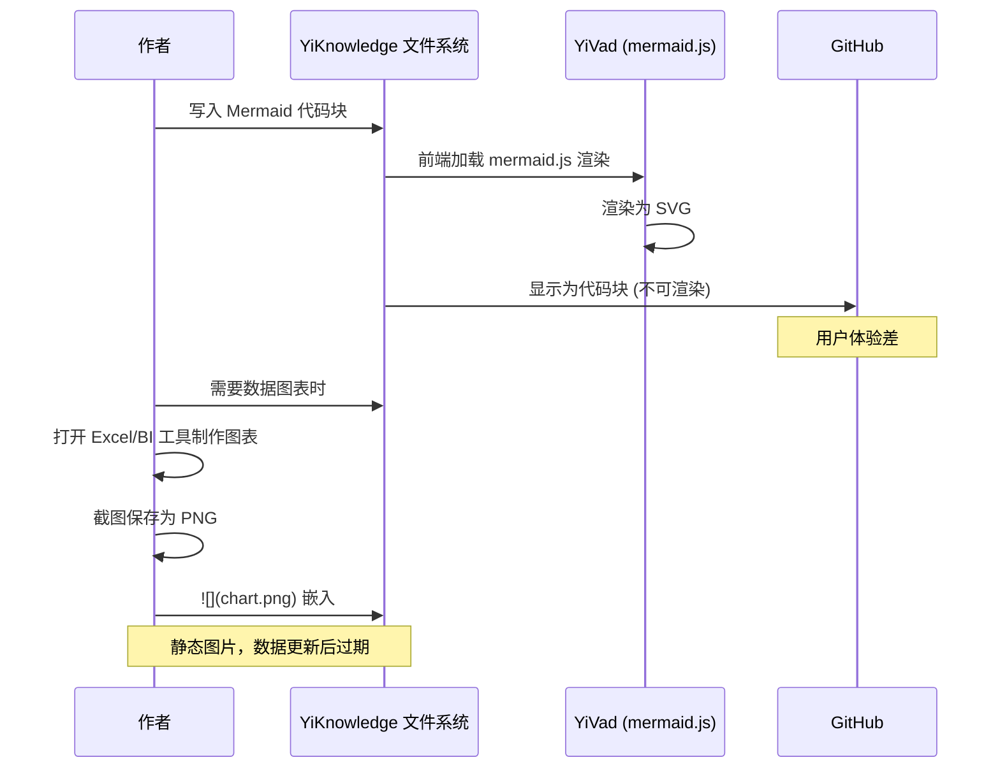
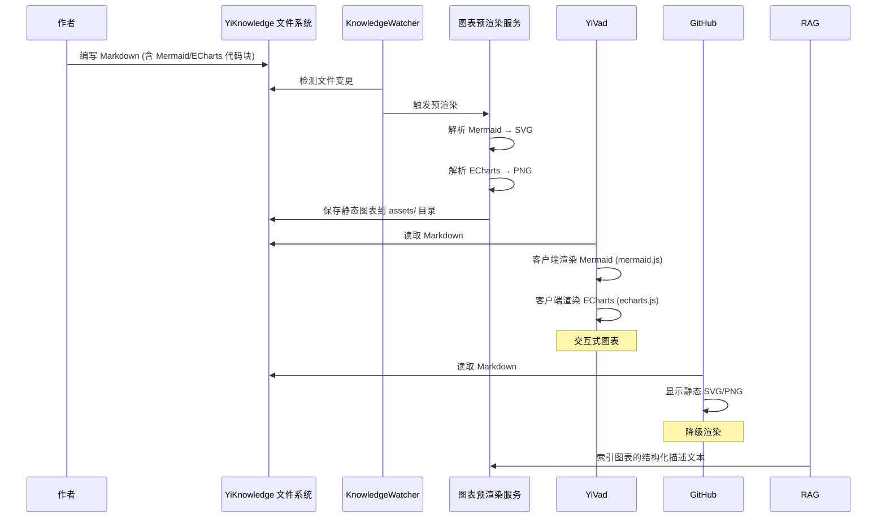
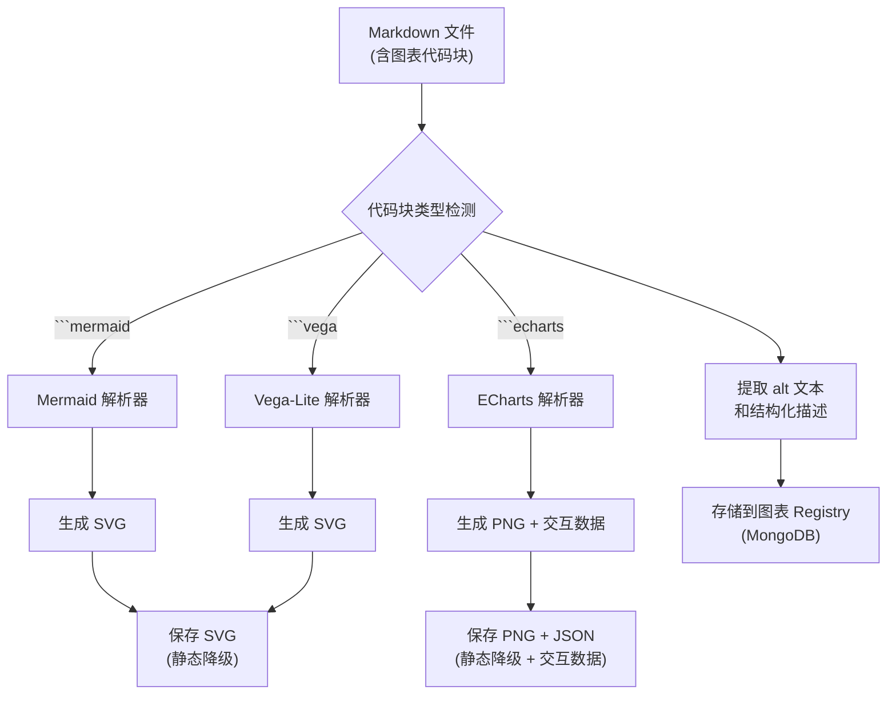
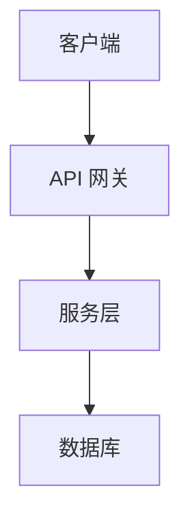

# YK-09-120: 图表与可视化嵌入 — Mermaid/ECharts 嵌入式图表、渲染管线、交互式图表、外部数据源、无障碍替代、图表版本管理

> 需求编号：YK-09-120 · 优先级：P2 · 人天：0.3d · 状态：需求已编写
> 依赖：YK-09-28（健康仪表盘）

## 背景

YiKnowledge 的知识文件大量使用 Mermaid 图表来描述架构、流程和数据流。当前的问题是：

1. **渲染不一致**：Mermaid 图表在不同平台（GitHub、YiVad、YiPet）的渲染效果不同，甚至在 GitHub 上根本不能渲染
2. **无法嵌入数据图表**：Markdown 不支持 ECharts 等数据可视化图表，需要截图嵌入静态图片
3. **没有交互式图表**：所有图表都是静态的，用户无法悬停查看详情、缩放、筛选
4. **数据图表无法更新**：嵌入的静态图片在源数据更新后需要重新截图制作
5. **无障碍缺失**：视力障碍用户无法通过屏幕阅读器理解图表内容

**核心矛盾**：知识库中的图表是理解架构和数据的关键，但 Markdown 的图表能力有限——Mermaid 渲染依赖外部工具，数据可视化几乎不可行。

### 影响范围

| # | 影响 | 严重程度 | 典型场景 |
|---|------|----------|----------|
| 1 | 图表渲染不一致 | 高 | Mermaid 在 GitHub 上显示为代码块 |
| 2 | 无法嵌入数据图表 | 高 | 需要在文章中展示 ECharts 数据图 |
| 3 | 图表静态不可交互 | 中 | 无法悬停查看架构组件详情 |
| 4 | 数据图表过期 | 中 | 源数据变了但图表仍是旧的 |
| 5 | 无障碍缺失 | 中 | 视障用户看不到图表信息 |

### 挑战

| 挑战 | 说明 |
|------|------|
| 多平台渲染 | 需要在 YiVad、YiPet、GitHub 上都能正确展示 |
| 静态降级 | 在不支持交互式图表的平台（GitHub）需要静态降级 |
| 数据绑定 | 图表数据来自外部 API 或 MongoDB 时的实时绑定 |
| 图表版本化 | 图表修改后如何与知识文件同步 |
| 无障碍 | 为图表提供文本描述和 ARIA 标签 |

---

## 一、现状分析

### 1.1 当前图表使用方式

```
作者编写知识文件
  │
  ├─ 使用 Mermaid 代码块
  │   └─ ```mermaid\n  flowchart TD\n  ...
  │   └─ 在 YiVad 中渲染正常，GitHub 中显示为代码块
  │
  ├─ 使用静态图片
  │   └─ 截图 → 保存为 PNG → 
  │   └─ 数据更新后需要重新截图
  │
  └─ 无 ECharts 支持
      └─ 只能用 Mermaid 画简单图表
      └─ 无法嵌入饼图、折线图、热力图
```

### 1.2 当前可用能力

| 能力 | 可用性 | 限制 |
|------|--------|------|
| Mermaid 渲染（YiVad） | ✅ | GitHub 不渲染 |
| Mermaid 渲染（YiPet） | ⚠️ | 需加载 mermaid.js |
| Mermaid 渲染（GitHub） | ❌ | 显示为代码块 |
| ECharts 数据图表 | ❌ | Markdown 不支持 |
| 静态图片嵌入 | ✅ | 数据更新后过期 |
| 图表无障碍 | ❌ | 无替代文本 |

### 1.3 改造前数据流



### 1.4 根因矩阵

| 症状 | 根因 | 触发条件 | 频率 |
|------|------|----------|------|
| GitHub 不可渲染 Mermaid | GitHub 不原生支持 Mermaid | 每次在 GitHub 查看知识 | 每次 |
| 无法嵌入数据图表 | Markdown 不支持 JavaScript 图表 | 需要在知识文件中展示数据 | 中 |
| 图表静态不可交互 | Markdown 无交互机制 | 需要深入了解图表细节 | 中 |
| 数据图表过期 | 静态图片不自动更新 | 数据源变更后 | 高 |
| 无障碍缺失 | 图表为纯图片无替代文本 | 视障用户访问 | 每次 |

---

## 二、设计决策

### 决策 1：图表渲染策略 — 客户端渲染 vs 预渲染 vs 混合

| 选项 | 动态性 | 跨平台兼容 | 首次加载速度 |
|------|--------|-----------|------------|
| 客户端渲染（mermaid.js/ECharts） | 高 | 低 | 中 |
| 服务端预渲染（SVG/PNG） | 低 | 高 | 高 |
| 混合（客户端 + 静态降级） | 高 | 高 | 高 |

**选择：混合（客户端 + 静态降级）。** YiVad/YiPet 使用客户端渲染（mermaid.js + ECharts）。同时服务端预渲染一份静态 SVG，用于 GitHub 和不支持 JavaScript 的环境（作为降级兜底）。RAG 索引也使用静态 SVG 的文本描述。

### 决策 2：ECharts 数据源 — 静态嵌入 vs API 绑定 vs 文件引用

| 选项 | 数据实时性 | 实现复杂度 | 离线可用性 |
|------|-----------|-----------|-----------|
| 静态嵌入（JSON 数据在 Markdown 中） | 低 | 低 | 高 |
| API 绑定（图表数据来自 API） | 高 | 高 | 低 |
| 文件引用（数据来自 JSON/YAML 文件） | 中 | 中 | 中 |

**选择：文件引用 + 静态嵌入。** 默认静态嵌入（JSON 代码块），确保离线可用。可选文件引用（`data: ./metrics.json`），通过 KnowledgeWatcher 检测数据文件变更并触发图表重新渲染。暂不实现 API 绑定（复杂度高）。

### 决策 3：图表无障碍 — 仅 alt 文本 vs 结构化描述 vs AI 生成描述

| 选项 | 可访问性 | 实现复杂度 | 准确性 |
|------|----------|-----------|--------|
| 仅 alt 文本（手动写） | 低 | 低 | 高 |
| 结构化描述（表格化图表数据） | 中 | 中 | 高 |
| AI 生成描述（LLM 分析图表） | 高 | 高 | 中 |

**选择：结构化描述 + alt 文本。** 每个图表需要 `alt` 文本（屏幕阅读器兼容），并提供一个可折叠的结构化表格描述（包含图表的所有数据点），方便视障用户和 RAG 检索理解图表内容。

### 决策 4：图表版本化 — Git 管理 vs 独立版本 vs 与文档绑定

| 选项 | 可追溯性 | 实现复杂度 | 存储开销 |
|------|----------|-----------|---------|
| Git 管理（跟随文件版本） | 高 | 低 | 低 |
| 独立版本（图表自身带版本号） | 中 | 中 | 中 |
| 与文档绑定（版本号 = 文档 updated 时间） | 中 | 低 | 低 |

**选择：Git 管理（跟随文件版本）。** 图表代码块嵌入在 Markdown 文件中，天然跟随文件的 Git 版本管理。不引入额外的图表版本号。

### 设计决策记录

| 决策 | 选项 A | 选项 B | 选项 C | 选择 | 理由 |
|------|--------|--------|--------|------|------|
| 渲染策略 | 客户端 | 服务端预渲染 | 混合 | **混合** | 跨平台兼容 |
| 数据源 | 静态嵌入 | API 绑定 | 文件引用 | **文件引用+静态** | 离线优先+可选动态 |
| 无障碍 | alt 文本 | 结构化描述 | AI 描述 | **结构化+alt** | 全面且准确 |
| 版本化 | Git | 独立版本 | 文档绑定 | **Git** | 简单可靠 |

---

## 三、目标架构

### 3.1 改造后图表渲染流程



### 3.2 图表处理管线



### 3.3 性能指标

| 指标 | 改造前 | 改造后 |
|------|--------|--------|
| GitHub 图表可读性 | 0%（显示为代码块） | 100%（静态 SVG/PNG） |
| 数据图表更新方式 | 手动截图 | 自动重新渲染 |
| 图表交互性 | 0 | YiVad/YiPet 全交互 |
| 图表无障碍 | 0 | alt 文本 + 结构化表格 |

---

## 四、具体改动

### 4.1 图表代码块规范

```markdown
<!-- 改造前：Mermaid 代码块，无 extra 属性 -->

<!-- 改造后：增强的图表代码块 -->



```echarts
{
  "alt": "2025 年 Q1-Q4 月度活跃用户增长趋势",
  "caption": "图 2: 月度活跃用户趋势",
  "data": {
    "type": "line",
    "xAxis": ["Q1", "Q2", "Q3", "Q4"],
    "series": [{"name": "MAU", "data": [100, 150, 220, 310]}]
  },
  "accessibleTable": {
    "columns": ["季度", "MAU (万)"],
    "rows": [
      ["Q1", "100"],
      ["Q2", "150"],
      ["Q3", "220"],
      ["Q4", "310"]
    ]
  }
}
```
```

### 4.2 图表预渲染服务

```python
# 改造前：无预渲染
# 改造后：YiAi/services/chart/chart_renderer.py

from dataclasses import dataclass
from typing import Optional

@dataclass
class ChartMeta:
    chart_id: str
    source_file: str
    chart_type: str  # mermaid / echarts / vega
    alt_text: str
    caption: Optional[str]
    static_path: str  # SVG/PNG 文件路径
    accessible_data: dict  # 结构化描述数据
    width: int
    height: int

class ChartRenderer:
    """图表渲染管线"""

    def __init__(self):
        self._registry: Dict[str, ChartMeta] = {}

    async def render_mermaid(self, code: str, meta: dict) -> ChartMeta:
        """渲染 Mermaid 图表为 SVG"""
        # 1. 使用 mermaid-cli (mmdc) 或 playwright 渲染
        svg_content = await self._mermaid_to_svg(code)

        # 2. 保存 SVG 文件
        static_path = self._save_static(svg_content, "svg")

        # 3. 提取无障碍数据
        accessible = self._extract_mermaid_accessible(code)

        chart_meta = ChartMeta(
            chart_id=generate_id(),
            source_file=meta.get("source_file"),
            chart_type="mermaid",
            alt_text=meta.get("alt", ""),
            caption=meta.get("caption"),
            static_path=static_path,
            accessible_data=accessible,
            width=meta.get("width", 800),
            height=meta.get("height", 600),
        )
        self._registry[chart_meta.chart_id] = chart_meta
        return chart_meta

    async def render_echarts(self, chart_json: dict, meta: dict) -> ChartMeta:
        """渲染 ECharts 图表为 PNG"""
        # 1. 使用 headless Chrome/Puppeteer 渲染 ECharts
        png_content = await self._echarts_to_png(chart_json)

        # 2. 保存 PNG 文件
        static_path = self._save_static(png_content, "png")

        # 3. 提取无障碍数据
        accessible = chart_json.get("accessibleTable", {})

        chart_meta = ChartMeta(
            chart_id=generate_id(),
            source_file=meta.get("source_file"),
            chart_type="echarts",
            alt_text=meta.get("alt", chart_json.get("alt", "")),
            caption=meta.get("caption", chart_json.get("caption")),
            static_path=static_path,
            accessible_data=accessible,
            width=chart_json.get("width", 800),
            height=chart_json.get("height", 400),
        )
        self._registry[chart_meta.chart_id] = chart_meta
        return chart_meta

    async def get_chart_html(self, chart_id: str, interactive: bool = True) -> str:
        """获取图表的 HTML 片段（客户端渲染或静态降级）"""
        chart_meta = self._registry.get(chart_id)
        if not chart_meta:
            return ""

        if interactive:
            # 返回客户端渲染脚本（mermaid.js / ECharts）
            return self._generate_interactive_html(chart_meta)
        else:
            # 返回静态  或 <svg> 标签
            return self._generate_static_html(chart_meta)
```

### 4.3 文件变更清单

| 文件 | 操作 | 说明 |
|------|------|------|
| `YiAi/services/chart/chart_renderer.py` | 新增 | 图表渲染管线 |
| `YiAi/services/chart/mermaid_renderer.py` | 新增 | Mermaid → SVG 渲染 |
| `YiAi/services/chart/echarts_renderer.py` | 新增 | ECharts → PNG 渲染 |
| `YiAi/services/chart/chart_registry.py` | 新增 | 图表注册表（MongoDB） |
| `YiAi/services/chart/accessibility.py` | 新增 | 图表无障碍数据提取 |
| `YiVad/src/components/chart/ChartBlock.vue` | 新增 | 图表客户端渲染组件 |
| `YiVad/src/components/chart/MermaidViewer.vue` | 新增 | Mermaid 客户端渲染 |
| `YiVad/src/components/chart/EChartsViewer.vue` | 新增 | ECharts 客户端渲染 |
| `YiKnowledge/curator/charts/chart-guidelines.md` | 新增 | 图表编写规范 |

---

## 五、实施步骤

| 步骤 | 操作 | 路径 | 验证 | 人天 |
|------|------|------|------|------|
| 1 | 定义图表代码块规范 | `chart-guidelines.md` | 规范文档完成 | 0.03 |
| 2 | 实现 Mermaid → SVG 预渲染 | `mermaid_renderer.py` | Mermaid 正确渲染为 SVG | 0.05 |
| 3 | 实现 ECharts → PNG 预渲染 | `echarts_renderer.py` | ECharts 正确渲染为 PNG | 0.05 |
| 4 | 实现图表注册表 | `chart_registry.py` | 图表元数据正确存储 | 0.03 |
| 5 | 实现无障碍数据提取 | `accessibility.py` | alt 文本 + 结构化表格 | 0.04 |
| 6 | 实现前端渲染组件 | `YiVad ChartBlock.vue` | Mermaid + ECharts 客户端渲染 | 0.05 |
| 7 | 集成到 KnowledgeWatcher | `knowledge_watcher.py` | 文件变更触发预渲染 | 0.03 |
| 8 | 集成测试 | 全量 | 完整图表渲染管线 | 0.02 |

**总人天：0.3d**

---

## 六、测试规格

### 场景 1：Mermaid 图表渲染

**GIVEN** Markdown 文件包含 Mermaid flowchart 代码块
**WHEN** KnowledgeWatcher 检测到文件变更
**THEN** 应生成 SVG 静态文件到 `assets/` 目录
**AND** 应注册图表元数据到 chart_registry
**AND** YiVad 应加载 mermaid.js 客户端渲染交互式图表

### 场景 2：ECharts 数据图表渲染

**GIVEN** Markdown 文件包含 ECharts 折线图代码块
**WHEN** 预渲染执行
**THEN** 应生成 PNG 静态文件
**AND** YiVad 应客户端渲染交互式 ECharts（支持悬停、缩放）
**AND** GitHub 应显示静态 PNG 图片

### 场景 3：图表无障碍

**GIVEN** Mermaid 图表包含 `alt="系统架构流程图"`
**WHEN** 屏幕阅读器访问
**THEN** 应读出 alt 文本
**AND** 应提供可展开的表格描述（节点、边、流程步骤）

### 场景 4：静态降级

**GIVEN** 用户在 GitHub 查看包含图表的 Markdown 文件
**WHEN** GitHub 不执行 JavaScript
**THEN** 应显示  标签引用预渲染的 SVG/PNG
**AND** 应显示 alt 文本

### 场景 5：数据文件变更触发重新渲染

**GIVEN** ECharts 图表的数据来自 `metrics.json` 文件
**WHEN** `metrics.json` 被修改
**THEN** KnowledgeWatcher 应检测到变更
**AND** 应触发图表重新预渲染
**AND** 图表文件应更新

### 场景 6：图表版本管理

**GIVEN** Mermaid 图表被修改了布局
**WHEN** Markdown 文件保存
**THEN** 新 SVG 应覆盖旧 SVG
**AND** Git 提交应记录图表变更历史

---

## 七、风险与缓解

| 风险 | 概率 | 影响 | 缓解措施 |
|------|------|------|----------|
| headless Chrome 预渲染内存泄漏 | 中 | 中 | 进程池 + 超时重启 |
| ECharts JSON 格式错误 | 中 | 中 | Schema 校验 + 错误渲染为红色警告图 |
| 图表文件过多占用磁盘 | 低 | 低 | 仅预渲染最近修改的文件图表 |
| 客户端渲染 JS 加载失败 | 低 | 中 | 静默降级为静态图片 |
| Mermaid 语法复杂导致 SVG 渲染错误 | 中 | 中 | 错误时显示原始代码 + 错误提示 |

---

## 八、回滚策略

| 场景 | 回滚操作 | 影响 |
|------|----------|------|
| 预渲染服务不稳定 | 关闭自动预渲染，仅做客户端渲染 | GitHub 不可渲染 |
| 客户端渲染库体积过大 | 延迟加载 mermaid.js/ECharts | 首次加载慢 |
| 图表注册表性能问题 | 降级为文件系统元数据 | 查询性能下降 |

---

## 九、设计决策记录

### D-01：预渲染输出格式

- **问题**：预渲染输出 SVG 还是 PNG
- **选项**：SVG、PNG、两者
- **选择**：Mermaid → SVG、ECharts → PNG
- **理由**：Mermaid 是矢量图，SVG 可无损缩放且文件小；ECharts 数据图可能包含复杂渐变和大量数据点，PNG 更可靠

### D-02：图表 asset 存储路径

- **问题**：预渲染的图表文件存储在何处
- **选项**：与 Markdown 同目录、`assets/charts/` 集中存储、MongoDB GridFS
- **选择**：与 Markdown 同目录的 `assets/` 子目录
- **理由**：就近存储便于管理，文件系统比 MongoDB GridFS 更易维护和版本控制

### D-03：交互式图表功能范围

- **问题**：客户端交互式图表支持哪些交互
- **选项**：仅悬停、悬停+缩放、悬停+缩放+筛选、全交互
- **选择**：悬停 + 缩放 + 图例切换
- **理由**：核心交互满足大部分需求，全交互（如拖拽、联动）复杂度高且不必要

### D-04：预渲染触发时机

- **问题**：何时触发图表预渲染
- **选项**：文件保存时、KnowledgeWatcher 检测到变更时、手动触发
- **选择**：KnowledgeWatcher 检测到变更时（自动）
- **理由**：自动化触发确保图表始终与 Markdown 源码同步，无需人工干预

---

## 十、可观测性

### 指标

| 指标 | 类型 | 说明 |
|------|------|------|
| `chart.render.mermaid.count` | Counter | Mermaid 渲染次数 |
| `chart.render.echarts.count` | Counter | ECharts 渲染次数 |
| `chart.render.error.count` | Counter | 渲染失败次数 |
| `chart.render.duration` | Histogram | 单次渲染耗时 |
| `chart.registry.size` | Gauge | 图表注册表条目数 |

### 告警

| 告警 | 条件 | 级别 |
|------|------|------|
| 渲染失败率过高 | 1h 内失败率 > 10% | WARNING |
| 预渲染服务不可用 | 连续 3 次健康检查失败 | CRITICAL |

---

## 十一、代码审查检查清单

- [ ] Mermaid 代码块正确解析并预渲染为 SVG
- [ ] ECharts 代码块正确解析并预渲染为 PNG
- [ ] 图表包含 alt 文本和结构化描述
- [ ] 客户端渲染支持悬停/缩放/图例切换交互
- [ ] GitHub 降级渲染使用静态 SVG/PNG
- [ ] 数据文件变更触发图表重新渲染
- [ ] 图表文件跟随 Git 版本管理
- [ ] 图表 asset 文件存储在与 Markdown 同目录的 assets/
- [ ] 渲染错误时有友好提示（不崩溃）
- [ ] 图表代码块规范文档完整
- [ ] RAG 索引包含图表的结构化描述文本

---

## 回归问题预测

| # | 预测问题 | 原因 | 验证方法 |
|---|---------|------|---------|
| 1 | Mermaid 代码块中包含中文字符（如节点标签为中文），headless Chrome 渲染时因系统缺少中文字体导致 SVG 中出现方块或空白 | mermaid-cli 使用 Puppeteer 渲染，headless Chrome 环境可能未安装中文字体，中文渲染为 tofu（缺字方块） | 渲染包含中文标签的 Mermaid 图表，验证 SVG 中中文字符正确显示 |
| 2 | ECharts 代码块体积过大（如包含 1000+ 数据点的散点图），`echarts_to_png` 渲染超时或内存溢出 | headless Chrome 渲染大数据图表时，Canvas 绘制可能超过 30s 超时限制 | 渲染包含 5000 个数据点的 ECharts 图表，验证有超时降级机制（返回简化版本或错误提示） |
| 3 | 图表 asset 文件在 Markdown 文件重命名或移动后，静态图片引用路径断裂（`` 指向不存在的路径） | KnowledgeWatcher 的重命名检测仅更新 Markdown 路径，未同步更新图表 asset 的相对引用 | 重命名一个包含图表的 Markdown 文件（从 `a.md` 改为 `b.md`），验证文件内图表引用路径也同步更新 |
| 4 | 客户端渲染中 ECharts 初始化时，图表容器 DOM 尺寸为 0（因图表在折叠面板中默认隐藏），ECharts 报错且图表渲染为空白 | ECharts 需要容器有明确的宽高，`display:none` 的容器宽高为 0，ECharts `resize()` 未被触发 | 在折叠面板中嵌入 ECharts 图表，展开折叠面板后验证图表正确渲染（有 resize 监听） |
| 5 | 多个 Markdown 文件包含相同的 Mermaid 代码块（如项目模板中的标准流程图），预渲染为多个重复的 SVG 文件浪费磁盘空间 | 图表注册表按 `chart_id` 索引但未做内容去重，相同图表被多次渲染和存储 | 创建 3 个文件包含完全相同的 Mermaid 代码块，验证图表去重逻辑（同 hash 的图表仅渲染和存储一次） |
| 6 | 无障碍结构化描述表格在 RAG 检索引擎中作为独立文本索引，但其向量化结果与图表标题/alt 文本重复，导致检索结果中出现多条"相同"内容 | 图表的结构化描述在 MongoDB 中作为独立 knowledge_file 存储，其内容的向量与图表 alt 文本高度相似，检索去重失效 | RAG 检索"图表"相关查询，验证同一图表的多种表示（alt 文本/结构化表格/标题）被去重为 1 条结果 |

---

## 性能分析

### 图表渲染关键操作耗时

| 操作 | 耗时 | 说明 |
|------|------|------|
| Mermaid → SVG（简单图） | 200-500ms | headless Chrome 启动 + 渲染 |
| Mermaid → SVG（复杂图，50+ 节点） | 1-3s | 含布局计算 |
| ECharts → PNG（100 数据点） | 500-1000ms | headless Chrome 启动 + Canvas 渲染 |
| 图表注册表写入 | < 5ms | MongoDB 插入 |
| 客户端 mermaid.js 渲染 | 10-50ms | 浏览器内 SVG 生成 |
| 客户端 ECharts 渲染 | 20-100ms | Canvas 渲染 |

### 存储预估

| 图表类型 | 平均文件大小 |
|----------|------------|
| Mermaid SVG（简单） | 5-15KB |
| Mermaid SVG（复杂） | 20-50KB |
| ECharts PNG（800×400） | 30-80KB |
| ECharts PNG（高清） | 100-200KB |

---

## 相关文档

- [Mermaid 文档](https://mermaid.js.org/)
- [ECharts 文档](https://echarts.apache.org/)
- [Web Content Accessibility Guidelines (WCAG) - Non-text Content](https://www.w3.org/WAI/WCAG21/Understanding/non-text-content.html)
- [YK-09-28 健康仪表盘](28-需求-健康仪表盘.md)