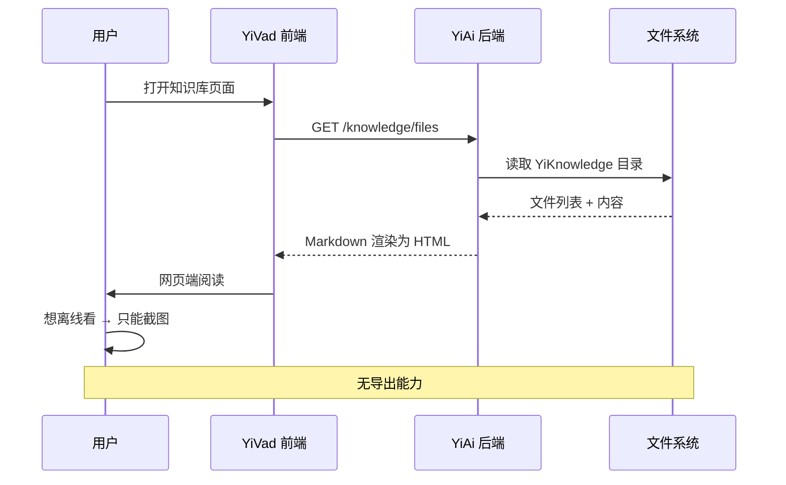
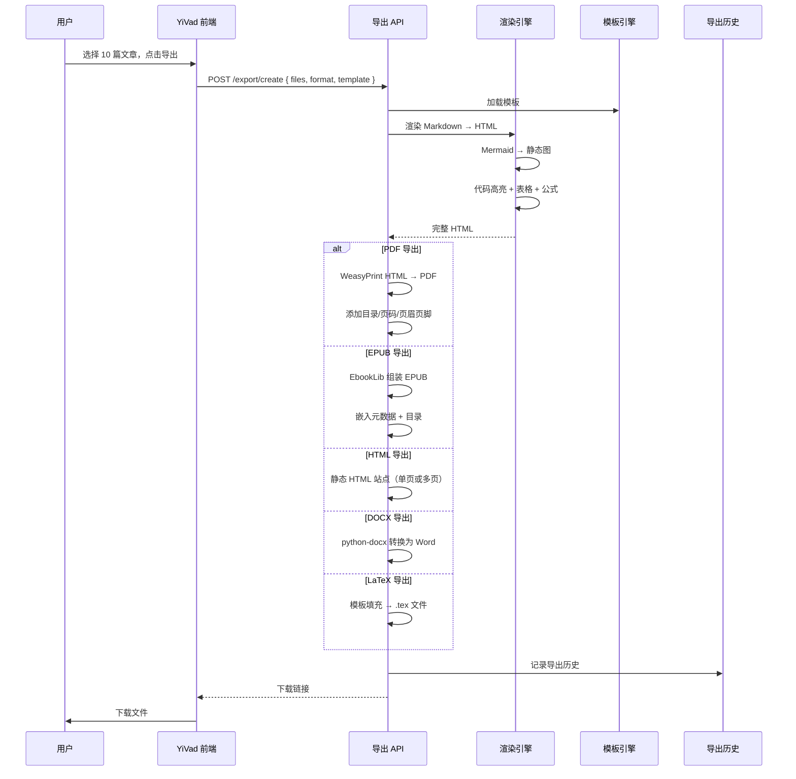
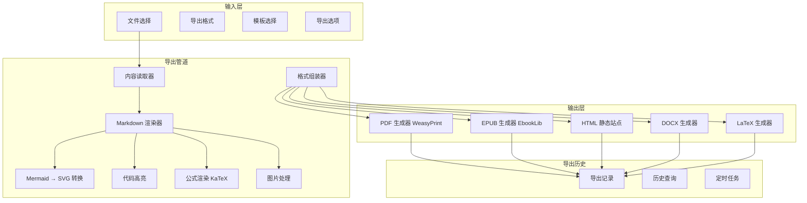

# YK-09-122: 内容导出管道 — 多格式导出 PDF/EPUB/HTML/DOCX/LaTeX、导出模板、批量导出、定时导出、导出历史

> 需求编号：YK-09-122 · 优先级：P2 · 人天：0.3d · 状态：需求已编写
> 依赖：YK-09-107（内容发布与订阅）

## 背景

### 问题陈述

YiKnowledge 中的知识文件以 Markdown 格式存储在文件系统中，通过 YiVad 网页端浏览。但在以下场景中，纯粹的网页浏览体验不足：

1. 离线阅读——没有网络时需要 PDF/EPUB 离线阅读
2. 正式报告——向管理层提交的技术报告需要 PDF 格式（含目录/页码/页眉页脚）
3. 跨平台分发——需要在 Kindle/微信读书/Word 中阅读
4. 打印归档——纸质归档需要格式化的 PDF
5. 学术引用——需要 LaTeX 格式用于论文引用

**核心矛盾**：Markdown 是优秀的编写格式，但不是良好的分发格式。当前知识库无任何导出能力，所有知识的消费被锁在 YiVad 网页端。用户无法"带走"知识。

### 影响范围

| # | 影响 | 严重程度 | 典型场景 |
|---|------|----------|----------|
| 1 | 无法离线阅读 | 高 | 出差途中想阅读技术文档 |
| 2 | 正式报告缺失 | 高 | 月度技术报告需要格式化的 PDF |
| 3 | 分发渠道单一 | 中 | 跨团队分享只能发 YiVad 链接 |
| 4 | 打印不便 | 中 | 需要纸质版评审文档 |
| 5 | 知识锁定 | 中 | 离职后无法带走学习资料 |

### 挑战

| 挑战 | 说明 |
|------|------|
| PDF 生成 | 中文排版、目录、页码、页眉页脚需完整支持 |
| Markdown 渲染 | Mermaid/代码块/表格/公式在不同格式中的渲染差异 |
| 批量导出 | 多文件合并为一本"书"，章节排序与前缀依赖 |
| 模板系统 | 不同场景需要不同的排版风格（正式/简约/学术） |
| 大文件导出 | 100+ 篇文章合并导出时性能 |

---

## 一、现状分析

### 1.1 当前知识消费模式

```
用户需要获取知识内容
  │
  ├─ YiVad 网页端
  │   ├─ 登录 → 打开知识库 → 搜索/浏览文件
  │   ├─ 在线阅读（需联网 + 登录）
  │   └─ 浏览器打印（无目录无页码无样式）
  │
  ├─ 手动复制
  │   ├─ 选中文本 → cmd+C
  │   ├─ 粘贴到 Word/Notion
  │   └─ 手动调整格式（代码块/Mermaid 丢失）
  │
  └─ Git 拉取原始文件
      ├─ cd YiKnowledge
      ├─ cat some-file.md
      └─ 在终端阅读 Markdown（代码块可看但格式粗糙）
```

### 1.2 当前可用能力

| 能力 | 可用性 | 获取方式 | 限制 |
|------|--------|----------|------|
| 网页阅读 | ✅ | YiVad 知识库页面 | 需在线 |
| 浏览器打印 | ⚠️ | cmd+P | 无目录/页码/样式 |
| 原始 Markdown | ✅ | Git 仓库 | 需 Git 权限 |
| PDF 下载 | ❌ | 无 | — |
| EPUB 下载 | ❌ | 无 | — |
| 批量导出 | ❌ | 无 | — |

### 1.3 改造前数据流



### 1.4 根因矩阵

| 症状 | 根因 | 触发条件 | 频率 |
|------|------|----------|------|
| 无法离线阅读 | 无离线格式导出 | 出差/通勤 | 每周 |
| 无法正式分发 | 无 PDF/EPUB 导出 | 报告/分享 | 每月 |
| 跨平台消费受限 | 仅网页端唯一渠道 | 跨设备阅读 | 每周 |
| 归档不便 | 无可打印格式 | 项目结项 | 每季度 |
| 批量操作缺失 | 无批量导出 | 整体回顾 | 每月 |

---

## 二、设计决策

### 决策 1：PDF 生成引擎 — WeasyPrint vs wkhtmltopdf vs Puppeteer vs Python-Markdown+ReportLab

| 选项 | 中文支持 | 目录/页码 | 处理复杂度 | 安装难度 |
|------|----------|----------|-----------|----------|
| WeasyPrint (Python) | 好 | 原生支持 | 中 | 中（需要系统库） |
| wkhtmltopdf | 中 | 需 CSS | 低 | 低 |
| Puppeteer (Node.js) | 好 | 需 CSS | 高 | 高 |
| ReportLab (Python) | 需字体配置 | 需手动 | 高 | 低 |

**选择：WeasyPrint。** Python 原生库，与 YiAi FastAPI 技术栈一致。原生支持 CSS Paged Media（目录、页码、页眉页脚），中文排版需配置字体。系统依赖可预装（`libcairo2` 等）。

### 决策 2：EPUB 生成方式 — 自建 vs EbookLib vs Pandoc 调用

| 选项 | 中文支持 | 元数据 | 实现复杂度 |
|------|----------|--------|-----------|
| 自建 XML 拼装 | 中 | 需手动 | 高 |
| EbookLib (Python) | 好 | 原生支持 | 低 |
| Pandoc 子进程调用 | 好 | 丰富 | 中 |

**选择：EbookLib。** Python 库最简单，支持 EPUB 2/3，原生处理元数据（标题/作者/目录/封面），无需额外系统依赖。Pandoc 需额外安装系统命令。

### 决策 3：导出模板 — 内置固定样式 vs 用户可编辑模板 vs 预设 + 自定义

| 选项 | 灵活性 | 易用性 | 实现复杂度 |
|------|--------|--------|-----------|
| 内置固定样式 | 低 | 高 | 低 |
| 用户可编辑模板 | 高 | 低 | 高 |
| 预设模板 + 可选自定义 | 高 | 高 | 中 |

**选择：预设模板 + 可选自定义。** 提供 3 个预设（正式报告/简约笔记/学术论文），用户可通过 YiVad 上传自定义 CSS/模板文件进行定制。MVP 先实现预设。

### 决策 4：批量导出合并策略 — 单文件合并 vs 独立文件打包 vs 可选

| 选项 | 阅读体验 | 文件管理 | 实现复杂度 |
|------|----------|----------|-----------|
| 合并为一本电子书 | 高 | 简单（1 个文件） | 中 |
| 每篇文章独立文件 + ZIP | 中 | 复杂（N 个文件） | 低 |
| 用户可选（合并版 + 独立版） | 高 | 高 | 中 |

**选择：用户可选。** 默认合并为一本电子书（推荐），用户可勾选"每篇文章独立文件"获得 ZIP 包。正式报告场景需要合并，库存归档场景需要独立。

### 设计决策记录

| 决策 | 选项 A | 选项 B | 选项 C | 选择 | 理由 |
|------|--------|--------|--------|------|------|
| PDF 引擎 | WeasyPrint | Puppeteer | ReportLab | **WeasyPrint** | Python 原生 + 中文 |
| EPUB 引擎 | 自建 | EbookLib | Pandoc | **EbookLib** | 最简依赖 |
| 模板系统 | 固定样式 | 可编辑 | 预设+自定义 | **预设+自定义** | MVP 预设+扩展 |
| 合并策略 | 合并 | 独立 | 可选 | **可选** | 覆盖场景 |

---

## 三、目标架构

### 3.1 改造后导出流程



### 3.2 导出管道架构



### 3.3 性能指标

| 指标 | 改造前 | 改造后 |
|------|--------|--------|
| 单篇文章导出 PDF | 不可用 | < 3s |
| 10 篇合并导出电子书 | 不可用 | < 15s |
| 100 篇批量导出（HTML 站点） | 不可用 | < 60s |
| 定时导出自动执行 | 不可用 | 按计划执行 |

---

## 四、具体改动

### 4.1 导出服务核心

```python
# 改造前：无导出服务
# YiAi/services/export/export_service.py (改造后)

from dataclasses import dataclass, field
from typing import List, Optional, Dict
from enum import Enum

class ExportFormat(Enum):
    PDF = "pdf"
    EPUB = "epub"
    HTML_SINGLE = "html_single"
    HTML_SITE = "html_site"
    DOCX = "docx"
    LATEX = "latex"

class TemplatePreset(Enum):
    FORMAL_REPORT = "formal_report"
    SIMPLE_NOTE = "simple_note"
    ACADEMIC_PAPER = "academic_paper"

@dataclass
class ExportTask:
    task_id: str
    files: List[str]  # 文件路径列表
    format: ExportFormat
    template: TemplatePreset = TemplatePreset.SIMPLE_NOTE
    options: Dict = field(default_factory=dict)
    status: str = "pending"  # pending/processing/completed/failed
    output_path: Optional[str] = None
    created_at: str = ""
    completed_at: Optional[str] = None

@dataclass
class ExportResult:
    task_id: str
    format: ExportFormat
    file_path: str
    file_size: int
    download_url: str
    pages: Optional[int] = None  # PDF only
    expires_at: str = ""  # 下载链接过期时间


class ExportService:
    """多格式导出管道"""

    def __init__(self):
        self.template_dir = "YiKnowledge/curator/export-templates/"

    async def create_export_task(
        self,
        files: List[str],
        format: ExportFormat = ExportFormat.PDF,
        template: TemplatePreset = TemplatePreset.SIMPLE_NOTE,
        options: Dict = None
    ) -> ExportTask:
        """创建导出任务"""
        task = ExportTask(
            task_id=self.generate_task_id(),
            files=files,
            format=format,
            template=template,
            options=options or {},
            created_at=datetime.now().isoformat(),
        )
        # 异步执行导出
        asyncio.create_task(self.execute_export(task))
        return task

    async def execute_export(self, task: ExportTask) -> ExportResult:
        """执行导出管道"""
        try:
            task.status = "processing"

            # 1. 读取所有文件内容
            contents = await self.read_files(task.files)

            # 2. Markdown → HTML（统一中间格式）
            html_parts = [self.render_markdown(c) for c in contents]

            # 3. 加载模板
            template_html = self.load_template(task.template)

            # 4. 根据格式生成
            if task.format == ExportFormat.PDF:
                result = await self.generate_pdf(html_parts, template_html, task)
            elif task.format == ExportFormat.EPUB:
                result = await self.generate_epub(html_parts, task)
            elif task.format in (ExportFormat.HTML_SINGLE, ExportFormat.HTML_SITE):
                result = await self.generate_html(html_parts, task)
            elif task.format == ExportFormat.DOCX:
                result = await self.generate_docx(html_parts, task)
            elif task.format == ExportFormat.LATEX:
                result = await self.generate_latex(html_parts, task)

            task.status = "completed"
            task.completed_at = datetime.now().isoformat()

            # 保存导出历史
            await self.save_export_history(task, result)
            return result

        except Exception as e:
            task.status = "failed"
            raise

    async def generate_pdf(
        self, html_parts: List[str], template: str, task: ExportTask
    ) -> ExportResult:
        """WeasyPrint 生成 PDF（含目录、页码、页眉页脚）"""
        from weasyprint import HTML

        # 组装完整 HTML
        full_html = self.assemble_html(html_parts, template, task)

        # 添加 CSS Paged Media（目录/页码/页眉）
        css = self.load_page_css(task.template)

        output_path = f"/tmp/exports/{task.task_id}.pdf"
        HTML(string=full_html).write_pdf(output_path, stylesheets=[css])

        pages = self.get_pdf_page_count(output_path)
        file_size = os.path.getsize(output_path)

        return ExportResult(
            task_id=task.task_id,
            format=ExportFormat.PDF,
            file_path=output_path,
            file_size=file_size,
            download_url=f"/exports/download/{task.task_id}",
            pages=pages,
        )

    async def generate_epub(
        self, html_parts: List[str], task: ExportTask
    ) -> ExportResult:
        """EbookLib 生成 EPUB"""
        from ebooklib import epub

        book = epub.EpubBook()
        book.set_identifier(task.task_id)
        book.set_title(task.options.get("title", "知识库导出"))
        book.set_language("zh")

        # 添加章节
        chapters = []
        for i, html in enumerate(html_parts):
            chapter = epub.EpubHtml(
                title=f"Chapter {i+1}",
                file_name=f"chap_{i+1}.xhtml",
                lang="zh",
            )
            chapter.content = html.encode("utf-8")
            book.add_item(chapter)
            chapters.append(chapter)

        # 目录
        book.toc = chapters
        book.add_item(epub.EpubNcx())
        book.add_item(epub.EpubNav())

        # 样式
        style = epub.EpubItem(
            uid="style",
            file_name="style/default.css",
            media_type="text/css",
            content=self.get_epub_css(),
        )
        book.add_item(style)

        book.spine = ["nav"] + chapters

        output_path = f"/tmp/exports/{task.task_id}.epub"
        epub.write_epub(output_path, book)

        return ExportResult(
            task_id=task.task_id,
            format=ExportFormat.EPUB,
            file_path=output_path,
            file_size=os.path.getsize(output_path),
            download_url=f"/exports/download/{task.task_id}",
        )

    async def generate_html(
        self, html_parts: List[str], task: ExportTask
    ) -> ExportResult:
        """生成静态 HTML 站点（单页或多页）"""
        is_single = task.format == ExportFormat.HTML_SINGLE

        if is_single:
            full_html = self.assemble_html(html_parts, self.load_template(task.template), task)
            output_path = f"/tmp/exports/{task.task_id}.html"
            with open(output_path, "w", encoding="utf-8") as f:
                f.write(full_html)
        else:
            # 多页站点：生成 index.html + 每篇文章独立页面 + 导航
            site_dir = f"/tmp/exports/{task.task_id}_site/"
            os.makedirs(site_dir, exist_ok=True)
            self.generate_html_site(html_parts, task, site_dir)
            output_path = f"{site_dir}.zip"
            shutil.make_archive(site_dir.rstrip("/"), "zip", site_dir)

        return ExportResult(
            task_id=task.task_id,
            format=task.format,
            file_path=output_path,
            file_size=os.path.getsize(output_path),
            download_url=f"/exports/download/{task.task_id}",
        )

    async def generate_docx(
        self, html_parts: List[str], task: ExportTask
    ) -> ExportResult:
        """python-docx 生成 Word 文档"""
        from docx import Document
        from docx.shared import Inches, Pt

        doc = Document()

        for html in html_parts:
            # 简单的 HTML → DOCX 转换（标题、段落、代码块）
            self.html_to_docx_block(html, doc)

        output_path = f"/tmp/exports/{task.task_id}.docx"
        doc.save(output_path)

        return ExportResult(
            task_id=task.task_id,
            format=ExportFormat.DOCX,
            file_path=output_path,
            file_size=os.path.getsize(output_path),
            download_url=f"/exports/download/{task.task_id}",
        )

    async def generate_latex(
        self, html_parts: List[str], task: ExportTask
    ) -> ExportResult:
        """生成 LaTeX 源文件"""
        template = self.load_latex_template(task.template)
        body = "\n\n".join([self.markdown_to_latex(html) for html in html_parts])
        latex_content = template.replace("{BODY}", body)

        output_path = f"/tmp/exports/{task.task_id}.tex"
        with open(output_path, "w", encoding="utf-8") as f:
            f.write(latex_content)

        return ExportResult(
            task_id=task.task_id,
            format=ExportFormat.LATEX,
            file_path=output_path,
            file_size=os.path.getsize(output_path),
            download_url=f"/exports/download/{task.task_id}",
        )

    async def get_export_history(
        self, user_id: str, limit: int = 20
    ) -> List[ExportTask]:
        """查询导出历史"""
        pass

    async def schedule_export(
        self, files: List[str], format: ExportFormat, cron: str
    ) -> str:
        """创建定时导出任务"""
        pass

    def render_markdown(self, content: str) -> str:
        """Markdown → HTML（Mermaid/代码/表格/公式）"""
        pass

    def load_template(self, preset: TemplatePreset) -> str:
        """加载 HTML 模板"""
        pass

    def assemble_html(self, html_parts: List[str], template: str, task: ExportTask) -> str:
        """组装完整 HTML"""
        pass
```

### 4.2 文件变更清单

| 文件 | 操作 | 说明 |
|------|------|------|
| `YiAi/services/export/export_service.py` | 新增 | 导出管道核心服务 |
| `YiAi/services/export/renderers/markdown_renderer.py` | 新增 | Markdown → HTML 渲染器 |
| `YiAi/services/export/renderers/mermaid_renderer.py` | 新增 | Mermaid → SVG 静态图 |
| `YiAi/services/export/generators/pdf_generator.py` | 新增 | WeasyPrint PDF 生成 |
| `YiAi/services/export/generators/epub_generator.py` | 新增 | EbookLib EPUB 生成 |
| `YiAi/services/export/generators/html_generator.py` | 新增 | 静态 HTML 站点生成 |
| `YiAi/services/export/generators/docx_generator.py` | 新增 | DOCX 生成 |
| `YiAi/services/export/generators/latex_generator.py` | 新增 | LaTeX 生成 |
| `YiAi/services/export/template_engine.py` | 新增 | 模板加载和渲染引擎 |
| `YiAi/routers/export.py` | 新增 | 导出 API 路由 |
| `YiKnowledge/curator/export-templates/` | 新增 | 导出模板目录 |
| `YiVad/src/views/export/ExportView.vue` | 新增 | 导出界面 |
| `YiVad/src/views/export/ExportHistory.vue` | 新增 | 导出历史页面 |

---

## 五、实施步骤

| 步骤 | 操作 | 路径 | 验证 | 人天 |
|------|------|------|------|------|
| 1 | 实现 Markdown→HTML 渲染管道 | `renderers/` | Mermaid/代码/表格正确渲染 | 0.05 |
| 2 | 实现 WeasyPrint PDF 生成 | `generators/pdf_generator.py` | 目录/页码/中文正常 | 0.05 |
| 3 | 实现 EbookLib EPUB 生成 | `generators/epub_generator.py` | 章节/目录/元数据完整 | 0.04 |
| 4 | 实现 HTML 静态站点生成 | `generators/html_generator.py` | 单页/多页正确 | 0.03 |
| 5 | 实现 DOCX/LaTeX 生成 | `generators/docx_generator.py`, `latex_generator.py` | 格式正确 | 0.04 |
| 6 | 实现模板系统和预设 | `template_engine.py` | 3 个预设可用 | 0.03 |
| 7 | 实现导出 API 和前端页面 | `routers/export.py`, `ExportView.vue` | 端到端导出成功 | 0.04 |
| 8 | 导出历史 + 定时任务 | `export_service.py` | 历史记录 + 定时执行 | 0.02 |

**总人天：0.3d**

---

## 六、测试规格

### 场景 1：单文件导出 PDF

**GIVEN** 用户选择 1 篇知识文件（含代码块、表格、Mermaid 图）
**WHEN** 选择"正式报告"模板，导出 PDF
**THEN** PDF 应包含目录（含页码）
**AND** 代码块应有语法高亮和行号
**AND** Mermaid 图应渲染为 SVG
**AND** 表格应有边框样式
**AND** 页眉应显示文件名，页脚应显示页码

### 场景 2：批量合并导出 EPUB

**GIVEN** 用户选择 5 篇知识文件（含不同级别的标题）
**WHEN** 选择"简约笔记"模板，导出 EPUB
**THEN** EPUB 应有 5 个章节
**AND** 封面应显示书名（用户自定义）
**AND** 目录应正确映射到各章节
**AND** 在 Apple Books/Calibre 中应可正常打开

### 场景 3：HTML 静态站点导出

**GIVEN** 用户选择 10 篇文章
**WHEN** 选择导出为"多页 HTML 站点"
**THEN** 应生成 index.html + 10 个独立文章页面
**AND** 应有导航栏（上一篇/下一篇/回到首页）
**AND** 应可直接用浏览器打开（无服务端依赖）

### 场景 4：DOCX 格式导出

**GIVEN** 用户选择 3 篇知识文件
**WHEN** 选择导出 DOCX
**THEN** 应生成 .docx 文件
**AND** 标题层级应映射为 Word 标题样式（H1→标题1, H2→标题2）
**AND** 代码块应保持等宽字体格式

### 场景 5：导出历史查询

**GIVEN** 用户在过去 7 天内执行了 3 次导出
**WHEN** 查询导出历史
**THEN** 应显示 3 条导出记录（格式、时间、文件列表、下载链接）
**AND** 过期记录（> 30 天）应标注"链接已过期"

### 场景 6：定时导出

**GIVEN** 用户创建定时导出（每周一 9:00 导出"周报知识汇总"）
**WHEN** 定时任务触发
**THEN** 应自动执行导出并发送通知
**AND** 导出结果应出现在导出历史中

---

## 七、风险与缓解

| 风险 | 概率 | 影响 | 缓解措施 |
|------|------|------|----------|
| WeasyPrint 系统依赖安装失败 | 中 | 高 | Docker 环境预装；文档提供安装脚本 |
| Mermaid 渲染失败（某些复杂图表） | 中 | 中 | 渲染失败时保留 Mermaid 源代码文本 |
| 大文件 PDF 内存溢出 | 中 | 高 | 分页渲染 + 流式写入，10 篇以上分批 |
| 中文字体在 PDF 中缺失 | 高 | 高 | 自动检测系统字体，提供字体包下载 |
| EPUB 在不同阅读器兼容性差 | 中 | 低 | 按 EPUB 3 标准生成，Apple Books 验证兼容 |

---

## 八、回滚策略

| 场景 | 回滚操作 | 影响 |
|------|----------|------|
| WeasyPrint 不可用 | 降级为 wkhtmltopdf 或仅 HTML 导出 | PDF 排版质量下降 |
| Mermaid 渲染服务器依赖不可用 | 降级为文本占位 "Mermaid 图表无法渲染" | 丢失图表内容 |
| DOCX 格式问题多 | 移除 DOCX 选项，保留 PDF/EPUB/HTML | 失去 Word 格式 |
| 导出服务性能不足 | 限制单次导出最多 20 篇文章 | 大批量导出受限 |

---

## 九、设计决策记录

### D-01：Mermaid 渲染方式

- **问题**：Mermaid 图在导出的 PDF/EPUB 中如何呈现
- **选项**：服务端 mermaid-cli 渲染为 SVG、客户端 SVG → 传入服务端、保留 Mermaid 源码
- **选择**：服务端调用 mermaid-cli（或使用 mermaid.ink）渲染为 SVG 再嵌入
- **理由**：离线阅读的 PDF/EPUB 需要静态图片。mermaid-cli 基于 Puppeteer 渲染，质量最高

### D-02：临时文件清理策略

- **问题**：导出的临时文件何时清理
- **选项**：立即删除、24 小时后、7 天后、手动清理
- **选择**：下载链接 24 小时有效，文件 7 天后清理
- **理由**：允许断点续传或重新下载，但不无限占用磁盘

### D-03：PDF 页面大小

- **问题**：PDF 默认页面大小
- **选项**：A4、Letter、可配置
- **选择**：默认 A4（中国标准），支持 Letter 选项
- **理由**：目标用户主要为中文用户，A4 为标准

### D-04：导出文件命名

- **问题**：导出文件如何命名
- **选项**：时间戳、路径摘要、用户自定义
- **选择**：`{文章标题或合集名}_{导出格式}_{日期}.{扩展名}`
- **理由**：清晰标识内容、格式和时间，方便文件管理

---

## 十、可观测性

### 指标

| 指标 | 类型 | 说明 |
|------|------|------|
| `export.tasks.created` | Counter | 导出任务创建数 |
| `export.tasks.completed` | Counter | 导出完成数 |
| `export.tasks.failed` | Counter | 导出失败数 |
| `export.format.used` | Counter | 各格式使用次数 |
| `export.duration` | Histogram | 导出耗时分布 |
| `export.file_count` | Histogram | 每次导出的文件数量 |
| `export.output_size` | Histogram | 导出文件大小分布 |

### 告警

| 告警 | 条件 | 级别 |
|------|------|------|
| 导出失败率过高 | 1h 内失败率 > 20% | WARNING |
| 导出耗时过长 | 单任务 > 120s | WARNING |
| 磁盘空间不足 | `< 1GB` | CRITICAL |

---

## 十一、代码审查检查清单

- [ ] PDF 生成支持中文（宋体/黑体）且无乱码
- [ ] PDF 页眉显示文件名，页脚显示页码
- [ ] 目录（TOC）正确映射 Markdown 标题层级
- [ ] EPUB 支持 5 章节以上批量合并
- [ ] EPUB 在 Apple Books/Calibre 中可打开
- [ ] HTML 站点导出无外链资源依赖
- [ ] DOCX 标题层级正确映射
- [ ] LaTeX 模板正确替换占位符
- [ ] 3 个预设模板（正式/简约/学术）可用
- [ ] 导出历史查询和过期清理
- [ ] 定时导出 cron 格式正确执行
- [ ] Mermaid 渲染失败时保留文本回退

---

## 回归问题预测

| # | 预测问题 | 原因 | 验证方法 |
|---|---------|------|---------|
| 1 | WeasyPrint 对中文字体的处理：用户系统没有安装中文字体（宋体/黑体/Noto Sans CJK），PDF 中所有中文显示为方块（tofu glyph） | WeasyPrint 依赖系统字体渲染中文，Docker 镜像或最小化 Linux 环境可能没有中文字体 | 在 Docker 环境中（无中文字体的 Linux）导出一篇中文文章为 PDF，验证 PDF 中中文正常显示（内置了字体后备方案或自动下载字体） |
| 2 | Markdown 中使用 `` 的相对路径图片，导出 PDF 时路径解析错误导致图片缺失 | WeasyPrint 渲染 HTML 时从当前工作目录解析图片路径，但导出任务的工作目录可能不是 YiKnowledge 目录 | 导出一篇包含相对路径图片的文章为 PDF，验证图片正常显示 |
| 3 | EPUB 中代码块的等宽字体在 Kindle/iBooks/Google Books 中不一致：有的显示为衬线体、有的显示为无衬线、有的不支持中英文混排 | EPUB 不强制包含字体，只有 CSS `font-family: monospace`（没有 @font-face 指定的嵌入等宽字体），各阅读器各自的回退不同 | 在 Kindle/iBooks/Google Books 中打开导出的 EPUB，验证代码块使用等宽字体且中英文混排不偏移 |
| 4 | 批量导出时文章排序基于文件系统顺序（`os.listdir`），不同系统的返回顺序不同（macOS vs Linux），导致电子书中章节顺序错误 | `os.listdir` 不保证排序，`sorted(files)` 按字符串排序可能将 "10-xxx.md" 排在 "2-xxx.md" 之前 | 导出文件名含数字序号的 10 篇文章，验证章节顺序为 1,2,3,...,10（自然排序）而非 1,10,2,3,...,9 |
| 5 | 导出大文件（合并 50 篇 → 500 页 PDF）时 WeasyPrint 内存使用超过 1GB，服务器 OOM 被 kill | WeasyPrint 将整个 HTML 加载到内存中渲染，CSS layout 计算所有页面后才输出，500 页 PDF 可能需要 2-3GB 内存 | 导出 50 篇文章合并的 PDF（约 300-500 页），监控内存使用，验证不触发 OOM 或 500 页上限自动分批 |
| 6 | HTML 站点导出中，单页模式所有文章拼接在一个 HTML 文件中，不同文章之间的 CSS 样式冲突（第一篇文章的 override CSS 覆盖了全局样式） | 各篇文章从 Markdown 渲染为 HTML 后拼接，但 Markdown 中可能嵌入了 `<style>` 标签，作用域未隔离 | 导出 3 篇包含 `<style>` 标签的文章为单页 HTML，验证各文章的样式隔离不互相干扰 |

---

## 性能分析

### 导出管道关键操作耗时

| 操作 | 耗时 | 说明 |
|------|------|------|
| Markdown→HTML（1 篇 ~5000 字） | < 50ms | Python-Markdown 渲染 |
| Mermaid→SVG（中复杂度） | 200-500ms | Puppeteer 渲染 |
| PDF 生成（1 篇，约 3 页） | 500-1000ms | WeasyPrint 渲染 |
| EPUB 生成（5 篇） | 200-500ms | EbookLib 组装 |
| HTML 站点（10 篇） | 100-300ms | 纯文本拼接 |
| 批量 PDF（10 篇，约 30 页） | 3-5s | WeasyPrint 渲染含 TOC |
| 批量 PDF（50 篇，约 150 页） | 15-30s | 内存密集，可分批 |

### 数据量预估

| 导出类型 | 输入 | 输出 | 临时文件 |
|----------|------|------|----------|
| 单篇 PDF | 1 个 .md 文件 (~5KB) | ~500KB PDF | ~2MB HTML+CSS |
| 5 篇 EPUB | 5 个 .md 文件 (~25KB) | ~200KB EPUB | ~5MB 图片+Mermaid |
| 10 篇 HTML 站点 | 10 个 .md 文件 (~50KB) | ~10MB（含图片） | ~5MB |

### 资源影响

| 场景 | CPU | 内存 | 磁盘 |
|------|-----|------|------|
| 单篇导出 | < 5% | < 50MB | < 5MB（临时） |
| 10 篇批量导出 | 20-40% | < 200MB | < 50MB（临时） |
| 50 篇批量导出 | 60-90% | < 1GB | < 200MB（临时） |

---

## 相关文档

- [WeasyPrint 文档](https://doc.courtbouillon.org/weasyprint/stable/)
- [EbookLib 文档](https://docs.sourcefabric.org/projects/ebooklib/en/latest/)
- [python-docx 文档](https://python-docx.readthedocs.io/)
- [EPUB 3 规范](https://www.w3.org/TR/epub-33/)
- [CSS Paged Media Module Level 3](https://www.w3.org/TR/css-page-3/)