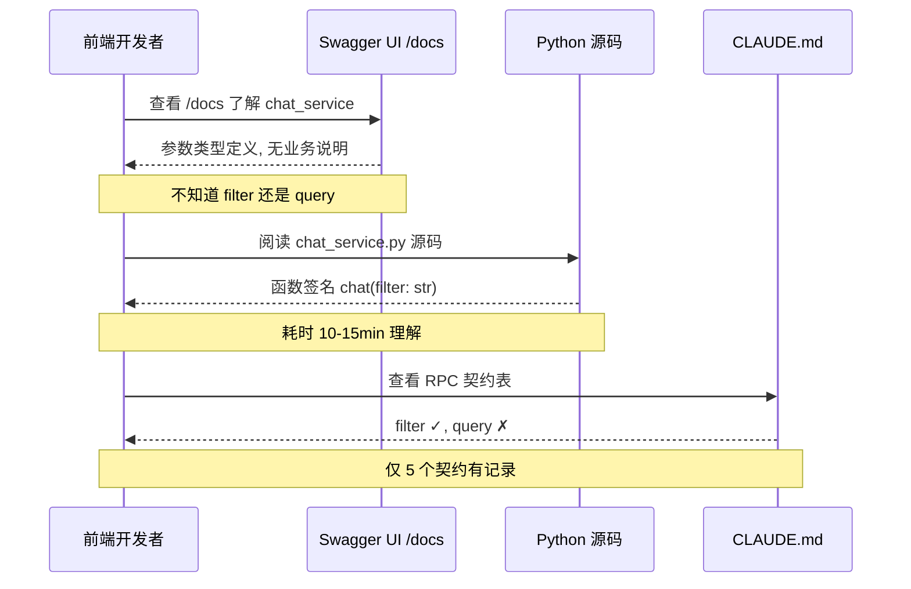
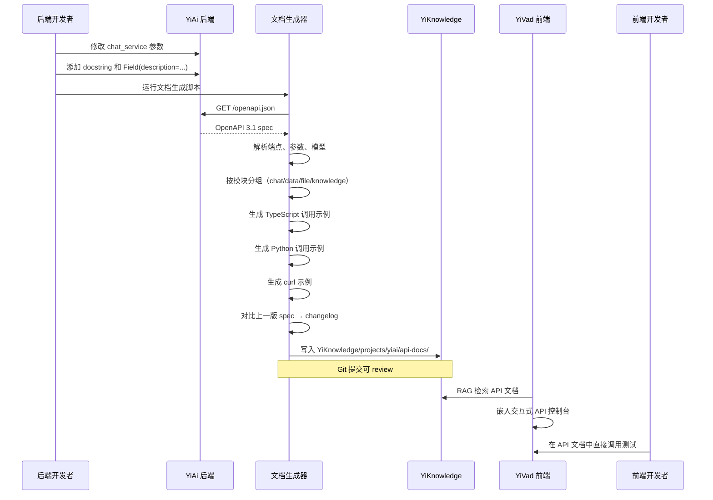
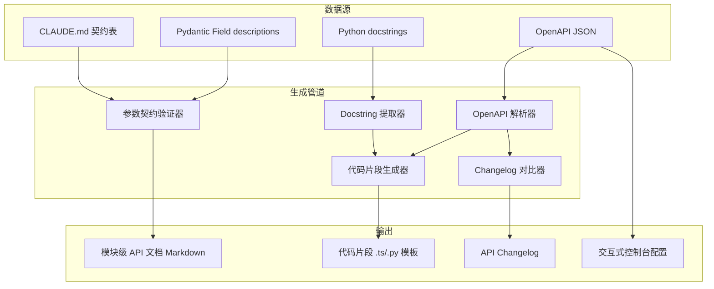

# YK-09-123: API 参考文档生成 — 从 YiAi OpenAPI 规范自动生成 API 文档、端点分组、请求响应示例、多语言代码片段、交互式 API 控制台、变更日志

> 需求编号：YK-09-123 · 优先级：P2 · 人天：0.3d · 状态：需求已编写
> 依赖：YK-09-23（API 文档自动生成——早期架构设计，本需求是落地实现）

## 背景

### 问题陈述

YiAi 后端有 30+ RPC 方法（分布在 chat_service、data_service、file_service、knowledge_service 等模块中），但 API 文档极度匮乏：

1. 没有统一的 API 参考文档——开发者只能阅读 Python 源码理解接口
2. FastAPI 自动生成的 Swagger/OpenAPI 仅提供基本参数类型，缺少业务语义描述
3. 前后端 RPC 参数契约（`filter` 而非 `query`、`target_file` 而非 `path`）仅口头约定，无文档记录
4. 新成员 onboarding 时花费大量时间阅读源码理解 RPC 调用方式
5. API 变更时无人更新文档，导致文档与实现偏离

**核心矛盾**：YiAi 已有 OpenAPI 规范（FastAPI auto-generate），但生成的原始 Swagger JSON 缺乏业务上下文、代码示例、分组说明和变更历史，不足以作为开发者参考文档。

### 影响范围

| # | 影响 | 严重程度 | 典型场景 |
|---|------|----------|----------|
| 1 | 接口理解成本高 | 高 | 前端开发者需要理解后端 RPC 方法参数 |
| 2 | 契约不一致 | 高 | 参数名 `filter`/`query` 混用导致线上 bug |
| 3 | 新成员 onboarding 慢 | 中 | 新前端开发者读 30+ 个 Python service 文件 |
| 4 | API 变更无感知 | 高 | 后端改了返回字段，前端不知道直到报错 |
| 5 | 无集成示例 | 中 | 不知道在 YiPet 中如何调用 chat_service |

### 挑战

| 挑战 | 说明 |
|------|------|
| OpenAPI 解析 | FastAPI 生成的标准 OpenAPI JSON 包含大量冗余字段 |
| 业务语义 | OpenAPI 不包含参数的业务含义描述 |
| 代码片段 | 需生成 TypeScript (YiVad/YiPet) 和 Python 两种语言的调用示例 |
| 变更追踪 | 需要对比新旧 OpenAPI spec 生成 changelog |
| 交互式控制台 | 需要在 YiVad 中嵌入可执行的 API 调用界面 |

---

## 一、现状分析

### 1.1 当前 API 文档状况

```
开发者需要了解 API
  │
  ├─ FastAPI Swagger UI (/docs)
  │   ├─ 自动生成的交互式文档
  │   ├─ 显示 model schema 和参数类型
  │   └─ 限制: 无业务描述, 无代码示例, 无契约说明
  │
  ├─ 阅读 Python 源码
  │   ├─ YiAi/services/ai/chat_service.py
  │   └─ 函数签名 + docstring(少量)
  │
  ├─ 阅读 CLAUDE.md 契约表
  │   ├─ filter vs query
  │   ├─ target_file vs path
  │   └─ 仅有 5 个关键契约
  │
  └─ 口头询问或 Slack
      └─ "chat_service 的参数是啥来着？"
```

### 1.2 当前可用能力

| 能力 | 可用性 | 获取方式 | 限制 |
|------|--------|----------|------|
| OpenAPI spec | ✅ | `/openapi.json` | 无业务描述 |
| Swagger UI | ✅ | `/docs` | 无代码示例 |
| ReDoc | ✅ | `/redoc` | 无分组说明 |
| 代码示例 | ❌ | 无 | — |
| 变更日志 | ❌ | 无 | — |

### 1.3 改造前数据流



### 1.4 根因矩阵

| 症状 | 根因 | 触发条件 | 频率 |
|------|------|----------|------|
| 接口参数不清楚 | OpenAPI 无业务语义描述 | 每次调用新接口 | 高（每周 5-10 次） |
| 参数名混用 | 契约未文档化 | 前后端协作 | 中（每月 1-2 个 bug） |
| 变更无感知 | 无 API changelog | 后端部署后 | 中 |
| 无集成示例 | 文档不支持代码生成 | 新前端开发者 onboarding | 中 |
| Swagger 不够用 | 缺少业界标准的 API 参考文档格式 | 对外 API 发布 | 低 |

---

## 二、设计决策

### 决策 1：文档生成方式 — 静态生成 vs 动态渲染 vs 混合

| 选项 | 实时性 | 性能 | 自定义性 |
|------|--------|------|----------|
| 构建时静态生成（Markdown 文件存 YiKnowledge） | 低（需要重建） | 高 | 高 |
| 运行时动态渲染（从 `/openapi.json` 实时生成） | 高 | 中 | 低 |
| 构建时生成 + 运行时增强（静态文件 + 实时补充） | 中 | 高 | 高 |

**选择：构建时静态生成 + Git 管理。** 将 API 参考文档生成为 YiKnowledge 中的 Markdown 文件，纳入版控。优势：(1) 文档变更可 diff review；(2) 不增加运行时开销；(3) 可被 RAG 检索；(4) 支持离线阅读。

### 决策 2：文档组织结构 — 按模块分组 vs 按方法分组 vs 按使用场景分组

| 选项 | 可发现性 | 维护性 | 与代码映射 |
|------|----------|--------|-----------|
| 按模块（chat/data/file/knowledge） | 高 | 高 | 1:1 映射 |
| 按方法类型（查询/写入/流式） | 中 | 中 | 无映射 |
| 按场景（YiVad 用/YiPet 用/通用） | 高 | 中 | 多对多 |

**选择：按模块 + 按场景交叉索引。** 主文档按模块组织（与 YiAi services/ 目录一一对应），每个模块文档开头有场景标签说明（适用 YiVad/YiPet/通用）。

### 决策 3：代码片段语言 — 仅 TypeScript vs TypeScript + Python vs 多语言

| 选项 | 目标用户 | 实现复杂度 | 生成质量 |
|------|----------|-----------|----------|
| 仅 TypeScript（YiVad/YiPet 前端） | 前端开发者 | 低 | 高 |
| TypeScript + Python（前端 + 测试） | 前后端 | 中 | 高 |
| TypeScript + Python + curl | 全员 | 中 | 高 |

**选择：TypeScript + Python + curl。** TypeScript 覆盖前端调用（YiVad RequestHttp + YiPet ApiClient），Python 覆盖后端测试和脚本，curl 覆盖通用 CLI 场景。

### 决策 4：变更日志生成 — 人工 vs Git diff vs OpenAPI diff

| 选项 | 准确性 | 完整性 | 人力成本 |
|------|--------|--------|---------|
| 人工编写 changelog | 高 | 中 | 高 |
| Git diff 自动检测 | 高 | 低（仅代码变更） | 低 |
| OpenAPI spec diff + 人工标注 | 高 | 高 | 中 |

**选择：OpenAPI spec diff + 人工标注。** 构建时对比新旧 OpenAPI JSON，自动检测新增/删除/修改的端点、参数、返回字段。人工在生成结果上标注 breaking change 和迁移指南。

### 设计决策记录

| 决策 | 选项 A | 选项 B | 选项 C | 选择 | 理由 |
|------|--------|--------|--------|------|------|
| 生成方式 | 静态 | 动态 | 混合 | **静态+Git** | 可版控可检索 |
| 组织结构 | 按模块 | 按方法 | 按场景 | **模块+场景** | 1:1 映射+交叉索引 |
| 代码片段 | TS | TS+Python | TS+Python+curl | **3 语言** | 覆盖全员 |
| 变更日志 | 人工 | Git diff | OpenAPI diff | **Spec diff+人工** | 自动+准确 |

---

## 三、目标架构

### 3.1 改造后 API 文档生成流程



### 3.2 文档生成管道架构



### 3.3 性能指标

| 指标 | 改造前 | 改造后 |
|------|--------|--------|
| 找 API 参数名 | 10min（读源码） | < 30s（搜索文档） |
| 写一个前端 API 调用 | 15min（猜测参数） | 2min（复制代码片段） |
| 发现 API 变更 | 部署后报错 | 构建时自动检测 |
| 新成员 API 学习 | 1-2 天（读源码） | 1h（读文档+试控制台） |

---

## 四、具体改动

### 4.1 API 文档生成器

```python
# 改造前：无 API 文档自动生成
# YiAi/services/docs/api_doc_generator.py (改造后)

from dataclasses import dataclass, field
from typing import List, Dict, Optional
import json

@dataclass
class ParameterDoc:
    name: str
    type: str
    required: bool
    description: str
    example: Optional[str] = None
    constraints: List[str] = field(default_factory=list)

@dataclass
class EndpointDoc:
    path: str
    method: str  # GET/POST/PUT/DELETE
    module: str  # chat_service/data_service/...
    method_name: str  # RPC method_name
    summary: str
    description: str
    parameters: List[ParameterDoc]
    request_example: Optional[Dict] = None
    response_example: Optional[Dict] = None
    applicable_to: List[str] = field(default_factory=list)  # ['YiVad', 'YiPet']

@dataclass
class ModuleDoc:
    name: str  # chat, data, file, knowledge, ...
    description: str
    endpoints: List[EndpointDoc]
    tags: List[str]

class APIDocGenerator:
    """从 OpenAPI spec + Python docstrings 生成 API 参考文档"""

    def __init__(self, openapi_path: str, source_dir: str):
        self.openapi_path = openapi_path
        self.source_dir = source_dir

    def generate_all(self) -> List[ModuleDoc]:
        """生成全量 API 文档"""
        spec = self.load_openapi_spec()
        modules = self.group_by_module(spec)
        docs = []

        for module_name, endpoints in modules.items():
            module_doc = ModuleDoc(
                name=module_name,
                description=self.get_module_description(module_name),
                endpoints=endpoints,
                tags=self.get_module_tags(module_name),
            )
            docs.append(module_doc)
        return docs

    def generate_module_doc(self, module_name: str) -> ModuleDoc:
        """生成单个模块的 API 文档"""
        pass

    def generate_endpoint_doc(self, path: str, method: str) -> EndpointDoc:
        """生成单个端点的详细文档（含代码片段）"""
        spec = self.load_openapi_spec()
        endpoint_data = spec["paths"][path][method.lower()]

        # 提取参数（从 docstring 和 Pydantic Field）
        parameters = self.extract_parameters(endpoint_data)

        # 提取契约（从 CLAUDE.md）
        contracts = self.extract_contracts(path)

        return EndpointDoc(
            path=path,
            method=method.upper(),
            module=self.infer_module(path),
            method_name=self.infer_method_name(endpoint_data),
            summary=endpoint_data.get("summary", ""),
            description=endpoint_data.get("description", ""),
            parameters=parameters,
            request_example=self.generate_request_example(endpoint_data),
            response_example=self.generate_response_example(endpoint_data),
        )

    def generate_code_snippets(self, endpoint: EndpointDoc) -> Dict[str, str]:
        """为端点生成多语言代码片段"""
        snippets = {}

        # TypeScript — YiVad RequestHttp
        snippets["typescript_vad"] = f"""
// YiVad RequestHttp 调用
import {{ requestHttp }} from '@/utils/request-http';

const response = await requestHttp.post('/', {{
  module_name: 'services.{endpoint.module}',
  method_name: '{endpoint.method_name}',
  parameters: {{
    // {json.dumps(endpoint.request_example, indent=4, ensure_ascii=False)}
  }}
}});
// response: {{ code: 0, message: 'ok', data: ... }}
"""

        # TypeScript — YiPet ApiClient
        snippets["typescript_pet"] = f"""
// YiPet ApiClient 调用
import {{ apiClient }} from '@/api/client';

const response = await apiClient.call(
  'services.{endpoint.module}',
  '{endpoint.method_name}',
  {{ /* params */ }}
);
// response: ApiResponse<...>
"""

        # Python — 后端测试
        snippets["python"] = f"""
# Python httpx 调用 YiAi
import httpx

async with httpx.AsyncClient() as client:
    response = await client.post(
        "http://localhost:10086/",
        json={{
            "module_name": "services.{endpoint.module}",
            "method_name": "{endpoint.method_name}",
            "parameters": {{}}  # fill with actual params
        }}
    )
    data = response.json()
    assert data["code"] == 0
"""

        # curl
        snippets["curl"] = f"""
curl -X POST http://localhost:10086/ \\
  -H "Content-Type: application/json" \\
  -d '{{
    "module_name": "services.{endpoint.module}",
    "method_name": "{endpoint.method_name}",
    "parameters": {{}}
  }}'
"""

        return snippets

    def generate_changelog(self, old_spec_path: str, new_spec_path: str) -> str:
        """对比新旧 OpenAPI spec，生成 API 变更日志"""
        old = self.load_openapi_spec_from_path(old_spec_path)
        new = self.load_openapi_spec_from_path(new_spec_path)

        changes = self.diff_openapi_specs(old, new)

        changelog = """# API 变更日志

## 新增端点
"""
        for added in changes["added"]:
            changelog += f"- `{added['method']} {added['path']}` — {added['summary']}\n"

        changelog += "\n## 修改端点\n"
        for modified in changes["modified"]:
            changelog += f"- `{modified['method']} {modified['path']}` — {modified['change']}\n"

        changelog += "\n## 删除端点\n"
        for removed in changes["removed"]:
            changelog += f"- `{removed['method']} {removed['path']}`\n"

        return changelog

    def write_markdown_docs(self, docs: List[ModuleDoc], output_dir: str):
        """将文档写入 YiKnowledge Markdown 文件"""
        import os

        # 索引文件
        index = self.generate_index(docs)
        with open(f"{output_dir}/INDEX.md", "w") as f:
            f.write(index)

        # 每个模块一个文件
        for module_doc in docs:
            md_content = self.module_doc_to_markdown(module_doc)
            filepath = f"{output_dir}/{module_doc.name}-api-reference.md"
            with open(filepath, "w") as f:
                f.write(md_content)

    # --- 辅助方法 ---

    def load_openapi_spec(self) -> Dict:
        with open(self.openapi_path) as f:
            return json.load(f)

    def group_by_module(self, spec: Dict) -> Dict[str, List]:
        """根据 tags 或路径前缀分组端点"""
        pass

    def extract_parameters(self, endpoint_data: Dict) -> List[ParameterDoc]:
        """从 OpenAPI + Python docstring 提取参数描述"""
        pass

    def generate_request_example(self, endpoint_data: Dict) -> Dict:
        """从 schema 生成请求示例"""
        pass

    def diff_openapi_specs(self, old: Dict, new: Dict) -> Dict:
        """Deep diff 两个 OpenAPI spec"""
        pass
```

### 4.2 生成的 API 文档示例结构

```markdown
<!-- YiKnowledge/projects/yiai/api-docs/chat-api-reference.md -->

# chat_service API 参考

> 模块: services.ai.chat_service
> 适用: YiVad, YiPet

## 端点列表

### 1. chat — 发送聊天消息（SSE 流式）

- **RPC 方法名**: `chat`
- **请求格式**:
```json
{
  "module_name": "services.ai.chat_service",
  "method_name": "chat",
  "parameters": {
    "session_key": "string (required)",
    "message": "string (required)",
    "role": "string (optional, default: 'yiyan')",
    "stream": "boolean (optional, default: true)"
  }
}
```

- **响应格式**: SSE 流, 每帧:
```json
{ "content": "部分回复内容", "done": false }
```
最后一帧:
```json
{ "content": "", "done": true, "session_key": "xxx" }
```

- **代码示例**:
  - [TypeScript - YiVad](#)
  - [TypeScript - YiPet](#)
  - [Python](#)
  - [curl](#)
```

### 4.3 文件变更清单

| 文件 | 操作 | 说明 |
|------|------|------|
| `YiAi/services/docs/api_doc_generator.py` | 新增 | API 文档自动生成器 |
| `YiAi/services/docs/openapi_parser.py` | 新增 | OpenAPI spec 解析器 |
| `YiAi/services/docs/code_snippet_generator.py` | 新增 | 多语言代码片段生成 |
| `YiAi/services/docs/changelog_generator.py` | 新增 | API 变更日志生成器 |
| `YiAi/services/docs/contract_validator.py` | 新增 | 参数契约验证器 |
| `YiAi/scripts/generate_api_docs.py` | 新增 | 文档生成 CLI 脚本 |
| `YiKnowledge/projects/yiai/api-docs/` | 新增 | 生成的 API 参考文档目录 |
| `YiVad/src/views/docs/APIDocView.vue` | 新增 | API 文档展示页面 |
| `YiVad/src/components/docs/APIConsole.vue` | 新增 | 交互式 API 调用控制台 |
| `YiVad/src/components/docs/CodeSnippet.vue` | 新增 | 代码片段展示（语法高亮+复制） |
| `.github/workflows/generate-api-docs.yml` | 新增 | CI 自动生成 API 文档 |

---

## 五、实施步骤

| 步骤 | 操作 | 路径 | 验证 | 人天 |
|------|------|------|------|------|
| 1 | 实现 OpenAPI 解析器 | `openapi_parser.py` | 正确解析 30+ 端点和参数 | 0.04 |
| 2 | 实现文档生成器主逻辑 | `api_doc_generator.py` | 按模块生成完整 Markdown | 0.05 |
| 3 | 实现代码片段生成器 | `code_snippet_generator.py` | TS/Python/curl 示例正确 | 0.03 |
| 4 | 实现 changelog 对比器 | `changelog_generator.py` | Diff 检测准确 | 0.04 |
| 5 | 实现契约验证器 | `contract_validator.py` | 检测 filter/query 混用 | 0.03 |
| 6 | 创建生成脚本和 CI | `generate_api_docs.py` | CI 自动运行 | 0.03 |
| 7 | 创建 YiVad 展示页面 | `APIDocView.vue`, `APIConsole.vue` | 文档可浏览 + 可交互 | 0.05 |
| 8 | 首次全量生成并提交 | — | YiKnowledge 有完整 API 文档 | 0.03 |

**总人天：0.3d**

---

## 六、测试规格

### 场景 1：生成 chat_service API 文档

**GIVEN** YiAi 运行并暴露 `/openapi.json`
**WHEN** 运行文档生成脚本指定 `chat_service` 模块
**THEN** 应生成包含 chat、chat_stream、get_history 等方法的 Markdown 文档
**AND** 每个方法应有参数表（名称、类型、必填、描述）
**AND** 应包含 TypeScript YiVad/YiPet 代码示例

### 场景 2：生成 API 变更日志

**GIVEN** 保存了旧版 OpenAPI spec，后端新增了 1 个端点、修改了 1 个参数名
**WHEN** 运行 changelog 生成器对比新旧 spec
**THEN** 应检测到 1 个新增端点、1 个参数修改
**AND** 生成 markdown changelog，标注 breaking change

### 场景 3：契约验证

**GIVEN** CLAUDE.md 约定 `filter` 是正确参数名
**WHEN** 后端某方法使用了 `query` 作为参数名
**THEN** 契约验证器应产生 WARNING
**AND** 生成的文档中应标注"参数命名契约违规"

### 场景 4：多语言代码片段

**GIVEN** 一个标准的 RPC 端点 `data_service.query_documents`
**WHEN** 生成代码片段
**THEN** 应生成 4 个语言的调用示例
**AND** TypeScript 示例应使用 `requestHttp` 模式
**AND** Python 示例应使用 `httpx.AsyncClient`
**AND** curl 示例应可直接复制执行

### 场景 5：交互式 API 控制台

**GIVEN** YiVad 展示 API 文档
**WHEN** 用户在控制台中填入参数并点击执行
**THEN** 应发送真实 RPC 请求到 YiAi
**AND** 应显示响应结果（code/message/data）

### 场景 6：CI 自动生成

**GIVEN** 后端代码提交到 main 分支
**WHEN** GitHub Actions 触发
**THEN** 应运行文档生成脚本
**AND** 如有变更，应创建 PR 到 YiKnowledge 仓库

---

## 七、风险与缓解

| 风险 | 概率 | 影响 | 缓解措施 |
|------|------|------|----------|
| OpenAPI spec 与实际行为不一致 | 中 | 高 | 契约验证器对照源码检查 |
| 代码片段因 API 变动过时 | 高 | 中 | CI 每次 commit 后自动生成 |
| 复杂的嵌套参数难以生成示例 | 中 | 中 | 人工标注复杂参数的示例值 |
| 交互式控制台未认证被拒 | 中 | 中 | 提示用户配置 `X-Token` |

---

## 八、回滚策略

| 场景 | 回滚操作 | 影响 |
|------|----------|------|
| 生成文档质量差（参数描述不准确） | 回退到手动维护的文档 | 失去自动化优势 |
| CI 自动 PR 频繁且 low quality | 改为手动触发生成 | 失去及时性 |
| 控制台造成后端压力 | 限流（每分钟 10 次） | 交互频率降低 |
| 文档文件过多污染 YiKnowledge | 归入 `projects/yiai/api-docs/` 子目录 | 无影响 |

---

## 九、设计决策记录

### D-01：文档存放位置

- **问题**：生成的 API 文档放在 YiKnowledge 还是 YiVad
- **选项**：YiKnowledge（作为知识文件）、YiVad（作为静态资源）、两者
- **选择**：YiKnowledge（知识文件），YiVad 从 YiKnowledge 读取
- **理由**：纳入知识库可被 RAG 检索；作为 markdown 可版控

### D-02：生成时机

- **问题**：何时生成/更新 API 文档
- **选项**：本地开发手动运行、Git pre-commit hook、CI 自动运行
- **选择**：CI 自动运行（可选项）+ 本地手动运行
- **理由**：CI 保证不会遗漏；本地手动提供开发时即时反馈

### D-03：代码片段中的 URL

- **问题**：代码片段中的 API URL 是硬编码还是占位符
- **选项**：硬编码 `http://localhost:10086`、占位符 `{API_BASE_URL}`
- **选择**：占位符 `{API_BASE_URL}` + 交互式控制台自动填充当前环境地址
- **理由**：不同环境 URL 不同，占位符通用；控制台自动填充提升体验

### D-04：Generated code 标记

- **问题**：生成的文件是否需要 "此文件由工具自动生成" 标记
- **选项**：不标记、在 frontmatter 标记、在文件头注释
- **选择**：在 frontmatter 中标记 `generated: true` + `generator: api_doc_generator`
- **理由**：避免人工修改被覆盖；frontmatter 统一管理

---

## 十、可观测性

### 指标

| 指标 | 类型 | 说明 |
|------|------|------|
| `api_docs.generated.count` | Counter | 文档生成次数 |
| `api_docs.changelog.endpoints_added` | Counter | 检测到的新增端点 |
| `api_docs.changelog.endpoints_modified` | Counter | 检测到的修改端点 |
| `api_docs.changelog.endpoints_removed` | Counter | 检测到的删除端点 |
| `api_docs.contract_violations` | Counter | 检测到的契约违规数 |
| `api_docs.console.requests` | Counter | 控制台 API 调用次数 |

### 告警

| 告警 | 条件 | 级别 |
|------|------|------|
| 文档生成失败 | 生成脚本报错 | WARNING |
| 契约违规增多 | 单次生成 > 5 个违规 | WARNING |
| 控制台请求过多 | 1h 内 > 200 次 | INFO |

---

## 十一、代码审查检查清单

- [ ] OpenAPI 解析正确（路径/方法/参数/schema/响应）
- [ ] 按模块分组正确（chat/data/file/knowledge/...）
- [ ] 参数名/类型/必填/描述 4 列完整
- [ ] 每个端点有至少 1 个请求示例
- [ ] TypeScript 代码片段使用 RequestHttp/ApiClient 模式
- [ ] Python 代码片段使用 httpx
- [ ] curl 代码片段可直接执行
- [ ] changelog 正确检测新增/修改/删除
- [ ] 契约验证器对照 CLAUDE.md 检查参数名
- [ ] Generated 文件 frontmatter 标记
- [ ] 交互式控制台安全（输入校验、CORS 处理）
- [ ] CI 脚本正确执行并生成结果

---

## 回归问题预测

| # | 预测问题 | 原因 | 验证方法 |
|---|---------|------|---------|
| 1 | FastAPI 的 `GET /openapi.json` 返回的 schema 中，`$ref` 引用未正确 dereference，生成文档时参数显示为 `{$ref: "#/components/schemas/..."}` 而非实际类型 | OpenAPI spec 使用 JSON Reference 避免重复定义，但解析器需要递归 dereference | 查看生成的文档中参数类型列，验证显示为 `string`/`integer` 等实际类型而非 `$ref` 引用 |
| 2 | 前端开发者复制代码片段后，`module_name` 写的是 `services.chat_service` 而非完整的 `services.ai.chat_service`，因为文档中模块名与代码实际模块路径不一致 | `module_name` 是 Python import path，需与 `YiAi/services/` 目录结构完全一致，任何简写或别名都会导致 404 | 复制文档中的 TypeScript 代码到 YiVad 中执行，验证 RPC 调用成功（code=0） |
| 3 | changelog 对比器使用 `deepdiff` 库进行全量比较，但 OpenAPI spec 中的 `x-*` 扩展字段（FastAPI 自动注入的版本号、生成时间等）每次都会变化，changelog 充斥着误报 | `x-apitools-*` 或 `info.version` 等元数据字段每次请求都会变化，changelog 未过滤这些字段 | 连续运行 2 次 changelog 生成（源码无任何改动），验证 changelog 输出为空或仅有元数据字段变动且被标注为"非功能性变更" |
| 4 | 交互式控制台发送 POST 到 `http://localhost:10086/`，但 YiVad 前端运行在 `localhost:8848`，浏览器 CORS 策略阻止跨域请求 | YiAi 需配置 CORS allow `localhost:8848`，如果未配置则浏览器阻止请求 | 在 YiVad 中打开 API 控制台，填入参数执行 RPC 调用，验证无 CORS 错误且返回 code=0 |
| 5 | Python docstring 中使用了中文描述，但 OpenAPI spec 中的 `description` 字段可能被 FastAPI 截断或编码错误，导致参数描述不完整 | FastAPI 的 `app.openapi()` 使用 `json.dumps` 序列化，Python 默认 `ensure_ascii=True` 将中文转为 `\uXXXX` 转义序列，虽不影响 JSON 有效性但影响可读性 | 检查生成的文档中参数描述是否有中文字符（非 `\uXXXX` 转义） |
| 6 | 生成脚本依赖 `openapi.json` 通过 HTTP 获取（`requests.get('http://localhost:10086/openapi.json')`），但 YiAi 可能未启动或端口被占用，脚本静默失败生成空文档 | 生成脚本未检查 HTTP 响应状态码，`requests.get` 连接失败时抛异常未被 catch | 在 YiAi 未启动的情况下运行生成脚本，验证有明确错误提示"无法连接到 YiAi 服务，请确保服务已启动" |

---

## 性能分析

### 文档生成关键操作耗时

| 操作 | 耗时 | 说明 |
|------|------|------|
| 获取 OpenAPI spec | < 200ms | HTTP GET /openapi.json |
| 解析 OpenAPI spec | < 100ms | JSON parse + dereference |
| 生成单模块文档（10 个端点） | < 500ms | Markdown 渲染 + 代码片段 |
| 生成全量文档（6 模块，40+ 端点） | < 3s | 全部 Markdown 生成 |
| Changelog diff（2 spec 对比） | < 500ms | deepdiff 比较 |
| 契约验证 | < 100ms | 简单字符串匹配 |

### 数据量预估

| 项目 | 大小 |
|------|------|
| OpenAPI spec (JSON) | ~100KB（40+ 端点） |
| 生成的模块文档（每个模块） | ~10KB Markdown |
| 全量文档（6 模块） | ~60KB Markdown |
| Changelog | ~5KB Markdown |

---

## 相关文档

- [YK-09-23 API 文档自动生成](23-需求-API文档自动生成.md)
- [OpenAPI 3.1 规范](https://spec.openapis.org/oas/latest.html)
- [FastAPI OpenAPI 文档](https://fastapi.tiangolo.com/how-to/extending-openapi/)
- [JSON Reference](https://datatracker.ietf.org/doc/html/draft-pbryan-zyp-json-ref-03)
- [Swagger UI](https://swagger.io/tools/swagger-ui/)