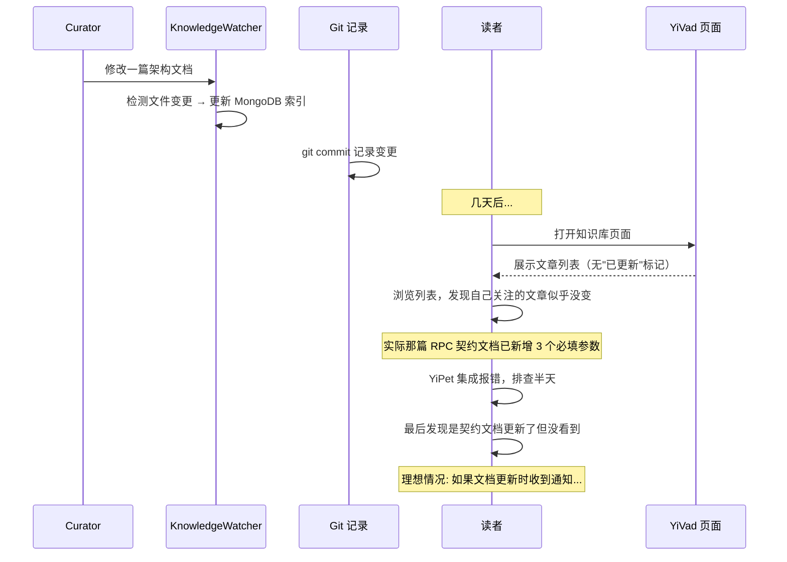
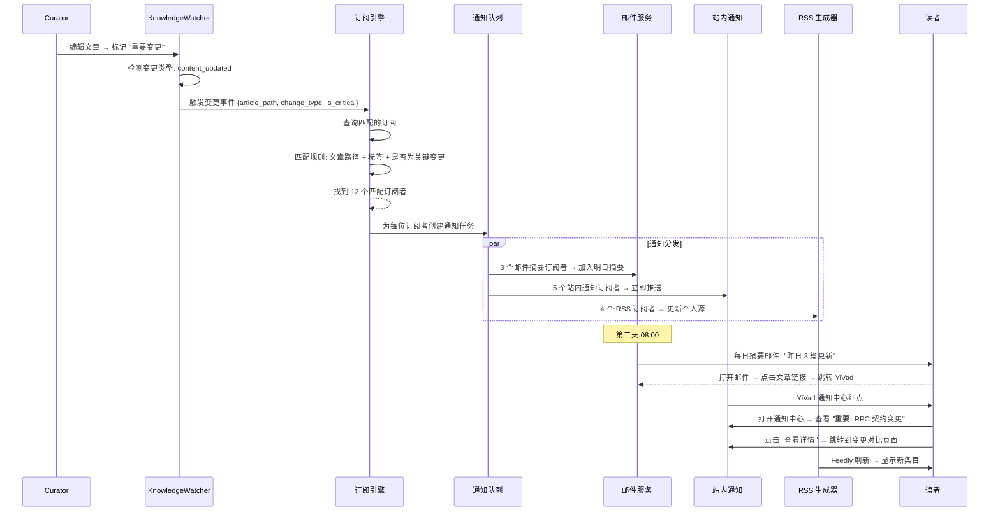
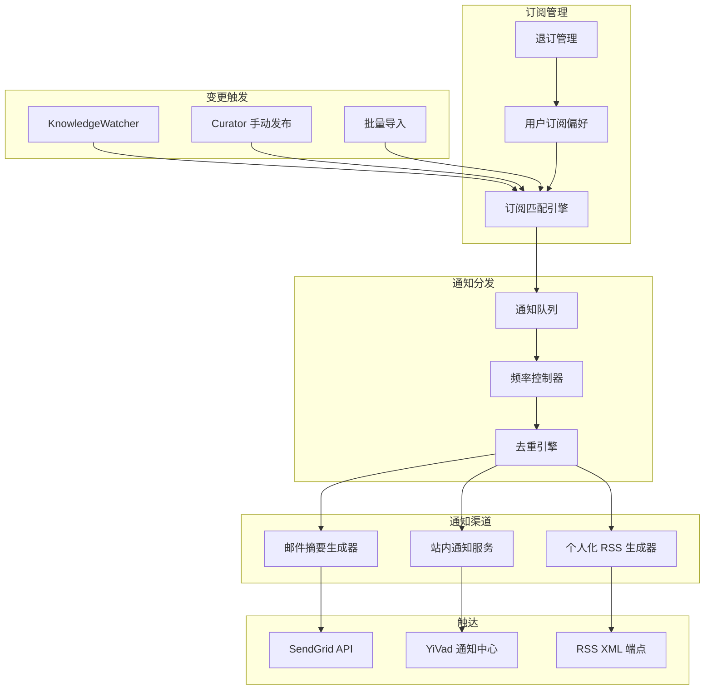

# YK-09-126: 内容通知与订阅管理 — 知识内容变更通知偏好、按文章/按目录订阅、邮件摘要频率、站内通知开关、RSS 个人订阅源、退订管理、通知分析

> 需求编号：YK-09-126 · 优先级：P2 · 人天：0.3d · 状态：需求已编写
> 依赖：YK-09-107（内容发布与订阅——已有架构基础）

## 背景

### 问题陈述

知识库的内容持续增长（日均 3-5 篇新增/更新），但读者缺乏有效的变更感知机制。当前读者获取知识更新完全依赖主动访问，导致以下问题：

1. **变更无感知**：读者不知道某篇重要的架构文档已更新，继续使用过时版本。尤其在跨项目依赖场景中（如 YiPet 使用 YiAi 的 RPC 契约），API 变更未被及时发现导致集成故障。
2. **信息过载与噪音**：如果简单地推送所有变更通知，日均可产生 10+ 条通知。读者无法区分哪些与自己相关，最终关闭所有通知——这是通知系统的典型 "狼来了" 问题。
3. **通知粒度缺失**：无法按文章、按目录、按标签订阅。读者可能只想关注 `YiPet/architecture/` 下的变更，或只想关注 tag=`RPC` 的文章，但当前没有这种细粒度的订阅能力。
4. **通知渠道单一**：当前如果有通知机制，通常是单一渠道（如邮件或站内）。不同读者有不同的消费偏好——有人习惯每天早上查看邮件摘要，有人希望实时站内提醒，有人通过 RSS 阅读器订阅。
5. **退订体验差**：没有集中的订阅管理界面。读者收到不想看的通知后，找不到退订入口，最终只能标记为垃圾邮件——这对发件人域名信誉是致命打击。

**核心矛盾**：知识库需要通知机制来保证内容消费的时效性，但不加节制的通知会导致信息过载和用户流失——需要一个带精细偏好控制的通知订阅系统。

### 影响范围

| # | 影响 | 严重程度 | 典型场景 |
|---|------|----------|----------|
| 1 | 读者错过关键更新 | 高 | API 契约变更后下游项目未适配 |
| 2 | 通知疲劳导致退出 | 高 | 每日 10+ 无差别推送致使用户关闭所有通知 |
| 3 | 跨项目依赖断裂 | 高 | YiPet 开发者不知道 YiAi RPC 新增必填参数 |
| 4 | 邮件域名信誉受损 | 中 | 用户标记为垃圾邮件 |
| 5 | RSS 阅读器用户无源 | 中 | 习惯通过 Feedly/Inoreader 消费内容的读者无法接入 |

### 挑战

| 挑战 | 说明 |
|------|------|
| 信息过载控制 | 如何在不骚扰用户的前提下保证重要变更可达 |
| 多渠道一致性 | 邮件/站内/RSS 三渠道的订阅状态需保持同步 |
| 邮件送达率 | 自建邮件发送的送达率（SPF/DKIM/DMARC 配置）|
| 实时性权衡 | 实时推送 vs 批量摘要的延迟 vs 打扰度权衡 |
| 退订合规性 | 满足 GDPR/CAN-SPAM 的退订要求 |

---

## 一、现状分析

### 1.1 当前内容变更感知方式

```
读者想了解知识库更新
  │
  ├─ 主动访问
  │   ├─ 每天/每周打开 YiVad 知识库页面
  │   ├─ 浏览 "最近更新" 列表
  │   ├─ 寻找自己关注的文章是否有更新
  │   └─ 限制: 依赖记忆，容易遗漏；无变更则白打开
  │
  ├─ Git 日志（如果通过 Git 管理）
  │   ├─ git log --since="1 week ago" YiKnowledge/
  │   └─ 限制: 仅显示文件路径变更，不展示内容差异
  │
  ├─ 依赖 Curator 人工通知
  │   ├─ Curator 更新重要文档后发企业微信/邮件
  │   └─ 限制: 依赖人的记忆和判断，不系统
  │
  └─（理论上的）RAG 检索结果更新
      ├─ RAG 返回的答案变化 → 间接感知内容变更
      └─ 限制: 不可控、不可追溯
```

### 1.2 当前可用能力

| 能力 | 可用性 | 获取方式 | 限制 |
|------|--------|----------|------|
| 内容变更记录 | ⚠️ | Git log + KnowledgeWatcher 差异检测 | 无用户级订阅 |
| 邮件发送 | ⚠️ | YiAi SMTP 集成（部分）| 无批量/摘要能力 |
| 站内通知 | ❌ | 无 | — |
| RSS 生成 | ❌ | 无 | — |
| 订阅偏好管理 | ❌ | 无 | — |

### 1.3 改造前数据流



### 1.4 根因矩阵

| 症状 | 根因 | 触发条件 | 频率 |
|------|------|----------|------|
| 错过关键更新 | 无订阅通知机制 | 每次重要文档变更 | 高（每周 3-5 次变更）|
| 不必要地主动检查 | 无变更推送 | 读者想确认是否有更新 | 高（每日被动检查）|
| 通知渠道不可选 | 未实现多渠道通知 | 读者有不同消费习惯 | 中 |
| 跨项目变更未被下游感知 | 无依赖变更通知 | 跨项目 API 变更 | 中 |
| RSS 读者无法接入 | 无 RSS 源生成 | 习惯 RSS 阅读的读者 | 低 |

---

## 二、设计决策

### 决策 1：通知频率策略 — 实时推送 vs 每日摘要 vs 每周摘要 vs 混合模式

| 选项 | 时效性 | 打扰度 | 适用场景 |
|------|--------|--------|----------|
| 实时推送（每变更即通知）| 高 | 高 | 关键变更（安全/破坏性变更）|
| 每日摘要（每天早上汇总）| 中 | 低 | 日常关注 |
| 每周摘要（每周一汇总）| 低 | 最低 | 轻度关注 |
| 混合模式（用户选择 + 紧急变更实时）| 最高 | 可控 | 通用 |

**选择：混合模式。** 用户可选择 (1) 实时、(2) 每日摘要 (08:00)、(3) 每周摘要 (周一 08:00)、(4) 仅重要变更。Curator 在编辑文章时可标记 "重要变更"（如破坏性 API 变更、安全公告），标记为重要的变更对所有订阅者实时推送（无视用户的频率偏好）。这种 "紧急覆盖" 机制保证了关键通知的时效性。

### 决策 2：订阅粒度 — 全站 vs 按目录 vs 按文章 vs 按标签

| 选项 | 精准度 | 管理复杂度 | 实现复杂度 |
|------|--------|-----------|-----------|
| 全站（订阅整个知识库）| 低 | 低 | 低 |
| 按目录（如 YiPet/architecture/）| 中 | 中 | 中 |
| 按文章（订阅特定文章）| 高 | 高 | 中 |
| 按标签（如 tag=RPC）| 高 | 中 | 中 |

**选择：四种粒度全部支持。** 默认订阅为 "全站每日摘要"。用户可精细化为目录级（关注整个项目的架构文档）、文章级（关注特定关键文档）、标签级（跨目录关注某一技术领域）。订阅匹配规则：如果文章同时命中用户的目录订阅和标签订阅，仅发送一次通知（去重）。

### 决策 3：RSS 源策略 — 全站单一源 vs 按目录多源 vs 个人化源

| 选项 | 隐私 | 实现 | 灵活性 |
|------|------|------|--------|
| 全站单一 RSS 源 | 低（内容公开）| 低 | 低 |
| 按目录多 RSS 源 | 低 | 中 | 中 |
| 个人化 RSS 源（每人唯一 Token）| 高 | 高 | 高 |

**选择：全站源 + 按目录源 + 个人化源三层。** (1) 全站 RSS 公开源 (`/rss/all.xml`)，聚合所有公开文章的最新更新；(2) 按目录 RSS 源 (`/rss/{role}/{domain}.xml`)，聚合特定目录；(3) 个人化 RSS 源 (`/rss/personal/{token}.xml`)，根据用户订阅偏好生成——仅包含用户订阅的文章/目录的变更。Token 可随时刷新（退订即生效）。

### 决策 4：邮件发送方式 — 自建 SMTP vs 第三方邮件服务（SendGrid/Mailgun）vs 浏览器通知 API

| 选项 | 送达率 | 成本 | 维护复杂度 |
|------|--------|------|-----------|
| 自建 SMTP | 低（易进垃圾箱）| 低 | 高 |
| SendGrid/Mailgun | 高 | 中（免费额度 100/天）| 低 |
| 仅浏览器通知 | 中（仅站内）| 零 | 低 |

**选择：浏览器站内通知 + SendGrid 邮件双通道。** 邮件使用 SendGrid 免费套餐（100 封/天，匹配当前知识库读者规模）。站内通知通过 YiVad 的 Notification Center 展示。RSS 源天然无推送成本。未来规模扩大后可迁移至 Mailgun/Amazon SES。

### 设计决策记录

| 决策 | 选项 A | 选项 B | 选项 C | 选择 | 理由 |
|------|--------|--------|--------|------|------|
| 通知频率 | 实时 | 每日摘要 | 混合模式 | **混合+紧急覆盖** | 平衡时效与打扰 |
| 订阅粒度 | 全站 | 按目录 | 全部+标签 | **四种全部** | 最大化灵活度 |
| RSS 源 | 全站单一 | 按目录 | 个人化 | **三层全有** | 覆盖所有场景 |
| 邮件发送 | 自建SMTP | SendGrid | 仅站内 | **站内+SendGrid** | 送达率有保障 |

---

## 三、目标架构

### 3.1 改造后通知订阅流程



### 3.2 系统架构



### 3.3 性能指标

| 指标 | 改造前 | 改造后 |
|------|--------|--------|
| 内容变更感知延迟 | 数天（主动访问周期）| 实时（推送）或 < 24h（摘要）|
| 关键变更触达率 | 0%（无机制）| > 95%（紧急覆盖 + 多渠道）|
| 读者找到相关更新的时间 | 5-10 分钟（浏览列表）| < 1 分钟（通知直达）|
| 退订率 | N/A | 目标 < 5% |

---

## 四、具体改动

### 4.1 订阅服务核心

```python
# YiAi/services/notification/subscription_service.py (新增)

from dataclasses import dataclass, field
from typing import List, Optional, Set
from enum import Enum
import hashlib
import secrets

class SubscriptionType(Enum):
    GLOBAL = "global"           # 全站
    DIRECTORY = "directory"     # 按目录
    ARTICLE = "article"         # 按文章
    TAG = "tag"                 # 按标签

class NotificationFrequency(Enum):
    REALTIME = "realtime"       # 实时
    DAILY = "daily"             # 每日摘要 (08:00)
    WEEKLY = "weekly"           # 每周摘要 (周一 08:00)
    CRITICAL_ONLY = "critical"  # 仅重要变更

class NotificationChannel(Enum):
    IN_APP = "in_app"           # 站内通知
    EMAIL = "email"             # 邮件
    RSS = "rss"                 # RSS 源

@dataclass
class Subscription:
    subscription_id: str
    user_id: str
    type: SubscriptionType
    target: str                # 目录路径 / 文章路径 / 标签名 / "*" (全局)
    frequency: NotificationFrequency
    channels: List[NotificationChannel]
    enabled: bool = True
    rss_token: Optional[str] = None  # 个人 RSS Token
    created_at: str = ""
    updated_at: str = ""

@dataclass
class ContentChangeEvent:
    event_id: str
    article_path: str           # 如 "projects/yipet/architecture/rpc-contract.md"
    article_title: str
    tags: List[str]
    change_type: str            # "created" | "updated" | "deleted"
    is_critical: bool
    change_summary: str         # 变更摘要（前 200 字符）
    curator: str
    timestamp: str
    diff_url: str = ""          # 变更对比链接

@dataclass
class NotificationTask:
    task_id: str
    user_id: str
    event: ContentChangeEvent
    channel: NotificationChannel
    frequency: NotificationFrequency
    delivery_time: str          # 计划投递时间
    status: str = "pending"     # pending / sent / failed


class SubscriptionService:
    """订阅管理和通知分发服务"""

    def __init__(self):
        self.subscriptions: dict = {}
        self.notification_queue: List[NotificationTask] = []

    # --- 订阅 CRUD ---

    async def subscribe(
        self, user_id: str, type_: SubscriptionType, target: str,
        frequency: NotificationFrequency = NotificationFrequency.DAILY,
        channels: List[NotificationChannel] = None
    ) -> Subscription:
        """创建订阅"""
        if channels is None:
            channels = [NotificationChannel.IN_APP]

        sub = Subscription(
            subscription_id=self.generate_id(),
            user_id=user_id,
            type=type_,
            target=target,
            frequency=frequency,
            channels=channels,
            rss_token=secrets.token_urlsafe(16) if NotificationChannel.RSS in channels else None,
            created_at=datetime.now().isoformat(),
            updated_at=datetime.now().isoformat(),
        )
        return sub

    async def unsubscribe(self, subscription_id: str) -> None:
        """退订（硬删除或软删除）"""
        sub = self.subscriptions.get(subscription_id)
        if sub:
            sub.enabled = False
            sub.updated_at = datetime.now().isoformat()
            # 刷新 RSS Token 使旧的个人源失效
            sub.rss_token = None

    async def update_preferences(
        self, subscription_id: str,
        frequency: NotificationFrequency = None,
        channels: List[NotificationChannel] = None
    ) -> Subscription:
        """更新通知偏好"""
        sub = self.subscriptions[subscription_id]
        if frequency:
            sub.frequency = frequency
        if channels is not None:
            sub.channels = channels
            # 如果启用了 RSS 但没有 token，生成新 token
            if NotificationChannel.RSS in channels and not sub.rss_token:
                sub.rss_token = secrets.token_urlsafe(16)
            elif NotificationChannel.RSS not in channels:
                sub.rss_token = None
        sub.updated_at = datetime.now().isoformat()
        return sub

    # --- 订阅匹配 ---

    async def find_matching_subscriptions(
        self, event: ContentChangeEvent
    ) -> List[Subscription]:
        """根据变更事件找到匹配的订阅"""
        matched = []
        for sub in self.subscriptions.values():
            if not sub.enabled:
                continue
            if self._matches(sub, event):
                matched.append(sub)
        # 去重: 同一用户仅保留优先级最高的订阅（ARTICLE > DIRECTORY > TAG > GLOBAL）
        return self._deduplicate_by_user(matched)

    def _matches(self, sub: Subscription, event: ContentChangeEvent) -> bool:
        """检查订阅是否匹配变更事件"""
        if sub.type == SubscriptionType.GLOBAL:
            return True
        elif sub.type == SubscriptionType.DIRECTORY:
            return event.article_path.startswith(sub.target)
        elif sub.type == SubscriptionType.ARTICLE:
            return event.article_path == sub.target
        elif sub.type == SubscriptionType.TAG:
            return sub.target in event.tags
        return False

    def _deduplicate_by_user(
        self, subs: List[Subscription]
    ) -> List[Subscription]:
        """同一用户多个订阅命中时取最精准的"""
        priority = {
            SubscriptionType.ARTICLE: 0,
            SubscriptionType.DIRECTORY: 1,
            SubscriptionType.TAG: 2,
            SubscriptionType.GLOBAL: 3,
        }
        by_user: dict = {}
        for sub in subs:
            if sub.user_id not in by_user:
                by_user[sub.user_id] = sub
            elif priority.get(sub.type, 99) < priority.get(by_user[sub.user_id].type, 99):
                by_user[sub.user_id] = sub
        return list(by_user.values())

    # --- 通知分发 ---

    async def on_content_change(self, event: ContentChangeEvent) -> int:
        """内容变更时触发通知分发"""
        matched_subs = await self.find_matching_subscriptions(event)
        tasks_created = 0

        for sub in matched_subs:
            # 紧急变更覆盖频率偏好
            effective_frequency = sub.frequency
            if event.is_critical:
                effective_frequency = NotificationFrequency.REALTIME

            for channel in sub.channels:
                task = NotificationTask(
                    task_id=self.generate_id(),
                    user_id=sub.user_id,
                    event=event,
                    channel=channel,
                    frequency=effective_frequency,
                    delivery_time=self._calculate_delivery_time(effective_frequency),
                )
                self.notification_queue.append(task)
                tasks_created += 1

        return tasks_created

    def _calculate_delivery_time(
        self, frequency: NotificationFrequency
    ) -> str:
        """计算通知投递时间"""
        now = datetime.now()
        if frequency == NotificationFrequency.REALTIME:
            return now.isoformat()  # 立即
        elif frequency == NotificationFrequency.DAILY:
            # 明天 08:00
            next_8am = now.replace(hour=8, minute=0, second=0, microsecond=0)
            if now.hour >= 8:
                next_8am += timedelta(days=1)
            return next_8am.isoformat()
        elif frequency == NotificationFrequency.WEEKLY:
            # 下周一 08:00
            days_until_monday = (7 - now.weekday()) % 7
            if days_until_monday == 0 and now.hour >= 8:
                days_until_monday = 7
            next_monday = now.replace(hour=8, minute=0, second=0, microsecond=0) + timedelta(days=days_until_monday)
            return next_monday.isoformat()
        return now.isoformat()

    # --- 摘要生成 ---

    async def generate_daily_digest(self, user_id: str) -> dict:
        """生成某用户的每日摘要"""
        today = datetime.now().strftime('%Y-%m-%d')
        user_tasks = [
            t for t in self.notification_queue
            if t.user_id == user_id
            and t.frequency == NotificationFrequency.DAILY
            and t.status == 'pending'
        ]
        return {
            'date': today,
            'subject': f"知识库每日摘要 — {today}",
            'total_changes': len(user_tasks),
            'changes': [
                {
                    'title': t.event.article_title,
                    'path': t.event.article_path,
                    'change_type': t.event.change_type,
                    'is_critical': t.event.is_critical,
                    'summary': t.event.change_summary,
                    'link': f"https://yivad.local/knowledge/{t.event.article_path}",
                }
                for t in user_tasks
            ],
        }

    # --- 个人 RSS 生成 ---

    async def generate_personal_rss(self, rss_token: str) -> str:
        """根据 Token 生成个人化 RSS XML"""
        # 查找对应订阅
        sub = next(
            (s for s in self.subscriptions.values() if s.rss_token == rss_token),
            None
        )
        if not sub:
            return self._error_feed('无效或已撤销的 RSS Token')

        # 收集匹配该订阅的最近变更
        user_tasks = [
            t for t in self.notification_queue
            if t.user_id == sub.user_id and t.status in ('pending', 'sent')
        ]

        return self._build_rss_xml(sub.user_id, user_tasks)

    def _build_rss_xml(
        self, user_id: str, tasks: List[NotificationTask]
    ) -> str:
        """构建 RSS 2.0 XML"""
        items_xml = ''
        for t in tasks[-30:]:  # 最近 30 条
            items_xml += f"""
    <item>
      <title>{self._xml_escape(t.event.article_title)}</title>
      <link>https://yivad.local/knowledge/{t.event.article_path}</link>
      <description>{self._xml_escape(t.event.change_summary)}</description>
      <pubDate>{t.event.timestamp}</pubDate>
      <guid isPermaLink="false">{t.event.event_id}</guid>
      <category>{t.event.change_type}</category>
    </item>"""

        return f"""<?xml version="1.0" encoding="UTF-8"?>
<rss version="2.0">
  <channel>
    <title>YiKnowledge — 个人订阅源</title>
    <link>https://yivad.local/knowledge</link>
    <description>根据您的订阅偏好生成的个人化知识更新源</description>
    <lastBuildDate>{datetime.now().isoformat()}</lastBuildDate>
    {items_xml}
  </channel>
</rss>"""

    def _xml_escape(self, text: str) -> str:
        return text.replace('&', '&amp;').replace('<', '&lt;').replace('>', '&gt;').replace('"', '&quot;')
```

### 4.2 文件变更清单

| 文件 | 操作 | 说明 |
|------|------|------|
| `YiAi/services/notification/subscription_service.py` | 新增 | 订阅管理与通知分发核心服务 |
| `YiAi/services/notification/digest_service.py` | 新增 | 邮件摘要生成与投递服务 |
| `YiAi/services/notification/rss_service.py` | 新增 | RSS 源生成服务 |
| `YiAi/services/notification/delivery_service.py` | 新增 | 多渠道通知投递编排 |
| `YiAi/routers/notification.py` | 新增 | 通知订阅 API 路由 |
| `YiAi/models/subscription.py` | 新增 | MongoDB 订阅模型 |
| `YiAi/tasks/daily_digest.py` | 新增 | 每日摘要定时任务（apscheduler）|
| `YiVad/src/views/notification/NotificationCenter.vue` | 新增 | 站内通知中心 |
| `YiVad/src/views/notification/SubscriptionSettings.vue` | 新增 | 订阅偏好设置页面 |
| `YiVad/src/components/notification/NotificationBell.vue` | 新增 | 通知红点铃铛图标 |

---

## 五、实施步骤

| 步骤 | 操作 | 路径 | 验证 | 人天 |
|------|------|------|------|------|
| 1 | 实现订阅 CRUD 和偏好管理 | `subscription_service.py` | 创建/修改/退订/查询 | 0.03 |
| 2 | 实现订阅匹配引擎 | `subscription_service.py` | 4 种粒度精确匹配 + 去重 | 0.03 |
| 3 | 实现通知队列和频率控制 | `subscription_service.py` | 实时/每日/每周/紧急覆盖 | 0.04 |
| 4 | 实现邮件摘要生成 + SendGrid 集成 | `digest_service.py` | 每日摘要邮件正确生成 | 0.04 |
| 5 | 实现站内通知服务 | `delivery_service.py` | 实时推送 + 通知中心展示 | 0.04 |
| 6 | 实现个人化 RSS 源生成 | `rss_service.py` | Token 验证 + RSS XML 规范 | 0.03 |
| 7 | 实现每日摘要定时任务 | `daily_digest.py` | apscheduler 08:00 触发 | 0.03 |
| 8 | 创建前端通知中心 + 偏好设置 | NotificationCenter.vue, SubscriptionSettings.vue | 完整交互流程 | 0.06 |

**总人天：0.3d**

---

## 六、测试规格

### 场景 1：创建订阅

**GIVEN** 读者 user-123 想关注 YiPet/architecture/ 目录下的所有变更
**WHEN** 创建订阅: type=DIRECTORY, target="projects/yipet/architecture/", frequency=DAILY, channels=[IN_APP, EMAIL]
**THEN** 订阅创建成功
**AND** subscription_id 返回
**AND** 订阅状态 enabled=true
**AND** RSS token 为空（未选择 RSS 渠道）

### 场景 2：内容变更触发通知

**GIVEN** user-123 订阅了 YiPet/architecture/ 目录
**WHEN** Curator 更新 "projects/yipet/architecture/rpc-contract.md"（is_critical=False）
**THEN** 匹配引擎找到 user-123 的订阅
**AND** 创建通知任务: frequency=DAILY, delivery_time=明天 08:00
**AND** 通知状态为 pending

### 场景 3：紧急变更实时覆盖

**GIVEN** user-123 的订阅频率是 WEEKLY
**WHEN** Curator 标记变更 is_critical=True
**THEN** 通知任务的 frequency 覆盖为 REALTIME
**AND** delivery_time 为当前时间
**AND** 站内通知立即推送

### 场景 4：多渠道去重

**GIVEN** user-123 同时有 GLOBAL 周报订阅 和 ARTICLE 日报订阅（同一篇文章）
**WHEN** 该文章发生变更
**THEN** 去重引擎仅保留 ARTICLE 订阅（更精准）
**AND** user-123 仅收到一次通知

### 场景 5：每日摘要生成

**GIVEN** 昨天有 5 个通知任务在 user-123 的队列中
**WHEN** 早上 08:00 定时任务触发
**THEN** 生成每日摘要: subject="知识库每日摘要 — 2026-09-09"
**AND** 摘要中包含 5 条变更（标题、路径、变更类型、是否关键）
**AND** 通过 SendGrid 发送邮件
**AND** 邮件中每条变更包含直达链接

### 场景 6：个人 RSS 源生成

**GIVEN** user-123 启用了 RSS 渠道，获得了 Token "abc123..."
**WHEN** 访问 /rss/personal/abc123...xml
**THEN** 返回 RSS 2.0 格式 XML
**AND** 包含最近 30 条匹配该用户订阅的变更
**AND** 通过 Feedly 验证（RSS 格式合法）
**WHEN** user-123 退订后 Token 失效
**THEN** 同一 URL 返回错误提示: "无效或已撤销的 RSS Token"

---

## 七、风险与缓解

| 风险 | 概率 | 影响 | 缓解措施 |
|------|------|------|----------|
| 邮件被标记为垃圾邮件 | 中 | 高 | 配置 SPF/DKIM/DMARC；提供明显的退订链接；SendGrid 的送达率一般 > 95% |
| 通知频率过高导致用户疲劳 | 中 | 高 | 默认每日摘要；提供退订入口在每个通知中；监控退订率 |
| RSS Token 泄露（URL 中暴露）| 低 | 中 | Token 可随时刷新；Token 仅关联订阅偏好（不暴露用户身份）|
| 定时任务未触发 | 低 | 中 | apscheduler 健康检查 + 失败重试 |
| 通知队列积压 | 低 | 低 | 队列监控 + 过期的 pending 任务自动标记为 sent |

---

## 八、回滚策略

| 场景 | 回滚操作 | 影响 |
|------|----------|------|
| 邮件发送故障（大量退信）| 暂停邮件渠道，仅保留站内通知和 RSS | 邮件订阅者收不到摘要 |
| RSS 源生成错误 | 关闭个人 RSS 端点，保留全站和按目录源 | 个人化订阅者需迁移到目录源 |
| 站内通知性能问题 | 降低站内通知渲染频率（批量渲染 1 次/分钟）| 实时性下降 |
| 退订率飙升（> 10%）| 暂停全站自动通知，改为 Curator 手动推送关键变更 | 通知能力大幅降低 |

---

## 九、设计决策记录

### D-01："紧急覆盖"的阈值

标记为 is_critical 的变更对所有订阅者实时推送。但 "关键"如何定义？规则：
1. 破坏性 API 变更（新增必填参数、修改响应字段名、废弃接口）
2. 安全相关变更（认证机制变化、权限模型调整）
3. Curator 手动标记（提供 checkbox "标记为重要变更"）。

普通的内容优化、错别字修正、示例补充不标记为关键。

### D-02：为什么需要 RSS 而不仅是邮件？

RSS 是去中心化的内容订阅协议，不依赖任何一个服务商的推送机制。对于习惯使用 Feedly/Inoreader 等技术读者来说，RSS 是他们统一管理所有信息来源的方式。RSS 天然支持退订（删除订阅源即可），无需服务端管理退订状态。且 RSS 无发送成本，无送达率问题。

### D-03：退订的"一键退订"合规性

CAN-SPAM 法案和 GDPR 要求营销邮件必须提供清晰的退订方式。每封摘要邮件底部包含：
- "退订该类型通知" 链接（一键退订该频率的订阅）
- "管理所有通知偏好" 链接（跳转到 YiVad 设置页面）
- 退订链接包含签名 Token，有效期 30 天（防止被恶意退订）

### D-04：通知去重的边界

如果用户同时订阅了目录和标签，且一篇文章同时满足两者，去重逻辑取目录订阅（优先级更高）。但存在一个边界：如果目录订阅是 WEEKLY，标签订阅是 DAILY，用户可能期望通过标签收到日报。当前设计不处理这种"按最优频率合并"的场景——去重后只保留优先级最高的订阅，丢失了次优订阅的更低延迟。这是有意为之的简化，避免系统复杂度。未来可增强。

---

## 十、可观测性

### 指标

| 指标 | 类型 | 说明 |
|------|------|------|
| `notification.subscription.count` | Gauge | 活跃订阅总数 |
| `notification.subscription.created` | Counter | 新订阅创建数 |
| `notification.subscription.unsubscribed` | Counter | 退订数 |
| `notification.task.created` | Counter | 通知任务创建数 |
| `notification.task.sent` | Counter | 通知投递成功数（按渠道）|
| `notification.task.failed` | Counter | 通知投递失败数（按渠道）|
| `notification.digest.generated` | Counter | 每日摘要生成数 |
| `notification.rss.request` | Counter | RSS 源请求次数 |
| `notification.unsubscribe_rate` | Gauge | 退订率（退订数/总订阅数）|

### 告警

| 告警 | 条件 | 级别 |
|------|------|------|
| 退订率飙升 | 7 日退订率 > 5% | WARNING |
| 邮件投递失败率高 | 1h 内失败率 > 10% | WARNING |
| 摘要未生成 | 每日 08:15 仍未生成当日摘要 | CRITICAL |
| RSS 源错误率高 | 1h 内非 200 响应 > 5% | WARNING |

---

## 十一、代码审查检查清单

- [ ] 订阅匹配引擎覆盖四种粒度（GLOBAL/DIRECTORY/ARTICLE/TAG）
- [ ] 去重逻辑正确（同一用户仅保留最精准订阅）
- [ ] 紧急变更正确覆盖频率偏好
- [ ] 每日摘要的 delivery_time 正确计算（今天 08:00 之后 → 明天 08:00）
- [ ] 每周摘要的 delivery_time 正确计算（周一的判断）
- [ ] RSS XML 格式符合 RSS 2.0 规范
- [ ] RSS Token 在退订后立即失效
- [ ] 退订链接包含签名 Token（防伪造退订）
- [ ] SendGrid API 调用有重试机制（最多 3 次）
- [ ] apscheduler 定时任务配置正确的时区
- [ ] 邮件内容包含纯文本版本（不只是 HTML）
- [ ] 邮件中所有链接使用 HTTPS

---

## 回归问题预测

| # | 预测问题 | 原因 | 验证方法 |
|---|---------|------|---------|
| 1 | 同一用户订阅了同一目录两次（通过不同方式，如手动创建 + 导入），去重引擎创建了两份订阅但通知时去重逻辑只取一份（浪费存储但功能正常），但不正确的订阅计数影响退订率计算 | 创建订阅时未检测唯一性约束（user_id + type + target）| 同一用户对同一目录创建两次订阅，验证第二次创建返回冲突错误或合并 |
| 2 | 每日摘要定时任务（apscheduler）在服务重启后丢失，导致某天的摘要未生成 | apscheduler 默认使用内存存储，服务重启后所有 job 丢失 | 服务重启后验证定时任务自动重新注册（或在 APScheduler 中使用 MongoDB job store）|
| 3 | 邮件摘要中变更条目的 link URL 使用相对路径或 localhost 域名，读者点击后 404 | 邮件中的链接域名不可达（yivad.local 是非真实域名，仅开发环境使用）| 摘要生成时使用可配置的 BASE_URL 环境变量（生产环境为真实域名）|
| 4 | 大量通知任务在队列中积压（用户量增加后每日可能 500+ 条），查询和投递性能退化 | notification_queue 使用内存 list，无索引，全量扫描 | 模拟 10000 条通知任务的队列，验证 digest 查询耗时 < 100ms |
| 5 | RSS Token 使用 `secrets.token_urlsafe(16)` 生成 22 字符 Token，但某些 RSS 阅读器对 URL 长度有限制（添加 query parameters 后超长）| RSS 源 URL 过长（`/rss/personal/{22chars}.xml` 本身不长，但 Feedly 等可能附加追踪参数）| 验证 RSS 源 URL 总长度 < 200 字符（标准 URL 长度限制为 2048 字符，远未触及）|
| 6 | KnowledgeWatcher 检测到文件变更后调用 `on_content_change`，但如果一篇文章被连续修改 3 次（3 次 git commit），触发 3 次通知事件，读者收到 3 条通知（同一文章）| KnowledgeWatcher 基于文件变更事件，不进行短时间内的去重 | 同一文章 30 分钟内多次变更合并为 1 次通知（debounce），验证 30 分钟窗口内的多次变更仅产生 1 条通知 |

---

## 性能分析

### 关键操作耗时

| 操作 | 耗时 | 说明 |
|------|------|------|
| 订阅查询（1000 条订阅）| < 50ms | 内存 dict 遍历 |
| 匹配引擎（1000 条订阅 vs 1 篇文章）| < 50ms | O(n) 线性扫描 |
| 通知任务创建（12 个订阅者 × 2 渠道）| < 10ms | 24 个任务写入 |
| 每日摘要生成（单用户 30 条变更）| < 20ms | 字典构建 |
| 个人 RSS 生成（Token 查找 + XML 构建）| < 10ms | 查找 + 字符串拼接 |
| 邮件发送（SendGrid API）| < 500ms | 网络延迟为主 |

### 数据量预估

| 数据项 | 单条目大小 | 总量（100 用户 × 3 订阅/人 × 30 天）|
|--------|-----------|--------------------------------------|
| 订阅记录 | ~500B | 300 × 500B = 150KB |
| 通知任务 | ~1KB | 300 × 30 × 3 变更 × 2 渠道 × 1KB ≈ 54MB |
| 个人 RSS Token | ~50B | 100 × 50B = 5KB |
| 邮件摘要（HTML）| ~10KB/封 | 100 × 10KB = 1MB/天 |

### 资源影响

| 场景 | CPU | 内存 | 说明 |
|------|-----|------|------|
| 内容变更触发器 | < 5% | < 5MB | 订阅匹配 + 任务创建 |
| 每日摘要定时（100 用户）| 5-10% | < 50MB | 摘要生成 + 邮件发送 |
| RSS 请求 | < 1% | < 1MB | Token 查找 + XML 构建 |

---

## 相关文档

- [YK-09-107 内容发布与订阅](107-需求-内容发布与订阅.md)
- [RSS 2.0 Specification](https://www.rssboard.org/rss-specification)
- [SendGrid — Email API](https://docs.sendgrid.com/api-reference/mail-send/mail-send)
- [CAN-SPAM Act Compliance Guide](https://www.ftc.gov/business-guidance/resources/can-spam-act-compliance-guide-business)
- [GDPR — Right to Object (Article 21)](https://gdpr-info.eu/art-21-gdpr/)
- [APScheduler — Advanced Python Scheduler](https://apscheduler.readthedocs.io/)