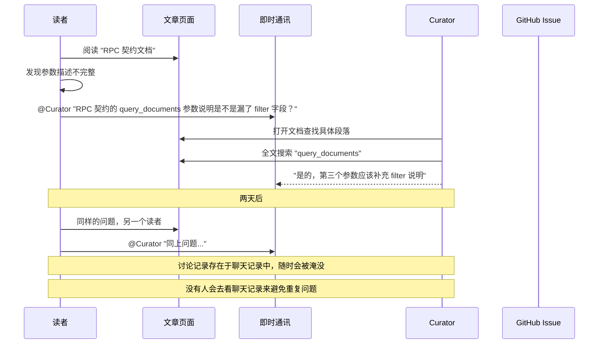
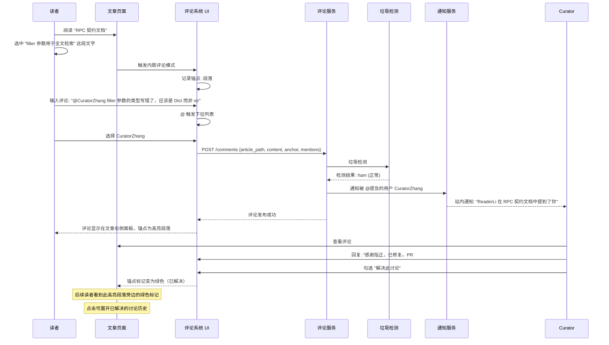

# YK-09-127: 文档评论与讨论系统 — 知识文章上的主题评论、选中文本内联评论、评论审核、@提及贡献者、评论支持 Markdown、解决/重开主题、评论通知、垃圾检测

> 需求编号：YK-09-127 · 优先级：P2 · 人天：0.3d · 状态：需求已编写
> 依赖：YK-09-101（读者反馈与互动系统——已有基础反馈能力）、YK-09-126（内容通知与订阅管理——评论通知依赖）

## 背景

### 问题陈述

知识库作为团队的技术文档中心，当前缺少围绕具体文章展开讨论的能力。读者发现问题、提出疑问、建议改进时，缺乏与文章直接关联的沟通渠道。主要问题如下：

1. **反馈脱离上下文**：当前反馈通过通用的 Issue 系统或即时通讯工具进行，与具体文章内容分离。读者需要手动描述"在 XX 文档的第 YY 段发现了问题"，而 Curator 需要对照原文查找上下文，沟通效率极低。
2. **碎片化讨论**：同一篇文章的不同反馈分散在多个渠道（企业微信、GitHub Issue、口头讨论），无法形成连贯的讨论线索。后续读者无法看到已有的讨论历史，导致相同问题被反复提出。
3. **无内联评论能力**：读者无法针对文档中的特定段落、句子甚至术语进行精准评论。典型的场景是"这个函数的参数说明不完整，应该补充返回值类型"——如果评论不能关联到具体位置，Curator 需要全文搜索来定位问题点。
4. **知识流失**：有价值的技术讨论发生在聊天工具中，随时间流逝而消失。如果这些讨论能沉淀在文章评论中，将成为文章的一部分——补充了官方文档未覆盖的边界情况、常见陷阱、实践经验。
5. **社区感缺失**：知识库的读者和贡献者之间缺乏社交互动机制（如 @提及、认可标记），纯工具化的体验降低了参与感和归属感。

**核心矛盾**：知识库不只是静态文档的集合，更是动态知识的凝聚地。文章是对话的起点，而围绕文章的讨论本身就是高价值的知识——需要一套评论系统来捕获和沉淀这些讨论。

### 影响范围

| # | 影响 | 严重程度 | 典型场景 |
|---|------|----------|----------|
| 1 | 反馈效率低 | 高 | 读者发现错误 → 找 Curator 联系方式 → 描述问题 → Curator 定位原文 |
| 2 | 讨论历史丢失 | 高 | 团队在微信中讨论的 API 设计决策无法被新成员查阅 |
| 3 | 重复问题 | 中 | 3 个不同读者在不同时间提出同一个问题 |
| 4 | 知识沉淀断裂 | 中 | 有价值的技术讨论在消息流中被冲走 |
| 5 | 贡献者无法被 @ | 中 | 读者想邀请特定 Curator 看他的问题但无 @ 机制 |

### 挑战

| 挑战 | 说明 |
|------|------|
| 评论与文档内容同步 | 文档更新后，旧评论引用的行号/段落可能不再准确 |
| 垃圾评论 | 如果知识库对外公开，可能面临垃圾评论攻击 |
| 通知风暴 | 高活跃度文章的评论区可能产生大量通知 |
| 内联评论定位 | 选中文本作为锚点的稳定性（文档更新后锚点失效）|
| Markdown 渲染安全 | 评论中的 Markdown 需要 XSS 防护 |

---

## 一、现状分析

### 1.1 当前反馈与讨论方式

```
读者对文章有疑问/建议
  │
  ├─ 即时通讯（企业微信/钉钉/Slack）
  │   ├─ 群里 @Curator: "XX 文档的 YY 部分是不是写错了？"
  │   ├─ Curator: "我看一下...你说的是哪一段？"
  │   ├─ 读者: "就是那个 API 参数列表那里"
  │   └─ 问题: 上下文丢失，讨论记录无法与文章关联
  │
  ├─ GitHub Issue（如果 YiKnowledge 使用 Git）
  │   ├─ 创建 Issue: "关于 RPC 契约文档的建议"
  │   ├─ 引用文章路径，Ctrl+C/V 相关段落
  │   └─ 问题: 需要手动引用，与阅读体验割裂
  │
  ├─ 面对面/口头讨论
  │   └─ 问题: 讨论完全不可追溯
  │
  └─ 通用反馈表单（如果已实现 YK-09-101）
      ├─ 填写反馈表单
      └─ 问题: 无法形成多轮讨论线索
```

### 1.2 当前可用能力

| 能力 | 可用性 | 获取方式 | 限制 |
|------|--------|----------|------|
| 通用反馈表单 | ⚠️ | YK-09-101 读者反馈系统 | 单轮，不支持讨论 |
| GitHub Issue | ✅ | Git 仓库 | 与阅读体验割裂 |
| 即时通讯 | ✅ | 企业微信等 | 不可追溯、不可搜索 |
| 文章评论区 | ❌ | 无 | — |
| 内联评论 | ❌ | 无 | — |

### 1.3 改造前数据流



### 1.4 根因矩阵

| 症状 | 根因 | 触发条件 | 频率 |
|------|------|----------|------|
| 反馈与文章内容割裂 | 无文章内嵌评论系统 | 每次反馈 | 高 |
| 讨论历史不可见 | 讨论发生在独立渠道 | 新读者查看同一篇文章 | 高 |
| 重复问题反复出现 | 已有讨论不可搜索 | 不同时间读者提出相同问题 | 中 |
| 反馈定位模糊 | 无法标记具体段落 | 长文反馈 | 中 |
| 知识讨论未沉淀 | 无持久化讨论存储 | 有价值的技术讨论 | 中 |

---

## 二、设计决策

### 决策 1：评论模型 — 平铺评论 vs 嵌套评论（Threaded）vs 两层结构

| 选项 | 可读性 | 引用关系 | 实现复杂度 |
|------|--------|----------|-----------|
| 平铺评论（单层列表）| 低（无法表达回复关系）| 无 | 低 |
| 嵌套评论（无限层级）| 中（深层嵌套宽度窄）| 完整 | 高 |
| 两层结构（顶层评论 + 回复）| 高 | 足够 | 中 |

**选择：两层结构。** 顶层评论（Top-level Comment）作为讨论起点，下方平铺所有回复（Reply）。限制每个顶层的回复不超过 2 层嵌套（即 A 回复 B，B 回复 A 的回复，但没有 C 回复 B 的回复）。这种结构借鉴 GitHub Issues 的设计——足够表达讨论线索，又避免 Reddit 式的深层嵌套导致阅读困难。

### 决策 2：内联评论锚点 — 基于文本片段 vs 基于字符位置 vs 基于 DOM 节点 ID

| 选项 | 文档更新后稳定性 | 实现复杂度 | 跨格式兼容 |
|------|-----------------|-----------|-----------|
| 基于文本片段（选中文本哈希）| 中（文本修改后失效）| 低 | 高 |
| 基于字符位置（offset: 1200-1350）| 低（插入文字后完全偏移）| 低 | 高 |
| 基于段落/标题锚点 + 相对偏移 | 高 | 中 | 中 |

**选择：基于 Markdown 段落索引 + 选中文本片段。** 在 Markdown 渲染时将每个段落分配唯一 ID（基于段落序号的哈希），内联评论锚定到段落 ID + 选中文本的 SHA256 前 8 位。文档更新时：(1) 段落仍然存在且文本匹配 → 内联评论保留；(2) 段落被删除 → 内联评论降级为普通评论（失去位置锚定但内容保留）；(3) 文本被修改 → 标记为"原文已变更"。

### 决策 3：评论审核模式 — 先发后审 vs 先审后发 vs 信任用户自动通过

| 选项 | 用户体验 | 垃圾防护 | 社区规模适用 |
|------|----------|----------|-------------|
| 先发后审（发布后管理员审核）| 高 | 中（垃圾已公开展示）| 小社区 |
| 先审后发（管理员通过才展示）| 低 | 高 | 大社区 |
| 信任用户自动通过 + 新用户审核 | 高 | 高 | 通用 |

**选择：信任用户自动通过 + 新用户审核。** 已认证的内部成员（通过企业微信/OAuth 登录的用户）发布评论自动通过。外部匿名用户（如果开放）的评论进入审核队列。内部用户的评论如果被标记为垃圾（通过检测引擎）也进入审核队列。这种分层策略在保障内部讨论效率的同时防御外部垃圾。

### 决策 4：@提及实现 — 纯文本 @username vs 用户选择器 vs 富文本提及

| 选项 | 实现复杂度 | 用户体验 | 通知准确性 |
|------|-----------|----------|-----------|
| 纯文本 @username（解析+匹配）| 低 | 中（需知道准确用户名）| 中 |
| 用户选择器（输入 @ 弹出下拉）| 中 | 高 | 高 |
| 富文本提及（@ 转换为特殊 token）| 高 | 高 | 最高 |

**选择：用户选择器（@ 触发下拉列表）。** 用户在评论框中输入 `@` 后弹出下拉列表，显示知识库的贡献者列表（Curator + 活跃评论者），支持搜索过滤。选中后插入 `@displayName` 格式。后端解析时通过 `@` 号后的文本匹配用户并发送通知。已认证用户优先于匿名用户。

### 设计决策记录

| 决策 | 选项 A | 选项 B | 选项 C | 选择 | 理由 |
|------|--------|--------|--------|------|------|
| 评论模型 | 平铺 | 嵌套 | 两层 | **两层** | GitHub 风格，可读性最优 |
| 内联锚点 | 文本哈希 | 字符位置 | 段落+哈希 | **段落+哈希** | 更新后最稳定 |
| 审核模式 | 先发后审 | 先审后发 | 信任分层 | **信任分层** | 内部效率+外部安全 |
| @提及 | 纯文本 | 选择器 | 富文本 | **选择器** | 用户体验最优 |

---

## 三、目标架构

### 3.1 改造后评论系统流程



### 3.2 系统架构

```mermaid
graph TD
    subgraph Article["文章阅读页"]
        A[文章渲染]
        B[内联锚点高亮]
        C[评论面板（侧边栏）]
    end

    subgraph CommentSystem["评论系统"]
        D[评论CRUD]
        E[Thread管理]
        F[内联锚点引擎]
        G[@提及解析器]
    end

    subgraph Moderation["审核与安全"]
        H[垃圾检测引擎]
        I[审核队列]
        J[敏感词过滤]
    end

    subgraph Integration["集成"]
        K[通知系统]
        L[贡献者查询]
        M[Markdown渲染器]
    end

    A --> F
    B --> F
    C --> D
    C --> E
    D --> H
    H --> I
    G --> L
    G --> K
    D --> M
    D --> K
    D --> G
    F --> D
```

### 3.3 性能指标

| 指标 | 改造前 | 改造后 |
|------|--------|--------|
| 反馈定位时间 | 2-3 分钟（描述+搜索）| < 5s（选中+评论）|
| 重复问题发生率 | 不定（无数据）| 期望降低 50%（已有讨论可见）|
| 讨论可追溯性 | 0（无持久化）| 100%（所有评论存档）|
| 垃圾评论拦截率 | N/A | > 99%（自动检测）|

---

## 四、具体改动

### 4.1 评论服务核心

```python
# YiAi/services/comment/comment_service.py (新增)

from dataclasses import dataclass, field
from typing import List, Optional
from enum import Enum

class CommentStatus(Enum):
    ACTIVE = "active"
    RESOLVED = "resolved"
    HIDDEN = "hidden"        # 被管理员隐藏
    DELETED = "deleted"      # 软删除
    PENDING = "pending"      # 等待审核

@dataclass
class InlineAnchor:
    """内联评论锚点"""
    paragraph_index: int         # 段落序号（从 0 开始）
    paragraph_id: str            # 段落内容哈希
    selected_text: str           # 用户选中的文本
    text_hash: str              # 选中文本的 SHA256 前 8 位
    start_offset: int = 0       # 在段落内的起始字符偏移
    end_offset: int = 0         # 在段落内的结束字符偏移
    is_valid: bool = True       # 锚点是否仍然有效（文档更新后可能失效）

@dataclass
class Comment:
    comment_id: str
    article_path: str            # 文章路径
    parent_id: Optional[str]     # 父评论 ID（回复时使用，顶层评论为 None）
    thread_id: Optional[str]     # 所属讨论主题 ID
    author_id: str
    author_name: str
    content: str                 # Markdown 格式
    content_html: str            # 渲染后的 HTML
    anchor: Optional[InlineAnchor]  # 内联锚点（可选）
    mentions: List[str]          # @提及的用户 ID 列表
    status: CommentStatus
    created_at: str
    updated_at: str
    resolved_at: Optional[str] = None
    resolved_by: Optional[str] = None

@dataclass
class DiscussionThread:
    """讨论主题（一个顶层评论 + 所有回复）"""
    thread_id: str
    article_path: str
    top_comment: Comment
    replies: List[Comment]
    status: CommentStatus
    reply_count: int
    last_activity_at: str


class CommentService:
    """文章评论与讨论管理服务"""

    def __init__(self):
        self.comments: dict = {}
        self.threads: dict = {}

    # --- 评论 CRUD ---

    async def create_comment(
        self, article_path: str, author_id: str, author_name: str,
        content: str, parent_id: str = None,
        anchor: InlineAnchor = None
    ) -> Comment:
        """创建评论"""
        # 垃圾检测
        spam_score = await self._check_spam(content, author_id)
        is_trusted = await self._is_trusted_user(author_id)

        status = CommentStatus.ACTIVE
        if not is_trusted or spam_score > 0.7:
            status = CommentStatus.PENDING

        # 解析 @提及
        mentions = self._parse_mentions(content)

        # 渲染 Markdown
        content_html = self._render_markdown(content)

        # 确定 thread_id
        if parent_id:
            parent = self.comments.get(parent_id)
            thread_id = parent.thread_id if parent else None
        else:
            thread_id = self.generate_id()

        comment = Comment(
            comment_id=self.generate_id(),
            article_path=article_path,
            parent_id=parent_id,
            thread_id=thread_id,
            author_id=author_id,
            author_name=author_name,
            content=content,
            content_html=content_html,
            anchor=anchor,
            mentions=mentions,
            status=status,
            created_at=datetime.now().isoformat(),
            updated_at=datetime.now().isoformat(),
        )

        self.comments[comment.comment_id] = comment

        # 发送通知
        await self._send_mention_notifications(comment)
        if parent_id:
            await self._notify_parent_author(comment, parent_id)

        return comment

    async def resolve_thread(self, thread_id: str, resolved_by: str) -> None:
        """解决讨论主题"""
        # 将该 thread 下的所有评论标记为已解决
        for comment in self.comments.values():
            if comment.thread_id == thread_id:
                comment.status = CommentStatus.RESOLVED
                comment.resolved_at = datetime.now().isoformat()
                comment.resolved_by = resolved_by

    async def reopen_thread(self, thread_id: str) -> None:
        """重新打开已解决的讨论"""
        for comment in self.comments.values():
            if comment.thread_id == thread_id:
                comment.status = CommentStatus.ACTIVE
                comment.resolved_at = None
                comment.resolved_by = None

    async def hide_comment(self, comment_id: str, moderator_id: str) -> None:
        """管理员隐藏评论"""
        comment = self.comments.get(comment_id)
        if comment:
            comment.status = CommentStatus.HIDDEN

    # --- 查询 ---

    async def get_article_threads(
        self, article_path: str, include_resolved: bool = False
    ) -> List[DiscussionThread]:
        """获取文章的所有讨论主题"""
        threads: dict = {}

        for comment in self.comments.values():
            if comment.article_path != article_path:
                continue
            if comment.status == CommentStatus.DELETED:
                continue
            if not include_resolved and comment.status == CommentStatus.RESOLVED:
                continue

            thread_id = comment.thread_id
            if thread_id not in threads:
                threads[thread_id] = DiscussionThread(
                    thread_id=thread_id,
                    article_path=article_path,
                    top_comment=comment if not comment.parent_id else None,
                    replies=[],
                    status=comment.status,
                    reply_count=0,
                    last_activity_at=comment.created_at,
                )

            thread = threads[thread_id]
            if comment.parent_id:
                thread.replies.append(comment)
            else:
                thread.top_comment = comment

            thread.reply_count = len(thread.replies)
            if comment.created_at > thread.last_activity_at:
                thread.last_activity_at = comment.created_at

        return sorted(
            list(threads.values()),
            key=lambda t: t.last_activity_at,
            reverse=True
        )

    async def get_inline_comments(
        self, article_path: str, paragraph_index: int
    ) -> List[Comment]:
        """获取指定段落的内联评论"""
        return [
            c for c in self.comments.values()
            if c.article_path == article_path
            and c.anchor
            and c.anchor.paragraph_index == paragraph_index
            and c.status != CommentStatus.DELETED
        ]

    # --- 锚点验证 ---

    async def validate_anchors(
        self, article_path: str, current_paragraphs: List[dict]
    ) -> dict:
        """文档更新后验证所有内联锚点是否仍有效"""
        results = {}
        for comment in self.comments.values():
            if comment.article_path != article_path or not comment.anchor:
                continue

            anchor = comment.anchor
            if anchor.paragraph_index >= len(current_paragraphs):
                results[comment.comment_id] = False  # 段落已删除
                continue

            para = current_paragraphs[anchor.paragraph_index]
            para_hash = self._hash_text(para['text'])[:8]
            if para_hash != anchor.paragraph_id:
                results[comment.comment_id] = False  # 段落内容已变更
                continue

            # 检查选中文本是否仍在段落中
            if anchor.selected_text not in para['text']:
                results[comment.comment_id] = False  # 选中文本已删除或修改
                continue

            results[comment.comment_id] = True

        return results

    # --- 垃圾检测 ---

    async def _check_spam(self, content: str, author_id: str) -> float:
        """垃圾评论检测（返回 0-1 垃圾概率）"""
        score = 0.0

        # 规则 1: 包含大量链接
        links = re.findall(r'https?://[^\s]+', content)
        if len(links) > 3:
            score += 0.4

        # 规则 2: 全大写/全英文比例（对中文知识库来说）
        ascii_chars = sum(1 for c in content if ord(c) < 128)
        if ascii_chars / max(len(content), 1) > 0.9 and len(content) < 50:
            score += 0.2

        # 规则 3: 重复内容模式
        if re.search(r'(.)\1{10,}', content):
            score += 0.3

        # 规则 4: 常见垃圾关键词
        spam_keywords = ['buy now', 'click here', 'free money', 'casino', 'viagra', '赚大钱', '免费领取']
        for kw in spam_keywords:
            if kw.lower() in content.lower():
                score += 0.3
                break

        # 规则 5: 短时间内大量评论（频率检测）
        recent_count = await self._get_recent_comment_count(author_id, minutes=5)
        if recent_count > 10:
            score += 0.5

        return min(score, 1.0)

    async def _is_trusted_user(self, author_id: str) -> bool:
        """检查用户是否为信任用户"""
        # 内部认证用户默认为信任
        return True  # 简化实现，实际需查用户表

    def _parse_mentions(self, content: str) -> List[str]:
        """从评论内容中解析 @提及"""
        # 匹配 @username 格式（username 只能包含字母数字下划线中文）
        mentions = re.findall(r'@([\w\u4e00-\u9fff]+)', content)
        return list(set(mentions))  # 去重

    def _render_markdown(self, content: str) -> str:
        """渲染 Markdown 为 HTML（带 XSS 防护）"""
        import markdown
        from bleach import clean

        html = markdown.markdown(
            content,
            extensions=['fenced_code', 'tables', 'codehilite']
        )
        # XSS 过滤: 仅允许安全标签
        allowed_tags = ['p', 'strong', 'em', 'a', 'code', 'pre', 'blockquote',
                       'ul', 'ol', 'li', 'h1', 'h2', 'h3', 'h4', 'img', 'br', 'hr']
        allowed_attrs = {'a': ['href', 'title'], 'img': ['src', 'alt', 'title']}
        safe_html = clean(html, tags=allowed_tags, attributes=allowed_attrs)

        # 将 @mention 转换为可点击链接
        safe_html = re.sub(
            r'@([\w\u4e00-\u9fff]+)',
            r'<span class="mention">@\1</span>',
            safe_html
        )

        return safe_html

    def _hash_text(self, text: str) -> str:
        """生成文本片段的哈希"""
        return hashlib.sha256(text.encode()).hexdigest()
```

### 4.2 文件变更清单

| 文件 | 操作 | 说明 |
|------|------|------|
| `YiAi/services/comment/comment_service.py` | 新增 | 评论 CRUD + 讨论管理核心服务 |
| `YiAi/services/comment/spam_detector.py` | 新增 | 垃圾评论检测引擎 |
| `YiAi/services/comment/anchor_validator.py` | 新增 | 内联锚点验证引擎 |
| `YiAi/services/comment/mention_service.py` | 新增 | @提及解析与通知 |
| `YiAi/routers/comment.py` | 新增 | 评论 API 路由 |
| `YiAi/models/comment.py` | 新增 | MongoDB 评论/Thread 模型 |
| `YiVad/src/components/knowledge/CommentPanel.vue` | 新增 | 评论侧边栏面板 |
| `YiVad/src/components/knowledge/CommentThread.vue` | 新增 | 单个讨论主题组件 |
| `YiVad/src/components/knowledge/InlineAnchor.vue` | 新增 | 内联评论锚点渲染 |
| `YiVad/src/components/knowledge/CommentEditor.vue` | 新增 | 评论编辑器（Markdown + @提及）|
| `YiVad/src/components/knowledge/MentionDropdown.vue` | 新增 | @提及用户下拉选择器 |

---

## 五、实施步骤

| 步骤 | 操作 | 路径 | 验证 | 人天 |
|------|------|------|------|------|
| 1 | 实现评论 CRUD + Thread 管理 | `comment_service.py` | 创建/回复/解决/重开 | 0.04 |
| 2 | 实现内联锚点引擎 | `anchor_validator.py` | 锚点创建+更新后验证 | 0.03 |
| 3 | 实现垃圾检测 + 审核队列 | `spam_detector.py` | 5 条垃圾规则 | 0.03 |
| 4 | 实现 @提及解析与通知集成 | `mention_service.py` | 提及提取+通知发送 | 0.03 |
| 5 | 实现 Markdown 渲染 + XSS 防护 | `comment_service.py` | 安全渲染 | 0.02 |
| 6 | 创建 API 路由 + MongoDB 模型 | `comment.py` | CRUD 端点可用 | 0.04 |
| 7 | 创建前端评论 UI 组件 | CommentPanel.vue 等 | 内联评论+侧边栏+@提及 | 0.07 |
| 8 | 集成测试 + 端到端验证 | 测试文件 | 完整评论流程 | 0.04 |

**总人天：0.3d**

---

## 六、测试规格

### 场景 1：创建顶层评论

**GIVEN** 读者在阅读 "RPC 契约文档"
**WHEN** 在评论侧边栏输入评论内容并提交
**THEN** 评论创建成功，status=ACTIVE
**AND** 评论显示在文章评论列表中
**AND** thread_id 生成（新讨论主题）
**AND** parent_id 为空（顶层评论）

### 场景 2：创建内联评论（选中文本）

**GIVEN** 读者选中文章中 "filter 参数用于全文检索" 这段文字
**WHEN** 输入评论并提交
**THEN** 评论创建成功，包含 InlineAnchor（paragraph_index, text_hash）
**AND** 对应段落在文章中被高亮标记
**AND** 点击高亮标记展开该段落的评论列表

### 场景 3：回复评论（两层结构）

**GIVEN** 已有顶层评论 A
**WHEN** Curator 点击 "回复" 并输入回复内容
**THEN** 回复评论的 parent_id = A.comment_id
**AND** 回复显示在 A 下方缩进
**AND** A 的回复计数 +1

### 场景 4：@提及与通知

**GIVEN** 评论内容包含 "@CuratorZhang 请确认这个参数类型"
**WHEN** 评论提交
**THEN** mentions 列表包含 "CuratorZhang"
**AND** 通知服务向 CuratorZhang 发送 "被提及" 通知
**AND** 评论 HTML 中 @CuratorZhang 渲染为高亮可点击的 mention 元素

### 场景 5：解决与重开讨论

**GIVEN** 讨论主题中有 3 条评论（1 顶层 + 2 回复）
**WHEN** Curator 将问题修复后点击 "解决此讨论"
**THEN** 该 thread 下所有评论 status 变为 RESOLVED
**AND** 文章上该讨论的锚点标记变为绿色（已解决）
**AND** resolved_by 和 resolved_at 被记录
**WHEN** 后续发现未完全解决，点击 "重开讨论"
**THEN** 评论 status 恢复 ACTIVE
**AND** resolved_by 和 resolved_at 被清除

### 场景 6：垃圾评论拦截

**GIVEN** 外部匿名用户提交评论包含 5 个链接 + "free money click here"
**WHEN** 提交评论
**THEN** 垃圾评分 > 0.7
**AND** 评论状态设为 PENDING（待审核）
**AND** 评论不公开展示（仅管理员在审核队列中可见）
**AND** 管理员可在审核界面通过/拒绝该评论

---

## 七、风险与缓解

| 风险 | 概率 | 影响 | 缓解措施 |
|------|------|------|----------|
| 文档更新后锚点大面积失效 | 高 | 中 | 失效锚点的评论降级为普通评论（保留内容）；定期运行锚点验证 |
| 垃圾评论（若对外开放）| 中 | 高 | 信任分层 + 垃圾检测 + 审核队列 |
| @提及通知风暴（热门文章）| 中 | 中 | 同一用户 1 小时内同文章只通知一次 |
| Markdown XSS | 低 | 高 | bleach 白名单过滤；禁用 raw HTML；禁止 JavaScript |
| 评论数据激增 | 低 | 低 | 软删除机制；超过 100 条讨论的文章默认折叠已解决的讨论 |

---

## 八、回滚策略

| 场景 | 回滚操作 | 影响 |
|------|----------|------|
| 垃圾评论大量涌入 | 紧急开启全站先审后发模式 | 正常评论延迟展示 |
| 内联锚点大面积误标 | 暂停内联评论功能，降级为仅侧边栏评论 | 失去精确定位 |
| 评论系统性能问题 | 默认折叠所有已解决讨论，仅展示活跃讨论 | 历史讨论不可见 |
| Markdown 渲染安全漏洞 | 禁用 Markdown，仅允许纯文本评论 | 格式丢失 |

---

## 九、设计决策记录

### D-01：为什么是两层结构而非无限嵌套？

Reddit/HN 式的无限嵌套评论在理论上是完整的对话树，但实践中有两个致命问题：(1) 深层嵌套（5 层以上）时评论宽度被压缩到无法阅读；(2) 读者需要反复点击 "展开" 来追踪对话。GitHub Issues 的两层结构（Issue 描述 + 评论平铺）证明这是技术讨论的最佳格式——主评论是观点/问题，回复是澄清/解答，两层足够。

### D-02：锚点失效的降级策略

当文档更新导致内联评论的锚点失效时，系统不会删除该评论——这很关键。失效的锚点评论降级为普通评论（显示在侧边栏评论列表中），并在原位置显示 "原文已变更——此评论原始位置不可用"。这种设计确保评论内容不丢失，同时提醒读者锚点已过时。

### D-03：Markdown 渲染的安全边界

评论支持 Markdown 但不能支持任意 HTML。使用 bleach 库进行白名单过滤——仅允许段落、加粗、斜体、链接、代码块、列表等基本元素。明确禁止：`<script>`、`<iframe>`、`<style>`、`on*` 事件处理器、`javascript:` 伪协议链接。这确保评论区的 Markdown 不会成为 XSS 攻击向量。

### D-04：@提及的去重通知

同一评论中多次提及同一用户（如 "@Zhang 和 @Zhang 都认为..."），仅发送一次通知。同一用户在同一文章的多个评论中被反复提及，1 小时内仅通知一次。这个冷却机制防止 @提及被滥用为骚扰工具。

---

## 十、可观测性

### 指标

| 指标 | 类型 | 说明 |
|------|------|------|
| `comment.created` | Counter | 评论创建数 |
| `comment.thread.count` | Gauge | 活跃讨论主题数 |
| `comment.thread.resolved` | Counter | 已解决讨论数 |
| `comment.inline.count` | Counter | 内联评论创建数 |
| `comment.anchor.valid` | Gauge | 有效锚点比例 |
| `comment.spam.detected` | Counter | 垃圾评论检测数 |
| `comment.spam.false_positive` | Counter | 误判为垃圾（管理员通过数）|
| `comment.mention.count` | Counter | @提及次数 |
| `comment.per_article` | Histogram | 每篇文章讨论主题数分布 |

### 告警

| 告警 | 条件 | 级别 |
|------|------|------|
| 垃圾评论激增 | 1h 内垃圾检测命中 > 20 | WARNING |
| 高误判率 | 7 日误判率 > 10% | WARNING（垃圾规则需调整）|
| 锚点大面积失效 | 某篇文章锚点有效率 < 30% | INFO |
| 审核队列积压 | 待审核评论 > 10 且超过 24h | WARNING |

---

## 十一、代码审查检查清单

- [ ] 评论创建时正确判断信任用户 vs 新用户的审核策略
- [ ] 垃圾检测规则不依赖外部服务（纯本地规则）
- [ ] Markdown 渲染使用 bleach 白名单过滤
- [ ] javascript: 和 data: 协议的链接被禁止
- [ ] 内联锚点包含段落 ID 哈希和文本哈希双重定位
- [ ] 文档更新后锚点验证正确区分三种状态（有效/失效/段落删除）
- [ ] @提及解析支持中文用户名
- [ ] 同一用户 1 小时内同文章不被重复 @通知
- [ ] 解决/重开操作正确更新 Thread 下所有评论状态
- [ ] 软删除评论不物理删除（保留审计记录）
- [ ] 评论列表默认按最后活动时间倒序
- [ ] 已解决讨论默认折叠（可展开）
- [ ] 评论编辑器支持 Ctrl+Enter 快捷提交

---

## 回归问题预测

| # | 预测问题 | 原因 | 验证方法 |
|---|---------|------|---------|
| 1 | Markdown 渲染中代码块使用三个反引号 ``` 声明，但 bleach 过滤时可能错误剥离 `<code>` 标签的 class 属性（如 `language-python`），代码高亮失效 | bleach 默认不保留 class 属性，需要显式配置 allowed_attributes | 创建包含 ```python 代码块的评论，验证渲染后的 `<code>` 保留 `class="language-python"` |
| 2 | 内联评论锚点的 selected_text 包含 Markdown 语法字符（如 `**粗体**`），`selected_text not in para['text']` 检查失败——因为 para['text'] 是渲染后的纯文本，而 selected_text 是原始 Markdown 中选中的带格式文本 | 选中文本可能是带格式的 Markdown，但段落文本摘要是渲染后的纯文本 | 选中包含 `**粗体**` 的文本创建内联评论，验证锚点能被正确创建和验证 |
| 3 | 并发回复同一父评论时 thread_id 生成重复，虽然概率低但会导致两个 thread_id 被创建 | `generate_id()` 使用 uuid4，碰撞概率极低，但回复操作的 thread_id 查找在并发场景可能读不到刚创建的父评论 | 使用模拟并发工具同时创建 2 条回复，验证 thread_id 一致性 |
| 4 | @提及的用户名包含特殊字符（如 `user.name` 或 `user-name`），`\w` 正则无法匹配点号和连字符，解析出的用户名为截断后的片段 | 正则 `@([\w\u4e00-\u9fff]+)` 中 `\w` 包含 `[a-zA-Z0-9_]` 但不含 `.` 和 `-` | 评论中 @user.name 验证解析出的用户名为 "user.name" 而非 "user" |
| 5 | 垃圾检测中 `_get_recent_comment_count` 的实现如果没有使用 Redis/缓存而直接遍历所有评论，在 10000+ 条评论规模下耗时过长 | 内存 dict 全量扫描 O(n) 在数据量大时性能退化 | 模拟 10000 条评论的场景，验证垃圾检测耗时 < 50ms |
| 6 | 已解决讨论的 resolved_at 时间在重开后未清除，再次解决时记录的时间是上一次的 resolved_at（未更新），导致两次解决时间混淆 | 重开时清除了 resolved_at 但解决时未检查是否已有值——其实已清除所以没问题，但如果重开逻辑忘记清除则残留 | 解决 → 重开 → 再解决，验证 resolved_at 为第二次解决的时间 |

---

## 性能分析

### 关键操作耗时

| 操作 | 耗时 | 说明 |
|------|------|------|
| 创建评论（含垃圾检测 + MD 渲染）| < 50ms | 规则检查 + markdown 转换 |
| 获取文章讨论主题（30 个 Thread）| < 20ms | 内存遍历 + 排序 |
| 锚点验证（单段落的全文）| < 10ms | SHA256 + 字符串匹配 |
| @提及解析 | < 1ms | 正则提取 |
| Markdown 渲染（500 字符）| < 10ms | markdown 库 |

### 数据量预估

| 数据项 | 单条目大小 | 总量（100 文章 × 20 评论/篇）|
|--------|-----------|-------------------------------|
| 评论记录 | ~2KB | 2000 × 2KB = 4MB |
| 讨论主题元数据 | ~200B | 100 × 5 × 200B = 100KB |
| 内联锚点数据 | ~150B | 500 × 150B = 75KB |

### 资源影响

| 场景 | CPU | 内存 | 说明 |
|------|-----|------|------|
| 评论创建 | < 2% | < 2MB | 垃圾检测 + MD 渲染 |
| 获取文章评论列表 | < 1% | < 1MB | 简单查询 |
| 锚点验证（全量扫描时）| 5-10% | < 20MB | 哈希计算 + 字符串匹配 |

---

## 相关文档

- [YK-09-101 读者反馈与互动系统](101-需求-读者反馈与互动系统.md)
- [YK-09-126 内容通知与订阅管理](126-需求-内容通知与订阅管理.md)
- [Python Markdown — Extensions](https://python-markdown.github.io/extensions/)
- [Bleach — HTML Sanitizer](https://bleach.readthedocs.io/)
- [GitHub — Commenting on Pull Requests](https://docs.github.com/en/pull-requests/collaborating-with-pull-requests/reviewing-changes-in-pull-requests/commenting-on-a-pull-request)