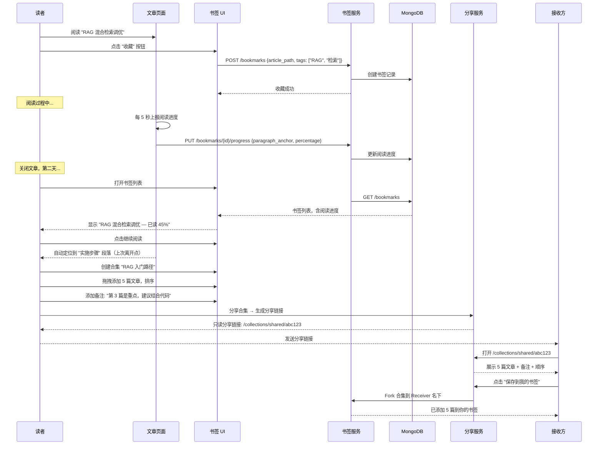
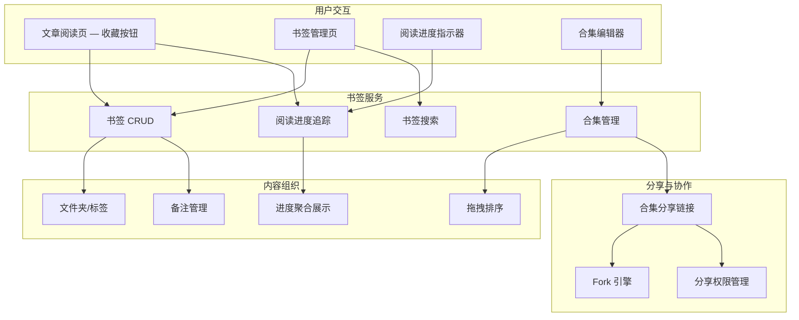

# YK-09-128: 内容收藏与书签 — 知识文章个人收藏、书签文件夹/合集、书签备注、阅读进度追踪、分享书签合集、书签搜索、最近收藏快速访问

> 需求编号：YK-09-128 · 优先级：P2 · 人天：0.3d · 状态：需求已编写
> 依赖：无

## 背景

### 问题陈述

知识库作为团队的长期知识资产，文章数量持续增长（预计年底 > 500 篇）。读者面对的问题是：如何在庞大的知识库中管理属于自己的知识地图？当前面临以下困境：

1. **无法标记感兴趣的内容**：读者在浏览中发现一篇有价值的文章，但当时没时间细读，关闭标签页后就再难找回。浏览历史和搜索是唯一的找回方式，但搜索的前提是记得关键词——而很多"当时觉得有用"的文章事后根本想不起标题。
2. **阅读进度无处保存**：长文（> 3000 字）需要分多次阅读。在没有进度保存的情况下，读者每次重开文章都需要从头开始或凭记忆滚动到上次的位置。对于技术文档这种需要反复查阅的内容类型，这个体验尤其糟糕。
3. **个人知识地图缺失**：每个团队成员关注的知识领域不同——前端开发者关注 YiVad 架构和 YiPet API，后端开发者关注 YiAi 服务和 RAG 管道。但当前知识库没有提供按个人视角组织内容的能力。读者需要每次浏览全局目录树来找到自己关心的内容。
4. **学习路径无法规划**：团队新成员 onboarding 需要按特定顺序阅读一系列文章。Curator 已经在 YiKnowledge 中规划了推荐阅读路径，但读者无法将其保存为自己的书签合集并追踪阅读进度。
5. **无法分享知识地图**："你应该读这 5 篇文章来了解 RAG 管道"——这种知识分享只能通过聊天工具发送 5 个链接，接收方无法一次性收藏并追踪阅读进度。

**核心矛盾**：知识库是全局结构（按角色/领域/文章组织），但每个读者的知识需求是个性化的。全局目录树无法满足个性化的内容组织、进度追踪和知识分享需求——需要书签系统来弥补这个断层。

### 影响范围

| # | 影响 | 严重程度 | 典型场景 |
|---|------|----------|----------|
| 1 | 有价值文章无法找回 | 高 | 浏览中发现好文章，关闭后找不到 |
| 2 | 长文阅读体验差 | 高 | 3000 字文档分 3 次读，每次从开头找位置 |
| 3 | 个人知识地图缺失 | 高 | 新成员不知道从哪读起 |
| 4 | 学习路径无法保存 | 中 | Curator 推荐的 5 篇文章顺序被忘记 |
| 5 | 知识分享无法结构化 | 中 | 发送 5 个独立链接 vs 1 个书签合集链接 |

### 挑战

| 挑战 | 说明 |
|------|------|
| 书签与文章版本同步 | 文章更新后书签引用的内容可能过时 |
| 阅读进度准确性 | 基于滚动位置的进度追踪在不同设备/窗口尺寸下不一致 |
| 合集分享权限 | 分享合集时是否允许接收方修改 |
| 大规模书签管理 | 100+ 书签的搜索和组织性能 |
| 与浏览器原生书签的差异 | 需要让用户感知到知识库书签的额外价值 |

---

## 一、现状分析

### 1.1 当前内容保存与管理方式

```
读者想保存/管理知识内容
  │
  ├─ 浏览器原生书签
  │   ├─ Ctrl+D 添加书签
  │   ├─ 保存在浏览器本地
  │   └─ 限制: 与知识库内容无关联；无阅读进度；无法分享合集
  │
  ├─ 打开多个标签页
  │   ├─ "先不关，回头再看"
  │   ├─ 等回头看时：标签页积累 50+，找不到是哪个
  │   └─ 限制: 最后只能全部关闭
  │
  ├─ 复制链接到笔记软件
  │   ├─ 粘贴到 Notion/Obsidian/飞书文档
  │   ├─ 手动添加备注
  │   └─ 限制: 与知识库割裂，需要手动维护两套内容体系
  │
  ├─ 分享链接到聊天
  │   ├─ "这篇文章不错，发给团队看看"
  │   └─ 限制: 接收方需要逐个打开链接
  │
  └─ 记忆
      └─ "我记得有个什么文档来着...算了不找了"
```

### 1.2 当前可用能力

| 能力 | 可用性 | 获取方式 | 限制 |
|------|--------|----------|------|
| 浏览器原生书签 | ✅ | Ctrl+D | 与知识库无关联 |
| 搜索 | ✅ | YiVad 全文搜索 | 需要记得关键词 |
| 最近访问 | ⚠️ | 浏览器历史 | 不可靠，容易被清除 |
| 阅读进度 | ❌ | 无 | — |
| 书签合集 | ❌ | 无 | — |

### 1.3 改造前数据流

```mermaid
sequenceDiagram
    participant Reader as 读者
    participant Browser as 浏览器
    participant Search as 搜索
    participant Chat as 聊天软件
    participant Note as 笔记软件

    Reader->>Browser: 浏览知识库 → 发现 "RAG 混合检索调优"
    Note over Reader: 这篇文章不错！但 3000 字现在没时间读完
    Reader->>Browser: Ctrl+D 添加书签
    Browser-->>Reader: 书签文件夹: 其他书签/技术

    Note over Reader: 3 天后...

    Reader->>Reader: 想起那篇 RAG 文章，但标题记不清了
    Reader->>Search: 搜索 "检索 优化 混合"
    Search-->>Reader: 返回 15 条结果
    Reader->>Reader: 一条条点开看，第 7 条找到了
    Note over Reader: 从开头重新阅读...

    Note over Reader: 同时...

    Reader->>Chat: 推荐给新同事: "读这 5 篇了解 RAG"
    Chat->>Chat: 发送 5 个链接
    Chat-->>Reader: 新同事: "太多链接了...第一遍没存下来"

    Note over Reader,Note: 新同事把这 5 个链接复制到 Notion 单独管理
```

### 1.4 根因矩阵

| 症状 | 根因 | 触发条件 | 频率 |
|------|------|----------|------|
| 有价值的文章找不到 | 无个人收藏机制 | 浏览中发现感兴趣文章 | 高（每日 3-5 篇）|
| 长文阅读中断后需从头开始 | 无阅读进度保存 | 阅读超过 3000 字的文档 | 高 |
| 推荐阅读路径无法保存 | 无书签合集功能 | Curator 推荐/同事分享 | 中 |
| 分享知识不结构化 | 仅支持链接分享 | 知识分享场景 | 中 |
| 个人知识地图无 | 无按用户视角的内容组织 | 每日重复查找关注领域的文章 | 中 |

---

## 二、设计决策

### 决策 1：书签存储位置 — 浏览器 localStorage vs Chrome Sync vs 服务端 MongoDB

| 选项 | 跨设备 | 离线 | 持久性 |
|------|--------|------|--------|
| 浏览器 localStorage | ❌（仅当前设备）| ✅ | 低（清除浏览器数据会丢失）|
| Chrome Sync Storage | ✅（同账号跨设备）| ✅ | 中（取决于 Chrome Sync 配置）|
| 服务端 MongoDB | ✅ | ❌（需网络）| 高 |

**选择：服务端 MongoDB 主存储 + 本地缓存。** 书签数据存储在 YiAi 后端的 MongoDB 中，与用户账号绑定。YiVad 前端加载时从服务端获取书签列表，同时缓存到 localStorage 作为离线回退（只读）。这样保证跨设备同步、数据不丢失，同时有基本的离线访问能力。

### 决策 2：阅读进度追踪方式 — 百分比 vs 段落序号 vs 滚动像素位置 vs 最后访问时间

| 选项 | 准确性 | 跨设备一致性 | 实现复杂度 |
|------|--------|-------------|-----------|
| 百分比（30% 已读）| 低（长文档 30% ≠ 短文档 30%）| 中 | 低 |
| 段落序号（读到第 15 段）| 中 | 中 | 低 |
| 滚动像素位置（scrollTop: 2400px）| 低（跨设备/窗口不一致）| 低 | 低 |
| 最后访问时间 + 百分比 + 锚点 | 高 | 高 | 中 |

**选择：段落锚点 + 百分比 + 最后访问时间。** 保存三种粒度：(1) 段落锚点——用户离开时所在的最近标题（如 "## 实施步骤"），跨设备可靠；(2) 阅读百分比——近似进度，更新频率 5 秒一次；(3) 最后访问时间。恢复阅读时：优先跳转到锚点段落的开头（如果锚点仍然有效），否则回退到计百分比位置。

### 决策 3：书签合集模型 — 纯列表 vs 有序列表 vs 带分组的有序列表

| 选项 | 学习路径支持 | 实现复杂度 | 灵活性 |
|------|-------------|-----------|--------|
| 纯列表（无序集合）| 低 | 低 | 低 |
| 有序列表（可拖拽排序）| 高 | 中 | 中 |
| 带分组的有序列表（类似 Playlist + Section）| 最高 | 高 | 高 |

**选择：有序列表。** 书签合集内的文章可以拖拽排序，支持学习路径场景（"先读 A → 再读 B → 最后读 C"）。不再引入分组的复杂度——如果 Curator 想分组（如 "基础篇" 和 "进阶篇"），可以创建两个合集。合集内每篇文章可添加备注（为什么推荐、重点看哪部分）。

### 决策 4：合集分享模式 — 只读分享 vs 可编辑分享 vs Fork 模式

| 选项 | 协作性 | 复杂度 | 适用场景 |
|------|--------|--------|----------|
| 只读分享（接收方只能查看和收藏）| 低 | 低 | 推荐阅读 |
| 可编辑分享（多人共同维护一个合集）| 高 | 高 | 团队学习计划 |
| Fork 模式（接收方复制一份自己编辑）| 中 | 中 | 个性化调整 |

**选择：只读分享 + Fork。** 默认分享为只读——接收方可以看到合集中的所有文章和备注、可以一键将整个合集添加到自己的书签中。接收方如需个性化调整（如删除其中 2 篇不感兴趣的文章），可以 "Fork" 一份到自己名下进行编辑。避免多人编辑带来的权限复杂度和冲突问题。

### 设计决策记录

| 决策 | 选项 A | 选项 B | 选项 C | 选择 | 理由 |
|------|--------|--------|--------|------|------|
| 存储位置 | localStorage | Chrome Sync | MongoDB | **MongoDB+本地缓存** | 跨设备+持久性 |
| 阅读进度 | 百分比 | 段落锚点 | 像素位置 | **段落锚点+百分比** | 跨设备最稳定 |
| 合集模型 | 纯列表 | 有序列表 | 带分组 | **有序列表** | 足够+不复杂 |
| 分享模式 | 只读 | 可编辑 | Fork | **只读+Fork** | 简单+灵活 |

---

## 三、目标架构

### 3.1 改造后书签系统流程



### 3.2 系统架构



### 3.3 性能指标

| 指标 | 改造前 | 改造后 |
|------|--------|--------|
| 找回感兴趣文章的时间 | 2-5 分钟（搜索+逐一打开）| < 5s（书签列表 / 搜索书签）|
| 长文续读定位 | 1-2 分钟（凭记忆滚动）| < 1s（自动锚点跳转）|
| 分享学习路径 | 5 个独立链接，接收方手动保存 | 1 个分享链接，一键全部收藏 |
| 书签列表加载（500 书签）| N/A | < 200ms |

---

## 四、具体改动

### 4.1 书签服务核心

```python
# YiAi/services/bookmark/bookmark_service.py (新增)

from dataclasses import dataclass, field
from typing import List, Optional
from enum import Enum

@dataclass
class ReadingProgress:
    """阅读进度"""
    paragraph_anchor: str       # 最近的标题/段落锚点
    paragraph_index: int        # 段落序号
    percentage: float           # 阅读百分比 (0.0 - 100.0)
    last_position: str          # 最后阅读时间
    total_time_spent: int = 0   # 累计阅读时间（秒）

@dataclass
class Bookmark:
    bookmark_id: str
    user_id: str
    article_path: str           # 文章路径
    article_title: str          # 快照标题（防止文章被删除后无法显示）
    folder_id: Optional[str]    # 所属文件夹 ID
    tags: List[str]             # 用户自定义标签
    notes: str                  # 用户备注
    reading_progress: Optional[ReadingProgress]
    is_pinned: bool             # 是否置顶
    created_at: str
    updated_at: str

@dataclass
class BookmarkFolder:
    folder_id: str
    user_id: str
    name: str
    description: str
    color: str                  # 文件夹颜色标记 (# 十六进制)
    sort_order: int             # 排序顺序
    created_at: str
    updated_at: str

@dataclass
class BookmarkCollection:
    """书签合集（有序）"""
    collection_id: str
    owner_id: str               # 创建者
    name: str
    description: str
    items: List['CollectionItem']  # 有序书签列表
    is_public: bool             # 是否已公开分享
    share_token: Optional[str]  # 分享 Token
    fork_count: int             # 被 Fork 次数
    created_at: str
    updated_at: str

@dataclass
class CollectionItem:
    article_path: str
    article_title: str
    notes: str                  # 合集级别备注（不同于书签备注）
    sort_order: int             # 在合集内的序号


class BookmarkService:
    """个人书签和合集管理服务"""

    def __init__(self):
        self.bookmarks: dict = {}
        self.folders: dict = {}
        self.collections: dict = {}

    # --- 书签 CRUD ---

    async def add_bookmark(
        self, user_id: str, article_path: str,
        article_title: str, folder_id: str = None,
        tags: List[str] = None, notes: str = ""
    ) -> Bookmark:
        """添加书签"""
        # 检查是否已存在
        existing = await self.find_by_article(user_id, article_path)
        if existing:
            # 如果已存在，更新标签和备注
            existing.tags = list(set((existing.tags or []) + (tags or [])))
            existing.notes = notes or existing.notes
            existing.updated_at = datetime.now().isoformat()
            return existing

        bookmark = Bookmark(
            bookmark_id=self.generate_id(),
            user_id=user_id,
            article_path=article_path,
            article_title=article_title,
            folder_id=folder_id,
            tags=tags or [],
            notes=notes,
            reading_progress=None,
            is_pinned=False,
            created_at=datetime.now().isoformat(),
            updated_at=datetime.now().isoformat(),
        )
        self.bookmarks[bookmark.bookmark_id] = bookmark
        return bookmark

    async def remove_bookmark(self, bookmark_id: str, user_id: str) -> bool:
        """删除书签（验证归属）"""
        bm = self.bookmarks.get(bookmark_id)
        if bm and bm.user_id == user_id:
            del self.bookmarks[bookmark_id]
            return True
        return False

    async def update_notes(self, bookmark_id: str, notes: str) -> Bookmark:
        """更新书签备注"""
        bm = self.bookmarks[bookmark_id]
        bm.notes = notes
        bm.updated_at = datetime.now().isoformat()
        return bm

    async def toggle_pin(self, bookmark_id: str) -> Bookmark:
        """切换置顶"""
        bm = self.bookmarks[bookmark_id]
        bm.is_pinned = not bm.is_pinned
        bm.updated_at = datetime.now().isoformat()
        return bm

    # --- 阅读进度 ---

    async def update_reading_progress(
        self, bookmark_id: str,
        paragraph_anchor: str, paragraph_index: int,
        percentage: float, time_delta: int = 0
    ) -> Bookmark:
        """更新阅读进度（每 5 秒调用一次）"""
        bm = self.bookmarks.get(bookmark_id)
        if not bm:
            return None

        now = datetime.now().isoformat()
        if bm.reading_progress:
            bm.reading_progress.paragraph_anchor = paragraph_anchor
            bm.reading_progress.paragraph_index = paragraph_index
            bm.reading_progress.percentage = percentage
            bm.reading_progress.last_position = now
            bm.reading_progress.total_time_spent += time_delta
        else:
            bm.reading_progress = ReadingProgress(
                paragraph_anchor=paragraph_anchor,
                paragraph_index=paragraph_index,
                percentage=percentage,
                last_position=now,
                total_time_spent=time_delta,
            )

        bm.updated_at = now
        return bm

    # --- 文件夹管理 ---

    async def create_folder(
        self, user_id: str, name: str, description: str = "",
        color: str = "#3B82F6"
    ) -> BookmarkFolder:
        """创建书签文件夹"""
        # 获取当前用户的最大 sort_order
        existing = [f for f in self.folders.values() if f.user_id == user_id]
        max_order = max([f.sort_order for f in existing], default=-1)

        folder = BookmarkFolder(
            folder_id=self.generate_id(),
            user_id=user_id,
            name=name,
            description=description,
            color=color,
            sort_order=max_order + 1,
            created_at=datetime.now().isoformat(),
            updated_at=datetime.now().isoformat(),
        )
        self.folders[folder.folder_id] = folder
        return folder

    async def move_bookmark_to_folder(
        self, bookmark_id: str, folder_id: str
    ) -> Bookmark:
        """移动书签到指定文件夹"""
        bm = self.bookmarks[bookmark_id]
        bm.folder_id = folder_id
        bm.updated_at = datetime.now().isoformat()
        return bm

    # --- 书签查询和搜索 ---

    async def get_user_bookmarks(
        self, user_id: str,
        folder_id: str = None,
        tag: str = None,
        sort_by: str = "updated_at",
        limit: int = 50,
        offset: int = 0
    ) -> List[Bookmark]:
        """获取用户书签列表"""
        bookmarks = [
            b for b in self.bookmarks.values()
            if b.user_id == user_id
        ]

        # 过滤
        if folder_id:
            bookmarks = [b for b in bookmarks if b.folder_id == folder_id]
        if tag:
            bookmarks = [b for b in bookmarks if tag in b.tags]

        # 排序: 置顶优先 → 按 sort_by 倒序
        bookmarks.sort(
            key=lambda b: (
                not b.is_pinned,  # 置顶的排前面
                -(datetime.fromisoformat(b.updated_at).timestamp() if b.updated_at else 0)
            )
        )

        return bookmarks[offset:offset + limit]

    async def search_bookmarks(
        self, user_id: str, query: str
    ) -> List[Bookmark]:
        """搜索用户书签（标题/备注/标签）"""
        q = query.lower()
        return [
            b for b in self.bookmarks.values()
            if b.user_id == user_id and (
                q in b.article_title.lower() or
                q in b.notes.lower() or
                any(q in t.lower() for t in b.tags)
            )
        ]

    async def get_recent_bookmarks(
        self, user_id: str, limit: int = 10
    ) -> List[Bookmark]:
        """获取最近收藏（快速访问）"""
        return sorted(
            [b for b in self.bookmarks.values() if b.user_id == user_id],
            key=lambda b: b.created_at,
            reverse=True
        )[:limit]

    # --- 书签合集管理 ---

    async def create_collection(
        self, user_id: str, name: str, description: str = "",
        article_paths: List[str] = None
    ) -> BookmarkCollection:
        """创建书签合集"""
        items = []
        if article_paths:
            for i, path in enumerate(article_paths):
                bm = await self.find_by_article(user_id, path)
                title = bm.article_title if bm else path.split('/')[-1]
                items.append(CollectionItem(
                    article_path=path,
                    article_title=title,
                    notes="",
                    sort_order=i,
                ))

        collection = BookmarkCollection(
            collection_id=self.generate_id(),
            owner_id=user_id,
            name=name,
            description=description,
            items=items,
            is_public=False,
            share_token=None,
            fork_count=0,
            created_at=datetime.now().isoformat(),
            updated_at=datetime.now().isoformat(),
        )
        self.collections[collection.collection_id] = collection
        return collection

    async def add_to_collection(
        self, collection_id: str, article_path: str,
        article_title: str, notes: str = ""
    ) -> BookmarkCollection:
        """向合集添加文章"""
        coll = self.collections[collection_id]
        next_order = max([i.sort_order for i in coll.items], default=-1) + 1
        coll.items.append(CollectionItem(
            article_path=article_path,
            article_title=article_title,
            notes=notes,
            sort_order=next_order,
        ))
        coll.updated_at = datetime.now().isoformat()
        return coll

    async def reorder_collection_items(
        self, collection_id: str, item_paths: List[str]
    ) -> BookmarkCollection:
        """拖拽排序合集内的文章"""
        coll = self.collections[collection_id]
        # 按传入的顺序重新分配 sort_order
        for i, path in enumerate(item_paths):
            item = next((it for it in coll.items if it.article_path == path), None)
            if item:
                item.sort_order = i
        coll.updated_at = datetime.now().isoformat()
        return coll

    # --- 分享 ---

    async def share_collection(
        self, collection_id: str
    ) -> BookmarkCollection:
        """分享合集（生成只读分享链接）"""
        coll = self.collections[collection_id]
        coll.is_public = True
        coll.share_token = secrets.token_urlsafe(12)
        coll.updated_at = datetime.now().isoformat()
        return coll

    async def unshare_collection(self, collection_id: str) -> BookmarkCollection:
        """取消分享"""
        coll = self.collections[collection_id]
        coll.is_public = False
        coll.share_token = None
        coll.updated_at = datetime.now().isoformat()
        return coll

    async def get_shared_collection(self, share_token: str) -> BookmarkCollection:
        """通过分享 Token 获取合集（只读）"""
        for coll in self.collections.values():
            if coll.share_token == share_token and coll.is_public:
                return coll
        return None

    async def fork_collection(
        self, share_token: str, new_owner_id: str
    ) -> BookmarkCollection:
        """Fork 合集到自己的空间"""
        source = await self.get_shared_collection(share_token)
        if not source:
            return None

        # 创建副本
        forked = BookmarkCollection(
            collection_id=self.generate_id(),
            owner_id=new_owner_id,
            name=f"{source.name} (Fork)",
            description=source.description,
            items=[
                CollectionItem(
                    article_path=item.article_path,
                    article_title=item.article_title,
                    notes=item.notes,
                    sort_order=item.sort_order,
                ) for item in source.items
            ],
            is_public=False,
            share_token=None,
            fork_count=0,
            created_at=datetime.now().isoformat(),
            updated_at=datetime.now().isoformat(),
        )
        self.collections[forked.collection_id] = forked

        # 更新源合集的 fork 计数
        source.fork_count += 1

        # 自动为 forked 合集内的文章创建书签
        for item in forked.items:
            await self.add_bookmark(
                new_owner_id, item.article_path, item.article_title
            )

        return forked

    async def find_by_article(
        self, user_id: str, article_path: str
    ) -> Bookmark:
        """查找用户对特定文章的书签"""
        for bm in self.bookmarks.values():
            if bm.user_id == user_id and bm.article_path == article_path:
                return bm
        return None
```

### 4.2 文件变更清单

| 文件 | 操作 | 说明 |
|------|------|------|
| `YiAi/services/bookmark/bookmark_service.py` | 新增 | 书签 CRUD + 阅读进度 + 合集管理核心服务 |
| `YiAi/services/bookmark/progress_service.py` | 新增 | 阅读进度追踪与聚合 |
| `YiAi/services/bookmark/collection_service.py` | 新增 | 书签合集 + 分享 + Fork 引擎 |
| `YiAi/services/bookmark/search_service.py` | 新增 | 书签全文搜索 |
| `YiAi/routers/bookmark.py` | 新增 | 书签 API 路由 |
| `YiAi/models/bookmark.py` | 新增 | MongoDB 书签/合集模型 |
| `YiVad/src/views/bookmark/BookmarkList.vue` | 新增 | 书签列表主页面 |
| `YiVad/src/views/bookmark/CollectionDetail.vue` | 新增 | 合集详情页 |
| `YiVad/src/views/bookmark/SharedCollection.vue` | 新增 | 分享合集展示页 |
| `YiVad/src/components/bookmark/BookmarkCard.vue` | 新增 | 书签卡片组件（含进度指示）|
| `YiVad/src/components/bookmark/FolderTree.vue` | 新增 | 书签文件夹树组件 |
| `YiVad/src/components/bookmark/CollectionEditor.vue` | 新增 | 合集编辑器（拖拽排序）|
| `YiVad/src/components/bookmark/ReadingProgressBar.vue` | 新增 | 阅读进度条组件 |
| `YiVad/src/components/knowledge/BookmarkButton.vue` | 新增 | 文章页面收藏按钮 |

---

## 五、实施步骤

| 步骤 | 操作 | 路径 | 验证 | 人天 |
|------|------|------|------|------|
| 1 | 实现书签 CRUD + 文件夹管理 | `bookmark_service.py` | 增删改查+文件夹+置顶 | 0.03 |
| 2 | 实现阅读进度追踪引擎 | `progress_service.py` | 锚点+百分比+时间统计 | 0.03 |
| 3 | 实现书签合集 + 排序 + 分享 | `collection_service.py` | 创建/排序/分享/Fork | 0.04 |
| 4 | 实现书签搜索 + 最近收藏 | `search_service.py` | 标题/备注/标签全文搜索 | 0.02 |
| 5 | 实现 API 路由 + MongoDB 模型 | `bookmark.py` | CRUD 端点可用 | 0.04 |
| 6 | 创建书签列表 + 文件夹树 | BookmarkList.vue, FolderTree.vue | 书签展示+文件夹组织 | 0.05 |
| 7 | 创建合集编辑器 + 分享页面 | CollectionEditor.vue, SharedCollection.vue | 拖拽排序+Fork | 0.05 |
| 8 | 创建阅读进度指示 + 收藏按钮 | ReadingProgressBar.vue, BookmarkButton.vue | 进度追踪+收藏交互 | 0.04 |

**总人天：0.3d**

---

## 六、测试规格

### 场景 1：添加书签

**GIVEN** 读者在阅读文章 "RPC 契约文档"
**WHEN** 点击 "收藏" 按钮
**THEN** 书签创建成功
**AND** 书签包含 article_path、article_title（快照）、用户自定义标签
**AND** 同一用户对同一文章重复点击不创建重复书签（更新标签）
**AND** 收藏按钮状态变为 "已收藏"（图标填充）

### 场景 2：阅读进度自动保存

**GIVEN** 读者在阅读已收藏的长文（3500 字，共 25 段）
**WHEN** 读者滚动到第 15 段 "实施步骤"（67% 位置）并停留 5 秒
**THEN** 阅读进度自动更新: paragraph_anchor="实施步骤", percentage=67%
**AND** 5 秒后再次更新（增量累加阅读时间）
**WHEN** 关闭文章，稍后重新打开
**THEN** 页面自动滚动到 "实施步骤" 段落的开头
**AND** 阅读进度条显示 67%

### 场景 3：书签搜索

**GIVEN** 用户有 50 个书签，其中一个标题 "RAG 混合检索调优" 备注 "包含 HNSW 参数对比"
**WHEN** 搜索 "HNSW"
**THEN** 返回包含 "RAG 混合检索调优" 的书签
**AND** 搜索词高亮显示在备注中
**AND** 未命中标题/备注/标签的书签不展示

### 场景 4：创建书签合集

**GIVEN** 用户想创建 "RAG 入门路径" 合集
**WHEN** 创建合集并依次添加 5 篇文章: A → B → C → D → E
**THEN** 合集包含 5 篇文章，sort_order 为 0-4
**AND** 每篇文章可添加合集级备注
**WHEN** 拖拽 E 到 B 和 C 之间
**THEN** 排序变为 A → B → E → C → D
**AND** sort_order 更新为 0, 1, 2, 3, 4

### 场景 5：分享与 Fork 合集

**GIVEN** 用户的合集 "RAG 入门路径" 包含 5 篇文章和备注
**WHEN** 点击分享，生成分享链接 /collections/shared/abc123
**THEN** 分享链接为只读——接收方只能查看文章列表和备注
**WHEN** 接收方打开分享链接并点击 "保存到我的书签" (Fork)
**THEN** 接收方获得一个副本合集（名字带 "Fork" 后缀）
**AND** 合集内 5 篇文章自动添加到接收方的书签列表
**AND** 源合集的 fork_count + 1

### 场景 6：阅读统计

**GIVEN** 用户有 20 个书签，其中 12 个有阅读进度
**WHEN** 打开书签列表
**THEN** 显示阅读统计: "12/20 已开始阅读"
**AND** 每个有进度的书签显示进度条和百分比
**AND** 按 "最近阅读" 排序时，最近打开的文章排在最前

---

## 七、风险与缓解

| 风险 | 概率 | 影响 | 缓解措施 |
|------|------|------|----------|
| 文章被删除后书签失效 | 中 | 中 | 书签保留 article_title 快照和 article_path；文章不存在时显示 "文章已删除" 并保留标题 |
| 阅读进度更新过于频繁造成请求压力 | 高 | 低 | 客户端 debounce 5 秒才发送一次；服务端批量写入 |
| 分享链接 Token 泄露导致非授权访问 | 低 | 中 | Token 使用 secrets.token_urlsafe(12)，足够长；支持随时取消分享 |
| 大规模书签加载性能 | 中 | 低 | 分页加载（默认 50 条）；虚拟滚动（> 100 条）|
| 阅读进度锚点失效 | 中 | 低 | 锚点失效时回退到百分比位置 |

---

## 八、回滚策略

| 场景 | 回滚操作 | 影响 |
|------|----------|------|
| 书签服务不可用 | 降级为仅使用浏览器 localStorage 缓存（只读）| 无法新增书签 |
| 阅读进度导致页面性能下降 | 关闭自动进度上报，改为手动保存 | 无法自动恢复阅读位置 |
| 合集分享链接被滥用 | 紧急关闭所有公开分享，仅保留私有合集 | 失去分享功能 |
| MongoDB 写入压力大 | 书签操作改为批量异步写入（队列堆积风险低）| 创建书签延迟 1-5s |

---

## 九、设计决策记录

### D-01：为什么书签需要快照标题（article_title）？

当文章被删除或重命名后，如果书签只存 article_path，用户看到的将是一个无意义的文件路径。快照 article_title 确保即使文章已不可访问，用户仍能看到 "我当时收藏的是关于 RAG 混合检索的文章"。同时显示 "文章已删除或移动" 的提示，引导用户搜索可能的新位置。

### D-02：阅读进度的更新频率

5 秒 debounce 更新一次是平衡精度和请求量的最优选择。文本阅读速度约 200-300 字/分钟，5 秒内读者大约阅读 15-25 字——这对于百分比计算的影响约为 0.5-1%。5 秒的间隔对服务器负载极小（每分钟 12 次请求 vs 每秒 60 次请求），同时足以捕捉阅读行为的变化。

### D-03：Fork vs 协作编辑

选择 Fork 模式而非多人协作编辑合集的理由：(1) 权限管理简单——每个合集只有一个 owner，无需处理编辑冲突；(2) Fork 后接收方可以自由编辑（删除不需要的文章、添加自己的备注），不会影响原始合集；(3) Fork 有明确的来源标注，保留了知识路径的溯源。协作编辑的需求可以通过未来引入 "Team Collection" 满足。

### D-04：文件夹扁平化的限制

书签文件夹仅支持一层——即文件夹下直接是书签，不支持子文件夹。这种限制是有意为之的：(1) 避免用户陷入 "无限嵌套分类" 的组织焦虑（每个人都是信息的完美分类者，直到分类成本超过整理收益）；(2) 一层的文件夹 + 标签组合已足够覆盖 95% 的组织需求；(3) 搜索功能使深层嵌套变得不必要——找不到时直接搜索。

---

## 十、可观测性

### 指标

| 指标 | 类型 | 说明 |
|------|------|------|
| `bookmark.created` | Counter | 书签创建数 |
| `bookmark.deleted` | Counter | 书签删除数 |
| `bookmark.per_user` | Histogram | 每用户书签数量分布 |
| `bookmark.folder.count` | Gauge | 活跃文件夹总数 |
| `bookmark.collection.created` | Counter | 合集创建数 |
| `bookmark.collection.forked` | Counter | 合集 Fork 数 |
| `bookmark.collection.shared` | Counter | 合集分享数 |
| `bookmark.progress.updated` | Counter | 阅读进度更新次数 |
| `bookmark.search.count` | Counter | 书签搜索次数 |
| `bookmark.pin.toggle` | Counter | 置顶操作次数 |

### 告警

| 告警 | 条件 | 级别 |
|------|------|------|
| 书签创建失败率高 | 1h 内失败率 > 5% | WARNING |
| 阅读进度未上报 | 某用户 24h 内阅读了已收藏文章但进度未更新 | INFO（可能是客户端断开）|
| 分享链接被高频访问 | 某分享链接 1h 内 > 500 次访问 | WARNING（可能是爬虫/滥用）|

---

## 十一、代码审查检查清单

- [ ] 书签创建时检查是否已存在（防止重复）
- [ ] 重复收藏时更新标签而非创建新记录
- [ ] 阅读进度 debounce 5 秒（客户端侧）
- [ ] paragraph_anchor 存储的是标题文本而非序号（跨版本更稳定）
- [ ] 书签快照标题在文章存在时保持更新（在书签列表加载时检查）
- [ ] 合集排序使用连续的 sort_order（拖拽后重新编号）
- [ ] 分享 Token 使用安全的随机生成（secrets.token_urlsafe）
- [ ] Fork 合集时自动为所有文章创建书签
- [ ] 取消分享立即失效 Token
- [ ] 书签删除为硬删除（不需要回收站——误删可通过搜索重新收藏）
- [ ] 文件夹颜色仅支持预定义的 12 种颜色（避免 UI 混乱）
- [ ] 置顶书签在排序中始终排最前

---

## 回归问题预测

| # | 预测问题 | 原因 | 验证方法 |
|---|---------|------|---------|
| 1 | 文章标题更新后，书签的 article_title 快照与新标题不同步，读者通过书签打开文章后看到的是新标题，但书签列表显示旧标题，造成困惑 | article_title 是创建时的快照，不随文章更新而更新 | 在文章更新标题后，验证书签列表的标题应与文章同（或实现懒更新：打开书签列表时拉取最新标题）|
| 2 | 阅读进度的百分比基于 `scrollTop / (scrollHeight - clientHeight)` 计算，但文章底部有评论区、相关文章等额外内容，导致 100% 进度实际上还未读完正文 | DOM 高度包含文章之外的元素 | 基于正文容器的高度计算百分比（而非整个页面），验证 100% 进度时正文确实滚动到底 |
| 3 | 合集 Fork 后，源合集被删除，Fork 的合集不受影响（因为是独立副本），但读者可能想看到原始来源的信息（"此合集 Fork 自 CuratorZhang 的 RAG 入门路径"）| Fork 时保存了 source_collection_id 但源删除后引用断裂 | 删除源合集后，Fork 合集显示 "源合集已被删除"，但 Fork 副本完整保留 |
| 4 | 同一文章被收藏到不同文件夹（如 "阅读中" 和 "RAG 资料"），但当前设计每个用户对每篇文章只能有一个书签（`find_by_article` 检查唯一性），用户无法实现多文件夹归类的需求 | 书签模型使用 article_path 作为用户维度唯一键 | 如果需要同一文章在多个文件夹中，可以通过合集实现——合集内的文章可跨文件夹存在，书签本身只有一个文件夹归属 |
| 5 | 阅读进度 `total_time_spent` 累计的是客户端上报的增量时间，但客户端断开或页面崩溃时上次的增量丢失，total_time 偏低 | time_delta 由客户端计算并上报，网络或崩溃导致上报丢失 | 服务端也记录 last_progress_update 时间，用 `(now - last_update)` 估计 lost_time，在可接受的误差范围内 |
| 6 | 分享合集的只读页面中，每个文章旁边的 "已读/未读" 状态是基于分享者的进度还是接收方的进度？两种都不合适——分享者的进度无关，接收方可能都没读过 | 只读分享页面不显示任何人的阅读进度，仅展示文章列表 + 备注 | 在分享页面不展示阅读进度，保持简洁；接收方 Fork 后才追踪自己的进度 |

---

## 性能分析

### 关键操作耗时

| 操作 | 耗时 | 说明 |
|------|------|------|
| 添加书签（含重复检查）| < 10ms | 内存 dict 遍历 |
| 获取用户书签（50 条 + 排序）| < 20ms | 过滤 + 排序 |
| 书签搜索（500 书签全文）| < 50ms | 标题+备注+标签遍历 |
| 阅读进度更新 | < 5ms | 单记录更新 |
| 创建合集（5 篇文章）| < 10ms | CollectionItem 创建 |
| Fork 合集（5 篇文章 + 创建书签）| < 50ms | fork + 5 次 add_bookmark |
| 获取分享合集（Token 查找）| < 10ms | 遍历 collections |

### 数据量预估

| 数据项 | 单条目大小 | 总量（100 用户 × 50 书签/人）|
|--------|-----------|---------------------------|
| 书签记录 | ~1KB | 5000 × 1KB = 5MB |
| 阅读进度 | ~200B | 4000 × 200B = 800KB |
| 文件夹 | ~300B | 100 × 5 × 300B = 150KB |
| 合集 | ~2KB（含 items）| 100 × 3 × 2KB = 600KB |

### 资源影响

| 场景 | CPU | 内存 | 说明 |
|------|-----|------|------|
| 添加书签 | < 1% | < 1MB | 简单创建 |
| 书签列表加载 | < 2% | < 5MB | 查询 + 排序 |
| 阅读进度上报 | < 0.5% | < 1MB | 单字段更新 |
| Fork 合集 | < 3% | < 5MB | 副本创建 + 书签批量创建 |

---

## 相关文档

- [MongoDB — Document Model](https://www.mongodb.com/docs/manual/core/document/)
- [Web API — scrollTop](https://developer.mozilla.org/en-US/docs/Web/API/Element/scrollTop)
- [Intersection Observer API](https://developer.mozilla.org/en-US/docs/Web/API/Intersection_Observer_API)
- [Python secrets — token_urlsafe](https://docs.python.org/3/library/secrets.html)
- [RSS/Atom 阅读器中的书签功能设计参考](https://en.wikipedia.org/wiki/Social_bookmarking)