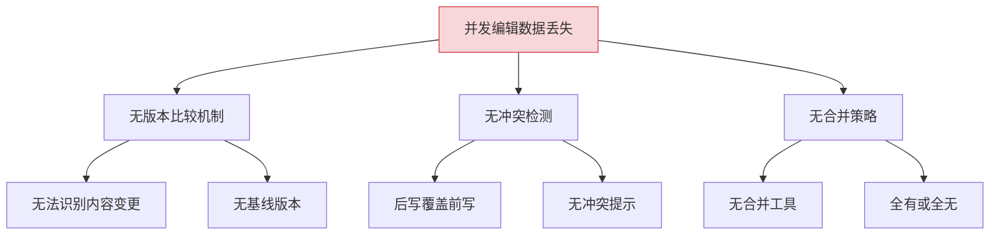
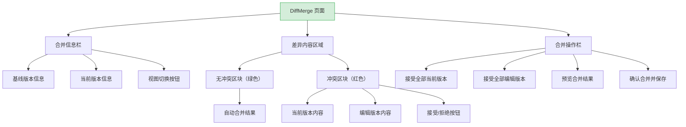
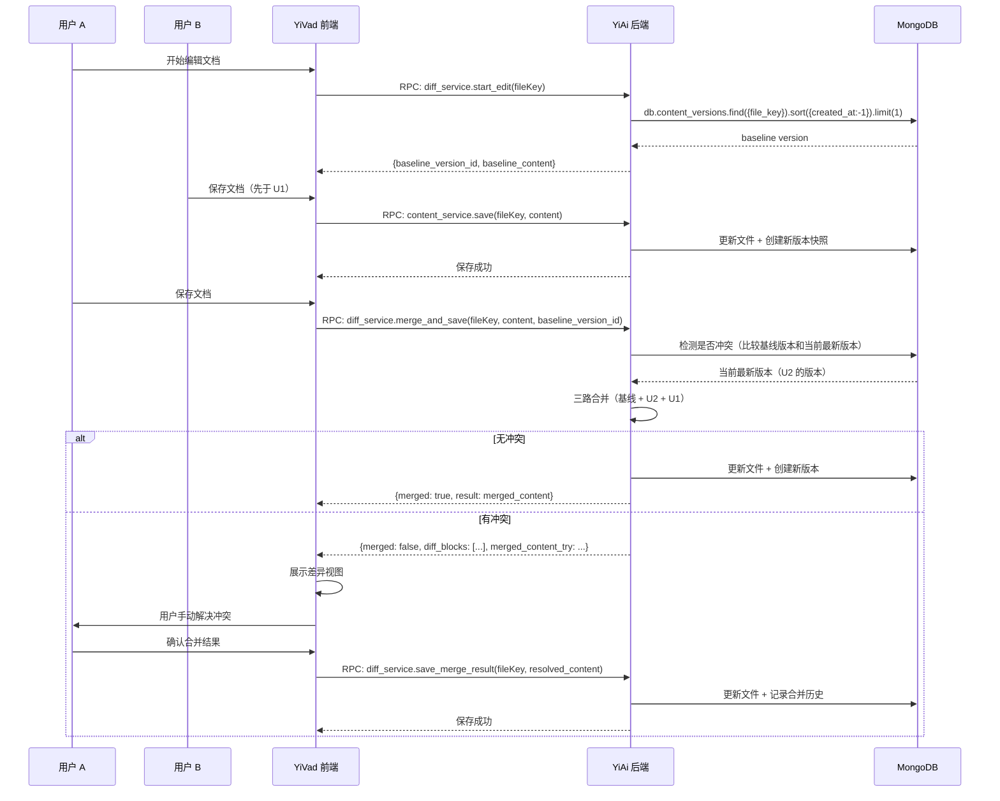

# YK-09-129: 内容差异与合并 — 三路合并、冲突可视化与合并历史

> 需求编号：YK-09-129 · 优先级：P2 · 人天：0.3d · 状态：需求已编写
> 依赖：无硬依赖（可独立开发）

## 背景

### 问题陈述

YiKnowledge 知识库支持多人协作编辑内容，但当前缺少并发编辑冲突的处理机制。当两个用户同时编辑同一篇文档时，后保存的会静默覆盖先保存的内容，导致数据丢失。内容差异对比和合并是多人协作知识库的基础能力。

1. **并发编辑冲突丢失数据**：A 和 B 同时编辑文档，B 后保存覆盖了 A 的修改
2. **无差异对比视图**：无法直观看到两个版本之间的内容差异
3. **无合并能力**：无法选择性地接受或拒绝不同版本的修改
4. **无冲突历史**：无法回溯历史上发生过哪些合并冲突
5. **无自动合并**：不冲突的修改（不同段落）也需要手动处理全部内容
6. **无可视化冲突标记**：冲突位置不直观，用户难以理解差异

**核心矛盾**：多人协作要求并发编辑安全，但简单的内容保存模型无法处理写-写冲突。

### 影响范围

| # | 影响 | 严重程度 | 典型场景 |
|---|------|----------|----------|
| 1 | 数据静默丢失 | 高 | 两人的修改互相覆盖 |
| 2 | 差异不可见 | 高 | 不知道被覆盖了什么内容 |
| 3 | 合并效率低 | 中 | 需要人工逐字对比两个版本 |
| 4 | 协作信心下降 | 中 | 用户不敢同时编辑文档 |
| 5 | 冲突不可追溯 | 低 | 无法分析冲突频率和模式 |

### 挑战

| 挑战 | 说明 |
|------|------|
| 三路合并 vs 二路差异 | 三路合并需要共同祖先版本，增加数据管理复杂度 |
| 差异算法选型 | 行级差异、词级差异、字符级差异各有利弊 |
| 冲突可视化 | 并排视图 vs 统一视图，用户体验取舍 |
| 大文档性能 | 大型 markdown 文档（5000+ 行）的差异计算和渲染性能 |

---

## 一、现状分析

### 1.1 当前内容编辑现状

```
现有功能:
├── 内容 CRUD
│   ├── 创建/读取/更新/删除文档
│   └── 基于 frontmatter 的元数据管理
├── 文件写入
│   ├── `POST /write-file` 覆盖写入
│   └── 无版本控制

缺失:
├── 内容差异对比              # ❌ 不存在
├── 并发编辑冲突检测           # ❌ 不存在
├── 三路合并                   # ❌ 不存在
├── 冲突可视化                 # ❌ 不存在
├── 合并历史                   # ❌ 不存在
└── 自动合并（无冲突时）        # ❌ 不存在
```

### 1.2 根因分析矩阵



| 根因 | 症状 | 影响 | 优先级 |
|------|------|------|--------|
| 无版本比较 | 不知道谁改了什么 | 数据丢失不可见 | 高 |
| 无冲突检测 | 保存时静默覆盖 | 数据静默丢失 | 高 |
| 无合并策略 | 需人工整体对比 | 合并效率低 | 中 |
| 无合并历史 | 冲突不可追溯 | 无法分析改进 | 低 |

---

## 二、设计决策

### 决策 1：差异算法选型

| 选项 | 描述 | 优点 | 缺点 |
|------|------|------|------|
| A: 行级差异（Line Diff） | 将文档按行分割，比较行级别差异 | 实现简单，性能好 | 段落内修改显示不精确 |
| B: 词级差异（Word Diff） | 按词/字符比较，粒度更细 | 精确显示词级修改 | 实现复杂，大文档性能差 |
| C: 混合差异 | 行级差异 + 行内词级差异 | 兼顾性能和精度 | 实现最复杂 |

**选择：C（混合差异）。** 使用行级差异定位修改的行，再对修改的行进行词级差异分析。这是 GitHub PR 差异视图的标准做法，用户体验最好。

### 决策 2：版本存储策略

| 选项 | 描述 | 优点 | 缺点 |
|------|------|------|------|
| A: Git 原生 | 直接使用 Git 管理文件版本 | 成熟的合并能力 | 需要 shell 调用或 libgit2 绑定 |
| B: 数据库版本链 | 在 MongoDB 中存储版本快照链 | 数据可控，查询灵活 | 存储空间增长快 |
| C: 仅存基线版本 | 仅在编辑开始时存一个基线版本 | 空间最优 | 只能比较当前版本和基线 |

**选择：B（数据库版本链）。** 在 `content_versions` 集合中存储每次保存的版本快照。保留最近 10 个版本（旧版本定期清理）。每次编辑开始时记录基线版本 ID，保存时使用基线进行三路合并。

### 决策 3：冲突可视化布局

| 选项 | 描述 | 优点 | 缺点 |
|------|------|------|------|
| A: 并排视图（Side-by-Side） | 左右两栏分别显示当前版本和基线版本 | 对比直观 | 占屏幕宽度，小屏不友好 |
| B: 统一视图（Unified Diff） | 单栏显示，`+` 增加、`-` 删除 | 节省空间，开发者熟悉 | 修改上下文不直观 |
| C: 可切换视图 | 提供统一/并排两种视图，用户切换 | 兼顾两种偏好 | 实现工作量翻倍 |

**选择：C（可切换视图）。** 默认统一视图（节省空间，适合大部分场景），提供切换到并排视图的按钮。两种视图共享相同的差异数据，仅渲染方式不同。

### 决策 4：自动合井策略

| 选项 | 描述 | 优点 | 缺点 |
|------|------|------|------|
| A: 仅无冲突时自动合并 | 基线→当前和基线→编辑的修改位于不同行时自动合并 | 安全可靠 | 跨行修改可能逻辑冲突 |
| B: 语义分析合并 | 分析 markdown 结构（段落/标题/列表），按语义块合并 | 更智能 | 实现复杂，误判风险 |
| C: 全手动合并 | 任何并发修改都需要手动合并 | 最安全 | 效率最低 |

**选择：A（仅无冲突时自动合并）。** 两方修改的行不相交（行号范围无重叠）时自动合并保存。任何行重叠（包括相邻行）都需要手动合并。这是 Git 三路合并的安全策略。

### 设计决策总览

| 决策 | 选项 A | 选项 B | 选择 | 理由 |
|------|--------|--------|------|------|
| 差异算法 | 行级差异 | 词级差异 | **混合差异** | 精确度 + 性能 |
| 版本存储 | Git 原生 | 数据库版本链 | **数据库版本链** | 数据可控 |
| 冲突视图 | 并排 | 统一 | **可切换** | 兼顾偏好 |
| 自动合并 | 无冲突自动 | 语义分析 | **无冲突自动** | 安全可靠 |

---

## 三、目标架构

### 3.1 差异合并页面布局



### 3.2 三路合并数据流



### 3.3 架构决策权衡

| 维度 | 改造前 | 改造后 | 权衡说明 |
|------|--------|--------|----------|
| 并发编辑安全 | 后写覆盖 | 三路合并 + 冲突检测 | 不再静默丢失数据 |
| 差异可见性 | 无 | 行级 + 词级差异 | 精确显示变更 |
| 合并能力 | 无 | 选择接受/拒绝 + 预览 | 灵活解决冲突 |
| 存储开销 | 仅当前版本 | 额外版本链 | 每文档多 10 个历史版本 |

---

## 四、具体改动

### 4.1 改动总览

| 改动点 | 类型 | 涉及文件 | 预估行数 |
|--------|------|---------|---------|
| DiffMerge 页面 | 新增 | `views/content/DiffMerge.vue` | 200 行 |
| 差异视图组件（统一） | 新增 | `components/diff/UnifiedDiff.vue` | 100 行 |
| 差异视图组件（并排） | 新增 | `components/diff/SideBySideDiff.vue` | 120 行 |
| 冲突区块组件 | 新增 | `components/diff/ConflictBlock.vue` | 80 行 |
| 合并预览弹窗 | 新增 | `components/diff/MergePreview.vue` | 80 行 |
| Diff Service（前端） | 新增 | `services/diffService.ts` | 60 行 |
| 类型定义 | 新增 | `types/diff.ts` | 50 行 |

### 4.2 涉及文件

```
src/
├── views/content/
│   └── DiffMerge.vue                   # 新增：差异合并主页面
├── components/diff/
│   ├── UnifiedDiff.vue                 # 新增：统一差异视图
│   ├── SideBySideDiff.vue              # 新增：并排差异视图
│   ├── ConflictBlock.vue               # 新增：冲突解决区块
│   └── MergePreview.vue                # 新增：合并预览弹窗
├── services/
│   └── diffService.ts                  # 新增：差异服务
└── types/
    └── diff.ts                         # 新增：差异类型定义
```

### 4.3 核心类型定义

```typescript
// types/diff.ts
interface DiffHunk {
  old_start: number;
  old_lines: number;
  new_start: number;
  new_lines: number;
  lines: DiffLine[];
}

interface DiffLine {
  type: 'context' | 'addition' | 'deletion' | 'conflict_current' | 'conflict_incoming';
  old_line_num: number | null;
  new_line_num: number | null;
  content: string;
  word_diffs: WordDiff[];  // 行内词级差异
}

interface WordDiff {
  type: 'unchanged' | 'added' | 'removed';
  text: string;
}

interface MergeResult {
  merged: boolean;
  has_conflicts: boolean;
  diff_blocks: DiffBlock[];
  auto_merged_content: string | null;
}

interface DiffBlock {
  type: 'unchanged' | 'auto_merged' | 'conflict';
  left_content: string;   // 基线版本
  middle_content: string; // 当前版本（已被保存的）
  right_content: string;  // 你的版本（待合并的）
  result_content: string | null;
}
```

---

## 五、实施步骤

| 步骤 | 内容 | 涉及文件 | 验证方式 | 人天 |
|------|------|---------|---------|------|
| 1 | 类型定义 + Diff Service | `types/diff.ts`, `services/diffService.ts` | 类型检查通过 | 0.04 |
| 2 | UnifiedDiff 组件 | `UnifiedDiff.vue` | 差异视图正确渲染 | 0.06 |
| 3 | ConflictBlock 组件 | `ConflictBlock.vue` | 接受/拒绝按钮正确 | 0.04 |
| 4 | SideBySideDiff 组件 | `SideBySideDiff.vue` | 并排视图正确 | 0.05 |
| 5 | MergePreview 弹窗 | `MergePreview.vue` | 预览渲染 + 确认按钮 | 0.04 |
| 6 | DiffMerge 主页面 | `DiffMerge.vue` | 完整合并流程可用 | 0.05 |
| 7 | 边界处理 + 空状态 | 全模块 | 无冲突/纯增加/纯删除 | 0.02 |

**总计：0.3d**

---

## 六、测试规格

### 组件测试：UnifiedDiff

#### Scenario: 显示增加的行
- **GIVEN** 差异数据有 3 行 'addition'
- **WHEN** 渲染 UnifiedDiff
- **THEN** 3 行绿色背景显示，行号前有 `+` 标记

#### Scenario: 显示删除的行
- **GIVEN** 差异数据有 2 行 'deletion'
- **WHEN** 渲染 UnifiedDiff
- **THEN** 2 行红色背景显示，行号前有 `-` 标记

#### Scenario: 显示上下文行
- **GIVEN** 差异 hunk 包含 3 行上下文
- **WHEN** 渲染 UnifiedDiff
- **THEN** 上下文行无背景色，正常显示

### 组件测试：ConflictBlock

#### Scenario: 冲突区块渲染
- **GIVEN** 冲突区块有当前版本（middle）和编辑版本（right）
- **WHEN** 渲染 ConflictBlock
- **THEN** 两个版本上下排列，分别有"接受当前"和"接受你的"按钮

#### Scenario: 接受当前版本
- **GIVEN** 冲突区块渲染中
- **WHEN** 点击"接受当前版本"
- **THEN** 冲突解决，result_content 设为 middle_content，区块变为绿色

### 组件测试：SideBySideDiff

#### Scenario: 并排视图渲染
- **GIVEN** 差异数据在左侧有删除行，右侧有增加行
- **WHEN** 渲染 SideBySideDiff
- **THEN** 左侧显示删除行（红色），右侧显示增加行（绿色），行号对齐

### 集成测试：DiffMerge

#### Scenario: 无冲突自动合并后直接保存
- **GIVEN** 基线版本和编辑版本的修改位于不同行
- **WHEN** 调用 merge_and_save
- **THEN** 返回 merged=true，内容已保存，无需用户干预

#### Scenario: 有冲突需要手动解决
- **GIVEN** 两个版本修改了同一行
- **WHEN** 调用 merge_and_save
- **THEN** 返回 has_conflicts=true，展示 DiffMerge 页面，用户手动解决

#### Scenario: 合并历史记录
- **GIVEN** 用户完成一次手动合并
- **WHEN** 查看合并历史
- **THEN** 记录显示合并时间、基线版本、冲突数量、解决方式

---

## 七、风险与缓解

| 风险 | 概率 | 影响 | 等级 | 缓解措施 | 应急预案 |
|------|------|------|------|----------|----------|
| 大文档差异计算性能差 | 中 | 中 | 中 | 差异计算在后端完成，前端仅渲染。> 5000 行分段计算 | 降级为行级差异（禁用词级） |
| 版本链存储增长 | 中 | 低 | 低 | 每文档最多保留 10 个版本，定期清理过期版本 | 手动清理旧版本 |
| 合并结果语义错误 | 低 | 高 | 中 | 合并后展示预览，用户确认后才保存 | 保存版本快照，可回退 |
| 基线版本被清理 | 低 | 中 | 低 | 编辑中文件的基线版本加保护标记，不参与清理 | 降级为二路差异（仅对比当前 vs 编辑） |

---

## 八、回滚策略

| 回滚场景 | 回滚方式 | 影响范围 | 恢复时间 |
|----------|----------|----------|----------|
| 差异合并功能异常 | `git revert` 相关提交 | DiffMerge 页面 | < 1min |
| 自动合并误合并 | 回滚后端 merge 逻辑 + 手动恢复受影响文档 | 被误合并的文档 | < 10min |
| 版本链数据异常 | 删除异常的 content_versions 记录 | 差异能力降级为二路 | < 5min |

**回滚验证：**
- 回滚后文档编辑功能正常（恢复为覆盖写入模式）
- 回滚后已保存的文档内容不受影响
- 版本链数据清理不影响文档数据

---

## 九、设计决策记录

### D-01: 为什么选择三路合并而非二路差异？

二路差异仅比较两个版本（当前最新 vs 你的编辑），无法区分"你删除的"和"别人新增的"。三路合并引入共同祖先（基线版本），可以准确判断：基线有的、当前删了、你也删了 = 无冲突；基线有的、当前改成了 A、你改成了 B = 冲突。Git 的三路合并是业界标准，用户心智模型成熟。

### D-02: 为什么使用数据库版本链而非 Git 原生？

Git 原生合并（libgit2）虽然成熟，但引入额外的系统依赖和进程管理。YiKnowledge 的内容管理数据库已经在 MongoDB 中，版本链利用现有基础设施，数据可控。版本数量有限（10 个），存储开销可接受（压缩后的文本）。

### D-03: 为什么提供可切换视图而非单一视图？

并排视图在复杂冲突时更直观（左右对比更清晰），但占屏幕宽度，不适合小屏幕或简单修改。统一视图（Unified Diff）节省空间，是开发者的默认心智模型。提供切换按钮，满足不同用户和场景的需求。两种视图共享相同的差异数据，切换无性能损失。

### D-04: 为什么自动合并仅处理不相交行而非语义分析？

语义分析（按 markdown 段落/标题/列表结构合并）在理论上是更好的方案，但存在误判风险——两个段落的修改虽然段落边界不重叠，但可能在语义上冲突（如一个段落删除了另一个段落引用的定义）。行级不重叠是最保守的安全策略，符合"宁可多弹出冲突提示，也不静默合并破坏数据"的原则。

---

## 十、可观测性

### 关键指标

| 指标 | 采集方式 | 告警阈值 | 说明 |
|------|---------|---------|------|
| 差异计算耗时 | 后端计时器 | P95 > 2000ms | 大文档差异性能 |
| 冲突率 | 合并请求中 has_conflicts=true 的比例 | > 50% | 高冲突率提示协作模式需调整 |
| 自动合并成功率 | 自动合并成功 / 总合并请求 | < 80% | 自动合并能力下降 |
| 合并页面渲染耗时 | `performance.now()` | P95 > 1000ms | 差异视图渲染性能 |

### 日志规范

| 日志级别 | 场景 | 示例 |
|---------|------|------|
| `INFO` | 合并完成 | `[Diff] merged: ${fileKey}, conflicts=${n}` |
| `WARN` | 有冲突需手动解决 | `[Diff] conflict detected: ${fileKey}, blocks=${n}` |
| `ERROR` | 差异计算失败 | `[Diff] diff failed: ${fileKey}, ${error}` |

---

## 十一、代码审查检查清单

- [ ] UnifiedDiff 正确处理行号映射（old/new line numbers）
- [ ] SideBySideDiff 两栏行号对齐（空白行用空行号占位）
- [ ] ConflictBlock 接受/拒绝后的结果实时更新到 MergePreview
- [ ] MergePreview 展示完整的最终合并结果
- [ ] 差异视图支持语法高亮（markdown 代码块）
- [ ] `vue-tsc --noEmit` 通过
- [ ] 无 ESLint/Prettier 告警

---

## 回归问题预测

| # | 问题 | 发现场景 | 根因 | 修复方式 |
|---|------|---------|------|---------|
| 1 | 大段相同内容被误报为冲突 | 两方都新增了相同的脚注 | 三路合并将两方相同的新增内容标记为冲突（因为基线没有） | 在冲突检测后增加"相同内容去重"——两个编辑版本新增的完全相同行视为双方同意，自动接受 |
| 2 | 行级差异导致合并的 markdown 列表断裂 | 用户在列表中间插入一行，另一个人在列表末尾追加 | 行级自动合并将插入和追加视为不相交，合并后换行符丢失 | 合并后检查 markdown 结构完整性，必要时将相邻的列表行归并为一个 hunk |
| 3 | 前端渲染大量差异行时页面卡顿 | 5000+ 行的文档有 1000+ 行差异 | 直接渲染所有差异行到 DOM | 使用虚拟滚动（只渲染可视区域 + 上下缓冲区），`vue-virtual-scroller` |
| 4 | 基线版本被清理后用户仍持有旧 baseline_version_id | 用户编辑超过 30 分钟，期间基线版本被清理 | 版本清理策略仅检查 created_at，不考虑是否有活跃编辑 | 活跃编辑会话的基线版本设置 `pinned=true`，不参与清理 |
| 5 | SideBySideDiff 中长行溢出截断 | 代码块中有 200 字的长行 | 左右两栏各占 50% 宽度，长行溢出 | 实现水平滚动同步（左右两栏的横向滚动联动） |
| 6 | 合并完成后页面未刷新导致用户继续编辑已保存的内容 | 用户完成合并后留在 DiffMerge 页面，继续修改内容 | 合并完成后 content 状态未重置，用户以为还在编辑中 | 合并成功后自动跳转到文档查看页，提示"合并已保存" |

---

## 性能分析

### 组件渲染性能

| 指标 | 小文档（200 行） | 中文档（1000 行） | 大文档（5000 行） |
|------|-----------------|------------------|------------------|
| 差异计算（后端） | ~50ms | ~200ms | ~800ms |
| UnifiedDiff 渲染 | ~30ms | ~150ms | ~500ms（虚拟滚动优化后 ~100ms） |
| SideBySideDiff 渲染 | ~50ms | ~250ms | ~800ms（虚拟滚动后 ~150ms） |
| ConflictBlock 交互 | ~10ms | ~10ms | ~10ms |

### 内存分析

| 数据结构 | 小文档 | 大文档 | 说明 |
|---------|--------|--------|------|
| DiffLine[] | ~50KB | ~1.2MB | 差异数据 |
| WordDiff[]（行内） | ~20KB | ~500KB | 词级差异 |
| 视图 DOM 节点 | ~500 | ~10000 | 虚拟滚动削减 80% |

### 网络请求分析

| 操作 | API 调用 | 数据传输 | 说明 |
|------|---------|---------|------|
| 开始编辑 | 1（start_edit） | ~基线版本（2-50KB） | 获取基线 |
| 保存（无冲突） | 1（merge_and_save） | ~当前内容 | 自动合并 |
| 保存（有冲突） | 1（merge_and_save）+ 1（save_merge_result） | ~差异数据 + 合并结果 | 手动解决 |

---

*PRD 来源: `projects/yiknowledge/requirements/2026-09/00-需求-需求总览.md`*