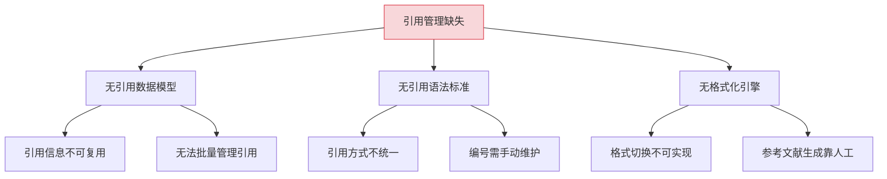
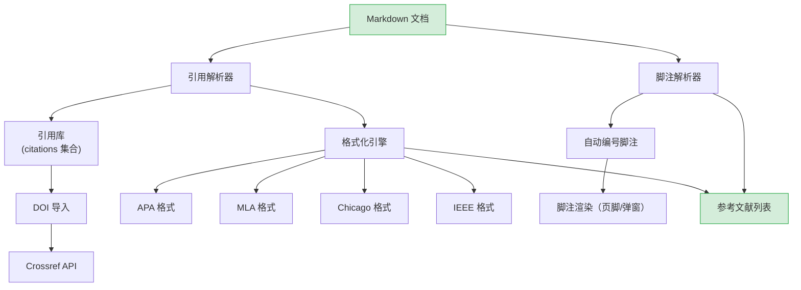
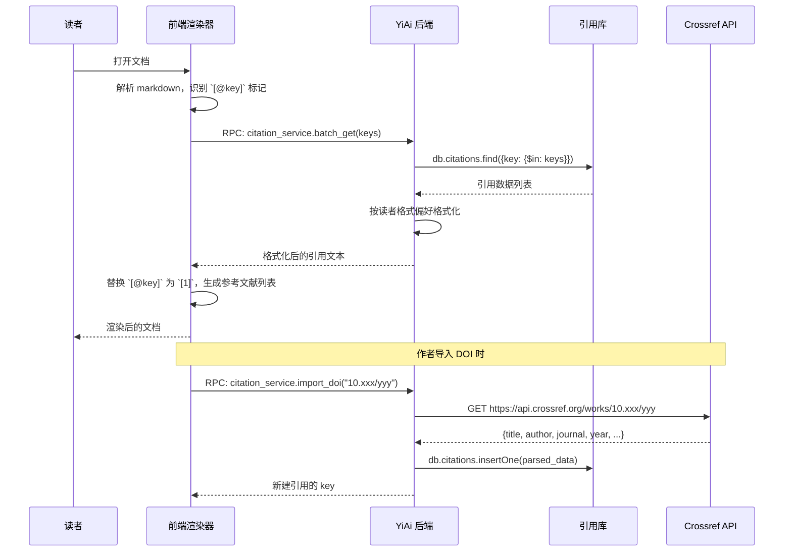

# YK-09-130: 内容引用与脚注 — 引用管理、BibTeX/DOI 支持与多格式引用切换

> 需求编号：YK-09-130 · 优先级：P2 · 人天：0.3d · 状态：需求已编写
> 依赖：无硬依赖（可独立开发）

## 背景

### 问题陈述

YiKnowledge 知识库中的技术文档和研究文章频繁引用外部文献、标准和数据。当前引用管理完全依赖手动输入，格式不统一、引用编号易出错、无法在 APA/MLA/Chicago/IEEE 等格式间切换。脚注（footnote）完全依赖 markdown 手工语法，缺乏自动化支持。

1. **引用格式不统一**：有的用 APA，有的用 MLA，有的手动拼写，风格混乱
2. **引用编号手动维护**：插入新引用需要重新编号所有后续引用
3. **DOI/BibTeX 未利用**：有 DOI 的手动输入引用信息，浪费结构化数据
4. **脚注无自动化**：手动数脚注编号，新增/删除脚注需要全局调整
5. **无引用预览**：阅读时无法 hover 引用标记查看文献详情
6. **参考文献列表手动生成**：需要人工在文末编写完整参考文献列表

**核心矛盾**：学术写作和高质量技术文档需要规范的引用管理，但 markdown 纯文本格式缺少引用工具。

### 影响范围

| # | 影响 | 严重程度 | 典型场景 |
|---|------|----------|----------|
| 1 | 引用格式混乱 | 高 | 同一文档中引用风格不一致 |
| 2 | 编号维护负担 | 中 | 插入引用后需重新编号 |
| 3 | DOI 数据浪费 | 中 | 有 DOI 却手工输入全部信息 |
| 4 | 脚注易出错 | 中 | 新增脚注后全部脚注编号偏移 |
| 5 | 无预览 | 低 | 阅读时需要跳到文末查看参考文献 |

### 挑战

| 挑战 | 说明 |
|------|------|
| 引用语法设计 | 需要在 markdown 中设计自然且不与已有语法冲突的引用标记 |
| BibTeX 解析 | BibTeX 格式多样，条目类型（article/book/techreport）各异 |
| DOI 查询 | 需要通过 Crossref API 解析 DOI，处理网络延迟和限流 |
| 格式切换 | 不同引用格式的字段排列规则不同，需要格式化引擎 |

---

## 一、现状分析

### 1.1 当前引用管理现状

```
现有功能:
├── Markdown 渲染
│   ├── 链接 `[text](url)`
│   └── 脚注 `[^1]`（部分支持）
├── Frontmatter
│   ├── tags, category, created
│   └── 无引用相关字段

缺失:
├── 引用管理                   # ❌ 不存在
├── BibTeX/DOI 导入            # ❌ 不存在
├── 自动编号引用               # ❌ 不存在
├── 引用格式切换               # ❌ 不存在
├── 引用 hover 预览            # ❌ 不存在
└── 自动生成参考文献列表        # ❌ 不存在
```

### 1.2 根因分析矩阵



| 根因 | 症状 | 影响 | 优先级 |
|------|------|------|--------|
| 无数据模型 | 引用信息散落文本中 | 不可复用和管理 | 高 |
| 无语法标准 | 引用方式不统一 | 阅读体验差 | 高 |
| 无格式化引擎 | 格式不可切换 | 跨期刊投稿困难 | 中 |

---

## 二、设计决策

### 决策 1：引用标记语法

| 选项 | 描述 | 优点 | 缺点 |
|------|------|------|------|
| A: `[@key]` | Pandoc 风格引用语法 | 与 Pandoc/Zotero 方法兼容 | 可能与某些 markdown 渲染器冲突 |
| B: `[cite:key]` | 自定义前缀语法 | 不与任何标准冲突 | 非标准，工具链不支持 |
| C: `\cite{key}` | LaTeX 风格 | 学术用户熟悉 | 在非 LaTeX 环境显突兀 |

**选择：A（`[@key]` Pandoc 风格）。** Pandoc 引用语法是学术界和 markdown 工具链中最广泛采用的引用标记方式。`[@smith2024]` 和 `[@smith2024, pp. 23-25]` 分别表示基本引用和带页码引用。YiKnowledge 的 markdown 渲染器可以解析此语法并替换为格式化后的引用。

### 决策 2：引用数据存储

| 选项 | 描述 | 优点 | 缺点 |
|------|------|------|------|
| A: 文档级 frontmatter | 引用数据存在每篇文档的 frontmatter 中 | 文档自包含 | 跨文档引用需重复定义 |
| B: 全局引用库 | 独立的 `citations` 集合，所有文档共享 | 去重，统一管理 | 文档不自包含 |
| C: 混合模式 | 文档级引用 + 全局引用库引用 | 去重 + 自包含 | 管理复杂度高 |

**选择：B（全局引用库）。** `citations` 集合作为全局引用库，每个引用有唯一 key。文档中通过 `[@key]` 引用。跨文档复用同一引用定义（如常用标准、协议规范）。文档渲染时从引用库查询详细信息。

### 决策 3：DOI 解析策略

| 选项 | 描述 | 优点 | 缺点 |
|------|------|------|------|
| A: 实时 Crossref API | 每次保存引用时查询 Crossref | 数据最新 | 网络延迟，限流 |
| B: 导入时解析 + 缓存 | 用户导入 DOI 时查询并缓存结果 | 性能好 | 数据可能过时 |
| C: 手动输入 | 不自动解析 DOI | 无依赖 | 用户负担重 |

**选择：B（导入时解析 + 缓存）。** 在用户输入 DOI 创建引用时，通过 Crossref API 解析并填充引用字段。解析结果缓存到引用库，后续直接使用缓存数据。提供"刷新"按钮以更新可能过时的数据。

### 决策 4：引用格式切换范围

| 选项 | 描述 | 优点 | 缺点 |
|------|------|------|------|
| A: 全文级切换 | 整篇文档统一使用一种格式 | 一致性好 | 不能混合使用 |
| B: 逐引用切换 | 每个引用可独立选择格式 | 灵活 | 格式不统一 |
| C: 读者端切换 | 作者用一种格式存储，读者可切换视图 | 作者省心，读者自由 | 实现复杂 |

**选择：C（读者端切换）。** 引用数据以结构化方式存储（作者、标题、期刊、年份等），渲染时根据读者选择的格式（APA/MLA/Chicago/IEEE）动态生成引用文本。这是现代知识库的最佳实践（类似 Zotero/Endnote）。

### 设计决策总览

| 决策 | 选项 A | 选项 B | 选择 | 理由 |
|------|--------|--------|------|------|
| 引用语法 | `[@key]` | `[cite:key]` | **`[@key]`** | Pandoc 兼容 |
| 数据存储 | 文档级 | 全局库 | **全局引用库** | 去重复用 |
| DOI 解析 | 实时 API | 导入缓存 | **导入缓存** | 性能可靠 |
| 格式切换 | 全文级 | 读者端 | **读者端切换** | 现代最佳实践 |

---

## 三、目标架构

### 3.1 引用与脚注系统架构



### 3.2 引用渲染流程



### 3.3 架构决策权衡

| 维度 | 改造前 | 改造后 | 权衡说明 |
|------|--------|--------|----------|
| 引用管理 | 手动文本 | 结构化引用库 + 自动格式化 | 从一次性文本到可复用数据 |
| 编号维护 | 手动 | 自动编号 + 自动列表 | 减少人力错误 |
| DOI 利用 | 无 | 一键导入 DOI | 数据准确且高效 |
| 阅读体验 | 纯文本 | hover 预览 + 格式切换 | 更好的阅读体验 |

---

## 四、具体改动

### 4.1 改动总览

| 改动点 | 类型 | 涉及文件 | 预估行数 |
|--------|------|---------|---------|
| 引用管理页面 | 新增 | `views/citation/CitationManager.vue` | 150 行 |
| 引用导入弹窗 | 新增 | `components/citation/CitationImport.vue` | 80 行 |
| 引用预览 Popover | 新增 | `components/citation/CitationPreview.vue` | 60 行 |
| 脚注渲染组件 | 新增 | `components/citation/FootnoteRenderer.vue` | 80 行 |
| 引用格式化选择器 | 新增 | `components/citation/FormatSelector.vue` | 40 行 |
| 参考文献列表组件 | 新增 | `components/citation/ReferenceList.vue` | 60 行 |
| Citation Service | 新增 | `services/citationService.ts` | 60 行 |
| 类型定义 | 新增 | `types/citation.ts` | 60 行 |

### 4.2 涉及文件

```
src/
├── views/citation/
│   └── CitationManager.vue             # 新增：引用管理主页面
├── components/citation/
│   ├── CitationImport.vue              # 新增：DOI/BibTeX 导入
│   ├── CitationPreview.vue             # 新增：hover 预览弹窗
│   ├── FootnoteRenderer.vue            # 新增：脚注渲染
│   ├── FormatSelector.vue              # 新增：引用格式选择
│   └── ReferenceList.vue               # 新增：参考文献列表
├── services/
│   └── citationService.ts              # 新增：引用服务
└── types/
    └── citation.ts                     # 新增：引用类型定义
```

### 4.3 核心类型定义

```typescript
// types/citation.ts
type CitationFormat = 'apa' | 'mla' | 'chicago' | 'ieee';
type CitationType = 'article' | 'book' | 'techreport' | 'webpage' | 'conference' | 'thesis' | 'standard';

interface Citation {
  key: string;
  type: CitationType;
  title: string;
  authors: Author[];
  year: number;
  journal?: string;
  volume?: string;
  issue?: string;
  pages?: string;
  publisher?: string;
  doi?: string;
  url?: string;
  isbn?: string;
  abstract?: string;
  bibtex?: string;
  created_at: string;
  updated_at: string;
}

interface Author {
  first_name: string;
  last_name: string;
}

interface Footnote {
  id: number;
  marker: string;
  content: string;
  line_number: number;
}

// 引用标记在文档中的位置
interface CitationMarker {
  key: string;
  position: number;
  prefix?: string;
  suffix?: string;
  page_ref?: string;
}

// 引用标记语法
// [@smith2024]             → 基本引用
// [@smith2024, pp. 23-25]  → 带页码范围
// [@smith2024; @jones2023] → 多引用
// [-@smith2024]            → 作者名不出现在文本中

// 脚注语法
// [^1]: 这是脚注内容       → 定义脚注
// 正文[^1]中引用             → 引用脚注
```

---

## 五、实施步骤

| 步骤 | 内容 | 涉及文件 | 验证方式 | 人天 |
|------|------|---------|---------|------|
| 1 | 类型定义 + Citation Service | `types/citation.ts`, `services/citationService.ts` | 类型检查通过 | 0.04 |
| 2 | DOI 导入弹窗 | `CitationImport.vue` | DOI 解析并填充字段 | 0.05 |
| 3 | 引用管理页面 | `CitationManager.vue` | CRUD 引用，搜索过滤 | 0.05 |
| 4 | 引用预览 Popover | `CitationPreview.vue` | hover 显示引用详情 | 0.03 |
| 5 | 脚注渲染组件 | `FootnoteRenderer.vue` | 自动编号 + 页脚渲染 | 0.04 |
| 6 | 引用格式化 + 格式选择器 | `FormatSelector.vue`, 格式化引擎 | 格式切换正确 | 0.04 |
| 7 | 参考文献列表 | `ReferenceList.vue` | 按格式自动生成 | 0.03 |
| 8 | markdown 解析器集成 | 渲染管线 | `[@key]` 正确解析和替换 | 0.02 |

**总计：0.3d**

---

## 六、测试规格

### 组件测试：CitationImport

#### Scenario: DOI 导入成功
- **GIVEN** 用户输入 DOI "10.1038/nature12373"
- **WHEN** 点击"解析 DOI"
- **THEN** 自动填充标题、作者、期刊、年份、卷期等字段

#### Scenario: 无效 DOI
- **GIVEN** 用户输入无效 DOI "10.xxxx/invalid"
- **WHEN** 点击"解析 DOI"
- **THEN** 显示错误提示"DOI 解析失败"，保留已输入的字段

### 组件测试：CitationPreview

#### Scenario: hover 引用标记显示预览
- **GIVEN** 文档中有引用标记 `[@smith2024]`
- **WHEN** 鼠标 hover 到该标记
- **THEN** Popover 显示：标题、作者、期刊、年份、DOI 链接

#### Scenario: 引用未找到
- **GIVEN** 引用 key "unknown2024" 在引用库中不存在
- **WHEN** hover 到标记 `[@unknown2024]`
- **THEN** Popover 显示"引用未找到"和"添加到引用库"链接

### 组件测试：FormatSelector

#### Scenario: 格式切换
- **GIVEN** 当前格式为 APA
- **WHEN** 切换到 IEEE
- **THEN** 文中引用标记从 "(Smith, 2024)" 变为 "[1]"，参考文献列表同步更新

### 集成测试：引用标记解析

#### Scenario: 基本引用渲染
- **GIVEN** 文档包含 `[@smith2024]`，引用库有对应记录
- **WHEN** 渲染文档
- **THEN** 该位置显示格式化引用（如 APA: "(Smith, 2024)"），文末参考文献列表包含完整条目

#### Scenario: 多引用渲染
- **GIVEN** 文档包含 `[@smith2024; @jones2023]`
- **WHEN** 渲染文档
- **THEN** APA 格式显示 "(Smith, 2024; Jones, 2023)"，IEEE 格式显示 "[1], [2]"

#### Scenario: 脚注自动编号
- **GIVEN** 文档中有 5 个脚注
- **WHEN** 渲染文档
- **THEN** 脚注按出现顺序自动编号 1-5，页脚显示对应内容

---

## 七、风险与缓解

| 风险 | 概率 | 影响 | 等级 | 缓解措施 | 应急预案 |
|------|------|------|------|----------|----------|
| Crossref API 限流 | 中 | 中 | 中 | 按需解析 + 缓存，不实时查询 | 手动输入引用信息 |
| DOI 解析数据不完整 | 中 | 低 | 低 | 解析后展示可编辑表单，允许用户补充 | 用户手动填写剩余字段 |
| 引用语法与 markdown 渲染器冲突 | 低 | 高 | 中 | 在 markdown 解析前先提取引用标记 | 使用转义 `\@` 来输出字面 at 符号 |
| 大引用库查询性能 | 低 | 低 | 低 | 批量查询 + 索引 | 引用库分页加载 |

---

## 八、回滚策略

| 回滚场景 | 回滚方式 | 影响范围 | 恢复时间 |
|----------|----------|----------|----------|
| 引用解析导致 markdown 渲染异常 | `git revert` 引用解析器修改 | 文档渲染 | < 1min |
| 引用库数据损坏 | 恢复 `citations` 集合备份 | 引用管理 | < 5min |
| 脚注自动编号错误 | 回滚脚注解析器修改 | 脚注渲染 | < 1min |

**回滚验证：**
- 回滚后文档正常渲染（包含原始的 `[@key]` 文本）
- 回滚后引用库数据保持不变

---

## 九、设计决策记录

### D-01: 为什么选择 `[@key]` 语法而非 `\cite{key}`？

`[@key]` 是 Pandoc 引用的标准语法，被 Zotero、Better BibTeX 等工具原生支持。用户如果从 Zotero 导出 markdown，引用语法天然兼容。`\cite{key}` 是 LaTeX 语法，在非 LaTeX 环境中（如直接阅读 markdown 源文件）显得突兀。`[@key]` 在纯文本中也更自然：`参见 [@smith2024] 的研究`。

### D-02: 为什么使用全局引用库而非文档级引用？

技术文档和知识库中的引用高度可复用（如 RFC 标准、ISO 规范、经典论文、同团队的其他文章）。文档级引用会导致同一篇论文在 10 篇文章中被重复定义 10 次。全局引用库去重、统一管理，修改一次参考文献信息（如补充 DOI），所有引用该文献的文档同步受益。

### D-03: 为什么读者端格式切换而非作者端固定格式？

不同读者或不同发布渠道需要不同的引用格式。一篇技术报告在 YiKnowledge 内部查看可能用 APA，但导出到 IEEE 期刊时需要用 IEEE 格式。结构化存储引用数据（而非存储格式化文本），让读者/导出工具自行选择格式，是学术界知识管理的最佳实践（DOI、Crossref、Zotero 均采用此模式）。

### D-04: 为什么脚注不走引用库？

脚注是文档内注释（解释、补充、定义），与外部文献引用有本质区别。脚注的内容是作者原创的、依赖上下文的、不可跨文档复用的。脚注需要自动编号但不需全局管理。保持脚注在文档内部（markdown `[^n]` 语法），仅改进自动编号和渲染。

---

## 十、可观测性

### 关键指标

| 指标 | 采集方式 | 告警阈值 | 说明 |
|------|---------|---------|------|
| 引用解析耗时 | 后端计时器 | P95 > 500ms | 大文档多引用场景 |
| Crossref API 响应时间 | 后端计时器 | P95 > 3000ms | DOI 解析延迟 |
| 引用预览 Popover 响应时间 | `performance.now()` | > 200ms | hover 交互延迟 |
| 格式切换渲染耗时 | `performance.now()` | > 1000ms | 全文重新格式化 |

### 日志规范

| 日志级别 | 场景 | 示例 |
|---------|------|------|
| `INFO` | DOI 解析成功 | `[Citation] DOI resolved: ${doi} → ${key}` |
| `WARN` | 引用 key 未找到 | `[Citation] unresolved key: ${key} in ${file}` |
| `ERROR` | Crossref API 失败 | `[Citation] Crossref error: ${status}` |

---

## 十一、代码审查检查清单

- [ ] `[@key]` 标记解析正确处理多引用格式（`;` 分隔）
- [ ] APA/MLA/Chicago/IEEE 格式输出符合最新版规范
- [ ] 脚注自动编号在新增/删除脚注后正确重排
- [ ] CitationPreview Popover 在引用 key 不存在时有友好提示
- [ ] DOI 导入表单在解析后允许用户编辑字段
- [ ] `vue-tsc --noEmit` 通过
- [ ] 无 ESLint/Prettier 告警

---

## 回归问题预测

| # | 问题 | 发现场景 | 根因 | 修复方式 |
|---|------|---------|------|---------|
| 1 | 引用标记与 markdown 链接语法冲突 | `[@key]` 出现在已有链接 `[text](url)` 附近 | markdown 解析器将 `[@` 识别为链接开始 | 在 markdown 解析前预处理引用标记，用不可见占位符替换，渲染后替换回 |
| 2 | APA 格式中作者超过 7 人时缩写规则错误 | 引用有 8 个作者的论文 | APA 7th 规范：>20 作者才用省略号，实现误用了 APA 6th 规则 | 明确标注使用 APA 7th 规范，>20 作者时显示前 19 + `...` + 末位 |
| 3 | DOI 解析的 Crossref 数据中作者名字包含乱码 | 非英文作者名字（如中文/日文）在 Crossref 中编码异常 | Crossref 的 author 字段使用 Unicode 转义，部分旧数据编码损坏 | 解析时尝试多种解码方式（UTF-8 → Latin-1 → UTF-8），失败时保留原始文本 |
| 4 | 脚注在表格内使用时渲染错位 | markdown 表格中包含脚注标记 | 表格渲染与脚注渲染的执行顺序问题，脚注在表格外渲染 | 将表格内脚注收集起来，在表格后统一渲染 |
| 5 | 参考文献列表与脚注编号范围重叠 | 文档同时有引用和脚注，编号冲突 | 引用使用 `[1]`，脚注也使用 `[1]` | 引用使用方括号数字 `[1]`，脚注使用上标数字 `¹`，编号空间分离 |
| 6 | 大引用库加载影响文档首屏渲染 | 文档引用了 50+ 篇文献 | 前端一次性加载全部引用数据 | 仅加载文档实际引用的文献（根据 `[@key]` 提取的 key 列表批量查询） |

---

## 性能分析

### 组件渲染性能

| 指标 | 小文档（5 引用） | 大文档（30 引用） | 说明 |
|------|-----------------|------------------|------|
| 引用标记解析 | ~10ms | ~50ms | 正则匹配 `[@key]` |
| 引用数据查询 | ~50ms | ~150ms | 批量数据库查询 |
| 格式切换渲染 | ~30ms | ~200ms | APA → IEEE 全文重新格式化 |
| CitationPreview Popover | ~20ms | ~20ms | 单引用查询 |

### 内存分析

| 数据结构 | 大小 | 说明 |
|---------|------|------|
| 全局引用库（500 条） | ~200KB | 全部引用数据 |
| 文档引用映射 | ~5KB（30 引用） | 仅本文化引用 |
| 脚注数据 | ~3KB（10 脚注） | 脚注内容 |

### 网络请求分析

| 操作 | API 调用 | 说明 |
|------|---------|------|
| 加载文档 | 1（batch_get 引用） | 根据 key 列表批量查询 |
| DOI 导入 | 1（import_doi） | 后端代理 Crossref API |
| 格式切换 | 0（前端本地格式化） | 结构化数据已在浏览器 |

---

*PRD 来源: `projects/yiknowledge/requirements/2026-09/00-需求-需求总览.md`*