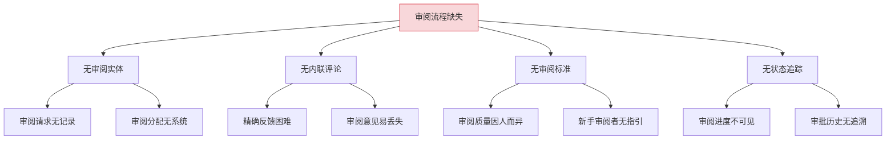
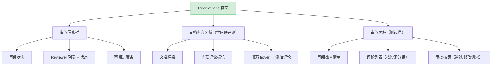
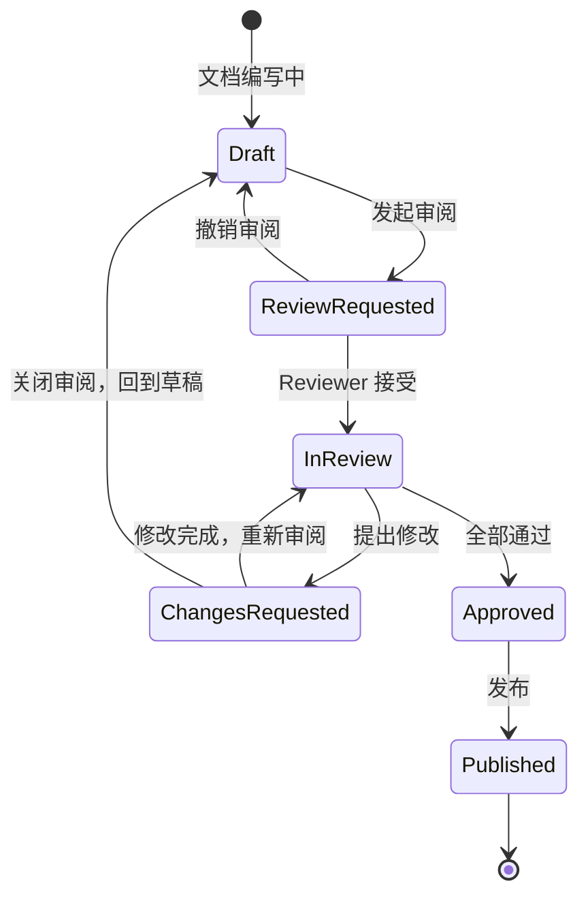

# YK-09-131: 内容协同审阅 — 审阅工作流、内联评论、审阅清单与审阅统计

> 需求编号：YK-09-131 · 优先级：P2 · 人天：0.3d · 状态：需求已编写
> 依赖：YK-09-127（文档评论与讨论系统）

## 背景

### 问题陈述

YiKnowledge 知识库中的内容在上线前需要经过审阅（Review）流程，确保质量、准确性和风格一致性。当前审阅流程完全离线——通过线下沟通、即时消息或会议完成，缺乏系统化支持。审阅意见分散在聊天记录中，无法追溯，审阅状态不可见。

1. **审阅流程无系统支持**：审阅请求通过口头或聊天工具发起，无正式记录
2. **审阅意见分散**：评论分散在聊天记录中，不与文档关联
3. **无内联评论**：无法在文档特定段落/行上留下精准评论
4. **审阅清单缺失**：审阅者没有标准化的检查清单，审阅质量因人而异
5. **审阅状态不可见**：不知道该文档是否在审阅中、谁在审阅、审阅进度如何
6. **审阅历史无法追溯**：无法知道某个文档经过了哪些审阅、谁批准了什么版本

**核心矛盾**：高质量知识库需要严格的审阅流程，但缺乏系统化工具导致审阅成为瓶颈。

### 影响范围

| # | 影响 | 严重程度 | 典型场景 |
|---|------|----------|----------|
| 1 | 审阅意见丢失 | 高 | 聊天记录滚动后无法找到 |
| 2 | 审阅质量不稳定 | 高 | 不同审阅者关注点不同 |
| 3 | 审阅状态不透明 | 中 | 作者不知道文档是否被审阅 |
| 4 | 审阅效率低 | 中 | 审阅者和作者反复沟通相同问题 |
| 5 | 审阅历史缺失 | 低 | 质量回溯困难 |

### 挑战

| 挑战 | 说明 |
|------|------|
| 内联评论与文档版本的关联 | 文档修改后，旧评论的行号可能失效 |
| 审阅清单可配置性 | 不同文档类型（技术文档/设计文档/API 参考）需要不同的审阅清单 |
| 审批流程灵活度 | 需要同时支持"单人审阅"和"多人审阅 + 全部通过"两种模式 |
| 审阅与锁定 | 审阅中的文档是否允许编辑 |

---

## 一、现状分析

### 1.1 当前审阅流程现状

```
现有功能:
├── 文档评论（YK-09-127）
│   ├── 文档级评论
│   └── 评论讨论
├── Frontmatter
│   ├── status 字段（draft/review/published）
│   └── 无审阅相关字段

缺失:
├── 审阅请求/分配                # ❌ 不存在
├── 内联评论（段落级/行级）        # ❌ 不存在
├── 审阅检查清单                 # ❌ 不存在
├── 审阅审批工作流               # ❌ 不存在
├── 审阅历史与统计               # ❌ 不存在
└── 审阅状态可视化               # ❌ 不存在
```

### 1.2 根因分析矩阵



| 根因 | 症状 | 影响 | 优先级 |
|------|------|------|--------|
| 无审阅实体 | 请求和结果无记录 | 无法追溯和统计 | 高 |
| 无内联评论 | 评论粒度粗糙 | 反馈不精准 | 高 |
| 无审阅标准 | 审阅质量不稳定 | 上线内容质量参差 | 中 |
| 无状态追踪 | 进度不可见 | 审阅卡顿而不自知 | 中 |

---

## 二、设计决策

### 决策 1：内联评论的锚定方式

| 选项 | 描述 | 优点 | 缺点 |
|------|------|------|------|
| A: 行号锚定 | 评论绑定文档的行号 | 实现简单 | 文档修改后行号偏移 |
| B: 内容锚定 | 评论绑定特定文本内容 | 修改后仍可匹配 | 文本重复时不确定 |
| C: 段落 ID 锚定 | 为每个段落/标题分配唯一 ID | 精确且不受文本变化影响 | 需要段落 ID 生成机制 |

**选择：C（段落 ID 锚定）。** 在 markdown 渲染时为每个标题和段落生成稳定的 ID（基于内容哈希或标题路径）。内联评论绑定到段落 ID + 段落内偏移。文档编辑后，段落 ID 不变（除被删除的段落），评论仍可定位。

### 决策 2：审阅审批流程模式

| 选项 | 描述 | 优点 | 缺点 |
|------|------|------|------|
| A: 单人审批 | 任意一位 Reviewer 通过即视为审阅通过 | 快速 | 可能遗漏问题 |
| B: 全部通过 | 所有指定 Reviewer 都通过才算通过 | 质量高 | 可能被慢 Reviewer 阻塞 |
| C: N/M 通过 | M 个 Reviewer 中 N 个通过 | 平衡速度和质量 | 配置复杂 |

**选择：A + B 可选。** 在发起审阅时选择模式。单人审批适用于普通文档更新（快速审阅），全部通过适用于重要文档/规范（严格审阅）。N/M 模式作为 P3 后续优化。

### 决策 3：审阅中的文档编辑策略

| 选项 | 描述 | 优点 | 缺点 |
|------|------|------|------|
| A: 锁定编辑 | 审阅中的文档禁止编辑 | 避免审阅内容变化 | 阻塞作者工作 |
| B: 允许编辑 + 版本审阅 | 审阅基于发起时的版本快照 | 不阻塞作者 | 可能出现审阅-编辑竞态 |
| C: 允许编辑 + 旧评论失效 | 允许编辑，但标记旧评论为"可能过时" | 灵活 | 审阅者体验差 |

**选择：B（允许编辑 + 版本快照）。** 发起审阅时自动创建文档版本快照，审阅针对快照进行。作者可以继续编辑文档（为下一版本准备），审阅完成后的修改不会影响当前审阅。这是 GitHub PR Review 的标准做法。

### 决策 4：审阅检查清单管理

| 选项 | 描述 | 优点 | 缺点 |
|------|------|------|------|
| A: 全局默认清单 | 所有文档共用一套清单 | 简单 | 不适合所有文档类型 |
| B: 按文档类型模板 | 技术文档/设计文档/规范各有一套清单 | 针对性 | 模板管理工作量 |
| C: 用户自定义清单 | 每个审阅者可创建自己的清单 | 最灵活 | 碎片化 |

**选择：B（按文档类型模板）。** 在项目设置中为不同文档类型（`type` frontmatter 字段）定义默认审阅清单模板。审阅发起时自动加载对应模板，审阅者可在此基础上添加额外检查项。

### 设计决策总览

| 决策 | 选项 A | 选项 B | 选择 | 理由 |
|------|--------|--------|------|------|
| 内联锚点 | 行号 | 内容锚定 | **段落 ID** | 精确且不受修改影响 |
| 审批模式 | 单人 | 全部通过 | **A+B 可选** | 灵活适应不同场景 |
| 编辑策略 | 锁定 | 版本快照 | **版本快照** | 不阻塞作者 |
| 检查清单 | 全局默认 | 按文档类型 | **按文档类型** | 针对性检查 |

---

## 三、目标架构

### 3.1 协同审阅页面布局



### 3.2 审阅工作流状态机



### 3.3 架构决策权衡

| 维度 | 改造前 | 改造后 | 权衡说明 |
|------|--------|--------|----------|
| 审阅请求 | 口头/聊天 | 系统化请求+分配 | 可追溯 |
| 评论精度 | 文档级 | 段落级内联评论 | 精准反馈 |
| 审阅标准 | 无 | 按文档类型检查清单 | 质量统一 |
| 审阅可见性 | 不可见 | 状态面板+统计 | 流程透明 |

---

## 四、具体改动

### 4.1 改动总览

| 改动点 | 类型 | 涉及文件 | 预估行数 |
|--------|------|---------|---------|
| 审阅页面（Reviewer 视图） | 新增 | `views/review/ReviewPage.vue` | 180 行 |
| 内联评论组件 | 新增 | `components/review/InlineComment.vue` | 100 行 |
| 审阅面板组件 | 新增 | `components/review/ReviewPanel.vue` | 120 行 |
| 审阅检查清单组件 | 新增 | `components/review/ReviewChecklist.vue` | 80 行 |
| 审阅请求弹窗 | 新增 | `components/review/ReviewRequestDialog.vue` | 80 行 |
| 审阅历史/统计页面 | 新增 | `views/review/ReviewHistory.vue` | 100 行 |
| Review Service | 新增 | `services/reviewService.ts` | 60 行 |
| 类型定义 | 新增 | `types/review.ts` | 50 行 |

### 4.2 涉及文件

```
src/
├── views/review/
│   ├── ReviewPage.vue                  # 新增：审阅主页面（Reviewer 视图）
│   └── ReviewHistory.vue               # 新增：审阅历史与统计
├── components/review/
│   ├── InlineComment.vue               # 新增：内联评论（段落级）
│   ├── ReviewPanel.vue                 # 新增：审阅面板（侧边栏）
│   ├── ReviewChecklist.vue             # 新增：审阅检查清单
│   └── ReviewRequestDialog.vue         # 新增：审阅请求弹窗
├── services/
│   └── reviewService.ts                # 新增：审阅服务
└── types/
    └── review.ts                       # 新增：审阅类型定义
```

### 4.3 核心类型定义

```typescript
// types/review.ts
type ReviewStatus = 'requested' | 'in_review' | 'changes_requested' | 'approved' | 'cancelled';
type ReviewerDecision = 'pending' | 'approved' | 'changes_requested';

interface Review {
  key: string;
  document_key: string;
  document_snapshot: string;    // 审阅发起时的内容快照
  requested_by: string;
  status: ReviewStatus;
  approval_mode: 'single' | 'all';
  reviewers: ReviewerStatus[];
  created_at: string;
  updated_at: string;
  completed_at: string | null;
}

interface ReviewerStatus {
  user: string;
  decision: ReviewerDecision;
  comment_count: number;
  checklist_completed: boolean;
  decided_at: string | null;
}

interface InlineComment {
  id: string;
  review_key: string;
  paragraph_id: string;
  offset: number;               // 段落内字符偏移
  selected_text: string;
  author: string;
  content: string;
  status: 'open' | 'resolved' | 'wontfix';
  replies: CommentReply[];
  created_at: string;
}

interface CommentReply {
  author: string;
  content: string;
  created_at: string;
}

interface ReviewChecklistItem {
  id: string;
  category: string;
  description: string;
  checked: boolean;
  checked_by: string | null;
}

interface ReviewStats {
  total_reviews: number;
  avg_review_duration_hours: number;
  approval_rate: number;
  avg_comments_per_review: number;
  most_reviewed_documents: { key: string; title: string; count: number }[];
}
```

---

## 五、实施步骤

| 步骤 | 内容 | 涉及文件 | 验证方式 | 人天 |
|------|------|---------|---------|------|
| 1 | 类型定义 + Review Service | `types/review.ts`, `services/reviewService.ts` | 类型检查通过 | 0.04 |
| 2 | 内联评论组件 | `InlineComment.vue` | 段落选中 + 评论创建 | 0.06 |
| 3 | 审阅检查清单组件 | `ReviewChecklist.vue` | 按类型加载 + 勾选 | 0.04 |
| 4 | 审阅请求弹窗 | `ReviewRequestDialog.vue` | 选择 Reviewer + 模式 | 0.04 |
| 5 | 审阅面板 | `ReviewPanel.vue` | 侧边栏评论 + 清单 + 进度 | 0.05 |
| 6 | 审阅主页面 | `ReviewPage.vue` | 完整审阅流程可用 | 0.04 |
| 7 | 审阅历史/统计页面 | `ReviewHistory.vue` | 列表 + 统计图表正确 | 0.03 |

**总计：0.3d**

---

## 六、测试规格

### 组件测试：InlineComment

#### Scenario: 选中文本后添加内联评论
- **GIVEN** 用户在文档中选中文本"这段内容需要修改"
- **WHEN** 点击"添加评论"按钮
- **THEN** 显示评论输入框，关联到选中文本的段落和偏移

#### Scenario: 已解决的内联评论
- **GIVEN** 内联评论状态为 'resolved'
- **WHEN** 渲染 InlineComment
- **THEN** 评论标记显示为绿色对勾，内容折叠

### 组件测试：ReviewPanel

#### Scenario: 多人审阅进度
- **GIVEN** 审阅有 3 个 Reviewer，1 个已批准，1 个请求修改，1 个待审阅
- **WHEN** 渲染 ReviewPanel
- **THEN** 显示进度条（33%），各 Reviewer 状态图标不同

#### Scenario: 全部通过审批
- **GIVEN** approval_mode='all'，3 个 Reviewer 全部批准
- **WHEN** 最后一位 Reviewer 点击"批准"
- **THEN** 审阅状态变为 'approved'，审批按钮消失

### 组件测试：ReviewChecklist

#### Scenario: 按文档类型加载检查清单
- **GIVEN** 文档类型为 '技术文档'
- **WHEN** 加载审阅页面
- **THEN** 加载技术文档的检查清单（技术准确性、代码片段验证、API 引用正确性等）

#### Scenario: 检查项勾选
- **GIVEN** 检查清单有 10 个未勾选项
- **WHEN** Reviewer 勾选第 1 项
- **THEN** 计数更新（1/10），勾选状态持久化

### 集成测试：完整审阅流程

#### Scenario: 单人审批通过
- **GIVEN** 作者发起审阅，指定 1 个 Reviewer，approval_mode='single'
- **WHEN** Reviewer 完成检查清单 + 内联评论 + 点击"批准"
- **THEN** 审阅状态变为 'approved'，文档 status 更新为 'reviewed'

#### Scenario: 请求修改后重新审阅
- **GIVEN** Reviewer 提交"请求修改"并在 3 个段落添加了内联评论
- **WHEN** 作者修改文档并重新提交审阅
- **THEN** 旧评论标记为"版本过时"（如有段落变化），审阅状态回到 'in_review'

---

## 七、风险与缓解

| 风险 | 概率 | 影响 | 等级 | 缓解措施 | 应急预案 |
|------|------|------|------|----------|----------|
| 段落 ID 在编辑后变化 | 中 | 中 | 中 | 段落 ID 基于稳定的内容哈希+标题路径 | 评论标记"可能过时"，提示审阅者确认 |
| 审阅者响应慢阻塞流程 | 高 | 中 | 中 | 审阅请求发出后 48h 未响应时自动提醒 | 管理员可强制更换 Reviewer |
| 大量内联评论渲染性能 | 中 | 低 | 低 | 评论标记按需渲染（仅可视区域） | 折叠已解决的评论 |
| 审阅快照存储增长 | 低 | 低 | 低 | 仅保留最近 5 个审阅快照 | 手动清理旧快照 |

---

## 八、回滚策略

| 回滚场景 | 回滚方式 | 影响范围 | 恢复时间 |
|----------|----------|----------|----------|
| 审阅页面功能异常 | `git revert` 相关提交 | 审阅功能 | < 1min |
| 段落 ID 生成错误导致评论错位 | 修复段落 ID 算法 + 重新生成 | 全部内联评论 | < 30min |
| 审阅数据模型需调整 | 清理 `reviews` 集合 | 审阅历史丢失 | < 5min |

**回滚验证：**
- 回滚后文档阅读/编辑功能正常
- 回滚后文档评论系统（YK-09-127）不受影响

---

## 九、设计决策记录

### D-01: 为什么使用段落 ID 锚定而非行号？

行号锚定是简单的方案，但在 markdown 文档中高度脆弱——作者在文档前部插入一行，所有后续评论的行号全部偏移。段落 ID 基于稳定的内容特征（标题层级路径 + 段落内容哈希），编辑后仍可匹配到对应段落。对于被删除的段落，评论标记"段落已删除"，评论内容存档可查。

### D-02: 为什么提供单人审批和全部通过两种模式？

不同的文档类型和变更规模需要不同的审阅严格度。日常小修改（修正错别字、补充说明）用单人审批即快速上线。重要文档/规范/架构决策记录用全部通过模式确保多人签字。这是企业文档管理的主流实践。

### D-03: 为什么使用版本快照而非锁定编辑？

锁定编辑（审阅中的文档不可编辑）虽然避免了审阅-编辑竞态，但严重阻塞作者的生产力。版本快照类似 Git PR 的模式——发起审阅时创建快照，后续编辑不影响当前审阅。审阅通过后，作者可将后续修改也作为一次独立审阅发起。

### D-04: 为什么审阅清单按文档类型模板而非用户自定义？

按文档类型的模板确保了审阅的标准化——同类型文档的审阅标准一致。用户自定义清单虽然灵活，但会导致审阅标准碎片化——同一个技术文档被不同审阅者用不同标准评判。在模板基础上允许添加额外检查项，既保证了基线标准，又提供了灵活性。

---

## 十、可观测性

### 关键指标

| 指标 | 采集方式 | 告警阈值 | 说明 |
|------|---------|---------|------|
| 审阅平均耗时 | completed_at - created_at | > 48h | 审阅流程效率 |
| 审阅请求积压数 | 状态为 requested/in_review 的审阅数 | > 10 | 审阅资源不足 |
| 内联评论解决率 | resolved / total | < 70% | 评论未处理比例高 |
| 审阅页面加载耗时 | `performance.now()` | P95 > 2000ms | 含大量内联评论时 |

### 日志规范

| 日志级别 | 场景 | 示例 |
|---------|------|------|
| `INFO` | 审阅完成 | `[Review] ${key}: approved by ${reviewer}` |
| `WARN` | 审阅超时未响应 | `[Review] ${key}: pending > 48h` |
| `ERROR` | 审阅创建失败 | `[Review] create failed: ${docKey}` |

---

## 十一、代码审查检查清单

- [ ] InlineComment 正确关联到段落 ID 和字符偏移
- [ ] ReviewPanel 的进度计算正确（completedReviewers / totalReviewers）
- [ ] ReviewChecklist 按文档类型正确加载模板
- [ ] 审阅状态变更正确触发通知
- [ ] approval_mode='all' 时仅全部通过才变更为 approved
- [ ] 已过期的审阅快照评论显示"版本过时"标记
- [ ] `vue-tsc --noEmit` 通过
- [ ] 无 ESLint/Prettier 告警

---

## 回归问题预测

| # | 问题 | 发现场景 | 根因 | 修复方式 |
|---|------|---------|------|---------|
| 1 | 作者在审阅期间编辑文档导致段落 ID 变更 | Reviewer 的内联评论突然标记为"段落在快照中不存在" | 审阅快照中的段落 ID 基于原始文本生成，作者编辑后生成的段落 ID 不同 | 审阅视图始终使用快照内容渲染，不展示作者的最新修改 |
| 2 | 多人同时勾选检查清单的竞争条件 | 两个 Reviewer 同时勾选最后一项检查 | MongoDB `$set` 操作无乐观锁，后写覆盖先写 | 使用 `$set` 的 `checked_by` 字段记录操作人，冲突时保留第一个 |
| 3 | 内联评论在代码块内选中时段落偏移计算错误 | 用户选中代码块中的一行代码添加评论 | 代码块内的 offset 计算错误（pre 标签内的换行符被计入） | 预处理时统一换行符（`\r\n` → `\n`），使用标准化后的 offset |
| 4 | 长文档（5000+ 行）的段落 ID 生成耗时导致页面白屏 | 打开大型技术规范文档的审阅页面 | 段落 ID 生成在首屏渲染时同步执行 | 段落 ID 在文档保存时预生成并存储，审阅时直接读取 |
| 5 | 审阅完成通知发送给了已离线的 Reviewer | Reviewer 批准后关闭了浏览器 | 通知在批准操作的事务完成后异步发送，发送失败无重试 | 通知发送失败时写入消息队列，用户上线时推送未读通知 |
| 6 | 审阅历史页面在大量数据时加载缓慢 | 项目有 200+ 审阅记录，统计计算耗时 | 统计在查询时实时计算（聚合查询），数据量大时性能下降 | 审阅完成时预计算统计数据并写入 `review_stats` 集合，查询时直接读取 |

---

## 性能分析

### 组件渲染性能

| 指标 | 小文档（500 行，5 评论） | 大文档（3000 行，30 评论） | 说明 |
|------|------------------------|--------------------------|------|
| ReviewPage 首屏渲染 | ~200ms | ~500ms | 评论标记 + 文档渲染 |
| InlineComment 展开 | ~20ms | ~20ms | 单条评论展开 |
| ReviewPanel 切换 | ~10ms | ~30ms | 评论列表视图更新 |
| ReviewHistory 加载 | ~100ms | ~200ms | ECharts 统计图表 |

### 内存分析

| 数据结构 | 小审阅 | 大审阅 | 说明 |
|---------|--------|--------|------|
| 审阅快照（单版本） | ~30KB | ~200KB | 文档内容 |
| 内联评论（30 条） | ~15KB | ~15KB | 含回复 |
| ReviewPanel 状态 | ~10KB | ~20KB | 评论 + 清单 + 进度 |

### 网络请求分析

| 页面 | 首次加载 API 调用数 | 可并行请求 |
|------|-------------------|-----------|
| ReviewPage | 2（getReview + getReviewComments） | 是 |
| ReviewHistory | 1（getReviewStats） | — |

---

*PRD 来源: `projects/yiknowledge/requirements/2026-09/00-需求-需求总览.md`*