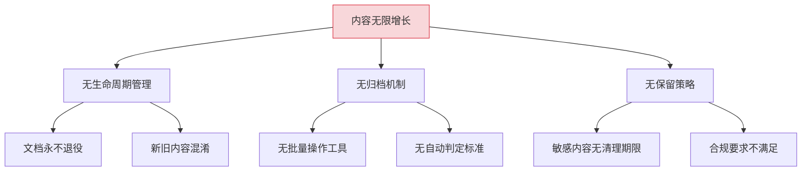
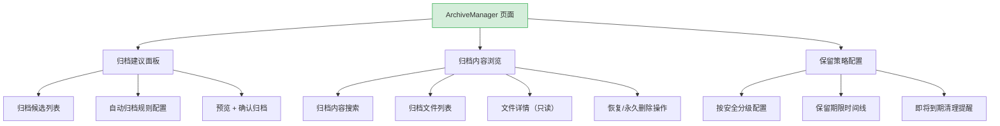
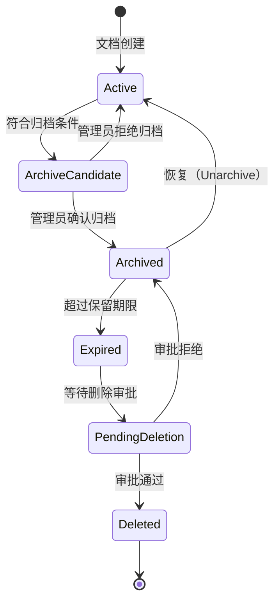

# YK-09-132: 内容归档策略 — 自动归档、归档检索、恢复工作流与保留策略

> 需求编号：YK-09-132 · 优先级：P2 · 人天：0.3d · 状态：需求已编写
> 依赖：YK-09-116（内容安全分类与分级）、YK-09-125（内容实验与 AB 测试）

## 背景

### 问题陈述

YiKnowledge 知识库持续增长，但缺少系统化的内容生命周期管理。过时、废弃、低价值的内容长期占据存储空间和搜索索引，影响搜索精度和用户浏览体验。用户无法区分活跃内容和历史归档内容，也无法方便地检索和管理归档资料。

1. **内容无限增长**：废弃文档、过期规范、历史草稿永不清理
2. **搜索噪音**：过时内容出现在搜索结果中，干扰用户找到最新信息
3. **手动归档困难**：缺少批量归档工具和自动化归档策略
4. **归档不可见**：归档内容被"删除"后无法检索，但实际可能需要查阅历史
5. **无保留策略**：缺乏基于内容分类的差异化保留期限
6. **恢复流程缺失**：误归档的内容无法方便地恢复

**核心矛盾**：知识库需要保持"活跃"内容的精炼和高质量，但历史内容也有潜在的追溯价值，不能简单删除。

### 影响范围

| # | 影响 | 严重程度 | 典型场景 |
|---|------|----------|----------|
| 1 | 搜索精度下降 | 高 | 搜索"API 文档"出现 3 年前的已废弃 API |
| 2 | 存储成本浪费 | 中 | 大量无效内容占据数据库和索引空间 |
| 3 | 浏览体验差 | 中 | 内容列表中混杂活跃和废弃文档 |
| 4 | 合规风险 | 低 | 应删除的敏感信息因无归档策略而残留 |

### 挑战

| 挑战 | 说明 |
|------|------|
| 归档判定标准 | "过时"的定义因文档类型和领域而异 |
| 自动归档准确性 | 需要避免误归档仍有价值的活跃内容 |
| 归档内容可发现性 | 归档后仍需要检索，但应与活跃搜索隔离 |
| 保留策略差异化 | 不同安全分级的内容有不同的保留期限 |

---

## 一、现状分析

### 1.1 当前内容管理现状

```
现有功能:
├── 内容 CRUD
│   ├── 创建/读取/更新/删除
│   └── 删除为物理删除（不可恢复）
├── 内容安全分类（YK-09-116）
│   ├── 公开/内部/机密分级
│   └── 无保留期限概念
├── Frontmatter
│   ├── status（draft/review/published）
│   ├── created/updated
│   └── 无 archived 字段

缺失:
├── 归档状态                     # ❌ 无 archived 状态
├── 自动归档策略                 # ❌ 不存在
├── 归档预览/确认                # ❌ 不存在
├── 归档搜索                     # ❌ 不存在
├── 恢复工作流                   # ❌ 不存在
├── 保留策略                     # ❌ 不存在
└── 归档存储优化                 # ❌ 不存在
```

### 1.2 根因分析矩阵



| 根因 | 症状 | 影响 | 优先级 |
|------|------|------|--------|
| 无生命周期管理 | 废弃文档与活跃文档共存 | 搜索精度下降 | 高 |
| 无归档机制 | 删除即丢失 | 历史不可追溯 | 高 |
| 无自动判定 | 依赖人工清理 | 维护成本高 | 中 |
| 无保留策略 | 合规风险 | 安全隐患 | 低 |

---

## 二、设计决策

### 决策 1：归档 vs 删除

| 选项 | 描述 | 优点 | 缺点 |
|------|------|------|------|
| A: 软删除（归档） | 标记为 archived，可恢复 | 可追溯，误操作可恢复 | 存储不释放 |
| B: 物理删除 | 从数据库和文件系统删除 | 释放存储 | 不可恢复 |
| C: 冷热分离 | 归档内容移到低成本存储（如 OSS） | 平衡存储成本和可恢复性 | 架构复杂 |

**选择：A（软删除/归档）+ C 作为 P3 优化。** 当前阶段使用软删除：在文档 frontmatter 中增加 `archived: boolean` 和 `archived_at: datetime` 字段。归档内容不出现在默认搜索和浏览中，但可通过"归档"过滤器查看。未来大规模归档时可引入冷热分离。

### 决策 2：自动归档触发条件

| 选项 | 描述 | 优点 | 缺点 |
|------|------|------|------|
| A: 仅基于时间 | `updated` 超过 N 天自动标记为归档候选 | 简单客观 | 重要但久未更新的文档也会被归档 |
| B: 时间 + 浏览量 | 结合最后更新时间和最近 N 天的浏览量 | 更智能 | 浏览量数据可能不准确 |
| C: 时间 + 浏览量 + 引用数 | 综合多维度判断 | 最智能 | 实现最复杂 |

**选择：B（时间 + 浏览量）。** 最后更新超过 180 天且最近 90 天浏览量 < 5 次的文档标记为归档候选。不自动归档，而是生成"归档建议列表"由管理员审核确认。引用数统计作为 P3 优化项加入。

### 决策 3：归档内容检索方式

| 选项 | 描述 | 优点 | 缺点 |
|------|------|------|------|
| A: 与活跃内容混合搜索（带标记） | 归档内容出现在搜索结果但标记 [Archived] | 最大可见性 | 继续污染搜索 |
| B: 独立归档搜索 | 归档内容有独立的搜索界面 | 活跃搜索干净 | 多一个搜索入口 |
| C: 默认隐藏 + 手动包含 | 搜索结果默认排除归档，有"包含归档"开关 | 两者兼顾 | 需要用户知道开关存在 |

**选择：C（默认隐藏 + 手动包含）。** 默认搜索仅返回活跃内容。搜索结果页提供"包含归档内容"开关，打开后归档结果出现在列表末尾并带有 [Archived] 标记。这兼顾了搜索精度和历史可追溯性。

### 决策 4：保留策略粒度

| 选项 | 描述 | 优点 | 缺点 |
|------|------|------|------|
| A: 全局统一期限 | 所有文档归档后统一保留 X 年 | 简单 | 不适应差异化需求 |
| B: 按安全分级 | 不同安全分级（公开/内部/机密）不同期限 | 合规对齐 | 中等复杂度 |
| C: 按文档属性组合 | 安全分级 + 文档类型 + 项目自定义 | 最灵活 | 配置和理解成本高 |

**选择：B（按安全分级）。** 与 YK-09-116 的安全分类对齐：公开文档归档后保留 5 年，内部文档保留 3 年，机密文档保留 1 年（且需审批后才能彻底删除）。每个项目可在项目设置中覆盖默认期限。

### 设计决策总览

| 决策 | 选项 A | 选项 B | 选择 | 理由 |
|------|--------|--------|------|------|
| 归档方式 | 软删除 | 物理删除 | **软删除** | 可恢复、可追溯 |
| 自动触发 | 仅时间 | 时间+浏览量 | **时间+浏览量** | 避免误归档重要文档 |
| 检索方式 | 混合搜索 | 独立搜索 | **默认隐藏+开关** | 精度+追溯兼顾 |
| 保留策略 | 全局统一 | 按安全分级 | **按安全分级** | 合规对齐 |

---

## 三、目标架构

### 3.1 归档管理系统布局



### 3.2 归档生命周期状态机



### 3.3 架构决策权衡

| 维度 | 改造前 | 改造后 | 权衡说明 |
|------|--------|--------|----------|
| 内容增长 | 无限增长 | 定期归档 + 保留期限 | 可控生命周期 |
| 搜索精度 | 过时内容干扰 | 活跃/归档分离 | 搜索体验提升 |
| 数据安全 | 删除即丢失 | 归档可恢复 | 误操作保护 |
| 存储管理 | 无策略 | 按安全分级保留 | 合规 + 成本优化 |

---

## 四、具体改动

### 4.1 改动总览

| 改动点 | 类型 | 涉及文件 | 预估行数 |
|--------|------|---------|---------|
| 归档管理页面 | 新增 | `views/archive/ArchiveManager.vue` | 150 行 |
| 归档候选列表组件 | 新增 | `components/archive/ArchiveCandidateList.vue` | 80 行 |
| 归档内容搜索组件 | 新增 | `components/archive/ArchiveSearch.vue` | 60 行 |
| 保留策略配置组件 | 新增 | `components/archive/RetentionPolicyConfig.vue` | 80 行 |
| 归档确认弹窗 | 新增 | `components/archive/ArchiveConfirmDialog.vue` | 60 行 |
| 恢复/删除操作组件 | 新增 | `components/archive/ArchiveActions.vue` | 50 行 |
| Archive Service | 新增 | `services/archiveService.ts` | 50 行 |
| 类型定义 | 新增 | `types/archive.ts` | 40 行 |

### 4.2 涉及文件

```
src/
├── views/archive/
│   └── ArchiveManager.vue              # 新增：归档管理主页面
├── components/archive/
│   ├── ArchiveCandidateList.vue        # 新增：归档候选列表
│   ├── ArchiveSearch.vue               # 新增：归档内容搜索
│   ├── RetentionPolicyConfig.vue       # 新增：保留策略配置
│   ├── ArchiveConfirmDialog.vue        # 新增：归档确认弹窗
│   └── ArchiveActions.vue              # 新增：恢复/删除操作
├── services/
│   └── archiveService.ts               # 新增：归档服务
└── types/
    └── archive.ts                      # 新增：归档类型定义
```

### 4.3 核心类型定义

```typescript
// types/archive.ts
import type { SecurityLevel } from './security';

interface ArchiveCandidate {
  document_key: string;
  title: string;
  path: string;
  last_updated: string;
  days_since_update: number;
  recent_views: number;
  security_level: SecurityLevel;
  reason: string;  // 归档理由描述
}

interface ArchiveRecord {
  document_key: string;
  archived_by: string;
  archived_at: string;
  reason: string;
  snapshot: string;  // 归档时的内容快照
  retention_expires_at: string;  // 保留期限到期日
}

interface RetentionPolicy {
  security_level: SecurityLevel;
  retention_months: number;
  require_approval_for_deletion: boolean;
  description: string;
}

interface ArchiveRule {
  min_days_since_update: number;
  max_recent_views: number;
  recent_days_window: number;
  enabled: boolean;
  auto_run_interval_days: number;
  exclude_tags: string[];
  exclude_paths: string[];
}

interface ArchiveStats {
  total_archived: number;
  expiring_soon_count: number;   // 30 天内到期
  expired_count: number;
  pending_deletion_count: number;
  by_security_level: Record<SecurityLevel, number>;
  archived_this_month: number;
  restored_this_month: number;
}

// 默认保留策略
const DEFAULT_RETENTION: RetentionPolicy[] = [
  { security_level: 'public', retention_months: 60, require_approval_for_deletion: false },
  { security_level: 'internal', retention_months: 36, require_approval_for_deletion: false },
  { security_level: 'confidential', retention_months: 12, require_approval_for_deletion: true },
  { security_level: 'restricted', retention_months: 6, require_approval_for_deletion: true },
];

// 默认归档规则
const DEFAULT_ARCHIVE_RULE: ArchiveRule = {
  min_days_since_update: 180,
  max_recent_views: 5,
  recent_days_window: 90,
  enabled: false,
  auto_run_interval_days: 30,
  exclude_tags: ['standard', 'policy', 'reference'],
  exclude_paths: ['governance/', 'projects/active/'],
};
```

### 4.4 核心操作流程

```typescript
// 归档操作流程
async function archiveDocument(docKey: string, reason: string) {
  // 1. 创建归档快照
  const snapshot = await getDocumentContent(docKey);
  
  // 2. 创建归档记录
  await archiveService.archive({
    document_key: docKey,
    reason,
    snapshot,
    retention_expires_at: calculateExpiry(docKey)
  });
  
  // 3. 更新文档状态
  await updateDocumentFrontmatter(docKey, {
    archived: true,
    archived_at: new Date().toISOString()
  });
  
  // 4. 从搜索索引中移除
  await searchService.removeFromIndex(docKey);
}

// 恢复操作流程
async function unarchiveDocument(docKey: string) {
  // 1. 验证保留期限未过期
  const record = await archiveService.getRecord(docKey);
  if (isExpired(record.retention_expires_at)) {
    throw new Error('归档已过期，无法恢复');
  }
  
  // 2. 更新文档状态
  await updateDocumentFrontmatter(docKey, {
    archived: false,
    archived_at: null
  });
  
  // 3. 删除归档记录
  await archiveService.deleteRecord(docKey);
  
  // 4. 重新加入搜索索引
  await searchService.addToIndex(docKey);
}
```

---

## 五、实施步骤

| 步骤 | 内容 | 涉及文件 | 验证方式 | 人天 |
|------|------|---------|---------|------|
| 1 | 类型定义 + Archive Service | `types/archive.ts`, `services/archiveService.ts` | 类型检查通过 | 0.04 |
| 2 | 归档候选列表组件 | `ArchiveCandidateList.vue` | 候选列表 + 多选操作 | 0.04 |
| 3 | 归档确认弹窗 | `ArchiveConfirmDialog.vue` | 预览 + 确认归档 | 0.03 |
| 4 | 归档搜索组件 | `ArchiveSearch.vue` | 归档内容搜索 + 过滤 | 0.04 |
| 5 | 保留策略配置 | `RetentionPolicyConfig.vue` | 策略编辑 + 保存 | 0.04 |
| 6 | 恢复/删除操作 | `ArchiveActions.vue` | 恢复 + 永久删除流程 | 0.03 |
| 7 | 归档管理主页面 | `ArchiveManager.vue` | 所有组件集成正常 | 0.05 |
| 8 | 搜索集成（"包含归档"开关） | 搜索页面 | 搜索集成 | 0.03 |

**总计：0.3d**

---

## 六、测试规格

### 组件测试：ArchiveCandidateList

#### Scenario: 归档候选列表渲染
- **GIVEN** 有 5 个文档满足归档条件（>180 天未更新 + < 5 次浏览）
- **WHEN** 渲染 ArchiveCandidateList
- **THEN** 5 个候选文档显示在列表中，包含标题、最后更新日期、浏览量和归档理由

#### Scenario: 批量归档
- **GIVEN** 选中 3 个候选文档
- **WHEN** 点击"批量归档"
- **THEN** 弹出确认弹窗，确认后 3 个文档被归档，从候选列表消失

### 组件测试：ArchiveSearch

#### Scenario: 归档内容搜索
- **GIVEN** 归档库中有 10 个已归档文档
- **WHEN** 搜索关键词"API"
- **THEN** 仅返回标题/内容包含"API"的归档文档，每个结果标记 [Archived]

#### Scenario: 空归档结果
- **GIVEN** 搜索关键词在归档内容中无匹配
- **WHEN** 搜索
- **THEN** 显示"归档内容中无匹配结果"

### 组件测试：RetentionPolicyConfig

#### Scenario: 编辑保留策略
- **GIVEN** 内部文档默认保留 36 个月
- **WHEN** 修改为 48 个月并保存
- **THEN** 策略更新成功，提示"保留策略已更新"

### 集成测试：完整归档-恢复流程

#### Scenario: 归档 → 恢复
- **GIVEN** 文档 A 已发布且 200 天未更新
- **WHEN** 管理员确认归档文档 A
- **THEN** 文档 A 的 `archived` 字段变为 true，不出现在默认搜索中
- **WHEN** 管理员在归档管理中恢复文档 A
- **THEN** 文档 A 恢复为活跃状态，重新出现在搜索和浏览中

#### Scenario: 保留期限到期自动提醒
- **GIVEN** 归档文档 B 的保留期限将在 15 天后到期
- **WHEN** 定时任务检查到期文档
- **THEN** 生成"即将到期"提醒，管理员收到通知

#### Scenario: 永久删除审批
- **GIVEN** 机密文档 C 的保留期限已到期，策略要求删除审批
- **WHEN** 管理员发起永久删除
- **THEN** 需要项目 Owner 审批，审批通过后文档物理删除

---

## 七、风险与缓解

| 风险 | 概率 | 影响 | 等级 | 缓解措施 | 应急预案 |
|------|------|------|------|----------|----------|
| 重要文档被误归档 | 中 | 高 | 高 | 归档前预览，排除标签（如 `[standard]`），恢复工作流 | 从归档快照恢复 |
| 自动归档规则误判 | 中 | 中 | 中 | 仅建议不自动执行，人工审核确认 | 调整规则参数 |
| 归档快照存储增长 | 中 | 低 | 低 | 压缩存储，过期后自动清理 | 增加归档存储配额 |
| 保留期限到期后恢复失败 | 低 | 中 | 低 | 到期前 30 天发送通知 | 从版本历史恢复 |

---

## 八、回滚策略

| 回滚场景 | 回滚方式 | 影响范围 | 恢复时间 |
|----------|----------|----------|----------|
| 归档功能异常 | `git revert` 相关提交 | 归档管理页面 | < 1min |
| 批量误归档 | 从归档管理页面批量恢复 | 被误归档的文档 | < 5min（UI 操作） |
| 自动归档规则误触发 | 禁用规则 + 撤销本轮建议 | 归档建议列表 | < 1min |
| 保留策略配置错误 | 恢复默认策略配置 | 删除审批流程 | < 2min |

**回滚验证：**
- 回滚后文档浏览/搜索功能正常
- 回滚后被误归档的文档已恢复为活跃状态
- 回滚后保留策略恢复默认值

---

## 九、设计决策记录

### D-01: 为什么选择软删除而非物理删除？

知识库的场景中，归档文档仍有历史追溯价值——查阅旧版本的设计决策、审计需求、学术引用。软删除（归档标记）使得文档对普通用户不可见，但仍可通过归档搜索找到。物理删除（彻底清除）在知识库场景中风险过高——一旦删除不可恢复。

### D-02: 为什么自动归档不自动执行而需要人工确认？

归档判定虽然是多维度的（时间 + 浏览量），但对于"浏览量"为零的"重要但冷门"文档仍有误判风险。例如一份 ISO 标准文档可能 6 个月无人查阅，但它不是"过时"的。通过生成建议列表由管理员审核，避免了自动化带来的误归档风险。排除标签（`[standard]`/`[policy]`）进一步减少误判。

### D-03: 为什么按安全分级配置保留期限？

安全分级（YK-09-116）反映了文档的敏感度和价值。公开文档（如社区指南）归档后可长期保留作为历史存档；内部文档（如内部设计文档）3 年后价值大幅降低；机密文档（含密码/密钥/商业机密）需尽快清理以降低泄露风险。与安全分级对齐简化了配置——管理员只需为 4 个级别各设置一次即可。

### D-04: 为什么搜索默认隐藏归档内容而非分离搜索入口？

分离搜索入口（"活跃搜索"和"归档搜索"两个搜索框）增加认知负担——用户需要知道自己要找的内容在哪个池子里。默认隐藏 + 开关的模式更自然：大部分时候用户需要最新信息（默认），偶尔需要历史信息时打开开关。这与 Google 的"包含已索引但已删除页面"和 GitHub 的"包含归档仓库"设计一致。

---

## 十、可观测性

### 关键指标

| 指标 | 采集方式 | 告警阈值 | 说明 |
|------|---------|---------|------|
| 归档文档数量 | 定时统计 | 月增长 > 100 | 大量文档被归档可能有问题 |
| 归档恢复率 | restored_count / archived_count | > 10% | 高恢复率说明归档标准过严 |
| 到期未清理文档数 | expired_count | > 50 | 清理流程卡住 |
| 归档操作耗时 | 后端计时器 | P95 > 3000ms | 批量归档时快照创建性能 |

### 日志规范

| 日志级别 | 场景 | 示例 |
|---------|------|------|
| `INFO` | 文档归档 | `[Archive] archived: ${docKey}, reason=${reason}` |
| `INFO` | 文档恢复 | `[Archive] restored: ${docKey}` |
| `WARN` | 保留期限即将到期 | `[Archive] expiring: ${docKey}, days=${n}` |
| `ERROR` | 归档快照创建失败 | `[Archive] snapshot failed: ${docKey}` |

---

## 十一、代码审查检查清单

- [ ] ArchiveCandidateList 正确显示归档理由（如"200 天未更新，近 90 天浏览量 2"）
- [ ] ArchiveSearch 正确过滤归档内容，"包含归档"开关状态持久化
- [ ] RetentionPolicyConfig 表单验证（保留期限 ≥ 1 个月）
- [ ] ArchiveConfirmDialog 显示预览摘要（标题、最后更新、安全分级、保留期限）
- [ ] ArchiveActions 中恢复操作在保留期限到期后不可用
- [ ] 归档文档在默认搜索中不出现在首位
- [ ] `vue-tsc --noEmit` 通过
- [ ] 无 ESLint/Prettier 告警

---

## 回归问题预测

| # | 问题 | 发现场景 | 根因 | 修复方式 |
|---|------|---------|------|---------|
| 1 | RAG 索引中包含已归档内容 | 用户搜索 RAG 时返回已归档文档 | 归档后仅从搜索索引移除，RAG 向量索引未同步清理 | 归档/恢复时同步操作搜索索引和向量索引 |
| 2 | 已归档文档仍出现在"最近更新"列表中 | 归档后首页动态流仍显示归档操作 | "最近更新"列表未过滤 archived=true 的文档 | 在"最近更新"查询中添加 `{archived: {$ne: true}}` |
| 3 | 批量归档时部分成功部分失败导致数据不一致 | 批量归档 10 个文档，第 5 个快照创建失败 | 非事务性操作，前 4 个已归档但后 6 个未归档 | 使用 MongoDB 事务或补偿机制——归档失败时回滚已归档的文档状态 |
| 4 | 保留期限跨年时计算错误 | 10 月 31 日 + 12 个月 → 错误日期 | 简单加月到 10 月 31 日，但下一年的 10 月只有 30 天（闰年规则误算） | 使用 `date-fns` 的 `addMonths()` 或 `moment.add(12, 'months')`，这些库已处理边界情况 |
| 5 | 恢复归档文档后 frontmatter 中的 `archived_at` 残留 | 恢复后再次归档，`archived_at` 显示旧的归档时间 | `unarchive` 操作未清理 `archived_at` 字段 | 恢复时删除整个 `archived` 和 `archived_at` 字段（而非设为 false/null） |
| 6 | "排除路径"规则在子路径场景失效 | 排除 `governance/` 但 `governance/policies/` 下的文件仍被归档建议 | 路径匹配使用前缀匹配，`governance/` 不匹配 `governance/policies/file.md` | 使用 glob 模式匹配（`governance/**`）或递归路径前缀匹配 |

---

## 性能分析

### 操作性能

| 操作 | 预计耗时 | 说明 |
|------|---------|------|
| 归档候选扫描（1000 文档） | ~500ms | 数据库查询 + 浏览量统计 |
| 单文档归档（含快照） | ~200ms | 快照创建 + 状态更新 |
| 批量归档（50 文档） | ~3s | 串行快照创建，可优化为并行 |
| 归档内容搜索 | ~100ms | 独立索引查询 |
| 恢复操作 | ~100ms | 状态更新 + 搜索索引重建 |

### 内存分析

| 数据结构 | 大小 | 说明 |
|---------|------|------|
| 归档候选列表（50 条） | ~15KB | 候选摘要数据 |
| 归档快照（单文档） | ~30KB | 中等大小文档 |
| 保留策略配置 | ~2KB | 4 个安全分级配置 |

### 存储估算

| 场景 | 存储增长 | 说明 |
|------|---------|------|
| 月归档 50 文档（平均 30KB/文档） | ~1.5MB/月 | 快照存储 |
| 保留 3 年 | ~54MB | 内部文档级别 |
| 压缩比 3:1 | ~18MB | gzip 文本压缩 |

---

*PRD 来源: `projects/yiknowledge/requirements/2026-09/00-需求-需求总览.md`*