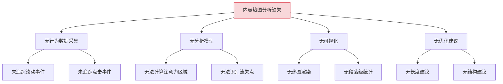
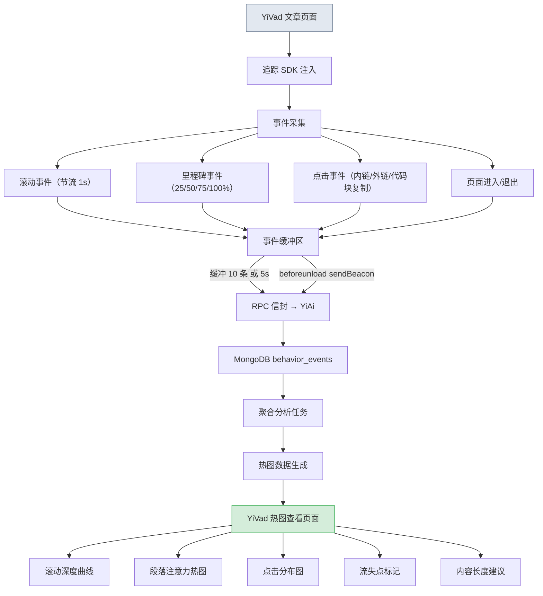
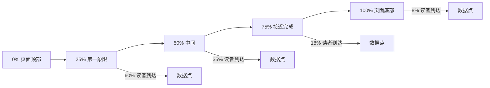

# YK-09-132: 内容热图分析 — 滚动深度、点击追踪、注意力区域与内容优化建议

> 需求编号：YK-09-132 · 优先级：P2 · 人天：0.3d · 状态：需求已编写
> 依赖：YiVad 内容渲染页面（知识库文章阅读视图）

## 背景

### 问题陈述

YiKnowledge 知识库有数百篇技术文章，但内容创作者无法了解读者实际如何使用这些文章：读者读了多少、在哪些部分停留最久、哪些段落被跳过、哪些链接被点击。缺乏这些数据导致内容优化只能凭直觉。

1. **不知道读者是否读完全文**：文章是 5000 字的长文，读者可能只读了前 30%
2. **不知道哪些段落最有价值**：无法区分核心内容和冗余内容
3. **不知道读者从哪离开**：读者在某个特定段落大量流失
4. **无法优化内容长度**：不知道理想文章长度
5. **链接点击无数据**：内链和外部资源的点击率未知

**核心矛盾**：内容创作者需要数据驱动的内容优化，但当前没有任何读者行为数据采集和分析。

### 影响范围

| # | 影响 | 严重程度 | 典型场景 |
|---|------|----------|----------|
| 1 | 内容优化凭直觉 | 高 | 不知道删掉哪些段落不会影响阅读体验 |
| 2 | 长文完成率低 | 高 | 5000 字文章平均只读 20% |
| 3 | 不知道读者的真实关注点 | 中 | 某个段落阅读时间最长说明读者最感兴趣 |
| 4 | 无法验证内容改进效果 | 中 | 修改了文章结构但不知道是否提升了完成率 |
| 5 | 跨文章无法比较 | 低 | 无法确定哪种类型的文章表现更好 |

### 挑战

| 挑战 | 说明 |
|------|------|
| 数据采集的隐私 | 滚动和点击数据属于用户行为数据，需匿名化处理 |
| 滚动深度的精确计算 | 需要区分"快速扫过"和"认真阅读" |
| 注意力区域的计算 | 需要综合滚动位置 + 停留时间来判断注意力 |
| 数据量的存储 | 高频滚动事件可能产生大量数据 |

---

## 一、现状分析

### 1.1 当前内容分析现状

```
现有功能:
├── 内容统计仪表盘（YK-09-97）
│   ├── 文章 PV/UV
│   └── 阅读时长
├── 内容性能分析（YK-09-114）
│   ├── 内容效果评估
│   └── 搜索排名

缺失:
├── 滚动深度追踪                  # ❌ 不存在
├── 点击热图                       # ❌ 不存在
├── 注意力区域识别                # ❌ 不存在
├── 内容流失分析                  # ❌ 不存在
├── 最优内容长度推荐              # ❌ 不存在
├── 段落级阅读数据                # ❌ 不存在
└── 跨文章热图比较                # ❌ 不存在
```

### 1.2 根因分析矩阵



| 根因 | 症状 | 影响 | 优先级 |
|------|------|------|--------|
| 无行为采集 | 阅读数据为空 | 无法分析 | 高 |
| 无分析模型 | 无法解读数据 | 数据无意义 | 高 |
| 无可视化 | 创作者看不到 | 无法优化 | 中 |
| 无建议 | 凭直觉优化 | 效率低下 | 中 |

---

## 二、设计决策

### 决策 1：数据采集的客户端实现方式

| 选项 | 描述 | 优点 | 缺点 |
|------|------|------|------|
| A: 前端 JavaScript SDK | 在 YiVad 文章页面注入追踪脚本 | 精确可控 | 仅覆盖 YiVad 阅读场景 |
| B: 后端日志分析 | 通过服务端日志推断行为 | 无客户端开销 | 不精确，无滚动数据 |
| C: 第三方分析工具 | 使用 Google Analytics / Matomo | 功能齐全 | 数据外泄风险 |

**选择：A（前端 JavaScript SDK）。** YiVad 渲染文章时注入轻量级追踪脚本（约 2KB），采集滚动深度、段落停留时间、链接点击。数据通过 RPC 信封发送到 YiAi 存储。仅采集匿名化数据（无用户 ID），符合隐私要求。

### 决策 2：滚动深度计算方式

| 选项 | 描述 | 优点 | 缺点 |
|------|------|------|------|
| A: 百分比阈值 | 记录用户到达了 25%/50%/75%/100% | 简单 | 粗略 |
| B: 段落级追踪 | 记录每个段落的可视时间和滚动速度 | 精确 | 数据量大 |
| C: 采样追踪 | 每秒采样一次滚动位置 | 平衡 | 可能遗漏快速滚动 |

**选择：C（采样追踪）+ A（阈值标记）。** 每秒采样一次滚动位置，同时标记 25%/50%/75%/100% 的里程碑。采样数据用于热图和注意力计算，阈值标记用于完成率统计。

### 决策 3：注意力区域的计算模型

| 选项 | 描述 | 优点 | 缺点 |
|------|------|------|------|
| A: 纯滚动位置 | 段落出现在视口中的时间 | 简单 | 无法区分阅读和离开 |
| B: 滚动 + 时间 | 段落可视时间加权 | 较精确 | 仍无法判断真实阅读 |
| C: 滚动 + 时间 + 鼠标/触摸 | 综合行为判断注意力 | 最精确 | 实现复杂 |

**选择：B（滚动 + 时间）。** 通过段落出现在视口的持续时间计算注意力。持续时间越长，读者越可能在阅读。鼠标/触摸追踪涉及更多隐私问题，且移动端无鼠标，先不用。

### 决策 4：数据上报策略

| 选项 | 描述 | 优点 | 缺点 |
|------|------|------|------|
| A: 实时上报 | 每次事件立即发送 | 实时 | 请求压力大 |
| B: 批量上报 | 缓冲 N 条事件或 M 秒后上报 | 低开销 | 页面关闭时可能丢失数据 |
| C: 混合模式 | 缓冲 + 页面卸载时 flushing | 最可靠 | 实现稍复杂 |

**选择：C（混合模式）。** 缓冲 10 条或 5 秒上报一次。页面 `beforeunload` 时使用 `navigator.sendBeacon` 发送剩余数据。这是 Google Analytics 和 Matomo 的标准做法。

### 设计决策总览

| 决策 | 选项 A | 选项 B | 选择 | 理由 |
|------|--------|--------|------|------|
| 采集方式 | 前端 SDK | 后端日志 | **前端 SDK** | 精确 |
| 滚动深度 | 百分比阈值 | 采样追踪 | **采样 + 阈值** | 精确 + 统计 |
| 注意力模型 | 纯滚动位置 | 滚动 + 时间 | **滚动 + 时间** | 较精确 + 隐私友好 |
| 上报策略 | 实时 | 批量 | **缓冲 + flush** | 低开销 + 可靠 |

---

## 三、目标架构

### 3.1 内容热图分析流程



### 3.2 滚动深度数据模型



### 3.3 架构决策权衡

| 维度 | 改造前 | 改造后 | 权衡说明 |
|------|--------|--------|----------|
| 读者行为 | 不可见 | 滚动 + 点击数据 | 数据量 vs 隐私 |
| 内容优化 | 凭直觉 | 数据驱动 | 可量化 vs 实现成本 |
| 质量验证 | 无 | 完成率、流失点 | 可视化 vs 复杂度 |

---

## 四、具体改动

### 4.1 改动总览

| 改动点 | 类型 | 涉及文件 | 预估行数 |
|--------|------|---------|---------|
| 追踪 SDK | 新增 | `utils/analytics/tracker.ts` | 150 行 |
| 滚动追踪器 | 新增 | `utils/analytics/scrollTracker.ts` | 80 行 |
| 点击追踪器 | 新增 | `utils/analytics/clickTracker.ts` | 60 行 |
| 事件缓冲区 | 新增 | `utils/analytics/eventBuffer.ts` | 60 行 |
| 热图分析页面 | 新增 | `views/analytics/ContentHeatmap.vue` | 200 行 |
| 滚动深度图表 | 新增 | `components/analytics/ScrollDepthChart.vue` | 80 行 |
| 注意力热图组件 | 新增 | `components/analytics/AttentionHeatmap.vue` | 100 行 |
| 流失分析组件 | 新增 | `components/analytics/DropoffAnalysis.vue` | 80 行 |
| Analytics Service | 新增 | `services/analyticsService.ts` | 60 行 |
| 类型定义 | 新增 | `types/contentAnalytics.ts` | 50 行 |
| 文章页面注入 | 扩展 | `views/knowledge/ArticleView.vue` | 10 行 |

### 4.2 涉及文件

```
YiVad/
├── utils/analytics/
│   ├── tracker.ts                      # 新增：追踪 SDK 入口
│   ├── scrollTracker.ts                # 新增：滚动追踪
│   ├── clickTracker.ts                 # 新增：点击追踪
│   └── eventBuffer.ts                  # 新增：事件缓冲区
├── views/analytics/
│   └── ContentHeatmap.vue             # 新增：热图分析页面
├── components/analytics/
│   ├── ScrollDepthChart.vue            # 新增：滚动深度图表
│   ├── AttentionHeatmap.vue            # 新增：注意力热图
│   └── DropoffAnalysis.vue             # 新增：流失分析
├── services/
│   └── analyticsService.ts             # 新增：分析 API 服务
└── types/
    └── contentAnalytics.ts             # 新增：分析类型定义

YiAi/
├── routers/
│   └── analytics.py                    # 新增：行为数据采集端点
└── models/
    └── behavior_event.py               # 新增：行为事件数据模型
```

### 4.3 核心类型定义

```typescript
// types/contentAnalytics.ts
type EventType = 'scroll' | 'milestone' | 'click' | 'page_enter' | 'page_exit';
type MilestoneType = '25%' | '50%' | '75%' | '100%';
type ClickTarget = 'internal_link' | 'external_link' | 'code_copy' | 'image_zoom' | 'other';

interface BehaviorEvent {
  event_type: EventType;
  article_path: string;      // YiKnowledge 相对路径
  session_id: string;        // 匿名会话 ID
  timestamp: number;
  data: ScrollData | MilestoneData | ClickData | PageData;
}

interface ScrollData {
  scroll_percentage: number;      // 滚动位置百分比 0-100
  viewport_height: number;        // 视口高度
  document_height: number;        // 文档总高度
  read_time_seconds: number;      // 累计阅读时间
}

interface MilestoneData {
  milestone: MilestoneType;
  reached_at: number;             // 到达时间（ms from page load）
}

interface ClickData {
  target: ClickTarget;
  element_tag: string;
  element_text: string;           // 被点击元素的文本（截断 200 字）
  href?: string;                  // 链接 href（如果是链接）
  position_in_article: number;    // 被点击元素在文章中的位置百分比
}

interface PageData {
  action: 'enter' | 'exit';
  total_read_time: number;        // 页面退出时的总阅读时间
}

interface ScrollDepthStats {
  article_path: string;
  total_views: number;
  milestones: {
    '25%': number;
    '50%': number;
    '75%': number;
    '100%': number;
  };
  avg_read_time: number;
  avg_scroll_percentage: number;
}

interface AttentionZone {
  percentage_range: [number, number];  // 注意力区域在文章中的位置 [10%, 20%]
  avg_viewport_duration_ms: number;    // 平均视口停留时间
  intensity: number;                   // 注意力强度 0-1
  paragraph_index: number;
}

interface ContentOptimizationSuggestion {
  type: 'too_long' | 'too_short' | 'high_dropoff' | 'low_engagement' | 'optimal';
  description: string;
  affected_range?: [number, number];
  recommendation: string;
}
```

### 4.4 关键交互逻辑

```typescript
// utils/analytics/scrollTracker.ts
class ScrollTracker {
  private lastPercentage = 0;
  private milestones: Set<MilestoneType> = new Set();
  private startTime = Date.now();
  private totalReadTime = 0;
  private lastActiveTime = Date.now();

  private readonly MILESTONE_THRESHOLDS: MilestoneType[] = ['25%', '50%', '75%', '100%'];

  start() {
    // 节流为每秒 1 次
    const throttledScroll = throttle(this.onScroll.bind(this), 1000);
    window.addEventListener('scroll', throttledScroll, { passive: true });

    // 页面退出
    window.addEventListener('beforeunload', this.onPageExit.bind(this));
  }

  private onScroll() {
    const scrollTop = window.scrollY || document.documentElement.scrollTop;
    const docHeight = document.documentElement.scrollHeight - window.innerHeight;
    if (docHeight <= 0) return;

    const percentage = Math.min(100, Math.round((scrollTop / docHeight) * 100));

    // 阅读时间更新（仅当用户在活跃滚动时）
    const now = Date.now();
    if (now - this.lastActiveTime < 3000) {
      this.totalReadTime += (now - this.lastActiveTime);
    }
    this.lastActiveTime = now;

    // 里程碑检测
    for (const milestone of this.MILESTONE_THRESHOLDS) {
      const threshold = parseInt(milestone);
      if (percentage >= threshold && !this.milestones.has(milestone)) {
        this.milestones.add(milestone);
        this.emitMilestone(milestone);
      }
    }

    // 滚动位置采样
    if (Math.abs(percentage - this.lastPercentage) >= 5) {
      this.lastPercentage = percentage;
      this.emitScroll(percentage);
    }
  }

  private emitScroll(percentage: number) {
    EventBuffer.push({
      event_type: 'scroll',
      article_path: getArticlePath(),
      session_id: getSessionId(),
      timestamp: Date.now(),
      data: {
        scroll_percentage: percentage,
        viewport_height: window.innerHeight,
        document_height: document.documentElement.scrollHeight,
        read_time_seconds: Math.round(this.totalReadTime / 1000),
      } as ScrollData,
    });
  }

  private emitMilestone(milestone: MilestoneType) {
    EventBuffer.push({
      event_type: 'milestone',
      article_path: getArticlePath(),
      session_id: getSessionId(),
      timestamp: Date.now(),
      data: {
        milestone,
        reached_at: Date.now() - this.startTime,
      } as MilestoneData,
    });
  }

  private onPageExit() {
    EventBuffer.flush(true); // 使用 sendBeacon
  }
}

// utils/analytics/eventBuffer.ts
class EventBuffer {
  private static buffer: BehaviorEvent[] = [];
  private static readonly MAX_SIZE = 10;
  private static readonly FLUSH_INTERVAL = 5000; // 5 秒
  private static timer: number | null = null;

  static push(event: BehaviorEvent) {
    this.buffer.push(event);
    if (this.buffer.length >= this.MAX_SIZE) {
      this.flush();
    }
    this.ensureTimer();
  }

  private static ensureTimer() {
    if (this.timer) return;
    this.timer = window.setTimeout(() => {
      this.flush();
      this.timer = null;
    }, this.FLUSH_INTERVAL);
  }

  static flush(useBeacon = false) {
    if (this.buffer.length === 0) return;

    const events = [...this.buffer];
    this.buffer = [];

    const payload = JSON.stringify({ events });

    if (useBeacon && navigator.sendBeacon) {
      navigator.sendBeacon(`${API_BASE}/analytics/batch`, payload);
    } else {
      fetch(`${API_BASE}/analytics/batch`, {
        method: 'POST',
        headers: { 'Content-Type': 'application/json' },
        body: payload,
        keepalive: true,
      });
    }
  }
}
```

---

## 五、实施步骤

| 步骤 | 内容 | 涉及文件 | 验证方式 | 人天 |
|------|------|---------|---------|------|
| 1 | 类型定义 + Analytics Service | `types/contentAnalytics.ts`, `services/analyticsService.ts` | 类型检查通过 | 0.03 |
| 2 | 事件缓冲区 | `eventBuffer.ts` | 缓冲 + flush 正常 | 0.03 |
| 3 | 滚动追踪器 | `scrollTracker.ts` | 滚动数据正确采样 | 0.04 |
| 4 | 点击追踪器 | `clickTracker.ts` | 点击事件正确采集 | 0.03 |
| 5 | 追踪 SDK 入口 + 文章页注入 | `tracker.ts`, `ArticleView.vue` | 文章加载后启动追踪 | 0.03 |
| 6 | 滚动深度图表 | `ScrollDepthChart.vue` | 曲线 + 里程碑正确 | 0.04 |
| 7 | 注意力热图组件 | `AttentionHeatmap.vue` | 文章侧热图柱状条 | 0.04 |
| 8 | 流失分析组件 | `DropoffAnalysis.vue` | 流失点标注 | 0.03 |
| 9 | 热图分析主页面 | `ContentHeatmap.vue` | 所有组件集成正常 | 0.03 |

**总计：0.3d**

---

## 六、测试规格

### 单元测试：ScrollTracker

#### Scenario: 滚动到 50% 触发里程碑
- **GIVEN** 页面总高度 2000px，视口高度 1000px
- **WHEN** 用户滚动到 500px（50%）
- **THEN** 触发 25% 和 50% 里程碑事件，milestones Set 包含 ['25%', '50%']

#### Scenario: 快速滚动不重复触发同一里程碑
- **GIVEN** 页面已触发 25% 里程碑
- **WHEN** 用户再次经过 25% 位置
- **THEN** 不重复触发 25% 里程碑

### 单元测试：EventBuffer

#### Scenario: 缓冲区满自动刷新
- **GIVEN** 缓冲区有 9 条事件
- **WHEN** 再 push 1 条
- **THEN** 自动触发 flush，缓冲区清空，10 条事件发送到 API

#### Scenario: 定时刷新
- **GIVEN** 缓冲区有 3 条事件，过去 5 秒
- **WHEN** 定时器触发
- **THEN** 3 条事件批量发送，定时器清空

### 单元测试：ClickTracker

#### Scenario: 点击内链
- **GIVEN** 用户点击文章内部链接 `<a href="#section-3">`
- **WHEN** 触发点击事件
- **THEN** 记录 target='internal_link'，href='#section-3'

### 组件测试：ScrollDepthChart

#### Scenario: 渲染滚动深度曲线
- **GIVEN** 一篇文章有 200 次浏览，各级里程碑数据
- **WHEN** 渲染 ScrollDepthChart
- **THEN** 显示从 100% 到 0% 的下降曲线，4 个里程碑标注实际百分比

### 集成测试：ContentHeatmap

#### Scenario: 选择文章查看热图
- **GIVEN** 用户打开热图分析页面
- **WHEN** 选择一篇文章
- **THEN** 左侧显示段落级的注意力热图，右侧显示滚动深度曲线，下方显示流失分析

#### Scenario: 内容优化建议
- **GIVEN** 文章 75% 位置有 40% 的读者流失
- **WHEN** 查看流失分析
- **THEN** 标记该位置为"高流失点"，建议"此段落前后内容需要优化或拆分"

---

## 七、风险与缓解

| 风险 | 概率 | 影响 | 等级 | 缓解措施 | 应急预案 |
|------|------|------|------|----------|----------|
| 高频滚动事件导致性能问题 | 中 | 中 | 中 | 1 秒节流 + 批量上报 | 增大节流间隔到 2 秒 |
| 隐私合规风险 | 低 | 高 | 中 | 仅采集匿名 session_id | 提供 opt-out 选项 |
| 数据量随时间膨胀 | 高 | 低 | 中 | 原始数据 30 天 TTL | 延长到 90 天 |
| 追踪脚本加载失败阻塞页面 | 低 | 中 | 低 | 异步加载 | 静默降级 |

---

## 八、回滚策略

| 回滚场景 | 回滚方式 | 影响范围 | 恢复时间 |
|----------|----------|----------|----------|
| 追踪脚本导致文章页性能问题 | 移除追踪脚本注入代码 | 文章阅读页 | < 1min |
| 行为数据采集异常 | 停止 Analytics API 端点 | 行为数据 | < 1min |
| 热图页面功能异常 | `git revert` 相关提交 | 热图分析页面 | < 1min |

**回滚验证：**
- 回滚后文章阅读页面不受影响
- 回滚后知识库正常渲染
- 回滚后已采集的行为数据保留

---

## 九、设计决策记录

### D-01: 为什么使用前端 SDK 而非后端日志分析？

后端日志（如 Nginx access log）只能知道用户请求了哪个页面，无法知道用户在页面内的行为（滚动了多少、看了哪些段落）。前端 SDK 是唯一能获取段落级阅读行为的方式。Google Analytics 和 Hotjar 等成熟的用户行为分析工具都使用前端 SDK。

### D-02: 为什么每秒采样而非连续上报？

滚动事件在鼠标滚轮操作下每秒可能触发数十次。连续上报会对服务器造成巨大压力，且对分析精度提升微乎其微。每秒 1 次采样已经足够构建平滑的滚动深度曲线。批量上报进一步减少了 HTTP 请求数量。

### D-03: 为什么注意力模型只使用滚动+时间，而不加入点击和鼠标移动？

鼠标/触摸追踪虽然能提供更精确的注意力判断（如鼠标悬停在某段落上表示正在阅读），但它带来两个问题：(1) 移动设备上没有鼠标，数据不完整；(2) 隐私风险更高，用户对鼠标追踪的抵触更大。滚动+时间是最低侵入性且覆盖所有设备的方案。

### D-04: 为什么原始行为数据只保留 30 天？

行为事件数据量增长迅速：假设 100 篇文章日均有 50 次浏览，每次浏览产生约 20 条事件（滚动 + 里程碑 + 点击），则每天产生 100x50x20 = 100k 条事件。30 天的数据量约 300 万条，已经可以提供足够的统计样本。聚合结果（滚动深度统计、注意力区域）永久保留。

---

## 十、可观测性

### 关键指标

| 指标 | 采集方式 | 告警阈值 | 说明 |
|------|---------|---------|------|
| 文章平均完成率 | 到达 100% 的 session / 总 session | < 20% | 大多数读者未读完 |
| 平均滚动深度 | 所有 session 的平均最终滚动位置 | < 50% | 读者只读了一半 |
| 高流失率文章比例 | 流失率 > 50% 的文章数 / 总文章 | > 30% | 大量文章有结构问题 |
| 追踪脚本加载成功率 | 脚本加载成功 / 总页面加载 | < 95% | 追踪覆盖面不足 |
| 事件上报成功率 | 成功上报 / 总事件数 | < 90% | 网络或 API 问题 |

### 日志规范

| 日志级别 | 场景 | 示例 |
|---------|------|------|
| `INFO` | 文章阅读会话 | `[Analytics] Session: ${id} article=${path} read=${time}s` |
| `WARN` | 事件上报失败 | `[Analytics] Batch upload failed: ${error}` |
| `ERROR` | 聚合任务失败 | `[Analytics] Aggregation failed for article=${path}` |

---

## 十一、代码审查检查清单

- [ ] ScrollTracker 节流正确（1000ms 间隔）
- [ ] 里程碑事件不重复触发
- [ ] EventBuffer 在 beforeunload 时正确 flush
- [ ] sendBeacon 降级到 fetch 的 fallback 正确
- [ ] 匿名 session_id 生成（UUID v4）
- [ ] 滚动深度图表 Y 轴正确（100% 到 0%）
- [ ] 注意力热图颜色映射正确（高强度=红色，低强度=蓝色）
- [ ] `vue-tsc --noEmit` 通过
- [ ] 无 ESLint/Prettier 告警

---

## 回归问题预测

| # | 问题 | 发现场景 | 根因 | 修复方式 |
|---|------|---------|------|---------|
| 1 | 文章底部有大量脚注和评论区导致"100%"里程碑误判 | 脚注区域使页面变长，用户看到正文结束就算读完 | 滚动深度基于正文区域而非整个 document | 通过 markdown 渲染的 section 标记确定正文边界 |
| 2 | tab 切换回来后累计阅读时间错误增加 | 用户切换到其他 tab 30 分钟回来 | 未检测页面可见性变化 | 使用 Page Visibility API，隐藏时暂停计时 |
| 3 | 移动端滚动深度采样不准确 | iOS Safari 的弹性滚动导致文档高度动态变化 | 弹性滚动使 scrollHeight 变化 | 弹性滚动结束后延迟 200ms 再采样 |
| 4 | 批量上报时网络断开导致大量事件丢失 | 用户在网络不稳定环境阅读 | 无离线缓存 | 增加 localStorage 降级存储，网络恢复后重试 |
| 5 | 编码过的 URL 导致的点击追踪 href 存储异常 | href 包含中文被 encodeURIComponent | 存储时未 decode | 存储点击数据时对 href 解码 |
| 6 | 阅读时间将页面自动播放的视频计入 | 文章嵌入了自动播放的视频 | 视频播放期间用户未在阅读但 time 在增加 | 检测 video/audio 标签播放状态，播放时暂停阅读计时 |

---

## 性能分析

### 追踪脚本性能

| 指标 | 数值 | 说明 |
|------|------|------|
| 脚本大小 | ~2KB（gzip 后） | 轻量级 |
| 滚动处理耗时 | < 1ms | 节流 + 无 DOM 操作 |
| 事件缓冲内存 | < 1KB（10 条事件） | 缓冲区 |
| 上报网络开销 | ~200B/次（10 条批量） | JSON payload |

### 热图页面渲染性能

| 指标 | 数值 | 说明 |
|------|------|------|
| ContentHeatmap 首屏 | ~300ms | 含图表 |
| ScrollDepthChart 渲染 | ~50ms | Canvas/SVG |
| AttentionHeatmap 渲染 | ~80ms | 段落热图色条 |

### 存储分析

| 数据结构 | 日增量 | 月总量 | 说明 |
|---------|--------|--------|------|
| 原始行为事件 | ~100K 条 | ~300M 条（30 天 TTL） | MongoDB |
| 聚合统计 | ~100 条 | ~3K 条 | 永久保留 |

---

*PRD 来源: `projects/yiknowledge/requirements/2026-09/00-需求-需求总览.md`*