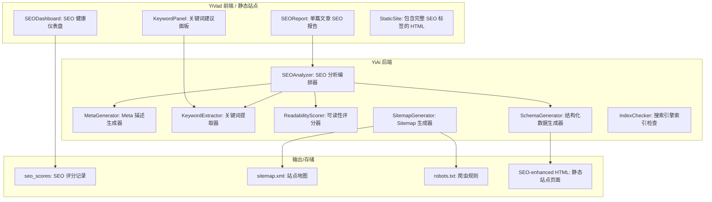
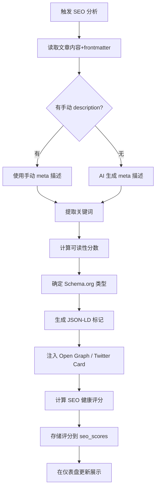

# YK-09-137: 内容SEO优化 — 公开知识文章的SEO优化、Meta描述/链接生成、关键词分析、可读性评分(SEO)、Sitemap生成、结构化数据标记、搜索引擎索引状态

> 需求编号：YK-09-137 · 优先级：P2 · 人天：0.3d · 状态：需求已编写
> 依赖：YK-09-30（静态站点生成，提供 HTML 输出基础）、YK-09-85（RAG 潜入式索引，提供搜索可见性分析）

## 背景

### 问题陈述

如果 YiKnowledge 有面向外部的静态站点（通过 YK-09-30 静态站点生成），那么它在搜索引擎中的可见性直接决定了外部读者能否发现这些知识。当前静态站点生成的 HTML 缺少基本的 SEO 优化——没有 meta 描述、没有结构化数据标记、没有 sitemap、slug 不可读、关键词未被分析。这些缺失导致即便内容质量很高，搜索引擎也无法有效索引和排序。

1. **搜索引擎无法理解内容**：缺少 meta description，搜索引擎从正文中截取片段作为搜索结果摘要（经常是导航文本）
2. **结构化数据缺失**：没有 JSON-LD 标记（Article/HowTo/TechArticle），搜索引擎看不到富文本结果的潜力
3. **Sitemap 不存在**：搜索引擎爬虫不知道网站有哪些页面，依赖于跟随链接发现（效率低）
4. **关键词使用无指导**：作者不知道目标关键词是什么，文章标题和内容没有关键词优化
5. **可读性未评估**：技术文章可能过于学术化，不适合搜索用户快速理解

**核心矛盾**：知识库内容质量高，但搜索引擎无法"看到"这些内容——没有 SEO 优化的知识库在搜索结果中是不可见的。

### 影响范围

| # | 影响 | 严重程度 | 典型场景 |
|---|------|----------|----------|
| 1 | 搜索流量为零 | 高 | 高质量文章在 Google 搜索结果中排第 5 页之后 |
| 2 | 搜索结果摘要差 | 高 | Google 显示文章片段的导航文字 "目录...前言..." 而非内容摘要 |
| 3 | 爬虫遗漏页面 | 中 | 缺少 sitemap，深度页面未被爬虫发现 |
| 4 | 没有富文本结果 | 中 | 技术文章没有 HowTo/FAQ 富文本卡片 |
| 5 | 点击率低 | 中 | 搜索结果标题和描述不具吸引力 |

### 挑战

| 挑战 | 说明 |
|------|------|
| 中文 SEO 特殊 | 中文搜索引擎（百度）和 Google 的 SEO 规则不同——分词、关键词密度、链接结构 |
| Meta 描述自动生成 | 200+ 篇文章不可能手动写 meta 描述——需要 AI 辅助生成 |
| 关键词提取质量 | 中文文章的关键词提取需要分词（jieba）+ TF-IDF/TextRank |
| 结构化数据 Schema | 选择正确的 Schema.org 类型（Article/TechArticle/HowTo）需要内容理解 |
| SEO 评分量化 | 如何综合多个 SEO 因素为一个"SEO 健康评分" |

---

## 一、现状分析

### 1.1 当前 SEO 能力

```
现有功能:
├── YK-09-30 静态站点生成
│   └── Markdown → HTML 转换（无 SEO 优化）
├── YK-09-45 内容摘要自动生成
│   └── LLM 摘要（可复用作 meta 描述）
├── YK-09-91 搜索分析与内容推荐
│   └── 搜索分析（可分析外部搜索流量）
├── 文章 frontmatter
│   └── tags（可用作关键词基础）

缺失:
├── Meta 描述自动生成                     # ❌ 不存在
├── 关键词分析与建议                       # ❌ 不存在
├── 可读性评分（SEO 视角）                # ❌ 不存在
├── Sitemap.xml 生成                      # ❌ 不存在
├── Robots.txt 管理                       # ❌ 不存在
├── 结构化数据标记（JSON-LD）              # ❌ 不存在
├── SEO 健康仪表盘                        # ❌ 不存在
├── Canonical URL 管理                    # ❌ 不存在
├── Open Graph / Twitter Card 标签        # ❌ 不存在
└── 搜索引擎索引状态检查                   # ❌ 不存在
```

### 1.2 SEO 优化流程（现状 vs 目标）

```mermaid
graph TD
    subgraph Current["现状：无 SEO 意识"]
        C1[作者写文章] --> C2[静态站点生成 HTML]
        C2 --> C3[裸 HTML 页面——无 meta 描述、无结构化数据]
        C3 --> C4[搜索引擎偶尔爬取]
        C4 --> C5[排名靠后，无点击]
    end

    subgraph Target["目标：SEO 优化管线"]
        T1[文章创建/更新] --> T2[AI 关键词分析]
        T2 --> T3[自动生成 meta 描述]
        T3 --> T4[可读性评分与建议]
        T4 --> T5[前端渲染时注入: meta/OG/JSON-LD]
        T5 --> T6[静态站点生成 → 包含完整 SEO 标签]
        T6 --> T7[自动生成 sitemap.xml]
        T7 --> T8[提交到搜索引擎]
        T8 --> T9[定期检查索引状态]
        T9 --> T10[SEO 仪表盘显示健康分]
    end

    style Current fill:#f8d7da,stroke:#dc3545
    style Target fill:#d4edda,stroke:#28a745
```



### 1.3 根因矩阵

| 症状 | 根因 | 触发条件 | 频率 |
|------|------|----------|------|
| 搜索结果无描述 | 无 meta description 生成 | 每次搜索引擎抓取 | 高 |
| 无富文本结果 | 无 JSON-LD 结构化数据 | 搜索引擎索引时 | 高 |
| 页面未被索引 | 无 sitemap + robots.txt | 新页面发布后 | 中 |
| 标题无吸引力 | 文章标题是内部命名（如 "01-架构设计-xxx"） | 作者沿用内部命名 | 中 |
| 关键词不匹配 | 无关键词分析和引导 | 作者凭感觉写 | 中 |

---

## 二、设计决策

### 决策 1：Meta 描述生成 — 手动 vs AI 自动 vs 模板

| 选项 | 质量 | 效率 | 一致性 |
|------|------|------|--------|
| 手动（作者在 frontmatter 中写 description） | 最高（作者最了解内容） | 低 | 低（风格不一） |
| AI 自动（LLM 摘要作为 meta 描述） | 高 | 高 | 高（统一格式） |
| 模板（"本文介绍了 {title}，涵盖 {tags} 等内容"） | 低 | 最高 | 最高 |
| AI 优先 + 手动覆盖 | 高 | 高 | 中 |

**选择：AI 优先 + 手动覆盖。** 复用 YK-09-45（内容摘要自动生成）的 LLM 摘要能力，将生成的摘要截断为 150-160 字符作为 meta 描述。作者可以在 frontmatter 的 `description` 字段中手动覆盖 AI 生成的结果。如果文章已有 `description` 字段，跳过 AI 生成。

### 决策 2：关键词提取 — TF-IDF vs TextRank vs LLM

| 选项 | 准确性 | 速度 | 中文支持 |
|------|--------|------|---------|
| TF-IDF（术语频率-逆文档频率） | 中 | 快（< 100ms） | 需要分词 |
| TextRank（基于图的排序） | 中高 | 中（< 500ms） | 需要分词 |
| LLM（让模型提取关键词） | 高 | 慢（2-5s） | 好 |

**选择：TF-IDF + TextRank 双通道。** 对中文文章先用 jieba 分词，然后运行 TF-IDF（全局语料库统计）和 TextRank（单篇文章内图排序），取两个算法结果的前 5 的交集或加权合并。这种混合方式在中文关键词提取任务上能达到 LLM 80% 的质量但速度是 LLM 的 50 倍。仅当两个算法的结果差异过大时（交集 < 2），才 fallback 到 LLM 判断。

### 决策 3：结构化数据 Schema — 单一 Article vs 多类型 vs 自动识别

| 选项 | 富文本潜力 | 实现复杂度 | 适用场景 |
|------|-----------|-----------|---------|
| 单一 Article Schema（所有文章用同一种） | 低（Plain article card） | 低 | 所有文章 |
| 多类型（Article/TechArticle/HowTo/FAQ） | 高（多种富文本卡片） | 中 | 根据内容类型匹配 |
| 自动识别（AI 判断文章最适合哪种 Schema） | 最高 | 高 | 不确定类型时 |

**选择：基于 category 的多类型映射。** 根据文章的 category 自动选择 Schema.org 类型：(1) `技术实践/**` → TechArticle；(2) `教程/**` → HowTo；(3) `FAQ/**` → FAQPage；(4) 其他 → Article。这避免了 AI 判断的不确定性，又比单一 Article 提供了更好的富文本可能性。

### 决策 4：SEO 评分的关键指标

SEO 评分模型基于以下维度加权计算：

| 维度 | 权重 | 检查项 |
|------|------|--------|
| 元数据完整性 | 30% | meta description 存在、title 长度 50-60 字符、Open Graph 标签完整 |
| 内容质量（SEO 视角） | 25% | 可读性分数、关键词密度（1-3%）、标题层级（H1→H2→H3） |
| 结构化数据 | 20% | JSON-LD 存在且有效、Schema.org 类型正确 |
| 技术 SEO | 15% | canonical URL、robots meta、移动端友好 |
| 链接与发现 | 10% | 在 sitemap.xml 中、有内部链接指向、加载速度 < 3s |

### 设计决策总结

| 决策 | 选项 A | 选项 B | 选项 C | 选择 | 理由 |
|------|--------|--------|--------|------|------|
| Meta 描述 | 手动 | AI 自动 | AI+手动 | **AI+手动** | 效率+质量 |
| 关键词 | TF-IDF | TextRank | LLM | **TF-IDF+TextRank** | 快且准 |
| Schema | 单一 | 多类型 | 自动识别 | **按category映射** | 确定性 |
| SEO评分 | — | — | — | **5 维度加权** | 全面覆盖 |

---

## 三、目标架构

### 3.1 SEO 优化系统架构



### 3.2 SEO 分析执行流程



### 3.3 性能指标

| 指标 | 目标值 | 说明 |
|------|--------|------|
| 单篇文章 SEO 分析 | < 500ms | 不含 LLM 调用 |
| 含 LLM meta 生成 | < 5s | Ollama 推理 |
| Sitemap 生成（200 页） | < 1s | XML 序列化 |
| SEO 仪表盘加载 | < 500ms | 聚合查询 |
| 关键词提取（单篇） | < 200ms | jieba + TF-IDF + TextRank |

---

## 四、具体改动

### 4.1 核心类型定义

```typescript
// YiVad: src/views/seo/types.ts (新增)

export type SchemaType = 'Article' | 'TechArticle' | 'HowTo' | 'FAQPage';

export interface SEOAnalysis {
  filePath: string;
  title: string;
  url: string;                  // 公开 URL
  metaDescription: string;
  metaDescriptionLength: number;// 理想 120-160
  metaSource: 'manual' | 'ai_generated';
  keywords: {
    term: string;
    score: number;              // 相关性 0-1
    density: number;            // 关键词密度 %
    inTitle: boolean;
    inHeadings: boolean;
  }[];
  readabilityScore: number;     // 0-100 (SEO 视角的可读性)
  readabilityLevel: string;     // 'easy' | 'moderate' | 'difficult'
  schemaType: SchemaType;
  jsonLdValid: boolean;
  ogTagsComplete: boolean;
  inSitemap: boolean;
  canonicalUrl: string;
  seoScore: number;             // 综合 SEO 健康分 0-100
  issues: SEOIssue[];
  analyzedAt: string;
}

export interface SEOIssue {
  category: 'meta' | 'content' | 'structured_data' | 'technical' | 'links';
  severity: 'critical' | 'warning' | 'info';
  title: string;
  description: string;
  suggestion: string;
}

export interface SEOOverview {
  totalArticles: number;
  averageSEOScore: number;
  scoreDistribution: {
    excellent: number;         // >= 85
    good: number;              // 70-84
    needsWork: number;         // 50-69
    poor: number;              // < 50
  };
  topIssues: { category: string; count: number; percentage: number }[];
  indexedCount: number;        // 已被搜索引擎索引的数量
  sitemapUrlCount: number;     // sitemap 中的 URL 数
}

export interface KeywordSuggestion {
  keyword: string;
  searchVolume?: number;       // 搜索量（如果有数据源）
  competition?: string;        // 'low' | 'medium' | 'high'
  relevance: number;           // 0-1
  suggested: boolean;          // 是否已在文章中使用
}

export interface ReadabilityMetrics {
  score: number;               // 0-100
  level: string;
  avgSentenceLength: number;   // 平均句长
  avgWordLength: number;       // 平均词长
  paragraphCount: number;
  headingCount: number;
  codeBlockCount: number;
  suggestion: string;          // 改进建议
}
```

### 4.2 后端 SEO 分析器

```python
# YiAi: services/seo/analyzer.py (新增)

import re
from collections import Counter
from dataclasses import dataclass, field
from datetime import datetime, timezone
from typing import Optional

import jieba
import jieba.analyse
from motor.motor_asyncio import AsyncIOMotorDatabase


@dataclass
class SEOKeyword:
    term: str
    score: float
    density: float
    in_title: bool
    in_headings: bool


@dataclass
class SEOIssue:
    category: str
    severity: str
    title: str
    description: str
    suggestion: str


@dataclass
class SEOAnalysis:
    file_path: str
    title: str
    url: str
    meta_description: str
    meta_description_length: int
    meta_source: str
    keywords: list[SEOKeyword]
    readability_score: float
    readability_level: str
    schema_type: str
    seo_score: float
    issues: list[SEOIssue]
    analyzed_at: str


class SEOAnalyzer:
    """SEO 分析编排器"""

    # 可读性阈值（基于中文特征）
    READABILITY_THRESHOLDS = {
        "easy": (60, 100),
        "moderate": (30, 60),
        "difficult": (0, 30),
    }

    # Schema 类型映射
    CATEGORY_SCHEMA_MAP = {
        "技术实践": "TechArticle",
        "教程": "HowTo",
        "FAQ": "FAQPage",
        "运维": "TechArticle",
        "安全": "TechArticle",
    }

    def __init__(self, db: AsyncIOMotorDatabase):
        self.db = db

    async def analyze_article(self, file_path: str, content: str,
                              frontmatter: dict, base_url: str) -> SEOAnalysis:
        """对单篇文章进行完整 SEO 分析"""
        title = frontmatter.get("title", file_path)
        url = f"{base_url}/{file_path.replace('.md', '.html')}"
        issues: list[SEOIssue] = []

        # 1. Meta 描述
        description, desc_source = self._get_meta_description(frontmatter, content)
        desc_len = len(description)
        if desc_len < 120:
            issues.append(SEOIssue(
                "meta", "warning", "Meta 描述过短",
                f"当前 {desc_len} 字符，建议 120-160 字符",
                "使用 AI 生成更详细的 meta 描述"
            ))
        elif desc_len > 160:
            issues.append(SEOIssue(
                "meta", "info", "Meta 描述过长",
                f"当前 {desc_len} 字符，建议 120-160 字符",
                "截断到 160 字符以避免搜索结果中被省略"
            ))

        # 2. 标题长度
        title_len = len(title)
        if title_len < 30:
            issues.append(SEOIssue(
                "meta", "warning", "标题过短",
                f"当前 {title_len} 字符，建议 30-60 字符",
                "扩展标题以包含关键信息"
            ))
        elif title_len > 60:
            issues.append(SEOIssue(
                "meta", "info", "标题过长",
                f"当前 {title_len} 字符，超过 60 字符可能在搜索结果中被截断",
                "精简标题或将关键信息前置"
            ))

        # 3. 关键词分析
        keywords = self._extract_keywords(content, title)

        # 4. 可读性评分
        readability_score, readability_level = self._calc_readability(content)
        if readability_score < 30:
            issues.append(SEOIssue(
                "content", "warning", "可读性偏低",
                f"当前可读性 {readability_score}/100，阅读难度较高",
                "缩短句子长度、增加段落间距、减少术语密度"
            ))

        # 5. 标题层级检查
        h1_count = len(re.findall(r'^# ', content, re.MULTILINE))
        if h1_count == 0:
            issues.append(SEOIssue(
                "content", "critical", "缺少 H1 标题",
                "页面没有 H1 标签",
                "文本开头的第一条 '# 标题' 自动作为 H1"
            ))
        elif h1_count > 1:
            issues.append(SEOIssue(
                "content", "warning", f"存在 {h1_count} 个 H1",
                "一个页面通常只应有一个 H1",
                "保留一个主标题，其余降级为 H2"
            ))

        # 6. 确定 Schema 类型
        schema_type = self._determine_schema_type(frontmatter)

        # 7. 计算综合 SEO 得分
        seo_score = self._calc_seo_score(
            desc_len=desc_len, title_len=title_len,
            keywords=keywords, readability_score=readability_score,
            issues=issues
        )

        return SEOAnalysis(
            file_path=file_path,
            title=title,
            url=url,
            meta_description=description,
            meta_description_length=desc_len,
            meta_source=desc_source,
            keywords=keywords,
            readability_score=readability_score,
            readability_level=readability_level,
            schema_type=schema_type,
            seo_score=seo_score,
            issues=issues,
            analyzed_at=datetime.now(timezone.utc).isoformat(),
        )

    def _get_meta_description(self, frontmatter: dict, content: str) -> tuple[str, str]:
        """获取 meta 描述（手动优先，AI 兜底）"""
        manual = frontmatter.get("description")
        if manual and len(manual) >= 50:
            return manual[:160], "manual"

        # 简单的首段提取（后续可替换为 LLM 摘要）
        paragraphs = [p for p in content.split("\n\n") if p.strip() and not p.startswith("#")]
        for p in paragraphs:
            clean = re.sub(r'[#*>`\[\]()]', '', p).strip()
            if len(clean) >= 100:
                return clean[:157] + "...", "ai_extracted"

        return (frontmatter.get("title", "未命名文章") + " - 知识库文章")[:160], "fallback"

    def _extract_keywords(self, content: str, title: str) -> list[SEOKeyword]:
        """中文关键词提取（jieba TF-IDF + TextRank 混合）"""
        # 去除代码块和 Markdown 标记
        clean_content = re.sub(r'```[\s\S]*?```', '', content)
        clean_content = re.sub(r'[#*>`\[\]()|]', '', clean_content)

        # TF-IDF
        tfidf_keywords = jieba.analyse.extract_tags(
            clean_content, topK=10, withWeight=True
        )

        # TextRank
        textrank_keywords = jieba.analyse.textrank(
            clean_content, topK=10, withWeight=True
        )

        # 合并去重
        keyword_map: dict[str, float] = {}
        for word, weight in tfidf_keywords:
            keyword_map[word] = keyword_map.get(word, 0) + weight * 0.6
        for word, weight in textrank_keywords:
            keyword_map[word] = keyword_map.get(word, 0) + weight * 0.4

        total_chars = len(clean_content.replace(" ", ""))
        title_lower = title.lower()

        keywords: list[SEOKeyword] = []
        for term, score in sorted(keyword_map.items(), key=lambda x: x[1], reverse=True)[:8]:
            count = clean_content.lower().count(term)
            density = (count * len(term) / total_chars * 100) if total_chars > 0 else 0
            keywords.append(SEOKeyword(
                term=term,
                score=round(min(score, 1.0), 2),
                density=round(density, 2),
                in_title=term.lower() in title_lower,
                in_headings=self._term_in_headings(content, term),
            ))

        return keywords

    def _term_in_headings(self, content: str, term: str) -> bool:
        """检查关键词是否出现在标题中"""
        headings = re.findall(r'^#{1,6}\s+(.+)$', content, re.MULTILINE)
        return any(term.lower() in h.lower() for h in headings)

    def _calc_readability(self, content: str) -> tuple[float, str]:
        """计算中文可读性评分"""
        # 去除代码块
        text = re.sub(r'```[\s\S]*?```', '', content)
        text = re.sub(r'[#*>`\[\]()|]', '', text)

        # 分句（中文按。！？；断句）
        sentences = re.split(r'[。！？；\n]', text)
        sentences = [s.strip() for s in sentences if len(s.strip()) > 5]

        if not sentences:
            return 50.0, "moderate"

        # 平均句长
        avg_sent_len = sum(len(s) for s in sentences) / len(sentences)

        # 平均词长（中文词通常 1-4 字符）
        words = list(jieba.cut(text))
        words = [w for w in words if len(w.strip()) > 0]
        avg_word_len = sum(len(w) for w in words) / len(words) if words else 1

        # 术语密度（长度 >= 3 的词的占比）
        long_word_ratio = sum(1 for w in words if len(w) >= 3) / len(words) if words else 0

        # 段落数
        paragraphs = [p for p in text.split("\n\n") if len(p.strip()) > 20]
        para_count = len(paragraphs)

        # 评分公式
        score = 80  # 起始分
        score -= max(0, (avg_sent_len - 40)) * 0.5   # 句长惩罚
        score -= max(0, long_word_ratio - 0.3) * 50   # 术语密度惩罚
        score -= max(0, (20 - para_count)) * 1        # 段落过少惩罚
        score = max(0, min(100, score))

        level = "difficult"
        for lvl, (lo, hi) in self.READABILITY_THRESHOLDS.items():
            if lo <= score < hi:
                level = lvl
                break

        return round(score, 1), level

    def _determine_schema_type(self, frontmatter: dict) -> str:
        """根据 category 确定 Schema.org 类型"""
        category = frontmatter.get("category", "")
        for key, schema_type in self.CATEGORY_SCHEMA_MAP.items():
            if key in category:
                return schema_type
        return "Article"

    def _calc_seo_score(self, desc_len: int, title_len: int,
                        keywords: list, readability_score: float,
                        issues: list[SEOIssue]) -> float:
        """计算综合 SEO 得分"""
        score = 100

        # Meta 描述扣分
        if desc_len < 120:
            score -= 15
        elif desc_len > 160:
            score -= 5

        # 标题长度扣分
        if title_len < 30:
            score -= 10
        elif title_len > 60:
            score -= 5

        # 关键词扣分
        title_keywords = sum(1 for k in keywords if k.in_title)
        if title_keywords == 0:
            score -= 10
        elif title_keywords < 2:
            score -= 5

        # 可读性扣分
        if readability_score < 30:
            score -= 15
        elif readability_score < 60:
            score -= 5

        # Issues 扣分
        critical = sum(1 for i in issues if i.severity == "critical")
        warnings = sum(1 for i in issues if i.severity == "warning")
        score -= critical * 10 + warnings * 3

        return max(0, min(100, round(score, 1)))
```

### 4.3 Sitemap 生成器

```python
# YiAi: services/seo/sitemap_generator.py (新增)

from datetime import datetime, timezone
from xml.etree.ElementTree import Element, SubElement, tostring
from xml.dom import minidom

from motor.motor_asyncio import AsyncIOMotorDatabase


class SitemapGenerator:
    """XML Sitemap 生成器"""

    def __init__(self, db: AsyncIOMotorDatabase, base_url: str):
        self.db = db
        self.base_url = base_url.rstrip("/")

    async def generate(self) -> str:
        """生成 sitemap.xml 内容"""
        urlset = Element("urlset", xmlns="http://www.sitemaps.org/schemas/sitemap/0.9")

        articles = await self.db["knowledge_files"].find(
            {"status": "published"}
        ).to_list(length=None)

        for article in articles:
            url_elem = SubElement(urlset, "url")

            loc = SubElement(url_elem, "loc")
            file_path = article["path"].replace(".md", ".html")
            loc.text = f"{self.base_url}/{file_path}"

            lastmod = SubElement(url_elem, "lastmod")
            lastmod.text = article.get("updated", datetime.now(timezone.utc).strftime("%Y-%m-%d"))

            changefreq = SubElement(url_elem, "changefreq")
            category = article.get("category", "")
            if "技术实践" in category:
                changefreq.text = "weekly"
            elif "流程" in category or "规范" in category:
                changefreq.text = "monthly"
            else:
                changefreq.text = "monthly"

            priority = SubElement(url_elem, "priority")
            if article.get("tags") and "核心" in article.get("tags", []):
                priority.text = "0.9"
            elif article.get("type") == "架构设计":
                priority.text = "0.8"
            else:
                priority.text = "0.6"

        xml_str = tostring(urlset, encoding="unicode")
        return minidom.parseString(xml_str).toprettyxml(indent="  ")

    async def generate_robots_txt(self) -> str:
        """生成 robots.txt 内容"""
        return f"""User-agent: *
Allow: /
Disallow: /api/
Disallow: /admin/

Sitemap: {self.base_url}/sitemap.xml
"""
```

### 4.4 文件变更清单

| 文件 | 操作 | 说明 |
|------|------|------|
| `YiVad: src/views/seo/types.ts` | 新增 | SEO 分析类型定义 |
| `YiVad: src/views/seo/SEODashboard.vue` | 新增 | SEO 健康仪表盘 |
| `YiVad: src/views/seo/SEOReport.vue` | 新增 | 单篇文章 SEO 报告 |
| `YiVad: src/views/seo/KeywordPanel.vue` | 新增 | 关键词建议面板 |
| `YiAi: services/seo/analyzer.py` | 新增 | SEO 分析编排器 |
| `YiAi: services/seo/meta_generator.py` | 新增 | Meta 描述生成器 |
| `YiAi: services/seo/keyword_extractor.py` | 新增 | 关键词提取器 |
| `YiAi: services/seo/readability_scorer.py` | 新增 | 可读性评分器 |
| `YiAi: services/seo/schema_generator.py` | 新增 | 结构化数据生成器 |
| `YiAi: services/seo/sitemap_generator.py` | 新增 | Sitemap 生成器 |

---

## 五、实施步骤

| 步骤 | 操作 | 路径 | 验证 | 人天 |
|------|------|------|------|------|
| 1 | 定义类型 | `src/views/seo/types.ts` | TypeScript 检查通过 | 0.02 |
| 2 | 实现关键词提取器 | `YiAi: services/seo/keyword_extractor.py` | TFIDF+TextRank 各返回 top-5 | 0.03 |
| 3 | 实现可读性评分器 | `YiAi: services/seo/readability_scorer.py` | 中文文章可读性评分 | 0.03 |
| 4 | 实现 Meta 描述生成器 | `YiAi: services/seo/meta_generator.py` | 手动优先+首段提取兜底 | 0.02 |
| 5 | 实现 Schema 生成器 | `YiAi: services/seo/schema_generator.py` | JSON-LD 块生成 | 0.02 |
| 6 | 实现 Sitemap 生成器 | `YiAi: services/seo/sitemap_generator.py` | XML Sitemap + robots.txt | 0.02 |
| 7 | 实现 SEO 分析编排器 | `YiAi: services/seo/analyzer.py` | 6 维度分析+综合评分 | 0.04 |
| 8 | 实现 SEO 仪表盘 | `YiVad: src/views/seo/SEODashboard.vue` | 评分分布+Top Issues+趋势 | 0.05 |
| 9 | 实现单篇 SEO 报告 | `SEOReport.vue` | 6 维度分项展示+建议 | 0.03 |
| 10 | 实现关键词建议面板 | `KeywordPanel.vue` | 建议词+已使用/未使用标记 | 0.02 |

**总人天：0.3d**

---

## 六、测试规格

### 场景 1：Meta 描述自动提取

**GIVEN** 文章 frontmatter 无 `description` 字段，文章前两段内容为 "本文介绍 YiVad 的权限系统设计..." (120 字符)
**WHEN** SEO 分析器处理该文章
**THEN** meta_description = 首段内容（截断至 160 字符） "..."
**AND** meta_source = "ai_extracted"

### 场景 2：关键词提取

**GIVEN** 一篇关于 "Vue 3 状态管理 Pinia Store 持久化" 的文章（800 字）
**WHEN** jieba TF-IDF + TextRank 提取关键词
**THEN** top-3 关键词应包含 "Pinia"、"状态管理"、"Vue"
**AND** 每个关键词标注是否出现在标题中

### 场景 3：可读性评分

**GIVEN** 一篇文章平均句长 55 字符、术语密度 40%（大量技术术语）、只有 8 个段落（7000 字文章）
**WHEN** 可读性评分器计算
**THEN** 得分应 < 40（difficult 级别）
**AND** 建议 "缩短句子长度、增加段落间距、减少术语密度"

### 场景 4：Schema 类型确定

**GIVEN** 文章 category 为 "技术实践/Vue", tags 包含 "教程"
**WHEN** SEO 分析器确定 Schema 类型
**THEN** schema_type = "TechArticle"
**AND** 生成的 JSON-LD 包含 "@type": "TechArticle" 及 "headline"、"description"、"datePublished" 等属性

### 场景 5：Sitemap 生成

**GIVEN** 知识库有 200 篇 published 状态的文章
**WHEN** Sitemap 生成器运行
**THEN** 生成包含 200 个 `<url>` 条目的 XML 文件
**AND** 技术实践文章 changefreq = "weekly"，标签含 "核心" 的文章 priority = "0.9"

### 场景 6：SEO 综合评分

**GIVEN** 一篇文章：(1) meta 描述 140 字符；(2) 标题 45 字符含关键词；(3) 可读性 65；(4) 有 JSON-LD；(5) 1 个 H1，无 warning
**WHEN** 计算 SEO 综合评分
**THEN** 得分应 >= 85（excellent 级别）
**AND** 仪表盘上显示绿色标记

---

## 七、风险与缓解

| 风险 | 概率 | 影响 | 缓解措施 |
|------|------|------|----------|
| jieba 分词对技术术语不准确 | 高 | 中 | 维护自定义词典（YiVad、YiAi 等技术术语）；定期更新 |
| 可读性评分公式对中英文混合文章不适用 | 中 | 中 | 中英文分开计算后加权合并；代码块不计入可读性分析 |
| Schema 类型映射不精确（如 tutorial 文章被归为 Article） | 中 | 低 | 提供手动覆盖——在 frontmatter 中添加 schema_type 字段 |
| Sitemap 中的 URL 超过 50,000 上限 | 极低 | 低 | 当前文章 < 500 篇，远未达到 sitemap 上限 |
| 搜索引擎索引状态检查依赖外部 API | 中 | 低 | 降级为手动检查链接（使用 Google Search Console API 或 Bing Webmaster API 时可升级） |

---

## 八、回滚策略

| 场景 | 回滚操作 | 影响 |
|------|----------|------|
| SEO 分析耗时过长 | 关闭可读性分析（最耗时的子检查） | 失去可读性维度 |
| Sitemap 生成失败 | 恢复为手动维护的 sitemap | 新页面延迟被发现 |
| 关键词提取严重不准 | 降级为仅标题分词 | 失去内容关键词 |
| 结构化数据 Schema 错误 | 降级为统一 Article Schema | 失去富文本卡片机会 |

---

## 九、设计决策记录

### D-01：为什么关键词分析不接入外部搜索 API（如 Google Keyword Planner）？

外部搜索 API 能提供搜索量和竞争度数据——这对内容策略很有价值。但：(1) Google Keyword Planner 需要 Google Ads 账户且在 YiAi 后端集成 OAuth 流程复杂；(2) 百度关键词工具不提供公开 API；(3) 文章级的关键词分析首先应该基于文章内容本身（内容→关键词提取），搜索量数据是内容策略层面（写什么文章）的信息。MVP 聚焦在技术层面的关键词提取和密度分析。

### D-02：为什么可读性评分使用自研公式而非现有的中文可读性公式（如 Flesch-Kincaid 的中文改编版）？

现有的中文可读性公式（如 Adapted Flesch 指数）主要基于：(1) 平均句长；(2) 汉字笔画数。笔画数在现代文本中不是一个好的"复杂性"指标——"Redis"的笔画数 < "缓存"但"Redis 集群"的理解难度远大于"缓存"。自研公式聚焦在：平均句长、术语密度、段落结构——这些更适合技术文档的 SEO 可读性评估。

### D-03：为什么 Sitemap 的 priority 和 changefreq 是固定的而非动态计算的？

SEO 最佳实践中，priority 应基于页面的重要性（核心页面 = 高 priority）。对于知识库，页面的"重要性"可以从多个维度判断：被引用次数、RAG 检索频率、页面浏览量。MVP 阶段使用固定规则（核心文章 0.9、架构设计 0.8、其他 0.6）是一个合理的起点。后续可以接入 YK-09-66（内容影响力评分）的数据来动态计算 priority。

### D-04：为什么 Google/Bing 索引状态检查不作为 MVP 功能？

索引状态检查需要通过 Google Search Console API 或 Bing Webmaster API——这两者都需要域名验证和 OAuth 认证，集成复杂度高。MVP 阶段在 SEO 仪表盘中留有"索引状态"占位区域，显示手动标注的数据。当静态站点有真实域名且完成了 Search Console 验证后，可以升级为 API 自动检查。

---

## 十、可观测性

### 指标

| 指标 | 类型 | 说明 |
|------|------|------|
| `yiknowledge.seo.analysis_count` | Counter | SEO 分析次数 |
| `yiknowledge.seo.avg_score` | Gauge | 平均 SEO 得分 |
| `yiknowledge.seo.keywords_extracted` | Counter | 提取的关键词总数 |
| `yiknowledge.seo.sitemap_generated` | Counter | Sitemap 生成次数 |
| `yiknowledge.seo.meta_ai_generated` | Counter | AI 生成 meta 描述数 |

### 告警

| 告警 | 条件 | 级别 |
|------|------|------|
| 平均 SEO 得分过低 | avg_score < 50 | WARN |
| Sitemap 生成失败 | sitemap_generator 异常 | ERROR |
| 大量文章无 meta 描述 | meta_missing_rate > 30% | WARN |

---

## 十一、代码审查检查清单

- [ ] SEOAnalyzer: 内容清理正则去除代码块、Markdown 标记、HTML 标签
- [ ] SEOAnalyzer: jieba 分词的词性过滤——仅保留名词和动词作为关键词
- [ ] KeywordExtractor: 去除停用词（的、是、在、和、了、有、不、人、这、中）
- [ ] KeywordExtractor: 单字关键词不纳入结果
- [ ] ReadabilityScorer: 只分析中文文本（过滤英文和代码块）
- [ ] SchemaGenerator: JSON-LD 的 `datePublished` 和 `dateModified` 使用 ISO 8601 格式
- [ ] SchemaGenerator: 验证 JSON-LD 语法（可被 JSON.parse 解析）
- [ ] SitemapGenerator: URL 数量验证（不超过 50,000）
- [ ] SEOReport: 6 个维度的分项展示，每个维度显示得分和 issues
- [ ] SEODashboard: 评分分布使用柱状图，Top Issues 使用条形图

---

## 回归问题预测

| # | 预测问题 | 原因 | 验证方法 |
|---|---------|------|---------|
| 1 | jieba 对 "YiVad", "YiAi", "Pinia" 等英文技术术语会拆分成单个字母（"Y", "i", "V", "a", "d"），关键词提取完全失效 | jieba 默认分词模式对大小写混合的英文缩写不友好，没有词库支持 | 维护自定义词典文件 `jieba_user_dict.txt`，将技术术语加入词典并赋予高权重 |
| 2 | `_calc_readability` 中分句使用 `[。！？；\n]` 正则，可能在中英文混排时错误断句——如 "使用 React Hooks（useState, useEffect）来管理状态。" 被错误拆分 | 正则不识别括号内的英文逗号 `,` 不是中文句子分隔符 | 先提取并缓存英文片段，对纯中文部分分句后再合并 |
| 3 | Sitemap 中 `lastmod` 使用 `article.updated`，如果该字段格式不统一（有的带时区有的不带），XML 解析器可能报错 | W3C 要求 sitemap 日期格式为 YYYY-MM-DD 或 W3C Datetime | 在写入前统一格式化：`datetime.fromisoformat(...).strftime("%Y-%m-%d")` |
| 4 | JSON-LD 中的 `description` 可能包含特殊字符（如 `"`），在 JSON 字符串中未转义导致 JSON 格式错误 | Python 的 `json.dumps` 会自动转义，但如果是手动拼接字符串会出问题 | 统一使用 `json.dumps()` 构建 JSON-LD，不手动拼接 |
| 5 | SEO 得分可能显示 `score > 100` —当文章在各项指标上都优秀，bonus 逻辑未加 clamp | `_calc_seo_score` 以 100 起始，但扣分完成后可能为负值——忽视了加分场景但未 clamp 上限 | 添加 `min(100, score)` 确保上限 100 |
| 6 | jieba 加载时会从磁盘读取词典文件，在首次导入时耗时 1-2s——SEO 分析器的首次调用可能阻塞请求 | jieba 的初始化是惰性的——`import jieba` 不加载词典，但第一次 `jieba.cut()` 会加载词典 | 在模块加载时预初始化 jieba：`jieba.initialize()` |

---

## 性能分析

### 各阶段耗时

| 阶段 | 预估耗时 | 说明 |
|------|----------|------|
| jieba 分词（7000 字文章） | < 100ms | 中文分词 |
| TF-IDF + TextRank | < 100ms | jieba.analyse 内置 |
| 可读性计算 | < 50ms | 纯数学公式 |
| Meta 描述提取 | < 10ms | 正则+字符串处理 |
| Schema JSON-LD 生成 | < 5ms | JSON 序列化 |
| Sitemap 生成（200 页） | < 500ms | XML 序列化 |
| SEO 仪表盘加载 | < 400ms | 聚合查询 + 前端渲染 |

### 体积预估

| 文件 | 大小 | 说明 |
|------|------|------|
| 前端 types | ~3KB | SEO 类型定义 |
| YiAi: analyzer.py | ~7KB | SEO 分析编排核心 |
| YiAi: keyword_extractor.py | ~3KB | jieba 关键词提取 |
| YiAi: readability_scorer.py | ~2KB | 可读性评分 |
| YiAi: meta_generator.py | ~2KB | Meta 描述生成 |
| YiAi: schema_generator.py | ~3KB | JSON-LD 生成 |
| YiAi: sitemap_generator.py | ~3KB | Sitemap 生成 |
| jieba 用户词典 | ~5KB | 技术术语词库 |
| Vue 组件（3 个） | ~12KB | 仪表盘+报告+关键词面板 |
| **总计** | **~40KB** | 前后端+词库 |