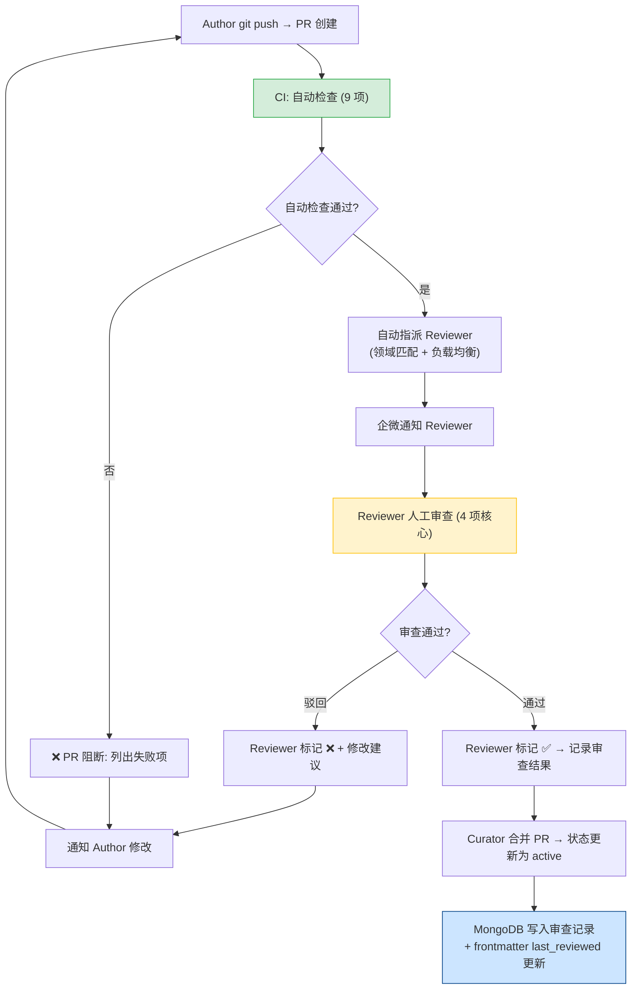

# YK-09-09: 知识质量审查工作流 — 自动化检查清单与审查 SLA 管理

> 需求编号：YK-09-09 · 优先级：P2 · 人天：1.5d · 状态：需求已编写
> 依赖：YK-09-01（Frontmatter 质量治理）、YK-09-03（命名规范自动化）

## 背景

YiKnowledge 定义了 4 个治理角色（Author/Curator/Reviewer/Archivist）和 3 个审查节奏（Daily/Weekly/Quarterly），但当前审查流程依赖策展人手动操作：

| 痛点 | 影响 |
|------|------|
| 审查分配靠人工——策展人手动指派 Reviewer，负载不均衡 | 某些 Reviewer 过载，某些闲置 |
| 审查 SLA 无追踪——`triage → active` 应在 72h 内完成，但无超时告警 | 知识文件长期停留在 `triage` 状态 |
| 检查清单执行靠人工——13 项检查逐一手动核对 | 遗漏率高（估计 ~15%），效率低 |
| 审查历史无结构化记录——谁审了什么、发现了什么问题，无数据支撑 | 无法优化审查流程 |
| 知识文件修订后无自动重新审查——Author 修改后需 Curator 手动重新触发 | 修改后的文件可能引入新问题 |

目标：将审查工作流从纯人工转型为 **自动化检查（60% 自动） + 人工审查（40% 重点）**。

---

## 一、现状分析

### 1.1 当前审查流程

```
Author git commit + push
  → CI pre-commit hook (已自动化: YK-09-01/03)
  → GitHub PR 创建
  → Curator 手动指派 Reviewer (在 PR 评论中 @mention)
  → Reviewer 手动执行 13 项检查清单
  → Reviewer 在 PR 中评论审查结果
  → Author 修改 → Reviewer 重新审查 (手动)
  → Curator 合并 PR → 状态更新为 active
```

**问题**: 步骤 2-5 均依赖人工，单文件审查耗时约 15-30 分钟。800+ 文件全量审查需 200+ 人时。

### 1.2 检查清单分解（可自动化 vs 需人工）

| # | 检查项 | 可自动化 | 自动化方式 |
|----|--------|----------|-----------|
| 1 | 文件名 kebab-case | **是** | pre-commit 正则 (YK-09-03) |
| 2 | 目录层级 ≤ 3 | **是** | CI `find -type d` 检查 |
| 3 | 8 必需 frontmatter 字段 | **是** | `python-frontmatter` 解析 (YK-09-01) |
| 4 | tags 为 YAML 数组 | **是** | YAML 解析 (YK-09-01) |
| 5 | `created`/`updated` 日期格式 | **是** | `datetime.strptime` 校验 |
| 6 | 文件编码 UTF-8 无 BOM | **是** | `file -bi` 检查 |
| 7 | 内部链接有效（无死链） | **是** | `markdown-link-check` |
| 8 | 内容长度 ≥ 200 字符 | **是** | `wc -c` 检查 |
| 9 | 标题层级合理（有且仅有一个 H1） | **是** | Markdown AST 解析 |
| 10 | 内容准确性（领域知识正确） | **否** | 需 Reviewer 领域专家判断 |
| 11 | 内容与角色目录匹配 | **否** | 需 Curator 判断 |
| 12 | 无重复内容（与已有文件对比） | 部分 | YK-09-08 依赖图谱 + RAG 相似度检测 |
| 13 | 代码示例可运行（如有） | **否** | 需 Reviewer 验证 |

**结论**: 13 项中 9 项可自动化（69%），4 项需人工。自动化后人工审查仅需关注 4 项核心判断。

### 1.3 审查 SLA 定义

| 状态转换 | SLA | 超时动作 | 当前追踪 |
|----------|-----|----------|----------|
| `inbox` → `triage` | 24h | 企业微信提醒 Curator | 无 |
| `triage` → `active` | 72h | 企业微信提醒 Reviewer + 升级到 Curator | 无 |
| `active` 内容更新后重新审查 | 72h | 同 triage → active | 无 |
| `active` → `reference` (自动) | 每日 02:00 | 无需审查（自动转换） | N/A |
| `reference` → `archived` (自动) | 每日 02:00 | 无需审查 | N/A |

---

## 二、设计决策

### 决策 1：审查分配策略 — 轮转 vs 负载均衡 vs 领域匹配

| 选项 | 公平性 | 专业度 | 实现 |
|------|--------|--------|------|
| 轮转（Round-Robin） | 高 | 低（随机分配） | 低 |
| 负载均衡（最少待审） | 中 | 中 | 中 |
| **领域匹配（基于 category/tags）** | 中 | 高 | 中 |

**选择：领域匹配 + 负载均衡兜底。** 优先根据文件的 `category` 和 `tags` 匹配有相关领域经验的 Reviewer，无可匹配 Reviewer 时回退到负载均衡。

### 决策 2：自动化检查执行时机 — pre-commit vs PR vs 定时

| 时机 | 覆盖 | 反馈速度 | 阻断能力 |
|------|------|----------|----------|
| pre-commit (已有) | 变更文件 | 秒级 | 强（阻断提交） |
| PR (GitHub Actions) | 变更文件 | 分钟级 | 强（阻断合并） |
| 定时全量扫描 | 全量文件 | 小时级 | 弱（仅告警） |

**选择：pre-commit（阻断）+ PR（阻断）+ 定时全量（告警）。** 三层各司其职。

### 决策 3：审查结果结构化 — PR 评论 vs 独立集合 vs 文件内嵌

| 选项 | 可查询 | 可追溯 | 实现 |
|------|--------|--------|------|
| PR 评论 (当前) | 低 | 中（随 PR 关闭/合并归档） | 低 |
| MongoDB 独立集合 | 高 | 高 | 中 |
| frontmatter `review_history` | 中 | 高（Git 版本控制） | 中 |

**选择：MongoDB `knowledge_reviews` 集合 + frontmatter `last_reviewed` 字段。** 结构化存储支持查询和统计，frontmatter 字段提供快速状态访问。

### 设计决策记录

| 决策 | 选项 A | 选项 B | 选项 C | 选择 | 理由 |
|------|--------|--------|--------|------|------|
| 审查分配 | 轮转 | 负载均衡 | 领域匹配 | **领域匹配+负载均衡** | 质量优先+公平兜底 |
| 自动化时机 | pre-commit | PR | 定时 | **三层** | pre-commit阻断+PR阻断+定时告警 |
| 结果存储 | PR 评论 | MongoDB | frontmatter | **MongoDB+frontmatter** | 结构化查询+快速状态 |

---

## 三、目标架构

### 3.1 审查工作流自动化



### 3.2 审查分配器

```python
# YiAi/src/domain/knowledge/review.py

from dataclasses import dataclass
from collections import defaultdict

@dataclass
class Reviewer:
    name: str
    expertise_tags: list[str]    # 领域标签
    expertise_categories: list[str]  # 领域分类
    current_review_count: int    # 当前待审数量
    max_review_capacity: int = 5  # 最大并发审查数

class ReviewAssigner:
    """基于领域匹配 + 负载均衡的审查分配器。"""

    def assign_reviewer(
        self,
        file_tags: list[str],
        file_category: str,
        reviewers: list[Reviewer],
    ) -> Reviewer | None:
        """为知识文件分配最佳 Reviewer。

        优先级:
        1. 领域匹配 (tags overlap ≥ 2 AND 容量 < max)
        2. 领域匹配 (category prefix 匹配 AND 容量 < max)
        3. 负载均衡 (容量 < max 中最少待审的)
        4. None (所有 Reviewer 满负载 → 升级到 Curator)
        """
        # 1. 领域匹配 — tags 重叠 ≥ 2
        tag_matched = [
            r for r in reviewers
            if len(set(r.expertise_tags) & set(file_tags)) >= 2
            and r.current_review_count < r.max_review_capacity
        ]
        if tag_matched:
            return min(tag_matched, key=lambda r: r.current_review_count)

        # 2. 领域匹配 — category 前缀
        cat_matched = [
            r for r in reviewers
            if any(file_category.startswith(c) for c in r.expertise_categories)
            and r.current_review_count < r.max_review_capacity
        ]
        if cat_matched:
            return min(cat_matched, key=lambda r: r.current_review_count)

        # 3. 负载均衡 — 最少待审
        available = [
            r for r in reviewers
            if r.current_review_count < r.max_review_capacity
        ]
        if available:
            return min(available, key=lambda r: r.current_review_count)

        # 4. 所有 Reviewer 满负载
        return None

    def get_reviewer_stats(self, reviewers: list[Reviewer]) -> dict:
        """审查负载统计。"""
        return {
            "total_reviewers": len(reviewers),
            "total_capacity": sum(r.max_review_capacity for r in reviewers),
            "current_load": sum(r.current_review_count for r in reviewers),
            "load_per_reviewer": [
                {"name": r.name, "current": r.current_review_count,
                 "capacity": r.max_review_capacity, "utilization":
                 r.current_review_count / r.max_review_capacity}
                for r in sorted(reviewers, key=lambda r:
                    r.current_review_count / r.max_review_capacity, reverse=True)
            ],
            "overloaded": [
                r.name for r in reviewers
                if r.current_review_count >= r.max_review_capacity
            ],
        }
```

### 3.3 审查 SLA 追踪

```python
# YiAi/src/services/knowledge/review_service.py

import asyncio
from datetime import datetime, timedelta

class ReviewSLATracker:
    """审查 SLA 追踪与超时告警。"""

    SLA_CONFIG = {
        "inbox_to_triage": {"max_hours": 24, "escalation": "curator"},
        "triage_to_active": {"max_hours": 72, "escalation": "curator"},
        "re_review": {"max_hours": 72, "escalation": "curator"},
    }

    async def check_sla_breaches(self) -> list[dict]:
        """检测所有 SLA 超时的审查任务。"""
        breaches = []
        now = datetime.utcnow()

        # 1. inbox → triage 超时
        inbox_files = await db.knowledge_files.find({
            "frontmatter.status": "inbox",
        }).to_list(None)

        for file in inbox_files:
            created = file.get("frontmatter", {}).get("created")
            if created:
                created_dt = datetime.fromisoformat(created)
                if now - created_dt > timedelta(hours=24):
                    breaches.append({
                        "file": file["path"],
                        "status": "inbox",
                        "sla": "inbox_to_triage (24h)",
                        "overdue_hours": (now - created_dt).total_seconds() / 3600,
                        "action": "notify_curator",
                    })

        # 2. triage → active 超时
        triage_files = await db.knowledge_files.find({
            "frontmatter.status": "triage",
        }).to_list(None)

        for file in triage_files:
            review = await db.knowledge_reviews.find_one({
                "file_path": file["path"],
                "status": "pending",
            }, sort=[("assigned_at", -1)])

            if review:
                assigned_at = review["assigned_at"]
                if now - assigned_at > timedelta(hours=72):
                    breaches.append({
                        "file": file["path"],
                        "status": "triage",
                        "reviewer": review["reviewer"],
                        "sla": "triage_to_active (72h)",
                        "overdue_hours": (now - assigned_at).total_seconds() / 3600,
                        "action": "notify_reviewer_and_curator",
                    })

        return breaches

    async def send_sla_alerts(self, breaches: list[dict]) -> None:
        """发送 SLA 超时告警。"""
        for breach in breaches:
            if breach["action"] == "notify_curator":
                await wework.send_message(
                    f"[Knowledge SLA] {breach['file']} 在 {breach['status']} "
                    f"状态停留 {breach['overdue_hours']:.1f}h, "
                    f"超过 {breach['sla']} SLA"
                )
            elif breach["action"] == "notify_reviewer_and_curator":
                await wework.send_message(
                    f"[Knowledge SLA] {breach['file']} 等待 {breach['reviewer']} "
                    f"审查已 {breach['overdue_hours']:.1f}h, "
                    f"超过 {breach['sla']} SLA, 已升级到 Curator"
                )
```

### 3.4 审查结果结构化存储

```python
# 审查结果写入 MongoDB knowledge_reviews 集合
review_record = {
    "file_path": "projects/yivad/requirements/2026-09/00-需求-需求总览.md",
    "reviewer": "陈铭",
    "assigned_at": "2026-09-09T10:00:00Z",
    "completed_at": "2026-09-09T11:30:00Z",
    "status": "approved",  # approved | rejected | changes_requested
    "auto_checks": {
        "all_passed": True,
        "failed_items": [],  # 如有失败的自动检查项，列出
    },
    "manual_review": {
        "accuracy": "pass",          # 内容准确性
        "category_match": "pass",    # 角色目录匹配
        "duplicate_check": "pass",   # 无重复内容
        "code_examples": "n/a",      # 无代码示例
        "comments": "整体质量良好，建议补充更多实施细节",
    },
    "quality_score_delta": +0.02,   # 审查后质量评分变化
}
```

---

## 四、具体改动

### 4.1 新增文件

| 文件 | 说明 |
|------|------|
| `YiAi/src/domain/knowledge/review.py` | 审查分配器 + 领域匹配逻辑 |
| `YiAi/src/services/knowledge/review_service.py` | 审查工作流 RPC + SLA 追踪 |
| `.github/workflows/knowledge-review.yml` | CI 自动检查 9 项 |

### 4.2 修改文件

| 文件 | 改动 |
|------|------|
| `YiAi/src/domain/knowledge/watcher.py` | 文件状态变更时触发审查分配 |
| MongoDB | 新增 `knowledge_reviews` 集合 |

---

## 五、实施步骤

| 步骤 | 内容 | 验证方式 | 人天 |
|------|------|------|------|
| 1 | 新增 CI 9 项自动化检查 workflow | PR 创建 → CI 自动检查 → 失败项展示 | 0.5 |
| 2 | 新增 `ReviewAssigner` 领域匹配分配 | 提交文件 → 自动指派最佳 Reviewer | 0.5 |
| 3 | 新增 `ReviewSLATracker` 超时告警 | 文件停留超时 → 企微通知 | 0.25 |
| 4 | 新增 MongoDB `knowledge_reviews` 集合 | 审查记录结构化存储 + 可查询 | 0.25 |

**总计：1.5d**

---

## 六、测试规格

### Requirement: 审查分配

#### Scenario: 领域匹配
- **Given** 文件 `tags: [RAG, 混合检索, BM25]`，Reviewer A 擅长 RAG，Reviewer B 擅长前端
- **When** `assign_reviewer()` 执行
- **Then** 返回 Reviewer A（tags overlap = 2）

#### Scenario: 满负载回退
- **Given** 所有 Reviewer 当前待审数 = max_capacity
- **When** `assign_reviewer()` 执行
- **Then** 返回 `None` → 升级到 Curator

### Requirement: SLA 追踪

#### Scenario: inbox 超时
- **Given** 文件在 `inbox` 状态停留 25h
- **When** `check_sla_breaches()` 执行
- **Then** 返回超时记录，action = `notify_curator`

---

## 七、可观测性

| 指标 | 告警阈值 | 说明 |
|------|----------|------|
| 审查队列深度 | > 10 个文件 | 审查积压 |
| SLA 合规率 | < 90% | 超时审查占比 |
| 自动化通过率 | < 80% | 文件质量基线 |
| Reviewer 负载不均衡 | max/min utilization > 3× | 分配策略需调整 |

---

*PRD 来源: `projects/yiknowledge/requirements/2026-09/09-需求-知识质量审查工作流.md`*