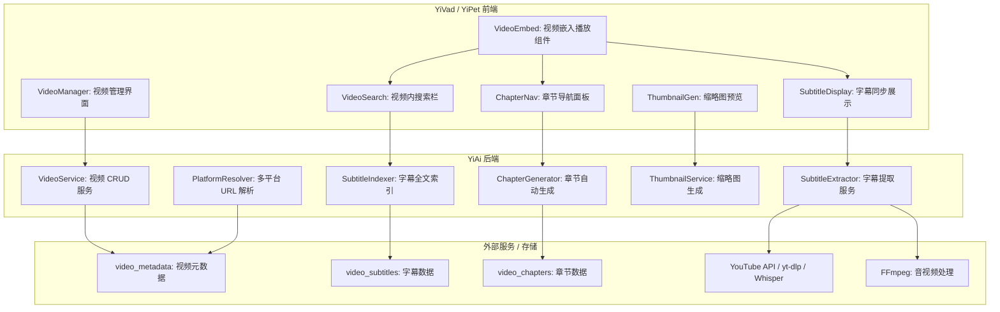
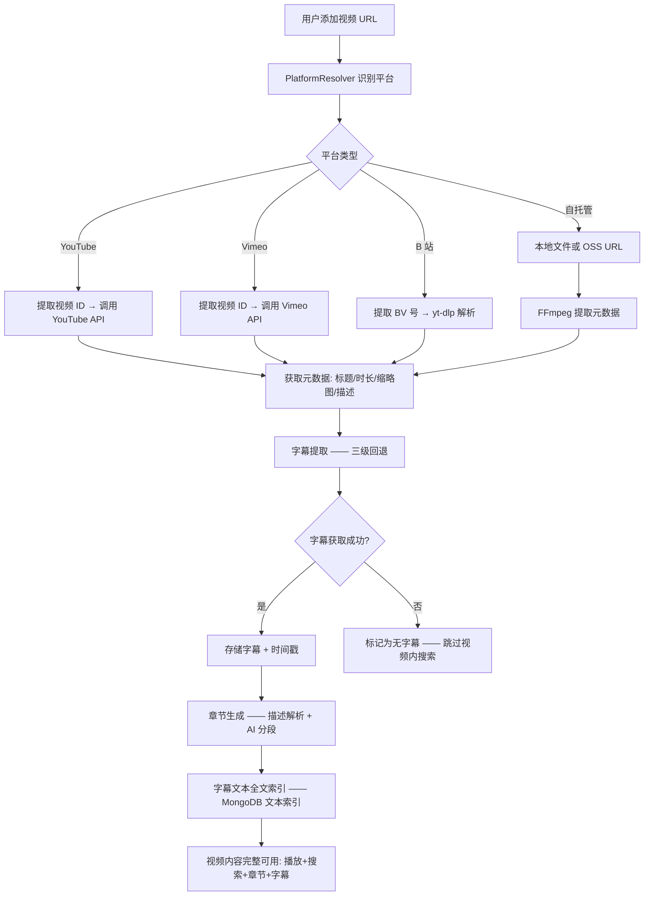

# YK-09-140: 视频内容管理 — 视频嵌入和内容管理、视频字幕提取、基于字幕的视频内搜索、视频章节标记、缩略图生成、支持平台 YouTube/Vimeo/自托管

> 需求编号：YK-09-140 · 优先级：P2 · 人天：0.3d · 状态：需求已编写
> 依赖：YK-09-117（多媒体内容管理，提供多媒体文件管理基础）、YK-09-15（多模态内容支持，提供向量检索基础）

## 背景

### 问题陈述

YiKnowledge 知识库目前是纯文本（Markdown）——所有的知识都以文字形式存储。但很多团队的知识资产是视频形式的——架构讲解的录屏、Sprint Review 的回放、技术分享的录像、产品 Demo 的视频。这些视频内容目前完全不在知识库的管理范围内——团队将其存储在 YouTube 私享链接、Google Drive、或本地文件夹中，无法检索、无法关联、无法作为 RAG 的知识源。

1. **视频分散**：30 个技术分享视频分布在 YouTube 私享、B 站、Google Drive——无统一管理
2. **视频不可搜索**：想看"微服务拆分的那次分享"——只知道视频存在，不知道在哪、不知道具体在几分几秒
3. **字幕无索引**：视频有字幕但没有提取为文本——RAG 无法检索视频内容
4. **章节缺失**：1 小时的视频没有章节标记——只能快进/快退寻找特定片段
5. **平台依赖**：不同平台的视频嵌入方式不同——无统一的嵌入组件

**核心矛盾**：视频是重要的知识载体——但当前的知识库只能管理文本——视频内容对于检索和 RAG 完全不可见。

### 影响范围

| # | 影响 | 严重程度 | 典型场景 |
|---|------|----------|----------|
| 1 | 视频知识不可检索 | 高 | 新人入职想找"CI/CD 配置那次的录屏分享"——翻遍聊天记录找不到 |
| 2 | 知识资产丢失 | 中 | 重要分享的录像链接过期——内容永远丢失 |
| 3 | 视频浏览低效 | 中 | 1 小时技术分享——观众想跳到"Q&A 环节"——反复拖进度条 |
| 4 | RAG 视界受限 | 中 | llama_index RAG 只能检索文本——视频中的口述内容不可检索 |
| 5 | 多平台嵌入不一致 | 低 | YouTube → iframe, B 站 → 不同 embed URL, 本地 → video tag |

### 挑战

| 挑战 | 说明 |
|------|------|
| 字幕提取 | YouTube/Vimeo 的字幕获取需要 API 密钥或爬虫——可能受限制 |
| 视频内搜索精度 | 字幕文本的时间戳精度决定搜索结果的跳转精度——不同平台精度不同 |
| 自托管视频存储 | 视频文件体积大（500MB-2GB）——不适合存储在 MongoDB 或 OSS |
| 多平台嵌入 | 不同平台的 embed URL 格式不同——需要平台特定的解析和验证 |
| 缩略图生成 | 自托管视频需要提取帧作为缩略图——需要 FFmpeg 等工具 |

---

## 一、现状分析

### 1.1 当前视频管理能力

```
现有功能:
├── YK-09-117 多媒体内容管理
│   └── 多媒体文件存储和引用
├── Markdown 图片嵌入
│   └──  语法
├── YiAi static_files
│   └── 文件存储（无视频特殊处理）

缺失:
├── 视频嵌入组件（YouTube/Vimeo/自托管）      # ❌ 不存在
├── 字幕提取和文本索引                         # ❌ 不存在
├── 视频内搜索（基于字幕时间戳）               # ❌ 不存在
├── 视频章节标记                               # ❌ 不存在
├── 缩略图自动生成                             # ❌ 不存在
├── 视频元数据管理（时长/分辨率/平台）         # ❌ 不存在
├── 视频播放进度追踪                           # ❌ 不存在
├── 视频字幕同步展示                           # ❌ 不存在
└── 视频 RAG 检索（字幕文本向量化）            # ❌ 不存在
```

### 1.2 视频管理流（现状 vs 目标）

```mermaid
graph TD
    subgraph Current["现状：散落的视频"]
        C1[录屏/分享完成] --> C2[上传到 YouTube/B 站/Drive]
        C2 --> C3[分享链接到聊天]
        C3 --> C4[几周后——链接埋在聊天记录中]
        C4 --> C5[需要查找时——翻聊天记录]
        C5 --> C6{记得关键词?}
        C6 -->|记得| C7[搜索聊天记录 → 可能找到]
        C6 -->|不记得| C8[找不到——以为丢了]
    end

    subgraph Target["目标：视频作为知识内容"]
        T1[录屏/分享完成] --> T2[在 YiKnowledge 中创建视频条目]
        T2 --> T3[填入视频 URL 或上传文件]
        T3 --> T4[系统自动: 提取元数据+字幕]
        T4 --> T5[创建章节标记]
        T5 --> T6[字幕文本索引——RAG 可检索]
        T6 --> T7[读者浏览知识库 → 找到视频]
        T7 --> T8[可直接在页面内播放]
        T8 --> T9[搜索视频内关键词 → 跳转到对应时间]
        T9 --> T10[字幕同步展示 + 章节导航]
    end

    style Current fill:#f8d7da,stroke:#dc3545
    style Target fill:#d4edda,stroke:#28a745
```



### 1.3 根因矩阵

| 症状 | 根因 | 触发条件 | 频率 |
|------|------|----------|------|
| 找不到视频 | 视频不在知识库管理范围 | 查找特定视频时 | 高 |
| 无法视频内搜索 | 字幕未提取为可搜索文本 | 想找视频中的某个知识点时 | 高 |
| 长视频低效浏览 | 无章节标记 | 1 小时+的技术分享 | 中 |
| 视频过期 | 第三方平台链接失效或权限变更 | 跨月度回顾时 | 中 |
| RAG 盲区 | 视频内容未向量化 | 检索"微服务架构"时 | 中 |

---

## 二、设计决策

### 决策 1：视频存储 — 仅外部引用 vs 自托管 vs 混合

| 选项 | 存储成本 | 可用性 | 字幕提取难度 |
|------|---------|--------|------------|
| 仅外部引用（URL 指向 YouTube/Vimeo/B 站） | 零 | 依赖外部平台 | 中（需平台 API） |
| 自托管（视频文件存储在 OSS/本地磁盘） | 高（GB 级存储） | 自主可控 | 高（需 FFmpeg 处理） |
| 混合（外部引用为主 + 自托管可选） | 低-中 | 高（有回退方案） | 中 |

**选择：混合——外部引用为主 + 自托管备份。** 外部平台引用是默认方式——大多数视频已经在 YouTube 或 B 站。系统存储外部平台的 URL 和 embed URL，不存储视频文件。对于内部保密内容（如架构评审录屏），提供自托管上传选项——视频文件存储在 YiAi 的 OSS 中（或本地 `data/videos/` 目录）。自托管视频通过 FFmpeg 提取音频、生成字幕（Whisper 模型）、生成缩略图。

### 决策 2：字幕提取 — YouTube API vs yt-dlp vs 手动上传 vs Whisper

| 选项 | 覆盖范围 | 质量 | 速率限制 |
|------|---------|------|---------|
| YouTube Data API v3 | 仅 YouTube | 高（官方字幕） | 有（10000 单位/天） |
| yt-dlp（开源下载器） | YouTube/B 站/多平台 | 高（可下载字幕） | 无（但有反爬风险） |
| 手动上传（用户上传 .srt/.vtt） | 所有平台 | 取决于用户 | 无 |
| Whisper（ASR 自动语音识别） | 所有视频（需音频） | 中高（多语言） | 本地 GPU/CPU |

**选择：YouTube API + yt-dlp + Whisper 三级回退。** (1) 优先使用 YouTube API——如果视频是 YouTube 链接且有官方字幕；(2) 如果 YouTube API 不可用或视频在其他平台——使用 yt-dlp 下载字幕；(3) 如果以上两种方式无法获取字幕——使用 Whisper（通过 YiAi 的 Ollama 或本地 Whisper 模型）从视频音频中生成字幕。Whisper 是最"普适"的方案——适用于任何有音频的视频——但成本最高（计算资源）。

### 决策 3：视频内搜索 — 前端实时 vs 后端索引 vs 混合

| 选项 | 延迟 | 精度 | 索引维护 |
|------|------|------|---------|
| 前端实时（加载时获取所有字幕，本地搜索） | 极低（内存搜索） | 中（文本匹配） | 无 |
| 后端索引（字幕文本建全文索引，后端查询） | 低 | 高（文本搜索+模糊） | 有（字幕更新时重建） |
| 混合（后端建索引 + 前端缓存+实时过滤） | 低 | 高 | 有 |

**选择：混合——后端全文索引 + 前端缓存。** 视频的字幕文本在后端通过 MongoDB 文本索引（或 Elasticsearch）建立全文搜索索引。搜索结果返回匹配片段及其时间戳。前端在用户连续键入时使用本地缓存（当前视频的所有字幕已加载到内存）做增量过滤——减少后端请求次数。混合方案结合了后端索引的精度和前端缓存的低延迟。

### 决策 4：章节标记 — 手动标注 vs AI 自动分段 vs 视频描述提取

| 选项 | 准确性 | 人工成本 | 覆盖完整性 |
|------|--------|---------|-----------|
| 手动标注（用户在视频管理界面标记章节） | 高（人工定义） | 中 | 低（用户可能不做） |
| AI 自动分段（LLM 分析字幕文本 → 识别主题转换） | 中高 | 无 | 高（只要有字幕） |
| 视频描述提取（解析 YouTube 视频描述中的时间戳） | 中（依赖创作者标注） | 无 | 中（依赖创作者习惯） |

**选择：视频描述提取 + AI 自动分段 + 手动修正。** (1) 如果视频是 YouTube 链接——解析描述中的时间戳标记（如 "00:00 Intro, 05:30 Architecture, 15:00 Demo"），这是最准确的来源（创作者定义）；(2) 如果无描述时间戳——使用 LLM 分析字幕文本，识别主题转换点（通过语义变化、标题式语句、"接下来我们讲..."等过渡词）；(3) 用户可以手动编辑/添加章节。

### 设计决策总结

| 决策 | 选项 A | 选项 B | 选项 C | 选择 | 理由 |
|------|--------|--------|--------|------|------|
| 视频存储 | 仅外部引用 | 自托管 | 混合 | **混合** | 覆盖公开+内部场景 |
| 字幕提取 | YouTube API | yt-dlp | Whisper | **三级回退** | 渐进式覆盖 |
| 视频内搜索 | 前端实时 | 后端索引 | 混合 | **混合** | 精度+低延迟 |
| 章节标记 | 手动标注 | AI 分段 | 描述提取 | **描述+AI+手动** | 三级互补 |

---

## 三、目标架构

### 3.1 视频内容管理系统架构



### 3.2 视频索引流程



### 3.3 性能指标

| 指标 | 目标值 | 说明 |
|------|--------|------|
| 视频元数据获取 | < 2s | 外部 API 调用 |
| 字幕提取（YouTube API） | < 3s | API 请求 + 解析 |
| 字幕提取（Whisper 10 分钟音频） | < 2min | 本地 GPU 推理 |
| 字幕文本索引（1000 条字幕） | < 1s | MongoDB 批量 insert |
| 视频内搜索（前端缓存） | < 50ms | 内存过滤 |
| 视频内搜索（后端索引） | < 200ms | 文本索引查询 |
| 章节生成（AI 分段 1 小时字幕） | < 5s | LLM 分析 |

---

## 四、具体改动

### 4.1 核心类型定义

```typescript
// YiVad: src/views/videos/types.ts (新增)

export type VideoPlatform = 'youtube' | 'vimeo' | 'bilibili' | 'self_hosted' | 'other';

export interface VideoMetadata {
  id: string;
  title: string;
  description: string;
  platform: VideoPlatform;
  sourceUrl: string;             // 原始 URL
  embedUrl: string;              // 嵌入 URL
  videoId: string;               // 平台特定 ID（YouTube=video_id, B站=BV号）
  duration: number;              // 秒
  thumbnailUrl: string;
  uploadedAt?: string;
  channelName?: string;
  channelUrl?: string;
  viewCount?: number;
  likeCount?: number;
  // 自托管特有
  fileSize?: number;             // 字节
  resolution?: string;           // "1920x1080"
  filePath?: string;             // 本地/OSS 路径
  // 知识库元数据
  tags: string[];
  category: string;
  knowledgeFilePath?: string;    // 关联到 YiKnowledge 的 .md 文件
}

export interface Subtitle {
  id: string;
  videoId: string;
  language: string;              // 'zh-CN', 'en-US', 'auto'
  source: 'youtube_api' | 'yt_dlp' | 'whisper' | 'manual';
  cues: SubtitleCue[];
  createdAt: string;
}

export interface SubtitleCue {
  index: number;
  startTime: number;             // 秒
  endTime: number;               // 秒
  text: string;
}

export interface VideoChapter {
  id: string;
  videoId: string;
  title: string;
  startTime: number;             // 秒
  endTime: number;               // 秒
  thumbnailUrl?: string;
  source: 'description' | 'ai_segmented' | 'manual';
  order: number;
}

export interface VideoSearchResult {
  cue: SubtitleCue;
  chapter?: VideoChapter;
  context: string;               // 前后各一条 cue 的上下文
  score: number;
  videoId: string;
  videoTitle: string;
}

export interface VideoEmbedProps {
  videoId: string;
  platform: VideoPlatform;
  embedUrl: string;
  autoplay?: boolean;
  startTime?: number;            // 起始时间（秒）
  showSubtitles?: boolean;
  subtitleLanguage?: string;
}

export interface VideoManagerState {
  videos: VideoMetadata[];
  selectedVideo: VideoMetadata | null;
  searchQuery: string;
  searchResults: VideoSearchResult[];
  isIndexing: boolean;
  indexingProgress: number;      // 0-100
}
```

### 4.2 后端视频字幕提取服务

```python
# YiAi: services/video/subtitle_extractor.py (新增)

import json
import subprocess
import tempfile
from datetime import datetime, timezone
from typing import Optional

import requests
from motor.motor_asyncio import AsyncIOMotorDatabase


class SubtitleExtractor:
    """视频字幕提取服务——三级回退"""

    def __init__(self, db: AsyncIOMotorDatabase,
                 youtube_api_key: str = "",
                 whisper_model: str = "base"):
        self.db = db
        self.youtube_api_key = youtube_api_key
        self.whisper_model = whisper_model

    async def extract(self, video: dict) -> dict:
        """提取字幕——三级回退"""
        platform = video.get("platform", "")
        video_id = video.get("videoId", "")
        source_url = video.get("sourceUrl", "")

        # 第 1 级: YouTube API
        if platform == "youtube" and self.youtube_api_key:
            result = await self._extract_youtube(video_id)
            if result:
                return self._format_result(result, "youtube_api")

        # 第 2 级: yt-dlp
        if platform in ("youtube", "bilibili", "vimeo"):
            result = await self._extract_ytdlp(source_url)
            if result:
                return self._format_result(result, "yt_dlp")

        # 第 3 级: Whisper ASR
        result = await self._extract_whisper(source_url, platform)
        if result:
            return self._format_result(result, "whisper")

        return {"success": False, "reason": "所有提取方式均失败"}

    async def _extract_youtube(self, video_id: str) -> Optional[list[dict]]:
        """通过 YouTube Data API 获取字幕"""
        # 获取字幕列表
        captions_url = (
            f"https://www.googleapis.com/youtube/v3/captions"
            f"?videoId={video_id}&key={self.youtube_api_key}&part=snippet"
        )
        try:
            resp = requests.get(captions_url, timeout=10)
            data = resp.json()
            items = data.get("items", [])

            # 优先中文/英文字幕
            preferred = [c for c in items
                        if c["snippet"]["language"] in ("zh-CN", "zh", "en")]
            if preferred:
                # 下载首选字幕（需 OAuth 或使用 yt-dlp fallback）
                pass  # YouTube 下载字幕需要 OAuth——这里走 yt-dlp
            return None  # fall through to yt-dlp
        except Exception:
            return None

    async def _extract_ytdlp(self, url: str) -> Optional[list[dict]]:
        """使用 yt-dlp 下载字幕"""
        with tempfile.NamedTemporaryFile(suffix=".vtt", delete=False) as f:
            output_path = f.name

        try:
            cmd = [
                "yt-dlp",
                "--write-auto-subs",     # 自动生成字幕
                "--sub-langs", "zh-Hans,en,zh",
                "--convert-subs", "vtt",
                "--skip-download",        # 不下载视频
                "--output", output_path.replace(".vtt", ""),
                url,
            ]
            result = subprocess.run(cmd, capture_output=True, text=True, timeout=60)

            if result.returncode == 0:
                # 解析 VTT 文件转换为 cues
                return self._parse_vtt(output_path)
        except Exception:
            pass
        return None

    async def _extract_whisper(self, url: str, platform: str) -> Optional[list[dict]]:
        """使用 Whisper 从音频中生成字幕"""
        # 下载音频
        with tempfile.NamedTemporaryFile(suffix=".mp3", delete=False) as f:
            audio_path = f.name

        try:
            if platform == "self_hosted":
                # 直接用 FFmpeg 提取音频
                cmd = [
                    "ffmpeg", "-i", url, "-vn", "-acodec", "libmp3lame",
                    "-q:a", "2", audio_path, "-y"
                ]
                subprocess.run(cmd, capture_output=True, timeout=120)
            else:
                # 使用 yt-dlp 下载音频
                cmd = [
                    "yt-dlp", "-x", "--audio-format", "mp3",
                    "--audio-quality", "0",
                    "-o", audio_path.replace(".mp3", ".%(ext)s"),
                    url,
                ]
                subprocess.run(cmd, capture_output=True, timeout=120)

            # Whisper 转文字
            # 使用 whisper CLI 或 Python whisper 库
            cmd = [
                "whisper", audio_path,
                "--model", self.whisper_model,
                "--language", "zh",
                "--output_format", "json",
                "--output_dir", "/tmp",
            ]
            result = subprocess.run(cmd, capture_output=True, text=True, timeout=300)

            if result.returncode == 0:
                # 读取 JSON 输出并转换为 cues
                json_path = audio_path.replace(".mp3", ".json")
                with open(json_path) as jf:
                    whisper_data = json.load(jf)
                return self._whisper_to_cues(whisper_data)
        except Exception:
            pass
        return None

    def _format_result(self, cues: list[dict], source: str) -> dict:
        return {
            "success": True,
            "source": source,
            "cues": cues,
            "extractedAt": datetime.now(timezone.utc).isoformat(),
        }

    def _parse_vtt(self, vtt_path: str) -> list[dict]:
        """解析 VTT 字幕文件为 cues"""
        cues = []
        try:
            import webvtt
            for i, caption in enumerate(webvtt.read(vtt_path)):
                cues.append({
                    "index": i,
                    "startTime": caption.start_in_seconds,
                    "endTime": caption.end_in_seconds,
                    "text": caption.text.replace("\n", " ").strip(),
                })
        except ImportError:
            # fallback: 手动解析
            with open(vtt_path) as f:
                content = f.read()
            cues = self._manual_vtt_parse(content)
        return cues

    def _manual_vtt_parse(self, content: str) -> list[dict]:
        """简单 VTT 解析（不依赖 webvtt 库）"""
        cues = []
        lines = content.strip().split("\n")
        i = 0
        cue_index = 0
        while i < len(lines):
            line = lines[i].strip()
            if "-->" in line:
                times = line.split(" --> ")
                start = self._timestamp_to_seconds(times[0])
                end = self._timestamp_to_seconds(times[1])
                text_lines = []
                i += 1
                while i < len(lines) and lines[i].strip():
                    text_lines.append(lines[i].strip())
                    i += 1
                cues.append({
                    "index": cue_index,
                    "startTime": start,
                    "endTime": end,
                    "text": " ".join(text_lines),
                })
                cue_index += 1
            else:
                i += 1
        return cues

    def _whisper_to_cues(self, whisper_data: dict) -> list[dict]:
        """Whisper JSON → cues"""
        cues = []
        for i, segment in enumerate(whisper_data.get("segments", [])):
            cues.append({
                "index": i,
                "startTime": segment["start"],
                "endTime": segment["end"],
                "text": segment["text"].strip(),
            })
        return cues

    def _timestamp_to_seconds(self, ts: str) -> float:
        parts = ts.strip().split(":")
        if len(parts) == 3:
            h, m, s = parts
            return int(h) * 3600 + int(m) * 60 + float(s)
        elif len(parts) == 2:
            m, s = parts
            return int(m) * 60 + float(s)
        return 0.0
```

### 4.3 文件变更清单

| 文件 | 操作 | 说明 |
|------|------|------|
| `YiVad: src/views/videos/types.ts` | 新增 | 视频类型定义 |
| `YiVad: src/components/VideoEmbed.vue` | 新增 | 多平台视频嵌入播放组件 |
| `YiVad: src/components/VideoSearch.vue` | 新增 | 视频内搜索栏 |
| `YiVad: src/components/ChapterNav.vue` | 新增 | 章节导航面板 |
| `YiVad: src/components/SubtitleOverlay.vue` | 新增 | 字幕同步展示 |
| `YiVad: src/views/videos/VideoManager.vue` | 新增 | 视频管理界面 |
| `YiVad: src/views/videos/VideoDetail.vue` | 新增 | 视频详情页 |
| `YiAi: services/video/video_service.py` | 新增 | 视频 CRUD 服务 |
| `YiAi: services/video/subtitle_extractor.py` | 新增 | 字幕提取（三级回退） |
| `YiAi: services/video/subtitle_indexer.py` | 新增 | 字幕全文索引 |
| `YiAi: services/video/chapter_generator.py` | 新增 | 章节自动生成 |
| `YiAi: services/video/platform_resolver.py` | 新增 | 多平台 URL 解析 |
| `YiAi: services/video/thumbnail_service.py` | 新增 | 缩略图生成 |
| `requirements.txt` | 修改 | 添加 webvtt（可选）, yt-dlp |

---

## 五、实施步骤

| 步骤 | 操作 | 路径 | 验证 | 人天 |
|------|------|------|------|------|
| 1 | 定义类型和多平台常量 | `src/views/videos/types.ts` | TypeScript 通过 | 0.02 |
| 2 | 实现多平台 URL 解析 | `platform_resolver.py` | YouTube/B站/Vimeo URL 提取 videoId | 0.02 |
| 3 | 实现字幕提取（三级回退） | `subtitle_extractor.py` | YouTube → yt-dlp → Whisper 测试 | 0.05 |
| 4 | 实现字幕全文索引 | `subtitle_indexer.py` | MongoDB 文本索引查询 | 0.02 |
| 5 | 实现章节生成 | `chapter_generator.py` | 描述解析 + AI 分段 | 0.03 |
| 6 | 实现视频嵌入播放组件 | `VideoEmbed.vue` | YouTube/Vimeo/B站/自托管 嵌入 | 0.04 |
| 7 | 实现视频内搜索 | `VideoSearch.vue` | 关键词 → 时间戳跳转 | 0.03 |
| 8 | 实现章节导航+字幕 | `ChapterNav.vue` + `SubtitleOverlay.vue` | 点击章节跳转+字幕同步 | 0.03 |
| 9 | 实现视频管理界面 | `VideoManager.vue` + `VideoDetail.vue` | 添加/浏览/搜索视频 | 0.03 |
| 10 | 实现缩略图生成 | `thumbnail_service.py` | 自托管视频 FFmpeg 提取帧 | 0.02 |

**总人天：0.3d**

---

## 六、测试规格

### 场景 1：添加 YouTube 视频

**GIVEN** 用户有一个 YouTube 技术分享链接
**WHEN** 在视频管理页面输入链接并提交
**THEN** 系统识别为 YouTube 平台，提取 videoId
**AND** 调用 YouTube API 获取标题/描述/时长/缩略图
**AND** 尝试提取字幕（中文优先，英文备选）
**AND** 解析视频描述中的时间戳作为章节
**AND** 字幕文本建立全文索引
**AND** 视频卡片显示在知识库中

### 场景 2：视频内搜索

**GIVEN** 一个 30 分钟的架构讲解视频已索引字幕
**WHEN** 用户在视频搜索栏输入"Docker 部署"
**THEN** 系统返回字幕中包含"Docker 部署"的片段列表
**AND** 每个结果显示：时间戳（如 12:35）、匹配文本片段、前后文
**AND** 点击任意结果——视频跳转到该时间点（±1 秒精度）
**AND** 搜索结果高亮匹配的关键词

### 场景 3：章节导航

**GIVEN** 视频有 5 个章节：00:00 介绍、05:00 架构、12:00 Demo、22:00 Q&A、28:00 总结
**WHEN** 用户点击"Demo"章节
**THEN** 视频跳转到 12:00 并开始播放
**AND** 章节导航中"Demo"高亮显示
**AND** 播放到 22:00 时自动切换到"Q&A"章节高亮

### 场景 4：字幕同步展示

**GIVEN** 视频有中文字幕
**WHEN** 用户开启字幕显示，视频播放到 5:30
**THEN** 当前字幕文本高亮显示："微服务的核心是服务的独立部署和扩展"
**AND** 播放到 5:35 时字幕自动更新为下一条
**AND** 用户可以点击任意一条字幕——视频跳转到该字幕的开始时间
**AND** 关闭字幕——字幕面板隐藏

### 场景 5：RAG 检索视频内容

**GIVEN** 视频字幕已向量化并存入 RAG 索引
**WHEN** 用户在知识检索中输入"微服务通信方式"
**THEN** 检索结果中包含该视频（命中字幕中的相关片段）
**AND** 结果显示视频标题、命中时间点、命中文本片段
**AND** 点击结果——打开视频详情页并跳转到具体时间

### 场景 6：自托管视频

**GIVEN** 用户上传一个内部架构评审的 .mp4 文件（500MB）
**WHEN** 文件上传完成，系统开始处理
**THEN** FFmpeg 提取视频元数据（时长/分辨率）
**AND** 提取中间帧作为缩略图
**AND** Whisper 从音频生成中文字幕
**AND** 生成的字幕建立全文索引
**AND** 视频通过 HTML5 `<video>` 标签播放

---

## 七、风险与缓解

| 风险 | 概率 | 影响 | 缓解措施 |
|------|------|------|----------|
| YouTube API 配额耗尽 | 中 | 中 | 使用 yt-dlp 作为 fallback；对已索引的视频缓存元数据不重复查询 |
| yt-dlp 被反爬或下载速度慢 | 中 | 中 | 添加 User-Agent 伪装 + 速率限制；仅下载字幕不下载视频 |
| Whisper 对技术术语识别不佳 | 中 | 中 | 使用自定义词汇表（Whisper `--initial_prompt`）提高术语识别率 |
| 大视频文件上传超时 | 中 | 中 | 分片上传 + 异步处理；大于 2GB 的视频提示用户使用 YouTube 私有链接 |
| 字幕时间偏移（某些平台字幕延迟 1-3 秒） | 低 | 低 | 字幕时间戳容许 ±2 秒误差；视频搜索跳转时允许用户手动微调 |

---

## 八、回滚策略

| 场景 | 回滚操作 | 影响 |
|------|----------|------|
| yt-dlp 被 YouTube 封禁 | 切换为仅 YouTube API 模式——或要求用户手动上传字幕 | 自动字幕提取失效 |
| Whisper 处理过于缓慢（影响系统资源） | 关闭 Whisper fallback——仅使用 API/yt-dlp | 无字幕的视频无法自动生成 |
| 视频嵌入组件兼容性问题 | 降级为纯链接跳转（点击跳转外部平台播放） | 失去站内播放体验 |

---

## 九、设计决策记录

### D-01：为什么字幕提取需要三级回退而非单一方案？

单一方案有盲区——YouTube API 需要配额且不支持 B 站；yt-dlp 依赖开源维护者跟进平台的反爬更新；Whisper 消耗计算资源。三级回退提供了弹性——在任一方案不可用时自动降级，确保最多的视频能获得字幕。优先级设计是"快+免费 > 慢+免费 > 慢+计算资源"。

### D-02：为什么视频文件不强制存储在 MongoDB 中？

视频文件体积在 100MB-2GB 范围——MongoDB 的文档最大限制为 16MB（GridFS 可突破但有性能代价）。视频存储使用文件系统或 OSS 是更自然的选择——MongoDB 存储轻量级的视频元数据（标题/时长/URL/字幕等 < 1MB），视频文件本身存储在 `data/videos/` 目录或 OSS bucket 中。

### D-03：为什么视频内搜索不跳转到精确的毫秒而是"±1 秒精度"？

字幕时间戳的精度因平台和生成方式不同——YouTube 官方字幕通常精确到 0.1 秒，Whisper 生成的片段通常是 2-5 秒的 chunk。统一保证"±1 秒精度"是一个务实的准确度承诺——足够让用户找到目标内容（通常视频的一个知识点持续 30 秒以上），而不需要过度精确的时间控制。

### D-04：为什么章节生成使用 AI 分析字幕而非仅依赖视频描述？

视频描述中的时间戳是可选的——创作者不一定添加（尤其在 B 站，常见的是"00:00"标记）。AI 分析字幕提供了普适的方案——分析转录文本中的主题转移、过渡词、问题引入等模式来自动分段。但 AI 分段可能不完美——所以用户可以手动修正。描述 > AI > 手动 的三级互补覆盖了大多数场景。

---

## 十、可观测性

### 指标

| 指标 | 类型 | 说明 |
|------|------|------|
| `video.added` | Counter | 视频添加数（按平台） |
| `video.subtitle_extracted` | Counter | 字幕提取数（按方式） |
| `video.subtitle_extraction_duration` | Histogram | 字幕提取耗时（按方式） |
| `video.search_query` | Counter | 视频内搜索次数 |
| `video.chapter_generated` | Counter | 章节生成数（按方式） |
| `video.thumbnail_generated` | Counter | 缩略图生成数 |

### 告警

| 告警 | 条件 | 级别 |
|------|------|------|
| 字幕提取全失败率过高 | 24h 内字幕提取失败率 > 50% | WARN |
| YouTube API 配额接近耗尽 | 日配额使用 > 80% | WARN |
| Whisper 处理堆积 | 待处理视频 > 20 | INFO |
| 视频文件存储超过限制 | 磁盘使用率 > 80% | WARN |

---

## 十一、代码审查检查清单

- [ ] VideoEmbed: 切换平台时销毁前一个播放器实例（防止多个视频同时播放）
- [ ] VideoEmbed: YouTube Player API 异步加载，使用 `onYouTubeIframeAPIReady` 回调
- [ ] VideoSearch: 搜索去抖 300ms（减少打字时的搜索请求）
- [ ] VideoSearch: 搜索结果的高亮使用 `<mark>` 标签
- [ ] ChapterNav: 当前章节高亮通过 `timeupdate` 事件实时更新
- [ ] SubtitleOverlay: 字幕文本过长时自动换行（max-width 80% of video）
- [ ] subtitle_extractor: yt-dlp 执行使用 subprocess timeout（防止进程挂起）
- [ ] subtitle_extractor: Whisper 处理异步——视频添加后立即返回，后台处理
- [ ] subtitle_extractor: VTT 文件清洗——去除样式标签和 HTML 实体
- [ ] subtitle_indexer: MongoDB 文本索引字段为 `cues.text`（数组字段）
- [ ] chapter_generator: AI 分段 prompt 要求输出 JSON 格式 `[{title, startTime}]`
- [ ] platform_resolver: URL 正则覆盖 YouTube 短链（youtu.be）、B站 BV 号、Vimeo 标准 URL

---

## 回归问题预测

| # | 预测问题 | 原因 | 验证方法 |
|---|---------|------|---------|
| 1 | YouTube 视频的嵌入 URL 需要 `enablejsapi=1` 才能通过 JS API 控制播放（跳转时间、获取状态）——但系统拼接 embed URL 时遗漏了这个参数 | YouTube IFrame API 需要显式开启 JS API——否则 `player.seekTo()` 无效 | 拼接 embed URL 时始终附加 `?enablejsapi=1&origin=...` 参数 |
| 2 | B站视频的嵌入受防盗链限制——在某些环境下（如 localhost）无法嵌入播放 | B站 embed 需要在 `bilibili.com` 域名下或在白名单中 | 检测 B站 embed 加载失败——降级为"在新标签页打开"链接 |
| 3 | 字幕提取的 yt-dlp 依赖系统安装的 yt-dlp 二进制——如果服务部署环境中未安装，字幕提取失败 | Docker 容器中默认不包含 yt-dlp | Dockerfile 中安装 yt-dlp（pip install yt-dlp）或使用 Python API 版本的 yt-dlp |
| 4 | Whisper 处理大量视频时消耗 GPU 内存——可能影响 LLM 推理（Ollama 使用同一 GPU） | Whisper 和 Ollama 都是 GPU 密集型任务——同时运行导致 OOM | Whisper 使用 CPU 模式或小模型（tiny/small）；调度——LLM 推理优先，Whisper 在空闲时段处理 |
| 5 | 视频字幕文本索引的 MongoDB 文本索引大小随视频增加而膨胀——100 个视频 × 平均值 500 条 cue × 平均值 50 字 = 2.5MB 文本 | 文本索引按单词存储，中文分词可能导致索引条目爆炸 | 字幕文本分词（jieba）只存储关键词索引 + 原始文本分片检索；超过 1000 视频时考虑迁移到 Elasticsearch |
| 6 | 用户在视频管理页面添加了很多视频 URL 但字幕提取是异步的——用户看到"处理中"状态但一直不完成（因为 yt-dlp 下载失败但没报错） | 异步任务的状态轮询不完善——任务失败但状态卡在"处理中" | 异步任务使用状态机（pending → processing → completed/failed）；添加 TTL（超过 10 分钟未完成标记为 failed） |

---

## 性能分析

### 各阶段耗时

| 阶段 | 预估耗时 | 说明 |
|------|----------|------|
| 平台 URL 解析 | < 10ms | 正则匹配 |
| YouTube API 元数据获取 | < 1s | HTTP 请求 |
| yt-dlp 字幕下载 | < 5s | 仅字幕不下载视频 |
| Whisper 处理（10 分钟音频，small model，CPU） | < 3min | CPU 推理 |
| 字幕索引（1000 cue） | < 500ms | MongoDB 批量写入 |
| 章节 AI 分段（1 小时字幕） | < 5s | LLM 分析 |
| 视频内搜索（前端缓存） | < 50ms | 文本过滤 |
| 视频内搜索（后端索引，10000 cue） | < 200ms | MongoDB 文本索引 |

### 体积预估

| 文件 | 大小 | 说明 |
|------|------|------|
| 前端 types | ~3KB | 视频类型定义 |
| Vue 组件（6 个） | ~15KB | 嵌入+搜索+章节+字幕+管理+详情 |
| YiAi: subtitle_extractor.py | ~6KB | 三级回退字幕提取 |
| YiAi: platform_resolver.py | ~2KB | URL 解析 |
| YiAi: subtitle_indexer.py | ~2KB | 全文索引 |
| YiAi: chapter_generator.py | ~3KB | AI 章节分段 |
| YiAi: video_service.py | ~4KB | CRUD 服务 |
| YiAi: thumbnail_service.py | ~2KB | FFmpeg 缩略图 |
| **总计** | **~37KB** | 前端 + 后端 |