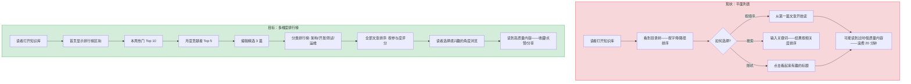
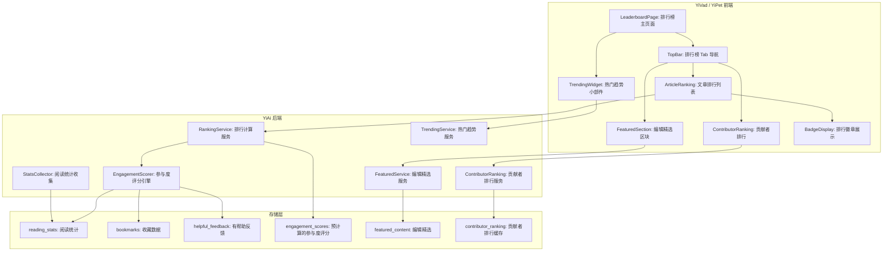
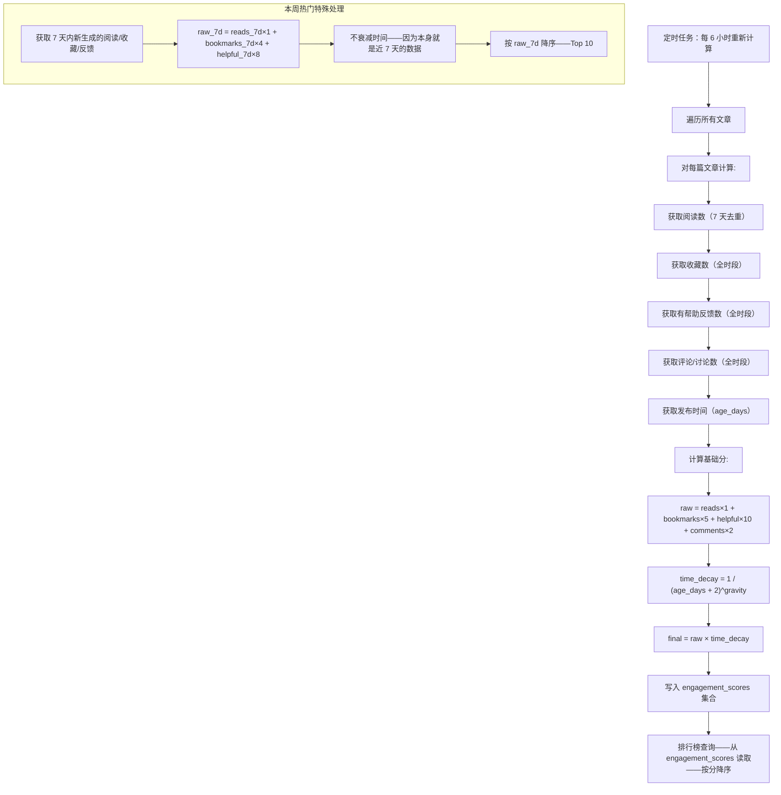

# YK-09-142: 内容排行榜与热门 — 最多阅读、最有帮助、最多收藏、本周热门、编辑精选、月度贡献者、参与度评分计算

> 需求编号：YK-09-142 · 优先级：P2 · 人天：0.3d · 状态：需求已编写
> 依赖：YK-09-128（内容收藏与书签，提供收藏功能）、YK-09-113（贡献者画像与统计，提供贡献者数据）、YK-09-132（内容热图分析，提供阅读统计基础）

## 背景

### 问题陈述

YiKnowledge 目前是一个"无排名"的知识库——所有文章在目录树中平等排列，质量好坏、受欢迎程度完全不可见。新读者面对几百篇文章时不知道从哪里开始——只能从目录顺序读下来。高产贡献者得不到认可，被埋没的优质内容无人发现。

1. **无内容发现机制**：新人面对 300 篇文章——不知道哪些是必读的、哪些是热门的
2. **贡献者无激励**：写了 50 篇高质量文章的作者和写了 1 篇草稿的作者在知识库中看不出区别
3. **内容质量不可见**：最有帮助的文章和最没帮助的文章混在一起——读者没有选择依据
4. **趋势不可感知**：团队最近在关注什么主题——没有任何数据展示
5. **数据无沉淀**：虽然 YK-09-132 做了热图分析，但结果没有以排行榜这种直观方式呈现

**核心矛盾**：知识的价值是被"发现"和"使用"的——但当前的平面列表无法帮助读者区分文章的重要性、流行度和帮助程度。

### 影响范围

| # | 影响 | 严重程度 | 典型场景 |
|---|------|----------|----------|
| 1 | 优质内容难以发现 | 高 | 新人不知道先读哪篇——随机选——读到低质量内容后放弃 |
| 2 | 贡献者缺乏激励 | 高 | 高产作者写了很多但感觉不到认可——降低写作动力 |
| 3 | 内容质量无信号 | 中 | 一篇"最有帮助"的文章有 200 次阅读但隐藏在第三层目录 |
| 4 | 热门主题无感知 | 中 | 管理者不知道团队最近关注什么——无法规划内容 |
| 5 | 知识库活跃度不可见 | 中 | 看起来像"死"的知识库——读者和贡献者的积极性下降 |

### 挑战

| 挑战 | 说明 |
|------|------|
| 参与度评分算法 | 如何公平地将阅读/收藏/有帮助/评论等多种指标综合为一个分数 |
| 时间衰减 | 昨天的热门和去年的经典——时间维度的重要性 |
| 冷启动 | 新发布的优质文章——如何给它们竞争机会而非被老文章永远霸榜 |
| 防刷机制 | 如何防止作者反复刷新自己的文章来刷阅读量 |
| 编辑精选标准 | 人工精选的公平性和透明度——为什么选 A 不选 B |

---

## 一、现状分析

### 1.1 当前排行榜能力

```
现有功能:
├── YK-09-128 内容收藏与书签
│   └── 收藏计数（每篇文章的收藏人数）
├── YK-09-113 贡献者画像与统计
│   └── 贡献者文章数统计
├── YK-09-132 内容热图分析
│   └── 阅读统计基础（浏览量/时间）
├── 目录树导航
│   └── 按路径排列——无排序

缺失:
├── 排行榜页面（总排行/周排行/月排行）          # ❌ 不存在
├── 参与度评分算法                                # ❌ 不存在
├── 最有帮助排名（基于读者反馈）                  # ❌ 不存在
├── 本周热门（时间衰减的及时发现）               # ❌ 不存在
├── 编辑精选（人工推荐）                          # ❌ 不存在
├── 月度贡献者排行榜                              # ❌ 不存在
├── 排行榜分类（按 category 分别排行）            # ❌ 不存在
├── 排行徽章（文章/贡献者的荣誉标识）             # ❌ 不存在
└── 首页"热门推荐"区块                            # ❌ 不存在
```

### 1.2 内容发现模式（现状 vs 目标）



### 1.3 根因矩阵

| 症状 | 根因 | 触发条件 | 频率 |
|------|------|----------|------|
| 不知道读什么 | 无排行榜/推荐 | 新读者首次访问时 | 高 |
| 贡献者隐身 | 无贡献者排名 | 每月贡献统计时 | 中 |
| 老文章霸占阅读量 | 无时间衰减 | 半年前的热门文章仍排在前面 | 中 |
| 不知道团队最近看什么 | 无本周热门 | 月度回顾时 | 中 |
| 新文章无曝光 | 无冷启动机制 | 新文章发布后 48 小时内 | 中 |

---

## 二、设计决策

### 决策 1：参与度评分算法 — 简单加权 vs Hacker News vs Reddit 式

| 选项 | 算法 | 时间敏感性 | 大小公平性 | 复杂度 |
|------|------|----------|-----------|--------|
| 简单加权（阅读×1 + 收藏×3 + 有帮助×5 + 评论×2） | 线性加权 | 无（全时段累积） | 差（老文章累积多） | 低 |
| Hacker News 式（score = upvotes / (age_hours + 2)^1.5） | 幂律时间衰减 | 高 | 好（新老公平） | 中 |
| Reddit 式（Wilson score confidence interval） | 基于统计置信度 | 中（可加衰减） | 极好（纠正样本量偏差） | 中 |

**选择：Hacker News 式时间衰减 + 加权。** 纯累积加权导致老文章永远霸榜——一篇 2 年前的架构文章积累了 500 次阅读，新发布的深度好文只有 10 次阅读无法上榜。Hacker News 的幂律衰减 `score = (reads × 1 + bookmarks × 5 + helpful × 10) / (age_days + 2)^1.2` 让新文章有机会和老文章竞争。参数可调——衰减指数（`gravity`）越高，老文章越难上榜。

### 决策 2：排行榜拆分 — 单一全能榜 vs 多维分榜 vs 混合

| 选项 | 信息丰富度 | UI 复杂度 | 适用场景 |
|------|----------|---------|---------|
| 单一全能榜（一个"热门"榜单） | 低 | 低 | 简单场景 |
| 多维分榜（最多阅读/最有用/最收藏/本周/月度） | 高 | 中 | 全面场景 |
| 混合（默认显示合并榜，可切换到分类榜） | 高 | 中 | 灵活性 |

**选择：5 个分榜 + 1 个分类榜。** (1) 最多阅读——全时段累积阅读量 Top 20；(2) 最有帮助——基于"有帮助"反馈的 Top 10；(3) 最多收藏——基于收藏数的 Top 10；(4) 本周热门——基于 7 天 Hacker News 式评分 Top 10；(5) 编辑精选——人工推荐的 5-8 篇文章；(6) 分类排行榜——按 category 分别展示 Top 5。首页展示"本周热门"和"编辑精选"，其余在排行榜页面查看。

### 决策 3：阅读计数去重 — IP 去重 vs Session 去重 vs 用户 ID 去重

| 选项 | 精度 | 隐私 | 实现复杂度 |
|------|------|------|-----------|
| IP 去重（同 IP 24h 内只计 1 次） | 低（NAT 共享 IP） | 中（存储 IP） | 低 |
| Session 去重（同 session 同文章只计 1 次） | 中（清除 cookie 后重计） | 高（仅 session ID） | 低 |
| 用户 ID 去重（登录用户同文章 7 天只计 1 次） | 高（登录用户唯一） | 高 | 低 |

**选择：Session 去重 + 用户 ID 辅助。** Session 级别的去重确保同一读者在同一个浏览器会话中多次打开同一文章只计 1 次阅读——防止刷量。用户 ID 作为辅助——登录用户 7 天内只计 1 次。存储成本极低——session_reads 集合按 TTL 自动过期。

### 决策 4：编辑精选流程 — 单人决策 vs 委员会投票 vs 数据驱动+人工

| 选项 | 速度 | 公正性 | 维护成本 |
|------|------|--------|---------|
| 单人决策（知识库管理员单人选择） | 高 | 低（个人偏好） | 低 |
| 委员会投票（多人投票选择精选内容） | 中 | 中-高 | 中-高 |
| 数据驱动+人工（系统推荐候选，人工确认/调整） | 中 | 高 | 中 |

**选择：数据驱动+人工确认。** 系统根据参与度评分（前 20%）、最近更新时间（近 30 天）、有帮助反馈率自动生成精选候选列表（约 10-15 篇）。管理员在后台从候选中选择 5-8 篇——可以添加不在候选列表中的文章。每篇文章附带"精选理由"（如"架构设计最佳实践"）。系统记录每次选择的理由供透明性参考。

### 设计决策总结

| 决策 | 选项 A | 选项 B | 选项 C | 选择 | 理由 |
|------|--------|--------|--------|------|------|
| 评分算法 | 简单加权 | HN 式衰减 | Reddit 式 | **HN 式衰减** | 时间公平+可调 |
| 榜单结构 | 单一榜 | 多维分榜 | 混合 | **5分榜+分类** | 丰富覆盖 |
| 阅读去重 | IP 去重 | Session 去重 | 用户 ID | **Session+用户ID** | 平衡精度和隐私 |
| 精选流程 | 单人 | 委员会 | 数据+人工 | **数据+人工** | 高效+公正 |

---

## 三、目标架构

### 3.1 排行榜与热门系统架构



### 3.2 参与度评分计算流程



### 3.3 性能指标

| 指标 | 目标值 | 说明 |
|------|--------|------|
| 排行查询（Top 20） | < 100ms | 从预计算的 engagement_scores 查询 |
| 参与度重新计算（500 篇文章） | < 5s | 定时任务批量更新 |
| 本周热门更新 | < 2s | 仅查询近 7 天数据 |
| 编辑精选后台加载 | < 200ms | 候选列表 + 已有精选 |
| 阅读统计写入 | < 20ms | 单条 insert（异步） |

---

## 四、具体改动

### 4.1 核心类型定义

```typescript
// YiVad: src/views/leaderboard/types.ts (新增)

export type RankingTab = 'trending' | 'most_read' | 'most_helpful' | 'most_bookmarked' | 'contributors';

export const TAB_LABELS: Record<RankingTab, string> = {
  trending: '本周热门',
  most_read: '最多阅读',
  most_helpful: '最有帮助',
  most_bookmarked: '最多收藏',
  contributors: '月度贡献者',
};

export interface EngagementScore {
  filePath: string;
  title: string;
  category: string;
  // 原始统计数据
  totalReads: number;
  recentReads: number;          // 7 天内
  bookmarks: number;
  helpfulCount: number;
  commentCount: number;
  // 时间信息
  publishedAt: string;
  ageDays: number;
  // 评分
  rawScore: number;
  timeDecay: number;
  finalScore: number;
  // 分维度评分
  readScore: number;
  bookmarkScore: number;
  helpfulScore: number;
  commentScore: number;
  // 排名
  overallRank?: number;
  categoryRank?: number;
  trend: 'up' | 'down' | 'stable' | 'new';
  rankChange?: number;          // 排名变化（正数=上升）
}

export interface ArticleRankItem {
  rank: number;
  filePath: string;
  title: string;
  category: string;
  description: string;
  score: number;
  scoreLabel: string;           // "阅读 234 · 收藏 45 · 有帮助 12"
  trend: 'up' | 'down' | 'stable' | 'new';
  rankChange?: number;
  badge?: RankingBadge;
}

export type RankingBadge = 'gold' | 'silver' | 'bronze' | 'trending' | 'editors_choice' | 'contributor';

export const BADGE_CONFIG: Record<RankingBadge, { label: string; color: string; icon: string }> = {
  gold: { label: '第 1 名', color: '#FFD700', icon: 'trophy' },
  silver: { label: '第 2 名', color: '#C0C0C0', icon: 'medal' },
  bronze: { label: '第 3 名', color: '#CD7F32', icon: 'medal' },
  trending: { label: '热门', color: '#EF4444', icon: 'trending-up' },
  editors_choice: { label: '编辑精选', color: '#8B5CF6', icon: 'star' },
  contributor: { label: '优秀贡献者', color: '#10B981', icon: 'award' },
};

export interface FeaturedArticle {
  id: string;
  filePath: string;
  title: string;
  description: string;
  category: string;
  featuredAt: string;
  featuredBy: string;
  featuredReason: string;
  thumbnailUrl?: string;
  engagementScore?: EngagementScore;
}

export interface ContributorRankItem {
  rank: number;
  userId: string;
  userName: string;
  avatarUrl?: string;
  articles: number;              // 总文章数
  recentArticles: number;        // 本月新增
  totalReads: number;           // 所有文章的阅读量
  totalHelpful: number;         // 所有文章的有帮助数
  engagementScore: number;       // 贡献者参与度评分
  topArticle?: string;           // 本月最佳文章
  badge?: RankingBadge;
}

export interface LeaderboardState {
  activeTab: RankingTab;
  categoryFilter: string | null;
  articles: ArticleRankItem[];
  contributors: ContributorRankItem[];
  featured: FeaturedArticle[];
  trending: TrendingSummary;
  isLoading: boolean;
  lastUpdated: string;
}

export interface TrendingSummary {
  topTopics: { topic: string; articleCount: number; growth: number }[];
  totalReadsThisWeek: number;
  totalBookmarksThisWeek: number;
  newArticlesThisWeek: number;
  activeContributorsThisWeek: number;
}

export interface RankingWeights {
  readWeight: number;            // default 1.0
  bookmarkWeight: number;        // default 5.0
  helpfulWeight: number;         // default 10.0
  commentWeight: number;         // default 2.0
  gravity: number;               // default 1.2 (time decay exponent)
  recentWindowDays: number;      // default 7
}
```

### 4.2 后端参与度评分引擎

```python
# YiAi: services/ranking/engagement_scorer.py (新增)

from datetime import datetime, timezone, timedelta
from typing import Optional

from motor.motor_asyncio import AsyncIOMotorDatabase


class EngagementScorer:
    """Hacker News 式参与度评分引擎"""

    DEFAULT_WEIGHTS = {
        "read_weight": 1.0,
        "bookmark_weight": 5.0,
        "helpful_weight": 10.0,
        "comment_weight": 2.0,
        "gravity": 1.2,
    }

    def __init__(self, db: AsyncIOMotorDatabase,
                 weights: dict | None = None):
        self.db = db
        self.weights = {**self.DEFAULT_WEIGHTS, **(weights or {})}

    async def recalculate_all(self) -> dict:
        """重新计算所有文章的参与度评分"""
        now = datetime.now(timezone.utc)
        recent_cutoff = now - timedelta(days=self.weights.get("recent_window_days", 7))

        # 获取所有已发布的文章
        cursor = self.db["knowledge_files"].find({"status": "published"})
        articles = await cursor.to_list(length=None)

        scores = []
        for article in articles:
            score = await self.calculate_score(article, now, recent_cutoff)
            if score:
                scores.append(score)

        # 批量写入预计算评分——更新排名
        if scores:
            scores.sort(key=lambda s: s["finalScore"], reverse=True)
            for rank, score in enumerate(scores, 1):
                score["overallRank"] = rank

            # Upsert 批量写入
            for score in scores:
                await self.db["engagement_scores"].update_one(
                    {"filePath": score["filePath"]},
                    {"$set": score},
                    upsert=True,
                )

        return {
            "calculated": len(scores),
            "calculatedAt": now.isoformat(),
        }

    async def calculate_score(self, article: dict, now: datetime,
                              recent_cutoff: datetime) -> Optional[dict]:
        """计算单篇文章的参与度评分"""
        path = article["path"]

        # 获取 7 天去重阅读数
        reads_7d = await self.db["reading_stats"].count_documents({
            "filePath": path,
            "timestamp": {"$gte": recent_cutoff.isoformat()},
        })

        # 获取全时段数据
        total_reads = await self.db["reading_stats"].count_documents(
            {"filePath": path}
        )
        bookmarks = await self.db["bookmarks"].count_documents(
            {"filePath": path}
        )
        helpful = await self.db["helpful_feedback"].count_documents(
            {"filePath": path, "helpful": True}
        )
        comments = await self.db["comments"].count_documents(
            {"filePath": path}
        )

        # Hacker News 式评分
        raw_score = (
            total_reads * self.weights["read_weight"]
            + bookmarks * self.weights["bookmark_weight"]
            + helpful * self.weights["helpful_weight"]
            + comments * self.weights["comment_weight"]
        )

        # 时间衰减
        published_at = article.get("created", "")
        try:
            pub_date = datetime.fromisoformat(published_at)
            age_days = max(0, (now - pub_date).total_seconds() / 86400)
        except (ValueError, TypeError):
            age_days = 30  # 默认 30 天

        gravity = self.weights["gravity"]
        time_decay = 1.0 / ((age_days + 2) ** gravity)
        final_score = raw_score * time_decay

        # 趋势计算（与前次评分比较）
        trend = "stable"
        prev = await self.db["engagement_scores"].find_one({"filePath": path})
        if prev:
            rank_diff = prev.get("overallRank", 9999) - 0  # 新排名后填入
            if rank_diff > 3:
                trend = "up"
            elif rank_diff < -3:
                trend = "down"
        else:
            trend = "new"

        return {
            "filePath": path,
            "title": article.get("title", path),
            "category": article.get("category", ""),
            "totalReads": total_reads,
            "recentReads": reads_7d,
            "bookmarks": bookmarks,
            "helpfulCount": helpful,
            "commentCount": comments,
            "publishedAt": published_at,
            "ageDays": round(age_days, 1),
            "rawScore": round(raw_score, 2),
            "timeDecay": round(time_decay, 4),
            "finalScore": round(final_score, 2),
            "readScore": total_reads,
            "bookmarkScore": bookmarks * 5,
            "helpfulScore": helpful * 10,
            "commentScore": comments * 2,
            "trend": trend,
            "calculatedAt": now.isoformat(),
        }

    async def get_rankings(self, tab: str = "trending",
                           category: str | None = None,
                           limit: int = 20) -> list[dict]:
        """获取排行榜数据"""
        if tab == "trending":
            return await self._get_trending_7d(category, limit)
        else:
            return await self._get_by_metric(tab, category, limit)

    async def _get_trending_7d(self, category: str | None,
                                limit: int) -> list[dict]:
        """本周热门——近 7 天的 HN 式评分"""
        recent = datetime.now(timezone.utc) - timedelta(days=7)
        query = {"calculatedAt": {"$gte": recent.isoformat()}}
        if category:
            query["category"] = category

        cursor = self.db["engagement_scores"].find(
            query
        ).sort("finalScore", -1).limit(limit)
        items = await cursor.to_list(length=limit)

        return [
            {**item, "scoreLabel": self._format_score_label(item)}
            for item in items
        ]

    async def _get_by_metric(self, tab: str, category: str | None,
                              limit: int) -> list[dict]:
        """按特定指标排行"""
        metric_map = {
            "most_read": ("totalReads", -1),
            "most_helpful": ("helpfulCount", -1),
            "most_bookmarked": ("bookmarks", -1),
        }
        sort_field, sort_dir = metric_map.get(tab, ("finalScore", -1))
        sort = [(sort_field, sort_dir)]

        query = {}
        if category:
            query["category"] = category

        cursor = self.db["engagement_scores"].find(
            query
        ).sort(sort).limit(limit)
        items = await cursor.to_list(length=limit)

        # 添加排名
        for rank, item in enumerate(items, 1):
            item["rank"] = rank

        return [
            {**item, "scoreLabel": self._format_score_label(item)}
            for item in items
        ]

    def _format_score_label(self, item: dict) -> str:
        parts = []
        if item.get("totalReads", 0) > 0:
            parts.append(f"阅读 {item['totalReads']}")
        if item.get("bookmarks", 0) > 0:
            parts.append(f"收藏 {item['bookmarks']}")
        if item.get("helpfulCount", 0) > 0:
            parts.append(f"有帮助 {item['helpfulCount']}")
        return " · ".join(parts) if parts else "暂无数据"
```

### 4.3 文件变更清单

| 文件 | 操作 | 说明 |
|------|------|------|
| `YiVad: src/views/leaderboard/types.ts` | 新增 | 排行榜类型定义 |
| `YiVad: src/views/leaderboard/LeaderboardPage.vue` | 新增 | 排行榜主页面 |
| `YiVad: src/views/leaderboard/TopBar.vue` | 新增 | Tab 导航（5 个榜单） |
| `YiVad: src/views/leaderboard/ArticleRanking.vue` | 新增 | 文章排行列表 |
| `YiVad: src/views/leaderboard/ContributorRanking.vue` | 新增 | 贡献者排行 |
| `YiVad: src/views/leaderboard/FeaturedSection.vue` | 新增 | 编辑精选区块 |
| `YiVad: src/views/leaderboard/RankBadge.vue` | 新增 | 排行徽章组件 |
| `YiVad: src/components/home/TrendingWidget.vue` | 新增 | 首页热门趋势小部件 |
| `YiVad: src/components/home/FeaturedCarousel.vue` | 新增 | 首页精选轮播 |
| `YiAi: services/ranking/ranking_service.py` | 新增 | 排行查询服务 |
| `YiAi: services/ranking/engagement_scorer.py` | 新增 | 参与度评分引擎 |
| `YiAi: services/ranking/trending_service.py` | 新增 | 热门趋势服务 |
| `YiAi: services/ranking/featured_service.py` | 新增 | 编辑精选服务 |
| `YiAi: services/ranking/contributor_ranking.py` | 新增 | 贡献者排行 |
| `YiAi: services/ranking/stats_collector.py` | 新增 | 阅读统计收集 |

---

## 五、实施步骤

| 步骤 | 操作 | 路径 | 验证 | 人天 |
|------|------|------|------|------|
| 1 | 定义类型、徽章配置、权重常量 | `src/views/leaderboard/types.ts` | TypeScript 通过 | 0.02 |
| 2 | 实现阅读统计收集（去重+异步写入） | `stats_collector.py` | 阅读不重复计数 | 0.03 |
| 3 | 实现参与度评分引擎（HN 式衰减） | `engagement_scorer.py` | 评分计算正确+排名更新 | 0.04 |
| 4 | 实现排行榜查询服务 | `ranking_service.py` | 5 种 tab 各自返回正确数据 | 0.03 |
| 5 | 实现热门趋势+贡献者排行 | `trending_service.py` + `contributor_ranking.py` | 近 7 天数据准确 | 0.03 |
| 6 | 实现编辑精选服务 | `featured_service.py` | 候选列表+精选管理 | 0.02 |
| 7 | 实现排行榜主页面 | `LeaderboardPage.vue` + `TopBar.vue` | Tab 切换+数据加载 | 0.03 |
| 8 | 实现文章排行列表 | `ArticleRanking.vue` + `RankBadge.vue` | 列表渲染+排名/趋势/徽章 | 0.03 |
| 9 | 实现贡献者排行 | `ContributorRanking.vue` | 用户排名+本月最佳 | 0.02 |
| 10 | 实现首页热门和精选组件 | `TrendingWidget.vue` + `FeaturedCarousel.vue` + `FeaturedSection.vue` | 首页展示+轮播 | 0.03 |

**总人天：0.3d**

---

## 六、测试规格

### 场景 1：本周热门排行

**GIVEN** 知识库有 200 篇文章，近 7 天有 30 篇被阅读
**WHEN** 用户打开"本周热门"标签
**THEN** Top 10 按 HN 式评分降序排列——显示排名/标题/分类/评分
**AND** 每篇文章显示分维度数据："阅读 152 · 收藏 23 · 有帮助 8"
**AND** 趋势箭头——↑ 上升 3 位，↓ 下降 2 位，≡ 稳定，★ 新上榜
**AND** 可以通过分类下拉筛选特定类别的文章

### 场景 2：最有帮助排行

**GIVEN** 一篇文章有 45 个"有帮助"反馈——是所有文章中最多的
**WHEN** 用户切换到"最有帮助"标签
**THEN** 该文章排在第一位，显示有帮助计数 45
**AND** 第二篇文章有帮助 32，第三篇 28
**AND** 没有帮助反馈的文章不出现在此榜单中

### 场景 3：编辑精选

**GIVEN** 管理员在后台设置了 5 篇编辑精选文章
**WHEN** 用户打开排行榜页面的"编辑精选"区块
**THEN** 显示 5 篇精选文章——每篇有紫色"编辑精选"徽章
**AND** 每篇显示精选理由（如"全面介绍了微服务架构的最佳实践"）
**AND** 点击文章——进入详情页
**AND** 如果用户从首页进入——精选展示在轮播图中

### 场景 4：月度贡献者

**GIVEN** 本月有 8 位贡献者发布了文章
**WHEN** 用户切换到"月度贡献者"标签
**THEN** Top 5 贡献者按参与度评分排列——白金/金/银/铜徽章
**AND** 每位贡献者显示：头像、姓名、本月新增文章数、总阅读量
**AND** 可以点击贡献者查看其所有文章列表
**AND** 每位贡献者显示"本月最佳文章"

### 场景 5：排行榜首页趋势摘要

**GIVEN** 知识库首页需要展示关键指标
**WHEN** 用户访问知识库首页
**THEN** 顶部显示趋势摘要卡片：
  "本周 45 篇文章被阅读，总计 1,230 次"
  "本周新增 12 篇收藏"
  "本周 5 位活跃贡献者"
  "本周热门主题：微服务架构(8篇), 测试策略(5篇)"
**AND** 每个统计数字有对比上周的增长百分比

### 场景 6：冷启动新文章入榜

**GIVEN** 一篇新发布的深度文章（2 天前），已有 30 次阅读、5 个收藏
**WHEN** 排行榜定时重新计算（每 6 小时）
**THEN** 新文章的 HN 式评分：`(30×1 + 5×5) / (2+2)^1.2 = 55 / 5.28 = 10.4`
**AND** 相比一篇 3 个月前的老文章：`(500×1 + 100×5 + 30×10) / (90+2)^1.2 = 1300 / 180.3 = 7.2`
**AND** 新文章虽然累积数据少——但因为时间衰减低——评分可以超越老文章
**AND** 新文章标注"new"徽章进入本周热门

---

## 七、风险与缓解

| 风险 | 概率 | 影响 | 缓解措施 |
|------|------|------|----------|
| 阅读量刷榜 | 中 | 中 | Session 去重 + 用户 ID 7 天去重；异常频率检测（单 IP 单日 > 100 次阅读触发告警） |
| HN 评分参数调优困难 | 中 | 低 | 权重和 gravity 通过管理后台可配置（无需发版）；提供"预览评分"功能 |
| 老贡献者永远霸榜 | 低 | 低 | 月底贡献者只计算当月活动——历史贡献者在"总排行"中（非月度） |
| 排行榜数据过时 | 低 | 低 | 显示"上次更新：2 小时前"时间戳；手动"立即刷新"按钮 |
| 编辑精选公正性 | 低 | 中 | 精选理由必须填写；精选历史公开记录；轮换机制（每月至少重新评估） |

---

## 八、回滚策略

| 场景 | 回滚操作 | 影响 |
|------|----------|------|
| 评分计算错误（所有文章评分归零） | 从备份恢复 engagement_scores 集合 | 排行榜数据丢失——恢复后正常 |
| 排行榜查询影响首页性能 | 排行榜数据缓存到 Redis（如果有）或前端 localStorage | 首页加载延迟不超过 100ms |
| 阅读统计去重 bug 导致计数双倍 | 清除有问题的统计时间窗口的数据——重新计数 | 部分时间段数据缺失 |

---

## 九、设计决策记录

### D-01：为什么选择 Hacker News 式而非简单的全时段累积？

全时段累积有着无法解决的公平问题——3 年前发布的一篇"微服务入门"文章，今天"Python 异步编程最佳实践"即使质量再高也无法超越前者。HN 式的幂律时间衰减 `1 / (age_days + 2)^1.2` 让新文章有机会——同时不会让老文章完全消失。这是一种平衡——经典内容仍有较高的评分（基数大），但新内容可以公平竞争。

### D-02：为什么不是"日排行"而是"周排行"？

日排行对中小团队（每日 20-50 次阅读）来说波动太大——今天看的文章可能完全不同——日排行几乎每天变。周排行提供了足够的聚合以平滑每日波动，同时保持"时效性"。如果团队每日阅读量 > 200——可以通过管理后台调整为日排行。

### D-03：为什么阅读去重用 Session 而非 IP？

Session 去重的概念是"同一次访问"——同一读者在连续浏览中多次打开同一篇文章是可能的（如"看了开头觉得好，关掉后再打开"），但 Session 级别只计 1 次。IP 去重在有 NAT 的环境中误伤——如整个公司使用同一个出口 IP——100 人的公司只有 1 个 IP 计数。Session ID 解决了这个问题。

### D-04：为什么"有帮助"的权重（10.0）远高于"阅读"（1.0）？

阅读是被动行为（打开页面）——可能只是好奇或点错了。收藏（5.0）表示"我认为有帮助，以后会再看"。有帮助（10.0）是主动的正面反馈——读者明确说"这篇文章有帮助"。三种行为的信号强度递增——映射为 1:5:10 的权重比例。这不精确但合理。

---

## 十、可观测性

### 指标

| 指标 | 类型 | 说明 |
|------|------|------|
| `leaderboard.page_view` | Counter | 排行榜页 PV（按 tab） |
| `leaderboard.article_clicked` | Counter | 从排行榜点击文章的次数 |
| `engagement.recalculated` | Counter | 参与度重新计算次数 |
| `engagement.score_distribution` | Histogram | 评分分布 |
| `reading.stats_collected` | Counter | 阅读统计收集数 |
| `leaderboard.featured_updated` | Counter | 编辑精选更新次数 |

### 告警

| 告警 | 条件 | 级别 |
|------|------|------|
| 评分计算任务延迟 | 上次重新计算 > 8 小时 | WARN |
| 阅读统计写入失败率 | failed / total > 5% | WARN |
| 单 IP 高频阅读 | 单 IP 1h 内 > 100 次 | INFO（可能的刷榜） |
| 编辑精选过期 | 最后一次更新 > 30 天 | INFO |

---

## 十一、代码审查检查清单

- [ ] EngagementScorer: 时间衰减 `age_days + 2` 中 +2 防止新文章分母为 0
- [ ] EngagementScorer: gravity 参数范围限制 (0.5 - 2.5)
- [ ] EngagementScorer: 重新计算使用 MongoDB bulk write（效率）
- [ ] RankingService: 缓存排行榜结果（TTL 5 分钟）避免高频查询
- [ ] StatsCollector: 阅读统计写入异步——不阻塞页面加载
- [ ] StatsCollector: Session 去重使用 `sessionId + filePath` 复合键
- [ ] LeaderboardPage: 切换 Tab 时保持分类过滤状态
- [ ] ArticleRanking: 列表虚拟滚动（超过 100 条时）
- [ ] RankBadge: 前 3 名的金/银/铜特殊样式（渐变+阴影）
- [ ] TrendingWidget: 加载失败时显示 skeleton loader
- [ ] FeaturedService: 候选列表排除已下架和已归档的文章
- [ ] ContributingRanking: 贡献者头像懒加载

---

## 回归问题预测

| # | 预测问题 | 原因 | 验证方法 |
|---|---------|------|---------|
| 1 | 评分重新计算期间前端查询排行榜可能返回不完整的数据——部分文章已更新分数、部分还是旧的 | 批量更新非原子——读者在更新过程中查询看到混合状态 | 使用 `$rename` + `$set` 分两步或在临时集合中计算完成后 `renameCollection`（原子操作） |
| 2 | 编辑精选的文章被删除——FeaturedSection 前端渲染到已不存在的文章——显示占位或白屏 | 文章在 YiKnowledge 中删除——但 featured_content 中的引用未级联删除 | 加载精选时验证 knowledge_files 存在——不存在的自动从精选列表中剔除 |
| 3 | 权重配置修改后历史评分不重新计算——新旧评分混在一起——排行榜排序混乱 | 权重变更仅影响新计算的评分——旧评分使用旧权重 | 权重变更时自动触发全量重新计算；engagement_scores 记录 `calculatedWithWeights` 字段 |
| 4 | 本周热门的数据窗口（7 天）跨越评分重新计算的边界——周一计算的"近 7 天"包含上周日的数据——但评分是本周更新的 | trending 窗口范围与评分计算任务的时间对齐问题——窗口起始可能不是"本周一 0:00" | 本周热门使用"上周一到本周日"的日历周，而非简单 `now - 7 days`；日历周边界明确 |
| 5 | 用户反馈"有帮助"后被计算了两次——feedback 点击后前端乐观更新 + 后端也写入——去重失败 | helpful_feedback 集合使用 `userId + filePath` 复合键但允许 insert+update | 使用 `upsert` + `$setOnInsert` 而非 `insert`——同一用户对同一文章只有一条记录 |
| 6 | 排行榜定时任务运行期间遇到大知识库（5000+ 文章）——评分计算耗时超过 6 小时间隔——任务堆积 | 对 5000 篇文章逐条计算评分耗时可能 > 10 分钟——如果任务间隔 6 小时可能追得上，但接近阈值 | 增加 batch_size 处理（500 条/批）；使用 MongoDB 聚合管道预计算基础统计数据（reads/bookmarks/helpful 计数）——减少每条文章的 4 次 countDocuments 查询 |

---

## 性能分析

### 各阶段耗时

| 阶段 | 预估耗时 | 说明 |
|------|--------|------|
| 排行榜查询（Top 20） | < 50ms | 从 engagement_scores sort+limit |
| 参与度重新计算（500 篇文章） | < 3s | 逐条评分计算 |
| 本周热门查询（Top 10） | < 50ms | 时间窗口查询 |
| 贡献者排行（月度） | < 200ms | 聚合管道 |
| 编辑精选加载 | < 30ms | 简单查询 |
| 阅读统计写入 | < 10ms | 异步 insert |
| 首页热门趋势摘要 | < 200ms | 聚合计数 |

### 体积预估

| 文件 | 大小 | 说明 |
|------|------|------|
| 前端 types | ~4KB | 排行榜+徽章+权重类型 |
| Vue 组件（9 个） | ~20KB | 主页+导航+文章排行+贡献者+精选+徽章+小部件+轮播 |
| YiAi: engagement_scorer.py | ~5KB | HN 式评分引擎 |
| YiAi: ranking_service.py | ~3KB | 排名查询 |
| YiAi: trending_service.py | ~2KB | 热门趋势 |
| YiAi: featured_service.py | ~2KB | 编辑精选 |
| YiAi: contributor_ranking.py | ~3KB | 贡献者排行 |
| YiAi: stats_collector.py | ~2KB | 统计收集 |
| **总计** | **~41KB** | 前端 + 后端 |