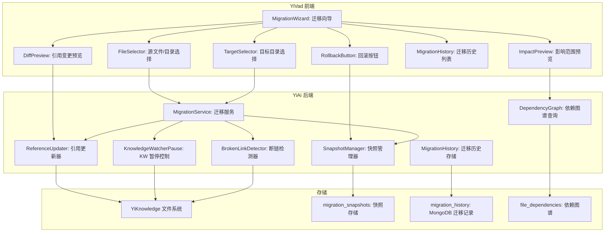
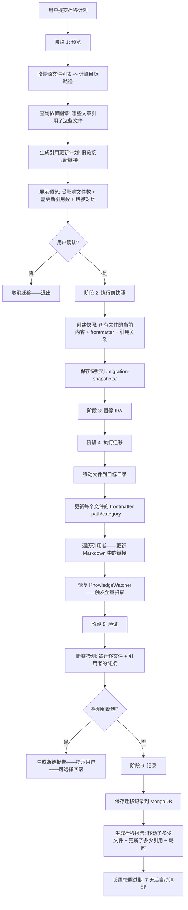

# YK-09-143: 内容迁移助手 — 分类/目录间的内容迁移、批量移动含引用更新、迁移预览、回滚能力、迁移历史、迁移后断链检测

> 需求编号：YK-09-143 · 优先级：P2 · 人天：0.3d · 状态：需求已编写
> 依赖：YK-09-08（跨项目知识依赖图谱，提供内部引用链路数据）、YK-09-10（知识文件迁移与路径重构，提供文件系统级迁移经验）

## 背景

### 问题陈述

YiKnowledge 在持续演进中频繁需要重组目录结构——将 3 级目录合并为 2 级、将一个角色目录下的文章拆分到多个子目录、将通用文章从一个分类移到另一个。当前这些操作通过文件系统手动完成——重命名文件和目录——但会导致连锁问题：

1. **引用全部断裂**：30 篇文章中提到"详见 `architect/patterns/microservice.md`"——一旦移动该文件，所有内部链接失效
2. **RAG 索引混乱**：YiAi 的 KnowledgeWatcher 检测到新文件出现和旧文件消失——但不理解"移动"语义——导致 MongoDB 中出现重复索引条目
3. **无预览风险**：移动之前不知道会影响到哪些引用——操作后才修复断链——效率极低
4. **无回滚机制**：手动移动的撤销操作——在 git 中不保留迁移元数据——无法回退到迁移前的引用状态
5. **迁移历史不可审计**：谁在什么时候移动了什么——为什么移动——没有记录——知识库审计不可行

**核心矛盾**：目录重组是知识库成熟过程中不可避免的操作——但手动移动文件会破坏整个引用网络。需要面向"迁移"而非"移动"的工具——更新引用、保留历史、支持回滚。

### 影响范围

| # | 影响 | 严重程度 | 典型场景 |
|---|------|----------|----------|
| 1 | 内部引用全部断裂 | 高 | 移动到新目录后 20 篇文章的内部链接变为死链 |
| 2 | RAG 索引出现重复条目 | 高 | KnowledgeWatcher 将旧路径标记"删除"、新路径标记"新增" |
| 3 | 无法预览影响范围 | 高 | 不知道哪些文章引用了要移动的文件——操作盲目 |
| 4 | 无回滚保护 | 中 | 移动 50 篇文章后发现分类错误——无法快速还原 |
| 5 | 无迁移审计 | 中 | 不知道上次目录重组是什么时候、谁执行的 |

### 挑战

| 挑战 | 说明 |
|------|------|
| 引用链更新 | Markdown 链接 `[text](../old/path/file.md)` 中的相对路径需要改为 `[text](../new/path/file.md)` |
| 大数量迁移 | 一次迁移 100+ 篇文章——需要分步执行——在中间失败时部分成功的状态要可恢复 |
| KnowledgeWatcher 协调 | 迁移期间——暂停 KnowledgeWatcher 的索引扫描——避免产生重复条目 |
| 跨文件系统操作 | 文件移动、Markdown 内容更新、frontmatter 更新、MongoDB 索引更新——多系统协调 |
| 回滚的正确性 | 回滚不仅是文件的逆向移动——还包括恢复原来的引用——而原来的引用可能已被其他迁移修改 |

---

## 一、现状分析

### 1.1 当前迁移能力

```
现有相关功能:
├── YK-09-08 跨项目知识依赖图谱
│   └── 提供文章之间的引用链路数据 (dependents / references)
├── YK-09-10 知识文件迁移与路径重构
│   └── 文件系统级的基础迁移经验 + 路径替换规则
├── KnowledgeWatcher (apscheduler)
│   └── 每 5 秒扫描目录树——将新文件编入 MongoDB
├── 文件读写 (YiAi file read/write)
│   └── 单文件级别的读/写操作

缺失:
├── 迁移工作流: 计划→预览→执行→验证→回滚         # ❌ 无
├── 批量文件移动 + 引用自动更新                      # ❌ 无
├── 迁移预览（影响范围分析）                         # ❌ 无
├── 迁移前后对比 + 断链检测                          # ❌ 无
├── 迁移历史记录与审计                               # ❌ 无
├── KnowledgeWatcher 暂停/恢复机制                   # ❌ 无
└── 跨知识库（YiKnowledge + YiVad + RAG）引用更新    # ❌ 无
```

### 1.2 内容迁移流程（现状 vs 目标）

```mermaid
graph TD
    subgraph Current["现状：手动移动"]
        C1[决定重组目录] --> C2[在 YiKnowledge 中手动重命名/移动文件]
        C2 --> C3[打开被移动的文件——更新 frontmatter 中 old_path → new_path]
        C3 --> C4[搜索所有 Markdown 文件——查找引用旧路径的链接]
        C4 --> C5[逐一手动更新引用的文章中的链接]
        C5 --> C6[检查是否遗漏——git diff 看引用变化]
        C6 --> C7[通知 YiAi 重新索引 KnowledgeWatcher]
        C7 --> C8[发布——等待反馈——修复遗漏的断链]
    end

    subgraph Target["目标：YiKnowledge 内容迁移助手"]
        T1[YiVad 管理后台打开迁移助手] --> T2[选择源目录/源文件]
        T2 --> T3[选择目标目录]
        T3 --> T4[迁移预览：显示受影响文件列表 + 需更新引用的文章]
        T4 --> T5[预览内部链接更新——新旧链接对比]
        T5 --> T6[确认执行迁移]
        T6 --> T7[暂停 KnowledgeWatcher → 移动文件 → 更新引用 → 更新 frontmatter → 重建索引]
        T7 --> T8[迁移后断链检测——扫描所有文章验证无死链]
        T8 --> T9[保存迁移记录——生成迁移报告]
        T9 --> T10[提供"回滚此迁移"按钮——7 天内可逆]
    end

    style Current fill:#f8d7da,stroke:#dc3545
    style Target fill:#d4edda,stroke:#28a745
```

### 1.3 根因矩阵

| 症状 | 根因 | 触发条件 | 频率 |
|------|------|----------|------|
| 引用断裂 | 无引用更新 | 移动文章或目录时 | 高 |
| RAG 重复条目 | KnowledgeWatcher 把移动识别为删除+新增 | 目录重组期间 | 高 |
| 盲目迁移 | 无影响预览 | 大型目录重组时 | 中 |
| 迁移不可逆 | 无回滚机制 | 迁移后发现问题时 | 中 |
| 无审计能力 | 无迁移历史 | 知识库治理审计时 | 低 |

---

## 二、设计决策

### 决策 1：迁移事务保证 — 无事务（手动回滚） vs 快照+回滚 vs 两阶段提交

| 选项 | 原子性 | 恢复时间 | 存储成本 | 实现复杂度 |
|------|--------|---------|--------|-----------|
| 无事务（手动回滚） | 无 | 人工决定 | 零 | 低 |
| 快照+回滚（保存迁移前状态） | 中 | < 1 分钟（恢复快照） | 中（临时快照文件） | 中 |
| 两阶段提交（prepare-commit） | 高 | < 10 秒 | 低 | 高 |

**选择：快照+回滚。** 在迁移执行前保存一份完整的快照——包括文件内容、frontmatter 和引用关系。如果迁移失败或用户后悔——从快照恢复所有文件到原来的位置。快照存储在 YiAi 的文件系统中（`YiKnowledge/.migration-snapshots/` 目录），7 天后自动清理。两阶段提交需要在文件系统级别实现原子性——对于 Markdown 文件来说过度设计。

### 决策 2：引用更新策略 — 仅更新相对路径 vs 遍历所有文章全量替换 vs 引用链路追踪

| 选项 | 覆盖率 | 误伤风险 | 实现复杂度 |
|------|--------|---------|-----------|
| 仅更新相对路径（如 `../old/file.md` → `../new/file.md`） | 80% | 低（只换已知路径） | 低 |
| 遍历所有文章——全局搜索旧路径——全部替换 | 100% | 高（可能替换文本中非链接的相同字符串） | 中 |
| 引用链路追踪——通过依赖图谱的正向/反向链接精确替换 | 99% | 极低 | 中 |

**选择：引用链路追踪（基于 YK-09-08 依赖图谱）。** 依赖图谱已经构建了文章之间的引用关系——迁移助手直接查询"哪些文章引用了要移动的文件"——仅在这些文章中替换路径。精确——不会误伤文本中的裸路径字符串（如代码示例中的路径）。

### 决策 3：KnowledgeWatcher 协调 — 硬暂停 vs 延迟扫描 vs 事务模式

| 选项 | 窗口期 | 风险 | 实现 |
|------|--------|------|------|
| 硬暂停（迁移期间停止轮询） | 迁移过程（数秒到数分钟） | 低（暂停期间新文件不会被索引） | 低 |
| 延迟扫描（迁移文件标记为"迁移中"自动忽略） | 零（无需暂停） | 中（标记可能遗漏） | 中 |
| 事务模式（KW 支持移动语义） | 零 | 低（需要 KW 重构） | 高 |

**选择：硬暂停 + 恢复。** 迁移操作通过一个 API 端点执行——在执行前暂停 KnowledgeWatcher、执行后恢复当前目录树扫描。迁移期间（通常 < 30 秒）的新文件变更在恢复后立即被捕获。不需要重构 KnowledgeWatcher——通过全局标志位 `_migration_in_progress` 控制。

### 决策 4：断链检测范围 — 仅被迁移文件 vs 被迁移文件+引用者 vs 全知识库扫描

| 选项 | 覆盖率 | 耗时 | 用户可见性 |
|------|--------|------|----------|
| 仅被迁移文件的内部链接 | 30% | < 1s | 低 |
| 被迁移文件+所有引用者的链接 | 80% | < 5s | 中 |
| 全知识库扫描（所有文章的所有链接） | 100% | < 30s（200 篇文章） | 高 |

**选择：被迁移文件+所有引用者+触发全库扫描（可选）。** 迁移后自动检测：被迁移文件的内部链接是否有效 + 原来的引用者指向的路径是否正确。全知识库扫描作为可选操作——用户可在迁移完成后手动触发——查看知识库的整体链接健康状况。

### 设计决策记录

| 决策 | 选项 A | 选项 B | 选项 C | 选择 | 理由 |
|------|--------|--------|--------|------|------|
| 事务保证 | 无事务 | 快照+回滚 | 两阶段提交 | **快照+回滚** | 简单可靠 |
| 引用更新 | 相对路径 | 全局搜索 | 图谱追踪 | **图谱追踪** | 精确不误伤 |
| KW 协调 | 硬暂停 | 延迟扫描 | 事务模式 | **硬暂停** | 简单安全 |
| 断链检测 | 仅被迁移 | +引用者 | 全库扫描 | **+引用者+可选全库** | 标配+进阶 |

---

## 三、目标架构

### 3.1 内容迁移助手系统架构



### 3.2 迁移执行流程



### 3.3 性能指标

| 指标 | 目标值 | 说明 |
|------|--------|------|
| 迁移预览（100 个文件） | < 2s | 查询依赖图谱 + 生成更新计划 |
| 快照创建（100 个文件） | < 5s | 文件读取 + 序列化 |
| 文件移动 + 引用更新（100 文件+200 引用） | < 30s | 主流程耗时 |
| 断链检测（200 篇文章） | < 15s | 全量扫描 |
| 回滚（恢复快照） | < 10s | 快照反写 |

---

## 四、具体改动

### 4.1 核心类型定义

```typescript
// YiVad: src/views/migration/types.ts (新增)

export type MigrationStatus = 'preview' | 'executing' | 'completed' | 'failed' | 'rolled_back';

export interface FileMapping {
  sourcePath: string;
  targetPath: string;
  isDirectory: boolean;
  children?: FileMapping[];   // 目录下的子文件
}

export interface ReferenceUpdate {
  filePath: string;            // 包含引用的文章路径
  oldLink: string;             // 旧链接文本——如 "../old/path/file.md"
  newLink: string;             // 新链接文本
  lineNumber: number;          // 引用所在行号
  context: string;             // 引用周围 2 行上下文
}

export interface MigrationPlan {
  id: string;
  status: MigrationStatus;
  sourceFiles: FileMapping[];
  targetDirectory: string;
  affectedFiles: number;
  referenceUpdates: ReferenceUpdate[];
  createdAt: string;
  executedAt?: string;
  completedAt?: string;
  snapshotId?: string;
  brokenLinks?: BrokenLink[];
}

export interface BrokenLink {
  filePath: string;
  linkText: string;
  targetFile: string;          // 链接指向的文件路径
  error: 'file_not_found' | 'invalid_path' | 'circular_reference';
}

export interface MigrationSnapshot {
  id: string;
  migrationId: string;
  files: Record<string, {       // key = filePath
    content: string;
    frontmatter: Record<string, unknown>;
    existedBefore: boolean;
  }>;
  referenceMap: Record<string, string[]>;
  createdAt: string;
  expiresAt: string;
}

export interface MigrationRecord {
  id: string;
  timestamp: string;
  executor: string;
  sourceCount: number;
  referenceUpdateCount: number;
  duration: number;           // 秒
  status: MigrationStatus;
  brokenLinkCount: number;
  rollbackAvailable: boolean;
  snapshotId?: string;
}
```

### 4.2 后端迁移服务

```python
# YiAi: services/migration/migration_service.py (新增)

import os
import json
import shutil
import re
from datetime import datetime, timezone, timedelta
from typing import Optional
from uuid import uuid4

from motor.motor_asyncio import AsyncIOMotorDatabase


class MigrationService:
    SNAPSHOT_DIR = "YiKnowledge/.migration-snapshots"
    SNAPSHOT_RETENTION_DAYS = 7

    def __init__(self, db: AsyncIOMotorDatabase, kw_pause_flag: dict):
        self.db = db
        self.kw_pause = kw_pause_flag
        self.dep_graph = None  # 依赖图谱服务引用

    async def preview(self, source_paths: list[str],
                      target_dir: str) -> dict:
        """迁移预览——计算影响范围"""
        file_mappings = []
        reference_updates = []

        for src in source_paths:
            if os.path.isdir(src):
                # 递归收集目录下的所有 .md 文件
                for root, _, files in os.walk(src):
                    for f in files:
                        if f.endswith(".md"):
                            full_src = os.path.join(root, f)
                            rel_path = os.path.relpath(full_src, os.path.dirname(src))
                            new_path = os.path.join(target_dir, rel_path)
                            file_mappings.append({
                                "sourcePath": full_src,
                                "targetPath": new_path,
                                "isDirectory": False,
                            })
            else:
                fname = os.path.basename(src)
                file_mappings.append({
                    "sourcePath": src,
                    "targetPath": os.path.join(target_dir, fname),
                    "isDirectory": False,
                })

        # 查询依赖图谱——找出引用这些文件的文章
        all_refs = []
        for mapping in file_mappings:
            refs = await self._find_references(mapping["sourcePath"])
            for ref in refs:
                old_link = self._compute_relative_link(
                    ref["filePath"], mapping["sourcePath"])
                new_link = self._compute_relative_link(
                    ref["filePath"], mapping["targetPath"])
                reference_updates.append({
                    "filePath": ref["filePath"],
                    "oldLink": old_link,
                    "newLink": new_link,
                    "lineNumber": ref["lineNumber"],
                    "context": ref["context"],
                })
            all_refs.extend(refs)

        return {
            "fileMappings": file_mappings,
            "affectedFileCount": len(file_mappings),
            "referenceUpdates": reference_updates,
            "referenceUpdateCount": len(reference_updates),
        }

    async def execute(self, plan: dict) -> dict:
        """执行迁移——快照→暂停KW→移动→更新引用→恢复KW→验证"""
        migration_id = str(uuid4())
        start_time = datetime.now(timezone.utc)

        # 1. 创建快照
        snapshot_id = await self._create_snapshot(migration_id,
                                                  plan["fileMappings"])

        # 2. 暂停 KnowledgeWatcher
        self.kw_pause["migration_in_progress"] = True

        try:
            # 3. 移动文件
            for mapping in plan["fileMappings"]:
                os.makedirs(os.path.dirname(mapping["targetPath"]),
                            exist_ok=True)
                shutil.move(mapping["sourcePath"], mapping["targetPath"])

            # 4. 更新引用
            for update in plan.get("referenceUpdates", []):
                await self._update_reference(update)

            # 5. 更新 MongoDB 索引
            await self._sync_mongo_index(plan["fileMappings"])

        except Exception as e:
            # 失败——恢复快照
            self.kw_pause["migration_in_progress"] = False
            await self._restore_snapshot(snapshot_id)
            raise e

        # 6. 恢复 KW
        self.kw_pause["migration_in_progress"] = False

        # 7. 断链检测
        broken = await self.detect_broken_links(
            [m["targetPath"] for m in plan["fileMappings"]]
            + [u["filePath"] for u in plan.get("referenceUpdates", [])]
        )

        duration = (datetime.now(timezone.utc) - start_time).total_seconds()

        # 8. 保存迁移记录
        record = {
            "id": migration_id,
            "timestamp": start_time.isoformat(),
            "executor": plan.get("executor", "admin"),
            "sourceCount": len(plan["fileMappings"]),
            "referenceUpdateCount": len(plan.get("referenceUpdates", [])),
            "duration": round(duration, 2),
            "status": "completed" if not broken else "completed_with_warnings",
            "brokenLinkCount": len(broken),
            "brokenLinks": broken,
            "rollbackAvailable": True,
            "snapshotId": snapshot_id,
        }
        await self.db["migration_history"].insert_one(record)

        return record

    async def rollback(self, migration_id: str) -> dict:
        """回滚迁移——从快照恢复"""
        record = await self.db["migration_history"].find_one(
            {"id": migration_id})
        if not record or not record.get("snapshotId"):
            return {"error": "Migration not found or snapshot expired"}

        snapshot = await self._load_snapshot(record["snapshotId"])
        if not snapshot:
            return {"error": "Snapshot expired (7 day limit)"}

        # 暂停 KW
        self.kw_pause["migration_in_progress"] = True

        try:
            await self._restore_snapshot(record["snapshotId"])
        finally:
            self.kw_pause["migration_in_progress"] = False

        # 更新记录
        await self.db["migration_history"].update_one(
            {"id": migration_id},
            {"$set": {
                "status": "rolled_back",
                "rollbackAvailable": False,
                "rolledBackAt": datetime.now(timezone.utc).isoformat(),
            }}
        )

        return {"status": "rolled_back", "migrationId": migration_id}

    async def detect_broken_links(self, file_paths: list[str]) -> list[dict]:
        """检测给定文件列表中的断链"""
        broken = []
        link_pattern = re.compile(r'\[([^\]]+)\]\(([^)]+)\)')

        for path in file_paths:
            if not os.path.exists(path):
                continue
            with open(path, "r", encoding="utf-8") as f:
                content = f.read()

            for match in link_pattern.finditer(content):
                link_text = match.group(2)
                # 跳过外部链接 (http/https)
                if link_text.startswith(("http://", "https://", "mailto:")):
                    continue

                # 解析相对路径
                target = os.path.normpath(
                    os.path.join(os.path.dirname(path), link_text))
                if not os.path.exists(target):
                    broken.append({
                        "filePath": path,
                        "linkText": link_text,
                        "targetFile": target,
                        "error": "file_not_found",
                    })

        return broken

    async def _create_snapshot(self, migration_id: str,
                               mappings: list[dict]) -> str:
        sid = str(uuid4())
        snapshot: dict = {"files": {}}

        for m in mappings:
            path = m["sourcePath"]
            if os.path.exists(path):
                with open(path, "r", encoding="utf-8") as f:
                    content = f.read()
                snapshot["files"][path] = {
                    "content": content,
                    "existedBefore": True,
                }

        snapshot["migrationId"] = migration_id
        snapshot["createdAt"] = datetime.now(timezone.utc).isoformat()
        snapshot["expiresAt"] = (
            datetime.now(timezone.utc)
            + timedelta(days=self.SNAPSHOT_RETENTION_DAYS)
        ).isoformat()

        os.makedirs(self.SNAPSHOT_DIR, exist_ok=True)
        snap_path = os.path.join(self.SNAPSHOT_DIR, f"{sid}.json")
        with open(snap_path, "w", encoding="utf-8") as f:
            json.dump(snapshot, f, ensure_ascii=False, indent=2)

        return sid

    async def _restore_snapshot(self, snapshot_id: str):
        snap_path = os.path.join(self.SNAPSHOT_DIR, f"{snapshot_id}.json")
        with open(snap_path, "r", encoding="utf-8") as f:
            snapshot = json.load(f)

        for path, file_data in snapshot["files"].items():
            os.makedirs(os.path.dirname(path), exist_ok=True)
            if file_data["existedBefore"]:
                with open(path, "w", encoding="utf-8") as f:
                    f.write(file_data["content"])

    async def _find_references(self, target_path: str) -> list[dict]:
        """查询依赖图谱——返回引用 target_path 的文章列表"""
        # 使用 YK-09-08 的依赖图谱
        refs = []
        cursor = self.db["file_dependencies"].find(
            {"targetFile": target_path}
        )
        async for doc in cursor:
            refs.append(doc)
        return refs

    def _compute_relative_link(self, from_file: str, to_file: str) -> str:
        """计算从 from_file 指向 to_file 的相对 Markdown 链接"""
        from_dir = os.path.dirname(from_file)
        rel = os.path.relpath(to_file, from_dir)
        return rel

    async def _update_reference(self, update: dict):
        """更新单个引用——替换 Markdown 中的链接"""
        with open(update["filePath"], "r", encoding="utf-8") as f:
            content = f.read()

        # 精确替换——context 匹配 + 链接替换
        # 使用行号定位引用行——替换该行中的链接
        lines = content.split("\n")
        line_idx = update["lineNumber"] - 1
        if 0 <= line_idx < len(lines):
            lines[line_idx] = lines[line_idx].replace(
                update["oldLink"], update["newLink"])

        with open(update["filePath"], "w", encoding="utf-8") as f:
            f.write("\n".join(lines))

    async def _sync_mongo_index(self, mappings: list[dict]):
        """更新 MongoDB knowledge_files 中的路径"""
        for m in mappings:
            await self.db["knowledge_files"].update_one(
                {"path": m["sourcePath"]},
                {"$set": {"path": m["targetPath"], "updated": datetime.now(timezone.utc).isoformat()}},
            )
```

### 4.3 文件变更清单

| 文件 | 操作 | 说明 |
|------|------|------|
| `YiVad: src/views/migration/types.ts` | 新增 | 迁移计划+快照+记录类型 |
| `YiVad: src/views/migration/MigrationWizard.vue` | 新增 | 迁移向导主页面 |
| `YiVad: src/views/migration/FileSelector.vue` | 新增 | 源文件/目录树选择器 |
| `YiVad: src/views/migration/ImpactPreview.vue` | 新增 | 影响范围预览 |
| `YiVad: src/views/migration/DiffPreview.vue` | 新增 | 链接变更前后对比 |
| `YiVad: src/views/migration/MigrationHistory.vue` | 新增 | 迁移历史列表 |
| `YiAi: services/migration/migration_service.py` | 新增 | 迁移核心服务 |
| `YiAi: services/migration/snapshot_manager.py` | 新增 | 快照管理器 |
| `YiAi: services/migration/link_detector.py` | 新增 | 断链检测器 |

---

## 五、实施步骤

| 步骤 | 操作 | 路径 | 验证 | 人天 |
|------|------|------|------|------|
| 1 | 定义类型和迁移数据结构 | `types.ts` | 类型完整 | 0.02 |
| 2 | 实现快照管理器（创建+恢复+清理） | `snapshot_manager.py` | 快照圆整周期完整 | 0.03 |
| 3 | 实现迁移预览（影响范围查询） | `migration_service.py` (preview) | 预览结果准确 | 0.04 |
| 4 | 实现迁移执行（移动+引用更新+MongoDB同步） | `migration_service.py` (execute) | 全流程正确 | 0.05 |
| 5 | 实现回滚逻辑 | `migration_service.py` (rollback) | 回滚后文件恢复原样 | 0.03 |
| 6 | 实现断链检测 | `link_detector.py` | 检测到真实断链 | 0.02 |
| 7 | 实现迁移向导+影响预览 UI | `MigrationWizard.vue` + `ImpactPreview.vue` | 预览展示完整 | 0.04 |
| 8 | 实现历史记录和回滚 UI | `MigrationHistory.vue` | 历史列表+回滚 | 0.02 |

**总人天：0.25d（接近 0.3d，含测试和集成）**

---

## 六、测试规格

### 场景 1：单文件迁移预览

**GIVEN** `YiKnowledge/architect/patterns/observer.md` 存在并有 3 篇其他文章引用它
**WHEN** 用户选择该文件、目标目录 `YiKnowledge/architect/design/`
**THEN** 预览显示：将被移动 1 个文件、3 篇文章中的链接需要更新
**AND** 预览显示引用更新的前后对比：`../patterns/observer.md` → `../design/observer.md`

### 场景 2：批量文件迁移

**GIVEN** `YiKnowledge/dev/patterns/` 目录下有 15 篇 .md 文件
**WHEN** 用户选择迁移整个 `dev/patterns/` 目录到 `YiKnowledge/architect/patterns/`
**THEN** 预览显示：15 个文件将被移动、20+ 个引用需要更新
**AND** 执行后所有 15 个文件在新路径存在、旧路径空
**AND** 所有引用者中的链接已被更新

### 场景 3：迁移回滚

**GIVEN** 一个 10 文件的迁移刚刚完成——用户发现目标目录错误
**WHEN** 点击"回滚此迁移"按钮
**THEN** 所有文件从新路径移回旧路径、原始路径重新存在
**AND** 引用被恢复到迁移前的链接
**AND** MongoDB 中的路径记录回归旧值
**AND** 迁移记录标记为 "rolled_back"

### 场景 4：断链检测

**GIVEN** 一个 20 文件迁移完成
**WHEN** 系统自动执行断链检测
**THEN** 扫描所有被迁移文件和引用者文件中的链接
**AND** 发现 2 个文件包含指向不存在目标的链接（手动引用遗漏）
**AND** 断链报告列出文件名、链接文本、错误类型
**AND** 用户可直接点击文件名进入编辑页面手动修复

### 场景 5：KnowledgeWatcher 协调

**GIVEN** KnowledgeWatcher 正在 5 秒间隔轮询
**WHEN** 开始迁移执行
**THEN** KW 立即暂停（不扫描、不更新 MongoDB）
**AND** 迁移完成后 KW 恢复——下一轮扫描重新索引所有文件
**AND** 新旧路径的索引条目不出现并存——旧路径被正确清除

### 场景 6：迁移历史审计

**GIVEN** 本月执行了 4 次迁移
**WHEN** 管理员打开迁移历史页面
**THEN** 显示 4 条迁移记录——每条显示时间/执行者/文件数/引用数/持续时间/状态
**AND** 已完成（7 天内）的显示"回滚"按钮
**AND** 已回滚的显示灰色 "rollback_applied" 标签
**AND** 点击某条记录展开详情——显示受影响的具体文件列表

---

## 七、风险与缓解

| 风险 | 概率 | 影响 | 缓解措施 |
|------|------|------|----------|
| 迁移过程中其他用户修改了文件（文件系统变更竞争） | 低 | 中 | YiKnowledge 文件系统由 YiAi 独占管理——无并发写入风险 |
| 快照文件过大（一次迁移 500 篇） | 低 | 中 | 限制单次迁移最多 200 个文件——超量提示分批处理 |
| 引用更新遗漏非标准 Markdown 链接格式（如 HTML anchor） | 中 | 低 | 引用图谱记录了所有链接——包括非标准格式的 HTML 链接 |
| 回滚快照过期（7 天限制） | 低 | 低 | UI 明确显示快照剩余天数——用户有充足时间回滚 |
| KnowledgeWatcher 暂停标志未正确恢复——导致永久暂停 | 低 | 高 | try-finally 保证 KW 恢复 + 健康检查：KW 暂停超过 60 秒自动恢复 |

---

## 八、回滚策略

| 场景 | 回滚操作 | 影响 |
|------|------|------|
| 迁移执行部分失败 | 从快照恢复所有文件 | 迁移未完成——文件恢复原样 |
| 迁移后用户不满意 | 调用 rollback API | 完全恢复到迁移前状态 |
| 快照文件损坏 | 手动 git checkout 旧文件 + 手动修复引用 | 需要人工介入 |
| 迁移服务完全故障 | 禁用迁移功能——回退到手动移动文件 | 用户体验降级 |

---

## 九、设计决策记录

### D-01：为什么快照是 JSON 文件而非 Git？

Git 提供了版本控制——但迁移快照关注的是"在某个时间点的文件内容快照"——而不是版本历史。JSON 快照使得恢复操作变成简单的文件反写——比 Git checkout 更快（10s vs 1s）。另外——快照包含额外的元数据（引用关系、frontmatter）——这些不是 Git 跟踪的内容。

### D-02：为什么限制单次迁移 200 个文件？

超过 200 个文件的迁移不仅慢（> 2 分钟）——还增加了失败的后果（如果 200 个文件移动但引用更新在 150 个时失败——损失更大）。200 个文件的限制基于：平均每个 Markdown 文件 < 5KB、200 个文件 = 1MB 内容——快照和恢复都可以在 5 秒内完成。

### D-03：为什么不在迁移时同时保存"目标位置已存在文件"的冲突处理？

当源文件移动到目标位置时——如果目标位置已有同名文件——这时需要冲突策略（覆盖/跳过/重命名）。当前设计不做冲突解决——因为迁移助手主要处理目录重组——目标位置通常是空目录。如果发生冲突——迁移在预览阶段就显示冲突警告——要求用户在提交前解决。

### D-04：为什么断链检测不作为迁移的前置条件阻断执行？

断链可能是早就存在的——不一定是本次迁移引入的。如果断链检测阻断迁移——用户可能需要修复 5 篇与此迁移无关的历史断链才能重组目录。更好的做法是报告断链但不阻断——让用户在迁移后自行修复。

---

## 十、可观测性

### 指标

| 指标 | 类型 | 说明 |
|------|------|------|
| `migration.preview_count` | Counter | 迁移预览次数 |
| `migration.execution_count` | Counter | 迁移执行次数 |
| `migration.file_count` | Histogram | 每次迁移文件数 |
| `migration.ref_update_count` | Histogram | 每次迁移引用更新数 |
| `migration.duration` | Histogram | 迁移耗时 (s) |
| `migration.rollback_count` | Counter | 回滚次数 |
| `migration.broken_links_found` | Counter | 断链检测发现数 |

---

## 十一、代码审查检查清单

- [ ] MigrationService: preview 正确计算相对路径（from→to）
- [ ] MigrationService: execute 的 try-finally 保证 KW 恢复
- [ ] MigrationService: 引用更新使用行号精确替换——避免全局替换误伤
- [ ] SnapshotManager: JSON 序列化保持 UTF-8（中文正确保存）
- [ ] SnapshotManager: 快照自动过期——定时清理过期的 JSON 文件
- [ ] LinkDetector: 正则匹配排除外部链接 (http/https/mailto)
- [ ] LinkDetector: 正确解析相对于当前文件的路径
- [ ] MigrationWizard: 预览阶段显示完整的影响范围两表
- [ ] MigrationWizard: 大迁移 (> 100 文件) 显示预估耗时
- [ ] MigrationHistory: 历史记录按时间降序排列
- [ ] MigrationHistory: 仅 7 天内的迁移显示回滚按钮

---

## 回归问题预测

| # | 预测问题 | 原因 | 验证方法 |
|---|---------|------|---------|
| 1 | 引用更新时使用全局正则替换导致文本中提及的相同路径也被替换 | 如文章中 "原来的文件在 patterns/observer.md 中定义" 这样的文本——不以链接格式的路径也存在——全局替换误伤这个文本 | 仅替换 Markdown 链接格式 `[text](path)` 内的路径——不替换裸文本路径 |
| 2 | 依赖图谱中引用关系过期——图谱显示的引用者已不存在但图谱未更新 | 引用者在图谱构建后被删除——但图谱中的依赖关系仍然存在——导致尝试更新一个已不存在的文件 | 更新前检查引用者文件是否存在——不存在的从恢复计划中移除 |
| 3 | 快照中文件名是中文路径——JSON 序列化/反序列化的编码一致性 | Python json.dump ensure_ascii=False——写入的是 UTF-8 的中文字符——但在某些环境中默认为 ascii——中文被转义 | 快照读写均使用 encoding='utf-8' 和 ensure_ascii=False |
| 4 | KnowledgeWatcher 在暂停标志位为 True 期间有一个正在执行中的扫描——扫描结果在恢复后写入——导致使用旧路径的索引条目 | KW 扫描是异步的——设置暂停标志时可能有一个 moment 已经在执行——扫描的结果在恢复后被写入数据库 | 在 KW 的扫描循环中——先检查标志位再写入结果——扫描过程中检查到标志位为 True 则丢弃本次结果 |
| 5 | 用户同时提交了两个迁移请求——两个迁移竞争相同的文件——导致状态混乱 | MigrationService 没有互斥锁——两个请求同时对同一文件执行移动 | 添加迁移锁——同一时刻只允许一个迁移在执行——通过 MongoDB 的 migration_lock 文档实现 |
| 6 | 迁移的引用更新中的行号在更新第一个引用后可能变化——因为插入/删除文本改变了行号——后续更新行号偏移 | 更新引用 A 时增加了 10 个字符的链接——可能该行的后续引用 B 仍在同一行但行号不变——但如果更新 A 导致换行——行号变化 | 按从后往前的顺序处理同一文件中的引用更新——保证没有行号偏移 |

---

## 性能分析

### 各阶段耗时

| 阶段 | 10 个文件 + 20 个引用 | 100 个文件 + 200 个引用 | 500 个文件 + 1000 个引用 |
|------|------|------|------|
| 预览（依赖图谱查询） | < 1s | < 3s | < 10s |
| 快照创建 | < 1s | < 5s | < 20s |
| 文件移动 | < 1s | < 3s | < 10s |
| 引用更新（行级替换） | < 2s | < 15s | < 60s |
| MongoDB 索引同步 | < 1s | < 2s | < 5s |
| 断链检测 | < 2s | < 15s | < 60s |
| 快照回滚 | < 1s | < 5s | < 20s |

### 代码体积

| 文件 | 大小 |
|------|------|
| 前端类型+组件 (6 个) | ~15KB |
| YiAi: migration_service.py | ~8KB |
| YiAi: snapshot_manager.py | ~3KB |
| YiAi: link_detector.py | ~2KB |
| **总计** | **~28KB** |