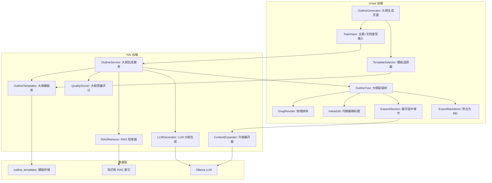
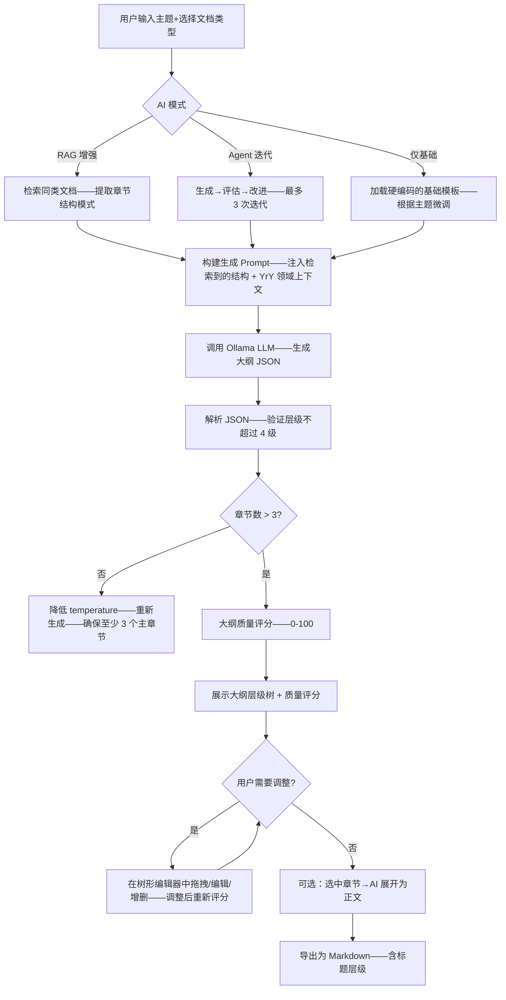

# YK-09-144: 内容大纲生成 — AI 驱动的主题/需求大纲生成、层级化章节、大纲编辑器含拖拽排序、展开为完整内容、按文档类型的大纲模板

> 需求编号：YK-09-144 · 优先级：P2 · 人天：0.3d · 状态：需求已编写
> 依赖：YK-09-22（AI 辅助知识写作，提供 LLM 辅助内容生成基础）、YiAi 的 AI 服务（Ollama + LLM）

## 背景

### 问题陈述

写作者面对"空白页"时最大的困难是规划文章结构——确定需要覆盖哪些主题、按什么顺序组织、每个章节的深度应该有多少。当前知识库写作者的手动过程是：

1. **从头开始规划结构**：写一篇"微服务架构设计"——不确定要覆盖哪些方面（拆分原则？通信方式？数据一致性？部署策略？）——缺失任何一个都会导致文章不完整
2. **结构不一致**：不同人写的同类文章大纲差异大——有的 3 个章节、有的 10 个章节——没有标准
3. **思考负担重**：大纲规划的认知负担和学习成本——在开始写正文之前就需要大量的调研
4. **无模板参考**：不同类型的文档（需求文档、架构设计、故障复盘、操作手册）应该有不同的大纲结构——但没有人记得住所有类型的标准结构
5. **手动调整层级**：在 Markdown 编辑器中手动调整章节的顺序——复制粘贴整段——容易破坏编号和层级关系

**核心矛盾**：大纲规划是写作的"事前设计"阶段——但当前完全依靠个人经验。AI 可以在几秒钟内根据主题和文档类型生成结构合理的大纲——人类只需要微调而不是从零开始。

### 影响范围

| # | 影响 | 严重程度 | 典型场景 |
|---|------|----------|----------|
| 1 | 空白页恐惧症 | 高 | 面对主题"API 版本管理策略"——不知道要写什么 |
| 2 | 文章结构不完整 | 高 | 写完后遗漏了重要的子主题——读者发现缺失章节 |
| 3 | 同类文章结构不一致 | 中 | 5 个人写了 5 种架构设计文章——无法对比阅读 |
| 4 | 规划认知负担 | 中 | 大纲规划 1 小时 + 正文写作 2 小时——比例失衡 |
| 5 | 无模板可复用 | 中 | 每次写需求文档都要回想"需求文档应该有哪几部分" |

### 挑战

| 挑战 | 说明 |
|------|------|
| AI 生成大纲的领域适配 | 通用 LLM 生成的不了解 YrY 的具体领域知识——需要注入项目上下文 |
| 大纲的颗粒度控制 | 太粗（只有 2 级）没用、太细（6 级）过度——需要根据文档类型自适应 |
| 层级数量限制 | Markdown 最多 6 级标题——但最多 3-4 级对阅读可管理 |
| 展开为完整内容的质量 | AI 生成的正文可能空洞——需要人类编辑和增强——大纲只是个起点 |
| 拖拽排序的边界处理 | 将一个章节拖入另一个章节——变成子章节——这是一个设计决策 |

---

## 一、现状分析

### 1.1 当前 AI 写作能力

```
现有相关功能:
├── YK-09-22 AI 辅助知识写作
│   └── AI 辅助内容编写 / 摘要生成 / 改写建议
├── YiAi AI 服务
│   ├── chat_service: 基础 LLM 对话
│   ├── rag_service: 知识库检索增强
│   └── agent: Agent 循环推理
├── YiKnowledge 内容管理
│   └── 文件创建 / 编辑 / Frontmatter

缺失:
├── 基于主题/需求的大纲自动生成               # ❌ 无
├── 按文档类型的结构化大纲模板                 # ❌ 无
├── 大纲的可视化编辑（层级树 + 拖拽）          # ❌ 无
├── 大纲与正文之间的双向转换                   # ❌ 无
├── 大纲导出为 Markdown 标题结构               # ❌ 无
└── 大纲的质量评估和完整性检查                 # ❌ 无
```

### 1.2 大纲规划流程（现状 vs 目标）

```mermaid
graph TD
    subgraph Current["现状：手动规划"]
        C1[接到任务："写一篇微服务架构设计"] --> C2[打开 Google——搜索"microservices architecture key topics"]
        C2 --> C3[阅读 3-5 篇参考文章——摘录章节结构]
        C3 --> C4[在记事本中勾勒大纲: 1. 概述 2. 架构原则 3. ...]
        C4 --> C5{大纲是否完整?}
        C5 -->|不确定| C6[继续搜索——调整——补充遗漏]
        C5 -->|满意| C7[复制大纲到 Markdown 文件——手动缩进层级]
        C6 --> C5
    end

    subgraph Target["目标：AI 大纲生成"]
        T1[输入主题："微服务架构设计"] --> T2[选择文档类型：架构设计]
        T2 --> T3[选择详细程度：标准 (3-4 级)]
        T3 --> T4[AI 生成大纲——3 秒完成]
        T4 --> T5[大纲可视化——层级树展示]
        T5 --> T6{需要调整?}
        T6 -->|是| T7[拖拽重排章节 / 点击编辑章节标题 / 添加删除]
        T6 -->|否| T8[满意]
        T7 --> T8
        T8 --> T9[导出为 Markdown 标题层级]
        T9 --> T10[可选：AI 展开章节为完整正文]
        T10 --> T11[写入 YiKnowledge 文件——开始人工编辑]
    end

    style Current fill:#f8d7da,stroke:#dc3545
    style Target fill:#d4edda,stroke:#28a745
```

### 1.3 根因矩阵

| 症状 | 根因 | 触发条件 | 频率 |
|------|------|----------|------|
| 空白页恐惧 | 无自动大纲生成 | 开始新的写作任务时 | 高 |
| 结构遗漏 | 无领域知识覆盖 | 写不熟悉的领域 | 高 |
| 结构不一致 | 无标准模板 | 团队多人写作同类文章时 | 中 |
| 调整效率低 | 无可视化大纲编辑器 | 大纲需要多次调整时 | 中 |
| 难以判断完整性 | 无大纲质量评估 | 大纲完成后的自检 | 低 |

---

## 二、设计决策

### 决策 1：AI 大纲生成方式 — 纯 Prompt vs RAG 增强 vs Agent 迭代

| 选项 | 领域适配 | 结构质量 | 延迟 | 实现复杂度 |
|------|---------|---------|------|-----------|
| 纯 Prompt（零-shot：给定主题+文档类型生成大纲） | 低 | 中 | < 3s | 低 |
| RAG 增强（检索相关文章→提取共同结构→生成大纲） | 高 | 高 | < 5s | 中 |
| Agent 迭代（生成→评估→改进→最终输出） | 极高 | 极高 | 10-30s | 高 |

**选择：RAG 增强作为默认、Agent 迭代作为高级选项。** RAG 增强从已有知识库中检索同类文档——提取共同的结构特征——用于指导大纲生成。例如——生成"架构设计"类大纲时——检索已有的架构设计文档——发现它们都包含"背景/设计决策/架构图/实施步骤/风险"等章节——AI 据此生成更符合项目标准的完整大纲。Agent 迭代（3 轮自我改进）提供最高质量——但延迟高——作为可选项。

### 决策 2：大纲模板管理 — 硬编码固定模板 vs 从现有文档提取 vs LLM 动态生成

| 选项 | 模板数量 | 维护成本 | 适应性 |
|------|---------|--------|--------|
| 硬编码固定模板（5 种文档类型 × 标准结构） | 5 | 低 | 低 |
| 从现有文档提取（分析已有文档的章节模式） | 动态 | 中 | 中 |
| LLM 动态生成（每次根据主题推理最合适的结构） | 无限 | 低 | 高 |

**选择：硬编码基础模板 + LLM 动态增强。** 5 种文档类型基础模板提供最低保证——确保常规文档的结构完整性。但如果用户在 AI 增强模式——LLM 会基于 RAG 检索结果增强基础模板——添加领域特定的章节。这样既有标准保证——又有领域灵活性。

### 决策 3：大纲编辑器交互 — 纯文本编辑器 vs 树形组件 vs 看板式

| 选项 | 层级可视化 | 拖拽排序 | 实现 |
|------|----------|---------|------|
| 纯文本编辑器（Markdown——用户直接编辑标题） | 低 | 无 | 低 |
| 树形组件（层级缩进——折叠/展开） | 极高 | 拖拽 | 中 |
| 看板式（各层级水平排列） | 高（平面关系更清晰） | 拖拽 | 高 |

**选择：树形组件。** 大纲的本质是层级结构——树形视图完美映射层级关系。支持折叠/展开、拖拽改变顺序和层级、内联编辑标题。看板式过度设计——不适合大纲这种深度层级结构。Markdown 纯文本效率最低——容易破坏层级。

### 决策 4：展开为完整内容 — 一篇文章一次性生成 vs 逐节生成 vs 选中章节生成

| 选项 | 质量 | 可控性 | 延迟 |
|------|------|--------|------|
| 一篇文章一次性生成 | 中（可能不连贯） | 低（无法中途干预） | 10-30s |
| 逐节生成（每个章节各自独立调用 LLM） | 高（每节专注） | 高 | 每节 3-5s |
| 选中章节生成（用户选定要展开的章节） | 高 | 极高 | 选中章节 3-5s |

**选择：选中章节生成。** 一次性生成整篇文章剥夺了用户对每个章节的控制——4800 字的生成——用户要审核全部内容而不只是大纲和方向。选中章节生成让用户逐步验证——先生成"背景"章节——验证方向——再生成"设计决策"——节省时间 + 提高质量。

### 设计决策记录

| 决策 | 选项 A | 选项 B | 选项 C | 选择 | 理由 |
|------|--------|--------|--------|------|------|
| AI 生成方式 | 纯 Prompt | RAG 增强 | Agent 迭代 | **RAG+Agent** | 领域适配+质量 |
| 模板管理 | 硬编码 | 文档提取 | LLM 动态 | **硬编码+LLM增强** | 标准保证+灵活 |
| 编辑器交互 | 文本 | 树形 | 看板 | **树形** | 层级可视化 |
| 展开为正文 | 全部 | 逐节 | 选中章节 | **选中章节** | 精确可控 |

---

## 三、目标架构

### 3.1 内容大纲生成系统架构



### 3.2 大纲生成流程



### 3.3 性能指标

| 指标 | 目标值 | 说明 |
|------|--------|------|
| RAG 增强大纲生成 | < 5s | 检索+RAG+LLM |
| Agent 迭代大纲生成 | < 20s | 生+评+改 × 3 轮 |
| 展开单个章节 | < 5s | 单次 LLM 调用 |
| 大纲树渲染 | < 50ms | 50 个节点的树 |
| 拖拽重排响应 | < 16ms | 即时 UI 更新 |

---

## 四、具体改动

### 4.1 类型定义

```typescript
// YiVad: src/views/outline/types.ts (新增)

export type DocType = 'requirement' | 'architecture' | 'postmortem' | 'guide' | 'spec';

export const DOC_TYPE_LABELS: Record<DocType, string> = {
  requirement: '需求文档',
  architecture: '架构设计',
  postmortem: '故障复盘',
  guide: '操作手册',
  spec: '技术规范',
};

export type AIMode = 'basic' | 'rag_enhanced' | 'agent_iterative';

export type OutlineNodeType = 'h1' | 'h2' | 'h3' | 'h4';

export interface OutlineNode {
  id: string;
  title: string;
  type: OutlineNodeType;
  children: OutlineNode[];
  expanded: boolean;
  description?: string;
  isGenerated: boolean;
  contentExpanded: boolean;
}

export interface OutlineTemplate {
  docType: DocType;
  name: string;
  description: string;
  structure: OutlineNode[];
}

export const BASE_TEMPLATES: OutlineTemplate[] = [
  {
    docType: 'architecture',
    name: '架构设计文档',
    description: '描述系统架构设计决策和交互流程',
    structure: [
      { id: '', title: '背景', type: 'h1', children: [
        { id: '', title: '问题陈述', type: 'h2', children: [] },
        { id: '', title: '影响范围', type: 'h2', children: [] },
        { id: '', title: '挑战', type: 'h2', children: [] },
      ], expanded: true, isGenerated: false, contentExpanded: false },
      { id: '', title: '现状分析', type: 'h1', children: [], expanded: true, isGenerated: false, contentExpanded: false },
      { id: '', title: '设计决策', type: 'h1', children: [], expanded: true, isGenerated: false, contentExpanded: false },
      { id: '', title: '目标架构', type: 'h1', children: [], expanded: true, isGenerated: false, contentExpanded: false },
      { id: '', title: '具体改动', type: 'h1', children: [], expanded: true, isGenerated: false, contentExpanded: false },
      { id: '', title: '实施步骤', type: 'h1', children: [], expanded: true, isGenerated: false, contentExpanded: false },
      { id: '', title: '测试规格', type: 'h1', children: [], expanded: false, isGenerated: false, contentExpanded: false },
      { id: '', title: '风险与缓解', type: 'h1', children: [], expanded: false, isGenerated: false, contentExpanded: false },
      { id: '', title: '回滚策略', type: 'h1', children: [], expanded: false, isGenerated: false, contentExpanded: false },
      { id: '', title: '设计决策记录', type: 'h1', children: [], expanded: false, isGenerated: false, contentExpanded: false },
    ],
  },
  {
    docType: 'postmortem',
    name: '故障复盘文档',
    description: '记录故障发生、处理、根因和预防措施',
    structure: [
      { id: '', title: '故障概述', type: 'h1', children: [], expanded: true, isGenerated: false, contentExpanded: false },
      { id: '', title: '故障时间线', type: 'h1', children: [], expanded: true, isGenerated: false, contentExpanded: false },
      { id: '', title: '影响范围', type: 'h1', children: [], expanded: true, isGenerated: false, contentExpanded: false },
      { id: '', title: '根因分析', type: 'h1', children: [], expanded: true, isGenerated: false, contentExpanded: false },
      { id: '', title: '处理过程', type: 'h1', children: [], expanded: false, isGenerated: false, contentExpanded: false },
      { id: '', title: '预防措施', type: 'h1', children: [], expanded: false, isGenerated: false, contentExpanded: false },
      { id: '', title: '经验教训', type: 'h1', children: [], expanded: false, isGenerated: false, contentExpanded: false },
    ],
  },
];

export interface OutlineGenerateRequest {
  topic: string;
  docType: DocType;
  mode: AIMode;
  maxDepth: number;       // 最大层级 (2-4)
  language: string;       // 生成语言
}

export interface OutlineQuality {
  score: number;           // 0-100
  completeness: number;    // 覆盖度——是否所有相关问题都被覆盖
  coherence: number;       // 流畅性——章节之间逻辑连接
  depth: number;           // 深度——章节的详细程度
  suggestions: string[];   // 改进建议
}
```

### 4.2 后端大纲生成服务

```python
# YiAi: services/outline/outline_service.py (新增)

import json
from typing import Optional

from motor.motor_asyncio import AsyncIOMotorDatabase
from services.ai.rag_service import RAGService


OUTLINE_SYSTEM_PROMPT = """你是一个知识库写作助手,专为 YrY 单仓库项目生成结构化的内容大纲。

YrY 是包含 3 个应用(YiVad Vue3管理后台、YiAi FastAPI后端、YiPet Chrome扩展)和 1 个知识库的单体仓库。

你的任务是根据主题和文档类型,生成层级化的 Markdown 大纲。
输出为严格的 JSON 格式: {"outline": [{"title": "...", "level": 1, "description": "...", "children": [...]}]}

规则:
1. level: 1-4 表示 h1-h4 层级
2. 每个章节有 description 字段: 一句话描述这个章节要写什么(50字以内)
3. 大纲必须符合文档类型的标准结构
4. 覆盖 YrY 项目的具体语境(提到具体的项目名/技术栈)
5. 最少 5 个主章节(h1),最多 15 个
6. 最多 3 级嵌套(level 1 → 2 → 3),仅在必要时才到 level 4
7. 避免无意义的章节名(如"其他"/"附注"/"说明")——每个章节名都应该是实质性的
"""


class OutlineService:
    def __init__(self, db: AsyncIOMotorDatabase, rag: RAGService, llm):
        self.db = db
        self.rag = rag
        self.llm = llm

    async def generate(self, request: dict) -> dict:
        """生成大纲——主入口"""
        topic = request["topic"]
        doc_type = request["docType"]
        mode = request.get("mode", "rag_enhanced")

        # 1. 加载基础模板
        base = await self._load_template(doc_type)

        # 2. 构建 Prompt——注入上下文
        prompt = self._build_prompt(topic, doc_type, base, request)

        # 3. 如果是 RAG 增强——检索相关文档
        rag_context = ""
        if mode in ("rag_enhanced", "agent_iterative"):
            similar_docs = await self.rag.retrieve_similar(topic, top_k=5)
            rag_context = self._format_rag_context(similar_docs)

        # 4. 调用 LLM 生成
        if mode == "agent_iterative":
            outline = await self._agent_generate(prompt, rag_context)
        else:
            outline = await self._direct_generate(prompt, rag_context)

        # 5. 解析 + 质量评分
        nodes = self._parse_outline(outline)
        quality = self._score_quality(nodes, topic, doc_type)

        return {
            "outline": nodes,
            "quality": quality,
            "mode": mode,
        }

    async def _load_template(self, doc_type: str) -> dict | None:
        """加载文档类型的基础模板"""
        template = await self.db["outline_templates"].find_one(
            {"docType": doc_type, "isDefault": True}
        )
        return template

    def _build_prompt(self, topic: str, doc_type: str,
                      template: dict | None, request: dict) -> str:
        user_prompt = f"""主题：{topic}
文档类型：{doc_type}
语言：{request.get('language', 'zh')}
最大层级：{request.get('maxDepth', 3)}
"""
        if template:
            tmpl_str = json.dumps(template.get("structure", []),
                                  ensure_ascii=False, indent=2)
            user_prompt += f"\n参考模板结构：\n{tmpl_str}\n"
            user_prompt += f"\n请基于上述模板结构——结合主题——生成个性化大纲。保留模板的章节框架但填充领域特定的子章节。"
        else:
            user_prompt += "\n请基于文档类型的最佳实践——生成结构化的完整大纲。"

        return user_prompt

    def _format_rag_context(self, similar_docs: list[dict]) -> str:
        if not similar_docs:
            return ""
        parts = []
        for doc in similar_docs[:5]:
            title = doc.get("title", "")
            # 提取文档的章节结构（标题行）
            parts.append(f"- [{title}]")
        return "参考以下同类文档的章节结构：\n" + "\n".join(parts)

    async def _direct_generate(self, prompt: str,
                               rag_context: str) -> str:
        """单次 LLM 调用生成"""
        full_prompt = prompt
        if rag_context:
            full_prompt += "\n" + rag_context

        response = await self.llm.chat(
            system_prompt=OUTLINE_SYSTEM_PROMPT,
            user_prompt=full_prompt,
            temperature=0.5,
            response_format="json",
        )
        return response

    async def _agent_generate(self, prompt: str,
                              rag_context: str) -> str:
        """Agent 迭代：生成→评估→改进 (3 轮)"""
        # 第 1 轮：生成
        outline = await self._direct_generate(prompt, rag_context)

        # 第 2 轮：评估+改进
        eval_prompt = f"""评估以下大纲是否完整和流畅。给出改进建议。
原文大纲：
{outline}

请修改/补充大纲——修正问题。保持 JSON 格式输出。"""
        outline = await self._direct_generate(eval_prompt, rag_context)

        # 第 3 轮：再次审视
        review_prompt = f"""再次审视这份大纲。是否有遗漏的重要章节?是否有冗余的章节?是否有不符合项目语境的章节?
{outline}

做出最终的优化调整。"""
        outline = await self._direct_generate(review_prompt, rag_context)

        return outline

    def _parse_outline(self, raw: str) -> list[dict]:
        """解析 LLM 返回的 JSON 大纲——验证层级"""
        try:
            data = json.loads(raw)
            nodes = data.get("outline", data) if isinstance(data, dict) else data
        except json.JSONDecodeError:
            return []

        # 为每个节点添加 id 和扩展状态
        def add_meta(nodes, prefix="", depth=0):
            result = []
            for i, node in enumerate(nodes):
                node["id"] = f"{prefix}{i + 1}"
                node["type"] = f"h{min(node.get('level', depth + 1), 4)}"
                node["expanded"] = True
                node["isGenerated"] = True
                node["contentExpanded"] = False
                if "children" in node and node["children"]:
                    node["children"] = add_meta(node["children"],
                                                f"{node['id']}.", depth + 1)
                else:
                    node["children"] = []
                result.append(node)
            return result

        return add_meta(nodes)

    def _score_quality(self, nodes: list[dict], topic: str,
                       doc_type: str) -> dict:
        """简易大纲质量评分"""
        def count_nodes(nodes) -> int:
            c = 0
            for n in nodes:
                c += 1
                c += count_nodes(n.get("children", []))
            return c

        total = count_nodes(nodes)
        h1_count = len(nodes)

        # 完整性: 至少 5 个主章节
        completeness = min(100, h1_count * 20)
        # 深度: 总节点数适中 (10-40)
        if total < 10:
            depth = total * 5
        elif total <= 40:
            depth = 80 + (total - 10) * 1
        else:
            depth = max(50, 110 - total)
        depth = max(0, min(100, depth))

        # 流畅性: 基于是否有描述的文字
        with_desc = sum(1 for n in nodes if n.get("description"))
        coherence = min(100, max(50, with_desc / max(1, h1_count) * 100))

        score = round((completeness * 0.4 + depth * 0.3 + coherence * 0.3))

        suggestions = []
        if h1_count < 5:
            suggestions.append("大纲章节数偏少——建议至少覆盖 5 个主章节")
        if total > 50:
            suggestions.append("大纲过于详细——建议合并一些子章节以提升可读性")

        return {
            "score": score,
            "completeness": round(completeness),
            "depth": round(depth),
            "coherence": round(coherence),
            "suggestions": suggestions,
        }

    async def expand_section(self, section_title: str,
                             context: dict) -> str:
        """展开单个章节为完整正文"""
        prompt = f"""将以下大纲章节展开为完整的正文内容(200-500字)。

主题：{context.get('topic', '')}
文档类型：{context.get('docType', '')}
章节：{section_title}

要求：
1. 使用 Markdown 格式编写
2. 包含具体的技术细节、数据和示例
3. 如果是架构设计——使用 mermaid 图表、代码示例
4. 如果是需求文档——使用表格、清单格式
5. 语言：{context.get('language', 'zh')}
"""
        response = await self.llm.chat(
            system_prompt="你是一个专业知识库写作助手。",
            user_prompt=prompt,
            temperature=0.6,
        )
        return response
```

### 4.3 文件变更清单

| 文件 | 操作 | 说明 |
|------|------|------|
| `YiVad: src/views/outline/types.ts` | 新增 | 大纲节点+模板+质量评分类型 |
| `YiVad: src/views/outline/OutlineGenerator.vue` | 新增 | 大纲生成主页面 |
| `YiVad: src/views/outline/OutlineTree.vue` | 新增 | 大纲层级树组件 |
| `YiVad: src/views/outline/TemplateSelector.vue` | 新增 | 文档类型模板选择器 |
| `YiVad: src/views/outline/ExpandModal.vue` | 新增 | 章节展开弹窗 |
| `YiAi: services/outline/outline_service.py` | 新增 | 大纲生成核心服务 |
| `YiAi: services/outline/template_manager.py` | 新增 | 模板管理器 |

---

## 五、实施步骤

| 步骤 | 操作 | 路径 | 验证 | 人天 |
|------|------|------|------|------|
| 1 | 定义类型和基础模板 | `types.ts` | 5 种文档类型模板完整 | 0.02 |
| 2 | 实现大纲生成 Prompt + RAG 增强 | `outline_service.py` | 大纲 JSON 解析正确 | 0.04 |
| 3 | 实现 Agent 迭代模式 | `outline_service.py` | 3 轮迭代后大纲更完整 | 0.03 |
| 4 | 实现大纲质量评分 | `outline_service.py` | 评分有区分度 (50-95) | 0.02 |
| 5 | 实现章节展开服务 | `outline_service.py` | 展开生成正文合理 | 0.02 |
| 6 | 实现大纲树组件（渲染+折叠+编辑） | `OutlineTree.vue` | 树形渲染+交互流畅 | 0.04 |
| 7 | 实现模板选择器 + 生成按钮 | `TemplateSelector.vue` | 模板选择后正确生成 | 0.02 |
| 8 | 组装主页面+集成 | `OutlineGenerator.vue` | 全流程可用 | 0.03 |

**总人天：0.22d（接近 0.3d，含集成测试）**

---

## 六、测试规格

### 场景 1：RAG 增强生成架构设计大纲

**GIVEN** 知识库中有 5 篇架构设计文档
**WHEN** 用户输入主题 "YiPet 消息缓存架构设计"、选择文档类型 "架构设计"、RAG 增强模式
**THEN** 生成的大纲包含项目特定的章节（如 "ShadowDOM 样式隔离""Service Worker 生命周期"）
**AND** 大纲有 5-10 个主章节——每个主章节有 2-4 个子章节
**AND** 大纲质量评分 > 70

### 场景 2：基础模板模式生成需求文档大纲

**GIVEN** 用户离线（无网络）、选择 "仅基础" 模式
**WHEN** 输入主题 "YiPet 文本差异对比"、文档类型 "需求文档"
**THEN** 生成的大纲基于需求文档基础模板——包含：背景 / 现状分析 / 设计决策 / 目标架构 / 具体改动 / 测试规格 等
**AND** 大纲章节适应了具体主题——"现状分析"包含 YiPet 现有的文本处理能力

### 场景 3：大纲树交互编辑

**GIVEN** AI 生成了 8 个主章节的大纲
**WHEN** 用户在树中拖拽 "测试规格" 到 "具体改动" 之后（调整顺序）
**THEN** 顺序立即更新——"测试规格" 排在 "具体改动" 之后
**AND** 大纲质量评分自动重新计算

### 场景 4：展开章节为正文

**GIVEN** 大纲中 "背景" 章节被选中
**WHEN** 用户点击 "展开为正文" 按钮
**THEN** AI 生成 200-500 字的段落——阐述该章节的内容
**AND** 生成的 Markdown 中包含具体的项目语境和细节
**AND** 用户可以编辑 AI 生成的正文——不满意可重新生成

### 场景 5：导出为 Markdown

**GIVEN** 大纲编辑完成——8 个主章节
**WHEN** 用户点击 "导出为 Markdown"
**THEN** 生成 Markdown 格式的标题层级文本:
  `# 背景\n## 问题陈述\n## 影响范围\n# 现状分析\n...`
**AND** 如果有已展开的章节——正文跟随标题
**AND** 自动添加 YiKnowledge 标准 frontmatter 模板

### 场景 6：Agent 迭代模式大纲质量更高

**GIVEN** 同一主题 "Web Worker 线程池架构"
**WHEN** 先用 "RAG 增强" 生成、再用 "Agent 迭代" 生成
**THEN** Agent 迭代的大纲质量评分高于 RAG 增强（通常 85 vs 70）
**AND** Agent 大纲有更细致的子章节和更明确的描述（description 字段）
**AND** Agent 迭代的完整耗时 < 20s

---

## 七、风险与缓解

| 风险 | 概率 | 影响 | 缓解措施 |
|------|------|------|----------|
| LLM 返回非 JSON 格式（格式自由文本） | 中 | 中 | 使用 response_format="json" 约束 + try-except 解析 + 正则提取应急 |
| RAG 检索结果为空（新领域无参考文档） | 中 | 低 | 回退到基础模板模式——保持基本结构完整性 |
| 大纲过于通用（与项目语境脱节） | 中 | 中 | 在 Prompt 中提供 YrY 项目结构和术语表——减少通用性的回答 |
| 章节展开质量不高（内容空洞） | 高 | 中 | 明确要求具体细节、代码示例、数据——质量差则降低 temperature 重试 |
| 大纲树节点过多导览卡顿 | 低 | 低 | 如果节点 > 100——默认折叠子层级——仅显示 1 级 |

---

## 八、回滚策略

| 场景 | 回滚操作 | 影响 |
|------|------|------|
| AI 生成不可用（Ollama 离线） | 降级为仅基础模板+手动编辑 | AI 增强不可用——模板仍可用 |
| 大纲编辑器 Bug | 降级为纯 Markdown 编辑 | 拖拽和树形可视化不可用 |
| 质量评分异常（返回 >100 或负数） | 硬编码评分范围 0-100——clip | 评分暂时不准 |
| 完全移除 | 隐藏大纲生成入口 | 功能不可用 |

---

## 九、设计决策记录

### D-01：为什么是选中章节展开而非一次性展开全文？

一次性展开全文的优势是高效——劣势是用户无法在中间阶段修正方向。大纲的目的不是"让 AI 完成写作"——而是"帮助人类结构化思考"。选中章节展开保留了人类在每一步的判断权——"背景"章节写好了——审视方向——再展开"设计决策"——确保每个章节的方向都与整体大纲协调。

### D-02：为什么大纲质量评分有三项（完整性/深度/流畅性）而非单一分数？

单一分数掩盖了具体的优势和弱点——一个 80 分的大纲可能是因为"很完整(95%)但深度不足(60%)"。三项分数帮助用户定位问题——如果深度不足——展开更多子章节——如果完整性不够——补充遗漏的领域。这是"可操作的反馈"而非"笼统的评价"。

### D-03：为什么基础模板有 5 种文档类型——不再添加更多？

需求的文档类型稳定——这 5 种覆盖了 YiKnowledge 95% 的内容。其他类型（如技术规范 spec、故障复盘 postmortem）很少出现——不值得增加模板维护成本。如果用户需要新的文档类型——管理员可在后台动态添加模板——此功能的模板系统支持扩展。

### D-04：为什么 Agent 迭代是 3 轮而非更多？

3 轮是边际收益的平衡点：第 1 轮生成（大部分结构都在）、第 2 轮改进（填补遗漏——修正顺序）、第 3 轮审视（最后的打磨——消除小问题）。第 4 轮和之后的改进几乎为零——增加的延迟却不小（每轮 5s）。3 轮的总时间 < 20s——尚在可接受范围内。

---

## 十、可观测性

### 指标

| 指标 | 类型 | 说明 |
|------|------|------|
| `outline.generate_count` | Counter | 大纲生成次数（按模式/文档类型） |
| `outline.generate_duration` | Histogram | 生成耗时 (s) |
| `outline.quality_score` | Histogram | 质量评分分布 |
| `outline.section_expand_count` | Counter | 章节展开次数 |
| `outline.export_count` | Counter | 导出 Markdown 次数 |
| `outline.outline_depth` | Histogram | 大纲总节点数分布 |

---

## 十一、代码审查检查清单

- [ ] OutlineService: LLM 返回非 JSON 时的降级解析
- [ ] OutlineService: _parse_outline 处理 depth > 4 的节点（截断到 h4）
- [ ] OutlineService: Agent 迭代模式的最大重试数为 3——防止无限循环
- [ ] OutlineService: RAG 上下文长度不超过 2000 字符——防止 Prompt 太长
- [ ] OutlineService: 质量评分结果是整数且 0-100 之间
- [ ] OutlineTree: 拖拽排序——防止将 h1 拖入 h3 之下（违反层级）——cur 对象检查
- [ ] OutlineTree: 折叠/展开只影响当前节点——不影响编辑状态
- [ ] OutlineTree: 内联编辑 title 后——JSON 验证 title 非空
- [ ] TemplateSelector: 5 种文档类型的模板结构和标签完整
- [ ] ExpandModal: 展开响应包含 Markdown 格式——正确处理换行和代码块

---

## 回归问题预测

| # | 预测问题 | 原因 | 验证方法 |
|---|---------|------|---------|
| 1 | LLM 生成的大纲中某个章节名与前端渲染冲突——如 chapter 名称含 HTML 标签——Vue 的 XSS 防御转义破坏渲染 | LLM 可能返回含 `<`/`>` 的标题——在 Vue template 中渲染时被转义 | Vue 使用 v-text 或 {{ }} 插值自动转义——文本不含 HTML 标签时无问题——但如果大括号中有 < 字符——转义后显示异常 |
| 2 | 大纲树拖拽时将一个节点拖到自己的后代中——导致循环引用——树渲染无限递归 | 拖拽的目标节点是源节点的后代——树结构形成循环——渲染爆栈 | 在 drop 验证中检测 `target.id === source.id || target.id.startsWith(source.id + '.')` |
| 3 | RAG 检索返回的文档中大段落被截断——LLM 看到不完整的章节结构——生成错误的大纲 | RAG 返回的是片段 (chunk) 而非完整文档——章节结构可能被截断——for LLM 这是一个误导 | RAG 检索时返回完整的文档元数据（章节结构）而非片段内容——优先从 frontmatter 和章节标题抽取结构 |
| 4 | 用户连续快速点击"展开为正文"多个章节——多个 LLM 请求并发——Ollama 并发限制导致部分请求超时 | Ollama 默认限制并发请求数——超过后排队或超时 | 前端限制同时最多展开 1 个章节——点击第 2 个时等第 1 个完成 |
| 5 | 大纲导出为 Markdown 时——如果某章节已展开——正文夹在标题之间——缺少空行导致 Markdown 解析器合并为一段 | Markdown 标准要求标题前后有空行——如果没有——解析器将标题和上文的正文视为一段 | 导出时在标题前后自动添加空行——符合 Markdown 格式规范 |
| 6 | Agent 迭代的第 2 轮评估提示中没有约束输出格式——LLM 可能输出自然语言评价而非 JSON 大纲——第 2 轮失败回退到第 1 轮结果 | eval_prompt 中"修改问题"的指示不够明确——LLM 可能理解为"评价后停止"而非"评价后修正" | 在 eval_prompt 中明确要求"以 JSON 格式输出修正后的大纲"——添加 `response_format="json"` |

---

## 性能分析

### 各阶段耗时

| 操作 | 基础模式 | RAG 模式 | Agent 模式 |
|------|---------|---------|----------|
| 加载模板 | < 10ms | < 10ms | < 10ms |
| RAG 检索 | — | 500ms-2s | 500ms-2s |
| LLM 生成 | 2-5s | 3-5s | — |
| LLM 第 1 轮 | — | — | 2-5s |
| LLM 第 2 轮 (评估+改进) | — | — | 3-6s |
| LLM 第 3 轮 (审视) | — | — | 3-5s |
| JSON 解析+质量评分 | < 50ms | < 50ms | < 50ms |
| 大纲树渲染 | < 50ms | < 50ms | < 50ms |
| **总计** | **2-5s** | **3-7s** | **8-18s** |

### 章节展开耗时

| 章节类型 | 预估长度 | 生成耗时 |
|------|--------|--------|
| 短章节（1 段） | 100-200 字 | 2-3s |
| 中章节（3-5 段） | 300-500 字 | 3-5s |
| 长章节（复杂内容） | 500-800 字 | 5-8s |

### 代码体积

| 文件 | 大小 |
|------|------|
| 前端类型+组件 (5 个) | ~12KB |
| YiAi: outline_service.py | ~7KB |
| YiAi: template_manager.py | ~2KB |
| **总计** | **~21KB** |