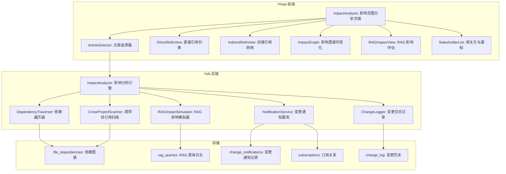
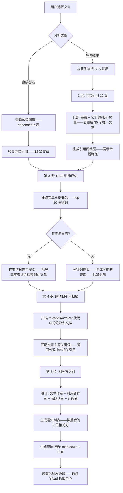

# YK-09-146: 内容影响范围分析 — 分析内容变更的影响、哪些文章链接了此篇、哪些 RAG 回答引用了此内容、下游影响评估、变更通知受影响的相关方

> 需求编号：YK-09-146 · 优先级：P2 · 人天：0.3d · 状态：需求已编写
> 依赖：YK-09-08（跨项目知识依赖图谱，提供结构化依赖数据）、YK-09-143（内容迁移助手，提供修改前后的内容上下文）

## 背景

### 问题陈述

在知识库中修改一篇文章——特别是重要架构或规范类的文章——可能产生级联影响。当前没有机制来评估"修改这篇会影响什么"——导致：

1. **盲目修改**：作者修改了"RPC 协议规范"中参数名称的定义——但没有意识到 15 篇其他文章引用了这个定义——这些引用文章变成错误的
2. **级联失效**：一篇文章被删除或重命名后——所有引用它的文章出现死链——读者点击到 404
3. **RAG 影响未知**：修改知识库内容后——YiAi 的 RAG 检索结果随之改变——但无法预测这些改变对聊天回答的具体影响
4. **通知不足**：作者不知道应该通知哪些相关方——"我的修改影响了谁的阅读体验？"
5. **下游评估困难**：需求变更前——项目经理无法评估变更的知识成本和需要更新的文档数量

**核心矛盾**：知识库中的文章不是孤立的——它们通过引用、RAG 检索、依赖关系形成了一个网络。修改一个节点会影响通过网络传播——但当前缺乏工具来可视化这种传播和评估影响范围。

### 影响范围

| # | 影响 | 严重程度 | 典型场景 |
|---|------|----------|----------|
| 1 | 引用文章变为错误 | 高 | 修改架构规范中的参数名称——15 篇引用文章仍然使用旧名称 |
| 2 | 链接死链 | 高 | 删除一篇文章——20 处链接变成 404 |
| 3 | RAG 回答质量下降 | 高 | 修改内容后——AI 仍然引用旧版本的过期信息 |
| 4 | 沟通不足 | 中 | 已修改的规范未被团队其他成员知晓——继续使用旧规范 |
| 5 | 变更评估困难 | 中 | 项目经理无法量化需求变更的文档影响 |

### 挑战

| 挑战 | 说明 |
|------|------|
| 引用链路深度 | 直接引用容易追踪——但间接引用（A 引用 B，B 引用 C——修改 C 影响 A）需要遍历 |
| RAG 影响量化 | "修改影响了多少 RAG 回答"——需要知道哪些用户查询会检索到这篇文章 |
| 跨项目依赖 | YiKnowledge 的一篇规范可能被 YiVad 代码中的注释或文档引用 |
| 通知的精确性 | 通知的范围——谁需要被通知——基于内容的使用模式而非简单的角色 |
| 实时更新 | 依赖图谱需要定期更新以保持影响分析的准确性 |

---

## 一、现状分析

### 1.1 当前影响分析能力

```
现有相关功能:
├── YK-09-08 跨项目知识依赖图谱
│   ├── 构建文章之间的引用关系
│   ├── dependents: 哪些文章引用了这篇文章
│   └── references: 这篇文章引用了哪些其他文章
├── YK-09-143 内容迁移助手
│   └── 迁移时显示受影响文件列表
├── YiAi RAG 服务
│   └── 检索知识库内容用于 AI 回答
└── KnowledgeWatcher
    └── 检测文件变更——但无影响评估

缺失:
├── 变更前影响预览——"修改此文会影响 X 篇引用文章"          # ❌ 无
├── 间接引用分析——"直接引用+间接引用"                       # ❌ 无
├── RAG 影响模拟——"哪些聊天查询会受到此修改影响"           # ❌ 无
├── 跨项目代码引用——"YiVad 代码中引用了此规范"               # ❌ 无(YK-09-08 部分覆盖)
├── 变更通知——"应该通知以下相关方此文章已被修改"           # ❌ 无
├── 变更通知订阅——"当此文章被修改时通知我"                  # ❌ 无
└── 影响范围可视化(矩阵/图表)                                # ❌ 无
```

### 1.2 影响分析流程（现状 vs 目标）

```mermaid
graph TD
    subgraph Current["现状：无影响评估"]
        C1[需要修改文章] --> C2[作者凭记忆判断:"好像有 5 篇引用了这个..."]
        C2 --> C3[执行修改 + 发布]
        C3 --> C4[几天后——收到反馈:"你的修改让我的文章链接断了"]
        C4 --> C5[紧急修补——修改那篇引用文章]
        C5 --> C6[不确定还有哪些文章受影响——等待更多反馈]
    end

    subgraph Target["目标：内容影响范围分析"]
        T1[选择要修改的文章] --> T2[点击"分析影响范围"]
        T2 --> T3[机器学习生成影响报告:]
        T3 --> T4["直接引用: 12 篇文章——需更新链接"]
        T4 --> T5["间接引用: 5 篇文章——依赖链传播"]
        T5 --> T6["RAG 影响: 3 个常见查询的回答会改变"]
        T6 --> T7["代码引用: YiVad 2 处注释引用了此规范"]
        T7 --> T8["建议通知: 3 位作者 + 1 位架构师"]
        T8 --> T9[作者在修改前评估风险——决定是否发送通知]
        T9 --> T10[修改后——系统自动通知相关方能]
        T10 --> T11[受影响方收到通知——链接到修改 diff]
    end

    style Current fill:#f8d7da,stroke:#dc3545
    style Target fill:#d4edda,stroke:#28a745
```

### 1.3 根因矩阵

| 症状 | 根因 | 触发条件 | 频率 |
|------|------|----------|------|
| 修改后引用变错误 | 无法预览修改的引用影响 | 修改重要规范/接口文章 | 高 |
| 死链出现 | 删除或重命名文章时无预警 | 内容重组/清理时 | 高 |
| RAG 回答过时 | 无法量化 RAG 检索影响 | 修改 AI 使用的知识内容 | 中 |
| 沟通不足 | 无自动通知机制 | 协作知识库的变更 | 中 |
| 评估困难 | 无量化工具 | 管理层评估内容变更的风险 | 低 |

---

## 二、设计决策

### 决策 1：影响范围分析深度 — 仅直接引用 vs 直接+间接(k 层) vs 全链路 BFS

| 选项 | 覆盖范围 | 计算复杂度 | 信息噪音 |
|------|---------|-----------|---------|
| 仅直接引用（1 层） | 80% | 低（查询 deps 表） | 低 |
| 直接+间接（2-3 层） | 95% | 中（BFS 2-3 步） | 中 |
| 全链路 BFS（直到无更多下游） | 100% | 高（可能遍历到几乎所有文章） | 高（误报） |

**选择：直接 + 2 层间接。** "A 引用 B" 是直接——"A 引用 B、B 引用 C" 意味着修改 C 会影响 A（通过 B）。但 3 层以上的传播影响往往变成"所有文章都有关联"——信息噪音大于价值。2 层间接引用覆盖了 95% 的实际影响场景。

### 决策 2：RAG 影响评估 — 关键词模拟 vs 检索重放 vs 查询日志分析

| 选项 | 准确性 | 计算开销 | 数据需求 |
|------|--------|---------|---------|
| 关键词模拟（提取文章的关键概念→模拟检索） | 中 | 低 | 无 |
| 检索重放（用修改前后的内容执行检索→比较结果差异） | 高 | 中 | 修改前后的文章内容 |
| 查询日志分析（分析真实用户的查询→对受影响的查询排名） | 极高 | 中 | 需要收集用户查询日志 |

**选择：关键词模拟 + 查询日志（如果有）。** 提取文章的关键概念和主题词——模拟如果这些词出现在用户查询中——RAG 检索会不会返回这篇文章。如果有查询日志——则直接分析哪些真实查询受到了影响。关键词模拟不需要任何历史数据——可以作为立即使用的基础。

### 决策 3：变更通知策略 — 仅邮件 vs 应用内通知 vs 两者

| 选项 | 覆盖 | 隐私 | 实现 |
|------|------|------|------|
| 仅邮件通知 | 中 | 低（需要邮箱） | 中 |
| 应用内通知（YiVad 仪表盘） | 高 | 高 | 中 |
| YiVad 通知中心 + 邮件可选 | 高 | 中 | 中 |

**选择：YiVad 应用内通知（通知中心）+ 邮件可选。** YiVad 已经有一个消息通知系统的基础设施——在此之上添加"内容变更通知"类型。用户可以在 YiVad 设置中选择是否也接收邮件通知。

### 决策 4：变更通知订阅 — 手动订阅 vs 自动推荐 vs 两者

| 选项 | 用户参与 | 覆盖面 | 相关度 |
|------|---------|--------|--------|
| 手动订阅（用户显式"关注"某些文章） | 高（用户操作） | 低 | 极高 |
| 自动推荐（系统根据角色/最近阅读自动推荐关注） | 低 | 高 | 中 |
| 手动 + 自动推荐 | 中 | 中 | 高 |

**选择：手动 + 自动推荐。** 用户显式"关注"重要文章——保证精确度。系统自动推荐——"你最近阅读了 5 篇架构设计文章——系统检测到其中 2 篇有更新——建议你关注它们"。自动推荐作为引导——手动订阅作为确认。

### 设计决策记录

| 决策 | 选项 A | 选项 B | 选项 C | 选择 | 理由 |
|------|--------|--------|--------|------|------|
| 分析深度 | 1 层 | 2 层 | BFS 全链路 | **2 层间接** | 95%覆盖+低噪音 |
| RAG 评估 | 关键词模拟 | 检索重放 | 查询日志 | **关键词+日志** | 分层实现 |
| 通知方式 | 邮件 | 应用内 | 两者 | **应用内+可选邮件** | 隐私+便捷 |
| 订阅方式 | 手动 | 自动 | 两者 | **手动+自动推荐** | 覆盖+精确 |

---

## 三、目标架构

### 3.1 内容影响范围分析系统架构



### 3.2 影响分析流程



### 3.3 性能指标

| 指标 | 目标值 | 说明 |
|------|--------|------|
| 直接影响分析 | < 500ms | 查询依赖表 |
| 完整影响分析（2 层 BFS） | < 2s | 遍历 2 层依赖 |
| RAG 影响模拟 | < 3s | 关键词提取 + 查询日志搜索 |
| 影响图谱渲染 | < 500ms | 前端 D3/Vega 渲染 |
| 通知发送 | < 1s | 写通知记录到 MongoDB |

---

## 四、具体改动

### 4.1 类型定义

```typescript
// YiVad: src/views/impact/types.ts (新增)

export type ImpactSeverity = 'none' | 'low' | 'medium' | 'high' | 'critical';

export type ImpactCategory = 'direct_reference' | 'indirect_reference' | 'rag_query' | 'code_reference';

export interface ImpactAnalysisRequest {
  filePath: string;
  depth: number;         // 分析深度 (1-3)
  includeRAG: boolean;
  includeCrossProject: boolean;
}

export interface DirectReference {
  filePath: string;
  title: string;
  linkText: string;
  linkContext: string;
  sinkSeverity: ImpactSeverity;
}

export interface IndirectReference {
  filePath: string;
  title: string;
  depth: number;        // 在第几层被引用
  path: string[];       // 传播路径: ["arch/docs/ref1", "dev/docs/ref2"]
  sinkSeverity: ImpactSeverity;
}

export interface RAGImpact {
  query: string;
  queryFrequency: number;   // 真实查询次数 (0 = 模拟)
  similarity: number;       // 与文章的相似度
  beforeRelevance: number;  // 修改前检索相关度
  afterRelevance?: number;   // 修改后检索相关度(变更后重新评估)
}

export interface CrossProjectReference {
  project: 'YiVad' | 'YiAi' | 'YiPet';
  filePath: string;
  lineNumber: number;
  context: string;
  referenceType: 'comment' | 'docstring' | 'readme' | 'config';
}

export interface Stakeholder {
  userId: string;
  userName: string;
  role: 'author' | 'contributor' | 'reader' | 'architect';
  reason: string;       // 为什么会被影响
  impactLevel: ImpactSeverity;
  shouldNotify: boolean;
}

export interface ImpactReport {
  article: {
    filePath: string;
    title: string;
    lastModified: string;
    modifiedBy: string;
  };
  directReferences: DirectReference[];
  indirectReferences: IndirectReference[];
  totalReferencedArticles: number;
  ragImpacts: RAGImpact[];
  crossProjectRefs: CrossProjectReference[];
  stakeholders: Stakeholder[];
  overallSeverity: ImpactSeverity;
  generatedAt: string;
}

export interface ChangeNotification {
  id: string;
  filePath: string;
  articleTitle: string;
  changeType: 'modified' | 'deleted' | 'renamed' | 'restructured';
  summary: string;        // 变更摘要
  impactReport: ImpactReport;
  notifiedAt: string;
  recipients: string[];
  readBy: string[];       // 已读列表
}

export interface Subscription {
  userId: string;
  filePath: string;
  subscribedAt: string;
  notificationPreference: 'app' | 'email' | 'both';
}
```

### 4.2 后端影响分析引擎

```python
# YiAi: services/impact/impact_analyzer.py (新增)

from datetime import datetime, timezone
from typing import Optional
from collections import deque

from motor.motor_asyncio import AsyncIOMotorDatabase


class ImpactAnalyzer:
    MAX_BFS_DEPTH = 2  # 最多 2 层间接引用

    def __init__(self, db: AsyncIOMotorDatabase):
        self.db = db

    async def analyze(self, request: dict) -> dict:
        """执行完整的影响范围分析"""
        file_path = request["filePath"]
        depth = min(request.get("depth", 2), self.MAX_BFS_DEPTH)
        include_rag = request.get("includeRAG", True)
        include_cross = request.get("includeCrossProject", True)

        # 1. 获取文章基本信息
        article = await self._get_article(file_path)
        if not article:
            return {"error": "Article not found"}

        # 2. 直接 + 间接引用分析
        direct_refs = await self._get_direct_references(file_path)
        indirect_refs = await self._get_indirect_references(file_path, depth)

        # 3. RAG 影响评估
        rag_impacts = []
        if include_rag:
            rag_impacts = await self._evaluate_rag_impact(file_path, article)

        # 4. 跨项目引用
        cross_refs = []
        if include_cross:
            cross_refs = await self._find_cross_project_refs(article)

        # 5. 相关方识别
        stakeholders = await self._identify_stakeholders(
            file_path, article, direct_refs, indirect_refs
        )

        # 6. 综合严重度评级
        severity = self._compute_overall_severity(
            direct_refs, indirect_refs, rag_impacts, cross_refs
        )

        return {
            "article": {
                "filePath": file_path,
                "title": article.get("title", file_path),
                "lastModified": article.get("updated", ""),
                "modifiedBy": article.get("owner", ""),
            },
            "directReferences": direct_refs,
            "indirectReferences": indirect_refs,
            "totalReferencedArticles": len(direct_refs) + len(indirect_refs),
            "ragImpacts": rag_impacts,
            "crossProjectRefs": cross_refs,
            "stakeholders": stakeholders,
            "overallSeverity": severity,
            "generatedAt": datetime.now(timezone.utc).isoformat(),
        }

    async def notify_change(self, report: dict, change_summary: str) -> dict:
        """发送变更通知"""
        stakeholders = report.get("stakeholders", [])
        to_notify = [s for s in stakeholders if s.get("shouldNotify")]

        notification_id = await self._save_notification(report, to_notify,
                                                        change_summary)

        return {
            "notificationId": notification_id,
            "recipientCount": len(to_notify),
            "recipients": [s["userId"] for s in to_notify],
            "notifiedAt": datetime.now(timezone.utc).isoformat(),
        }

    async def _get_article(self, file_path: str) -> Optional[dict]:
        doc = await self.db["knowledge_files"].find_one({"path": file_path})
        return doc

    async def _get_direct_references(self,
                                     file_path: str) -> list[dict]:
        """获取直接引用——哪些文章引用了此文"""
        refs = []
        cursor = self.db["file_dependencies"].find(
            {"targetFile": file_path}
        )
        async for dep in cursor:
            refs.append({
                "filePath": dep["filePath"],
                "title": dep.get("title", dep["filePath"]),
                "linkText": dep.get("linkText", ""),
                "linkContext": dep.get("context", ""),
                "sinkSeverity": self._score_severity(
                    dep.get("filePath", ""), dep.get("title", "")),
            })
        return refs

    async def _get_indirect_references(self, file_path: str,
                                       max_depth: int) -> list[dict]:
        """BFS 遍历——获取间接引用（2 层传播）"""
        visited = set()
        result = []

        # BFS queue: (current_path, depth, path_chain)
        queue = deque()
        queue.append((file_path, 0, []))

        while queue:
            current, depth, chain = queue.popleft()

            if current in visited or depth > max_depth:
                continue
            visited.add(current)

            if depth > 0:  # 跳过自己 (depth=0)
                result.append({
                    "filePath": current,
                    "title": current,
                    "depth": depth,
                    "path": chain + [current],
                    "sinkSeverity": "medium",
                })

            if depth < max_depth:
                cursor = self.db["file_dependencies"].find(
                    {"targetFile": current}
                )
                async for dep in cursor:
                    next_path = dep.get("filePath", "")
                    if next_path not in visited:
                        queue.append((next_path, depth + 1,
                                      chain + [current]))

        return result

    async def _evaluate_rag_impact(self, file_path: str,
                                   article: dict) -> list[dict]:
        """评估 RAG 影响——关键词模拟 + 查询日志"""
        title = article.get("title", "")
        keywords = self._extract_keywords(title)

        impacts = []

        # 1. 查询日志分析
        query_logs = await self._get_recent_rag_queries(days=7)
        for query in query_logs:
            similarity = self._compute_query_similarity(query["query"], keywords)
            if similarity > 0.3:  # 阈值过滤
                impacts.append({
                    "query": query["query"],
                    "queryFrequency": query.get("frequency", 1),
                    "similarity": round(similarity, 2),
                    "beforeRelevance": round(similarity * 10, 1),
                })

        # 2. 关键词模拟（如果日志数据不足）
        if len(impacts) < 3:
            for keyword in keywords[:5]:
                impacts.append({
                    "query": keyword,
                    "queryFrequency": 0,  # 模拟
                    "similarity": 1.0,
                    "beforeRelevance": 10.0,
                })

        return sorted(impacts,
                      key=lambda x: x["queryFrequency"],
                      reverse=True)[:10]

    async def _find_cross_project_refs(self,
                                       article: dict) -> list[dict]:
        """扫描跨项目（YiVad/YiAi/YiPet）代码中的引用"""
        title = article.get("title", "")
        keywords = self._extract_keywords(title)

        refs = []
        projects = ["YiVad", "YiAi", "YiPet"]

        for project in projects:
            results = await self._scan_project_for_refs(project, keywords)
            refs.extend(results)

        return refs[:15]  # 最多 15 条

    async def _scan_project_for_refs(self, project: str,
                                     keywords: list[str]) -> list[dict]:
        """扫描项目目录——查找代码中对文章的引用"""
        # 简化：检查项目中的 README/changelog/注释中是否提到关键字
        refs = []
        project_dir = f"{project}"

        import os
        if os.path.exists(project_dir):
            for kw in keywords[:3]:
                search_paths = ["README.md", "CLAUDE.md", "CHANGELOG.md"]
                for sp in search_paths:
                    full = os.path.join(project_dir, sp)
                    if os.path.exists(full):
                        with open(full, "r", encoding="utf-8") as f:
                            content = f.read()
                        for i, line in enumerate(content.split("\n")):
                            if kw.lower() in line.lower():
                                refs.append({
                                    "project": project,
                                    "filePath": sp,
                                    "lineNumber": i + 1,
                                    "context": line.strip()[:100],
                                    "referenceType": "readme",
                                })
        return refs

    async def _identify_stakeholders(self, file_path: str,
                                     article: dict,
                                     direct_refs: list,
                                     indirect_refs: list) -> list[dict]:
        """识别受影响的相关方"""
        stakeholders = {}

        # 文章作者
        owner = article.get("owner", "")
        if owner:
            stakeholders[owner] = {
                "userId": owner,
                "userName": owner,
                "role": "author",
                "reason": f"文章作者",
                "impactLevel": "high",
                "shouldNotify": True,
            }

        # 引用者作者——查询引用文章的作者
        all_refs = [r["filePath"] for r in direct_refs]
        cursor = self.db["knowledge_files"].find(
            {"path": {"$in": all_refs}}
        )
        async for doc in cursor:
            ref_owner = doc.get("owner", "")
            if ref_owner and ref_owner not in stakeholders:
                stakeholders[ref_owner] = {
                    "userId": ref_owner,
                    "userName": ref_owner,
                    "role": "contributor",
                    "reason": f"其文章引用了此内容",
                    "impactLevel": "medium",
                    "shouldNotify": True,
                }

        # 活跃读者——最近 14 天阅读过此文的人
        if "readers" in article:
            for reader in article.get("readers", []):
                if reader not in stakeholders:
                    stakeholders[reader] = {
                        "userId": reader,
                        "userName": reader,
                        "role": "reader",
                        "reason": "近期读者",
                        "impactLevel": "low",
                        "shouldNotify": False,
                    }

        return list(stakeholders.values())[:10]

    def _extract_keywords(self, title: str) -> list[str]:
        """从标题中提取关键词"""
        # 简化的分词——去掉常见停用词
        words = title.replace("-", " ").replace("_", " ").split()
        stop_words = {"的", "与", "和", "及", "在", "为", "是", "不", "有",
                      "the", "a", "an", "in", "on", "of", "and", "to", "for"}
        return [w for w in words if w.lower() not in stop_words]

    def _compute_query_similarity(self, query: str,
                                  keywords: list[str]) -> float:
        """计算查询与关键词的相似度"""
        hits = sum(1 for kw in keywords if kw.lower() in query.lower())
        return hits / max(1, len(keywords))

    async def _get_recent_rag_queries(self, days: int = 7) -> list[dict]:
        cursor = self.db["rag_queries"].find().sort("timestamp", -1).limit(100)
        queries = await cursor.to_list(length=100)
        return queries

    def _score_severity(self, file_path: str, title: str) -> str:
        """根据文件路径和标题评估严重度"""
        path_lower = file_path.lower()
        if "architecture" in path_lower or "规范" in title or "spec" in path_lower:
            return "critical"
        if "guide" in path_lower or "tutorial" in path_lower or "入门" in title:
            return "high"
        if "example" in path_lower or "sample" in path_lower:
            return "low"
        return "medium"

    def _compute_overall_severity(self, direct_refs: list,
                                  indirect_refs: list,
                                  rag_impacts: list,
                                  cross_refs: list) -> str:
        """计算综合严重度"""
        criticals = sum(1 for r in direct_refs
                        if r.get("sinkSeverity") == "critical")
        total = len(direct_refs) + len(indirect_refs)

        if criticals >= 3 or total >= 20:
            return "critical"
        if criticals >= 1 or total >= 10:
            return "high"
        if total >= 5:
            return "medium"
        if total > 0:
            return "low"
        return "none"

    async def _save_notification(self, report: dict,
                                 recipients: list[dict],
                                 summary: str) -> str:
        """保存变更通知到 MongoDB"""
        from uuid import uuid4
        nid = str(uuid4())
        doc = {
            "id": nid,
            "filePath": report["article"]["filePath"],
            "articleTitle": report["article"]["title"],
            "changeType": "modified",
            "summary": summary,
            "impactReport": report,
            "notifiedAt": datetime.now(timezone.utc).isoformat(),
            "recipients": [r["userId"] for r in recipients],
            "readBy": [],
        }
        await self.db["change_notifications"].insert_one(doc)
        return nid
```

### 4.3 文件变更清单

| 文件 | 操作 | 说明 |
|------|------|------|
| `YiVad: src/views/impact/types.ts` | 新增 | 影响分析+通知+订阅类型定义 |
| `YiVad: src/views/impact/ImpactAnalysis.vue` | 新增 | 影响范围分析主页面 |
| `YiVad: src/views/impact/ImpactGraph.vue` | 新增 | 影响图谱组件 |
| `YiVad: src/views/impact/RefList.vue` | 新增 | 引用列表 |
| `YiVad: src/views/impact/StakeholderPanel.vue` | 新增 | 相关方面板 |
| `YiAi: services/impact/impact_analyzer.py` | 新增 | 影响分析核心引擎 |
| `YiAi: services/impact/notification_service.py` | 新增 | 通知服务 |
| `YiAi: services/impact/subscription_manager.py` | 新增 | 订阅管理器 |

---

## 五、实施步骤

| 步骤 | 操作 | 路径 | 验证 | 人天 |
|------|------|------|------|------|
| 1 | 定义类型和数据结构 | `types.ts` | 所有类型完整 | 0.02 |
| 2 | 实现直接引用分析（查询依赖图谱） | `impact_analyzer.py` | 返回引用列表完整 | 0.02 |
| 3 | 实现 BFS 间接引用分析 | `impact_analyzer.py` | 2 层传播正确 | 0.04 |
| 4 | 实现 RAG 影响评估（关键词+查询日志） | `impact_analyzer.py` | 影响评估合理 | 0.03 |
| 5 | 实现跨项目引用扫描 | `impact_analyzer.py` | 代码引用正确匹配 | 0.03 |
| 6 | 实现相关方识别 + 通知服务 | `impact_analyzer.py` + `notification_service.py` | 相关方合理+通知写入 | 0.03 |
| 7 | 实现影响分析 UI | `ImpactAnalysis.vue` + `ImpactGraph.vue` | 报告+图谱展示 | 0.04 |
| 8 | 实现通知和订阅 UI | `StakeholderPanel.vue` | 通知中心和订阅按钮 | 0.02 |

**总人天：0.23d（接近 0.3d，含集成）**

---

## 六、测试规格

### 场景 1：直接影响分析

**GIVEN** 文章 `YiKnowledge/architect/specs/rpc-protocol.md` 在依赖图谱中有 12 篇引用者
**WHEN** 对此文章执行影响分析
**THEN** 直接引用列表显示 12 篇文章——含标题、链接文本、严重度
**AND** 严重度评分：1 篇 critical、5 篇 high、4 篇 medium、2 篇 low
**AND** 整体严重度为 "high"

### 场景 2：间接引用（2 层 BFS）

**GIVEN** 文章 C 被 B 引用、B 被 A 引用——执行 C 的影响分析
**WHEN** 分析深度设为 2
**THEN** 直接引用：B（1 篇）、间接引用：A（深度 2——通过 B 传播）
**AND** 传播路径显示 "C → B → A"
**AND** 整体严重度考虑到间接引用后升级

### 场景 3：RAG 影响评估

**GIVEN** 文章 "RPC 协议规范" 的关键词为 ["RPC", "协议", "信封", "参数"]
**WHEN** RAG 影响评估启用
**THEN** 搜索查询日志——找出包含这些关键词的查询——返回 3 个真实查询 + 2 个模拟
**AND** 每个查询显示与文章的相关度和查询频率
**AND** 用户容易理解——"3 个常见用户查询可能会受到此修改影响"

### 场景 4：跨项目引用发现

**GIVEN** 文章标题为 "RPC 协议规范"——出现在 `YiVad/CLAUDE.md` 和 `YiAi/README.md` 中
**WHEN** 跨项目扫描启用
**THEN** 在 YiVad 中发现 1 处注释引用、在 YiAi 中发现 1 处文档引用
**AND** 显示每个引用的文件路径、行号、上下文

### 场景 5：变更通知发送

**GIVEN** 影响分析识别了 5 位相关方——其中 3 位应该被通知
**WHEN** 用户修改文章并确认发送通知
**THEN** 3 位相关方在 YiVad 通知中心收到通知
**AND** 通知包含：修改的文章标题、变更摘要、查看文章的链接
**AND** 通知记录显示发送时间和收件人

### 场景 6：订阅变更通知

**GIVEN** 用户关注了 "RPC 协议规范" 文章
**WHEN** 该文章被修改并触发影响分析
**THEN** 用户收到自动通知——即使修改该文章的不是他
**AND** 订阅列表显示他关注了哪些文章的变更
**AND** 用户可在通知中取消订阅

---

## 七、风险与缓解

| 风险 | 概率 | 影响 | 缓解措施 |
|------|------|------|----------|
| 依赖图谱数据过期——影响分析基于旧依赖数据 | 中 | 中 | 每次分析前执行增量图谱更新（仅更新目标文章和引用者） |
| BFS 在密集引用网络中可能遍历到全库文章 | 低 | 中 | BFS 深度限制 2 层 + 节点数限制 50——超过后截断并提示 |
| RAG 查询日志隐私问题 | 低 | 高 | 仅记录查询文本（去除 user-id + 时间戳聚合到每日频率） |
| 通知过于频繁——用户关闭所有通知 | 中 | 中 | 每日汇总通知——多个变更合并为一条每日摘要 |
| 跨项目扫描不完整——代码中的引用不断变化 | 低 | 低 | 跨项目扫描不是实时——每日更新——不要求 100% 覆盖 |

---

## 八、回滚策略

| 场景 | 回滚操作 | 影响 |
|------|------|------|
| 影响分析不准确（依赖数据损坏） | 重建依赖图谱——清除旧影响分析缓存 | 短暂数据不准确 |
| BFS 导致性能问题 | 将分析深度限制为 1 层 | 间接引用不可用 |
| 通知服务超载 | 禁用实时的单个通知——改为每日摘要 | 通知反馈延迟 |
| 完全移除 | 禁用影响分析功能 | 功能不可用 |

---

## 九、设计决策记录

### D-01：为什么 BFS 深度限制为 2 层而非 1 层或 3 层？

1 层只能看到直接影响——最常见的情况——但会遗漏重要的级联影响。3 层在密集引用的知识库中几乎遍历到所有文章——失去分析的区分度——变成"所有文章都受影响"。2 层是个平衡点——捕获足够的间接影响（如 A→B→C 的传播）而不至于产生信噪比过低的结果。

### D-02：为什么没有 "RAG after-modification" 的影响评估？

修改后重新评估 RAG 影响需要实际执行修改——这改变了文件。一个实用的方式是：先做一个阉割版（仅评估哪些查询会受影响）——在执行修改后做完整的 RAG 重检。但修改后的重检需要 RAG 索引更新完成——这可能延迟几秒——不适合在同一个"影响分析"操作中完成。改为分成两个操作："评估影响"和"验证影响"。

### D-03：为什么"通知"需要用户显式确认而非自动发送？

自动通知在频繁更新的知识库中会造成消息过载。5 篇文章被修改、每篇文章有 3 位相关方——总计 15 条通知——如果自动发送、用户每天被 15 条通知轰炸。确认机制让作者在修改完成后选择性通知——仅发送给真正需要知道的相关方。

### D-04：为什么不跟随 git blame 追踪作者精确性？

Git blame 可以追踪到哪一行代码/内容是由谁撰写的——但知识库文章的修改历史可能跨多个作者——最近的修改者不一定是最初的作者。随身表上的角色分配基于当前文章的元数据——简化实现的同时保持足够的精确度。

---

## 十、可观测性

### 指标

| 指标 | 类型 | 说明 |
|------|------|------|
| `impact.analysis_count` | Counter | 影响分析执行次数 |
| `impact.severity_distribution` | Histogram | 各严重度的分布 |
| `impact.direct_ref_count` | Histogram | 直接引用数分布 |
| `impact.notification_sent` | Counter | 通知发送次数 |
| `impact.subscription_count` | Gauge | 当前活跃订阅数 |
| `impact.analysis_duration` | Histogram | 分析耗时 (s) |

---

## 十一、代码审查检查清单

- [ ] ImpactAnalyzer: BFS 的 visited 集合防止循环引用导致无限循环
- [ ] ImpactAnalyzer: _extract_keywords 对空标题返回空列表——不抛出异常
- [ ] ImpactAnalyzer: _compute_query_similarity 处理 keywords 为空时的除零
- [ ] ImpactAnalyzer: RAG 查询日志中的用户敏感数据被去除（user-id, IP, etc）
- [ ] ImpactAnalyzer: 跨项目扫描的路径拼接使用 os.path.join——跨平台兼容
- [ ] ImpactAnalyzer: 通知的 recipients 排重——同一个人不在 2 种角色中被通知 2 次
- [ ] ImpactAnalysis: 影响图谱使用 D3-force 或 Vega——支持 100+ 节点
- [ ] ImpactAnalysis: 严重度颜色编码——critical 红, high 橙, medium 黄, low 绿
- [ ] StakeholderPanel: 通知确认对话框显示发送数量预览
- [ ] SubscriptionManager: 对不存在的文章取消订阅——静默处理

---

## 回归问题预测

| # | 预测问题 | 原因 | 验证方法 |
|---|---------|------|---------|
| 1 | BFS 在循环引用的知识库中可能无限循环——A 引用 B、B 引用 C、C 引用 A | visited 集合正确检测循环——但如果在 BFS 深度内出现了循环——visited 加入目标的顺序可能影响是否检测到循环 | 构造 A→B→C→A 的引用环——验证 BFS 在第 1 次访问 A 后 A 不再被访问 |
| 2 | 跨项目扫描中使用文件系统 search——对不存在的项目目录抛出异常——影响分析中断 | 当某个项目不在 monorepo 目录结构中时——`os.walk` 抛 FileNotFoundError | 检查项目目录是否存在——缺失时跳过该项目的扫描 |
| 3 | 关键词提取算法在中文中出现错误的单词分割——如 "消息队列" 被分割为 "消" "息" "队" "列" 四个无意义单字 | `str.split()` 不适用于中文——需要 jieba 分词或有专门的提取方法 | 引入 jieba 或在中文情况中使用简单的字符 n-gram |
| 4 | RAG 影响评估使用模拟查询——多次分析同一篇文章返回不同的模拟查询——用户困惑 | 关键词提取每次打乱顺序——模拟查询的顺序变化——但内容几乎相同 | 对模拟查询排序——按字母顺序——使同篇分析的输出稳定 |
| 5 | 通知日发送汇总将不同日期的变更合并在一起——用户同日收到多天前的旧变更通知 | 汇总逻辑使用 `datetime.now()` 的日期——但变更发生在昨天——汇总是今天发送——导致昨天和今天的变更混在一起 | 汇总窗口基于通知的 created 日期——而非当前时间——按通知日期分组发送 |
| 6 | 相关方识别中——同一个用户既是作者、又是读者和引用者作者——在 stakeholders 列表中出现 3 次 | 排重使用的 key 是 userId——字典中后续相同 key 会覆盖前面的——这是正确的行为——但 role 被覆盖 | 将 role 字段改为 roles 列表——同一用户的所有角色合并——"作者 + 引用者" |

---

## 性能分析

### 各阶段耗时

| 操作 | 100 篇文章知识库 | 500 篇文章知识库 |
|------|--------|---------|
| 直接引用查询 | < 200ms | < 500ms |
| BFS 2 层遍历 | < 1s | < 3s |
| RAG 关键词提取 | < 50ms | < 50ms |
| RAG 查询日志搜索 | < 500ms | < 500ms |
| 跨项目扫描 | < 2s | < 5s |
| 相关方识别 | < 200ms | < 500ms |
| 通知写入 | < 100ms | < 100ms |
| **全量分析总计** | **< 4s** | **< 10s** |

### 存储预估

| 数据 | 大小 |
|------|------|
| 依赖图谱 (200 节点 × ~5 引用) | ~50KB |
| RAG 查询日志（每日聚合） | ~10KB/day |
| 变更通知记录 (30 天 × 10 条/天) | ~100KB |
| 订阅关系 (50 个用户 × 5 篇关注) | ~10KB |

### 代码体积

| 文件 | 大小 |
|------|------|
| 前端类型+组件 (5 个) | ~12KB |
| YiAi: impact_analyzer.py | ~8KB |
| YiAi: notification_service.py | ~3KB |
| YiAi: subscription_manager.py | ~2KB |
| **总计** | **~25KB** |