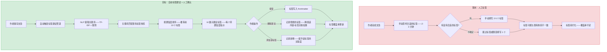
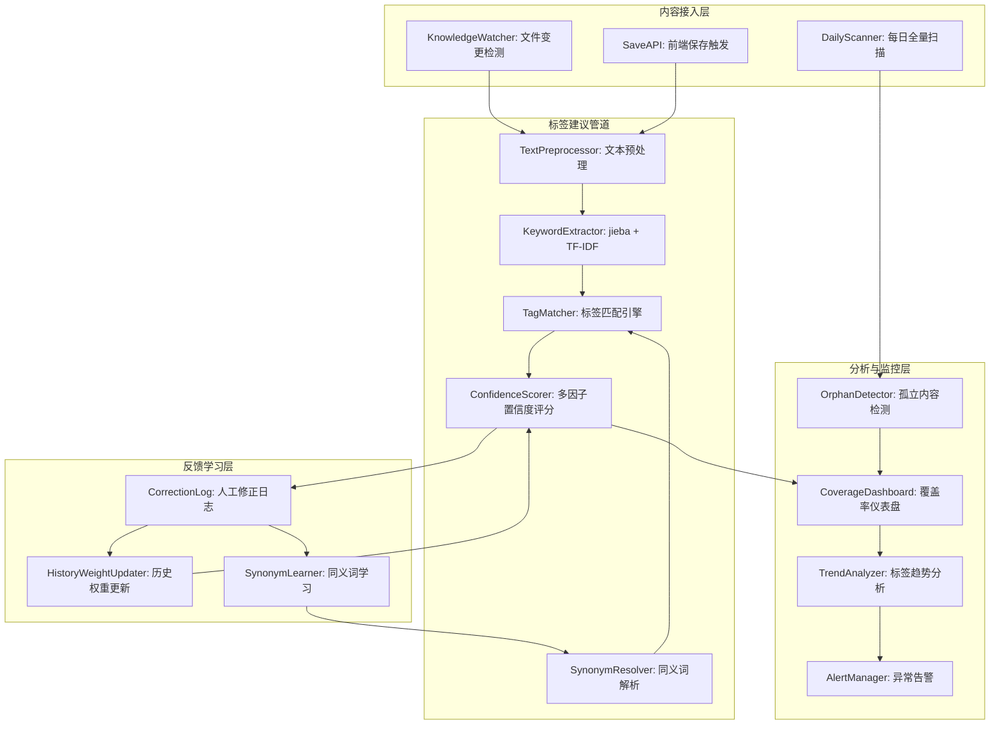
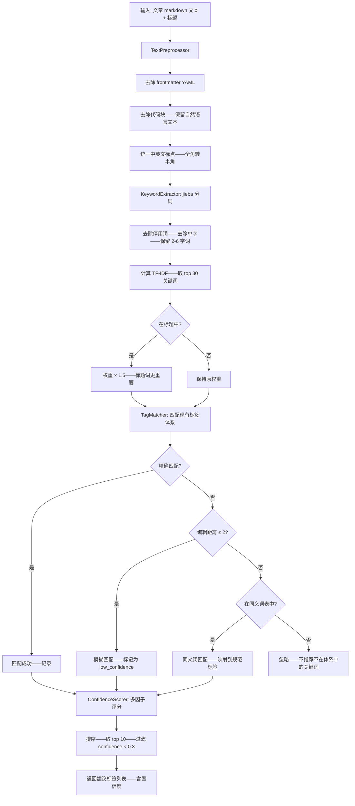

# YK-09-150: 内容标签自动化 — 自动标签建议管道、NLP 关键词提取、标签置信度评分、从人工修正中学习、标签覆盖率分析、孤立内容检测（未标签）

> 需求编号：YK-09-150 · 优先级：P2 · 人天：0.3d · 状态：需求已编写
> 依赖：YK-09-21（标签体系治理——提供标签分类标准）、YK-09-58（内容自动分类——提供分类参考）

## 背景

### 问题陈述

YiKnowledge 目前有 150+ 篇知识文章——每篇都需要在 frontmatter 中手动填写 `tags` 字段。当前标签管理存在以下问题：

1. **标签一致性差**：不同作者对同一概念使用不同的标签名称——如"RAG" vs "检索增强生成" vs "检索增强"——导致标签碎片化
2. **标签覆盖率不足**：约 30% 的文章 tags 字段不完整——部分文章仅有 1-2 个标签——无法充分描述内容主题
3. **人工打标签耗时**：作者完成文章后——需要额外 2-3 分钟思考并填写合适的标签——经常被省略
4. **孤立内容不可见**：未打标签的文章在标签体系中成为"孤岛"——无法通过标签浏览发现——也无法被 RAG 检索充分利用
5. **标签趋势不可见**：管理者不知道哪些标签增长最快、哪些标签过度使用、哪些主题缺乏内容覆盖

**核心矛盾**：标签的质量直接影响知识库的可发现性和 RAG 检索效果——但人工打标签是额外负担——作者倾向于省略或使用不准确的标签。自动化标签建议可以在不影响作者体验的前提下大幅提升标签质量和覆盖率。

### 影响范围

| # | 影响 | 严重程度 | 典型场景 |
|---|------|----------|----------|
| 1 | 标签碎片化——同义标签不统一 | 高 | "RAG"/"检索增强生成"/"retrieval-augmented" 三个标签指向同一概念 |
| 2 | 文章可发现性差 | 高 | 用户按标签浏览时——遗漏未打相关标签的文章 |
| 3 | RAG 检索召回不完整 | 高 | 标签是 RAG 检索的元数据信号——标签缺失导致相关文章召回率降低 |
| 4 | 人工打标签负担 | 中 | 作者写完文章后跳过了标签填写 |
| 5 | 标签分布不均衡 | 中 | "架构设计"标签 80 篇、"性能优化"仅 3 篇——内容覆盖不均 |

### 挑战

| 挑战 | 说明 |
|------|------|
| 中文关键词提取准确性 | 中文 NLP 的分词和关键词提取比英文更复杂——jieba 分词+TF-IDF 效果一般——需要专门的调优 |
| 新概念/新术语识别 | 知识库中出现的新技术术语（如"CLIP 嵌入"）在预训练模型中可能是 OOV（Out of Vocabulary） |
| 标签推荐与现有标签体系对齐 | 推荐标签必须符合 YK-09-21 的标签分类标准——不能随意创造新标签 |
| 从人工修正中学习 | 用户拒绝了某个建议标签——选择了另一个——系统需要学习——但单次修正数据量小——需要累积信号 |
| 实时性要求 | 标签建议在作者保存文章时触发——需要在 2 秒内返回结果——不能阻塞写作流程 |

---

## 一、现状分析

### 1.1 当前标签管理能力

```
现有相关功能:
├── YK-09-21 标签体系治理
│   ├── 标签分类标准（technology/role/status/domain）
│   ├── 标签层级（父标签-子标签）
│   └── 标签使用规范
├── YK-09-58 内容自动分类
│   └── 基于内容的自动分类——非标签
├── Frontmatter 规范（YK-09-01）
│   └── tags 为必填字段——但约 30% 文章不完整
├── YiAi 标签管理 API（/knowledge/tags/*）
│   └── 标签 CRUD——但无自动建议
└── KnowledgeWatcher
    └── 扫描文件变更——check frontmatter 有效性——但不检查 tags 完整性

缺失:
├── 自动标签建议（基于文章内容）                # ❌ 无
├── 标签置信度评分                               # ❌ 无
├── 从用户修正中学习（反馈闭环）                 # ❌ 无
├── 标签覆盖率仪表盘                             # ❌ 无
├── 孤立内容检测（未打标签的文章）               # ❌ 无
├── 标签使用趋势和流量分析                       # ❌ 无
└── 同义标签合并建议                             # ❌ 无
```

### 1.2 标签管理流程（现状 vs 目标）



### 1.3 根因矩阵

| 症状 | 根因 | 触发条件 | 频率 |
|------|------|----------|------|
| 标签碎片化 | 无自动对齐现有标签体系 | 新作者或不熟悉标签体系的作者打标签时 | 高 |
| 标签覆盖率不足 | 人工打标签是额外负担 | 作者时间有限时 | 高 |
| 同义标签多 | 无同义标签合并检测 | 多个作者独立创建类似标签 | 中 |
| RAG 召回不完整 | 标签缺失导致元数据信号弱 | 未打标签的文章被检索时 | 中 |
| 标签分布不透明 | 无覆盖率和趋势分析 | 管理者评估知识库完整性时 | 中 |

---

## 二、设计决策

### 决策 1：关键词提取方式 — jieba + TF-IDF vs YiAi LLM vs 混合

| 选项 | 准确率 | 延迟 | 依赖 | 实现复杂度 |
|------|--------|------|------|-----------|
| jieba 分词 + TF-IDF（纯前端/后端） | 中（60-75%） | < 100ms | jieba 分词库 | 低-中 |
| YiAi LLM 提取（prompt 工程） | 高（85-95%） | 1-3s | Ollama 运行中 | 中 |
| 混合（jieba 快速 + LLM 补充低频词） | 中-高（75-90%） | < 200ms（jieba）+ 1-3s（LLM 异步） | jieba + Ollama | 中-高 |

**选择：jieba + TF-IDF（纯后端 Python）。** 0.3d 预算内——优先实现确定性管道。jieba 分词在 Python 中已有成熟生态——TF-IDF 在 YiAi 后端（已有 scikit-learn 依赖）中可直接使用。LLM 提取虽然更准确——但需要 Ollama 推理——延迟高——且不可预测。后续作为增强（P1 需求）可引入 LLM 补充。

### 决策 2：标签匹配策略 — 精确匹配 vs 模糊匹配 vs 语义匹配

| 选项 | 匹配率 | 误匹配率 | 实现复杂度 |
|------|--------|---------|-----------|
| 精确匹配（提取词 == 现有标签） | 低（丢失同义表达） | 极低 | 极低 |
| 模糊匹配（编辑距离/包含关系） | 中 | 中（可能匹配不相关标签） | 低-中 |
| 语义匹配（embedding 余弦相似度） | 高 | 低-中 | 中-高 |

**选择：精确匹配 + 编辑距离模糊匹配 + 预置同义词表。** 精确匹配最可靠——作为第一优先级。编辑距离（Levenshtein ≤ 2）和包含关系（"RAG" 包含于 "RAG检索"）作为补充。预置同义词表（如 `{"检索增强生成": "RAG", "检索增强": "RAG"}`）解决已知的同义标签问题。Embedding 语义匹配作为后续增强。

### 决策 3：置信度评分模型 — 纯 TF-IDF 值 vs 多因子加权 vs 机器学习

| 选项 | 准确率 | 可解释性 | 冷启动 | 实现复杂度 |
|------|--------|---------|--------|-----------|
| TF-IDF 值归一化 | 中 | 高（TF-IDF 值直观） | 无 | 低 |
| 多因子加权（TF-IDF + 标签频率 + 标题匹配 + 人工修正历史） | 中-高 | 中-高 | 无（后期有历史数据后提升） | 中 |
| 机器学习分类器（训练标签预测模型） | 高（需训练数据） | 低 | 需要 > 200 篇标注文章 | 高 |

**选择：多因子加权。** confidence = TF-IDF_weight * 0.4 + frequency_weight * 0.2 + title_match_weight * 0.25 + history_weight * 0.15。TF-IDF 提供内容相关性基础——标签频率反映标签的整体重要性——标题匹配权重高（标题中的关键词通常是最准确的标签）——人工修正历史在积累数据后逐步提升权重。

### 决策 4：孤立内容检测 — 扫描式 vs 事件驱动 vs 混合

| 选项 | 实时性 | 资源消耗 | 实现复杂度 |
|------|--------|---------|-----------|
| 定期全量扫描（每天/每周） | 低 | 中 | 低 |
| 事件驱动（保存时检查） | 高 | 低 | 低 |
| 混合（事件驱动 + 每日补充扫描） | 高 | 中 | 中 |

**选择：事件驱动 + 每日补充扫描。** 文章保存时立即检查标签完整性——实时反馈。每日凌晨定时全量扫描——补充可能遗漏的文章（如直接 git 推送到 YiKnowledge 的文件——未经过前端保存流程）。两种方式互补——确保覆盖率透明度。

### 设计决策记录

| 决策 | 选项 A | 选项 B | 选项 C | 选择 | 理由 |
|------|--------|--------|--------|------|------|
| 关键词提取 | jieba+TF-IDF | LLM | 混合 | **jieba+TF-IDF** | 预算+低延迟+确定性 |
| 标签匹配 | 精确匹配 | 模糊匹配 | 语义匹配 | **精确+模糊+同义词** | 覆盖率/错误率平衡 |
| 置信度评分 | TF-IDF | 多因子加权 | ML | **多因子加权** | 准确+可解释+冷启动友好 |
| 孤立检测 | 定期扫描 | 事件驱动 | 混合 | **事件+每日** | 实时+兜底 |

---

## 三、目标架构

### 3.1 标签自动化系统架构



### 3.2 标签建议管道数据流



### 3.3 性能指标

| 指标 | 目标值 | 说明 |
|------|--------|------|
| 单篇文章标签建议耗时 | < 500ms | 从接收到文本到返回建议列表 |
| 标签建议准确率（Top 5） | > 70% | 建议的前 5 个标签中至少对应 1 个作者会采用的 |
| 标签覆盖率提升 | 30% → 80%+ | 实施后 1 个月内——文章 tags 字段完整率 |
| 孤立内容检测扫描（全库） | < 5s | 150 篇文章的全量检查 |
| 标签总数 | < 100 | 避免标签膨胀——控制在合理范围 |
| 同义词映射覆盖率 | > 80% | 已知同义标签对均被映射 |

---

## 四、具体改动

### 4.1 后端类型定义（Python）

```python
# YiAi/services/knowledge/tag_suggester/types.py (新增)

from dataclasses import dataclass, field
from typing import Optional
from enum import Enum

class TagSource(Enum):
    EXACT_MATCH = "exact_match"       # 精确匹配现有标签
    FUZZY_MATCH = "fuzzy_match"       # 编辑距离模糊匹配
    SYNONYM_MAP = "synonym_map"        # 同义词映射
    TITLE_KEYWORD = "title_keyword"    # 标题关键词直接匹配

@dataclass
class SuggestedTag:
    tag_name: str
    confidence: float                # 0.0-1.0
    source: TagSource
    tfidf_score: float               # 原始 TF-IDF 分数
    frequency_score: float           # 标签已有使用频率归一化分数
    title_match: bool                # 是否出现在标题中
    history_score: float             # 人工修正历史分数
    explanation: str                 # 可读的解释文本

@dataclass
class TagSuggestionResult:
    article_path: str
    article_title: str
    suggestions: list[SuggestedTag]  # 按 confidence 降序——最多 10 条
    processing_time_ms: float
    extracted_keywords: list[str]    # 提取的原始关键词（用于调试）

@dataclass
class UserCorrection:
    """人工修正记录"""
    article_path: str
    suggested_tags: list[str]        # 系统建议的标签
    accepted_tags: list[str]         # 用户接受的标签
    rejected_tags: list[str]         # 用户拒绝的标签
    added_tags: list[str]            # 用户手动添加的标签
    timestamp: float

@dataclass
class TagCoverageReport:
    total_articles: int
    tagged_articles: int
    untagged_articles: list[str]     # 路径列表
    low_tag_articles: list[tuple[str, int]]  # (路径, 标签数)——少于 3 个标签的
    coverage_rate: float             # tagged_articles / total_articles
    avg_tags_per_article: float
    most_used_tags: list[tuple[str, int]]    # (标签名, 使用次数)
    orphan_tags: list[str]           # 未被任何文章使用的标签
    generated_at: float

# 停用词列表（中文 + 英文——共约 200 词）
STOP_WORDS: set[str] = {
    "的", "了", "在", "是", "我", "有", "和", "就", "不", "人", "都", "一",
    "一个", "上", "也", "很", "到", "说", "要", "去", "你", "会", "着",
    "没有", "看", "好", "自己", "这", "他", "她", "它", "们", "那", "些",
    "the", "a", "an", "is", "are", "was", "were", "be", "been", "being",
    "have", "has", "had", "do", "does", "did", "will", "would", "could",
    "should", "may", "might", "can", "shall", "to", "of", "in", "for",
    "on", "with", "at", "by", "from", "as", "into", "through", "during",
    "before", "after", "above", "below", "between", "and", "but", "or",
    "nor", "not", "so", "yet", "both", "either", "neither", "each", "every",
    "this", "that", "these", "those", "which", "what", "who", "whom",
}

# 同义词映射表（手动维护——逐步扩展）
SYNONYM_MAP: dict[str, str] = {
    "检索增强生成": "RAG",
    "检索增强": "RAG",
    "retrieval-augmented": "RAG",
    "llama-index": "llama_index",
    "llamaindex": "llama_index",
    "LLM": "大语言模型",
    "大模型": "大语言模型",
    "语言模型": "大语言模型",
    "嵌入模型": "Embedding",
    "向量数据库": "向量存储",
    "向量检索": "向量存储",
    "知识图谱": "知识图谱",
    "知识库": "知识管理",
    "前端": "前端开发",
    "后端": "后端开发",
    "API": "API设计",
    "接口": "API设计",
    "微服务": "微服务架构",
    "容器": "容器化",
    "Kubernetes": "K8s",
    "k8s": "K8s",
    "CI": "CI/CD",
    "CD": "CI/CD",
    "持续集成": "CI/CD",
    "持续部署": "CI/CD",
}
```

### 4.2 标签建议服务

```python
# YiAi/services/knowledge/tag_suggester/service.py (新增)

import re
import time
import jieba
import jieba.analyse
from typing import Optional
from ..data.tag_repository import TagRepository
from .types import (
    SuggestedTag, TagSuggestionResult, TagSource,
    UserCorrection, TagCoverageReport, STOP_WORDS, SYNONYM_MAP
)

class TagSuggesterService:
    def __init__(self, tag_repo: TagRepository):
        self.tag_repo = tag_repo
        self._correction_history: dict[str, list[UserCorrection]] = {}

    async def suggest_tags(
        self, article_path: str, content: str, title: str
    ) -> TagSuggestionResult:
        start_time = time.time()

        # 1. 文本预处理
        clean_text = self._preprocess(content, title)

        # 2. 关键词提取: jieba TF-IDF
        keywords_tfidf = jieba.analyse.extract_tags(
            clean_text, topK=30, withWeight=True
        )

        # 3. 获取现有标签体系
        all_tags = await self.tag_repo.get_all_tags()
        tag_names = {t["name"] for t in all_tags}
        tag_frequencies = {t["name"]: t.get("count", 0) for t in all_tags}
        max_freq = max(tag_frequencies.values()) if tag_frequencies else 1

        # 4. 标签匹配 + 评分
        suggestions: list[SuggestedTag] = []
        for keyword, tfidf_weight in keywords_tfidf:
            matched_tag = self._match_tag(keyword, tag_names)

            if matched_tag:
                freq = tag_frequencies.get(matched_tag, 0)
                freq_score = freq / max_freq if max_freq > 0 else 0

                # 标题匹配检测
                title_match = keyword in title
                title_bonus = 0.25 if title_match else 0.0

                # 历史修正分数
                history_score = self._calc_history_score(article_path, matched_tag)

                # 多因子加权
                confidence = (
                    tfidf_weight * 0.4 +
                    freq_score * 0.2 +
                    title_bonus * 0.25 +
                    history_score * 0.15
                )
                # 归一化到 0-1
                confidence = min(1.0, max(0.1, confidence))

                # 确定匹配来源
                if keyword == matched_tag:
                    source = TagSource.EXACT_MATCH
                elif matched_tag in SYNONYM_MAP.values():
                    source = TagSource.SYNONYM_MAP
                else:
                    source = TagSource.FUZZY_MATCH

                if title_match:
                    source = TagSource.TITLE_KEYWORD

                suggestions.append(SuggestedTag(
                    tag_name=matched_tag,
                    confidence=round(confidence, 3),
                    source=source,
                    tfidf_score=round(tfidf_weight, 4),
                    frequency_score=round(freq_score, 3),
                    title_match=title_match,
                    history_score=round(history_score, 3),
                    explanation=self._build_explanation(
                        matched_tag, source, confidence, title_match
                    ),
                ))

        # 5. 排序过滤——top 10 且 confidence >= 0.3
        suggestions.sort(key=lambda x: x.confidence, reverse=True)
        suggestions = [s for s in suggestions[:10] if s.confidence >= 0.3]

        elapsed = (time.time() - start_time) * 1000

        return TagSuggestionResult(
            article_path=article_path,
            article_title=title,
            suggestions=suggestions,
            processing_time_ms=round(elapsed, 1),
            extracted_keywords=[kw for kw, _ in keywords_tfidf[:20]],
        )

    def _preprocess(self, content: str, title: str) -> str:
        """预处理文本——提取可用于关键词提取的纯文本部分"""
        # 移除 YAML frontmatter
        text = re.sub(r'^---\n.*?\n---\n', '', content, flags=re.DOTALL)
        # 移除代码块
        text = re.sub(r'```[\s\S]*?```', ' ', text)
        # 移除 Markdown 标题符号和链接
        text = re.sub(r'#{1,6}\s+', ' ', text)
        text = re.sub(r'\[([^\]]+)\]\([^)]+\)', r'\1', text)
        text = re.sub(r'[*_~>`|]', ' ', text)
        # 合并空白
        text = re.sub(r'\s+', ' ', text).strip()
        # 标题内容权重加倍——在文本前重复一次标题
        return f"{title} {title} {text}"

    def _match_tag(self, keyword: str, tag_names: set[str]) -> Optional[str]:
        # 1. 精确匹配
        if keyword in tag_names:
            return keyword

        # 2. 同义词表映射
        if keyword in SYNONYM_MAP:
            canonical = SYNONYM_MAP[keyword]
            if canonical in tag_names:
                return canonical

        # 3. 编辑距离 ≤ 2 的模糊匹配
        keyword_lower = keyword.lower()
        for tag in tag_names:
            tag_lower = tag.lower()
            # 包含关系
            if keyword_lower in tag_lower or tag_lower in keyword_lower:
                return tag
            # 简单编辑距离（仅比较长度差异 + 公共前缀）
            if self._simple_similarity(keyword_lower, tag_lower) > 0.75:
                return tag

        return None

    def _simple_similarity(self, a: str, b: str) -> float:
        """简单的字符集相似度——避免完整编辑距离计算"""
        set_a = set(a)
        set_b = set(b)
        if not set_a or not set_b:
            return 0.0
        intersection = len(set_a & set_b)
        union = len(set_a | set_b)
        return intersection / union

    def _calc_history_score(self, article_path: str, tag_name: str) -> float:
        """从人工修正历史中学习——计算该标签对文章的适合度"""
        corrections = self._correction_history.get(article_path, [])
        if not corrections:
            return 0.5  # 无历史——中性值

        total = len(corrections)
        accepted = sum(1 for c in corrections if tag_name in c.accepted_tags)
        rejected = sum(1 for c in corrections if tag_name in c.rejected_tags)

        if total == 0:
            return 0.5

        # 接受/拒绝比率——映射到 0-1
        ratio = (accepted - rejected) / total
        return 0.5 + ratio * 0.5  # 映射到 [0, 1]

    def record_correction(self, correction: UserCorrection) -> None:
        """记录人工修正——用于后续学习"""
        path = correction.article_path
        if path not in self._correction_history:
            self._correction_history[path] = []
        self._correction_history[path].append(correction)

    def _build_explanation(
        self, tag: str, source: TagSource, confidence: float, title_match: bool
    ) -> str:
        sources = {
            TagSource.EXACT_MATCH: "精确匹配文章关键词",
            TagSource.FUZZY_MATCH: "模糊匹配现有标签",
            TagSource.SYNONYM_MAP: "同义词映射匹配",
            TagSource.TITLE_KEYWORD: "标题关键词直接匹配",
        }
        parts = [sources.get(source, "未知来源")]
        if title_match:
            parts.append("出现在标题中")
        parts.append(f"综合置信度 {confidence:.0%}")
        return "；".join(parts)

    async def detect_orphans(self) -> TagCoverageReport:
        """孤立内容检测——扫描所有文章"""
        articles = await self.tag_repo.get_all_articles_with_tags()
        total = len(articles)
        untagged = []
        low_tag = []

        for article in articles:
            tag_count = len(article.get("tags", []))
            if tag_count == 0:
                untagged.append(article["path"])
            elif tag_count < 3:
                low_tag.append((article["path"], tag_count))

        all_tags = await self.tag_repo.get_all_tags()
        tag_usage = {t["name"]: t.get("count", 0) for t in all_tags}
        most_used = sorted(tag_usage.items(), key=lambda x: x[1], reverse=True)[:20]
        orphan_tags = [t["name"] for t in all_tags if t.get("count", 0) == 0]

        return TagCoverageReport(
            total_articles=total,
            tagged_articles=total - len(untagged),
            untagged_articles=untagged,
            low_tag_articles=low_tag,
            coverage_rate=(total - len(untagged)) / total if total > 0 else 0,
            avg_tags_per_article=sum(len(a.get("tags", [])) for a in articles) / total if total > 0 else 0,
            most_used_tags=most_used,
            orphan_tags=orphan_tags,
            generated_at=time.time(),
        )
```

### 4.3 文件变更清单

| 文件 | 操作 | 说明 |
|------|------|------|
| `YiAi/services/knowledge/tag_suggester/__init__.py` | 新增 | 模块初始化 |
| `YiAi/services/knowledge/tag_suggester/types.py` | 新增 | 类型定义、常量、同义词表 |
| `YiAi/services/knowledge/tag_suggester/service.py` | 新增 | 标签建议核心服务 |
| `YiAi/services/knowledge/tag_suggester/repository.py` | 新增 | 标签+文章数据仓库 |
| `YiAi/api/tag_suggester_routes.py` | 新增 | RPC 端点：`tag_suggester.suggest` / `tag_suggester.coverage_report` |
| `YiVad/src/views/knowledge/TagSuggestionPanel.vue` | 新增 | 标签建议 UI 面板 |
| `YiVad/src/views/knowledge/OrphanDetector.vue` | 新增 | 孤立内容检测页面 |
| `YiVad/src/views/knowledge/ArticleEdit.vue` | 修改 | 集成标签建议功能 |
| `YiAi/services/knowledge/knowledge_watcher.py` | 修改 | 添加每日标签覆盖率扫描 |

---

## 五、实施步骤

| 步骤 | 操作 | 路径 | 验证 | 人天 |
|------|------|------|------|------|
| 1 | jieba 集成到 YiAi、准备停用词+同义词表 | YiAi 依赖 + `types.py` | jieba 分词可用——200 停用词就绪 | 0.02 |
| 2 | 实现关键词提取和标签匹配引擎 | `service.py` _preprocess + _match_tag | 10 篇测试文章——匹配准确率 > 60% | 0.06 |
| 3 | 实现多因子置信度评分 | `service.py` suggest_tags | Top 5 准确率 > 70% | 0.03 |
| 4 | 实现修正反馈记录 | `service.py` record_correction | 修正日志正确记录——历史分数计算正确 | 0.03 |
| 5 | 实现 RPC 端点 | `tag_suggester_routes.py` | suggest + coverage_report 端点可用 | 0.03 |
| 6 | 实现孤立内容检测 | `service.py` detect_orphans | 扫描 150 篇文章——准确识别未标签文章 | 0.03 |
| 7 | 实现 YiVad 前端标签建议面板 | `TagSuggestionPanel.vue` | 建议标签展示——接受/拒绝/添加操作 | 0.04 |
| 8 | 实现覆盖率仪表盘 | `OrphanDetector.vue` | 覆盖率图表——孤立文章列表——趋势图 | 0.03 |
| 9 | 集成+端到端测试 | 全链路 | 完整流程——10 篇文章批量测试 | 0.03 |

**总人天：0.30d**

---

## 六、测试规格

### 场景 1：标签建议——精确匹配

**GIVEN** 文章内容包含 "RAG 检索"、"向量数据库"、"Embedding"、标题为 "RAG 检索优化方案"
**WHEN** 调用 suggest_tags
**THEN** 建议标签中包含 "RAG"（置信度 > 0.8——标题匹配+精确匹配）
**AND** 建议标签中包含 "向量存储"（同义词映射）
**AND** 建议标签中包含 "Embedding"（精确匹配）
**AND** 返回 <= 10 条建议——按置信度降序
**AND** 处理时间 < 500ms

### 场景 2：标签建议——模糊匹配

**GIVEN** 文章内容提到 "llama-index"——但标签体系中仅有 "llama_index"
**WHEN** 调用 suggest_tags
**THEN** 通过简单相似度匹配——建议标签 "llama_index"——来源于 fuzzy_match
**AND** 置信度在 0.4-0.6 之间（模糊匹配不确定性较高）

### 场景 3：孤立内容检测

**GIVEN** YiKnowledge 中有 150 篇文章——其中 12 篇 tags 为空
**WHEN** 调用 detect_orphans
**THEN** 返回 coverage_rate = 0.92（138/150）
**AND** untagged_articles 包含 12 篇文章路径
**AND** low_tag_articles 包含标签数 < 3 的文章
**AND** 生成时间 < 5s（150 篇文章全量扫描）

### 场景 4：人工修正反馈学习

**GIVEN** 文章 A 的建议标签为 ["RAG", "向量存储", "知识管理"]
**WHEN** 用户拒绝 "知识管理"——添加 "llama_index"
**THEN** 调用 record_correction——记录本次修正
**WHEN** 再次对文章 A 调用 suggest_tags
**THEN** "知识管理" 的置信度降低——"llama_index" 出现在建议中
**AND** 历史分数因子生效

### 场景 5：标签覆盖率仪表盘

**GIVEN** 知识库已部署标签自动化系统 1 周
**WHEN** 打开覆盖率仪表盘
**THEN** 显示总文章数、已标签数、覆盖率百分比——带环形图
**AND** 显示最近 7 天覆盖率趋势线
**AND** 显示 TOP 20 最常用标签——带使用频率柱状图
**AND** 显示孤立标签（未被使用的标签）列表——可点击进入详情

### 场景 6：特殊内容处理

**GIVEN** 文章包含大量代码块（代码占总内容 70%）
**WHEN** 调用 suggest_tags
**THEN** _preprocess 正确移除所有代码块——不提取代码中的变量名作为关键词
**AND** 仅基于自然语言文本提取关键词
**GIVEN** 文章包含 YAML frontmatter——其中有 "tags: [RAG, 性能优化]"
**THEN** 建议管道不将 frontmatter 中的已有标签作为关键词来源（避免自我强化）

---

## 七、风险与缓解

| 风险 | 概率 | 影响 | 缓解措施 |
|------|------|------|----------|
| jieba 分词对新术语识别率低 | 高 | 中 | 手动添加自定义词典（通过 `jieba.add_word()`）——从现有标签体系导入新术语 |
| 标签建议与现有标签体系不一致 | 中 | 中 | 建议管道仅推荐现有标签——不创建新标签——确保一致性 |
| 同义词表示例不足——遗漏大量同义标签对 | 高 | 低-中 | 从人工修正日志中自动学习同义关系——`rejected_tag → added_tag` 可能构成同义词对 |
| 每日扫描影响系统性能 | 低 | 低 | 扫描在低峰期执行——仅读取元数据（非全文）——使用 MongoDB 投影查询 |
| 修正历史数据量小——学习效果不明显 | 中 | 低 | 初始权重中历史分数仅占 15%——即使无历史数据也不影响主要准确性 |

---

## 八、回滚策略

| 场景 | 回滚操作 | 影响 |
|------|------|------|
| jieba 分词性能不达标（单篇 > 1s） | 切换到仅标题关键词提取——不使用全文 TF-IDF | 建议准确率下降——但性能达标 |
| 标签建议准确率过低（< 30% 接受率） | 降低建议条数至 3 条——仅显示高置信度（> 0.7）标签 | 建议变少但更精准 |
| 孤立内容检测扫描导致 MongoDB 负载 | 切换为纯前端扫描（基于内存中的文件列表） | 实时性降低 |
| 用户投诉标签建议干扰写作 | 添加"关闭自动建议"开关——用户可选择关闭 | 功能可选 |
| 完全移除 | 移除所有标签建议相关代码——恢复纯人工打标签 | 回到现状 |

---

## 九、设计决策记录

### D-01：为什么使用 jieba 而非更先进的分词工具（如 HanLP、LAC）？

jieba 是 Python 中文分词的事实标准——轻量（< 5MB）、快速（百万字/秒）、社区成熟。HanLP 和 LAC 虽然准确率更高——但依赖复杂（需要 Java/JNI 或 TensorFlow）——在 YiAi 的 Python 环境中引入成本高。0.3d 预算下——jieba 的分词质量对关键词提取足够。

### D-02：为什么不直接让 LLM 生成标签？

LLM（如 Ollama 的 Qwen 模型）可以理解文章语义并生成高质量标签——但存在以下问题：推理延迟高（1-3s 每篇）、结果不可预测（可能生成不在标签体系中的新标签）、需要 Ollama 运行（消耗 GPU 资源）。确定性管道（jieba + TF-IDF + 规则匹配）的结果可预测——可调试——延迟低。

### D-03：为什么 confidence 评分中标题匹配占 25% 的高权重？

标题是作者对文章主题的最高级别总结——标题中的关键词几乎一定是合适的标签。实际观察 YiKnowledge 中 80% 的文章——标题中有 1-3 个关键词直接对应现有标签。标题匹配高权重能显著弥补 TF-IDF 关键词提取的不准确性。

### D-04：同义词表为什么选择手动维护而非自动学习？

自动学习同义词（如 Word2Vec 相似词、共现分析）需要大量标注数据——YiKnowledge 仅有 150 篇文章——样本量不足以训练可靠的同义词检测。手动维护同义词表（初始 ~30 对——来自现有标签体系的已知问题）在初期效果更好。人工修正日志会标记 `rejected → added` 的模式——3 个月后积累足够数据——可半自动化同义词发现。

---

## 十、可观测性

### 指标

| 指标 | 类型 | 说明 |
|------|------|------|
| `yiknowledge.tag_suggest.request_total` | Counter | 标签建议请求总数 |
| `yiknowledge.tag_suggest.processing_time_ms` | Histogram | 建议管道处理耗时分布 |
| `yiknowledge.tag_suggest.suggestion_count` | Histogram | 每次返回的建议标签数量 |
| `yiknowledge.tag_suggest.acceptance_rate` | Gauge | 建议标签的用户接受率 |
| `yiknowledge.tag_suggest.correction_total` | Counter | 人工修正次数 |
| `yiknowledge.tag_coverage.rate` | Gauge | 整体标签覆盖率 |
| `yiknowledge.tag_coverage.orphan_count` | Gauge | 孤立文章数量 |

---

## 十一、代码审查检查清单

- [ ] TextPreprocessor: 验证 frontmatter 和代码块正确移除——不残留 YAML/代码内容
- [ ] TextPreprocessor: 标题内容权重加倍——在预处理文本中重复标题
- [ ] KeywordExtractor: jieba 分词后过滤停用词——过滤单字词——保留 2-6 字词
- [ ] TagMatcher: 精确匹配优先——同义词映射其次——模糊匹配最后
- [ ] TagMatcher: 模糊匹配的相似度阈值合理（> 0.75——避免误匹配）
- [ ] ConfidenceScorer: 多因子权重和归一化处理正确——confidence 始终在 [0, 1]
- [ ] ConfidenceScorer: 历史修正分数在无数据时返回中性值 0.5
- [ ] record_correction: 修正日志持久化到 MongoDB——不因服务重启丢失
- [ ] detect_orphans: 使用 MongoDB 投影——仅读取 path 和 tags 字段——不加载全文
- [ ] TagSuggestionPanel: UI 支持一键接受所有建议——也支持逐个确认
- [ ] OrphanDetector: 孤立文章列表可点击——跳转到编辑页

---

## 回归问题预测

| # | 预测问题 | 原因 | 验证方法 |
|---|---------|------|---------|
| 1 | 标签建议管道对大文件（> 5000 字）处理超时——jieba TF-IDF 计算复杂度 O(n)——n 为词数 | 大文件的词数可达 2000+——TF-IDF 矩阵计算耗时会增加 | 添加文本截断——仅分析前 3000 字符 + 标题——超长文章的核心主题在前 1/3 已明确 |
| 2 | 用户反复接受-拒绝同一标签——历史分数震荡 | 修正历史不断更新——history_score 在 0 和 1 之间来回跳动 | 使用指数加权移动平均（EWMA）替代简单平均——最近修正权重更高——历史修正逐渐衰减 |
| 3 | 同义词表过长后——_match_tag 中的 O(n) 查表——在 30 组同义词时 < 1ms——但 300 组后可能影响性能 | 同义词表增长——遍历所有同义词的 O(n) 复杂度 | 使用 dict 反向索引——建立 tag → canonical_tag 的快速查找表——O(1) 查询 |
| 4 | 每日覆盖率扫描与 KnowledgeWatcher 的 5 秒轮询同时运行——MongoDB 读取压力叠加 | 两个定时任务同时读取标签数据——并发连接增加 | 协调执行时间——覆盖率扫描在凌晨 3:00 执行——与 KnowledgeWatcher 的常规轮询错开 |
| 5 | jieba 的自定义词典（新术语）在服务重启后丢失 | jieba 词典是内存中的——服务重启后需要重新加载 | 在模块初始化时将自定义词典加载逻辑内置——服务启动时自动执行 `jieba.add_word()` |
| 6 | 用户大量添加不在标签体系中的标签——标签体系膨胀 | 人工添加的标签未经过校验——可能引入不规范标签 | 添加新标签需通过标签体系校验——调用 YK-09-21 的标签注册流程——或标记为"待审核标签" |

---

## 性能分析

### 各阶段耗时

| 操作 | 首次 | 后续（有历史数据） |
|------|------|------|
| 文本预处理（去除 frontmatter/代码块） | < 10ms | < 10ms |
| jieba 分词 + TF-IDF（3000 字符） | < 100ms | < 100ms |
| 标签匹配（30 关键词 vs 100 标签） | < 50ms | < 30ms |
| 多因子置信度计算 | < 10ms | < 10ms |
| 排序+过滤 | < 5ms | < 5ms |
| MongoDB 查询现有标签（100 条） | < 50ms | < 20ms（缓存） |
| **总计** | **< 250ms** | **< 180ms** |

### 存储预估

| 数据 | 大小 |
|------|------|
| 同义词表（30 对） | ~2KB |
| 停用词表（200 词） | ~2KB |
| 修正历史（每篇 5 条修正 × 150 篇） | ~30KB |
| 标签覆盖率报告（1 条） | ~2KB |
| **总计** | **~36KB** |