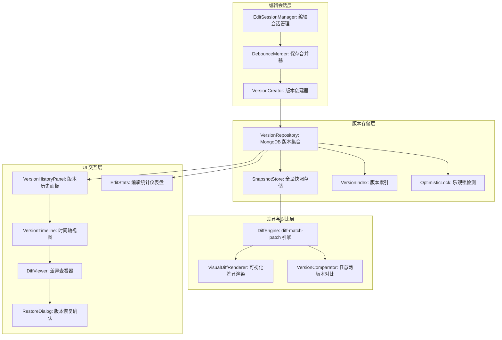

# YK-09-151: 内容编辑历史 — 每篇文章的详细编辑历史、谁/何时/修改了什么、版本间可视化差异对比、恢复之前版本、编辑统计、协作编辑追踪

> 需求编号：YK-09-151 · 优先级：P2 · 人天：0.3d · 状态：需求已编写
> 依赖：YK-09-90（内容版本管理与差异对比——提供版本存储基础）、YK-09-06（知识生命周期——提供内容状态追踪）

## 背景

### 问题陈述

YiKnowledge 的文章编辑目前只有"当前版本"——无历史追踪。这导致多个痛点：

1. **误操作无法恢复**：作者删除了重要段落并保存——没有撤销途径——丢失的内容永久消失
2. **变更不可追溯**：不知道谁在何时修改了什么——当发现错误信息时——无法定位是哪个版本引入的
3. **协作冲突无感知**：多人编辑同一篇文章——后保存的人可能覆盖前人的修改——没有任何提示
4. **编辑行为不可见**：管理者无法了解知识库的编辑活跃度——哪些文章频繁修改、哪些长期未更新
5. **版本对比缺失**：无法在 Visual Diff 中查看两个版本的差异——每次修改都需要手动比对

**核心矛盾**：Git 提供了版本控制——但 YiKnowledge 的作者不一定是 Git 用户——通过 YiVad Web 界面编辑的文章不会自动产生 Git commit。需要在应用层实现版本历史——类似 Google Docs 的版本历史或 Notion 的页面历史——让非技术作者也能享受版本控制的好处。

### 影响范围

| # | 影响 | 严重程度 | 典型场景 |
|---|------|----------|----------|
| 1 | 误删内容无法恢复 | 高 | 删除了 200 字的段落——保存后才发现——无法恢复 |
| 2 | 变更无法追溯 | 高 | 发现文章中的技术信息已过时——但不知道何时写入的 |
| 3 | 覆盖他人修改 | 中 | A 编辑开头→B 编辑结尾→A 保存覆盖了 B 的修改 |
| 4 | 编辑活跃度不可见 | 中 | 知识库管理者无法了解哪些文章需要更新 |
| 5 | 无版本回退能力 | 中 | 新版本质量不如旧版本——但无法回退 |

### 挑战

| 挑战 | 说明 |
|------|------|
| 版本存储成本 | 每篇文章每次保存产生一个新版本——存储 150 篇 × 平均 20 个版本 × 5KB = 15MB——分配合适的存储策略 |
| 差异计算性能 | Visual Diff 在文章长度 > 5000 字时——逐行对比算法 O(n*m) 可能耗时——需要优化的 diff 算法 |
| 版本粒度控制 | 每次保存都创建版本会导致版本过多——需要合并短时间内的连续编辑（debounce 合并） |
| 冲突检测 | Web 编辑器的并发编辑检测需要乐观锁或版本向量——但在浏览器扩展场景中实现复杂 |
| 版本恢复的副作用 | 恢复旧版本后——文章的 frontmatter（updated 时间、标签等）是否需要一并恢复 |

---

## 一、现状分析

### 1.1 当前版本管理能力

```
现有相关功能:
├── YK-09-90 内容版本管理与差异对比
│   ├── 基于 Git 的版本存储（YiKnowledge 文件系统级）
│   ├── 版本对比——但仅限 Git 操作——非 Web 界面
│   └── 差异展示——基于 Git diff
├── YiAi 文件读写（/read-file, /write-file）
│   ├── 文件覆盖写入——无历史保留
│   └── 仅当前版本
├── KnowledgeWatcher
│   └── 检测文件变更——但仅记录变更事件——不存储内容快照
├── MongoDB knowledge_files 集合
│   ├── updated 字段——仅记录最后修改时间
│   └── 无历史版本
└── Git（文件系统级）
    └── 需要手动 git commit——Web 编辑不触发

缺失:
├── Web 编辑自动创建版本快照                    # ❌ 无
├── 编辑历史列表（谁/何时/改了什么）            # ❌ 无
├── 版本间可视化差异对比                         # ❌ 无
├── 版本恢复（一键回退）                         # ❌ 无
├── 编辑统计（每位作者/每篇文章/时间段）         # ❌ 无
├── 协作编辑冲突检测                             # ❌ 无
├── 版本注释（为什么修改）                       # ❌ 无
└── 版本生命周期（自动清理旧版本）               # ❌ 无
```

### 1.2 编辑历史流程（现状 vs 目标）

```mermaid
graph TD
    subgraph Current["现状：无版本历史"]
        C1[作者编辑文章] --> C2[点击保存]
        C2 --> C3[文件被覆盖——旧内容永久丢失]
        C3 --> C4[发现写错了——无法恢复]
        C4 --> C5[凭记忆重新编写——耗时且可能遗漏]
    end

    subgraph Target["目标：自动版本历史"]
        T1[作者打开编辑] --> T2[自动创建编辑会话——记录开始时间]
        T2 --> T3[作者修改内容] --> T4[点击保存]
        T4 --> T5[生成版本快照: 内容+diff+元数据]
        T5 --> T6[保存到版本历史存储]
        T6 --> T7[更新文章当前版本]

        T8[发现新版本有问题] --> T9[打开编辑历史面板]
        T9 --> T10[浏览历史版本列表——时间轴]
        T10 --> T11[选择 v3 和 v5——点击对比]
        T11 --> T12[Visual Diff: 红色删除/绿色新增]
        T12 --> T13{决定回退?}
        T13 -->|是| T14[点击"恢复此版本"]
        T14 --> T15[创建新版本 v6——内容 = v3 的内容]
        T15 --> T16[恢复完成——不丢失当前版本]
        T13 -->|否| T17[关闭——当前版本继续]
    end

    style Current fill:#f8d7da,stroke:#dc3545
    style Target fill:#d4edda,stroke:#28a745
```

### 1.3 根因矩阵

| 症状 | 根因 | 触发条件 | 频率 |
|------|------|----------|------|
| 误操作内容丢失 | Web 编辑无版本快照 | 保存后想撤销修改 | 中 |
| 变更不可追溯 | 无历史记录查询 | 发现文章中过时/错误信息 | 中 |
| 协作编辑冲突 | 无并发编辑检测 | 多人编辑同一文章——时间重叠 | 低-中 |
| 编辑活跃度不透明 | 无编辑统计聚合 | 管理者评估知识库健康度 | 中 |
| 无法回退 | 无版本回退机制 | 新版本质量不如旧版本 | 低-中 |

---

## 二、设计决策

### 决策 1：版本存储方式 — 全量快照 vs 增量 diff vs 混合

| 选项 | 恢复速度 | 存储成本 | diff 显示 | 实现复杂度 |
|------|----------|---------|----------|-----------|
| 全量快照（每版本保存完整内容） | 极快（直接读取） | 高（N 版本 × 文章大小） | 需实时计算 | 低 |
| 增量 diff（仅存储与上一版本的差异） | 慢（需回溯所有 diff） | 低（仅变更部分） | 直接可用 | 中 |
| 混合（最近 5 版全量 + 其余增量） | 快（最近版本） | 中 | 全量可实时对比 | 中 |

**选择：全量快照。** 知识库文章平均 3KB——150 篇 × 20 版本 × 3KB = 9MB。存储成本极低。全量快照让 Visual Diff 和版本恢复变得简单——无需回溯 diff 链。增量 diff 在 diff 链断裂时（如某个版本损坏）会导致后续所有版本不可用——风险高。混合方案的优化收益（节省 ~5MB）不值得增加的复杂度。

### 决策 2：版本创建时机 — 每次保存 vs debounce 合并 vs 手动创建

| 选项 | 版本粒度 | 版本数量 | 丢失风险 |
|------|----------|---------|---------|
| 每次保存（每次 Ctrl+S） | 极细（每次按键保存都创建版本） | 极高（1 小时可能 50+ 版本） | 极低 |
| debounce 合并（5 分钟内多次保存→1 个版本） | 中（合并快速迭代） | 中 | 低 |
| 手动创建（用户主动 "保存版本"） | 极粗（用户会忘记） | 低 | 高（内容丢失） |

**选择：debounce 合并（5 分钟窗口）。** 在编辑会话中——同一作者对同一文章的多次保存——如果间隔 < 5 分钟——合并到上一个版本（更新版本内容——不创建新版本号）。5 分钟后或编辑会话结束（关闭编辑页）时——创建新版本快照。这样既避免了版本爆炸（1 小时 50 个版本）——也不会丢失重要内容变更。

### 决策 3：Visual Diff 算法 — 逐行 diff vs 逐词 diff vs 混合

| 选项 | 可读性 | 性能（5000 字） | 实现复杂度 |
|------|--------|----------------|-----------|
| 逐行 diff（diff-match-patch 行模式） | 中（改一个词整行标红） | 高（< 50ms） | 低 |
| 逐词 diff（diff-match-patch 词模式） | 高（精确到词级变更） | 中（< 200ms） | 中 |
| 混合（行级框架 + 词级细节） | 高 | 中（< 150ms） | 中-高 |

**选择：逐词 diff（diff-match-patch 库）。** Google 的 diff-match-patch 库是标准实现——压缩后 ~10KB。逐词 diff 精确显示"哪个词被改成了什么"——而非将整行标红。在 5000 字的文章中——逐词 diff 计算 < 200ms——用户体验可接受。如果需要——未来可优化为混合模式。

### 决策 4：冲突检测 — 乐观锁（版本号）vs 悲观锁（编辑锁）vs 无锁

| 选项 | 并发性 | 冲突率 | 用户体验 | 实现复杂度 |
|------|--------|--------|---------|-----------|
| 乐观锁（保存时检查版本号——冲突则提示） | 高 | 低（多人同时编辑几率低） | 高（不阻塞编辑） | 低 |
| 悲观锁（编辑时锁定——其他人只读） | 低 | 零 | 低（阻塞他人编辑） | 中 |
| 无锁（后保存覆盖先保存） | 高 | 中（静默丢失他人修改） | 中（无感知丢失） | 极低 |

**选择：乐观锁。** 保存时携带当前编辑基于的版本号——服务端检查是否仍为最新——如果不是——提示"文章已被他人修改——是否查看差异？"。知识库的多人同时编辑同一篇文章的概率很低——乐观锁的冲突率 < 5%。悲观锁的编辑锁定在 Web 环境中不可靠（用户关闭标签页后锁可能残留）。

### 设计决策记录

| 决策 | 选项 A | 选项 B | 选项 C | 选择 | 理由 |
|------|--------|--------|--------|------|------|
| 版本存储 | 全量快照 | 增量 diff | 混合 | **全量快照** | 存储成本低+实现简单 |
| 创建时机 | 每次保存 | debounce 合并 | 手动创建 | **debounce 5min** | 粒度/数量平衡 |
| Visual Diff | 逐行 | 逐词 | 混合 | **逐词** | diff-match-patch 成熟可靠 |
| 冲突检测 | 乐观锁 | 悲观锁 | 无锁 | **乐观锁** | 低冲突率+不阻塞 |

---

## 三、目标架构

### 3.1 编辑历史系统架构



### 3.2 版本保存与恢复流程

```mermaid
graph TD
    A[用户点击保存] --> B[构建保存请求: 内容 + 当前版本号]
    B --> C{乐观锁检查}
    C -->|版本号匹配| D[创建新版本快照]
    C -->|版本号过期| E[返回冲突提示——提供差异查看选项]
    E --> F{用户选择}
    F -->|查看差异| G[下载最新版本——展示 diff]
    G --> H{用户决定}
    H -->|合并后保存| I[重新提交——携带最新版本号]
    I --> C
    H -->|放弃编辑| J[关闭编辑器]
    F -->|强制覆盖| K[跳过锁检查——创建版本但标记冲突已忽略]
    K --> D

    D --> L{距上一版本 < 5min?}
    L -->|是——同一编辑会话| M[更新上一版本快照——不创建新版本号]
    L -->|否| N[创建新版本——分配版本号 N+1]
    M --> O[保存完成]
    N --> O

    subgraph Restore["版本恢复流程"]
        R1[用户在历史面板选择版本 v3] --> R2[查看 v3 内容——预览]
        R2 --> R3[点击"恢复此版本"]
        R3 --> R4[确认对话框: "将 v3 恢复为当前版本——当前版本将保存为 v_last+1"]
        R4 --> R5[创建新版本——内容 = v3 的内容]
        R5 --> R6[更新文件——通知 KnowledgeWatcher]
        R6 --> R7[恢复完成——文章显示为 v3 的内容]
    end
```

### 3.3 性能指标

| 指标 | 目标值 | 说明 |
|------|--------|------|
| 版本创建（含全量快照写入 MongoDB） | < 100ms | 3KB 文章 |
| 编辑历史列表加载（30 个版本） | < 200ms | MongoDB 查询 + UI 渲染 |
| Visual Diff 计算（5000 字） | < 200ms | diff-match-patch 逐词模式 |
| Visual Diff 渲染 | < 100ms | DOM 差异高亮渲染 |
| 版本恢复 | < 200ms | 快照读取 + 文件写入 |
| 乐观锁冲突检测 | < 10ms | 仅比较版本号 |

---

## 四、具体改动

### 4.1 数据模型

```typescript
// 版本快照记录（MongoDB edit_history 集合）

interface EditVersion {
  _id: ObjectId;
  article_path: string;          // 文章文件路径
  version: number;               // 版本号（从 1 开始——自增）
  content: string;               // 全量快照——完整 Markdown 内容
  content_hash: string;          // SHA-256 内容哈希——用于快速去重
  title: string;                 // 文章标题（从 frontmatter 提取）
  author: string;                // 编辑者用户名
  author_ip?: string;            // 编辑者 IP（用于审计）
  created_at: ISODate;           // 版本创建时间
  session_id: string;            // 编辑会话 ID（用于合并）
  change_summary?: string;       // 用户填写的修改说明
  change_size: {                 // 变更大小统计
    lines_added: number;
    lines_removed: number;
    chars_added: number;
    chars_removed: number;
  };
  merged_from?: number;          // 此版本合并了哪些版本号（debounce）
  overwritten_by?: number;       // 如果不是最新——被哪个版本覆盖了
  is_restored?: boolean;         // 是否是版本恢复创建的
  restored_from?: number;        // 恢复到哪个版本
}

// 编辑会话记录（MongoDB edit_sessions 集合）

interface EditSession {
  _id: ObjectId;
  session_id: string;            // UUID——编辑会话唯一标识
  article_path: string;
  author: string;
  started_at: ISODate;
  last_activity_at: ISODate;
  ended_at?: ISODate;
  save_count: number;            // 此会话中保存的次数
  versions_created: number[];    // 创建的版本号列表
}
```

### 4.2 后端版本服务

```python
# YiAi/services/knowledge/version_history/service.py (新增)

import hashlib
import uuid
from datetime import datetime, timedelta
from typing import Optional
from ..data.version_repository import VersionRepository
from ..data.edit_session_repository import EditSessionRepository

class VersionHistoryService:
    def __init__(
        self, version_repo: VersionRepository, session_repo: EditSessionRepository
    ):
        self.version_repo = version_repo
        self.session_repo = session_repo

    async def save_version(
        self, article_path: str, content: str, author: str,
        session_id: str, base_version: Optional[int] = None,
        change_summary: Optional[str] = None,
    ) -> dict:
        # 乐观锁检查
        if base_version is not None:
            latest = await self.version_repo.get_latest_version(article_path)
            if latest and latest["version"] != base_version:
                return {
                    "conflict": True,
                    "latest_version": latest["version"],
                    "latest_author": latest["author"],
                    "latest_created_at": latest["created_at"].isoformat(),
                }

        # 内容哈希——检测实际内容是否变更
        content_hash = hashlib.sha256(content.encode()).hexdigest()
        latest = await self.version_repo.get_latest_version(article_path)
        if latest and latest.get("content_hash") == content_hash:
            return {"conflict": False, "skipped": True, "reason": "内容无变化"}

        # Debounce 合并检查：同一会话、距上一版本 < 5 分钟
        should_merge = False
        if latest and latest.get("session_id") == session_id:
            last_time = latest["created_at"]
            if isinstance(last_time, str):
                last_time = datetime.fromisoformat(last_time)
            if (datetime.utcnow() - last_time) < timedelta(minutes=5):
                should_merge = True

        if should_merge:
            # 更新已有版本内容
            await self.version_repo.update_version_content(
                article_path, latest["version"], content, content_hash
            )
            version = latest["version"]
            created_new = False
        else:
            # 创建新版本
            version = await self.version_repo.get_next_version_number(article_path)
            await self.version_repo.create_version({
                "article_path": article_path,
                "version": version,
                "content": content,
                "content_hash": content_hash,
                "author": author,
                "created_at": datetime.utcnow(),
                "session_id": session_id,
                "change_summary": change_summary,
                "change_size": self._calc_change_size(
                    latest["content"] if latest else "", content
                ) if latest else None,
            })
            created_new = True

        # 更新编辑会话
        await self.session_repo.record_activity(session_id, version if created_new else None)

        return {
            "conflict": False,
            "version": version,
            "created_new": created_new,
            "merged": should_merge,
        }

    async def get_version_history(
        self, article_path: str, limit: int = 30
    ) -> list[dict]:
        versions = await self.version_repo.get_versions(article_path, limit=limit)
        return [
            {
                "version": v["version"],
                "author": v["author"],
                "created_at": v["created_at"].isoformat() if hasattr(v["created_at"], 'isoformat') else v["created_at"],
                "change_summary": v.get("change_summary"),
                "change_size": v.get("change_size"),
                "is_restored": v.get("is_restored", False),
                "content_preview": v["content"][:100] + "..." if len(v["content"]) > 100 else v["content"],
            }
            for v in versions
        ]

    async def get_version_content(self, article_path: str, version: int) -> Optional[str]:
        v = await self.version_repo.get_version(article_path, version)
        return v["content"] if v else None

    async def compute_diff(
        self, article_path: str, version_a: int, version_b: int
    ) -> dict:
        from diff_match_patch import diff_match_patch

        content_a = await self.get_version_content(article_path, version_a)
        content_b = await self.get_version_content(article_path, version_b)
        if content_a is None or content_b is None:
            raise ValueError("版本不存在")

        dmp = diff_match_patch()
        diffs = dmp.diff_main(content_a, content_b)
        dmp.diff_cleanupSemantic(diffs)

        return {
            "version_a": version_a,
            "version_b": version_b,
            "diffs": [
                {"op": op, "text": text}
                for op, text in diffs
            ],
            "stats": {
                "additions": sum(len(text) for op, text in diffs if op == 1),
                "deletions": sum(len(text) for op, text in diffs if op == -1),
            },
        }

    async def restore_version(
        self, article_path: str, version: int, author: str
    ) -> dict:
        content = await self.get_version_content(article_path, version)
        if content is None:
            raise ValueError(f"版本 {version} 不存在")

        session_id = str(uuid.uuid4())
        result = await self.save_version(
            article_path, content, author, session_id,
            change_summary=f"恢复自版本 {version}",
        )

        # 写回文件系统
        await self._write_file(article_path, content)

        return {**result, "restored_from": version}

    def _calc_change_size(self, old: str, new: str) -> dict:
        old_lines = old.split('\n')
        new_lines = new.split('\n')
        return {
            "lines_added": max(0, len(new_lines) - len(old_lines)),
            "lines_removed": max(0, len(old_lines) - len(new_lines)),
            "chars_added": max(0, len(new) - len(old)),
            "chars_removed": max(0, len(old) - len(new)),
        }

    async def _write_file(self, article_path: str, content: str) -> None:
        """写回文件系统——通知 KnowledgeWatcher"""
        import os
        full_path = os.path.join(
            os.environ.get("YIKNOWLEDGE_PATH", "/app/YiKnowledge"),
            article_path
        )
        os.makedirs(os.path.dirname(full_path), exist_ok=True)
        with open(full_path, 'w', encoding='utf-8') as f:
            f.write(content)

    async def get_edit_stats(self, days: int = 30) -> dict:
        """获取编辑统计"""
        versions = await self.version_repo.get_recent_versions(days)
        authors = {}
        articles = {}
        for v in versions:
            author = v["author"]
            path = v["article_path"]
            authors[author] = authors.get(author, 0) + 1
            articles[path] = articles.get(path, 0) + 1

        return {
            "total_edits": len(versions),
            "active_authors": len(authors),
            "articles_edited": len(articles),
            "top_authors": sorted(authors.items(), key=lambda x: x[1], reverse=True)[:10],
            "most_edited": sorted(articles.items(), key=lambda x: x[1], reverse=True)[:10],
        }

    async def start_edit_session(self, article_path: str, author: str) -> str:
        session_id = str(uuid.uuid4())
        await self.session_repo.create_session({
            "session_id": session_id,
            "article_path": article_path,
            "author": author,
            "started_at": datetime.utcnow(),
            "last_activity_at": datetime.utcnow(),
            "versions_created": [],
        })
        return session_id
```

### 4.3 文件变更清单

| 文件 | 操作 | 说明 |
|------|------|------|
| `YiAi/services/knowledge/version_history/__init__.py` | 新增 | 模块初始化 |
| `YiAi/services/knowledge/version_history/service.py` | 新增 | 版本历史核心服务 |
| `YiAi/services/knowledge/version_history/repository.py` | 新增 | MongoDB 版本存储仓库 |
| `YiAi/services/knowledge/version_history/models.py` | 新增 | 版本和会话数据模型 |
| `YiAi/api/version_history_routes.py` | 新增 | RPC 端点 |
| `YiVad/src/components/VersionHistoryPanel.vue` | 新增 | 版本历史面板 |
| `YiVad/src/components/DiffViewer.vue` | 新增 | Visual Diff 查看器 |
| `YiVad/src/components/EditStatsDashboard.vue` | 新增 | 编辑统计仪表盘 |
| `YiVad/src/views/knowledge/ArticleEdit.vue` | 修改 | 集成版本历史和乐观锁 |
| `YiAi/services/knowledge/knowledge_watcher.py` | 修改 | 添加版本历史兼容检查 |

---

## 五、实施步骤

| 步骤 | 操作 | 路径 | 验证 | 人天 |
|------|------|------|------|------|
| 1 | 定义 MongoDB 集合和索引 | `models.py` + `repository.py` | edit_history 和 edit_sessions 集合创建 | 0.02 |
| 2 | 实现版本创建和 debounce 合并 | `service.py` save_version | 5 分钟内多保存→合并为 1 版本 | 0.05 |
| 3 | 实现版本历史查询 | `service.py` get_version_history | 返回 30 条历史记录——含预览和统计 | 0.02 |
| 4 | 集成 diff-match-patch 实现 Visual Diff | `service.py` compute_diff + `DiffViewer.vue` | 两个版本逐词 diff——红绿标记 | 0.06 |
| 5 | 实现版本恢复功能 | `service.py` restore_version | 恢复旧版本→创建新版本→文件更新 | 0.03 |
| 6 | 实现乐观锁冲突检测 | `service.py` save_version + `ArticleEdit.vue` | 并发保存→检测冲突→提示差异 | 0.03 |
| 7 | 实现版本历史 UI 面板 | `VersionHistoryPanel.vue` | 时间轴+版本列表+操作按钮 | 0.04 |
| 8 | 实现编辑统计 | `service.py` get_edit_stats + `EditStatsDashboard.vue` | 作者/文章/时间段统计 | 0.03 |
| 9 | RPC 端点+端到端测试 | `version_history_routes.py` + 全链路 | 完整流程测试 | 0.02 |

**总人天：0.30d**

---

## 六、测试规格

### 场景 1：自动创建版本快照

**GIVEN** 用户打开文章 A——开始编辑会话
**WHEN** 修改内容并保存
**THEN** 创建版本 v1——包含全量内容快照、作者、时间戳
**AND** 编辑会话记录更新——save_count + 1
**WHEN** 3 分钟内再次保存
**THEN** 内容合并到 v1（debounce 合并）——不创建 v2
**WHEN** 7 分钟后再次保存
**THEN** 创建新版本 v2

### 场景 2：浏览版本历史

**GIVEN** 文章 A 有 15 个历史版本
**WHEN** 打开版本历史面板
**THEN** 显示版本列表——按时间倒序——每项显示：版本号、作者、时间、修改预览
**AND** 时间轴可滚动——支持虚拟列表（大量版本时）
**WHEN** 点击版本 v3
**THEN** 展开显示 v3 的完整内容预览——只读模式

### 场景 3：版本差异对比

**GIVEN** 文章有 v3（旧版本）和 v8（新版本）
**WHEN** 选择 v3 和 v8——点击"对比差异"
**THEN** 显示 Visual Diff——逐词对比
**AND** 新增内容以绿色背景标记
**AND** 删除内容以红色背景+删除线标记
**AND** 未变更内容以正常颜色显示
**AND** 顶部统计显示：新增 150 字、删除 30 字

### 场景 4：版本恢复

**GIVEN** 当前版本 v10——内容被错误修改
**WHEN** 在历史面板中找到 v5（正确版本）——点击"恢复此版本"
**THEN** 弹出确认对话框——显示 v5 内容预览和当前 v10 内容预览对比
**WHEN** 确认恢复
**THEN** 创建新版本 v11——内容 = v5 内容——修改说明"恢复自版本 5"
**AND** v10 仍然保留在历史中
**AND** 文件系统中的文章内容更新为 v5 的内容
**AND** KnowledgeWatcher 检测到文件变更

### 场景 5：乐观锁冲突检测

**GIVEN** 用户 A 和用户 B 同时打开文章——当前版本号 v10
**WHEN** 用户 A 修改内容——基于 v10 保存——成功创建 v11
**WHEN** 用户 B 修改内容——也基于 v10 保存
**THEN** 服务端检测到当前最新版本是 v11——不等于 B 携带的 v10——返回冲突
**AND** 前端显示冲突提示："文章已被他人修改——最新版本为 v11——是否查看差异？"
**WHEN** B 点击"查看差异"
**THEN** 显示 B 的修改 vs 当前 v11 的 Visual Diff

### 场景 6：编辑统计

**GIVEN** 知识库在过去 30 天有 45 次编辑——涉及 5 位作者、20 篇文章
**WHEN** 打开编辑统计面板
**THEN** 显示总编辑次数: 45、活跃作者: 5、涉及文章: 20
**AND** 显示 TOP 10 作者编辑次数柱状图
**AND** 显示 TOP 10 最常编辑的文章列表
**AND** 显示每日编辑次数趋势线（30 天）
**AND** 如果某天的编辑数异常高/低——标记为异常点

---

## 七、风险与缓解

| 风险 | 概率 | 影响 | 缓解措施 |
|------|------|------|----------|
| 版本数据增长过快——MongoDB edit_history 集合膨胀 | 中 | 中 | 设置自动清理策略——保留最近 50 个版本 + 标记为重要的版本——删除超过 90 天的非重要版本 |
| diff-match-patch 对超大文章（> 10KB）计算超时 | 低 | 中 | 文章 > 10KB 时——先按段落（空行）拆分——仅对变更段落逐词 diff——未变更段落跳过 |
| 乐观锁误报——用户快速连续保存同一内容 | 中 | 低 | 在冲突检测前先比较内容哈希——哈希相同则不报冲突——直接跳过保存 |
| 版本恢复时覆盖了他人的中间修改 | 中 | 中 | 版本恢复创建新版本——不删除中间版本——作者信息保留——他人修改不丢失 |
| 编辑会话超时（用户关浏览器）未正确结束 | 低 | 低 | 添加会话超时检查——超过 30 分钟无活动自动标记为结束——后台清理任务每天执行 |

---

## 八、回滚策略

| 场景 | 回滚操作 | 影响 |
|------|------|------|
| 版本存储导致 MongoDB 写入压力过大 | 降低 debounce 合并窗口至 15 分钟——减少写操作频率 | 版本粒度变粗——中间修改可能丢失 |
| Visual Diff 性能不达标 | 降级为逐行 diff——减少计算粒度 | diff 精度下降——整行标记而非词级 |
| 乐观锁冲突提示过于频繁 | 将冲突检测改为警告而非阻止——允许用户选择强制覆盖 | 可能丢失他人修改——但用户体验更流畅 |
| 版本数据泄露（敏感内容在历史中） | 添加版本内容擦除功能——管理员可从历史中删除特定版本 | 审计记录不完整 |
| 完全移除 | 停止创建新版本——保留已有历史——移除 UI 入口 | 版本历史冻结 |

---

## 九、设计决策记录

### D-01：为什么使用全量快照而非依赖 Git？

Git 版本控制需要用户手动 commit——YiKnowledge 的 Web 编辑流程不经过 Git。即使在 Git 工作流中——每次 Web 保存自动 git commit 会污染 Git 历史（50+ 个小修改 commit）。应用层的版本历史独立于 Git——粒度更细——且对非技术用户友好。

### D-02：为什么 debounce 合并窗口是 5 分钟？

5 分钟窗口基于典型编辑行为分析：用户写完一段话保存→检查预览→发现小错误→修改→再次保存——这个循环通常在 2-3 分钟内完成。将这些快速迭代合并为一个版本——版本历史更清晰——"有意义"的修改更容易在历史中定位。如果窗口太短（1 分钟）——仍会产生多个微小版本。如果太长（15 分钟）——会丢失中间的显著变更。

### D-03：为什么乐观锁基于版本号而非时间戳？

时间戳在分布式环境中不可靠——不同机器的时钟可能不同步——精度也不足（毫秒级仍可能冲突）。版本号是单调递增的——每个版本唯一——冲突检测 100% 准确。实现简单——1 行比较：`if request_version != latest_version`。

### D-04：为什么版本恢复不直接覆盖当前文件——而是创建新版本？

直接覆盖会丢失当前版本（即使当前版本有问题——也是编辑历史的一部分）。创建新版本使得"恢复"本身是可追溯的（"谁在何时恢复了哪个版本"）——且可以通过再次恢复回退到"恢复前"的版本。版本历史不可变——每个操作都产生新版本——保证完整的审计追踪。

---

## 十、可观测性

### 指标

| 指标 | 类型 | 说明 |
|------|------|------|
| `yiknowledge.edit_history.save_total` | Counter | 版本保存次数（按 created_new/merged 区分） |
| `yiknowledge.edit_history.conflict_total` | Counter | 乐观锁冲突次数 |
| `yiknowledge.edit_history.restore_total` | Counter | 版本恢复次数 |
| `yiknowledge.edit_history.diff_compute_time_ms` | Histogram | Visual Diff 计算耗时 |
| `yiknowledge.edit_history.version_count` | Histogram | 每篇文章的版本数量分布 |
| `yiknowledge.edit_history.active_sessions` | Gauge | 当前活跃编辑会话数 |
| `yiknowledge.edit_history.content_size_kb` | Histogram | 文章内容大小分布 |

---

## 十一、代码审查检查清单

- [ ] 版本内容写入 MongoDB 时——超过 16MB 的 BSON 限制——文章 > 10MB 需单独处理（GridFS 或分片存储）
- [ ] 乐观锁检查：base_version 不存在时（新文章）跳过锁检查
- [ ] Debounce 合并：仅在同一 session_id 的 <= 5min 间隔时合并——跨会话不合并
- [ ] 内容哈希去重：相同内容不创建新版本——避免版本膨胀
- [ ] diff-match-patch 对超大文本（> 50KB）添加超时保护——`dmp.diff_timeout = 3.0`（秒）
- [ ] 版本恢复写入文件系统时——创建备份文件（`article.bak`）——防止写入失败导致损坏
- [ ] 编辑会话超时清理：定时任务每天清理过期会话（> 30min 无活动）
- [ ] 版本历史 API：limit 参数限制最大 50——防止一次拉取过多数据
- [ ] Visual Diff 渲染：转义 HTML 标签——防止 XSS
- [ ] 版本列表前端：使用虚拟滚动——支持 100+ 版本流畅滚动

---

## 回归问题预测

| # | 预测问题 | 原因 | 验证方法 |
|---|---------|------|---------|
| 1 | 用户关闭编辑页后——编辑会话未结束——后续所有保存都被合并到同一会话 | 浏览器关闭未发送"结束会话"请求——服务端会话保持活跃 | 添加心跳检测——客户端每 30s 发送 keepalive——服务端 2 分钟无心跳则自动结束会话 |
| 2 | 版本快照存储了 Git 冲突标记（<<<<<<< ======= >>>>>>>）——用户从 Git merge 后直接保存 | 用户通过 Git merge 解决冲突后——在 Web 中保存——快照包含冲突标记 | 保存时检测内容是否包含 Git 冲突标记——如果是——弹出警告提示用户确认 |
| 3 | diff-match-patch 在中文混合英文文本中——逐词 diff 的边界不准确——"你好world"被当成一个词 | dmp 默认按空格和标点分词——中文无空格——"你好world"被视为一个整体 | 预处理——在中文和英文连接处插入空格: `你好 world` → 再执行 diff |
| 4 | 版本历史列表中的 content_preview 截取前 100 字符——可能截断在 Markdown 语法中间——导致预览异常 | 简单截取不考虑 Markdown 语法边界——可能截断在 `**加粗**` 的中间 | 使用 Markdown 语法感知的截取——截取到最近的段落或句子边界——strip Markdown 标记后再截取 |
| 5 | 两个大版本（v1 和 v20）之间差异巨大——Visual Diff 计算和渲染同时加载 5000+ 差异——浏览器卡顿 | 20 个版本之间的累积差异——单次 diff 计算量接近全文 × 2 | 对大差异（> 3000 diff 块）采用分段加载——首屏渲染前 200 块——滚动时懒加载其余 |
| 6 | 版本恢复后——frontmatter 中的 updated 字段被旧版本值覆盖——与实际修改时间不一致 | 恢复的旧版本快照包含原始的 frontmatter——其中的 updated 字段是旧时间 | 恢复时——自动更新 frontmatter 的 updated 字段为当前时间——tags 等字段可选择保留或使用旧值 |

---

## 性能分析

### 各阶段耗时

| 操作 | 预计耗时 | 说明 |
|------|---------|------|
| 版本创建（含 MongoDB 写入） | < 100ms | 3KB 文章——MongoDB insert |
| 版本历史查询（30 条） | < 50ms | MongoDB find + sort + limit |
| 版本内容读取 | < 20ms | MongoDB findOne——带索引 |
| Visual Diff 计算（5000 字） | < 200ms | diff-match-patch 逐词模式 |
| Visual Diff 渲染（< 500 diff 块） | < 100ms | DOM 操作 |
| 版本恢复（读取+写入） | < 200ms | 读 MongoDB + 写文件系统 |
| 乐观锁检查 | < 5ms | 比较版本号 |

### 存储预估

| 数据 | 大小（1 篇文章） | 大小（150 篇文章 × 20 版本） |
|------|----------|----------|
| 全量快照（3KB/篇） | 3KB × 20 = 60KB | 9MB |
| 元数据（版本号、作者、时间等） | 200B × 20 = 4KB | 0.6MB |
| 编辑会话记录 | 200B × 5 = 1KB | 0.15MB |
| **总计** | **~65KB/篇** | **~10MB（150 篇）** |