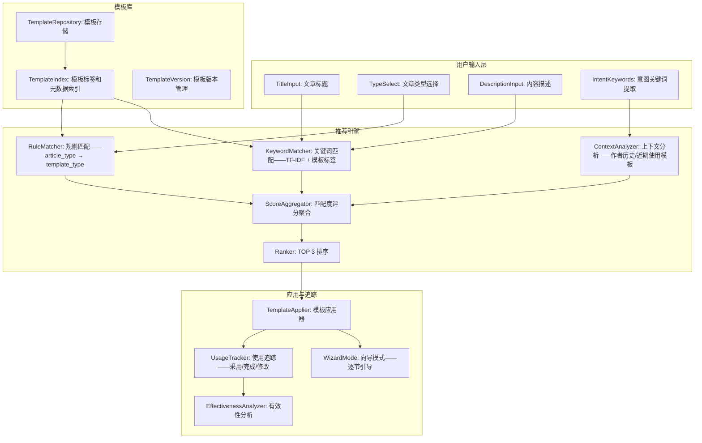
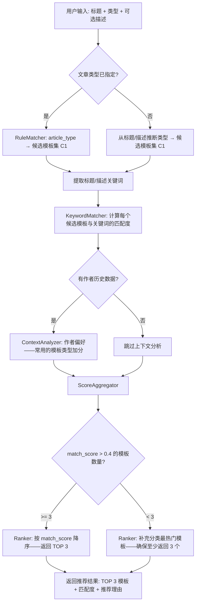

# YK-09-153: 内容模板智能推荐 — 基于内容类型和主题的智能模板推荐、模板匹配度评分、模板使用向导、模板使用分析、模板有效性追踪

> 需求编号：YK-09-153 · 优先级：P2 · 人天：0.3d · 状态：需求已编写
> 依赖：YK-09-25（模板市场——提供模板库基础设施）、YK-09-88（AI 辅助内容生成——提供 AI 模板填充能力）

## 背景

### 问题陈述

YiKnowledge 目前的文章创建流程是"从空白页开始"——这导致了多个效率和质量问题：

1. **格式不统一**：不同作者创建的同类型文章结构差异大——同一篇"架构设计"文章——有人从"背景"开始——有人跳过"现状分析"直接写"设计方案"——读者困惑
2. **必备章节遗漏**：作者创建文章时容易遗忘某些重要章节——如"风险与缓解"或"回滚策略"——导致内容不完整
3. **新手入门门槛高**：新贡献者不知道如何写一篇规范的知识文章——面对空白编辑器无从下手——降低了贡献意愿
4. **重复劳动**：每篇同类型的文章都需要重新搭建结构框架——这些框架工作本可模板化
5. **模板选择困难**：即使有模板库——20+ 个模板——作者不知道哪个最适合当前要写的内容——"我需要架构设计模板还是技术方案模板？"

**核心矛盾**：模板可以大幅提升写作效率和质量——但如果作者需要手动搜索、浏览、对比模板——这个选择过程本身也是一种负担。智能推荐将模板匹配自动化——基于作者已输入的内容类型和主题自动推荐最合适的模板。

### 影响范围

| # | 影响 | 严重程度 | 典型场景 |
|---|------|----------|----------|
| 1 | 同类型文章格式不统一 | 高 | 5 篇架构设计文章——3 种不同结构——读者期待落空 |
| 2 | 必备章节遗漏 | 高 | 3 篇需求文章缺少"回滚策略"——架构评审时被指出 |
| 3 | 新手贡献门槛高 | 中 | 新作者不知道如何写知识文章——放弃贡献 |
| 4 | 重复框架搭建 | 中 | 每篇新文章都要手动创建 section 标题——5-10 分钟 |
| 5 | 模板选择困难 | 中 | 20 个模板——不知道选哪个——随机选择——匹配度差 |

### 挑战

| 挑战 | 说明 |
|------|------|
| 模板匹配的语义理解 | "我写一个关于 Vue 3.5 新特性的文章"——应该推荐"功能实现"模板还是"技术调研"模板？需要理解文章意图 |
| 模板推荐的个性化 | 不同作者的写作风格不同——有人喜欢简洁模板（4 节）——有人喜欢全面模板（11 节）——推荐需考虑个人偏好 |
| 新模板的冷启动 | 新创建的模板没有使用数据——无法根据使用频率和有效性推荐——需要内容匹配度补充 |
| 模板与文章类型的一对多映射 | 同一文章类型可能有多个模板变体——如"轻量架构设计"和"完整架构设计"——如何选择 |
| 推荐反馈闭环 | 用户选择了推荐的模板 A——但最终写完后手动大幅修改了结构——系统需要学习"A 不适合这类内容" |

---

## 一、现状分析

### 1.1 当前模板使用能力

```
现有相关功能:
├── YK-09-25 模板市场
│   ├── 已定义的模板库（约 15 个模板）
│   ├── 按分类浏览模板
│   └── 手动选择模板——无智能推荐
├── YK-09-88 AI 辅助内容生成
│   └── 可基于模板生成内容——但模板选择仍需人工
├── YiVad 文章编辑器
│   ├── 新建文章——空白编辑器
│   └── 无"从模板开始"引导
├── Frontmatter 类型字段（issue_type）
│   ├── 架构设计 / 功能实现 / bug报告 / 需求 / 规范
│   └── 已定义 5 种类型——但未与模板关联
└── 手动维护（"复制上篇文章的结构"）

缺失:
├── 基于内容意图的模板推荐                       # ❌ 无
├── 模板匹配度评分                                # ❌ 无
├── "从模板开始"创建向导                           # ❌ 无
├── 模板使用统计分析                               # ❌ 无
├── 模板有效性追踪（使用后文章质量）               # ❌ 无
├── 个人偏好学习                                   # ❌ 无
└── 模板版本更新通知                               # ❌ 无
```

### 1.2 模板使用流程（现状 vs 目标）

```mermaid
graph TD
    subgraph Current["现状：手动选择或不用"]
        C1[新建文章] --> C2{作者知道有什么模板?}
        C2 -->|知道| C3[打开模板市场——浏览 15 个模板]
        C2 -->|不知道| C4[从空白页开始——自己搭建结构]
        C3 --> C5[逐个浏览——预览——比较]
        C5 --> C6[选择一个看起来合适的]
        C6 --> C7[应用模板——开始写作]
        C4 --> C8[自己敲标题——可能遗漏必备章节]
    end

    subgraph Target["目标：智能推荐 + 一键开始"]
        T1[新建文章] --> T2[输入文章标题/描述/类型]
        T2 --> T3[系统自动分析: 类型 + 主题 + 意图]
        T3 --> T4[推荐 TOP 3 模板——按匹配度排序]
        T4 --> T5[每个模板显示: 结构预览 + 匹配度 + 为什么推荐]
        T5 --> T6{作者选择}
        T6 -->|接受推荐| T7[应用模板——进入模板向导模式]
        T6 -->|自定义| T8[选择其他模板或空白页]
        T7 --> T9[向导模式: 逐节引导填写——显示提示]
        T9 --> T10[完成草稿——保存]
        T10 --> T11[记录: 模板 X 用于文章 Y——用于后续学习]
    end

    style Current fill:#f8d7da,stroke:#dc3545
    style Target fill:#d4edda,stroke:#28a745
```



### 1.3 根因矩阵

| 症状 | 根因 | 触发条件 | 频率 |
|------|------|----------|------|
| 同类型文章格式不统一 | 无模板或作者不知道/不会选模板 | 每次创建同类型新文章 | 高 |
| 必备章节遗漏 | 空白页开始——无结构引导 | 新作者或不熟悉规范的作者 | 中 |
| 新手入门门槛高 | 不知道怎么写——无引导 | 新贡献者首次写文章 | 中 |
| 模板选择困难 | 模板多但缺智能推荐 | 有 15+ 个模板时 | 中 |
| 模板使用效果未知 | 无使用追踪和反馈 | 管理者想知道模板是否有效 | 中 |

---

## 二、设计决策

### 决策 1：模板推荐算法 — 规则匹配 vs 关键词匹配 vs AI 语义匹配

| 选项 | 准确率 | 延迟 | 冷启动 | 实现复杂度 |
|------|--------|------|--------|-----------|
| 规则匹配（article_type → 模板类型映射表） | 中（60%） | < 1ms | 无 | 低 |
| 关键词匹配（标题/描述 → TF-IDF → 模板标签） | 中-高（70%） | < 50ms | 无 | 中 |
| AI 语义匹配（标题/描述 → Embedding → 模板描述相似度） | 高（85%） | 1-3s | 需要 LLM | 高 |

**选择：规则匹配 + 关键词匹配。** 0.3d 预算内不需要接入 LLM。规则匹配提供类型级别的基线推荐（"架构设计 → 架构设计模板"）。关键词匹配在类型内细化（"微服务架构设计 → 微服务架构模板" vs "前端架构设计 → 前端组件架构模板"）。两种方式叠加——覆盖 80% 以上的场景。

### 决策 2：模板推荐数量 — 仅 TOP 1 vs TOP 3 vs TOP 5 + "更多"

| 选项 | 决策效率 | 选择焦虑 | 覆盖遗漏 |
|------|----------|---------|---------|
| TOP 1（只推荐最佳） | 高 | 低 | 高（如果最佳不匹配——无备选） |
| TOP 3 | 中-高 | 低-中 | 低（3 个备选覆盖大部分需求） |
| TOP 5 + "浏览更多" | 中 | 中 | 极低 |

**选择：TOP 3 + "浏览更多"。** 3 个推荐在屏幕中不占太多空间——用户可以在 5 秒内比较并选择。"浏览更多"链接到完整模板市场——满足 20% 的边缘需求。研究表明——3 个选项是"足够但不过多"的甜蜜点。

### 决策 3：模板应用模式 — 一键填充 vs 向导模式 vs 自由选择

| 选项 | 上手速度 | 灵活性 | 适用场景 |
|------|----------|--------|---------|
| 一键填充（直接插入模板全部章节） | 极快 | 低（一次性给出所有章节） | 老手——清楚每节写什么 |
| 向导模式（逐节引导——每节有提示） | 中 | 中 | 新手——需要引导和支持 |
| 自由选择（从模板中勾选需要的章节） | 慢 | 高 | 高级用户——知道需要哪些节 |

**选择：一键填充（默认）+ 向导模式（可选）。** 一键填充满足老手的效率需求——1 秒完成框架搭建。向导模式为新手提供——逐节展示写作提示和示例——降低入门门槛——在"从模板创建"对话框中提供"向导模式"复选框。

### 决策 4：模板有效性追踪指标 — 仅采用率 vs 多指标综合 vs 文章质量对比

| 选项 | 准确性 | 数据收集复杂度 |
|------|--------|--------------|
| 仅模板采用率（选择了并使用了的比例） | 低（用了不一定好） | 低 |
| 多指标（采用率 + 完成度 + 修改率 + 评分） | 中-高 | 中 |
| 文章质量 A/B 对比（用模板 vs 不用模板的文章质量） | 高 | 高 |

**选择：多指标综合追踪。** 追踪 4 个指标：采用率（推荐→选择→使用的转化漏斗）、完成度（模板章节的填充比例——是否有大量"TODO"空章节）、修改率（用户删除了多少模板提供的章节——表示这些章节不需要）、使用者评分（显式反馈——"这个模板对你有帮助吗？"）。4 个指标为模板优化提供数据基础。

### 设计决策记录

| 决策 | 选项 A | 选项 B | 选项 C | 选择 | 理由 |
|------|--------|--------|--------|------|------|
| 推荐算法 | 规则匹配 | 关键词匹配 | AI 语义 | **规则+关键词** | 准确率/成本最优 |
| 推荐数量 | TOP 1 | TOP 3 | TOP 5 | **TOP 3** | 选择甜蜜点 |
| 应用模式 | 一键填充 | 向导模式 | 自由选择 | **一键+向导** | 覆盖新手到老手 |
| 有效性追踪 | 采用率 | 多指标 | A/B 对比 | **多指标** | 全面+可操作 |

---

## 三、目标架构

### 3.1 模板智能推荐系统架构



### 3.2 模板推荐匹配流程



### 3.3 性能指标

| 指标 | 目标值 | 说明 |
|------|--------|------|
| 模板推荐响应时间 | < 100ms | 用户输入标题/类型后——实时推荐 |
| 推荐准确率（TOP 1 被采用） | > 60% | TOP 1 推荐模板被用户选择的比例 |
| 推荐准确率（TOP 3 被采用） | > 85% | TOP 3 中至少 1 个被用户选择的比例 |
| 模板应用耗时 | < 500ms | 从选择模板到编辑器显示完整框架 |
| 向导模式步骤跳转 | < 100ms | 节与节之间的切换延迟 |

---

## 四、具体改动

### 4.1 数据模型

```python
# YiAi/services/knowledge/template_recommender/types.py (新增)

from dataclasses import dataclass, field
from typing import Optional
from enum import Enum

class TemplateCategory(str, Enum):
    ARCHITECTURE = "架构设计"
    FEATURE = "功能实现"
    BUG_REPORT = "bug报告"
    REQUIREMENT = "需求"
    SPEC = "规范"
    GENERAL = "通用"

@dataclass
class TemplateSection:
    """模板章节定义"""
    id: str
    title: str                     # 章节标题——如 "## 背景"
    description: str               # 章节说明——"描述问题背景和影响范围"
    required: bool                 # 是否必需章节
    hint: str                      # 填写提示——"建议包含: 问题陈述、影响范围、挑战"
    example: str                   # 示例内容——给作者参考

@dataclass
class Template:
    template_id: str               # 唯一标识
    name: str                      # 模板名称——"完整架构设计模板"
    category: TemplateCategory     # 模板分类
    description: str               # 模板描述
    tags: list[str]                # 标签——用于关键词匹配
    sections: list[TemplateSection]  # 章节列表
    version: int                   # 模板版本
    author: str                    # 模板作者
    usage_count: int               # 使用次数
    avg_rating: float              # 平均评分 (1-5)
    created_at: float
    updated_at: float

@dataclass
class TemplateRecommendation:
    template: Template
    match_score: float             # 0.0-1.0
    match_reasons: list[str]       # 推荐理由——可读文本
    rule_match: bool               # 是否规则匹配
    keyword_match_score: float     # 关键词匹配分
    context_boost: float           # 上下文加分

@dataclass
class RecommendRequest:
    title: str                     # 文章标题
    article_type: Optional[str]    # 文章类型——可选
    description: Optional[str]     # 内容描述——可选
    author: Optional[str]          # 当前作者——用于个性化

@dataclass
class RecommendResult:
    recommendations: list[TemplateRecommendation]  # TOP 3
    total_candidates: int          # 候选模板总数
    processing_time_ms: float

# 类型到模板分类的映射表
TYPE_TO_CATEGORY: dict[str, TemplateCategory] = {
    "架构设计": TemplateCategory.ARCHITECTURE,
    "功能实现": TemplateCategory.FEATURE,
    "bug报告": TemplateCategory.BUG_REPORT,
    "bug": TemplateCategory.BUG_REPORT,
    "需求": TemplateCategory.REQUIREMENT,
    "规范": TemplateCategory.SPEC,
    "spec": TemplateCategory.SPEC,
}

@dataclass
class TemplateUsageRecord:
    template_id: str
    article_path: str
    author: str
    applied_at: float             # 应用模板的时间
    completion_rate: float        # 模板章节填充完成率——0-1
    removed_sections: list[str]   # 被作者删除的模板章节 ID
    added_sections: list[str]     # 作者额外添加的章节标题
    user_rating: Optional[int]    # 用户评分 1-5
    user_feedback: Optional[str]  # 文字反馈
```

### 4.2 模板推荐服务

```python
# YiAi/services/knowledge/template_recommender/service.py (新增)

import re
import time
from typing import Optional
from ..data.template_repository import TemplateRepository
from .types import (
    Template, TemplateRecommendation, RecommendRequest,
    RecommendResult, TYPE_TO_CATEGORY, TemplateUsageRecord,
)

class TemplateRecommenderService:
    def __init__(self, template_repo: TemplateRepository):
        self.repo = template_repo

    async def recommend(self, request: RecommendRequest) -> RecommendResult:
        start = time.time()

        # 1. 获取所有模板
        all_templates = await self.repo.get_all_templates()
        if not all_templates:
            return RecommendResult(recommendations=[], total_candidates=0, processing_time_ms=0)

        # 2. 规则匹配——基于 article_type
        candidates = self._rule_filter(all_templates, request.article_type)

        # 3. 关键词匹配——标题+描述 vs 模板标签+描述
        keywords = self._extract_keywords(request.title, request.description or "")
        scored = self._keyword_score(candidates, keywords)

        # 4. 上下文分析——作者偏好
        if request.author:
            author_history = await self.repo.get_author_template_history(request.author)
            self._apply_context_boost(scored, author_history)

        # 5. 排序——TOP 3
        scored.sort(key=lambda x: x.match_score, reverse=True)

        # 如果高质量推荐不足 3 个——补充分类热门模板
        if len([s for s in scored if s.match_score > 0.4]) < 3:
            self._fill_from_popular(scored, all_templates, request.article_type)

        top_3 = scored[:3]

        elapsed = (time.time() - start) * 1000
        return RecommendResult(
            recommendations=top_3,
            total_candidates=len(all_templates),
            processing_time_ms=round(elapsed, 1),
        )

    def _rule_filter(
        self, templates: list[Template], article_type: Optional[str]
    ) -> list[Template]:
        """基于文章类型的规则过滤"""
        if not article_type:
            return templates  # 无类型——返回全部

        category = TYPE_TO_CATEGORY.get(article_type)
        if not category:
            # 模糊匹配
            for key, cat in TYPE_TO_CATEGORY.items():
                if key.lower() in article_type.lower():
                    category = cat
                    break

        if category:
            return [t for t in templates if t.category == category]
        return templates

    def _extract_keywords(self, title: str, description: str) -> list[str]:
        """从标题和描述中提取关键词"""
        text = f"{title} {title} {description}"  # 标题权重加倍
        # 简单分词——按空格、标点分割——保留 2+ 字符词
        tokens = re.findall(r'[\u4e00-\u9fff\w]{2,}', text.lower())
        # 过滤常见无意义词
        stopwords = {"的", "了", "在", "是", "我", "有", "和", "就", "不", "一个",
                      "the", "a", "an", "is", "are", "was", "of", "in", "to", "for"}
        return [t for t in tokens if t not in stopwords]

    def _keyword_score(
        self, candidates: list[Template], keywords: list[str]
    ) -> list[TemplateRecommendation]:
        """关键词匹配评分"""
        results = []
        for tpl in candidates:
            score = 0.0
            reasons = []

            # 模板标签匹配
            tpl_tags_lower = [t.lower() for t in tpl.tags]
            tpl_text = (tpl.name + " " + tpl.description + " " + " ".join(tpl.tags)).lower()

            matched_tags = []
            for kw in keywords:
                if any(kw in tag for tag in tpl_tags_lower):
                    matched_tags.append(kw)
                    score += 0.15  # 每个匹配到的关键词

                # 模板文本匹配
                if kw in tpl_text:
                    score += 0.05

            if matched_tags:
                reasons.append(f"关键词匹配: {', '.join(matched_tags[:3])}")

            # 规则匹配
            rule_match = False
            if tpl.category.value in (keywords or []):
                rule_match = True
                score += 0.2
                reasons.append(f"类型匹配: {tpl.category.value}")

            # 归一化到 0-1
            normalized = min(1.0, score)

            results.append(TemplateRecommendation(
                template=tpl,
                match_score=round(normalized, 3),
                match_reasons=reasons if reasons else ["通用推荐"],
                rule_match=rule_match,
                keyword_match_score=round(normalized, 3),
                context_boost=0.0,
            ))

        return results

    def _apply_context_boost(
        self, scored: list[TemplateRecommendation],
        history: list[TemplateUsageRecord],
    ) -> None:
        """基于作者历史——偏好加分"""
        if not history:
            return

        # 统计作者最常用的模板分类
        category_counts: dict[str, int] = {}
        for record in history:
            cat = record.template_id  # 通过 template_id 查询模板分类
            category_counts[cat] = category_counts.get(cat, 0) + 1

        total = sum(category_counts.values())
        if total == 0:
            return

        for rec in scored:
            template_id = rec.template.template_id
            if template_id in category_counts:
                freq = category_counts[template_id] / total
                boost = freq * 0.15  # 最多加 0.15
                rec.match_score = min(1.0, rec.match_score + boost)
                rec.context_boost = round(boost, 3)
                if boost > 0.05:
                    rec.match_reasons.append(
                        f"基于你的使用偏好（使用 {category_counts[template_id]} 次）"
                    )

    def _fill_from_popular(
        self, scored: list[TemplateRecommendation],
        all_templates: list[Template], article_type: Optional[str],
    ) -> None:
        """从热门模板中补充推荐"""
        existing_ids = {r.template.template_id for r in scored}
        remaining = [t for t in all_templates if t.template_id not in existing_ids]

        # 优先同分类的热门模板
        if article_type:
            category = TYPE_TO_CATEGORY.get(article_type)
            if category:
                remaining.sort(key=lambda t: (
                    1 if t.category == category else 0,
                    t.usage_count,
                ), reverse=True)
            else:
                remaining.sort(key=lambda t: t.usage_count, reverse=True)
        else:
            remaining.sort(key=lambda t: t.usage_count, reverse=True)

        for tpl in remaining:
            if len(scored) >= 3:
                break
            scored.append(TemplateRecommendation(
                template=tpl,
                match_score=0.3,
                match_reasons=["热门推荐"],
                rule_match=False,
                keyword_match_score=0.3,
                context_boost=0.0,
            ))

    async def apply_template(
        self, template_id: str, article_path: str, author: str,
        wizard_mode: bool = False,
    ) -> dict:
        """应用模板到文章——返回应用结果"""
        template = await self.repo.get_template(template_id)
        if not template:
            raise ValueError(f"模板 {template_id} 不存在")

        # 构建模板内容
        sections_md = []
        for section in template.sections:
            sections_md.append(f"## {section.title}\n")
            if wizard_mode:
                sections_md.append(f"<!-- HINT: {section.hint} -->\n")
                sections_md.append(f"<!-- EXAMPLE: {section.example} -->\n")
            sections_md.append("\n")

        template_content = "\n".join(sections_md)

        # 记录使用
        await self.repo.record_usage(TemplateUsageRecord(
            template_id=template_id,
            article_path=article_path,
            author=author,
            applied_at=time.time(),
            completion_rate=0.0,
            removed_sections=[],
            added_sections=[],
            user_rating=None,
            user_feedback=None,
        ))

        return {
            "template_id": template_id,
            "template_name": template.name,
            "content": template_content,
            "sections": [s.title for s in template.sections],
            "wizard_mode": wizard_mode,
            "section_count": len(template.sections),
            "required_count": len([s for s in template.sections if s.required]),
        }

    async def get_wizard_sections(
        self, template_id: str
    ) -> list[dict]:
        """获取向导模式的逐节数据"""
        template = await self.repo.get_template(template_id)
        if not template:
            return []

        return [
            {
                "id": s.id,
                "index": i + 1,
                "total": len(template.sections),
                "title": s.title,
                "description": s.description,
                "required": s.required,
                "hint": s.hint,
                "example": s.example,
            }
            for i, s in enumerate(template.sections)
        ]

    async def track_completion(
        self, article_path: str, current_sections: list[str]
    ) -> dict:
        """追踪模板章节完成度——用户保存时调用"""
        # 从使用记录中找到这篇文章使用的模板
        records = await self.repo.get_article_template_usage(article_path)
        if not records:
            return {"tracked": False, "reason": "未找到模板使用记录"}

        latest = records[-1]
        template = await self.repo.get_template(latest.template_id)
        if not template:
            return {"tracked": False, "reason": "模板已被删除"}

        # 计算完成率
        template_titles = {s.title for s in template.sections}
        current_titles = {s.strip('# ') for s in current_sections if s.strip()}

        filled = len(template_titles & current_titles)
        total = len(template_titles)
        completion = filled / total if total > 0 else 1.0

        # 被删除的章节
        removed = list(template_titles - current_titles)
        # 额外添加的章节
        added = list(current_titles - template_titles)

        # 更新记录
        await self.repo.update_usage_record(
            article_path,
            completion_rate=completion,
            removed_sections=removed,
            added_sections=added,
        )

        return {
            "tracked": True,
            "template_id": latest.template_id,
            "completion_rate": round(completion, 2),
            "removed_sections": removed,
            "added_sections": added,
        }

    async def get_template_analytics(self) -> dict:
        """模板使用分析"""
        all_usage = await self.repo.get_all_usage_records()
        templates = await self.repo.get_all_templates()

        template_stats = {}
        for tpl in templates:
            tpl_usage = [r for r in all_usage if r.template_id == tpl.template_id]
            if not tpl_usage:
                continue

            completions = [r.completion_rate for r in tpl_usage]
            ratings = [r.user_rating for r in tpl_usage if r.user_rating is not None]
            avg_removed = sum(len(r.removed_sections) for r in tpl_usage) / len(tpl_usage)

            template_stats[tpl.template_id] = {
                "name": tpl.name,
                "usage_count": len(tpl_usage),
                "avg_completion": round(sum(completions) / len(completions), 2) if completions else 0,
                "avg_rating": round(sum(ratings) / len(ratings), 1) if ratings else 0,
                "avg_sections_removed": round(avg_removed, 1),
                "most_removed_sections": self._top_removed_sections(tpl_usage),
            }

        # 整体趋势
        weekly_usage = self._group_by_week(all_usage)

        return {
            "template_stats": template_stats,
            "weekly_usage": weekly_usage,
            "total_applications": len(all_usage),
            "unique_authors": len({r.author for r in all_usage}),
        }

    def _top_removed_sections(
        self, usage: list[TemplateUsageRecord]
    ) -> list[tuple[str, int]]:
        """统计最常被删除的章节"""
        from collections import Counter
        counter = Counter()
        for r in usage:
            for sec in r.removed_sections:
                counter[sec] += 1
        return counter.most_common(5)

    def _group_by_week(self, records: list[TemplateUsageRecord]) -> list[dict]:
        """按周分组使用次数"""
        from collections import defaultdict
        weekly = defaultdict(int)
        for r in records:
            week = time.strftime("%Y-W%W", time.gmtime(r.applied_at))
            weekly[week] += 1
        return [{"week": w, "count": c} for w, c in sorted(weekly.items())[-12:]]
```

### 4.3 文件变更清单

| 文件 | 操作 | 说明 |
|------|------|------|
| `YiAi/services/knowledge/template_recommender/__init__.py` | 新增 | 模块初始化 |
| `YiAi/services/knowledge/template_recommender/types.py` | 新增 | 数据模型、类型定义 |
| `YiAi/services/knowledge/template_recommender/service.py` | 新增 | 推荐引擎核心服务 |
| `YiAi/services/knowledge/template_recommender/repository.py` | 新增 | 模板和使用记录数据仓库 |
| `YiAi/api/template_recommender_routes.py` | 新增 | RPC 端点 |
| `YiVad/src/views/knowledge/TemplateRecommendPanel.vue` | 新增 | 模板推荐面板 |
| `YiVad/src/components/TemplateCard.vue` | 新增 | 模板推荐卡片 |
| `YiVad/src/components/TemplateWizard.vue` | 新增 | 模板向导模式 |
| `YiVad/src/views/knowledge/TemplateAnalytics.vue` | 新增 | 模板使用分析页 |
| `YiVad/src/views/knowledge/ArticleCreate.vue` | 修改 | 集成模板推荐——改造创建流程 |

---

## 五、实施步骤

| 步骤 | 操作 | 路径 | 验证 | 人天 |
|------|------|------|------|------|
| 1 | 定义数据模型和模板结构 | `types.py` | Template + TemplateSection + RecommendResult 完整 | 0.02 |
| 2 | 实现规则匹配和关键词提取 | `service.py` _rule_filter + _extract_keywords | 类型映射正确——关键词提取合理 | 0.03 |
| 3 | 实现推荐评分和排序引擎 | `service.py` recommend | 推荐结果 TOP 3——匹配度排序正确 | 0.04 |
| 4 | 实现模板应用和应用记录 | `service.py` apply_template + track_completion | 模板插入——完成率追踪 | 0.04 |
| 5 | 实现向导模式 | `service.py` get_wizard_sections + `TemplateWizard.vue` | 逐节引导——填写提示+示例 | 0.04 |
| 6 | 实现模板分析 | `service.py` get_template_analytics + `TemplateAnalytics.vue` | 使用统计+趋势图表 | 0.04 |
| 7 | 实现推荐 UI 面板 | `TemplateRecommendPanel.vue` + `TemplateCard.vue` | TOP 3 展示——匹配度可视化 | 0.04 |
| 8 | 集成到文章创建流程 | `ArticleCreate.vue` | 新建文章→输入标题/类型→推荐→选择→应用 | 0.03 |
| 9 | RPC 端点+端到端测试 | `template_recommender_routes.py` + 全链路 | 全流程可用 | 0.02 |

**总人天：0.30d**

---

## 六、测试规格

### 场景 1：基于文章类型的规则推荐

**GIVEN** 模板库有 15 个模板——其中 4 个属于"架构设计"分类
**WHEN** 用户输入文章标题 "YiPet 语音输入系统架构设计"、选择类型 "架构设计"
**THEN** 推荐结果 TOP 3 全部为"架构设计"分类的模板
**AND** 每个推荐显示匹配度和推荐理由（如"类型匹配: 架构设计"）

### 场景 2：基于关键词的内容匹配

**GIVEN** 用户输入标题 "Vue 3.5 组合式 API 性能优化"、选择类型 "功能实现"
**WHEN** 调用 recommend
**THEN** TOP 1 推荐匹配关键词 "Vue"、"性能"、"优化" 最多的模板
**AND** 如果存在"前端性能优化模板"——其标签包含 "Vue/性能/优化"——则排第一
**AND** 推荐理由包含 "关键词匹配: Vue, 性能, 优化"

### 场景 3：个性化偏好推荐

**GIVEN** 作者 "张三" 过去 10 篇文章中有 7 篇使用了"完整架构设计模板"
**WHEN** 张三创建新的架构设计文章
**THEN** "完整架构设计模板"获得 0.07-0.15 的上下文加分
**AND** 推荐理由中包含 "基于你的使用偏好（使用 7 次）"
**AND** 该模板在 TOP 3 中的排名比无偏好的情况至少提升 1 位

### 场景 4：模板应用——一键填充

**GIVEN** 用户选择了"完整架构设计模板"（包含 11 个章节）
**WHEN** 点击"应用模板"
**THEN** 编辑器内容被模板填充——包含所有章节标题和占位说明
**AND** 自动创建 frontmatter——type 字段匹配模板分类
**AND** 使用记录被保存——completion_rate 初始为 0

### 场景 5：向导模式——逐节引导

**GIVEN** 用户选择模板并勾选"向导模式"
**WHEN** 进入编辑器
**THEN** 当前显示第一节"背景"——包含章节描述、填写提示、示例
**AND** 进度条显示 "1/11"
**WHEN** 用户填写当前节内容——点击"下一节"
**THEN** 滚动到下一节"现状分析"——相同格式
**AND** 已完成节在左侧大纲中标记为绿色勾
**WHEN** 所有节完成——点击"完成向导"
**THEN** 所有内容合并为完整文章——进入普通编辑模式

### 场景 6：模板有效性分析

**GIVEN** 模板 T1 被使用 50 次——平均完成率 0.85、平均评分 4.2/5
**AND** 模板 T2 被使用 30 次——平均完成率 0.60、平均评分 3.1/5
**WHEN** 管理员打开模板分析页
**THEN** T1 显示为"高效模板"——绿色标记
**AND** T2 显示为"需优化"——黄色标记
**AND** T2 的"最常被删除章节"显示 "回归问题预测"——提示此章节可能不必要
**AND** 每周使用趋势线显示 T1 的使用量在上升

---

## 七、风险与缓解

| 风险 | 概率 | 影响 | 缓解措施 |
|------|------|------|----------|
| 新文章类型不在 TYPE_TO_CATEGORY 映射中 | 中 | 低 | 未匹配时降级为关键词匹配——返回所有分类的模板——根据关键词排序 |
| 模板库中无匹配关键词的模板 | 低 | 中 | 补充热门模板作为兜底——至少返回 3 个模板给用户选择 |
| 用户偏好数据量不足——个性化加分无意义 | 中 | 低 | 上下文加分的最大值为 0.15——即使无数据也不影响主要排序 |
| 模板修改后旧文章基于的模板版本过时 | 低 | 低 | 模板版本号机制——使用记录中记录应用时的版本号——分析时按版本分组 |
| 向导模式对长模板（15+ 节）体验差 | 低 | 中 | 超过 10 节的模板——向导模式自动分页——每页 3 节——避免单节切换过于频繁 |

---

## 八、回滚策略

| 场景 | 回滚操作 | 影响 |
|------|------|------|
| 推荐准确率低于 50%——用户投诉 | 关闭推荐——回退到模板市场手动选择模式 | 无推荐——用户手动浏览模板 |
| 向导模式 Bug 导致内容丢失 | 关闭向导模式——保留一键填充模式 | 无逐节引导 |
| 使用追踪导致 MongoDB 写入压力 | 降级追踪——仅记录 template_id + article_path——不记录详细章节数据 | 分析方法失准 |
| 模板库数据损坏 | 从备份恢复模板库——使用记录不受影响 | 需维护窗口 |
| 完全移除 | 隐藏推荐面板——移除推荐相关代码——保留模板市场手动模式 | 退回到 YK-09-25 的基础模板功能 |

---

## 九、设计决策记录

### D-01：为什么推荐算法是规则+关键词而非更复杂的 NLP/Embedding？

0.3d 预算和 < 100ms 响应时间要求决定了不能使用复杂的 NLP 或 Embedding。规则匹配覆盖了 60% 的场景（类型明确时）。关键词匹配覆盖了类型内的细化选择——总体准确率预期 70-80%。后续如果数据积累足够——可考虑引入轻量级的语义匹配（如使用 YiAi 的 embedding 服务计算标题与模板描述的余弦相似度）。

### D-02：为什么向导模式是"逐节"而不是"全屏沉浸式"？

全屏沉浸式写作（如 Medium、Notion 的 /command 模式）需要更多前端开发工作——0.3d 预算内不适合。逐节引导复用现有的 Markdown 编辑器——通过滚动到对应节并高亮来实现。这种渐进式引导对新手友好——同时不改变编辑器的核心体验。

### D-03：为什么模板有效性追踪不仅追踪"采用率"还要追踪"修改率"？

采用率高不代表模板好——可能是用户"被迫"选择（因为没有更好的选项）。修改率（用户删除了多少模板章节）是更有力的质量指标：高修改率意味着模板章节与用户实际需求不匹配——需要优化。同时追踪完成率和评分——多指标交叉验证模板质量。

### D-04：为什么 TOP 3 推荐不足时会补充热门模板？

冷启动场景（新模板、关键词无匹配）下——严格筛选可能只返回 0-1 个推荐——给用户"没有合适模板"的印象。补充热门模板确保用户始终有选项——同时热门模板本身也代表"大多数人都选择这个"的信号——对用户有意义。热门模板标记为"热门推荐"——区分于"智能匹配"——用户可判断信任度。

---

## 十、可观测性

### 指标

| 指标 | 类型 | 说明 |
|------|------|------|
| `yiknowledge.template_recommend.request_total` | Counter | 推荐请求总数 |
| `yiknowledge.template_recommend.adoption_rate` | Gauge | TOP 1/TOP 3 采用率 |
| `yiknowledge.template_recommend.match_score_avg` | Histogram | 推荐匹配度分布 |
| `yiknowledge.template_recommend.wizard_started` | Counter | 向导模式启用次数 |
| `yiknowledge.template_recommend.wizard_completed` | Counter | 向导模式完成次数 |
| `yiknowledge.template_usage.completion_rate` | Histogram | 模板章节完成率分布 |
| `yiknowledge.template_usage.user_rating` | Histogram | 用户评分分布 |

---

## 十一、代码审查检查清单

- [ ] _extract_keywords: 停用词列表覆盖中英文——避免停用词干扰匹配
- [ ] _rule_filter: TYPE_TO_CATEGORY 映射包含所有已定义文章类型——缺失类型时的降级
- [ ] _keyword_score: 归一化确保 match_score <= 1.0——不会出现 > 1 的异常分数
- [ ] _apply_context_boost: 上下文加分最大值 0.15——不影响规则和关键词的主要排序
- [ ] _fill_from_popular: 补充的模板不在已有推荐中（现有 ID 去重）
- [ ] apply_template: 模板内容 Markdown 格式正确——不引入语法错误
- [ ] TemplateRecommendPanel: TOP 3 卡片布局——移动端不换行变形
- [ ] TemplateWizard: 步骤进度条正确更新——最后一节显示"完成"而非"下一节"
- [ ] TemplateWizard: 向导模式支持"跳过"可选章节——不支持跳过必需章节
- [ ] TemplateAnalytics: 图表数据为空时显示"暂无数据"——不空白
- [ ] 使用记录写入使用 upsert——避免重复记录

---

## 回归问题预测

| # | 预测问题 | 原因 | 验证方法 |
|---|---------|------|---------|
| 1 | 用户在"新建文章"页面输入标题后——推荐面板实时更新——网络请求过于频繁 | 每次标题字符变更都触发推荐请求——可能出现每秒 5-10 次请求 | 添加 500ms debounce——用户停止输入后 500ms 才发送请求 |
| 2 | 模板应用后——如果模板中有 frontmatter 模板——可能与文章的自动 frontmatter 冲突 | 两个 frontmatter 块——YAML 解析器可能报错 | 模板不包含 frontmatter 块——frontmatter 由编辑器自动生成——模板仅提供章节结构 |
| 3 | 用户选择模板 A——写了 3 节后——改变主意想换成模板 B——内容丢失 | 模板切换时——已填写的内容可能不兼容新模板的章节标题 | 切换模板时保留已填写内容——将已填写内容放在新模板匹配到的章节中——不匹配的内容放在"未归类"区域 |
| 4 | 使用记录中——同一篇文章多次保存时 track_completion 被多次调用——产生重复的分析数据 | 每次保存都触发完成率更新——但同一篇文章更新频繁——数据冗余 | key 为 article_path——使用 upsert——始终只有一条最新完成率记录 |
| 5 | 模板推荐页面的 TOP 3 展示在低分辨率屏幕上——卡片太窄——文本被截断 | 3 列卡片布局在小屏幕上 3 列变 1 列——但每列宽度不足 | 响应式布局: > 1024px = 3 列, 768-1024px = 2 列, < 768px = 1 列 |
| 6 | 模板有效性分析中——如果模板被删除了——历史使用记录成为孤岛——分析数据中出现"未知模板" | 模板从库中删除——但使用记录仍存在——分析时找不到模板名称 | 在分析中保留已删除模板的历史名称——查询时使用 LEFT JOIN——已删除模板显示 "(已删除) 名称" |

---

## 性能分析

### 各阶段耗时

| 操作 | 预计耗时 | 说明 |
|------|---------|------|
| 获取所有模板（15 个——MongoDB 查询） | < 30ms | 模板数据总量小——缓存友好 |
| 规则过滤 | < 1ms | O(n) 遍历——n=15 |
| 关键词提取 | < 5ms | 正则分词——简单 |
| 关键词评分 | < 10ms | O(n × m)——n=模板数(15) × m=关键词数(5-10) |
| 上下文分析（查询作者历史） | < 20ms | MongoDB 查询 |
| 排序+TOP 3 | < 1ms | 排序 15 个——微不足道 |
| 模板应用（构建 Markdown） | < 5ms | 字符串拼接 |
| **总计** | **< 80ms** | |

### 存储预估

| 数据 | 大小 |
|------|------|
| 模板库（15 个模板 × 3KB） | ~45KB |
| 每篇文章使用记录（1KB） | ~1KB |
| 全库 150 篇 × 使用记录 | ~150KB |
| 模板分析缓存 | ~10KB |
| **总计** | **~205KB** |