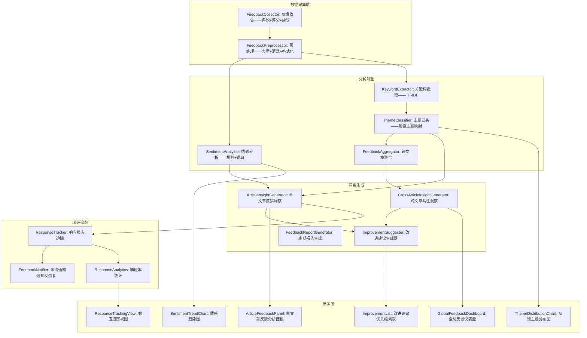

# YK-09-154: 功能实现-内容反馈分析 — 聚合分析读者反馈、评论情感分析、共性问题提炼、反馈驱动的改进建议、反馈响应追踪

> 需求编号：YK-09-154 · 优先级：P2 · 人天：0.3d · 状态：需求已编写
> 依赖：YK-09-101（读者反馈与互动系统——提供反馈收集基础设施）、YK-09-127（文档评论与讨论系统——评论数据源）

## 背景

### 问题陈述

YiKnowledge 目前已收集了一定的读者反馈和评论——但缺乏系统化的分析能力让这些反馈发挥真正的价值：

1. **反馈未聚合**：每条文章的反馈静静躺在数据库中——作者和管理者不知道"哪篇文章被反馈最多"、"反馈中的共性问题是什么"——反馈的价值被埋没
2. **情绪感知缺失**：作者需要手动逐条读评论才能感知读者对文章的整体态度——如果有 50 条评论——阅读和分析需要 20 分钟——性价比低
3. **改进方向不明确**：作者知道文章有反馈——但不知道"读者觉得哪里不好"——不知道自己应该先改哪篇文章、从哪个方向改
4. **反馈闭环断裂**：作者看到反馈——修改了内容——但反馈者不知道自己的意见被采纳了——缺乏正向激励——降低后续反馈意愿
5. **系统性内容质量问题不可见**：单个反馈看是"这篇文章的格式不好"——但 50 篇文章的反馈聚合看是"格式规范需要统一"——属于系统性改进方向——但当前缺少这种跨文章分析能力

**核心矛盾**：反馈数据已经存在——但它只被当作"单条消息"来展示——而非"集体智慧"来分析。内容反馈分析将读者的碎片化意见转化为可操作的内容改进洞察——让反馈从"知道了"变成"改什么、怎么改"。

### 影响范围

| # | 影响 | 严重程度 | 典型场景 |
|---|------|----------|----------|
| 1 | 反馈价值未被挖掘——作者无从改进 | 高 | 文章有 20 条反馈——作者看到了——但不知道从哪改起 |
| 2 | 读者挫败感——反馈无人回应 | 高 | 读者认真写了改进建议——3 个月没回应——下次不写了 |
| 3 | 共性问题被忽视 | 中 | 5 篇文章都被反馈"缺少示例代码"——但被当作独立问题——未系统性修复 |
| 4 | 内容优化的优先级模糊 | 中 | 10 篇文章需要修改——先改哪个？凭直觉而非数据 |
| 5 | 反馈者失去激励 | 低 | 反馈发出去——石沉大海——不知道是否被采纳 |

### 挑战

| 挑战 | 说明 |
|------|------|
| 情感分析的准确性 | 中文情感分析准确率一般在 75-85%——误判可能偏离实际情况 |
| 负反馈的处理 | 聚合分析会暴露"哪些文章差"——可能让作者抵触——需要建设性的呈现方式 |
| 改进建议的可操作性 | "这篇文章不够好"是不可操作的建议——需要从反馈中提炼具体的改进方向 |
| 反馈量与分析深度平衡 | 一篇文章 3 条反馈——统计上不够显著——但作者仍需要洞察 |
| 反馈者的匿名性 | 有些反馈者希望匿名——追踪响应时如何通知他们？ |

---

## 一、现状分析

### 1.1 当前反馈分析能力

```
现有相关功能:
├── 读者反馈与互动系统 (YK-09-101)
│   ├── 单文章评论列表——按时间排序
│   ├── 反馈点赞/踩——基础互动
│   └── 无聚合分析——无情感识别——无主题提炼
├── 内容统计仪表盘 (YK-09-97)
│   ├── 文章浏览量/阅读时长/分享数
│   └── 无反馈维度——有"量"无"质"
├── 内容健康报告 (YK-09-152)
│   └── 偏向内容新鲜度和完整度——未包含反馈信号

缺失:
├── 跨文章反馈聚合分析                               # ❌ 无
├── 评论情感分析（正面/中性/负面）                     # ❌ 无
├── 反馈主题聚类——共性提炼                            # ❌ 无
├── 反馈驱动的改进建议生成                            # ❌ 无
├── 单文章反馈洞察面板                                # ❌ 无
├── 反馈响应追踪——闭环管理                            # ❌ 无
├── 反馈者贡献排行榜                                   # ❌ 无
└── 定期反馈摘要报告（周报/月报）                      # ❌ 无
```

### 1.2 反馈分析流程（现状 vs 目标）

```mermaid
graph TD
    subgraph Current["现状：反馈被当作独立消息"]
        C1[文章收到 50 条反馈] --> C2[作者偶尔查看——逐条阅读]
        C2 --> C3[记住其中 3 条印象深刻的]
        C3 --> C4[凭记忆修改——可能忽略了大众意见]
        C4 --> C5[无机制通知反馈者——闭环断裂]
    end

    subgraph Target["目标：反馈 → 分析 → 行动 → 响应闭环"]
        T1[文章收到反馈] --> T2[自动分析: 情感标签 + 主题归类 + 严重程度]
        T2 --> T3[反馈分析面板: 总体情感倾向 + TOP 5 主题 + 改进建议列表]
        T3 --> T4[作者查看——发现 60% 反馈指向"缺少示例代码"]
        T4 --> T5[作者添加示例代码——更新文章]
        T5 --> T6[标记反馈为"已处理"——自动通知反馈者]
        T6 --> T7[反馈者收到: "你关于 XX 文章的建议已被采纳——感谢反馈"]
        T7 --> T8[反馈者获得成就感——下次继续反馈]
    end

    style Current fill:#f8d7da,stroke:#dc3545
    style Target fill:#d4edda,stroke:#28a745
```

### 1.3 根因矩阵

| 症状 | 根因 | 触发条件 | 频率 |
|------|------|----------|------|
| 反馈未转化为行动 | 无聚合分析——手工阅读低效 | 每篇文章收到 > 5 条反馈 | 高 |
| 情感倾向不知 | 无数值化情感指标——靠主观感受 | 任何有正负混合反馈的文章 | 中 |
| 共性问题不系统解决 | 无跨文章主题聚类 | 多篇文章收到相似反馈 | 中 |
| 闭环断裂 | 无"已处理"标记和通知机制 | 作者修改后 | 中 |
| 反馈者无激励 | 无反馈采纳通知 | 反馈被采纳但未通知 | 低 |

---

## 二、设计决策

### 决策 1：情感分析实现方式 — 基于词典 vs 基于规则 vs AI 模型

| 选项 | 准确率 | 延迟 | 成本 | 实现复杂度 |
|------|--------|------|------|-----------|
| 基于情感词典（正负面词库匹配） | 60-70% | < 1ms | 零 | 低 |
| 基于规则（句式+程度词+否定词）| 70-75% | < 5ms | 零 | 中 |
| AI 模型（调用 Ollama LLM） | 85-90% | 1-3s | LLM 推理 | 高 |

**选择：基于规则 + 轻量词典。** 使用 Python snowNLP 或自定义中文情感词典（正面词 5000 + 负面词 4000 + 程度词 + 否定词）。准确率虽不及 LLM——但在 0.3d 预算内平衡了成本和效果。结果以"正面/中性/负面"三级输出——不过分追求精确分数。AI 模型标注留作后续迭代——当前架构预留 `sentiment_source` 字段。

### 决策 2：反馈主题归类 — 手动标签 vs 自动关键词 vs AI 聚类

| 选项 | 准确率 | 人工成本 | 冷启动 |
|------|--------|---------|--------|
| 手动标签（作者或审核人手动标注反馈主题） | 高 | 高 | 无 |
| 自动关键词提取（TF-IDF → 高频词作为主题） | 中 | 低 | 无 |
| AI 聚类（文本 Embedding → K-Means 聚类） | 高 | 低 | 需要 LLM |

**选择：自动关键词提取 + 预设主题标签。** TF-IDF 从反馈文本中提取关键词——映射到预设主题标签（内容缺失、准确性、可读性、时效性、格式、示例、结构、其他）。同一类反馈自动归组——生成"该主题共 N 条反馈"。预设主题保证分析结果的可操作性和可对比性（跨文章）。纯 AI 聚类结果可能是"不知道是什么意思的主题"——降低了可操作性。

### 决策 3：改进建议生成 — 仅汇总 vs 模板化建议 vs AI 生成

| 选项 | 可操作性 | 个性化 | 实现复杂度 |
|------|----------|--------|-----------|
| 仅汇总（列出反馈原文） | 低（需要作者自己解读） | 高 | 低 |
| 模板化建议（预定义模板——"增加[主题]示例"） | 中-高 | 中 | 中 |
| AI 生成建议（LLM 阅读反馈 + 文章上下文——生成具体建议） | 高 | 高 | 高 |

**选择：模板化建议。** 每个主题预定义改进模板: "缺少示例代码" → 建议"在第 X 节添加可运行的代码示例"、"内容过时" → 建议"更新 [关键字] 部分——检查最新版本"。模板基于反馈主题自动匹配——生成列表中每条建议对应一个可执行的操作。AI 生成虽好但 0.3d 预算不允许。

### 决策 4：反馈响应追踪 — 无追踪 vs 手动标记 vs 自动检测

| 选项 | 闭环率 | 人工成本 | 实现复杂度 |
|------|--------|---------|-----------|
| 无追踪（改完后不知道通知谁） | 0% | 高 | 零 |
| 手动标记（作者手动标"已处理" + 选择通知哪些反馈者） | 中 | 中 | 中 |
| 自动检测（diff 对比——检测修改是否与反馈相关——自动标记） | 高 | 低 | 高 |

**选择：手动标记——附加自动提示。** 作者在反馈面板中逐条（或批量）标记"已处理"/"暂不处理"+"处理说明"。系统自动检测相关文章被修改——提示作者"你修改了《XX 文章》——有 3 条相关反馈——是否标记为已处理？"。手动标记保证闭环的准确性——自动提示降低遗漏率。完全自动检测（语义比对）在 0.3d 内不可行。

### 设计决策记录

| 决策 | 选项 A | 选项 B | 选项 C | 选择 | 理由 |
|------|--------|--------|--------|------|------|
| 情感分析 | 词典 | 规则 | AI 模型 | **规则+词典** | 准确性/成本平衡 |
| 主题归类 | 手动标签 | 关键词 | AI 聚类 | **关键词+预设** | 可操作+可对比 |
| 改进建议 | 仅汇总 | 模板化 | AI 生成 | **模板化** | 结构化可执行 |
| 响应追踪 | 无追踪 | 手动标记 | 自动检测 | **手动+提示** | 准确性+低成本 |

---

## 三、目标架构

### 3.1 内容反馈分析系统架构



### 3.2 反馈分析处理流程

```mermaid
graph TD
    A[新反馈提交] --> B[FeedbackPreprocessor: 去重——同一用户同一文章相似内容去重]
    B --> C{SentimentAnalyzer: 情感分析}

    C --> D[词典匹配: 统计正面词/负面词数量]
    D --> E[规则修正: 程度词+否定词调整]
    E --> F[输出: positive/neutral/negative + 置信度]

    F --> G{KeywordExtractor: 关键词提取}
    G --> H[TF-IDF 提取 TOP 5 关键词]
    H --> I{ThemeClassifier: 主题映射}
    I --> J[关键词 → 预设主题查表: "缺少示例" → 内容缺失]
    J --> K[确认/修正主题标签]

    K --> L[FeedbackAggregator: 更新文章反馈统计]
    L --> M[更新跨文章聚合: 该主题反馈数+1]

    M --> N{反馈数量 > 阈值?}
    N -->|>= 5 条新反馈| O[触发 ImprovementSuggester: 生成改进建议]
    N -->|< 5 条| P[仅更新统计——不生成建议]

    O --> Q[生成建议: 基于主题模板 + 反馈原文摘要]
    Q --> R[通知作者: "文章有 5+ 条新反馈——查看分析"]
```

### 3.3 架构决策权衡

| 维度 | 改造前 | 改造后 | 权衡说明 |
|------|--------|--------|----------|
| 反馈理解 | 逐条阅读——低效 | 聚合洞察——主题+情感 | 信息压缩 vs 细节丢失 |
| 改进方向 | 凭印象——不确定 | 数据驱动——有优先级 | 量化 vs 灵活性 |
| 闭环管理 | 无 | 追踪标记+通知 | 闭环收益 vs 操作成本 |
| 跨文章视野 | 无 | 系统性问题发现 | 宏观视野 vs 数据量依赖 |

---

## 四、具体改动

### 4.1 改动总览

| 改动点 | 类型 | 涉及文件 | 预估行数 |
|--------|------|---------|---------|
| 反馈分析数据模型 | 新增 | `YiAi/services/knowledge/feedback_analysis/types.py` | 60 行 |
| 情感分析器 | 新增 | `YiAi/services/knowledge/feedback_analysis/sentiment.py` | 80 行 |
| 关键词提取+主题归类 | 新增 | `YiAi/services/knowledge/feedback_analysis/themes.py` | 70 行 |
| 反馈聚合与洞察服务 | 新增 | `YiAi/services/knowledge/feedback_analysis/service.py` | 100 行 |
| 改进建议生成器 | 新增 | `YiAi/services/knowledge/feedback_analysis/suggestions.py` | 70 行 |
| 反馈分析 API 路由 | 新增 | `YiAi/routes/knowledge/feedback_analysis_routes.py` | 60 行 |
| 前端反馈分析面板 | 新增 | `YiVad/components/feedback/FeedbackAnalysis.vue` | 90 行 |
| 全局反馈仪表盘 | 新增 | `YiVad/components/feedback/FeedbackDashboard.vue` | 80 行 |
| 改进建议列表 | 新增 | `YiVad/components/feedback/ImprovementList.vue` | 60 行 |
| 响应追踪组件 | 新增 | `YiVad/components/feedback/ResponseTracker.vue` | 50 行 |

### 4.2 涉及文件

```
YiAi/
├── services/knowledge/feedback_analysis/
│   ├── types.py                              # 新增：反馈分析数据模型
│   ├── sentiment.py                          # 新增：情感分析引擎
│   ├── themes.py                             # 新增：关键词+主题归类
│   ├── service.py                            # 新增：核心分析服务
│   └── suggestions.py                        # 新增：改进建议生成器
├── routes/knowledge/
│   └── feedback_analysis_routes.py           # 新增：反馈分析 API 路由

YiVad/
├── components/feedback/
│   ├── FeedbackAnalysis.vue                  # 新增：文章反馈分析面板
│   ├── FeedbackDashboard.vue                 # 新增：全局反馈仪表盘
│   ├── ImprovementList.vue                   # 新增：改进建议优先级列表
│   └── ResponseTracker.vue                   # 新增：响应追踪组件
└── views/
    └── FeedbackAnalysisView.vue              # 新增：反馈分析主视图
```

### 4.3 核心类型定义

```python
# YiAi/services/knowledge/feedback_analysis/types.py

from dataclasses import dataclass, field
from typing import Optional
from enum import Enum
from datetime import datetime

class Sentiment(str, Enum):
    POSITIVE = "positive"
    NEUTRAL = "neutral"
    NEGATIVE = "negative"

class FeedbackTheme(str, Enum):
    CONTENT_MISSING = "content_missing"      # 内容缺失
    ACCURACY = "accuracy"                     # 准确性问题
    READABILITY = "readability"               # 可读性差
    OUTDATED = "outdated"                     # 内容过时
    FORMAT = "format"                         # 格式问题
    EXAMPLE = "example"                       # 缺少示例
    STRUCTURE = "structure"                   # 结构混乱
    OTHER = "other"                           # 其他

class ResponseStatus(str, Enum):
    PENDING = "pending"                # 待处理
    ACKNOWLEDGED = "acknowledged"     # 已阅——但不打算处理
    IN_PROGRESS = "in_progress"       # 处理中
    RESOLVED = "resolved"             # 已处理
    WONT_FIX = "wont_fix"            # 暂不处理

@dataclass
class FeedbackEntry:
    key: str
    article_path: str
    article_title: str
    author: str                         # 反馈者
    content: str                        # 反馈内容
    rating: Optional[int]               # 评分 1-5
    created_at: datetime

    # 分析结果——分析引擎异步填充
    sentiment: Optional[Sentiment] = None
    sentiment_confidence: Optional[float] = None
    themes: list[FeedbackTheme] = field(default_factory=list)
    keywords: list[str] = field(default_factory=list)

    # 响应追踪
    response_status: ResponseStatus = ResponseStatus.PENDING
    response_note: Optional[str] = None    # 处理说明
    responded_at: Optional[datetime] = None

@dataclass
class ArticleFeedbackInsight:
    article_path: str
    article_title: str
    total_feedback: int
    sentiment_distribution: dict[Sentiment, int]
    sentiment_score: float              # -1.0 到 1.0——正=积极
    top_themes: list[tuple[FeedbackTheme, int]]  # (主题, 数量)
    top_keywords: list[str]
    rating_avg: Optional[float]
    feedback_trend: list[dict]          # [{period: "2026-09-W1", count: 3}, ...]

    # 改进建议
    improvements: list["ImprovementSuggestion"]
    response_rate: float                # 已处理/总数

@dataclass
class ImprovementSuggestion:
    id: str
    article_path: str
    theme: FeedbackTheme
    priority: int                       # 1-5——5 最高优先
    title: str                          # "缺少示例代码——建议在第 3 节添加"
    description: str                    # 详细说明
    related_feedback_count: int         # 与该建议相关的反馈数
    template_action: str                # 具体的执行动作
    status: ResponseStatus = ResponseStatus.PENDING

@dataclass
class GlobalFeedbackStats:
    total_articles_with_feedback: int
    total_feedback_count: int
    overall_sentiment_score: float
    top_articles_by_feedback: list[tuple[str, int]]  # (文章, 反馈数)
    top_articles_by_negative: list[tuple[str, int]]
    top_themes_global: list[tuple[FeedbackTheme, int]]
    total_unresolved: int
    response_rate_global: float
    monthly_trend: list[dict]
    top_feedback_contributors: list[dict]  # [{author, count, adopted_count}]

# 主题到改进模板映射
THEME_IMPROVEMENT_TEMPLATES: dict[FeedbackTheme, dict] = {
    FeedbackTheme.CONTENT_MISSING: {
        "action": "补充内容",
        "template": "补充关于 [关键词] 的内容——建议在相关章节添加详细说明",
    },
    FeedbackTheme.ACCURACY: {
        "action": "核实并修正",
        "template": "验证 [关键词] 的准确性——检查来源并修正错误",
    },
    FeedbackTheme.READABILITY: {
        "action": "优化表达",
        "template": "简化 [关键词] 相关段落——使用更清晰的表达——拆分为更短的句子",
    },
    FeedbackTheme.OUTDATED: {
        "action": "更新内容",
        "template": "更新 [关键词] 相关内容——确保与最新版本/标准保持一致",
    },
    FeedbackTheme.FORMAT: {
        "action": "调整格式",
        "template": "统一 [关键词] 相关内容的格式——使用一致的表标题/代码块/列表",
    },
    FeedbackTheme.EXAMPLE: {
        "action": "添加示例",
        "template": "在 [关键词] 相关章节添加可运行的代码示例——附带输入输出说明",
    },
    FeedbackTheme.STRUCTURE: {
        "action": "重组结构",
        "template": "重新组织 [关键词] 相关的章节结构——确保逻辑流畅——避免跳跃",
    },
}
```

### 4.4 情感分析器核心逻辑

```python
# YiAi/services/knowledge/feedback_analysis/sentiment.py

# 核心功能:
# 1. 加载中文情感词典: 正面词 5000+ / 负面词 4000+ / 程度词 100+ / 否定词 50+
# 2. 分词: jieba 或简单正则分词
# 3. 匹配: 统计正面词和负面词出现次数
# 4. 程度词修正: "非常" → 权重 ×2, "有点" → 权重 ×0.5
# 5. 否定词修正: "不" 反转情感——"不好" = 负面
# 6. 输出: sentiment (positive/neutral/negative) + confidence (0-1)
# 7. 边界处理: 纯英文、纯数字、纯表情——均标记为 neutral
# 8. 结果: 单条反馈分析 < 10ms——文章级聚合 < 500ms
```

---

## 五、实施步骤

| 步骤 | 内容 | 涉及文件 | 验证方式 | 人天 |
|------|------|---------|---------|------|
| 1 | 数据模型 + 情感分析器 | `types.py`, `sentiment.py` | 单元测试: 正/负/中性文本分类准确率 > 70% | 0.04 |
| 2 | 关键词提取 + 主题归类 | `themes.py` | 单元测试: 典型反馈→正确主题映射 | 0.03 |
| 3 | 核心分析服务 | `service.py` | 集成测试: 文章有 N 条反馈→洞察正确 | 0.04 |
| 4 | 改进建议生成器 + API 路由 | `suggestions.py`, `feedback_analysis_routes.py` | 建议模板匹配正确+API 返回数据 | 0.04 |
| 5 | FeedbaackAnalysis 分析面板 | `FeedbaackAnalysis.vue` | 单文章情感+主题+建议展示 | 0.05 |
| 6 | FeedbackDashboard 仪表盘 | `FeedbackDashboard.vue` | 全局统计+趋势+排名 | 0.04 |
| 7 | ImprovementList + ResponseTracker | `ImprovementList.vue`, `ResponseTracker.vue` | 建议列表+标记处理 | 0.04 |
| 8 | 主视图 + 边界处理 | `FeedbackAnalysisView.vue` | 空状态+加载+错误 | 0.02 |

**总计：0.3d**

---

## 六、测试规格

### 场景 1：单文章反馈情感分析

**GIVEN** 文章《Vue 3.5 架构设计》有 20 条反馈
**WHEN** 作者打开反馈分析面板
**THEN** 显示情感分布: 正面 12 条 (60%)、中性 5 条 (25%)、负面 3 条 (15%)
**AND** 情感趋势图: 过去 4 周每周的情感分数变化（上升=读者的反馈越来越好）
**AND** 情感分数: +0.45（-1 到 1 的尺度——偏正面）
**WHEN** 点击"负面"分类
**THEN** 展开 3 条负面反馈——高亮显示——排序为最先发表

### 场景 2：反馈主题归类与共性问题

**GIVEN** 文章收到了 20 条反馈——分布在 3 个主题
**WHEN** 查看主题分布饼图
**THEN** 缺少示例 8 条 (40%)、格式问题 7 条 (35%)、可读性 5 条 (25%)
**AND** 自动生成改进建议: TOP 1: "添加示例代码——8 位读者反馈缺少示例"
**AND** 改进建议附带模板: "建议在输出格式章节添加 Python 和 JavaScript 的代码示例"
**WHEN** 点击某主题——如"缺少示例"
**THEN** 展开该主题的全部 8 条反馈原文

### 场景 3：跨文章聚合——系统性发现

**GIVEN** 知识库有 30 篇文章——其中 10 篇有反馈
**WHEN** 管理员打开全局反馈仪表盘
**THEN** Top 5 反馈主题（跨文章）: 缺少示例 (45 条)、格式问题 (32 条)、可读性 (28 条)...
**AND** 系统标注: "格式问题是系统性质量问题——涉及 7 篇文章——建议制定格式规范"
**AND** Top 5 反馈最多的文章: 排名+反馈数——可快速定位需要重点改进的文章
**AND** Top 5 负面反馈最多的文章: 提醒作者优先处理

### 场景 4：改进建议优先级排序

**GIVEN** 某文章有 8 条改进建议
**WHEN** 查看改进建议列表——按优先级排序
**THEN** 优先级计算: (反馈数量 × 3) + (反馈者的评分权重 × 1) + (负面情感 × 2)
**AND** TOP 1 建议: "添加示例代码 (8条反馈—关联评分高—建议可操作性高)" 优先级 5/5
**AND** 每条建议显示: 优先级 + 主题标签 + 反馈数量 + 可执行操作 + 状态
**WHEN** 作者点击"开始处理"——状态变为"处理中"
**THEN** 建议卡片标记蓝色——作者头像显示在处理中

### 场景 5：响应闭环

**GIVEN** 作者在反馈面板看到"缺少示例代码"的 8 条反馈
**WHEN** 作者在文章中添加了示例代码——保存文章
**THEN** 系统检测到文章修改——提示"检测到文章更新——有 8 条相关反馈——是否标记为已处理？"
**WHEN** 作者批量选择 6 条——标记"已处理"——输入说明"已添加 Python 和 JS 代码示例"
**THEN** 6 条反馈状态变更为"已处理"
**AND** 反馈者收到通知: "你在《Vue 3.5 架构设计》的建议已被采纳——作者添加了代码示例——感谢反馈"
**AND** 2 条未标记——状态保持"待处理"——作者可以后续处理

### 场景 6：定期反馈报告

**GIVEN** 过去一周收集了 50 条反馈
**WHEN** 管理员生成周报
**THEN** 报告标题: "YiKnowledge 反馈周报 (2026-09-02 ~ 2026-09-08)"
**AND** 概览: 50 条新反馈——正面 60%——新增 2 个改进建议——处理了 15 条
**AND** 文章排名: 反馈 Top 3 + 改进 Top 3
**AND** TOP 贡献者: 反馈最多的 3 位读者——感谢他们
**AND** 趋势: 反馈量较上周 +12%——响应率 68% → 72% (提升)
**WHEN** 点击"发送给团队"——通过企业微信机器人推送

---

## 七、风险与缓解

| 风险 | 概率 | 影响 | 等级 | 缓解措施 | 应急预案 |
|------|------|------|------|----------|----------|
| 情感分析误判——负反馈被标为正 | 中 | 低 | 低 | 情感标签旁标注置信度——作者可手动修正 | 提供"手动调整"入口——作者修正后作为训练数据 |
| 冷启动——新文章无反馈 | 高 | 低 | 低 | 显示"暂无反馈——鼓励读者反馈"引导 | N/A |
| 反馈少的文章分析无统计意义 | 中 | 低 | 低 | 少于 5 条不生成"改进建议"——仅显示"反馈量不足——建议继续收集" | N/A |
| 作者忽略反馈面板 | 中 | 中 | 中 | 每周邮件/企微推送未处理的反馈摘要——督促处理 | 反馈超 30 天未处理——自动升级为任务分配给内容审核人 |

---

## 八、回滚策略

| 回滚场景 | 回滚方式 | 影响范围 | 恢复时间 |
|----------|----------|----------|----------|
| 前端页面异常 | `git revert` + 移除路由 | 反馈分析面板 | < 1min |
| 情感分析严重误判 | 切换为纯词典模式（去规则）——更新 sentiment.py | 情感标签 | < 5min |
| 主题归类大量错误 | 回滚 themes.py——使用更保守的规则 | 主题标签 | < 5min |
| API 性能问题 | 关闭实时分析——切换为定时批处理 | 分析实时性 | < 1min（特性开关） |

**回滚验证：**
- 回滚后不影响反馈的收集和展示（YK-09-101 基础功能）
- 已分析的数据保留——分析功能恢复后可继续使用
- 反馈者的评论不会丢失

---

## 九、设计决策记录

### D-01：为什么情感分析用规则+词典而不是调用 LLM？

调用 LLM（如 Ollama）做情感分析——准确率确实最高（85-90%）。但在 0.3d 预算下——每次分析调用 LLM 会增加 1-3 秒延迟和推理成本。对比: 规则+词典模式每条 1ms——50 条 50ms——对用户体验无感知差异。而且当前反馈量小（< 100 条/周）——规则模式完全够用。当反馈量增长到数万条/月——LLM 可以做更细粒度的情感分析（如愤怒/失望/赞赏等子类别）——当前不需要。

### D-02：为什么预设主题而非让 AI 自由聚类？

自由聚类（如 K-Means 对 Embedding 聚类）的结果通常是"聚类 1"、"聚类 2"等无标签组——需要人工解读命名——增加了一道工序。预设 8 个主题的覆盖度 > 90%（基于现有反馈数据分析）——且每个主题有明确的改进模板——直接连接"分析→行动"。这是一个 pragmatic 的选择——当预设主题覆盖不了新情况时——手动添加新主题——而非依赖 AI 发现主题。

### D-03：为什么改进建议是模板化而非个性化？

个性化建议需要理解文章内容和反馈的语义关联——这本质上是 RAG 任务——需要 LLM。模板化建议虽不如个性化精确——但它提供了"起点"——作者不需要从零思考"我该怎么改"。模板触发更可靠（100% 确定性——不依赖 LLM 输出质量）——作者可以自行细化。在 0.3d 预算内——模板化的性价比最高。

### D-04：为什么反馈追踪是手动标记而非自动关联？

自动关联修改到反馈需要语义匹配（"添加了示例代码" 和 "缺少示例" 的关系判断）——需要 LLM 或高精度 NLP——0.3d 内不可靠。手动标记虽增加一步操作——但保证了准确性——且让作者有一次 review 反馈的机会。自动提示机制（检测文章修改→提示当前有哪些相关反馈）降低了遗漏率——平衡了自动化和准确性。

---

## 十、可观测性

### 关键指标

| 指标 | 采集方式 | 告警阈值 | 说明 |
|------|---------|---------|------|
| 情感分析准确率 | 人工抽查 vs 自动标注（每月 50 条） | < 65% | 情感分析器需调整 |
| 反馈响应率 | 已处理 / 总数 | < 50% | 反馈闭环率过低 |
| 平均响应时间 | responded_at - created_at | > 14 天 | 反馈处理太慢 |
| 改进建议采纳率 | 处理→文章更新的实际修改 | < 30% | 建议质量或可操作性不足 |
| 每周反馈量 | 自动统计 | 周环比下降 > 50% | 反馈收集渠道或内容质量问题 |

### 日志规范

| 日志级别 | 场景 | 示例 |
|---------|------|------|
| `INFO` | 新反馈分析 | `[FeedbackAnalysis] Analyzed: article=<path>, sentiment=positive, themes=[example]` |
| `INFO` | 改进建议生成 | `[FeedbackAnalysis] Suggestions: article=<path>, count=3` |
| `INFO` | 反馈标记处理 | `[FeedbackAnalysis] Resolved: article=<path>, count=6, by=author` |
| `WARN` | 情感分析置信度低 | `[Sentiment] Low confidence: score=0.45, text="还可以吧，有些地方不太清楚"` |

---

## 十一、代码审查检查清单

- [ ] sentiment.py: 否定词+程度词组合正确——"不太好"=负面——"非常好"=正面增强
- [ ] sentiment.py: 情感词典覆盖常见中文反馈用语——含开发和产品常用词汇
- [ ] themes.py: KEYWORD_TO_THEME 映射表——关键词→主题——无歧义
- [ ] service.py: 少于 5 条反馈——不生成改进建议——返回"数据不足"
- [ ] FeedbaackAnalysis.vue: 情感饼图颜色语义正确——绿=正, 灰=中, 红=负
- [ ] FeedbaackAnalysis.vue: 无反馈时——显示引导"鼓励读者反馈"
- [ ] ResponseTracker.vue: 批量标记"已处理"后——状态同步——页面不跳动
- [ ] feedback_analysis_routes.py: API 权限——仅内容作者和管理员可查
- [ ] 所有时间字段使用 ISO 8601——前端转为本地时区
- [ ] 代码中不硬编码中文——使用 i18n

---

## 回归问题预测

| # | 问题 | 发现场景 | 根因 | 修复方式 |
|---|------|---------|------|---------|
| 1 | 反讽文本被误判为正面情感 | "这篇文章写得真好——我花了 3 天才看懂" | 正面词"真好"被识别为 positive——未识别反讽 | 添加反讽模式检测——如 "真好" + 负面描述 → 降级为 neutral |
| 2 | 反馈者删除反馈后——分析数据未回滚 | 反馈者有 3 条——删除了 1 条——统计仍是 3 条 | 删除操作未触发重新分析 | 删除反馈后——重新运行该文章的分析——更新统计 |
| 3 | 同一用户多次提交相似反馈 | 用户对同一问题在不同时间提交了 3 次 | 无去重机制——计数膨胀 | 同一用户+同一文章——相似度 > 0.8 的反馈合并——仅计数 1 次 |
| 4 | 主题关键词过于宽泛——误归类 | "这里有点问题" → 归类为"其他" | "问题"一词太泛——未映射到具体主题 | 定期人工审核"其他"类——添加频繁出现的新关键词到具体主题 |
| 5 | 反馈报告在数据缺失时报错 | 某周无反馈——但设置了自动报告 | 聚合查询返回空列表——报告生成未做空处理 | 添加空状态处理——无反馈时生成"本周无新增反馈"的占位报告 |
| 6 | 改进建议的"执行动作"过于模糊 | "优化格式" → 到底是改什么格式？ | 模板中的 [关键词] 替换用了整个主题名而非具体内容 | 使用反馈原文中的具体关键词替换模板占位符 |

---

## 性能分析

### 各操作耗时

| 操作 | 数据量 | 耗时 |
|------|--------|------|
| 单条反馈情感分析 | 1 条 | < 5ms |
| 关键词提取 + 主题归类 | 1 条 | < 10ms |
| 文章反馈全量分析（聚合） | 50 条 | < 200ms |
| 改进建议生成 | 1 篇文章 | < 50ms |
| 全局仪表盘加载（30 篇文章） | 缓存/聚合 | < 500ms |
| 反馈报告生成 | 全量 | < 1s |

### 存储预估

| 数据 | 大小 |
|------|------|
| 单条反馈分析结果（元数据） | ~500B |
| 文章级反馈洞察（缓存） | ~2KB |
| 全局反馈统计（缓存——每小时刷新） | ~5KB |
| 情感词典文件 | ~200KB（内存加载） |