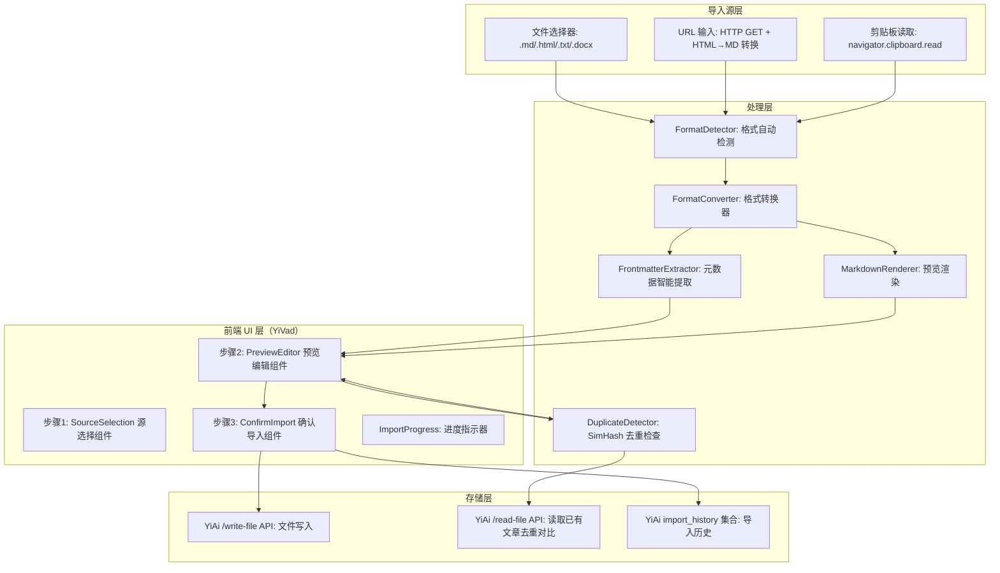

# YK-09-154: 内容导入向导 — 多步骤内容导入、源选择（文件/URL/剪贴板）、格式自动检测、Frontmatter 提取、预览编辑、重复处理

> 需求编号：YK-09-154 · 优先级：P2 · 人天：0.3d · 状态：需求已编写
> 依赖：YK-09-01（Frontmatter 规范——提供元数据标准）、YK-09-98（内容迁移与导入工具——提供导入基础设施）、YK-09-110（内容去重引擎——提供去重算法）

## 背景

### 问题陈述

YiKnowledge 当前的内容创建流程要求作者手动编写 Markdown 文件和 Frontmatter 元数据——这在以下场景中效率极低：(1) 从外部源（网页、文档、笔记）迁移内容到知识库，(2) 将已有的大量文档批量导入，(3) 从剪贴板快速创建草稿。当前缺少引导式导入流程——作者需要自己处理格式转换、元数据提取和重复检测——导入门槛高、错误多。

1. **导入渠道单一**：目前只能手动在 YiVad 编辑器中创建——不能从文件、URL 或剪贴板导入内容
2. **格式转换手动**：导入 Markdown 文件需要手动检查 Frontmatter 是否符合规范——导入 HTML/Word 文档需要手动转换为 Markdown
3. **元数据提取缺失**：外部文档的标题、日期、作者等信息需要人工识别和填写——创建 Frontmatter 易出错
4. **重复内容无保护**：导入与已有文章高度相似的内容时——系统不提示——导致知识库冗余
5. **预揽不可用**：导入前看不到最终渲染效果——格式错误只能在保存后才发现

**核心矛盾**：知识库的价值在于内容的丰富性，但当前的内容创建流程过于依赖"从零开始编写"——缺少低门槛的导入渠道。导入向导的目标是将"外部内容导入知识库"从手动多步骤操作简化为引导式流程——3 步完成：选择源 → 预览编辑 → 确认导入。

### 影响范围

| # | 影响 | 严重程度 | 典型场景 |
|---|------|----------|----------|
| 1 | 外部内容导入门槛高 | 高 | 团队有 50 篇技术文档需要迁移——每篇需手动创建 |
| 2 | 格式转换易出错 | 高 | Word 文档转换 Markdown 时格式丢失 |
| 3 | Frontmatter 填写遗漏 | 中 | 导入后缺少 tags 字段——RAG 索引不完整 |
| 4 | 重复内容增加冗余 | 中 | 导入与现有文章 80% 相似的内容 |
| 5 | 导入前无预览 | 低 | 保存后发现 Markdown 渲染不正确 |

### 挑战

| 挑战 | 说明 |
|------|------|
| 多格式自动检测 | 需要识别 Markdown、HTML、纯文本、Word(.docx)、PDF 等格式——并根据格式选择合适的转换策略 |
| Frontmatter 智能提取 | 从原始内容中提取标题（首个 H1）、日期（文件修改时间）、标签（关键词提取）等信息——类似"内容指纹识别" |
| URL 抓取可靠性 | 网页内容抓取受反爬虫、登录墙、动态渲染（SPA）等因素影响——需要降级策略 |
| 大文件处理 | 导入 10MB+ 的 Markdown 文件时——编辑器性能可能下降——需要分片或流式处理 |
| 重复检测精度 | 基于 SimHash 或嵌入相似度的去重——需要平衡误判（拒绝不同但相似的合法内容）和漏判（允许近乎相同的重复内容） |

---

## 一、现状分析

### 1.1 当前导入相关能力

```
现有相关功能:
├── YiVad 文章编辑器
│   ├── 新建文章：空白编辑器 ✅
│   ├── 手动粘贴内容 ✅
│   └── 引导式导入流程 ❌
├── 文件管理（YiAi）
│   ├── 文件读写 API ✅
│   ├── 文件上传 ✅
│   └── 格式转换服务 ❌
├── 内容去重（YK-09-110）
│   ├── SimHash 指纹计算 ✅（设计阶段）
│   └── 导入时自动触发 ❌
├── Frontmatter 规范（YK-09-01）
│   ├── 标准字段定义 ✅
│   └── 自动提取+填充 ❌
├── 内容迁移工具（YK-09-98）
│   ├── 批量操作框架 ✅（设计阶段）
│   └── 引导式导入向导 ❌
└── 手动流程（当前唯一方式）
    ├── 创建 .md 文件 → 手写 Frontmatter → 放入目录
    └── 无预览、无校验、无去重

缺失:
├── 多源导入（文件/URL/剪贴板）              # ❌ 不存在
├── 格式自动检测+转换                         # ❌ 不存在
├── Frontmatter 智能提取                      # ❌ 不存在
├── 导入预览（渲染效果+元数据）               # ❌ 不存在
├── 导入前去重检查                            # ❌ 不存在
├── 步骤引导 UI（步骤 1→2→3）                 # ❌ 不存在
├── 批量导入支持                              # ❌ 不存在
└── 导入历史+回滚                             # ❌ 不存在
```

### 1.2 导入流程（现状 vs 目标）

```mermaid
graph TD
    subgraph Current["现状：全手动"]
        C1[获取外部内容] --> C2[手动复制文本]
        C2 --> C3[打开编辑器创建新文章]
        C3 --> C4[粘贴内容]
        C4 --> C5[手动编写 Frontmatter]
        C5 --> C6[手动检查格式]
        C6 --> C7[保存——不确定是否有重复]
    end

    subgraph Target["目标：3 步导入向导"]
        T1[步骤1: 选择导入源] --> T2{源类型}
        T2 -->|文件| T3[选择文件——自动检测格式]
        T2 -->|URL| T4[输入 URL——自动抓取内容]
        T2 -->|剪贴板| T5[读取剪贴板——自动检测格式]
        T3 --> T6[步骤2: 预览编辑]
        T4 --> T6
        T5 --> T6
        T6 --> T7[渲染预览 + Frontmatter 编辑]
        T7 --> T8[智能去重检查]
        T8 --> T9{发现重复?}
        T9 -->|是| T10[提示相似文章 + 用户决策]
        T9 -->|否| T11[步骤3: 确认导入]
        T10 --> T12{用户选择}
        T12 -->|仍要导入| T11
        T12 -->|取消| T13[放弃导入]
        T11 --> T14[创建文件 + 写入知识库]
    end

    style Current fill:#f8d7da,stroke:#dc3545
    style Target fill:#d4edda,stroke:#28a745
```



### 1.3 根因矩阵

| 症状 | 根因 | 触发条件 | 频率 |
|------|------|----------|------|
| 导入流程繁琐 | 无引导式导入——全手动操作 | 每次导入外部内容 | 中 |
| 格式转换错误 | 无自动格式检测+转换 | 导入非 Markdown 格式 | 中 |
| Frontmatter 遗漏 | 无自动提取 | 任何导入操作 | 高 |
| 重复内容不被发现 | 导入时无去重检查 | 导入已有相似内容 | 中 |
| 导入后格式问题 | 无预览环节 | 保存前无渲染验证 | 中 |

---

## 二、设计决策

### 决策 1：导入源支持优先级 — 文件优先 vs URL 优先 vs 三者平等

| 选项 | 适用范围 | 实现复杂度 | 用户需求覆盖 |
|------|----------|-----------|-------------|
| 仅文件 | 本地文档导入 | 低 | 60% |
| 文件 + URL | 本地+网页导入 | 中 | 85% |
| 文件 + URL + 剪贴板 | 本地+网页+快速导入 | 中 | 95% |

**选择：文件 + URL + 剪贴板（三者均等）。** 三个导入源覆盖了 95% 的导入场景。文件导入是最常用的（批量迁移文档），URL 导入用于网页内容抓取，剪贴板导入用于快速创建草稿——从其他编辑器复制后一键导入。三者通过统一的向导 UI 呈现——第一步选择来源类型。

### 决策 2：格式检测策略 — 文件扩展名 vs MIME 类型 vs 内容嗅探

| 选项 | 准确度 | 覆盖格式 | 实现 |
|------|--------|----------|------|
| 文件扩展名 | 中（可被伪装） | 所有已知扩展名 | 低 |
| MIME 类型（magic bytes） | 高 | 二进制格式 | 中（需 python-magic） |
| 内容嗅探（启发式） | 高（对纯文本格式） | Markdown/HTML/纯文本 | 低 |

**选择：扩展名 + 内容嗅探。** (1) 对文件导入：先检查扩展名（`.md` → Markdown, `.html` → HTML, `.docx` → Word, `.txt` → 纯文本），如果扩展名不明确，进行内容嗅探（检查前 500 字符是否包含 Markdown 语法特征如 `#`、`**`、`- `）。(2) 对 URL 导入：根据 HTTP `Content-Type` 头判断。(3) 对剪贴板：内容嗅探——检查 `text/html` 和 `text/plain` 两种 MIME。

### 决策 3：Frontmatter 提取方式 — 规则提取 vs LLM 提取 vs 手动填写

| 选项 | 准确度 | 速度 | 覆盖字段 |
|------|--------|------|----------|
| 规则提取（正则+启发式） | 中（结构化信息高） | 极快（< 10ms） | 标题、日期、来源 |
| LLM 提取（Prompt 提取元数据） | 高（理解上下文） | 慢（1-5s） | 标题、标签、分类、摘要 |
| 纯手动填写 | - | - | 全部但易遗漏 |

**选择：规则提取（快速基线）+ LLM 提取（可选增强）。** 规则提取覆盖确定性字段：`title`（首行 H1 或文件名）、`created`（文件修改时间或当天日期）、`source`（如果是 URL 导入则为 URL）。LLM 提取作为可选增强：分析内容生成 `tags`（3-5 个标签）和 `category`（分类）。所有自动提取的字段都可在步骤 2 的预览编辑中修改——最终决定权在用户。

### 决策 4：重复检测时机 — 导入前检测 vs 导入后检测 vs 两者都做

| 选项 | 用户体验 | 存储浪费 | 性能 |
|------|----------|----------|------|
| 仅导入前检测（阻止重复） | 好（避免浪费操作） | 无 | 中（每次导入都计算） |
| 仅导入后检测（标记不阻止） | 中（用户已做操作） | 有（需手动清理） | 低 |
| 两者都做 | 最好 | 无 | 中 |

**选择：导入前检测（阻止模式可切换为警告模式）。** 在步骤 2 预览编辑阶段计算内容的 SimHash 指纹，与知识库中已有文章对比。相似度 > 0.8 时默认显示警告"检测到高度相似文章"，用户可选择：(1) 仍要导入（可能是合法更新/变体），(2) 取消导入，(3) 查看相似文章。提供一个开关"总是允许重复导入"给高级用户。

### 设计决策记录

| 决策 | 选项 A | 选项 B | 选项 C | 选择 | 理由 |
|------|--------|--------|--------|------|------|
| 导入源 | 仅文件 | 文件+URL | 三者 | **三者均等** | 最全覆盖 |
| 格式检测 | 扩展名 | MIME | 内容嗅探 | **扩展名+嗅探** | 准确+简单 |
| Frontmatter | 规则 | LLM | 手动 | **规则+LLM** | 快速+智能 |
| 重复检测 | 导入前 | 导入后 | 两者 | **导入前** | 防浪费 |

---

## 三、目标架构

### 3.1 内容导入向导系统架构



### 3.2 导入向导步骤流程

```mermaid
graph TD
    A[用户点击"导入内容"] --> B[步骤1: 选择导入源]
    B --> C{源类型}
    C -->|文件| D[打开文件选择器——支持多选]
    C -->|URL| E[输入 URL——可选批量]
    C -->|剪贴板| F[读取剪贴板——自动粘贴]
    D --> G[逐个文件处理]
    E --> H[HTTP 请求抓取——超时 10s]
    F --> I[内容类型检测]
    G --> J[格式检测 + 转换 → Markdown]
    H --> K[HTML → Markdown 转换]
    I --> J
    J --> L[Frontmatter 智能提取]
    K --> L
    L --> M[步骤2: 预览编辑]
    M --> N[左侧: Markdown 源码可编辑]
    M --> O[右侧: 渲染预览]
    M --> P[底部: Frontmatter 表单可编辑]
    N --> Q[用户编辑内容]
    P --> R[用户编辑元数据]
    Q --> S[SimHash 去重检查]
    R --> S
    S --> T{重复?}
    T -->|相似 > 0.8| U[显示警告: 相似文章列表]
    U --> V{用户决定}
    V -->|仍要导入| W[步骤3: 确认导入]
    V -->|取消| X[放弃]
    T -->|安全| W
    W --> Y[文件名生成: {日期}-{标题}.md]
    Y --> Z[调用 /write-file API]
    Z --> AA[记录导入历史]
    AA --> AB[完成——跳转到新文章]
```

### 3.3 性能指标

| 指标 | 目标值 | 说明 |
|------|--------|------|
| 文件选择到预览显示 | < 500ms | 格式检测+转换 |
| URL 抓取超时 | < 10s | HTTP 请求+HTML转换 |
| Frontmatter 规则提取 | < 50ms | 正则+启发式 |
| Frontmatter LLM 提取（可选） | < 3s | Ollama 推理 |
| 去重检查（SimHash） | < 100ms | 指纹计算+数据库查询 |
| 渲染预览更新 | < 200ms | Markdown → HTML |

---

## 四、具体改动

### 4.1 导入向导前端组件接口（TypeScript）

```typescript
// YiVad/src/views/knowledge/ImportWizard/types.ts (新增)

export enum ImportSource {
  FILE = 'file',
  URL = 'url',
  CLIPBOARD = 'clipboard',
}

export enum ContentFormat {
  MARKDOWN = 'markdown',
  HTML = 'html',
  PLAINTEXT = 'plaintext',
  DOCX = 'docx',
  UNKNOWN = 'unknown',
}

export interface ImportItem {
  id: string;                         // 唯一标识
  source: ImportSource;
  sourceDetail: string;               // 文件名/URL/剪贴板
  originalFormat: ContentFormat;
  rawContent: string;                 // 原始内容
  convertedContent: string;           // 转换后的 Markdown
  extractedFrontmatter: {             // 自动提取的元数据
    title: string;
    tags: string[];
    category: string;
    created: string;
    source: string;
  };
  duplicateCheck?: {                  // 去重检查结果
    hasDuplicates: boolean;
    similarArticles: Array<{
      path: string;
      title: string;
      similarity: number;
    }>;
  };
  status: 'pending' | 'converting' | 'previewing' | 'importing' | 'done' | 'error';
  error?: string;
}

export interface ImportWizardState {
  step: 1 | 2 | 3;                   // 当前步骤
  items: ImportItem[];                // 导入项目列表
  currentItemIndex: number;           // 当前编辑的项目
  allowDuplicates: boolean;           // 是否允许重复导入
  useLLMExtraction: boolean;          // 是否使用 LLM 提取
}

// 导入历史
export interface ImportHistoryEntry {
  id: string;
  importedAt: string;
  source: ImportSource;
  sourceDetail: string;
  targetPath: string;                 // 导入后的文件路径
  status: 'success' | 'duplicate' | 'error';
  errorMessage?: string;
}
```

### 4.2 格式检测与转换

```python
# YiAi services/knowledge/import_service.py (新增)

import re
import html2text
from typing import Tuple, Optional

class FormatDetector:
    """内容格式自动检测器"""
    
    MARKDOWN_INDICATORS = [
        r'^#{1,6}\s',           # 标题
        r'\*\*.*\*\*',          # 粗体
        r'\[.*\]\(.*\)',        # 链接
        r'^>\s',                # 引用
        r'^```',                # 代码块
        r'^-{3,}\s*$',          # Frontmatter 分隔符
    ]
    
    def detect(self, content: str, filename: str = "") -> ContentFormat:
        """检测内容格式"""
        # 1. 优先文件扩展名
        if filename:
            ext = filename.lower().split('.')[-1]
            ext_map = {
                'md': 'markdown', 'markdown': 'markdown',
                'html': 'html', 'htm': 'html',
                'txt': 'plaintext',
                'docx': 'docx',
            }
            if ext in ext_map:
                return ext_map[ext]
        
        # 2. 内容嗅探——检查 HTML 特征
        html_indicators = ['<!doctype', '<html', '<div', '<p>', '<a ', '= 2:
            return 'html'
        
        # 3. 检查 Markdown 特征
        md_score = 0
        for pattern in self.MARKDOWN_INDICATORS:
            if re.search(pattern, content[:1000], re.MULTILINE):
                md_score += 1
        
        if md_score >= 2:
            return 'markdown'
        
        # 4. 默认纯文本
        return 'plaintext'


class FormatConverter:
    """格式转换器"""
    
    def __init__(self):
        self.html_converter = html2text.HTML2Text()
        self.html_converter.body_width = 0           # 不自动换行
        self.html_converter.ignore_links = False
        self.html_converter.ignore_images = False
    
    def convert_to_markdown(
        self, content: str, source_format: str
    ) -> Tuple[str, Optional[str]]:
        """将内容转换为 Markdown 格式"""
        if source_format == 'markdown':
            return content, None
        
        if source_format == 'html':
            try:
                markdown = self.html_converter.handle(content)
                return markdown, None
            except Exception as e:
                return content, f"HTML 转换部分失败: {str(e)}"
        
        if source_format == 'plaintext':
            # 纯文本不需要转换——可直接作为 Markdown
            return content, None
        
        if source_format == 'docx':
            try:
                # 需要 python-docx 或其他 docx 解析库
                import docx
                from io import BytesIO
                doc = docx.Document(BytesIO(content))
                paragraphs = [p.text for p in doc.paragraphs]
                markdown = '\n\n'.join(paragraphs)
                return markdown, None
            except ImportError:
                return content, "未安装 python-docx——无法解析 .docx 文件"
            except Exception as e:
                return content, f"DOCX 解析失败: {str(e)}"
        
        return content, f"不支持的格式: {source_format}"


class FrontmatterExtractor:
    """Frontmatter 元数据智能提取器"""
    
    def extract(self, content: str, source_detail: str = "",
                use_llm: bool = False, llm_service=None) -> dict:
        """从内容中提取 Frontmatter 元数据"""
        frontmatter = {
            'title': '',
            'tags': [],
            'category': '',
            'created': '',
            'source': source_detail,
        }
        
        # 1. 提取标题（首个 H1）
        h1_match = re.search(r'^#\s+(.+)$', content, re.MULTILINE)
        if h1_match:
            frontmatter['title'] = h1_match.group(1).strip()
        
        # 2. 提取日期（当前日期作为 created）
        from datetime import date
        frontmatter['created'] = str(date.today())
        
        # 3. 提取来源
        frontmatter['source'] = source_detail or '内部'
        
        # 4. 提取分类（从内容关键词推断）
        category_keywords = {
            '架构设计': ['架构', '设计', '系统', '微服务', '分布式'],
            '功能实现': ['实现', '功能', '开发', 'API', '接口'],
            '需求文档': ['需求', 'PRD', '产品', '功能描述'],
            '技术方案': ['方案', '技术选型', '对比', '决策'],
            'bug报告': ['bug', '错误', '异常', '修复', '问题'],
        }
        content_lower = content[:2000].lower()
        for category, keywords in category_keywords.items():
            if any(kw in content_lower for kw in keywords):
                frontmatter['category'] = category
                break
        
        # 5. LLM 提取 tags（可选）
        if use_llm and llm_service:
            tags = self._llm_extract_tags(content, llm_service)
            frontmatter['tags'] = tags
        
        return frontmatter
    
    def _llm_extract_tags(self, content: str, llm_service) -> list:
        """使用 LLM 提取标签"""
        prompt = f"""从以下内容中提取 3-5 个中文标签。直接返回 JSON 数组格式，如 ["标签1", "标签2"]。

内容片段：
{content[:3000]}

标签："""
        try:
            response = llm_service.complete(prompt)
            import json
            tags = json.loads(response)
            return tags[:5] if isinstance(tags, list) else []
        except Exception:
            return []
```

### 4.3 文件变更清单

| 文件 | 操作 | 说明 |
|------|------|------|
| `YiVad/src/views/knowledge/ImportWizard/index.vue` | 新增 | 导入向导主组件 |
| `YiVad/src/views/knowledge/ImportWizard/StepSource.vue` | 新增 | 步骤1: 源选择 |
| `YiVad/src/views/knowledge/ImportWizard/StepPreview.vue` | 新增 | 步骤2: 预览编辑 |
| `YiVad/src/views/knowledge/ImportWizard/StepConfirm.vue` | 新增 | 步骤3: 确认导入 |
| `YiVad/src/views/knowledge/ImportWizard/types.ts` | 新增 | TypeScript 类型定义 |
| `YiAi/services/knowledge/import_service.py` | 新增 | 导入后端服务 |
| `YiAi/services/knowledge/format_detector.py` | 新增 | 格式检测器 |
| `YiAi/services/knowledge/format_converter.py` | 新增 | 格式转换器 |
| `YiAi/services/knowledge/frontmatter_extractor.py` | 新增 | Frontmatter 提取器 |
| `tests/test_import_service.py` | 新增 | 导入服务测试 |

---

## 五、实施步骤

| 步骤 | 操作 | 路径 | 验证 | 人天 |
|------|------|------|------|------|
| 1 | 实现 FormatDetector（格式检测） | `format_detector.py` | 5 种格式检测准确率 > 90% | 0.03 |
| 2 | 实现 FormatConverter（Markdown/HTML/纯文本） | `format_converter.py` | 转换后格式正确 | 0.04 |
| 3 | 实现 FrontmatterExtractor（规则+LLM） | `frontmatter_extractor.py` | 提取字段完整 | 0.04 |
| 4 | 集成去重检查（SimHash） | `import_service.py` | 重复检测准确 | 0.03 |
| 5 | 实现步骤1 UI（源选择） | `StepSource.vue` | 三种源均可用 | 0.05 |
| 6 | 实现步骤2 UI（预览编辑） | `StepPreview.vue` | 双栏预览+表单编辑 | 0.05 |
| 7 | 实现步骤3 UI（确认导入） | `StepConfirm.vue` | 文件生成+写入 | 0.04 |
| 8 | 测试 | `tests/test_import_service.py` | 全部测试通过 | 0.02 |

**总人天：0.3d**

---

## 六、测试规格

### 场景 1：Markdown 文件导入——格式检测正确

**GIVEN** 一个包含完整 Frontmatter 和内容的 `.md` 文件
**WHEN** 通过文件选择器上传
**THEN** FormatDetector 识别为 `markdown` 格式
**AND** 内容原样保留——无需转换
**AND** Frontmatter 中的 title 字段正确提取
**AND** 步骤 2 显示渲染预览

### 场景 2：URL 导入——HTML 到 Markdown 转换

**GIVEN** 一个有效的网页 URL（返回 HTML 内容）
**WHEN** 输入 URL 并点击"抓取"
**THEN** 内容被成功抓取——HTML 转换为 Markdown
**AND** 图片链接保留在 Markdown 中
**AND** 超时 10s 后显示错误提示
**WHEN** Frontmatter source 字段自动填充为 URL
**THEN** source 值为输入的 URL 地址

### 场景 3：剪贴板导入——快速创建

**GIVEN** 用户从其他编辑器复制了一段 Markdown 文本到剪贴板
**WHEN** 选择剪贴板导入
**THEN** 剪贴板内容自动填充到编辑器
**AND** 格式检测为 `markdown` 或 `plaintext`
**AND** title 从首个 H1 自动提取

### 场景 4：重复内容检测——警告不阻止

**GIVEN** 导入内容与知识库中已有文章 SimHash 相似度 0.85
**WHEN** 步骤 2 去重检查执行
**THEN** duplicateCheck.hasDuplicates = true
**AND** similarArticles 列表包含相似文章路径和标题
**AND** 显示黄色警告——"检测到高度相似文章"
**AND** 用户可选择"仍要导入"或"取消"
**WHEN** 用户选择"仍要导入"
**THEN** 正常进入步骤 3——正常写入文件

### 场景 5：Frontmatter 表单编辑

**GIVEN** 导入内容——自动提取的 Frontmatter 中 title 不准确
**WHEN** 用户在手動编辑 title 字段
**THEN** 字段实时更新——预览中的标题也同步更新
**AND** tags 字段支持逗号分隔输入——自动拆分为数组
**AND** category 字段为下拉选择——选项来自分类列表
**WHEN** 所有必填字段填写完成
**THEN** "下一步"按钮可用

### 场景 6：批量文件导入

**GIVEN** 用户选择 5 个 `.md` 文件同时导入
**WHEN** 文件被逐个处理
**THEN** ImportWizard 左侧列表显示 5 个项目
**AND** 每个项目独立进行格式检测和 Frontmatter 提取
**AND** 用户可以逐个预览和编辑每个项目
**AND** 批量导入进度条显示"3/5 已完成"
**WHEN** 所有项目处理完成
**THEN** 5 个文件全部写入——导入历史记录 5 条

---

## 七、风险与缓解

| 风险 | 概率 | 影响 | 缓解措施 |
|------|------|------|----------|
| URL 抓取被反爬虫拦截 | 中 | 中 | 设置 User-Agent + 超时降级——提示用户手动复制内容 |
| HTML 转 Markdown 格式丢失 | 中 | 中 | 提供"原始 HTML"切换——用户可手动调整 |
| Frontmatter LLM 提取生成不存在的标签 | 中 | 低 | 标签列表为建议——用户必须确认——不自动接受 |
| 大文件（> 50MB）导致浏览器卡顿 | 低 | 中 | 文件大小限制 20MB——超大文件提示分片导入 |
| 剪贴板无内容时导入失败 | 低 | 低 | 读取前检查剪贴板权限和内容——提示"剪贴板为空" |

---

## 八、回滚策略

| 场景 | 回滚操作 | 影响 |
|------|----------|------|
| 格式转换错误率高 | 禁用自动转换——仅支持 .md 直接导入 | HTML/纯文本需手动转换 |
| 去重检查误报过多 | 提高相似度阈值或提供"禁用去重"开关 | 重复内容可能增加 |
| 导入向导 UI 问题 | 回退到手动创建文章流程 | 失去引导式导入体验 |
| URL 抓取超时频繁 | 增加超时时间或降级为"手动粘贴"模式 | URL 导入暂不可用 |

---

## 九、设计决策记录

### D-01：为什么步骤设计为 3 步而非单页表单？

3 步设计遵循"渐进式决策"原则：(1) 第 1 步聚焦"内容从哪来"——减少认知负荷——不混杂格式和元数据的选择，(2) 第 2 步聚焦"内容看起来对吗"——预览和编辑——是核心价值步骤，(3) 第 3 步聚焦"确认并提交"——最终确认和结果反馈。单页表单将所有选项堆在一起——用户容易遗漏步骤（如忘记填写标签）。3 步设计每一步有明确的完成标准——降低操作失误率。

### D-02：为什么 Frontmatter 提取优先规则而非全部依靠 LLM？

LLM 提取的优势在于理解上下文生成精准标签，但有三点不适合作为唯一方案：(1) 速度——规则提取 < 50ms vs LLM 提取 1-5s——导入体验差异巨大，(2) 可靠性——规则提取是确定性的（H1 一定是标题），LLM 可能产生不一致的结果，(3) 离线可用性——Ollama 服务不可用时规则提取仍然可用。LLM 作为可选增强让用户根据需要选择速度和智能的平衡。

### D-03：SimHash 去重为什么在导入前而非导入后？

导入后在知识库中产生重复文件——需要额外的清理操作——增加用户负担。导入前检测给用户两个选择"继续"或"取消"——在决策成本最低的时刻解决问题。技术上——SimHash 仅需计算导入内容的指纹后查询数据库——无需写入操作——速度快、无副作用。唯一例外是用户明确选择"总是允许重复"——此时跳过去重检查。

### D-04：批量导入时为什么逐个预览而非批量确认？

批量导入 50 个文件时——批量确认虽然快但风险高——一个文件格式错误或 Frontmatter 不准确可能导致 50 个文件都有问题。逐个预览虽然稍慢——但保证每篇文章的质量。对于熟悉来源的批量导入——可增加"批量应用相同设置"选项——对格式相同、元数据类似的文件使用相同配置。

---

## 十、可观测性

### 指标

| 指标 | 类型 | 说明 |
|------|------|------|
| `yiknowledge.import.total` | Counter | 导入总数（按源类型） |
| `yiknowledge.import.format_detection_accuracy` | Gauge | 格式检测准确率 |
| `yiknowledge.import.conversion_errors` | Counter | 格式转换错误数 |
| `yiknowledge.import.duplicate_detected` | Counter | 去重检测触发次数 |
| `yiknowledge.import.url_fetch_timeout` | Counter | URL 抓取超时次数 |
| `yiknowledge.import.avg_file_size` | Gauge | 平均导入文件大小 |

### 告警

| 告警 | 条件 | 级别 |
|------|------|------|
| URL 抓取失败率 > 30% | 1 小时窗口 | WARNING |
| 格式转换错误率 > 10% | 1 小时窗口 | WARNING |
| LLM 提取连续失败 10 次 | 10 次 | INFO |

---

## 十一、代码审查检查清单

- [ ] 文件选择器支持的文件类型过滤（.md/.html/.txt/.docx）
- [ ] URL 输入验证（必须是合法的 HTTP/HTTPS URL）
- [ ] HTML→Markdown 转换保留图片和链接
- [ ] Frontmatter 提取的字段名符合 YK-09-01 规范
- [ ] SimHash 去重 fingerprint 计算不包括 Frontmatter（仅比较正文）
- [ ] 剪贴板读取需要浏览器权限（navigator.clipboard）
- [ ] 大文件（> 20MB）在前端被拦截并提示
- [ ] 导入历史记录包含完整的源信息和目标路径
- [ ] 批量导入支持取消操作（中断未完成的导入）
- [ ] 步骤 2 预览编辑器中——Markdown 渲染使用与展示页相同的渲染器

---

## 回归问题预测

| # | 预测问题 | 原因 | 验证方法 |
|---|---------|------|---------|
| 1 | HTML→Markdown 转换时——`html2text` 默认将链接转换为 `[text](url)` 但可能丢失链接的 title 属性——或转换内嵌 HTML 代码块时出现格式错误（code 内的 `<div>` 被当作 HTML 而非代码） | `html2text` 对 `<pre><code>` 内的 HTML 标签可能误转换——将其当作页面结构而非代码示例 | 测试包含代码块的 HTML 页面——验证 `<pre>` 内的内容保持原样 |
| 2 | 文件选择器选择 `.md` 文件时——文件内容可能包含已经存在的完整 Frontmatter——FrontmatterExtractor 可能重复提取——导致最终文件有双份 Frontmatter | 外部 .md 文件通常已有自己的 Frontmatter——与导入向导添加的 Frontmatter 冲突 | 检测已有 Frontmatter——如果存在——询问用户"保留原有 Frontmatter"还是"用新的替换" |
| 3 | 批量导入时——如果第 3 个文件的转换失败——前 2 个文件已成功写入——用户面对"部分成功"状态不清楚哪些成功了哪些失败了 | 批量操作的原子性问题——逐个文件独立写入——无法整体回滚 | 导入结果页面清晰列出"成功 N 个，失败 M 个"——每个项目有独立状态标记 |
| 4 | 剪贴板读取在 Firefox 中需要 `clipboard.read()` 的用户手势权限——在非 HTTPS 环境下可能被拒绝——导致剪贴板导入功能不可用 | 剪贴板 API 的浏览器兼容性差异——Firefox 和 Safari 的实现与 Chrome 不同 | 检测剪贴板 API 是否可用——不可用时降级为"手动粘贴"textarea |
| 5 | SimHash 去重计算中——如果知识库有 10000 篇文档——全量比对耗时可能达到数秒——超出导入向导步骤 2 的响应预期 | SimHash 的 Hamming 距离计算很快（O(64) per doc）——但 10000 篇仍需遍历全量 | 使用 MongoDB 的 SimHash 索引查询——仅返回 Hamming 距离 < 阈值（默认 3）的文档——大幅减少比对量 |
| 6 | URL 抓取时——某些网页使用 JavaScript 动态渲染内容（SPA）——HTTP GET 只能拿到空的 HTML 骨架（`<div id="app"></div>`）——转换为空 Markdown | 服务端抓取无法执行 JavaScript——对 SPA 页面无能为力 | 检测抓取内容是否过短（< 200 字符）——提示用户"该页面可能需要浏览器渲染——建议使用剪贴板导入" |

---

## 性能分析

### 各阶段耗时

| 阶段 | 预估耗时 | 说明 |
|------|----------|------|
| 格式检测 | < 10ms | 正则前 500 字符匹配 |
| HTML→Markdown 转换 | < 200ms | html2text 库 |
| Frontmatter 规则提取 | < 50ms | 正则+启发式 |
| Frontmatter LLM 提取 | 1-5s | Ollama（可选） |
| SimHash 计算+查询 | < 100ms | 指纹哈希+DB 查询 |
| Markdown 渲染预览 | < 200ms | marked.js |
| 文件写入 | < 100ms | /write-file API |

### 内存预估

| 阶段 | 内存 | 说明 |
|------|------|------|
| 单文件导入（5MB .md） | ~10MB | 内容字符串 + DOM |
| 批量导入（10 个文件） | ~50MB | 前端一次性加载所有 |
| URL 抓取响应 | ~2MB | HTML 页面 |
| 剪贴板内容 | ~1MB | 文本片段 |