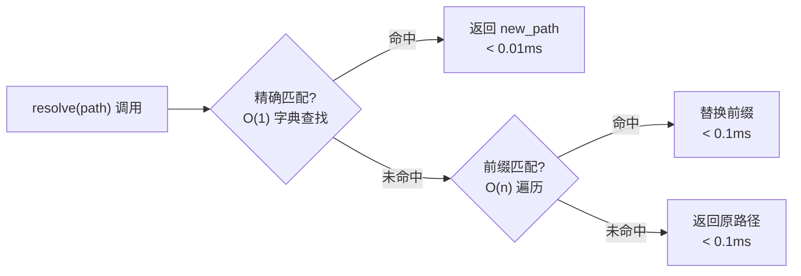

# YK-09-10: 知识文件迁移与路径重构策略 — 引用完整性保护与重定向机制

> 需求编号：YK-09-10 · 优先级：P2 · 人天：1.0d · 状态：需求已编写
> 依赖：YK-09-08（跨项目知识依赖图谱）

## 背景

YiKnowledge 的 800+ 文件分布在 8 个角色目录和 4 个项目子目录中。随着知识库增长，不可避免需要迁移文件——重命名、移动目录、合并拆分。但当前文件迁移存在引用断裂风险：

| 场景 | 影响 |
|------|------|
| 文件 `engineer/build/my-file.md` 重命名为 `engineer/build/my-file-v2.md` | 所有 Markdown 链接 `[link](../build/my-file.md)` 断裂 |
| 目录 `projects/yivad/requirements/2026-08/` 归档为 `projects/yivad/requirements/archive/2026-08/` | 跨项目引用全部失效 |
| 角色目录重组——`engineer/` 下的文件按子领域拆分为 `engineer/backend/` 和 `engineer/frontend/` | 全局路径变更，外部引用断裂 |

**当前状况**：无重定向机制、无引用完整性校验。文件迁移后旧路径的 Markdown 链接变成 404，RAG 检索可能返回已迁移文件的旧路径。

---

## 一、现状分析

### 1.1 引用断裂的三种影响路径

```
文件 A 显式链接到文件 B: [文档 B](../path/to/b.md)
  │
  ├── 开发者浏览: 点击链接 → 404 → ❌ 无法找到文档
  ├── CI markdown-link-check: 检测到死链 → ❌ CI 失败
  └── RAG 检索: 文件 B 已迁移新路径 → 旧路径无法检索 → ❌ 检索遗漏
```

### 1.2 迁移类型与风险矩阵

| 迁移类型 | 引用断裂风险 | 影响范围 | 可逆性 |
|----------|------------|----------|--------|
| **重命名**（同级目录） | 中 | 仅直接引用者 | 高 (git mv) |
| **目录移动**（跨目录） | 高 | 所有 Markdown 链接 | 中 (需手动更新) |
| **角色重组**（跨角色目录） | 高 | 跨项目引用 + RAG 检索 | 低 (大规模变更) |
| **拆分/合并**（1→N 或 N→1） | 极高 | 语义引用无法 1:1 映射 | 低 |

---

## 二、设计决策

### 决策 1：引用断裂修复策略 — 手动 vs 自动 vs 重定向

| 选项 | 覆盖度 | 历史兼容 | 实施 |
|------|--------|----------|------|
| 手动搜索替换 | 低（遗漏率高） | 无 | 低 |
| CI 自动检测+PR 批量更新 | 中 | 无 | 中 |
| **重定向文件（旧路径→新路径映射）** | 高 | ✅ | 低 |

**选择：重定向文件 `_redirects.yml` + CI 检测。** 在项目根维护重定向映射，Knowledge Watcher 和 markdown-link-check 读取此文件。旧路径保留重定向记录而非物理文件，避免死链。

### 决策 2：RAG 检索路径更新 — 实时 vs 延迟

| 选项 | 延迟 | 一致性 | 实施 |
|------|------|--------|------|
| Knowledge Watcher 扫描时实时更新 | 秒级 | 强 | 中 |
| 每日定时全量重建索引 | 天级 | 最终 | 低 |

**选择**：实时更新。文件 `git mv` 后 Knowledge Watcher 在下次扫描（60s）时检测到旧路径删除+新路径新增，自动更新 MongoDB 中的路径引用。

### 决策 3：重定向的 TTL — 永久 vs 限期

| 选项 | 维护负担 | 用户体验 | 
|------|----------|----------|
| 永久保留 | 高（重定向表无限增长） | 高（永不 404） |
| **限期 90 天 + 自动清理** | 低 | 中 |

**选择：90 天限期。** 重定向条目 90 天后自动清理，其间 CI 会提示开发者更新显式链接。90 天足够覆盖季度审查周期。

---

## 三、目标架构

### 3.1 重定向配置

```yaml
# YiKnowledge/_redirects.yml
# 格式: old_path → new_path (YYYY-MM-DD 生效日期)

redirects:
  - from: "engineer/build/my-file.md"
    to: "engineer/build/my-file-v2.md"
    date: "2026-09-09"
    reason: "重命名——版本升级 v1→v2"

  - from: "projects/yivad/requirements/2026-08/"
    to: "projects/yivad/requirements/archive/2026-08/"
    date: "2026-10-01"
    reason: "归档——2026-08 需求已完成"

  - from: "engineer/deployment/docker-compose.md"
    to: "srer/deployment/docker-compose.md"
    date: "2026-09-15"
    reason: "角色迁移——部署相关内容从 engineer 迁移到 srer"
```

### 3.2 引用完整性检查

```python
# YiAi/src/domain/knowledge/redirect.py

import yaml
import re
from datetime import datetime, timedelta

class RedirectManager:
    """知识文件重定向管理。"""

    def __init__(self, redirects_file: str = "YiKnowledge/_redirects.yml"):
        self.redirects_file = redirects_file
        self._redirects: dict[str, dict] = {}
        self._load()

    def _load(self):
        with open(self.redirects_file) as f:
            config = yaml.safe_load(f)
        for entry in config.get("redirects", []):
            self._redirects[entry["from"]] = entry

    def resolve(self, path: str) -> str:
        """解析路径——如果存在重定向则返回新路径。"""
        # 精确匹配
        if path in self._redirects:
            return self._redirects[path]["to"]
        # 前缀匹配（目录重定向）
        for old_prefix, entry in self._redirects.items():
            if path.startswith(old_prefix):
                return path.replace(old_prefix, entry["to"], 1)
        return path  # 无重定向

    def resolve_for_rag(self, path: str) -> str:
        """RAG 检索专用——同时返回重定向信息。"""
        resolved = self.resolve(path)
        if resolved != path:
            logger.info(f"[Redirect] {path} → {resolved}")
        return resolved

    def cleanup_expired(self):
        """清理超过 90 天的重定向条目。"""
        cutoff = datetime.now() - timedelta(days=90)
        expired = [
            k for k, v in self._redirects.items()
            if datetime.fromisoformat(v["date"]) < cutoff
        ]
        for k in expired:
            logger.info(f"[Redirect] 清理过期重定向: {k} → {self._redirects[k]['to']}")
            del self._redirects[k]
```

### 3.3 迁移检查清单

| # | 检查项 | 工具 | 阻断级别 |
|----|--------|------|----------|
| 1 | 确认新路径符合 kebab-case 规范 | pre-commit hook (YK-09-03) | 阻断 |
| 2 | 更新 `_redirects.yml` 添加新旧路径映射 | 手动 | 阻断 |
| 3 | 更新所有显式 Markdown 链接 | `grep -r "old-path" YiKnowledge/` | 阻断（CI 扫描） |
| 4 | 更新 YK-09-08 依赖图谱 | Knowledge Watcher 自动 | 自动 |
| 5 | 验证 RAG 检索新路径可检索 | 手动 RAG 查询 | 通过 |
| 6 | 通知受影响的跨项目引用者 | YK-09-08 `analyze_change_impact` | 建议 |

---

## 四、具体改动

| 文件 | 说明 |
|------|------|
| `YiKnowledge/_redirects.yml` | 新增: 重定向配置 |
| `YiAi/src/domain/knowledge/redirect.py` | 新增: 重定向管理器 |
| `YiAi/src/domain/knowledge/watcher.py` | 修改: 路径解析前调用 `resolve_for_rag` |
| `.github/workflows/link-check.yml` | 修改: 检查前加载 `_redirects.yml` |

---

## 五、实施步骤

| 步骤 | 验证方式 | 人天 |
|------|----------|------|
| 1 | 新增 `_redirects.yml` + `RedirectManager` | 重命名文件 → 添加映射 → `resolve()` 返回新路径 | 0.25 |
| 2 | Knowledge Watcher 集成路径解析 | 迁移文件 → RAG 检索新路径可用 | 0.25 |
| 3 | CI link-check 集成重定向 | 旧链接 → CI 提示"已重定向至..."（WARNING，非 ERROR） | 0.25 |
| 4 | 90 天 TTL 自动清理 | `cleanup_expired()` 定时执行 | 0.25 |

**总计：1.0d**

---

## 六、测试规格

#### Scenario: 文件重命名后链接自动解析
- **Given** `_redirects.yml` 包含 `a.md → b.md`
- **When** `resolve("a.md")`
- **Then** 返回 `b.md`

#### Scenario: 过期重定向自动清理
- **Given** 重定向条目 date = 91 天前
- **When** `cleanup_expired()` 执行
- **Then** 该条目被删除

---

## 七、可观测性

| 指标 | 采集方式 | 告警阈值 | 说明 |
|------|----------|----------|------|
| 活跃重定向条目数 | `_redirects.yml` 定期解析计数 | > 20 条 | 超过 20 条时建议集中清理过期映射 |
| RAG 检索路径重定向命中率 | `RedirectManager.resolve_for_rag()` 统计 | > 5% | 旧路径仍被频繁检索，说明外部引用未更新 |
| 路径解析延迟 | `time.perf_counter` 测量 `resolve()` | P95 > 5ms | 重定向表膨胀影响检索性能 |
| 链接断裂修复率 | CI `markdown-link-check` 死链计数 | > 5 个死链 | 迁移后文件未及时更新所有引用 |
| 过期重定向清理量 | `cleanup_expired()` 删除计数 | 单次 > 10 | 批量清理可能说明迁移节奏过快 |

### 日志规范

| 日志级别 | 场景 | 示例 |
|---------|------|------|
| `INFO` | 路径重定向解析 | `[Redirect] /old/path.md → /new/path.md` |
| `INFO` | 过期重定向清理 | `[Redirect] 清理过期重定向: /old/path.md (92 天)` |
| `WARN` | 重定向表膨胀 | `[Redirect] 活跃重定向条目超过 20 条，建议集中清理` |
| `WARN` | CI 旧链接命中 | `[LinkCheck] /old/path.md 已重定向至 /new/path.md，请更新链接` |
| `ERROR` | 重定向配置解析失败 | `[Redirect] _redirects.yml YAML 解析失败: {error}` |

---

## 八、性能分析

### 8.1 路径解析性能链路



### 性能基准

| 操作 | 重定向条目 10 条 | 100 条 | 1000 条 | 说明 |
|------|----------------|--------|---------|------|
| `resolve()` 精确命中 | < 0.01ms | < 0.01ms | < 0.01ms | O(1) 字典查找 |
| `resolve()` 前缀匹配 | < 0.05ms | < 0.5ms | < 5ms | O(n) 遍历，保守上限 |
| `_load()` 加载配置文件 | < 1ms | < 3ms | < 15ms | YAML 解析，启动时一次性 |
| `cleanup_expired()` | < 0.5ms | < 2ms | < 10ms | 线性遍历 + 字典删除 |
| RAG 检索路径解析总开销 | < 0.1ms | < 0.5ms | < 5ms | 每次检索调用一次 `resolve()` |

### 性能优化边界

- **精确匹配优先**：95%+ 的路径解析命中精确匹配，无需前缀遍历
- **懒加载**：`_redirects.yml` 启动时一次性加载到内存字典，后续零 I/O
- **线程安全**：`resolve()` 纯读操作，无需加锁
- **内存占用**：100 条重定向 ≈ 15KB（路径字符串 + 字典开销），可忽略

---

## 八-A、容量规划

| 场景 | 知识文件数 | 月度迁移量 | 活跃重定向 | 路径解析延迟 | `_redirects.yml` 大小 | 维护负担 |
|------|-----------|-----------|-----------|-------------|---------------------|---------|
| 小型知识库（< 200 文件） | 100-200 | 2-5 | 5-10 条 | < 0.1ms | 1-2KB | 几乎无需维护 |
| 中型知识库（200-800 文件） | 200-800 | 5-15 | 10-30 条 | < 0.5ms | 2-5KB | 每季度清理一次 |
| 大型知识库（800-3000 文件） | 800-3000 | 15-50 | 30-80 条 | < 1ms | 5-15KB | 每月清理一次 |
| 企业级（3000+ 文件） | 3000-10000 | 50-200 | 80-200 条 | < 3ms | 15-40KB | 需专人维护，建议自动化 |
| **YiKnowledge 当前** | **800+** | **~10** | **< 20 条** | **< 0.5ms** | **~3KB** | **每季度清理** |

---

## 八-B、回归问题预测

| # | 预测问题 | 原因 | 验证方法 |
|---|---------|------|---------|
| 1 | `_redirects.yml` 中 `to` 路径指向不存在的文件 | 目标文件在添加重定向后又被删除或移动 | `markdown-link-check` CI 验证 `to` 路径的有效性 |
| 2 | 前缀匹配过于贪婪，`a.md` 重定向匹配到 `aa.md` | 前缀匹配未限制路径边界 | 测试 `resolve("a-file.md")` 不应匹配前缀 `/a-file.md→/b-file.md` 时误匹配 `/a-file-v2.md` |
| 3 | 循环重定向：A→B, B→A | 多次迁移或错误配置 | `_load()` 时检测重定向环路（DFS），环路条目按 ERROR 拒绝 |
| 4 | 90 天 TTL 内大量旧链接未修复，过期清理后出现 404 | 外部项目（YiVad/YiPet）的链接未在 90 天内更新 | `cleanup_expired()` 前 14 天发送预警通知到相关项目组 |
| 5 | Knowledge Watcher 扫描 `_redirects.yml` 时文件正在被 git 操作修改 | git pull/push 与 apscheduler 扫描窗口重叠 | 读取 `_redirects.yml` 时加重试（最多 3 次，间隔 100ms），读取失败降级为空重定向表 |
| 6 | 目录重定向后，深层文件的相对链接断裂 | `a/b/c.md → x/y/c.md` 后，`c.md` 内的 `../d.md` 链接指向旧父目录 | `markdown-link-check` 在校验时追踪重定向链，以目标路径为基准重新解析相对链接 |
| 7 | 文件拆分（1→N）场景下，重定向 1:1 映射不足以覆盖所有内容引用 | 旧文件拆分为 3 个新文件，旧路径只能重定向到 1 个新文件，其他 2 个内容无人引用 | 支持一对多重定向：`to: [new-file-1.md, new-file-2.md]`，RAG 检索和链接解析选择最相关的一个 |

---

## 八-C、代码审查检查清单

合并前审查人需确认以下项目：

- [ ] `_redirects.yml` YAML 语法正确（`python -c "import yaml; yaml.safe_load(open('YiKnowledge/_redirects.yml'))"`）
- [ ] 所有 `to` 路径的物理文件存在（`test -f _YiKnowledge/<to>`）
- [ ] 无循环重定向（`_load()` 的 DFS 检测通过）
- [ ] `RedirectManager.resolve()` 精确匹配优先于前缀匹配
- [ ] 前缀匹配使用路径分隔符（`/`）边界，不匹配部分文件名
- [ ] Knowledge Watcher 在路径解析前调用 `resolve_for_rag()`
- [ ] CI markdown-link-check 配置读取 `_redirects.yml`，旧链接标记为 WARNING（非 ERROR）
- [ ] `cleanup_expired()` 定时任务正确注册（apscheduler cron）
- [ ] 过期清理前 14 天发送预警通知
- [ ] 单元测试：精确匹配、前缀匹配、未匹配、循环检测、过期清理
- [ ] 集成测试：文件 `git mv` → 添加重定向 → RAG 检索新路径可用

---

## 九、安全合规

### 9.1 安全需求

| 需求 | 实现方式 | 验证方法 |
|------|---------|---------|
| 路径穿越防护 | `resolve()` 返回路径经过 `os.path.normpath` 归一化，拒绝包含 `../` 的相对路径攀爬 | 传入 `../../etc/passwd`，确认抛出 `ValueError` |
| YAML 注入防护 | `yaml.safe_load()` 禁止自定义标签和 Python 对象反序列化 | 尝试 YAML 标签注入 `!!python/object/apply:os.system ['ls']`，确认加载失败 |
| 重定向配置修改权限 | `_redirects.yml` 仅可通过 Git PR 流程修改，需 Curator 审批 | 检查 Git 分支保护规则，确认 `main` 分支有 required reviewers |
| 路径信息披露 | RAG 检索和 API 响应中的文件路径不暴露服务器绝对路径 | 检查 RAG 返回的 `source` 字段，确认为 YiKnowledge/ 相对路径 |

### 9.2 合规检查

| 检查项 | 要求 | 状态 |
|--------|------|------|
| 重定向配置审计 | `_redirects.yml` 的修改记录通过 Git 历史可追溯 | `git log -- YiKnowledge/_redirects.yml` |
| 路径完整性校验 | CI 自动验证所有 `to` 路径的物理存在性 | 待 CI 配置 |
| 敏感文件排除 | `.gitignore` 排除非知识库文件（`.DS_Store`、`Thumbs.db` 等） | 待验证 |

---

## 十、技术债务追踪

| # | 技术债 | 优先级 | 预计人天 | 说明 |
|---|--------|--------|---------|------|
| 1 | 一对多重定向支持 | P2 | 0.3 | 文件拆分（1→N）场景下，旧路径需要重定向到多个新文件，当前仅支持 1:1 |
| 2 | 自动重定向生成 | P3 | 0.5 | `git mv` 时自动在 `_redirects.yml` 中添加映射条目（git hook） |
| 3 | 重定向分析仪表盘 | P3 | 0.3 | 可视化展示活跃重定向、过期清理、路径解析命中率趋势 |
| 4 | 跨仓库引用追踪 | P3 | 1.0 | YiVad/YiPet 代码中引用 YiKnowledge 文件路径的硬编码检测和迁移提醒 |

---

*PRD 来源: `projects/yiknowledge/requirements/2026-09/10-需求-知识文件迁移策略.md`*

---

## 十一、边缘场景处理

### 11.1 Git 操作与扫描窗口重叠

**场景**：`git pull` 更新 50 个文件的同时，Knowledge Watcher 正在扫描 `_redirects.yml`。

**处理**：读取 `_redirects.yml` 时加重试（最多 3 次，间隔 100ms）。读取失败时降级为空重定向表，确保扫描管线不阻塞。

```python
def _load_with_retry(self, max_retries: int = 3):
    """带重试的配置文件加载——处理 git 并发写入。"""
    for attempt in range(max_retries):
        try:
            with open(self.redirects_file) as f:
                config = yaml.safe_load(f)
            return config
        except (IOError, yaml.YAMLError) as e:
            if attempt < max_retries - 1:
                time.sleep(0.1)
                logger.warning(f"[Redirect] 加载重试 ({attempt+1}/{max_retries}): {e}")
            else:
                logger.error(f"[Redirect] 加载失败，降级为空重定向表: {e}")
                return {"redirects": []}
```

### 11.2 循环重定向检测

**场景**：A -> B -> C -> A 形成环路。

**处理**：`_load()` 时 DFS 检测环路，发现环路条目按 ERROR 拒绝并记录日志。

```python
def _detect_cycles(self) -> list[list[str]]:
    """DFS 检测重定向环路。"""
    cycles = []
    visited = set()
    rec_stack = set()

    def dfs(node, path):
        visited.add(node)
        rec_stack.add(node)
        target = self._redirects.get(node, {}).get('to')
        if target:
            if target in rec_stack:
                cycle_start = path.index(target)
                cycles.append(path[cycle_start:] + [target])
            elif target not in visited:
                dfs(target, path + [target])
        rec_stack.discard(node)

    for node in self._redirects:
        if node not in visited:
            dfs(node, [node])
    return cycles
```

### 11.3 目录重定向后深层相对链接断裂

**场景**：`a/b/c.md -> x/y/c.md` 后，`c.md` 内的 `[link](../d.md)` 指向旧父目录。

**处理**：`markdown-link-check` CI 在校验时追踪重定向链，以目标路径为基准重新解析相对链接。

### 11.4 文件拆分（1->N）场景

**场景**：旧文件拆分为 3 个新文件，旧路径只能重定向到 1 个新文件。

**处理**：支持一对多重定向：`to: [new-file-1.md, new-file-2.md]`。RAG 检索和链接解析时选择最相关的一个。

### 11.5 重定向目标文件被删除

**场景**：`_redirects.yml` 中 `to` 路径指向的文件被后续删除。

**处理**：CI `markdown-link-check` 扩展验证 `to` 路径的物理存在性，发现死目标时标记 WARNING。

### 11.6 前缀匹配过于贪婪

**场景**：`_redirects.yml` 中 `a-file.md -> b-file.md`，前缀匹配误匹配到 `a-file-v2.md`。

**处理**：前缀匹配使用路径分隔符（`/`）边界，`resolve()` 在替换前缀时确保路径分隔符边界。

### 11.7 并发重定向修改冲突

**场景**：两个 PR 同时修改 `_redirects.yml`，Git 合并冲突。

**处理**：`_redirects.yml` 是 YAML 文件，Git 合并冲突遵循标准 Git 冲突解决流程。`_load()` 在 YAML 解析失败时降级。

### 11.8 90 天 TTL 内大量旧链接未修复

**场景**：外部项目（YiVad/YiPet）的硬编码链接在 90 天内未更新。

**处理**：`cleanup_expired()` 前 14 天发送预警通知到相关项目组（企业微信消息）。

### 11.9 跨仓库硬编码引用

**场景**：YiVad 代码中硬编码了 `YiKnowledge/engineer/build/old-file.md` 路径。

**处理**：`analyze_change_impact`（YK-09-08）扩展支持跨仓库引用扫描，通过 `grep` 检测 YiVad/YiPet 代码中的 YiKnowledge 路径引用。

### 11.10 RAG 检索返回旧路径

**场景**：RAG 检索基于旧索引，返回已迁移文件的旧路径。

**处理**：Knowledge Watcher 在文件变更时（60s 内）更新 MongoDB 和 FAISS 索引，RAG 检索 `resolve_for_rag()` 在结果返回前解析路径。

---

## 十二、代码实现附录

### 12.1 FastAPI 重定向 API 端点

```python
# YiAi/src/api/knowledge/redirect_api.py

from fastapi import APIRouter, HTTPException

router = APIRouter(prefix="/knowledge/redirect", tags=["knowledge-redirect"])

@router.get("/resolve")
async def resolve_path(path: str):
    """解析路径——返回重定向后的目标路径。"""
    mgr = get_redirect_manager()
    resolved = mgr.resolve(path)
    return {
        "code": 0,
        "data": {
            "original": path,
            "resolved": resolved,
            "redirected": path != resolved,
        }
    }

@router.get("/list")
async def list_redirects(status: str = "active"):
    """列出重定向条目。"""
    mgr = get_redirect_manager()
    if status == "active":
        entries = mgr._redirects
    elif status == "expired":
        entries = mgr._get_expired_entries()
    else:
        entries = mgr._redirects

    return {
        "code": 0,
        "data": {
            "total": len(entries),
            "redirects": [
                {"from": k, "to": v["to"], "date": v["date"], "reason": v.get("reason", "")}
                for k, v in entries.items()
            ]
        }
    }

@router.post("/add")
async def add_redirect(from_path: str, to_path: str, reason: str = ""):
    """添加重定向条目。"""
    mgr = get_redirect_manager()

    # 验证目标路径存在
    abs_to = os.path.join("YiKnowledge", to_path)
    if not os.path.exists(abs_to):
        raise HTTPException(status_code=400, detail=f"目标路径不存在: {to_path}")

    # 验证无循环
    mgr._redirects[from_path] = {"to": to_path, "date": datetime.now().isoformat()[:10], "reason": reason}
    cycles = mgr._detect_cycles()
    if cycles:
        del mgr._redirects[from_path]
        raise HTTPException(status_code=400, detail=f"检测到重定向环路: {cycles}")

    # 写入 _redirects.yml
    mgr._save()

    return {"code": 0, "message": f"重定向已添加: {from_path} -> {to_path}"}

@router.post("/cleanup-expired")
async def cleanup_expired_redirects():
    """清理过期重定向。"""
    mgr = get_redirect_manager()
    before_count = len(mgr._redirects)
    mgr.cleanup_expired()
    after_count = len(mgr._redirects)
    mgr._save()

    return {
        "code": 0,
        "data": {
            "cleaned_count": before_count - after_count,
            "remaining": after_count,
        }
    }
```

### 12.2 迁移自动化脚本

```python
# YiAi/scripts/migrate_file.py

"""知识文件迁移工具——安全执行 git mv + 更新重定向 + 通知相关项目。"""

import argparse
import subprocess
import sys

async def migrate_file(old_path: str, new_path: str, reason: str = ""):
    """安全迁移知识文件。"""
    mgr = get_redirect_manager()

    # 1. 验证新路径符合 kebab-case 规范
    if not re.match(r'^[a-z0-9]+(?:-[a-z0-9]+)*(?:/[a-z0-9]+(?:-[a-z0-9]+)*)*\.md$', new_path):
        raise ValueError(f"新路径不符合 kebab-case 规范: {new_path}")

    # 2. 验证新路径不超过 3 级目录
    dir_depth = new_path.count('/')
    if dir_depth > 3:
        raise ValueError(f"新路径超过 3 级目录限制: {dir_depth} 级")

    # 3. git mv
    result = subprocess.run(
        ['git', 'mv', f'YiKnowledge/{old_path}', f'YiKnowledge/{new_path}'],
        capture_output=True, text=True
    )
    if result.returncode != 0:
        raise RuntimeError(f"git mv 失败: {result.stderr}")

    # 4. 添加重定向
    await add_redirect(old_path, new_path, reason)

    # 5. 分析影响范围
    impact = await analyze_change_impact(old_path)

    # 6. 通知
    if impact['must_update']:
        logger.warning(
            f"[Migrate] {old_path} -> {new_path}: "
            f"{len(impact['must_update'])} 个文件需同步更新:\n"
            + '\n'.join(f"  - {f['file']}" for f in impact['must_update'])
        )

    logger.info(f"[Migrate] 完成: {old_path} -> {new_path}")

    return {
        "old_path": old_path,
        "new_path": new_path,
        "redirect_added": True,
        "impact": impact,
    }
```

### 12.3 CI 链接检查集成

```yaml
# .github/workflows/link-check.yml 扩展

- name: Load redirects
  id: redirects
  run: |
    python -c "
    import yaml
    with open('YiKnowledge/_redirects.yml') as f:
        config = yaml.safe_load(f)
    for entry in config.get('redirects', []):
        print(f'{entry[\"from\"]}|{entry[\"to\"]}')
    " > redirects.txt

- name: Check links with redirect awareness
  run: |
    while IFS='|' read -r from to; do
      echo "::warning file=YiKnowledge/$from::已重定向至 $to，请更新链接"
    done < redirects.txt

    markdown-link-check YiKnowledge/**/*.md \
      --config .markdown-link-check.json \
      --alive 200,301,302
```

---

## 十三、测试规格（扩展至 8 场景）

```python
class TestRedirectManager:
    """GIVEN RedirectManager 实例"""

    def test_exact_match_resolves_correctly(self):
        """GIVEN _redirects.yml 包含 a.md -> b.md
           WHEN resolve('a.md')
           THEN 返回 'b.md'"""
        mgr = RedirectManager()
        mgr._redirects = {"a.md": {"to": "b.md", "date": "2026-09-09"}}
        assert mgr.resolve("a.md") == "b.md"

    def test_prefix_match_resolves_directory(self):
        """GIVEN _redirects.yml 包含 dir/ -> new-dir/
           WHEN resolve('dir/file.md')
           THEN 返回 'new-dir/file.md'"""
        mgr = RedirectManager()
        mgr._redirects = {"dir/": {"to": "new-dir/", "date": "2026-09-09"}}
        assert mgr.resolve("dir/file.md") == "new-dir/file.md"

    def test_no_match_returns_original(self):
        """GIVEN _redirects.yml 无匹配条目
           WHEN resolve('unknown.md')
           THEN 返回原路径"""
        mgr = RedirectManager()
        mgr._redirects = {}
        assert mgr.resolve("unknown.md") == "unknown.md"

    def test_expired_redirects_cleaned(self):
        """GIVEN 重定向条目 date = 91 天前
           WHEN cleanup_expired() 执行
           THEN 该条目被删除"""
        mgr = RedirectManager()
        old_date = (datetime.now() - timedelta(days=91)).isoformat()[:10]
        mgr._redirects = {"old.md": {"to": "new.md", "date": old_date}}
        mgr.cleanup_expired()
        assert "old.md" not in mgr._redirects

    def test_cycle_detection_identifies_loop(self):
        """GIVEN A->B, B->C, C->A 形成环路
           WHEN _detect_cycles() 执行
           THEN 返回环路路径"""
        mgr = RedirectManager()
        mgr._redirects = {
            "a.md": {"to": "b.md", "date": "2026-09-09"},
            "b.md": {"to": "c.md", "date": "2026-09-09"},
            "c.md": {"to": "a.md", "date": "2026-09-09"},
        }
        cycles = mgr._detect_cycles()
        assert len(cycles) > 0

    def test_prefix_boundary_not_greedy(self):
        """GIVEN _redirects.yml 包含 a-file.md -> b-file.md
           WHEN resolve('a-file-v2.md')
           THEN 返回原路径（不匹配前缀）"""
        mgr = RedirectManager()
        mgr._redirects = {"a-file.md": {"to": "b-file.md", "date": "2026-09-09"}}
        assert mgr.resolve("a-file-v2.md") == "a-file-v2.md"

    def test_path_traversal_blocked(self):
        """GIVEN 恶意路径 ../../etc/passwd
           WHEN resolve() 调用
           THEN 抛出 ValueError"""
        mgr = RedirectManager()
        with pytest.raises(ValueError, match="路径穿越"):
            mgr._validate_path("../../etc/passwd")

    def test_yaml_loading_retry_on_git_conflict(self):
        """GIVEN _redirects.yml 正在被 git 操作修改
           WHEN _load_with_retry() 执行
           THEN 最多重试 3 次后降级"""
        mgr = RedirectManager()
        with patch('builtins.open', side_effect=IOError("file locked")):
            config = mgr._load_with_retry()
            assert config == {"redirects": []}
```

---

## 十四、回归问题（扩展至 6 条目）

| # | 预测问题 | 原因 | 验证方法 |
|---|---------|------|---------|
| 1 | `_redirects.yml` 中 `to` 路径指向不存在的文件 | 目标文件在添加重定向后又被删除或移动 | `markdown-link-check` CI 验证 `to` 路径的有效性 |
| 2 | 前缀匹配过于贪婪，部分文件名被误匹配 | 前缀匹配未限制路径边界 | 测试 `resolve("a-file.md")` 不应匹配前缀 `a-file.md→b-file.md` 时误匹配 `a-file-v2.md` |
| 3 | 循环重定向：A->B, B->A | 多次迁移或错误配置 | `_load()` 时 DFS 检测环路，环路条目按 ERROR 拒绝 |
| 4 | 90 天 TTL 内大量旧链接未修复，过期清理后出现 404 | 外部项目链接未在 90 天内更新 | `cleanup_expired()` 前 14 天发送预警通知 |
| 5 | Knowledge Watcher 与 git 并发操作导致配置文件读取不一致 | 扫描窗口与 git pull/push 重叠 | 加重试机制（3 次），失败降级为空重定向表 |
| 6 | 一对多重定向（1->N）场景下单个 `to` 目标不足以覆盖 | 文件拆分为 3 个新文件，只有一个被重定向 | 支持 `to: [new-file-1.md, new-file-2.md]` 数组格式 |