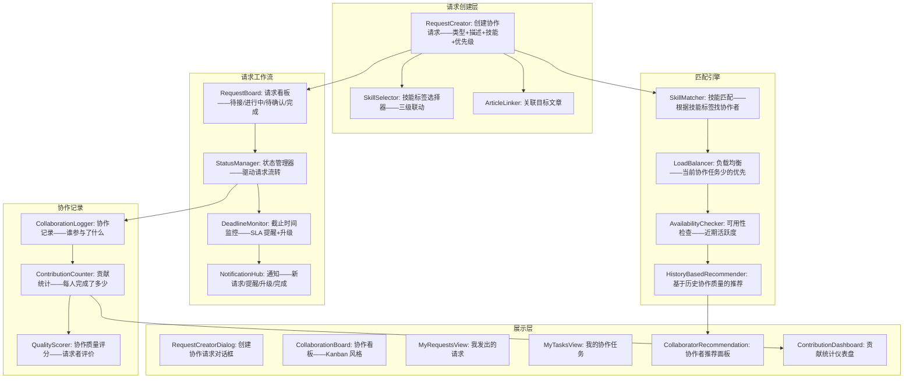
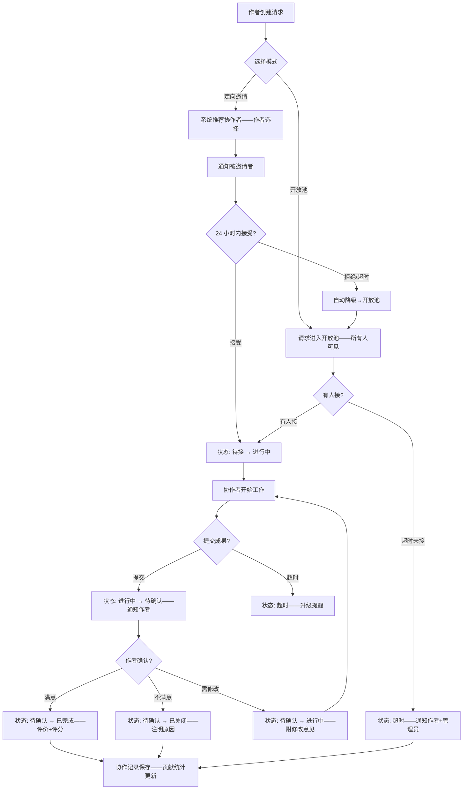

# YK-09-155: 功能实现-内容协作请求 — 协作请求提交系统、文章创建/更新/审核请求、分配协作者、请求状态追踪、协作历史、技能路由匹配

> 需求编号：YK-09-155 · 优先级：P2 · 人天：0.3d · 状态：需求已编写
> 依赖：YK-09-106（内容协同编辑——提供协作基础）、YK-09-131（内容协同审阅——提供审阅流程）

## 背景

### 问题陈述

YiKnowledge 的内容创建和审核目前依赖非正式的沟通渠道——缺乏系统化的协作请求管理：

1. **协作口头传递**：需要有人帮忙写"架构设计"文章——在 Slack 上喊一声——有人回应就口头约定——容易遗忘——无追踪
2. **审核请求不透明**：作者完成后——自己找人 review——但 reviewer 可能忙——忘记——无截止时间——文章搁置 2 周无人审核
3. **技能匹配靠运气**：需要写 SQL 优化相关内容——找了一个前端同事 review——虽然他愿意帮忙——但他不熟 SQL——审核质量低
4. **协作状态不可见**：管理者不知道"当前有多少协作请求在处理"——不知道"哪些请求被搁置"——无法主动协调
5. **协作历史无记录**：一年后想知道"谁参与过这篇架构设计文章的协作"——找不到——因为当时是口头协作

**核心矛盾**：内容协作是高频需求——但当前的"社交化"协调方式效率低、不可追踪、质量不稳定。协作请求系统将协作任务从"口头传递"升级为"规范化工作流"——提升协作效率和质量。

### 影响范围

| # | 影响 | 严重程度 | 典型场景 |
|---|------|----------|----------|
| 1 | 内容产出延迟——等待协作 | 高 | 文章写好——等审核——2 周没进展——最后作者自己审自己 |
| 2 | 协作者不匹配——审核质量低 | 高 | SQL 文章找前端同事审——格式问题能看出来——SQL 性能问题看不出来 |
| 3 | 协作请求丢失/遗忘 | 中 | Slack 上说了"帮忙审一下"——3 天后聊天记录被刷走——忘记了 |
| 4 | 协作者负载不均 | 中 | 某个热心同事有 5 个协作请求——另一个会 SQL 的同事一个也没有——因为不知道谁有空 |
| 5 | 协作贡献未被记录 | 低 | 参与了很多文章的协作——但没有记录——绩效Review 时拿不出证据 |

### 挑战

| 挑战 | 说明 |
|------|------|
| 技能标签体系设计 | 标签太多会产生噪音——太少则匹配不准确——如何平衡粒度 |
| 协作请求的优先级 | 紧急文章优先被审核——如何定义优先级规则的复杂度 |
| 协作者主动发现 | 如何合理地推荐协作者——避免让某人被过度请求 |
| 请求过期处理 | 长期无人接的请求如何处理——自动关闭还是升级提醒 |
| 与审阅系统 (YK-09-131) 的关系 | 协作请求包含审阅——但不仅是审阅——还包括创建、更新、翻译等 |

---

## 一、现状分析

### 1.1 当前协作协调能力

```
现有相关功能:
├── 内容协同编辑 (YK-09-106)
│   ├── 多人同时编辑——冲突解决
│   └── 编辑层协作——不涉及"请求"管理
├── 内容协同审阅 (YK-09-131)
│   ├── 审阅提交+反馈+通过机制
│   └── 审阅层——有工作流——但无入站请求管理
├── AI 辅助内容生成 (YK-09-88)
│   └── 辅助写作——不涉及人与人协作
├── Slack/企业微信
│   ├── 非正式的协作请求和协调
│   └── 消息易丢失——无追踪——无历史

缺失:
├── 结构化协作请求创建（类型+描述+技能要求）            # ❌ 无
├── 基于技能匹配的协作者推荐                            # ❌ 无
├── 协作请求看板（待接→处理中→完成）                    # ❌ 无
├── 协作者负载视图                                     # ❌ 无
├── 协作请求历史记录                                   # ❌ 无
├── 请求截止时间和 SLA 提醒                            # ❌ 无
├── 协作贡献统计                                       # ❌ 无
└── 请求——文章关联追溯                                # ❌ 无
```

### 1.2 协作请求流程（现状 vs 目标）

```mermaid
graph TD
    subgraph Current["现状：非正式社交协调"]
        C1[作者需要协作: "谁帮我审一下架构设计"?] --> C2[Slack/微信群发消息]
        C2 --> C3{有人回应?}
        C3 -->|有——30%| C4[口头约定: "好——我明天看"]
        C3 -->|无回应——70%| C5[再发一次——或自己审自己]
        C4 --> C6{协作者真做了?}
        C6 -->|忘了——50%| C7[作者催: "上次说的审好了吗?"——尴尬]
        C6 -->|做了——50%| C8[完成——但无记录]
        C7 --> C8
    end

    subgraph Target["目标：结构化协作请求——全程追踪"]
        T1[作者创建协作请求: 类型=审核, 文章=架构设计, 技能=分布式系统] --> T2[系统自动推荐协作者: 匹配技能标签——负载低的人排前面]
        T2 --> T3[作者选择协作者——或发布到开放池]
        T3 --> T4[协作者收到通知+看板新增待接条目]
        T4 --> T5[协作者接受请求——状态: 待接→进行中]
        T5 --> T6[协作者完成审阅——提交反馈]
        T6 --> T7[作者确认+评价——状态: 进行中→已完成]
        T7 --> T8[协作记录保存——贡献统计更新]
    end

    style Current fill:#f8d7da,stroke:#dc3545
    style Target fill:#d4edda,stroke:#28a745
```

### 1.3 根因矩阵

| 症状 | 根因 | 触发条件 | 频率 |
|------|------|----------|------|
| 请求丢失/遗忘 | 无正式追踪——靠社交工具 | 每次发起协作请求 | 高频 |
| 协作者不匹配 | 无技能匹配机制 | 找错人审阅时 | 中 |
| 负载不均 | 无协作者负载可视化 | 某人对来者不拒 | 中 |
| 请求搁置 | 无截止时间和 SLA 提醒 | 协作者忙碌时 | 中 |
| 贡献无记录 | 无协作历史和统计 | 绩效Review/回顾时 | 低 |

---

## 二、设计决策

### 决策 1：协作者匹配方式 — 开放池 vs 定向邀请 vs 两者结合

| 选项 | 匹配效率 | 协作者自主性 | 实现复杂度 |
|------|----------|------------|-----------|
| 开放池（发布后谁都可以接） | 中 | 高 | 低 |
| 定向邀请（指定具体协作者） | 高（精确） | 低（被邀请者是唯一选项） | 低 |
| 两者结合（定向邀请+开放池兜底） | 高 | 高 | 中 |

**选择：两者结合——定向邀请优先+开放池兜底。** 默认流程: 作者创建请求→系统根据技能+负载推荐 Top 5 协作者→作者可选择定向邀请某人——24 小时内无回应→自动降级为开放池——任何有匹配技能的人可接。覆盖了"知道该找谁"和"不知道该找谁"两种场景。

### 决策 2：协作请求类型 — 仅审核 vs 3 种 vs 5 种

| 选项 | 覆盖度 | 复杂度 | 适用场景 |
|------|--------|--------|---------|
| 仅审核（审核请求） | 低（仅覆盖审阅场景） | 低 | 大量审阅需求 |
| 3 种（审核、创建、更新） | 中 | 中 | 日常协作 |
| 5 种（审核、创建、更新、翻译、技术咨询） | 高 | 中 | 全覆盖 |

**选择：5 种类型。** 审核=请人审阅已有内容；创建=请人帮忙从零写内容；更新=请人更新过期内容；翻译=请人翻译内容；技术咨询=请人回答特定技术问题——结果用于补充内容。5 种类型对应的流程模板不同——如"创建"需要明确大纲和参考资料——"审核"需要审核清单。

### 决策 3：技能标签体系 — 自定义自由标签 vs 三级分类 vs 预设树

| 选项 | 灵活性 | 匹配精度 | 维护成本 |
|------|--------|---------|---------|
| 自定义自由标签 | 极高 | 低（标签混乱——synonymy 问题） | 低 |
| 三级分类（前端>Vue>组合式API） | 中 | 高 | 中 |
| 预设技能树（预定义 50-100 个技能项） | 中-高 | 高 | 高 |

**选择：三级技能分类——初始化 ~30 项。** 一级（领域）: 前端/后端/基础设施/数据/DevOps/AI/安全/通用。二级（方向）: Vue/React/API设计/数据库/SQL/运维/机器学习/文档写作/翻译。三级（技术）: 组合式API/Vite/MySQL/Redis/Docker/K8s。约 30 个三级技能项——覆盖 YiKnowledge 的知识范围。预留扩展——管理员可添加新技能项。

### 决策 4：请求过期策略 — 无过期 vs 固定期限 vs 按优先级分级

| 选项 | 灵活性 | 管理成本 | 实现 |
|------|--------|---------|------|
| 无过期（永久有效） | — | 低（但旧的堆积） | 低 |
| 固定期限（全部 7 天过期） | 低 | 低 | 低 |
| 按优先级分级（P1=2天, P2=5天, P3=14天） | 高 | 中 | 中 |

**选择：按优先级分级——默认 7 天。** P1（紧急）2 天——到期自动升级通知给管理员。P2（正常）5 天——到期转开放池。P3（低优）14 天——到期待处理。作者可自定义过期时间。超期未完成的请求自动关闭——通知请求者和协作者——记录为"超期"。

### 设计决策记录

| 决策 | 选项 A | 选项 B | 选项 C | 选择 | 理由 |
|------|--------|--------|--------|------|------|
| 协作匹配 | 开放池 | 定向邀请 | 两者结合 | **两者结合** | 灵活+兜底 |
| 请求类型 | 仅审核 | 3种 | 5种 | **5种** | 全覆盖 |
| 技能标签 | 自由标签 | 三级分类 | 预设树 | **三级分类** | 平衡灵活+精度 |
| 请求过期 | 无过期 | 固定期限 | 按优先级 | **按优先级** | 差异化+合理 |

---

## 三、目标架构

### 3.1 内容协作请求系统架构



### 3.2 协作请求生命周期



### 3.3 架构决策权衡

| 维度 | 改造前 | 改造后 | 权衡说明 |
|------|--------|--------|----------|
| 请求发起 | 社交工具+口头 | 结构化表单+工作流 | 规范性 vs 灵活性 |
| 协作者选择 | 凭印象找人 | 技能匹配+负载排序 | 准确性 vs 系统复杂度 |
| 请求追踪 | 无——遗忘率高 | Kanban+截止时间+SLA | 追踪收益 vs 管理成本 |
| 协作记录 | 无 | 完整历史+贡献统计 | 可见性 vs 隐私考虑 |

---

## 四、具体改动

### 4.1 改动总览

| 改动点 | 类型 | 涉及文件 | 预估行数 |
|--------|------|---------|---------|
| 协作请求数据模型 | 新增 | `YiAi/services/collaboration/types.py` | 80 行 |
| 技能标签管理系统 | 新增 | `YiAi/services/collaboration/skills.py` | 60 行 |
| 协作者匹配引擎 | 新增 | `YiAi/services/collaboration/matcher.py` | 80 行 |
| 协作请求工作流服务 | 新增 | `YiAi/services/collaboration/service.py` | 100 行 |
| 请求过期/SLA 监控 | 新增 | `YiAi/services/collaboration/monitor.py` | 60 行 |
| 协作 API 路由 | 新增 | `YiAi/routes/collaboration_routes.py` | 70 行 |
| 前端请求创建对话框 | 新增 | `YiVad/components/collaboration/RequestCreator.vue` | 80 行 |
| 前端协作看板 | 新增 | `YiVad/components/collaboration/CollaborationBoard.vue` | 100 行 |
| 前端我的请求/任务视图 | 新增 | `YiVad/components/collaboration/MyRequests.vue` | 70 行 |
| 协作者推荐面板 | 新增 | `YiVad/components/collaboration/Recommender.vue` | 50 行 |
| 贡献统计仪表盘 | 新增 | `YiVad/components/collaboration/ContributionStats.vue` | 60 行 |

### 4.2 涉及文件

```
YiAi/
├── services/collaboration/
│   ├── types.py                              # 新增：协作请求数据模型
│   ├── skills.py                             # 新增：技能标签体系
│   ├── matcher.py                            # 新增：协作者匹配引擎
│   ├── service.py                            # 新增：请求工作流服务
│   └── monitor.py                            # 新增：SLA 监控+过期处理
├── routes/
│   └── collaboration_routes.py               # 新增：协作 API 路由

YiVad/
├── components/collaboration/
│   ├── RequestCreator.vue                    # 新增：创建协作请求对话框
│   ├── CollaborationBoard.vue                # 新增：协作看板
│   ├── MyRequests.vue                        # 新增：我的请求/任务视图
│   ├── Recommender.vue                       # 新增：协作者推荐
│   └── ContributionStats.vue                 # 新增：贡献统计
└── views/
    └── CollaborationView.vue                 # 新增：协作请求管理主视图
```

### 4.3 核心类型定义

```python
# YiAi/services/collaboration/types.py

from dataclasses import dataclass, field
from typing import Optional
from enum import Enum
from datetime import datetime

class CollaborationRequestType(str, Enum):
    REVIEW = "review"                # 审核已有内容
    CREATE = "create"                # 创建新内容
    UPDATE = "update"                # 更新已有内容
    TRANSLATE = "translate"         # 翻译内容
    CONSULT = "consult"             # 技术咨询

class RequestStatus(str, Enum):
    OPEN = "open"                   # 等待接取（开放池）
    ASSIGNED = "assigned"          # 已分配——等待协作者接受
    IN_PROGRESS = "in_progress"    # 进行中
    SUBMITTED = "submitted"        # 协作者已提交——等作者确认
    COMPLETED = "completed"        # 已完成
    EXPIRED = "expired"            # 已过期
    CANCELLED = "cancelled"        # 已取消

class RequestPriority(int, Enum):
    P1_URGENT = 1                  # 紧急——2 天
    P2_NORMAL = 2                  # 正常——5 天
    P3_LOW = 3                     # 低优——14 天

@dataclass
class Skill:
    code: str                       # 如 "frontend.vue.composition-api"
    level1: str                     # 领域: "前端"
    level2: str                     # 方向: "Vue"
    level3: str                     # 技术: "组合式 API"
    label: str                      # 完整标签: "前端 · Vue · 组合式 API"

@dataclass
class CollaboratorProfile:
    user_key: str
    display_name: str
    skills: list[Skill]             # 技能列表
    collaboration_count: int        # 历史协作次数
    completion_rate: float          # 完成率
    avg_quality_score: float        # 平均质量评分 (1-5)
    current_load: int               # 当前进行中的协作任务数
    max_load: int                   # 最大负载
    last_active: datetime

@dataclass
class CollaborationRequest:
    key: str
    type: CollaborationRequestType
    title: str
    description: str
    article_path: Optional[str]      # 关联文章路径

    # 要求
    required_skills: list[Skill]
    priority: RequestPriority
    deadline: datetime

    # 状态
    status: RequestStatus
    requester_key: str              # 请求者
    assignee_key: Optional[str]    # 协作者

    # 进度
    assigned_at: Optional[datetime]
    started_at: Optional[datetime]
    submitted_at: Optional[datetime]
    completed_at: Optional[datetime]

    # 成果
    feedback_text: Optional[str]    # 协作者提交的成果说明
    requester_rating: Optional[int] # 请求者评分 1-5
    requester_comment: Optional[str]

    created_at: datetime
    updated_at: datetime

@dataclass
class CollaboratorRecommendation:
    user: CollaboratorProfile
    skill_match_score: float        # 技能匹配度 0-1
    load_score: float               # 负载分数——越低越好
    history_score: float            # 历史协作质量分
    total_score: float              # 综合推荐分
    match_details: list[str]        # 推荐理由——可读文本

@dataclass
class CollaborationContribution:
    user_key: str
    display_name: str
    total_requests: int             # 参与的总请求数
    completed: int
    avg_quality_score: float
    last_30_days_count: int
    top_skills: list[tuple[str, int]]  # (技能名, 次数)
    trend: list[dict]               # 月度趋势

# SLA 配置
PRIORITY_SLA_DAYS: dict[RequestPriority, int] = {
    RequestPriority.P1_URGENT: 2,
    RequestPriority.P2_NORMAL: 5,
    RequestPriority.P3_LOW: 14,
}
```

### 4.4 请求看板组件逻辑

```typescript
// YiVad/components/collaboration/CollaborationBoard.vue (核心逻辑——TypeScript 备注)

// 核心功能:
// 1. Kanban 风格四列: 待接 | 进行中 | 待确认 | 完成
// 2. 每个列顶部显示: 列名 + 请求计数
// 3. 请求卡片: 类型图标 + 标题 + 技能标签 + 优先级 + 截止时间 + 协作者头像
// 4. 过期请求: 红色边框 + 红色倒计时——吸引注意
// 5. 卡片点击: 展开详情——显示完整描述/关联文章/进度历史
// 6. 拖拽功能: 协作者可拖动自己的任务从"待接"到"进行中"——从"进行中"到"待确认"
// 7. 筛选: 按类型/优先级/技能标签/请求者——快速过滤
// 8. 搜索: 搜索关键词——标题+描述
// 9. 标签页: 全部请求 / 我的请求 / 我的任务
```

---

## 五、实施步骤

| 步骤 | 内容 | 涉及文件 | 验证方式 | 人天 |
|------|------|---------|---------|------|
| 1 | 数据模型 + 技能标签体系 | `types.py`, `skills.py` | 技能三级结构覆盖完整 | 0.03 |
| 2 | 协作者匹配引擎 | `matcher.py` | 单元测试: 技能+负载+历史综合排序正确 | 0.04 |
| 3 | 请求工作流服务 | `service.py` | 集成测试: 状态流转+通知触发 | 0.05 |
| 4 | SLA 监控 + API 路由 | `monitor.py`, `collaboration_routes.py` | 过期检测+API CRUD | 0.04 |
| 5 | RequestCreator + Recommender | `RequestCreator.vue`, `Recommender.vue` | 创建流+推荐面板 | 0.05 |
| 6 | CollaborationBoard 看板 | `CollaborationBoard.vue` | Kanban 四列+拖拽+回调 | 0.05 |
| 7 | MyRequests + ContributionStats | `MyRequests.vue`, `ContributionStats.vue` | 个人视图+统计 | 0.03 |
| 8 | 主视图整合 + 边界处理 | `CollaborationView.vue` | 完整功能 | 0.01 |

**总计：0.3d**

---

## 六、测试规格

### 场景 1：创建协作请求——审核

**GIVEN** 张三完成了《MySQL 索引优化指南》——需要 SQL 专家审核
**WHEN** 打开"创建协作请求"对话框——选择类型"审核"
**THEN** 表单显示: 关联文章选择器 + 请求描述 + 技能标签 + 优先级 + 截止时间
**WHEN** 选择文章《MySQL 索引优化指南》——添加技能标签 "数据 · 数据库 · MySQL"
**AND** 描述: "请审核索引策略的正确性和 SQL 示例的可执行性"
**AND** 优先级: P2（正常）——截止时间默认 5 天后
**WHEN** 点击"推荐协作者"
**THEN** 推荐 TOP 5: 技能匹配+低负载+历史协作质量排序
**AND** 显示推荐理由: "李四——精通 MySQL (3年)——当前负载 1/3——协作评分 4.8/5"
**WHEN** 选择李四——点击"发送定向邀请"
**THEN** 请求创建——李四收到通知——状态: "已分配"——等待接受

### 场景 2：协作者接受并完成任务

**GIVEN** 李四收到协作邀请
**WHEN** 打开"我的任务"——看到请求: "审核: MySQL 索引优化指南"
**THEN** 点击"接受"——状态: 已分配 → 进行中
**AND** 张三收到通知: "李四已接受你的协作请求"
**AND** 看板上请求从"待接"列移动到"进行中"列
**WHEN** 李四完成审核——点击"提交成果"
**THEN** 弹出表单: 审核结论（通过/需修改/问题列表）+ 具体反馈文字
**WHEN** 提交——状态: 进行中 → 待确认
**AND** 张三收到通知: "李四已提交审核反馈——请确认"

### 场景 3：请求过期自动处理

**GIVEN** 张三创建了一个开放池请求——优先级 P2 (5 天)——4 天过去了无人接
**WHEN** 第 5 天——截止时间到
**THEN** SLA 监控触发——请求状态更新为"已过期"
**AND** 通知张三: "你的协作请求已过期——请考虑重新调整或关闭"
**AND** 通知管理员: "1 个 P2 请求过期——建议跟进"
**AND** 看板上过期请求标记红色——移至"已过期"标签页
**WHEN** 张三查看——点击"重新开放"
**THEN** 请求重置——截止时间延长 5 天——状态变回"开放池"

### 场景 4：请求者确认与评价

**GIVEN** 协作者王五提交了协作成果——请求状态"待确认"
**WHEN** 张三查看成果——满意
**THEN** 点击"满意——确认完成"
**AND** 弹出评分: 1-5 星 + 可选文字评价
**WHEN** 评分 5 星——评价"非常专业——找到了 3 个隐藏的性能问题"
**AND** 点击"确认"
**THEN** 状态: 待确认 → 已完成
**AND** 王五收到通知: "你的协作已被确认完成——评分 5/5"
**AND** 王五的贡献统计更新: 协作数 + 1, 评分更新, 技能记录更新
**AND** 协作历史中记录此条

### 场景 5：开放池模式——多协作者候选

**GIVEN** 张三创建了开放池请求——未指定协作者
**WHEN** 请求发布到看板"待接"列
**THEN** 所有匹配技能的成员可见——按技能匹配度排序
**WHEN** 李四点击"我要接"——系统检查: 李四技能匹配 + 负载未满
**THEN** 李四获得该任务——状态: 开放池 → 进行中
**AND** 其他有技能的人看到请求状态变为"进行中 (李四)"——不可再接
**AND** 张三收到通知: "李四已接取你的开放协作请求"
**WHEN** 赵六也想接——发现已经被接了
**THEN** 显示"已被李四接取"——不可点击

### 场景 6：贡献统计与协作历史

**GIVEN** 赵六过去 3 个月参与了 15 个协作请求
**WHEN** 赵六打开"贡献统计"页面
**THEN** 显示: 总协作数 15 次——完成率 100%——平均评分 4.7/5
**AND** TOP 技能: 后端 | API 设计 (8次)——数据库 | MySQL (5次)——然后依次
**AND** 月度趋势图: 8 月 5 次——9 月 3 次（仍在本月）——增长中
**AND** 最近 5 次协作列表——可点击查看每个请求的详情
**WHEN** 点击"查看全部协作历史"
**THEN** 跳转完整历史——可分页——按时间/类型/评分筛选

---

## 七、风险与缓解

| 风险 | 概率 | 影响 | 等级 | 缓解措施 | 应急预案 |
|------|------|------|------|----------|----------|
| 技能标签不完整——推荐失误 | 中 | 中 | 中 | 初始 30 个技能项基于 YiKnowledge 现有内容分析——覆盖度高 | 管理员快速添加新技能项——无需代码变更 |
| 协作者过载——无人可用 | 中 | 高 | 中 | 负载上限限制——每人最多 3 个进行中的协作任务 | 升级通知管理员——手动协调或降低请求优先级 |
| 开放池无人接 | 中 | 中 | 中 | 24 小时后升级通知管理员+请求者——建议转为定向邀请 | 适当增加奖励——或将请求拆分降低门槛 |
| 评价偏差——关系好就给 5 分 | 中-高 | 低 | 低 | 评分分布可视化——异常偏差被发现 | 评分不与绩效考核直接挂钩——仅作参考指标 |

---

## 八、回滚策略

| 回滚场景 | 回滚方式 | 影响范围 | 恢复时间 |
|----------|----------|----------|----------|
| 前端页面异常 | `git revert` + 移除路由 | 协作请求页面 | < 1min |
| 匹配引擎推荐偏差 | 关闭自动推荐——仅保留手动选择 | 协作者推荐 | < 1min（特性开关） |
| SLA 监控误触发 | 禁用自动过期——仅保留手动标记 | 过期逻辑 | < 1min |
| 协作数据模型迁移失败 | 回滚——重新运行迁移脚本 | 历史请求数据 | < 10min |

**回滚验证：**
- 回滚后不影响已有的内容协同编辑 (YK-09-106) 和审阅 (YK-09-131) 功能
- 已创建的协作请求数据保留——前端恢复后可继续使用
- 不依赖协作请求系统的其他功能不受影响

---

## 九、设计决策记录

### D-01：为什么协作请求使用 Kanban 而非简单的列表？

Kanban 天然对应协作请求的 4 个状态（待接→进行中→待确认→完成）——将状态作为列——任务是卡片。这种布局让"什么在等待、什么在进行、什么需要确认"一目了然。列表视图适合按时间浏览——但不适合管理工作流。Kanban 也允许协作者拖拽自己的卡片更新状态——交互更直观。

### D-02：为什么技能标签使用三级分类而非自由标签？

自由标签（如 GitHub Issues 的标签）会导致同义词问题——"MySQL"、"mysql"、"SQL数据库"可能是同一个人标的同一个意思——但系统认为是 3 个不同标签——匹配失败。三级分类强制标准化——"数据 · 数据库 · MySQL" 是唯一的——匹配时不会遗漏。技能项的扩展由管理员统一管理——保持标签体系的整洁。

### D-03：为什么推荐使用"技能+负载+历史"三维度而非仅技能匹配？

仅技能匹配会推荐技能最匹配的人——但这个人可能已经有 5 个进行中的任务——再加一个会超载。加入"负载"维度让推荐更合理——优先推技能匹配且负载较低的。"历史"维度关注协作质量——如果某人历史评分低（常超时或质量一般）——即使技能匹配——也会降权。三维度避免了"最强的人被过度使用"的现象。

### D-04：为什么请求过期而不是无限等待？

无限等待会让请求积累——旧请求占据看板空间——新的重要请求被淹没。过期机制: 1) 清理僵尸请求 2) 督促请求者主动管理自己的请求 3) 给被邀请的协作者一个"无回应"的退出机制（避免被绑定）。过期后请求者可选择重新开放——这个操作成本很低——核心是维持看板的健康度。

---

## 十、可观测性

### 关键指标

| 指标 | 采集方式 | 告警阈值 | 说明 |
|------|---------|---------|------|
| 请求接受率 | 被接受/总数 | < 50% | 请求质量或协作者参与度问题 |
| 请求完成率 | 完成/被接受 | < 70% | 大量进行中的任务被中止 |
| 平均响应时间 | 创建到接受的耗时 | > 2 天 | 协作者参与度下降 |
| 平均完成时间 | 接受到提交的耗时 | > 5 天 (P2) | 协作效率下降 |
| 过期请求率 | 过期/总数 | > 30% | 请求管理或匹配问题 |
| 评分分布 | 统计 | 平均 < 3.0 | 协作质量低 |

### 日志规范

| 日志级别 | 场景 | 示例 |
|---------|------|------|
| `INFO` | 请求创建 | `[Collaboration] Created: type=review, article=<path>, by=zhangsan` |
| `INFO` | 协作者匹配 | `[Matcher] Recommended: count=5, top_skill_match=0.92` |
| `INFO` | 请求状态变更 | `[Collaboration] Status: <key>, open→in_progress, assignee=lisi` |
| `WARN` | 请求过期 | `[Collaboration] Expired: key=<key>, type=review, hours_overdue=24` |
| `INFO` | 请求完成 | `[Collaboration] Completed: key=<key>, rating=5, duration_days=3` |

---

## 十一、代码审查检查清单

- [ ] matcher.py: 技能匹配使用集合交集 + 加权——非简单相等
- [ ] matcher.py: 负载满的协作者——自动排除——不进入推荐列表
- [ ] service.py: 状态转换合法——禁止 skip 状态（如 open→completed）
- [ ] monitor.py: SLA 检查定时运行——每 30 分钟——不过度频繁
- [ ] RequestCreator.vue: 技能选择器三级联动——二级选择后三级选项更新
- [ ] CollaborationBoard.vue: Kanban 拖拽——仅允许合法转换（如 IN_PROGRESS → SUBMITTED——不允许 IN_PROGRESS → COMPLETED）
- [ ] Recommender.vue: 推荐列表为空——显示"无匹配协作者——试试开放池"
- [ ] 所有通知使用通知中心 (YV-09-27) 统一发送
- [ ] 贡献统计——30 天滚动窗口——数据缓存 1 小时
- [ ] `vue-tsc --noEmit` 通过 + pytest 通过

---

## 回归问题预测

| # | 问题 | 发现场景 | 根因 | 修复方式 |
|---|------|---------|------|---------|
| 1 | 协作者拒接后——状态未正确流转回开放池 | 被邀请者拒绝——但请求还显示"已分配" | 拒绝事件未触发状态回退 | 拒接时——如果是定向邀请+无其他候选人→自动转开放池 |
| 2 | 请求者自己不能接自己的开放请求 | 张三看到自己的开放池请求——点击接取 | 无身份校验 | 后端 matcher——排除请求者本人——前端按钮禁用+提示"这是你的请求" |
| 3 | 技能标签空格包含导致匹配失败 | 三级标签 "前端 " + "变量 " → " frontend . vue . composition-api" | 存储时未 trim | 技能 code 存储时 trim——比对时标准化（lower+trim+replace 空格为连字符） |
| 4 | 同一篇文章收到 3 个不同请求——状态混乱 | 文章同时有"创建"和"审核"两个请求 | 无多请求关联约束 | 文章的多用户请求独立管理——但列表展示时聚合——tab 页区分 |
| 5 | 请求描述为空——协作者不清楚要做什么 | 创建请求时描述是可选的 | 前端未强制 | 描述字段改为必填——最少 20 字——今天 edge case 检查 |

---

## 性能分析

### 各操作耗时

| 操作 | 数据量 | 耗时 |
|------|--------|------|
| 协作看板加载（20 条） | 20 条 | < 200ms |
| 协作者推荐计算（20 人） | 20 人 | < 100ms |
| 请求创建 | 1 条 | < 200ms |
| 状态变更 + 通知 | 1 次 | < 300ms |
| 贡献统计加载（缓存） | 预聚合 | < 200ms |
| SLA 检查（定时任务） | 全量 | < 500ms |

### 存储预估

| 数据 | 大小 |
|------|------|
| 单条协作请求 | ~2KB |
| 协作者推荐缓存 | ~5KB |
| 贡献统计数据（每月） | ~10KB |
| 技能标签体系 | ~5KB |