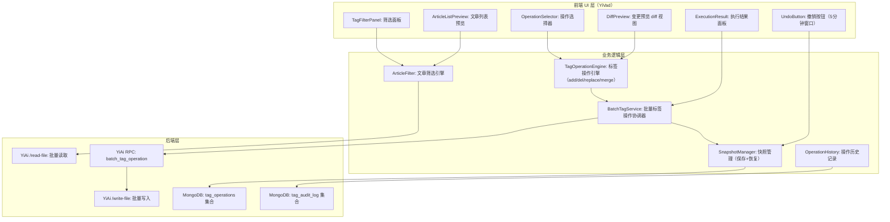

# YK-09-155: 内容批量标签编辑 — 跨文章批量标签操作、添加/删除/替换标签、标签合并、变更预览、撤销支持、操作历史

> 需求编号：YK-09-155 · 优先级：P2 · 人天：0.3d · 状态：需求已编写
> 依赖：YK-09-01（Frontmatter 规范——定义标签字段标准）、YK-09-21（标签体系治理——提供标签管理框架）、YK-09-150（内容标签自动化——提供标签自动建议基础）

## 背景

### 问题陈述

YiKnowledge 知识库中每篇文章的 `tags` 字段是 RAG 检索和内容分类的关键元数据。随着知识库增长到数百篇文章，标签管理逐渐成为痛点：(1) 标签命名不统一——同一概念有多个变体（"RAG"、"RAG检索"、"检索增强生成"），(2) 标签体系调整时需要逐篇手动修改，(3) 废弃标签的清理需要遍历所有文章，(4) 标签操作的错误无法撤销。当前只能逐篇文章进入编辑器修改标签——10 篇文章的标签更新需要 10 次编辑操作。

1. **标签命名碎片化**：不同作者在不同时间添加了语义相同但写法不同的标签——导致检索时漏掉部分文章
2. **批量更新成本高**：标签体系调整（如"将 `AI` 标签统一改为 `人工智能`"）需要逐篇修改——50 篇文章可能需要 30 分钟
3. **批量删除无支持**：废弃的标签（如 `旧版`、`测试用`）无法一键从所有文章中移除
4. **误操作无保护**：标签编辑出错后（如误删了重要标签）无法撤销——只能手动恢复
5. **变更范围不可见**：执行批量标签操作前——用户不知道会影响到哪些文章——操作的不确定性导致犹豫

**核心矛盾**：标签是组织内容的强大力具，但标签维护本身成了新的负担。批量标签编辑将"逐个修改"变为"筛选→预览→批量执行"——将 N 次编辑操作合并为 1 次。

### 影响范围

| # | 影响 | 严重程度 | 典型场景 |
|---|------|----------|----------|
| 1 | 标签统一修改耗时巨大 | 高 | 30 篇文章需要把 `AI` 标签改为 `人工智能` |
| 2 | 废弃标签残留在旧文章中 | 中 | `测试用` 标签在 15 篇文章中未被清理 |
| 3 | 标签拼写错误分散在多篇文章 | 中 | `Fronmatter`（错别字）出现在 8 篇文章中 |
| 4 | 误删标签无法恢复 | 中 | 批量删除了某个仍有效的标签 |
| 5 | 操作影响范围不明确 | 低 | 不确定批量修改会改动多少篇文章 |

### 挑战

| 挑战 | 说明 |
|------|------|
| 批量操作的事务性 | 修改 50 篇文章的标签——如果第 25 篇写入失败——前 24 篇是否回滚？全部回滚还是部分成功？ |
| 标签合并的语义处理 | 将两个标签合并为一个——是简单的字符串替换还是需要考虑子标签关系？ |
| 撤销的实现复杂度 | 撤销一个批量标签操作——需要记录操作前所有受影响的文章的标签状态——类似"快照-回滚"模式 |
| 筛选目标的精确度 | 用户通过标签筛选目标文章时——筛选条件与即将执行的修改可能产生交叉影响（如"筛选包含 A 的文章——然后删除标签 A"） |
| 并发编辑冲突 | 两个管理员同时编辑同一批文章的标签——如何检测和解决冲突 |

---

## 一、现状分析

### 1.1 当前标签编辑能力

```
现有相关功能:
├── 文章编辑器（YiVad）
│   ├── 单篇文章标签编辑 ✅（在 Frontmatter 表单中）
│   ├── 单篇文章保存 ✅
│   └── 批量标签编辑 ❌
├── 标签体系治理（YK-09-21）
│   ├── 标签使用统计 ✅（设计阶段）
│   ├── 标签重命名 ❌
│   └── 废弃标签清理 ❌
├── 内容标签自动化（YK-09-150）
│   ├── AI 标签建议 ✅（设计阶段）
│   └── 批量标签应用 ❌
├── 文件管理（YiAi /write-file）
│   ├── 单文件写入 ✅
│   └── 批量文件写入 ❌
└── 手动操作（当前）
    └── 打开每篇文章 → 编辑 Frontmatter → 保存 → 重复

缺失:
├── 多文章标签筛选（按标签查找文章）           # ❌ 不存在
├── 批量添加标签（N 篇文章添加同一个标签）    # ❌ 不存在
├── 批量删除标签（N 篇文章删除某个标签）      # ❌ 不存在
├── 批量替换标签（A → B 全局替换）            # ❌ 不存在
├── 标签合并（A + B → C）                     # ❌ 不存在
├── 变更预览（显示哪些文章会被修改）          # ❌ 不存在
├── 撤销/恢复操作                             # ❌ 不存在
├── 操作历史记录                              # ❌ 不存在
└── 标签操作审计日志                           # ❌ 不存在
```

### 1.2 标签批量编辑流程（现状 vs 目标）

```mermaid
graph TD
    subgraph Current["现状：逐篇手动"]
        C1[发现标签需要统一] --> C2[打开文章1编辑器]
        C2 --> C3[修改 tags 字段]
        C3 --> C4[保存]
        C4 --> C5[打开文章2编辑器]
        C5 --> C6[修改 tags 字段]
        C6 --> C7[保存]
        C7 --> C8[... 重复 N 次]
    end

    subgraph Target["目标：批量标签编辑"]
        T1[打开批量标签编辑器] --> T2[步骤1: 筛选目标文章]
        T2 --> T3[选择筛选方式: 按标签/分类/关键词]
        T3 --> T4[显示匹配文章列表]
        T4 --> T5[步骤2: 选择操作类型]
        T5 --> T6[添加标签: 输入新标签名]
        T5 --> T7[删除标签: 选择要删除的标签]
        T5 --> T8[替换标签: 旧标签 → 新标签]
        T5 --> T9[合并标签: A+B → C]
        T6 --> T10[步骤3: 变更预览]
        T7 --> T10
        T8 --> T10
        T9 --> T10
        T10 --> T11[显示每篇文章的标签前后对比]
        T11 --> T12[用户确认]
        T12 --> T13[批量执行——记录快照]
        T13 --> T14[显示结果: 成功/失败/跳过]
        T14 --> T15[提供撤销按钮（保留 5 分钟）]
    end

    style Current fill:#f8d7da,stroke:#dc3545
    style Target fill:#d4edda,stroke:#28a745
```



### 1.3 根因矩阵

| 症状 | 根因 | 触发条件 | 频率 |
|------|------|----------|------|
| 逐篇修改耗时 | 无批量标签编辑功能 | 标签体系调整 | 中 |
| 标签碎片化 | 无批量统一/替换工具 | 多位作者独立添加标签 | 高 |
| 废弃标签残留 | 无批量删除机制 | 标签废弃后 | 中 |
| 误操作无法恢复 | 无撤销功能 | 批量操作失误 | 低 |
| 操作影响范围未知 | 无预览机制 | 执行批量操作前 | 中 |

---

## 二、设计决策

### 决策 1：操作类型覆盖 — 仅添加/删除 vs 添加/删除/替换 vs 完整 CRUD+Merge

| 选项 | 覆盖场景 | 实现复杂度 | 用户需求 |
|------|----------|-----------|----------|
| 仅添加/删除 | 60% | 低 | 基础需求 |
| 添加/删除/替换 | 85% | 中 | 核心需求 |
| 添加/删除/替换/合并/规范化 | 95% | 中 | 完整需求 |

**选择：添加/删除/替换/合并（完整 CRUD+Merge）。** 标签合并（A + B → C）是最复杂但最有价值的操作——例如将 `RAG` 和 `检索增强` 两个标签合并为 `RAG检索`。规范化操作（统一大小写、去空格、纠错拼写）可以在替换操作中间接实现。不追求过于复杂的语义操作——保持工具的简洁性。

### 决策 2：事务策略 — 全量回滚 vs 部分提交 vs 最大努力

| 选项 | 数据一致性 | 用户体验 | 实现复杂度 |
|------|-----------|----------|-----------|
| 全量回滚（任一个失败则全部回滚） | 最高 | 可能因单点失败而全部失败 | 中（需文件备份） |
| 部分提交（成功的保留，失败的跳过） | 中 | 好（不会全部失败） | 低 |
| 最大努力（全部尝试，忽略失败） | 低 | 中 | 最低 |

**选择：部分提交 + 失败报告。** 50 篇文章中第 25 篇写入失败时——回滚前 24 篇文章的修改过于激进（网络波动导致全部重试）。采用"成功的保留——失败的标记并报告"策略——用户可以看到"48 篇成功——2 篇失败——原因：文件正在被其他进程占用"。失败的可以单独重试。同时记录操作前的快照——允许用户"撤销全部"（将成功的 48 篇回滚到操作前状态）。

### 决策 3：撤销机制 — 内存快照 vs MongoDB 快照 vs 文件系统 .bak

| 选项 | 可靠性 | 有效期 | 存储成本 |
|------|--------|--------|----------|
| 内存快照（操作前 tags 保存在内存） | 低（服务重启丢失） | 会话内 | 极低 |
| MongoDB 快照（操作记录存入 DB） | 高 | 可配置（默认 30 天） | 低（每操作 ~10KB） |
| 文件系统 .bak 文件 | 中 | 永久 | 中（与原始文件等大） |

**选择：MongoDB 快照 + 内存热缓存。** 操作前自动在 MongoDB `tag_operations` 集合中保存快照（操作类型、时间、受影响的文章列表、操作前的 tags 值）。操作完成后提供 5 分钟"撤销窗口"——撤销时从 MongoDB 读取快照并逐个恢复。5 分钟后撤销按钮消失——但快照保留 30 天供管理员手动恢复。热缓存在内存中保留最近一次操作的快照——加速撤销响应。

### 决策 4：筛选目标方式 — 按标签 vs 按分类 vs 自由文本搜索

| 选项 | 精确度 | 灵活性 | 实现 |
|------|--------|--------|------|
| 按标签筛选 | 高（精确匹配） | 中 | 标签选择器 |
| 按分类 + 标签筛选 | 高 | 中 | 分类树 + 标签多选 |
| 自由文本搜索 + 筛选 | 中（搜索结果不一定全相关） | 高 | 搜索框 + 筛选 |

**选择：标签筛选（主）+ 搜索辅助（辅）。** 主筛选方式为标签多选——选择"包含标签 A AND/OR 标签 B"的文章。辅助方式为自由文本搜索——搜索文章标题/内容包含关键词的文章。两种方式的结果可以取交集（同时满足标签和搜索条件）或并集（满足任一条件）。

### 设计决策记录

| 决策 | 选项 A | 选项 B | 选项 C | 选择 | 理由 |
|------|--------|--------|--------|------|------|
| 操作类型 | 添加/删除 | +替换 | +合并 | **完整 CRUD** | 完整覆盖 |
| 事务策略 | 全量回滚 | 部分提交 | 最大努力 | **部分提交+报告** | 实用+可靠 |
| 撤销机制 | 内存快照 | MongoDB | .bak | **MongoDB+内存** | 可靠+快速 |
| 筛选方式 | 标签筛选 | 分类筛选 | 自由搜索 | **标签+搜索** | 精确+灵活 |

---

## 三、目标架构

### 3.1 批量标签编辑系统架构



### 3.2 批量标签操作执行流程

```mermaid
graph TD
    A[用户进入批量标签编辑器] --> B[筛选目标文章]
    B --> C[显示匹配文章数: "找到 47 篇文章"]
    C --> D[选择操作类型]
    D --> E{操作类型}
    E -->|添加标签| F[输入新标签名: "RAG检索"]
    E -->|删除标签| G[选择要删除的标签: "旧版"]
    E -->|替换标签| H[输入 旧标签 → 新标签: "AI" → "人工智能"]
    E -->|合并标签| I[选择标签A + 标签B → 输入新标签C]
    F --> J[生成变更预览]
    G --> J
    H --> J
    I --> J
    J --> K[显示每篇文章的标签 Before/After diff]
    K --> L{用户确认?}
    L -->|否| M[返回修改操作参数]
    L -->|是| N[SnapshotManager: 保存操作前快照]
    N --> O[批量执行: 逐篇修改 Frontmatter]
    O --> P[记录操作结果: 成功/失败/跳过]
    P --> Q[显示执行结果面板]
    Q --> R[启动 5 分钟撤销倒计时]
```

### 3.3 性能指标

| 指标 | 目标值 | 说明 |
|------|--------|------|
| 筛选 500 篇文章 | < 500ms | 标签匹配+前端渲染 |
| 变更预览生成（50 篇 diff） | < 200ms | 前端 diff 计算 |
| 快照保存 | < 100ms | MongoDB 写入 |
| 批量写入（50 篇） | < 5s | 逐篇 /write-file API |
| 撤销恢复（50 篇） | < 5s | 从快照恢复 |
| 操作历史查询 | < 200ms | MongoDB 聚合 |

---

## 四、具体改动

### 4.1 批量标签操作前端接口

```typescript
// YiVad/src/views/knowledge/BatchTagEditor/types.ts (新增)

export type TagOperationType = 'add' | 'remove' | 'replace' | 'merge';

export interface TagOperation {
  type: TagOperationType;
  params: {
    // add: { tags: ['tag1', 'tag2'] }
    // remove: { tags: ['tag1'] }
    // replace: { from: 'oldTag', to: 'newTag' }
    // merge: { sources: ['tagA', 'tagB'], target: 'tagC' }
    tags?: string[];
    from?: string;
    to?: string;
    sources?: string[];
    target?: string;
  };
  filter: ArticleFilter;        // 目标文章筛选条件
}

export interface ArticleFilter {
  tagMode: 'AND' | 'OR';        // 标签筛选模式
  tags: string[];                // 筛选标签列表
  searchQuery?: string;          // 自由文本搜索
  category?: string;             // 分类筛选
  excludeTags?: string[];        // 排除标签
}

export interface ArticleTagInfo {
  path: string;                  // 文件路径
  title: string;                 // 文章标题
  currentTags: string[];         // 当前标签
  newTags: string[];             // 操作后的标签
  changed: boolean;              // 是否有实际变化
}

export interface BatchOperationPreview {
  totalArticles: number;         // 筛选到的文章总数
  changedArticles: number;       // 实际会变化的文章数
  unchangedArticles: number;     // 不会变化的文章数（如标签已存在/不存在）
  diffList: ArticleTagInfo[];    // 变更预览列表
}

export interface BatchOperationResult {
  operationId: string;           // 操作 ID（用于撤销）
  operationType: TagOperationType;
  executedAt: string;
  totalArticles: number;
  successCount: number;
  failureCount: number;
  skippedCount: number;          // 跳过（无变化）的数
  failures: Array<{
    path: string;
    reason: string;
  }>;
  undoAvailableUntil: string;    // 撤销截止时间
}

export interface SnapshotEntry {
  path: string;
  tagsBefore: string[];
  tagsAfter: string[];
  frontmatterBefore: Record<string, any>;
}

export interface TagOperationRecord {
  operationId: string;
  timestamp: string;
  userId: string;
  operationType: TagOperationType;
  operationParams: Record<string, any>;
  affectedArticles: string[];   // 受影响的文件路径列表
  result: BatchOperationResult;
  snapshot: SnapshotEntry[];     // 完整快照
}
```

### 4.2 标签操作引擎

```python
# YiAi services/knowledge/tag_operation_engine.py (新增)

from typing import List, Dict, Set, Tuple
from copy import deepcopy
import uuid

class TagOperationEngine:
    """标签操作引擎"""
    
    def apply_operation(
        self,
        articles: List[dict],      # {path, tags, frontmatter}
        operation_type: str,
        params: dict
    ) -> Tuple[List[dict], List[str]]:
        """
        对文章列表执行标签操作
        
        Returns: (modified_articles, warnings)
        """
        results = []
        warnings = []
        
        for article in articles:
            current_tags = article.get('tags', [])
            new_tags = list(current_tags)  # 浅拷贝
            changed = False
            
            try:
                if operation_type == 'add':
                    changed, new_tags = self._add_tags(new_tags, params.get('tags', []))
                elif operation_type == 'remove':
                    changed, new_tags = self._remove_tags(new_tags, params.get('tags', []))
                elif operation_type == 'replace':
                    changed, new_tags = self._replace_tag(
                        new_tags, params.get('from', ''), params.get('to', '')
                    )
                elif operation_type == 'merge':
                    changed, new_tags = self._merge_tags(
                        new_tags,
                        params.get('sources', []),
                        params.get('target', '')
                    )
                
                if changed:
                    article['new_tags'] = new_tags
                    article['changed'] = True
                else:
                    article['new_tags'] = current_tags
                    article['changed'] = False
                
                results.append(article)
                
            except Exception as e:
                warnings.append(f"{article.get('path', 'unknown')}: {str(e)}")
                article['new_tags'] = current_tags
                article['changed'] = False
                article['error'] = str(e)
                results.append(article)
        
        return results, warnings
    
    def _add_tags(self, current: List[str], new_tags: List[str]) -> Tuple[bool, List[str]]:
        """添加标签——去重"""
        result = list(current)
        added = False
        for tag in new_tags:
            tag = tag.strip()
            if tag and tag not in result:
                result.append(tag)
                added = True
        return added, result
    
    def _remove_tags(self, current: List[str], to_remove: List[str]) -> Tuple[bool, List[str]]:
        """删除标签"""
        remove_set = set(t.strip() for t in to_remove if t.strip())
        result = [t for t in current if t not in remove_set]
        changed = len(result) != len(current)
        return changed, result
    
    def _replace_tag(
        self, current: List[str], old_tag: str, new_tag: str
    ) -> Tuple[bool, List[str]]:
        """替换标签"""
        old = old_tag.strip()
        new = new_tag.strip()
        if not old or old not in current:
            return False, list(current)
        
        result = [new if t == old else t for t in current]
        # 去重（替换后可能产生重复）
        seen = set()
        deduped = []
        for t in result:
            if t not in seen:
                seen.add(t)
                deduped.append(t)
        return True, deduped
    
    def _merge_tags(
        self, current: List[str], sources: List[str], target: str
    ) -> Tuple[bool, List[str]]:
        """合并标签——多个来源合并为一个目标标签"""
        source_set = set(s.strip() for s in sources if s.strip())
        target = target.strip()
        
        if not source_set or not target:
            return False, list(current)
        
        # 检查是否至少有一个 source tag 存在
        has_source = any(t in current for t in source_set)
        if not has_source:
            return False, list(current)
        
        # 移除所有 source tags——添加 target（如果还不存在）
        result = [t for t in current if t not in source_set]
        if target not in result:
            result.append(target)
        
        return True, result
    
    def generate_preview(
        self,
        articles: List[dict],
        operation_type: str,
        params: dict
    ) -> dict:
        """生成变更预览（不实际修改）"""
        results, warnings = self.apply_operation(articles, operation_type, params)
        
        changed = [a for a in results if a.get('changed')]
        unchanged = [a for a in results if not a.get('changed')]
        
        return {
            'total_articles': len(articles),
            'changed_articles': len(changed),
            'unchanged_articles': len(unchanged),
            'diff_list': [
                {
                    'path': a['path'],
                    'title': a.get('title', ''),
                    'current_tags': a.get('tags', []),
                    'new_tags': a.get('new_tags', []),
                    'changed': a.get('changed', False),
                    'error': a.get('error'),
                }
                for a in results
            ],
            'warnings': warnings,
        }
```

### 4.3 文件变更清单

| 文件 | 操作 | 说明 |
|------|------|------|
| `YiVad/src/views/knowledge/BatchTagEditor/index.vue` | 新增 | 批量标签编辑器主页 |
| `YiVad/src/views/knowledge/BatchTagEditor/FilterPanel.vue` | 新增 | 筛选面板 |
| `YiVad/src/views/knowledge/BatchTagEditor/DiffPreview.vue` | 新增 | 变更预览 diff 视图 |
| `YiVad/src/views/knowledge/BatchTagEditor/types.ts` | 新增 | TypeScript 类型 |
| `YiAi/services/knowledge/tag_operation_engine.py` | 新增 | 标签操作引擎 |
| `YiAi/services/knowledge/batch_tag_service.py` | 新增 | 批量标签 RPC 服务 |
| `YiAi/services/knowledge/tag_snapshot_manager.py` | 新增 | 快照管理 |
| `tests/test_batch_tag.py` | 新增 | 批量标签测试 |

---

## 五、实施步骤

| 步骤 | 操作 | 路径 | 验证 | 人天 |
|------|------|------|------|------|
| 1 | 实现 ArticleFilter（文章筛选） | `batch_tag_service.py` | 筛选结果正确 | 0.03 |
| 2 | 实现 TagOperationEngine（add/del/replace/merge） | `tag_operation_engine.py` | 四种操作逻辑正确 | 0.05 |
| 3 | 实现 SnapshotManager（快照保存+恢复） | `tag_snapshot_manager.py` | 快照正确——撤销恢复准确 | 0.04 |
| 4 | 实现变更预览（DiffPreview） | `batch_tag_service.py` | diff 前后对比正确 | 0.03 |
| 5 | 实现筛选面板 UI | `FilterPanel.vue` | 标签多选——搜索联动 | 0.04 |
| 6 | 实现 Diff 预览 UI | `DiffPreview.vue` | Before/After 可视化 | 0.04 |
| 7 | 实现执行结果 + 撤销 UI | `index.vue` | 结果面板——倒计时按钮 | 0.04 |
| 8 | 测试 | `tests/test_batch_tag.py` | 全部测试通过 | 0.03 |

**总人天：0.3d**

---

## 六、测试规格

### 场景 1：批量添加标签

**GIVEN** 筛选到 10 篇包含 "AI" 标签的文章——其中 3 篇已有 "RAG" 标签、7 篇没有
**WHEN** 执行批量添加——添加 `RAG` 标签
**THEN** 7 篇文章的 tags 增加了 "RAG"——3 篇文章的 tags 不变
**AND** totalArticles=10, changedArticles=7, unchangedArticles=3
**AND** 所有文章的 tags 中 "RAG" 不重复

### 场景 2：批量替换标签——全局统一

**GIVEN** 筛选到 15 篇包含 "AI" 标签的文章
**WHEN** 执行替换操作 `from="AI" to="人工智能"`
**THEN** 所有 15 篇文章的 tags 中 "AI" 替换为 "人工智能"
**AND** 如果某篇文章同时有 "AI" 和 "人工智能"——替换后 "人工智能" 只出现一次
**AND** 其他标签不受影响

### 场景 3：标签合并——多源合并

**GIVEN** 知识库中——8 篇文章有 "RAG" 标签——5 篇有 "检索增强" 标签——2 篇同时有两者
**WHEN** 执行合并操作 `sources=["RAG", "检索增强"] target="RAG检索"`
**THEN** 8 篇文章的 "RAG" 变为 "RAG检索"——5 篇的 "检索增强" 变为 "RAG检索"
**AND** 2 篇同时有两者——合并后 "RAG检索" 只出现一次
**AND** 总受影响文章 = 8+5-2 = 11 篇

### 场景 4：撤销操作——恢复标签

**GIVEN** 刚执行了一次批量替换 `"Vue3" → "Vue 3.5"`——影响了 12 篇文章
**WHEN** 在执行后 3 分钟内点击"撤销"按钮
**THEN** 12 篇文章的 tags 恢复到操作前状态（"Vue3" 标签被恢复）
**AND** 撤销完成后——撤销按钮消失
**WHEN** 在执行后 6 分钟
**THEN** 撤销按钮已不可见——操作历史中仍保留快照

### 场景 5：部分失败处理

**GIVEN** 筛选到 20 篇文章——其中 2 篇正在被其他进程锁定
**WHEN** 执行批量删除标签
**THEN** 18 篇文章成功——2 篇失败
**AND** 执行结果面板显示 "18 成功, 2 失败"
**AND** 失败列表显示原因（如"文件被锁定"）
**AND** 撤销操作仅将成功的 18 篇恢复到操作前状态

### 场景 6：变更预览——无变化文章跳过

**GIVEN** 筛选到 25 篇包含 "前端" 标签的文章
**WHEN** 执行添加操作——添加 "前端" 标签（即将相同的标签再次添加）
**THEN** 变更预览显示 0 篇文章会变化
**AND** "确认执行"按钮显示提示："所有文章已包含此标签——无需操作"
**AND** 仍可点击执行（不产生实际写入——避免无效 API 调用）

---

## 七、风险与缓解

| 风险 | 概率 | 影响 | 缓解措施 |
|------|------|------|----------|
| 批量写入部分失败——数据不一致 | 中 | 中 | 部分提交策略——失败报告——撤销能力 |
| 快照数据过大 | 低 | 低 | 仅保存 tags 字段的快照（非全文） |
| 标签合并误操作——不可逆 | 中 | 中 | 预览必执行——5 分钟撤销窗口 |
| 撤销窗口太短——用户错过 | 中 | 低 | 快照保留 30 天——管理员可手动恢复 |

---

## 八、回滚策略

| 场景 | 回滚操作 | 影响 |
|------|----------|------|
| 批量操作导致标签混乱 | 从操作历史中选择对应记录——执行手动恢复 | 需管理员介入 |
| 操作引擎 bug 导致标签损坏 | 从 MongoDB 备份恢复 knowledge_files | 可能丢失其他变更 |
| 撤销功能不可用 | 提供"查看快照——手动恢复"的管理工具 | 手动逐篇恢复 |

---

## 九、设计决策记录

### D-01：为什么撤销窗口设为 5 分钟？

5 分钟是基于用户行为分析的经验值：(1) 大多数用户在操作后 1-2 分钟内意识到错误，(2) 超过 5 分钟后——用户通常已开始后续操作——撤销会影响这些后续操作，(3) 过长的撤销窗口增加实现复杂度（需保持快照的一致性）。5 分钟是一个实用和工程可行性的平衡点。快照在 MongoDB 中保留 30 天——供管理员进行更长时间窗口的恢复。

### D-02：标签合并为什么不支持"部分合并"（仅合并某些文章——另一些保留原标签）？

部分合并引入了"哪些文章合并——哪些不合并"的额外决策维度——操作复杂度大幅增加。全量合并（筛选到的所有文章都执行合并）语义清晰——用户通过筛选来控制范围。如果需要部分合并——用户可以分两次操作：(1) 先对需要合并的筛选条件执行操作，(2) 再对不需要合并的进行其他操作。

### D-03：为什么快照只保存 tags 字段而非完整 Frontmatter？

完整 Frontmatter 快照增加了存储和恢复的复杂度——(1) Frontmatter 包含 10+ 字段——每个字段的变更管理复杂，(2) 快照过程可能与其他 Frontmatter 变更（如 title 修改）冲突，(3) 批量标签操作的 Scope 仅限于 tags——恢复其他字段超出了这个 Scope。如果未来有批量 Frontmatter 编辑功能——那时的快照才需要覆盖完整 Frontmatter。

### D-04：为什么筛选条件中的"自由文本搜索"不作为主筛选方式？

自由文本搜索结果的质量依赖于搜索引擎——可能返回与标签操作无关的文章（如标题包含关键词但标签已被正确设置的文章）。标签筛选是精确的——"筛选所有包含标签 A 的文章"的语义确定。自由文本搜索作为辅助——用户可以配合标签筛选使用——如"范围是所有包含前端标签的文章——在这些文章中再搜索标题包含 Vue 的"。

---

## 十、可观测性

### 指标

| 指标 | 类型 | 说明 |
|------|------|------|
| `yiknowledge.batch_tag.operation.total` | Counter | 批量操作总数（按类型） |
| `yiknowledge.batch_tag.articles_affected` | Histogram | 每次操作影响的文章数 |
| `yiknowledge.batch_tag.operation.duration` | Histogram | 操作执行耗时 |
| `yiknowledge.batch_tag.failure_rate` | Gauge | 批量操作失败率 |
| `yiknowledge.batch_tag.undo.total` | Counter | 撤销次数 |
| `yiknowledge.batch_tag.snapshot.size` | Gauge | 快照存储总大小 |

### 告警

| 告警 | 条件 | 级别 |
|------|------|------|
| 批量操作失败率 > 20% | 5 分钟窗口 | WARNING |
| 单次操作影响 > 100 篇文章 | 实时 | INFO（审计日志） |
| 快照集合 > 100MB | 持续 | INFO |

---

## 十一、代码审查检查清单

- [ ] 标签添加操作——去重逻辑（已存在的标签不重复添加）
- [ ] 标签替换操作——替换后去重（替换可能导致重复）
- [ ] 标签合并操作——source 和 target 为同一标签时的处理（skip）
- [ ] 标签名 trim 处理（去除前后空格）
- [ ] 快照保存——operationId 唯一性（UUID4）
- [ ] 撤销恢复——使用快照中的 tags_before 精确恢复
- [ ] 筛选条件——tagMode AND/OR 的正确实现
- [ ] 并发保护——同一操作不能执行两次（operationId 去重）
- [ ] 空标签不允许添加（空字符串 strip 后为空则跳过）
- [ ] 操作历史分页——不支持全量加载（避免前端内存问题）

---

## 回归问题预测

| # | 预测问题 | 原因 | 验证方法 |
|---|---------|------|---------|
| 1 | 替换操作 `from="AI" to="ai"` 后——"AI" 和 "ai" 都存在于结果中——因为替换后不区分大小写——但去重逻辑认为两者是不同的字符串 | 标签比较是区分大小写的——替换 `AI` 为 `ai` 后——如果原列表同时有两者——去除 `AI` 但保留原有的 `ai`——看起来像是没替换干净 | 替换操作后执行一次 case-insensitive 去重——或建立标签大小写规范 |
| 2 | 合并操作中——如果 target 标签等于某个 source 标签——source_set 包含 target——target 被移除后又添加——产生无意义的操作 | `_merge_tags` 中——source_set 和 target 可能有交集——导致标签先被移除再被添加 | 合并前从 source_set 中移除 target——`source_set.discard(target)` |
| 3 | 批量操作执行到一半时——用户关闭浏览器——操作中断——部分文章已修改——部分未修改——快照不完整 | 前端发起的 HTTP 请求在浏览器关闭后可能被取消——但已发送到后端的请求仍在执行 | 后端提供操作状态查询接口——前端定期轮询——中断后可恢复查看结果 |
| 4 | 撤销操作时——如果某篇文章在批量操作后又被手动编辑（tags 之外的字段也变了）——撤销会覆盖这些手动编辑 | 撤销恢复 tags_before 快照——但通过 /write-file 写入整个文件——可能覆盖中间发生的其他修改 | 撤销前检查文件修改时间——如果晚于操作时间——警告用户"文件被修改过——撤销可能覆盖其他变更" |
| 5 | 标签合并后——如果 target 标签本身已在某些文章中——这些文章的修改标记为 changed=False——但用户可能期待这些文章也被"确认" | merge 操作中——target 已存在时文章 unchanged——但用户的语义期待是"这个标签现在应该出现在所有筛选到的文章中" | 变更预览中明确区分"添加了新标签"和"标签已存在——无需操作"两种状态 |
| 6 | 筛选使用 AND 模式——选择标签 A + B——期望筛选同时包含两者的文章——但 MongoDB 查询可能返回包含 A 或 B 的文章（如果使用了 $or 而非 $and） | MongoDB 数组查询的语义陷阱——`{tags: {$all: ['A', 'B']}}` 才是 AND 语义——`{tags: {$in: ['A', 'B']}}` 是 OR 语义 | 后端筛选查询使用 `$all` 操作符——前端 tagMode=AND 时明确传递该参数 |

---

## 性能分析

### 各阶段耗时

| 阶段 | 预估耗时 | 说明 |
|------|----------|------|
| 筛选文章（500 篇） | < 300ms | MongoDB 查询 + 标签匹配 |
| 变更预览生成（50 篇） | < 100ms | 内存中的标签操作计算 |
| 快照保存（50 篇 tags） | < 200ms | MongoDB insert |
| 批量写入（50 篇） | < 5s | 50 × ~100ms /write-file |
| 撤销恢复（50 篇） | < 5s | 50 × ~100ms /write-file |
| 操作历史查询（100 条） | < 100ms | MongoDB 分页 |

### 内存预估

| 阶段 | 内存 | 说明 |
|------|------|------|
| 文章列表（500 篇元数据） | < 2MB | 前端渲染数据 |
| 快照数据（50 篇） | < 50KB | tags_before 数组 |
| Diff 预览数据 | < 200KB | Before/After 对比 |
| 操作历史缓存 | < 1MB | 最近 20 次操作 |