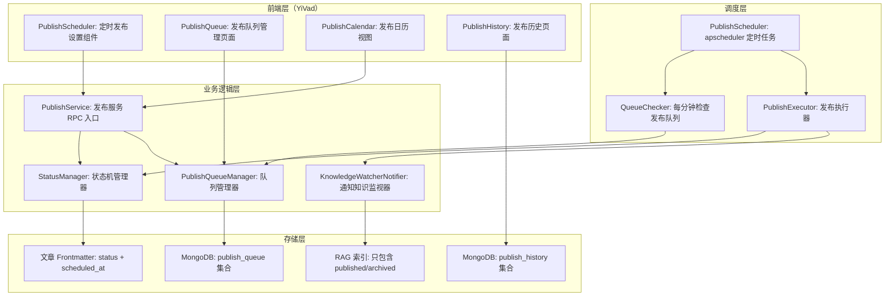
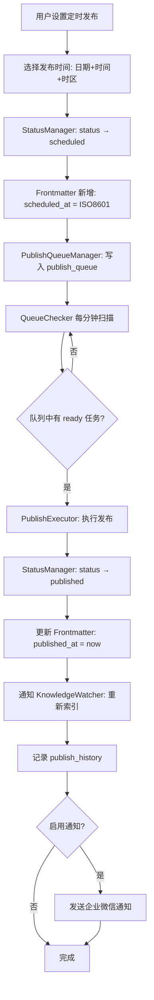

# YK-09-157: 内容定时发布 — 定时内容发布、发布时间设置、发布队列管理、发布预览、自动发布调度、发布历史、取消发布与回退

> 需求编号：YK-09-157 · 优先级：P2 · 人天：0.3d · 状态：需求已编写
> 依赖：YK-09-01（Frontmatter 规范——需要 `status` 字段扩展）、YK-09-94（批量操作与自动化任务——提供任务调度框架）、YK-09-108（内容日历与发布计划——提供日历视图基础）

## 背景

### 问题陈述

YiKnowledge 当前的内容发布是"即写即发"模式——文章保存到知识库后立即生效——RAG 索引在 5 秒内（知识监视器轮询周期）即可检索到新内容。这种模式在以下场景下不足：(1) 系列文章的节奏发布——今天写完全部 5 篇但希望每天发布 1 篇，(2) 与外部事件的同步——产品发布日同步发布对应的技术文档，(3) 内容审批后的定时上线——审批通过后不立即发布——而是在指定时间上线，(4) 节假日/非工作时间的内容预告和定时发布。

1. **无发布节奏控制**：知识库内容一次性全部可见——无法实现"连载"或"系列发布"的内容节奏
2. **事件同步困难**：产品上线时间是下周三 10:00——技术文档需要在同一时间发布——但作者可能在周末就写好了
3. **审批与发布分离缺失**：内容审批通过后（如架构评审）——需要手动记住"下周一 9:00 发布"——容易忘记
4. **内容预告不可行**：无法提前设置"即将发布"状态——让读者知道新内容在路上
5. **发布历史不可追溯**：不知道一篇文章是什么时候首次对外可见的——内容时间线不完整

**核心矛盾**：内容创作和内容发布是两个不同的时间点——当前系统将它们合并了。定时发布将两者解耦——让作者在最佳创作时间写——在最佳发布时间发。

### 影响范围

| # | 影响 | 严重程度 | 典型场景 |
|---|------|----------|----------|
| 1 | 无发布节奏控制 | 高 | 写了 5 篇系列文章——一次性全部可见——失去连载效果 |
| 2 | 与事件同步困难 | 中 | 产品上线时——文档忘了同步发布 |
| 3 | 审批发布分离缺失 | 中 | 架构评审通过——但没有在指定时间自动上线 |
| 4 | 内容预告不可行 | 低 | 无法设置"下周五发布"的状态给读者预期 |
| 5 | 发布历史不完整 | 低 | 内容时间线缺少"首次发布"时间点 |

### 挑战

| 挑战 | 说明 |
|------|------|
| 定时发布的触发机制 | 需要后台调度器——apscheduler 已有（知识监视器），但需要新增定时发布任务类型 |
| 发布状态的语义 | "已发布" vs "已创建" vs "定时发布中" vs "已过期"——状态机需要清晰定义 |
| 取消定时发布 | 发布前取消——如果之后又改了主意要重新定时——状态如何流转 |
| 发布失败处理 | 定时发布的内容因 RAG 索引失败或其他原因发布失败——是否重试？通知谁？ |
| 时区问题 | 用户在不同时区设置发布时间——服务器在 UTC——如何确保发布时间一致性 |

---

## 一、现状分析

### 1.1 当前发布相关能力

```
现有相关功能:
├── 文章 Frontmatter
│   ├── status 字段: draft/published/archived ✅
│   └── scheduled 状态 ❌
├── 知识监视器（apscheduler 每 5s 轮询）
│   ├── 检测文件变更——触发 RAG 索引 ✅
│   └── 定时任务调度 ❌（仅以固定频率运行）
├── 内容日历（YK-09-108）
│   ├── 日历视图 ✅（设计阶段）
│   └── 发布排期管理 ❌
├── 批量操作（YK-09-94）
│   ├── 批量任务框架 ✅（设计阶段）
│   └── 定时发布任务 ❌
├── 文件管理
│   ├── 文件读写 ✅
│   └── 文件可见性控制 ❌
└── 手动发布（当前方式）
    └── 保存 → 立即生效

缺失:
├── 定时发布调度器（apscheduler 定时任务）         # ❌ 不存在
├── 发布状态机（draft → scheduled → published）  # ❌ 不存在
├── 发布队列管理（查看/修改/取消待发布内容）       # ❌ 不存在
├── 发布预览（以发布时间为视角查看知识库）         # ❌ 不存在
├── 自动发布执行器（状态变更 + RAG 索引触发）     # ❌ 不存在
├── 发布历史记录                                   # ❌ 不存在
├── 取消发布/回退功能                              # ❌ 不存在
└── 发布通知（企业微信/邮件）                      # ❌ 不存在
```

### 1.2 定时发布流程（现状 vs 目标）

```mermaid
graph TD
    subgraph Current["现状：即时发布"]
        C1[编写完成] --> C2[保存文件]
        C2 --> C3[status: published]
        C3 --> C4[5s 内 RAG 索引完成]
        C4 --> C5[内容立即对外可见]
    end

    subgraph Target["目标：定时发布"]
        T1[编写完成] --> T2[设置发布时间: 2026-09-15 10:00]
        T2 --> T3[status: scheduled]
        T3 --> T4[scheduled_at: 2026-09-15T10:00+08:00]
        T4 --> T5[加入发布队列]
        T5 --> T6[读者视角: 内容不可见]
        T6 --> T7[到达发布时间]
        T7 --> T8[Scheduler 触发: status → published]
        T8 --> T9[触发 RAG 索引更新]
        T9 --> T10[内容对外可见]
        T10 --> T11[记录发布历史]
        T11 --> T12[可选: 发送发布通知]
    end

    style Current fill:#f8d7da,stroke:#dc3545
    style Target fill:#d4edda,stroke:#28a745
```



### 1.3 根因矩阵

| 症状 | 根因 | 触发条件 | 频率 |
|------|------|----------|------|
| 无发布节奏 | 无定时发布机制 | 系列内容创作 | 中 |
| 忘记同步发布 | 无定时调度 | 事件驱动的发布时间 | 中 |
| 审批后发布遗忘 | 审批与发布流程脱节 | 架构评审完成后 | 中 |
| 无内容预告 | 无 scheduled 状态 | 提前完成的内容 | 低 |
| 发布历史缺失 | 无发布记录 | 内容追溯 | 低 |

---

## 二、设计决策

### 决策 1：调度器实现 — apscheduler vs Celery vs 自定义 cron 脚本

| 选项 | 集成复杂度 | 可靠性 | 已有依赖 |
|------|-----------|--------|----------|
| apscheduler（已有——知识监视器用） | 低 | 中（进程内调度——重启丢失任务） | 是 |
| Celery + Redis/RabbitMQ | 高 | 高（独立 worker——持久化任务） | 否 |
| 自定义 cron 脚本（每分钟检查队列） | 低 | 低（轮询间隔内延迟） | 否 |

**选择：apscheduler + MongoDB 持久化任务队列。** 利用已有的 apscheduler 实例——新增定时发布任务。为解决进程重启丢失任务的问题——使用 MongoDB `publish_queue` 集合持久化待发布任务——apscheduler 每分钟检查一次队列（而非将任务存储在内存中）。任务完成后标记为已完成。这种方案结合了 apscheduler 的便利性和 MongoDB 的持久性。

### 决策 2：发布状态机 — 3 状态 vs 4 状态 vs 5 状态

| 选项 | 状态定义 | 复杂度 | 场景覆盖 |
|------|----------|--------|----------|
| 3 状态 | `draft → published → archived` | 低 | 基础 |
| 4 状态 | `draft → scheduled → published → archived` | 中 | 定时发布 |
| 5 状态 | `draft → review → scheduled → published → archived` | 高 | 定时+审批 |

**选择：4 状态（draft → scheduled → published → archived）。** 在当前简单场景中——审批流程（review 状态）可以作为独立功能后续添加。初始版本聚焦于最核心的定时发布流转：(1) `draft`：编写中——不可见，(2) `scheduled`：已定时——到达时间前不可见，(3) `published`：已发布——对外可见，(4) `archived`：已归档——可见但标记为旧内容。

### 决策 3：内容"不可见"的实现 — 文件系统标志 vs RAG 索引过滤 vs MongoDB 查询过滤

| 选项 | 实现位置 | 对 RAG 的影响 | 对文件系统的影响 |
|------|----------|--------------|-----------------|
| 文件系统标志（如 `.unpublished` 前缀） | 文件系统 | 知识监视器跳过未发布文件 | 文件命名改变——可能出错 |
| RAG 索引过滤（索引时检查 status） | 知识监视器 | 定时发布时需重新索引 | 无 |
| MongoDB 查询过滤（检索时过滤 status） | RAG 检索层 | 每次查询增加过滤条件 | 无 |

**选择：RAG 索引过滤。** 知识监视器在扫描文件时检查 `status` 字段：(1) `published`/`archived`：正常索引，(2) `draft`/`scheduled`：跳过索引。当定时发布触发时——将状态从 `scheduled` 改为 `published`——通知知识监视器重新索引该文件。这种方式不影响文件系统的文件命名——索引控制集中在知识监视器中。

### 决策 4：发布通知方式 — 企业微信 vs 邮件 vs 无通知

| 选项 | 基础设施 | 即时性 | 实现 |
|------|----------|--------|------|
| 企业微信（YiAi 已有集成） | 是 | 高 | 低 |
| 邮件通知 | 需配置 SMTP | 中 | 中 |
| 无通知（仅记录日志） | 无 | — | 最低 |

**选择：企业微信（可选）+ 日志记录。** 利用 YiAi 已有的企业微信集成（从 `services/notification/` 或类似模块），发布成功后发送通知到对应的企业微信群。通知为可选项——通过模板配置控制是否通知。日志记录始终开启——所有发布操作记录到 MongoDB。

### 设计决策记录

| 决策 | 选项 A | 选项 B | 选项 C | 选择 | 理由 |
|------|--------|--------|--------|------|------|
| 调度器 | apscheduler | Celery | cron脚本 | **apscheduler+MongoDB** | 已有+持久化 |
| 状态机 | 3状态 | 4状态 | 5状态 | **4状态** | 核心+简洁 |
| 不可见实现 | 文件标志 | RAG过滤 | Mongo过滤 | **RAG过滤** | 集中控制 |
| 发布通知 | 企微 | 邮件 | 无 | **企微可选** | 已有集成 |

---

## 三、目标架构

### 3.1 定时发布系统架构



### 3.2 定时发布执行流程



### 3.3 性能指标

| 指标 | 目标值 | 说明 |
|------|--------|------|
| 定时发布精度 | < 60s 偏差 | QueueChecker 每分钟检查 |
| 队列检查 | < 100ms | MongoDB 查询 |
| 单次发布执行 | < 500ms | 状态变更+通知索引 |
| 批量发布（10 篇同时） | < 2s | 并发生成 |
| 发布历史查询（100 条） | < 200ms | MongoDB 分页 |

---

## 四、具体改动

### 4.1 定时发布服务接口

```python
# YiAi services/knowledge/publish_service.py (新增)

from dataclasses import dataclass, field
from datetime import datetime, timezone, timedelta
from enum import Enum
from typing import Optional

class PublishStatus(str, Enum):
    DRAFT = "draft"
    SCHEDULED = "scheduled"
    PUBLISHED = "published"
    ARCHIVED = "archived"

class PublishAction(str, Enum):
    SCHEDULE = "schedule"          # 定时发布
    PUBLISH_NOW = "publish_now"    # 立即发布
    CANCEL_SCHEDULE = "cancel"     # 取消定时
    UNPUBLISH = "unpublish"        # 取消发布（退回 draft）
    ARCHIVE = "archive"            # 归档

@dataclass
class SchedulePublishRequest:
    target_file: str                          # 文章文件路径
    publish_at: str                           # ISO8601 格式: "2026-09-15T10:00:00+08:00"
    action: PublishAction = PublishAction.SCHEDULE
    notify_on_publish: bool = False           # 发布时是否通知
    note: Optional[str] = None                # 备注

@dataclass
class PublishQueueEntry:
    queue_id: str                             # 队列项 ID
    target_file: str                          # 文章路径
    title: str                                # 文章标题
    scheduled_at: str                         # 计划发布时间
    status: str                               # "waiting" / "published" / "cancelled" / "failed"
    created_at: str
    executed_at: Optional[str] = None
    error_message: Optional[str] = None
    note: Optional[str] = None

@dataclass
class PublishHistoryEntry:
    history_id: str
    target_file: str
    title: str
    action: PublishAction
    status_before: str
    status_after: str
    triggered_by: str                         # "scheduler" / "user:<user_id>"
    executed_at: str
    duration_ms: int
    success: bool
    error_message: Optional[str] = None

@dataclass
class PublishQueueSummary:
    total_waiting: int                        # 等待中的任务数
    total_published_today: int                # 今日已发布数
    upcoming_publishes: list[PublishQueueEntry]  # 即将发布的前 10 个
    next_publish_at: Optional[str]            # 下一个发布时间

class StatusManager:
    """发布状态机管理器"""
    
    VALID_TRANSITIONS = {
        PublishStatus.DRAFT: [
            PublishStatus.SCHEDULED,
            PublishStatus.PUBLISHED,     # 直接发布
        ],
        PublishStatus.SCHEDULED: [
            PublishStatus.PUBLISHED,      # 定时时间到
            PublishStatus.DRAFT,          # 取消定时
        ],
        PublishStatus.PUBLISHED: [
            PublishStatus.ARCHIVED,       # 归档
            PublishStatus.DRAFT,          # 取消发布
        ],
        PublishStatus.ARCHIVED: [
            PublishStatus.PUBLISHED,      # 重新发布
        ],
    }
    
    def can_transition(
        self, current: PublishStatus, target: PublishStatus
    ) -> bool:
        """检查状态转换是否合法"""
        return target in self.VALID_TRANSITIONS.get(current, [])
    
    def transition(
        self, current: PublishStatus, target: PublishStatus
    ) -> PublishStatus:
        """执行状态转换——如果非法则抛出异常"""
        if not self.can_transition(current, target):
            raise ValueError(
                f"非法的状态转换: {current.value} → {target.value}"
            )
        return target
    
    def is_content_visible(self, status: PublishStatus) -> bool:
        """内容是否对外可见（RAG 索引和前端展示）"""
        return status in [
            PublishStatus.PUBLISHED,
            PublishStatus.ARCHIVED,
        ]


class PublishQueueManager:
    """发布队列管理器"""
    
    def __init__(self, db):
        self.db = db
        self.collection = db.publish_queue
    
    async def add_to_queue(
        self, entry: PublishQueueEntry
    ) -> str:
        """添加任务到发布队列"""
        await self.collection.insert_one({
            'queue_id': entry.queue_id,
            'target_file': entry.target_file,
            'title': entry.title,
            'scheduled_at': entry.scheduled_at,
            'status': 'waiting',
            'created_at': entry.created_at,
            'note': entry.note,
        })
        return entry.queue_id
    
    async def get_ready_publishes(self) -> list:
        """获取所有到达发布时间的待发布任务"""
        now = datetime.now(timezone.utc).isoformat()
        cursor = self.collection.find({
            'status': 'waiting',
            'scheduled_at': {'$lte': now},
        })
        return await cursor.to_list(length=100)
    
    async def mark_published(self, queue_id: str, success: bool,
                             error: Optional[str] = None):
        """标记队列项为已完成或失败"""
        now = datetime.now(timezone.utc).isoformat()
        await self.collection.update_one(
            {'queue_id': queue_id},
            {'$set': {
                'status': 'published' if success else 'failed',
                'executed_at': now,
                'error_message': error,
            }}
        )
    
    async def cancel_schedule(self, queue_id: str) -> bool:
        """取消定时发布"""
        result = await self.collection.update_one(
            {'queue_id': queue_id, 'status': 'waiting'},
            {'$set': {
                'status': 'cancelled',
                'executed_at': datetime.now(timezone.utc).isoformat(),
            }}
        )
        return result.modified_count > 0
    
    async def get_queue_summary(self) -> PublishQueueSummary:
        """获取发布队列摘要"""
        now = datetime.now(timezone.utc).isoformat()
        today_start = now.replace(hour=0, minute=0, second=0, microsecond=0)
        
        waiting_count = await self.collection.count_documents(
            {'status': 'waiting'}
        )
        published_today = await self.collection.count_documents({
            'status': 'published',
            'executed_at': {'$gte': today_start.isoformat()},
        })
        
        upcoming = await self.collection.find(
            {'status': 'waiting'}
        ).sort('scheduled_at', 1).to_list(length=10)
        
        return PublishQueueSummary(
            total_waiting=waiting_count,
            total_published_today=published_today,
            upcoming_publishes=[
                PublishQueueEntry(
                    queue_id=e['queue_id'],
                    target_file=e['target_file'],
                    title=e['title'],
                    scheduled_at=e['scheduled_at'],
                    status=e['status'],
                    created_at=e['created_at'],
                    note=e.get('note'),
                )
                for e in upcoming
            ],
            next_publish_at=upcoming[0]['scheduled_at'] if upcoming else None,
        )
```

### 4.2 定时发布调度器

```python
# YiAi services/knowledge/publish_scheduler.py (新增)

from apscheduler.schedulers.background import BackgroundScheduler
from apscheduler.triggers.interval import IntervalTrigger
import asyncio

class PublishScheduler:
    """定时发布调度器"""
    
    def __init__(self, queue_manager, status_manager, knowledge_watcher):
        self.queue_manager = queue_manager
        self.status_manager = status_manager
        self.knowledge_watcher = knowledge_watcher
        self.scheduler = BackgroundScheduler()
        self._setup_jobs()
    
    def _setup_jobs(self):
        """设置定时任务"""
        # 每分钟检查一次发布队列
        self.scheduler.add_job(
            self.check_and_publish,
            IntervalTrigger(minutes=1),
            id='publish_queue_checker',
            name='检查发布队列',
            replace_existing=True,
        )
    
    def start(self):
        """启动调度器"""
        self.scheduler.start()
    
    def shutdown(self):
        """关闭调度器"""
        self.scheduler.shutdown(wait=False)
    
    async def check_and_publish(self):
        """检查并执行到期的发布任务"""
        try:
            ready_publishes = await self.queue_manager.get_ready_publishes()
            
            for entry in ready_publishes:
                await self._execute_publish(entry)
                
        except Exception as e:
            import logging
            logging.getLogger(__name__).error(
                f"发布队列检查失败: {e}", exc_info=True
            )
    
    async def _execute_publish(self, entry: dict):
        """执行单个发布任务"""
        queue_id = entry['queue_id']
        target_file = entry['target_file']
        
        try:
            # 1. 读取文章的 Frontmatter
            from services.file_service import read_file_frontmatter
            frontmatter = await read_file_frontmatter(target_file)
            
            # 2. 状态转换
            current_status = frontmatter.get('status', 'draft')
            self.status_manager.transition(
                PublishStatus(current_status),
                PublishStatus.PUBLISHED
            )
            
            # 3. 更新 Frontmatter
            from datetime import datetime, timezone
            frontmatter['status'] = 'published'
            frontmatter['published_at'] = datetime.now(timezone.utc).isoformat()
            
            # 4. 写回文件
            from services.file_service import write_file_frontmatter
            await write_file_frontmatter(target_file, frontmatter)
            
            # 5. 通知知识监视器重新索引
            self.knowledge_watcher.force_reindex(target_file)
            
            # 6. 标记队列项为已发布
            await self.queue_manager.mark_published(queue_id, success=True)
            
            # 7. 记录发布历史
            await self._record_history(
                target_file, frontmatter.get('title', ''),
                PublishAction.PUBLISH_NOW,
                current_status, 'published',
                'scheduler', True
            )
            
            # 8. 可选: 发送通知
            if entry.get('notify_on_publish'):
                await self._send_notification(target_file, frontmatter)
                
        except Exception as e:
            await self.queue_manager.mark_published(
                queue_id, success=False, error=str(e)
            )
            await self._record_history(
                target_file, entry.get('title', ''),
                PublishAction.PUBLISH_NOW,
                'scheduled', 'scheduled',
                'scheduler', False, str(e)
            )
    
    async def _record_history(
        self, target_file: str, title: str,
        action: PublishAction, status_before: str, status_after: str,
        triggered_by: str, success: bool, error: str = None
    ):
        """记录发布历史"""
        import uuid
        from datetime import datetime, timezone
        
        await self.db.publish_history.insert_one({
            'history_id': str(uuid.uuid4()),
            'target_file': target_file,
            'title': title,
            'action': action.value,
            'status_before': status_before,
            'status_after': status_after,
            'triggered_by': triggered_by,
            'executed_at': datetime.now(timezone.utc).isoformat(),
            'success': success,
            'error_message': error,
        })
    
    async def _send_notification(self, target_file: str, frontmatter: dict):
        """发送发布通知（企业微信）"""
        # 调用已有的企业微信通知服务
        pass
```

### 4.3 Frontmatter 扩展

```yaml
# 扩展现有 status 字段——新增 scheduled_at、published_at 字段
---
title: "示例文章"
status: "scheduled"                    # draft | scheduled | published | archived
scheduled_at: "2026-09-15T10:00:00+08:00"  # ISO8601 带时区
published_at: null                     # 发布后自动填充
archived_at: null
---
```

### 4.4 文件变更清单

| 文件 | 操作 | 说明 |
|------|------|------|
| `YiVad/src/views/knowledge/PublishScheduler/index.vue` | 新增 | 定时发布设置组件 |
| `YiVad/src/views/knowledge/PublishQueue/index.vue` | 新增 | 发布队列管理页面 |
| `YiVad/src/views/knowledge/PublishHistory/index.vue` | 新增 | 发布历史页面 |
| `YiAi/services/knowledge/publish_service.py` | 新增 | 发布服务 RPC |
| `YiAi/services/knowledge/publish_scheduler.py` | 新增 | 定时发布调度器 |
| `YiAi/services/knowledge/status_manager.py` | 新增 | 状态机管理器 |
| `YiAi/services/knowledge/publish_queue_manager.py` | 新增 | 队列管理器 |
| `YiAi/knowledge_watcher.py` | 修改 | 增加 status 过滤+force_reindex |
| `tests/test_publish_service.py` | 新增 | 发布服务测试 |

---

## 五、实施步骤

| 步骤 | 操作 | 路径 | 验证 | 人天 |
|------|------|------|------|------|
| 1 | 扩展 Frontmatter status 字段（scheduled/scheduled_at/published_at） | `publish_service.py` | status 状态机正确 | 0.02 |
| 2 | 实现 StatusManager（4 状态机+转换校验） | `status_manager.py` | 非法转换被拒绝 | 0.03 |
| 3 | 实现 PublishQueueManager（队列 CRUD） | `publish_queue_manager.py` | MongoDB 操作正确 | 0.04 |
| 4 | 实现 PublishScheduler（apscheduler+队列扫描） | `publish_scheduler.py` | 定时触发正确 | 0.05 |
| 5 | 修改 KnowledgeWatcher（status 过滤+force_reindex） | `knowledge_watcher.py` | 草稿/定时文件不索引 | 0.04 |
| 6 | 实现 RPC 服务接口 | `publish_service.py` | RPC 路由正确 | 0.03 |
| 7 | 实现前端 UI（定时设置+队列管理+历史） | `PublishScheduler/` | 完整交互流程 | 0.06 |
| 8 | 测试 | `tests/test_publish_service.py` | 全部测试通过 | 0.03 |

**总人天：0.3d**

---

## 六、测试规格

### 场景 1：设置定时发布——状态正确流转

**GIVEN** 一篇 status=draft 的文章
**WHEN** 设置定时发布时间为 "2026-09-15T10:00:00+08:00"
**THEN** status 变为 "scheduled"
**AND** Frontmatter 中 scheduled_at 字段为 ISO8601 格式
**AND** 文章加入 publish_queue——状态为 "waiting"
**AND** KnowledgeWatcher 不再索引该文章
**AND** 前端显示 "定时发布——2026年9月15日 10:00"

### 场景 2：到达发布时间——自动发布

**GIVEN** publish_queue 中有一篇等待时间已到的文章
**WHEN** QueueChecker 每分钟扫描触发
**THEN** PublishExecutor 执行发布
**AND** 文章 status 从 "scheduled" 变为 "published"
**AND** Frontmatter 中 published_at 字段为当前时间
**AND** KnowledgeWatcher 收到 force_reindex 通知
**AND** RAG 索引包含该文章内容
**AND** publish_queue 条目状态变为 "published"
**AND** publish_history 中新增一条记录

### 场景 3：取消定时发布

**GIVEN** 一篇 status=scheduled 的文章——发布队列中状态为 "waiting"
**WHEN** 用户执行 cancel_schedule 操作
**THEN** 文章 status 从 "scheduled" 变为 "draft"
**AND** publish_queue 条目状态变为 "cancelled"
**AND** 到达原定发布时间时——不会自动发布
**AND** 文章仍然不被 RAG 索引

### 场景 4：非法状态转换被拒绝

**GIVEN** 一篇 status=published 的文章
**WHEN** 尝试执行 "schedule" 操作（定时发布已发布的文章）
**THEN** StatusManager 抛出 ValueError
**AND** 错误消息为 "非法的状态转换: published → scheduled"
**AND** 文章状态不变

### 场景 5：发布历史记录

**GIVEN** 一篇经历了 draft → scheduled → published 的文章
**WHEN** 查询该文章的发布历史
**THEN** 返回 2 条记录: (1) schedule 操作, (2) publish 操作
**AND** 每条记录包含 action、status_before、status_after、executed_at、triggered_by
**AND** scheduled 操作的 triggered_by 为 "user:<user_id>"
**AND** published 操作的 triggered_by 为 "scheduler"

### 场景 6：批量定时发布——独立调度

**GIVEN** 3 篇文章分别设置发布时间为 10:00、10:30、11:00
**WHEN** QueueChecker 在 10:01 扫描
**THEN** 只有 10:00 那篇被发布
**AND** 10:30 和 11:00 的两篇仍在队列中（状态 waiting）
**WHEN** QueueChecker 在 10:31 扫描
**THEN** 10:30 那篇被发布
**AND** 11:00 的仍在队列中

---

## 七、风险与缓解

| 风险 | 概率 | 影响 | 缓解措施 |
|------|------|------|----------|
| apscheduler 进程重启丢失未持久化任务 | 低 | 中 | MongoDB 持久化队列——重启后从 DB 恢复 |
| 发布时间到达时服务不可用 | 低 | 中 | 服务恢复后——QueueChecker 立即扫描过期的 waiting 任务 |
| 定时发布与手动编辑冲突 | 中 | 低 | 发布前检查文件是否被修改——如果修改时间晚于 scheduled_at——记录日志并发布 |
| 时区处理错误 | 中 | 中 | 所有时间存储为 ISO8601 带时区——比较时统一转换为 UTC |
| 大量内容同时定时发布——瞬时索引压力 | 低 | 中 | 批量发布限流——每分钟最多发布 20 篇文章 |

---

## 八、回滚策略

| 场景 | 回滚操作 | 影响 |
|------|----------|------|
| 调度器故障——持续无法发布 | 管理员手动批量执行 publish_now | 定时发布延迟 |
| 状态机 bug——状态卡住 | 管理员手动修改 Frontmatter status | 内容状态异常 |
| 发布队列数据丢失 | 从文章 Frontmatter 的 scheduled_at 重建队列 | 队列历史不可恢复 |
| 内容被错误发布 | 执行 unpublish（published → draft） | 短暂可见后隐藏 |

---

## 九、设计决策记录

### D-01：为什么 QueueChecker 使用 1 分钟间隔而非更高的精度？

发布时间的最小精度需求是"分钟级"——"10:00 发布"和"10:01 发布"在用户体验上没有区别。更高的精度（如 10s 扫描）会增加 MongoDB 查询压力和调度器负载——而收益很小。1 分钟间隔是精度和资源消耗的最佳平衡点。如果未来有秒级精度需求——可以通过"精确时间触发"（`apscheduler.add_job(run_date=exact_time)`）实现——而非轮询。

### D-02：为什么选择在知识监视器中过滤而非在 RAG 检索时过滤？

如果在 RAG 检索时过滤（查询时检查 status），每次检索都需要增加过滤条件——降低了检索效率（所有文档仍需被检索——增加过滤步骤）。在知识监视器中过滤（索引时检查 status），未发布的文档根本不会进入向量索引——检索时不需要任何额外操作。从数据流角度看——应该在数据进入索引前就决定是否索引——而非查询时才决定。

### D-03：为什么 status 字段使用字符串而非枚举在 MongoDB 中？

MongoDB 不原生支持 Python Enum——存储时会被序列化为字符串。在 Python 代码中使用 Enum（`PublishStatus`）——但在 MongoDB 中存储字符串值（`"draft"`）。读取时通过 `PublishStatus(value)` 转换回 Enum。这种方式既保证了代码中的类型安全——又兼容 MongoDB 的文档存储。

### D-04：为什么定时发布不直接在 apscheduler 中为每个任务创建独立的 Job？

为每个定时发布任务创建独立的 apscheduler Job（`add_job(run_date=...)`）看似直接——但有两个问题：(1) 进程重启后——所有内存中的 Job 丢失——需要从 MongoDB 重建所有 Job，(2) 如果有 100 个定时发布任务——apscheduler 需要管理 100 个独立 Job——增加调度器复杂度。轮询模式（每分钟扫描队列）简化了调度器管理——只需要 1 个 Job——任务状态由 MongoDB 持久化。

---

## 十、可观测性

### 指标

| 指标 | 类型 | 说明 |
|------|------|------|
| `yiknowledge.publish.scheduled.total` | Counter | 定时发布设置次数 |
| `yiknowledge.publish.executed.total` | Counter | 实际执行发布次数 |
| `yiknowledge.publish.failed.total` | Counter | 发布失败次数 |
| `yiknowledge.publish.queue.waiting` | Gauge | 队列中等待任务数 |
| `yiknowledge.publish.queue.check_duration` | Histogram | 队列检查耗时 |
| `yiknowledge.publish.cancelled.total` | Counter | 取消定时次数 |
| `yiknowledge.publish.today_count` | Gauge | 今日已发布数 |

### 告警

| 告警 | 条件 | 级别 |
|------|------|------|
| 发布失败率 > 10% | 1 小时窗口 | WARNING |
| 队列等待任务 > 50 | 持续 | INFO |
| 调度器未运行（心跳检测） | 2 分钟无心跳 | ERROR |
| 发布延迟 > 5 分钟（scheduled_at vs 实际执行） | 每次 | INFO |

---

## 十一、代码审查检查清单

- [ ] 时区处理：所有 ISO8601 字符串包含时区偏移
- [ ] 状态机转换的完整覆盖（所有合法路径有处理——所有非法路径有异常）
- [ ] 发布队列中同一文件不能有多个 waiting 任务
- [ ] KnowledgeWatcher 正确过滤 draft/scheduled 文件
- [ ] force_reindex 确保文件立即被索引（而非等待下个轮询周期）
- [ ] 取消定时时——同时更新 Frontmatter 和队列——两者保持一致性
- [ ] 任务失败后——error_message 字段有有意义的错误描述
- [ ] 调度器优雅关闭——等待正在执行的任务完成
- [ ] 队列检查的数据库查询有索引（scheduled_at + status）
- [ ] 用户手动修改 status 字段（绕过 API）——KnowledgeWatcher 仍能正确处理

---

## 回归问题预测

| # | 预测问题 | 原因 | 验证方法 |
|---|---------|------|---------|
| 1 | QueueChecker 扫描到 waiting 任务后——`_execute_publish` 执行过程中——写入了 Frontmatter 但通知 KnowledgeWatcher 失败——文章状态已改为 published 但 RAG 索引未更新——内容"对外不可见"但数据显示已发布 | 两步操作（状态变更 + 索引更新）无事务保证——部分完成导致不一致 | 增加 published_but_not_indexed 检测——QueueChecker 下次扫描时重新触发索引 |
| 2 | 用户设置发布时间为过去的某个时间（如 "2025-01-01"）——PublishQueueManager 立即将其加入 waiting 状态——但不应该自动发布（可能是输入错误） | scheduled_at 未做最小值校验——允许设置为过去时间 | 设置定时发布时——scheduled_at 必须 > now + 1分钟——否则提示"发布时间必须在未来" |
| 3 | MongoDB publish_queue 集合因大量已完成的记录（published/cancelled）而未清理——队列查询变慢——因为全表扫描 | 已完成队列项堆积——没有自动清理机制——影响 waiting 查询性能 | 对 completed 记录设置 TTL 索引（completed 状态 7 天后自动删除）——仅保留近期的发布队列记录 |
| 4 | 文章从 scheduled 状态开始——中途作者修改了内容但忘了重新设置定时——修改后的内容在预定时间自动发布——但作者以为还要修改 | 作者修改内容后——scheduled 状态保持不变——没有提示"定时发布仍然生效" | 编辑器打开 scheduled 状态的文章时——显示醒目提示"此文已设定时发布于 XXXX——编辑后仍将按时发布" |
| 5 | 同时有两个管理员分别通过 API 和直接编辑文件修改了同一篇文章的 status——导致 status 字段不一致（API 认为是 published——文件系统中的 Frontmatter 仍是 scheduled） | 多路径修改 status——无并发控制——无锁机制 | 发布前重新读取文件的 Frontmatter——以文件中的最新 status 为准——而非依赖队列中的状态 |
| 6 | 调度器关闭时（服务重启）——apscheduler 的 `shutdown(wait=False)` 立即关闭——如果有正在执行的 `_execute_publish`——该任务被中断——文章可能处于"Frontmatter 已更新但队列未标记"的中间状态 | 服务重启中断发布流程——导致状态不一致——文章"半发布" | `shutdown` 使用 `wait=True`——等待当前执行的任务完成——最长等待 30s——超时后强制关闭并记录未完成的任务 |

---

## 性能分析

### 各阶段耗时

| 阶段 | 预估耗时 | 说明 |
|------|----------|------|
| 设置定时发布 | < 100ms | Frontmatter 写入 + 队列写入 |
| QueueChecker 扫描（空队列） | < 50ms | MongoDB count_documents |
| QueueChecker 扫描（10 个 waiting） | < 100ms | find + 逐个执行 |
| 单次发布执行 | < 500ms | 读取→修改→写入→通知 |
| 发布历史查询 | < 200ms | MongoDB 分页查询 |
| 取消定时发布 | < 100ms | 状态更新 × 2 |

### 内存预估

| 阶段 | 内存 | 说明 |
|------|------|------|
| 发布队列（100 条目） | < 1MB | MongoDB 缓存 |
| 发布历史（1000 条） | < 5MB | MongoDB 集合 |
| 调度器运行时 | < 5MB | apscheduler 进程 |
| 前端队列管理页 | < 2MB | Vue 组件 |