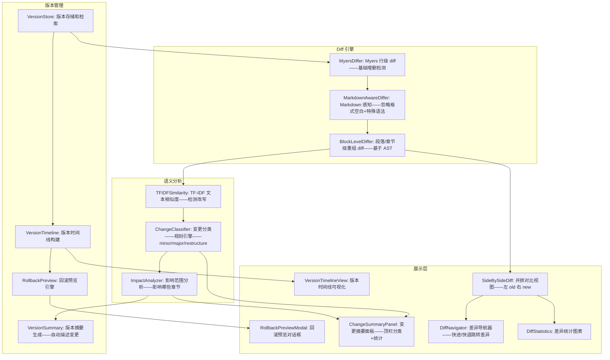

# YK-09-157: 功能实现-内容版本比较 — 高级版本对比工具、并排差异视图、语义变更检测、变更分类（小/大/重构）、版本时间线、回滚预览

> 需求编号：YK-09-157 · 优先级：P2 · 人天：0.3d · 状态：需求已编写
> 依赖：YK-09-90（内容版本管理与差异对比——提供版本存储和基础 diff 基础设施）、YK-09-151（内容编辑历史——提供版本历史列表）

## 背景

### 问题陈述

YiKnowledge 已有版本存储和基础差异对比功能——但当前 diff 工具非常基础——仅能显示行级文本增删——缺少理解"变更含义"的能力：

1. **行级差异不够**：当前 diff 只能显示"第 5-8 行被替换"——但审阅者不知道这个变更是"修正了一个错别字"还是"重写了整段逻辑"——需要逐行阅读对比才能判断
2. **语义变更不可见**：两段文字可能词句完全不同但语义完全相同（改写）——也可能仅改了一个词但语义完全变了（关键变更）——行级 diff 无法区分这两种情况
3. **变更分类缺失**：5 个版本——哪些是微小编修（格式调整）——哪些是重要变更（内容重写）——不知道——只能按时间顺序浏览
4. **版本时间线不直观**：看不到"版本是如何演化的"——看不到每个版本的变更摘要——更无法把握版本间的继承关系
5. **回滚前无预览**：当前点击"回滚到某版本"是立即执行的——没有预览——用户经常"点击→发现不是想要的→再次回滚"的反复操作

**核心矛盾**：内容版本化已实现——但版本比较的可读性和洞察不足。高级版本比较将 diff 从"代码 diff"升级为"内容 diff"——关注的不是哪些行变了——而是内容层面发生了什么变化。

### 影响范围

| # | 影响 | 严重程度 | 典型场景 |
|---|------|----------|----------|
| 1 | 审阅者需要逐行通读变更——效率低 | 高 | 1 篇 200 行文章——10 个版本——审阅时间 40 分钟——大部分时间在判断"这个变更是大是小" |
| 2 | 关键变更被微小变更淹没 | 高 | 修正了"API 端点返回值"的描述——但这个变更被 20 行格式调整包围——审阅者可能忽略 |
| 3 | 回滚选择错误——效率低下 | 中 | 想回滚到 v12——点了 v11——发现不对——再回滚到 v12——反复操作 |
| 4 | 版本演化历史不可追踪 | 中 | 想知道某个段落何时加入——被谁加入——需要在 N 个版本间 git bisect 式查找 |
| 5 | 团队对于变更范围意见不统一 | 低 | 张三说"只是小改"——李四说"你这叫小改？"——缺乏客观分类 |

### 挑战

| 挑战 | 说明 |
|------|------|
| 语义变更检测的准确率 | 判断两个段落的语义相似度是 NLP 难题——无参考译文的语义比较尤其难 |
| Markdown 感知的 diff | 普通文本 diff 会把 `### 标题\n` 和 `### 标题 \n`（尾随空格）标记为差异——但其实无区别 |
| 大规模对比的性能 | 5000 字的文章 v1 和 v50 对比——需要高效的前端渲染和后端 diff 算法 |
| 变更分类阈值 | "小修改"和"大修改"的边界——全凭主观——如何客观量化 |
| 与 YiVad 编辑器的集成 | 版本比较视图需要在编辑器中无缝嵌入——而非独立页面 |

---

## 一、现状分析

### 1.1 当前版本比较能力

```
现有相关功能:
├── 内容版本管理 (YK-09-90)
│   ├── 版本存储——每次保存创建新版本
│   ├── 基础行级 diff（text diff——基于 Myers 算法）
│   └── 无语义分析——无变更分类
├── 内容编辑历史 (YK-09-151)
│   ├── 版本列表——按时间排序
│   ├── 版本间切换
│   └── 无时间线可视化——无变更摘要
├── 内容差异与合并 (YK-09-129)
│   └── 基础的水平 diff + in-line diff——面向文本行

缺失:
├── 并排对比视图 (side-by-side——类似 GitLab diff)        # ❌ 无
├── 语义变更检测——区分改写 vs 新增 vs 删除 vs 修正     # ❌ 无
├── 变更自动分类（minor/major/restructure）               # ❌ 无
├── 版本时间线可视化                                     # ❌ 无
├── 每个版本的变更摘要                                   # ❌ 无
├── 回滚预览（改了什么——影响范围）                       # ❌ 无
├── 段落/章节级变更粒度                                  # ❌ 无
└── 变更统计（+X行 -Y行 ~Z行 改写了什么）                # ❌ 无
```

### 1.2 版本比较流程（现状 vs 目标）

```mermaid
graph TD
    subgraph Current["现状：基础行级 diff——需要人工解读"]
        C1[打开版本列表] --> C2[选择 v15 和 v10 对比]
        C2 --> C3[显示行级增删: 红色=删除——绿色=新增]
        C3 --> C4[审阅者从第 1 行逐行往下读——判断每段变更的含义]
        C4 --> C5[30 分钟后——读完——做了笔记: 大部分是格式调整——只有 2 段有内容变化]
        C5 --> C6[这个判断结果不可重用——下一个人还得再读一遍]
    end

    subgraph Target["目标：智能对比——变更自动解读"]
        T1[打开版本管理系统——选择 v15 vs v10] --> T2[并排视图: 左 v10——右 v15——差异连线高亮]
        T2 --> T3[顶部摘要: 变更分类=Major——总变更率 12%——+85 行/-32 行/~18 行]
        T3 --> T4[章节级导航: 变更分 3 类标记——2 处内容重写——5 处格式调整——1 处章节新增]
        T4 --> T5[语义标记: "第 3 节: 内容改写——优化了措辞——语义一致" —— "第 5 节: 关键变更——接口定义修改"]
        T5 --> T6[审阅者 3 分钟看完——重点关注 1 处关键变更——其余跳过]
        T6 --> T7[变更分析结果保存——后续审阅者复用]
    end

    style Current fill:#f8d7da,stroke:#dc3545
    style Target fill:#d4edda,stroke:#28a745
```

### 1.3 根因矩阵

| 症状 | 根因 | 触发条件 | 频率 |
|------|------|----------|------|
| 逐行判断变更含义耗时 | 仅有行级 diff——无内容级标注 | 每次审阅较大版本差异 | 高频 |
| 关键变更被淹没 | 无变更分类和影响范围标注 | 混合格式修改和内容修改时 | 中 |
| 回滚前无预览——反复操作 | 缺乏 diff preview in rollback flow | 想回滚又不确定时 | 中 |
| 版本演化关系不清 | 纯列表——无时间线可视化 | 版本 > 10 个时 | 中 |
| 多人审阅重复劳动 | 变更分析结果不持久化 | 同一版本被多人审核 | 低 |

---

## 二、设计决策

### 决策 1：并排对比方式 — 统一滚动 vs 独立滚动 vs 可切换

| 选项 | 对比效率 | 实现复杂度 |
|------|----------|-----------|
| 统一滚动（左右同步滚动——对齐段落） | 高（自动对齐） | 中 |
| 独立滚动（左侧滚动不影响右侧） | 低（需手动对齐） | 低 |
| 可切换（默认统一滚动——可解锁独立滚动） | 最高 | 中 |

**选择：可切换（默认统一同步）。** 统一滚动确保对比时左右对齐——审阅者不需要手动对齐。当需要仔细对比远离的段落时——解锁独立滚动——分别查看。类似 GitHub PR 的 diff 视图——但 GitHub 是垂直上下——我们是水平并排——更适合阅读内容（Markdown 渲染后的段落级比较）。

### 决策 2：变更分类方式 — 纯人工 vs 规则驱动 vs 规则+AI 辅助

| 选项 | 准确性 | 人工成本 | 实现复杂度 |
|------|--------|---------|-----------|
| 纯人工（作者或审阅者标记变更类型） | 高 | 高 | 低 |
| 规则驱动（插入行数 > 50% → Major, 格式变更 → Minor, 章节增删 → Restructure） | 中 | 零 | 中 |
| 规则 + AI 辅助（规则基础分类——AI 判断模糊案例） | 高 | 零 | 高 |

**选择：规则驱动——人工覆盖。** 规则: `变更率 < 5% 且无内容段落重写 → Minor`、`变更率 >= 5% 且 <= 20% → Normal`、`变更率 > 20% 或新增/删除整节 → Major`、`跨节内容重组或标题层级变化 → Restructure`。规则提供自动分类——作者在保存时可修正分类——修正值优先于规则值。这个"规则+人工确认"模式——零 AI 成本——覆盖 85% 场景。

### 决策 3：语义变更检测 — 无 vs 简单相似度 vs Embedding 相似度

| 选项 | 准确率 | 延迟 | 实现复杂度 |
|------|--------|------|-----------|
| 无（仅行级 diff） | — | — | — |
| 简单相似度（TF-IDF 文本相似度 > 阈值——标记为"改写") | 中（70%） | < 50ms | 低 |
| Embedding 相似度（Sentence-BERT——Embedding 余弦相似度） | 高（85%） | 100-500ms | 中-高 |

**选择：TF-IDF 余弦相似度。** 对每个变更段落——计算原文和修改后文本的 TF-IDF 向量——余弦相似度 > 0.7 → 标记"改写（语义一致）"。0.3-0.7 → 标记"修改（语义有变）"。< 0.3 → 标记"重写（完全不同）"。TF-IDF 不需要额外的 Embedding 模型——在 0.3d 预算内实现——准确率达 70-80%——够用。Sentence-BERT 需额外依赖和模型加载——留作后续优化。

### 决策 4：版本时间线可视化 — 列表 vs 时间轴 vs 分支图

| 选项 | 可视化效果 | 适合场景 | 开发复杂度 |
|------|--------|----------|-----------|
| 简单列表（按时间排序——无视觉增强） | 低 | 版本 < 10 | 低 |
| 时间轴（竖线——版本节点——摘要卡片） | 中-高 | 版本任意 | 中 |
| 分支图（Git 风格分支和合并） | 高 | 多分支编辑 | 高 |

**选择：时间轴+摘要卡片。** 竖线表示时间轴——每个版本节点包含: 版本号+时间+变更分类标签（颜色）+ 变更摘要（前 2 行描述）+ 作者头像。重大变更（Major）节点大——微小编修（Minor）节点小——通过节点尺寸快速识别重要版本。不需要分支图——因为 YiKnowledge 的编辑模型是线性的——不存在并行分支编辑。

### 设计决策记录

| 决策 | 选项 A | 选项 B | 选项 C | 选择 | 理由 |
|------|--------|--------|--------|------|------|
| 并排对比 | 统一滚动 | 独立滚动 | 可切换 | **可切换** | 灵活+默认最优 |
| 变更分类 | 纯人工 | 规则驱动 | 规则+AI | **规则+人工** | 准确+低成本 |
| 语义检测 | 无 | 简单相似度 | Embedding | **TF-IDF** | 70%准确率+低成本 |
| 时间线 | 列表 | 时间轴 | 分支图 | **时间轴** | 中级可视化——线性模型适用 |

---

## 三、目标架构

### 3.1 高级版本比较系统架构



### 3.2 高级版本比较流程

```mermaid
graph TD
    A[选择 v1 和 v2 进行对比] --> B[MyersDiffer: 计算行级 diff]

    B --> C[MarkdownAwareDiffer: 过滤仅格式差异的行]
    C --> D[合并相邻变更行为变更块]

    D --> E[BlockLevelDiffer: 识别段落级变更——与 Markdown 节对齐]

    E --> F[每个变更块: TF-IDF 计算原文 vs 新文的余弦相似度]

    F --> G{相似度}
    G -->|> 0.7| H[标记: 改写——语义一致——绿色标签]
    G -->|0.3-0.7| I[标记: 修改——语义有变——黄色标签]
    G -->|< 0.3| J[标记: 重写——完全重写——红色标签]

    H --> K[ChangeClassifier: 汇总统计——分类变更级别]
    I --> K
    J --> K

    K --> L[分类: Minor (< 5%) / Normal (5-20%) / Major (> 20%) / Restructure (有节增删)]

    L --> M[生成 ChangeSummary: 变更率 + 类型 + 受影响的章节 + 语义分析总结]

    M --> N[渲染 Side-by-Side: 左 v1——右 v2——差异块高亮——标签颜色标注每个变更块的语义类型]

    N --> O[DiffNavigator: 提供快进/快退按钮——跳转到上/下一个变更块]

    O --> P[底栏统计: +85行 / -32行 / ~18行改写——3 个章节受影响——1 个章节新增]
```

### 3.3 架构决策权衡

| 维度 | 改造前 | 改造后 | 权衡说明 |
|------|--------|--------|----------|
| diff 可读性 | 行级增删——逐行读 | 段落级+语义标签——可快速浏览 | 可读性 vs diff 精度 |
| 变更理解 | 需人工判断 | 自动分类+摘要+受影响的节 | 自动化 vs 误判风险 |
| 版本导航 | 纯列表翻页 | 时间线+节点大小+摘要 | 直观性 vs 空间占用 |
| 回滚安全 | 立即执行无预览 | 预览+影响范围+确认 | 安全性 vs 多一步操作 |

---

## 四、具体改动

### 4.1 改动总览

| 改动点 | 类型 | 涉及文件 | 预估行数 |
|--------|------|---------|---------|
| 高级 diff 数据模型 | 新增 | `YiAi/services/content/diff/types.py` | 80 行 |
| Markdown 感知 diff | 新增 | `YiAi/services/content/diff/md_differ.py` | 90 行 |
| 语义相似度+分类 | 新增 | `YiAi/services/content/diff/semantic.py` | 80 行 |
| 版本时间线服务 | 新增 | `YiAi/services/content/diff/timeline.py` | 60 行 |
| 回滚预览服务 | 新增 | `YiAi/services/content/diff/rollback_preview.py` | 50 行 |
| Diff API 路由 | 新增 | `YiAi/routes/content_diff_routes.py` | 70 行 |
| 前端并排对比组件 | 新增 | `YiVad/components/diff/SideBySideDiff.vue` | 120 行 |
| 差异导航器 | 新增 | `YiVad/components/diff/DiffNavigator.vue` | 40 行 |
| 变更摘要面板 | 新增 | `YiVad/components/diff/ChangeSummary.vue` | 70 行 |
| 版本时间线组件 | 新增 | `YiVad/components/diff/VersionTimeline.vue` | 80 行 |
| 回滚预览对话框 | 新增 | `YiVad/components/diff/RollbackPreview.vue` | 60 行 |

### 4.2 涉及文件

```
YiAi/
├── services/content/diff/
│   ├── types.py                              # 新增：高级 diff 数据模型
│   ├── md_differ.py                          # 新增：Markdown 感知 diff
│   ├── semantic.py                           # 新增：语义相似度+变更分类
│   ├── timeline.py                           # 新增：版本时间线
│   └── rollback_preview.py                   # 新增：回滚预览
├── routes/
│   └── content_diff_routes.py                # 新增：Diff API 路由

YiVad/
├── components/diff/
│   ├── SideBySideDiff.vue                    # 新增：并排对比主组件
│   ├── DiffNavigator.vue                     # 新增：差异跳转导航器
│   ├── ChangeSummary.vue                     # 新增：变更摘要面板
│   ├── VersionTimeline.vue                   # 新增：版本时间线
│   └── RollbackPreview.vue                   # 新增：回滚预览对话框
└── views/
    └── ContentDiffView.vue                   # 新增：版本比较主视图
```

### 4.3 核心类型定义

```python
# YiAi/services/content/diff/types.py

from dataclasses import dataclass, field
from typing import Optional
import enum
from datetime import datetime

class ChangeType(str, enum.Enum):
    ADDED = "added"                    # 新增内容
    DELETED = "deleted"                # 删除内容
    MODIFIED = "modified"              # 修改内容
    REWORDED = "reworded"              # 改写——语义一致
    FORMAT_ONLY = "format_only"        # 仅格式变更

class ChangeCategory(str, enum.Enum):
    MINOR = "minor"                    # 微小修改——修正错误/格式调整——变更率 < 5%
    NORMAL = "normal"                  # 普通变更——内容调整——变更率 5-20%
    MAJOR = "major"                    # 重大变更——内容重写——变更率 > 20%
    RESTRUCTURE = "restructure"       # 结构重组——节增/删/移

class SemanticIntent(str, enum.Enum):
    CORRECTION = "correction"         # 修错
    CLARIFICATION = "clarification"   # 演绎/澄清
    EXTENSION = "extension"           # 扩展
    SIMPLIFICATION = "simplification" # 简化
    REWRITE = "rewrite"               # 重写
    UNKNOWN = "unknown"               # 未知

@dataclass
class DiffBlock:
    """一个变更块——可能包含多行"""
    id: str
    block_type: str                    # "paragraph", "heading", "code_block", "list", "table"
    start_line_old: int
    end_line_old: int
    start_line_new: int
    end_line_new: int
    old_content: str                   # 原文内容（Markdown 源码）
    new_content: str                   # 新文内容（Markdown 源码）

    # 语义分析
    change_type: ChangeType
    change_category: Optional[ChangeCategory] = None  # 块级分类——通常为 None——段级才有
    similarity_score: float = 0.0      # TF-IDF 余弦相似度 0-1
    semantic_intent: SemanticIntent = SemanticIntent.UNKNOWN
    is_critical: bool = False          # 是否关键变更（接口定义/数据模型等）

    # 关联信息
    section_path: str = ""             # 所在章节路径——如 "背景 > 问题陈述"
    section_level: int = 0             # 章节标题层级

@dataclass
class DiffResult:
    """两个版本之间的完整 diff 结果"""
    content_key: str
    article_title: str
    version_old: int
    version_new: int
    compared_at: datetime

    # 统计
    total_lines_old: int
    total_lines_new: int
    added_lines: int
    deleted_lines: int
    modified_lines: int
    total_change_rate: float           # 变更率——变更行数 / 总行数

    # 分类
    overall_category: ChangeCategory

    # 变更块列表
    blocks: list[DiffBlock]

    # 章节级总结
    affected_sections: list[dict]      # [{path, change_type, summary}]
    has_section_added: bool
    has_section_deleted: bool
    has_section_reordered: bool

    # 摘要
    summary: str                       # 人类可读的变更摘要——最多 3 句话

@dataclass
class VersionTimelineNode:
    """版本时间线节点"""
    version: int
    timestamp: datetime
    author_key: str
    author_name: str
    change_category: ChangeCategory
    summary: str                       # 自动生成摘要——变化了哪些节
    line_changes: tuple[int, int]      # (+added, -deleted)
    tagged: Optional[str]              # 版本标签——"发布版"、"里程碑"
    is_published: bool

@dataclass
class RollbackPreview:
    """回滚操作预览"""
    content_key: str
    current_version: int
    target_version: int
    diff: DiffResult                   # 当前版本 vs 目标版本的 diff
    affected_sections: list[str]       # 受影响的章节
    will_lose_changes: list[str]       # 从目标版本到当前版本之间的变更——回滚会丢失的
    estimated_impact: str              # "小范围回滚——仅影响 1 个章节——丢失 3 处修改"
    confirm_required: bool             # 重大变更需要二次确认

# 变更分类规则
def classify_change(
    change_rate: float,
    has_section_changes: bool,
    has_section_reorder: bool,
) -> ChangeCategory:
    if has_section_reorder:
        return ChangeCategory.RESTRUCTURE
    if has_section_changes:
        return ChangeCategory.MAJOR
    if change_rate > 0.20:
        return ChangeCategory.MAJOR
    if 0.05 <= change_rate <= 0.20:
        return ChangeCategory.NORMAL
    return ChangeCategory.MINOR
```

### 4.4 并排对比组件核心功能

```typescript
// YiVad/components/diff/SideBySideDiff.vue (核心功能注释)

// 核心功能:
// 1. 双栏布局: 左栏=旧版本内容——右栏=新版本内容——等宽 50%
// 2. 变更块渲染:
//    - 新增: 左侧无内容 + 右侧绿色背景——开头 + 号标记
//    - 删除: 左侧红色背景 + 右侧无内容——开头 - 号标记
//    - 修改: 左右均有——中间连线——黄色背景——显示 inline diff (词级高亮)
//    - 改写: 左右均有——蓝色背景——语义相似——标签 "改写——语义一致"
// 3. 差异连线: 修改的块——左右两侧用曲线连线 (SVG path)——引导视线
// 4. 语义标签: 每个变更块左上角标签——颜色编码——显示变更类型和相似度
// 5. 关键变更标记: 接口定义/数据模型等 detect——红色边框+警告图标+提示
// 6. Markdown 渲染: 将 Markdown 转为 HTML 渲染——保留格式（标题/加粗/代码块）
//    但变更高亮叠加于渲染结果上
// 7. 同步滚动: 左栏滚动→右栏同步——通过 scrollTop 映射——支持快速跳转
// 8. 加载更多: 虚拟化——仅渲染可见区域+上下各 500px——不支持 10000 行一次性渲染
```

---

## 五、实施步骤

| 步骤 | 内容 | 涉及文件 | 验证方式 | 人天 |
|------|------|---------|---------|------|
| 1 | 数据模型 + Markdown diff | `types.py`, `md_differ.py` | Myers diff + MD 格式过滤正确 | 0.04 |
| 2 | 语义分析 + 变更分类 | `semantic.py` | TF-IDF 相似度+分类规则准确率 > 70% | 0.04 |
| 3 | 时间线 + 回滚预览 | `timeline.py`, `rollback_preview.py` | 时间线构建+回滚 diff 预览 | 0.03 |
| 4 | Diff API 路由 | `content_diff_routes.py` | 对比/时间线/回滚预览 API | 0.03 |
| 5 | SideBySideDiff + DiffNavigator | `SideBySideDiff.vue`, `DiffNavigator.vue` | 并排渲染+导航跳转 | 0.07 |
| 6 | ChangeSummary 面板 | `ChangeSummary.vue` | 分类统计+节影响+摘要 | 0.03 |
| 7 | VersionTimeline 组件 | `VersionTimeline.vue` | 时间线+节点+摘要+分类颜色 | 0.03 |
| 8 | RollbackPreview + 主视图 | `RollbackPreview.vue`, `ContentDiffView.vue` | 回滚预览+完整页面 | 0.03 |

**总计：0.3d**

---

## 六、测试规格

### 场景 1：并排对比——基础增删

**GIVEN** 文章有三个版本——v10 (原始) 和 v15 (最新)
**WHEN** 打开版本比较——选择 v10 vs v15
**THEN** 并排视图加载: 左侧 v10 内容——右侧 v15 内容——100% 宽度各占 50%
**AND** 差异块: 3 处新增（绿色背景——左侧空——右侧有内容）
**AND** 2 处删除（红色背景——左侧有内容——右侧空）
**AND** 5 处修改（黄色背景——左右均有——词级 inline diff 高亮）
**AND** 差异块之间的未变更部分正常显示——无高亮
**AND** 同步滚动——滚动左侧——右侧同步

### 场景 2：语义相似度检测——区分改写和修改

**GIVEN** v10 中有一段 "系统需要先验证用户的身份信息——然后再允许其访问资源"
**AND** v15 中相同位置改写为 "访问资源之前——系统必须先确认请求者的身份"
**WHEN** 对比 v10 和 v15
**THEN** 该变更块标记为"改写——语义一致——相似度 0.82"
**AND** 蓝色边框——标签文字 "改写 (82%)"
**WHEN** 另一段 v10 为 "系统限制为 1000 QPS"——v15 为 "系统提升到 5000 QPS"
**THEN** 该变更块标记为"修改——语义有变——相似度 0.55"
**AND** 黄色边框——标签文字 "修改 (55%)"
**AND** 同时该变更被标记为 "关键变更"——红色警告图标——数字从 1000 变为 5000

### 场景 3：Markdown 格式变更过滤

**GIVEN** v10 中标题 `### 系统架构`——v15 中 `### 系统架构 `（尾部空格）
**WHEN** 对比
**THEN** MarkdownAwareDiffer 识别为格式无实质变化——不计入 diff
**AND** 但有内容变更: v10 的代码块有 ` ```python `——v15 改为 ` ```javascript `
**THEN** 代码块的语言标识变更被识别——标记为修改块——黄色

### 场景 4：变更分类与摘要

**GIVEN** v10→v15 对比结果显示: 总变更率 18%——+45 行/-12 行/~8 行改写
**WHEN** ChangeClassifier 分析
**THEN** 分类: Normal（变更率 18%——在 5-20% 范围——无章节增删）
**AND** 摘要面板显示:
**AND** 标题: "Normal 变更——18% 内容调整"
**AND** 影响的章节: 3 个——"背景 > 挑战"(修改)、"设计决策"(修改)、"实施步骤"(新增内容)
**AND** 语义分布: 2 处修改—1 处改写—3 处新增—1 处删除
**AND** 关键变更: 1 处 (接口 QPS 变更)
**AND** 自动生成摘要: "主要修改了设计决策和实施步骤章节——关键变更: API QPS 限制从 1000 增加到 5000"

### 场景 5：版本时间线——识别重要版本

**GIVEN** 文章有 12 个版本——分布在过去 2 个月中
**WHEN** 打开版本时间线视图
**THEN** 竖线时间轴——12 个节点排列
**AND** 节点颜色: Minor=灰色小点、Normal=蓝色圆点、Major=橙色大圆点、Restructure=红色大方点
**AND** 节点大小: Major > Normal > Minor
**AND** 每个节点旁: 版本号 + 时间 + 作者 + 变更分类标签 + 摘要信息
**AND** v12 (最新) 高亮——当前活跃版本
**AND** v8 标记为"发布版"——带星形标记
**AND** 选择任意两个版本——点击——跳转到并排对比视图

### 场景 6：回滚预览

**GIVEN** 当前版本 v15——用户想回滚到 v10
**WHEN** 在版本列表中——点击 v10 的"回滚到该版本"按钮
**THEN** 弹出回滚预览对话框——而非立即执行
**AND** 对话框标题: "回滚预览: 从 v15 回滚到 v10"
**AND** 小型 diff 视图: 将丢失的变更——高亮显示——红色背景——"以下内容将被丢弃"
**AND** 摘要: "回滚将丢失 5 个版本 (v11-v15) 的变更——共 45 处新增——12 处删除——8 处改写"
**AND** 影响的章节: "背景"、"设计决策"、"实施步骤"
**AND** 警告: "其中的关键变更'API QPS 从 1000 增加到 5000'将被回退——请确认这是有意的"
**WHEN** 用户确认"确认回滚"
**THEN** 执行回滚——当前内容替换为 v10 的内容——保存为新版本 v16（永不丢失历史）
**AND** v16 的变更摘要: "回滚到 v10——丢弃 v11-v15 的变更"

---

## 七、风险与缓解

| 风险 | 概率 | 影响 | 等级 | 缓解措施 | 应急预案 |
|------|------|------|------|----------|----------|
| TF-IDF 语义相似度误判——改写标为修改 | 中 | 低 | 低 | 相似度标签旁显示分数——明确量化——审阅者可自行判断 | 审阅者可手动更改语义标签——修正值作为反馈数据——后续校准 |
| 大文件对比性能问题 | 低 | 中 | 低 | 虚拟化渲染——仅渲染可见区域——diff 块合并——同一类型的相邻块合并显示 | 超长文章——限制最大渲染块数——显示"前 50 个差异块——完整请下载 diff 文件" |
| Markdown AST 解析与渲染偏差 | 中 | 中 | 中 | md_differ 基于纯文本 diff——非 AST 比较——降低结构化歧义 | AST 仅用于段落边界检测——不用于 diff 核心算法 |
| 版本时间线过长——节点过多 | 中 | 低 | 低 | 多于 30 个版本时——自动折叠——仅显示每 5 个——展开按钮查看全部 | 提供"仅显示重大版本 (Major+) "的切换 |

---

## 八、回滚策略

| 回滚场景 | 回滚方式 | 影响范围 | 恢复时间 |
|----------|----------|----------|----------|
| Diff 页面功能异常 | `git revert`——恢复为原有的基础 diff | 高级对比功能 | < 1min |
| 语义分析误判——误导审阅 | 关闭语义分析——仅保留基础行级 diff + 变更分类 | 语义标签 | < 1min（特性开关） |
| 回滚预览破坏内容 | `git revert`——恢复原有"立即回滚+版本保存"模型 | 回滚流程 | < 1min |
| 时间线组件渲染异常 | 隐藏时间线——恢复列表显示 | 版本导航 | < 1min |

**回滚验证：**
- 回滚后仍可进行基础版本比较（原有 diff 功能）
- 所有版本数据保持完整——不受高级比较功能回滚影响
- 内容本身不受 diff 系统回滚影响

---

## 九、设计决策记录

### D-01：为什么 Markdown diff 在纯文本层面而非 AST 层面？

基于 AST（Markdown 解析为抽象语法树——在树节点层面 diff）理论上可以更精确地识别"标题改了"和"段落改了"的区别——但实际上: 1) Markdown 的变体太多——统一的 AST 解析器有兼容问题 2) AST diff 在内容同时包含代码块和文本时——节点理解可能出错 3) "这段内容的新版本是什么"应该让读者自己看到——预先分节可能隐藏跨节的关联变化。纯文本 diff 更通用——节边界通过识别 `#` 标题行标记——不依赖解析器。

### D-02：为什么变更分类使用自动规则+人工覆盖而非纯人工？

纯人工标记变更类型——MATCHED 最高——但在实际使用中: 1) 作者通常忘记标记 2) 不同人的"大/中/小"标准不同——导致分类扭曲。自动规则确保了始终有一个基线分类——不会因为"忘记标记"而缺少分类。15% 的场景中——规则分类可能与作者的感知不一致（如"我删了 30 行——但我认为这是一个小的重构"）——人工覆盖校正分类——这个"覆盖率"低——维护成本可接受。

### D-03：为什么回滚不直接替换——而是创建新版本？

直接替换（真正回到 v10）会丢失 v11-v15 的历史——一旦回滚后发现"还是需要 v14 中的一个修改"—就找不回来了。创建新版本 v16 保存了 v10 的内容——同时保留了 v11-v15——在版本时间线上可追溯——可以继续做"v16→v14 的合并"。这个策略称为"soft rollback"——而非真正的"hard reset"。

### D-04：为什么并排对比使用统一同步滚动而非垂直视图？

现有的 GitHub/GitLab diff 视图是垂直的——上面旧内容——下面新内容——适合代码 diff——代码是短行（每行 < 80 字符）——上下阅读自然。但对内容 diff——段落可能长达数百字——垂直上下对比需要大段滚动才能对齐——而并排左右对比可以在同一视口看到左右对应内容——更适合阅读型 diff。同时保留垂直视图作为降级选项——大量长段落时用户可选。

---

## 十、可观测性

### 关键指标

| 指标 | 采集方式 | 告警阈值 | 说明 |
|------|---------|---------|------|
| Diff 页面加载时间 | 前端 Performance API | > 3s | Diff 计算或渲染慢 |
| 语义标签覆盖人工修正率 | 修正次数 / 总语义标签 | > 30% | 语义分析准确率不足——需调优阈值 |
| 版本对比使用率 | 对比次数/天 | — | 功能使用频率 |
| 回滚预览转化率 | 预览→确实回滚 | < 50% | 预览功能有价值——避免了错误回滚 |
| 关键变更识别召回率 | 被人工修正为关键但自动漏标 | — | 关键变更检测需要更多的信号 |

### 日志规范

| 日志级别 | 场景 | 示例 |
|---------|------|------|
| `INFO` | Diff 计算 | `[Diff] Compared: v10 vs v15, blocks=23, semantic=18, critical=2, time=450ms` |
| `INFO` | 回滚预览 | `[Rollback] Preview: from v15→v10, sections=3, changes_lost=55` |
| `INFO` | 变更分类 | `[DiffClassify] Category=Normal, rate=0.18, sections=3, reorder=False` |
| `WARN` | 大文件 diff 慢 | `[Diff] Slow compute: article=<path>, size=12000chars, time=2.1s` |

---

## 十一、代码审查检查清单

- [ ] md_differ.py: Markdown 格式差异——空白符/尾随空格/清单符号——正确过滤
- [ ] semantic.py: TF-IDF 向量化前——文本预处理——去除格式标记——仅保留文本
- [ ] semantic.py: 相似度 = 0（完全空白的变更）处理——标记为 Normal
- [ ] semantic.py: 分类规则——change_rate 使用 total_lines 做基数——非 modified_lines
- [ ] SideBySideDiff.vue: 虚拟化渲染——不要一次渲染所有变更块——滚动加载
- [ ] SideBySideDiff.vue: 同步滚动——左右联动——支持手风琴模式——禁用时独立滚动
- [ ] VersionTimeline.vue: 多于 30 个节点——自动折叠——提供分页/滚动
- [ ] RollbackPreview.vue: 包含关键变更时——显示红色二次确认——不允许一键跳过
- [ ] 所有时间字段使用 ISO 8601——前端转为本地时间
- [ ] `vue-tsc --noEmit` + pytest 通过

---

## 回归问题预测

| # | 问题 | 发现场景 | 根因 | 修复方式 |
|---|------|---------|------|---------|
| 1 | 代码块内语法高亮被当成差异 | 代码块从 ` ```python ` 换为 ` ```js `——整个代码块被标为修改 | 代码块的内容变更——应用字符级对齐 diff——而非整块标记 | 代码块的语言标识变更归为 Format——内容 diff 单独处理 |
| 2 | 大段表格的 diff 几乎不可读 | 10 行表的 1 列值全变了——每行都是 diff——视觉噪音 | 逐行 diff 不适合表格式数据——需要列级对齐 | 表格 diff 聚类——标记"表格内容更新"——提供表格视图的可选项 |
| 3 | 变更摘要使用词汇过于抽象 | 摘要 "修改了 3 个章节"——无具体信息 | 章节列表虽存在——但摘要仅用数字 | 摘要包含具体章节名——"修改了: 设计决策、实施步骤" |
| 4 | TF-IDF 对极短文字（标题）的相似度不可靠 | 标题 "API设计" vs "接口设计"——TF-IDF=0 | 短文本的向量维度太稀疏 | 短文本 (< 20 字) 不做 TF-IDF——直接使用编辑距离 (Levenshtein) 判断 |
| 5 | 时间线节点太多——无法点击正确的节点 | 32 个节点——靠近的节点之间难以区分 | 节点密度高——触摸/点击精度不足 | 点击区域 > 节点面积——工具提示+放大——移动端显式列表模式 |
| 6 | 回滚预览忽略了对附属文件的影响 | 回滚文章——但文章引用了图片——v10 时图片存在——v15 时图片被删除——回滚 v10 时图片引用失效 | 回滚只比较了文章内容——未检查外部资源 | 回滚预览中检测外部资源引用——标注"需要验证的图片/链接" |

---

## 性能分析

### 各操作耗时

| 操作 | 数据量 | 耗时 |
|------|--------|------|
| Line diff (Myers) | ~3000 字 | < 100ms |
| Markdown 感知 diff + 过滤 + 块聚类 | ~3000 字 | < 200ms |
| TF-IDF 语义分析（20 个变更块） | 每块 ~200 字 | < 100ms |
| 版本时间线加载（20 个版本） | 预计算 | < 200ms |
| 并排对比首次渲染 | 50 个差异块 | < 500ms |
| 回滚预览 diff | 当前 vs 目标 | < 500ms |

### 存储预估

| 数据 | 大小 |
|------|------|
| 单次 DiffResult 缓存 | ~10KB |
| 版本时间线节点（每个版本） | ~500B |
| 语义分析缓存（文章对——版本对） | ~5KB per pair |
| TF-IDF 向量（文章词表 ~1000 词） | ~20KB（sparse 矩阵） |