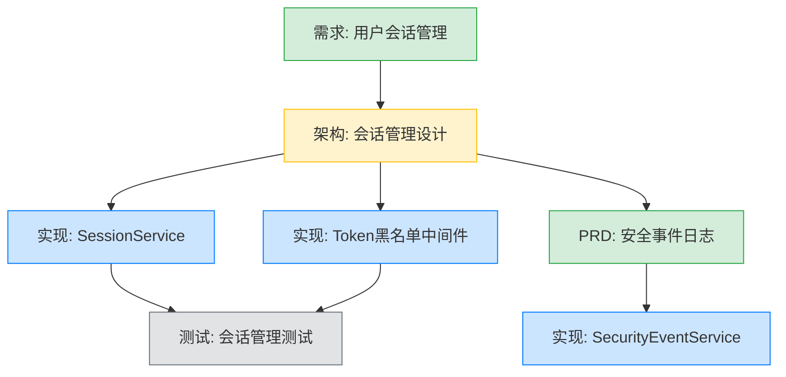

# YK-09-158: 内容依赖图 — 前置/后继关系、依赖健康检查、变更影响分析、依赖矩阵

> 需求编号：YK-09-158 · 优先级：P2 · 人天：0.3d · 状态：需求已编写
> 依赖：YK-09-08（跨项目知识依赖图谱）、YK-09-05（项目知识中心）

## 背景

### 问题陈述

YiKnowledge 中知识文件之间存在隐含的依赖关系（如 "架构设计文档 依赖 需求文档"、"实现指南 依赖 API 文档"），但当前这些关系未被显式建模和可视化。缺少内容依赖管理导致以下问题：

1. **内容断裂不可见**：一篇文档引用了另一篇已删除的文档，产生死链接
2. **变更影响未知**：修改一篇核心文档时，不知道会影响哪些下游文档
3. **学习路径不连贯**：用户不知道阅读当前文档前需要先阅读哪些前置文档
4. **依赖循环无检测**：A 依赖 B，B 依赖 C，C 依赖 A 形成的循环引用未被发现
5. **依赖盲区**：知识维护者无法评估某篇文档在整个知识体系中的位置

**核心矛盾**：YiKnowledge 的内容在逻辑上是互联的，但这种互联关系未被建模和利用。用户和贡献者都缺乏对知识网络全局结构的理解。

### 影响范围

| # | 影响 | 严重程度 | 典型场景 |
|---|------|----------|----------|
| 1 | 死链接难发现 | 高 | 文档删除后引用方不知道 |
| 2 | 变更影响范围未知 | 高 | 修改核心概念文档时不知道哪些文档需要同步 |
| 3 | 学习路径不连贯 | 中 | 读者跳过前置知识导致理解困难 |
| 4 | 依赖循环 | 中 | A→B→C→A 循环导致内容死锁 |
| 5 | 知识结构不透明 | 低 | 维护者难以评估文档的重要性 |

### 挑战

| 挑战 | 说明 |
|------|------|
| 依赖关系声明 | 如何在 frontmatter 中简洁声明依赖关系 |
| 死链检测 | 如何在依赖目标被删除/重命名后检测到 |
| 循环检测 | 如何高效检测依赖图中的循环（DFS 算法） |
| 影响范围计算 | 如何计算变更一个节点影响的所有下游节点 |
| 依赖图可视化 | 如何在 YiVad 前端展示复杂的依赖图 |

---

## 一、现状分析

### 1.1 当前内容关联方式

```
YiKnowledge 当前内容关联:
├── Markdown 超链接
│   ├── 相对路径链接：[文档名](../path/to/file.md)
│   └── 问题：链接在文件移动后断裂
├── Frontmatter tags
│   ├── 分类标签：[tags: [需求文档, 架构设计]]
│   └── 问题：标签不表达依赖方向
├── INDEX.md 手动索引
│   ├── 人工维护内容关系
│   └── 问题：易过时，覆盖不全
└── RAG 检索相关
    ├── 向量相似度关联
    └── 问题：语义关联 != 逻辑依赖

缺失:
├── 显式依赖声明（prerequisites/successors）  # ❌ 不存在
├── 依赖健康检查（死链/循环检测）              # ❌ 不存在
├── 变更影响分析                               # ❌ 不存在
├── 依赖图可视化                               # ❌ 不存在
└── 依赖矩阵                                   # ❌ 不存在
```

### 1.2 内容依赖场景示例



### 1.3 根因矩阵

| 症状 | 根因 | 触发条件 | 频率 |
|------|------|----------|------|
| 死链接 | 缺少依赖声明和自动检查 | 文档删除/重命名 | 中 |
| 变更影响未知 | 无影响范围分析 | 修改核心文档 | 中 |
| 学习路径断裂 | 无前置知识标注 | 读者阅读时 | 高 |
| 依赖循环 | 无循环检测 | 复杂的相互引用 | 低 |
| 知识结构不透明 | 无依赖图 | 维护者评估体系结构 | 中 |

---

## 二、设计决策

### 决策 1：依赖声明方式 — Frontmatter 字段 vs 独立依赖文件 vs 从链接推断

| 选项 | 声明成本 | 准确性 | 可维护性 |
|------|----------|--------|----------|
| Frontmatter 字段（prerequisites/successors） | 低（手动填写） | 高（显式声明） | 中（需与文件同步） |
| 独立 `dependencies.yaml` 文件 | 中（集中管理） | 高 | 低（与内容分离） |
| 从 Markdown 链接自动推断 | 零（自动） | 中（可能遗漏逻辑依赖） | 高（自动更新） |

**选择：Frontmatter 字段 + 从链接自动推断（混合）。** 显式依赖通过 `prerequisites` 和 `successors` frontmatter 字段声明。同时扫描 markdown 内部链接作为补充。显式声明为准，自动推断为辅助。

### 决策 2：依赖图可视化方式 — Mermaid vs D3.js vs Cytoscape.js

| 选项 | 渲染性能 | 交互性 | 集成成本 |
|------|----------|--------|----------|
| Mermaid（Markdown 导出） | 中（<50 节点） | 低 | 低（YiVad 已有 Mermaid 渲染） |
| D3.js（力导向图） | 高（200+ 节点） | 高 | 中 |
| Cytoscape.js（图可视化） | 高（500+ 节点） | 高 | 中（需引入库） |

**选择：D3.js 力导向图（首期）+ Mermaid 导出（文档内嵌）。** 首期内容量在 200 节点以内，D3.js 力导向图交互性和性能均满足需求。同时生成 Mermaid 代码用于嵌入文档。

### 决策 3：依赖健康检查触发 — 定时扫描 vs 事件驱动 vs 手动触发

| 选项 | 实时性 | 系统开销 | 实现复杂度 |
|------|--------|----------|-----------|
| 定时扫描（5 分钟一次） | 中（最多 5 分钟延迟） | 低 | 低 |
| 事件驱动（文件变更触发） | 高（实时） | 低 | 中（需监听文件事件） |
| 手动触发 | 低 | 零 | 低 |

**选择：事件驱动（Knowledge Watcher 已有文件变更检测）。** 复用 YiAi Knowledge Watcher 的文件变更事件，在文件增删改时自动执行该文件及其关联文件的依赖健康检查。

### 决策 4：变更影响范围计算 — 仅直接依赖 vs 传递依赖（全部下游）

| 选项 | 计算成本 | 完整性 | 适用场景 |
|------|----------|--------|----------|
| 仅直接依赖（1 级） | 低（O(d)） | 低 | 快速评估 |
| 传递依赖（全部下游，BFS） | 中（O(n+e)） | 高 | 完整影响分析 |
| 可选深度（可配置） | 中 | 中 | 灵活 |

**选择：传递依赖（全部下游 BFS）。** 影响分析必须覆盖传递依赖——修改底层概念文档可能影响依赖链上的所有文档。小规模（<200 节点）下 BFS 耗时可忽略。

### 设计决策记录

| 决策 | 选项 A | 选项 B | 选项 C | 选择 | 理由 |
|------|--------|--------|--------|------|------|
| 声明方式 | Frontmatter | 独立文件 | 自动推断 | **Frontmatter + 自动推断** | 显式为准 + 自动补充 |
| 可视化 | Mermaid | D3.js | Cytoscape | **D3.js + Mermaid** | 交互 + 文档嵌入 |
| 健康检查 | 定时扫描 | 事件驱动 | 手动触发 | **事件驱动** | 复用 Watcher |
| 影响范围 | 仅直接 | 传递依赖 | 可配置深度 | **传递依赖** | 完整覆盖 |

---

## 三、目标架构

### 3.1 内容依赖管理系统架构

```mermaid
graph TD
    subgraph "数据源"
        S1[Frontmatter: prerequisites/successors]
        S2[Markdown 内部链接提取]
        S3[Knowledge Watcher 变更事件]
    end

    subgraph "YiAi 后端"
        A1[DependencyService: 依赖关系管理]
        A2[GraphBuilder: 依赖图构建]
        A3[CycleDetector: 循环检测]
        A4[ImpactAnalyzer: 影响分析]
        A5[HealthChecker: 健康检查]
    end

    subgraph "MongoDB"
        B1[content_dependencies 集合]
        B2[knowledge_files (扩展字段)]
    end

    subgraph "YiVad 前端"
        C1[依赖图可视化页面]
        C2[依赖健康仪表盘]
        C3[文档依赖面板 (文档详情)]
        C4[影响分析报告]
    end

    S1 --> A1
    S2 --> A1
    S3 --> A5

    A1 --> A2
    A2 --> A3
    A2 --> A4
    A2 --> B1

    A3 --> B1
    A4 --> C4
    A5 --> C2

    B1 --> C1
    B1 --> C3
```

### 3.2 数据模型

```
content_dependencies 集合:
{
  _id: ObjectId,
  source_file: "projects/yivad/requirements/130-用户会话管理.md",
  source_title: "用户会话管理",
  target_file: "projects/yivad/requirements/131-登录历史记录.md",
  target_title: "登录历史记录",
  relation_type: "prerequisite",    // prerequisite | successor | references | extends
  declared_in: "frontmatter",       // frontmatter | markdown_link | auto_inferred
  weight: 1.0,                      // 关系权重（强依赖=1.0, 弱引用=0.5）
  created_at: ISODate("2026-09-09T08:00:00Z"),
  updated_at: ISODate("2026-09-09T08:00:00Z")
}

知识文件 frontmatter 扩展:
---
prerequisites:                     # 前置依赖（阅读本文前应先阅读）
  - path: "projects/yivad/requirements/130-用户会话管理.md"
    relation: "基础概念"
  - path: "projects/yivad/requirements/131-登录历史记录.md"
    relation: "相关功能"
successors:                        # 后继依赖（阅读本文后可继续阅读）
  - path: "projects/yivad/requirements/133-安全事件日志.md"
    relation: "后续深入"
---

索引:
- { source_file: 1, target_file: 1 }, unique
- { target_file: 1 }                           -- 影响分析
- { source_file: 1 }                           -- 后继查询
- { relation_type: 1 }                         -- 按类型筛选
```

---

## 四、具体改动

### 4.1 YiAi 后端 — DependencyService

```python
# services/knowledge/dependency_service.py (新增)

class DependencyService:
    """内容依赖关系管理服务"""

    def __init__(self):
        self.collection = db.content_dependencies
        self.knowledge_files = db.knowledge_files

    async def extract_dependencies(self, file_path: str, frontmatter: dict) -> list:
        """从 frontmatter 和 markdown 内容提取依赖关系"""
        dependencies = []

        # 1. 从 frontmatter prerequisites 提取
        for prereq in frontmatter.get("prerequisites", []):
            dependencies.append({
                "source_file": file_path,
                "target_file": prereq["path"],
                "relation_type": "prerequisite",
                "declared_in": "frontmatter",
                "weight": 1.0,
            })

        # 2. 从 frontmatter successors 提取
        for succ in frontmatter.get("successors", []):
            dependencies.append({
                "source_file": file_path,
                "target_file": succ["path"],
                "relation_type": "successor",
                "declared_in": "frontmatter",
                "weight": 1.0,
            })

        return dependencies

    async def extract_links(self, file_path: str, content: str) -> list:
        """从 Markdown 内容中提取内部链接"""
        import re
        link_pattern = re.compile(r'\[([^\]]+)\]\(([^)]+\.md)\)')
        links = []
        for match in link_pattern.finditer(content):
            target = match.group(2)
            # 解析相对路径
            resolved = self._resolve_path(file_path, target)
            if resolved:
                links.append({
                    "source_file": file_path,
                    "target_file": resolved,
                    "relation_type": "references",
                    "declared_in": "markdown_link",
                    "weight": 0.5,
                })
        return links

    async def sync_dependencies(self, file_path: str, frontmatter: dict, content: str):
        """同步文件的依赖关系"""
        # 删除旧依赖
        await self.collection.delete_many({"source_file": file_path})

        # 提取新依赖
        deps = await self.extract_dependencies(file_path, frontmatter)
        links = await self.extract_links(file_path, content)
        all_deps = deps + links

        if all_deps:
            for dep in all_deps:
                dep["created_at"] = datetime.utcnow()
                dep["updated_at"] = datetime.utcnow()
                # 获取目标文件标题
                target = await self.knowledge_files.find_one({"path": dep["target_file"]})
                dep["target_title"] = target.get("title", dep["target_file"]) if target else dep["target_file"]
                dep["source_title"] = frontmatter.get("title", file_path)
            await self.collection.insert_many(all_deps)

    async def build_graph(self, root_file: str = None, depth: int = None) -> dict:
        """构建依赖图"""
        query = {"source_file": root_file} if root_file else {}
        edges = await self.collection.find(query).to_list(length=1000)

        nodes = set()
        for edge in edges:
            nodes.add(edge["source_file"])
            nodes.add(edge["target_file"])

        return {
            "nodes": [{"id": n, "label": self._short_name(n)} for n in nodes],
            "edges": [
                {
                    "from": e["source_file"],
                    "to": e["target_file"],
                    "type": e["relation_type"],
                    "weight": e["weight"],
                }
                for e in edges
            ],
        }

    async def check_health(self, file_path: str) -> dict:
        """检查文件的依赖健康"""
        issues = []

        # 1. 死链接检测：目标文件是否存在
        prereqs = await self.collection.find({
            "source_file": file_path, "relation_type": "prerequisite"
        }).to_list(length=50)

        for dep in prereqs:
            exists = await self.knowledge_files.find_one({"path": dep["target_file"]})
            if not exists:
                issues.append({
                    "type": "broken_dependency",
                    "target": dep["target_file"],
                    "severity": "high",
                    "message": f'前置依赖文件不存在: {dep["target_file"]}',
                })

        # 2. 循环检测
        cycles = await self.detect_cycles(file_path)
        if cycles:
            issues.append({
                "type": "dependency_cycle",
                "cycle": cycles,
                "severity": "critical",
                "message": f'检测到依赖循环: {" → ".join(cycles)}',
            })

        # 3. 影响分析占位
        affected = await self.analyze_impact(file_path)

        return {
            "file": file_path,
            "healthy": len([i for i in issues if i["severity"] in ["critical", "high"]]) == 0,
            "issues": issues,
            "affected_count": len(affected),
        }

    async def detect_cycles(self, start_file: str) -> list | None:
        """DFS 检测依赖循环"""
        visited = set()
        path = []
        graph = {}
        edges = await self.collection.find().to_list(length=1000)
        for e in edges:
            graph.setdefault(e["source_file"], []).append(e["target_file"])

        def dfs(node):
            if node in path:
                cycle_start = path.index(node)
                return path[cycle_start:] + [node]
            if node in visited:
                return None
            visited.add(node)
            path.append(node)
            for neighbor in graph.get(node, []):
                result = dfs(neighbor)
                if result:
                    return result
            path.pop()
            return None

        return dfs(start_file)

    async def analyze_impact(self, file_path: str) -> list[str]:
        """BFS 分析变更影响范围（所有下游节点）"""
        graph = {}
        edges = await self.collection.find().to_list(length=1000)
        for e in edges:
            graph.setdefault(e["source_file"], []).append(e["target_file"])

        # 反向索引：哪些文件依赖了 file_path
        reverse_graph = {}
        for e in edges:
            reverse_graph.setdefault(e["target_file"], []).append(e["source_file"])

        affected = set()
        queue = deque(reverse_graph.get(file_path, []))

        while queue:
            node = queue.popleft()
            if node in affected:
                continue
            affected.add(node)
            for dependent in reverse_graph.get(node, []):
                if dependent not in affected:
                    queue.append(dependent)

        return list(affected)

    async def get_dependency_matrix(self, project: str = None) -> list[dict]:
        """生成依赖矩阵"""
        query = {}
        if project:
            query["source_file"] = {"$regex": f"^{project}/"}

        edges = await self.collection.find(query).to_list(length=1000)

        files = set()
        for e in edges:
            files.add(e["source_file"])
            files.add(e["target_file"])

        files = sorted(files)
        matrix = []
        for source in files:
            row = {"file": source, "dependencies": {}}
            for target in files:
                depends = any(
                    e["source_file"] == source and e["target_file"] == target
                    for e in edges
                )
                row["dependencies"][target] = 1 if depends else 0
            matrix.append(row)

        return matrix

    def _short_name(self, path: str) -> str:
        return path.split("/")[-1].replace(".md", "")

    def _resolve_path(self, source: str, target: str) -> str | None:
        source_dir = os.path.dirname(source)
        resolved = os.path.normpath(os.path.join(source_dir, target))
        return resolved if resolved.startswith("YiKnowledge/") else None
```

### 4.2 文件变更清单

| 文件 | 操作 | 说明 |
|------|------|------|
| `YiAi/services/knowledge/dependency_service.py` | 新增 | 依赖关系管理服务 |
| `YiAi/services/knowledge/graph_builder.py` | 新增 | 依赖图构建 + 循环检测 |
| `YiAi/services/knowledge/impact_analyzer.py` | 新增 | 变更影响分析 |
| `YiAi/services/knowledge/knowledge_watcher.py` | 修改 | Watcher 增加依赖同步触发 |
| `YiVad/src/views/knowledge/dependency-graph.vue` | 新增 | 依赖图可视化页面（D3.js 力导向图） |
| `YiVad/src/views/knowledge/dependency-health.vue` | 新增 | 依赖健康仪表盘 |
| `YiVad/src/components/knowledge/DependencyPanel.vue` | 新增 | 文档详情页依赖面板 |
| `YiVad/src/components/knowledge/ImpactReport.vue` | 新增 | 影响分析报告组件 |
| `YiVad/src/composables/useDependencyGraph.ts` | 新增 | 依赖图 Composable |
| `YiVad/src/router/modules/knowledge.ts` | 修改 | 添加依赖图路由 |
| `YiAi/tests/test_dependency_service.py` | 新增 | 依赖服务测试 |

---

## 五、实施步骤

| 步骤 | 操作 | 路径 | 验证 | 人天 |
|------|------|------|------|------|
| 1 | 实现 DependencyService（提取/同步依赖） | `YiAi/services/knowledge/dependency_service.py` | 从 frontmatter 和链接提取依赖 | 0.05 |
| 2 | 实现 GraphBuilder + 循环检测 | `YiAi/services/knowledge/graph_builder.py` | DFS 检测循环，BFS 构建图 | 0.04 |
| 3 | 实现影响分析 + 健康检查 | `YiAi/services/knowledge/impact_analyzer.py` | BFS 传递依赖影响范围 | 0.03 |
| 4 | 集成到 Knowledge Watcher | `YiAi/services/knowledge/knowledge_watcher.py` | 文件变更时自动同步依赖 | 0.03 |
| 5 | 实现 D3.js 依赖图可视化 | `YiVad/src/views/knowledge/dependency-graph.vue` | 力导向图 + 节点点击 | 0.06 |
| 6 | 实现依赖健康仪表盘 | `YiVad/src/views/knowledge/dependency-health.vue` | 死链/循环统计 + 问题列表 | 0.04 |
| 7 | 实现文档依赖面板 + 影响报告 | `YiVad/src/components/knowledge/` | 文档详情展示依赖 + 影响分析 | 0.05 |

**总人天：0.3d**

---

## 六、测试规格

### 场景 1：声明前置依赖

**GIVEN** 文档 B 的 frontmatter 声明了 prerequisites: [A.md]
**WHEN** Knowledge Watcher 扫描文档 B
**THEN** content_dependencies 集合中插入一条记录：source=B, target=A, type=prerequisite
**AND** 前端文档详情页显示"前置阅读"面板，包含文档 A 的链接

### 场景 2：从链接自动推断依赖

**GIVEN** 文档 C 中包含 `[文档 D](../dir/D.md)` 的 Markdown 链接
**WHEN** Knowledge Watcher 扫描文档 C
**THEN** content_dependencies 集合中插入一条记录：source=C, target=D, type=references, declared_in=markdown_link

### 场景 3：检测死链接（broken dependency）

**GIVEN** 文档 E 在 frontmatter 中声明依赖文档 F，但文档 F 已被删除
**WHEN** 执行依赖健康检查
**THEN** 返回 issue: type=broken_dependency, severity=high
**AND** 前端依赖健康仪表盘显示该问题

### 场景 4：检测依赖循环

**GIVEN** A → B → C → A 形成循环依赖
**WHEN** 执行循环检测（从 A 开始 DFS）
**THEN** 返回 cycle: ["A", "B", "C", "A"]
**AND** severity=critical
**AND** 循环路径可视化展示

### 场景 5：变更影响分析

**GIVEN** 文档 A 被 3 个文档直接依赖，其中文档 B 又被 2 个文档依赖
**WHEN** 对文档 A 执行影响分析
**THEN** 返回 affected 列表包含 5 个文档
**AND** 按距离分层展示：直接依赖（3 个）+ 间接依赖（2 个）

### 场景 6：依赖图可视化

**GIVEN** 知识库中有 20 个带依赖关系的文档
**WHEN** 用户访问依赖图页面，选择项目过滤条件
**THEN** 显示 D3.js 力导向图，节点为文档名，边为依赖关系
**AND** 节点按类型着色（需求=绿、架构=黄、实现=蓝）
**AND** 悬停节点显示依赖数
**AND** 点击节点显示文档详情

---

## 七、风险与缓解

| 风险 | 概率 | 影响 | 缓解措施 |
|------|------|------|----------|
| 依赖关系与 Markdown 链接不同步 | 中 | 中 | frontmatter 声明为权威来源，链接仅做辅助补充 |
| 依赖图节点过多导致前端渲染卡顿 | 低 | 中 | 默认展示当前文档为中心的 2 级依赖；全局图限制 200 节点 |
| 循环检测在大图中性能差 | 低 | 低 | 当前规模 < 200 节点，DFS 耗时可忽略；后续可加缓存 |
| frontmatter 手动维护负担 | 中 | 低 | 自动从链接推断减少手动声明；提供 CLI 工具批量补全 |

---

## 八、回滚策略

| 场景 | 回滚操作 | 影响 |
|------|----------|------|
| D3.js 渲染性能问题 | 降级为 Mermaid 导出 + 纯表格展示 | 失去交互性 |
| 依赖同步导致 Watcher 性能下降 | 关闭自动同步，恢复手动触发 | 依赖数据可能过时 |
| 影响分析查询超时 | 限制传递依赖深度为 2 级 | 覆盖不完整 |
| 依赖数据异常 | 清空 content_dependencies 集合，重新全量同步 | 短暂失去依赖数据 |

---

## 九、设计决策记录

### D-01：为什么 frontmatter 作为权威依赖来源？

Markdown 链接表达的是引用关系，不一定代表逻辑依赖。frontmatter 中显式声明 `prerequisites` 和 `successors` 是作者意图的直接表达，准确性更高。

### D-02：为什么使用 D3.js 而非 ECharts 或 Cytoscape.js？

D3.js 是图可视化的工业标准，力导向图布局成熟。ECharts 的图能力较弱，Cytoscape.js 需要额外依赖。D3.js 在 YiVad 中可与其他数据可视化组件共享基础。

### D-03：为什么影响分析使用 BFS 而非 DFS？

影响分析需要按层级展示（直接影响、间接影响），BFS 天然按层级输出。DFS 便于循环检测但不便于层级展示。

### D-04：为什么 weight 字段选择 0.5/1.0 而非 0-1 连续值？

离散权重简化了计算和展示。0.5 代表"弱引用"（链接引用），1.0 代表"强依赖"（frontmatter 声明）。连续值在首期内容量下没有实际意义。

---

## 十、可观测性

### 指标

| 指标 | 类型 | 说明 |
|------|------|------|
| `yiknowledge.deps.total_edges` | Gauge | 依赖关系总数 |
| `yiknowledge.deps.broken_links` | Gauge | 死链接数 |
| `yiknowledge.deps.cycles` | Gauge | 依赖循环数 |
| `yiknowledge.deps.sync_duration` | Histogram | 依赖同步耗时 |
| `yiknowledge.deps.graph_build_duration` | Histogram | 图构建耗时 |

---

## 十一、代码审查检查清单

- [ ] frontmatter 支持 prerequisites 和 successors 字段
- [ ] Markdown 内部链接自动提取为 references 类型
- [ ] 死链接检测：目标文件不存在时记录 issue
- [ ] 循环检测：DFS 算法正确返回循环路径
- [ ] 影响分析：BFS 传递依赖覆盖所有下游节点
- [ ] D3.js 依赖图：节点可拖拽、缩放、点击
- [ ] 节点按类型/项目着色
- [ ] 依赖健康仪表盘显示问题统计 + 列表
- [ ] 文档详情页显示前置阅读和后继阅读
- [ ] content_dependencies 集合有 source+target 唯一索引
- [ ] 依赖同步在 Knowledge Watcher 中自动触发

---

## 回归问题预测

| # | 预测问题 | 原因 | 验证方法 |
|---|---------|------|---------|
| 1 | 文件重命名后所有指向它的依赖都变成死链接，content_dependencies 中 target_file 未更新为新路径，健康检查报告显示大量 broken_dependency | 依赖关系使用文件路径作为 target_file，文件重命名时路径字符串不自动更新 | 重命名一个被 3 个文档依赖的文件 → 执行健康检查 → 验证所有依赖自动更新为新路径 |
| 2 | 依赖图可视化在项目过滤（如仅显示 YiVad 依赖）后，部分边显示源头或目标节点不在当前过滤范围内，D3 渲染报错 | D3 力导向图的节点和边独立加载，过滤时只过滤了部分数据导致不一致 | 选择"仅 YiVad 项目"过滤 → 渲染依赖图 → 验证所有边两端节点都在过滤范围内 |
| 3 | 多文档修改时 Incremental sync 只处理了最后一个文件，前几个文件的依赖未被更新，原因是 sync_dependencies 使用了不恰当的批量逻辑 | Knowledge Watcher 在一次扫描中检测到 N 个文件变更，循环调用 sync_dependencies，但存在异步竞态 | 同时修改 3 个有依赖关系的文件 → 等待 Watcher 扫描 → 验证 3 个文件的依赖关系全部正确更新 |
| 4 | 前端影响分析报告页面在分析结果包含已不存在文件时，链接跳转 404 | 影响分析返回的是文件路径列表，前端将其作为链接使用，但如果分析数据是缓存的，文件可能已被删除 | 对文件 A 执行影响分析 → 删除受影响列表中的一个文件 → 点击该文件链接 → 验证前端优雅处理 404 |
| 5 | 循环检测在依赖图超过 200 节点后 DFS 递归深度过大导致 Python RecursionError | Python 默认递归深度限制为 1000，循环检测的 DFS 使用递归实现 | 构造 500 节点的依赖链 → 执行循环检测 → 验证不抛出 RecursionError（使用迭代 DFS 或设置 sys.setrecursionlimit） |
| 6 | 依赖图初始化加载时，D3 SVG 画布尺寸计算错误（容器元素高度为 0），所有节点挤在左上角 | D3.js 在 mounted 钩子中初始化，但容器元素在 CSS transition 或条件渲染后高度还未确定 | 打开依赖图页面 → 检查节点是否均匀分布 → 使用 ResizeObserver 监听容器尺寸变化 → 窗口调整后图重新布局 |

---

## 性能分析

### 关键操作耗时

| 操作 | 耗时 | 说明 |
|------|------|------|
| 提取依赖（单文件） | < 10ms | frontmatter 解析 + 正则匹配链接 |
| 同步依赖（单文件） | < 30ms | 删除旧依赖 + 插入新依赖 |
| 循环检测（200 节点） | < 5ms | DFS 遍历 |
| 影响分析（200 节点） | < 10ms | BFS 反向图遍历 |
| 图构建（200 节点，400 边） | < 50ms | 数据准备 |
| D3.js 渲染（200 节点） | < 500ms | SVG 绑定 + 力布局收敛 |
| 健康检查（单文件） | < 100ms | 死链检测 + 循环检测 + 影响分析 |

### 数据量预估

| 场景 | 节点数 | 边数 | 图构建耗时 | 渲染耗时 |
|------|--------|------|-----------|---------|
| 当前（4 项目） | ~150 | ~300 | < 50ms | < 500ms |
| 6 个月后 | ~300 | ~600 | < 100ms | < 1s |
| 企业级 | ~1000 | ~2000 | < 500ms | < 3s |

---

## 相关文档

- [跨项目知识依赖图谱](../08-需求-跨项目知识依赖图谱.md) — 跨项目级别的关联
- [项目知识中心](../05-需求-项目知识中心.md) — 依赖图的项目过滤
- [链接拓扑可视化](../27-需求-链接拓扑可视化.md) — 更丰富的拓扑展示
- [环路检测](../71-需求-环路检测.md) — 专门的循环检测方案

*PRD 来源: `projects/yiknowledge/requirements/2026-09/158-需求-内容依赖图.md`*