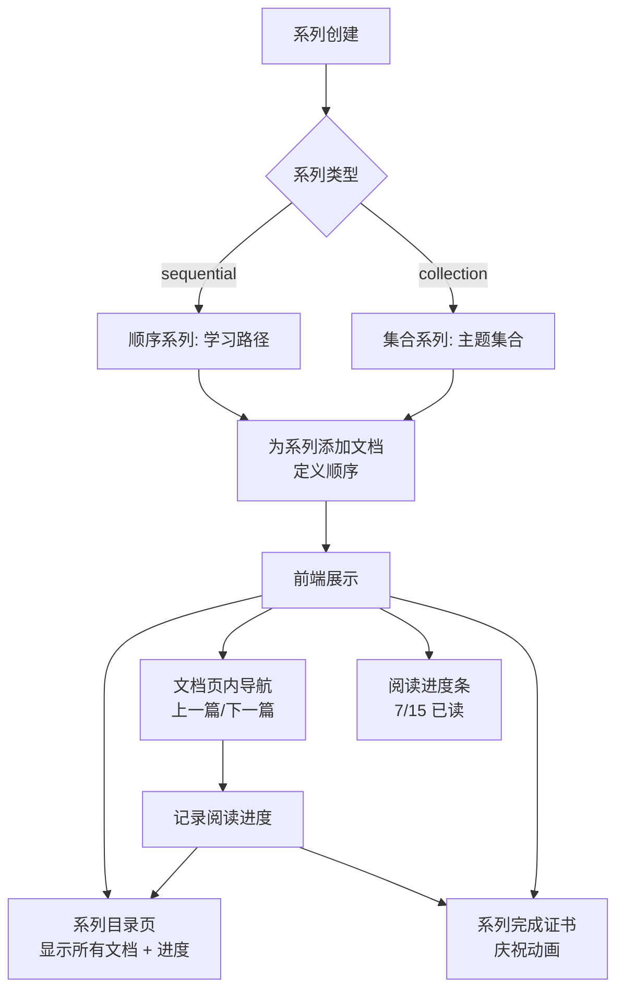
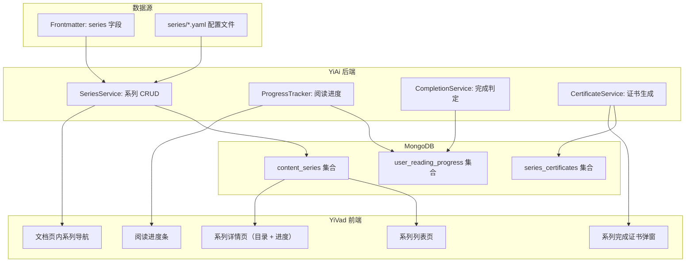

# YK-09-160: 内容系列管理 — 顺序/集合系列类型、系列进度追踪、前后导航、系列完成证书

> 需求编号：YK-09-160 · 优先级：P2 · 人天：0.3d · 状态：需求已编写
> 依赖：无强依赖，可与内容重要性评分、依赖图并行开发

## 背景

### 问题陈述

YiKnowledge 中有大量内容是按系列组织的（如"YiVad 功能实现系列"包含 60+ 篇 PRD，"YiAi 架构设计系列"包含 40+ 篇架构文档），但当前缺少对内容系列的显式管理。所有文档被平等列出，读者无法感知系列的存在，导致：

1. **系列不可见**：读者在浏览目录时不知道哪些文档属于同一个系列
2. **无进度追踪**：读者不知道自己在系列中读到了哪里，还剩多少
3. **导航割裂**：读完一篇后需要返回目录才能找到下一篇，无前后导航
4. **无完成感**：读完整个系列后没有记录或标识，缺乏成就感
5. **系列统计缺失**：管理者不知道系列完读率、最受欢迎的系列

**核心矛盾**：内容在逻辑上按系列组织（如需求系列、架构系列、测试系列），但系统没有系列管理的概念，读者体验割裂。

### 影响范围

| # | 影响 | 严重程度 | 典型场景 |
|---|------|----------|----------|
| 1 | 系列不可见 | 高 | 读者不知道一篇文档属于哪个系列 |
| 2 | 学习路径断裂 | 高 | 读者不知道下一篇该读什么 |
| 3 | 进度无法追踪 | 中 | 读者忘记之前读到了哪里 |
| 4 | 完读率无法统计 | 中 | 管理者无法评估系列质量 |
| 5 | 缺乏成就感 | 低 | 读者读完整个系列无反馈 |

### 挑战

| 挑战 | 说明 |
|------|------|
| 系列声明方式 | 如何声明文档属于某个系列、在系列中的顺序 |
| 进度追踪 | 如何跨会话追踪用户在每个系列中的阅读进度 |
| 系列类型 | 顺序系列（sequential）和集合系列（collection）的不同处理 |
| 完成判定 | 如何判定一个系列"已完成"（阅读所有文档？关键文档？） |
| 前端导航 | 如何在文档页面中优雅地展示系列导航 |

---

## 一、现状分析

### 1.1 当前内容组织形式

```
YiKnowledge 当前内容组织:
├── 按目录组织
│   ├── projects/yivad/requirements/2026-09/
│   │   ├── 00-需求-需求总览.md
│   │   ├── 01-需求-composable分层.md
│   │   ├── ...
│   │   └── 133-安全事件日志.md
│   └── 问题：目录表达了时间顺序，但不表达逻辑系列
├── INDEX.md 手动索引
│   └── 问题：手动维护，不反映系列关系
└── 无系列管理
    ├── 无系列声明                     # ❌ 不存在
    ├── 无系列类型                     # ❌ 不存在
    ├── 无进度追踪                     # ❌ 不存在
    ├── 无前后导航                     # ❌ 不存在
    └── 无完成证书                     # ❌ 不存在
```

### 1.2 系列管理目标流程



### 1.3 根因矩阵

| 症状 | 根因 | 触发条件 | 频率 |
|------|------|----------|------|
| 系列不可见 | 未声明文档系列归属 | 读者浏览文档 | 高 |
| 无前后导航 | 无系列顺序定义 | 读完一篇后 | 高 |
| 进度无法追踪 | 无阅读记录机制 | 跨会话阅读 | 中 |
| 完读率不透明 | 无系列统计 | 管理者评估 | 低 |
| 无成就感 | 无完成标识 | 读完系列后 | 低 |

---

## 二、设计决策

### 决策 1：系列声明方式 — Frontmatter vs 独立配置文件 vs 目录约定

| 选项 | 灵活性 | 可发现性 | 维护成本 |
|------|--------|----------|----------|
| Frontmatter（每篇文档声明 series 字段） | 高 | 中 | 低 |
| 独立 `series.yaml` 配置文件 | 高 | 低（与内容分离） | 中 |
| 目录约定（同目录 = 同系列） | 低 | 高 | 低 |

**选择：Frontmatter + 独立配置文件（混合）。** 每篇文档的 frontmatter 声明 `series` 字段（系列名 + 序号）。同时支持 `YiKnowledge/series/` 目录下的 YAML 配置文件定义系列元数据（标题、描述、类型）。

### 决策 2：阅读进度追踪方式 — localStorage vs 服务端存储 vs 混合

| 选项 | 跨设备 | 隐私 | 实现复杂度 |
|------|--------|------|-----------|
| localStorage（前端本地） | 否 | 高 | 低 |
| 服务端（MongoDB user_read_progress） | 是 | 中 | 中 |
| 混合（localStorage 优先 + 服务端同步） | 是 | 高 | 高 |

**选择：服务端存储。** YiVad 已有用户系统，阅读进度存储在 `user_reading_progress` 集合中。用户更换设备后进度不丢失，同时可聚合完读率统计。

### 决策 3：系列完成判定 — 全部文档 vs 核心文档 vs 80% 文档

| 选项 | 严格度 | 用户友好 | 适用场景 |
|------|--------|----------|----------|
| 全部文档 | 高 | 低（可能包含 optional 文档） | 认证/考试 |
| 核心文档（仅 critical + core） | 中 | 高 | 快速了解 |
| 80% 文档（可配置比例） | 中 | 中 | 灵活 |

**选择：核心文档（critical + core）+ 可选完成全部。** 默认完成标准为阅读系列中所有 critical 和 core 级别文档。用户可选择追求"完整阅读"（全部文档）。标准在系列配置中可覆盖。

### 决策 4：前后导航范围 — 仅同系列 vs 同系列 + 跨系列推荐

| 选项 | 简洁性 | 发现性 | 实现复杂度 |
|------|--------|--------|-----------|
| 仅同系列前后文档 | 高 | 低 | 低 |
| 同系列 + 跨系列推荐 | 低 | 高 | 高 |

**选择：仅同系列前后文档（首期）。** 保持导航简洁，跨系列推荐属于内容推荐引擎范畴（独立需求）。

### 设计决策记录

| 决策 | 选项 A | 选项 B | 选项 C | 选择 | 理由 |
|------|--------|--------|--------|------|------|
| 声明方式 | Frontmatter | YAML 配置 | 目录约定 | **Frontmatter + YAML** | 灵活 + 集中管理 |
| 进度追踪 | localStorage | 服务端 | 混合 | **服务端** | 跨设备 + 可统计 |
| 完成判定 | 全部 | 核心 | 80% | **核心文档** | 高效 + 可配置 |
| 导航范围 | 仅同系列 | 跨系列推荐 | — | **仅同系列** | 简洁清晰 |

---

## 三、目标架构

### 3.1 内容系列管理系统架构



### 3.2 数据模型

```
content_series 集合:
{
  _id: ObjectId,
  series_id: "srs_yivad_requirements_202609",
  title: "YiVad 2026年9月需求文档系列",
  description: "涵盖 YiVad 管理后台 2026 年 9 月全部功能需求",
  type: "sequential",                    // sequential | collection
  project: "yivad",
  category: "requirements",
  cover_image: null,
  documents: [
    {
      file_path: "projects/yivad/requirements/2026-09/130-用户会话管理.md",
      order: 130,
      title: "用户会话管理",
      grade: "core",
      estimated_minutes: 15,
    },
    {
      file_path: "projects/yivad/requirements/2026-09/131-登录历史记录.md",
      order: 131,
      title: "登录历史记录",
      grade: "core",
      estimated_minutes: 15,
    },
    // ...
  ],
  total_documents: 4,
  required_documents: 2,                 // core 及以上文档数
  completion_criteria: "core",           // core | all | percentage:80
  created_at: ISODate("2026-09-09T08:00:00Z"),
  updated_at: ISODate("2026-09-09T08:00:00Z"),
}

user_reading_progress 集合:
{
  _id: ObjectId,
  user_id: "user_001",
  series_id: "srs_yivad_requirements_202609",
  completed_documents: [
    "projects/yivad/requirements/2026-09/130-用户会话管理.md",
    "projects/yivad/requirements/2026-09/131-登录历史记录.md",
  ],
  current_document: "projects/yivad/requirements/2026-09/132-两步验证设置.md",
  started_at: ISODate("2026-09-09T08:00:00Z"),
  last_accessed_at: ISODate("2026-09-09T10:30:00Z"),
  is_completed: false,
  completed_at: null,
  completion_percentage: 50.0,           // 基于 completion_criteria
}

series_certificates 集合:
{
  _id: ObjectId,
  user_id: "user_001",
  series_id: "srs_yivad_requirements_202609",
  certificate_id: "cert_abc123",
  completed_at: ISODate("2026-09-10T08:00:00Z"),
  completed_documents_count: 4,
  time_spent_minutes: 120,
  created_at: ISODate("2026-09-10T08:00:00Z"),
}

索引:
- content_series: { series_id: 1 }, unique
- content_series: { project: 1 }
- user_reading_progress: { user_id: 1, series_id: 1 }, unique
- user_reading_progress: { series_id: 1, is_completed: 1 }     -- 完读率统计
- series_certificates: { user_id: 1, series_id: 1 }, unique
```

---

## 四、具体改动

### 4.1 Frontmatter 扩展

```yaml
# 文档 frontmatter 新增字段
---
title: "用户会话管理"
series:
  id: "srs_yivad_requirements_202609"
  order: 130
  estimated_minutes: 15
---
```

### 4.2 YiAi 后端 — SeriesService

```python
# services/knowledge/series_service.py (新增)

class SeriesService:
    """内容系列管理服务"""

    def __init__(self):
        self.series = db.content_series
        self.progress = db.user_reading_progress
        self.certificates = db.series_certificates
        self.files = db.knowledge_files
        self.importance = db.content_importance

    async def create_series(self, config: dict) -> dict:
        """创建新系列"""
        series_id = f"srs_{config['project']}_{config['category']}_{datetime.utcnow().strftime('%Y%m')}"

        if await self.series.find_one({"series_id": series_id}):
            raise BusinessError(1003, f"系列 {series_id} 已存在")

        series = {
            "series_id": series_id,
            "title": config["title"],
            "description": config.get("description", ""),
            "type": config.get("type", "sequential"),
            "project": config["project"],
            "category": config.get("category", ""),
            "documents": [],
            "total_documents": 0,
            "required_documents": 0,
            "completion_criteria": config.get("completion_criteria", "core"),
            "created_at": datetime.utcnow(),
            "updated_at": datetime.utcnow(),
        }

        await self.series.insert_one(series)
        return series

    async def add_document(self, series_id: str, file_path: str, order: int):
        """向系列添加文档"""
        doc = await self.files.find_one({"path": file_path})
        if not doc:
            raise BusinessError(1002, f"文档 {file_path} 不存在")

        importance = await self.importance.find_one({"file_path": file_path})

        await self.series.update_one(
            {"series_id": series_id},
            {
                "$push": {
                    "documents": {
                        "$each": [{
                            "file_path": file_path,
                            "order": order,
                            "title": doc.get("title", file_path),
                            "grade": importance.get("grade", "core") if importance else "core",
                            "estimated_minutes": doc.get("frontmatter", {}).get("series", {}).get("estimated_minutes", 10),
                        }],
                        "$sort": {"order": 1}
                    }
                },
                "$inc": {"total_documents": 1},
                "$set": {"updated_at": datetime.utcnow()},
            }
        )

        # 更新 required_documents 计数
        await self._update_required_count(series_id)

    async def get_series_detail(self, series_id: str, user_id: str = None) -> dict:
        """获取系列详情（含用户进度）"""
        series = await self.series.find_one({"series_id": series_id})
        if not series:
            raise BusinessError(1002, "系列不存在")

        result = dict(series)

        if user_id:
            progress = await self.progress.find_one({
                "user_id": user_id,
                "series_id": series_id,
            })
            result["user_progress"] = progress

        # 计算全局完读率
        total_users = await self.progress.count_documents({
            "series_id": series_id,
            "started_at": {"$exists": True},
        })
        completed = await self.progress.count_documents({
            "series_id": series_id,
            "is_completed": True,
        })
        result["completion_rate"] = completed / max(total_users, 1)

        return result

    async def get_navigation(self, series_id: str, current_file: str) -> dict:
        """获取系列内导航（上一篇/下一篇）"""
        series = await self.series.find_one({"series_id": series_id})
        if not series:
            return {}

        docs = sorted(series["documents"], key=lambda d: d["order"])
        current_idx = None
        for i, doc in enumerate(docs):
            if doc["file_path"] == current_file:
                current_idx = i
                break

        return {
            "series_title": series["title"],
            "series_type": series["type"],
            "total": len(docs),
            "current_index": current_idx + 1 if current_idx is not None else 0,
            "prev": docs[current_idx - 1] if current_idx and current_idx > 0 else None,
            "next": docs[current_idx + 1] if current_idx is not None and current_idx < len(docs) - 1 else None,
        }

    async def update_progress(self, user_id: str, series_id: str, file_path: str):
        """更新用户阅读进度"""
        existing = await self.progress.find_one({
            "user_id": user_id,
            "series_id": series_id,
        })

        if existing:
            completed = set(existing.get("completed_documents", []))
            completed.add(file_path)

            series = await self.series.find_one({"series_id": series_id})
            total = series.get("required_documents", len(series.get("documents", [])))
            pct = len(completed) / max(total, 1) * 100

            await self.progress.update_one(
                {"user_id": user_id, "series_id": series_id},
                {"$set": {
                    "completed_documents": list(completed),
                    "current_document": file_path,
                    "last_accessed_at": datetime.utcnow(),
                    "completion_percentage": round(pct, 1),
                }}
            )

            # 检查是否完成
            await self._check_completion(user_id, series_id, list(completed))
        else:
            await self.progress.insert_one({
                "user_id": user_id,
                "series_id": series_id,
                "completed_documents": [file_path],
                "current_document": file_path,
                "started_at": datetime.utcnow(),
                "last_accessed_at": datetime.utcnow(),
                "is_completed": False,
                "completion_percentage": 0,
            })

    async def _check_completion(self, user_id: str, series_id: str,
                                completed_files: list):
        """检查系列是否完成"""
        series = await self.series.find_one({"series_id": series_id})

        required_count = series.get("required_documents", len(series["documents"]))
        if len(completed_files) >= required_count:
            # 标记完成
            await self.progress.update_one(
                {"user_id": user_id, "series_id": series_id},
                {"$set": {
                    "is_completed": True,
                    "completed_at": datetime.utcnow(),
                    "completion_percentage": 100.0,
                }}
            )

            # 自动生成证书
            await self._generate_certificate(user_id, series_id)

    async def _generate_certificate(self, user_id: str, series_id: str):
        """生成完成证书"""
        existing = await self.certificates.find_one({
            "user_id": user_id, "series_id": series_id
        })
        if existing:
            return existing  # 已生成

        progress = await self.progress.find_one({
            "user_id": user_id, "series_id": series_id
        })

        cert = {
            "user_id": user_id,
            "series_id": series_id,
            "certificate_id": f"cert_{uuid4().hex[:12]}",
            "completed_at": datetime.utcnow(),
            "completed_documents_count": len(progress.get("completed_documents", [])),
            "time_spent_minutes": self._estimate_time(progress),
            "created_at": datetime.utcnow(),
        }
        await self.certificates.insert_one(cert)
        return cert

    async def list_user_series(self, user_id: str) -> list:
        """列出用户的所有系列进度"""
        progresses = await self.progress.find({"user_id": user_id}) \
            .sort("last_accessed_at", -1).to_list(length=50)

        result = []
        for p in progresses:
            series = await self.series.find_one({"series_id": p["series_id"]})
            result.append({
                "series": series,
                "progress": p,
            })
        return result

    async def get_completion_stats(self, series_id: str) -> dict:
        """获取系列的完读统计"""
        total = await self.progress.count_documents({
            "series_id": series_id,
            "started_at": {"$exists": True},
        })
        completed = await self.progress.count_documents({
            "series_id": series_id,
            "is_completed": True,
        })
        in_progress = total - completed

        return {
            "total_started": total,
            "completed": completed,
            "in_progress": in_progress,
            "completion_rate": completed / max(total, 1) * 100,
        }

    async def _update_required_count(self, series_id: str):
        series = await self.series.find_one({"series_id": series_id})
        if not series:
            return
        required = sum(1 for d in series.get("documents", [])
                      if d.get("grade") in ["critical", "core"])
        await self.series.update_one(
            {"series_id": series_id},
            {"$set": {"required_documents": required}}
        )

    def _estimate_time(self, progress: dict) -> int:
        return len(progress.get("completed_documents", [])) * 10
```

### 4.3 YiVad 前端 — 系列详情页

```typescript
// src/views/knowledge/series-detail.vue (新增)

// <template>
//   <div class="series-detail">
//     <!-- 系列头部 -->
//     <div class="series-header">
//       <t-breadcrumb>
//         <t-breadcrumb-item to="/knowledge/series">内容系列</t-breadcrumb-item>
//         <t-breadcrumb-item>{{ series.title }}</t-breadcrumb-item>
//       </t-breadcrumb>
//
//       <h1>{{ series.title }}</h1>
//       <p>{{ series.description }}</p>
//
//       <t-tag :theme="series.type === 'sequential' ? 'primary' : 'default'">
//         {{ series.type === 'sequential' ? '顺序系列' : '集合系列' }}
//       </t-tag>
//       <span>共 {{ series.total_documents }} 篇</span>
//       <span>完读率 {{ (series.completion_rate * 100).toFixed(1) }}%</span>
//     </div>
//
//     <!-- 用户进度 -->
//     <t-card v-if="userProgress" title="我的进度">
//       <t-progress :percentage="userProgress.completion_percentage"
//         :label="`${userProgress.completed_documents.length} / ${series.required_documents}`" />
//       <t-button v-if="!userProgress.is_completed && userProgress.completed_documents.length > 0"
//         @click="continueReading">继续阅读</t-button>
//     </t-card>
//
//     <!-- 文档列表 -->
//     <t-card title="系列目录">
//       <div v-for="(doc, index) in series.documents" :key="doc.file_path" class="doc-item"
//         :class="{ completed: isCompleted(doc.file_path), current: isCurrent(doc.file_path) }">
//         <span class="doc-order">{{ doc.order }}</span>
//         <span class="doc-grade">
//           <ImportanceBadge :grade="doc.grade" />
//         </span>
//         <router-link :to="docLink(doc.file_path)">{{ doc.title }}</router-link>
//         <span class="doc-estimate">{{ doc.estimated_minutes }} 分钟</span>
//         <t-icon v-if="isCompleted(doc.file_path)" name="check-circle" class="completed-icon" />
//       </div>
//     </t-card>
//   </div>
// </template>
```

### 4.4 文档页内系列导航

```typescript
// src/components/knowledge/SeriesNavigation.vue (新增)

// <template>
//   <div v-if="navigation" class="series-navigation">
//     <div class="nav-header">
//       <span>{{ navigation.series_title }}</span>
//       <span class="nav-position">{{ navigation.current_index }} / {{ navigation.total }}</span>
//     </div>
//
//     <div class="nav-buttons">
//       <t-button v-if="navigation.prev"
//         variant="outline" @click="navigateTo(navigation.prev)">
//         ← {{ navigation.prev.title }}
//       </t-button>
//       <t-button v-if="navigation.next"
//         variant="outline" @click="navigateTo(navigation.next)">
//         {{ navigation.next.title }} →
//       </t-button>
//     </div>
//
//     <t-progress :percentage="progressPercentage" size="small" />
//   </div>
// </template>
```

### 4.5 文件变更清单

| 文件 | 操作 | 说明 |
|------|------|------|
| `YiAi/services/knowledge/series_service.py` | 新增 | 内容系列管理服务 |
| `YiAi/services/knowledge/progress_tracker.py` | 新增 | 阅读进度追踪服务 |
| `YiAi/services/knowledge/certificate_service.py` | 新增 | 系列完成证书服务 |
| `YiAi/services/knowledge/knowledge_watcher.py` | 修改 | Watcher 扫描 series frontmatter 字段 |
| `YiVad/src/views/knowledge/series-list.vue` | 新增 | 系列列表页 |
| `YiVad/src/views/knowledge/series-detail.vue` | 新增 | 系列详情页（目录 + 进度） |
| `YiVad/src/components/knowledge/SeriesNavigation.vue` | 新增 | 文档页内系列导航组件 |
| `YiVad/src/components/knowledge/CertificateModal.vue` | 新增 | 系列完成证书弹窗 |
| `YiVad/src/composables/useSeriesProgress.ts` | 新增 | 系列进度 Composable |
| `YiVad/src/router/modules/knowledge.ts` | 修改 | 添加系列路由 |
| `YiAi/tests/test_series_service.py` | 新增 | 系列服务测试 |

---

## 五、实施步骤

| 步骤 | 操作 | 路径 | 验证 | 人天 |
|------|------|------|------|------|
| 1 | 实现 SeriesService（创建/添加文档/查询） | `YiAi/services/knowledge/series_service.py` | 系列 CRUD 正常 | 0.04 |
| 2 | 实现 ProgressTracker（进度记录/更新/查询） | `YiAi/services/knowledge/progress_tracker.py` | 进度记录和查询正常 | 0.04 |
| 3 | 实现证书生成服务 | `YiAi/services/knowledge/certificate_service.py` | 完成时自动生成证书 | 0.02 |
| 4 | 集成到 Knowledge Watcher（扫描 series frontmatter） | `YiAi/services/knowledge/knowledge_watcher.py` | 文档扫描时自动关联系列 | 0.03 |
| 5 | 实现 YiVad 系列列表 + 详情页 | `YiVad/src/views/knowledge/series-*.vue` | 系列展示 + 进度 + 文档列表 | 0.08 |
| 6 | 实现文档页内系列导航 | `YiVad/src/components/knowledge/SeriesNavigation.vue` | 前后导航 + 进度条 | 0.04 |
| 7 | 实现证书弹窗 + 路由注册 | `YiVad/src/components/knowledge/CertificateModal.vue` | 完成时弹窗庆祝 | 0.05 |

**总人天：0.3d**

---

## 六、测试规格

### 场景 1：创建顺序系列

**GIVEN** 管理员想创建一个"YiVad 安全功能系列"
**WHEN** 管理员调用 SeriesService.create_series，type=sequential
**THEN** 创建系列记录，series_id 为 srs_yivad_security_202609
**AND** type 字段为 sequential
**AND** completion_criteria 默认为 core

### 场景 2：向系列添加文档

**GIVEN** 系列已创建
**WHEN** 添加文档 130-用户会话管理.md，order=1
**AND** 添加文档 131-登录历史记录.md，order=2
**THEN** series.documents 数组包含 2 个文档
**AND** 文档按 order 升序排列
**AND** total_documents 更新为 2

### 场景 3：记录阅读进度

**GIVEN** 用户开始阅读系列中的第一篇文档
**WHEN** 用户访问该文档页面
**THEN** user_reading_progress 中创建/更新该用户对该系列的进度
**AND** completed_documents 包含该文档
**AND** completion_percentage 根据完成标准计算

### 场景 4：系列前后导航

**GIVEN** 用户正在阅读系列的第三篇文档（共 5 篇）
**WHEN** 查看文档页面底部
**THEN** 显示系列导航组件，包含"上一篇"和"下一篇"按钮
**AND** 显示当前位置 "3 / 5"
**AND** 显示阅读进度条

### 场景 5：系列完成后生成证书

**GIVEN** 用户已阅读系列中所有 critical 和 core 文档（completion_criteria=core）
**WHEN** 用户阅读最后一篇核心文档
**THEN** is_completed 标记为 true
**AND** 自动生成证书（certificate_id）
**AND** 前端弹出证书庆祝弹窗

### 场景 6：查看系列完读统计

**GIVEN** 系列有 20 人开始阅读，8 人完成
**WHEN** 管理员查看系列详情页
**THEN** 显示完读率 40%
**AND** 显示开始阅读 20 人、进行中 12 人、已完成 8 人

---

## 七、风险与缓解

| 风险 | 概率 | 影响 | 缓解措施 |
|------|------|------|----------|
| 系列声明与目录不同步 | 中 | 中 | Watch 扫描时自动校验目录存在性 |
| 阅读进度丢失 | 低 | 中 | 服务端存储，定期备份 |
| 系列文档数量大导致前端渲染卡顿 | 低 | 低 | 虚拟滚动；分页加载 |
| 完成标准过于严格/宽松 | 中 | 低 | completion_criteria 可配置 |
| 证书被滥用 | 低 | 低 | 证书仅作为趣味功能，不具认证效力 |

---

## 八、回滚策略

| 场景 | 回滚操作 | 影响 |
|------|----------|------|
| 进度追踪影响页面性能 | 禁用服务端进度记录，恢复为仅本地 localStorage | 失去跨设备和完读统计 |
| 系列导航组件渲染异常 | 隐藏文档页内导航，仅保留系列列表页 | 失去内联导航 |
| 证书生成异常 | 关闭自动生成，仅保留进度标记 | 失去证书功能 |
| 系列数据异常 | 清空 content_series 集合，重新从 frontmatter 构建 | 短暂失去系列数据 |

---

## 九、设计决策记录

### D-01：为什么选择 sequential 和 collection 两种系列类型？

Sequential 系列有明确的阅读顺序（如教程、学习路径），collection 系列是主题集合无顺序要求（如"所有关于安全功能的文档"）。两种类型在导航逻辑上不同（sequential 有前后导航，collection 仅显示列表）。

### D-02：为什么完成标准默认是 core 而非 all？

要求用户阅读 optional 文档来"完成"系列过于严格，可能挫伤积极性。Core 文档代表系列的核心内容，读者完成核心内容即视为有效学习。用户可选择追求全部完成。

### D-03：为什么证书不具认证效力？

YiKnowledge 是内部知识库，阅读完成证书是鼓励性质，不代表外部认可的认证。避免引入防作弊、考试等复杂度。

### D-04：为什么阅读进度用服务端存储？

localStorage 在用户清理浏览器数据或更换设备后丢失。服务端存储同时支持完读率统计（聚合所有用户的阅读数据），这是内容质量评估的重要信号。

---

## 十、可观测性

### 指标

| 指标 | 类型 | 说明 |
|------|------|------|
| `yiknowledge.series.total_count` | Gauge | 系列总数 |
| `yiknowledge.series.avg_completion_rate` | Gauge | 平均完读率 |
| `yiknowledge.series.progress_updates` | Counter | 阅读进度更新次数 |
| `yiknowledge.series.certificates_issued` | Counter | 证书发放数 |

---

## 十一、代码审查检查清单

- [ ] 系列支持 sequential 和 collection 两种类型
- [ ] 文档通过 frontmatter series 字段声明系列归属
- [ ] 系列支持 YAML 配置文件定义元数据
- [ ] 阅读进度服务端存储（MongoDB user_reading_progress）
- [ ] 系列导航：上一篇/下一篇（sequential）/文档列表（collection）
- [ ] 完成标准可配置（core/all/percentage:N）
- [ ] 完成时自动生成证书
- [ ] 前端系列列表支持按项目筛选
- [ ] 系列详情页显示进度条和完读统计
- [ ] 文档页底部显示系列导航组件
- [ ] Knowledge Watcher 扫描 series frontmatter 字段

---

## 回归问题预测

| # | 预测问题 | 原因 | 验证方法 |
|---|---------|------|---------|
| 1 | 顺序系列中插入新文档后，后续文档的 order 序号不连续但排序正确（使用 $sort），但前端展示的"3 / 5"中 current_index 基于数组位置而非 order 字段 | get_navigation 方法使用数组索引作为当前位置，insert 新文档后数组重新排序，但索引反映的是数组位置而非逻辑序号 | 向一个 5 篇文档的系列在 order=2 位置插入新文档 → 访问原 order=3 的文档 → 验证导航显示"4 / 6"而非"3 / 6" |
| 2 | 阅读进度更新时，用户快速浏览（2 秒内离开）也被标记为"已读"，导致进度虚高 | 前端在文档页面 mounted 时即调用 update_progress，不管用户是否真正阅读 | 进入文档页面 → 2 秒内离开 → 检查 user_reading_progress → 验证未将该文档标记为已完成（增加最小阅读时间阈值如 30 秒） |
| 3 | 系列完成证书弹窗在用户连续阅读时频繁弹出，用户刚关闭上一篇的证书弹窗，下一篇又弹出（因为连续完成了多个系列的核心文档） | 一篇文档可能同时是多个系列的最后一篇核心文档，读完该文档触发多个系列的证书生成 | 创建一篇属于 2 个系列且都是核心最后一篇的文档 → 阅读该文档 → 验证只弹出 1 个证书弹窗（使用证书弹窗队列） |
| 4 | 修改系列的 completion_criteria 从 core 改为 all 后，之前已标记 is_completed=true 的用户进度未重新评估 | _check_completion 只在 update_progress 时触发，criteria 变更后已有记录的 is_completed 不自动更新 | 修改某系列 criteria 从 core 到 all → 查询之前标记为完成的用户 → 验证 is_completed 被更新为 false |
| 5 | 系列 frontmatter 声明了 series.id 但该 series 在 content_series 集合中不存在（系列配置未创建），文档读取时导航报 404 | 文档 frontmatter 引用了不存在的 series_id，get_navigation 查询返回 None | 为文档声明一个不存在的 series_id → 访问文档页面 → 验证导航组件优雅降级（不显示导航，不报错） |
| 6 | user_reading_progress 的 completed_documents 数组无上限增长，如果用户反复标记/取消标记同一文档，数组持续增长 | completed_documents 使用 set.add() + list()，但重复添加同一文档不会增加，真正问题在文档重命名后旧路径残留 | 阅读文档 → 重命名文档路径 → 再次阅读新版本文档 → 验证 completed_documents 使用文档 ID 而非路径作为标识 |

---

## 性能分析

### 关键操作耗时

| 操作 | 耗时 | 说明 |
|------|------|------|
| 系列创建 | < 20ms | 单条插入 |
| 添加文档到系列 | < 30ms | push + sort + inc |
| 获取系列详情（含进度） | < 50ms | 系列查询 + 进度查询 |
| 获取导航（前后篇） | < 20ms | 单条查询 + 数组操作 |
| 更新阅读进度 | < 15ms | upsert |
| 完读统计 | < 50ms | 2 个 count_documents |
| 证书生成 | < 20ms | insert |

### 数据量预估（100 用户规模）

| 集合 | 数据量 | 存储大小 |
|------|--------|----------|
| content_series（10 个系列） | ~10 条 | ~10KB |
| user_reading_progress | ~500 条（5系列 × 100用户） | ~100KB |
| series_certificates | ~200 条 | ~20KB |

---

## 相关文档

- [内容依赖图](../158-需求-内容依赖图.md) — 前置/后继关系
- [内容重要性评分](../159-需求-内容重要性评分.md) — 文档分级（critical/core）
- [内容编排与学习路径](../121-需求-内容编排与学习路径.md) — 更丰富的学习路径
- [交互式教程与引导系统](../100-需求-交互式教程与引导系统.md) — 引导式阅读

*PRD 来源: `projects/yiknowledge/requirements/2026-09/160-需求-内容系列管理.md`*