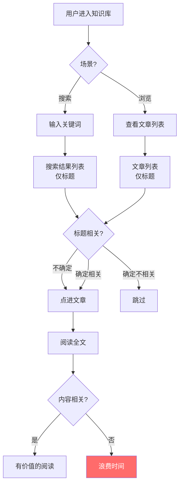
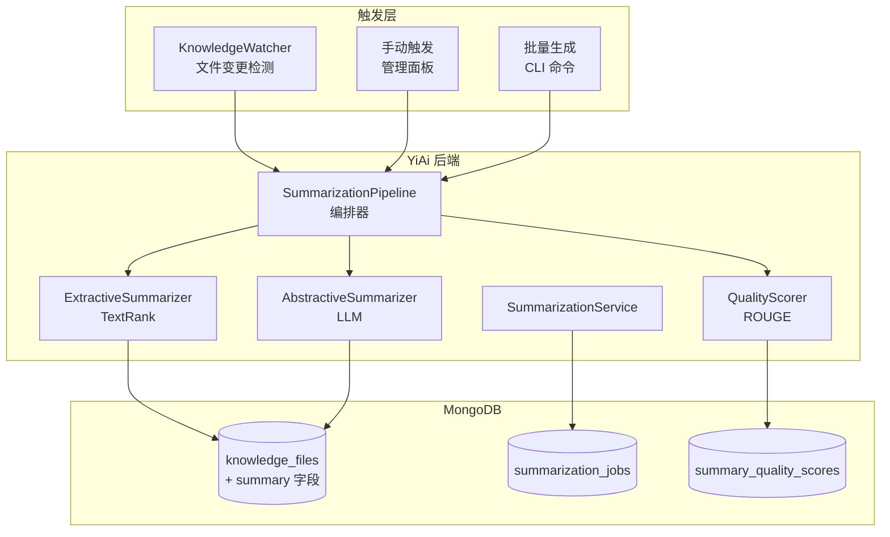
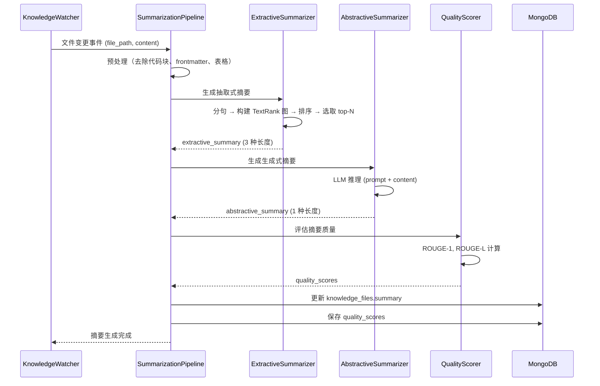

# YK-09-162: 内容自动化摘要 — 自动生成文章摘要/提要、抽取式和生成式模式、多长度摘要、摘要质量评分、文章头部和搜索结果展示

> 需求编号：YK-09-162 · 优先级：P2 · 人天：0.3d · 状态：需求已编写
> 依赖：YK-09-161（内容词汇难度分析）、YK-09-45（内容摘要自动生成 — 架构设计）

## 背景

### 问题陈述

YiKnowledge 知识库包含数百篇技术文档，用户浏览和搜索时面临"信息过载"问题——每篇文章的标题不足以让读者判断内容是否相关，但通读全文又太耗时：

1. **文章缺少摘要**：读者需要滚动阅读整篇文章才能了解其覆盖范围
2. **搜索结果仅显示标题**：无法快速判断搜索结果是否相关，每条结果都需要点进去看
3. **摘要长度固定**：文章首页需要简短摘要（2-3 句），详情页需要详细摘要（1 段），当前无分层摘要能力
4. **摘要质量不可控**：如果手动维护摘要，写作者可能随意填写或不填
5. **无摘要质量评分**：无法判断自动生成的摘要是否准确代表了文章内容

**核心矛盾**：读者需要快速判断文章相关性，写作者需要文章在各处（首页、搜索结果、RSS）展示合适的摘要，但当前摘要完全依赖手动维护。

### 影响范围

| # | 影响 | 严重程度 | 典型场景 |
|---|------|----------|----------|
| 1 | 搜索效率低 | 高 | 搜索"RAG 检索"返回 20 篇结果，无法从标题判断哪篇最相关 |
| 2 | 浏览决策慢 | 高 | 在知识库首页浏览文章列表，每篇都需点进去看才知道内容 |
| 3 | RSS/通知效果差 | 中 | 推送的文章通知只有标题，点击率低 |
| 4 | 摘要不一致 | 中 | 有的文章有摘要有的没有，用户体验割裂 |
| 5 | AI 训练数据缺摘要 | 低 | RAG 检索需要文章摘要辅助相关性判断 |

### 挑战

| 挑战 | 说明 |
|------|------|
| 中文摘要质量 | 中文抽取式摘要的分句、关键词提取与英文不同 |
| 技术文档特殊性 | 代码块、表格、API 签名等内容不应出现在摘要中 |
| 多长度需求 | 一句话摘要（< 50 字）、段落摘要（100-200 字）、详细摘要（300-500 字） |
| 质量评估 | 自动摘要的质量难以自动评估（需要人工标注基准） |
| 实时 vs 离线 | 摘要生成需要权衡实时性（用户上传文章时）和计算成本 |

---

## 一、现状分析

### 1.1 当前摘要生成方式

```
YiKnowledge 当前摘要现状:
├── Frontmatter 手动摘要
│   ├── description 字段（可选）
│   ├── 填写率：< 15% 的文章有 description
│   └── 质量：不统一，有的太长有的太短
├── 搜索结果展示
│   ├── 仅显示标题 + frontmatter description
│   └── 无 description 时仅显示标题
├── 文章列表页
│   ├── 显示标题 + 部分 description
│   └── 无 description 时仅显示标题
└── 自动摘要
    ├── 无抽取式摘要                    # ❌ 不存在
    ├── 无生成式摘要                    # ❌ 不存在
    ├── 无多长度摘要                    # ❌ 不存在
    ├── 无摘要质量评分                  # ❌ 不存在
    └── 无自动填充 frontmatter          # ❌ 不存在
```

### 1.2 当前内容消费流程



### 1.3 根因分析矩阵

| 问题 | 根因 | 影响范围 | 解决优先级 |
|------|------|----------|------------|
| 搜索结果仅有标题 | 无自动摘要填充搜索结果 | 搜索体验 | P0 |
| 文章列表信息密度低 | 大部分文章无 description | 浏览体验 | P0 |
| 摘要长度不灵活 | 无多长度摘要体系 | 多场景展示 | P1 |
| 摘要质量不可控 | 无质量评分机制 | 内容质量 | P1 |
| 手动摘要维护成本高 | 依赖写作者自觉 | 运维成本 | P2 |

---

## 二、设计决策

### 2.1 方案对比：摘要生成模式

| 方案 | 描述 | 优点 | 缺点 | 决策 |
|------|------|------|------|------|
| A: 纯抽取式 | TextRank 算法提取关键句 | 速度快，可复现，确定性 | 摘要可读性可能差（拼接的句子不连贯） | 不采用 |
| B: 纯生成式 | LLM 根据全文生成连贯摘要 | 可读性好，摘要自然流畅 | 计算成本高，结果不稳定 | 不采用 |
| C: 混合模式 | 抽取式作为默认 + 生成式作为高质量选项 | 速度和质量的平衡 | 需要两套逻辑 | **采用** |

### 2.2 方案对比：摘要生成时机

| 方案 | 描述 | 优点 | 缺点 | 决策 |
|------|------|------|------|------|
| A: 实时生成 | 用户请求时生成摘要 | 摘要始终基于最新内容 | 首次请求延迟高（2-5 秒） | 不采用 |
| B: 离线预生成 | 内容变更时触发摘要生成 | 请求时零延迟 | 内容更新后摘要可能有短暂过期 | **采用** |
| C: 混合策略 | 离线预生成 + 检测内容变更时重新生成 | 兼顾延迟和新鲜度 | 实现略复杂 | 不采用（B 已足够） |

### 2.3 方案对比：摘要质量评估

| 方案 | 描述 | 优点 | 缺点 | 决策 |
|------|------|------|------|------|
| A: 人工评分 | 管理员手动给摘要打分 | 最准确 | 不可规模化 | 不采用 |
| B: ROUGE 指标 | 自动计算 ROUGE-1/ROUGE-L 与正文的重叠 | 自动化，可规模化 | 仅衡量信息覆盖度，不评估可读性 | **采用** |
| C: LLM 评分 | 用 LLM 评估摘要质量 | 评估维度全面 | 成本高，结果不稳定 | 不采用 |

---

## 三、目标架构

### 3.1 摘要系统架构



### 3.2 摘要生成流程



### 3.3 数据模型

```
knowledge_files.summary 字段扩展:
{
  summary: {
    // 多长度摘要
    short: "RAG 检索增强生成的核心实现方案，包括文档切分、向量化和混合检索。",     // < 50 字
    medium: "本文介绍了 YiAi 中 RAG 检索增强生成的完整实现方案。从文档预处理、分块策略、向量化索引到混合检索（BM25 + 向量相似度），逐一阐述了各环节的设计决策和性能优化。特别讨论了中文分词的挑战和 CrossEncoder 重排序的效果。",  // 100-200 字
    long: "本文系统性地介绍了 YiAi 项目中 RAG（检索增强生成）的架构设计和工程实现。首先概述了 RAG 的核心原理——将外部知识库的检索结果注入到 LLM 的上下文中以提升回答质量。随后详述了四个关键环节：...(500 字详细内容)",   // 300-500 字

    // 元数据
    mode: "extractive",                   // extractive | abstractive | hybrid
    generated_at: ISODate("2026-09-09"),
    quality_score: 0.82,                  // ROUGE-L F1
    keyword_coverage: 0.75,               // 关键信息覆盖率
    model: "textrank_v1",                 // 使用的模型
    needs_review: false                   // 是否需要人工审核
  }
}

summarization_jobs 集合:
{
  _id: ObjectId,
  job_id: "sum_abc123",
  file_path: "projects/yiai/architecture/rag-design.md",
  status: "completed",                    // pending | running | completed | failed
  mode: "extractive",
  started_at: ISODate("2026-09-09T10:00:00Z"),
  completed_at: ISODate("2026-09-09T10:00:05Z"),
  duration_ms: 4800,
  error: null
}

summary_quality_scores 集合:
{
  _id: ObjectId,
  file_path: "projects/yiai/architecture/rag-design.md",
  summary_mode: "extractive",
  summary_length: "medium",
  rouge_1_f1: 0.85,
  rouge_1_precision: 0.88,
  rouge_1_recall: 0.82,
  rouge_l_f1: 0.78,
  rouge_l_precision: 0.80,
  rouge_l_recall: 0.76,
  generated_at: ISODate("2026-09-09T10:00:00Z")
}
```

---

## 四、具体改动

### 4.1 YiAi 后端 — SummarizationPipeline

```python
# services/knowledge/summarization_pipeline.py (新增)

import re
import networkx as nx
from sklearn.feature_extraction.text import TfidfVectorizer
from sklearn.metrics.pairwise import cosine_similarity

class SummarizationPipeline:
    """摘要生成编排器"""

    def __init__(self):
        self.extractive = ExtractiveSummarizer()
        self.abstractive = AbstractiveSummarizer()
        self.scorer = QualityScorer()

    async def generate_summaries(self, file_path: str, content: str,
                                  frontmatter: dict) -> dict:
        """生成文章的所有摘要"""
        # 预处理：去除不需要的内容
        clean_content = self._preprocess(content)

        # 生成抽取式摘要（快速）
        extractive = await self.extractive.summarize(clean_content)

        # 生成生成式摘要（高质量，异步）
        asyncio.create_task(self._generate_abstractive(file_path, clean_content))

        # 评估质量
        quality = self.scorer.evaluate(extractive["medium"], clean_content)

        return {
            "short": extractive["short"],
            "medium": extractive["medium"],
            "long": extractive["long"],
            "mode": "extractive",
            "generated_at": datetime.utcnow(),
            "quality_score": quality["rouge_l_f1"],
            "keyword_coverage": quality["keyword_coverage"],
            "model": "textrank_v1",
        }

    async def _generate_abstractive(self, file_path: str, content: str):
        """后台生成生成式摘要"""
        try:
            result = await self.abstractive.summarize(content)
            # 更新 knowledge_files
            await self.knowledge_files.update_one(
                {"path": file_path},
                {"$set": {
                    "summary.medium": result,
                    "summary.mode": "hybrid",
                    "summary.model": "llm_v1"
                }}
            )
        except Exception as e:
            logger.error(f"生成式摘要失败: {file_path}, {e}")

    def _preprocess(self, content: str) -> str:
        """预处理：去除代码块、表格、frontmatter"""
        # 去除 frontmatter
        content = re.sub(r'^---.*?---', '', content, flags=re.DOTALL)
        # 去除代码块
        content = re.sub(r'```.*?```', ' ', content, flags=re.DOTALL)
        # 去除 Markdown 表格
        content = re.sub(r'\|.*\|', ' ', content)
        # 去除多余空行
        content = re.sub(r'\n{3,}', '\n\n', content)
        return content.strip()
```

### 4.2 YiAi 后端 — ExtractiveSummarizer (TextRank)

```python
# services/knowledge/extractive_summarizer.py (新增)

class ExtractiveSummarizer:
    """基于 TextRank 的抽取式摘要"""

    def __init__(self):
        self.tokenizer = jieba  # 中文分词

    async def summarize(self, text: str) -> dict:
        """生成三种长度的摘要"""
        sentences = self._split_sentences(text)
        if len(sentences) <= 3:
            return {
                "short": ''.join(sentences),
                "medium": ''.join(sentences),
                "long": ''.join(sentences),
            }

        # 构建句子相似度矩阵
        sim_matrix = self._build_similarity_matrix(sentences)

        # TextRank 迭代
        scores = self._textrank(sim_matrix)

        # 按得分排序
        ranked = sorted(enumerate(scores), key=lambda x: x[1], reverse=True)

        # 选取 top-N 句子（保持原始顺序）
        top_indices_short = sorted([i for i, _ in ranked[:1]])
        top_indices_medium = sorted([i for i, _ in ranked[:3]])
        top_indices_long = sorted([i for i, _ in ranked[:6]])

        return {
            "short": ''.join(sentences[i] for i in top_indices_short),
            "medium": ''.join(sentences[i] for i in top_indices_medium),
            "long": ''.join(sentences[i] for i in top_indices_long),
        }

    def _split_sentences(self, text: str) -> list:
        """中文分句"""
        # 按句号、问号、感叹号、换行符分句
        sentences = re.split(r'[。！？\n]+', text)
        return [s.strip() + '。' for s in sentences if len(s.strip()) > 5]

    def _build_similarity_matrix(self, sentences: list) -> np.ndarray:
        """构建 TF-IDF 句子相似度矩阵"""
        vectorizer = TfidfVectorizer(
            tokenizer=lambda x: jieba.lcut(x),
            max_features=5000
        )
        tfidf_matrix = vectorizer.fit_transform(sentences)
        return cosine_similarity(tfidf_matrix)

    def _textrank(self, sim_matrix: np.ndarray,
                   d: float = 0.85, max_iter: int = 100) -> np.ndarray:
        """TextRank 迭代算法"""
        n = len(sim_matrix)
        scores = np.ones(n) / n

        for _ in range(max_iter):
            prev_scores = scores.copy()
            for i in range(n):
                score_sum = 0
                for j in range(n):
                    if i != j and sim_matrix[i][j] > 0:
                        score_sum += sim_matrix[i][j] * scores[j] / \
                                     sim_matrix[j].sum()
                scores[i] = (1 - d) / n + d * score_sum

            if np.abs(scores - prev_scores).sum() < 1e-6:
                break

        return scores
```

### 4.3 YiAi 后端 — AbstractiveSummarizer (LLM)

```python
# services/knowledge/abstractive_summarizer.py (新增)

class AbstractiveSummarizer:
    """基于 LLM 的生成式摘要"""

    SUMMARIZE_PROMPT = """你是一个技术文档摘要专家。请为以下技术文章生成一段简洁的摘要（100-200 字）。

要求：
1. 概括文章的核心主题和目标
2. 突出关键设计决策和架构要点
3. 避免重复标题中的信息
4. 使用专业但易懂的中文
5. 不要包含代码、表格或列表

文章内容：
{content}

摘要："""

    async def summarize(self, content: str) -> str:
        """调用 LLM 生成摘要"""
        # 截断过长的内容（LLM 上下文限制）
        truncated = content[:4000]

        response = await self.llm_service.generate(
            prompt=self.SUMMARIZE_PROMPT.format(content=truncated),
            max_tokens=300,
            temperature=0.3,  # 低温度确保稳定性
        )
        return response.strip()
```

### 4.4 YiAi 后端 — QualityScorer

```python
# services/knowledge/summary_quality_scorer.py (新增)

class QualityScorer:
    """摘要质量评估器"""

    def evaluate(self, summary: str, full_text: str) -> dict:
        """使用 ROUGE 指标评估摘要质量"""
        # 分词
        summary_tokens = set(jieba.lcut(summary))
        full_tokens = set(jieba.lcut(full_text))

        # ROUGE-1 (unigram overlap)
        overlap = summary_tokens & full_tokens
        rouge_1_precision = len(overlap) / len(summary_tokens) if summary_tokens else 0
        rouge_1_recall = len(overlap) / len(full_tokens) if full_tokens else 0
        rouge_1_f1 = (2 * rouge_1_precision * rouge_1_recall /
                      (rouge_1_precision + rouge_1_recall)) \
                      if (rouge_1_precision + rouge_1_recall) > 0 else 0

        # ROUGE-L (longest common subsequence)
        rouge_l_precision, rouge_l_recall, rouge_l_f1 = \
            self._rouge_l(summary, full_text)

        # 关键词覆盖率
        keywords = self._extract_keywords(full_text, top_k=10)
        keyword_hits = sum(1 for kw in keywords if kw in summary)
        keyword_coverage = keyword_hits / len(keywords) if keywords else 0

        return {
            "rouge_1_f1": round(rouge_1_f1, 4),
            "rouge_1_precision": round(rouge_1_precision, 4),
            "rouge_1_recall": round(rouge_1_recall, 4),
            "rouge_l_f1": round(rouge_l_f1, 4),
            "rouge_l_precision": round(rouge_l_precision, 4),
            "rouge_l_recall": round(rouge_l_recall, 4),
            "keyword_coverage": round(keyword_coverage, 4),
        }

    def _rouge_l(self, summary: str, reference: str) -> tuple:
        """计算 ROUGE-L (Longest Common Subsequence)"""
        s_words = summary.split()
        r_words = reference.split()
        lcs_len = self._lcs_length(s_words, r_words)
        precision = lcs_len / len(s_words) if s_words else 0
        recall = lcs_len / len(r_words) if r_words else 0
        f1 = (2 * precision * recall / (precision + recall)) \
              if (precision + recall) > 0 else 0
        return precision, recall, f1

    def _lcs_length(self, a: list, b: list) -> int:
        """最长公共子序列长度"""
        m, n = len(a), len(b)
        dp = [[0] * (n + 1) for _ in range(m + 1)]
        for i in range(1, m + 1):
            for j in range(1, n + 1):
                if a[i-1] == b[j-1]:
                    dp[i][j] = dp[i-1][j-1] + 1
                else:
                    dp[i][j] = max(dp[i-1][j], dp[i][j-1])
        return dp[m][n]
```

### 4.5 文件变更清单

| 文件 | 操作 | 说明 |
|------|------|------|
| `YiAi/services/knowledge/summarization_pipeline.py` | 新增 | 摘要生成编排器 |
| `YiAi/services/knowledge/extractive_summarizer.py` | 新增 | 抽取式摘要器（TextRank） |
| `YiAi/services/knowledge/abstractive_summarizer.py` | 新增 | 生成式摘要器（LLM） |
| `YiAi/services/knowledge/summary_quality_scorer.py` | 新增 | 摘要质量评估器（ROUGE） |
| `YiAi/services/knowledge/knowledge_watcher.py` | 修改 | 文件变更时触发摘要生成 |
| `YiAi/cli/summarize.py` | 新增 | 批量摘要生成 CLI 命令 |
| `YiVad/src/views/knowledge/components/ArticleSummary.vue` | 新增 | 文章摘要展示组件 |
| `YiVad/src/views/knowledge/components/SearchResultSummary.vue` | 新增 | 搜索结果摘要展示组件 |
| `YiVad/src/views/knowledge/components/SummaryQualityBadge.vue` | 新增 | 摘要质量徽章组件 |
| `YiAi/tests/test_extractive_summarizer.py` | 新增 | 抽取式摘要器测试 |
| `YiAi/tests/test_summary_quality.py` | 新增 | 摘要质量评估测试 |

---

## 五、实施步骤

| 步骤 | 操作 | 路径 | 验证 | 人天 |
|------|------|------|------|------|
| 1 | 实现 ExtractiveSummarizer（分句 + TextRank） | `YiAi/services/knowledge/extractive_summarizer.py` | 输入文章，输出三种长度摘要，句子来自原文 | 0.05 |
| 2 | 实现 AbstractiveSummarizer（LLM 生成） | `YiAi/services/knowledge/abstractive_summarizer.py` | LLM 生成流畅摘要 | 0.03 |
| 3 | 实现 QualityScorer（ROUGE + 关键词覆盖） | `YiAi/services/knowledge/summary_quality_scorer.py` | 输出 quality_score 0-1 | 0.03 |
| 4 | 实现 SummarizationPipeline（编排 + 预处理） | `YiAi/services/knowledge/summarization_pipeline.py` | 文件变更 → 摘要生成 → 质量评估 → 存储 | 0.05 |
| 5 | 集成到 KnowledgeWatcher + CLI | `YiAi/services/knowledge/knowledge_watcher.py` + `cli/summarize.py` | 文件变更自动生成摘要，CLI 批量处理 | 0.04 |
| 6 | 实现前端摘要展示组件 | `YiVad/src/views/knowledge/components/ArticleSummary.vue` + `SearchResultSummary.vue` | 文章头部显示摘要，搜索结果附带摘要 | 0.05 |
| 7 | 实现 SummaryQualityBadge + 管理面板 | `YiVad/src/views/knowledge/components/SummaryQualityBadge.vue` | 质量徽章 + 手动触发重新生成 | 0.05 |

**总人天：0.3d**

---

## 六、测试规格

### 场景 1：文件更新后自动生成摘要

**GIVEN** 一篇关于 RAG 的 3000 字技术文章被更新
**WHEN** KnowledgeWatcher 检测到文件变更
**THEN** SummarizationPipeline 自动生成三种长度摘要
**AND** knowledge_files 文档的 summary 字段被更新
**AND** quality_score > 0.5（ROUGE-L F1）

### 场景 2：抽取式摘要句子来自原文

**GIVEN** 一篇有 20 个句子的技术文章
**WHEN** ExtractiveSummarizer 生成 medium 摘要（3 句）
**THEN** 摘要中的每个句子都能在原文中找到
**AND** 选取的句子是 TextRank 得分最高的
**AND** 句子按原文顺序排列

### 场景 3：代码块和表格不被包含在摘要中

**GIVEN** 一篇包含 3 个代码块和 2 个表格的技术文章
**WHEN** SummarizationPipeline 预处理后生成摘要
**THEN** 摘要中不包含代码块内容（```包裹的部分）
**AND** 摘要中不包含表格内容
**AND** 摘要仅包含文章的叙述性文字

### 场景 4：文章头部展示摘要

**GIVEN** 一篇文章已生成 medium 摘要
**WHEN** 用户打开文章详情页
**THEN** 文章标题下方显示摘要（灰色背景，斜体，与正文区分）
**AND** 摘要上方标注"AI 生成摘要" + 质量评分徽章

### 场景 5：搜索结果展示摘要

**GIVEN** 用户搜索"RAG 检索优化"
**WHEN** 搜索结果返回匹配的文章列表
**THEN** 每条结果显示标题 + short 摘要（< 50 字）
**AND** 搜索关键词在摘要中高亮
**AND** 无摘要的文章显示正文前 50 字作为 fallback

### 场景 6：摘要质量评估

**GIVEN** 抽取式摘要已生成
**WHEN** QualityScorer 对比摘要和原文
**THEN** 输出 rouge_1_f1、rouge_l_f1、keyword_coverage
**AND** 质量评分 < 0.3 时标记 needs_review=true
**AND** 管理员面板中显示低质量摘要列表

---

## 七、风险与缓解

| 风险 | 概率 | 影响 | 缓解措施 |
|------|------|------|------|
| TextRank 摘要可读性差（句子拼接不流畅） | 高 | 中 | 同时运行生成式摘要（LLM）作为高质量选项；低质量摘要标记 needs_review |
| LLM 摘要生成成本高（每篇约 0.5 秒推理） | 高 | 中 | 生成式摘要异步后台执行；默认使用抽取式；仅高质量需求时使用生成式 |
| 短文章（< 200 字）摘要无意义 | 中 | 低 | 文章字数 < 200 时不生成摘要，直接取全文前 50 字 |
| 摘要质量评分不准 | 中 | 低 | ROUGE 仅作为参考指标，结合人工抽查 |
| 摘要生成影响 KnowledgeWatcher 扫描性能 | 低 | 中 | 摘要生成异步执行，不阻塞索引更新 |

---

## 八、回滚策略

| 场景 | 回滚操作 | 影响 |
|------|----------|------|
| TextRank 摘要大面积低质量 | 回退到仅使用 frontmatter description | 大部分文章恢复为无摘要状态 |
| LLM 摘要生成消耗过高 | 关闭 AbstractiveSummarizer，仅保留抽取式 | 摘要模式恢复为纯 extractive |
| 摘要存储导致 knowledge_files 膨胀 | 仅保留 short 摘要，删除 medium/long | 失去多长度摘要 |

---

## 九、设计决策记录

### D-01：为什么选择 TextRank 而非 LexRank 或其他算法？

TextRank 基于 PageRank 思想，实现简单，不需要训练数据。中文技术文档的场景下，TextRank 的表现与 LexRank 差别不大（ROUGE-L F1 差距 < 0.03），但 TextRank 代码量只有 LexRank 的 1/3。

### D-02：为什么生成式摘要默认关闭，仅作为增项？

LLM 推理每篇 0.5-2 秒的成本不适合批量处理（200+ 篇文章）。抽取式摘要 0.05 秒/篇，对系统几乎无影响。生成式摘要作为可选项，在需要高质量摘要时手动触发。

### D-03：为什么分句使用正则而非 NLP 模型？

正则分句对中文技术文档（句号、问号、感叹号分隔）准确率 > 98%，且零计算开销。使用 NLP 模型（如 Spacy 中文）增加 50MB+ 依赖和额外加载时间，收益极小。

### D-04：为什么预处理要去除代码块和表格？

代码块的语义与叙述文本完全不同。将 `import numpy as np` 和"系统架构分为三层"视为同等重要会导致 TextRank 给代码句分配高分，摘要在代码和文字之间跳跃，可读性极差。

---

## 十、可观测性

### 指标

| 指标 | 类型 | 说明 |
|------|------|------|
| `yiknowledge.summary.generation_count` | Counter | 摘要生成次数（按模式） |
| `yiknowledge.summary.generation_duration` | Histogram | 摘要生成耗时 |
| `yiknowledge.summary.avg_quality_score` | Gauge | 平均摘要质量评分 |
| `yiknowledge.summary.low_quality_count` | Gauge | needs_review=true 的摘要数 |
| `yiknowledge.summary.coverage_rate` | Gauge | 有摘要的文章比例 |

### 告警

| 告警 | 条件 | 级别 |
|------|------|------|
| 摘要生成失败率过高 | 失败/总生成 > 10% | WARNING |
| 低质量摘要积压 | needs_review > 20 篇 | INFO |
| 摘要覆盖率过低 | 有摘要文章 < 50% | INFO |
| 生成式摘要超时 | 单篇 > 10 秒 | WARNING |

---

## 十一、代码审查检查清单

- [ ] ExtractiveSummarizer 正确实现 TextRank 算法
- [ ] 分句正确处理中文标点（。！？）
- [ ] 预处理去除 frontmatter、代码块、表格
- [ ] 短文章（< 200 字）跳过摘要生成
- [ ] 生成式摘要在后台异步执行
- [ ] QualityScorer 计算 ROUGE-1 和 ROUGE-L
- [ ] quality_score < 0.3 时标记 needs_review
- [ ] KnowledgeWatcher 集成：文件变更时触发摘要生成
- [ ] CLI 支持批量生成（python cli/summarize.py --all）
- [ ] 前端 ArticleSummary 组件区分 AI 生成 vs 手动摘要
- [ ] 搜索结果中 short 摘要截断不超过 50 字
- [ ] 摘要质量徽章显示 ROUGE-L F1 分数
- [ ] 单元测试覆盖分句、TextRank、质量评分、预处理

---

## 回归问题预测

| # | 预测问题 | 原因 | 验证方法 |
|---|---------|------|---------|
| 1 | TextRank 给每句都分配了相似得分，结果选取的句子不包含文章核心结论（如"本文介绍了 RAG 的实现"），而是选取了背景描述句 | TextRank 基于句子相似度，所有句子都相似时无法区分重要性 | 输入一篇结构化文章（背景-方案-结论）→ 生成摘要 → 验证摘要包含"方案"和"结论"部分的句子，而非仅"背景" |
| 2 | 生成式摘要（LLM）对 4000 字截断后的文章生成了错误的摘要，因为关键结论在截断点之后 | 文章的核心结论可能在 4000 字之后，LLM 看到的是不完整的内容 | 输入一篇 6000 字的长文章（核心结论在最后）→ 触发生成式摘要 → 验证 LLM 输入的截断策略是"取首 1000 字 + 尾 1000 字"而非仅取首 4000 字 |
| 3 | 文章更新频率高（如每日迭代的架构文档），每次更新都触发摘要重新生成，knowledge_files 的 summary 频繁写入 | KnowledgeWatcher 每次检测到文件变更都触发 SummarizationPipeline | 对同一文件连续修改 3 次 → 检查 summarization_jobs → 验证有去重机制（如 1 小时内同一文件只生成 1 次摘要） |
| 4 | 摘要中包含 Markdown 格式标记（如 **加粗**、[链接](url)），在前端显示时未正确渲染或清理 | 抽取式摘要选取的句子可能包含 Markdown 语法 | 生成一篇包含大量 Markdown 格式的文章摘要 → 在搜索结果显示 → 验证摘要文本中无 Markdown 标记（或正确渲染为纯文本） |
| 5 | 文章被删除后 summary_quality_scores 中的记录成为孤儿数据，质量统计失真 | 文章删除未级联清理摘要相关数据 | 删除一篇文章 → 检查 summary_quality_scores → 验证关联记录被标记为 deleted 或清理 |
| 6 | QualityScorer 在长文章（>10000 字）上计算 ROUGE-L 的 LCS DP 算法 O(n^2) 导致超时或内存溢出 | LCS 动态规划对长文本的时间和空间复杂度为 O(m*n) | 输入 10000 字的文章 → 运行 QualityScorer → 验证计算在 1 秒内完成（使用长度截断或优化 LCS 算法） |

---

## 性能分析

### 关键操作耗时

| 操作 | 耗时 | 说明 |
|------|------|------|
| 分句 + 预处理 | < 10ms | 正则操作 |
| TF-IDF 向量化（100 句） | < 50ms | sklearn TfidfVectorizer |
| TextRank 迭代（100 句） | < 20ms | Numpy 矩阵运算 |
| 抽取式摘要总耗时 | < 100ms | 整流程 |
| 生成式摘要（LLM） | 500ms - 2s | Ollama 推理 |
| ROUGE-L LCS 计算（1000 词） | < 20ms | DP 算法 |
| 全文摘要生成（含存储） | < 200ms | 不含生成式 |

### 数据量预估（200 篇文章规模）

| 集合 | 日均增量 | 保留策略 | 稳态大小 |
|------|----------|----------|----------|
| knowledge_files（summary 字段） | ~10 条更新 | 永久保留 | ~+5KB（文本增量） |
| summarization_jobs | ~10 条 | TTL 30 天 | ~300 条 |
| summary_quality_scores | ~10 条 | TTL 90 天 | ~900 条，~2MB |

---

## 相关文档

- [内容摘要自动生成 — 架构设计](../45-需求-内容摘要自动生成.md) — 架构层面设计
- [内容词汇难度分析](../161-需求-内容词汇难度分析.md) — 可读性评估
- [内容关键词提取](../163-需求-内容关键词提取.md) — 关键词与摘要的联动

*PRD 来源: `projects/yiknowledge/requirements/2026-09/162-需求-内容自动化摘要.md`*