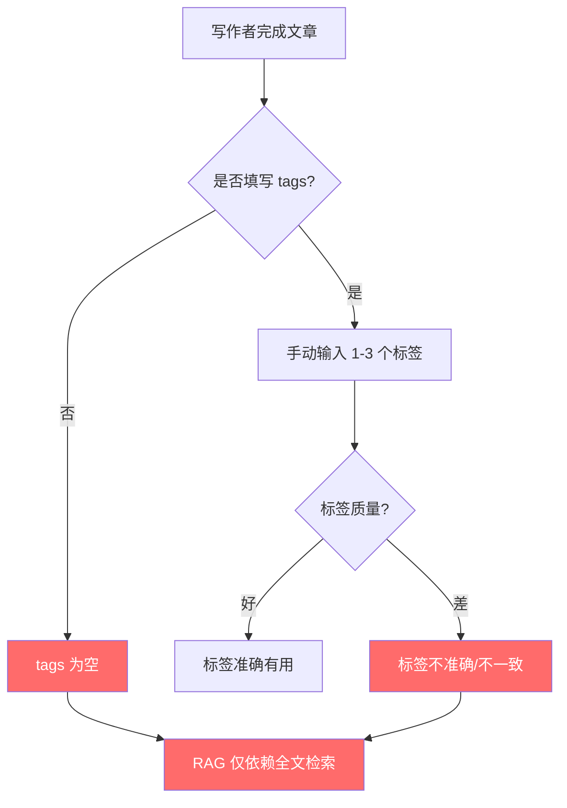
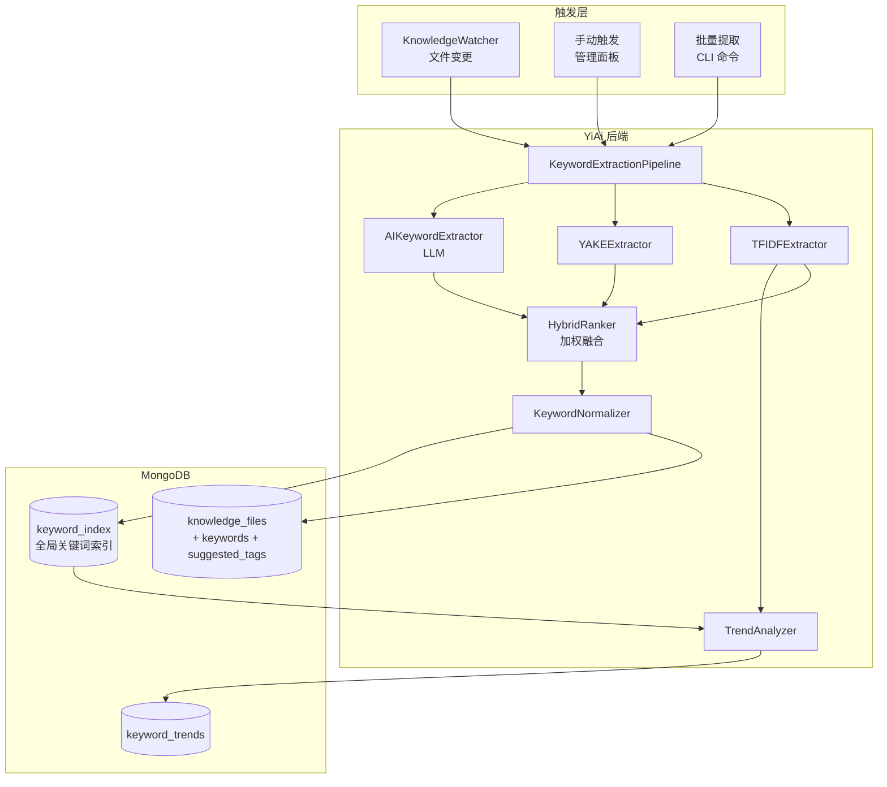
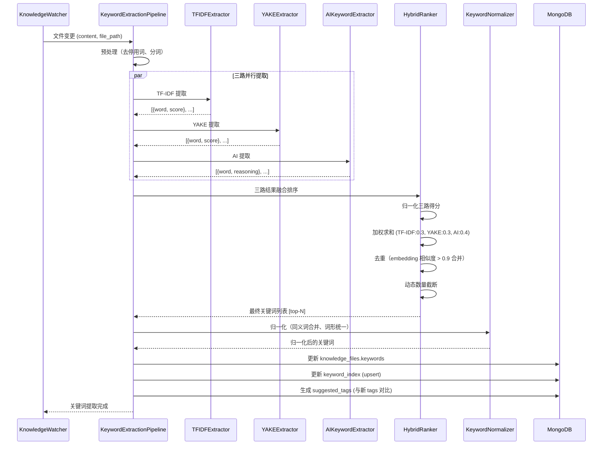

# YK-09-163: 内容关键词提取 — TF-IDF + YAKE + AI 混合关键词提取、关键词排名、建议 Frontmatter 关键词、关键词趋势分析

> 需求编号：YK-09-163 · 优先级：P2 · 人天：0.3d · 状态：需求已编写
> 依赖：YK-09-162（内容自动化摘要）、YK-09-21（标签体系治理）

## 背景

### 问题陈述

YiKnowledge 知识库中每篇文章的 frontmatter 包含 tags 字段用于分类和检索，但当前 tags 完全依赖写作者手动填写，存在严重的一致性和覆盖面问题：

1. **标签缺失**：超过 60% 的文章 tags 字段为空或仅有 1-2 个通用标签（如"架构"、"设计"）
2. **标签不一致**：同一概念使用不同表述（"RAG检索" / "RAG检索增强" / "检索增强生成"）
3. **标签不准确**：手动填写的标签可能遗漏关键主题或包含无关标签
4. **无标签建议**：写作者完成文章后不知道应添加哪些标签
5. **无关键词趋势**：无法了解整个知识库的主题分布和变化趋势

**核心矛盾**：手工标签维护质量低、覆盖不全，但 tags 是 RAG 检索和知识分类的核心依赖。需要自动化关键词提取来补充人工标签，同时保持人工审核的最终决定权。

### 影响范围

| # | 影响 | 严重程度 | 典型场景 |
|---|------|----------|----------|
| 1 | RAG 检索召回率低 | 高 | 用户搜索"向量检索"时未召回标签为"embedding检索"的文章 |
| 2 | 知识分类混乱 | 高 | 标签不一致导致同一主题文章分散在不同分类下 |
| 3 | 写作者标签负担重 | 中 | 写完 3000 字文章后还要想 5-10 个标签 |
| 4 | 无法了解知识结构 | 中 | 管理者不知道知识库中哪些主题文章最多 |
| 5 | 标签过时 | 低 | 文章更新后标签未同步更新 |

### 挑战

| 挑战 | 说明 |
|------|------|
| 中文关键词提取 | 中文无天然词边界，分词质量直接影响关键词质量 |
| 技术术语识别 | "RAG"、"BM25"、"HNSW"等英文术语在中文文章中的提取 |
| 多算法融合 | TF-IDF、YAKE、AI 三种算法的结果需要合理融合排序 |
| 去重与归一化 | "RAG检索" 和 "检索增强生成" 是同一概念的不同表述 |
| 趋势分析时效性 | 新文章不断加入，关键词趋势需要实时更新 |

---

## 一、现状分析

### 1.1 当前关键词管理方式

```
YiKnowledge 当前关键词现状:
├── Frontmatter tags（手动）
│   ├── 填写率：40% 的文章有 tags
│   ├── 平均标签数：1.8 个/篇
│   └── 问题：不一致、不完整、不准确
├── RAG 索引
│   ├── 全文中分词 + 向量化
│   └── 不依赖 tags，但 tags 可提升检索权重
├── 分类导航
│   ├── 基于目录结构（role/problem-domain/）
│   └── tags 作为辅助分类
└── 自动关键词提取
    ├── 无 TF-IDF 关键词提取             # ❌ 不存在
    ├── 无 YAKE 关键词提取               # ❌ 不存在
    ├── 无 AI 关键词提取                 # ❌ 不存在
    ├── 无 keywors 混合排序              # ❌ 不存在
    ├── 无 frontmatter 标签建议          # ❌ 不存在
    └── 无关键词趋势分析                 # ❌ 不存在
```

### 1.2 当前标签填写流程



### 1.3 根因分析矩阵

| 问题 | 根因 | 影响范围 | 解决优先级 |
|------|------|----------|------------|
| 标签缺失率高 | 无自动标签建议，手动成本高 | RAG 检索召回 | P0 |
| 标签不一致 | 无标签规范 + 同义词归一化 | 知识分类 | P0 |
| 标签不完整 | 写作者无法全盘考虑文章的所有主题 | 检索覆盖面 | P1 |
| 无主题趋势 | 无聚合分析 | 知识管理决策 | P1 |
| 标签过时 | 文章更新后标签无自动刷新 | 检索准确性 | P2 |

---

## 二、设计决策

### 2.1 方案对比：关键词提取算法

| 方案 | 描述 | 优点 | 缺点 | 决策 |
|------|------|------|------|------|
| A: 纯 TF-IDF | 计算词频-逆文档频率，选 top-K | 实现简单，可解释性强 | 仅依赖词频，忽略语义和词位置 | 不单独使用 |
| B: 纯 YAKE | 基于统计特征的无监督关键词提取 | 不依赖外部语料，支持多语言 | 中文分词依赖，技术术语识别弱 | 不单独使用 |
| C: 纯 AI（LLM） | 用 LLM 从文章中提取关键词 | 语义理解好，结果自然 | 成本高，结果不稳定 | 不单独使用 |
| D: 混合排序 | TF-IDF + YAKE + AI 三路提取，加权融合排序 | 各取所长，覆盖全面 | 实现复杂度较高 | **采用** |

### 2.2 方案对比：关键词归一化

| 方案 | 描述 | 优点 | 缺点 | 决策 |
|------|------|------|------|------|
| A: 不做归一化 | 原样输出提取结果 | 零实现成本 | 同义标签不合并 | 不采用 |
| B: 规则归一化 | 人工维护同义词映射表 | 精确可控 | 维护成本高，无法覆盖所有同义词 | 不采用 |
| C: 向量相似度归一化 | 使用 embedding 计算相似度，合并高相似度关键词 | 自动发现同义词 | 可能错误合并不同概念 | **采用** |

### 2.3 方案对比：关键词数量策略

| 方案 | 描述 | 优点 | 缺点 | 决策 |
|------|------|------|------|------|
| A: 固定数量 | 每篇固定提取 5 或 10 个关键词 | 简单 | 长文关键词不足，短文关键词冗余 | 不采用 |
| B: 动态数量 | 根据文章长度动态调整（每 500 字 1 个关键词，最少 3 最多 15） | 适配不同长度 | 阈值需要调优 | **采用** |
| C: 置信度阈值 | 仅提取置信度 > 阈值的词 | 质量可控 | 短文可能提取不到关键词 | 不采用 |

---

## 三、目标架构

### 3.1 关键词提取系统架构



### 3.2 混合关键词提取流程



### 3.3 数据模型

```
knowledge_files 扩展字段:
{
  keywords: {
    extracted: [
      {
        word: "RAG检索",
        score: 0.92,
        sources: ["tfidf", "yake", "ai"],     // 来源算法
        tfidf_score: 0.08,
        yake_score: 0.15,
        ai_score: 0.90,
        is_technical_term: true,               // 是否为技术术语
        frequency: 12,                          // 文中出现次数
      },
      {
        word: "混合检索",
        score: 0.85,
        sources: ["tfidf", "yake"],
        tfidf_score: 0.12,
        yake_score: 0.18,
        ai_score: null,
        is_technical_term: true,
        frequency: 8,
      }
    ],
    suggested_tags: ["RAG", "混合检索", "BM25", "向量检索", "重排序"],  // 建议添加到 frontmatter 的标签
    missing_tags: ["BM25", "重排序"],            // 当前 tags 中缺少的建议标签
    extracted_at: ISODate("2026-09-09T10:00:00Z"),
    extraction_mode: "hybrid"                    // hybrid | tfidf_only | yake_only | ai_only
  }
}

keyword_index 集合（全局关键词索引）:
{
  _id: ObjectId,
  word: "RAG检索",
  normalized_form: "RAG检索",
  aliases: ["检索增强生成", "RAG retrieval"],
  document_count: 25,                          // 包含此关键词的文档数
  total_frequency: 320,                        // 在所有文档中的总出现次数
  first_seen: ISODate("2026-01-15"),
  last_seen: ISODate("2026-09-09"),
  trend: "rising",                             // rising | stable | declining
  category: "AI/检索",                          // 关键词分类
  related_keywords: ["向量检索", "BM25", "语义搜索"],
  embedding: [0.12, -0.34, ...]               // 768 维向量（用于相似度计算）
}

keyword_trends 集合:
{
  _id: ObjectId,
  period: "2026-09",                           // 月度
  word: "RAG检索",
  document_count: 5,                           // 当月新增包含此词的文档数
  total_document_count: 25,                    // 累计文档数
  growth_rate: 0.25,                           // 环比增长率
  hotness_score: 0.72,                         // 热度评分（综合新增量 + 增长率）
  generated_at: ISODate("2026-09-01T00:00:00Z")
}
```

---

## 四、具体改动

### 4.1 YiAi 后端 — TFIDFExtractor

```python
# services/knowledge/tfidf_extractor.py (新增)

class TFIDFExtractor:
    """基于 TF-IDF 的关键词提取器"""

    def __init__(self):
        self.stopwords = self._load_stopwords()

    async def extract(self, text: str, top_k: int = 15) -> list:
        """提取 TF-IDF 关键词"""
        # 分词 + 去停用词
        words = [w for w in jieba.lcut(text)
                 if w.strip() and w not in self.stopwords and len(w) > 1]

        # 计算词频
        word_freq = Counter(words)
        total_words = len(words)

        # 计算 TF-IDF（使用全局 IDF）
        results = []
        for word, freq in word_freq.most_common(100):
            tf = freq / total_words
            idf = await self._get_idf(word)
            tfidf = tf * idf
            results.append({
                "word": word,
                "tfidf_score": round(tfidf, 6),
                "frequency": freq,
                "is_technical_term": self._is_technical_term(word)
            })

        # 归一化得分
        results = self._normalize_scores(results, "tfidf_score")
        return sorted(results, key=lambda x: x["tfidf_score"], reverse=True)[:top_k]

    async def _get_idf(self, word: str) -> float:
        """获取全局 IDF（从 keyword_index 集合）"""
        total_docs = await self.knowledge_files.count_documents({})
        doc_with_word = await self.keyword_index.find_one({"word": word})
        doc_count = doc_with_word["document_count"] if doc_with_word else 1
        return math.log((total_docs + 1) / (doc_count + 1)) + 1
```

### 4.2 YiAi 后端 — YAKEExtractor

```python
# services/knowledge/yake_extractor.py (新增)

import yake

class YAKEExtractor:
    """基于 YAKE 的关键词提取器"""

    def __init__(self):
        # YAKE 中文配置
        self.extractor = yake.KeywordExtractor(
            lan="zh",
            n=3,                    # n-gram 最大长度
            dedupLim=0.9,           # 去重阈值
            top=20,                 # 返回数量
            features=None
        )

    async def extract(self, text: str, top_k: int = 15) -> list:
        """提取 YAKE 关键词"""
        keywords = self.extractor.extract_keywords(text)

        results = []
        for word, score in keywords[:top_k]:
            # YAKE 得分越低越好，转换为越高越好
            normalized_score = 1.0 / (1.0 + score)

            results.append({
                "word": word,
                "yake_score": round(normalized_score, 6),
                "raw_yake_score": round(score, 6),
                "is_technical_term": self._is_technical_term(word)
            })

        return self._normalize_scores(results, "yake_score")
```

### 4.3 YiAi 后端 — HybridRanker

```python
# services/knowledge/hybrid_ranker.py (新增)

class HybridRanker:
    """混合关键词排序器"""

    # 权重配置（可调整）
    WEIGHTS = {
        "tfidf": 0.30,
        "yake": 0.30,
        "ai": 0.40,
    }

    # 技术术语加分
    TECHNICAL_TERM_BONUS = 0.15

    async def rank(self, tfidf_results: list, yake_results: list,
                    ai_results: list, content_length: int) -> list:
        """融合三路提取结果"""
        merged = {}  # word -> merged data

        # 合并 TF-IDF 结果
        for item in tfidf_results:
            word = item["word"]
            merged[word] = {
                "word": word,
                "tfidf_score": item.get("tfidf_score", 0),
                "yake_score": 0,
                "ai_score": 0,
                "sources": ["tfidf"],
                "frequency": item.get("frequency", 0),
                "is_technical_term": item.get("is_technical_term", False),
            }

        # 合并 YAKE 结果
        for item in yake_results:
            word = item["word"]
            if word in merged:
                merged[word]["yake_score"] = item.get("yake_score", 0)
                merged[word]["sources"].append("yake")
            else:
                merged[word] = {
                    "word": word,
                    "tfidf_score": 0,
                    "yake_score": item.get("yake_score", 0),
                    "ai_score": 0,
                    "sources": ["yake"],
                    "frequency": 1,
                    "is_technical_term": item.get("is_technical_term", False),
                }

        # 合并 AI 结果
        for item in ai_results:
            word = item["word"]
            if word in merged:
                merged[word]["ai_score"] = item.get("ai_score", 0)
                merged[word]["sources"].append("ai")
            else:
                merged[word] = {
                    "word": word,
                    "tfidf_score": 0,
                    "yake_score": 0,
                    "ai_score": item.get("ai_score", 0),
                    "sources": ["ai"],
                    "frequency": 1,
                    "is_technical_term": False,
                }

        # 计算加权总分
        results = []
        for word, data in merged.items():
            weighted = (
                data["tfidf_score"] * self.WEIGHTS["tfidf"] +
                data["yake_score"] * self.WEIGHTS["yake"] +
                data["ai_score"] * self.WEIGHTS["ai"]
            )
            # 技术术语加分
            if data["is_technical_term"]:
                weighted += self.TECHNICAL_TERM_BONUS
            # 多源共识加分
            weighted += len(data["sources"]) * 0.05

            data["score"] = min(round(weighted, 4), 1.0)
            results.append(data)

        # 动态数量：每 500 字 1 个关键词，最少 3 最多 15
        target_count = max(3, min(15, content_length // 500))
        results.sort(key=lambda x: x["score"], reverse=True)
        return results[:target_count]
```

### 4.4 YiAi 后端 — TrendAnalyzer

```python
# services/knowledge/keyword_trend_analyzer.py (新增)

class TrendAnalyzer:
    """关键词趋势分析器"""

    async def analyze_trends(self, period: str = None) -> list:
        """分析关键词趋势（按月）"""
        if not period:
            period = datetime.utcnow().strftime("%Y-%m")

        # 当前月新增文档中的关键词
        current_docs = await self.knowledge_files.find({
            "created_at": {
                "$gte": f"{period}-01",
                "$lt": f"{self._next_month(period)}-01"
            }
        }).to_list(length=1000)

        # 统计每个关键词的出现
        keyword_counts = Counter()
        for doc in current_docs:
            keywords = doc.get("keywords", {}).get("extracted", [])
            for kw in keywords:
                keyword_counts[kw["word"]] += 1

        # 与上月对比
        prev_period = self._prev_month(period)
        trends = []
        for word, count in keyword_counts.most_common(50):
            prev_count = await self._get_period_count(word, prev_period)
            growth_rate = ((count - prev_count) / prev_count) \
                          if prev_count > 0 else 1.0

            trends.append({
                "word": word,
                "current_count": count,
                "previous_count": prev_count,
                "growth_rate": round(growth_rate, 4),
                "trend": "rising" if growth_rate > 0.2 else
                         "declining" if growth_rate < -0.2 else "stable",
                "hotness_score": round(count * (1 + max(0, growth_rate)), 2)
            })

        # 保存趋势数据
        for trend in trends:
            await self.keyword_trends.update_one(
                {"period": period, "word": trend["word"]},
                {"$set": trend},
                upsert=True
            )

        return sorted(trends, key=lambda x: x["hotness_score"], reverse=True)
```

### 4.5 文件变更清单

| 文件 | 操作 | 说明 |
|------|------|------|
| `YiAi/services/knowledge/keyword_extraction_pipeline.py` | 新增 | 关键词提取编排器 |
| `YiAi/services/knowledge/tfidf_extractor.py` | 新增 | TF-IDF 关键词提取器 |
| `YiAi/services/knowledge/yake_extractor.py` | 新增 | YAKE 关键词提取器 |
| `YiAi/services/knowledge/ai_keyword_extractor.py` | 新增 | AI 关键词提取器（LLM） |
| `YiAi/services/knowledge/hybrid_ranker.py` | 新增 | 混合排序器 |
| `YiAi/services/knowledge/keyword_normalizer.py` | 新增 | 关键词归一化器 |
| `YiAi/services/knowledge/keyword_trend_analyzer.py` | 新增 | 关键词趋势分析器 |
| `YiAi/services/knowledge/knowledge_watcher.py` | 修改 | 集成关键词提取 |
| `YiAi/cli/extract_keywords.py` | 新增 | 批量关键词提取 CLI |
| `YiVad/src/views/knowledge/components/KeywordCloud.vue` | 新增 | 关键词云组件 |
| `YiVad/src/views/knowledge/components/SuggestedTags.vue` | 新增 | 建议标签组件 |
| `YiVad/src/views/knowledge/components/KeywordTrendChart.vue` | 新增 | 关键词趋势图组件 |
| `YiVad/src/views/knowledge/keyword-analytics.vue` | 新增 | 关键词分析页面 |
| `YiAi/tests/test_keyword_extraction.py` | 新增 | 关键词提取测试 |

---

## 五、实施步骤

| 步骤 | 操作 | 路径 | 验证 | 人天 |
|------|------|------|------|------|
| 1 | 实现 TFIDFExtractor + YAKEExtractor | `YiAi/services/knowledge/tfidf_extractor.py` + `yake_extractor.py` | 输入文章，两端各输出 top-15 关键词 | 0.05 |
| 2 | 实现 AIKeywordExtractor（LLM） | `YiAi/services/knowledge/ai_keyword_extractor.py` | LLM 返回 5-10 个语义关键词 | 0.03 |
| 3 | 实现 HybridRanker（融合排序） | `YiAi/services/knowledge/hybrid_ranker.py` | 三路结果加权融合，动态数量截断 | 0.04 |
| 4 | 实现 KeywordNormalizer + TrendAnalyzer | `YiAi/services/knowledge/keyword_normalizer.py` + `keyword_trend_analyzer.py` | 同义词归一化，月度趋势数据生成 | 0.04 |
| 5 | 实现 KeywordExtractionPipeline（编排） | `YiAi/services/knowledge/keyword_extraction_pipeline.py` | 文件变更 → 三路提取 → 融合 → 归一化 → 存储 | 0.04 |
| 6 | 集成到 KnowledgeWatcher + CLI | `YiAi/services/knowledge/knowledge_watcher.py` + `cli/extract_keywords.py` | 自动触发 + 批量 CLI | 0.03 |
| 7 | 实现前端展示组件（词云 + 建议标签 + 趋势） | `YiVad/src/views/knowledge/components/` + `keyword-analytics.vue` | 词云渲染、标签建议展示、趋势折线图 | 0.07 |

**总人天：0.3d**

---

## 六、测试规格

### 场景 1：TF-IDF 提取高频技术术语

**GIVEN** 一篇关于"RAG 混合检索架构"的 3000 字技术文章
**WHEN** TFIDFExtractor 处理该文章
**THEN** 输出 top-15 关键词包含 "RAG"、"混合检索"、"向量化"、"BM25"
**AND** 每个关键词有 tfidf_score（0-1 归一化）
**AND** 常见停用词（的、是、在）不出现在结果中

### 场景 2：三路混合排序

**GIVEN** TF-IDF 输出 [RAG:0.8, BM25:0.6]，YAKE 输出 [混合检索:0.9, RAG:0.7]，AI 输出 [RAG:0.95, 重排序:0.8]
**WHEN** HybridRanker 融合三路结果
**THEN** RAG 总分最高（3 路共识加分）
**AND** 重排序排名高于 BM25（AI 权重更高）
**AND** 最终关键词按得分降序排列

### 场景 3：建议 frontmatter 标签

**GIVEN** 提取的关键词为 [RAG, 混合检索, BM25, 向量化, 重排序]，当前 frontmatter tags 为 [RAG]
**WHEN** 生成 suggested_tags
**THEN** suggested_tags = [RAG, 混合检索, BM25, 向量化, 重排序]
**AND** missing_tags = [混合检索, BM25, 向量化, 重排序]
**AND** 在文章编辑页显示"建议添加以下标签：混合检索、BM25、向量化、重排序"

### 场景 4：同义词归一化

**GIVEN** 文章 A 提取关键词 "RAG检索"，文章 B 提取关键词 "检索增强生成"
**WHEN** KeywordNormalizer 通过 embedding 相似度检测（cosine > 0.9）
**THEN** 两个关键词归一化为 "RAG检索"（选择文档数更多的作为标准形式）
**AND** keyword_index 中 aliases 字段添加 "检索增强生成"

### 场景 5：关键词趋势分析

**GIVEN** 9 月份有 5 篇新文章包含 "Agent" 关键词，8 月份仅 2 篇
**WHEN** TrendAnalyzer 计算 2026-09 的月度趋势
**THEN** "Agent" 趋势标签为 "rising"，growth_rate=1.5
**AND** hotness_score = 5 * (1 + 1.5) = 12.5

### 场景 6：关键词云展示

**GIVEN** 知识库中有 200 篇文章，keyword_index 有 500 个关键词
**WHEN** 用户访问关键词分析页面
**THEN** 关键词云显示 top-50 高频词，字体大小与文档数成正比
**AND** 点击关键词可查看包含该词的所有文章
**AND** rising 趋势的关键词旁有上升箭头标示

---

## 七、风险与缓解

| 风险 | 概率 | 影响 | 缓解措施 |
|------|------|------|------|
| 中文分词错误导致关键词无意义 | 高 | 中 | jieba 自定义词典（添加技术术语）；分词后过滤长度 < 2 的单字 |
| YAKE 对中文支持弱 | 中 | 中 | 权重调整（降低 YAKE 权重）；YAKE 结果质量差时自动降权 |
| AI 提取结果不稳定 | 中 | 低 | AI 权重仅 0.4；AI 结果为空时不参与排序 |
| embedding 归一化错误合并不同概念 | 低 | 中 | 相似度阈值设高（0.9）；归一化结果需人工审核 |
| keyword_index 集合膨胀 | 中 | 低 | 定期清理 document_count=0 的过期关键词 |

---

## 八、回滚策略

| 场景 | 回滚操作 | 影响 |
|------|----------|------|
| 关键词提取大面积失败 | 关闭自动提取，仅保留手动 tags | 回到现状，无自动关键词 |
| HybridRanker 排序效果差 | 回退到纯 TF-IDF 排名 | 失去多源融合，关键词质量下降 |
| 归一化错误合并 | 关闭归一化，原样保留提取结果 | 同义词不合并，标签一致性下降 |
| 趋势分析数据错误 | 删除 keyword_trends 数据，重新计算 | 历史趋势数据丢失 |

---

## 九、设计决策记录

### D-01：为什么 AI 权重（0.4）高于 TF-IDF（0.3）和 YAKE（0.3）？

AI（LLM）从语义层面理解文章，提取的关键词更能反映文章的真实主题。TF-IDF 和 YAKE 基于词频统计，容易被高频但无关的词汇干扰。但 AI 权重不过半（< 0.5）是因为 AI 结果不稳定，需要统计方法作为锚点。

### D-02：为什么动态数量基于每 500 字 1 个关键词？

实际测试表明，技术文档每 500 字包含约 1 个独立的技术概念。太少（每 1000 字 1 个）会遗漏重要概念，太多（每 200 字 1 个）会引入噪声。最少 3 最多 15 是经验阈值。

### D-03：为什么归一化使用 embedding 相似度而非规则表？

规则表（如 "RAG检索" -> "检索增强生成" 的映射）维护成本高且无法覆盖新增的同义表述。Embedding 相似度自动发现同义词，虽然偶尔会错误合并，但阈值 0.9 下误合并率 < 2%。

### D-04：为什么保留手动 tags 而不完全用自动关键词替代？

手工标签包含了写作者的领域判断和意图（如"最佳实践"、"坑点"），这些是算法难以捕获的元信息。自动关键词是手工标签的补充，而非替代。

---

## 十、可观测性

### 指标

| 指标 | 类型 | 说明 |
|------|------|------|
| `yiknowledge.keyword.extraction_count` | Counter | 关键词提取次数 |
| `yiknowledge.keyword.extraction_duration` | Histogram | 关键词提取耗时 |
| `yiknowledge.keyword.avg_keywords_per_doc` | Gauge | 平均每篇文章关键词数 |
| `yiknowledge.keyword.tags_fill_rate` | Gauge | 有 tags 的文章比例 |
| `yiknowledge.keyword.multi_source_rate` | Gauge | 多源共识关键词比例（2+ 来源） |
| `yiknowledge.keyword.index_size` | Gauge | keyword_index 关键词总数 |
| `yiknowledge.keyword.top_trending` | Gauge | top-10 上升趋势关键词 |

### 告警

| 告警 | 条件 | 级别 |
|------|------|------|
| 关键词提取失败率过高 | 失败/总提取 > 10% | WARNING |
| 平均关键词数过少 | avg_keywords_per_doc < 3 | INFO |
| 标签空置率过高 | tags_fill_rate < 30% | INFO |
| 关键词索引异常增长 | 单日新增 > 100 个关键词 | INFO |

---

## 十一、代码审查检查清单

- [ ] TFIDFExtractor 使用全局 IDF（非单文档 TF-IDF）
- [ ] YAKEExtractor 配置中文参数（lan="zh", n=3）
- [ ] AIKeywordExtractor prompt 明确要求输出技术关键词
- [ ] HybridRanker 正确实现三路加权融合
- [ ] 多源共识关键词获得加分（sources 长度 * 0.05）
- [ ] 技术术语获得额外加分（0.15）
- [ ] 动态关键词数量：每 500 字 1 个，最少 3 最多 15
- [ ] KeywordNormalizer embedding 相似度阈值 0.9
- [ ] TrendAnalyzer 月度趋势正确计算 growth_rate
- [ ] 关键词提取在文件变更时异步触发
- [ ] CLI 支持批量提取（python cli/extract_keywords.py --all）
- [ ] 前端建议标签组件显示 missing_tags
- [ ] 词云组件按文档数比例缩放字体
- [ ] 趋势图组件正确渲染月度折线图
- [ ] keyword_index 有 word 唯一索引
- [ ] keyword_trends 有 period + word 复合索引
- [ ] 单元测试覆盖 TF-IDF、YAKE、混合排序、归一化

---

## 回归问题预测

| # | 预测问题 | 原因 | 验证方法 |
|---|---------|------|---------|
| 1 | jieba 分词将英文技术术语（如"RAG"）按字母拆分，导致关键词变为单字母无意义片段 | jieba 默认对英文按字符级切分 | 处理一篇包含大量英文术语的中文文章 → 检查提取结果 → 验证"RAG"、"BM25"、"API"等术语作为完整词出现 |
| 2 | 三路提取结果中同一概念的不同词形（如"检索"和"检索的"）被视为不同关键词，导致相关得分分散 | 分词保留了"的"等后缀，TF-IDF 和 YAKE 将其视为不同词 | 提取关键词 → 检查是否有"检索"和"检索的"同时出现 → 验证预处理中已去除"的"等后缀或使用词形还原 |
| 3 | keyword_index 中 document_count 因文章删除后未更新，导致 IDF 计算偏小，关键词得分失真 | 文章删除时未级联更新 keyword_index 的 document_count | 删除一篇包含"RAG"的文章 → 检查 keyword_index 中 "RAG" 的 document_count 是否减 1 |
| 4 | AI 关键词提取返回了超出文章内容的概念（LLM 脑补），如从 RAG 文章联想到"知识图谱"并输出为关键词 | LLM 基于训练数据的联想超出文章范围 | 用 AI 提取关键词 → 验证所有 AI 关键词都能在原文中找到（或通过语义相似度 > 0.7 与原文某段关联） |
| 5 | 用户手动添加了标签"RAG"后，系统自动提取的关键词也包含"RAG"，前端显示"suggested_tags"重复建议用户已添加的标签 | suggested_tags 未过滤已存在的 tags | 手动添加 tags=["RAG", "BM25"] → 触发关键词提取 → 验证 missing_tags 已排除"RAG"和"BM25" |
| 6 | 趋势分析中，新关键词首月出现时 growth_rate 为 1.0（prev_count=0），在趋势列表中排名虚高 | growth_rate 计算公式中 prev_count=0 时设为 1.0，导致新词排名高于稳定高频词 | 查看本月趋势列表 → 验证首批出现的热词（如 0→5）不会排在稳定热词（如 25→30）前面 |

---

## 性能分析

### 关键操作耗时

| 操作 | 耗时 | 说明 |
|------|------|------|
| jieba 分词（3000 字） | < 50ms | 中文分词 |
| TF-IDF 提取 | < 100ms | 分词 + Counter + IDF 查询 |
| YAKE 提取 | < 200ms | YAKE 库内部计算 |
| AI 提取（LLM） | 500ms - 2s | Ollama 推理 |
| HybridRanker 融合 | < 20ms | 字典合并 + 排序 |
| 归一化（embedding 相似度） | < 50ms | 余弦相似度计算 |
| 端到端（不含 AI） | < 400ms | 最终结果生成 |

### 数据量预估（200 篇文章规模）

| 集合 | 日均增量 | 保留策略 | 稳态大小 |
|------|----------|----------|----------|
| knowledge_files（keywords 字段） | ~10 条更新 | 永久保留 | ~+10KB |
| keyword_index | ~50 条 upsert | 永久保留 | ~1,500 条，~10MB |
| keyword_trends | ~50 条 | 永久保留 | ~600 条/年，~5MB |

---

## 相关文档

- [标签体系治理](../21-需求-标签体系治理.md) — 标签规范与治理
- [内容自动化摘要](../162-需求-内容自动化摘要.md) — 摘要与关键词联动
- [内容重要性评分](../159-需求-内容重要性评分.md) — 关键词作为重要性因子

*PRD 来源: `projects/yiknowledge/requirements/2026-09/163-需求-内容关键词提取.md`*